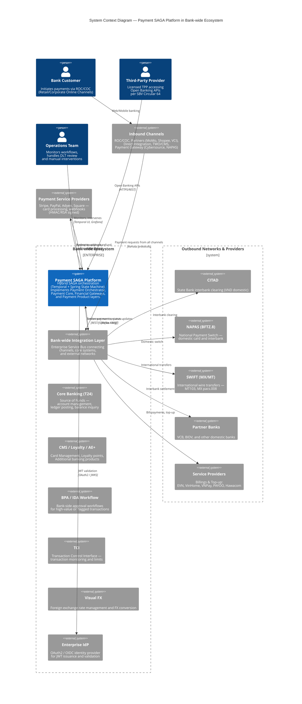
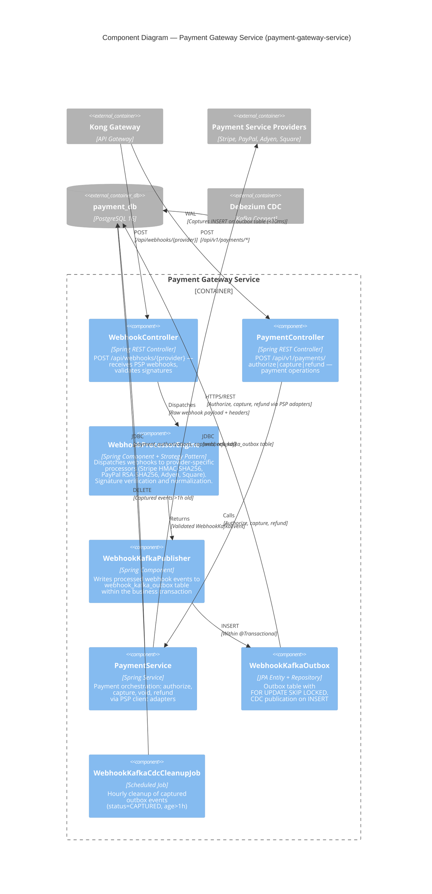

# II.2 High-level Architecture

[< Back to Index](../DAB_Payment_SAGA_Platform.md) | [← Previous: II.1 Key Design Concerns](02-key-design-concerns.md)

---

The architecture is described using the **C4 model** at three levels of abstraction, preceded by an **Enterprise Architecture Context** diagram showing how the Payment SAGA Platform fits within the bank-wide payment ecosystem.

## Enterprise Architecture Context

The following diagram shows the bank-wide payment enterprise architecture. The **Payment SAGA Platform** (highlighted in the center) implements the Payment Orchestrator, Payment Core, Financial Gateways, and Payment Product layers.

```mermaid
flowchart LR
    subgraph Channels_Left["INBOUND CHANNELS"]
        direction TB
        ROC["Channels<br/>ROC / COC"]
        OB_CH["Open Banking<br/>API"]
        DI["Channels<br/>Direct Integration"]
        TWO["Channels<br/>TWO / CMS"]
        Partners["Partners<br/><small>ERP, C-CASH, MISA,<br/>MoMo, Shopee,<br/>VCI, VND, SSI,<br/>DNSE, VPS</small>"]
        PG_CH["Channels<br/>Payment Gateway<br/><small>Cybersource, NAPAS</small>"]
    end

    subgraph ESB_Left["BANK-WIDE<br/>INTEGRATION<br/>LAYER"]
        direction TB
        ESB_L["ESB /<br/>API Gateway"]
    end

    subgraph PaymentPlatform["PAYMENT PLATFORM"]
        direction TB

        subgraph FinGW["Financial Gateways"]
            direction LR
            PNM["Payment Network<br/>Management"]
            NR["Network<br/>Routing"]
            MF["Messaging<br/>Formatting"]
            CL["Clearing<br/>Limit"]
        end

        subgraph PayProduct["Payment Product"]
            direction LR
            subgraph DP["Direct Payment"]
                PP["Payment Portal"]
                DD["Direct Debit"]
                IP["Instant Payment"]
            end
            subgraph FR["Features Rich"]
                Billings["Billings"]
                FXTT["FXTT"]
                Schedule["Schedule"]
                Others["Others"]
            end
        end

        subgraph PayOrch["Payment Orchestrator"]
            direction LR
            PI["Payment Init"]
            OE["Orchestration<br/>Engine"]
            DC["Data Converter"]
        end

        subgraph PayCore["Payment Core"]
            direction TB
            subgraph Preparing["Preparing (pre-processing)"]
                AM["Acceptance &<br/>Mapping"]
                DP2["Deduplication &<br/>Prioritising"]
                BV["Business<br/>Validations"]
                FRF["Fraud &<br/>Risk Filters"]
            end
            subgraph Processing["Processing"]
                FundRes["Fund<br/>Reservation"]
                FXC["FX<br/>Conversion"]
                FPS["Fee & Posting<br/>Scheme"]
                RS["Routing &<br/>Settlement"]
            end
            subgraph Finalizing["Finalizing (post-processing)"]
                AR["Automated<br/>Repair"]
                Clearing["Clearing"]
                Interfacing["Interfacing"]
                HK["Housekeeping"]
            end
        end
    end

    subgraph ESB_Right["BANK-WIDE<br/>INTEGRATION<br/>LAYER"]
        direction TB
        ESB_R["ESB /<br/>API Gateway"]
    end

    subgraph Outbound_Right["OUTBOUND"]
        direction TB
        subgraph PayNetworks["Payment Networks"]
            CITAD["CITAD"]
            NAPAS["NAPAS<br/>(BFTZ.8)"]
            SWIFT["SWIFT<br/>(MX/MT)"]
            VCB["VCB"]
            BIDV["BIDV"]
        end
        subgraph SvcProviders["Service Providers<br/>(Billings, Top-up)"]
            EVN["EVN"]
            VinHome["VinHome /<br/>Vinschool"]
            VNPay["VNPay"]
            PAYOO["PAYOO"]
        end
    end

    subgraph BankInfra["BANK INFRASTRUCTURE"]
        direction LR
        ESB_Bottom["Bank-wide Integration Layer"]
        BPA["BPA / IDA<br/>Workflow"]
        TCI["TCI"]
        VFX["Visual FX"]
        subgraph SOF["Source of Funds"]
            T24["T24"]
            CMS["CMS"]
            Loyalty["Loyalty"]
            AEPlus["AE+"]
        end
    end

    Channels_Left --> ESB_Left --> PaymentPlatform
    PaymentPlatform --> ESB_Right --> Outbound_Right
    PaymentPlatform <--> BankInfra

    style PaymentPlatform fill:#FFF0F0,stroke:#8B0000,stroke-width:3px,stroke-dasharray:8
    style FinGW fill:#E8E0F0,stroke:#4B0082
    style PayProduct fill:#E8E0F0,stroke:#4B0082
    style PayOrch fill:#E8E0F0,stroke:#4B0082
    style PayCore fill:#E8E0F0,stroke:#4B0082
    style Preparing fill:#D8D0E8,stroke:#4B0082
    style Processing fill:#D8D0E8,stroke:#4B0082
    style Finalizing fill:#D8D0E8,stroke:#4B0082
    style ESB_Left fill:#8B0000,stroke:#8B0000,color:#FFFFFF
    style ESB_Right fill:#8B0000,stroke:#8B0000,color:#FFFFFF
    style BankInfra fill:#F5F0F0,stroke:#8B0000
```

## EA → Payment SAGA Platform Component Mapping

The following table maps each Enterprise Architecture component to its implementation in the Payment SAGA Platform:

| EA Layer | EA Component | SAGA Platform Component | Status |
|---|---|---|---|
| **Payment Orchestrator** | Payment Init | `PaymentController` — REST API entry point (`POST /api/v1/payments`) | Implemented |
| **Payment Orchestrator** | Orchestration Engine | `PaymentSagaWorkflowImpl` (Temporal) + `PaymentStateMachineConfig` (Spring SM) | Implemented |
| **Payment Orchestrator** | Data Converter | `DataActivities` + Jackson ObjectMapper serialization | Implemented |
| **Payment Core — Preparing** | Acceptance & Mapping | `Order Service` — order validation, request mapping | Implemented |
| **Payment Core — Preparing** | Deduplication & Prioritising | `PaymentRouter` (customer-hash sharding, 4 priorities) + `WebhookIdempotencyService` | Implemented |
| **Payment Core — Preparing** | Business Validations | `Order Service` — business rule validation, amount/currency checks | Implemented |
| **Payment Core — Preparing** | Fraud & Risk Filters | `com.payment.saga.core.preparing.fraud` — stub implementation with `fraud_screening_results` and `fraud_alerts` entities (V15). Also delegated to PSP fraud engines. | Stub + Entities |
| **Payment Core — Processing** | Fund Reservation | `Inventory Service` — inventory reservation with TTL and optimistic locking | Implemented |
| **Payment Core — Processing** | FX Conversion | `com.payment.saga.core.processing.fx` — stub implementation with `fx_rates` and `currency_conversions` entities (V16). Future integration with Visual FX / Core Banking. | Stub + Entities |
| **Payment Core — Processing** | Fee & Posting Scheme | `Payment Gateway Service` — authorize and capture via PSP APIs | Implemented |
| **Payment Core — Processing** | Routing & Settlement | `PaymentRouter` (36 task queues) + PSP settlement (Stripe/PayPal/Adyen/Square) | Implemented |
| **Payment Core — Finalizing** | Automated Repair | LIFO compensation stack + DLT (`webhook.payment.events.DLT`) for manual review | Implemented |
| **Payment Core — Finalizing** | Clearing | `com.payment.saga.core.finalizing.clearing` — stub implementation with `clearing_batches`, `clearing_records`, and `settlement_schedules` entities (V17). Post-capture reconciliation via domain events. | Stub + Entities |
| **Payment Core — Finalizing** | Interfacing | CDC Outbox → Debezium → Kafka → downstream event consumers | Implemented |
| **Payment Core — Finalizing** | Housekeeping | `WebhookKafkaCdcCleanupJob` (hourly), audit retention (7-year trigger-protected) | Implemented |
| **Financial Gateways** | Payment Network Management | `Payment Gateway Service` — PSP adapters (Stripe, PayPal, Adyen, Square). `network_status` entity added (V6). | Implemented |
| **Financial Gateways** | Network Routing | `WebhookProcessorEngine` — provider-specific webhook routing and dispatch | Implemented |
| **Financial Gateways** | Messaging Formatting | Jackson serialization, webhook event mapping, `WebhookKafkaEvent` DTO | Implemented |
| **Financial Gateways** | Clearing Limit | `clearing_limits` entity added (V6). PSP-enforced authorization limits + application-level amount validation. | Stub + Entities |
| **Payment Product** | Direct Payment — Portal | REST APIs via Kong (`/api/v1/payments`, `/api/v1/orders`) | Implemented |
| **Payment Product** | Direct Payment — Direct Debit | `com.payment.saga.product.debit` — DebitRequest, DebitResult, DebitWorkflow | Implemented |
| **Payment Product** | Direct Payment — Instant Payment | `com.payment.saga.product.instant` — InstantPaymentService interface, DTOs. Routes via NAPAS/CITAD. | Stub |
| **Payment Product** | Open Banking | `Open Banking API` module — SBV Circular 64, TPP tiering, consent, SCA | Implemented |
| **Payment Product** | Features Rich (Billings, FXTT, Schedule) | Not in v1.0 scope — future product modules | Planned |
| **Bank-wide Integration** | ESB / Integration Layer | Kong API Gateway (north-south) + Istio Service Mesh (east-west) | Implemented |
| **Bank Infrastructure** | Source of Funds (T24, CMS, Loyalty, AE+) | Out of scope — future integration via Bank-wide Integration Layer | Out of Scope |
| **Bank Infrastructure** | BPA / IDA Workflow | Out of scope — bank-side approval workflows | Out of Scope |
| **Bank Infrastructure** | TCI | Out of scope — transaction control interface | Out of Scope |
| **Outbound** | Payment Networks (CITAD, NAPAS, SWIFT) | Out of scope — future via Financial Gateways layer | Out of Scope |
| **Outbound** | Service Providers (EVN, VNPay, PAYOO) | Out of scope — future Billings module | Out of Scope |

## C4 Level 1 — System Context Diagram

Shows the Payment SAGA Platform positioned within the bank-wide ecosystem, with all surrounding systems from the Enterprise Architecture.

## C4 Level 2 — Container Diagram

Shows the internal containers organized by EA layers: Payment Product, Payment Orchestrator, Payment Core (Preparing → Processing → Finalizing), and Financial Gateways.

```mermaid
C4Container
    title Container Diagram — Payment SAGA Platform (aligned to EA layers)

    System_Ext(esb, "Bank-wide Integration Layer", "ESB / API Gateway")
    System_Ext(psp, "Payment Service Providers", "Stripe, PayPal, Adyen, Square")
    System_Ext(idp, "Enterprise IdP", "OAuth2 / JWKS")

    Container_Boundary(edge, "Edge Layer (AWS)") {
        Container(waf, "AWS WAF + Shield + ALB", "AWS Managed", "DDoS protection, OWASP rules,<br/>IP reputation filtering,<br/>SSL termination, health checks")
    }

    Container_Boundary(platform, "Payment SAGA Platform") {

        Container_Boundary(payProduct, "Payment Product Layer") {
            Container(kong, "Kong Ingress Controller", "Kong 3.4", "API Gateway: JWT auth, rate limiting<br/>(100/min payments, 1000/min global),<br/>security headers, correlation ID,<br/>webhook routing.<br/>Exposes Direct Payment and<br/>Open Banking product APIs.")
            Container(openBanking, "Open Banking API", "Java 21 / Spring Boot 3.2.1 / Port 8085", "SBV Circular 64: TPP Tier 1-3 access,<br/>consent management, SCA.<br/>Payment initiation and account info APIs.<br/>2-10 pods (HPA)")
        }

        Container_Boundary(payOrchestrator, "Payment Orchestrator Layer") {
            Container(orchestrator, "SAGA Orchestrator", "Java 21 / Spring Boot 3.2.1 / Port 9090", "Payment Init + Orchestration Engine<br/>+ Data Converter.<br/>Temporal workflows, Spring State Machine,<br/>Kafka consumer, PaymentRouter<br/>(36 sharded queues). 8-50 pods (HPA)")
        }

        Container_Boundary(payCore, "Payment Core Layer") {
            Container(orderSvc, "Order Service", "Java 21 / Spring Boot 3.2.1 / Port 8081", "PREPARING: Acceptance & Mapping,<br/>Business Validations.<br/>Order lifecycle: validation, creation,<br/>status management. 2 replicas")
            Container(inventorySvc, "Inventory Service", "Java 21 / Spring Boot 3.2.1 / Port 8082", "PROCESSING: Fund Reservation.<br/>Stock management: reservation with TTL,<br/>release, confirmation.<br/>Optimistic locking. 2 replicas")
            Container(paymentSvc, "Payment Gateway Service", "Java 21 / Spring Boot 3.2.1 / Port 8083", "PROCESSING: Fee & Posting, Routing.<br/>FINALIZING: Interfacing (CDC outbox).<br/>Authorize, capture, void, refund via PSPs.<br/>Webhook reception. 2 replicas")
        }

        Container_Boundary(finGateways, "Financial Gateways Layer") {
            Container(webhookEngine, "Webhook Processor Engine", "Spring Component (in Payment Gateway)", "Network Routing + Messaging Formatting.<br/>Provider-specific processors:<br/>Stripe (HMAC-SHA256), PayPal (RSA-SHA256),<br/>Adyen, Square.<br/>Signature verification and normalization.")
            Container(cdcOutbox, "CDC Outbox Pipeline", "Debezium 2.5 / Kafka Connect", "Interfacing: webhook_kafka_outbox →<br/>PostgreSQL WAL → Debezium → Kafka.<br/><10ms latency. EventRouter SMT.")
        }

        Container_Boundary(infra, "Platform Infrastructure") {
            Container(temporal, "Temporal Server", "Temporal 1.22.3 / gRPC 7233", "Durable workflow execution:<br/>512 history shards.<br/>Frontend(3), History(4),<br/>Matching(3), Worker(2)")
            ContainerQueue(kafka, "Apache Kafka", "Kafka 3.6 / MSK", "Event streaming: 8 topics,<br/>12 partitions max. LZ4 compression.<br/>Webhook events, domain events, DLT")
            Container(redis, "Redis", "Redis 7 / ElastiCache", "Idempotency keys<br/>(Deduplication & Prioritising),<br/>distributed locking, caching.<br/>3-node multi-AZ")
            Container(istio, "Istio Service Mesh", "Istio 1.20 / Envoy", "mTLS STRICT, AuthorizationPolicy, circuit breaking, B3 tracing")
        }

        Container_Boundary(dataLayer, "Data Layer (Database-per-Service)") {
            ContainerDb(sagaDb, "saga_db", "PostgreSQL 16 / Port 5436", "payment_requests, state_machine_context,<br/>outbox_events, event_store.<br/>RLS enabled")
            ContainerDb(orderDb, "order_db", "PostgreSQL 16 / Port 5432", "orders, order_items, customers")
            ContainerDb(inventoryDb, "inventory_db", "PostgreSQL 16 / Port 5434", "products, inventory_reservations")
            ContainerDb(paymentDb, "payment_db", "PostgreSQL 16 / Port 5435", "payment_authorizations, captures,<br/>refunds, webhook_kafka_outbox.<br/>CDC publication enabled")
        }
    }

    Rel(esb, waf, "Payment requests from channels", "HTTPS")
    Rel(psp, kong, "Webhook POST (signed)", "HTTPS")
    Rel(waf, kong, "Routes via ALB", "HTTPS")

    Rel(kong, orchestrator, "REST/JSON", "Payment SAGA API — Payment Init")
    Rel(kong, openBanking, "REST/JSON", "Open Banking API — TPP access")
    Rel(kong, paymentSvc, "REST/JSON", "Webhook reception")
    Rel(kong, idp, "JWKS", "JWT validation")

    Rel(orchestrator, orderSvc, "Feign REST", "Validate, complete, cancel — Preparing phase")
    Rel(orchestrator, inventorySvc, "Feign REST", "Reserve, release — Processing phase")
    Rel(orchestrator, paymentSvc, "Feign REST", "Authorize, capture, void, refund — Processing phase")
    Rel(orchestrator, temporal, "gRPC", "Start/signal/query workflows")
    Rel(orchestrator, sagaDb, "JDBC", "Payment requests, state machine context")
    Rel(orchestrator, redis, "Lettuce", "Idempotency, caching")
    Rel(kafka, orchestrator, "Kafka Consumer", "Webhook events → Workflow signals")

    Rel(paymentSvc, webhookEngine, "Dispatches", "Raw webhook payloads")
    Rel(webhookEngine, cdcOutbox, "Writes to outbox", "Within @Transactional")
    Rel(cdcOutbox, paymentDb, "PostgreSQL WAL", "CDC capture")
    Rel(cdcOutbox, kafka, "Kafka Producer", "Publishes normalized events")

    Rel(paymentSvc, psp, "HTTPS/REST", "Authorize, capture, refund")
    Rel(orderSvc, orderDb, "JDBC", "Read/write orders")
    Rel(inventorySvc, inventoryDb, "JDBC", "Read/write inventory")
    Rel(paymentSvc, paymentDb, "JDBC", "Read/write payments, outbox")

    Rel(paymentSvc, esb, "Settlement events", "Kafka → ESB adapter")

    UpdateLayoutConfig($c4ShapeInRow="4", $c4BoundaryInRow="1")
```

## C4 Level 3 — Component Diagram (SAGA Orchestrator)

Zooms into the SAGA Orchestrator container to show its internal components.

```mermaid
C4Component
    title Component Diagram — SAGA Orchestrator (payment-saga-orchestrator)

    Container_Ext(kong, "Kong Gateway", "API Gateway")
    Container_Ext(orderSvc, "Order Service", "Port 8081")
    Container_Ext(inventorySvc, "Inventory Service", "Port 8082")
    Container_Ext(paymentSvc, "Payment Gateway Service", "Port 8083")
    Container_Ext(temporal, "Temporal Server", "gRPC 7233")
    ContainerDb_Ext(sagaDb, "saga_db", "PostgreSQL 16")
    ContainerQueue_Ext(kafka, "Kafka", "webhook.payment.events")
    Container_Ext(redis, "Redis", "Cache / Idempotency")

    Container_Boundary(orchestrator, "SAGA Orchestrator") {
        Component(paymentController, "PaymentController", "Spring REST Controller", "POST /api/v1/payments —<br/>accepts payment requests,<br/>starts Temporal workflows,<br/>returns workflow execution ID")
        Component(paymentRouter, "PaymentRouter", "Spring Component", "Calculates priority<br/>(CRITICAL/HIGH/NORMAL/LOW)<br/>and shard ID from customerId hash.<br/>Routes to 1 of 36 task queues")
        Component(workflow, "PaymentSagaWorkflowImpl", "Temporal Workflow", "5-step SAGA: Validate → Reserve →<br/>Authorize → Capture → Complete.<br/>LIFO compensation stack.<br/>Signal handlers for external webhooks")
        Component(paymentActivities, "PaymentActivities", "Temporal Activities", "Calls Order/Inventory/Payment<br/>services via Feign REST.<br/>Retry: 3 attempts, 1-30s backoff")
        Component(stateMachineActivities, "StateMachineActivities", "Temporal Local Activities", "Transitions Spring State Machine:<br/>10 forward states + compensation states.<br/>Publishes domain events to outbox")
        Component(dataActivities, "DataActivities", "Temporal Activities", "CRUD on payment_requests,<br/>state_machine_context.<br/>Keeps workflow state minimal —<br/>data lives in DB")
        Component(stateMachineConfig, "PaymentStateMachineConfig", "Spring State Machine", "Defines states (PENDING→COMPLETED),<br/>events, guards, transition actions.<br/>Factory creates per-workflow instances")
        Component(webhookConsumer, "WebhookEventConsumer", "Kafka Listener", "Consumes webhook.payment.events<br/>(3 threads). Manual ack,<br/>5 retries with exponential backoff (1-30s)")
        Component(idempotencyService, "WebhookIdempotencyService", "Spring Service", "Redis-based deduplication by eventId.<br/>Prevents duplicate webhook processing")
        Component(correlationService, "WorkflowCorrelationService", "Spring Service", "Maps orderId/authId/captureId<br/>to Temporal workflowId<br/>for signal delivery")
        Component(actionDispatcher, "WorkflowActionDispatcher", "Spring Service", "Dispatches signals to running workflows:<br/>externalPaymentConfirmed,<br/>externalCaptureConfirmed,<br/>externalPaymentFailed, disputeOpened")
        Component(shardedWorkerFactory, "ShardedWorkerFactory", "Spring Component", "Registers Temporal workers for each<br/>shard-priority combination.<br/>36 task queues, configurable<br/>concurrency per priority")
        Component(feignClients, "Feign Clients", "Spring Cloud OpenFeign", "order-service, inventory-service,<br/>payment-gateway-service.<br/>Profile-based discovery<br/>(local/docker/k8s/istio)")
        Component(outboxPublisher, "OutboxPublisher", "Spring Component", "Writes domain events to outbox_events<br/>table within business transaction.<br/>Debezium CDC captures for Kafka delivery")
    }

    Rel(kong, paymentController, "REST/JSON", "POST /api/v1/payments")
    Rel(paymentController, paymentRouter, "Calls", "Determine task queue")
    Rel(paymentController, temporal, "gRPC", "Start workflow on routed queue")

    Rel(workflow, paymentActivities, "Executes", "Business operations")
    Rel(workflow, stateMachineActivities, "Executes", "State transitions (local)")
    Rel(workflow, dataActivities, "Executes", "DB read/write")

    Rel(paymentActivities, feignClients, "Delegates to", "REST calls")
    Rel(feignClients, orderSvc, "Feign REST", "Order, Inventory, Payment services")

    Rel(stateMachineActivities, stateMachineConfig, "Uses", "Get/transition state")
    Rel(stateMachineActivities, outboxPublisher, "Publishes", "Domain events to outbox")
    Rel(dataActivities, sagaDb, "JDBC", "payment_requests, state_machine_context")
    Rel(outboxPublisher, sagaDb, "JDBC", "INSERT outbox_events")

    Rel(kafka, webhookConsumer, "Consumes", "Webhook events")
    Rel(webhookConsumer, idempotencyService, "Checks", "Duplicate detection")
    Rel(idempotencyService, redis, "GET/SET", "eventId dedup keys")
    Rel(webhookConsumer, correlationService, "Resolves", "orderId → workflowId")
    Rel(correlationService, sagaDb, "SELECT", "Lookup by orderId/authId")
    Rel(webhookConsumer, actionDispatcher, "Dispatches", "Signal payload")
    Rel(actionDispatcher, temporal, "gRPC Signal", "externalPaymentConfirmed, etc.")

    Rel(shardedWorkerFactory, temporal, "Registers", "36 workers across 4 priorities")

    UpdateLayoutConfig($c4ShapeInRow="4", $c4BoundaryInRow="1")
```

## C4 Level 3 — Component Diagram (Payment Gateway Service)

Zooms into the Payment Gateway Service to show the webhook processing and CDC outbox pipeline.

**Module Dependency Rules:**
- **API modules** (`*-api`) contain only DTOs and interfaces — no implementation
- **Service modules** depend on their own API module and `payment-saga-common`, never on each other's implementations
- **Orchestrator** depends on all API modules to call services via Feign clients

## Change Summary

| Item | Status | Description |
|---|---|---|
| Platform | **NEW** | Payment SAGA Platform v1.0 — greenfield implementation |
| Architecture Pattern | **NEW** | Hybrid SAGA (Temporal + Spring State Machine) |
| Outbox Pattern | **NEW** | Debezium CDC replaces traditional polling outbox |
| Webhook Pipeline | **NEW** | Webhook → Outbox → CDC → Kafka → Consumer → Workflow Signal |
| Sharding | **NEW** | Customer-hash sharding with priority-based routing (36 queues) |
| Open Banking | **NEW** | SBV Circular 64 compliant TPP APIs |
| Service Mesh | **NEW** | Istio mTLS + AuthorizationPolicy |
| API Gateway | **NEW** | Kong Ingress Controller with plugins |

## Technology Stack Summary

| Category | Technology | Version | Rationale |
|---|---|---|---|
| **Language** | Java | 21 LTS | Virtual Threads (Project Loom), 8+ year LTS support |
| **Framework** | Spring Boot | 3.2.1 | Native GraalVM path, Spring Cloud Kubernetes |
| **Workflow Engine** | Temporal | 1.22.3 | Durable execution, native compensation, signal/query |
| **State Machine** | Spring State Machine | 4.0.0 | Guard conditions, domain events, audit integration |
| **Messaging** | Apache Kafka | 3.6 | Partitioned event streaming, consumer groups |
| **CDC** | Debezium | 2.5 | PostgreSQL WAL-based CDC, EventRouter SMT |
| **Database** | PostgreSQL | 16 | JSONB, RLS, logical replication, Flyway migrations |
| **Cache** | Redis | 7 | Idempotency keys, distributed locking |
| **API Gateway** | Kong | 3.4 | Ingress routing, rate limiting, JWT validation |
| **Service Mesh** | Istio | 1.20 | mTLS, AuthorizationPolicy, circuit breaking |
| **Container Orchestration** | AWS EKS | 1.28 | Managed Kubernetes, HPA, PDB |
| **Migration** | Flyway | 10.4.1 | Versioned schema migrations (saga_db V1,V3–V17; order_db V1; inventory_db V1; payment_db V1–V6) |
| **Observability** | Micrometer + Prometheus + Grafana + Zipkin | — | Metrics, dashboards, distributed tracing |
| **Build** | Maven | 3.9 | Multi-module project, dependency management |
| **Testing** | JUnit 5 + Mockito + TestContainers | — | 703 tests (34 skipped), real PostgreSQL/Kafka in tests |

---

**Previous:** [← II.1 Key Design Concerns](02-key-design-concerns.md) | **Next:** [II.3 Data Design →](04-data-design.md)
