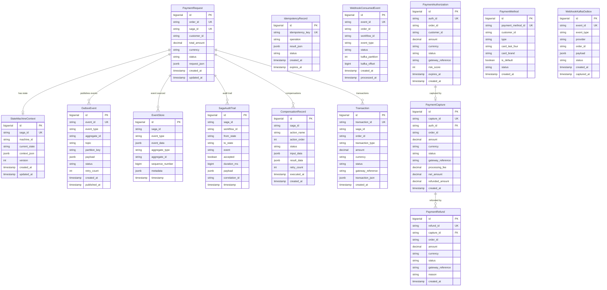
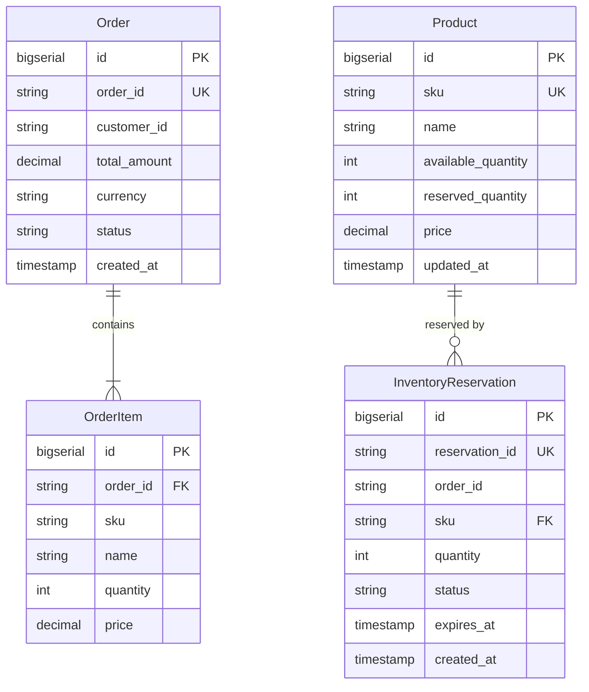
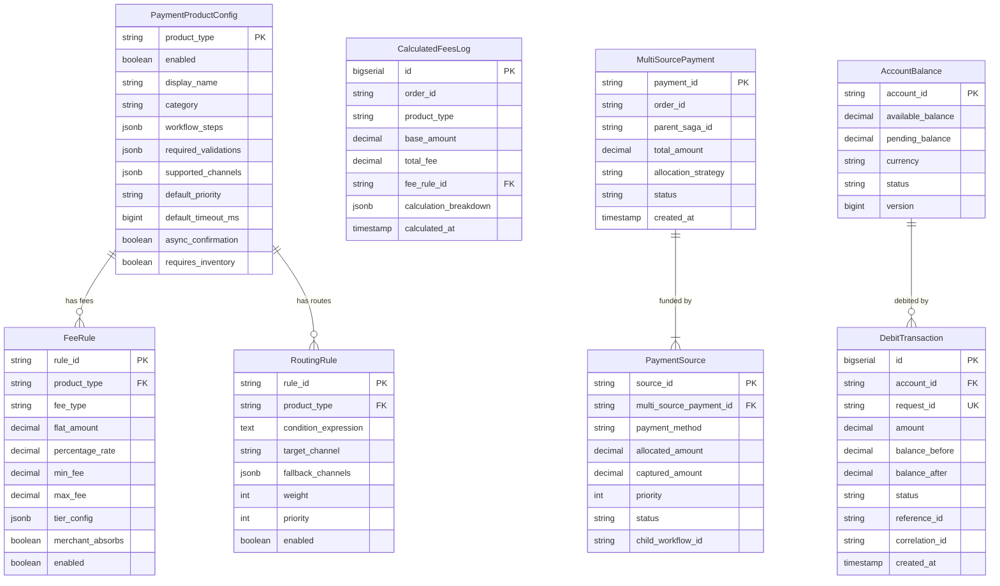
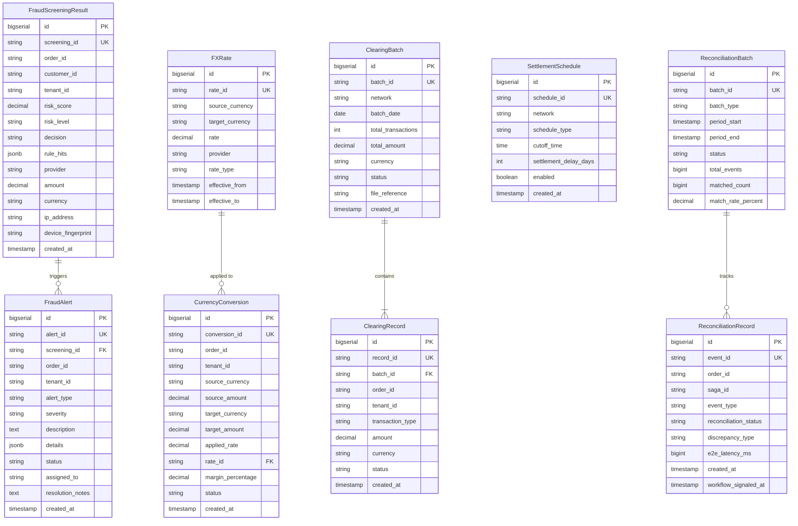
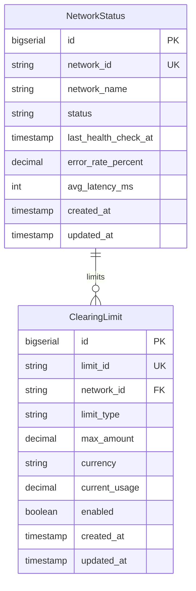

# II.3 Data Design

[< Back to Index](../DAB_Payment_SAGA_Platform.md) | [← Previous: II.2 High-level Architecture](03-high-level-architecture.md)

---

## Entity and Domain Modeling

### Core Payment Flow (saga_db + payment_db)



### Order & Inventory (order_db + inventory_db)



### Payment Product Funnel (saga_db)



### EA Core Domain Entities (saga_db)



### Financial Gateways Network Management (payment_db)



---

## Schema Detailed Design

| Database            | Port     | Tables                                                                                                                                                                                                                                                                                                                                                                                                                                                                                                                             | Migration Range                            | Key Features                                                                                                                                                     |
| ------------------- | -------- | ---------------------------------------------------------------------------------------------------------------------------------------------------------------------------------------------------------------------------------------------------------------------------------------------------------------------------------------------------------------------------------------------------------------------------------------------------------------------------------------------------------------------------------- | ------------------------------------------ | ---------------------------------------------------------------------------------------------------------------------------------------------------------------- |
| **saga_db**         | 5436     | payment_requests, state_machine_context, outbox_events, event_store, saga_audit_trail, idempotency_records, transactions, compensation_records, webhook_consumed_events, payment_product_configs, fee_rules, routing_rules, multi_source_payments, payment_sources, calculated_fees_log, product_payment_data, account_balance, debit_transaction, reconciliation_records, reconciliation_batches, fraud_screening_results, fraud_alerts, fx_rates, currency_conversions, clearing_batches, clearing_records, settlement_schedules | V1, V3–V17 (V2, V12 intentionally skipped) | RLS policies, event sourcing, JSONB payloads, CDC replication. V6: product funnel. V7: debit. V13: reconciliation. V15: fraud. V16: FX. V17: clearing/settlement |
| **order_db**        | 5432     | orders, order_items, customers                                                                                                                                                                                                                                                                                                                                                                                                                                                                                                     | V1                                         | Composite indexes on customer_id + status                                                                                                                        |
| **inventory_db**    | 5434     | products, inventory_reservations                                                                                                                                                                                                                                                                                                                                                                                                                                                                                                   | V1                                         | Optimistic locking, reservation TTL                                                                                                                              |
| **payment_db**      | 5435     | payment_methods, payment_authorizations, payment_captures, payment_refunds, webhook_events, webhook_outbox, webhook_idempotency, error_code_mappings, webhook_kafka_outbox, network_status, clearing_limits                                                                                                                                                                                                                                                                                                                        | V1–V6                                      | CDC publication, FOR UPDATE SKIP LOCKED. V2: webhook system. V4: Kafka outbox. V5: CDC replication. V6: network management                                       |
| **open_banking_db** | (shared) | consents, third_party_providers, data_access_audit                                                                                                                                                                                                                                                                                                                                                                                                                                                                                 | V10–V12                                    | Consent management, TPP tiering, data access audit                                                                                                               |

### Migration Version Inventory

| Database            | Version | Name                            | Tables Created                                                                                                                       |
| ------------------- | ------- | ------------------------------- | ------------------------------------------------------------------------------------------------------------------------------------ |
| **saga_db**         | V1      | initial_schema                  | state_machine_context, event_store, saga_audit_trail, idempotency_records, payment_requests, transactions, compensation_records      |
| **saga_db**         | V3      | sample_data                     | (seed data only)                                                                                                                     |
| **saga_db**         | V4      | outbox_events                   | outbox_events                                                                                                                        |
| **saga_db**         | V5      | webhook_consumed_events         | webhook_consumed_events                                                                                                              |
| **saga_db**         | V6      | payment_product_funnel          | payment_product_configs, fee_rules, routing_rules, multi_source_payments, payment_sources, calculated_fees_log, product_payment_data |
| **saga_db**         | V7      | debit_tables                    | account_balance, debit_transaction                                                                                                   |
| **saga_db**         | V8      | audit_compliance                | (audit retention policies)                                                                                                           |
| **saga_db**         | V9      | correlation_id_tracking         | (correlation tracking indexes)                                                                                                       |
| **saga_db**         | V10     | row_level_security              | (RLS policies)                                                                                                                       |
| **saga_db**         | V11     | cdc_replication_setup           | (Debezium CDC publication)                                                                                                           |
| **saga_db**         | V13     | reconciliation_tables           | reconciliation_records, reconciliation_batches                                                                                       |
| **saga_db**         | V14     | outbox_performance_optimization | (indexes, partitioning)                                                                                                              |
| **saga_db**         | V15     | fraud_detection                 | fraud_screening_results, fraud_alerts                                                                                                |
| **saga_db**         | V16     | fx_conversion                   | fx_rates, currency_conversions                                                                                                       |
| **saga_db**         | V17     | clearing_settlement             | clearing_batches, clearing_records, settlement_schedules                                                                             |
| **order_db**        | V1      | initial_schema                  | orders, order_items, customers                                                                                                       |
| **inventory_db**    | V1      | initial_schema                  | products, inventory_reservations                                                                                                     |
| **payment_db**      | V1      | initial_schema                  | payment_methods, payment_authorizations, payment_captures, payment_refunds                                                           |
| **payment_db**      | V2      | webhook_system                  | webhook_events, webhook_outbox, webhook_idempotency, error_code_mappings                                                             |
| **payment_db**      | V3      | webhook_seed_data               | (seed data only)                                                                                                                     |
| **payment_db**      | V4      | webhook_kafka_outbox            | webhook_kafka_outbox                                                                                                                 |
| **payment_db**      | V5      | cdc_replication_setup           | (Debezium CDC publication)                                                                                                           |
| **payment_db**      | V6      | network_management              | network_status, clearing_limits                                                                                                      |
| **open_banking_db** | V10     | consent_management              | consents                                                                                                                             |
| **open_banking_db** | V11     | tpp_registration                | third_party_providers                                                                                                                |
| **open_banking_db** | V12     | data_access_audit               | data_access_audit                                                                                                                    |

**Intentionally skipped versions:** V2 and V12 in saga_db (reserved for future use).

---

## Table Detailed Design

### Table: `payment_requests` (saga_db — V1)

| Column         | Type          | Constraints                 | Description              |
| -------------- | ------------- | --------------------------- | ------------------------ |
| `id`           | BIGSERIAL     | PK                          | Primary key              |
| `order_id`     | VARCHAR(36)   | NOT NULL, UNIQUE            | Order reference          |
| `saga_id`      | VARCHAR(36)   | NOT NULL, UNIQUE            | Saga workflow reference  |
| `customer_id`  | VARCHAR(36)   | NOT NULL                    | Customer reference       |
| `total_amount` | DECIMAL(15,2) | NOT NULL                    | Payment amount           |
| `currency`     | VARCHAR(3)    | NOT NULL, DEFAULT 'USD'     | ISO 4217 currency        |
| `item_count`   | INTEGER       | NOT NULL, DEFAULT 0         | Number of order items    |
| `request_json` | JSONB         | NOT NULL                    | Full request (for audit) |
| `status`       | VARCHAR(50)   | NOT NULL, DEFAULT 'PENDING' | Current status           |
| `created_at`   | TIMESTAMPTZ   | NOT NULL, DEFAULT NOW()     | Creation timestamp       |
| `updated_at`   | TIMESTAMPTZ   | NOT NULL, DEFAULT NOW()     | Last update (trigger)    |

**Indexes:** `idx_payment_req_order_id`, `idx_payment_req_saga_id`, `idx_payment_req_customer`, `idx_payment_req_status`, `idx_payment_req_created`

### Table: `state_machine_context` (saga_db — V1)

| Column          | Type         | Constraints             | Description               |
| --------------- | ------------ | ----------------------- | ------------------------- |
| `id`            | BIGSERIAL    | PK                      | Primary key               |
| `saga_id`       | VARCHAR(36)  | NOT NULL, UNIQUE        | Saga reference            |
| `machine_id`    | VARCHAR(100) | NOT NULL                | State machine instance ID |
| `current_state` | VARCHAR(50)  | NOT NULL                | Current PaymentState      |
| `context_json`  | JSONB        | NOT NULL, DEFAULT '{}'  | Transition context data   |
| `version`       | INTEGER      | NOT NULL, DEFAULT 0     | Optimistic lock version   |
| `created_at`    | TIMESTAMPTZ  | NOT NULL, DEFAULT NOW() | Creation timestamp        |
| `updated_at`    | TIMESTAMPTZ  | NOT NULL, DEFAULT NOW() | Last update (trigger)     |

### Table: `outbox_events` (saga_db — V4)

| Column          | Type         | Constraints                 | Description                    |
| --------------- | ------------ | --------------------------- | ------------------------------ |
| `id`            | BIGSERIAL    | PK                          | Primary key                    |
| `event_id`      | VARCHAR(36)  | NOT NULL, UNIQUE            | Deduplication key              |
| `event_type`    | VARCHAR(100) | NOT NULL                    | Domain event type              |
| `aggregate_id`  | VARCHAR(100) | NOT NULL                    | Saga/workflow ID               |
| `topic`         | VARCHAR(255) | NOT NULL                    | Kafka topic                    |
| `partition_key` | VARCHAR(100) |                             | Kafka partition key (order ID) |
| `payload`       | JSONB        | NOT NULL                    | Event payload                  |
| `status`        | VARCHAR(20)  | NOT NULL, DEFAULT 'PENDING' | PENDING / PUBLISHED / FAILED   |
| `retry_count`   | INTEGER      | NOT NULL, DEFAULT 0         | Publish attempts               |
| `error_message` | TEXT         |                             | Last error if failed           |
| `created_at`    | TIMESTAMP    | NOT NULL, DEFAULT NOW()     | Creation timestamp             |
| `published_at`  | TIMESTAMP    |                             | When published                 |
| `processed_at`  | TIMESTAMP    |                             | When Debezium captured         |

**CDC Configuration:** Publication for Debezium CDC. Partial indexes for PENDING and FAILED status queries.

### Table: `event_store` (saga_db — V1)

| Column            | Type         | Constraints             | Description                           |
| ----------------- | ------------ | ----------------------- | ------------------------------------- |
| `id`              | BIGSERIAL    | PK                      | Primary key                           |
| `saga_id`         | VARCHAR(36)  | NOT NULL                | Saga reference                        |
| `event_type`      | VARCHAR(100) | NOT NULL                | Event type                            |
| `event_data`      | JSONB        | NOT NULL                | Event payload                         |
| `aggregate_type`  | VARCHAR(100) | DEFAULT 'PaymentSaga'   | Aggregate root type                   |
| `aggregate_id`    | VARCHAR(36)  | NOT NULL                | Aggregate root ID                     |
| `sequence_number` | BIGINT       | NOT NULL                | Event sequence (UNIQUE per aggregate) |
| `metadata`        | JSONB        | DEFAULT '{}'            | Correlation, tracing info             |
| `timestamp`       | TIMESTAMPTZ  | NOT NULL, DEFAULT NOW() | Event timestamp                       |

### Table: `payment_authorizations` (payment_db — V1)

| Column                  | Type          | Constraints                  | Description                  |
| ----------------------- | ------------- | ---------------------------- | ---------------------------- |
| `id`                    | BIGSERIAL     | PK                           | Primary key                  |
| `auth_id`               | VARCHAR(36)   | NOT NULL, UNIQUE             | Authorization reference      |
| `order_id`              | VARCHAR(36)   | NOT NULL                     | Order reference              |
| `customer_id`           | VARCHAR(36)   | NOT NULL                     | Customer reference           |
| `payment_method_id`     | VARCHAR(36)   |                              | Payment method FK            |
| `amount`                | DECIMAL(15,2) | NOT NULL                     | Authorized amount            |
| `currency`              | VARCHAR(3)    | NOT NULL, DEFAULT 'USD'      | ISO 4217 currency            |
| `status`                | VARCHAR(20)   | NOT NULL, DEFAULT 'APPROVED' | APPROVED / CAPTURED / VOIDED |
| `gateway_reference`     | VARCHAR(255)  |                              | PSP reference ID             |
| `risk_score`            | INTEGER       |                              | Risk assessment score        |
| `three_d_secure_status` | VARCHAR(50)   |                              | 3D Secure result             |
| `decline_reason`        | VARCHAR(255)  |                              | Decline reason if rejected   |
| `expires_at`            | TIMESTAMPTZ   | NOT NULL                     | Authorization expiry         |
| `created_at`            | TIMESTAMPTZ   | NOT NULL, DEFAULT NOW()      | Creation timestamp           |

### Table: `payment_captures` (payment_db — V1)

| Column              | Type          | Constraints                           | Description                      |
| ------------------- | ------------- | ------------------------------------- | -------------------------------- |
| `id`                | BIGSERIAL     | PK                                    | Primary key                      |
| `capture_id`        | VARCHAR(36)   | NOT NULL, UNIQUE                      | Capture reference                |
| `auth_id`           | VARCHAR(36)   | NOT NULL, FK → payment_authorizations | Authorization reference          |
| `order_id`          | VARCHAR(36)   | NOT NULL                              | Order reference                  |
| `amount`            | DECIMAL(15,2) | NOT NULL                              | Captured amount                  |
| `currency`          | VARCHAR(3)    | NOT NULL, DEFAULT 'USD'               | ISO 4217 currency                |
| `status`            | VARCHAR(20)   | NOT NULL, DEFAULT 'COMPLETED'         | COMPLETED / FAILED               |
| `gateway_reference` | VARCHAR(255)  |                                       | PSP reference ID                 |
| `processing_fee`    | DECIMAL(15,2) |                                       | PSP fee                          |
| `net_amount`        | DECIMAL(15,2) |                                       | Amount after fees                |
| `refunded_amount`   | DECIMAL(15,2) | DEFAULT 0                             | Total refunded from this capture |
| `settlement_date`   | TIMESTAMPTZ   |                                       | Expected settlement date         |
| `created_at`        | TIMESTAMPTZ   | NOT NULL, DEFAULT NOW()               | Creation timestamp               |

### Table: `payment_refunds` (payment_db — V1)

| Column              | Type          | Constraints                     | Description                  |
| ------------------- | ------------- | ------------------------------- | ---------------------------- |
| `id`                | BIGSERIAL     | PK                              | Primary key                  |
| `refund_id`         | VARCHAR(36)   | NOT NULL, UNIQUE                | Refund reference             |
| `capture_id`        | VARCHAR(36)   | NOT NULL, FK → payment_captures | Capture reference            |
| `order_id`          | VARCHAR(36)   | NOT NULL                        | Order reference              |
| `amount`            | DECIMAL(15,2) | NOT NULL                        | Refund amount                |
| `currency`          | VARCHAR(3)    | NOT NULL, DEFAULT 'USD'         | ISO 4217 currency            |
| `status`            | VARCHAR(20)   | NOT NULL, DEFAULT 'COMPLETED'   | COMPLETED / PENDING / FAILED |
| `gateway_reference` | VARCHAR(255)  |                                 | PSP refund reference         |
| `reason`            | VARCHAR(255)  |                                 | Refund reason                |
| `created_at`        | TIMESTAMPTZ   | NOT NULL, DEFAULT NOW()         | Creation timestamp           |

**Indexes:** `idx_refund_id`, `idx_refund_capture`, `idx_refund_order`, `idx_refund_status`

### Table: `webhook_kafka_outbox` (payment_db — V4)

| Column        | Type         | Constraints                 | Description           |
| ------------- | ------------ | --------------------------- | --------------------- |
| `id`          | BIGSERIAL    | PK                          | Primary key           |
| `event_id`    | VARCHAR(100) | NOT NULL, UNIQUE            | PSP event ID          |
| `event_type`  | VARCHAR(100) | NOT NULL                    | Webhook event type    |
| `provider`    | VARCHAR(30)  | NOT NULL                    | PSP name              |
| `order_id`    | VARCHAR(50)  |                             | Extracted order ID    |
| `payload`     | JSONB        | NOT NULL                    | Full webhook body     |
| `status`      | VARCHAR(20)  | NOT NULL, DEFAULT 'PENDING' | CDC capture status    |
| `created_at`  | TIMESTAMPTZ  | NOT NULL, DEFAULT NOW()     | Creation timestamp    |
| `captured_at` | TIMESTAMPTZ  |                             | CDC capture timestamp |

**CDC Configuration:** `FOR UPDATE SKIP LOCKED` query for concurrent outbox processing. Publication: `CREATE PUBLICATION outbox_pub FOR TABLE webhook_kafka_outbox WITH (publish = 'insert');`

### Table: `inventory_reservations` (inventory_db — V1)

| Column           | Type        | Constraints             | Description                     |
| ---------------- | ----------- | ----------------------- | ------------------------------- |
| `id`             | BIGSERIAL   | PK                      | Primary key                     |
| `reservation_id` | VARCHAR(50) | NOT NULL, UNIQUE        | Reservation reference           |
| `order_id`       | VARCHAR(50) | NOT NULL                | Order reference                 |
| `sku`            | VARCHAR(50) | NOT NULL, FK → products | Product SKU                     |
| `quantity`       | INTEGER     | NOT NULL, CHECK > 0     | Reserved quantity               |
| `status`         | VARCHAR(20) | NOT NULL                | RESERVED / RELEASED / CONFIRMED |
| `expires_at`     | TIMESTAMPTZ | NOT NULL                | Auto-release time               |
| `created_at`     | TIMESTAMPTZ | NOT NULL, DEFAULT NOW() | Creation timestamp              |

### Table: `fraud_screening_results` (saga_db — V15)

| Column               | Type          | Constraints             | Description                    |
| -------------------- | ------------- | ----------------------- | ------------------------------ |
| `id`                 | BIGSERIAL     | PK                      | Primary key                    |
| `screening_id`       | VARCHAR(50)   | NOT NULL, UNIQUE        | Screening reference            |
| `order_id`           | VARCHAR(50)   | NOT NULL                | Order reference                |
| `saga_id`            | VARCHAR(50)   |                         | Saga workflow reference        |
| `customer_id`        | VARCHAR(50)   | NOT NULL                | Customer reference             |
| `tenant_id`          | VARCHAR(50)   | NOT NULL                | Tenant for RLS                 |
| `risk_score`         | DECIMAL(5,2)  | NOT NULL                | Risk score (0-100)             |
| `risk_level`         | VARCHAR(20)   | NOT NULL, CHECK         | LOW / MEDIUM / HIGH / CRITICAL |
| `decision`           | VARCHAR(20)   | NOT NULL, CHECK         | APPROVE / REVIEW / REJECT      |
| `rule_hits`          | JSONB         | DEFAULT '[]'            | Triggered fraud rules          |
| `provider`           | VARCHAR(50)   |                         | Fraud detection provider       |
| `amount`             | DECIMAL(19,4) | NOT NULL                | Transaction amount             |
| `currency`           | VARCHAR(3)    | NOT NULL                | ISO 4217 currency              |
| `ip_address`         | VARCHAR(45)   |                         | Client IP (IPv4/IPv6)          |
| `device_fingerprint` | VARCHAR(255)  |                         | Device fingerprint             |
| `created_at`         | TIMESTAMP     | NOT NULL, DEFAULT NOW() | Creation timestamp             |
| `updated_at`         | TIMESTAMP     | NOT NULL, DEFAULT NOW() | Last update                    |

**Indexes:** `idx_fraud_screening_order`, `idx_fraud_screening_customer`, `idx_fraud_screening_tenant`

### Table: `fraud_alerts` (saga_db — V15)

| Column             | Type         | Constraints                            | Description                     |
| ------------------ | ------------ | -------------------------------------- | ------------------------------- |
| `id`               | BIGSERIAL    | PK                                     | Primary key                     |
| `alert_id`         | VARCHAR(50)  | NOT NULL, UNIQUE                       | Alert reference                 |
| `screening_id`     | VARCHAR(50)  | NOT NULL, FK → fraud_screening_results | Screening reference             |
| `order_id`         | VARCHAR(50)  | NOT NULL                               | Order reference                 |
| `tenant_id`        | VARCHAR(50)  | NOT NULL                               | Tenant for RLS                  |
| `alert_type`       | VARCHAR(50)  | NOT NULL                               | Alert classification            |
| `severity`         | VARCHAR(20)  | NOT NULL, CHECK                        | LOW / MEDIUM / HIGH / CRITICAL  |
| `description`      | TEXT         |                                        | Alert description               |
| `details`          | JSONB        | DEFAULT '{}'                           | Additional details              |
| `status`           | VARCHAR(20)  | NOT NULL, DEFAULT 'OPEN', CHECK        | OPEN / INVESTIGATING / RESOLVED |
| `assigned_to`      | VARCHAR(100) |                                        | Assigned investigator           |
| `resolution_notes` | TEXT         |                                        | Resolution details              |
| `created_at`       | TIMESTAMP    | NOT NULL, DEFAULT NOW()                | Creation timestamp              |
| `updated_at`       | TIMESTAMP    | NOT NULL, DEFAULT NOW()                | Last update                     |

### Table: `fx_rates` (saga_db — V16)

| Column            | Type          | Constraints             | Description              |
| ----------------- | ------------- | ----------------------- | ------------------------ |
| `id`              | BIGSERIAL     | PK                      | Primary key              |
| `rate_id`         | VARCHAR(50)   | NOT NULL, UNIQUE        | Rate reference           |
| `source_currency` | VARCHAR(3)    | NOT NULL                | Source ISO 4217          |
| `target_currency` | VARCHAR(3)    | NOT NULL                | Target ISO 4217          |
| `rate`            | DECIMAL(18,8) | NOT NULL                | Exchange rate            |
| `provider`        | VARCHAR(50)   | NOT NULL, CHECK         | ECB / REUTERS / INTERNAL |
| `rate_type`       | VARCHAR(10)   | NOT NULL, CHECK         | BID / ASK / MID          |
| `effective_from`  | TIMESTAMP     | NOT NULL                | Rate validity start      |
| `effective_to`    | TIMESTAMP     |                         | Rate validity end        |
| `created_at`      | TIMESTAMP     | NOT NULL, DEFAULT NOW() | Creation timestamp       |

**Indexes:** `idx_fx_rates_currencies` (composite on source+target), `idx_fx_rates_effective`

### Table: `currency_conversions` (saga_db — V16)

| Column              | Type          | Constraints                        | Description                    |
| ------------------- | ------------- | ---------------------------------- | ------------------------------ |
| `id`                | BIGSERIAL     | PK                                 | Primary key                    |
| `conversion_id`     | VARCHAR(50)   | NOT NULL, UNIQUE                   | Conversion reference           |
| `order_id`          | VARCHAR(50)   | NOT NULL                           | Order reference                |
| `saga_id`           | VARCHAR(50)   |                                    | Saga workflow reference        |
| `tenant_id`         | VARCHAR(50)   | NOT NULL                           | Tenant for RLS                 |
| `source_currency`   | VARCHAR(3)    | NOT NULL                           | Source ISO 4217                |
| `source_amount`     | DECIMAL(19,4) | NOT NULL                           | Original amount                |
| `target_currency`   | VARCHAR(3)    | NOT NULL                           | Target ISO 4217                |
| `target_amount`     | DECIMAL(19,4) | NOT NULL                           | Converted amount               |
| `applied_rate`      | DECIMAL(18,8) | NOT NULL                           | Rate applied                   |
| `rate_id`           | VARCHAR(50)   | FK → fx_rates                      | Rate reference                 |
| `margin_percentage` | DECIMAL(5,4)  | DEFAULT 0                          | Margin applied                 |
| `status`            | VARCHAR(20)   | NOT NULL, DEFAULT 'PENDING', CHECK | PENDING / CONVERTED / REVERSED |
| `created_at`        | TIMESTAMP     | NOT NULL, DEFAULT NOW()            | Creation timestamp             |
| `updated_at`        | TIMESTAMP     | NOT NULL, DEFAULT NOW()            | Last update                    |

### Table: `clearing_batches` (saga_db — V17)

| Column               | Type          | Constraints                     | Description                               |
| -------------------- | ------------- | ------------------------------- | ----------------------------------------- |
| `id`                 | BIGSERIAL     | PK                              | Primary key                               |
| `batch_id`           | VARCHAR(50)   | NOT NULL, UNIQUE                | Batch reference                           |
| `network`            | VARCHAR(20)   | NOT NULL, CHECK                 | CITAD / NAPAS / SWIFT / VISA / MASTERCARD |
| `batch_date`         | DATE          | NOT NULL                        | Clearing date                             |
| `total_transactions` | INTEGER       | NOT NULL, DEFAULT 0             | Transaction count                         |
| `total_amount`       | DECIMAL(19,4) | NOT NULL, DEFAULT 0             | Batch total                               |
| `currency`           | VARCHAR(3)    | NOT NULL, DEFAULT 'VND'         | ISO 4217 currency                         |
| `status`             | VARCHAR(20)   | NOT NULL, DEFAULT 'OPEN', CHECK | OPEN / SUBMITTED / SETTLED / FAILED       |
| `file_reference`     | VARCHAR(255)  |                                 | Clearing file reference                   |
| `created_at`         | TIMESTAMP     | NOT NULL, DEFAULT NOW()         | Creation timestamp                        |
| `updated_at`         | TIMESTAMP     | NOT NULL, DEFAULT NOW()         | Last update                               |

### Table: `clearing_records` (saga_db — V17)

| Column             | Type          | Constraints                        | Description                            |
| ------------------ | ------------- | ---------------------------------- | -------------------------------------- |
| `id`               | BIGSERIAL     | PK                                 | Primary key                            |
| `record_id`        | VARCHAR(50)   | NOT NULL, UNIQUE                   | Record reference                       |
| `batch_id`         | VARCHAR(50)   | NOT NULL, FK → clearing_batches    | Batch reference                        |
| `order_id`         | VARCHAR(50)   | NOT NULL                           | Order reference                        |
| `saga_id`          | VARCHAR(50)   |                                    | Saga workflow reference                |
| `tenant_id`        | VARCHAR(50)   | NOT NULL                           | Tenant for RLS                         |
| `transaction_type` | VARCHAR(20)   | NOT NULL, CHECK                    | DEBIT / CREDIT / REVERSAL              |
| `amount`           | DECIMAL(19,4) | NOT NULL                           | Transaction amount                     |
| `currency`         | VARCHAR(3)    | NOT NULL                           | ISO 4217 currency                      |
| `status`           | VARCHAR(20)   | NOT NULL, DEFAULT 'PENDING', CHECK | PENDING / CLEARED / SETTLED / REJECTED |
| `created_at`       | TIMESTAMP     | NOT NULL, DEFAULT NOW()            | Creation timestamp                     |
| `updated_at`       | TIMESTAMP     | NOT NULL, DEFAULT NOW()            | Last update                            |

### Table: `settlement_schedules` (saga_db — V17)

| Column                  | Type        | Constraints             | Description                    |
| ----------------------- | ----------- | ----------------------- | ------------------------------ |
| `id`                    | BIGSERIAL   | PK                      | Primary key                    |
| `schedule_id`           | VARCHAR(50) | NOT NULL, UNIQUE        | Schedule reference             |
| `network`               | VARCHAR(20) | NOT NULL                | Payment network                |
| `schedule_type`         | VARCHAR(20) | NOT NULL, CHECK         | REAL_TIME / BATCH / END_OF_DAY |
| `cutoff_time`           | TIME        | NOT NULL                | Daily cutoff time              |
| `settlement_delay_days` | INTEGER     | NOT NULL, DEFAULT 0     | Days to settlement             |
| `enabled`               | BOOLEAN     | NOT NULL, DEFAULT true  | Active flag                    |
| `created_at`            | TIMESTAMP   | NOT NULL, DEFAULT NOW() | Creation timestamp             |

### Table: `network_status` (payment_db — V6)

| Column                 | Type         | Constraints                   | Description          |
| ---------------------- | ------------ | ----------------------------- | -------------------- |
| `id`                   | BIGSERIAL    | PK                            | Primary key          |
| `network_id`           | VARCHAR(50)  | NOT NULL, UNIQUE              | Network reference    |
| `network_name`         | VARCHAR(100) | NOT NULL                      | Display name         |
| `status`               | VARCHAR(20)  | NOT NULL, DEFAULT 'UP', CHECK | UP / DEGRADED / DOWN |
| `last_health_check_at` | TIMESTAMP    |                               | Last health check    |
| `error_rate_percent`   | DECIMAL(5,2) | DEFAULT 0                     | Current error rate   |
| `avg_latency_ms`       | INTEGER      | DEFAULT 0                     | Average latency      |
| `created_at`           | TIMESTAMP    | NOT NULL, DEFAULT NOW()       | Creation timestamp   |
| `updated_at`           | TIMESTAMP    | NOT NULL, DEFAULT NOW()       | Last update          |

### Table: `clearing_limits` (payment_db — V6)

| Column          | Type          | Constraints                   | Description                       |
| --------------- | ------------- | ----------------------------- | --------------------------------- |
| `id`            | BIGSERIAL     | PK                            | Primary key                       |
| `limit_id`      | VARCHAR(50)   | NOT NULL, UNIQUE              | Limit reference                   |
| `network_id`    | VARCHAR(50)   | NOT NULL, FK → network_status | Network reference                 |
| `limit_type`    | VARCHAR(30)   | NOT NULL, CHECK               | DAILY / PER_TRANSACTION / MONTHLY |
| `max_amount`    | DECIMAL(19,4) | NOT NULL                      | Maximum allowed                   |
| `currency`      | VARCHAR(3)    | NOT NULL, DEFAULT 'VND'       | ISO 4217 currency                 |
| `current_usage` | DECIMAL(19,4) | NOT NULL, DEFAULT 0           | Current period usage              |
| `enabled`       | BOOLEAN       | NOT NULL, DEFAULT true        | Active flag                       |
| `created_at`    | TIMESTAMP     | NOT NULL, DEFAULT NOW()       | Creation timestamp                |
| `updated_at`    | TIMESTAMP     | NOT NULL, DEFAULT NOW()       | Last update                       |

### Table: `reconciliation_records` (saga_db — V13)

| Column                  | Type         | Constraints                         | Description                  |
| ----------------------- | ------------ | ----------------------------------- | ---------------------------- |
| `id`                    | BIGSERIAL    | PK                                  | Primary key                  |
| `event_id`              | VARCHAR(36)  | NOT NULL, UNIQUE                    | Event correlation key        |
| `order_id`              | VARCHAR(100) |                                     | Order reference              |
| `saga_id`               | VARCHAR(36)  |                                     | Saga reference               |
| `event_type`            | VARCHAR(100) | NOT NULL                            | Event type                   |
| `source_service`        | VARCHAR(50)  | NOT NULL                            | Originating service          |
| `created_at`            | TIMESTAMPTZ  | NOT NULL, DEFAULT NOW()             | Event creation               |
| `published_at`          | TIMESTAMPTZ  |                                     | Outbox published             |
| `kafka_acked_at`        | TIMESTAMPTZ  |                                     | Kafka broker acked           |
| `consumed_at`           | TIMESTAMPTZ  |                                     | Consumer received            |
| `processed_at`          | TIMESTAMPTZ  |                                     | Business logic done          |
| `workflow_signaled_at`  | TIMESTAMPTZ  |                                     | Workflow signaled            |
| `reconciliation_status` | VARCHAR(30)  | NOT NULL, DEFAULT 'PENDING_PUBLISH' | Lifecycle status             |
| `discrepancy_type`      | VARCHAR(50)  |                                     | KAFKA_DELIVERY_TIMEOUT, etc. |
| `e2e_latency_ms`        | BIGINT       |                                     | End-to-end latency           |

**Key indexes:** Partial indexes for stuck events (`reconciliation_status IN ('PUBLISHED', 'KAFKA_ACKED', 'CONSUMED')`), latency reporting index on `e2e_latency_ms`.

---

## Data Flow Summary

```
Payment Flow:
  Client → Kong → Orchestrator → payment_requests (saga_db)
  Orchestrator → Order Service → orders (order_db)
  Orchestrator → Inventory Service → inventory_reservations (inventory_db)
  Orchestrator → Payment Gateway → payment_authorizations → payment_captures (payment_db)

Webhook Flow:
  PSP → Payment Gateway → webhook_kafka_outbox (payment_db) → CDC → Kafka
  Kafka → Orchestrator → webhook_consumed_events (saga_db) → Workflow Signal

Event Flow:
  State transitions → outbox_events (saga_db) → CDC → Kafka → downstream consumers
  All transitions → saga_audit_trail (saga_db) — compliance audit trail
  All events → event_store (saga_db) — event sourcing replay

Reconciliation:
  reconciliation_records tracks full event lifecycle (publish → Kafka → consume → signal)
  reconciliation_batches aggregates periodic reconciliation runs with latency percentiles
```

---

**Previous:** [← II.2 High-level Architecture](03-high-level-architecture.md) | **Next:** [II.4 Detailed Design →](05-detailed-design.md)
