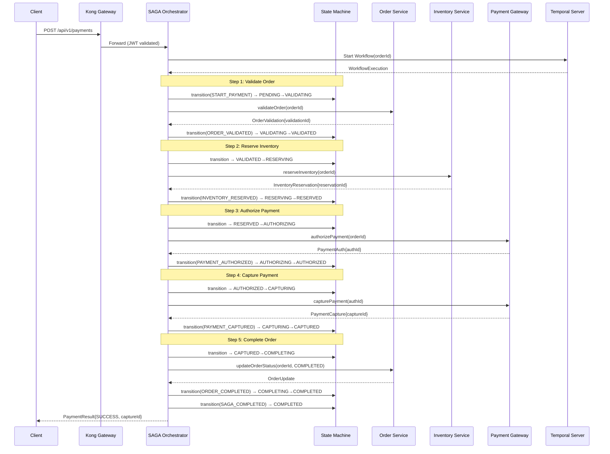
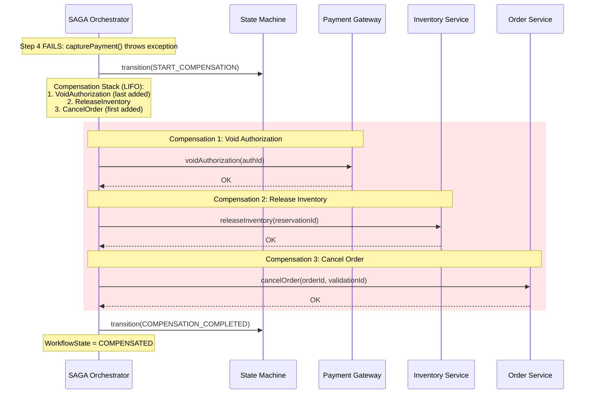
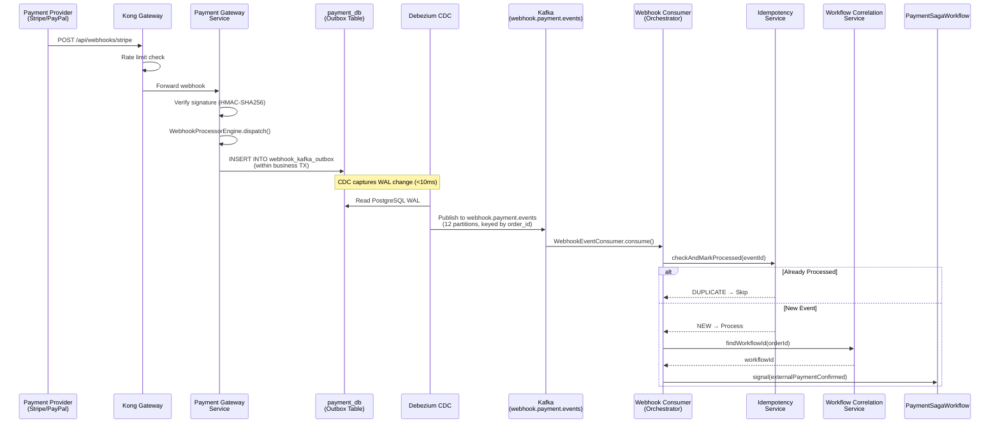

# II.4 Detailed Design

[< Back to Index](../DAB_Payment_SAGA_Platform.md) | [← Previous: II.3 Data Design](04-data-design.md)

---

## Payment Happy Path Flow

The forward payment flow progresses through 10 business states managed by Spring State Machine, with 5 SAGA steps orchestrated by Temporal:

```
PENDING → VALIDATING → VALIDATED → RESERVING → RESERVED →
AUTHORIZING → AUTHORIZED → CAPTURING → CAPTURED →
COMPLETING → COMPLETED
```



## Compensation Flow (LIFO Rollback)

When any step fails, the compensation stack is executed in reverse order (Last-In-First-Out):



## Webhook → Kafka → Workflow Pipeline



## Error Handling

### Error Code Categories

| Category | Prefix | Examples | Handling |
|---|---|---|---|
| **Validation** | VAL | VAL_001 (Invalid amount), VAL_002 (Missing field) | Return 400, no compensation |
| **Inventory** | INV | INV_001 (Insufficient stock), INV_002 (SKU not found) | Compensate prior steps |
| **Payment** | PAY | PAY_001 (Declined), PAY_002 (Gateway timeout) | Retry with backoff, then compensate |
| **System** | SYS | SYS_001 (Database unavailable), SYS_002 (Kafka unreachable) | Circuit breaker, retry, alert |
| **SAGA** | SAGA | SAGA_001 (Compensation failed), SAGA_002 (Timeout) | DLT + manual intervention |
| **Resource** | RES | RES_001 (Concurrent modification), RES_002 (Lock timeout) | Optimistic retry |

### Resilience Patterns

| Pattern | Technology | Configuration |
|---|---|---|
| **Circuit Breaker** | Resilience4j | 50% failure threshold, 60s half-open, 10 calls in sliding window |
| **Bulkhead** | Resilience4j | 25 max concurrent calls, 10 max wait |
| **Rate Limiter** | Resilience4j + Kong | 100/min per client (Kong), 500/min internal (Resilience4j) |
| **Retry** | Temporal RetryOptions | 3 max attempts, 1s initial → 30s max, 2.0 backoff coefficient |
| **Dead Letter Topic** | Kafka DLT | `webhook.payment.events.DLT` (3 partitions), manual review queue |
| **Timeout** | Temporal ActivityOptions | 5 min start-to-close for payment activities, 30s for data activities |

---

**Previous:** [← II.3 Data Design](04-data-design.md) | **Next:** [II.5 Integration Design →](06-integration-design.md)
