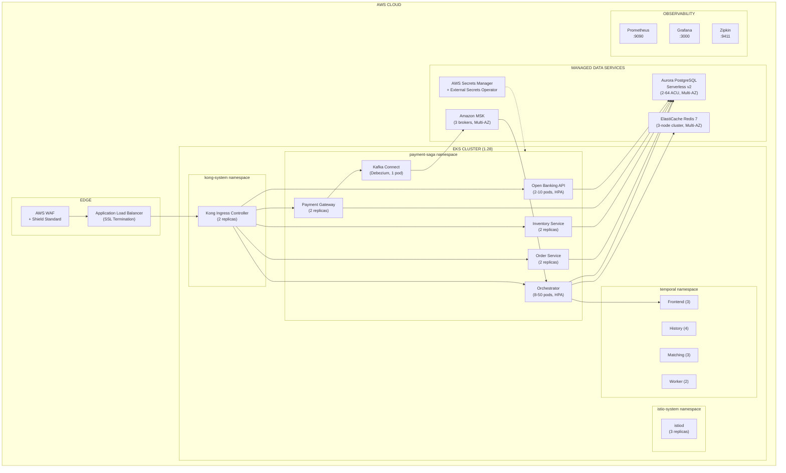

# II.6 Infrastructure Design

[< Back to Index](../DAB_Payment_SAGA_Platform.md) | [← Previous: II.5 Integration Design](06-integration-design.md)

---

## EKS Cluster Topology

## Infrastructure Components

| Component | Specification | Replicas / Sizing |
|---|---|---|
| **EKS Cluster** | Kubernetes 1.28, managed control plane | 3 AZ, m5.xlarge nodes |
| **SAGA Orchestrator** | Java 21, Spring Boot 3.2.1, 500m-2000m CPU, 1-2Gi RAM | 8-50 pods (HPA) |
| **Order/Inventory/Payment Services** | Java 21, 100m-500m CPU, 256-512Mi RAM | 2 replicas each |
| **Open Banking API** | Java 21, 200m-1000m CPU, 512Mi-1Gi RAM | 2-10 pods (HPA) |
| **Aurora PostgreSQL** | Serverless v2, Multi-AZ | 2-64 ACU, 4 databases |
| **Amazon MSK** | Kafka 3.6, Multi-AZ | 3 brokers, m5.large |
| **ElastiCache Redis** | Redis 7, Multi-AZ | 3-node cluster, r6g.large |
| **Temporal Cluster** | Frontend 3, History 4, Matching 3, Worker 2 | 12 pods total |
| **Kafka Connect** | Debezium 2.5, 500m-1000m CPU, 512Mi-1Gi RAM | 1 pod |
| **Kong Ingress** | Kong 3.4 | 2 replicas |
| **Istio** | istiod 1.20 + Envoy sidecars | 3 replicas + per-pod |
| **Prometheus** | Time-series metrics | 1 pod |
| **Grafana** | Dashboards, alerting | 1 pod |
| **Zipkin** | Distributed tracing | 1 pod |

## HPA Configuration

| Deployment | Min Replicas | Max Replicas | CPU Target | Memory Target |
|---|---|---|---|---|
| `payment-saga-orchestrator` | 8 | 50 | 70% | 80% |
| `open-banking-api` | 2 | 10 | 70% | 80% |

Scale-up policy: 50% or 4 pods per 60s (whichever is greater). Scale-down policy: 25% per 120s with 300s stabilization.

---

**Previous:** [← II.5 Integration Design](06-integration-design.md) | **Next:** [II.7 Security Design →](08-security-design.md)
