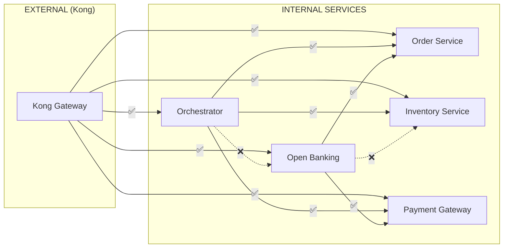

# II.7 Security Design

[< Back to Index](../DAB_Payment_SAGA_Platform.md) | [← Previous: II.6 Infrastructure Design](07-infrastructure-design.md)

---

## System Classification

| Classification | Value | Justification |
|---|---|---|
| **System Classification** | **HIGH** | Financial payment processing system handling monetary transactions |
| **Data Sensitivity** | **HIGH** | PII, financial data, PCI cardholder data |
| **Regulatory Scope** | PCI-DSS 4.0.1, SBV Circular 64/2024/TT-NHNN | Payment card data + Open Banking regulatory compliance |

## Data Classification

| Category | Examples | Classification | Handling Rules |
|---|---|---|---|
| **PII** | Customer ID, name, email | CONFIDENTIAL | Encrypted at rest (AES-256), masked in logs, 7-year retention |
| **Financial** | Transaction amounts, currency, status | CONFIDENTIAL | Immutable audit trail, trigger-protected, reconciliation controls |
| **PCI** | Card number (last 4), auth codes | RESTRICTED | Never stored in clear; PSP handles tokenization |
| **Internal** | Workflow IDs, correlation IDs, metrics | INTERNAL | Standard logging, 90-day retention |

## 6-Layer Defense-in-Depth

```mermaid
flowchart TB
    subgraph L1["LAYER 1: EDGE SECURITY"]
        WAF["AWS WAF<br/>• OWASP Top 10 rules<br/>• IP reputation lists<br/>• Rate limiting (global)"]
        Shield["AWS Shield Standard<br/>• DDoS protection"]
    end

    subgraph L2["LAYER 2: API GATEWAY (Kong)"]
        Auth["Authentication<br/>• OAuth2 JWT validation<br/>• API key management<br/>• Phantom Token pattern"]
        Rate["Rate Limiting<br/>• 100/min per client (payments)<br/>• 1000/min global"]
        Headers["Security Headers<br/>• HSTS, X-Frame-Options<br/>• CSP, X-Content-Type-Options"]
        CorrID["Correlation ID<br/>• X-Correlation-ID injection"]
    end

    subgraph L3["LAYER 3: APPLICATION SECURITY"]
        RBAC["RBAC<br/>• @PreAuthorize annotations<br/>• 3 roles, 6 permissions"]
        Webhook["Webhook Verification<br/>• HMAC-SHA256 (Stripe)<br/>• RSA-SHA256 (PayPal)<br/>• IP allowlisting"]
        Validation["Input Validation<br/>• Bean Validation (JSR-380)<br/>• CORS, CSRF protection"]
    end

    subgraph L4["LAYER 4: SERVICE MESH (Istio)"]
        mTLS["mTLS STRICT Mode<br/>• SPIFFE identities<br/>• Auto certificate rotation"]
        AuthPol["Authorization Policies<br/>• Service access matrix<br/>• Deny-by-default"]
        Circuit["Circuit Breaking<br/>• Connection limits<br/>• Outlier detection"]
    end

    subgraph L5["LAYER 5: NETWORK SECURITY"]
        NetPol["Network Policies<br/>• Namespace isolation<br/>• Pod-level egress rules"]
        B3["B3 Header Propagation<br/>• Distributed tracing<br/>• Audit correlation"]
    end

    subgraph L6["LAYER 6: DATA SECURITY"]
        RLS["PostgreSQL RLS<br/>• tenant_id policies<br/>• SET LOCAL enforcement"]
        Encrypt["Encryption<br/>• AES-256 at rest<br/>• TLS 1.2+ in transit"]
        Secrets["Secrets Management<br/>• AWS Secrets Manager<br/>• External Secrets Operator<br/>• 90-day rotation"]
    end

    L1 --> L2 --> L3 --> L4 --> L5 --> L6
```

## Network Security

| Control | Technology | Configuration |
|---|---|---|
| **WAF** | AWS WAF | OWASP Core Rule Set, IP reputation, SQL injection protection |
| **DDoS Protection** | AWS Shield Standard | Automatic L3/L4 protection |
| **API Rate Limiting** | Kong rate-limiting plugin | 100 req/min (payment), 1000 req/min (global) |
| **mTLS** | Istio PeerAuthentication | `STRICT` mode — all traffic encrypted with mutual TLS |
| **Service Authorization** | Istio AuthorizationPolicy | Explicit allow rules per service pair |
| **IP Allowlisting** | Kong + Application | PSP webhook source IPs verified (Stripe, PayPal, Adyen, Square) |

## Istio Service Access Matrix

| FROM \ TO | Order | Inventory | Payment | Open Banking |
|---|---|---|---|---|
| **Kong (External)** | ALLOW | ALLOW | ALLOW | ALLOW |
| **Orchestrator** | ALLOW | ALLOW | ALLOW | DENY |
| **Open Banking** | ALLOW | DENY | ALLOW | — |
| **All Others** | DENY | DENY | DENY | DENY |

## Application Security

| Control | Implementation |
|---|---|
| **Authentication** | OAuth2 JWT validation (Kong + Spring Security Resource Server) |
| **Authorization** | RBAC with `@PreAuthorize` — 3 roles (ADMIN, OPERATOR, VIEWER), 6 permissions |
| **Webhook Verification** | Stripe: HMAC-SHA256 with `Stripe-Signature` header; PayPal: RSA-SHA256 with certificate; Adyen: HMAC-SHA256; Square: webhook signature verification |
| **Input Validation** | Bean Validation (JSR-380) annotations on all DTOs |
| **CORS** | Configured per-service, restricted origins |
| **CSRF** | Disabled for API-only services (stateless JWT) |
| **Security Headers** | HSTS, X-Frame-Options: DENY, X-Content-Type-Options: nosniff, CSP |

## Data Security

| Control | Technology | Details |
|---|---|---|
| **Multi-Tenant Isolation** | PostgreSQL RLS | `CREATE POLICY tenant_isolation ON payment_requests USING (tenant_id = current_setting('app.tenant_id'))` |
| **Encryption at Rest** | AES-256 | Aurora PostgreSQL encryption, EBS volume encryption |
| **Encryption in Transit** | TLS 1.2+ | All external connections; mTLS for internal |
| **Credential Rotation** | AWS Secrets Manager | 90-day rotation policy, External Secrets Operator sync |
| **Audit Trail** | Event Store | Immutable, trigger-protected, 7-year retention |
| **Temporal Isolation** | Namespace isolation | `payment-saga` namespace with authentication |

## Security Monitoring

| Alert | Metric | Threshold | Severity |
|---|---|---|---|
| Authentication Failures | `security_auth_failure_total` | >10/min | WARNING |
| Webhook Signature Failures | `webhook_signature_failure_total` | >5/min | CRITICAL |
| Unauthorized IP Access | `webhook_unauthorized_ip_total` | >1/min | CRITICAL |
| RLS Policy Violations | `rls_violation_total` | >0 | CRITICAL |
| Certificate Expiry | `istio_cert_expiry_seconds` | <7 days | WARNING |
| Rate Limit Breaches | `kong_rate_limit_exceeded_total` | >50/min | WARNING |

## User Management

| Attribute | Specification |
|---|---|
| **Authentication** | OAuth2 introspection via enterprise IdP |
| **Token Format** | JWT with claims: `sub`, `tenant_id`, `roles[]`, `permissions[]` |
| **Roles** | `ADMIN` (full access), `OPERATOR` (transactions + monitoring), `VIEWER` (read-only) |
| **Permissions** | `payment:create`, `payment:read`, `payment:cancel`, `webhook:manage`, `admin:config`, `audit:read` |
| **Session** | Stateless (JWT), no server-side sessions |
| **Token Expiry** | Access token: 15 min, Refresh token: 24 hours |

## Security Risk Assessment

| # | Risk | Likelihood | Impact | Mitigation | Residual Risk |
|---|---|---|---|---|---|
| **SR-1** | DDoS attack on payment endpoints | HIGH | HIGH | AWS Shield + WAF + Kong rate limiting + Istio circuit breaking | LOW |
| **SR-2** | Webhook replay attack from compromised PSP keys | MEDIUM | HIGH | Timestamp validation (5 min window), idempotency keys, signature verification | LOW |
| **SR-3** | Cross-tenant data leakage | LOW | CRITICAL | PostgreSQL RLS, tenant_id in JWT claims, application-level validation | VERY LOW |
| **SR-4** | Secret/credential exposure | MEDIUM | CRITICAL | AWS Secrets Manager, External Secrets Operator, 90-day rotation, no secrets in code/config | LOW |
| **SR-5** | Man-in-the-middle on internal traffic | LOW | HIGH | Istio mTLS STRICT mode, SPIFFE identities, auto certificate rotation | VERY LOW |

---

**Previous:** [← II.6 Infrastructure Design](07-infrastructure-design.md) | **Next:** [III. DAB Light Assessment →](09-dab-light-assessment.md)
