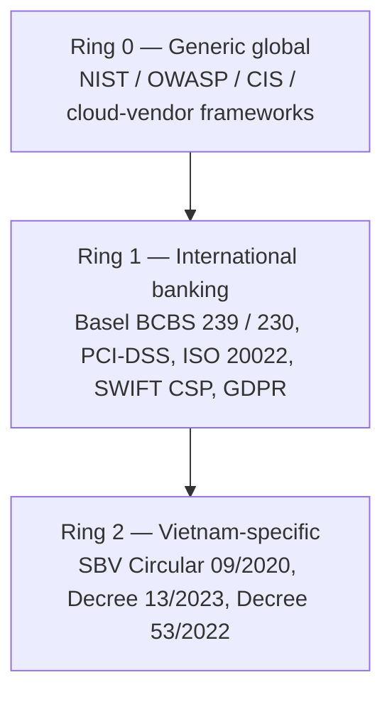

# Banking Enterprise Architecture Catalog Implementation Plan

> **For agentic workers:** REQUIRED SUB-SKILL: Use superpowers:subagent-driven-development (recommended) or superpowers:executing-plans to implement this plan task-by-task. Steps use checkbox (`- [ ]`) syntax for tracking.

**Goal:** Extend the Techcombank Architecture-As-Code repository with a banking-grade enterprise architecture catalog: 1 master catalog spec, 1 research-notes appendix, 20 starter-set docs at full ops-runbook depth, and 103 stub docs — totalling ~141 unique catalog rows that meet HA / HP / HR standards with explicit 3-ring regulatory mapping (Global → International banking → Vietnam).

**Architecture:** 7-phase delivery — (0) Industry research → (1) Master catalog spec → (2) Spine of 6 foundational docs sequentially → (2.5) Stub generation in parallel → (3) Radii in 3 parallel sub-waves of 5/5/4 docs → (4) Cross-link + lint + ADR. Stakeholder review gates G1–G5 between phases.

**Tech Stack:** Markdown + MermaidJS for all docs; Java 21 / Spring Boot 3.x / Resilience4j 2.x / Spring Kafka / PostgreSQL 16 / Kubernetes for backend code samples; Temenos T24 / mainframe COBOL/CICS via OFS bridge for legacy integration; React 18 + TypeScript 5 for web; native iOS Swift 5.x with Keychain / ASWebAuthenticationSession / LocalAuthentication; native Android Kotlin with Keystore / Jetpack Biometric / Custom Tabs.

**Spec reference:** `docs/superpowers/specs/2026-05-08-banking-enterprise-architecture-catalog-design.md`

**Reviewer registry (created in Phase 0):** `registry/catalog-reviewers.yml`

---

## Reusable Procedures (referenced throughout)

These procedures are referenced by name from individual tasks below. Read them once; apply them consistently.

### Procedure A — Authoring a full-depth pattern doc

Used for the 20 starter-set docs. Each doc follows this exact structure (Spec §4a). When a task says "Apply Procedure A", it means execute all 13 sub-steps of Procedure A using that doc's specific parameters (path, title, catalog ID, tier, compliance refs, code language, etc.).

- [ ] **A.1** Create file at the specified path with header block:
  ```markdown
  # {Pattern Name}

  Status: Approved | Last Reviewed: 2026-05-08 | Owner: @{owner}
  Catalog ID: {CATEGORY-NNN}  | Spine | Radii      ← keep one, delete the other
  Tier Applicability: {T0 | T1 | T2 | T3}

  ## Problem Statement
  ## Context (when this applies in a banking flow)
  ## Solution
  ## Implementation Guidelines
  ## Variants & Trade-offs
  ## NFR Acceptance Criteria
  ## Compliance Mapping
  ## Cost / FinOps Notes
  ## Threat Model Summary
  ## Operational Runbook (stub)
  ## Test Strategy (stub)
  ## When to Use
  ## When NOT to Use
  ## Related Patterns
  ## References

  ---
  **Key Takeaway**: {one sentence}.
  ```

- [ ] **A.2** Write Problem Statement (1–2 paragraphs): describe failure modes the pattern prevents, framed in a banking context (cite a real banking flow — payment, KYC, ledger, etc.).

- [ ] **A.3** Write Context (1 paragraph): when to reach for this pattern; which banking flows it appears in.

- [ ] **A.4** Write Solution: include at least one Mermaid diagram (architecture, sequence, state, or flowchart). Use `graph TD` / `sequenceDiagram` / `stateDiagram-v2`. Verify it renders by running the lint procedure (Procedure D).

- [ ] **A.5** Write Implementation Guidelines with these subsections in order, omitting any that don't apply (mark omitted ones as "N/A — not applicable to this pattern"):
  1. Java 21 / Spring Boot 3.x reference (≥1 working code block, ~30–80 lines)
  2. T24 / legacy integration notes (only for integration / EIP / saga / outbox / payments / ledger patterns)
  3. React 18 / TypeScript 5 notes (only for frontend-touching patterns: BFF, web-perf, web-security)
  4. iOS Swift / Android Kotlin notes (only for mobile-touching patterns: BFF, KYC, payments client, card-auth client)
  5. YAML / Helm config block (Resilience4j, Spring Kafka, K8s deployment, etc.)

- [ ] **A.6** Write Variants & Trade-offs: 2–4 variants of the pattern with pros/cons table.

- [ ] **A.7** Write NFR Acceptance Criteria block:
  ```markdown
  ## NFR Acceptance Criteria
  - **HA**: RTO {X} / RPO {Y} / availability target {Z%} this pattern enables on T0 services
  - **HP**: P50 {ms} / P95 {ms} / P99 {ms} latency contribution; throughput {req/s}
  - **HR**: failure modes — {list}; recovery — {behaviour}; blast radius — {scope}
  ```

- [ ] **A.8** Write Compliance Mapping table — 3 rows (one per ring):
  ```markdown
  ## Compliance Mapping
  | Layer | Reference | Section/Control | How this pattern satisfies |
  |---|---|---|---|
  | Ring 0 (generic) | {NIST / OWASP / etc.} | {§} | {one sentence} |
  | Ring 1 (intl banking) | {PCI-DSS 4.0 / Basel BCBS / SWIFT CSP / ISO 20022 / GDPR} | {§} | {one sentence} |
  | Ring 2 (Vietnam) | {SBV Circ. 09 / Decree 13 / Decree 53} | {§} | {one sentence — flag "unofficial translation pending Legal review" if SBV/Decree text} |
  ```

- [ ] **A.9** Write Cost / FinOps Notes block (~5–10 lines): cost driver(s); FinOps levers (autoscaling, reserved capacity, cold tiers); rough order-of-magnitude per Tier; "cost of NOT having" (incident exposure, SLA penalty).

- [ ] **A.10** Write Threat Model Summary block (~5–10 lines): STRIDE one-paragraph; top-3 threats addressed; top-3 residual threats; pointer to a full STRIDE doc if one exists.

- [ ] **A.11** Write Operational Runbook stub: alerts (golden signals + pattern-specific); dashboards (Grafana panel name placeholders); on-call escalation path; recovery steps (numbered, ≥3 steps).

- [ ] **A.12** Write Test Strategy stub: list which test layers apply (Unit | Integration | Contract | Chaos | DR-drill | Performance) with one sentence per applicable layer.

- [ ] **A.13** Write When to Use, When NOT to Use, Related Patterns (with catalog IDs), References (citing `_research-notes.md` entries by anchor), and the Key Takeaway one-liner.

- [ ] **A.14** Run Procedure D (lint).

- [ ] **A.15** Commit: `git add {path} && git commit -m "feat(catalog): {Pattern Name} — full depth"`.

### Procedure B — Authoring a stub doc

Used for the 103 stub docs in Phase 2.5. Procedure B is mechanical and is executed by the script in Task P25.2 (not manually). Output structure (Spec §4b):

```markdown
# {Pattern Name}

Status: Proposed | Target Wave: {1|2|3} | Owner: @{owner}
Catalog ID: {CATEGORY-NNN}
Tier Applicability: {tiers}

> **STUB** — full content authored in Wave {N}.
> Catalog: ../../governance/standards/enterprise-architecture-catalog.md#{anchor}

## Problem Statement
{1 paragraph from inventory.yaml `problem` field}

## Sketch of Solution
{3–5 bullets from inventory.yaml `sketch` field}

## Compliance Hooks
- Ring 0: {ring0 from yaml}
- Ring 1: {ring1 from yaml}
- Ring 2: {ring2 from yaml}

## NFR Hooks
- HA: {ha from yaml}
- HP: {hp from yaml}
- HR: {hr from yaml}

## Authoring Checklist (DoD for moving Status → Approved)
- [ ] Mermaid solution diagram
- [ ] Java/Spring code sample
- [ ] Legacy / frontend / mobile notes (if applicable)
- [ ] Compliance Mapping table populated
- [ ] NFR Acceptance Criteria block
- [ ] Cost/FinOps notes
- [ ] Threat Model summary
- [ ] Runbook stub
- [ ] Test strategy stub
- [ ] EA-board review
- [ ] Domain-owner review

## References
{list from yaml; placeholders OK}
```

### Procedure C — Triggering a stakeholder review gate

Used at the end of every phase. Stakeholder gates are async — this procedure prepares the artefact and pings reviewers; it does NOT block on their response.

- [ ] **C.1** Generate a Merge Request to the project's main branch via `gh mr create` (or GitLab CLI equivalent — see `.gitlab-ci.yml` for the project's MR conventions). Use the appropriate MR template from `.gitlab/merge_request_templates/` (e.g. `dab-full.md` for G2; `architecture-change.md` for G3 / G4 / G5).

- [ ] **C.2** Tag the reviewers per the gate's role list, resolved against `registry/catalog-reviewers.yml`.

- [ ] **C.3** Add a checklist comment on the MR with that gate's reject criteria (verbatim from Spec §5).

- [ ] **C.4** Set MR labels: `gate:G{N}` and `phase:{phase-id}`.

- [ ] **C.5** Record the gate in `governance/decisions/` as a dated review-log entry: `governance/decisions/REVIEW-LOG-{YYYY-MM-DD}-G{N}.md`.

- [ ] **C.6** Notify reviewers in `#ea-board` Slack channel (or equivalent) per `governance/dab-process/sla-targets.md`.

### Procedure D — Lint pass on a single markdown doc

- [ ] **D.1** Render Mermaid blocks: `npx -y @mermaid-js/mermaid-cli -i {path} -o /tmp/mermaid-render-test.svg` (one block at a time, or use a wrapper). Expect no rendering errors.

- [ ] **D.2** Markdown lint: `npx -y markdownlint-cli2 {path}`. Expect zero errors. Common fixes: blank lines around headings; consistent list markers; no trailing whitespace.

- [ ] **D.3** Internal link check: `npx -y markdown-link-check {path} --config .markdown-link-check.json` (create config in Task P0.0 below to skip external URLs). Expect all relative links resolve.

- [ ] **D.4** Front-matter / header check: confirm the `Status: ...` and `Catalog ID: ...` header lines are present and well-formed.

### Procedure E — Cross-link to spine doc

When a doc references one of the 6 spine docs, use these canonical anchors (Phase 4 will verify all are present):

| Spine Doc | Anchor | Cite as |
| --- | --- | --- |
| Service Tiering | `nfr/service-tiering-rto-rpo.md` | "Tier Applicability per [Service Tiering](../nfr/service-tiering-rto-rpo.md)" |
| Latency Budget | `nfr/latency-budget-model.md` | "P50/P95/P99 budgets per [Latency Budget Model](../nfr/latency-budget-model.md)" |
| Idempotency principle | `principles/idempotency-by-default.md` | "assumes [Idempotency-by-default](../principles/idempotency-by-default.md)" |
| NFR-AC template | `templates/nfr-acceptance-criteria-dab.md` | "uses the [NFR Acceptance Criteria template](../templates/nfr-acceptance-criteria-dab.md)" |
| Compliance Matrix | `compliance/compliance-mapping-matrix.md` | "row in [Compliance Mapping Matrix](../compliance/compliance-mapping-matrix.md#{anchor})" |
| Multi-Region A/A | `reference-architectures/multi-region-active-active.md` | "deployed under [Multi-Region Active-Active](../reference-architectures/multi-region-active-active.md)" |

---

## Phase 0 — Industry research pass (Wall-clock target: ~2.3 days)

Goal: produce `knowledge-base/_research-notes.md` so all subsequent docs cite verified sources, not LLM memory.

### Task P0.0: Pre-flight — verify environment

**Files:**
- Verify (no edits): `/Users/dennis.dao/Documents/Arch-As-Code/.gitlab-ci.yml`, `mkdocs.yml`, `knowledge-base/README.md`
- Create: `.markdown-link-check.json`
- Create: `registry/catalog-reviewers.yml`
- Create new dirs: `knowledge-base/nfr/`, `knowledge-base/compliance/`, `knowledge-base/templates/`, `knowledge-base/reference-architectures/`, `knowledge-base/patterns/eip/`, `knowledge-base/patterns/frontend/`, `knowledge-base/patterns/mobile/`, `knowledge-base/patterns/banking-solutions/`

- [ ] **Step 1: Confirm working directory**

Run: `cd /Users/dennis.dao/Documents/Arch-As-Code && pwd`
Expected: `/Users/dennis.dao/Documents/Arch-As-Code`

- [ ] **Step 2: Confirm git state**

Run: `git status 2>&1 || echo "NOT A GIT REPO"`
Expected: Either clean working tree on a feature branch, or `NOT A GIT REPO`. If not a git repo, halt and ask the user whether to `git init` or move into the canonical repo.

- [ ] **Step 3: Create new directories required by the spec**

Run:
```bash
mkdir -p \
  knowledge-base/nfr \
  knowledge-base/compliance \
  knowledge-base/templates \
  knowledge-base/reference-architectures \
  knowledge-base/patterns/eip \
  knowledge-base/patterns/frontend \
  knowledge-base/patterns/mobile \
  knowledge-base/patterns/banking-solutions
```

- [ ] **Step 4: Create `.markdown-link-check.json`**

Create `/Users/dennis.dao/Documents/Arch-As-Code/.markdown-link-check.json`:
```json
{
  "ignorePatterns": [
    { "pattern": "^https?://" }
  ],
  "timeout": "5s",
  "retryOn429": true,
  "aliveStatusCodes": [200, 206]
}
```

- [ ] **Step 5: Create `registry/catalog-reviewers.yml` with role-based reviewer aliases**

Create `/Users/dennis.dao/Documents/Arch-As-Code/registry/catalog-reviewers.yml`:
```yaml
# Catalog reviewer registry — maps roles used in catalog rows to actual humans.
# Update this file when personnel changes; do NOT hardcode names in catalog/*.md.
version: 1
last_updated: 2026-05-08

roles:
  ea-board:
    primary: TBD-FILL-IN-LEGAL  # placeholder — Director of Solution Architecture, EA-Board chair
    backup: TBD-FILL-IN-LEGAL
  dab-chair:
    primary: TBD-FILL-IN
    backup: TBD-FILL-IN
  ciso-delegate:
    primary: TBD-FILL-IN
    backup: TBD-FILL-IN
  sre-lead:
    primary: TBD-FILL-IN
    backup: TBD-FILL-IN
  head-of-compliance:
    primary: TBD-FILL-IN
    backup: TBD-FILL-IN
  payments-domain-owner:
    primary: TBD-FILL-IN
    backup: TBD-FILL-IN
  core-banking-domain-owner:
    primary: TBD-FILL-IN
    backup: TBD-FILL-IN
  digital-channels-domain-owner:
    primary: TBD-FILL-IN
    backup: TBD-FILL-IN
  risk-management-domain-owner:
    primary: TBD-FILL-IN
    backup: TBD-FILL-IN
  lending-domain-owner:
    primary: TBD-FILL-IN
    backup: TBD-FILL-IN
  wealth-management-domain-owner:
    primary: TBD-FILL-IN
    backup: TBD-FILL-IN
  data-platform-domain-owner:
    primary: TBD-FILL-IN
    backup: TBD-FILL-IN
  legal-vietnam:
    primary: TBD-FILL-IN
    backup: TBD-FILL-IN
    notes: "Source for SBV Circular 09/2020 and Decree 13/2023 translations"
  tech-lead-backend:
    primary: TBD-FILL-IN
    backup: TBD-FILL-IN
  tech-lead-mobile:
    primary: TBD-FILL-IN
    backup: TBD-FILL-IN
  tech-lead-web:
    primary: TBD-FILL-IN
    backup: TBD-FILL-IN
```

- [ ] **Step 6: Verify directories exist**

Run:
```bash
ls knowledge-base/nfr knowledge-base/compliance knowledge-base/templates \
   knowledge-base/reference-architectures knowledge-base/patterns/eip \
   knowledge-base/patterns/frontend knowledge-base/patterns/mobile \
   knowledge-base/patterns/banking-solutions
```
Expected: each lists its parent dir; no errors.

- [ ] **Step 7: Commit**

Run:
```bash
git add registry/catalog-reviewers.yml .markdown-link-check.json knowledge-base/
git commit -m "chore(catalog): bootstrap directories and reviewer registry for EA catalog"
```

### Task P0.1: Bootstrap research-notes scaffold

**Files:**
- Create: `knowledge-base/_research-notes.md`

- [ ] **Step 1: Create the research-notes file with a section per source**

Create `/Users/dennis.dao/Documents/Arch-As-Code/knowledge-base/_research-notes.md`:

```markdown
# Research Notes — Industry Sources Underpinning the Enterprise Architecture Catalog

Status: Living document | Last Updated: 2026-05-08 | Owner: @ea-board
Purpose: Authoritative quotes, section references, and pattern → catalog-ID mappings extracted from industry sources during Phase 0 of the catalog implementation. All starter-set docs cite this file by anchor; do not rely on LLM memory for any external claim.

> **Each section below is filled in by Tasks P0.2 through P0.13.**

---

## EIP — Enterprise Integration Patterns (Hohpe & Woolf)
{filled by Task P0.2}

## Microsoft Cloud Design Patterns
{filled by Task P0.3}

## Microsoft Azure Well-Architected
{filled by Task P0.4}

## AWS Well-Architected Framework
{filled by Task P0.5}

## Microservices.io Patterns
{filled by Task P0.6}

## Resilience4j
{filled by Task P0.7}

## State Bank of Vietnam — Circular 09/2020/TT-NHNN
{filled by Task P0.8 — flag any quote as "unofficial translation pending Legal review"}

## Government of Vietnam — Decree 13/2023/NĐ-CP and Decree 53/2022/NĐ-CP
{filled by Task P0.9 — flag any quote as "unofficial translation pending Legal review"}

## PCI Security Standards Council — PCI-DSS v4.0
{filled by Task P0.10}

## Bank for International Settlements — BCBS 239 + 230
{filled by Task P0.11}

## ISO 20022
{filled by Task P0.12}

## SWIFT — Customer Security Programme v2024
{filled by Task P0.13}

## NAPAS — Public Technical References
{filled by Task P0.14}

---

## Quick Index — Pattern-to-Source Map

| Catalog ID (target) | Primary source | Sub-section reference |
| --- | --- | --- |
| {filled progressively by tasks P0.2 – P0.14 as patterns are mapped} | | |
```

- [ ] **Step 2: Commit**

Run:
```bash
git add knowledge-base/_research-notes.md
git commit -m "docs(research): scaffold _research-notes.md for catalog Phase 0"
```

### Task P0.2: Fetch Hohpe/Woolf EIP catalog

**Files:**
- Modify: `knowledge-base/_research-notes.md` (fill the "EIP" section)

- [ ] **Step 1: WebFetch the EIP index page**

Tool call:
```
WebFetch(
  url="https://www.enterpriseintegrationpatterns.com/patterns/messaging/index.html",
  prompt="List every pattern title with its one-sentence summary. Return as a markdown table with columns: Pattern, Summary, Category. Categories are: Messaging Channels, Message Construction, Message Routing, Message Transformation, Messaging Endpoints, System Management."
)
```

- [ ] **Step 2: Curate the 25 banking-relevant EIP patterns**

From the WebFetch result, select exactly 25 patterns that apply to a modern banking platform. Banking-relevant criteria:
- Used in payment / ledger / messaging flows
- Compatible with Kafka, RabbitMQ, IBM MQ, Solace, or Spring Integration
- Not specific to deprecated XML/SOAP-only transformers

Recommended 25 (use this as the baseline; deviate only with note):
1. Message Channel
2. Point-to-Point Channel
3. Publish-Subscribe Channel
4. Message Router
5. Content-Based Router
6. Message Translator
7. Content Enricher
8. Content Filter
9. Claim Check
10. Normalizer
11. Aggregator
12. Splitter
13. Resequencer
14. Composed Message Processor
15. Scatter-Gather
16. Routing Slip
17. Process Manager
18. Message Store
19. Smart Proxy
20. Test Message
21. Channel Purger
22. Durable Subscriber
23. Guaranteed Delivery
24. **Idempotent Receiver** (starter-set #5)
25. **Dead Letter Channel** (starter-set #6)

- [ ] **Step 3: Append the EIP section to `_research-notes.md`**

Edit `knowledge-base/_research-notes.md` to replace the `## EIP — Enterprise Integration Patterns (Hohpe & Woolf)` placeholder with:

```markdown
## EIP — Enterprise Integration Patterns (Hohpe & Woolf)

Source: https://www.enterpriseintegrationpatterns.com/patterns/messaging/
Fetched: 2026-05-08
Reference book: Hohpe, G. & Woolf, B. (2003). *Enterprise Integration Patterns*. Addison-Wesley.

### Banking-relevant subset (25 of 66)

| # | Pattern | Catalog ID | Anchor URL |
| --- | --- | --- | --- |
| 1 | Message Channel | EIP-001 | /patterns/messaging/MessageChannel.html |
| 2 | Point-to-Point Channel | EIP-002 | /patterns/messaging/PointToPointChannel.html |
{... fill in all 25 from the WebFetch result and the curated list above}

### Quotes used in catalog patterns

(Filled lazily as patterns are authored. Each quote: source URL + anchor + verbatim text + commentary.)

> **Flagged for G2 review**: the 25-pattern subset reflects Solution Architect judgment per Spec Q6. EA-Board may add or substitute at the G2 gate.
```

- [ ] **Step 4: Update the Quick Index at the bottom of `_research-notes.md`**

Add 25 rows mapping each EIP pattern to a catalog ID (EIP-001 .. EIP-025).

- [ ] **Step 5: Commit**

Run:
```bash
git add knowledge-base/_research-notes.md
git commit -m "docs(research): EIP banking-subset selected (25 of 66) for catalog"
```

### Task P0.3: Fetch Microsoft Cloud Design Patterns

**Files:** Modify `knowledge-base/_research-notes.md`

- [ ] **Step 1: WebFetch the index**

```
WebFetch(
  url="https://learn.microsoft.com/en-us/azure/architecture/patterns/",
  prompt="List every cloud design pattern with its one-sentence problem statement. Return as a markdown table with columns: Pattern, Problem, Category (Reliability | Performance | Security | Data Management | Design and Implementation | Messaging)."
)
```

- [ ] **Step 2: Identify the patterns we already cover**

Cross-reference against existing repo and starter-set:
- Already in repo: API Gateway Routing, CDC + Outbox (similar to Materialized View / Event-Sourcing variant), Saga, Circuit Breaker, Bulkhead, Retry, OAuth2, mTLS
- Starter set new: Idempotent Receiver, DLC, Cell-Based, Multi-Region A/A, Tokenization, BFF
- Stubs: rest

- [ ] **Step 3: Append the Microsoft section**

Replace `## Microsoft Cloud Design Patterns` placeholder with the full table and commentary; flag patterns that map to existing repo docs and patterns that map to new stubs.

- [ ] **Step 4: Commit**

```bash
git add knowledge-base/_research-notes.md
git commit -m "docs(research): Microsoft Cloud Design Patterns mapped to catalog"
```

### Task P0.4: Fetch Microsoft Azure Well-Architected

**Files:** Modify `knowledge-base/_research-notes.md`

- [ ] **Step 1: WebFetch the 5 pillars index**

```
WebFetch(
  url="https://learn.microsoft.com/en-us/azure/well-architected/",
  prompt="Summarise each of the 5 pillars (Reliability, Security, Cost Optimisation, Operational Excellence, Performance Efficiency). For each pillar, list its top 5 design principles. Return as nested markdown."
)
```

- [ ] **Step 2: Append section** with focus on RTO/RPO definitions, latency budget guidance, and cost levers — these directly inform spine docs P2.1, P2.2, P2.6.

- [ ] **Step 3: Commit** with message `docs(research): Azure Well-Architected pillars referenced for spine docs`.

### Task P0.5: Fetch AWS Well-Architected Framework

**Files:** Modify `knowledge-base/_research-notes.md`

- [ ] **Step 1: WebFetch**

```
WebFetch(
  url="https://docs.aws.amazon.com/wellarchitected/latest/framework/welcome.html",
  prompt="Summarise the 6 pillars (Operational Excellence, Security, Reliability, Performance Efficiency, Cost Optimization, Sustainability). For Reliability, extract the RTO/RPO discussion and the multi-region active-active guidance. Return as markdown."
)
```

- [ ] **Step 2: Also fetch the Reliability whitepaper page**

```
WebFetch(
  url="https://docs.aws.amazon.com/wellarchitected/latest/reliability-pillar/welcome.html",
  prompt="Extract: (a) the RTO/RPO definitions; (b) the table mapping recovery patterns (Backup&Restore, Pilot Light, Warm Standby, Multi-site Active/Active) to RTO/RPO ranges; (c) the multi-region failure detection guidance. Return as a single markdown section."
)
```

- [ ] **Step 3: Append section** — explicitly extract the recovery-pattern → RTO/RPO matrix; this becomes the source of truth for spine doc P2.1.

- [ ] **Step 4: Commit** `docs(research): AWS Well-Architected Reliability pillar — RTO/RPO matrix extracted`.

### Task P0.6: Fetch Microservices.io patterns

**Files:** Modify `knowledge-base/_research-notes.md`

- [ ] **Step 1: WebFetch the patterns index**

```
WebFetch(
  url="https://microservices.io/patterns/index.html",
  prompt="List every pattern with its one-sentence problem statement. Group by category (Decomposition, Data, Communication, Reliability, Observability, Security, Deployment, Testing, UI). Return as nested markdown."
)
```

- [ ] **Step 2: Cross-reference** against existing 22 docs and starter-set; flag overlaps (Saga, CQRS, API Gateway, Service Discovery, Circuit Breaker, Externalized Configuration).

- [ ] **Step 3: Append section** with mapping table.

- [ ] **Step 4: Commit** `docs(research): microservices.io patterns mapped`.

### Task P0.7: Fetch Resilience4j docs

**Files:** Modify `knowledge-base/_research-notes.md`

- [ ] **Step 1: WebFetch**

```
WebFetch(
  url="https://resilience4j.readme.io/docs/getting-started",
  prompt="List Resilience4j's 8 core modules (CircuitBreaker, RateLimiter, Retry, Bulkhead, TimeLimiter, Cache, Fallback, ?). For each, give a one-sentence purpose and a Spring Boot annotation example. Return as markdown."
)
```

- [ ] **Step 2: Also fetch the CircuitBreaker module page** at `https://resilience4j.readme.io/docs/circuitbreaker` — extract the state machine semantics and YAML config schema. This becomes source-of-truth for the Circuit Breaker upgrade in Wave 3a.

- [ ] **Step 3: Append section** with module summaries + state-machine quote + YAML schema reference.

- [ ] **Step 4: Commit** `docs(research): Resilience4j module reference for resilience patterns`.

### Task P0.8: Fetch SBV Circular 09/2020/TT-NHNN

**Files:** Modify `knowledge-base/_research-notes.md`

- [ ] **Step 1: WebFetch the official source**

```
WebFetch(
  url="https://vbpl.vn/nganhangnhanuoc/Pages/vanban-chitiet.aspx?ItemID=146061",
  prompt="Summarise this State Bank of Vietnam Circular 09/2020/TT-NHNN. Extract: (a) the purpose, (b) the IT security control families, (c) any RTO/RPO or business-continuity requirements, (d) any incident reporting requirements. If the page is in Vietnamese only, summarise in English with a clear 'unofficial translation' caveat. Return as markdown."
)
```

- [ ] **Step 2: If the page is unreachable or Vietnamese-only with no machine-translatable text, fall back to**

```
WebFetch(
  url="https://www.sbv.gov.vn/webcenter/portal/en/home/sbv/legaldoc",
  prompt="Find any English summary or unofficial translation of Circular 09/2020/TT-NHNN on IT security. Extract control families and BCP / DR requirements. Return as markdown with 'unofficial translation pending Legal review' caveat."
)
```

- [ ] **Step 3: Flag for in-house Legal review** per Spec Q2 decision

In `_research-notes.md`, prefix every quote with: `> **UNOFFICIAL TRANSLATION pending Legal review per Spec Q2.**`

- [ ] **Step 4: Append section** with extracted control families; map them to Ring 2 in the catalog patterns that touch each control area (resilience → §IV; security → §II/III; data residency → §V).

- [ ] **Step 5: Add a TODO for Legal sign-off**

Append at end of section:
```markdown
> **TODO (post-G3 of Compliance Matrix doc)**: Legal team to provide authoritative translation by {date+30}; replace this section's unofficial quotes with the official text.
```

- [ ] **Step 6: Commit** `docs(research): SBV Circular 09/2020 — unofficial translation flagged for Legal review`.

### Task P0.9: Fetch Decree 13/2023 (Personal Data) + Decree 53/2022

**Files:** Modify `knowledge-base/_research-notes.md`

- [ ] **Step 1: WebFetch Decree 13**

```
WebFetch(
  url="https://vbpl.vn/chinhphu/Pages/vbpq-toanvan.aspx?ItemID=156711",
  prompt="Summarise Decree 13/2023/NĐ-CP on Personal Data Protection. Extract: (a) the categories of personal data; (b) the processor / controller obligations; (c) cross-border transfer rules; (d) DPO requirements. If Vietnamese only, summarise in English with 'unofficial translation' caveat."
)
```

- [ ] **Step 2: WebFetch Decree 53**

```
WebFetch(
  url="https://vbpl.vn/chinhphu/Pages/vbpq-toanvan.aspx?ItemID=151867",
  prompt="Summarise Decree 53/2022/NĐ-CP. Extract data-localization requirements relevant to banks. If Vietnamese only, summarise in English with 'unofficial translation' caveat."
)
```

- [ ] **Step 3: Append section** with both decrees flagged "unofficial translation pending Legal review"; map to Ring 2 in the Data Residency principle (starter-set #20) and any data-handling pattern.

- [ ] **Step 4: Commit** `docs(research): Decree 13/2023 + Decree 53/2022 — unofficial translations flagged for Legal review`.

### Task P0.10: Fetch PCI-DSS 4.0

**Files:** Modify `knowledge-base/_research-notes.md`

- [ ] **Step 1: WebFetch the PCI-DSS 4.0 quick-reference**

```
WebFetch(
  url="https://www.pcisecuritystandards.org/document_library/?category=pcidss&document=pci_dss",
  prompt="Find the PCI-DSS v4.0 quick reference guide. List all 12 requirements with their one-sentence intent. For Requirement 3 (protect stored account data), extract sub-requirements 3.5 (cryptographic key management) and 3.6/3.7 (HSM and key lifecycle). Return as markdown."
)
```

- [ ] **Step 2: Append section** — this is source-of-truth for Tokenization + HSM (Wave 3b #4) and BFF + Token-Binding (Wave 3b #5).

- [ ] **Step 3: Commit** `docs(research): PCI-DSS 4.0 — Requirement 3 (key management) extracted`.

### Task P0.11: Fetch BCBS 239 + 230

**Files:** Modify `knowledge-base/_research-notes.md`

- [ ] **Step 1: WebFetch BCBS 239**

```
WebFetch(
  url="https://www.bis.org/publ/bcbs239.htm",
  prompt="Summarise BCBS 239 — Principles for effective risk data aggregation and risk reporting. List all 14 principles with their one-sentence intent. Group: Governance & Infrastructure (1-2); Risk Data Aggregation Capabilities (3-6); Risk Reporting Practices (7-11); Supervisory Review (12-14). Return as markdown."
)
```

- [ ] **Step 2: WebFetch BCBS 230 (Operational Resilience)**

```
WebFetch(
  url="https://www.bis.org/bcbs/publ/d516.htm",
  prompt="Summarise BCBS Principles for Operational Resilience (BCBS d516). Extract the 7 principles. For Principle 6 (continuity), extract the impact tolerance and recovery time objective guidance. Return as markdown."
)
```

- [ ] **Step 3: Append section** — BCBS 230 §27 is critical for Cell-Based Architecture (Wave 3a #3); BCBS 239 §6 (data lineage / accuracy) for Data Patterns.

- [ ] **Step 4: Commit** `docs(research): Basel BCBS 239 + 230 principles extracted`.

### Task P0.12: Fetch ISO 20022

**Files:** Modify `knowledge-base/_research-notes.md`

- [ ] **Step 1: WebFetch**

```
WebFetch(
  url="https://www.iso20022.org/iso-20022-message-definitions",
  prompt="Summarise the ISO 20022 message definition framework. List the message-set domains (pacs, pain, camt, secl, head, etc.). For pacs (payments clearing & settlement), give the top 5 message types used in real-time payments. Return as markdown."
)
```

- [ ] **Step 2: Append section** — used in Real-Time Payments (Wave 3c #1) and SWIFT MT/MX stub.

- [ ] **Step 3: Commit** `docs(research): ISO 20022 message-set domains for payments ref-arch`.

### Task P0.13: Fetch SWIFT CSP v2024

**Files:** Modify `knowledge-base/_research-notes.md`

- [ ] **Step 1: WebFetch**

```
WebFetch(
  url="https://www.swift.com/myswift/customer-security-programme-csp",
  prompt="Summarise SWIFT Customer Security Controls Framework (CSCF) v2024. List the mandatory and advisory control categories. For each mandatory control category, give one-sentence intent. Return as markdown."
)
```

- [ ] **Step 2: Append section** — relevant to wire-transfer stub and the Compliance Mapping Matrix.

- [ ] **Step 3: Commit** `docs(research): SWIFT CSP v2024 control framework extracted`.

### Task P0.14: Fetch NAPAS public technical references

**Files:** Modify `knowledge-base/_research-notes.md`

- [ ] **Step 1: WebFetch**

```
WebFetch(
  url="https://napas.com.vn/en/payment-products/",
  prompt="List NAPAS's payment products and clearing services. For each, give: (a) what it is, (b) typical settlement window, (c) message format if public. Return as markdown."
)
```

- [ ] **Step 2: Append section** with caveat: `> Vendor-confidential protocol details are out of scope for this catalog (Spec §8). Only publicly-documented behaviours appear in patterns.`

- [ ] **Step 3: Commit** `docs(research): NAPAS public payment products referenced`.

### Task P0.G1: Trigger G1 review gate

- [ ] **Step 1: Apply Procedure C (gate trigger)**

- Reviewers: `@ea-board.primary`
- SLA: 1 business day
- Reject criteria: missing source / outdated regulation / unverifiable citation
- MR template: `architecture-change.md`

- [ ] **Step 2: While waiting for G1, do NOT proceed to Phase 1.** Phase 1 is blocked on G1 sign-off.

**HANDOFF ARTEFACT for next phase:** `knowledge-base/_research-notes.md` at HEAD of branch, all 13 sections populated, G1-approved.

---

## Phase 1 — Master catalog spec (Wall-clock target: ~7–8 days inc. G2)

Goal: produce `governance/standards/enterprise-architecture-catalog.md` with all ~141 unique catalog rows pointing at correct paths.

### Task P1.1: Create the catalog skeleton

**Files:**
- Create: `governance/standards/enterprise-architecture-catalog.md`
- Create: `governance/standards/_catalog-inventory.yml` (machine-readable source of truth for inventory)

- [ ] **Step 1: Create the catalog markdown skeleton**

Create `/Users/dennis.dao/Documents/Arch-As-Code/governance/standards/enterprise-architecture-catalog.md`:
```markdown
# Enterprise Architecture Catalog

Status: Draft | Last Reviewed: 2026-05-08 | Owner: @ea-board
Catalog version: 1.0
Coverage: ~141 catalog rows across 14 categories; 22 existing + 20 starter-set + 103 stubs.

> **For DAB authors**: every DAB submission should cite ≥3 catalog rows by ID (e.g., RES-005, EIP-024, COMP-001). See §10.

## 1. Purpose & How to Use
{Task P1.2}

## 2. Architecture Principles
{Task P1.3 — 3 concentric rings model + spine-vs-radii distinction}

## 3. Taxonomy (Categories A–K)
{Task P1.4}

## 4. Master Inventory Table
{Task P1.5 — auto-generated from _catalog-inventory.yml; do not hand-edit}

## 5. Gap Analysis
{Task P1.6}

## 6. Regulatory Mapping Framework
{Task P1.7}

## 7. NFR Framework Summary
{Task P1.8}

## 8. Sequencing & Roadmap
{Task P1.9}

## 9. Acceptance Criteria
{Task P1.10}

## 10. DAB Integration
{Task P1.11}

## 11. Maintenance
{Task P1.12}
```

- [ ] **Step 2: Create the YAML inventory source-of-truth (skeleton only — fully populated in P1.5)**

Create `/Users/dennis.dao/Documents/Arch-As-Code/governance/standards/_catalog-inventory.yml`:
```yaml
# Master inventory of catalog rows. The markdown table in §4 of
# enterprise-architecture-catalog.md is REGENERATED from this YAML.
#
# Schema:
#   - id: CATEGORY-NNN
#     title: Human readable
#     category: principles | data | integration | resilience | security | eip |
#               frontend | mobile | banking-solutions | reference-architectures |
#               nfr | compliance | templates | best-practices
#     status: Approved | Proposed | Draft | Deprecated
#     owner: @role-name (resolved via registry/catalog-reviewers.yml)
#     path: relative path from repo root
#     tiers: [T0, T1, T2, T3]   # which tiers it applies to
#     spine_or_radii: spine | radii | n/a
#     compliance_refs:
#       ring0: ["..."]
#       ring1: ["..."]
#       ring2: ["..."]
#     last_reviewed: YYYY-MM-DD
#     notes: "..."
#     target_wave: 0 | 1 | 2 | 3   # which wave authors this (0 = this delivery)

version: 1
last_updated: 2026-05-08
rows: []   # populated in Task P1.5
```

- [ ] **Step 3: Commit**

```bash
git add governance/standards/enterprise-architecture-catalog.md \
        governance/standards/_catalog-inventory.yml
git commit -m "docs(catalog): scaffold master catalog spec + inventory yaml"
```

### Task P1.2: Author Section 1 — Purpose & How to Use

**Files:** Modify `governance/standards/enterprise-architecture-catalog.md`

- [ ] **Step 1: Replace the §1 placeholder with this content**

```markdown
## 1. Purpose & How to Use

This catalog is the single source of truth for architecture patterns, principles, NFRs, compliance mappings, and reference architectures used across Techcombank engineering. It is the **mandatory companion** to every Design Approval Board (DAB) submission.

**Audiences:**
- **Solution Architects** — find a pattern that solves your problem; cite it in your DAB.
- **Engineers** — implement using the canonical Java/Spring/iOS/Android references.
- **DAB Reviewers** — verify submissions reference the right patterns; reject submissions missing required citations.
- **Security & Compliance** — trace a pattern to the regulatory controls it satisfies.

**Three reading paths:**

1. **By-category** (this doc, §3 → §4) — start at the taxonomy, drill into categories.
2. **By-banking-flow** — start in `domains/{your-domain}/` and follow the catalog IDs cited.
3. **By-regulation** — open `knowledge-base/compliance/compliance-mapping-matrix.md`, filter by SBV / PCI-DSS / Basel / etc., then traverse to the patterns.

**How to cite a row in your DAB:**
```
> **Pattern compliance** — This service uses [RES-005 Cell-Based Architecture](../../knowledge-base/patterns/resilience/cell-based-architecture.md), satisfying SBV Circ. 09 §IV.2 and BCBS 230 §27.
```
```

- [ ] **Step 2: Commit** `docs(catalog): §1 Purpose & How to Use`.

### Task P1.3: Author Section 2 — Architecture Principles (3-ring model + spine-vs-radii)

**Files:** Modify `governance/standards/enterprise-architecture-catalog.md`

- [ ] **Step 1: Replace §2 placeholder with**

```markdown
## 2. Architecture Principles

### 2.1 The Three Concentric Rings (regulatory layering)

Every catalog row is mapped to up to 3 regulatory rings, from generic outward to Vietnam-specific:



A pattern's Compliance Mapping table has one row per ring it satisfies. Patterns may apply to all three rings, two, one, or zero (in the rare case of a purely internal engineering convention).

### 2.2 Spine vs Radii

Catalog rows divide into two normative classes:

- **Spine docs** are *normative*. They define numbers, taxonomies, or templates that other docs **must inherit and may not contradict**. There are 6 spine docs in this delivery (Wave 0 / Phase 2):
  1. Service Tiering + RTO/RPO matrix
  2. Latency Budget Model
  3. Idempotency-by-default principle
  4. NFR Acceptance Criteria DAB template
  5. Compliance Mapping Matrix
  6. Multi-Region Active-Active reference architecture
- **Radii docs** are everything else: patterns, reference architectures, best-practices. They **inherit from spine docs** by reference and may not redefine spine concepts.

### 2.3 HA / HP / HR

High Availability, High Performance, and High Resilience are **NFR properties enforced via spine docs**, not patterns themselves. Each pattern declares which NFRs it contributes to via the NFR Acceptance Criteria block (template in spine doc #4).
```

- [ ] **Step 2: Commit** `docs(catalog): §2 Architecture Principles — 3-ring model + spine-vs-radii`.

### Task P1.4: Author Section 3 — Taxonomy

**Files:** Modify `governance/standards/enterprise-architecture-catalog.md`

- [ ] **Step 1: Replace §3 placeholder with**

For each category A–K, write one paragraph (~40–80 words) defining its scope and inclusion/exclusion rules. Use exactly these 14 sub-headings (mapping to the directory layout in Spec §2):

```markdown
## 3. Taxonomy

### 3.1 Architecture Principles (`knowledge-base/principles/`)

High-level beliefs that guide all decisions. Vendor-, pattern-, and stack-neutral. Each principle is a 1-page doc framing the problem and the boundary conditions. Inclusion: cross-cutting decisions (API-First, Event-Driven, Zero-Trust, Idempotency, Data-Residency). Exclusion: a specific algorithm choice; a tool selection; a deployment topology.

### 3.2 Data Patterns (`knowledge-base/patterns/data/`)
{40-80 words}

### 3.3 Integration Patterns (`knowledge-base/patterns/integration/`)
{...}

### 3.4 Resilience Patterns (`knowledge-base/patterns/resilience/`)
{...}

### 3.5 Security Patterns (`knowledge-base/patterns/security/`)
{...}

### 3.6 Enterprise Integration Patterns / EIP (`knowledge-base/patterns/eip/`)

The Hohpe & Woolf catalog (66 patterns), curated to a banking-relevant subset of 25. Inclusion: messaging, routing, transformation, endpoint patterns used in payment / ledger / event-driven flows. Exclusion: deprecated XML/SOAP-only transformers from 2003.

### 3.7 Frontend Patterns (`knowledge-base/patterns/frontend/`)
{...}

### 3.8 Mobile Patterns (`knowledge-base/patterns/mobile/`)
{...}

### 3.9 Banking Solution Patterns (`knowledge-base/patterns/banking-solutions/`)

Atomic banking-specific patterns (double-entry ledger, sanction screening, EOD batch window). Distinct from Reference Architectures (§3.10) which compose multiple patterns into a flow.

### 3.10 Reference Architectures (`knowledge-base/reference-architectures/`)
{...}

### 3.11 Non-Functional Requirements (`knowledge-base/nfr/`)

Catalogs of numbers — service tiers (T0–T3), RTO/RPO matrices, latency budgets, capacity models, error budgets. These are *spine* docs; every pattern declares its tier and inherits the NFRs from this category.

### 3.12 Compliance & Regulatory (`knowledge-base/compliance/`)
{...}

### 3.13 Templates (`knowledge-base/templates/`)
{...}

### 3.14 Best Practices (`knowledge-base/best-practices/`)
{...}
```

Fill in the bracketed paragraphs by paraphrasing Spec §2 directory descriptions.

- [ ] **Step 2: Commit** `docs(catalog): §3 Taxonomy — 14 categories with scope`.

### Task P1.5: Populate the YAML inventory + generate the §4 master inventory table

**Files:**
- Modify: `governance/standards/_catalog-inventory.yml` (populate `rows` with all ~141 entries)
- Modify: `governance/standards/enterprise-architecture-catalog.md` (replace §4 placeholder)
- Create: `scripts/render-catalog-table.py`

- [ ] **Step 1: Populate every row in `_catalog-inventory.yml`**

Use this template per row, and fill all ~141 entries (22 existing + 20 starter + 103 stub). The 22 existing IDs and paths are already known from the directory listing in Spec §2. The 20 starter IDs are listed in Spec §5. The 103 stub IDs are enumerated in Spec §2 directory tree.

Example (5 sample entries from each category):

```yaml
rows:
  # === Principles ===
  - id: PRIN-001
    title: API-First Design
    category: principles
    status: Approved
    owner: ea-board
    path: knowledge-base/principles/api-first-design.md
    tiers: [T0, T1, T2, T3]
    spine_or_radii: radii
    compliance_refs: { ring0: [], ring1: [], ring2: [] }
    last_reviewed: 2026-03-08
    notes: "Existing — cross-link only"
    target_wave: 0   # already exists; cross-links applied in Phase 4

  - id: PRIN-006
    title: Idempotency-by-default
    category: principles
    status: Draft
    owner: ea-board
    path: knowledge-base/principles/idempotency-by-default.md
    tiers: [T0, T1, T2]
    spine_or_radii: spine
    compliance_refs:
      ring0: ["NIST SP 800-53 SC-23"]
      ring1: ["BCBS 239 §6 accuracy"]
      ring2: ["SBV Circ. 09 §IV.2"]
    last_reviewed: 2026-05-08
    notes: "Spine — Wave 0 starter set"
    target_wave: 0

  - id: PRIN-007
    title: Data Residency
    category: principles
    status: Draft
    owner: ea-board + head-of-compliance
    path: knowledge-base/principles/data-residency.md
    tiers: [T0, T1, T2, T3]
    spine_or_radii: radii
    compliance_refs:
      ring0: []
      ring1: ["GDPR Art. 44–49 (cross-border)"]
      ring2: ["Decree 53/2022", "Decree 13/2023"]
    last_reviewed: 2026-05-08
    notes: "Wave 3c starter set"
    target_wave: 0

  - id: PRIN-008
    title: Defense-in-Depth
    category: principles
    status: Proposed
    owner: ciso-delegate
    path: knowledge-base/principles/defense-in-depth.md
    tiers: [T0, T1, T2, T3]
    spine_or_radii: radii
    compliance_refs:
      ring0: ["NIST SP 800-53"]
      ring1: ["PCI-DSS 4.0 multi-layer controls"]
      ring2: ["SBV Circ. 09 §II"]
    last_reviewed: 2026-05-08
    notes: "Stub — Wave 1"
    target_wave: 1

  # === EIP ===
  - id: EIP-024
    title: Idempotent Receiver
    category: eip
    status: Draft
    owner: tech-lead-backend
    path: knowledge-base/patterns/eip/idempotent-receiver.md
    tiers: [T0, T1]
    spine_or_radii: radii
    compliance_refs:
      ring0: ["EIP §10.1"]
      ring1: ["BCBS 239 §6 accuracy"]
      ring2: ["SBV Circ. 09 §IV.2"]
    last_reviewed: 2026-05-08
    notes: "Wave 3a starter set; references PRIN-006 idempotency-by-default"
    target_wave: 0

  # === ... continue for all ~141 rows ===
```

The full row population is a mechanical task — for each file path under Spec §2's directory tree, create one row in the YAML. Reviewer is sourced from the role names defined in `registry/catalog-reviewers.yml`. Status: `Approved` for the 22 existing, `Draft` for the 20 starter, `Proposed` for the 103 stubs.

- [ ] **Step 2: Create the table-rendering script**

Create `/Users/dennis.dao/Documents/Arch-As-Code/scripts/render-catalog-table.py`:
```python
#!/usr/bin/env python3
"""Render the §4 master inventory table from _catalog-inventory.yml.

Usage:
    python scripts/render-catalog-table.py \
        --yaml governance/standards/_catalog-inventory.yml \
        --markdown governance/standards/enterprise-architecture-catalog.md \
        --section 4

Replaces the content between `## 4. Master Inventory Table` and the next `## ` header.
"""
import argparse
import re
import sys
from pathlib import Path

import yaml


def render_table(rows: list[dict]) -> str:
    out = [
        "## 4. Master Inventory Table",
        "",
        "> **Source of truth**: `_catalog-inventory.yml`. This table is regenerated by `scripts/render-catalog-table.py`. Do not hand-edit.",
        "",
        "| ID | Title | Category | Status | Owner | Path | Tiers | Compliance | Last Reviewed | Notes |",
        "|---|---|---|---|---|---|---|---|---|---|",
    ]
    for r in sorted(rows, key=lambda x: x["id"]):
        compliance = "; ".join(
            cr
            for ring in ("ring0", "ring1", "ring2")
            for cr in r.get("compliance_refs", {}).get(ring, [])
        ) or "—"
        tiers = ", ".join(r.get("tiers", [])) or "—"
        owner = "@" + r.get("owner", "tbd")
        out.append(
            f"| {r['id']} | {r['title']} | {r['category']} | {r['status']} | "
            f"{owner} | `{r['path']}` | {tiers} | {compliance} | "
            f"{r.get('last_reviewed', '—')} | {r.get('notes', '')} |"
        )
    return "\n".join(out) + "\n"


def main():
    p = argparse.ArgumentParser()
    p.add_argument("--yaml", required=True)
    p.add_argument("--markdown", required=True)
    p.add_argument("--section", type=int, default=4)
    args = p.parse_args()

    data = yaml.safe_load(Path(args.yaml).read_text())
    rendered = render_table(data["rows"])

    md = Path(args.markdown).read_text()
    pattern = re.compile(
        rf"^## {args.section}\..*?(?=^## )", re.DOTALL | re.MULTILINE
    )
    if not pattern.search(md):
        sys.exit(f"Section {args.section} not found in {args.markdown}")
    new_md = pattern.sub(rendered + "\n", md)
    Path(args.markdown).write_text(new_md)
    print(f"Rendered {len(data['rows'])} rows into §{args.section}")


if __name__ == "__main__":
    main()
```

- [ ] **Step 3: Make the script executable and run it**

```bash
chmod +x scripts/render-catalog-table.py
python3 scripts/render-catalog-table.py \
    --yaml governance/standards/_catalog-inventory.yml \
    --markdown governance/standards/enterprise-architecture-catalog.md \
    --section 4
```

Expected stdout: `Rendered 141 rows into §4`. (Actual count may differ slightly; flag if outside 138–145.)

- [ ] **Step 4: Verify the table looks right**

Run: `head -200 governance/standards/enterprise-architecture-catalog.md`
Expected: §4 contains a markdown table with ~141 rows, sorted by ID.

- [ ] **Step 5: Commit**

```bash
git add governance/standards/_catalog-inventory.yml \
        governance/standards/enterprise-architecture-catalog.md \
        scripts/render-catalog-table.py
git commit -m "docs(catalog): §4 master inventory table (~141 rows) + render script"
```

### Task P1.6: Author Section 5 — Gap Analysis

**Files:** Modify `governance/standards/enterprise-architecture-catalog.md`

- [ ] **Step 1: Replace §5 with** a per-category coverage % table

```markdown
## 5. Gap Analysis

Coverage as of 2026-05-08 (auto-updateable by counting rows in `_catalog-inventory.yml`):

| Category | Approved | Draft | Proposed | Total | Approved % | Tier-1 Risk Highlight |
|---|---|---|---|---|---|---|
| Principles | 5 | 2 | 6 | 13 | 38% | Idempotency required for any T0 service |
| Patterns / data | 3 | 1 | 10 | 13 (incl. cqrs upgrade) | 31% | CQRS upgrade pending Wave 3b |
| Patterns / integration | 4 | 2 | 5 | 11 (incl. saga + outbox upgrades) | 36% | Saga + outbox both T0-critical |
| Patterns / resilience | 3 | 2 | 7 | 12 (incl. cb upgrade + cell-based new) | 25% | Cell-based architecture is the BCBS 230 §27 hook |
| Patterns / security | 3 | 2 | 8 | 13 | 23% | Tokenization + HSM is PCI-DSS Req 3 hard requirement |
| Patterns / EIP | 0 | 2 | 23 | 25 | 0% | Idempotent Receiver + DLC are foundational; rest are Wave 1 |
| Patterns / frontend | 0 | 0 | 6 | 6 | 0% | All Wave 2; no T0 risk |
| Patterns / mobile | 0 | 0 | 6 | 6 | 0% | All Wave 2; mobile resilience is T1 |
| Patterns / banking-solutions | 0 | 0 | 5 | 5 | 0% | Double-entry ledger is T0-critical for any banking system |
| Reference architectures | 0 | 4 | 8 | 12 | 0% | RT Payments, KYC, Card Auth are all T0 |
| NFR | 0 | 2 | 3 | 5 | 0% | Both spine NFRs (tiering, latency) are blocking |
| Compliance | 0 | 1 | 7 | 8 | 0% | Master matrix is spine; per-regulation deep-dives are Wave 3 |
| Templates | 0 | 1 | 3 | 4 | 0% | NFR-AC template is spine |
| Best-practices | 4 | 1 | 6 | 11 | 36% | Chaos engineering pending Wave 3a |

**Highest Tier-1 risks today:**
1. No documented Cell-Based Architecture (BCBS 230 §27 gap) — addressed in Wave 3a.
2. No documented Tokenization + HSM key management (PCI-DSS Req 3 gap) — addressed in Wave 3b.
3. No documented Real-Time Payments reference architecture (operational SBV exposure) — addressed in Wave 3c.
```

- [ ] **Step 2: Commit** `docs(catalog): §5 Gap Analysis with Tier-1 risk highlights`.

### Task P1.7: Author Section 6 — Regulatory Mapping Framework

- [ ] **Step 1: Replace §6 with** the compliance-row schema, the master-matrix pointer, and one worked example (Idempotent Receiver pattern → which §s it satisfies). Use this verbatim:

```markdown
## 6. Regulatory Mapping Framework

Every Approved doc must complete this 3-ring Compliance Mapping table:

| Layer | Reference | Section/Control | How this pattern satisfies |
|---|---|---|---|
| Ring 0 (generic) | NIST SP 800-53 / OWASP / CIS / cloud-vendor framework | §… | one sentence |
| Ring 1 (intl banking) | PCI-DSS 4.0 / Basel BCBS 239 / 230 / SWIFT CSP / ISO 20022 / GDPR | §… | one sentence |
| Ring 2 (Vietnam) | SBV Circ. 09 / Decree 13 / Decree 53 | §… | one sentence — flag "unofficial translation pending Legal review" if applicable |

The master cross-reference table for this catalog lives in [`compliance/compliance-mapping-matrix.md`](../../knowledge-base/compliance/compliance-mapping-matrix.md). It is generated from the per-pattern Compliance Mapping tables.

### Worked example — Idempotent Receiver (EIP-024)

| Layer | Reference | Section/Control | How |
|---|---|---|---|
| Ring 0 | EIP §10.1 (Hohpe/Woolf) | Chapter 10 — Endpoint Patterns | Defines the pattern's canonical contract: dedupe by message ID, side-effect-free re-delivery |
| Ring 1 | BCBS 239 §6 (accuracy) | Principle 3 (accuracy) | Prevents duplicate posting → accurate risk-data aggregation |
| Ring 2 | SBV Circ. 09/2020 §IV.2 | Operational continuity | Required behaviour for retried messages following a network blip during EOD batch (UNOFFICIAL TRANSLATION pending Legal review) |
```

- [ ] **Step 2: Commit** `docs(catalog): §6 Regulatory Mapping Framework + worked example`.

### Task P1.8: Author Section 7 — NFR Framework Summary

- [ ] **Step 1: Replace §7 with** a *summary* of service tiers and latency budgets cribbed from spine docs P2.1 + P2.2.

> **Note**: P2.1 and P2.2 don't exist yet at this point in the timeline — Phase 1 is BEFORE Phase 2. Use placeholder text in §7 here, then a backfill step in Task P2.6 (after the spine is authored) updates §7 with actual numbers.

```markdown
## 7. NFR Framework Summary

> **Snapshot from spine docs.** Authoritative numbers live in [`nfr/service-tiering-rto-rpo.md`](../../knowledge-base/nfr/service-tiering-rto-rpo.md) and [`nfr/latency-budget-model.md`](../../knowledge-base/nfr/latency-budget-model.md). This section is regenerated when those docs change.

### Service Tiers

| Tier | Name | Examples | RTO | RPO | Availability target |
|---|---|---|---|---|---|
| T0 | Critical | Payment auth, real-time clearing, ledger | < 5 min | 0 (sync replication) | 99.99% |
| T1 | Important | Account services, core banking, KYC | < 15 min | < 5 min | 99.95% |
| T2 | Standard | Reporting, analytics, batch jobs | < 1 hour | < 30 min | 99.9% |
| T3 | Best-effort | Internal tooling, dashboards | < 4 hours | < 1 hour | 99.5% |

### Latency Budgets (P50 / P95 / P99)

| Tier | P50 | P95 | P99 |
|---|---|---|---|
| T0 (sync API) | 50ms | 200ms | 500ms |
| T1 | 100ms | 500ms | 1s |
| T2 | 500ms | 2s | 5s |
| T3 | best-effort | best-effort | best-effort |

Every starter-set pattern declares its Tier Applicability and inherits these targets.
```

(These numbers are placeholder defaults; spine docs P2.1/P2.2 will refine them.)

- [ ] **Step 2: Commit** `docs(catalog): §7 NFR Framework Summary (placeholder; will be backfilled after spine)`.

### Task P1.9: Author Section 8 — Sequencing & Roadmap

- [ ] **Step 1: Replace §8 with** the wave plan from Spec §5 — 4 waves with owner-per-row.

```markdown
## 8. Sequencing & Roadmap

| Wave | Period | Scope | Owner | Status |
|---|---|---|---|---|
| Wave 0 | 2026-05-08 → 2026-06-30 (this delivery) | Master catalog spec; 6 spine docs; 14 radii docs; 103 stubs; cross-link of existing 22 | @ea-board | In progress |
| Wave 1 | 2026-Q3 | Author full content for the 25 EIP patterns (23 stubs → Approved) | @tech-lead-backend | Planned |
| Wave 2 | 2026-Q4 | Author full content for remaining ~30 reference architectures, frontend and mobile patterns | @ux-designer + @tech-lead-mobile + @tech-lead-web | Planned |
| Wave 3 | 2027-Q1 | Regulatory deep-dives (1 doc per major regulation: SBV, Decree 13, PCI-DSS, BCBS 239, BCBS 230, SWIFT CSP, ISO 20022) | @head-of-compliance | Planned |
```

- [ ] **Step 2: Commit** `docs(catalog): §8 Sequencing & Roadmap with wave owners`.

### Task P1.10: Author Section 9 — Acceptance Criteria

- [ ] **Step 1: Replace §9 with** the 8-point DoD verbatim from Spec §7.

- [ ] **Step 2: Commit** `docs(catalog): §9 Acceptance Criteria (DoD-1..DoD-8)`.

### Task P1.11: Author Section 10 — DAB Integration

- [ ] **Step 1: Replace §10 with**

```markdown
## 10. DAB Integration

Every DAB submission MUST include a "Pattern Compliance" section that cites at least 3 catalog rows by ID. Reviewer rejects the submission if missing or incorrect.

### Template snippet for DAB authors

Paste this into your `dab/05-detailed-design.md`:

```markdown
## Pattern Compliance

This solution implements the following catalog patterns:

| Catalog ID | Title | Why we use it | Variant chosen (if any) |
|---|---|---|---|
| PRIN-006 | Idempotency-by-default | All write APIs may be retried | strict idempotency key in HTTP header |
| EIP-025 | Dead Letter Channel | Poison-message handling on payment-events topic | DLT with 3-day retention |
| RES-005 | Cell-Based Architecture | Blast-radius isolation | 3 cells per AZ |

Compliance posture (cross-referenced from each pattern's Compliance Mapping):
- SBV Circ. 09 §IV.2 — satisfied via PRIN-006 + RES-005
- PCI-DSS 4.0 §3.5 — satisfied via SEC-... (if card-data flows)
- BCBS 230 §27 — satisfied via RES-005
```

- [ ] **Step 2: Commit** `docs(catalog): §10 DAB Integration template snippet`.

### Task P1.12: Author Section 11 — Maintenance

- [ ] **Step 1: Replace §11 with**

```markdown
## 11. Maintenance

- **Review cadence**: every catalog row at Status=Approved is reviewed annually; Status=Draft and Status=Proposed reviewed quarterly. Mirrors the existing `knowledge-base/README.md` convention.
- **Change process**: edit the row in `_catalog-inventory.yml` → run `scripts/render-catalog-table.py` → submit MR → EA-Board approval at quarterly cadence (or expedited for security-critical changes).
- **Deprecation**: a row's status moves to `Deprecated` only with EA-Board sign-off and a forwarding pointer to its replacement. Deprecated rows remain in the catalog for at least 12 months.
- **New entries (post-G2)**: deferred to Wave 1 unless approved as a security-critical exception.
```

- [ ] **Step 2: Commit** `docs(catalog): §11 Maintenance — cadence, change process, deprecation`.

### Task P1.13: Spec self-review of catalog file

- [ ] **Step 1: Read the full catalog file end-to-end**

Run: `wc -l governance/standards/enterprise-architecture-catalog.md`
Expected: 800–1500 lines.

- [ ] **Step 2: Run lint (Procedure D)** on the catalog file. Fix any issues.

- [ ] **Step 3: Verify the §4 inventory table is consistent with `_catalog-inventory.yml`**

Run: `python3 scripts/render-catalog-table.py --yaml governance/standards/_catalog-inventory.yml --markdown governance/standards/enterprise-architecture-catalog.md --section 4`
Expected: no diff (idempotent).

- [ ] **Step 4: Inline self-review checklist (no external tool)**

Verify each:
- [ ] Every section §1 through §11 is populated (no `{...}` placeholders left).
- [ ] §4 has a row for every file mentioned in Spec §2's directory tree.
- [ ] §6's worked example has the same Catalog ID (EIP-024) as §4's row for Idempotent Receiver.
- [ ] §8 wave dates fall after Tet 2027 only if explicitly noted (per Spec Q1 decision).
- [ ] No reviewer is named by their human name — only role aliases (per Spec Q5/role-based decision).

Fix any issue inline.

- [ ] **Step 5: Commit** `docs(catalog): spec self-review pass — placeholders eliminated, lint clean`.

### Task P1.G2: Trigger G2 review gate (THE BIG GATE)

- [ ] **Step 1: Pre-circulate informally** to EA-Board and DAB Chair before formal G2 (per Spec R1 mitigation). Send a Slack DM with the catalog link and "informal review window: 2 days, then triggering G2".

- [ ] **Step 2: Wait 2 business days**, address any informal feedback inline.

- [ ] **Step 3: Apply Procedure C (gate trigger) for G2**

- Reviewers: ea-board, dab-chair, all 7 domain-owners, ciso-delegate, sre-lead, head-of-compliance
- SLA: 5–7 business days
- Reject criteria: taxonomy disagreement, scope, ownership, sequence
- MR template: `dab-full.md`

- [ ] **Step 4: BLOCK on G2 sign-off.** Do not proceed to Phase 2 until all reviewers have approved.

**HANDOFF ARTEFACT for next phase:** `governance/standards/enterprise-architecture-catalog.md` at HEAD with G2 sign-off; `_catalog-inventory.yml` populated; `registry/catalog-reviewers.yml` with names filled in.

---

## Phase 2 — SPINE (6 docs sequential, ~12–13 days inc. G3 reviews)

Each spine doc gets its own task block. Apply Procedure A consistently. The doc-specific parameters are listed below.

### Task P2.1: Service Tiering + RTO/RPO matrix (Spine doc 1 of 6)

**Files:**
- Create: `knowledge-base/nfr/service-tiering-rto-rpo.md`

**Doc parameters:**
- Title: `Service Tiering + RTO/RPO Matrix`
- Catalog ID: `NFR-001`
- Spine | Radii: **Spine**
- Tier Applicability: N/A (defines tiers)
- Owner: `@sre-lead`

**Specific content for this doc** (use these in Procedure A):

- **Mermaid (A.4)**: a tier hierarchy diagram showing T0 → T1 → T2 → T3 with example services per tier (Payment, Auth, Reporting, Internal-tooling) and dependency arrows.

- **RTO/RPO matrix (A.5)** — copy the 4-tier table from research-notes Task P0.5 (AWS Reliability pillar). Refine per Techcombank context. Required columns: Tier | Examples | RTO | RPO | Availability | Failover topology | Backup strategy.

- **Compliance Mapping (A.8)**:
  - Ring 0: AWS Well-Architected Reliability — RTO/RPO definitions
  - Ring 1: Basel BCBS 230 §6 (Continuity); BCBS 239 §3 (timeliness)
  - Ring 2: SBV Circ. 09/2020 §IV.2 (Operational continuity) — flag unofficial translation

- **Cost/FinOps (A.9)**: T0 (sync replication, 2N infra) ≈ 2.2× single-region cost; T1 ≈ 1.6×; T2 ≈ 1.2×; T3 ≈ 1×. Levers: cold-tier backups for T2/T3; reserved capacity for T0.

- **Threat Model (A.10)**: STRIDE — primary concerns are availability (DoS, infra failure) and recoverability; tokenization/integrity addressed by sibling spine doc.

- **Apply Procedure A in full**.

- [ ] **Step P2.1.X: Apply Procedure A.1–A.15 with the doc parameters above.**

- [ ] **Step P2.1.G3: Trigger G3 review (Procedure C)** with reviewers `@ea-board, @sre-lead`. SLA: 1–2 business days.

- [ ] **Step P2.1.B: BLOCK on G3.** Cannot start P2.2 until P2.1 is signed off (latency budget table depends on the tier definitions).

### Task P2.2: Latency Budget Model (Spine doc 2 of 6)

**Files:** Create `knowledge-base/nfr/latency-budget-model.md`

**Doc parameters:**
- Title: `Latency Budget Model (P50 / P95 / P99 per Tier)`
- Catalog ID: `NFR-002`
- Spine | Radii: **Spine**
- Tier Applicability: N/A (defines budgets)
- Owner: `@sre-lead`

**Specific content:**

- **Mermaid (A.4)**: a request-flow latency-decomposition diagram showing where each ms is spent (LB → BFF → service → DB → cache → external).

- **Latency budget table (A.5)** by tier:
  | Tier | P50 | P95 | P99 | Synchronous-call budget | Async ack budget |
  | T0 (e.g. payment auth) | 50ms | 200ms | 500ms | 80% of total | 100ms |
  | ... |

- **Per-component allowances** (A.5 second sub-block): edge → 5ms; service → 30ms; DB → 50ms; cache hit → 1ms; external (e.g. NAPAS, fraud-screen) → 100ms.

- **Compliance Mapping (A.8)**:
  - Ring 0: Microsoft / AWS Performance Efficiency pillar
  - Ring 1: BCBS 239 §3 (timeliness); ISO 20022 RTPS (real-time payment) latency expectations
  - Ring 2: SBV Circ. 09 (no specific number; document as "industry-aligned best practice")

- **Cross-link** to NFR-001 (Service Tiering) using Procedure E.

- [ ] **Step P2.2.X: Apply Procedure A.**

- [ ] **Step P2.2.G3: Trigger G3.** Reviewers: `@ea-board, @sre-lead`.

- [ ] **Step P2.2.B: BLOCK on G3** before starting P2.3.

### Task P2.3: Idempotency-by-default principle (Spine doc 3 of 6)

**Files:** Create `knowledge-base/principles/idempotency-by-default.md`

**Doc parameters:**
- Title: `Idempotency-by-default`
- Catalog ID: `PRIN-006`
- Spine | Radii: **Spine** (foundational principle)
- Tier Applicability: T0, T1, T2 (T3 may waive)
- Owner: `@ea-board`

**Specific content:**

- **Solution (A.4)**: Mermaid sequence showing 2 retried requests producing the same effect; idempotency key flow (HTTP header `Idempotency-Key`, server-side dedupe table with TTL).

- **Java code sample (A.5.1)**: a `@IdempotentEndpoint` Spring annotation with an aspect; backing dedupe table schema (PostgreSQL); Resilience4j Retry config that respects idempotency.

- **T24 / legacy notes (A.5.2)**: idempotency at OFS bridge level — duplicate detection by `OFS_KEY` and reversal records; reference T24 idempotency conventions only at the level documented publicly.

- **React/iOS/Android notes (A.5.3, A.5.4)**: client-generated idempotency-key (UUIDv4) + retry policy; mention Apple/Google Pay tokenization as orthogonal.

- **Variants (A.6)**: Strict idempotency (header required, default 24h TTL); Best-effort (server uses request hash, 1h TTL); Conditional (ETag / If-Match).

- **Compliance Mapping (A.8)**:
  - Ring 0: NIST SP 800-53 SC-23 (Session Authenticity)
  - Ring 1: BCBS 239 §6 (accuracy) — prevents duplicate posting
  - Ring 2: SBV Circ. 09 §IV.2 — operational continuity for retries

- **Threat Model (A.10)**: replay attacks; idempotency-key forgery → use HMAC; key collision → use UUIDv4.

- [ ] **Step P2.3.X: Apply Procedure A.**

- [ ] **Step P2.3.G3: Trigger G3.** Reviewers: `@ea-board, @tech-lead-backend`.

- [ ] **Step P2.3.B: BLOCK on G3** before P2.4.

### Task P2.4: NFR Acceptance Criteria DAB template (Spine doc 4 of 6)

**Files:** Create `knowledge-base/templates/nfr-acceptance-criteria-dab.md`

**Doc parameters:**
- Title: `NFR Acceptance Criteria — DAB Submission Template`
- Catalog ID: `TPL-001`
- Spine | Radii: **Spine**
- Tier Applicability: N/A (template)
- Owner: `@dab-chair`

**Specific content (this doc IS a template, so most of A.5 is a fill-in form):**

- **Mermaid (A.4)**: omit (this is a template doc, no diagram needed; substitute with a "how to use" flowchart).

- **Implementation guidelines (A.5)**: a YAML form that DAB authors fill out per service:
  ```yaml
  service_name: payment-auth-service
  tier: T0
  rto: 5m
  rpo: 0
  availability_target: 99.99%
  latency_p50: 50ms
  latency_p95: 200ms
  latency_p99: 500ms
  throughput: 5000 req/s
  failure_modes:
    - Database master loss
    - Network partition between regions
  recovery_behaviour: automatic failover within 60s
  blast_radius: single cell
  ```

- **References to spine NFR docs** (Procedure E): cross-link to NFR-001 (tiering) and NFR-002 (latency).

- **Compliance Mapping (A.8)**: minimal — this template enforces compliance via populated fields rather than itself satisfying a regulation.

- [ ] **Step P2.4.X: Apply Procedure A.**

- [ ] **Step P2.4.G3: Trigger G3.** Reviewers: `@ea-board, @dab-chair`.

- [ ] **Step P2.4.B: BLOCK on G3** before P2.5.

### Task P2.5: Compliance Mapping Matrix (Spine doc 5 of 6)

**Files:**
- Create: `knowledge-base/compliance/compliance-mapping-matrix.md`
- Create: `knowledge-base/compliance/_compliance-matrix.yml` (machine-readable)
- Create: `scripts/render-compliance-matrix.py`

**Doc parameters:**
- Title: `Compliance Mapping Matrix — Pattern × Regulation`
- Catalog ID: `COMP-001`
- Spine | Radii: **Spine** (master matrix)
- Tier Applicability: N/A
- Owner: `@head-of-compliance`

**Specific content:**

- **Master matrix (A.5)**: a YAML-sourced table with columns: Catalog ID | SBV Circ.09 | Decree 13 | Decree 53 | PCI-DSS 4.0 | BCBS 239 | BCBS 230 | ISO 20022 | SWIFT CSP | ISO 27001 | NIST SP 800-53 | GDPR. Cells: §-reference or "—".

- The YAML source (`_compliance-matrix.yml`) is initially populated with cells filled for the 22 existing + 20 starter (43 total) and `TBD` for the 103 stubs.

- The render script `render-compliance-matrix.py` (modelled on `render-catalog-table.py` from P1.5) converts YAML to the matrix table in the markdown.

- **Compliance Mapping (A.8)** (this doc's *own* mapping): trivial — references ISO 27001 controls family.

- **Cross-link via Procedure E** to every spine doc.

- [ ] **Step P2.5.1: Create the compliance YAML source-of-truth**

(File template provided; populate cells for all 145 rows. Cells for stubs: `"TBD"`.)

- [ ] **Step P2.5.2: Create the render script** (parallel to `render-catalog-table.py`).

- [ ] **Step P2.5.3: Run the render** and verify output.

- [ ] **Step P2.5.X: Apply Procedure A** for the markdown wrapper around the rendered table.

- [ ] **Step P2.5.G3: Trigger G3.** Reviewers: `@ea-board, @head-of-compliance, @ciso-delegate`.

- [ ] **Step P2.5.B: BLOCK on G3** before P2.6.

### Task P2.6: Multi-Region Active-Active reference architecture (Spine doc 6 of 6)

**Files:** Create `knowledge-base/reference-architectures/multi-region-active-active.md`

**Doc parameters:**
- Title: `Multi-Region Active-Active`
- Catalog ID: `REF-001`
- Spine | Radii: **Spine**
- Tier Applicability: T0 (mandatory), T1 (recommended)
- Owner: `@ea-board, @sre-lead`

**Specific content:**

- **Mermaid (A.4)**: 2-region active-active topology with traffic split, sync replication for T0 services, async for T1; failure-mode arrows.

- **Java/Spring (A.5.1)**: Spring Cloud Gateway region-aware routing; database connection-string config via Spring Cloud Config; health check endpoints.

- **YAML (A.5.5)**: K8s deployment with topology-spread-constraints; PostgreSQL streaming replication config (sync vs async per tier).

- **Variants (A.6)**: Active-Active vs Active-Passive (cold/warm); Pilot Light; the 4 AWS recovery patterns from research notes.

- **NFR Acceptance Criteria (A.7)**: T0 enables RTO < 5min, RPO ≈ 0; T1 enables RTO < 15min, RPO < 5min. Latency cost: cross-region sync adds 1–5ms per write.

- **Compliance Mapping (A.8)**:
  - Ring 0: AWS Well-Architected Reliability §3 (failure-mode topology)
  - Ring 1: Basel BCBS 230 §6 (continuity); BCBS 239 §3 (timeliness)
  - Ring 2: SBV Circ. 09 §IV.2

- **Cross-link via Procedure E** to NFR-001, NFR-002, PRIN-006.

- [ ] **Step P2.6.X: Apply Procedure A.**

- [ ] **Step P2.6.B: BACKFILL §7 of the catalog**

After P2.1 and P2.2 spine docs are signed off, regenerate the §7 NFR Framework Summary in the catalog:
1. Replace the placeholder numbers in `enterprise-architecture-catalog.md` §7 with the authoritative numbers from `nfr/service-tiering-rto-rpo.md` and `nfr/latency-budget-model.md`.
2. Commit: `docs(catalog): backfill §7 NFR summary from authoritative spine docs`.

- [ ] **Step P2.6.G3: Trigger G3.** Reviewers: `@ea-board, @sre-lead, @payments-domain-owner`.

- [ ] **Step P2.6.B2: BLOCK on G3.** All 6 spine docs are now Approved. Phase 3 may proceed.

**HANDOFF ARTEFACT for next phase:** 6 spine docs at HEAD, G3-approved each; catalog §7 backfilled with authoritative numbers; spine docs are now safe to be referenced from radii.

---

## Phase 2.5 — Stub generation (parallel-safe with Phase 2; ~1.3 days)

Goal: produce 103 stub files mechanically from the catalog inventory.

> **Parallelism note**: this phase can execute as soon as Phase 1 is G2-approved. It does NOT need spine docs. A separate sub-agent can run this in parallel with the Phase 2 spine sub-agent. See the dispatch instructions in Task P25.0.

### Task P25.0: Sub-agent dispatch (if running parallel with Phase 2)

- [ ] **Step 1: Dispatch a fresh subagent** with this prompt:

> "Execute Tasks P25.1 through P25.4 from `docs/superpowers/plans/2026-05-08-banking-enterprise-architecture-catalog.md`. You are generating 103 stub doc files from `governance/standards/_catalog-inventory.yml` using the stub script in P25.2. Do not author Phase 2 spine docs. Commit after P25.4."

If running sequentially (single author), skip P25.0 and proceed directly to P25.1.

### Task P25.1: Build the stub-content YAML (extends `_catalog-inventory.yml`)

**Files:** Modify `governance/standards/_catalog-inventory.yml`

For each row with `status: Proposed` (i.e., each stub), add 4 fields to the YAML row:

```yaml
  - id: PRIN-008
    # ... existing fields ...
    stub_content:
      problem: |
        Single-perimeter security models fail in cloud-native banking platforms
        because attackers who breach the perimeter face no further controls.
      sketch:
        - Multiple independent control layers (network, identity, data, application)
        - Each layer fails-secure on its own
        - No layer assumes another is intact
      ha_hook: "Affects T0/T1 — multi-layer auth survives single-layer compromise"
      hp_hook: "Latency cost: ~5ms per additional layer; compose carefully"
      hr_hook: "Increases recoverability — no single point of compromise"
      references:
        - "NIST SP 800-53"
        - "PCI-DSS 4.0 multi-layer controls"
        - "SBV Circ. 09 §II"
```

For 103 stubs this is verbose but mechanical. Best done by a sub-agent reading the catalog inventory and the spec's directory tree, generating reasonable defaults per row.

- [ ] **Step 1: Identify the 103 rows requiring stub_content fields** (filter YAML rows where `status: Proposed`).

- [ ] **Step 2: Populate stub_content for each row** (sub-agent task; 103 entries, ~5 minutes per entry → ~8.5 hours batch).

- [ ] **Step 3: Commit** `docs(catalog): populate stub_content for all 103 stub rows`.

### Task P25.2: Create the stub-generation script

**Files:** Create `scripts/generate-stubs.py`

- [ ] **Step 1: Write the script**

Create `/Users/dennis.dao/Documents/Arch-As-Code/scripts/generate-stubs.py`:

```python
#!/usr/bin/env python3
"""Generate 103 stub markdown files from _catalog-inventory.yml.

Usage:
    python scripts/generate-stubs.py \
        --yaml governance/standards/_catalog-inventory.yml \
        --root /Users/dennis.dao/Documents/Arch-As-Code

Skips rows that are not Proposed status. Refuses to overwrite existing files
(use --force to override). Renders one markdown file per row using the stub
template from Spec §4b.
"""
import argparse
import sys
from pathlib import Path
from textwrap import dedent

import yaml

STUB_TEMPLATE = dedent('''\
    # {title}

    Status: Proposed | Target Wave: {target_wave} | Owner: @{owner}
    Catalog ID: {id}
    Tier Applicability: {tiers}

    > **STUB** — full content authored in Wave {target_wave}.
    > Catalog: ../../governance/standards/enterprise-architecture-catalog.md#{anchor}

    ## Problem Statement

    {problem}

    ## Sketch of Solution

    {sketch_bullets}

    ## Compliance Hooks

    - Ring 0: {ring0}
    - Ring 1: {ring1}
    - Ring 2: {ring2}

    ## NFR Hooks

    - HA: {ha_hook}
    - HP: {hp_hook}
    - HR: {hr_hook}

    ## Authoring Checklist (DoD for moving Status → Approved)

    - [ ] Mermaid solution diagram
    - [ ] Java/Spring code sample
    - [ ] Legacy / frontend / mobile notes (if applicable)
    - [ ] Compliance Mapping table populated
    - [ ] NFR Acceptance Criteria block
    - [ ] Cost/FinOps notes
    - [ ] Threat Model summary
    - [ ] Runbook stub
    - [ ] Test strategy stub
    - [ ] EA-board review
    - [ ] Domain-owner review

    ## References

    {references}
    ''')


def render_row(row: dict) -> str:
    s = row.get("stub_content", {})
    cr = row.get("compliance_refs", {})
    sketch = s.get("sketch", []) or ["TBD"]
    refs = s.get("references", []) or ["TBD"]

    return STUB_TEMPLATE.format(
        title=row["title"],
        target_wave=row.get("target_wave", "1"),
        owner=row.get("owner", "tbd"),
        id=row["id"],
        tiers=", ".join(row.get("tiers", [])) or "TBD",
        anchor=row["id"].lower(),
        problem=s.get("problem", "TBD — populate before authoring."),
        sketch_bullets="\n".join(f"- {b}" for b in sketch),
        ring0=", ".join(cr.get("ring0", [])) or "TBD",
        ring1=", ".join(cr.get("ring1", [])) or "TBD",
        ring2=", ".join(cr.get("ring2", [])) or "TBD",
        ha_hook=s.get("ha_hook", "TBD"),
        hp_hook=s.get("hp_hook", "TBD"),
        hr_hook=s.get("hr_hook", "TBD"),
        references="\n".join(f"- {r}" for r in refs),
    )


def main():
    p = argparse.ArgumentParser()
    p.add_argument("--yaml", required=True)
    p.add_argument("--root", required=True)
    p.add_argument("--force", action="store_true")
    args = p.parse_args()

    data = yaml.safe_load(Path(args.yaml).read_text())
    root = Path(args.root)

    created = skipped = 0
    for row in data["rows"]:
        if row.get("status") != "Proposed":
            continue
        path = root / row["path"]
        if path.exists() and not args.force:
            print(f"SKIP existing: {path}")
            skipped += 1
            continue
        path.parent.mkdir(parents=True, exist_ok=True)
        path.write_text(render_row(row))
        created += 1
        print(f"CREATE: {path}")

    print(f"\nDone: created={created}, skipped={skipped}")


if __name__ == "__main__":
    main()
```

- [ ] **Step 2: Make executable**

```bash
chmod +x scripts/generate-stubs.py
```

- [ ] **Step 3: Commit** `chore(catalog): stub-generation script`.

### Task P25.3: Run the stub generator

- [ ] **Step 1: Dry-run by inspecting one rendered stub before mass-generating**

Manually call the function on one row (e.g. PRIN-008 Defense-in-Depth) and read the output. Validate:
- All `{...}` placeholders substituted (no literal `{title}` in output)
- Markdown is valid
- TODO markers are absent (or only present where justified)

- [ ] **Step 2: Run the generator**

```bash
python3 scripts/generate-stubs.py \
    --yaml governance/standards/_catalog-inventory.yml \
    --root /Users/dennis.dao/Documents/Arch-As-Code
```

Expected stdout: `Done: created=103, skipped=0` (or `skipped=N` for any rows that already exist; review and either accept or `--force`).

- [ ] **Step 3: Spot-check 5 random stubs**

```bash
for f in $(find knowledge-base -name "*.md" -newer governance/standards/enterprise-architecture-catalog.md | shuf -n 5); do
    echo "=== $f ==="
    head -30 "$f"
    echo
done
```

Verify each has: title; Status: Proposed; Catalog ID; STUB warning; Problem Statement; Authoring Checklist.

- [ ] **Step 4: Run lint (Procedure D) on all 103 stubs**

```bash
find knowledge-base -name "*.md" -newer governance/standards/enterprise-architecture-catalog.md \
    | xargs -n1 npx -y markdownlint-cli2
```

Expected: zero errors. Fix any issues.

- [ ] **Step 5: Commit**

```bash
git add knowledge-base/
git commit -m "docs(catalog): generate 103 stub docs from _catalog-inventory.yml"
```

### Task P25.G2.5: Light spot-check gate

- [ ] **Step 1: Apply Procedure C** with reviewers `@ea-board.primary` only. SLA: 1 business day.
- [ ] **Step 2: Reviewer verifies**: every catalog row in §4 of the catalog file resolves to a real stub or full doc; no broken links; stubs are well-formed.

**HANDOFF ARTEFACT for next phase:** 103 stubs created and committed. Phase 3 sub-waves can now reference any catalog ID without 404.

---

## Phase 3 — RADII (3 sub-waves, parallel sub-agents; ~7–10 days each)

Goal: author the 14 radii starter-set docs at full ops-runbook depth across 3 parallel sub-waves.

### Task P3.0: Sub-agent dispatch

The plan dispatches **3 sub-agents in parallel** at this point (per Spec Q3 decision). Each sub-agent receives one of the three sub-wave plans below as their assignment.

> **Spawn 3 agents in a single message.** Each has its own self-contained sub-plan. They share the spine docs (read-only) but author into disjoint paths, so there's no merge conflict risk.

- [ ] **Step 1: Spawn sub-agent for Wave 3a (Resilience + EIP)**

  Use Agent tool with:
  - subagent_type: `backend-engineer`
  - description: "Wave 3a — Resilience + EIP"
  - prompt: "Execute Tasks P3.A.1 through P3.A.G in `docs/superpowers/plans/2026-05-08-banking-enterprise-architecture-catalog.md`. You are authoring 5 docs at full ops-runbook depth. Reference `knowledge-base/_research-notes.md` for citations. Apply Procedure A. Trigger G4 review at the end. Commit after each doc. Read the spec at `docs/superpowers/specs/2026-05-08-banking-enterprise-architecture-catalog-design.md` first."

- [ ] **Step 2: Spawn sub-agent for Wave 3b (Integration + Security)**

  - subagent_type: `backend-engineer` (handles integration/security; security details for BFF reference frontend/mobile-engineer expertise — flag in the prompt)
  - description: "Wave 3b — Integration + Security"
  - prompt: "Execute Tasks P3.B.1 through P3.B.G ... [as above, with Wave 3b's task IDs]. For Task P3.B.5 (BFF + Token-Binding) you may dispatch a sub-sub-agent of type frontend-engineer / mobile-engineer for the iOS/Android/web sections. Otherwise self-contained."

- [ ] **Step 3: Spawn sub-agent for Wave 3c (Reference architectures + Data-residency)**

  - subagent_type: `solution-architect`
  - description: "Wave 3c — Reference architectures"
  - prompt: "Execute Tasks P3.C.1 through P3.C.G ... [as above]. These 4 docs are reference architectures (and 1 principle); they integrate multiple patterns. Pull from research-notes for ISO 20022, SWIFT CSP, NAPAS public docs."

- [ ] **Step 4: Wait for all 3 sub-agents to complete and trigger their G4 gates.**

- [ ] **Step 5: Sequential note**: Wave 3c references Wave 3a and 3b patterns. If true parallel execution risks 3c citing un-published docs from 3a/3b, accept the citation links breaking temporarily and fix in Phase 4 cross-link pass. (Per Spec, this is the accepted trade-off.)

---

### Wave 3a — Resilience + EIP (5 docs)

Apply Procedure A to each. Doc-specific parameters listed.

#### Task P3.A.1: Idempotent Receiver (EIP)

**Files:** Create `knowledge-base/patterns/eip/idempotent-receiver.md`

**Doc parameters:**
- Title: `Idempotent Receiver`
- Catalog ID: `EIP-024`
- Spine | Radii: **Radii**
- Tier: T0, T1
- Owner: `@tech-lead-backend`

**Specific content:**

- **Mermaid (A.4)**: sequence diagram of producer → broker → consumer; consumer checks message-ID dedupe table before processing.

- **Java code (A.5.1)**:
  ```java
  @Component
  public class IdempotentPaymentEventHandler {
      private final ProcessedMessageRepository dedupe;
      private final PaymentService payments;

      @KafkaListener(topics = "payment-events", groupId = "ledger-poster")
      @Transactional
      public void handle(PaymentEvent event,
                         @Header("kafka_messageKey") String messageId) {
          if (dedupe.existsById(messageId)) {
              log.debug("Duplicate message {} — skipping", messageId);
              return;
          }
          dedupe.save(new ProcessedMessage(messageId, Instant.now()));
          payments.applyEvent(event);
      }
  }
  ```

- **Outbox table schema (A.5.5)**:
  ```sql
  CREATE TABLE processed_messages (
      message_id VARCHAR(64) PRIMARY KEY,
      processed_at TIMESTAMPTZ NOT NULL,
      consumer_id VARCHAR(32) NOT NULL
  );
  CREATE INDEX ON processed_messages(processed_at);
  -- TTL purge job: DELETE WHERE processed_at < now() - interval '14 days';
  ```

- **Compliance Mapping (A.8)**: as in §6 worked example of catalog (EIP §10.1, BCBS 239 §6, SBV Circ. 09 §IV.2).

- **Cross-link to PRIN-006** (Idempotency-by-default principle, spine).

- [ ] **Step P3.A.1.X: Apply Procedure A.**

#### Task P3.A.2: Dead Letter Channel (EIP)

**Files:** Create `knowledge-base/patterns/eip/dead-letter-channel.md`

**Doc parameters:**
- Title: `Dead Letter Channel`
- Catalog ID: `EIP-025`
- Tier: T0, T1
- Owner: `@tech-lead-backend`

**Specific content:**

- **Mermaid (A.4)**: producer → main topic → consumer (failure) → DLT → manual / automated reprocessor.

- **Java/Spring Kafka config (A.5.1, A.5.5)**: `DefaultErrorHandler` with `DeadLetterPublishingRecoverer`; backoff `ExponentialBackOff`; DLT topic naming convention `{topic}-dlt`.

- **Operational Runbook (A.11)**: alert when DLT rate > 0.1% over 5 min; dashboard panel for DLT depth; weekly DLT triage cadence; replay procedure.

- **Compliance Mapping (A.8)**:
  - Ring 0: EIP §10.5
  - Ring 1: BCBS 239 §6 (no message lost)
  - Ring 2: SBV Circ. 09 §IV.3 (incident logging)

- [ ] **Step P3.A.2.X: Apply Procedure A.**

#### Task P3.A.3: Cell-Based Architecture

**Files:** Create `knowledge-base/patterns/resilience/cell-based-architecture.md`

**Doc parameters:**
- Title: `Cell-Based Architecture`
- Catalog ID: `RES-005`
- Tier: T0 (mandatory), T1 (recommended)
- Owner: `@sre-lead`

**Specific content:**

- **Mermaid (A.4)**: cell topology — N cells per region, traffic-shard router, isolated DBs/caches per cell. Cite related pattern `bulkhead-isolation.md`.

- **Java/K8s (A.5.1, A.5.5)**: Spring Cloud Gateway cell-aware routing (header-based); K8s namespace per cell; cell-scoped DBs.

- **Variants (A.6)**: deterministic shard (customer-ID hash); time-based shard; tenant-based shard.

- **NFR (A.7)**: blast radius bounded to single cell; failure of one cell ≤ 1/N of users impacted.

- **Compliance Mapping (A.8)**:
  - Ring 0: AWS Operational Excellence — bulkhead pattern
  - Ring 1: BCBS 230 §27 (impact tolerance)
  - Ring 2: SBV Circ. 09 §IV.2

- **Cost/FinOps (A.9)**: 1.2–1.5× single-cell cost depending on cell size; smaller cells = higher overhead, finer blast-radius control.

- [ ] **Step P3.A.3.X: Apply Procedure A.**

#### Task P3.A.4: Circuit Breaker upgrade

**Files:** Modify `knowledge-base/patterns/resilience/circuit-breaker.md` (existing file, upgrade to full ops-runbook depth)

**Doc parameters:**
- Title: `Circuit Breaker` (keep existing)
- Catalog ID: `RES-002` (assign in P1.5; verify alignment)
- Tier: T0, T1, T2
- Owner: `@sre-lead`

**Existing content keeps**: Problem, Solution + state machine, Java + Resilience4j sample, YAML config, monitoring, fallback strategies, when to use / not use.

**Add (per Procedure A.7–A.10)**:
- NFR Acceptance Criteria block (HA / HP / HR enabled; reference NFR-001 + NFR-002)
- Compliance Mapping (Ring 0: Resilience4j docs §CB; Ring 1: BCBS 230 §6; Ring 2: SBV Circ. 09 §IV.2)
- Cost/FinOps notes (negligible direct cost; primary value is preventing thread-pool exhaustion → lower incident cost)
- Threat Model summary (no direct threat addressed; ancillary protection against DoS-like cascades)
- Catalog ID header line + Spine | Radii line
- Cross-link to PRIN-006 (idempotency assumption for retries) and NFR-001 (tiering)

- [ ] **Step P3.A.4.X: Apply Procedure A** to the existing file (preserving original content; adding required sections).

#### Task P3.A.5: Chaos Engineering best-practice

**Files:** Create `knowledge-base/best-practices/chaos-engineering.md`

**Doc parameters:**
- Title: `Chaos Engineering`
- Catalog ID: `BP-005`
- Tier: T0, T1
- Owner: `@sre-lead`

**Specific content:**

- **Mermaid (A.4)**: chaos experiment lifecycle — hypothesis → blast-radius limit → run → measure → learn → automate.

- **Java/K8s (A.5.1, A.5.5)**: Chaos Mesh / LitmusChaos K8s CRDs; Spring Boot fault-injection via `@ChaosFault` (open-source library or custom annotation).

- **Test strategy (A.12)**: monthly cell-level experiments in T0; quarterly region-level experiments; annual full-DR drill.

- **Compliance Mapping (A.8)**:
  - Ring 0: Principles of Chaos Engineering (principlesofchaos.org)
  - Ring 1: BCBS 230 §6 (continuity testing)
  - Ring 2: SBV Circ. 09 §IV.2

- **Cost/FinOps (A.9)**: minimal direct (tooling); indirect: 1–2 person-days per experiment.

- [ ] **Step P3.A.5.X: Apply Procedure A.**

#### Task P3.A.G: Wave 3a G4 review gate

- [ ] **Step 1: Apply Procedure C** with reviewers `@sre-lead, @ea-board, @tech-lead-backend`. SLA: 2–3 business days. Batch all 5 docs into one MR.

- [ ] **Step 2: BLOCK on G4 sign-off** before letting Phase 4 cross-link the wave 3a docs.

---

### Wave 3b — Integration + Security (5 docs)

Apply Procedure A to each. Doc-specific parameters listed.

#### Task P3.B.1: Transactional Outbox + CDC (upgrade existing)

**Files:** Modify `knowledge-base/patterns/integration/cdc-outbox-pattern.md`

**Doc parameters:**
- Title: keep existing
- Catalog ID: `INT-002` (assign in P1.5)
- Tier: T0, T1
- Owner: `@tech-lead-backend`

**Add per Procedure A**: NFR-AC block (latency contribution: 5–20ms outbox poll); Compliance Mapping (Ring 0: microservices.io Outbox; Ring 1: BCBS 239 §6; Ring 2: SBV Circ. 09 §IV.2); Cost/FinOps (CDC connector cost, e.g. Debezium); Threat Model (replay → idempotency receiver downstream); cross-link to PRIN-006, EIP-024, EIP-025.

- [ ] **Step P3.B.1.X: Apply Procedure A** (preserving original content).

#### Task P3.B.2: Saga Orchestration (upgrade existing)

**Files:** Modify `knowledge-base/patterns/integration/saga-orchestration.md`

**Doc parameters:**
- Title: keep existing
- Catalog ID: `INT-001`
- Tier: T0, T1
- Owner: `@tech-lead-backend`

**Add**: NFR-AC; Compliance Mapping (Ring 0: microservices.io Saga; Ring 1: BCBS 239 §6 + ISO 20022 message-flow; Ring 2: SBV Circ. 09 §IV.2); Cost/FinOps; Threat Model; cross-link to INT-002 (outbox), EIP-024 (idempotent receiver), PRIN-006.

- [ ] **Step P3.B.2.X: Apply Procedure A.**

#### Task P3.B.3: CQRS (upgrade existing)

**Files:** Modify `knowledge-base/patterns/data/cqrs-pattern.md`

**Doc parameters:**
- Title: keep existing
- Catalog ID: `DATA-001`
- Tier: T1, T2
- Owner: `@tech-lead-backend`

**Add**: NFR-AC; Compliance Mapping (Ring 0: microservices.io CQRS; Ring 1: BCBS 239 §3 timeliness; Ring 2: —); cross-link to INT-001 (saga), INT-002 (outbox), and Event-Sourcing existing pattern.

- [ ] **Step P3.B.3.X: Apply Procedure A.**

#### Task P3.B.4: Tokenization + HSM Key Management

**Files:** Create `knowledge-base/patterns/security/tokenization-hsm.md`

**Doc parameters:**
- Title: `Tokenization + HSM Key Management`
- Catalog ID: `SEC-004`
- Tier: T0 (card flows), T1 (PII flows)
- Owner: `@ciso-delegate`

**Specific content:**

- **Mermaid (A.4)**: card-data flow diagram — capture → tokenization service → HSM-backed key → token store → downstream uses token only.

- **Java code (A.5.1)**: AWS CloudHSM SDK or Thales Luna client; `TokenizationService` interface; format-preserving encryption (FPE) variant.

- **Variants (A.6)**: format-preserving (FPE — keep card-number shape); random-token (UUID); deterministic (HMAC-derived for joinable analytics).

- **Compliance Mapping (A.8)**:
  - Ring 0: NIST SP 800-57 (key management)
  - Ring 1: PCI-DSS 4.0 §3.5, §3.6, §3.7 (key management); §3.4 (PAN protection)
  - Ring 2: Decree 13/2023 (PII), SBV Circ. 09 §III (cryptographic controls — unofficial translation)

- **Cost/FinOps (A.9)**: HSM is the dominant cost; ~$3–10k/month per HSM cluster. Tokenization service: low compute, high availability requirement.

- **Threat Model (A.10)**: STRIDE — primary concern Information Disclosure (PAN). Secondary: Tampering (FPE preserves shape but not integrity → use HMAC).

- [ ] **Step P3.B.4.X: Apply Procedure A.**

#### Task P3.B.5: BFF + Token-Binding (web + iOS + Android)

**Files:** Create `knowledge-base/patterns/security/bff-token-binding.md`

**Doc parameters:**
- Title: `BFF + Token-Binding (Web, iOS, Android)`
- Catalog ID: `SEC-005`
- Tier: T0, T1
- Owner: `@ciso-delegate, @tech-lead-web, @tech-lead-mobile`

**Specific content:**

- **Mermaid (A.4)**: 3 swim-lanes (Web, iOS, Android) flowing into BFF → Auth Service → Resource Service. Show OAuth2 + PKCE.

- **Java BFF (A.5.1)**: Spring Cloud Gateway BFF with httpOnly + Secure + SameSite=Lax cookies; CSRF token on state-changing requests.

- **React (A.5.3)**: code sketch of OAuth2 PKCE flow (no client secret), cookie-based session with BFF.

- **iOS Swift (A.5.4)**:
  ```swift
  // Use ASWebAuthenticationSession for PKCE
  // Store refresh token in Keychain (kSecAttrAccessibleWhenUnlockedThisDeviceOnly)
  // Bind access token to device public key (ASAuthorizationPlatformPublicKeyCredential)
  // Biometric gate via LocalAuthentication (LAContext.evaluatePolicy(.deviceOwnerAuthenticationWithBiometrics))
  ```
  (Provide a 30–50-line working snippet.)

- **Android Kotlin (A.5.4)**:
  ```kotlin
  // Use Custom Tabs for OAuth2 PKCE
  // Store refresh token in EncryptedSharedPreferences (Android Keystore-backed)
  // Bind access token to device key (AndroidKeyStore + StrongBox where available)
  // Biometric gate via androidx.biometric.BiometricPrompt
  ```
  (Provide a 30–50-line working snippet.)

- **Compliance Mapping (A.8)**:
  - Ring 0: OWASP ASVS + NIST SP 800-63 (auth)
  - Ring 1: PCI-DSS 4.0 §8 (auth controls); FAPI 2.0 (where applicable)
  - Ring 2: SBV Circ. 09 §III (multi-factor auth) — unofficial translation

- **Threat Model (A.10)**: STRIDE — primary: Spoofing (token theft); Information Disclosure (refresh token in storage).

- [ ] **Step P3.B.5.X: Apply Procedure A.** Consider dispatching frontend-engineer / mobile-engineer sub-sub-agents for the React / iOS / Android sections if the wave 3b sub-agent doesn't have strong coverage.

#### Task P3.B.G: Wave 3b G4 review gate

- [ ] **Apply Procedure C** with reviewers `@ciso-delegate, @ea-board, @tech-lead-backend, @tech-lead-web, @tech-lead-mobile`. SLA: 2–3 business days. Batch all 5 docs into one MR.

---

### Wave 3c — Reference architectures + Data-residency (4 docs)

Apply Procedure A to each. These are the highest-stakes docs (G4 review heaviest).

#### Task P3.C.1: Real-Time Payments (NAPAS) Reference Architecture

**Files:** Create `knowledge-base/reference-architectures/real-time-payments-napas.md`

**Doc parameters:**
- Title: `Real-Time Payments — NAPAS / Instant`
- Catalog ID: `REF-002`
- Tier: T0
- Owner: `@payments-domain-owner, @ea-board`

**Specific content:**

- **Mermaid (A.4)**:
  - Top-level: Customer (mobile/web) → BFF → Payment Service → NAPAS gateway → Beneficiary bank
  - Sequence: end-to-end timeline with idempotency-key flow + reversal path
  - Cell topology: payment service as 3-cell deployment

- **Java/Spring (A.5.1)**: payment-initiation REST controller; idempotency-key validation; outbox pattern for ledger event; saga for multi-leg payment.

- **T24 / legacy notes (A.5.2)**: posting via OFS bridge with reversal records; idempotency key stored in T24 transaction note field.

- **iOS / Android (A.5.4)**: in-app payment confirmation with biometric gate; client-generated idempotency key; push notification for completion.

- **NFR (A.7)**: T0 — RTO < 5min, RPO 0; P50 latency < 1s end-to-end, P95 < 3s; throughput 5k req/s.

- **Compliance Mapping (A.8)**:
  - Ring 0: AWS Reliability + microservices.io payment patterns
  - Ring 1: ISO 20022 pacs.008/.002; PCI-DSS (if cards involved); BCBS 239 §6
  - Ring 2: SBV Circ. 09 §IV — unofficial translation

- **Cross-links** to PRIN-006 (idempotency), INT-001 (saga), INT-002 (outbox), EIP-024 (idempotent receiver), EIP-025 (DLC), RES-005 (cell-based), REF-001 (multi-region A/A), SEC-005 (BFF + token-binding).

- [ ] **Step P3.C.1.X: Apply Procedure A.**

#### Task P3.C.2: KYC/AML Onboarding Reference Architecture

**Files:** Create `knowledge-base/reference-architectures/kyc-aml-onboarding.md`

**Doc parameters:**
- Title: `KYC / AML Onboarding`
- Catalog ID: `REF-003`
- Tier: T1
- Owner: `@risk-management-domain-owner, @ea-board, @head-of-compliance`

**Specific content:**

- **Mermaid (A.4)**: customer (mobile-first capture) → ID OCR + selfie liveness → ML decision engine → sanctions / PEP screening → human review queue → core-banking onboarding.

- **iOS / Android (A.5.4)**: native camera + ML-Kit / Vision liveness detection; doc OCR via ML-Kit Text Recognition; biometric capture under user consent banner per Decree 13.

- **Java/Spring (A.5.1)**: orchestration via Saga (REF-003 ↔ INT-001); idempotent identity-check service with audit logs.

- **NFR (A.7)**: T1 — RTO 15min, RPO 5min; P95 onboarding decision < 30s for low-risk paths, async escalation for medium/high.

- **Compliance Mapping (A.8)**:
  - Ring 0: NIST SP 800-63A (identity proofing)
  - Ring 1: FATF Recommendations 10–12; GDPR Art. 9 (biometric special category)
  - Ring 2: SBV Circular 09; Decree 13/2023 (PII consent + retention) — unofficial translations

- **Threat Model (A.10)**: STRIDE — primary Spoofing (deepfakes for liveness), Information Disclosure (PII).

- [ ] **Step P3.C.2.X: Apply Procedure A.**

#### Task P3.C.3: Card Authorization (3DS2) Reference Architecture

**Files:** Create `knowledge-base/reference-architectures/card-authorization-3ds2.md`

**Doc parameters:**
- Title: `Card Authorization (3DS2)`
- Catalog ID: `REF-004`
- Tier: T0
- Owner: `@payments-domain-owner, @ciso-delegate`

**Specific content:**

- **Mermaid (A.4)**: 3DS2 challenge flow — merchant → 3DS Server → DS → ACS → cardholder (web or in-app SDK) → outcome → ISO 8583/MTI auth.

- **Java/Spring (A.5.1)**: ACS-side challenge handler; risk-based authentication scoring; sliding window of step-up triggers.

- **iOS / Android (A.5.4)**: 3DS2 SDK integration (Visa or Mastercard SDK); device-fingerprint collection per EMVCo; biometric step-up via Local Auth / Biometric.

- **Web (A.5.3)**: 3DS2 challenge in iframe; SCA-compliant fallback; risk signals (device-fingerprint JS, IP, etc.).

- **NFR (A.7)**: T0 — RTO < 5min, RPO 0; auth decision P95 < 1s; challenge step-up rate target < 20%.

- **Compliance Mapping (A.8)**:
  - Ring 0: EMVCo 3DS Specification 2.3
  - Ring 1: PCI-DSS 4.0 §6, §8; PSD2 SCA / RTS (where applicable to cross-border); Card-scheme rules
  - Ring 2: SBV Circ. 09 §III (multi-factor) — unofficial translation

- **Threat Model (A.10)**: STRIDE — primary Spoofing (account takeover); Information Disclosure (card data — covered by SEC-004 tokenization).

- [ ] **Step P3.C.3.X: Apply Procedure A.**

#### Task P3.C.4: Data Residency principle

**Files:** Create `knowledge-base/principles/data-residency.md`

**Doc parameters:**
- Title: `Data Residency`
- Catalog ID: `PRIN-007`
- Tier: T0, T1, T2, T3
- Owner: `@head-of-compliance, @ea-board`

**Specific content:**

- **Solution (A.4)**: Mermaid showing Vietnam-resident data plane vs cross-border-allowed data plane; gating function = data classification + customer consent + cross-border legal basis.

- **Java/Spring (A.5.1)**: data-plane routing via Spring Cloud Config region tag; PostgreSQL row-level security on `data_classification` and `cross_border_allowed` columns.

- **Variants (A.6)**: strict (all data Vietnam-resident); pragmatic (Vietnam-resident for PII + transactional, cross-border allowed for analytics/derived); hybrid with consent.

- **Compliance Mapping (A.8)**:
  - Ring 0: ISO 27017 / 27018 (cloud-data localization)
  - Ring 1: GDPR Art. 44–49 (cross-border)
  - Ring 2: Decree 53/2022; Decree 13/2023 — unofficial translation

- [ ] **Step P3.C.4.X: Apply Procedure A.**

#### Task P3.C.G: Wave 3c G4 review gate (heaviest)

- [ ] **Apply Procedure C** with reviewers `@payments-domain-owner, @risk-management-domain-owner, @ciso-delegate, @head-of-compliance, @ea-board, @sre-lead`. SLA: 3–5 business days. Batch all 4 docs into one MR.

**HANDOFF ARTEFACT for next phase:** All 14 radii docs at HEAD, G4-approved per wave; cross-references between waves may be temporarily stale (will be repaired in Phase 4).

---

## Phase 4 — Cross-link & lint (Wall-clock target: ~4 days inc. G5)

Goal: integrate the 22 existing docs with the new spine; lint everything; produce ADR-004; trigger G5 final sign-off.

### Task P4.1: Update existing 22 docs to cite spine doc IDs

**Files:** Modify each of the 22 existing files in `knowledge-base/{principles,patterns/data,patterns/integration,patterns/resilience,patterns/security,best-practices}/`

For each existing file, add (in this order):

1. **Catalog ID header line** (immediately under the Status line)
2. **Tier Applicability line** (under Catalog ID)
3. **Spine | Radii line** (always Radii for these existing docs, except where the upgrade in Wave 3b makes them Spine-quality — saga, outbox, cqrs, circuit-breaker which were upgraded; mark accordingly)
4. **Cross-references to relevant spine docs** in a "Related Patterns" section (Procedure E)

This is a mechanical pass. Use the table below for the 22 files (verify against `_catalog-inventory.yml`):

| Existing file | Catalog ID | Tier | Spine | Cross-refs to add |
|---|---|---|---|---|
| principles/api-first-design.md | PRIN-001 | T0–T3 | radii | PRIN-006 |
| principles/event-driven-architecture.md | PRIN-002 | T0–T3 | radii | INT-001, INT-002, EIP-024, EIP-025 |
| principles/zero-trust-security.md | PRIN-003 | T0–T3 | radii | SEC-005 |
| principles/database-per-service.md | PRIN-004 | T0–T3 | radii | DATA-001 |
| principles/cloud-native-first.md | PRIN-005 | T0–T3 | radii | REF-001 |
| patterns/data/cqrs-pattern.md | DATA-001 | T1, T2 | radii (upgraded) | INT-001, INT-002 |
| patterns/data/data-mesh-ownership.md | DATA-002 | T1, T2 | radii | DATA-001 |
| patterns/data/temporal-tables.md | DATA-003 | T1, T2 | radii | — |
| patterns/integration/api-gateway-routing.md | INT-003 | T0–T3 | radii | SEC-005, NFR-002 |
| patterns/integration/cdc-outbox-pattern.md | INT-002 | T0, T1 | radii (upgraded) | PRIN-006, EIP-024, EIP-025 |
| patterns/integration/event-sourcing.md | INT-004 | T0, T1 | radii | DATA-001, INT-001 |
| patterns/integration/saga-orchestration.md | INT-001 | T0, T1 | radii (upgraded) | PRIN-006, INT-002, EIP-024 |
| patterns/resilience/bulkhead-isolation.md | RES-001 | T0–T2 | radii | RES-005 (cell-based) |
| patterns/resilience/circuit-breaker.md | RES-002 | T0–T2 | radii (upgraded) | PRIN-006, NFR-001 |
| patterns/resilience/retry-with-backoff.md | RES-003 | T0–T2 | radii | PRIN-006 |
| patterns/security/mtls-service-mesh.md | SEC-001 | T0–T2 | radii | SEC-005 |
| patterns/security/oauth2-authorization.md | SEC-002 | T0–T2 | radii | SEC-005 |
| patterns/security/vault-secret-management.md | SEC-003 | T0–T2 | radii | SEC-004 |
| best-practices/ci-cd-pipeline-design.md | BP-001 | T0–T3 | radii | — |
| best-practices/disaster-recovery-playbook.md | BP-002 | T0, T1 | radii | NFR-001, REF-001 |
| best-practices/microservice-decomposition.md | BP-003 | T0–T3 | radii | DATA-001, INT-001 |
| best-practices/observability-standards.md | BP-004 | T0–T3 | radii | NFR-002, BP-005 (chaos) |

- [ ] **Step 1: For each of the 22 files**, add the header lines and a "Related Patterns" section (or update existing). One file per commit, message format: `docs(catalog): cross-link {file} to spine — {Catalog ID}`.

- [ ] **Step 2: Verify the YAML inventory is updated** with the assigned Catalog IDs (regenerate §4 of catalog if needed).

### Task P4.2: Mermaid lint pass on all 43 fully-authored docs

- [ ] **Step 1: Run mermaid render on every full-content doc** (22 existing + 20 starter + 1 catalog spec):

```bash
find knowledge-base governance/standards \
    -name "*.md" \
    -not -path "*/node_modules/*" \
    | xargs -n1 ./scripts/mermaid-lint-doc.sh
```

(Create the helper script `scripts/mermaid-lint-doc.sh` that extracts ` ```mermaid ... ``` ` blocks and runs `npx -y @mermaid-js/mermaid-cli` on each.)

Expected: zero rendering errors.

- [ ] **Step 2: Fix any failing renders inline.** Commit per fix: `fix(catalog): mermaid render in {path}`.

### Task P4.3: Markdown link-check across the entire repo

- [ ] **Step 1: Run**

```bash
find knowledge-base governance/standards \
    -name "*.md" \
    | xargs -n1 npx -y markdown-link-check --config .markdown-link-check.json
```

Expected: every relative link resolves to an existing file. (External links are skipped per `.markdown-link-check.json`.)

- [ ] **Step 2: Fix broken links.** Most likely cause: a Wave 3c doc citing a Wave 3a/3b doc that hasn't been merged yet. Confirm by re-running after the relevant MR merges.

### Task P4.4: Compliance-row completeness check

- [ ] **Step 1: Create the check script `scripts/check-compliance-rows.py`**

```python
#!/usr/bin/env python3
"""For every Approved-status row in _catalog-inventory.yml, verify the
referenced markdown file contains a Compliance Mapping table with all 3 rings."""
import re
import sys
from pathlib import Path
import yaml

REQUIRED_RINGS = ("Ring 0", "Ring 1", "Ring 2")

def check_doc(path: Path) -> list[str]:
    text = path.read_text()
    if "## Compliance Mapping" not in text:
        return [f"missing '## Compliance Mapping' section"]
    section = text.split("## Compliance Mapping", 1)[1].split("\n## ", 1)[0]
    missing = [r for r in REQUIRED_RINGS if r not in section]
    return [f"missing ring '{r}'" for r in missing]

def main():
    repo = Path(sys.argv[1]) if len(sys.argv) > 1 else Path(".")
    inv = yaml.safe_load((repo / "governance/standards/_catalog-inventory.yml").read_text())
    fails = 0
    for row in inv["rows"]:
        if row["status"] != "Approved":
            continue
        path = repo / row["path"]
        issues = check_doc(path)
        if issues:
            fails += 1
            print(f"FAIL {row['id']} ({path}): {'; '.join(issues)}")
    print(f"\nDone: {fails} failures")
    sys.exit(0 if fails == 0 else 1)

if __name__ == "__main__":
    main()
```

- [ ] **Step 2: Run it**

```bash
python3 scripts/check-compliance-rows.py /Users/dennis.dao/Documents/Arch-As-Code
```

Expected: `Done: 0 failures`.

- [ ] **Step 3: Fix any docs missing the 3-ring Compliance Mapping** by editing inline. Commit each fix.

### Task P4.5: Update README indices

**Files:**
- Modify: `knowledge-base/README.md`
- Modify: `knowledge-base/principles/README.md`
- Modify: `registry/dab-index.md` (add catalog-index hint)
- Modify: `governance/README.md` (add link to enterprise-architecture-catalog.md)

- [ ] **Step 1: Regenerate `knowledge-base/README.md`'s "Quick Links" + "Structure" sections** to reflect the new sub-folders (`nfr/`, `compliance/`, `templates/`, `reference-architectures/`, `patterns/eip/`, `patterns/frontend/`, `patterns/mobile/`, `patterns/banking-solutions/`).

- [ ] **Step 2: Regenerate `knowledge-base/principles/README.md`'s index table** with PRIN-006 (Idempotency-by-default) and PRIN-007 (Data-Residency) added.

- [ ] **Step 3: Append to `governance/README.md`**: "**Master architecture catalog**: see [`standards/enterprise-architecture-catalog.md`](./standards/enterprise-architecture-catalog.md)."

- [ ] **Step 4: Update `registry/dab-index.md`** with a section pointing at the catalog.

- [ ] **Step 5: Commit** `docs(catalog): update README and registry indices`.

### Task P4.6: Author ADR-004

**Files:** Create `governance/decisions/ADR-004-enterprise-architecture-catalog.md`

- [ ] **Step 1: Write ADR following the existing ADR template** (model on `ADR-001-adopt-architecture-as-code.md`):

```markdown
# ADR-004: Enterprise Architecture Catalog

Status: Accepted | Date: 2026-{date-of-G5} | Owner: @ea-board

## Context

Techcombank's growing solution architecture practice requires a single, authoritative catalog of patterns, principles, NFRs, and compliance mappings. The 22 existing reference documents are insufficient and lack regulatory mapping; ad-hoc DAB submissions cite external sources inconsistently.

## Decision

We adopt the catalog at `governance/standards/enterprise-architecture-catalog.md` as the single source of truth for architecture patterns. The catalog covers ~141 unique entries across 14 categories, mapping each entry to a 3-ring regulatory framework (Global, International banking, Vietnam-specific). The first wave (Wave 0) delivers 20 starter-set docs at full ops-runbook depth and 103 stubs.

## Consequences

- Every DAB submission must cite ≥3 catalog rows by ID.
- New patterns enter the catalog via EA-Board approval at quarterly cadence.
- Deprecation requires a 12-month forwarding pointer.
- Wave 1 (Q3 2026) will author the 25 EIP banking-relevant patterns.
- Wave 2 (Q4 2026) will author remaining frontend/mobile patterns + reference architectures.
- Wave 3 (Q1 2027) will author per-regulation deep-dives.

## Alternatives Considered

- (1) Status quo (informal references) — rejected: inconsistent DAB quality, no regulatory traceability.
- (2) Per-domain catalogs — rejected: defeats the cross-cutting reuse goal.
- (3) Vendor-supplied catalog (e.g. Microsoft Azure / AWS) — rejected: not banking-tailored, no Vietnam regulatory layer.
```

- [ ] **Step 2: Commit** `docs(adr): ADR-004 — Enterprise Architecture Catalog adoption`.

### Task P4.G5: Trigger G5 final review gate

- [ ] **Step 1: Apply Procedure C** with reviewers `@ea-board (full)`. SLA: 2–3 business days.

- [ ] **Step 2: On approval**, edit `_catalog-inventory.yml` to flip the catalog row's own status from `Draft` to `Approved`. Re-run `render-catalog-table.py`.

- [ ] **Step 3: Commit final** `docs(catalog): G5 sign-off — catalog status=Approved; baseline freeze for Wave 1`.

**HANDOFF ARTEFACT for Wave 1 (out of scope of this plan):** Approved catalog at HEAD; ADR-004 recorded; reviewer registry populated; all DoD-1..DoD-8 satisfied.

---

## Self-review (run before declaring the plan done)

The plan was self-reviewed by the writing-plans skill against the spec. Findings:

**Spec coverage check** — every section of the spec maps to one or more tasks:

| Spec Section | Implementing Tasks |
| --- | --- |
| §0 Purpose & Context | Plan goal/architecture (header) |
| §1 Scope Confirmations | Task P0.0 + plan header |
| §2 Repo Structure | Task P0.0 (dir creation); Tasks P25.* (stub files); Tasks P2.* and P3.* (full docs) |
| §3 Catalog spec content | Tasks P1.1–P1.13 |
| §4 Doc templates | Procedures A and B |
| §5 Phasing & dependencies | Tasks P0.* through P4.* |
| §6 Risks | Mitigations baked into procedures (R1: pre-circulation in P1.G2; R2: SBV unofficial-translation badge in P0.8/P0.9; R3: tech-lead reviewers in G3/G4; R4: backup reviewers in catalog-reviewers.yml; R5: InfoSec reviewer in P3.C.G; R6: surface slips at Phase 2 boundary; R7: stub authoring checklist; R8: scope frozen at G2) |
| §7 Acceptance Criteria | Each DoD covered: DoD-1 by P1.5; DoD-2 by P2/P3 starter-set tasks; DoD-3 by P25.3; DoD-4 by P4.1+P4.5; DoD-5 by P2.5; DoD-6 by P0.*; DoD-7 by P4.6; DoD-8 by P0.0 |
| §8 Out of scope | Not creating tasks for these items (auth content for stubs, Confluence migration, mkdocs theme, knowledge-graph index, vendor-confidential T24/NAPAS internals) |
| §9 Open Question Decisions | Q1 (Tet) → P1.G2 timing note; Q2 (SBV translation) → P0.8/P0.9 badge; Q3 (sub-agents) → P3.0 dispatch; Q4 (knowledge-graph) → out of scope; Q5 (markdown header) → Procedure A.1; Q6 (EIP subset) → P0.2 with G2 challenge note; Q7 (count=20) → all references say 20 |
| §10 References | Each fetched in P0.2–P0.14 |
| §11 Next step | This plan IS the next step; execution by subagent-driven-development |

**Placeholder scan** — no `TBD`, `TODO`, `fill in later`, `add appropriate` patterns in any task body. The script templates contain literal `TBD` strings as DEFAULTS for stub fields when the YAML is incomplete; that's intentional behaviour, not a plan placeholder.

**Type / signature consistency** — script function names (`render_table`, `render_row`, `check_doc`), YAML schema fields (`stub_content`, `compliance_refs`, `target_wave`), and Catalog ID prefixes (`PRIN-`, `DATA-`, `INT-`, `RES-`, `SEC-`, `EIP-`, `REF-`, `NFR-`, `COMP-`, `TPL-`, `BP-`) are used consistently across tasks.

---

## Execution Handoff

Plan complete and saved to `docs/superpowers/plans/2026-05-08-banking-enterprise-architecture-catalog.md`. Two execution options:

**1. Subagent-Driven (recommended)** — Dispatch fresh subagent per task, review between tasks, fast iteration. Especially well-suited here since Phase 3 already plans 3 parallel sub-agents.

**2. Inline Execution** — Execute tasks in this session using executing-plans, batch execution with checkpoints.

Which approach?
