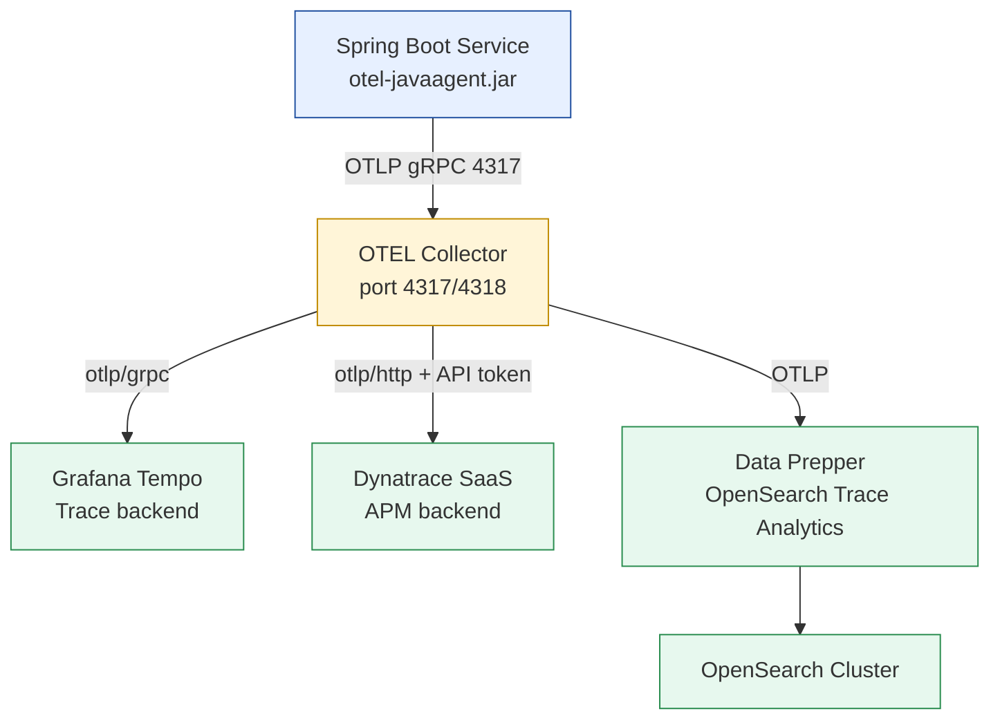
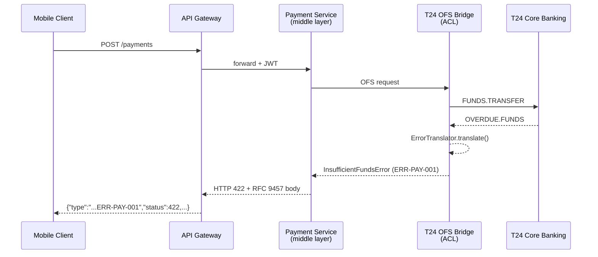

# Wave 2a — Observability, Platform & Standards Implementation Plan

> **For agentic workers:** REQUIRED SUB-SKILL: Use superpowers:subagent-driven-development (recommended) or superpowers:executing-plans to implement this plan task-by-task. Steps use checkbox (`- [ ]`) syntax for tracking.

**Goal:** Author 10 new catalog pattern documents across two new domains (Observability, Platform) and three integration extensions (INT-010/011/012), plus an in-place enhancement to PRIN-001, closing gaps in OTEL instrumentation, trace propagation, structured logging, SLO alerting, async middleware observability, service mesh traffic management, CNCF stack governance, AsyncAPI/CloudEvents contracts, and error code mapping.

**Architecture:** Two new subdirectories (`knowledge-base/patterns/observability/`, `knowledge-base/patterns/platform/`) each following the same ops-runbook depth format as existing docs. All docs use the full section template: Problem Statement → Solution (Mermaid) → Implementation Guidelines (Java 21/Spring Boot 3.x + OTEL SDK) → NFR Acceptance Criteria → Compliance Mapping (3-ring) → Cost/FinOps Notes → Threat Model Summary → Operational Runbook → Test Strategy → Related Patterns → References → Key Takeaway.

**Tech Stack:** Java 21, Spring Boot 3.x, OpenTelemetry Java SDK 2.x, OTEL Java Agent 2.x, Micrometer Tracing, Logback, Istio 1.22, Prometheus, Grafana Tempo, Dynatrace SaaS, OpenSearch 2.x, AsyncAPI 3.0, CloudEvents 1.0, RFC 9457.

---

## Reference: Canonical Document Structure

Every new document MUST follow this exact section order (model: `knowledge-base/patterns/resilience/circuit-breaker.md`):

```
# [Pattern Name]

Status: Draft | Last Reviewed: 2026-05-10 | Owner: @<owner>
Catalog ID: <ID> | Radii
Tier Applicability: T0, T1[, T2[, T3]]

## Problem Statement
## Solution
  ```mermaid ...```
## Implementation Guidelines
  (numbered list with Java code blocks)
## NFR Acceptance Criteria
## Compliance Mapping
  | Layer | Reference | Section/Control | How this satisfies |
## Cost / FinOps Notes
## Threat Model Summary
## Operational Runbook (stub)
## Test Strategy (stub)
## Related Patterns
## References
---
**Key Takeaway**: ...
```

---

## File Map

| Task | Action | Path |
|---|---|---|
| 1 | Create dirs + inventory | `knowledge-base/patterns/observability/`, `knowledge-base/patterns/platform/`, `governance/standards/_catalog-inventory.yml` |
| 2 | Create | `knowledge-base/patterns/observability/otel-instrumentation.md` |
| 3 | Create | `knowledge-base/patterns/observability/distributed-trace-propagation.md` |
| 4 | Create | `knowledge-base/patterns/observability/structured-logging-standard.md` |
| 5 | Create | `knowledge-base/patterns/observability/slo-alerting.md` |
| 6 | Create | `knowledge-base/patterns/observability/async-middleware-observability.md` |
| 7 | Create | `knowledge-base/patterns/platform/service-mesh-traffic.md` |
| 8 | Create | `knowledge-base/patterns/platform/cncf-stack-selection.md` |
| 9 | Create | `knowledge-base/patterns/integration/asyncapi-specification.md` |
| 10 | Create | `knowledge-base/patterns/integration/cloudevents-envelope.md` |
| 11 | Create | `knowledge-base/patterns/integration/error-code-mapping.md` |
| 12 | Modify | `knowledge-base/principles/api-first-design.md` |
| 13 | Verify | `scripts/check-compliance-rows.py`, all new docs |

---

## Task 1: Setup — Directories + Catalog Inventory

**Files:**
- Create dir: `knowledge-base/patterns/observability/` (add `.gitkeep` placeholder, removed after Task 2)
- Create dir: `knowledge-base/patterns/platform/` (add `.gitkeep` placeholder, removed after Task 7)
- Modify: `governance/standards/_catalog-inventory.yml`

- [ ] **Step 1: Create new domain directories**

```bash
mkdir -p knowledge-base/patterns/observability
mkdir -p knowledge-base/patterns/platform
touch knowledge-base/patterns/observability/.gitkeep
touch knowledge-base/patterns/platform/.gitkeep
```

- [ ] **Step 2: Add 10 new rows to the catalog inventory**

Open `governance/standards/_catalog-inventory.yml`. At the end of the `rows:` list (after the `BP-011` entry), append the following YAML block exactly:

```yaml
- id: OBS-001
  title: OpenTelemetry Instrumentation
  category: observability
  status: Draft
  owner: sre-lead
  path: knowledge-base/patterns/observability/otel-instrumentation.md
  tiers: [T0, T1, T2, T3]
  spine_or_radii: radii
  compliance_refs:
    ring0: [NIST SP 800-92]
    ring1: [BCBS 239 §6]
    ring2: [SBV Circular 09/2020 §IV.3]
  last_reviewed: '2026-05-10'
  notes: Wave 2a
  target_wave: 2
- id: OBS-002
  title: Distributed Trace Propagation
  category: observability
  status: Draft
  owner: sre-lead
  path: knowledge-base/patterns/observability/distributed-trace-propagation.md
  tiers: [T0, T1, T2]
  spine_or_radii: radii
  compliance_refs:
    ring0: [W3C TraceContext]
    ring1: [BCBS 239 §6]
    ring2: [SBV Circular 09/2020 §IV.3]
  last_reviewed: '2026-05-10'
  notes: Wave 2a
  target_wave: 2
- id: OBS-003
  title: Structured Logging Standard
  category: observability
  status: Draft
  owner: sre-lead
  path: knowledge-base/patterns/observability/structured-logging-standard.md
  tiers: [T0, T1, T2, T3]
  spine_or_radii: radii
  compliance_refs:
    ring0: [NIST SP 800-92, PCI-DSS §10.3]
    ring1: [BCBS 239 §6]
    ring2: [Decree 13/2023 Art. 9, SBV Circular 09/2020 §IV.3]
  last_reviewed: '2026-05-10'
  notes: Wave 2a
  target_wave: 2
- id: OBS-004
  title: SLO Alerting
  category: observability
  status: Draft
  owner: sre-lead
  path: knowledge-base/patterns/observability/slo-alerting.md
  tiers: [T0, T1, T2]
  spine_or_radii: radii
  compliance_refs:
    ring0: [Google SRE Book]
    ring1: [BCBS 230 Principle 2]
    ring2: [SBV Circular 09/2020 §IV.2]
  last_reviewed: '2026-05-10'
  notes: Wave 2a
  target_wave: 2
- id: OBS-005
  title: Async Middleware Observability
  category: observability
  status: Draft
  owner: sre-lead
  path: knowledge-base/patterns/observability/async-middleware-observability.md
  tiers: [T0, T1]
  spine_or_radii: radii
  compliance_refs:
    ring0: [OpenTelemetry Specification]
    ring1: [BCBS 239 §6]
    ring2: [SBV Circular 09/2020 §IV.2]
  last_reviewed: '2026-05-10'
  notes: Wave 2a
  target_wave: 2
- id: PLT-001
  title: Service Mesh Traffic Management
  category: platform
  status: Draft
  owner: platform-lead
  path: knowledge-base/patterns/platform/service-mesh-traffic.md
  tiers: [T0, T1]
  spine_or_radii: radii
  compliance_refs:
    ring0: [NIST SP 800-204]
    ring1: [BCBS 230 Principle 4]
    ring2: [SBV Circular 09/2020 §IV.2]
  last_reviewed: '2026-05-10'
  notes: Wave 2a
  target_wave: 2
- id: PLT-002
  title: CNCF Stack Selection
  category: platform
  status: Draft
  owner: ea-board
  path: knowledge-base/patterns/platform/cncf-stack-selection.md
  tiers: [T0, T1, T2, T3]
  spine_or_radii: radii
  compliance_refs:
    ring0: [NIST SP 800-53 SA-4]
    ring1: [BCBS 230 Principle 7]
    ring2: [SBV Circular 09/2020 §III]
  last_reviewed: '2026-05-10'
  notes: Wave 2a
  target_wave: 2
- id: INT-010
  title: AsyncAPI Specification
  category: integration
  status: Draft
  owner: tech-lead-backend
  path: knowledge-base/patterns/integration/asyncapi-specification.md
  tiers: [T0, T1, T2]
  spine_or_radii: radii
  compliance_refs:
    ring0: [AsyncAPI 3.0 Specification]
    ring1: [BCBS 239 §6, SWIFT CSP 2024 §5]
    ring2: [SBV Circular 09/2020 §IV.2]
  last_reviewed: '2026-05-10'
  notes: Wave 2a
  target_wave: 2
- id: INT-011
  title: CloudEvents Envelope Standard
  category: integration
  status: Draft
  owner: tech-lead-backend
  path: knowledge-base/patterns/integration/cloudevents-envelope.md
  tiers: [T0, T1, T2]
  spine_or_radii: radii
  compliance_refs:
    ring0: [CloudEvents 1.0 Specification]
    ring1: [BCBS 239 §6]
    ring2: [SBV Circular 09/2020 §IV.2]
  last_reviewed: '2026-05-10'
  notes: Wave 2a
  target_wave: 2
- id: INT-012
  title: Error Code Mapping and Propagation
  category: integration
  status: Draft
  owner: tech-lead-backend
  path: knowledge-base/patterns/integration/error-code-mapping.md
  tiers: [T0, T1, T2]
  spine_or_radii: radii
  compliance_refs:
    ring0: [RFC 9457, OWASP Error Handling]
    ring1: [BCBS 239 §6, PCI-DSS §6.5]
    ring2: [SBV Circular 09/2020 §IV.3]
  last_reviewed: '2026-05-10'
  notes: Wave 2a
  target_wave: 2
```

- [ ] **Step 3: Verify inventory update**

```bash
python3 -c "
import yaml
with open('governance/standards/_catalog-inventory.yml') as f:
    data = yaml.safe_load(f)
rows = data['rows']
new_ids = ['OBS-001','OBS-002','OBS-003','OBS-004','OBS-005','PLT-001','PLT-002','INT-010','INT-011','INT-012']
found = [r['id'] for r in rows if r['id'] in new_ids]
print('Found:', sorted(found))
assert sorted(found) == sorted(new_ids), 'Missing entries!'
print('Total rows:', len(rows))
"
```
Expected output: `Found: ['INT-010', 'INT-011', 'INT-012', 'OBS-001', 'OBS-002', 'OBS-003', 'OBS-004', 'OBS-005', 'PLT-001', 'PLT-002']`

- [ ] **Step 4: Commit setup**

```bash
git add governance/standards/_catalog-inventory.yml \
        knowledge-base/patterns/observability/.gitkeep \
        knowledge-base/patterns/platform/.gitkeep
git commit -m "feat(catalog): Wave 2a setup — observability/ and platform/ domains + inventory rows"
```

---

## Task 2: OBS-001 — OpenTelemetry Instrumentation

**Files:**
- Create: `knowledge-base/patterns/observability/otel-instrumentation.md`
- Delete: `knowledge-base/patterns/observability/.gitkeep`

- [ ] **Step 1: Remove the placeholder and create the document**

```bash
rm knowledge-base/patterns/observability/.gitkeep
```

Write `knowledge-base/patterns/observability/otel-instrumentation.md` with the following complete content (target: 380–430 lines):

```markdown
# OpenTelemetry Instrumentation

Status: Draft | Last Reviewed: 2026-05-10 | Owner: @sre-lead
Catalog ID: OBS-001 | Radii
Tier Applicability: T0, T1, T2, T3

## Problem Statement

Without consistent telemetry instrumentation:
- Engineers instrument ad hoc: traces don't correlate across services
- Vendor lock-in: switching APM tools requires code changes
- T24 OFS calls, NAPAS payment flows invisible in distributed traces
- Business events (payment authorised, KYC approved) not surfaced as spans
- Multi-backend requirements (Grafana Tempo + Dynatrace + OpenSearch) duplicated in code

## Solution

Standardise on the OpenTelemetry Java SDK + Agent. The OTEL Collector fans out telemetry to all three backends without code changes.



## Implementation Guidelines

### 1. Agent Attachment

Add to every service's JVM startup (Kubernetes `args` or CI deploy config):

```yaml
# kubernetes/deployment.yaml
spec:
  containers:
    - name: payment-gateway
      image: techcombank/payment-gateway:2.3.1
      env:
        - name: JAVA_TOOL_OPTIONS
          value: >-
            -javaagent:/opt/otel/opentelemetry-javaagent.jar
            -Dotel.service.name=payment-gateway
            -Dotel.resource.attributes=service.version=2.3.1,deployment.environment=production,service.tier=T0
            -Dotel.exporter.otlp.endpoint=http://otel-collector:4317
            -Dotel.exporter.otlp.protocol=grpc
            -Dotel.logs.exporter=none
            -Dotel.metrics.exporter=prometheus
```

Spring Boot `application.yml` complement:

```yaml
management:
  tracing:
    sampling:
      probability: 0.5   # overridden per-tier in Step 4
  otlp:
    tracing:
      endpoint: http://otel-collector:4317
```

### 2. OTEL Collector Configuration

`otel-collector/config.yaml` — governs fan-out to all three backends:

```yaml
receivers:
  otlp:
    protocols:
      grpc:
        endpoint: 0.0.0.0:4317
      http:
        endpoint: 0.0.0.0:4318

processors:
  batch:
    timeout: 5s
    send_batch_size: 1024
  resource:
    attributes:
      - action: upsert
        key: bank.environment
        value: production
  memory_limiter:
    limit_mib: 512

exporters:
  otlp/tempo:
    endpoint: http://tempo:4317
    tls:
      insecure: true

  otlphttp/dynatrace:
    endpoint: https://${env:DT_TENANT}.live.dynatrace.com/api/v2/otlp
    headers:
      Authorization: "Api-Token ${env:DT_API_TOKEN}"

  otlp/dataprepper:
    endpoint: http://data-prepper:21890
    tls:
      insecure: true

service:
  pipelines:
    traces:
      receivers: [otlp]
      processors: [memory_limiter, batch, resource]
      exporters: [otlp/tempo, otlphttp/dynatrace, otlp/dataprepper]
    metrics:
      receivers: [otlp]
      processors: [memory_limiter, batch]
      exporters: [otlphttp/dynatrace]
```

### 3. Manual Instrumentation — Business-Critical Spans

Use `@WithSpan` for service-layer methods; add banking-specific attributes with `Span.current()`:

```java
import io.opentelemetry.api.trace.Span;
import io.opentelemetry.instrumentation.annotations.WithSpan;
import io.opentelemetry.instrumentation.annotations.SpanAttribute;

@Service
public class PaymentGatewayService {

  @WithSpan("payment.authorise")
  public AuthorisationResult authorisePayment(
      @SpanAttribute("payment.reference") String reference,
      @SpanAttribute("payment.amount")    BigDecimal amount,
      @SpanAttribute("payment.currency")  String currency) {

    Span span = Span.current();
    span.setAttribute("napas.channel", resolveChannel(reference));
    span.setAttribute("customer.tier", customerTierService.getTier());
    span.setAttribute("t24.ofs.function", "FUNDS.TRANSFER");

    try {
      AuthorisationResult result = t24OfsClient.authorise(reference, amount, currency);
      span.setAttribute("payment.approved", result.isApproved());
      return result;
    } catch (OfsException e) {
      span.recordException(e);
      span.setStatus(StatusCode.ERROR, "OFS call failed");
      throw e;
    }
  }
}
```

### 4. Sampling Strategy

Configure via OTEL Collector's tail-based sampler (Jaeger Remote Sampler or Collector-based):

| Tier | Strategy | Rate |
|---|---|---|
| T0 | Always-on (head-based) | 100% |
| T1 | Head-based probabilistic | 50% |
| T2 | Head-based probabilistic | 10% |
| T3 | Head-based probabilistic | 10% |
| Any tier — error traces | Tail-based (always sampled) | 100% |

```yaml
# otel-collector/config.yaml — add tail sampler
processors:
  tail_sampling:
    decision_wait: 10s
    policies:
      - name: error-policy
        type: status_code
        status_code: {status_codes: [ERROR]}
      - name: t0-always
        type: string_attribute
        string_attribute: {key: service.tier, values: [T0]}
      - name: probabilistic-t1
        type: and
        and:
          and_sub_policy:
            - name: t1-tier
              type: string_attribute
              string_attribute: {key: service.tier, values: [T1]}
            - name: t1-rate
              type: probabilistic
              probabilistic: {sampling_percentage: 50}
      - name: probabilistic-t2t3
        type: probabilistic
        probabilistic: {sampling_percentage: 10}
```

### 5. Resource Detection

Add Kubernetes resource detector to the OTEL agent so all spans carry pod/node metadata automatically:

```
-Dotel.resource.providers.aws.enabled=false
-Dotel.resource.providers.gcp.enabled=false
-Dotel.resource.providers.k8s.enabled=true
```

Manifest version attribution — ensure `MANIFEST.MF` contains `Implementation-Version` (set by Maven/Gradle build):

```xml
<!-- pom.xml -->
<plugin>
  <artifactId>maven-jar-plugin</artifactId>
  <configuration>
    <archive>
      <manifest>
        <addDefaultImplementationEntries>true</addDefaultImplementationEntries>
      </manifest>
    </archive>
  </configuration>
</plugin>
```

## NFR Acceptance Criteria

- **T0 traces**: 100% sampled; P99 span export latency < 100ms from span end to Tempo ingestion.
- **Error traces**: always sampled regardless of tier; zero error traces dropped.
- **Agent overhead**: < 2% CPU overhead in steady state (measured via load test before/after `-javaagent` attach).
- **OTEL Collector availability**: runs as DaemonSet per node; pod disruption budget forbids more than 1 node unavailable at once.
- **Backend fan-out**: a Collector crash must not drop data silently — use `memory_limiter` + `batch` with retry. Alert on `otelcol_exporter_send_failed_spans > 0`.

## Compliance Mapping

| Layer | Reference | Section/Control | How this satisfies |
|---|---|---|---|
| Ring 0 (generic) | NIST SP 800-92 (Guide to Log Management) | §4.3 Trace and audit trail requirements | OTEL traces provide immutable per-request audit records for all T0 operations |
| Ring 0 (generic) | OpenTelemetry Specification (CNCF) | Trace data model; SDK API contract | Canonical vendor-neutral implementation; prevents lock-in |
| Ring 1 (intl banking) | BCBS 239 §6 Accuracy | "Data aggregation processes shall be accurate" | Distributed traces correlate every hop of a payment, enabling accurate incident reconstruction |
| Ring 1 (intl banking) | SWIFT CSP 2024 §6.5A | Detect anomalous activity — logging and monitoring | Trace-level visibility into SWIFT connector calls supports anomaly detection |
| Ring 2 (Vietnam) | SBV Circular 09/2020 §IV.3 ⚠️ (working summary — pending Legal review) | IT audit trail requirements | Traces + structured logs satisfy audit trail requirements for core banking operations |

## Cost / FinOps Notes

| Item | Driver | Order of magnitude |
|---|---|---|
| OTEL Java Agent | Open-source, CNCF | $0 |
| OTEL Collector (DaemonSet) | ~64 MB RAM per node × node count | Negligible vs node cost |
| Grafana Tempo (traces) | ~1 GB/day T0+T1 @ 10% sampling | Storage cost only; no per-span cost |
| Dynatrace | Davis AI + trace ingestion | Licensed separately; negotiate DPU cap with vendor |
| OpenSearch (Data Prepper) | Managed OpenSearch storage | ~$0.10/GB/month; ILM keeps hot tier small |

**Cost of NOT instrumented**: a P1 incident requiring 4-hour manual log correlation across 8 services costs ~32 engineer-hours. A single such incident per quarter exceeds a year of Tempo + OpenSearch storage costs.

## Threat Model Summary

STRIDE focus: **Information Disclosure** and **Elevation of Privilege** via telemetry data.

- **Top 3 threats addressed**:
  1. *PII in span attributes* — `@SpanAttribute` annotations reviewed in code review gate; attribute allowlist enforced in OTEL Collector processor (redact `customer.pan`, `customer.cccd`).
  2. *Trace injection (spoofed `traceparent`)* — validate `traceparent` format at API Gateway; reject malformed headers.
  3. *OTEL Collector as single point of failure* — DaemonSet; Collector crash causes graceful degradation (traces lost, service continues); alert on `otelcol_exporter_enqueue_failed_spans`.
- **Top 3 residual threats**:
  1. *Span attributes over-logged by developers* — mitigation: quarterly span attribute audit; code review checklist includes "no PAN/password in span".
  2. *Dynatrace API token leaked* — mitigation: token stored in HashiCorp Vault; rotated quarterly; token scoped to `Ingest metrics,traces` only.
  3. *Sampling gaps at T2/T3 hiding intermittent errors* — mitigation: tail-based error policy always samples errors regardless of tier.

## Operational Runbook (stub)

**Alerts:**
- `OtelCollectorExportFailed`: `otelcol_exporter_send_failed_spans > 0` for 2 min → PagerDuty P2. Check Collector logs; verify backend connectivity.
- `TraceIngestLag`: Tempo ingest lag > 30s → P2. Check Collector queue depth; scale Collector replicas.
- `DtOtlpAuthFailure`: Dynatrace exporter auth errors → P2. Rotate API token in Vault; redeploy Collector.

**Dashboards:** Grafana — `otel-collector-health` (span throughput, export errors, queue depth, memory usage).

**On-call playbook:**
1. Check `otel-collector-health` dashboard for export errors.
2. `kubectl logs -n monitoring -l app=otel-collector --tail=100` for error details.
3. If Collector pod OOMKilled: increase `memory_limiter.limit_mib` in ConfigMap; rolling restart.
4. If Dynatrace export failing: verify `DT_API_TOKEN` secret in Vault; check DT tenant status page.
5. Tempo/OpenSearch failures: traces buffer in Collector queue for up to 5 min; then dropped. Escalate to platform team.

## Test Strategy (stub)

- **Unit**: `@WithSpan` annotated methods produce a span with correct attributes — use `InMemorySpanExporter` from `opentelemetry-sdk-testing`.
- **Integration**: `Testcontainers` spins up OTEL Collector + Jaeger (as test trace backend); assert payment flow produces parent→child span chain with `payment.reference` attribute set.
- **Contract**: Collector config YAML linted with `otelcol validate --config config.yaml` in CI.
- **Sampling**: load test with Gatling at T1 sampling rate (50%); assert actual sampled rate within ±5% of target.
- **Overhead**: JMH benchmark of instrumented vs uninstrumented `authorisePayment`; fail build if overhead > 3%.

## Related Patterns

- [OBS-002 Distributed Trace Propagation](distributed-trace-propagation.md) — how `traceparent` crosses service/protocol boundaries
- [OBS-003 Structured Logging Standard](structured-logging-standard.md) — logs correlated via `traceId` from OTEL context
- [OBS-004 SLO Alerting](slo-alerting.md) — SLI measurements derived from OTEL metrics
- [OBS-005 Async Middleware Observability](async-middleware-observability.md) — OTEL propagation through Kafka/SQS
- [PLT-001 Service Mesh Traffic Management](../platform/service-mesh-traffic.md) — Istio telemetry feeds OTEL Collector
- [PLT-002 CNCF Stack Selection](../platform/cncf-stack-selection.md) — Grafana Tempo, OpenSearch governed selection
- [BP-007 Golden Signals (SRE)](../../best-practices/golden-signals-sre.md) — traces → latency signal
- [PRIN-001 API-First Design](../../principles/api-first-design.md) — OTEL applied to APIs

## References

- [OpenTelemetry Java Agent](https://opentelemetry.io/docs/zero-code/java/agent/)
- [OTEL Collector Documentation](https://opentelemetry.io/docs/collector/)
- [Grafana Tempo OTEL Integration](https://grafana.com/docs/tempo/latest/)
- [Dynatrace OTLP Ingest](https://docs.dynatrace.com/docs/extend-dynatrace/opentelemetry/)
- [OpenSearch Data Prepper OTEL](https://opensearch.org/docs/latest/data-prepper/)

---

**Key Takeaway**: Attach the OTEL Java Agent; route through a shared OTEL Collector that fans out to Grafana Tempo, Dynatrace, and OpenSearch. Use `@WithSpan` for business-critical banking events; never hardcode PAN or customer credentials into span attributes.
```

- [ ] **Step 2: Verify line count**

```bash
wc -l knowledge-base/patterns/observability/otel-instrumentation.md
```
Expected: 380–430 lines.

- [ ] **Step 3: Commit**

```bash
git add knowledge-base/patterns/observability/otel-instrumentation.md \
        knowledge-base/patterns/observability/.gitkeep
git commit -m "feat(catalog): OBS-001 OpenTelemetry Instrumentation — Wave 2a"
```

---

## Task 3: OBS-002 — Distributed Trace Propagation

**Files:**
- Create: `knowledge-base/patterns/observability/distributed-trace-propagation.md`

- [ ] **Step 1: Write the document**

Write `knowledge-base/patterns/observability/distributed-trace-propagation.md` (target: 400–450 lines) with these mandatory sections and content:

**Header:**
```
Status: Draft | Last Reviewed: 2026-05-10 | Owner: @sre-lead
Catalog ID: OBS-002 | Radii
Tier Applicability: T0, T1, T2
```

**Problem Statement:** Traces break at protocol boundaries — Kafka consumer starts a new trace with no link to the producer; gRPC calls lose `traceparent`; WebSocket upgrades drop headers; QUIC frames require explicit header injection. Without standards, root-cause analysis requires manual correlation.

**Solution Mermaid — sequence diagram** showing `traceparent` flowing from HTTP Client → API Gateway → Order Service (HTTP) → Payment Service (gRPC) → Kafka producer → Kafka consumer → async span with `FOLLOWS_FROM` link back to producer span.

**Implementation Guidelines — must include all 8 entries from the spec's protocol table plus full Java code for each:**

```java
// ── 1. HTTP (auto — Spring Boot + Micrometer Tracing) ──────────────────
// No code required: Spring Boot 3 auto-configures W3C propagation via
// Micrometer Tracing + OTEL bridge when otel-javaagent is present.

// ── 2. gRPC ─────────────────────────────────────────────────────────────
@Configuration
public class GrpcTracingConfig {
  @Bean
  public GrpcTelemetry grpcTelemetry(OpenTelemetry openTelemetry) {
    return GrpcTelemetry.create(openTelemetry);
  }

  @Bean
  public ClientInterceptor grpcClientInterceptor(GrpcTelemetry grpcTelemetry) {
    return grpcTelemetry.newClientInterceptor();
  }

  @Bean
  public ServerInterceptor grpcServerInterceptor(GrpcTelemetry grpcTelemetry) {
    return grpcTelemetry.newServerInterceptor();
  }
}

// ── 3. WebSocket (STOMP) ─────────────────────────────────────────────────
@Component
public class TraceContextHandshakeInterceptor implements HandshakeInterceptor {

  private final TextMapPropagator propagator =
      GlobalOpenTelemetry.getPropagators().getTextMapPropagator();

  @Override
  public boolean beforeHandshake(ServerHttpRequest request,
                                  ServerHttpResponse response,
                                  WebSocketHandler wsHandler,
                                  Map<String, Object> attributes) {
    // Extract W3C context from HTTP upgrade headers
    Context ctx = propagator.extract(Context.current(),
        request.getHeaders(), HttpHeadersGetter.INSTANCE);
    attributes.put("otel.context", ctx);
    return true;
  }
}

// In STOMP message handler — restore context from session attributes:
@MessageMapping("/payments")
public void handlePayment(SimpMessageHeaderAccessor accessor,
                           PaymentMessage msg) {
  Context ctx = (Context) accessor.getSessionAttributes().get("otel.context");
  try (Scope scope = ctx.makeCurrent()) {
    // span inherits the traceparent from the HTTP upgrade
    processPayment(msg);
  }
}

// ── 4. Kafka ─────────────────────────────────────────────────────────────
@Configuration
public class KafkaTracingConfig {

  @Bean
  public KafkaTelemetry kafkaTelemetry(OpenTelemetry openTelemetry) {
    return KafkaTelemetry.create(openTelemetry);
  }

  @Bean
  public ProducerFactory<String, Object> tracedProducerFactory(
      KafkaTelemetry kafkaTelemetry,
      ProducerFactory<String, Object> factory) {
    return kafkaTelemetry.wrap(factory);
  }

  @Bean
  public ConsumerFactory<String, Object> tracedConsumerFactory(
      KafkaTelemetry kafkaTelemetry,
      ConsumerFactory<String, Object> factory) {
    // Consumer spans use FOLLOWS_FROM, not CHILD_OF
    return kafkaTelemetry.wrap(factory);
  }
}

// ── 5. SQS ──────────────────────────────────────────────────────────────
// AWS SDK v2 + opentelemetry-aws-sdk-2.2 auto-instruments SQS.
// traceparent injected as MessageAttribute (String type).
// Add to build:
// implementation 'io.opentelemetry.instrumentation:opentelemetry-aws-sdk-2.2'

// ── 6. ActiveMQ / JMS ───────────────────────────────────────────────────
// opentelemetry-jms-1.1 auto-instruments JMS producers/consumers.
// traceparent stored as JMS StringProperty "traceparent".
// Add to build:
// implementation 'io.opentelemetry.instrumentation:opentelemetry-jms-1.1'
```

**Standards decisions section:**
- W3C TraceContext only; B3 propagation disabled (`-Dotel.propagators=tracecontext,baggage`)
- `CHILD_OF` for synchronous RPC; `FOLLOWS_FROM` for async consumer spans
- Baggage: `customer.tier` and `payment.reference` propagated as W3C Baggage for downstream sampling/filtering

**Protocol reference table (include in full):**

```markdown
| Protocol | Carrier | Key | Relationship | Library/Config |
|---|---|---|---|---|
| HTTP/HTTPS | Request header | `traceparent`, `tracestate` | CHILD_OF | Spring auto (OTEL bridge) |
| gRPC | Metadata | `traceparent` | CHILD_OF | `opentelemetry-grpc-1.6` |
| WebSocket/STOMP | HTTP upgrade header | `traceparent` | CHILD_OF | Manual interceptor (see §3 above) |
| QUIC / HTTP/3 | HEADERS frame | `traceparent` | CHILD_OF | Netty QUIC + OTEL HTTP instrumentation |
| Kafka | Message header | `traceparent` | FOLLOWS_FROM | `opentelemetry-kafka-clients-2.6` |
| SQS | MessageAttribute (String) | `traceparent` | FOLLOWS_FROM | `opentelemetry-aws-sdk-2.2` |
| SNS → SQS | SNS MessageAttribute passthrough | `traceparent` | FOLLOWS_FROM | No special handling; SNS passes through |
| ActiveMQ / JMS | JMS StringProperty | `traceparent` | FOLLOWS_FROM | `opentelemetry-jms-1.1` |
```

**Remaining sections:** NFR Acceptance Criteria, 3-ring Compliance Mapping (BCBS 239 §6, W3C TraceContext spec Ring 0; BCBS 230 Principle 6 ⚠️ Ring 1; SBV Circular 09/2020 §IV.3 ⚠️ Ring 2), Cost/FinOps Notes, Threat Model (STRIDE: Spoofing via injected `traceparent`; mitigation: validate format at gateway), Operational Runbook (alert: `TracePropagationGap` — spans with no parent but not the root service → investigate broken propagation at the boundary), Test Strategy (integration test: 8-hop trace via all 8 protocols; assert single trace ID), Related Patterns, References.

- [ ] **Step 2: Verify line count**

```bash
wc -l knowledge-base/patterns/observability/distributed-trace-propagation.md
```
Expected: 400–450 lines.

- [ ] **Step 3: Commit**

```bash
git add knowledge-base/patterns/observability/distributed-trace-propagation.md
git commit -m "feat(catalog): OBS-002 Distributed Trace Propagation — Wave 2a"
```

---

## Task 4: OBS-003 — Structured Logging Standard

**Files:**
- Create: `knowledge-base/patterns/observability/structured-logging-standard.md`

- [ ] **Step 1: Write the document**

Write `knowledge-base/patterns/observability/structured-logging-standard.md` (target: 370–420 lines).

**Header:**
```
Status: Draft | Last Reviewed: 2026-05-10 | Owner: @sre-lead
Catalog ID: OBS-003 | Radii
Tier Applicability: T0, T1, T2, T3
```

**Problem Statement:** Ad-hoc logging: inconsistent field names, PII in logs, no index lifecycle policy, traces not correlated via `traceId`. Audit-trail gaps violate BCBS 239 and Decree 13/2023 PII requirements.

**Solution Mermaid — flowchart** showing: Application → Logback appender (MaskingConverter) → JSON log line → Fluent Bit sidecar → [OpenSearch index + Dynatrace log ingest].

**Mandatory JSON log schema — include the complete JSON example:**

```json
{
  "timestamp": "2026-05-10T10:30:15.123Z",
  "level": "INFO",
  "logger": "com.techcombank.payment.PaymentGatewayService",
  "service.name": "payment-gateway",
  "service.version": "2.3.1",
  "environment": "production",
  "tier": "T0",
  "traceId": "4bf92f3577b34da6a3ce929d0e0e4736",
  "spanId": "00f067aa0ba902b7",
  "message": "Payment authorisation approved",
  "payment.reference": "TCB-2026-001234",
  "napas.channel": "IBFT",
  "duration_ms": 187
}
```

**Logback MaskingConverter — include complete implementation:**

```java
public class PiiMaskingConverter extends ClassicConverter {

  private static final Set<String> MASKED_KEYS = Set.of(
      "pan", "cvv", "accountNumber", "cccdNumber", "biometricHash",
      "password", "pin", "otp", "customerId"
  );

  private static final Pattern KEY_VALUE_PATTERN =
      Pattern.compile("\"(" + String.join("|", MASKED_KEYS) + ")\"\\s*:\\s*\"([^\"]+)\"");

  @Override
  public String convert(ILoggingEvent event) {
    String msg = event.getFormattedMessage();
    return KEY_VALUE_PATTERN.matcher(msg).replaceAll(m ->
        "\"" + m.group(1) + "\":\"***" + maskTail(m.group(2)) + "\"");
  }

  private String maskTail(String value) {
    if (value.length() <= 4) return "****";
    return value.substring(value.length() - 4);
  }
}
```

```xml
<!-- logback-spring.xml -->
<configuration>
  <conversionRule conversionWord="pii"
      converterClass="com.techcombank.logging.PiiMaskingConverter"/>

  <appender name="STDOUT" class="ch.qos.logback.core.ConsoleAppender">
    <encoder class="net.logstash.logback.encoder.LogstashEncoder">
      <provider class="net.logstash.logback.composite.loggingevent.LogstashMarkersJsonProvider"/>
    </encoder>
  </appender>
</configuration>
```

**Log levels policy table:**

```markdown
| Level | When to use | Examples |
|---|---|---|
| ERROR | Requires immediate attention; SLA breach risk | Payment declined due to OFS timeout, DB connection lost |
| WARN | Suspicious but not failing | Retry attempt 2/3, slow query > 500ms, cache miss rate > 30% |
| INFO | Important business events | Order created, payment authorised, KYC approved, user logged in |
| DEBUG | Detailed troubleshooting — disabled in production | Method entry/exit, SQL parameters, HTTP headers |
```

**OpenSearch index lifecycle (ILM) policy — include complete JSON for T0:**

```json
{
  "policy": {
    "phases": {
      "hot": {
        "min_age": "0ms",
        "actions": { "rollover": { "max_size": "50gb", "max_age": "7d" } }
      },
      "warm": {
        "min_age": "7d",
        "actions": { "shrink": { "number_of_shards": 1 }, "forcemerge": { "max_num_segments": 1 } }
      },
      "cold": {
        "min_age": "30d",
        "actions": { "freeze": {} }
      },
      "delete": {
        "min_age": "5y",
        "actions": { "delete": {} }
      }
    }
  }
}
```
Note: T2/T3 ILM: hot 3d → warm 14d → delete 90d.

**Fluent Bit sidecar config — show dynatrace output plugin:**

```ini
[OUTPUT]
    Name              dynatrace
    Match             *
    Host              ${DT_TENANT}.live.dynatrace.com
    apitoken          ${DT_LOG_INGEST_TOKEN}
    logIngestUrl      /api/v2/logs/ingest
    tlsSkipVerify     false
```

**Remaining sections:** NFR Acceptance Criteria (zero PII in logs verified by regex scan in CI), 3-ring Compliance Mapping (NIST SP 800-92 Ring 0; PCI-DSS §10.3 log integrity Ring 0; BCBS 239 §6 Ring 1; Decree 13/2023 Art. 9 ⚠️ Ring 2; SBV Circular 09/2020 §IV.3 ⚠️ Ring 2), Cost/FinOps Notes (OpenSearch storage cost estimate by tier), Threat Model (PII disclosure via unmasked logs — mitigation: MaskingConverter at emission; DLP scan on OpenSearch indexes), Operational Runbook, Test Strategy (unit: MaskingConverter masks `pan` field; integration: log line JSON validated against mandatory schema; CI: grep for `customerId.*:.*[0-9]{8}` in test logs fails build), Related Patterns (OBS-001, OBS-004, OBS-005), References.

- [ ] **Step 2: Verify line count**

```bash
wc -l knowledge-base/patterns/observability/structured-logging-standard.md
```
Expected: 370–420 lines.

- [ ] **Step 3: Commit**

```bash
git add knowledge-base/patterns/observability/structured-logging-standard.md
git commit -m "feat(catalog): OBS-003 Structured Logging Standard — Wave 2a"
```

---

## Task 5: OBS-004 — SLO Alerting

**Files:**
- Create: `knowledge-base/patterns/observability/slo-alerting.md`

- [ ] **Step 1: Write the document**

Write `knowledge-base/patterns/observability/slo-alerting.md` (target: 360–410 lines).

**Header:**
```
Status: Draft | Last Reviewed: 2026-05-10 | Owner: @sre-lead
Catalog ID: OBS-004 | Radii
Tier Applicability: T0, T1, T2
```

**Problem Statement:** Without structured SLOs: teams over-alert on symptoms, PagerDuty fatigue grows, error budgets not tracked, SBV/BCBS continuity commitments can't be demonstrated.

**Solution Mermaid — flowchart:** SLI measurement → Prometheus recording rule → error budget calculation → multi-window burn rate → Alertmanager → PagerDuty/Slack.

**Error budget table (from spec):**

```markdown
| Tier | SLO | Error budget (30d) | Fast-burn page | Slow-burn page |
|---|---|---|---|---|
| T0 | 99.95% | 21.9 min | 2% in 1h → P1 PagerDuty | 5% in 6h → P2 PagerDuty |
| T1 | 99.90% | 43.8 min | 5% in 1h → P1 PagerDuty | 10% in 6h → P2 PagerDuty |
| T2 | 99.50% | 3.6 hours | 10% in 6h → P2 PagerDuty | 20% in 3d → Slack only |
```

**Prometheus recording rules — include complete YAML:**

```yaml
groups:
  - name: slo_recording_rules
    interval: 30s
    rules:
      # SLI: request success rate (1-min window)
      - record: job:request_success_rate:ratio_rate1m
        expr: |
          sum(rate(http_server_requests_seconds_count{status!~"5.."}[1m]))
          /
          sum(rate(http_server_requests_seconds_count[1m]))

      # Error rate (complement of success rate)
      - record: job:request_error_rate:ratio_rate1m
        expr: 1 - job:request_success_rate:ratio_rate1m

      # Multi-window: 1h and 6h error rates
      - record: job:request_error_rate:ratio_rate1h
        expr: |
          1 - (
            sum(rate(http_server_requests_seconds_count{status!~"5.."}[1h]))
            /
            sum(rate(http_server_requests_seconds_count[1h]))
          )
      - record: job:request_error_rate:ratio_rate6h
        expr: |
          1 - (
            sum(rate(http_server_requests_seconds_count{status!~"5.."}[6h]))
            /
            sum(rate(http_server_requests_seconds_count[6h]))
          )

  - name: slo_alerts_t0
    rules:
      - alert: T0SloFastBurn
        expr: |
          job:request_error_rate:ratio_rate1h{tier="T0"} > (0.02 * (1 - 0.9995))
        for: 2m
        labels:
          severity: critical
          tier: T0
        annotations:
          summary: "T0 error budget burning fast (>2% in 1h)"
          runbook_url: "https://runbooks.techcombank.com/OBS-004-T0-fast-burn"

      - alert: T0SloSlowBurn
        expr: |
          job:request_error_rate:ratio_rate6h{tier="T0"} > (0.05 * (1 - 0.9995))
        for: 15m
        labels:
          severity: high
          tier: T0
        annotations:
          summary: "T0 error budget burning slowly (>5% in 6h)"
          runbook_url: "https://runbooks.techcombank.com/OBS-004-T0-slow-burn"
```

**Dynatrace SLO definition via DQL (Davis AI) — include example query:**

```dql
# Dynatrace SLO: T0 payment-gateway availability
timeseries success_rate = avg(dt.service.request.success_rate),
  filter: dt.entity.service == "SERVICE-payment-gateway"
| filter success_rate < 0.9995
| summarize burn = (1 - avg(success_rate)) / (1 - 0.9995)
```

Note: Grafana alerting rules reference Prometheus recording rules; Dynatrace SLOs are defined separately in the DT UI/Terraform. No duplicate alert definitions — each backend fires to its own PagerDuty integration key.

**Relation to BP-007:** Explain that BP-007 defines *what* to measure (golden signals: latency, traffic, errors, saturation); OBS-004 defines *how to alert* using those measurements with error budgets. They compose: OBS-004 references BP-007 metrics as SLI data sources.

**Remaining sections:** NFR Acceptance Criteria, 3-ring Compliance Mapping (Google SRE Book / Prometheus Ring 0; BCBS 230 Principle 2 ⚠️ Ring 1; SBV Circular 09/2020 §IV.2 ⚠️ Ring 2), Cost/FinOps Notes, Threat Model (alert fatigue leading to SLO violations going unnoticed — mitigation: multi-window burn rate reduces noise), Operational Runbook (error budget depletion playbook: stop non-critical deployments, escalate to service owner, consider feature-flag rollback), Test Strategy (unit: recording rule expression evaluated against mock Prometheus metrics using `promtool test rules`), Related Patterns (OBS-001 for SLI data source, OBS-005 for async SLIs, BP-007), References (Google SRE Workbook ch. 5 — Alerting on SLOs).

- [ ] **Step 2: Verify line count**

```bash
wc -l knowledge-base/patterns/observability/slo-alerting.md
```
Expected: 360–410 lines.

- [ ] **Step 3: Commit**

```bash
git add knowledge-base/patterns/observability/slo-alerting.md
git commit -m "feat(catalog): OBS-004 SLO Alerting — Wave 2a"
```

---

## Task 6: OBS-005 — Async Middleware Observability

**Files:**
- Create: `knowledge-base/patterns/observability/async-middleware-observability.md`

- [ ] **Step 1: Write the document**

Write `knowledge-base/patterns/observability/async-middleware-observability.md` (target: 350–400 lines).

**Header:**
```
Status: Draft | Last Reviewed: 2026-05-10 | Owner: @sre-lead
Catalog ID: OBS-005 | Radii
Tier Applicability: T0, T1
```

**Problem Statement:** Kafka/SQS/ActiveMQ are opaque to OTEL traces — consumer lag, queue age, and DLQ depth are invisible until business processes stall. DLQ depth > 0 on a T0 payment topic represents a P1 incident, not a background metric.

**Solution Mermaid — sequence diagram:** Producer (injects `traceparent` header) → Kafka topic → Consumer (extracts header, creates `FOLLOWS_FROM` span) → [success path: process] / [failure path: DLQ → alert].

**Per-middleware alerting table — include in full:**

```markdown
| Middleware | Metric | Alert threshold (T0) | Alert threshold (T1) | Action |
|---|---|---|---|---|
| Kafka | `kafka_consumer_group_lag` (JMX) | > 1,000 msgs sustained 5 min | > 5,000 msgs sustained 10 min | P2 PagerDuty; check consumer errors |
| Kafka DLQ | `kafka_topic_partition_current_offset` on `*-dlq` | > 0 for any T0 topic | > 0 sustained 5 min | P1 PagerDuty; immediate human review |
| SQS | `ApproximateAgeOfOldestMessage` (CloudWatch) | > 30s | > 120s | P2 PagerDuty; check consumer errors |
| SQS DLQ | `ApproximateNumberOfMessagesVisible` on `*-dlq` | > 0 | > 5 | P1/P2 PagerDuty |
| SNS | No native lag metric | N/A | N/A | Alert via downstream SQS subscriber |
| ActiveMQ | `activemq_queue_queue_size` (JMX) | > 500 | > 2,000 | P2 PagerDuty; check consumer errors |
```

**Prometheus JMX exporter config for Kafka:**

```yaml
# jmx_exporter/kafka-consumer.yml
rules:
  - pattern: 'kafka.consumer<type=consumer-fetch-manager-metrics, client-id=(.+), topic=(.+), partition=(.+)><>records-lag'
    name: kafka_consumer_records_lag
    labels:
      client_id: "$1"
      topic: "$2"
      partition: "$3"

  - pattern: 'kafka.consumer<type=consumer-coordinator-metrics, client-id=(.+)><>assigned-partitions'
    name: kafka_consumer_assigned_partitions
    labels:
      client_id: "$1"
```

**Prometheus alert rules for Kafka (include full YAML):**

```yaml
- alert: KafkaConsumerLagHigh
  expr: kafka_consumer_records_lag{topic!~".*-dlq"} > 1000
  for: 5m
  labels:
    severity: high
  annotations:
    summary: "Kafka consumer lag > 1000 on topic {{ $labels.topic }}"
    runbook_url: "https://runbooks.techcombank.com/OBS-005-kafka-lag"

- alert: KafkaDlqNonEmpty
  expr: kafka_topic_partition_current_offset{topic=~".*-dlq"} > 0
  for: 0m
  labels:
    severity: critical
  annotations:
    summary: "DLQ {{ $labels.topic }} has messages — immediate review required"
    runbook_url: "https://runbooks.techcombank.com/OBS-005-dlq"
```

**FOLLOWS_FROM explanation:** Consumer span is linked to producer span with `FOLLOWS_FROM` (not `CHILD_OF`) because the consumer executes independently and may run minutes or hours after the producer. The trace is connected for root-cause analysis, but the consumer's timing is not attributed to the producer span.

**OpenSearch audit index for Kafka events:** Explain Kafka audit events indexed to `techcombank-audit-kafka-{yyyy.MM.dd}` for compliance replay. Data Prepper pipeline reads from Kafka via Kafka source → transforms → OpenSearch sink.

**Remaining sections:** NFR Acceptance Criteria (DLQ alert fires within 60s of first message landing; lag alert P99 fires within 10 min of threshold breach), 3-ring Compliance Mapping, Cost/FinOps Notes (JMX scrape overhead < 1% CPU), Threat Model (DLQ as attack surface — attacker poisons DLQ to mask legitimate failures; mitigation: DLQ messages require signed audit trail), Operational Runbook, Test Strategy (integration: publish to Kafka, kill consumer, assert lag alert fires within 10 min; DLQ test: publish malformed message, assert DLQ alert fires within 60s), Related Patterns (EIP-025 Dead Letter Channel, OBS-001, OBS-002, PRIN-002 Event-Driven Architecture), References.

- [ ] **Step 2: Verify line count**

```bash
wc -l knowledge-base/patterns/observability/async-middleware-observability.md
```
Expected: 350–400 lines.

- [ ] **Step 3: Commit**

```bash
git add knowledge-base/patterns/observability/async-middleware-observability.md
git commit -m "feat(catalog): OBS-005 Async Middleware Observability — Wave 2a"
```

---

## Task 7: PLT-001 — Service Mesh Traffic Management

**Files:**
- Create: `knowledge-base/patterns/platform/service-mesh-traffic.md`
- Delete: `knowledge-base/patterns/platform/.gitkeep`

- [ ] **Step 1: Write the document**

```bash
rm knowledge-base/patterns/platform/.gitkeep
```

Write `knowledge-base/patterns/platform/service-mesh-traffic.md` (target: 400–450 lines).

**Header:**
```
Status: Draft | Last Reviewed: 2026-05-10 | Owner: @platform-lead
Catalog ID: PLT-001 | Radii
Tier Applicability: T0, T1
```

**Problem Statement:** Without a service mesh, canary releases require app-level routing code; fault injection requires test environments; inter-pod latency is invisible. SEC-001 covers mTLS/auth but not traffic shaping. Teams manually implement blue/green with Kubernetes Deployments, creating risk on NAPAS cutover.

**Boundary with SEC-001:** SEC-001 owns Istio *security* (mTLS, `PeerAuthentication`, `AuthorizationPolicy`). PLT-001 owns Istio *traffic management* (`VirtualService`, `DestinationRule`, `Telemetry`) and *mesh observability*. Do not duplicate security controls here.

**Solution Mermaid — graph showing:** Client → Gateway → VirtualService (95% stable / 5% canary weight) → [DestinationRule stable subset] / [DestinationRule canary subset] → [Deployment stable v1.2.3] / [Deployment canary v1.3.0-rc1].

**Implementation Guidelines — must include all five areas:**

**1. Canary release — VirtualService + DestinationRule:**

```yaml
# istio/payment-gateway-virtual-service.yaml
apiVersion: networking.istio.io/v1beta1
kind: VirtualService
metadata:
  name: payment-gateway
  namespace: banking
spec:
  hosts:
    - payment-gateway
  http:
    - match:
        - headers:
            x-beta-user:
              exact: "true"
      route:
        - destination:
            host: payment-gateway
            subset: canary
    - route:
        - destination:
            host: payment-gateway
            subset: stable
          weight: 95
        - destination:
            host: payment-gateway
            subset: canary
          weight: 5
---
apiVersion: networking.istio.io/v1beta1
kind: DestinationRule
metadata:
  name: payment-gateway
  namespace: banking
spec:
  host: payment-gateway
  trafficPolicy:
    connectionPool:
      tcp:
        maxConnections: 100
      http:
        http1MaxPendingRequests: 100
        http2MaxRequests: 1000
    outlierDetection:
      consecutive5xxErrors: 5
      interval: 30s
      baseEjectionTime: 30s
  subsets:
    - name: stable
      labels:
        version: stable
    - name: canary
      labels:
        version: canary
```

**2. Fault injection for DR drills:**

```yaml
# istio/t24-connector-fault-injection.yaml (used only during chaos drills)
apiVersion: networking.istio.io/v1beta1
kind: VirtualService
metadata:
  name: t24-ofs-connector-fault
  namespace: banking
spec:
  hosts:
    - t24-ofs-connector
  http:
    - fault:
        delay:
          percentage:
            value: 50.0
          fixedDelay: 500ms
        abort:
          percentage:
            value: 5.0
          httpStatus: 503
      route:
        - destination:
            host: t24-ofs-connector
```

**3. Mesh-level telemetry (include `Telemetry` API config):**

```yaml
apiVersion: telemetry.istio.io/v1alpha1
kind: Telemetry
metadata:
  name: banking-mesh-telemetry
  namespace: banking
spec:
  tracing:
    - providers:
        - name: otel-tracing
      randomSamplingPercentage: 100.0   # mesh auto-spans sampled at 100%; OTEL Collector applies further sampling
  metrics:
    - providers:
        - name: prometheus
```

Note: Istio telemetry generates a span for every inter-pod call without code changes. These spans appear in Grafana Tempo alongside application spans from OBS-001.

**4. mTLS `PERMISSIVE` → `STRICT` migration path:**
Explain three-phase migration: Phase 1 — `PERMISSIVE` (accepts both TLS and plaintext); Phase 2 — verify all callers emit mTLS using Kiali; Phase 3 — flip to `STRICT`. Cross-link to SEC-001 for the `PeerAuthentication` resource.

**5. Argo Rollouts automated promotion:**
Show `Rollout` resource referencing VirtualService for automated canary promotion based on success rate > 99% over 10 min analysis window.

**Banking use case:** Describe NAPAS payment gateway adapter canary: deploy v2.1.0-rc1 at 5% weight; header-route internal QA traffic to canary; automated promotion via Argo Rollouts on success rate > 99.9% over 30 min.

**Remaining sections:** NFR Acceptance Criteria (canary routing overhead < 1ms P99 vs direct pod-to-pod; outlier detection ejects degraded pods within 60s), 3-ring Compliance Mapping (NIST SP 800-204 Ring 0; BCBS 230 Principle 4 ⚠️ Ring 1; SBV Circular 09/2020 §IV.2 ⚠️ Ring 2), Cost/FinOps Notes (Istio control-plane CPU < 0.5 vCPU per 100 pods; sidecar overhead ~ 5ms added latency P99), Threat Model (VirtualService misconfiguration routing 100% to canary — mitigation: Argo Rollouts validates analysis before weight increase; approval gate for T0 services), Operational Runbook (canary stuck at 5%: check Argo Rollouts analysis result; rollback: patch VirtualService weight to 100/0), Test Strategy (integration: deploy canary at 5%; send 1000 requests; assert < 6% hit canary using response header `x-served-by`; fault injection drill: verify circuit breaker opens within 30s), Related Patterns (RES-002 Circuit Breaker, BP-005 Chaos Engineering, SEC-001 Zero-Trust, PLT-002 CNCF Stack Selection, OBS-001 OTEL), References (Istio docs, Argo Rollouts docs, NIST SP 800-204).

- [ ] **Step 2: Verify line count**

```bash
wc -l knowledge-base/patterns/platform/service-mesh-traffic.md
```
Expected: 400–450 lines.

- [ ] **Step 3: Commit**

```bash
git add knowledge-base/patterns/platform/service-mesh-traffic.md \
        knowledge-base/patterns/platform/.gitkeep
git commit -m "feat(catalog): PLT-001 Service Mesh Traffic Management — Wave 2a"
```

---

## Task 8: PLT-002 — CNCF Stack Selection

**Files:**
- Create: `knowledge-base/patterns/platform/cncf-stack-selection.md`

- [ ] **Step 1: Write the document**

Write `knowledge-base/patterns/platform/cncf-stack-selection.md` (target: 340–390 lines).

**Header:**
```
Status: Draft | Last Reviewed: 2026-05-10 | Owner: @ea-board
Catalog ID: PLT-002 | Radii
Tier Applicability: T0, T1, T2, T3
```

**Problem Statement:** Without a governed CNCF selection: teams adopt sandbox projects in T0 (security risk), license risks compound (Elastic BSL), overlapping tools (Jaeger AND Tempo), no change-control process for platform tool adoption.

**Solution Mermaid — graph showing governed stack layers:** [CI] → [GitOps/CD] → [Service Mesh] → [Observability] → [Policy] → [Security] → [Certificates], each node labelled with selected tool.

**Governed selection table — from spec (full):**

```markdown
| Layer | Selected | Status | Rejected | Rejection reason |
|---|---|---|---|---|
| GitOps / CD | Argo CD | Graduated | Flux | Less UI maturity for Techcombank ops team |
| CI Pipeline | GitLab CI | (Techcombank-hosted) | Tekton | Too low-level for banking delivery teams |
| Tracing | Grafana Tempo + Dynatrace | Tempo: Graduated | Jaeger | Tempo supersedes Jaeger; Dynatrace for enterprise APM |
| Log storage | OpenSearch + Grafana Loki | OpenSearch: community | ELK stack | Elastic BSL license risk post-2021 |
| Metrics | Prometheus + Grafana | Both: Graduated | InfluxDB | Cost and OSS longevity |
| Policy enforcement | OPA / Gatekeeper | Graduated | Kyverno | More expressive for complex banking rules |
| Certificate management | cert-manager | Graduated | Manual rotation | Automation required for 90-day cycle |
| Runtime security | Falco | Graduated | Sysdig | Commercial cost; Falco is open |
| Service mesh | Istio | Graduated | Linkerd | Richer traffic management; PLT-001 coverage |
```

**Adoption gate process — include the rules:**

```markdown
| CNCF status | T0/T1 | T2/T3 |
|---|---|---|
| Graduated | Allowed | Allowed |
| Incubating | Requires EA-Board ADR | Domain-owner approval |
| Sandbox | Requires EA-Board ADR | Requires EA-Board ADR |
| Not in CNCF | Not allowed (must be adopted via Technology Radar first) | Technology Radar review |
```

**Technology Radar process:** New platform tool proposals must be added to the internal Technology Radar (Thoughtworks-inspired quadrant: Adopt / Trial / Assess / Hold) before any T0/T1 deployment. Radar published quarterly by the EA Board.

**Remaining sections:** NFR Acceptance Criteria (graduated status verified in CI via CNCF landscape JSON API; sandbox adoption triggers automated ADR creation in governance/decisions/), 3-ring Compliance Mapping (NIST SP 800-53 SA-4 "Acquisition Process" Ring 0; BCBS 230 Principle 7 ICT and Cyber Security ⚠️ Ring 1; SBV Circular 09/2020 §III technology risk management ⚠️ Ring 2), Cost/FinOps Notes (enumerate license costs: Grafana OSS = $0, Grafana Cloud/Enterprise varies; Dynatrace APM = licensed; OPA = $0; Istio = $0), Threat Model (supply chain risk from abandoned CNCF sandbox projects — mitigation: graduation requirement; SBOM generated for all governed tools), Operational Runbook (new tool adoption: PR to PLT-002 updating table → EA-Board review → Technology Radar update → ADR committed to `governance/decisions/`), Test Strategy (CI check: parse `governance/standards/_catalog-inventory.yml` and verify every `platform` category entry has a PLT-002-governed tool; automated CNCF landscape check quarterly), Related Patterns (PLT-001 Service Mesh, OBS-001 OTEL, SEC-001 Zero-Trust), References (CNCF Landscape, CNCF Graduation Criteria, Technology Radar — Thoughtworks).

- [ ] **Step 2: Verify line count**

```bash
wc -l knowledge-base/patterns/platform/cncf-stack-selection.md
```
Expected: 340–390 lines.

- [ ] **Step 3: Commit**

```bash
git add knowledge-base/patterns/platform/cncf-stack-selection.md
git commit -m "feat(catalog): PLT-002 CNCF Stack Selection — Wave 2a"
```

---

## Task 9: INT-010 — AsyncAPI Specification

**Files:**
- Create: `knowledge-base/patterns/integration/asyncapi-specification.md`

- [ ] **Step 1: Write the document**

Write `knowledge-base/patterns/integration/asyncapi-specification.md` (target: 420–470 lines).

**Header:**
```
Status: Draft | Last Reviewed: 2026-05-10 | Owner: @tech-lead-backend
Catalog ID: INT-010 | Radii
Tier Applicability: T0, T1, T2
```

**Problem Statement:** Event-driven API contracts published as informal Confluence pages: no machine-readable spec, no code generation, no contract testing. A Kafka topic schema changes, breaking 3 consumers who had no visibility into the change.

**Solution Mermaid — flowchart:** [AsyncAPI 3.0 spec in Git] → [asyncapi-generator] → [Spring @KafkaListener stubs] + [AsyncAPI Studio docs] + [Microcks mock broker] → [Consumer contract tests (Pact async)].

**Full AsyncAPI 3.0 example — include complete YAML (the most important content in this doc):**

```yaml
asyncapi: 3.0.0

info:
  title: Payment Transaction Events
  version: 1.2.0
  description: |
    Event contracts for the Payment domain.
    Published by: payment-gateway (T0)
    Schema registry: https://schema-registry.techcombank.com
  contact:
    name: Payment Domain Team
    email: payments-team@techcombank.com.vn
  license:
    name: Techcombank Internal

servers:
  production:
    host: kafka.techcombank.internal:9092
    protocol: kafka
    description: Production Kafka cluster
    security:
      - mTLS: []
    bindings:
      kafka:
        schemaRegistryUrl: https://schema-registry.techcombank.com
        schemaRegistryVendor: confluent

channels:
  paymentTransactionCreated:
    address: techcombank.payments.transaction.created.v1
    description: Published when a new payment transaction is initiated
    bindings:
      kafka:
        topic: techcombank.payments.transaction.created.v1
        partitions: 12
        replicas: 3
        configs:
          retention.ms: 604800000   # 7 days
          cleanup.policy: delete
    messages:
      paymentTransactionCreatedMessage:
        $ref: '#/components/messages/PaymentTransactionCreated'

operations:
  publishPaymentTransactionCreated:
    action: send
    channel:
      $ref: '#/channels/paymentTransactionCreated'
    summary: Payment gateway publishes when a new transaction is created
    bindings:
      kafka:
        clientId:
          type: string
          enum: [payment-gateway]

  consumePaymentTransactionCreated:
    action: receive
    channel:
      $ref: '#/channels/paymentTransactionCreated'
    summary: Subscribe to payment transaction events

components:
  messages:
    PaymentTransactionCreated:
      name: PaymentTransactionCreated
      title: Payment Transaction Created
      summary: Emitted after a payment transaction is successfully recorded
      contentType: application/json
      headers:
        type: object
        properties:
          traceparent:
            type: string
            description: W3C TraceContext header (OBS-002)
      payload:
        $ref: 'https://schema-registry.techcombank.com/subjects/payment-transaction-created/versions/latest/schema'
      examples:
        - name: NAPAS IBFT example
          payload:
            specversion: "1.0"
            id: "550e8400-e29b-41d4-a716-446655440000"
            source: "/techcombank/payments/gateway"
            type: "com.techcombank.payments.transaction.created"
            time: "2026-05-10T10:30:00Z"
            data:
              transactionId: "TXN-2026-001234"
              amount: 5000000
              currency: "VND"
              channel: "IBFT"

  securitySchemes:
    mTLS:
      type: X509
      description: Mutual TLS — certificate issued by Techcombank PKI
```

**Code generation:**

```bash
# Generate Spring Boot consumer stubs
npx @asyncapi/cli generate fromTemplate \
  knowledge-base/specs/asyncapi/payment-transaction-events.yaml \
  @asyncapi/java-spring-template \
  -o src/generated/asyncapi \
  -p artifactId=payment-consumer \
  -p groupId=com.techcombank.payments
```

**Microcks contract testing:**

```java
@SpringBootTest
@MicrocksTest(microcksImage = "quay.io/microcks/microcks-uber:1.9.0")
class PaymentTransactionEventContractTest {

  @Autowired
  private MicrocksContainer microcks;

  @Test
  void paymentTransactionCreated_conformsToAsyncApiSpec() {
    TestRequest testRequest = TestRequest.builder()
        .serviceId("Payment Transaction Events:1.2.0")
        .runnerType(TestRunnerType.ASYNC_API_SCHEMA)
        .testEndpoints(List.of("kafka://localhost:9092/techcombank.payments.transaction.created.v1"))
        .timeout(Duration.ofSeconds(10))
        .build();

    TestResult result = microcks.testEndpoint(testRequest);
    assertTrue(result.isSuccess(), result.getTestCaseResults().toString());
  }
}
```

**Versioning rules:**
- Breaking change (field removed, type changed, required field added) → new topic address `*.v2`; old topic maintained for 90 days (migration window)
- Non-breaking change (optional field added) → bump `info.version` patch/minor; same topic address

**Relationship to CloudEvents (INT-011):** AsyncAPI defines the *channel contract* (topic, partitions, bindings, message type). CloudEvents defines the *message envelope* (specversion, id, source, type). INT-011's CloudEvents schema is what `payload.$ref` resolves to. The two standards compose, not compete.

**Remaining sections:** NFR Acceptance Criteria (AsyncAPI spec linted in CI via `asyncapi validate`; breaking changes detected by `asyncapi diff` against previous version; fail build on breaking change without `MAJOR` version bump), 3-ring Compliance Mapping (AsyncAPI 3.0 Spec Ring 0; BCBS 239 §6 Ring 1; SWIFT CSP 2024 §5 Ring 1; SBV Circular 09/2020 §IV.2 ⚠️ Ring 2), Cost/FinOps Notes (asyncapi-generator OSS; Microcks community edition free; Schema Registry licensing if Confluent), Threat Model (schema injection via schema registry — mitigation: schema registry ACL; signed schemas), Operational Runbook (consumer breaking: check `asyncapi diff` output in PR; roll back producer to previous topic version), Test Strategy (CI: `asyncapi validate`; `asyncapi diff` breaking check; Microcks contract test in integration suite), Related Patterns (INT-011 CloudEvents, INT-001 SAGA for multi-step flows, PRIN-002 Event-Driven Architecture, OBS-005 Async Middleware Observability), References (AsyncAPI 3.0 spec, asyncapi-generator, Microcks).

- [ ] **Step 2: Verify line count**

```bash
wc -l knowledge-base/patterns/integration/asyncapi-specification.md
```
Expected: 420–470 lines.

- [ ] **Step 3: Commit**

```bash
git add knowledge-base/patterns/integration/asyncapi-specification.md
git commit -m "feat(catalog): INT-010 AsyncAPI Specification — Wave 2a"
```

---

## Task 10: INT-011 — CloudEvents Envelope Standard

**Files:**
- Create: `knowledge-base/patterns/integration/cloudevents-envelope.md`

- [ ] **Step 1: Write the document**

Write `knowledge-base/patterns/integration/cloudevents-envelope.md` (target: 370–420 lines).

**Header:**
```
Status: Draft | Last Reviewed: 2026-05-10 | Owner: @tech-lead-backend
Catalog ID: INT-011 | Radii
Tier Applicability: T0, T1, T2
```

**Problem Statement:** Every team invents a different event envelope: some use `eventType`, others `type`, others `@class`. Consumers must parse multiple formats. Replay and audit are impossible because there's no `id` or `source`. Mobile clients can't deserialise events from different domains reliably.

**Solution Mermaid — flowchart:** Producer (wraps domain data in CloudEvents envelope) → [Kafka structured-content mode] / [HTTP webhook binding] / [SQS body] → Consumer (CloudEvents SDK deserialise → extract domain data).

**Mandatory CloudEvents attributes — include complete JSON examples for both Kafka and HTTP bindings:**

Kafka structured-content mode (full event in message value):
```json
{
  "specversion": "1.0",
  "id": "550e8400-e29b-41d4-a716-446655440000",
  "source": "/techcombank/payments/gateway",
  "type": "com.techcombank.payments.transaction.created",
  "time": "2026-05-10T10:30:00Z",
  "datacontenttype": "application/json",
  "techcombank-tier": "T0",
  "techcombank-traceparent": "00-4bf92f3577b34da6a3ce929d0e0e4736-00f067aa0ba902b7-01",
  "techcombank-correlationid": "TCB-2026-001234",
  "data": {
    "transactionId": "TXN-2026-001234",
    "amount": 5000000,
    "currency": "VND",
    "channel": "IBFT"
  }
}
```
Kafka message header: `content-type: application/cloudevents+json`

HTTP webhook binding (for PSD2 callbacks — REF-011):
```http
POST /webhooks/payment-status HTTP/1.1
Content-Type: application/cloudevents+json

{
  "specversion": "1.0",
  "id": "550e8400-e29b-41d4-a716-446655440001",
  "source": "/techcombank/payments/gateway",
  "type": "com.techcombank.payments.transaction.status.updated",
  "time": "2026-05-10T10:31:00Z",
  "datacontenttype": "application/json",
  "techcombank-tier": "T0",
  "techcombank-traceparent": "00-abc123-def456-01",
  "data": { "transactionId": "TXN-2026-001234", "status": "SETTLED" }
}
```

**Techcombank extension attributes (from spec):**
- `techcombank-tier` (String): T0/T1/T2/T3 — drives consumer SLA and alerting priority
- `techcombank-traceparent` (String): W3C TraceContext header value — links event to distributed trace (OBS-002). Separate from Kafka `traceparent` message header to support HTTP binding portability.
- `techcombank-correlationid` (String): business-level correlation — maps to payment reference, order ID, etc.

**Java SDK producer/consumer — include complete examples:**

```java
// Producer — wrap domain event in CloudEvents
import io.cloudevents.CloudEvent;
import io.cloudevents.core.builder.CloudEventBuilder;

@Service
public class PaymentEventPublisher {

  private final KafkaTemplate<String, byte[]> kafkaTemplate;
  private final CloudEventMessageConverter converter;

  public void publishTransactionCreated(Transaction txn) {
    CloudEvent event = CloudEventBuilder.v1()
        .withId(UUID.randomUUID().toString())
        .withSource(URI.create("/techcombank/payments/gateway"))
        .withType("com.techcombank.payments.transaction.created")
        .withTime(OffsetDateTime.now())
        .withDataContentType("application/json")
        .withExtension("techcombank-tier", "T0")
        .withExtension("techcombank-traceparent",
            Span.current().getSpanContext().isValid()
                ? buildTraceparent() : "")
        .withExtension("techcombank-correlationid", txn.getReference())
        .withData(objectMapper.writeValueAsBytes(txn))
        .build();

    kafkaTemplate.send(
        "techcombank.payments.transaction.created.v1",
        txn.getId(),
        converter.toMessage(event, null).getPayload());
  }
}

// Consumer — deserialise CloudEvents and extract domain data
@KafkaListener(topics = "techcombank.payments.transaction.created.v1")
public void handleTransactionCreated(CloudEvent event) {
  if (!"com.techcombank.payments.transaction.created".equals(event.getType())) {
    log.warn("Unexpected event type: {}", event.getType());
    return;
  }
  Transaction txn = objectMapper.readValue(event.getData().toBytes(), Transaction.class);
  String tier = (String) event.getExtension("techcombank-tier");
  inventoryService.reserveForTransaction(txn, tier);
}
```

**SQS binding:** CloudEvent JSON serialised into SQS `MessageBody`; `MessageAttribute` `content-type = application/cloudevents+json`.

**Validation:** CloudEvents Java SDK `EventFormatProvider` validates mandatory fields at producer time. Fail-fast: throw `CloudEventValidationException` if `id`, `source`, `type`, `specversion` missing.

**Remaining sections:** NFR Acceptance Criteria (CloudEvents schema validated at producer — zero malformed events in Kafka; `id` must be UUID v4 — verified by regex in consumer interceptor), 3-ring Compliance Mapping (CloudEvents 1.0 spec Ring 0; BCBS 239 §6 Ring 1; SBV Circular 09/2020 §IV.2 ⚠️ Ring 2), Cost/FinOps Notes (CloudEvents Java SDK OSS; no licensing cost; minor serialisation overhead < 0.5ms P99), Threat Model (event spoofing via forged `source` — mitigation: consumers validate `source` against allowlist; mTLS on Kafka ensures only authorised producers can publish), Operational Runbook (malformed event in DLQ: inspect `content-type` header; check producer SDK version), Test Strategy (unit: `CloudEventBuilder` produces valid event — assert all mandatory fields present; assert `id` is UUID; integration: consumer deserialises event correctly via CloudEvents SDK), Related Patterns (INT-010 AsyncAPI, OBS-005 Async Middleware Observability, PRIN-002 Event-Driven Architecture, EIP-025 Dead Letter Channel), References (CloudEvents 1.0 spec, CloudEvents Java SDK, CNCF Serverless WG).

- [ ] **Step 2: Verify line count**

```bash
wc -l knowledge-base/patterns/integration/cloudevents-envelope.md
```
Expected: 370–420 lines.

- [ ] **Step 3: Commit**

```bash
git add knowledge-base/patterns/integration/cloudevents-envelope.md
git commit -m "feat(catalog): INT-011 CloudEvents Envelope Standard — Wave 2a"
```

---

## Task 11: INT-012 — Error Code Mapping & Propagation

**Files:**
- Create: `knowledge-base/patterns/integration/error-code-mapping.md`

- [ ] **Step 1: Write the document**

Write `knowledge-base/patterns/integration/error-code-mapping.md` (target: 400–450 lines).

**Header:**
```
Status: Draft | Last Reviewed: 2026-05-10 | Owner: @tech-lead-backend
Catalog ID: INT-012 | Radii
Tier Applicability: T0, T1, T2
```

**Problem Statement:** T24 OFS raw strings (`OVERDUE.FUNDS`, `INVALID.ACCOUNT`) surface to mobile clients. HTTP 500 returned for business errors (insufficient funds). No consistent HTTP status codes across services. gRPC clients receive different error structures than HTTP clients. Each team invents its own error taxonomy.

**Solution Mermaid — three-tier sequence diagram:**



**Error taxonomy (from spec) — include in full with examples:**

```markdown
| Prefix | Domain | Example codes |
|---|---|---|
| ERR-PAY-* | Payment processing | ERR-PAY-001 Insufficient funds, ERR-PAY-002 Gateway timeout, ERR-PAY-003 Duplicate transaction |
| ERR-ACC-* | Account management | ERR-ACC-001 Account not found, ERR-ACC-002 Account frozen, ERR-ACC-003 Daily limit exceeded |
| ERR-KYC-* | KYC / identity | ERR-KYC-001 Identity verification failed, ERR-KYC-002 Document expired |
| ERR-FRD-* | Fraud / risk | ERR-FRD-001 Transaction declined by fraud engine, ERR-FRD-002 Velocity limit exceeded |
| ERR-SYS-* | Infrastructure | ERR-SYS-001 Upstream protocol error, ERR-SYS-002 Circuit breaker open |
```

**Three-tier translation table (from spec — full):**

```markdown
| T24 OFS / NAPAS raw | Domain error class | HTTP status | Error code | gRPC status |
|---|---|---|---|---|
| `OVERDUE.FUNDS` | `InsufficientFundsError` | 422 | ERR-PAY-001 | FAILED_PRECONDITION |
| `INVALID.ACCOUNT` | `AccountNotFoundError` | 404 | ERR-ACC-001 | NOT_FOUND |
| NAPAS timeout | `PaymentGatewayTimeout` | 503 | ERR-PAY-002 | UNAVAILABLE |
| NAPAS `TRAN-DECLINED` | `TransactionDeclined` | 422 | ERR-FRD-001 | PERMISSION_DENIED |
| OFS parse failure | `UpstreamProtocolError` | 502 | ERR-SYS-001 | INTERNAL |
| NAPAS `DUP-TRAN` | `DuplicateTransactionError` | 409 | ERR-PAY-003 | ALREADY_EXISTS |
| `NO.SUCH.ACCOUNT` | `AccountNotFoundError` | 404 | ERR-ACC-001 | NOT_FOUND |
| Account frozen flag | `AccountFrozenError` | 422 | ERR-ACC-002 | FAILED_PRECONDITION |
```

**`ErrorTranslator` interface — include complete Java implementation:**

```java
// ErrorTranslator interface — each ACL (anti-corruption layer) implements this
public interface ErrorTranslator<R, D extends DomainError> {
  D translate(R rawError);
}

// T24 OFS implementation
@Component
public class T24OfsErrorTranslator implements ErrorTranslator<OfsException, DomainError> {

  private static final Map<String, DomainError> OFS_ERROR_MAP = Map.of(
      "OVERDUE.FUNDS",   new InsufficientFundsError("ERR-PAY-001"),
      "INVALID.ACCOUNT", new AccountNotFoundError("ERR-ACC-001"),
      "NO.SUCH.ACCOUNT", new AccountNotFoundError("ERR-ACC-001"),
      "INVALID.FREEZE",  new AccountFrozenError("ERR-ACC-002")
  );

  @Override
  public DomainError translate(OfsException raw) {
    return OFS_ERROR_MAP.getOrDefault(
        raw.getOfsErrorCode(),
        new UpstreamProtocolError("ERR-SYS-001", raw.getMessage())
    );
  }
}

// Payment service exception handler
@RestControllerAdvice
public class PaymentExceptionHandler {

  @ExceptionHandler(DomainError.class)
  public ResponseEntity<ProblemDetail> handleDomainError(DomainError error,
                                                          HttpServletRequest request) {
    ProblemDetail problem = ProblemDetail.forStatus(error.getHttpStatus());
    problem.setType(URI.create("https://errors.techcombank.com/" + error.getCode()));
    problem.setTitle(error.getTitle());
    problem.setDetail(error.getDetail());
    problem.setInstance(URI.create(request.getRequestURI()));
    problem.setProperty("traceId", MDC.get("traceId"));
    problem.setProperty("errorCode", error.getCode());
    return ResponseEntity.status(error.getHttpStatus()).body(problem);
  }
}
```

**RFC 9457 wire format — include exact JSON:**

```json
{
  "type": "https://errors.techcombank.com/ERR-PAY-001",
  "title": "Insufficient Funds",
  "status": 422,
  "detail": "Account balance is insufficient for this transaction. Current balance: 50,000 VND, Required: 250,000 VND.",
  "instance": "/api/v1/payments/TXN-2026-001234",
  "traceId": "4bf92f3577b34da6a3ce929d0e0e4736",
  "errorCode": "ERR-PAY-001"
}
```

**gRPC error propagation:**

```java
// gRPC server-side interceptor — translate domain errors to gRPC Status
public class DomainErrorInterceptor implements ServerInterceptor {
  @Override
  public <Q, S> ServerCall.Listener<Q> interceptCall(ServerCall<Q, S> call,
      Metadata headers, ServerCallHandler<Q, S> next) {
    return new ForwardingServerCallListener.SimpleForwardingServerCallListener<Q>(
        next.startCall(call, headers)) {
      @Override
      public void onHalfClose() {
        try {
          super.onHalfClose();
        } catch (InsufficientFundsError e) {
          call.close(Status.FAILED_PRECONDITION
              .withDescription("ERR-PAY-001: " + e.getDetail()), new Metadata());
        } catch (AccountNotFoundError e) {
          call.close(Status.NOT_FOUND
              .withDescription("ERR-ACC-001: " + e.getDetail()), new Metadata());
        }
      }
    };
  }
}
```

**Protocol coverage summary (include table):**

```markdown
| Protocol | Error representation | Standard |
|---|---|---|
| HTTP | RFC 9457 ProblemDetail | RFC 9457 |
| gRPC | `Status` code + description with `ERR-*` code | gRPC Status |
| WebSocket/STOMP | STOMP ERROR frame with `error-code` header | STOMP 1.2 |
| Kafka / async | CloudEvents `data` with error envelope + `techcombank-correlationid` | INT-011 CloudEvents |
```

**Mobile client contract:** Error codes are stable across API versions — semver of the error catalogue is independent of API version. Techcombank Developer Portal publishes a machine-readable error catalogue (`errors.techcombank.com/catalogue.json`). Mobile SDKs map `ERR-*` codes to localised Vietnamese/English user messages.

**Remaining sections:** NFR Acceptance Criteria (zero raw T24 OFS strings in HTTP responses — verified by integration test asserting response body never contains `OVERDUE.FUNDS`, `INVALID.ACCOUNT` etc.; `ERR-*` codes present in 100% of error responses), 3-ring Compliance Mapping (RFC 9457 Ring 0; OWASP Error Handling (A05) Ring 0; PCI-DSS §6.5 Ring 1; BCBS 239 §6 Ring 1; SBV Circular 09/2020 §IV.3 ⚠️ Ring 2), Cost/FinOps Notes (zero licensing cost; Spring 6 `ProblemDetail` built-in), Threat Model (error detail leak — stack traces, internal host names in `detail` field; mitigation: `detail` reviewed in code review; integration test asserts no stack trace in 4xx/5xx responses; INFO log for client errors, ERROR for server errors), Operational Runbook (unknown OFS error code → `ERR-SYS-001` returned + WARN log with raw code → on-call adds mapping in next sprint), Test Strategy (unit: `T24OfsErrorTranslator` — assert each known OFS code maps to correct domain error; integration: send HTTP request that triggers OFS error; assert RFC 9457 body; assert no raw OFS string; contract: mobile SDK integration test asserts `ERR-*` codes are parseable), Related Patterns (INT-001 SAGA for multi-step error compensation, OBS-002 trace propagation — `traceId` in error body, OBS-003 structured logging, PRIN-003 Zero-Trust — errors must not reveal internal auth details), References (RFC 9457 Problem Details for HTTP APIs, gRPC Status Codes, OWASP Error Handling Cheat Sheet).

- [ ] **Step 2: Verify line count**

```bash
wc -l knowledge-base/patterns/integration/error-code-mapping.md
```
Expected: 400–450 lines.

- [ ] **Step 3: Commit**

```bash
git add knowledge-base/patterns/integration/error-code-mapping.md
git commit -m "feat(catalog): INT-012 Error Code Mapping and Propagation — Wave 2a"
```

---

## Task 12: PRIN-001 Enhancement — OpenAPI 3.2

**Files:**
- Modify: `knowledge-base/principles/api-first-design.md`

- [ ] **Step 1: Read the current file to locate insertion point**

Read `knowledge-base/principles/api-first-design.md`. Find the `## Implementation Guidelines` section. The new subsection goes immediately before the `## When to Use` section (or at the end of Implementation Guidelines, whichever comes last in the current file structure).

- [ ] **Step 2: Add the OpenAPI 3.2 subsection**

Locate the end of `## Implementation Guidelines` (look for the last numbered list item before the next `##` heading). Insert the following block immediately before that next `##` heading:

```markdown
### OpenAPI 3.2 Additions

OpenAPI 3.2 aligns fully with JSON Schema 2020-12 and adds three capabilities relevant to Techcombank:

**1. Webhooks object** — replaces the informal `x-webhooks` extension used in the payment gateway spec. Use for PSD2 open banking callbacks (see [REF-011]):

```yaml
openapi: 3.2.0
info:
  title: Payment Gateway API
  version: 2.3.0

webhooks:
  paymentStatusCallback:
    post:
      summary: Notified when payment status changes
      requestBody:
        required: true
        content:
          application/cloudevents+json:
            schema:
              $ref: '#/components/schemas/PaymentStatusEvent'
      responses:
        '200':
          description: Webhook processed successfully
```

**2. JSON Schema 2020-12 alignment** — removes `nullable` inconsistencies. Migrate existing specs:

| OpenAPI 3.1 / 3.0 syntax | OpenAPI 3.2 / JSON Schema 2020-12 |
|---|---|
| `nullable: true` | `type: [string, "null"]` |
| `exclusiveMinimum: true, minimum: 0` | `exclusiveMinimum: 0` |
| `type: string` (implied not null) | `type: string` (same — not null by default) |

This matters for KYC document schema and payment instruction validation — strict schema validators (OpenSearch, Microcks) expect 2020-12 syntax.

**3. `pathItem` `$ref`** — reuse path definitions across internal and partner-facing specs without duplication:

```yaml
# partner-openbanking-api.yaml — reuse payment path from internal spec
paths:
  /payments/{paymentId}:
    $ref: 'internal-payment-api.yaml#/paths/~1payments~1{paymentId}'
```

**Migration note:** OpenAPI 3.2 is backward-compatible with 3.1 for most fields. New projects: use 3.2 from the start. Existing 3.1 specs: migrate `nullable: true` fields when the spec is next edited (not a big-bang migration).
```

- [ ] **Step 3: Verify the section was added correctly**

```bash
grep -n "OpenAPI 3.2\|webhooks\|JSON Schema 2020-12\|pathItem" \
  knowledge-base/principles/api-first-design.md
```
Expected: lines referencing all three topics appear in the file.

- [ ] **Step 4: Commit**

```bash
git add knowledge-base/principles/api-first-design.md
git commit -m "feat(catalog): PRIN-001 enhance api-first-design with OpenAPI 3.2 section — Wave 2a"
```

---

## Task 13: Final Verification

**Files:**
- Run: `scripts/check-compliance-rows.py`
- Read: all 10 new documents (spot-check)

- [ ] **Step 1: Run the compliance check script**

```bash
python3 scripts/check-compliance-rows.py
```

Expected output: all 10 new docs pass (have `## Compliance Mapping` section with Ring 0, Ring 1, Ring 2 rows). Any failures indicate a missing compliance section — fix the specific file before proceeding.

- [ ] **Step 2: Verify all 10 new files exist**

```bash
for f in \
  knowledge-base/patterns/observability/otel-instrumentation.md \
  knowledge-base/patterns/observability/distributed-trace-propagation.md \
  knowledge-base/patterns/observability/structured-logging-standard.md \
  knowledge-base/patterns/observability/slo-alerting.md \
  knowledge-base/patterns/observability/async-middleware-observability.md \
  knowledge-base/patterns/platform/service-mesh-traffic.md \
  knowledge-base/patterns/platform/cncf-stack-selection.md \
  knowledge-base/patterns/integration/asyncapi-specification.md \
  knowledge-base/patterns/integration/cloudevents-envelope.md \
  knowledge-base/patterns/integration/error-code-mapping.md; do
  if [ -f "$f" ]; then echo "OK: $f"; else echo "MISSING: $f"; fi
done
```
Expected: all 10 lines say `OK`.

- [ ] **Step 3: Verify line counts are within range**

```bash
wc -l \
  knowledge-base/patterns/observability/otel-instrumentation.md \
  knowledge-base/patterns/observability/distributed-trace-propagation.md \
  knowledge-base/patterns/observability/structured-logging-standard.md \
  knowledge-base/patterns/observability/slo-alerting.md \
  knowledge-base/patterns/observability/async-middleware-observability.md \
  knowledge-base/patterns/platform/service-mesh-traffic.md \
  knowledge-base/patterns/platform/cncf-stack-selection.md \
  knowledge-base/patterns/integration/asyncapi-specification.md \
  knowledge-base/patterns/integration/cloudevents-envelope.md \
  knowledge-base/patterns/integration/error-code-mapping.md
```
Expected: each file 340–470 lines (none under 300, none over 500).

- [ ] **Step 4: Verify catalog inventory has all 10 new IDs**

```bash
python3 -c "
import yaml
with open('governance/standards/_catalog-inventory.yml') as f:
    data = yaml.safe_load(f)
rows = data['rows']
target = ['OBS-001','OBS-002','OBS-003','OBS-004','OBS-005','PLT-001','PLT-002','INT-010','INT-011','INT-012']
found = [r['id'] for r in rows if r['id'] in target]
missing = set(target) - set(found)
print('Found:', sorted(found))
if missing:
    print('MISSING:', missing)
else:
    print('All 10 catalog entries present. Total rows:', len(rows))
"
```
Expected: `All 10 catalog entries present. Total rows: 151`

- [ ] **Step 5: Final commit**

```bash
git add -A
git commit -m "chore(catalog): Wave 2a — final verification pass complete"
```

- [ ] **Step 6: Report**

Print a summary in this format:

```
Wave 2a complete.
New docs: OBS-001, OBS-002, OBS-003, OBS-004, OBS-005, PLT-001, PLT-002, INT-010, INT-011, INT-012
Enhanced: PRIN-001 (OpenAPI 3.2 section)
Compliance check: PASS
Catalog inventory: 151 rows
```
