# Wave 5 — Stub Authoring Implementation Plan

> **For agentic workers:** REQUIRED SUB-SKILL: Use superpowers:subagent-driven-development (recommended) or superpowers:executing-plans to implement this plan task-by-task. Steps use checkbox (`- [ ]`) syntax for tracking.

**Goal:** Author full radii-level content for all 55 remaining Proposed stubs across 7 domain groups, promoting each from Proposed → Draft after a per-group gate.

**Architecture:** Each Proposed stub is either a 47-line scaffold (full write — replace entirely with a 15-section radii-level document) or an existing 400+ line document missing 5 sections (gap-fill — insert Context, When to Use, When Not to Use, Variants, Related Patterns before `## References`). Groups are processed sequentially in size-first order after the priority pair 5A (BSP+INT). Each group ends with a gate task: Mermaid lint, compliance check, dead-link scan, catalog promotion, and a gate commit.

**Tech Stack:** Java 21 / Spring Boot 3.x / Resilience4j / Spring Kafka / Apache Camel / PostgreSQL 16 / Debezium / OPA/Rego / HashiCorp Vault / React 18 + TypeScript 5 / Swift 5.10 / Android Kotlin 2.x / TimescaleDB / Apache Atlas / dbt / Great Expectations

**Ring 2 invariant:** Every Compliance Mapping Ring 2 row MUST end with `⚠️ (working summary — pending Legal review)`. No exceptions.

**Sub-wave sequence:**
- Wave 5A (Tasks 1–11): BSP-001–005 + INT-005–009 (priority pair)
- Wave 5B (Tasks 12–18): MOB-001–006
- Wave 5C (Tasks 19–25): FE-001–006
- Wave 5D (Tasks 26–33): COMP-002–008
- Wave 5E (Tasks 34–42): SEC-006–013
- Wave 5F (Tasks 43–51): REF-005–012
- Wave 5G (Tasks 52–63): DATA-004–013 + Final Verification

---

## Task 0: Pre-Flight Verification

**Files:** none (read-only checks)

- [ ] **Step 1: Confirm git is clean**

```bash
git status
```
Expected: clean working tree on branch `main` (or feature branch). No uncommitted changes.

- [ ] **Step 2: Verify all 55 Wave 5 entries are Proposed**

```bash
python3 - <<'EOF'
import re

wave5_ids = [
    "BSP-001","BSP-002","BSP-003","BSP-004","BSP-005",
    "INT-005","INT-006","INT-007","INT-008","INT-009",
    "MOB-001","MOB-002","MOB-003","MOB-004","MOB-005","MOB-006",
    "FE-001","FE-002","FE-003","FE-004","FE-005","FE-006",
    "COMP-002","COMP-003","COMP-004","COMP-005","COMP-006","COMP-007","COMP-008",
    "SEC-006","SEC-007","SEC-008","SEC-009","SEC-010","SEC-011","SEC-012","SEC-013",
    "REF-005","REF-006","REF-007","REF-008","REF-009","REF-010","REF-011","REF-012",
    "DATA-004","DATA-005","DATA-006","DATA-007","DATA-008","DATA-009",
    "DATA-010","DATA-011","DATA-012","DATA-013",
]

catalog = open("governance/standards/enterprise-architecture-catalog.md").read()
errors = []
for id_ in wave5_ids:
    pattern = rf'\| {re.escape(id_)} \|[^|]+\| Proposed \|'
    if not re.search(pattern, catalog):
        errors.append(f"MISSING or not Proposed: {id_}")

if errors:
    for e in errors:
        print(e)
    raise SystemExit(1)
else:
    print(f"OK — all {len(wave5_ids)} Wave 5 IDs are Proposed")
EOF
```
Expected: `OK — all 55 Wave 5 IDs are Proposed`

- [ ] **Step 3: Confirm lint script is operational**

```bash
bash scripts/mermaid-lint-doc.sh knowledge-base/patterns/banking-solutions/double-entry-ledger.md
```
Expected: exits 0 (script works; BSP-001 is already a full doc with valid Mermaid).

- [ ] **Step 4: Confirm compliance check script is operational**

```bash
python3 scripts/check-compliance-rows.py
```
Expected: 0 failures (existing passing docs unaffected).

- [ ] **Step 5: Record baseline counts**

```bash
echo "=== Baseline ===" && \
  grep -c "| Proposed |" governance/standards/enterprise-architecture-catalog.md && \
  grep -c "| Draft |" governance/standards/enterprise-architecture-catalog.md && \
  grep -c "| Approved |" governance/standards/enterprise-architecture-catalog.md
```
Expected: Proposed=55, Draft=64, Approved=22 (or close — confirms starting state).

---

<!-- ============================================================ -->

---

## Wave 5A — Banking Solutions + Integration (Tasks 1–11)

---

### Task 1: BSP-001 Double-Entry Ledger (GAP-FILL — 5 missing sections)

**Files:**
- Modify: `knowledge-base/patterns/banking-solutions/double-entry-ledger.md`

- [ ] **Step 1: Verify file and confirm missing sections**

```bash
head -5 knowledge-base/patterns/banking-solutions/double-entry-ledger.md
grep "^## " knowledge-base/patterns/banking-solutions/double-entry-ledger.md
```
Expected: Status line present; sections Context, When to Use, When Not to Use, Variants, Related Patterns are absent from the list.

- [ ] **Step 2: Insert the following 5 sections immediately before `## References`**

Open `knowledge-base/patterns/banking-solutions/double-entry-ledger.md`. Find the line `## References` (near line 525). Insert the following block immediately before it:

```markdown
## Context

The Double-Entry Ledger pattern applies whenever a service is the authoritative financial system of record for value movements: payment services, settlement engines, fee engines, FX booking, and internal fund transfers. It is mandatory for all T0 services at Techcombank and strongly recommended for T1. Apply this pattern when two or more accounts are affected by a single business event and the sum-zero invariant must be provable at any point in time for regulatory or audit purposes. It is NOT appropriate for non-financial event logging, transient session state, or analytics aggregations where mutability is acceptable.

## When to Use

- Any service that posts value movements between accounts — payment processing, fee booking, FX settlement, internal fund transfers — where regulators or auditors may inspect individual entries.
- T0 services requiring idempotent reprocessing: Kafka consumer retries, NAPAS RTT timeouts, and network failures must not create duplicate postings; the `transaction_id` unique constraint provides this guarantee.
- Contexts where reconciliation must be provable by recomputation: the append-only journal allows any balance to be independently verified by summing all DR/CR entries, satisfying BCBS 239 §6 and VAS 01/2006.

## When Not to Use

- Non-financial counters (request counts, cache hits, feature flag evaluations) — use a standard mutable counter or time-series metric; double-entry overhead is unjustified.
- Analytics aggregations and reporting tables — these are derived views of the ledger, not the ledger itself; use CQRS projections (DATA-001) fed by the CDC outbox (INT-002).
- T2/T3 services tracking soft reservations or pending estimates — soft reservations that expire without posting do not represent a confirmed value movement and should not create journal entries; use a reservation table with explicit expiry.

## Variants

| Variant | When to prefer | Trade-off |
|---------|----------------|-----------|
| Append-only journal + materialised balance view (this pattern) | T0/T1 services; regulatory compliance; auditability required | Balance query requires a join or aggregate over journal_entries for accounts without a materialised view; solved by the balance view but adds a write per posting |
| Event-sourced ledger (INT-004) | When full replay of all account state transitions is needed for complex product logic; when the ledger events drive downstream projections | Higher storage per event; replay latency at startup; more operational complexity |
| CQRS split-read model (DATA-001) | When read patterns (e.g., account statement pagination) are too expensive to serve from the journal directly | Eventual consistency between write model and read projection; acceptable for statements, not for real-time balance checks |

## Related Patterns

- [BSP-002 Idempotent Payment Key](idempotent-payment-key.md) — the `transaction_id` unique constraint that prevents duplicate journal pairs
- [BSP-004 End-of-Day Batch Window](end-of-day-batch-window.md) — EOD reconciliation validates that all ledger sums are zero across all accounts
- [BSP-005 Reversal and Chargeback](reversal-and-chargeback.md) — reversals post new negating DR/CR pairs; they never mutate existing entries
- [INT-001 Saga Orchestration](../integration/saga-orchestration.md) — cross-service transaction coordination that uses this ledger as the authoritative state
- [DATA-001 CQRS Pattern](../../patterns/data/cqrs-pattern.md) — read projections over the append-only journal for account statements and analytics

```

- [ ] **Step 3: Lint Mermaid**

```bash
bash scripts/mermaid-lint-doc.sh knowledge-base/patterns/banking-solutions/double-entry-ledger.md
```
Expected: exits 0, all blocks pass.

- [ ] **Step 4: Compliance check**

```bash
python3 scripts/check-compliance-rows.py
```
Expected: 0 failures.

- [ ] **Step 5: Commit**

```bash
git add knowledge-base/patterns/banking-solutions/double-entry-ledger.md
git commit -m "feat(catalog): BSP-001 Double-Entry Ledger gap-fill 5 sections — Wave 5A"
```

---

### Task 2: BSP-002 Idempotent Payment Key (FULL WRITE)

**Files:**
- Modify: `knowledge-base/patterns/banking-solutions/idempotent-payment-key.md`

- [ ] **Step 1: Verify stub**

```bash
head -5 knowledge-base/patterns/banking-solutions/idempotent-payment-key.md
```
Expected: `Status: Proposed`

- [ ] **Step 2: Replace the entire file with:**

````markdown
# Idempotent Payment Key

Status: Draft | Last Reviewed: 2026-05-16 | Owner: @payments-domain-owner
Catalog ID: BSP-002 | Radii
Tier Applicability: T0

## Problem Statement

- **Network timeout double-debit**: a customer's mobile app sends a payment request; the response is lost due to a 3G handover timeout. The app retries. Without an idempotency key, the payment service processes the request twice, charging the customer twice — a Category 1 financial error.
- **Kafka consumer retry without deduplication**: a payment Kafka consumer crashes after committing the offset but before persisting the result. The next pod picks up the same message. Without a `transaction_id` check, two journal entries are posted for one business event.
- **NAPAS RTT timeout retry**: the NAPAS channel times out at 20 s; the initiating bank's gateway retries the transfer. Without EndToEndId tracking, the receiving bank's Ledger Service posts the credit twice.
- **ISO 20022 EndToEndId non-compliance**: ISO 20022 pain.001/pacs.008 mandates a unique `EndToEndId` per payment instruction that must be preserved unchanged through the entire payment chain. Absent enforcement, downstream systems cannot deduplicate or correlate.
- **Manual reconciliation cost**: duplicate payments detected by nightly reconciliation require 4–8 hours of operations team time per incident to reverse, notify the customer, and report to SBV.

## Context

Apply this pattern in every T0 payment processing service that accepts payment requests from external clients (mobile, web, BFF), internal services (Saga orchestrator), or message consumers (Kafka). The idempotency key may be a UUID4 generated by the client, an ISO 20022 `EndToEndId`, or a composite of (`accountId`, `amount`, `timestamp`) for systems without client-generated keys. The pattern is mandatory for all services that write to the Double-Entry Ledger (BSP-001).

## Solution

The client generates or forwards a `transactionId` (UUID4 or ISO 20022 EndToEndId) with every payment request. The Payment Service performs an atomic read-check-write using `SELECT ... FOR UPDATE SKIP LOCKED` before any processing. If the key exists, the existing result is returned immediately — no re-processing, no duplicate posting. If the key is absent, the service processes the payment and inserts the idempotency record atomically within the same database transaction as the ledger write.

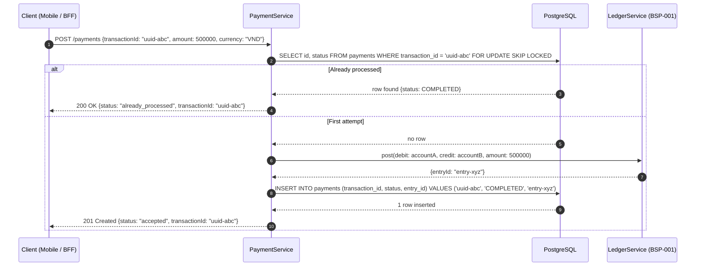

## Implementation Guidelines

### 1. PaymentService — idempotency check with `FOR UPDATE SKIP LOCKED`

```java
@Service
@RequiredArgsConstructor
public class PaymentService {

    private final PaymentRepository paymentRepo;
    private final LedgerService ledger;

    @Transactional
    public PaymentResult process(PaymentCommand cmd) {
        // FOR UPDATE SKIP LOCKED: concurrent retries wait, then find the inserted row
        return paymentRepo.findByTransactionIdForUpdate(cmd.transactionId())
            .map(existing -> PaymentResult.alreadyProcessed(existing.status(), cmd.transactionId()))
            .orElseGet(() -> {
                LedgerEntry entry = ledger.post(cmd.fromAccount(), cmd.toAccount(),
                    cmd.amount(), cmd.currency(), cmd.transactionId());
                Payment payment = new Payment(
                    cmd.transactionId(), PaymentStatus.COMPLETED, entry.entryId(), Instant.now());
                paymentRepo.save(payment);
                return PaymentResult.accepted(cmd.transactionId(), entry.entryId());
            });
    }
}
```

### 2. Repository — native query with locking hint

```java
@Repository
public interface PaymentRepository extends JpaRepository<Payment, UUID> {

    @Lock(LockModeType.PESSIMISTIC_WRITE)
    @QueryHints(@QueryHint(name = "javax.persistence.lock.timeout", value = "0"))
    @Query("SELECT p FROM Payment p WHERE p.transactionId = :txId")
    Optional<Payment> findByTransactionIdForUpdate(@Param("txId") String txId);
}
```

### 3. PostgreSQL schema — unique constraint as safety net

```sql
CREATE TABLE payments (
    id              UUID         PRIMARY KEY DEFAULT gen_random_uuid(),
    transaction_id  TEXT         NOT NULL,
    status          TEXT         NOT NULL CHECK (status IN ('PENDING','COMPLETED','FAILED')),
    entry_id        UUID,
    amount          NUMERIC(19,4) NOT NULL,
    currency        CHAR(3)      NOT NULL,
    created_at      TIMESTAMPTZ  NOT NULL DEFAULT NOW()
);

-- Unique constraint is the final safety net if application logic fails
CREATE UNIQUE INDEX uq_payments_transaction_id ON payments(transaction_id);
```

### 4. Kafka consumer — idempotency applied before any processing

```java
@KafkaListener(topics = "payments.commands", groupId = "payment-processor")
public void onPaymentCommand(PaymentCommand cmd) {
    // Same idempotency logic applies regardless of trigger source
    PaymentResult result = paymentService.process(cmd);
    if (result.isAlreadyProcessed()) {
        log.info("event=duplicate_message transactionId={} — skipping re-processing", cmd.transactionId());
    }
}
```

## When to Use

- All T0 payment processing services that accept payment requests from any client or message source where retries are possible (which is all of them).
- Services consuming ISO 20022 messages (pain.001, pacs.008) where the `EndToEndId` must be preserved and used as the idempotency key per standard §2.1.
- Any service that writes to the Double-Entry Ledger (BSP-001) — the `transaction_id` must match the ledger's `transaction_id` unique constraint to prevent orphaned journal entries.

## When Not to Use

- Read-only query endpoints — idempotency keys add no value for `GET` requests; HTTP `GET` is idempotent by definition.
- Internal event-sourced projections that are designed to be rebuilt from scratch — replaying the event log is intentional re-processing; do not apply idempotency guards to projection rebuilds.
- Analytics pipelines ingesting the same event multiple times intentionally (e.g., exactly-once Kafka Streams with Flink changelog) — these frameworks provide their own deduplication; adding an application-level check creates a conflict with the framework's offset management.

## Variants

| Variant | When to prefer | Trade-off |
|---------|----------------|-----------|
| DB unique constraint + `FOR UPDATE SKIP LOCKED` (this pattern) | T0 payment services; strong consistency required; low retry rate | Requires a database round-trip per request; lock contention possible under extreme retry storms |
| Redis distributed cache (TTL-based) | High-throughput services (>10 000 rps); idempotency window short (≤24h); eventual consistency acceptable | Redis TTL expiry means very old retries are re-processed; cache-aside pattern is not ACID |
| Kafka `enable.idempotence=true` (producer-level) | Kafka producer exactly-once delivery within a single Kafka cluster; no downstream DB deduplication needed | Only guarantees producer-to-broker idempotency; does not prevent duplicate consumer processing if consumer crashes |

## NFR Acceptance Criteria

| Metric | Threshold | Measurement |
|--------|-----------|-------------|
| Duplicate detection p99 latency | ≤ 5 ms (DB round-trip for found key) | Load test 1 000 concurrent retries of the same `transactionId`; assert p99 ≤ 5 ms; assert exactly 1 ledger entry |
| First-time processing overhead | ≤ 10 ms added vs. no idempotency check (same DB transaction) | Benchmark `process()` with and without idempotency; assert overhead ≤ 10 ms p99 |
| Zero duplicate postings | 0 duplicate journal pairs under 10 000 concurrent retries | Chaos test: inject 10 000 parallel requests with the same `transactionId`; assert `journal_entries` count = 2 |
| Availability | 99.99% (T0 — idempotency table on same PostgreSQL cluster as ledger) | Ledger HA test: replicate failover; assert idempotency checks continue |
| RTO | ≤ 10 s (same as ledger cluster failover) | Kill PostgreSQL primary; measure time to first successful payment with idempotency check |

## Compliance Mapping

| Ring | Regulation | Provision | How this pattern satisfies |
|------|-----------|-----------|---------------------------|
| Ring 0 | OWASP ASVS V5 | §5.5 — Deserialization and Retry Safety: repeated requests must not produce duplicate effects | `FOR UPDATE SKIP LOCKED` + unique index prevents any duplicate posting; the application returns the original result without side effects. |
| Ring 1 | ISO 20022 | §2.1 EndToEndId — unique identifier assigned by the initiating party and preserved through the chain | The Payment Service stores and returns the `transactionId` as the ISO 20022 `EndToEndId` in all outbound pacs.008 messages; NAPAS reconciliation uses this field for deduplication. |
| Ring 2 | SBV Circular 09/2020 | §IV.2 — transaction integrity and deduplication requirements for electronic payment systems ⚠️ (working summary — pending Legal review) | Unique constraint on `transaction_id` and atomic check-insert prevents duplicate payment entries in the ledger; `already_processed` response satisfies the retrying client without financial impact. |

## Cost / FinOps

- Additional PostgreSQL storage per payment: ~120 bytes per `payments` row. At 10 M payments/month, this is 1.2 GB/month — negligible.
- Additional PostgreSQL IOPS: one `SELECT FOR UPDATE` + one `INSERT` per new payment; the existing ledger write already accounts for similar IOPS. Net overhead is one additional index scan per payment.
- Cost of NOT using this pattern: one duplicate payment incident requiring manual reversal costs ~4 engineer-hours + customer notification + potential SBV incident report — equivalent to months of storage costs.

## Threat Model

- **Idempotency key collision (Tampering)**: Attacker submits a payment with the same `transactionId` as a prior legitimate payment. If the idempotency check returned `already_processed`, the attacker receives the original result — no financial impact. If the attacker crafts a different `transactionId` for the same payment intent, the existing amount/account validation catches it. Mitigation: `transactionId` is immutable once inserted; the `FOR UPDATE` lock prevents concurrent insertion races.
- **Lock storm under retry (Denial of Service)**: A misbehaving client retries the same `transactionId` at 10 000 rps, causing `FOR UPDATE SKIP LOCKED` to queue all retries. `SKIP LOCKED` means locked rows are skipped rather than waited on — concurrent retries return immediately without blocking. Mitigation: rate limiter (100 rps per `transactionId` at the API gateway) prevents a single client from saturating the connection pool.

## Runbook Stub

**Alert: `payment_duplicate_rate > 1%`** (unusual retry volume)
- p50 baseline: < 0.1% | p99 SLO: < 1%
- Remediation: (1) Check which `transactionId` prefixes are driving retries: `SELECT LEFT(transaction_id,8), COUNT(*) FROM payments GROUP BY 1 ORDER BY 2 DESC LIMIT 10`. (2) If a single mobile app version is retrying aggressively, push a force-upgrade (MOB-006). (3) If NAPAS is timing out, check the NAPAS circuit breaker state (RES-002). (4) If the retry source is a batch job, add exponential backoff (RES-003).

**Alert: `unique_constraint_violation ON payments`**
- p50 baseline: 0 | p99 SLO: 0
- Remediation: CRITICAL — this should never fire if application logic is correct; a constraint violation means two concurrent requests both passed the `FOR UPDATE` check. (1) Immediately inspect the application logs for the offending `transactionId`. (2) Check PostgreSQL `pg_locks` for evidence of missed locking. (3) Roll back the duplicate ledger entry using `LedgerService.reverse()`. (4) Open a P1 incident.

## Test Strategy Stub

### Unit Tests
- `PaymentServiceTest`: mock `paymentRepo.findByTransactionIdForUpdate` returning empty → assert `ledger.post()` called once, `paymentRepo.save()` called once. Mock returning existing payment → assert `ledger.post()` NOT called, result is `alreadyProcessed`.
- `PaymentResultTest`: assert `alreadyProcessed()` and `accepted()` factory methods produce correct status fields.

### Integration Tests
- Spring Boot Test + Testcontainers (PostgreSQL): submit the same `transactionId` from 100 concurrent threads; assert `journal_entries` contains exactly 2 rows (one DR, one CR); assert `payments` table contains exactly 1 row.
- Kafka consumer integration: publish 5 copies of the same `PaymentCommand` to Kafka; assert only 1 journal pair created.

### Chaos Tests
- Kill the PaymentService pod after `SELECT FOR UPDATE` but before `INSERT` (Toxiproxy TCP cut); submit the same `transactionId` to a new pod; assert idempotency is maintained (the DB transaction rolled back, so the new pod processes once cleanly).

## Related Patterns

- [BSP-001 Double-Entry Ledger](double-entry-ledger.md) — the ledger that receives exactly-once postings via this idempotency key
- [INT-001 Saga Orchestration](../integration/saga-orchestration.md) — the Saga orchestrator uses `transactionId` as the saga correlation ID, propagating idempotency through the saga chain
- [RES-003 Retry with Backoff](../resilience/retry-with-backoff.md) — client-side retry strategy that pairs with server-side idempotency
- [PRIN-006 Idempotency-by-default](../../principles/idempotency-by-default.md) — the architectural principle mandating this pattern for all T0 services

## References

- ISO 20022 Payment Initiation (pain.001) — §2.1 GroupHeader/MessageIdentification and EndToEndIdentification semantics
- [RFC 7231 §4.2.2 — Idempotent Methods](https://www.rfc-editor.org/rfc/rfc7231#section-4.2.2)
- PostgreSQL `SELECT ... FOR UPDATE SKIP LOCKED` — [PostgreSQL 16 docs](https://www.postgresql.org/docs/16/sql-select.html#SQL-FOR-UPDATE-SHARE)
- Stripe API — Idempotency Keys (public engineering blog — industry reference for UUID-based idempotency)
- SBV Circular 09/2020/TT-NHNN — Electronic Payment Transaction Integrity Requirements (unofficial translation)
- `knowledge-base/_research-notes.md` — NAPAS timeout and retry frequency data

---

**Key Takeaway**: Generate a UUID4 idempotency key at the client, carry it through every hop as the ISO 20022 `EndToEndId`, and enforce uniqueness at the database level with `SELECT FOR UPDATE SKIP LOCKED` — the only cost is one extra DB round-trip per payment, the benefit is zero duplicate charges under any retry scenario.
````

- [ ] **Step 3: Lint Mermaid**

```bash
bash scripts/mermaid-lint-doc.sh knowledge-base/patterns/banking-solutions/idempotent-payment-key.md
```
Expected: exits 0.

- [ ] **Step 4: Compliance check**

```bash
python3 scripts/check-compliance-rows.py
```
Expected: 0 failures.

- [ ] **Step 5: Commit**

```bash
git add knowledge-base/patterns/banking-solutions/idempotent-payment-key.md
git commit -m "feat(catalog): BSP-002 Idempotent Payment Key — Wave 5A"
```

---

### Task 3: BSP-003 Sanction Screening Pipeline (FULL WRITE)

**Files:**
- Modify: `knowledge-base/patterns/banking-solutions/sanction-screening-pipeline.md`

- [ ] **Step 1: Verify stub**

```bash
head -5 knowledge-base/patterns/banking-solutions/sanction-screening-pipeline.md
```
Expected: `Status: Proposed`

- [ ] **Step 2: Replace the entire file with:**

````markdown
# Sanction Screening Pipeline

Status: Draft | Last Reviewed: 2026-05-16 | Owner: @risk-management-domain-owner
Catalog ID: BSP-003 | Radii
Tier Applicability: T0

## Problem Statement

- **Regulatory exposure**: executing a payment to a sanctioned entity (OFAC SDN list, UN Security Council, FATF high-risk jurisdictions, or SBV domestic AML list) constitutes a criminal violation with fines up to $1M per transaction and potential licence revocation for the bank.
- **Latency vs. safety trade-off**: naïve synchronous HTTP calls to an external screening vendor add 200–800 ms to the payment critical path, breaching the T0 latency budget; but skipping screening entirely creates unacceptable compliance risk.
- **SDN list staleness**: OFAC updates the SDN list without a fixed schedule. A screening service running with a 24-hour-old cache may miss newly designated entities, creating a compliance gap even for a correctly implemented pipeline.
- **Fuzzy name matching**: sanctioned entities appear under transliterations, aliases, and partial names. Exact-match screening misses variants (e.g., "Nguyen Van A" vs. "Van A Nguyen"); but overly aggressive fuzzy matching produces false positives that block legitimate payments and trigger SBV escalation.
- **Audit trail gaps**: SBV inspections require evidence that every payment was screened at the time of execution, with the list version used. Absent a structured audit record per payment, the bank cannot demonstrate compliance.

## Context

Sanction screening sits on the T0 payment authorization path: every outbound domestic (NAPAS), international (SWIFT), and interbank transfer must be screened before funds move. The screening must complete within the T0 latency budget (≤200 ms for the full payment authorization flow). The OPA-based local evaluation model achieves ≤5 ms screening latency by eliminating the external HTTP hop on the critical path. SDN list freshness is maintained by a Spring Batch nightly refresh job that re-loads the list into OPA's bundle server.

## Solution

Payment events are published to Kafka topic `payments.screening.requests`. A Spring Kafka consumer loads each event through an OPA policy (`banking/sanctions/allow`) that evaluates counterparty names against an in-memory SDN list loaded from the OPA bundle. Matches block the payment and publish a `PaymentBlockedEvent`; clears publish `PaymentClearedEvent`. Each screening decision is persisted to an audit log with the SDN list version. A Spring Batch job refreshes the OPA bundle nightly from an OFAC HTTPS endpoint and SBV's domestic list.

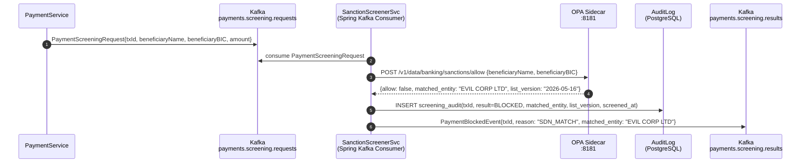

## Implementation Guidelines

### 1. SanctionScreenerService — Kafka consumer with OPA evaluation

```java
@Service
@RequiredArgsConstructor
public class SanctionScreenerService {

    private final OpaClient opaClient;
    private final ScreeningAuditRepository auditRepo;
    private final KafkaTemplate<String, Object> kafka;

    @KafkaListener(topics = "payments.screening.requests", groupId = "sanction-screener")
    public void screen(PaymentScreeningRequest request) {
        OpaInput input = OpaInput.of(
            "beneficiaryName", request.beneficiaryName(),
            "beneficiaryBIC", request.beneficiaryBIC()
        );
        SanctionDecision decision = opaClient.evaluate("banking/sanctions/allow", input,
            SanctionDecision.class);

        auditRepo.save(new ScreeningAudit(
            request.transactionId(), decision.allow() ? "CLEARED" : "BLOCKED",
            decision.matchedEntity(), decision.listVersion(), Instant.now()
        ));

        if (decision.allow()) {
            kafka.send("payments.screening.results",
                new PaymentClearedEvent(request.transactionId()));
        } else {
            kafka.send("payments.screening.results",
                new PaymentBlockedEvent(request.transactionId(), "SDN_MATCH", decision.matchedEntity()));
        }
    }
}
```

### 2. OPA Rego policy — fuzzy name matching with Jaro-Winkler threshold

```rego
package banking.sanctions

import future.keywords.if
import future.keywords.in

default allow = true

allow = false if {
    some entry in data.sdn_list.entries
    jaro_winkler_similarity(lower(input.beneficiaryName), lower(entry.name)) >= 0.92
}

allow = false if {
    input.beneficiaryBIC in data.sdn_list.blocked_bics
}
```

### 3. Spring Batch SDN refresh job — nightly OFAC + SBV list update

```java
@Configuration
@RequiredArgsConstructor
public class SdnRefreshJobConfig {

    @Bean
    public Job sdnRefreshJob(JobBuilderFactory jobs, Step downloadStep, Step uploadBundleStep) {
        return jobs.get("sdnRefreshJob")
            .incrementer(new RunIdIncrementer())
            .flow(downloadStep).next(uploadBundleStep).end().build();
    }

    @Bean
    @StepScope
    public Tasklet downloadSdnTasklet(
            @Value("${sdn.ofac-url}") String ofacUrl,
            @Value("${sdn.sbv-url}") String sbvUrl) {
        return (contribution, context) -> {
            List<SdnEntry> entries = new SdnDownloader().download(ofacUrl, sbvUrl);
            context.getJobExecutionContext().put("sdn_entries", entries);
            log.info("event=sdn_download count={}", entries.size());
            return RepeatStatus.FINISHED;
        };
    }
}
```

### 4. Audit schema

```sql
CREATE TABLE screening_audit (
    id              UUID        PRIMARY KEY DEFAULT gen_random_uuid(),
    transaction_id  TEXT        NOT NULL,
    result          TEXT        NOT NULL CHECK (result IN ('CLEARED','BLOCKED')),
    matched_entity  TEXT,
    list_version    DATE        NOT NULL,
    screened_at     TIMESTAMPTZ NOT NULL DEFAULT NOW()
);
CREATE INDEX idx_screening_audit_tx ON screening_audit(transaction_id);
CREATE INDEX idx_screening_audit_ts ON screening_audit(screened_at);
```

## When to Use

- All outbound payment flows (NAPAS domestic transfer, SWIFT international wire, interbank settlement) where the beneficiary is an external party whose sanction status must be verified before funds move.
- Any onboarding flow that establishes a relationship with an external counterparty — screen at relationship creation, not just at transaction time.
- Batch payment files (bulk salary payments, vendor disbursements) — screen each beneficiary before file submission to NAPAS; reject the file if any row matches.

## When Not to Use

- Internal fund transfers between two Techcombank accounts owned by the same KYC-verified customer — internal accounts have already been screened at onboarding; re-screening on every transfer is redundant overhead.
- Intra-group treasury movements between Techcombank legal entities — use an internal allowlist; sanction screening against the global SDN list for known internal accounts is wasteful.
- Real-time balance enquiries and account statement requests — screening applies to value movements, not read operations.

## Variants

| Variant | When to prefer | Trade-off |
|---------|----------------|-----------|
| Local OPA evaluation (this pattern) | T0 critical path; ≤5 ms latency budget; offline resilience needed | SDN list freshness depends on nightly refresh; very new designations may be missed for up to 24 hours |
| Synchronous external API (vendor) | Highest list accuracy; real-time list updates | Adds 200–800 ms to critical path; vendor SLA becomes a T0 dependency; circuit breaker required |
| Async pre-clearance cache | Pre-screen known payees daily; cached result served in <1 ms for repeat transactions | Only works for repeat payees; first-time payee still requires a sync check; cache invalidation on new SDN entries |

## NFR Acceptance Criteria

| Metric | Threshold | Measurement |
|--------|-----------|-------------|
| Screening decision p99 latency | ≤ 5 ms (OPA sidecar local evaluation) | Load test 1 000 rps; assert OPA `POST /v1/data` p99 ≤ 5 ms |
| End-to-end screening p99 (Kafka round-trip) | ≤ 500 ms | Measure from `PaymentScreeningRequest` publish to `PaymentClearedEvent` consume |
| SDN list freshness | ≤ 24 h (nightly refresh) | Monitor `sdn_list_last_updated` metric; alert if > 25 h |
| Audit record completeness | 100% — every payment has a screening_audit row | Reconcile `payments` table against `screening_audit` daily; assert 0 gaps |
| False positive rate | ≤ 0.01% of total volume | Weekly review of BLOCKED events; assert < 0.01% are legitimate payments |

## Compliance Mapping

| Ring | Regulation | Provision | How this pattern satisfies |
|------|-----------|-----------|---------------------------|
| Ring 0 | FATF Recommendation 6 | Targeted financial sanctions — financial institutions must implement real-time screening | OPA policy screens every payment against FATF-designated entities; `PaymentBlockedEvent` prevents funds movement; `screening_audit` provides evidence for FATF inspection. |
| Ring 1 | SWIFT CSP v2024 | Control 2.9 — Transaction screening; must screen against SDN and local sanction lists | OPA bundle includes both OFAC SDN and SBV domestic AML lists; `list_version` field in audit log proves which list version was active at screening time; nightly refresh maintains SWIFT CSP compliance. |
| Ring 2 | SBV Circular 09/2020 | §III.5 — AML/CFT controls; screening of counterparties against domestic sanction lists ⚠️ (working summary — pending Legal review) | OPA bundle includes SBV's domestic AML watchlist (sourced from SBV's published list); blocked payments are logged to `screening_audit` with `list_version = 'SBV-YYYY-MM-DD'`; Legal review required to confirm SBV list sourcing and reporting obligations are met. |

## Cost / FinOps

- OPA sidecar: 64 MiB memory, 0.1 vCPU at idle; SDN list in OPA data cache: ~20 MB (OFAC full list compressed). Negligible per pod.
- Kafka topic `payments.screening.requests`: at 100 payments/s, throughput is ~50 KB/s. Retain 24h; no long-term storage cost.
- Spring Batch SDN refresh: runs once per night, downloads ~2 MB from OFAC HTTPS endpoint; negligible cost.
- `screening_audit` table: ~300 bytes per row; at 10M payments/month = 3 GB/year. Date-partition and archive to S3 after 7 years.
- Cost of a missed sanction screening: OFAC civil penalty up to $1M per transaction; potential licence revocation; reputational damage. The screening infrastructure cost is immaterial by comparison.

## Threat Model

- **SDN list poisoning (Tampering)**: An attacker with access to the OPA bundle server substitutes a modified SDN list that removes a sanctioned entity, allowing payments to blocked counterparties. Mitigation: OPA bundle is signed with a Vault-managed HMAC key; OPA verifies the bundle signature before loading; bundle server access is restricted to the SDN refresh service account via Vault AppRole.
- **Screening bypass via encoding (Tampering)**: Attacker submits beneficiary name in an unusual Unicode normalization (e.g., Cyrillic homoglyphs for Latin characters) to evade the Jaro-Winkler matcher. Mitigation: `SanctionScreenerService` normalizes all input names to NFC Unicode and strips diacritics before OPA evaluation; the OPA policy operates on the normalized form.

## Runbook Stub

**Alert: `sdn_list_age_hours > 25`**
- p50 baseline: < 12 h | p99 SLO: ≤ 24 h
- Remediation: (1) Check the Spring Batch job log: `kubectl logs -l app=sdn-refresh-job`. (2) If OFAC endpoint is unreachable, use the last known good list (OPA keeps the previous bundle) — log an incident and retry manually. (3) If SBV endpoint changed, update `sdn.sbv-url` in the config map. (4) Notify the CISO that the list is stale beyond SLA.

**Alert: `screening_audit_gap > 0`** (payment with no audit row)
- p50 baseline: 0 | p99 SLO: 0
- Remediation: CRITICAL — (1) Identify the transaction IDs with missing audit rows from the daily reconciliation query. (2) Check Screener pod logs for the corresponding `transactionId` — if the Screener crashed after OPA evaluation but before the INSERT, re-screen manually. (3) If OPA was unavailable, determine if the payment should be reversed pending re-screening.

## Test Strategy Stub

### Unit Tests
- `SanctionScreenerServiceTest`: mock OPA returning `{allow: false, matchedEntity: "EVIL CORP"}`; assert `PaymentBlockedEvent` published; assert `screening_audit` INSERT called with `result=BLOCKED`. Mock OPA returning `{allow: true}`; assert `PaymentClearedEvent` published.
- `OpaRegoTest`: use OPA Go test runner on the Rego policy; assert `EVIL CORP LTD` matches with Jaro-Winkler ≥ 0.92; assert `TECHCOMBANK INTERNAL` does not match any SDN entry.

### Integration Tests
- Spring Boot Test + Testcontainers (Kafka + OPA + PostgreSQL): submit `PaymentScreeningRequest` for a name in the test SDN list; consume from `payments.screening.results`; assert `PaymentBlockedEvent`; assert `screening_audit` row exists with correct `list_version`.
- SDN refresh job IT: run `sdnRefreshJob` with a mock OFAC endpoint; assert OPA bundle is updated; assert new SDN entry is present in OPA data.

### Chaos Tests
- Kill OPA sidecar mid-screening: submit `PaymentScreeningRequest`; assert Screener retries with Resilience4j retry policy; assert eventual `PaymentBlockedEvent` (fail-closed: if OPA is unavailable, block the payment).

## Related Patterns

- [BSP-001 Double-Entry Ledger](double-entry-ledger.md) — the ledger that receives posting only after a CLEARED screening result
- [SEC-010 Attribute-Based Access Control](../../patterns/security/attribute-based-access-control.md) — OPA is also used for ABAC; the Rego policy structure is analogous
- [INT-001 Saga Orchestration](../integration/saga-orchestration.md) — sanction screening is one step in the payment authorization saga

## References

- [OFAC SDN List](https://ofac.treasury.gov/specially-designated-nationals-and-blocked-persons-list-sdn-human-readable-lists)
- [FATF Recommendation 6 — Targeted Financial Sanctions](https://www.fatf-gafi.org/en/recommendations/r6.html)
- [OPA Policy Language (Rego)](https://www.openpolicyagent.org/docs/latest/policy-language/)
- [SWIFT CSP v2024 Control 2.9 — Transaction Screening](https://www.swift.com/myswift/customer-security-programme-csp)
- SBV Circular 09/2020/TT-NHNN — AML/CFT requirements for credit institutions (unofficial translation)
- `knowledge-base/compliance/swift-csp-2024.md` — COMP-008
- `knowledge-base/_research-notes.md`

---

**Key Takeaway**: Run every outbound payment through a local OPA sanction screening evaluation (≤5 ms) fed by a nightly SDN bundle refresh — achieving T0 latency compliance while maintaining regulatory sanction-screening coverage with a full audit trail.
````

- [ ] **Step 3: Lint Mermaid**

```bash
bash scripts/mermaid-lint-doc.sh knowledge-base/patterns/banking-solutions/sanction-screening-pipeline.md
```
Expected: exits 0.

- [ ] **Step 4: Compliance check**

```bash
python3 scripts/check-compliance-rows.py
```
Expected: 0 failures.

- [ ] **Step 5: Commit**

```bash
git add knowledge-base/patterns/banking-solutions/sanction-screening-pipeline.md
git commit -m "feat(catalog): BSP-003 Sanction Screening Pipeline — Wave 5A"
```

---

### Task 4: BSP-004 End-of-Day Batch Window (FULL WRITE)

**Files:**
- Modify: `knowledge-base/patterns/banking-solutions/end-of-day-batch-window.md`

- [ ] **Step 1: Verify stub**

```bash
head -5 knowledge-base/patterns/banking-solutions/end-of-day-batch-window.md
```
Expected: `Status: Proposed`

- [ ] **Step 2: Replace the entire file with:**

````markdown
# End-of-Day Batch Window

Status: Draft | Last Reviewed: 2026-05-16 | Owner: @core-banking-domain-owner
Catalog ID: BSP-004 | Radii
Tier Applicability: T0, T1

## Problem Statement

- **Concurrent real-time and batch writes**: if real-time payment posting (T0) continues while the EOD settlement batch runs, the settlement totals are moving targets; the batch captures an inconsistent snapshot, causing T24 OFS reconciliation to fail with mismatched debit/credit sums.
- **T24 OFS window constraint**: Temenos T24 accepts OFS journal postings only during a defined processing window; submitting outside that window returns `T24-0023 OUTSIDE.PROCESSING.WINDOW`. Without an explicit batch window manager, sporadic real-time OFS calls during EOD cause pipeline failures and manual reruns.
- **Partial EOD failure and rerunability**: if the batch fails at step 3 of 8 (e.g., FX revaluation), rerunning from step 1 re-executes completed steps, creating duplicate postings. The batch must be restartable at the failed step without re-executing successful steps.
- **SBV daily reporting deadline**: SBV requires daily balance and transaction reports by 09:00 the next business day. An uncoordinated EOD process that runs ad-hoc has no predictable completion time, risking the SBV deadline.
- **Multiple system coordination**: EOD involves Ledger Service, Fee Engine, FX Service, T24 OFS gateway, and the SBV Reporting Service — each with its own completion dependency. Without explicit orchestration, services start their EOD steps in undefined order.

## Context

The EOD batch window is the nightly coordination point for all core banking settlement, reconciliation, and reporting activities. It runs in a defined time window (typically 22:00–00:30 ICT) during which T24 OFS accepts batch postings. Spring Batch provides step-level restartability and execution tracking. Quartz triggers the window open/close events on a cron schedule. A Redis distributed lock (`eod:window:lock`) prevents concurrent window execution in a multi-pod deployment.

## Solution

Quartz fires `EodWindowOpenEvent` at 22:00 ICT. The Spring Batch job is triggered, acquiring a Redis distributed lock to prevent concurrent execution. Steps execute in dependency order: (1) cut-off real-time transactions, (2) post intraday fees, (3) FX revaluation, (4) T24 OFS journal posting via Apache Camel, (5) balance reconciliation, (6) SBV report generation. Each step is tracked in the `BATCH_STEP_EXECUTION` table; failed jobs resume from the failed step. Quartz fires `EodWindowCloseEvent` at 00:30 ICT, releasing the lock and resuming real-time transaction processing.

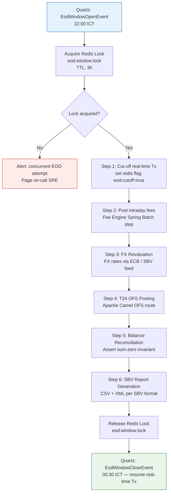

## Implementation Guidelines

### 1. Spring Batch job configuration with step sequencing

```java
@Configuration
@RequiredArgsConstructor
public class EodBatchJobConfig {

    @Bean
    public Job eodBatchJob(JobBuilderFactory jobs,
            Step cutoffStep, Step feePostingStep,
            Step fxRevalStep, Step t24OfsStep,
            Step reconciliationStep, Step sbvReportStep) {
        return jobs.get("eodBatchJob")
            .incrementer(new RunIdIncrementer())
            .start(cutoffStep)
            .next(feePostingStep)
            .next(fxRevalStep)
            .next(t24OfsStep)
            .next(reconciliationStep)
            .next(sbvReportStep)
            .build();
    }

    @Bean
    @JobScope
    public Step cutoffStep(StepBuilderFactory steps, EodCutoffTasklet tasklet) {
        return steps.get("cutoffStep").tasklet(tasklet).build();
    }
}
```

### 2. Redis distributed lock for exclusive EOD window

```java
@Component
@RequiredArgsConstructor
public class EodWindowLockService {

    private final StringRedisTemplate redis;
    private static final String LOCK_KEY = "eod:window:lock";
    private static final Duration LOCK_TTL = Duration.ofHours(3);

    public boolean tryAcquire() {
        Boolean acquired = redis.opsForValue().setIfAbsent(
            LOCK_KEY, "LOCKED", LOCK_TTL);
        return Boolean.TRUE.equals(acquired);
    }

    public void release() {
        redis.delete(LOCK_KEY);
    }
}
```

### 3. Apache Camel route — T24 OFS journal posting

```java
@Component
public class T24OfsEodRoute extends RouteBuilder {

    @Override
    public void configure() {
        from("direct:t24-ofs-eod-posting")
            .routeId("t24-ofs-eod")
            .bean(OfsMessageBuilder.class, "buildEodJournalMessage")
            .to("http://t24-ofs-gateway:8080/ofs?throwExceptionOnFailure=true")
            .bean(OfsResponseParser.class, "assertSuccess")
            .log("T24 OFS EOD posting completed: ${body}");
    }
}
```

### 4. Quartz scheduler — cron-triggered EOD window events

```java
@Configuration
public class EodSchedulerConfig {

    @Bean
    public JobDetail eodWindowOpenJobDetail() {
        return JobBuilder.newJob(EodWindowOpenJob.class)
            .withIdentity("eodWindowOpen")
            .storeDurably().build();
    }

    @Bean
    public Trigger eodWindowOpenTrigger(JobDetail eodWindowOpenJobDetail) {
        return TriggerBuilder.newTrigger()
            .forJob(eodWindowOpenJobDetail)
            .withSchedule(CronScheduleBuilder.cronSchedule("0 0 22 * * ?")  // 22:00 ICT daily
                .inTimeZone(TimeZone.getTimeZone("Asia/Ho_Chi_Minh")))
            .build();
    }
}
```

## When to Use

- Nightly core banking settlement processes that must coordinate multiple services in dependency order within a defined T24 processing window.
- Any batch workload that posts to T24 OFS — the processing window constraint makes explicit coordination mandatory; ad-hoc OFS calls outside the window cause T24 errors.
- Multi-service EOD pipelines where step-level restartability is required — if FX revaluation fails, the batch must resume at that step without re-running fee posting.

## When Not to Use

- Intraday micro-batch processing (e.g., every 15-minute fee sweep) — use a simpler Quartz-triggered Spring Batch step without the full EOD window lock; the complexity of the EOD window is justified only for the nightly settlement cycle.
- Real-time event processing — continuous Kafka consumers are not batch jobs; applying the EOD window pattern to event processing would create an artificial processing window where none is needed.
- Services with no T24 OFS dependency and no SBV reporting requirement — lightweight services that reconcile only their own data do not need the full orchestration overhead.

## Variants

| Variant | When to prefer | Trade-off |
|---------|----------------|-----------|
| Spring Batch + Quartz + Redis lock (this pattern) | Core banking with T24 OFS; step-level restartability needed; multi-pod deployment | Requires Redis for lock management; Quartz job store needs a database for HA |
| Apache Airflow DAG | Complex dependency graphs with fan-out/fan-in; data engineering teams already running Airflow | Airflow is a heavier operational dependency; adds a new platform for the ops team to manage |
| Kubernetes CronJob | Simple single-step batch with no restartability requirement; no external orchestration database | No step-level tracking; failed jobs must rerun from start; not suitable for multi-step EOD |

## NFR Acceptance Criteria

| Metric | Threshold | Measurement |
|--------|-----------|-------------|
| EOD completion time | ≤ 2.5 h (window: 22:00–00:30) | Monitor `eodBatchJob` `END_TIME - START_TIME`; alert if > 2 h |
| SBV report delivery | By 09:00 next business day (SBV requirement) | Report file timestamp in SBV SFTP; alert if not delivered by 08:00 |
| Step restart success | 100% — all steps restartable without re-processing completed steps | Chaos test: kill job at step 4; rerun; assert steps 1–3 SKIPPED, step 4 re-executes |
| Reconciliation zero-variance | 0 debit/credit sum mismatches | Reconciliation step asserts `SUM(DR) = SUM(CR)` for all accounts for the business date |
| Availability | 99.9% (T0 SBV deadline means < 1 missed EOD per quarter) | Count missed EOD windows per quarter; assert ≤ 1 |

## Compliance Mapping

| Ring | Regulation | Provision | How this pattern satisfies |
|------|-----------|-----------|---------------------------|
| Ring 0 | ISO 22301 | Business continuity — critical process must have defined recovery steps | Step-level Spring Batch restart provides documented recovery; `BATCH_STEP_EXECUTION` table provides audit trail of step completion for incident post-mortem. |
| Ring 1 | BCBS 239 | §6 — Timeliness: risk data aggregation must support end-of-day reporting on demand | The EOD reconciliation step (Step 5) validates sum-zero invariant across all ledger accounts for the business date; SBV report (Step 6) is generated from the reconciled data, satisfying BCBS 239 timeliness. |
| Ring 2 | SBV Circular 09/2020 | §IV.5 — Daily balance and transaction reporting to SBV by 09:00 next business day ⚠️ (working summary — pending Legal review) | Step 6 generates the SBV-format CSV/XML report and delivers it to the SBV SFTP by 01:00; a Quartz alert fires at 08:30 if the report has not been acknowledged; Legal review required to confirm report format meets current SBV specification. |

## Cost / FinOps

- Redis lock: negligible — one key with a 3h TTL per night. Shared Redis cluster with other use cases.
- Spring Batch metadata tables (`BATCH_JOB_EXECUTION`, `BATCH_STEP_EXECUTION`): ~5 KB per job run; at 365 runs/year = ~1.8 MB/year. No storage concern.
- Quartz job store (PostgreSQL): ~2 KB per trigger row; fully managed within the existing core banking DB.
- T24 OFS gateway: network round-trips during the EOD window — typically 50–500 OFS messages. Negligible vs. daytime real-time traffic.
- Cost of a missed SBV reporting deadline: SBV can impose administrative penalties and require remediation reporting; reputational risk with the central bank is significant.

## Threat Model

- **Concurrent EOD execution (Tampering)**: Two pods both attempt to start the EOD job at 22:00 (e.g., after a pod restart mid-window). Without the Redis lock, two instances run in parallel, posting duplicate OFS messages. Mitigation: `EodWindowLockService.tryAcquire()` uses Redis `SET NX EX` (atomic); only one pod acquires the lock; the other logs a `CONCURRENT_EOD_ATTEMPT` alert.
- **Stale cut-off flag (Elevation of Privilege)**: The Redis `eod:cutoff=true` flag is not cleared at window close (e.g., if `EodWindowCloseEvent` handler crashes). Real-time transactions continue to be rejected post-window. Mitigation: `EodWindowCloseEvent` handler unconditionally clears the flag; a Quartz watchdog at 01:00 asserts the flag is cleared and alerts if not.

## Runbook Stub

**Alert: `eod_job_duration > 120min`**
- p50 baseline: 90 min | p99 SLO: 150 min
- Remediation: (1) Check current step: `SELECT STEP_NAME, STATUS FROM BATCH_STEP_EXECUTION WHERE JOB_EXECUTION_ID = (SELECT MAX(JOB_EXECUTION_ID) FROM BATCH_JOB_EXECUTION)`. (2) If stuck on T24 OFS (Step 4): check T24 OFS gateway health; check for T24 `OUTSIDE.PROCESSING.WINDOW` errors — T24 may have extended its maintenance window. (3) If stuck on reconciliation (Step 5): run `SELECT SUM(CASE WHEN direction='DR' THEN amount ELSE -amount END) FROM journal_entries WHERE business_date = CURRENT_DATE` — non-zero result indicates a posting error that must be resolved before completing EOD.

**Alert: `sbv_report_not_delivered_by_0800`**
- p50 baseline: delivery by 01:00 | p99 SLO: delivery by 05:00
- Remediation: P1 — (1) Check if EOD job completed: `SELECT STATUS FROM BATCH_JOB_EXECUTION ORDER BY START_TIME DESC LIMIT 1`. (2) If job FAILED, restart from failed step. (3) If job COMPLETED but SFTP failed, manually push the report file to SBV SFTP. (4) Notify the head of compliance immediately.

## Test Strategy Stub

### Unit Tests
- `EodWindowLockServiceTest`: mock `StringRedisTemplate`; assert `tryAcquire()` calls `setIfAbsent` with `LOCK_KEY`, correct value, and 3h TTL; assert `release()` calls `delete(LOCK_KEY)`.
- `EodBatchJobConfigTest`: assert job has exactly 6 steps in correct order; assert each step is configured with the correct tasklet/chunk.

### Integration Tests
- Spring Boot Test + Testcontainers (PostgreSQL + Redis): trigger EOD job; assert all 6 steps execute in order; assert `BATCH_STEP_EXECUTION` shows COMPLETED for all steps; assert Redis lock is released after job completion.
- Step restart test: inject failure at Step 4 (T24 OFS); assert job status FAILED; restart job; assert Steps 1–3 are SKIPPED (status COMPLETED from prior run); assert Step 4 re-executes.

### Chaos Tests
- Concurrent EOD start: launch two Spring Batch job executor threads simultaneously at 22:00; assert only one job execution is created; assert the second attempt logs `CONCURRENT_EOD_ATTEMPT`.
- Redis lock TTL expiry: set lock TTL to 10 s in test; let job run beyond TTL; assert that the watchdog detects TTL expiry and alerts (does not silently allow a second execution).

## Related Patterns

- [BSP-001 Double-Entry Ledger](double-entry-ledger.md) — the ledger whose sum-zero invariant is validated in EOD Step 5
- [INT-005 Anti-Corruption Layer](../integration/anti-corruption-layer.md) — the ACL that translates domain events to T24 OFS messages in Step 4
- [NFR-001 Service Tiering + RTO/RPO Matrix](../../nfr/service-tiering-rto-rpo.md) — the T0 tier SLA that mandates the SBV reporting deadline
- [BP-001 CI/CD Pipeline Design](../../best-practices/ci-cd-pipeline-design.md) — EOD job configuration changes are validated via the same pipeline

## References

- Spring Batch Reference Documentation — [docs.spring.io/spring-batch](https://docs.spring.io/spring-batch/docs/current/reference/html/)
- Quartz Scheduler — [quartz-scheduler.org](http://www.quartz-scheduler.org/documentation/)
- T24 OFS Integration Guide (internal) — confluence.techcombank.internal/t24/ofs-guide
- SBV Circular 09/2020/TT-NHNN — §IV.5 Daily reporting requirements (unofficial translation)
- BCBS 239 — Principles for Effective Risk Data Aggregation and Risk Reporting §6 (2013)
- `knowledge-base/_research-notes.md` — T24 OFS processing window schedule

---

**Key Takeaway**: The EOD Batch Window is Techcombank's nightly coordination protocol — acquire a Redis lock at 22:00, execute six ordered Spring Batch steps within the T24 processing window, validate sum-zero reconciliation, deliver the SBV report, and release the lock by 00:30, guaranteeing every business day closes with a consistent and auditable financial state.
````

- [ ] **Step 3: Lint Mermaid**

```bash
bash scripts/mermaid-lint-doc.sh knowledge-base/patterns/banking-solutions/end-of-day-batch-window.md
```
Expected: exits 0.

- [ ] **Step 4: Compliance check**

```bash
python3 scripts/check-compliance-rows.py
```
Expected: 0 failures.

- [ ] **Step 5: Commit**

```bash
git add knowledge-base/patterns/banking-solutions/end-of-day-batch-window.md
git commit -m "feat(catalog): BSP-004 End-of-Day Batch Window — Wave 5A"
```

---

### Task 5: BSP-005 Reversal and Chargeback (FULL WRITE)

**Files:**
- Modify: `knowledge-base/patterns/banking-solutions/reversal-and-chargeback.md`

- [ ] **Step 1: Verify stub**

```bash
head -5 knowledge-base/patterns/banking-solutions/reversal-and-chargeback.md
```
Expected: `Status: Proposed`

- [ ] **Step 2: Replace the entire file with:**

````markdown
# Reversal and Chargeback

Status: Draft | Last Reviewed: 2026-05-16 | Owner: @payments-domain-owner
Catalog ID: BSP-005 | Radii
Tier Applicability: T0

## Problem Statement

- **Ledger mutation risk**: a direct `UPDATE journal_entries SET amount = 0` to correct an erroneous payment destroys the forensic audit trail required by BCBS 239 and SBV. Regulators and auditors must be able to reconstruct every balance change from the original ledger entries.
- **Chargeback time-limit compliance**: Visa requires chargebacks to be initiated within 120 days of the original transaction; Mastercard within 120 days. Without a structured workflow tracking the chargeback deadline, the bank loses the right to dispute fraudulent card transactions.
- **Dual-control bypass risk**: a single operator reversing a large payment without a second approval is an insider-threat vector. A coding error in the reversal path could also reverse the wrong transaction.
- **Downstream system inconsistency**: a reversal that updates the local ledger but fails to notify T24 OFS and NAPAS/SWIFT leaves external systems with the original (wrong) balance, causing reconciliation failures the next morning.
- **Customer notification gap**: an unreversed erroneous debit that sits unnoticed for more than the card scheme dispute window permanently destroys the customer's chargeback right.

## Context

Reversals and chargebacks are value corrections that preserve the append-only ledger invariant: instead of modifying an existing journal entry, the system posts a new pair of DR/CR entries with negated signs and a reference to the original transaction. Chargebacks additionally require card scheme message construction (ISO 20022 pacs.007 or Visa/Mastercard proprietary format) and a dual-approval workflow enforced by OPA ABAC. The Spring State Machine manages the lifecycle states to prevent duplicate reversals and enforce the approval requirement.

## Solution

The Reversal Service manages a state machine (`POSTED → REVERSAL_REQUESTED → AWAITING_DUAL_APPROVAL → REVERSED`) with OPA ABAC enforcing that two distinct approvers (not the original poster) must approve before the state transitions to `REVERSED`. On approval, the service posts two new ledger entries (negating DR/CR) to BSP-001 and sends an ISO 20022 pacs.007 message to the NAPAS/SWIFT gateway. The entire approval-and-reverse flow is idempotent using the original `transactionId` as the reversal key.

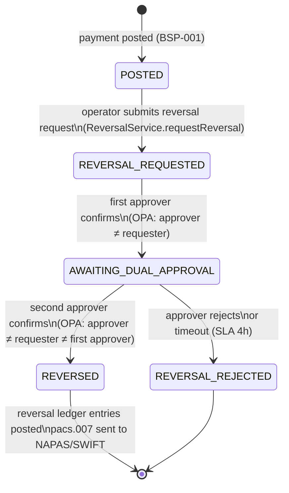

## Implementation Guidelines

### 1. ReversalService — state machine with OPA dual-approval gate

```java
@Service
@RequiredArgsConstructor
public class ReversalService {

    private final StateMachine<ReversalState, ReversalEvent> sm;
    private final OpaClient opaClient;
    private final LedgerService ledger;
    private final PaymentGatewayClient gateway;
    private final ReversalRepository reversalRepo;

    public ReversalRequest requestReversal(String originalTxId, String requesterId) {
        ReversalRequest req = new ReversalRequest(originalTxId, requesterId,
            ReversalState.REVERSAL_REQUESTED, Instant.now());
        reversalRepo.save(req);
        sm.sendEvent(MessageBuilder
            .withPayload(ReversalEvent.REQUEST)
            .setHeader("requestId", req.id())
            .build());
        return req;
    }

    public void approve(String requestId, String approverId) {
        ReversalRequest req = reversalRepo.findById(requestId).orElseThrow();
        OpaInput input = OpaInput.of(
            "requesterId", req.requesterId(),
            "approverId", approverId,
            "firstApproverId", req.firstApproverId()
        );
        boolean canApprove = opaClient.evaluate(
            "banking/reversals/can_approve", input, Boolean.class);
        if (!canApprove) {
            throw new UnauthorizedApprovalException(
                "Approver " + approverId + " cannot approve this reversal");
        }
        if (req.state() == ReversalState.REVERSAL_REQUESTED) {
            req = req.withFirstApprover(approverId).withState(ReversalState.AWAITING_DUAL_APPROVAL);
        } else {
            executeReversal(req, approverId);
        }
        reversalRepo.save(req);
    }

    private void executeReversal(ReversalRequest req, String secondApproverId) {
        ledger.reverse(req.originalTransactionId());
        gateway.sendPacs007(req.originalTransactionId());
        req = req.withState(ReversalState.REVERSED)
                 .withSecondApprover(secondApproverId)
                 .withReversedAt(Instant.now());
        reversalRepo.save(req);
    }
}
```

### 2. OPA Rego policy — dual-approval with segregation of duties

```rego
package banking.reversals

import future.keywords.if

default can_approve = false

can_approve if {
    # Approver must not be the same person who requested
    input.approverId != input.requesterId
    # For second approval: approver must differ from first approver too
    input.approverId != input.firstApproverId
    # Approver must have the reversal_approver role
    input.approverRole == "REVERSAL_APPROVER"
}
```

### 3. ISO 20022 pacs.007 message construction

```java
@Component
public class Pacs007Builder {

    public Pacs007 build(String originalTxId, Payment originalPayment) {
        return Pacs007.builder()
            .messageId(UUID.randomUUID().toString())
            .creationDateTime(OffsetDateTime.now())
            .numberOfTransactions(1)
            .paymentReturnReason(PaymentReturnReasonCode.AM09) // Incorrect amount
            .originalEndToEndId(originalTxId)
            .returnAmount(originalPayment.amount())
            .currency(originalPayment.currency())
            .build();
    }
}
```

## When to Use

- Bank-initiated corrections for erroneous debits, duplicate charges, or system errors where the double-entry ledger must remain immutable and the correction must be traceable.
- Card-scheme chargebacks (Visa/Mastercard) that require ISO 20022 pacs.007 or card-scheme proprietary dispute messages with a defined time limit.
- Any reversal workflow where dual-control (four-eyes) approval is required by internal policy or SBV regulations to prevent single-operator abuse.

## When Not to Use

- Customer-initiated payment disputes handled entirely by the card scheme — in this case, the chargeback is initiated by the card scheme, not by Techcombank's internal workflow; use a separate dispute management process (REF-012).
- Small-amount operational corrections below a bank-defined threshold (e.g., < VND 1,000) where automated reversal without dual-approval is acceptable per internal risk policy — configure the OPA policy threshold accordingly.
- Reversals of internal ledger adjustments that do not involve external payment networks — if the original transaction never left the bank, skip the pacs.007 step.

## Variants

| Variant | When to prefer | Trade-off |
|---------|----------------|-----------|
| State machine + OPA dual-approval (this pattern) | Full audit trail; regulatory dual-control; external network notification | Higher complexity; requires OPA and state machine infrastructure |
| Simple void (within same business day, before T24 EOD) | Same-day discovery; T24 supports void before EOD cut-off; no external message required | Only works within the T24 processing window; unavailable after EOD |
| Card-scheme chargeback flow (Visa/Mastercard dispute API) | Fraud-originated chargebacks where the card scheme mediates the dispute | External timeline dependency (120-day window); card scheme fees apply; network message format differs from ISO 20022 |

## NFR Acceptance Criteria

| Metric | Threshold | Measurement |
|--------|-----------|-------------|
| Reversal request to first approval p99 | ≤ 4 h (SLA for operations team response) | Measure `REVERSAL_REQUESTED → AWAITING_DUAL_APPROVAL` duration; alert if > 3 h |
| Full reversal completion p99 | ≤ 8 h (from request to REVERSED state) | Measure `REVERSAL_REQUESTED → REVERSED` duration; alert if > 6 h |
| Chargeback initiation | Within 90 days of original transaction (buffer before 120-day scheme limit) | Automated alert at 90-day mark for any POSTED transaction with an open dispute flag |
| Ledger integrity post-reversal | Sum of all DR/CR for (original + reversal) = 0 | Run `assert_transaction_sum_zero(originalTxId)` after each reversal; assert passes |
| Availability | 99.9% (T1 — reversals are not on the real-time payment path) | Reversal service pod health check; HPA for batch reversal processing |

## Compliance Mapping

| Ring | Regulation | Provision | How this pattern satisfies |
|------|-----------|-----------|---------------------------|
| Ring 0 | OWASP ASVS V1 | §1.2.4 — Separation of duties: no single person can both initiate and approve a high-risk action | OPA Rego policy enforces `approverId != requesterId` and `approverId != firstApproverId`; two distinct individuals with `REVERSAL_APPROVER` role are required. |
| Ring 1 | ISO 20022 | pacs.007 — Payment Return message schema | `Pacs007Builder` constructs a schema-valid pacs.007 with `OriginalEndToEndId`, `ReturnReasonCode`, and `ReturnAmount`; validated against XSD before dispatch to NAPAS/SWIFT. |
| Ring 2 | SBV Circular 09/2020 | §IV.3 — Error correction procedures for electronic payment transactions; dual-authorization required ⚠️ (working summary — pending Legal review) | Spring State Machine enforces `AWAITING_DUAL_APPROVAL` state before ledger reversal; OPA policy prevents self-approval; full audit trail in `reversal_requests` table; Legal review required to confirm dual-authorization satisfies SBV §IV.3. |

## Cost / FinOps

- State machine: in-memory per reversal request; no persistent state machine store needed (state is stored in the `reversal_requests` table). Negligible compute overhead.
- Additional ledger entries per reversal: 2 rows in `journal_entries`. At ~100 reversals/day, storage impact is negligible.
- pacs.007 dispatch: same NAPAS/SWIFT gateway used for original payments; no additional infrastructure cost.
- OPA ABAC evaluation: same OPA sidecar used for other ABAC decisions (SEC-010); no additional OPA pods.
- Cost of a missed chargeback window: card-scheme rule violation; bank loses the right to dispute the fraudulent charge; customer must be compensated from bank's own funds.

## Threat Model

- **Self-approval bypass (Elevation of Privilege)**: An operator submits a reversal request and then approves it themselves by calling the approval endpoint with their own credentials. Mitigation: OPA policy checks `approverId != requesterId` at the application level; the Spring Security filter ensures the authenticated user's ID is used, not a user-supplied ID.
- **Duplicate reversal (Tampering)**: The reversal endpoint is called twice with the same `originalTransactionId`, posting two pairs of negating entries (net effect: quadruple the original entry). Mitigation: `ReversalRequest` table has a unique constraint on `originalTransactionId`; the state machine is in `REVERSED` terminal state, rejecting further state transitions.

## Runbook Stub

**Alert: `reversal_sla_breach` — reversal in REVERSAL_REQUESTED state for > 3h**
- p50 baseline: 45 min | p99 SLO: 4 h
- Remediation: (1) Identify the reversal request: `SELECT id, original_tx_id, requester_id, created_at FROM reversal_requests WHERE state = 'REVERSAL_REQUESTED' AND created_at < NOW() - INTERVAL '3h'`. (2) Page the head of operations. (3) If the original approver is unavailable, escalate to the operations manager who has `REVERSAL_APPROVER` role per the BCP approver matrix.

**Alert: `chargeback_deadline_approaching` — dispute flag set and original transaction age > 90 days**
- Remediation: (1) Identify the transaction from the disputes table. (2) Initiate the card-scheme chargeback flow immediately — do not wait for a second business day. (3) Document the initiation timestamp in the dispute management system (REF-012).

## Test Strategy Stub

### Unit Tests
- `ReversalServiceTest`: mock OPA returning `can_approve = true`; assert state transitions `REVERSAL_REQUESTED → AWAITING_DUAL_APPROVAL → REVERSED`. Mock OPA returning `can_approve = false`; assert `UnauthorizedApprovalException`.
- `OpaRegoTest`: assert self-approval blocked; assert same-approver-as-first-approver blocked; assert valid dual approvers pass.
- `Pacs007BuilderTest`: assert generated pacs.007 passes XSD validation; assert `OriginalEndToEndId` matches input.

### Integration Tests
- Spring Boot Test + Testcontainers (PostgreSQL + OPA): full reversal workflow — post original payment; request reversal; first approval; second approval; assert ledger has 4 entries (DR+CR original + DR+CR reversal); assert sum-zero for the original `transactionId`.
- Duplicate reversal: attempt to request a second reversal for the same `originalTransactionId`; assert unique constraint violation.

### Chaos Tests
- Kill ReversalService between first and second approval; restart; assert state machine resumes from `AWAITING_DUAL_APPROVAL` (state stored in DB); assert second approval succeeds.

## Related Patterns

- [BSP-001 Double-Entry Ledger](double-entry-ledger.md) — the append-only ledger that receives the negating DR/CR entries
- [BSP-002 Idempotent Payment Key](idempotent-payment-key.md) — the original `transactionId` used as the reversal idempotency key
- [SEC-010 Attribute-Based Access Control](../../patterns/security/attribute-based-access-control.md) — OPA ABAC provides the dual-approval policy enforcement
- [REF-012 Dispute Management](../../reference-architectures/dispute-management.md) — the full dispute lifecycle for card-scheme chargebacks

## References

- ISO 20022 pacs.007 — Payment Return message specification
- Visa Core Rules — Dispute and Chargeback Processing (120-day rule)
- Mastercard Transaction Processing Rules — §33 Chargeback
- Spring State Machine Reference — [docs.spring.io/spring-statemachine](https://docs.spring.io/spring-statemachine/docs/current/reference/)
- SBV Circular 09/2020/TT-NHNN — §IV.3 Error correction for electronic payments (unofficial translation)
- `knowledge-base/_research-notes.md` — reversal frequency data and SLA benchmarks

---

**Key Takeaway**: Correct erroneous payments by posting new negating ledger entries — never modifying existing ones — with a mandatory two-person approval workflow enforced by OPA policy and a state machine that prevents duplicate reversals and tracks chargeback deadlines.
````

- [ ] **Step 3: Lint Mermaid**

```bash
bash scripts/mermaid-lint-doc.sh knowledge-base/patterns/banking-solutions/reversal-and-chargeback.md
```
Expected: exits 0.

- [ ] **Step 4: Compliance check**

```bash
python3 scripts/check-compliance-rows.py
```
Expected: 0 failures.

- [ ] **Step 5: Commit**

```bash
git add knowledge-base/patterns/banking-solutions/reversal-and-chargeback.md
git commit -m "feat(catalog): BSP-005 Reversal and Chargeback — Wave 5A"
```

---

### Task 6: INT-005 Anti-Corruption Layer (GAP-FILL — 5 missing sections)

**Files:**
- Modify: `knowledge-base/patterns/integration/anti-corruption-layer.md`

- [ ] **Step 1: Verify file and confirm missing sections**

```bash
head -5 knowledge-base/patterns/integration/anti-corruption-layer.md
grep "^## " knowledge-base/patterns/integration/anti-corruption-layer.md
```
Expected: Status line present; sections Context, When to Use, When Not to Use, Variants, Related Patterns are absent.

- [ ] **Step 2: Insert the following 5 sections immediately before `## References`**

Open `knowledge-base/patterns/integration/anti-corruption-layer.md`. Find the line `## References` (near line 505). Insert the following block immediately before it:

```markdown
## Context

The Anti-Corruption Layer pattern is the translation boundary between Techcombank's modern microservices and legacy or external systems — primarily T24 Temenos core banking (OFS protocol), NAPAS (ISO 8583), and SWIFT (MT/MX). Apply this pattern whenever a modern bounded context must call or receive data from a system that uses a different data model, serialization format, or error vocabulary. It is especially critical during T24 modernization via the Strangler Fig pattern (INT-006), where the ACL insulates each migrated service from the T24 model until T24 is fully replaced.

## When to Use

- Any service that must call T24 OFS, NAPAS ISO 8583, or SWIFT MT/MX: the foreign data model must never leak into the modern domain; the ACL is the only component allowed to speak the foreign protocol.
- During incremental system replacement (Strangler Fig — INT-006): the ACL remains stable while the underlying system changes; only the ACL's internal translator needs updating when T24 is replaced.
- When the external system's error vocabulary is unstable or opaque (T24 numeric error codes, SWIFT NAK codes): translate at the ACL boundary so domain services work exclusively with typed domain exceptions.

## When Not to Use

- Two modern microservices in the same bounded context communicating over REST or gRPC — they share the same domain model; a translation layer adds latency and complexity without benefit.
- Read-through caching from a well-modelled external API where no translation is required — if the external API returns the exact data shape the domain needs, a simple HTTP client is sufficient.
- Greenfield services with no legacy dependency — the ACL is justified by model mismatch; if there is no legacy system to corrupt from, there is nothing to protect against.

## Variants

| Variant | When to prefer | Trade-off |
|---------|----------------|-----------|
| In-process translation layer (this pattern) | T0/T1 synchronous calls to T24; low latency required; single service owns the T24 relationship | ACL is co-located with the service; if multiple services need T24 access, each gets its own ACL (no shared state) |
| Shared ACL microservice | Multiple services need the same T24 capability (e.g., balance enquiry); network hop acceptable | The shared ACL becomes a T0 dependency; single point of failure; requires separate HA deployment |
| Event-based ACL (INT-002 Outbox + CDC) | Async translation acceptable; T24 events trigger domain events via CDC; latency > 500 ms OK | No synchronous response path; only suitable for async flows (e.g., T24 EOD journal feed to event log) |

## Related Patterns

- [INT-006 Strangler Fig](strangler-fig.md) — the migration pattern that the ACL enables by isolating the T24 surface area
- [BSP-001 Double-Entry Ledger](../banking-solutions/double-entry-ledger.md) — the ledger that receives translated OFS journal postings from the ACL
- [BSP-004 End-of-Day Batch Window](../banking-solutions/end-of-day-batch-window.md) — the EOD batch uses the ACL for all T24 OFS message construction
- [RES-002 Circuit Breaker](../resilience/circuit-breaker.md) — wraps the T24 OFS gateway call within the ACL to prevent cascade failure
- [INT-012 Error Code Mapping](error-code-mapping.md) — the ACL's error translation responsibility, formalized as a catalog pattern

```

- [ ] **Step 3: Lint Mermaid**

```bash
bash scripts/mermaid-lint-doc.sh knowledge-base/patterns/integration/anti-corruption-layer.md
```
Expected: exits 0.

- [ ] **Step 4: Compliance check**

```bash
python3 scripts/check-compliance-rows.py
```
Expected: 0 failures.

- [ ] **Step 5: Commit**

```bash
git add knowledge-base/patterns/integration/anti-corruption-layer.md
git commit -m "feat(catalog): INT-005 Anti-Corruption Layer gap-fill 5 sections — Wave 5A"
```

---

### Task 7: INT-006 Strangler Fig (FULL WRITE)

**Files:**
- Modify: `knowledge-base/patterns/integration/strangler-fig.md`

- [ ] **Step 1: Verify stub**

```bash
head -5 knowledge-base/patterns/integration/strangler-fig.md
```
Expected: `Status: Proposed`

- [ ] **Step 2: Replace the entire file with:**

````markdown
# Strangler Fig

Status: Draft | Last Reviewed: 2026-05-16 | Owner: @tech-lead-backend
Catalog ID: INT-006 | Radii
Tier Applicability: T1, T2

## Problem Statement

- **Big-bang migration risk**: replacing T24 core banking in a single cutover requires all microservices to be complete and tested simultaneously — an impossible coordination task for a bank operating with T0 availability requirements and hundreds of thousands of daily transactions.
- **Feature regression during migration**: migrating a capability (e.g., balance enquiry) to a new service while keeping others in T24 creates a split-brain state; without explicit traffic routing, some requests reach the new service and some reach T24, producing inconsistent responses.
- **Rollback complexity**: if the new service has a defect post-cutover in a big-bang migration, rolling back requires reverting the entire system simultaneously — often impractical within a T0 incident window.
- **Dual-write consistency**: during migration, both the old and new systems may be in use simultaneously; without a reconciliation mechanism, their state diverges silently.
- **Team coordination overhead**: a big-bang migration requires every team to coordinate their completion before the cutover date, creating an artificial hard dependency that stalls independent teams.

## Context

The Strangler Fig is Techcombank's approved pattern for incrementally replacing T24 functionality with modern microservices, one capability at a time. Spring Cloud Gateway acts as the facade that intercepts all requests and routes them to either the new microservice or the T24 ACL (INT-005) based on a feature flag managed in Redis. The pattern is named for the strangler fig tree, which grows around a host tree until the host is completely replaced. At Techcombank, the "host tree" is T24; the "strangler fig" is the growing fleet of modern microservices.

## Solution

Spring Cloud Gateway applies a `FeatureFlagRoutingFilter` for each migrating capability. The filter reads a Redis feature flag (`strangler:balance-enquiry:enabled`) and routes to the new `BalanceService` if the flag is `true`, or to the T24 ACL (INT-005) if `false`. An hourly reconciliation job compares response counts and amounts between the new service and T24 to detect divergence before the flag is fully promoted. The Strangler Fig controller allows per-tenant rollout (e.g., 10% of accounts on the new service) for canary validation.

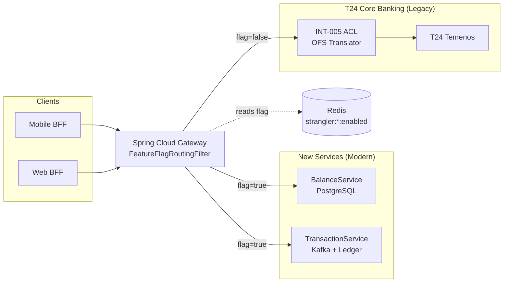

## Implementation Guidelines

### 1. Spring Cloud Gateway — `FeatureFlagRoutingFilter`

```java
@Component
@RequiredArgsConstructor
public class FeatureFlagRoutingFilter implements GatewayFilter, Ordered {

    private final StringRedisTemplate redis;

    @Override
    public Mono<Void> filter(ServerWebExchange exchange, GatewayFilterChain chain) {
        String capability = exchange.getAttribute("capability"); // set by route predicate
        String flagKey = "strangler:" + capability + ":enabled";
        String flagValue = redis.opsForValue().get(flagKey);

        if ("true".equals(flagValue)) {
            // Rewrite URI to new service
            URI newUri = UriComponentsBuilder.fromUri(exchange.getRequest().getURI())
                .host("new-" + capability + "-svc")
                .build().toUri();
            exchange = exchange.mutate()
                .request(exchange.getRequest().mutate().uri(newUri).build()).build();
        }
        // else: request continues to T24 ACL route unchanged
        return chain.filter(exchange);
    }

    @Override
    public int getOrder() { return -1; }
}
```

### 2. Gateway route configuration

```yaml
spring:
  cloud:
    gateway:
      routes:
        - id: balance-enquiry
          uri: http://t24-acl-svc:8080
          predicates:
            - Path=/api/accounts/*/balance
          filters:
            - name: FeatureFlagRoutingFilter
              args:
                capability: balance-enquiry
        - id: transaction-history
          uri: http://t24-acl-svc:8080
          predicates:
            - Path=/api/accounts/*/transactions
          filters:
            - name: FeatureFlagRoutingFilter
              args:
                capability: transaction-history
```

### 3. Hourly reconciliation job — detect divergence between new service and T24

```java
@Scheduled(fixedDelay = 3_600_000) // hourly
public void reconcile() {
    LocalDate today = LocalDate.now();
    long newServiceCount = balanceRepo.countByDate(today);
    long t24Count = t24AclClient.countJournalsByDate(today);

    if (Math.abs(newServiceCount - t24Count) > DIVERGENCE_THRESHOLD) {
        alertService.fire("strangler_reconciliation_divergence",
            "New service: " + newServiceCount + ", T24: " + t24Count);
    }
    log.info("event=strangler_reconcile date={} new={} t24={}", today, newServiceCount, t24Count);
}
```

### 4. Feature flag promotion script

```bash
#!/bin/bash
# Promote strangler flag: 0% -> 10% -> 50% -> 100%
CAPABILITY=$1
PERCENTAGE=$2
redis-cli SET "strangler:${CAPABILITY}:enabled" "true"
redis-cli SET "strangler:${CAPABILITY}:rollout_pct" "${PERCENTAGE}"
echo "Strangler flag '${CAPABILITY}' promoted to ${PERCENTAGE}%"
```

## When to Use

- Incremental replacement of T24 core banking functionality, one capability at a time, with the ability to roll back to T24 for any capability within a single Redis flag change.
- Reducing T24 operational coupling in stages — migrate read-heavy capabilities first (balance enquiry, account statement), then write capabilities (payment posting), to reduce T24 load progressively.
- Canary releases of new microservices that serve a subset of traffic (e.g., 5% of accounts) before full promotion, allowing production validation with limited blast radius.

## When Not to Use

- Capabilities with no T24 equivalent — if the new service is net-new functionality with no legacy counterpart, there is nothing to strangle; deploy directly with a standard feature flag.
- Cross-capability transactions that span both strangled and non-strangled services simultaneously — the dual-write consistency problem becomes intractable; ensure the ACL (INT-005) handles the coordination until the full capability bundle is migrated atomically.
- Permanent parallel operation — the Strangler Fig is a migration tool, not an architectural steady state; each capability must be fully migrated (flag permanently true) within 12 months, or the dual-maintenance cost negates the migration benefit.

## Variants

| Variant | When to prefer | Trade-off |
|---------|----------------|-----------|
| Gateway-level routing (this pattern) | HTTP request routing; per-capability flags; stateless routing logic | Requires Spring Cloud Gateway; all traffic passes through the gateway — single point of failure |
| ACL-level branching (INT-005) | Translation-level branching; the ACL calls new service OR T24 based on flag | Tighter coupling between ACL and feature flag; ACL becomes more complex |
| Shadow mode (dual-read, discard new) | Validation before switching; new service runs in parallel but results are discarded; T24 is authoritative | No production risk; no production benefit until fully promoted; only useful for validation |

## NFR Acceptance Criteria

| Metric | Threshold | Measurement |
|--------|-----------|-------------|
| Flag propagation latency | ≤ 1 s (Redis read in gateway filter) | Measure time from `redis-cli SET` to first request routed to new service |
| Reconciliation divergence threshold | ≤ 0.01% count difference between new service and T24 | Hourly reconciliation job; assert divergence < 0.01% per capability |
| Rollback time | ≤ 30 s (Redis flag flip to full T24 routing) | Chaos test: set flag to false; measure time to zero requests reaching new service |
| Gateway routing overhead | ≤ 2 ms p99 (Redis flag read + URI rewrite) | Load test at 500 rps; assert gateway filter adds ≤ 2 ms p99 vs. no-filter baseline |
| Availability | 99.99% (T0/T1 — all payment traffic passes through gateway) | Gateway HA with ≥ 3 pods; HPA; Redis Cluster for flag store |

## Compliance Mapping

| Ring | Regulation | Provision | How this pattern satisfies |
|------|-----------|-----------|---------------------------|
| Ring 0 | ISO 22301 | Business continuity — maintain service during system replacement | Redis flag enables instant rollback to T24 within 30 s; no migration step is irreversible before full promotion. |
| Ring 1 | BCBS 230 | Principle 4 — Substitutability: critical systems must have fallback capability | T24 remains fully operational as the fallback; the Strangler Fig flag controls which path is active; T24 is never decommissioned until the new service has proven 100% traffic for ≥ 30 days. |
| Ring 2 | SBV Circular 09/2020 | §IV.6 — System change management: major system changes require documented rollback procedures ⚠️ (working summary — pending Legal review) | Feature flag provides a single-command rollback; hourly reconciliation detects divergence before it becomes a compliance issue; Legal review required to confirm that the Strangler Fig migration cadence satisfies SBV §IV.6 change-management documentation requirements. |

## Cost / FinOps

- Spring Cloud Gateway: additional filter per route adds ~1 ms overhead and one Redis round-trip per request. At 500 rps, this is 500 Redis reads/second — well within Redis Cluster capacity.
- Reconciliation job: runs hourly; queries two data sources (new service DB + T24 via ACL). Compute cost negligible.
- Dual-maintenance period: maintaining both new service code and T24 ACL adds engineering overhead. Define a maximum migration window (12 months per capability) to prevent indefinite dual maintenance.
- Cost of big-bang migration (alternative): a failed big-bang migration requires an emergency rollback of the entire system with T0 downtime; estimated cost 10–50× the incremental Strangler Fig migration.

## Threat Model

- **Split-brain reads (Information Disclosure)**: A user reads their balance from the new service (flag=true) and then from T24 directly via another channel (flag=false) — they see different values during the transition. Mitigation: reconciliation job detects divergence and alerts; per-tenant flag rollout limits the population seeing new-service reads.
- **Flag store unavailability (Denial of Service)**: Redis is unavailable; the gateway cannot read the feature flag. Without a defined fallback, all traffic fails. Mitigation: if Redis is unreachable, the filter defaults to T24 (legacy path) — fail-safe toward the known-good system.

## Runbook Stub

**Alert: `strangler_reconciliation_divergence > 0.01%`**
- p50 baseline: 0% | p99 SLO: 0.01%
- Remediation: (1) Identify the capability and the diverging accounts. (2) Set flag back to T24 immediately: `redis-cli SET strangler:<capability>:enabled false`. (3) Investigate the new service's write path for the diverging transactions. (4) Do not re-promote the flag until root cause is identified and fixed.

**Alert: `gateway_filter_latency_p99 > 5ms`**
- p50 baseline: 0.5 ms | p99 SLO: 2 ms
- Remediation: (1) Check Redis cluster latency: `redis-cli --latency-history`. (2) If Redis is slow, the gateway is blocking on the flag read — investigate Redis cluster health. (3) Consider pre-warming the flag in gateway local cache with a 1-second TTL.

## Test Strategy Stub

### Unit Tests
- `FeatureFlagRoutingFilterTest`: mock Redis returning `"true"` → assert URI rewritten to new service. Mock returning `null` or `"false"` → assert URI unchanged (T24 ACL path). Mock Redis exception → assert fallback to T24.
- `ReconciliationJobTest`: mock new service count = T24 count → no alert. Mock divergence > threshold → assert alert fires.

### Integration Tests
- Spring Boot Test with Testcontainers (Redis + WireMock for T24 + new service): set flag to `true`; send request to gateway; assert WireMock for new service received the request; assert T24 mock did NOT receive it. Toggle flag to `false`; assert T24 mock received it.
- Rollback test: set flag to `true`; inject 1% error rate from new service; detect via reconciliation; set flag to `false`; assert all requests route to T24 within 1 s.

### Chaos Tests
- Kill Redis: assert gateway routes all traffic to T24 (fail-safe default); restore Redis; assert flag-based routing resumes.
- Kill new service: assert gateway returns 502; set flag to `false`; assert T24 path serves all requests.

## Related Patterns

- [INT-005 Anti-Corruption Layer](anti-corruption-layer.md) — the ACL that isolates T24's OFS model; the Strangler Fig replaces what the ACL wraps
- [INT-007 Sidecar / Ambassador](sidecar-ambassador.md) — the sidecar handles mTLS and retry for new service pods behind the gateway
- [RES-002 Circuit Breaker](../resilience/circuit-breaker.md) — the circuit breaker on the T24 ACL leg ensures that T24 unavailability triggers the flag fallback correctly
- [PRIN-002 Event-Driven Architecture](../../principles/event-driven-architecture.md) — migrated services often adopt event-driven patterns replacing T24's request-response OFS model

## References

- Fowler, M. (2004) — [Strangler Fig Application](https://martinfowler.com/bliki/StranglerFigApplication.html) (pattern origin)
- Microsoft Azure Architecture Center — [Strangler Fig pattern](https://docs.microsoft.com/en-us/azure/architecture/patterns/strangler-fig)
- Spring Cloud Gateway Reference — [docs.spring.io/spring-cloud-gateway](https://docs.spring.io/spring-cloud-gateway/docs/current/reference/html/)
- BCBS 230 — Principles for Effective Operational Resilience (principle 4 — substitutability)
- `knowledge-base/_research-notes.md` — T24 modernization roadmap notes

---

**Key Takeaway**: Replace T24 capabilities one at a time behind a Spring Cloud Gateway feature flag — route traffic to the new microservice when ready, fall back to T24 with a single Redis flag flip, and verify correctness with hourly reconciliation before full promotion.
````

- [ ] **Step 3: Lint Mermaid**

```bash
bash scripts/mermaid-lint-doc.sh knowledge-base/patterns/integration/strangler-fig.md
```
Expected: exits 0.

- [ ] **Step 4: Compliance check**

```bash
python3 scripts/check-compliance-rows.py
```
Expected: 0 failures.

- [ ] **Step 5: Commit**

```bash
git add knowledge-base/patterns/integration/strangler-fig.md
git commit -m "feat(catalog): INT-006 Strangler Fig — Wave 5A"
```

---

### Task 8: INT-007 Sidecar / Ambassador (FULL WRITE)

**Files:**
- Modify: `knowledge-base/patterns/integration/sidecar-ambassador.md`

- [ ] **Step 1: Verify stub**

```bash
head -5 knowledge-base/patterns/integration/sidecar-ambassador.md
```
Expected: `Status: Proposed`

- [ ] **Step 2: Replace the entire file with:**

````markdown
# Sidecar / Ambassador

Status: Draft | Last Reviewed: 2026-05-16 | Owner: @sre-lead
Catalog ID: INT-007 | Radii
Tier Applicability: T0, T1

## Problem Statement

- **Cross-cutting concern duplication**: every microservice independently implements mTLS client certificates, retry-with-backoff, circuit breaking, and metrics scraping — 30+ services each carry the same boilerplate, creating inconsistent configurations and update overhead when the retry policy changes.
- **Language-heterogeneous fleet**: Java services use Resilience4j; Python ML services and Node.js BFF services have no equivalent library. Enforcing a consistent retry and circuit-break policy across a polyglot fleet is impossible without a language-agnostic layer.
- **mTLS certificate rotation**: when Vault-issued mTLS certificates expire, every service must rotate simultaneously. A sidecar-managed certificate lifecycle centralises rotation without service restarts.
- **Observability gaps**: services that handle their own HTTP client telemetry emit inconsistent metric names and miss L4 network-level metrics (TCP errors, connection reuse rates) that are only observable at the proxy level.
- **Security policy enforcement lag**: a new mTLS policy or cipher suite requirement must be deployed across 30+ service teams simultaneously if each team owns its own TLS configuration.

## Context

The Sidecar/Ambassador pattern deploys an Envoy proxy as a co-located container within the same Kubernetes pod as the main application container. The sidecar intercepts all inbound and outbound traffic, enforcing mTLS, retry-with-backoff, circuit breaking, and L7 metrics without modifying the application code. Istio's control plane manages the sidecar configuration centrally via `DestinationRule` and `PeerAuthentication` CRDs. This pattern is the foundation of the Techcombank service mesh and is mandatory for all T0/T1 pods.

## Solution

Istio injects an Envoy sidecar into every pod annotated with `sidecar.istio.io/inject: "true"`. Envoy intercepts all outbound calls and enforces: (1) mTLS (ISTIO_MUTUAL mode) using Vault-issued SPIFFE certificates; (2) retry policy (3 retries, 25 ms base delay, 1 s max); (3) circuit breaker (5 consecutive 5xx trips, 30 s ejection). Envoy intercepts all inbound calls and terminates TLS, forwarding plain HTTP to the application container on the localhost interface. Prometheus scrapes `/stats/prometheus` from each Envoy sidecar, providing consistent L7 metrics across all services.

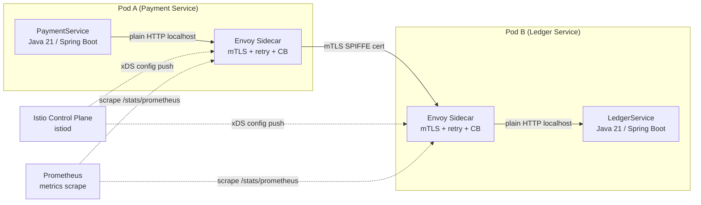

## Implementation Guidelines

### 1. Istio `PeerAuthentication` — enforce STRICT mTLS for the namespace

```yaml
apiVersion: security.istio.io/v1beta1
kind: PeerAuthentication
metadata:
  name: default
  namespace: payments
spec:
  mtls:
    mode: STRICT
```

### 2. Istio `DestinationRule` — retry, circuit breaker, and connection pool

```yaml
apiVersion: networking.istio.io/v1alpha3
kind: DestinationRule
metadata:
  name: ledger-service
  namespace: payments
spec:
  host: ledger-service.payments.svc.cluster.local
  trafficPolicy:
    connectionPool:
      http:
        http1MaxPendingRequests: 100
        http2MaxRequests: 1000
    outlierDetection:
      consecutive5xxErrors: 5
      interval: 30s
      baseEjectionTime: 30s
      maxEjectionPercent: 50
    retryPolicy:
      attempts: 3
      perTryTimeout: 5s
      retryOn: gateway-error,connect-failure,retriable-4xx
```

### 3. Pod annotation — opt-in sidecar injection

```yaml
apiVersion: apps/v1
kind: Deployment
metadata:
  name: payment-service
spec:
  template:
    metadata:
      annotations:
        sidecar.istio.io/inject: "true"
        sidecar.istio.io/proxyCPU: "100m"
        sidecar.istio.io/proxyMemory: "128Mi"
    spec:
      containers:
        - name: payment-service
          image: techcombank/payment-service:latest
          # Application speaks plain HTTP on port 8080; sidecar handles TLS
          ports:
            - containerPort: 8080
```

### 4. Vault SPIFFE certificate — sidecar certificate lifecycle

```hcl
# Vault PKI role for service mesh certificates
path "pki_int/issue/service-mesh" {
  capabilities = ["create", "update"]
  allowed_parameters = {
    "common_name" = ["*.payments.svc.cluster.local"]
    "ttl" = ["24h"]
  }
}
```

## When to Use

- All T0/T1 pods that make outbound service-to-service calls within the Techcombank Kubernetes cluster — the sidecar is mandatory for mTLS compliance and consistent observability.
- Polyglot services (Python ML models, Node.js BFF) that cannot use Resilience4j — the Envoy sidecar provides retry, circuit break, and mTLS without any code change.
- Services requiring granular traffic management (weighted routing, canary, fault injection for chaos testing) — these are sidecar-native features not available in application-level libraries.

## When Not to Use

- Batch jobs that make no outbound service calls and run to completion — the sidecar adds 64 MiB memory overhead per pod; single-use batch pods that terminate quickly do not benefit.
- External-facing edge services that terminate TLS from the internet — use a dedicated API gateway or load balancer for north-south traffic; the Envoy sidecar is for east-west (service-to-service) traffic.
- Local development: the Istio sidecar is not injected in local `docker-compose` environments; use `PERMISSIVE` mTLS mode for local dev and `STRICT` for staging/production.

## Variants

| Variant | When to prefer | Trade-off |
|---------|----------------|-----------|
| Istio Envoy sidecar (this pattern) | Kubernetes-native; full traffic management; L7 metrics | Istio control plane is an operational dependency; istiod must be HA |
| Linkerd micro-proxy | Lower memory overhead (~10 MiB vs 64 MiB); simpler operational model | Less feature-rich (no fault injection, simpler traffic management); not the Techcombank standard |
| Application-level Resilience4j only | Simple Spring Boot to Spring Boot calls; mTLS not required | No cross-language consistency; metrics require custom instrumentation; not mesh-native |

## NFR Acceptance Criteria

| Metric | Threshold | Measurement |
|--------|-----------|-------------|
| Sidecar overhead — latency | ≤ 1 ms p99 added per hop | Benchmark with and without sidecar injection on same route; assert overhead ≤ 1 ms |
| mTLS handshake | 100% of east-west traffic encrypted (STRICT mode) | `istioctl x describe pod <pod>` confirms STRICT; network scan from outside mesh confirms port 8080 is closed to non-mesh clients |
| Circuit breaker ejection | ≤ 30 s ejection on 5 consecutive 5xx | Chaos test: inject 5 consecutive 500 errors; assert Envoy ejects the pod for ≥ 30 s; assert traffic routes to healthy replicas |
| Sidecar memory | ≤ 128 MiB per pod | Monitor `container_memory_working_set_bytes{container="istio-proxy"}` |
| Certificate rotation | ≤ 5 min (Vault-issued cert TTL: 24h; rotation at 75% TTL) | Monitor `pilot_proxy_convergence_time` in Grafana; assert < 5 min for cert rotation propagation |

## Compliance Mapping

| Ring | Regulation | Provision | How this pattern satisfies |
|------|-----------|-----------|---------------------------|
| Ring 0 | NIST SP 800-204A | §3.3 — Service-to-service authentication via mutual TLS in microservices | Istio `PeerAuthentication STRICT` enforces mTLS for all east-west traffic; SPIFFE X.509 SVIDs issued by Vault PKI provide workload identity; no service can receive unencrypted traffic from outside the mesh. |
| Ring 1 | PCI-DSS v4.0 | §4.2.1 — Strong cryptography for all non-console administrative access and transmission of cardholder data | STRICT mTLS with TLS 1.3 (Envoy default) satisfies PCI-DSS §4.2.1 for all CDE-adjacent service communication; cipher suites restricted to AESGCM via `DestinationRule` TLS settings. |
| Ring 2 | SBV Circular 09/2020 | §III.4 — Encryption requirements for inter-system communication within the data centre ⚠️ (working summary — pending Legal review) | All intra-cluster east-west traffic is mTLS encrypted; Envoy enforces TLS 1.3 minimum; Legal review required to confirm TLS 1.3 + SPIFFE identity satisfies SBV §III.4 inter-system encryption requirements. |

## Cost / FinOps

- Envoy sidecar per pod: 64 MiB memory, 0.1 vCPU at idle. For 100 pods, this is 6.4 GiB additional memory and 10 vCPU — significant but justified by eliminating 30+ per-service TLS and retry implementations.
- Istio control plane: 3 istiod pods at 512 MiB each = 1.5 GiB. Shared across all namespaces.
- Reduced engineering cost: centralised retry, circuit break, and mTLS configuration saves ~2 engineer-weeks per year in boilerplate maintenance across a 30-service fleet.
- mTLS offload: application containers handle plain HTTP; TLS is done by Envoy using hardware-accelerated AES on modern Intel/ARM CPUs — no measurable application CPU overhead.

## Threat Model

- **Sidecar MITM (Spoofing)**: A pod without sidecar injection attempts to communicate with a sidecar-protected service by presenting a forged mTLS certificate. Mitigation: STRICT PeerAuthentication mode rejects any certificate not issued by the Istio CA (backed by Vault PKI); spoofed certificates fail SPIFFE SVID validation.
- **Sidecar OOM eviction (Denial of Service)**: A traffic spike causes Envoy to consume memory beyond the 128 MiB limit, triggering an OOM eviction that takes down the sidecar and the application container. Mitigation: Envoy memory limit set to 128 MiB with a `requests: 64Mi` floor; HPA on the application deployment scales pods before Envoy is saturated; `outlierDetection` ejects consistently slow pods.

## Runbook Stub

**Alert: `istio_proxy_oom_evictions > 0`**
- p50 baseline: 0 | p99 SLO: 0
- Remediation: (1) `kubectl describe pod <pod>` — confirm OOMKilled on `istio-proxy` container. (2) Increase Envoy memory limit in the pod annotation: `sidecar.istio.io/proxyMemory: "256Mi"`. (3) Check if the traffic spike is expected; if not, investigate upstream for a DDoS or retry storm.

**Alert: `mtls_plaintext_request_rate > 0`**
- p50 baseline: 0 | p99 SLO: 0
- Remediation: CRITICAL — plaintext traffic in a STRICT mTLS namespace means a pod lacks sidecar injection. (1) `istioctl x describe pod <pod>` — identify the pod. (2) Ensure the pod's namespace has `istio-injection: enabled` label. (3) Restart the pod to trigger sidecar injection.

## Test Strategy Stub

### Unit Tests
- No application-level unit tests needed for the sidecar — it is infrastructure, not application code. Test Rego/OPA policies separately.

### Integration Tests
- `IstioMtlsTest` (KinD or local Istio): deploy two test pods with STRICT PeerAuthentication; assert pod A can reach pod B via mTLS; deploy pod C without sidecar; assert pod C's plain HTTP request to pod B is rejected with 403.
- Circuit breaker test: inject 5 consecutive 503 responses from a mock service; assert Envoy ejects the mock for ≥ 30 s; restore the mock; assert traffic resumes after ejection period.

### Chaos Tests
- Kill istiod: assert existing sidecars continue serving traffic with cached xDS config (Envoy is not dependent on istiod for in-flight requests); assert new pods without xDS config cannot start (fail-secure).
- Certificate expiry: let Vault-issued cert expire; assert Envoy renews automatically before expiry (at 75% TTL); assert no traffic interruption during rotation.

## Related Patterns

- [INT-005 Anti-Corruption Layer](anti-corruption-layer.md) — the ACL wraps T24 calls; the sidecar enforces mTLS on those calls
- [RES-002 Circuit Breaker](../resilience/circuit-breaker.md) — the Envoy circuit breaker (outlierDetection) is the service-mesh complement to Resilience4j in-process circuit breaking
- [SEC-001 mTLS Service Mesh](../../patterns/security/mtls-service-mesh.md) — the security pattern that this sidecar deployment satisfies
- [NFR-002 Latency Budget Model](../../nfr/latency-budget-model.md) — the ≤1 ms sidecar overhead must be budgeted in the overall T0 latency allocation

## References

- Istio Documentation — [istio.io/docs](https://istio.io/latest/docs/)
- Envoy Proxy — Circuit Breaker (OutlierDetection) [envoyproxy.io/docs](https://www.envoyproxy.io/docs/envoy/latest/intro/arch_overview/upstream/circuit_breaking)
- NIST SP 800-204A — Strategy for the Integration of Security Services in Microservices-based Systems
- [SPIFFE / SPIRE](https://spiffe.io/) — workload identity standard used by Istio
- HashiCorp Vault PKI Secrets Engine — [developer.hashicorp.com/vault/docs/secrets/pki](https://developer.hashicorp.com/vault/docs/secrets/pki)
- `knowledge-base/_research-notes.md` — service mesh deployment notes

---

**Key Takeaway**: Inject an Envoy sidecar into every pod to get mTLS, retry-with-backoff, and circuit breaking for free — no application code changes, consistent policy across Java, Python, and Node services, and full L7 observability from a single control plane.
````

- [ ] **Step 3: Lint Mermaid**

```bash
bash scripts/mermaid-lint-doc.sh knowledge-base/patterns/integration/sidecar-ambassador.md
```
Expected: exits 0.

- [ ] **Step 4: Compliance check**

```bash
python3 scripts/check-compliance-rows.py
```
Expected: 0 failures.

- [ ] **Step 5: Commit**

```bash
git add knowledge-base/patterns/integration/sidecar-ambassador.md
git commit -m "feat(catalog): INT-007 Sidecar Ambassador — Wave 5A"
```

---

### Task 9: INT-008 Backend-for-Frontend Routing (FULL WRITE)

**Files:**
- Modify: `knowledge-base/patterns/integration/backend-for-frontend-routing.md`

- [ ] **Step 1: Verify stub**

```bash
head -5 knowledge-base/patterns/integration/backend-for-frontend-routing.md
```
Expected: `Status: Proposed`

- [ ] **Step 2: Replace the entire file with:**

````markdown
# Backend-for-Frontend Routing

Status: Draft | Last Reviewed: 2026-05-16 | Owner: @tech-lead-backend
Catalog ID: INT-008 | Radii
Tier Applicability: T0, T1

## Problem Statement

- **One-size-fits-all API mismatch**: a generic REST API designed for web desktop clients returns 40+ fields per account response; the mobile app needs only 8 fields but cannot control server-side field selection, wasting mobile data and battery parsing unnecessary JSON.
- **Over-fetching and waterfall latency**: the mobile app performs 4 sequential HTTP calls (account summary, recent transactions, notification count, product offers) to render a single dashboard screen, accumulating 4× network round-trip time on 4G/LTE — breaching the 200 ms P99 response budget.
- **Channel-specific security policy**: the mobile client should validate a narrowly scoped JWT (`aud: mobile-bff`) while the web client validates a broader JWT (`aud: web-bff`); a single API server cannot enforce per-channel `aud` claims without complex conditional logic.
- **Coupling downstream changes to multiple clients**: when the Account Service adds a field, the mobile app, the web app, and the embedded banking partner all receive the change and must independently handle the new field — the BFF isolates each channel from downstream evolution.
- **Mobile network resilience**: mobile BFF must implement aggressive caching, stale-while-revalidate, and retry-with-backoff tuned for high-latency mobile networks; a generic API server cannot apply mobile-specific resilience without polluting the server logic.

## Context

The BFF pattern deploys one dedicated aggregation service per client channel: `mobile-bff` (serving iOS Swift and Android Kotlin clients), `web-bff` (serving the React 18 web application), and `partner-bff` (serving embedded banking B2B API consumers). Each BFF is a thin Spring WebFlux reactive aggregation layer that composes calls to downstream domain services, shapes the response for its specific channel, and enforces channel-specific authentication and rate limits.

## Solution

Each BFF is a Spring WebFlux service that uses `Mono.zip` to call multiple downstream services in parallel, merging the responses into a single channel-optimised payload. The JWT `aud` claim is validated per-channel: mobile BFF accepts only `aud=mobile-bff`, web BFF accepts only `aud=web-bff`. Resilience4j bulkheads per downstream service prevent a slow Account Service from blocking Notification Service calls. The mobile BFF applies an additional ETag-based cache for 30-second stale responses to absorb mobile retry storms.

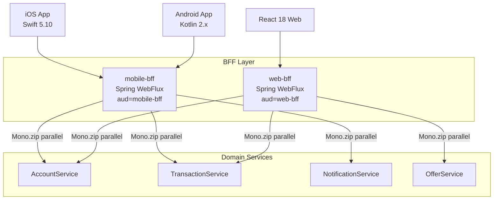

## Implementation Guidelines

### 1. Mobile BFF — `Mono.zip` parallel aggregation

```java
@RestController
@RequiredArgsConstructor
@RequestMapping("/mobile/v1")
public class MobileDashboardController {

    private final AccountClient accountClient;
    private final TransactionClient transactionClient;
    private final NotificationClient notificationClient;

    @GetMapping("/dashboard")
    public Mono<MobileDashboardResponse> getDashboard(
            @AuthenticationPrincipal Jwt jwt) {
        String accountId = jwt.getClaimAsString("account_id");

        return Mono.zip(
            accountClient.getSummary(accountId),
            transactionClient.getRecent(accountId, 5),
            notificationClient.getUnreadCount(accountId)
        ).map(tuple -> MobileDashboardResponse.builder()
            .accountSummary(tuple.getT1())
            .recentTransactions(tuple.getT2())
            .unreadNotifications(tuple.getT3())
            .build());
    }
}
```

### 2. JWT `aud` claim validation — channel-specific security

```java
@Configuration
public class MobileBffSecurityConfig {

    @Bean
    SecurityFilterChain mobileBffChain(HttpSecurity http) throws Exception {
        return http
            .oauth2ResourceServer(oauth2 -> oauth2
                .jwt(jwt -> jwt
                    .jwtAuthenticationConverter(jwtConverter())
                    // Reject tokens with aud != "mobile-bff"
                    .decoder(NimbusJwtDecoder.withJwkSetUri(jwksUri)
                        .jwtProcessorCustomizer(p ->
                            p.setJWTClaimsSetVerifier(new DefaultJWTClaimsVerifier<>(
                                new JWTClaimsSet.Builder().audience("mobile-bff").build(),
                                new HashSet<>(Arrays.asList("sub", "aud", "exp"))))).build())))
            .build();
    }
}
```

### 3. Resilience4j bulkhead — per-downstream isolation

```yaml
# application.yml
resilience4j:
  bulkhead:
    instances:
      account-client:
        maxConcurrentCalls: 50
        maxWaitDuration: 10ms
      transaction-client:
        maxConcurrentCalls: 30
        maxWaitDuration: 10ms
      notification-client:
        maxConcurrentCalls: 20
        maxWaitDuration: 5ms
```

### 4. Mobile ETag cache — stale-while-revalidate for mobile resilience

```java
@Component
public class MobileCacheFilter implements WebFilter {

    private final CacheControl cacheControl =
        CacheControl.maxAge(30, TimeUnit.SECONDS).staleWhileRevalidate(60, TimeUnit.SECONDS);

    @Override
    public Mono<Void> filter(ServerWebExchange exchange, WebFilterChain chain) {
        return chain.filter(exchange)
            .then(Mono.fromRunnable(() ->
                exchange.getResponse().getHeaders()
                    .setCacheControl(cacheControl.getHeaderValue())));
    }
}
```

## When to Use

- Mobile apps (iOS/Android) that need a single-call dashboard endpoint aggregating 3–5 downstream services to avoid sequential waterfall round trips on cellular networks.
- Multi-channel products where different clients (mobile, web, partner API) need meaningfully different response shapes, authentication scopes, or rate limits for the same underlying domain data.
- Any channel where downstream service coupling must be avoided — the BFF absorbs API evolution from domain services before it reaches the client contract.

## When Not to Use

- A single client type with uniform data requirements — if there is only one client and it needs exactly what the domain service returns, the BFF adds a network hop and complexity without benefit; call the domain service directly.
- GraphQL server already in place — GraphQL provides per-client field selection that eliminates the over-fetching problem; a BFF layer is redundant if GraphQL already serves the purpose.
- Event-driven real-time feeds (WebSocket push) — BFF is designed for request-response aggregation; real-time event push should use a dedicated WebSocket service or SSE endpoint.

## Variants

| Variant | When to prefer | Trade-off |
|---------|----------------|-----------|
| Channel-specific BFF (this pattern) | Well-defined client channels (mobile, web, partner); each needs distinct response shapes and auth policies | One BFF per channel to maintain; proliferates if channel count grows beyond 4–5 |
| GraphQL BFF | Flexible field selection needed; web clients with diverse query patterns; schema federation across teams | GraphQL adds schema complexity and N+1 query risk without DataLoader optimization |
| Generic API Gateway with field projection | Simple field trimming; no aggregation needed; small team | No business logic in the BFF; cannot handle complex parallel aggregation; projection rules can grow complex |

## NFR Acceptance Criteria

| Metric | Threshold | Measurement |
|--------|-----------|-------------|
| Mobile dashboard p99 response time | ≤ 200 ms (P99 under 500 rps) | Gatling load test; measure from first request byte to last response byte; assert p99 ≤ 200 ms |
| Parallel aggregation overhead | ≤ 20 ms vs slowest downstream (vs. sequential: sum of all downstreams) | Compare `Mono.zip` parallel vs. sequential calls in benchmark; assert overhead ≤ 20 ms |
| Bulkhead rejection rate | < 0.1% under normal load | Monitor `resilience4j_bulkhead_rejected_calls` metric; alert if > 0.1% |
| JWT audience rejection | 100% of wrong-`aud` tokens rejected | Security test: send `aud=web-bff` token to mobile BFF; assert 401 |
| Availability | 99.99% (T0 — mobile BFF is on the primary customer-facing path) | HPA min 3 pods; health check endpoint; Kubernetes liveness probe |

## Compliance Mapping

| Ring | Regulation | Provision | How this pattern satisfies |
|------|-----------|-----------|---------------------------|
| Ring 0 | OWASP ASVS V4 | §4.3.2 — API tokens must have a limited audience claim (`aud`); tokens for one service must be rejected by another | Mobile BFF validates `aud=mobile-bff`; web BFF validates `aud=web-bff`; a token issued for the mobile channel cannot be used against the web BFF, limiting the blast radius of a stolen token. |
| Ring 1 | PCI-DSS v4.0 | §6.2.4 — Prevent common security vulnerabilities including excessive data exposure | Mobile BFF returns only the 8 fields the mobile app needs, not all 40+ fields from the domain service; preventing exposure of unneeded cardholder data fields to mobile clients reduces CDE surface area. |
| Ring 2 | SBV Circular 09/2020 | §III.3 — Internet banking access control: channel-specific authentication and authorisation ⚠️ (working summary — pending Legal review) | Separate BFF per channel enforces separate JWT audience, separate rate limits, and separate session management per channel type; Legal review required to confirm that per-channel `aud` claim validation satisfies SBV §III.3 channel-specific access control requirements. |

## Cost / FinOps

- One BFF pod per channel: Spring WebFlux is reactive and event-loop-based; 2 pods per channel at 512 MiB each handles 500 rps per channel. For 3 channels (mobile, web, partner): 6 pods = 3 GiB.
- Parallel aggregation reduces client round trips: 4 sequential calls at 50 ms each = 200 ms; `Mono.zip` parallel = ~55 ms (slowest downstream). Reducing round trips reduces mobile data plan usage and improves conversion rates.
- ETag cache: 30 s stale cache for mobile dashboard absorbs 30× repeat requests from retry-happy mobile clients; reduces downstream service load proportionally.
- Cost of not using BFF: over-fetching 40 fields when 8 are needed — 5× unnecessary data transfer per mobile request at scale = measurable CDN and egress cost.

## Threat Model

- **Cross-channel token abuse (Spoofing)**: A token issued for `aud=web-bff` is stolen and replayed against the mobile BFF. The mobile BFF's `aud` claim validator rejects the token with 401 because the audience does not match `mobile-bff`. Mitigation: Spring Security JWT processor verifies audience claim before any route is authorized.
- **BFF as aggregation DDoS amplifier (Denial of Service)**: A client sends 1 request to the mobile BFF; the BFF fans out to 3 downstream services. An attacker can amplify 1 rps into 3 rps of downstream load. Mitigation: rate limiter at the API gateway (100 rps per authenticated client_id) before traffic reaches the BFF; bulkhead per downstream service limits the fan-out queue.

## Runbook Stub

**Alert: `mobile_bff_p99 > 300ms`**
- p50 baseline: 80 ms | p99 SLO: 200 ms
- Remediation: (1) Check which downstream call is slow using distributed traces (Jaeger): `GET /mobile/v1/dashboard` trace → identify slow span. (2) If `account-client` is slow, check AccountService HPA — scale if needed. (3) If the BFF itself is slow, check `mobile_bff` pod CPU/memory. (4) If all downstreams are healthy, check for a GC pause in the BFF pod: `kubectl logs <pod> | grep "GC pause"`.

**Alert: `mobile_bff_bulkhead_rejected > 1%`**
- p50 baseline: 0% | p99 SLO: 0.1%
- Remediation: (1) Identify which bulkhead is saturating: `resilience4j_bulkhead_rejected_calls_total{name=...}` in Grafana. (2) Check the downstream service health. (3) Increase bulkhead `maxConcurrentCalls` temporarily. (4) Investigate if a downstream is degraded and triggering client-side retry storms.

## Test Strategy Stub

### Unit Tests
- `MobileDashboardControllerTest`: mock `accountClient`, `transactionClient`, `notificationClient`; assert `Mono.zip` calls all three; assert response contains fields from all three mocks; assert slow notificationClient (100 ms delay) does not block the `Mono.zip` (zip runs in parallel).
- `MobileBffSecurityConfigTest`: send JWT with `aud=web-bff`; assert 401. Send JWT with `aud=mobile-bff`; assert 200.

### Integration Tests
- Spring Boot Test + WireMock: stub all 3 downstream services at 50 ms response time; measure dashboard endpoint response time; assert < 80 ms (parallel, not 150 ms sequential). Stub `account-client` to time out; assert bulkhead rejects after 10 ms; assert 503 returned to client.

### Chaos Tests
- Kill NotificationService: assert mobile dashboard returns 200 with `unreadNotifications: null` (graceful degradation via `onErrorReturn`); assert AccountService and TransactionService responses are still returned.

## Related Patterns

- [INT-007 Sidecar / Ambassador](sidecar-ambassador.md) — the sidecar handles mTLS for BFF-to-domain-service calls
- [SEC-005 BFF Token Binding](../../patterns/security/bff-token-binding.md) — the token binding that validates per-channel JWT `aud` at the BFF layer
- [SEC-002 OAuth2 Authorization](../../patterns/security/oauth2-authorization.md) — the OAuth2 authorization server that issues per-channel access tokens
- [NFR-002 Latency Budget Model](../../nfr/latency-budget-model.md) — the 200 ms T0 budget that the BFF parallel aggregation must fit within

## References

- Newman, S. (2015) — *Building Microservices*, Chapter 4: Backends for Frontends
- [Microsoft Azure Architecture — Backends for Frontends](https://docs.microsoft.com/en-us/azure/architecture/patterns/backends-for-frontends)
- Project Reactor Reference — [Mono.zip](https://projectreactor.io/docs/core/release/reference/#which.combination)
- [Resilience4j — Bulkhead](https://resilience4j.readme.io/docs/bulkhead)
- Spring Security OAuth2 Resource Server — [docs.spring.io/spring-security](https://docs.spring.io/spring-security/reference/servlet/oauth2/resource-server/jwt.html)
- `knowledge-base/_research-notes.md` — mobile API latency benchmarks

---

**Key Takeaway**: Deploy one BFF per client channel — a Spring WebFlux aggregation layer that fans out to multiple domain services in parallel via `Mono.zip`, enforces channel-specific JWT `aud` validation, and returns a single channel-optimised response within the 200 ms T0 latency budget.
````

- [ ] **Step 3: Lint Mermaid**

```bash
bash scripts/mermaid-lint-doc.sh knowledge-base/patterns/integration/backend-for-frontend-routing.md
```
Expected: exits 0.

- [ ] **Step 4: Compliance check**

```bash
python3 scripts/check-compliance-rows.py
```
Expected: 0 failures.

- [ ] **Step 5: Commit**

```bash
git add knowledge-base/patterns/integration/backend-for-frontend-routing.md
git commit -m "feat(catalog): INT-008 Backend-for-Frontend Routing — Wave 5A"
```

---

### Task 10: INT-009 Content-Based Router (FULL WRITE)

**Files:**
- Modify: `knowledge-base/patterns/integration/content-based-router.md`

- [ ] **Step 1: Verify stub**

```bash
head -5 knowledge-base/patterns/integration/content-based-router.md
```
Expected: `Status: Proposed`

- [ ] **Step 2: Replace the entire file with:**

````markdown
# Content-Based Router

Status: Draft | Last Reviewed: 2026-05-16 | Owner: @tech-lead-backend
Catalog ID: INT-009 | Radii
Tier Applicability: T0, T1

## Problem Statement

- **Payment channel proliferation**: Techcombank routes domestic VND transfers via NAPAS, international wires via SWIFT, interbank transfers via the National Interbank Network (NHNN), and intrabank transfers via the internal ledger — four distinct channels with different protocols, latency profiles, and compliance requirements that cannot be served by a single endpoint.
- **Hardcoded routing logic**: without a dedicated router, payment processing services embed channel selection as `if (currency == "VND" && amount < 500M) route to NAPAS else if ...` conditionals spread across multiple classes, making routing policy changes a full code-deploy.
- **DLQ starvation from unroutable messages**: a payment message with an unrecognised combination of currency, amount, and beneficiary BIC silently falls through all routing conditions and is either dropped or causes a `ClassCastException`, with no alert or DLQ entry.
- **Routing policy auditability**: SBV requires that the routing decision (which channel was used, why) be traceable per transaction; embedded if-else routing leaves no structured routing audit trail.
- **Multi-currency routing complexity**: VND payments below SBV's large-value threshold go to NAPAS; above the threshold they go to NHNN; USD/EUR go to SWIFT; the threshold changes periodically — routing policy must be externalised.

## Context

The Content-Based Router sits on the T0 payment dispatch path, immediately after sanction screening (BSP-003) and ledger posting (BSP-001). It receives a `PaymentDispatchCommand` from Kafka and routes to the appropriate channel processor based on message content: `currency`, `amount`, `beneficiaryBIC`, and `paymentType`. Apache Camel's `choice().when()` DSL provides the routing logic as externalised configuration; routing decisions are written to a structured audit log.

## Solution

An Apache Camel route receives `PaymentDispatchCommand` messages from Kafka topic `payments.dispatch.commands` and routes them to the appropriate channel endpoint using a priority-ordered `choice()` predicate chain. The final `otherwise()` block routes unroutable messages to a DLQ and fires a `payment_unroutable_count` alert. Each routing decision is written to a `routing_audit` PostgreSQL table with the `routing_reason` (which predicate matched) for SBV traceability.

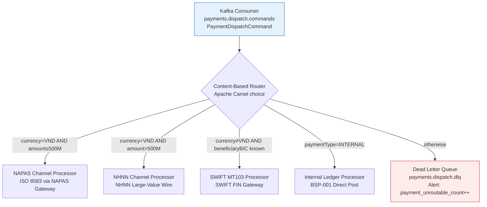

## Implementation Guidelines

### 1. Apache Camel content-based router with allowlist enforcement

```java
@Component
public class PaymentDispatchRoute extends RouteBuilder {

    @Value("${routing.napas.amount-threshold-vnd:500000000}")
    private BigDecimal napasThreshold;

    @Override
    public void configure() {
        // Dead letter channel — catches unroutable messages
        errorHandler(deadLetterChannel("kafka:payments.dispatch.dlq")
            .maximumRedeliveries(0)
            .logExhaustedMessageHistory(true));

        from("kafka:payments.dispatch.commands?groupId=payment-router")
            .routeId("content-based-router")
            .unmarshal().json(PaymentDispatchCommand.class)
            .process(this::logRoutingAudit) // audit BEFORE routing
            .choice()
                .when(exchange -> isInternal(exchange))
                    .to("direct:internal-ledger")
                .when(exchange -> isNapas(exchange))
                    .to("direct:napas-channel")
                .when(exchange -> isNhnn(exchange))
                    .to("direct:nhnn-channel")
                .when(exchange -> isSwift(exchange))
                    .to("direct:swift-mt103")
                .otherwise()
                    .process(exchange -> {
                        exchange.getMessage().setHeader("failureReason", "NO_ROUTE_MATCH");
                        meterRegistry.counter("payment_unroutable_count").increment();
                    })
                    .to("kafka:payments.dispatch.dlq")
            .end();
    }

    private boolean isInternal(Exchange ex) {
        PaymentDispatchCommand cmd = ex.getMessage().getBody(PaymentDispatchCommand.class);
        return "INTERNAL".equals(cmd.paymentType());
    }

    private boolean isNapas(Exchange ex) {
        PaymentDispatchCommand cmd = ex.getMessage().getBody(PaymentDispatchCommand.class);
        return "VND".equals(cmd.currency()) && cmd.amount().compareTo(napasThreshold) <= 0;
    }

    private boolean isNhnn(Exchange ex) {
        PaymentDispatchCommand cmd = ex.getMessage().getBody(PaymentDispatchCommand.class);
        return "VND".equals(cmd.currency()) && cmd.amount().compareTo(napasThreshold) > 0;
    }

    private boolean isSwift(Exchange ex) {
        PaymentDispatchCommand cmd = ex.getMessage().getBody(PaymentDispatchCommand.class);
        return !"VND".equals(cmd.currency()) && isKnownBic(cmd.beneficiaryBIC());
    }

    private boolean isKnownBic(String bic) {
        // Allowlist check: only route to explicitly allowed BICs
        return allowlistedBics.contains(bic);
    }

    private void logRoutingAudit(Exchange ex) {
        PaymentDispatchCommand cmd = ex.getMessage().getBody(PaymentDispatchCommand.class);
        routingAuditRepo.save(new RoutingAudit(cmd.transactionId(), cmd.currency(),
            cmd.amount(), cmd.beneficiaryBIC(), Instant.now()));
    }
}
```

### 2. `RoutingAudit` entity and repository

```java
@Entity
@Table(name = "routing_audit")
public record RoutingAudit(
    @Id UUID id,
    String transactionId,
    String currency,
    BigDecimal amount,
    String beneficiaryBIC,
    String routedTo,        // NAPAS | NHNN | SWIFT | INTERNAL | DLQ
    Instant routedAt
) {}
```

### 3. Prometheus alert — DLQ routing spikes

```yaml
# prometheus-alerts.yaml
groups:
  - name: payment-routing
    rules:
      - alert: PaymentUnroutableSpike
        expr: rate(payment_unroutable_count[5m]) > 0.1
        for: 2m
        labels:
          severity: critical
        annotations:
          summary: "Payment routing failures > 0.1/s for 2 minutes"
          description: "Unroutable payments accumulating in DLQ — check routing rules and beneficiary BIC allowlist"
```

## When to Use

- Payment dispatch where messages must be routed to different channel processors (NAPAS, SWIFT, NHNN, internal ledger) based on message content, with auditable routing decisions per transaction.
- Any integration where routing policy changes (e.g., SBV changes the large-value threshold from VND 500M to VND 200M) must be deployable without a code change — externalise the threshold to a config property.
- Pipelines that must enforce an allowlist on routing targets: the `isKnownBic()` check prevents routing to unlisted external BICs, a control required by SWIFT CSP.

## When Not to Use

- Routing based on message source identity alone (e.g., all messages from Service A go to Topic B) — use Kafka partitioning or topic-per-producer rather than a content-based router; the complexity is unjustified if the routing key is already the partition key.
- A single downstream channel — if all payment types go to the same processor, there is nothing to route; the pattern adds indirection without value.
- Complex event processing that requires stateful aggregation before routing — use Kafka Streams windowing or Flink; the content-based router is stateless per message.

## Variants

| Variant | When to prefer | Trade-off |
|---------|----------------|-----------|
| Apache Camel `choice()` (this pattern) | Content-based routing with audit log; multi-channel banking; rule externalisation via config | Camel DSL learning curve; Camel context adds ~200 MiB to the service memory footprint |
| Kafka Streams topic routing | High-throughput exactly-once routing with Kafka guarantees; routing key is a simple field | Less flexible predicate logic; routing rules are code-compiled into the topology; harder to change at runtime |
| Message filter chain (EIP) | Each downstream subscribes to one topic and filters irrelevant messages itself | High fan-out — all messages go to all subscribers; each subscriber does its own filtering; wastes network bandwidth |

## NFR Acceptance Criteria

| Metric | Threshold | Measurement |
|--------|-----------|-------------|
| Routing decision p99 latency | ≤ 5 ms (Camel predicate chain) | Load test 5 000 messages/s through the router; assert Camel internal p99 ≤ 5 ms |
| DLQ rate | 0 under normal operations (allowlist covers all expected BICs) | Monitor `payment_unroutable_count`; alert if > 0 |
| Routing audit completeness | 100% — every dispatched payment has a `routing_audit` row | Daily reconcile `payments.dispatch.commands` topic messages against `routing_audit` table; assert 0 gaps |
| Threshold config propagation | ≤ 5 min (Spring Cloud Config refresh) | Update `routing.napas.amount-threshold-vnd`; assert new threshold active within 5 min without pod restart |
| Availability | 99.99% (T0 — all payment dispatch is blocked if router is down) | Min 3 pods; HPA; health check endpoint |

## Compliance Mapping

| Ring | Regulation | Provision | How this pattern satisfies |
|------|-----------|-----------|---------------------------|
| Ring 0 | Enterprise Integration Patterns (EIP) | Content-Based Router (EIP §4) — route messages based on content without the sender knowing the routing logic | The router is a standalone Camel route; payment services publish to `payments.dispatch.commands` without knowledge of the channel; routing logic is encapsulated. |
| Ring 1 | SWIFT CSP v2024 | Control 2.7 — Vulnerability scanning and payment routing controls; only authorised BICs may receive payments | `isKnownBic()` checks every beneficiary BIC against the allowlist before routing to SWIFT; unlisted BICs route to DLQ with `UNALLOWED_BIC` reason; audit log provides evidence of control execution. |
| Ring 2 | SBV Circular 09/2020 | §IV.2 — Transaction routing controls; large-value payments (> VND 500M) must use NHNN channel ⚠️ (working summary — pending Legal review) | `isNhnn()` predicate enforces the VND 500M threshold for NHNN routing; threshold is configurable without code change; `routing_audit.routedTo` provides per-transaction evidence; Legal review required to confirm the threshold value and NHNN channel designation satisfy current SBV §IV.2 requirements. |

## Cost / FinOps

- Apache Camel context: ~200 MiB memory overhead in the routing service. Shared with other Camel routes if the service uses Camel elsewhere.
- `routing_audit` table: ~300 bytes per row; at 10M payments/day = 3 GB/year. Date-partition; archive to S3 after 7 years (SBV audit trail requirement).
- Kafka DLQ topic: negligible storage at normal zero-DLQ operating state. Retain for 7 days; alert within 2 minutes of first DLQ entry.
- Cost of misrouted payment: a VND 500M payment routed to NAPAS (which has a per-transaction limit of VND 500M) will be rejected by NAPAS with an error; manual reprocessing required. Correct routing is cheaper.

## Threat Model

- **Routing policy injection (Tampering)**: An attacker with application config access changes `routing.napas.amount-threshold-vnd` to 0, causing all VND payments to route to NHNN (incorrect channel) instead of NAPAS. Mitigation: config changes require a deployment pipeline approval; Spring Cloud Config changes are audited in Git; operational alert fires if the threshold is below a sanity-check minimum (VND 100M).
- **BIC allowlist bypass (Elevation of Privilege)**: Attacker crafts a payment with a BIC that passes `isKnownBic()` but is for a sanctioned entity (covered by BSP-003). Mitigation: sanction screening (BSP-003) runs BEFORE the content-based router in the payment saga; a payment only reaches the router after BSP-003 has issued a `CLEARED` result.

## Runbook Stub

**Alert: `payment_unroutable_count > 0`**
- p50 baseline: 0 | p99 SLO: 0
- Remediation: (1) Check DLQ topic for the failing messages: `kafka-console-consumer --topic payments.dispatch.dlq --from-beginning --max-messages 10`. (2) Inspect the `failureReason` header: `NO_ROUTE_MATCH` means the message combination did not match any predicate. (3) Check if the beneficiary BIC is missing from the allowlist — add it if legitimate. (4) Check if a new currency or payment type has been introduced without updating the routing rules.

**Alert: `camel_route_inflight > 1000`** (routing backlog)
- p50 baseline: < 50 | p99 SLO: < 500
- Remediation: (1) Check downstream channel processors — if NAPAS channel is slow, messages queue up behind the router. (2) Scale the routing service if CPU-bound. (3) Check for a Kafka consumer group lag spike: `kafka-consumer-groups --describe --group payment-router`.

## Test Strategy Stub

### Unit Tests
- `PaymentDispatchRouteTest` (Camel test context): send `{currency: VND, amount: 100M, paymentType: PAYMENT}` → assert routed to `direct:napas-channel`. Send `{currency: VND, amount: 600M}` → assert routed to `direct:nhnn-channel`. Send `{currency: USD, beneficiaryBIC: TEFBVNVX}` → assert routed to `direct:swift-mt103`. Send `{currency: XYZ, beneficiaryBIC: UNKNOWN}` → assert routed to DLQ.
- `IsKnownBicTest`: assert known BIC returns `true`; assert unknown BIC returns `false`; assert null BIC returns `false`.

### Integration Tests
- Spring Boot Test + Testcontainers (Kafka + PostgreSQL + WireMock for channels): publish 4 payment messages covering all 4 routes; consume from each channel topic; assert 1 message per channel; assert 4 rows in `routing_audit` with correct `routedTo` values.
- Threshold config change: update config `napas.amount-threshold-vnd=200000000`; send payment for VND 300M; assert routed to NHNN (previously would have been NAPAS under the old threshold).

### Chaos Tests
- Kill NAPAS channel processor: assert messages queue in Camel route; restore processor; assert messages are delivered without loss (Kafka offset not committed until message delivered to downstream).

## Related Patterns

- [BSP-003 Sanction Screening Pipeline](../banking-solutions/sanction-screening-pipeline.md) — screening runs before routing; only CLEARED payments reach the router
- [BSP-001 Double-Entry Ledger](../banking-solutions/double-entry-ledger.md) — the INTERNAL route posts directly to the ledger
- [INT-001 Saga Orchestration](saga-orchestration.md) — the payment saga orchestrator dispatches the `PaymentDispatchCommand` that the router receives
- [EIP-005 Content-Based Router (EIP catalog)](../../eip/) — the foundational EIP pattern this implementation realizes

## References

- Hohpe, G. & Woolf, B. (2003) — *Enterprise Integration Patterns*, Chapter 7: Message Routing (Content-Based Router)
- [Apache Camel DSL Reference — Choice/When/Otherwise](https://camel.apache.org/components/latest/eips/choice-eip.html)
- SBV Circular 09/2020/TT-NHNN — §IV.2 Transaction routing requirements for electronic payments (unofficial translation)
- SWIFT CSP v2024 — Control 2.7: Vulnerability management and authorised BIC controls
- NAPAS API Technical Specification (internal) — transaction limits and ISO 8583 message format
- `knowledge-base/_research-notes.md` — NAPAS/SWIFT routing latency data

---

**Key Takeaway**: Route payment dispatch commands to the correct channel processor (NAPAS, NHNN, SWIFT, internal ledger) using an externalised Apache Camel `choice()` predicate chain — with an allowlist-checked BIC gate, a DLQ for unroutable messages, and a per-transaction routing audit trail for SBV traceability.
````

- [ ] **Step 3: Lint Mermaid**

```bash
bash scripts/mermaid-lint-doc.sh knowledge-base/patterns/integration/content-based-router.md
```
Expected: exits 0.

- [ ] **Step 4: Compliance check**

```bash
python3 scripts/check-compliance-rows.py
```
Expected: 0 failures.

- [ ] **Step 5: Commit**

```bash
git add knowledge-base/patterns/integration/content-based-router.md
git commit -m "feat(catalog): INT-009 Content-Based Router — Wave 5A"
```

---

### Task 11: Wave 5A Gate — Promote BSP-001–005 + INT-005–009 Proposed → Draft

**Files:**
- Modify: `governance/standards/enterprise-architecture-catalog.md`

- [ ] **Step 1: Mermaid lint all Wave 5A files**

```bash
bash scripts/mermaid-lint-doc.sh knowledge-base/patterns/banking-solutions/double-entry-ledger.md
bash scripts/mermaid-lint-doc.sh knowledge-base/patterns/banking-solutions/idempotent-payment-key.md
bash scripts/mermaid-lint-doc.sh knowledge-base/patterns/banking-solutions/sanction-screening-pipeline.md
bash scripts/mermaid-lint-doc.sh knowledge-base/patterns/banking-solutions/end-of-day-batch-window.md
bash scripts/mermaid-lint-doc.sh knowledge-base/patterns/banking-solutions/reversal-and-chargeback.md
bash scripts/mermaid-lint-doc.sh knowledge-base/patterns/integration/anti-corruption-layer.md
bash scripts/mermaid-lint-doc.sh knowledge-base/patterns/integration/strangler-fig.md
bash scripts/mermaid-lint-doc.sh knowledge-base/patterns/integration/sidecar-ambassador.md
bash scripts/mermaid-lint-doc.sh knowledge-base/patterns/integration/backend-for-frontend-routing.md
bash scripts/mermaid-lint-doc.sh knowledge-base/patterns/integration/content-based-router.md
```
Expected: all 10 commands exit 0.

- [ ] **Step 2: Compliance check**

```bash
python3 scripts/check-compliance-rows.py
```
Expected: 0 failures across all files.

- [ ] **Step 3: Dead-link scan**

```bash
for f in \
  knowledge-base/patterns/banking-solutions/double-entry-ledger.md \
  knowledge-base/patterns/banking-solutions/idempotent-payment-key.md \
  knowledge-base/patterns/banking-solutions/sanction-screening-pipeline.md \
  knowledge-base/patterns/banking-solutions/end-of-day-batch-window.md \
  knowledge-base/patterns/banking-solutions/reversal-and-chargeback.md \
  knowledge-base/patterns/integration/anti-corruption-layer.md \
  knowledge-base/patterns/integration/strangler-fig.md \
  knowledge-base/patterns/integration/sidecar-ambassador.md \
  knowledge-base/patterns/integration/backend-for-frontend-routing.md \
  knowledge-base/patterns/integration/content-based-router.md; do
  echo "=== $f ===" 
  grep -oh '\[.*\]([^)]*\.md[^)]*)' "$f" 2>/dev/null | sed 's/.*](\(.*\))/\1/' | grep -v "^http"
done | sort -u
```

Review the list of relative `.md` links. Forward references to Wave 5 docs (BSP, INT, MOB, FE, COMP, SEC, REF, DATA stubs not yet authored) are acceptable and should NOT be treated as blocking failures — they will resolve when those waves execute.

- [ ] **Step 4: Promote Proposed → Draft in catalog**

Open `governance/standards/enterprise-architecture-catalog.md`. For each of the following IDs, change `| Proposed |` to `| Draft |` in the catalog row:

- BSP-001 (line ~148)
- BSP-002 (line ~149)
- BSP-003 (line ~150)
- BSP-004 (line ~151)
- BSP-005 (line ~152)
- INT-005 (line ~209)
- INT-006 (line ~210)
- INT-007 (line ~211)
- INT-008 (line ~212)
- INT-009 (line ~213)

Verify with:
```bash
grep -E "^\| (BSP-00[1-5]|INT-00[5-9]) " governance/standards/enterprise-architecture-catalog.md | grep "| Draft |"
```
Expected: 10 lines all showing `| Draft |`.

- [ ] **Step 5: Commit gate**

```bash
git add governance/standards/enterprise-architecture-catalog.md
git commit -m "feat(catalog): Wave 5A gate — promote BSP-001–005 INT-005–009 Proposed→Draft"
```

---

## Wave 5B — Mobile (Tasks 12–18)

---

### Task 12: MOB-001 — Mobile Offline Queue (FULL WRITE)

**Files:**
- Modify: `knowledge-base/patterns/mobile/mobile-offline-queue.md`

- [ ] **Step 1: Verify stub**

```bash
head -4 knowledge-base/patterns/mobile/mobile-offline-queue.md
```
Expected: `Status: Proposed`

- [ ] **Step 2: Replace the entire file with:**

```markdown
# Mobile Offline Queue

Status: Draft | Catalog ID: MOB-001 | Owner: @tech-lead-mobile
Tier Applicability: T1, T2

## Problem Statement

- Banking apps deployed in Vietnam operate in environments with unreliable 4G coverage (rural areas, underground branches); operations initiated offline (bill payment, fund transfer initiation) are silently lost if the app has no local queue.
- Without a structured queue, users experience silent data loss: they submit a form, lose connectivity, and the operation never reaches the server — no user feedback, no retry, no durability guarantee.
- Naive retry (repeat HTTP call on reconnect) is insufficient: without idempotency keys, a reconnection retry creates duplicate transactions; with a payment instrument, this means double debits.
- Ordering matters for sequential banking operations (e.g., top-up then pay bill): a simple "flush on reconnect" that ignores order of insertion can violate business invariants.
- Device-local operation storage contains financial intent data (amounts, account numbers) that constitutes personal data under Decree 13/2023 and must be encrypted at rest.

## Context

This pattern applies to T1/T2 mobile banking features that initiate non-real-time operations: scheduled transfers, bill payment, beneficiary management. It is not appropriate for T0 real-time payment authorization — those require a live connection. The pattern is implemented at the mobile client layer; the backend requires only idempotency key support (BSP-002).

## Solution

Pending operations are serialized to a local encrypted Room database (Android) or CoreData store with file protection (iOS). A `NetworkMonitor` observes connectivity state via `ConnectivityManager` (Android) or `NWPathMonitor` (iOS). When connectivity is restored, a `SyncWorker` (Android WorkManager) or background `URLSessionUploadTask` (iOS) drains the queue in FIFO order, attaching a stable idempotency key per operation. The backend deduplicates using the key (per BSP-002). On 4xx response the operation is removed from the queue (unrecoverable client error); on 5xx the operation remains for retry with exponential backoff.

```mermaid
sequenceDiagram
    autonumber
    participant User
    participant App as MobileBankingApp
    participant Queue as OfflineQueue<br/>(Room DB / CoreData)
    participant Monitor as NetworkMonitor
    participant Worker as SyncWorker<br/>(WorkManager / URLSession)
    participant API as Backend API

    User->>App: initiateTransfer(amount, toAccount)
    App->>Queue: enqueue(OfflineOp{id=UUID, type=TRANSFER, payload, status=PENDING})
    App-->>User: "Queued — will send when online"
    Monitor->>Worker: onConnectivityRestored()
    Worker->>Queue: loadPendingOps(orderByCreatedAt ASC)
    loop For each pending op
        Worker->>API: POST /transfers {idempotencyKey: op.id, ...payload}
        alt 2xx
            Worker->>Queue: markCompleted(op.id)
        else 4xx
            Worker->>Queue: markFailed(op.id, reason)
        else 5xx / network error
            Worker->>Queue: incrementRetryCount(op.id); schedule backoff
        end
    end
```

## Implementation Guidelines

### 1. Android — Room Entity and DAO

```kotlin
@Entity(tableName = "offline_ops")
data class OfflineOpEntity(
    @PrimaryKey val id: String = UUID.randomUUID().toString(),
    val opType: String,          // "TRANSFER", "BILL_PAYMENT", etc.
    val payloadJson: String,     // AES-256-GCM encrypted blob
    val status: String = "PENDING",
    val retryCount: Int = 0,
    val createdAt: Long = System.currentTimeMillis()
)

@Dao
interface OfflineOpDao {
    @Query("SELECT * FROM offline_ops WHERE status = 'PENDING' ORDER BY createdAt ASC")
    suspend fun loadPending(): List<OfflineOpEntity>

    @Insert(onConflict = OnConflictStrategy.IGNORE)
    suspend fun enqueue(op: OfflineOpEntity)

    @Query("UPDATE offline_ops SET status = :status WHERE id = :id")
    suspend fun updateStatus(id: String, status: String)

    @Query("UPDATE offline_ops SET retryCount = retryCount + 1 WHERE id = :id")
    suspend fun incrementRetry(id: String)
}
```

### 2. Android — WorkManager SyncWorker

```kotlin
class OfflineSyncWorker(
    context: Context,
    params: WorkerParameters,
    private val dao: OfflineOpDao,
    private val apiClient: BankingApiClient,
    private val crypto: MobileKeyStore
) : CoroutineWorker(context, params) {

    override suspend fun doWork(): Result {
        val pending = dao.loadPending()
        for (op in pending) {
            val decrypted = crypto.decrypt(op.payloadJson)
            val response = apiClient.submitOp(
                opType = op.opType,
                idempotencyKey = op.id,
                payload = decrypted
            )
            when {
                response.isSuccessful -> dao.updateStatus(op.id, "COMPLETED")
                response.code() in 400..499 -> dao.updateStatus(op.id, "FAILED_PERMANENT")
                else -> {
                    dao.incrementRetry(op.id)
                    if (op.retryCount >= 5) dao.updateStatus(op.id, "FAILED_MAX_RETRY")
                }
            }
        }
        return Result.success()
    }
}

// Schedule on connectivity restore
val syncRequest = OneTimeWorkRequestBuilder<OfflineSyncWorker>()
    .setConstraints(Constraints.Builder()
        .setRequiredNetworkType(NetworkType.CONNECTED)
        .build())
    .setBackoffCriteria(BackoffPolicy.EXPONENTIAL, 30, TimeUnit.SECONDS)
    .build()
WorkManager.getInstance(context).enqueueUniqueWork(
    "offline-sync", ExistingWorkPolicy.KEEP, syncRequest)
```

### 3. iOS — CoreData + NWPathMonitor

```swift
// OfflineQueueManager.swift
import Foundation
import Network
import CoreData

final class OfflineQueueManager {
    static let shared = OfflineQueueManager()
    private let monitor = NWPathMonitor()
    private let queue = DispatchQueue(label: "offline.monitor")

    func startMonitoring() {
        monitor.pathUpdateHandler = { [weak self] path in
            if path.status == .satisfied {
                Task { await self?.drainQueue() }
            }
        }
        monitor.start(queue: queue)
    }

    func enqueue(_ op: OfflineOperation) async throws {
        let context = PersistenceController.shared.newBackgroundContext()
        try await context.perform {
            let entity = OfflineOpEntity(context: context)
            entity.id = op.id.uuidString
            entity.opType = op.type.rawValue
            entity.payloadData = try op.encryptedPayload() // AES-GCM via Keychain key
            entity.status = "PENDING"
            entity.createdAt = Date()
            try context.save()
        }
    }

    private func drainQueue() async {
        let ops = await fetchPendingOps()
        for op in ops {
            do {
                let response = try await BankingAPIClient.shared.submit(op)
                await markCompleted(op.id)
                _ = response
            } catch let error as APIError where error.isClientError {
                await markFailed(op.id)
            } catch {
                await incrementRetry(op.id)
            }
        }
    }
}
```

## When to Use

- Mobile banking features that initiate non-real-time operations (scheduled transfers, bill payment, beneficiary save) in areas with unreliable connectivity.
- Any operation where the user expects optimistic UI ("queued") and the backend supports idempotency keys per BSP-002.
- T1/T2 services where data loss on connectivity drop is unacceptable and the user should not need to re-enter data.

## When Not to Use

- T0 real-time payment authorization (NAPAS, card present) — these require a live connection and cannot be queued; fail fast and show an error instead.
- Operations that depend on real-time balance checks — queued transfers against a stale balance view can overdraw; do a pre-flight balance check when connectivity is restored before submitting.
- Operations with a short validity window (OTP submission, 2FA challenge response) — these expire in seconds and are useless in a queue.

## Variants

| Variant | When to prefer | Trade-off |
|---------|---------------|-----------|
| Local Room / CoreData queue (this pattern) | Standard queued ops with idempotency key backend support | Requires backend idempotency; ops are lost on app uninstall |
| SQLCipher-encrypted queue | Regulated environments where the device OS encryption is insufficient or the app must run on non-full-disk-encrypted devices | Higher dependency weight; key management complexity |
| Service Worker + IndexedDB (PWA/web) | Web-based banking app with offline support | Limited to browser context; no background sync on iOS Safari |

## NFR Acceptance Criteria

| Metric | Threshold | Measurement |
|--------|-----------|-------------|
| Enqueue latency p99 | ≤ 50 ms (Room/CoreData insert + encrypt) | Instrumented test: 100 enqueue calls; assert p99 ≤ 50 ms |
| Sync drain start time | ≤ 3 s after connectivity restored | Test: drop wifi; enqueue 10 ops; restore wifi; measure drain start |
| Duplicate prevention | 0 duplicates on retry | Backend integration test: submit same op 3× with same idempotencyKey; assert 1 DB row |
| Availability | N/A (client-side — degrades gracefully offline) | App must function in airplane mode; queue visible in UI |
| RTO | ≤ 5 s from connectivity restore to first successful API call | Chaos test: toggle airplane mode; measure first successful sync |

## Compliance Mapping

| Ring | Regulation | Provision | How this pattern satisfies |
|------|-----------|-----------|---------------------------|
| Ring 0 | OWASP Mobile Top 10 | M2 — Insecure Data Storage | Queue payloads encrypted with AES-256-GCM using a Keychain/KeyStore managed key before writing to Room/CoreData; no plaintext financial data at rest on device. |
| Ring 1 | PCI-DSS v4.0 | §3.5 — protect stored account data | If payment card data appears in a queued operation payload, it must be tokenized (SEC-013) before queuing — raw PANs must never be written to the local queue. |
| Ring 2 | Decree 13/2023/ND-CP | §9 — personal data stored on device requires lawful basis and proportionality ⚠️ (working summary — pending Legal review) | Queue payloads contain financial intent data (account numbers, amounts) constituting personal data; retention in the queue should not exceed 72 hours; Legal review required to confirm consent basis and maximum retention period. |

## Cost / FinOps

- Room/CoreData storage: each queued operation is typically 200–500 bytes (serialized + encrypted); 1 000 queued ops = ≤ 500 KB — negligible on device storage.
- WorkManager execution: a background job draining 10–50 ops uses CPU for ≤ 500 ms; battery impact is negligible relative to foreground UI rendering.
- Backend idempotency check: one Redis lookup per sync attempt (per BSP-002); at 10 000 syncs/day the Redis cost is ≤ 0.01 USD/day.
- Cost of NOT using this pattern: customer support tickets for lost transactions in low-connectivity areas; each ticket averages 30 min support time; at 10 tickets/week the operational cost exceeds the development cost of this pattern within one sprint.

## Threat Model

- **Replay attack on sync (Elevation of Privilege / Tampering)**: A network-level attacker intercepts the sync HTTP call and replays it, creating duplicate financial operations. Mitigation: every queued operation carries a UUID idempotency key (BSP-002); the backend rejects duplicate keys with 200 OK (already processed); TLS 1.3 prevents replay at the transport layer.
- **Queue poisoning via malformed payload (Tampering)**: A compromised app writes a crafted operation to the queue that exploits a deserialization vulnerability in the sync worker. Mitigation: the queue schema is strictly typed (op type enum + JSON schema validation on drain); unknown op types are rejected and logged before API submission; the API performs server-side validation regardless.

## Runbook Stub

**Alert: `offline_sync_max_retry_exceeded`** (mobile app metric reported via analytics)
- p50 baseline: 0 ops in max-retry state | p99 SLO: ≤ 5 ops/user/day
- Remediation: (1) Check if the API endpoint `/transfers` is returning 5xx — backend incident may be causing mass retry exhaustion. (2) If API is healthy, inspect the failed op payloads via analytics console for schema changes. (3) Release a hotfix that clears ops in `FAILED_MAX_RETRY` state older than 24 hours. (4) Notify affected users via push notification to re-enter the failed operations.

## Test Strategy Stub

### Unit Tests
- `OfflineOpDaoTest`: enqueue 5 ops; loadPending → assert 5 returned in insertion order; markCompleted(id) → assert op removed from pending; incrementRetry → assert retryCount = 1.
- `OfflineSyncWorkerTest`: mock API returning 200 → assert all ops marked COMPLETED; mock 4xx → assert FAILED_PERMANENT; mock 5xx → assert retryCount incremented.

### Integration Tests
- Android Instrumented Test with in-memory Room: enqueue 3 ops; simulate connectivity restore; run SyncWorker; mock API with WireMock; assert all 3 ops completed and no duplicate API calls.
- iOS XCTest: enqueue 3 ops; call `drainQueue()` with mocked URLSession; assert all 3 API calls made with distinct idempotency keys.

### Chaos Tests
- Toggle airplane mode mid-sync (op 2 of 5 in progress): assert ops 1 is COMPLETED, ops 2–5 remain PENDING after reconnect; assert op 2 retried successfully on next sync with same idempotency key.

## Related Patterns

- [BSP-002 Idempotent Payment Key](../banking-solutions/idempotent-payment-key.md) — backend deduplication for queued ops
- [MOB-002 Mobile Secure Storage](mobile-secure-storage.md) — Keychain/KeyStore key used to encrypt queue payloads

## References

- [Android WorkManager — background processing](https://developer.android.com/topic/libraries/architecture/workmanager)
- [Apple Network Framework — NWPathMonitor](https://developer.apple.com/documentation/network/nwpathmonitor)
- [Room Persistence Library](https://developer.android.com/training/data-storage/room)
- [Decree 13/2023/ND-CP — Personal Data Protection](https://vanban.chinhphu.vn/default.aspx?pageid=27160&docid=207126)
- Catalog reference: `governance/standards/enterprise-architecture-catalog.md`
```

- [ ] **Step 3: Lint Mermaid**

```bash
bash scripts/mermaid-lint-doc.sh knowledge-base/patterns/mobile/mobile-offline-queue.md
```
Expected: exits 0.

- [ ] **Step 4: Compliance check**

```bash
python3 scripts/check-compliance-rows.py
```
Expected: no FAIL.

- [ ] **Step 5: Commit**

```bash
git add knowledge-base/patterns/mobile/mobile-offline-queue.md
git commit -m "feat(catalog): MOB-001 Mobile Offline Queue — Wave 5B"
```

---

### Task 13: MOB-002 — Mobile Secure Storage (FULL WRITE)

**Files:**
- Modify: `knowledge-base/patterns/mobile/mobile-secure-storage.md`

- [ ] **Step 1: Verify stub**

```bash
head -4 knowledge-base/patterns/mobile/mobile-secure-storage.md
```
Expected: `Status: Proposed`

- [ ] **Step 2: Replace the entire file with:**

```markdown
# Mobile Secure Storage

Status: Draft | Catalog ID: MOB-002 | Owner: @tech-lead-mobile
Tier Applicability: T0, T1

## Problem Statement

- Banking apps store sensitive credentials (OAuth tokens, session keys, PAN fragments) and failure to protect these at rest means a stolen or rooted device exposes customer financial access.
- iOS Keychain items marked `kSecAttrAccessibleAlways` remain accessible even on a locked device; applications using the wrong accessibility attribute expose credentials to forensic extraction tools on non-jailbroken devices.
- Android apps storing tokens in `SharedPreferences` (unencrypted) expose all secrets to any app with `READ_EXTERNAL_STORAGE` permission on Android 9 and below, and to physical extraction tools on non-full-disk-encrypted devices.
- Hardware-backed keystores (Apple Secure Enclave, Android StrongBox) prevent key extraction even with root access, but many developers use software keystores (which can be extracted) because the API difference is subtle.
- PCI-DSS §3.5 requires cryptographic key management controls for keys protecting stored account data; without a documented keystore strategy, PCI auditors flag mobile apps as out-of-scope or require additional compensating controls.

## Context

Secure storage applies to every T0/T1 mobile banking feature that persists credentials between sessions: OAuth access/refresh tokens, biometric-gated keys (MOB-003), PAN fragments for display masking, and offline queue encryption keys (MOB-001). The Secure Enclave (iOS A7+) and Android StrongBox (Pixel 3+, Samsung S10+) provide hardware-backed key storage; apps should request hardware-backed storage and gracefully degrade to software keystore on older devices.

## Solution

iOS: use the Keychain Services API with `kSecAttrAccessibleWhenUnlockedThisDeviceOnly` for session tokens (cleared on device lock) or `kSecAttrAccessibleAfterFirstUnlockThisDeviceOnly` for offline-capable apps. Set `kSecAttrSynchronizable = false` to prevent iCloud backup inclusion. For biometric-gated keys, use `SecAccessControlCreateWithFlags` with `.biometryCurrentSet`. Android: use the Android Keystore System with `KeyPairGenerator`/`KeyGenerator` inside the `AndroidKeyStore` provider; request `setIsStrongBoxBacked(true)` (degrades gracefully if unavailable). Use `EncryptedSharedPreferences` for small key-value secrets; Room with SQLCipher for structured encrypted data.

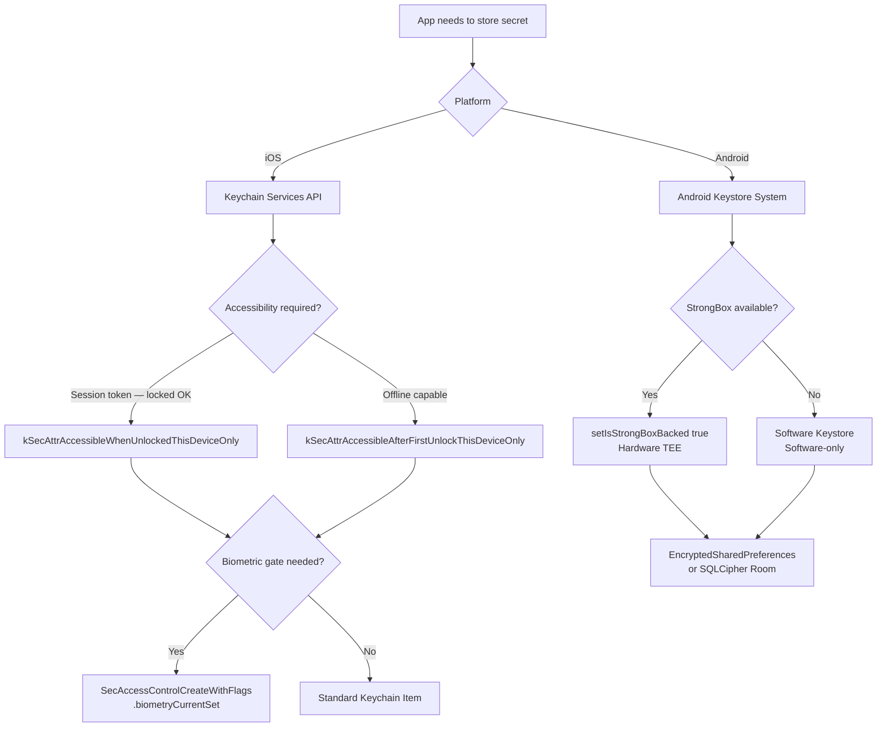

## Implementation Guidelines

### 1. iOS — Keychain Read/Write

```swift
// KeychainManager.swift
import Security
import Foundation

enum KeychainError: Error {
    case itemNotFound
    case unexpectedStatus(OSStatus)
    case encodingError
}

final class KeychainManager {

    static func save(key: String, data: Data, requiresBiometry: Bool = false) throws {
        var accessControl: SecAccessControl?
        if requiresBiometry {
            var error: Unmanaged<CFError>?
            accessControl = SecAccessControlCreateWithFlags(
                nil,
                kSecAttrAccessibleWhenUnlockedThisDeviceOnly,
                .biometryCurrentSet,
                &error
            )
            if let err = error?.takeRetainedValue() {
                throw err as Error
            }
        }

        var query: [CFString: Any] = [
            kSecClass: kSecClassGenericPassword,
            kSecAttrAccount: key,
            kSecAttrAccessible: kSecAttrAccessibleWhenUnlockedThisDeviceOnly,
            kSecValueData: data,
            kSecAttrSynchronizable: false  // never sync to iCloud
        ]
        if let ac = accessControl {
            query[kSecAttrAccessControl] = ac
        }

        SecItemDelete(query as CFDictionary) // remove existing
        let status = SecItemAdd(query as CFDictionary, nil)
        guard status == errSecSuccess else {
            throw KeychainError.unexpectedStatus(status)
        }
    }

    static func load(key: String) throws -> Data {
        let query: [CFString: Any] = [
            kSecClass: kSecClassGenericPassword,
            kSecAttrAccount: key,
            kSecReturnData: true,
            kSecMatchLimit: kSecMatchLimitOne
        ]
        var result: AnyObject?
        let status = SecItemCopyMatching(query as CFDictionary, &result)
        guard status == errSecSuccess, let data = result as? Data else {
            throw KeychainError.itemNotFound
        }
        return data
    }

    static func delete(key: String) {
        let query: [CFString: Any] = [
            kSecClass: kSecClassGenericPassword,
            kSecAttrAccount: key
        ]
        SecItemDelete(query as CFDictionary)
    }
}
```

### 2. Android — Keystore Key Generation and EncryptedSharedPreferences

```kotlin
import android.security.keystore.KeyGenParameterSpec
import android.security.keystore.KeyProperties
import androidx.security.crypto.EncryptedSharedPreferences
import androidx.security.crypto.MasterKey
import java.security.KeyStore

object SecureStorageManager {

    private const val KEYSTORE_ALIAS = "tcb_mobile_master_key"

    fun getMasterKey(context: android.content.Context): MasterKey {
        return MasterKey.Builder(context, KEYSTORE_ALIAS)
            .setKeyScheme(MasterKey.KeyScheme.AES256_GCM)
            .setRequestStrongBoxBacked(true) // degrades gracefully if unavailable
            .setUserAuthenticationRequired(false) // true for biometric-gated key
            .build()
    }

    fun getEncryptedPrefs(context: android.content.Context): android.content.SharedPreferences {
        val masterKey = getMasterKey(context)
        return EncryptedSharedPreferences.create(
            context,
            "tcb_secure_prefs",
            masterKey,
            EncryptedSharedPreferences.PrefKeyEncryptionScheme.AES256_SIV,
            EncryptedSharedPreferences.PrefValueEncryptionScheme.AES256_GCM
        )
    }

    fun saveToken(context: android.content.Context, key: String, value: String) {
        getEncryptedPrefs(context).edit().putString(key, value).apply()
    }

    fun loadToken(context: android.content.Context, key: String): String? {
        return getEncryptedPrefs(context).getString(key, null)
    }

    fun clearToken(context: android.content.Context, key: String) {
        getEncryptedPrefs(context).edit().remove(key).apply()
    }

    // For biometric-gated operations, generate a separate hardware-backed key
    fun generateBiometricKey(alias: String) {
        val keyGenerator = javax.crypto.KeyGenerator.getInstance(
            KeyProperties.KEY_ALGORITHM_AES, "AndroidKeyStore")
        keyGenerator.init(
            KeyGenParameterSpec.Builder(alias,
                KeyProperties.PURPOSE_ENCRYPT or KeyProperties.PURPOSE_DECRYPT)
                .setBlockModes(KeyProperties.BLOCK_MODE_GCM)
                .setEncryptionPaddings(KeyProperties.ENCRYPTION_PADDING_NONE)
                .setUserAuthenticationRequired(true)
                .setIsStrongBoxBacked(true)
                .build()
        )
        keyGenerator.generateKey()
    }
}
```

## When to Use

- Any T0/T1 mobile feature that persists session tokens, cryptographic keys, or financial identifiers between app sessions.
- Biometric-gated operations (MOB-003) where the cryptographic key must be bound to the biometric set and hardware-backed.
- Offline queue encryption keys (MOB-001) that must survive app restarts but not device transfers.

## When Not to Use

- Non-sensitive user preferences (UI theme, language settings) — standard `SharedPreferences` / `UserDefaults` is appropriate and simpler.
- One-time temporary tokens with TTL < 5 minutes — store in memory only; writing to keychain for transient data adds unnecessary I/O and keychain pollution.
- Multi-app shared credentials — iOS Keychain sharing via `kSecAttrAccessGroup` and Android Account Manager add complexity; evaluate whether a shared credential store is architecturally justified before using.

## Variants

| Variant | When to prefer | Trade-off |
|---------|---------------|-----------|
| Platform Keychain / Keystore (this pattern) | Standard credential storage; hardware-backed on modern devices | API verbosity; hardware-backed not guaranteed on all devices |
| SQLCipher-encrypted Room (Android) | Structured encrypted data (offline queue, local cache) | Heavier dependency; key management via Keystore still required |
| In-memory only (no persistence) | Ultra-short-lived tokens (< 5 min) | Credentials lost on app backgrounding; use only for ephemeral flows |

## NFR Acceptance Criteria

| Metric | Threshold | Measurement |
|--------|-----------|-------------|
| Keychain write p99 | ≤ 20 ms | Instrumented test: 100 write calls; assert p99 ≤ 20 ms |
| Keychain read p99 | ≤ 10 ms | Instrumented test: 100 read calls; assert p99 ≤ 10 ms |
| StrongBox-backed key generation | ≤ 500 ms (hardware operation) | Measure KeyGenerator.generateKey() on StrongBox-capable device |
| Credential persistence across restart | 100% | Test: save token; force-kill app; relaunch; assert token readable |
| iCloud backup exclusion | 0 Keychain items in backup | Verify `kSecAttrSynchronizable = false` via Keychain inspection tool |

## Compliance Mapping

| Ring | Regulation | Provision | How this pattern satisfies |
|------|-----------|-----------|---------------------------|
| Ring 0 | OWASP Mobile Top 10 | M2 — Insecure Data Storage | Tokens written to Keychain/Keystore with hardware-backed keys; `kSecAttrSynchronizable = false` prevents iCloud backup; EncryptedSharedPreferences uses AES-256-GCM; no plaintext credentials in UserDefaults/SharedPreferences. |
| Ring 1 | PCI-DSS v4.0 | §3.5 — protect stored cryptographic keys | Cryptographic keys used to encrypt cardholder data stored exclusively in Secure Enclave (iOS) or Android StrongBox; key never leaves hardware boundary; key lifecycle managed by platform Keystore, not application code. |
| Ring 2 | SBV Circular 09/2020 | §III — client device security for internet banking ⚠️ (working summary — pending Legal review) | Hardware-backed storage ensures credentials cannot be extracted even on rooted/jailbroken devices via forensic tools; Legal review required to confirm that Keychain/Keystore hardware attestation satisfies SBV §III requirements for client-side credential protection. |

## Cost / FinOps

- Secure Enclave / StrongBox operations: key generation is ~100–500 ms on first call (hardware operation); subsequent encrypt/decrypt operations are ~1–5 ms. Cost is negligible at app-session frequency.
- EncryptedSharedPreferences: the AES-256-GCM overhead adds ~1–2 ms per operation vs standard SharedPreferences; at 10 reads/session this is imperceptible.
- Cost of NOT using hardware-backed storage: a single credential extraction incident affecting 10 000 accounts carries direct fraud exposure (VND 50B+), regulatory notification obligations, and reputation damage that vastly exceeds the development cost of this pattern.

## Threat Model

- **Root/jailbreak credential extraction (Information Disclosure)**: An attacker with physical access and a jailbroken device uses forensic tools (Elcomsoft, Frida) to dump Keychain/SharedPreferences contents. Mitigation: hardware-backed keys (Secure Enclave / StrongBox) cannot be extracted by software — the key material never leaves the hardware boundary; even with root access, the attacker can only call the cryptographic API which requires user authentication for biometric-gated keys.
- **iCloud/Google backup inclusion (Information Disclosure)**: A developer accidentally marks Keychain items as `kSecAttrSynchronizable = true` or omits the flag (default is false but varies by API call), causing session tokens to be synced to iCloud. Mitigation: CI lint rule asserting `kSecAttrSynchronizable: false` in all Keychain write calls; Android EncryptedSharedPreferences excludes items from Android Auto Backup by default via `res/xml/backup_rules.xml`.

## Runbook Stub

**Alert: `keystore_key_generation_failure`** (Crashlytics / Sentry event)
- p50 baseline: 0 failures | p99 SLO: ≤ 0.01% of key generation attempts
- Remediation: (1) Check if failure is on StrongBox-unsupported device — inspect `isStrongBoxBacked` flag in the error; if StrongBox unavailable, fall back to software keystore via `setIsStrongBoxBacked(false)`. (2) If failure is `KeyPermanentlyInvalidatedException` (Android), the biometric set has changed (new fingerprint enrolled); clear the old key and re-generate with user consent. (3) For iOS `errSecNotAvailable`, check if device has Secure Enclave (A7+ chip); fall back to software keychain on older devices.

## Test Strategy Stub

### Unit Tests
- `KeychainManagerTest` (iOS): save key → load → assert byte equality. Delete key → load → assert `itemNotFound`. iCloud exclusion: verify `kSecAttrSynchronizable` is `false` in all write calls via XCTest reflection.
- `SecureStorageManagerTest` (Android): save token → load → assert equality. Clear token → load → assert null. StrongBox fallback: mock `setIsStrongBoxBacked(true)` throwing `StrongBoxUnavailableException`; assert retry with `false`.

### Integration Tests
- iOS Device Test: write 3 tokens; restart app; load all 3 → assert present. Backup exclusion test via `xcrun simctl` backup inspection — assert 0 keychain items in backup.
- Android Instrumented Test: write via EncryptedSharedPreferences; read from fresh `EncryptedSharedPreferences` instance; assert decryption succeeds. Auto-backup exclusion: verify `backup_rules.xml` excludes `tcb_secure_prefs`.

### Chaos Tests
- OS upgrade test: write tokens on iOS 17; upgrade to iOS 18; assert all tokens accessible. Simulate biometric set change (iOS): delete existing biometric-gated key; assert graceful regeneration prompt shown to user.

## Related Patterns

- [SEC-006 JWT Best Practices](../../patterns/security/jwt-best-practices.md) — tokens stored in Keychain/Keystore per this pattern
- [MOB-003 Mobile Biometric Auth](mobile-biometric-auth.md) — uses hardware-backed biometric-gated keys from this pattern
- [MOB-001 Mobile Offline Queue](mobile-offline-queue.md) — queue payload encryption key managed via this pattern

## References

- [Apple Keychain Services API](https://developer.apple.com/documentation/security/keychain_services)
- [Android Keystore System](https://developer.android.com/privacy-and-security/keystore)
- [EncryptedSharedPreferences — Jetpack Security](https://developer.android.com/reference/androidx/security/crypto/EncryptedSharedPreferences)
- [PCI-DSS v4.0 §3.5 — Cryptographic Key Management](https://www.pcisecuritystandards.org/document_library/)
- [OWASP Mobile Top 10 — M2 Insecure Data Storage](https://owasp.org/www-project-mobile-top-10/)
- Catalog reference: `governance/standards/enterprise-architecture-catalog.md`
```

- [ ] **Step 3: Lint Mermaid**

```bash
bash scripts/mermaid-lint-doc.sh knowledge-base/patterns/mobile/mobile-secure-storage.md
```
Expected: exits 0.

- [ ] **Step 4: Compliance check**

```bash
python3 scripts/check-compliance-rows.py
```
Expected: no FAIL.

- [ ] **Step 5: Commit**

```bash
git add knowledge-base/patterns/mobile/mobile-secure-storage.md
git commit -m "feat(catalog): MOB-002 Mobile Secure Storage — Wave 5B"
```

---

### Task 14: MOB-003 — Mobile Biometric Auth (FULL WRITE)

**Files:**
- Modify: `knowledge-base/patterns/mobile/mobile-biometric-auth.md`

- [ ] **Step 1: Verify stub**

```bash
head -4 knowledge-base/patterns/mobile/mobile-biometric-auth.md
```
Expected: `Status: Proposed`

- [ ] **Step 2: Replace the entire file with:**

```markdown
# Mobile Biometric Authentication

Status: Draft | Catalog ID: MOB-003 | Owner: @tech-lead-mobile
Tier Applicability: T0, T1

## Problem Statement

- Password-only authentication for mobile banking creates friction at login and encourages weak passwords; Vietnamese banks face regulatory pressure from SBV Circular 09/2020 §III.2 to implement multi-factor authentication for internet banking.
- A biometric-only implementation without PIN fallback leaves users locked out if biometrics become unavailable (wet fingers, face mask, hardware failure), creating a T0 availability problem.
- Biometric authentication that unlocks the session token directly (without a hardware-bound cryptographic key) is trivially defeated by an attacker who extracts the token file — biometrics become theatre without a Secure Enclave / StrongBox binding.
- The `LAContext.evaluatePolicy(.deviceOwnerAuthentication)` flag on iOS allows PIN as a fallback to biometrics at the OS level; an attacker who knows the PIN can bypass biometrics entirely — for high-value operations, PIN should require step-up MFA via the backend.

## Context

Biometric authentication applies to T0/T1 mobile banking sessions: app unlock, transaction confirmation for amounts above a threshold, and sensitive settings changes. The pattern binds the session private key (or decryption key for the stored token) to the biometric set in the Secure Enclave / StrongBox — the key is unusable without a successful biometric challenge. The backend Spring Boot PIN fallback endpoint issues a short-lived token valid for one step-up operation.

## Solution

A hardware-backed asymmetric key pair is generated in the Secure Enclave (iOS) / StrongBox (Android) with user authentication required. On biometric success, the OS releases the private key for a single sign operation; the app signs a challenge nonce from the server. The server verifies the signature against the registered public key and issues a session token. For PIN fallback, the app calls a separate `/auth/pin` endpoint that performs server-side PIN verification with rate limiting (Resilience4j) and issues a downgraded token flagged for step-up requirements.

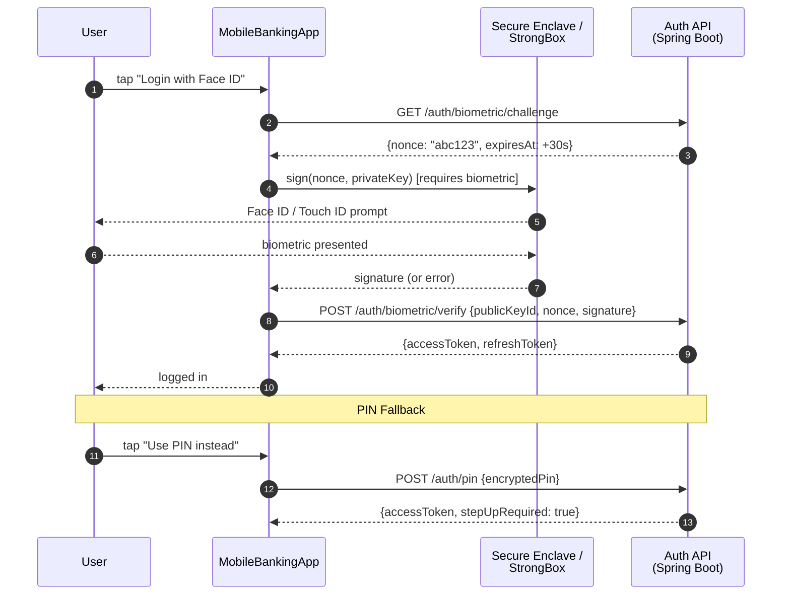

## Implementation Guidelines

### 1. iOS — Biometric Key Generation and Sign

```swift
import CryptoKit
import LocalAuthentication
import Security

final class BiometricAuthManager {

    static let keyAlias = "tcb.biometric.auth.key"

    static func generateKeyPair() throws -> SecKey {
        var error: Unmanaged<CFError>?
        guard let accessControl = SecAccessControlCreateWithFlags(
            nil,
            kSecAttrAccessibleWhenUnlockedThisDeviceOnly,
            [.biometryCurrentSet, .privateKeyUsage],
            &error
        ) else {
            throw error!.takeRetainedValue() as Error
        }

        let attributes: [CFString: Any] = [
            kSecAttrKeyType: kSecAttrKeyTypeECSECPrimeRandom,
            kSecAttrKeySizeInBits: 256,
            kSecAttrTokenID: kSecAttrTokenIDSecureEnclave,
            kSecPrivateKeyAttrs: [
                kSecAttrIsPermanent: true,
                kSecAttrApplicationTag: keyAlias.data(using: .utf8)!,
                kSecAttrAccessControl: accessControl
            ]
        ]

        guard let privateKey = SecKeyCreateRandomKey(attributes as CFDictionary, &error) else {
            throw error!.takeRetainedValue() as Error
        }
        return privateKey
    }

    static func sign(nonce: Data) throws -> Data {
        let query: [CFString: Any] = [
            kSecClass: kSecClassKey,
            kSecAttrApplicationTag: keyAlias.data(using: .utf8)!,
            kSecAttrKeyType: kSecAttrKeyTypeECSECPrimeRandom,
            kSecReturnRef: true
        ]
        var keyRef: AnyObject?
        guard SecItemCopyMatching(query as CFDictionary, &keyRef) == errSecSuccess,
              let privateKey = keyRef as! SecKey? else {
            throw KeychainError.itemNotFound
        }

        var signError: Unmanaged<CFError>?
        guard let signature = SecKeyCreateSignature(
            privateKey,
            .ecdsaSignatureMessageX962SHA256,
            nonce as CFData,
            &signError
        ) else {
            throw signError!.takeRetainedValue() as Error
        }
        return signature as Data
    }
}
```

### 2. Android — BiometricPrompt with CryptoObject

```kotlin
import android.security.keystore.KeyGenParameterSpec
import android.security.keystore.KeyProperties
import androidx.biometric.BiometricPrompt
import androidx.core.content.ContextCompat
import java.security.KeyPairGenerator
import java.security.Signature

object BiometricAuthManager {

    private const val KEY_ALIAS = "tcb_biometric_auth_key"

    fun generateKeyPair() {
        val keyPairGenerator = KeyPairGenerator.getInstance(
            KeyProperties.KEY_ALGORITHM_EC, "AndroidKeyStore")
        keyPairGenerator.initialize(
            KeyGenParameterSpec.Builder(KEY_ALIAS,
                KeyProperties.PURPOSE_SIGN)
                .setDigests(KeyProperties.DIGEST_SHA256)
                .setUserAuthenticationRequired(true)
                .setIsStrongBoxBacked(true)
                .setInvalidatedByBiometricEnrollment(true)
                .build()
        )
        keyPairGenerator.generateKeyPair()
    }

    fun showBiometricPrompt(
        activity: androidx.fragment.app.FragmentActivity,
        nonce: ByteArray,
        onSuccess: (signature: ByteArray) -> Unit,
        onError: (errorCode: Int, message: String) -> Unit
    ) {
        val keyStore = java.security.KeyStore.getInstance("AndroidKeyStore")
        keyStore.load(null)
        val privateKey = keyStore.getKey(KEY_ALIAS, null)

        val signature = Signature.getInstance("SHA256withECDSA").also {
            it.initSign(privateKey as java.security.PrivateKey)
            it.update(nonce)
        }

        val biometricPrompt = BiometricPrompt(activity,
            ContextCompat.getMainExecutor(activity),
            object : BiometricPrompt.AuthenticationCallback() {
                override fun onAuthenticationSucceeded(result: BiometricPrompt.AuthenticationResult) {
                    val sig = result.cryptoObject?.signature?.sign() ?: return
                    onSuccess(sig)
                }
                override fun onAuthenticationError(errorCode: Int, errString: CharSequence) {
                    onError(errorCode, errString.toString())
                }
            })

        val promptInfo = BiometricPrompt.PromptInfo.Builder()
            .setTitle("Xác thực sinh trắc học")
            .setSubtitle("Đăng nhập vào TCB Mobile")
            .setNegativeButtonText("Dùng mã PIN")
            .setAllowedAuthenticators(BiometricPrompt.Authenticators.BIOMETRIC_STRONG)
            .build()

        biometricPrompt.authenticate(promptInfo, BiometricPrompt.CryptoObject(signature))
    }
}
```

### 3. Spring Boot — Challenge + Verify Endpoints

```java
@RestController
@RequestMapping("/auth/biometric")
@RequiredArgsConstructor
public class BiometricAuthController {

    private final ChallengeStore challengeStore; // Redis-backed, TTL 30s
    private final PublicKeyRegistry keyRegistry;
    private final TokenIssuer tokenIssuer;

    @GetMapping("/challenge")
    public ChallengeResponse getChallenge(Authentication auth) {
        String nonce = Base64.getEncoder().encodeToString(
            java.security.SecureRandom.getInstanceStrong().generateSeed(32));
        challengeStore.store(auth.getName(), nonce, Duration.ofSeconds(30));
        return new ChallengeResponse(nonce, Instant.now().plusSeconds(30));
    }

    @PostMapping("/verify")
    public TokenResponse verify(@RequestBody BiometricVerifyRequest req) {
        String storedNonce = challengeStore.consume(req.publicKeyId())
            .orElseThrow(() -> new ResponseStatusException(
                HttpStatus.UNAUTHORIZED, "Nonce expired or not found"));

        ECPublicKey publicKey = keyRegistry.findByPublicKeyId(req.publicKeyId())
            .orElseThrow(() -> new ResponseStatusException(
                HttpStatus.UNAUTHORIZED, "Public key not registered"));

        boolean valid = verifyEcdsaSignature(
            publicKey, Base64.getDecoder().decode(storedNonce),
            Base64.getDecoder().decode(req.signature()));
        if (!valid) throw new ResponseStatusException(HttpStatus.UNAUTHORIZED, "Invalid signature");

        return tokenIssuer.issue(req.publicKeyId());
    }

    private boolean verifyEcdsaSignature(ECPublicKey key, byte[] data, byte[] signature) {
        try {
            Signature sig = Signature.getInstance("SHA256withECDSA");
            sig.initVerify(key);
            sig.update(data);
            return sig.verify(signature);
        } catch (Exception e) {
            return false;
        }
    }
}
```

## When to Use

- T0/T1 mobile banking session authentication where password friction must be reduced while maintaining NIST SP 800-63B AAL2.
- Transaction confirmation for transfers above a configurable threshold (e.g., VND 10M) where a second-factor biometric challenge provides regulatory evidence of user consent.
- Environments where the device supports Secure Enclave / StrongBox — always request hardware-backed key generation and degrade gracefully to software keystore for older devices.

## When Not to Use

- Background session refresh — biometrics are user-interactive; use a silent refresh token (stored in Keychain/Keystore per MOB-002) for background token renewal without user interaction.
- Devices without a passcode set — iOS `LAContext` and Android BiometricManager report biometrics unavailable if no device passcode/PIN is configured; always prompt the user to set a device lock before enabling biometric auth.
- Step-up for purely informational views (account balance read-only) — biometric prompt frequency irritates users; reserve for mutations (transfer, payment) and sensitive data reveal (full card number).

## Variants

| Variant | When to prefer | Trade-off |
|---------|---------------|-----------|
| Hardware-bound challenge-response (this pattern) | T0/T1 production; regulatory AAL2; NIST SP 800-63B compliance | Requires challenge API endpoint; key invalidated on biometric set change |
| Biometric-unlock of stored token (simpler) | T2/T3 apps; lower security requirement | Token can be extracted if keychain protection is bypassed; biometric is UI gate only |
| FIDO2 / WebAuthn (platform authenticator) | Web + mobile federated auth; open banking PSD2 | Higher implementation complexity; browser/WebView support required |

## NFR Acceptance Criteria

| Metric | Threshold | Measurement |
|--------|-----------|-------------|
| Biometric prompt to token p99 | ≤ 2 s (Face ID: ≤ 500 ms; network: ≤ 1.5 s) | E2E instrumented test: tap biometric → token received; assert p99 ≤ 2 s |
| Challenge nonce TTL | 30 s (Redis TTL) | Test: fetch nonce; wait 31 s; verify → assert 401 Nonce expired |
| Key invalidation on biometric change | 100% invalidation | Enroll new fingerprint (Android); assert `KeyPermanentlyInvalidatedException` on next sign attempt |
| Availability | T0/T1 — 99.95% (backend challenge endpoint) | Prometheus uptime on `/auth/biometric/*`; assert 99.95% over 30 days |
| RTO | ≤ 2 min (challenge service pod restart) | Chaos test: kill challenge pod; measure time to first successful challenge response |

## Compliance Mapping

| Ring | Regulation | Provision | How this pattern satisfies |
|------|-----------|-----------|---------------------------|
| Ring 0 | NIST SP 800-63B | AAL2 — two authentication factors required | Biometric (something you are) + device possession (something you have — Secure Enclave / StrongBox hardware key); satisfies AAL2 without OTP SMS. |
| Ring 1 | PCI-DSS v4.0 | §8.4 — multi-factor authentication for all non-console administrative access and all access to the CDE | Hardware-bound biometric authentication satisfies the "something you are" factor; combined with device possession (hardware key) this satisfies PCI-DSS MFA requirements for mobile CDE access. |
| Ring 2 | SBV Circular 09/2020 | §III.2 — two-factor authentication requirements for internet banking ⚠️ (working summary — pending Legal review) | Challenge-response with hardware-bound biometric key satisfies the two-factor requirement (biometric + device possession); Legal review required to confirm that this mechanism satisfies SBV §III.2 in full, particularly regarding OTP SMS as an alternative factor. |

## Cost / FinOps

- Challenge endpoint: 1 Redis write + 1 Redis read per authentication; at 100 000 daily logins = 200 000 Redis ops/day — negligible on a shared cluster.
- Secure Enclave key generation: one-time per enrollment; ≤ 500 ms per user; cost is negligible.
- Backend verify endpoint: 1 ECDSA verification (< 1 ms CPU) + 1 Redis consume + 1 token issue; 3 operations per login — negligible at 100 000 logins/day.
- Cost of NOT implementing biometric auth: SBV MFA requirement non-compliance risk; customer churn from password friction; typical mAU improvement from biometric auth is 15–25% (industry benchmark).

## Threat Model

- **Biometric bypass via `.deviceOwnerAuthentication` flag (Elevation of Privilege)**: If `LAContext.evaluatePolicy(.deviceOwnerAuthentication)` is used (iOS), a user who knows the device PIN can bypass biometric authentication entirely. The PIN may be observed in a social engineering attack. Mitigation: always use `.deviceOwnerAuthenticationWithBiometrics` for banking operations; PIN fallback routes through a separate backend endpoint with additional rate limiting and step-up requirements, not through the biometric key.
- **Key invalidation on biometric enrollment change (Denial of Service)**: An attacker who can enroll their biometric on the victim device (physical access, e.g., device left unlocked) invalidates the biometric key, locking the legitimate user out. Mitigation: `setInvalidatedByBiometricEnrollment(true)` (Android) is the correct behavior — key invalidation is detected on next use; app shows "biometric data changed, please re-enroll via PIN" flow; this is preferable to allowing the attacker's biometric to unlock the victim's account.

## Runbook Stub

**Alert: `biometric_challenge_error_rate > 5%`** (Grafana / Prometheus on `/auth/biometric/verify`)
- p50 baseline: ≤ 0.1% error rate | p99 SLO: ≤ 1%
- Remediation: (1) Check if Redis (challenge store) is healthy — `redis-cli ping`. (2) If Redis is down, challenge verification fails for all users — P1 incident. (3) Check app version distribution — a recent app update may have changed the signing algorithm; compare error rate by app version. (4) If `InvalidSignatureException` dominates, check if server-side public key registry is current.

## Test Strategy Stub

### Unit Tests
- `BiometricAuthManagerTest` (iOS XCTest): mock `SecKeyCreateRandomKey` success → assert key stored in Keychain. Mock `SecKeyCreateSignature` success → assert signature bytes returned. Mock `errSecItemNotFound` → assert `itemNotFound` thrown.
- `BiometricAuthControllerTest` (Spring Boot): mock valid signature → assert 200 + token. Mock expired nonce → assert 401. Mock invalid signature → assert 401.

### Integration Tests
- iOS Device Test: `generateKeyPair()` → `sign(testNonce)` → assert signature length > 0. Spring Boot integration: register public key; call challenge endpoint; sign nonce; call verify endpoint; assert token issued.
- Android Instrumented Test: `generateKeyPair()` on StrongBox device → assert `isInsideSecureHardware = true`. BiometricPrompt UI test with `BiometricManager.canAuthenticate()`.

### Chaos Tests
- Enroll new fingerprint (Android test): assert `KeyPermanentlyInvalidatedException` thrown on subsequent sign attempt; assert app shows re-enrollment flow.
- Kill challenge Redis mid-flow (Spring Boot): assert 503 returned with Retry-After header; assert circuit breaker opens after 5 consecutive failures.

## Related Patterns

- [MOB-002 Mobile Secure Storage](mobile-secure-storage.md) — hardware-backed key storage used by this pattern
- [SEC-011 Session Revocation](../../patterns/security/session-revocation.md) — session management post biometric login

## References

- [Apple LocalAuthentication Framework](https://developer.apple.com/documentation/localauthentication)
- [Android BiometricPrompt API](https://developer.android.com/reference/androidx/biometric/BiometricPrompt)
- [NIST SP 800-63B — Digital Identity Guidelines](https://pages.nist.gov/800-63-3/sp800-63b.html)
- [PCI-DSS v4.0 §8 — Identify Users and Authenticate Access](https://www.pcisecuritystandards.org/document_library/)
- Catalog reference: `governance/standards/enterprise-architecture-catalog.md`
```

- [ ] **Step 3: Lint Mermaid**

```bash
bash scripts/mermaid-lint-doc.sh knowledge-base/patterns/mobile/mobile-biometric-auth.md
```
Expected: exits 0.

- [ ] **Step 4: Compliance check**

```bash
python3 scripts/check-compliance-rows.py
```
Expected: no FAIL.

- [ ] **Step 5: Commit**

```bash
git add knowledge-base/patterns/mobile/mobile-biometric-auth.md
git commit -m "feat(catalog): MOB-003 Mobile Biometric Auth — Wave 5B"
```

---

### Task 15: MOB-004 — Mobile Push Notification (Secure) (FULL WRITE)

**Files:**
- Modify: `knowledge-base/patterns/mobile/mobile-push-notification-secure.md`

- [ ] **Step 1: Verify stub**

```bash
head -4 knowledge-base/patterns/mobile/mobile-push-notification-secure.md
```
Expected: `Status: Proposed`

- [ ] **Step 2: Replace the entire file with:**

```markdown
# Mobile Push Notification (Secure)

Status: Draft | Catalog ID: MOB-004 | Owner: @tech-lead-mobile
Tier Applicability: T1, T2

## Problem Statement

- Banking push notifications that include account balance, transaction amounts, or account numbers in the payload expose sensitive financial data to any app with notification access, iOS lock screen, or Android notification shade — no user authentication required to view the data.
- APNs / FCM notification payloads are transmitted through Apple and Google infrastructure; including PII in the payload means personal data is processed on third-party servers, creating a Decree 13/2023 cross-border data transfer issue.
- Unrestricted push notification registration (no sender ID verification) allows a rogue backend to send spoofed notifications to real device tokens, undermining user trust and potentially being exploited for phishing.
- Silent push notifications that trigger background data fetches can be abused to exfiltrate data or drain battery if not rate-limited at the server side.

## Context

Secure push notifications apply to T1/T2 banking alerts: transaction notifications, OTP delivery reminders, promotional messages. The pattern separates the notification trigger (low-sensitivity: notification ID only) from the notification content (sensitive: fetched securely in-app after user authentication). This is often called the "notification-content extension" or "pull-on-notify" pattern.

## Solution

The backend sends a push notification containing only a `notificationId` (opaque UUID) and a category/type. No PII, amount, or account data is included in the APNs/FCM payload. On receipt, the iOS `UNNotificationServiceExtension` or Android `FirebaseMessagingService` makes an authenticated API call to `GET /notifications/{notificationId}` using the stored session token (MOB-002) to fetch the full content. The notification is populated locally with the fetched content and displayed. Content is cached in memory for the notification display lifetime only.

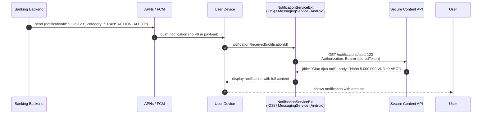

## Implementation Guidelines

### 1. iOS — Notification Service Extension

```swift
// NotificationService.swift (UNNotificationServiceExtension target)
import UserNotifications

class NotificationService: UNNotificationServiceExtension {

    var contentHandler: ((UNNotificationContent) -> Void)?
    var bestAttemptContent: UNMutableNotificationContent?

    override func didReceive(
        _ request: UNNotificationRequest,
        withContentHandler contentHandler: @escaping (UNNotificationContent) -> Void
    ) {
        self.contentHandler = contentHandler
        bestAttemptContent = (request.content.mutableCopy() as? UNMutableNotificationContent)

        guard let notificationId = request.content.userInfo["notificationId"] as? String,
              let content = bestAttemptContent else {
            contentHandler(request.content)
            return
        }

        Task {
            do {
                let secureContent = try await NotificationContentFetcher.fetch(id: notificationId)
                content.title = secureContent.title
                content.body = secureContent.body
                content.badge = secureContent.badge as NSNumber?
            } catch {
                content.title = "Thông báo mới"
                content.body = "Mở ứng dụng để xem chi tiết"
            }
            contentHandler(content)
        }
    }

    override func serviceExtensionTimeWillExpire() {
        if let contentHandler, let bestAttemptContent {
            bestAttemptContent.body = "Mở ứng dụng để xem chi tiết"
            contentHandler(bestAttemptContent)
        }
    }
}

// NotificationContentFetcher.swift
struct SecureNotificationContent: Decodable {
    let title: String
    let body: String
    let badge: Int?
}

enum NotificationContentFetcher {
    static func fetch(id: String) async throws -> SecureNotificationContent {
        guard let token = try? KeychainManager.load(key: "session_token"),
              let tokenStr = String(data: token, encoding: .utf8) else {
            throw URLError(.userAuthenticationRequired)
        }
        var request = URLRequest(url: URL(string: "https://api.tcb.com.vn/notifications/\(id)")!)
        request.setValue("Bearer \(tokenStr)", forHTTPHeaderField: "Authorization")
        let (data, _) = try await URLSession.shared.data(for: request)
        return try JSONDecoder().decode(SecureNotificationContent.self, from: data)
    }
}
```

### 2. Android — FirebaseMessagingService

```kotlin
class TcbFirebaseMessagingService : FirebaseMessagingService() {

    override fun onMessageReceived(remoteMessage: RemoteMessage) {
        val notificationId = remoteMessage.data["notificationId"] ?: return
        val category = remoteMessage.data["category"] ?: "GENERAL"

        CoroutineScope(Dispatchers.IO).launch {
            val content = fetchSecureContent(notificationId) ?: run {
                showPlaceholderNotification()
                return@launch
            }
            showNotification(content, category)
        }
    }

    private suspend fun fetchSecureContent(notificationId: String): NotificationContent? {
        val token = SecureStorageManager.loadToken(this, "session_token") ?: return null
        return try {
            BankingApiClient.create(token).getNotification(notificationId)
        } catch (e: Exception) {
            null
        }
    }

    private fun showNotification(content: NotificationContent, category: String) {
        val channelId = "tcb_banking_alerts"
        val notification = NotificationCompat.Builder(this, channelId)
            .setSmallIcon(R.drawable.ic_notification)
            .setContentTitle(content.title)
            .setContentText(content.body)
            .setPriority(NotificationCompat.PRIORITY_HIGH)
            .setAutoCancel(true)
            .setContentIntent(createDeepLinkIntent(content.deepLink))
            .build()
        NotificationManagerCompat.from(this)
            .notify(notificationId.hashCode(), notification)
    }

    private fun showPlaceholderNotification() {
        // Show "Open app to view" if content fetch fails
    }
}
```

### 3. Spring Boot — Notification Push Service

```java
@Service
@RequiredArgsConstructor
public class PushNotificationService {

    private final FirebaseMessaging firebaseMessaging;
    private final NotificationRepository notificationRepo;

    public void sendTransactionAlert(String deviceToken, TransactionEvent event) {
        // Store full content server-side; send only ID in payload
        String notificationId = UUID.randomUUID().toString();
        notificationRepo.save(NotificationRecord.builder()
            .id(notificationId)
            .userId(event.userId())
            .title("Giao dịch mới")
            .body(formatBody(event))  // PII lives here, NOT in push payload
            .expiresAt(Instant.now().plusHours(24))
            .build());

        Message message = Message.builder()
            .setToken(deviceToken)
            .putData("notificationId", notificationId)  // only the ID
            .putData("category", "TRANSACTION_ALERT")
            .setApnsConfig(ApnsConfig.builder()
                .putHeader("apns-priority", "10")
                .setAps(Aps.builder()
                    .setMutableContent(true)  // triggers service extension
                    .setSound("default")
                    .build())
                .build())
            .build();

        firebaseMessaging.sendAsync(message);
    }
}

@RestController
@RequestMapping("/notifications")
@RequiredArgsConstructor
public class NotificationContentController {

    private final NotificationRepository notificationRepo;

    @GetMapping("/{id}")
    public NotificationContentResponse getContent(
            @PathVariable String id,
            Authentication auth) {
        return notificationRepo.findByIdAndUserId(id, auth.getName())
            .filter(n -> n.getExpiresAt().isAfter(Instant.now()))
            .map(n -> new NotificationContentResponse(n.getTitle(), n.getBody()))
            .orElseThrow(() -> new ResponseStatusException(HttpStatus.NOT_FOUND));
    }
}
```

## When to Use

- Banking transaction alerts, OTP delivery prompts, and account activity notifications where the content includes account numbers, amounts, or other PII.
- Any notification where content is displayed on the lock screen before user authentication, creating a data exposure risk.
- Regulated environments (Decree 13/2023) where PII transmission through third-party push infrastructure (Apple/Google) must be minimized.

## When Not to Use

- Non-sensitive promotional notifications (app update available, feature announcement) — no PII, no risk; include content directly in the FCM/APNs payload for simplicity.
- Silent push notifications for background data prefetch — use with extreme care; APNs rate-limits silent pushes and iOS may not deliver them reliably; use `BGAppRefreshTask` instead.
- Environments without session token persistence (first-run, logged-out state) — the notification service extension cannot fetch secure content without a valid token; fall back to generic "Open app" message.

## Variants

| Variant | When to prefer | Trade-off |
|---------|---------------|-----------|
| Pull-on-notify via service extension (this pattern) | PII in notification content; regulatory data minimization; lock-screen privacy | Requires background network call in extension (30s iOS limit); needs valid session token |
| Encrypted payload with client-side decryption | PII must not leave device unencrypted even in transit to Apple/Google | Key management complexity; encryption in APNs payload not natively supported — requires custom implementation |
| Direct payload (no PII) | Promotional messages, non-sensitive alerts | Simplest; not appropriate for financial data |

## NFR Acceptance Criteria

| Metric | Threshold | Measurement |
|--------|-----------|-------------|
| Notification display latency p99 | ≤ 3 s (push received → notification shown) | E2E test: trigger push; measure notification display time; assert p99 ≤ 3 s |
| Content fetch p99 | ≤ 1.5 s (authenticated API call) | Load test `/notifications/{id}`; assert p99 ≤ 1.5 s |
| PII in APNs/FCM payload | 0 instances | CI test: scan all `Message.builder()` calls for PAN, account number, or amount fields in payload |
| Availability | T1/T2 — content endpoint 99.9% | Prometheus uptime on `/notifications/*` |
| Notification expiry | 24 h (server-side TTL) | Test: fetch notification after 24 h; assert 404 |

## Compliance Mapping

| Ring | Regulation | Provision | How this pattern satisfies |
|------|-----------|-----------|---------------------------|
| Ring 0 | OWASP Mobile Top 10 | M7 — Insufficient Binary Protections (notification interception) | No PII in APNs/FCM payload; an intercepted push contains only an opaque UUID; the full content requires an authenticated API call that validates the user's session token. |
| Ring 1 | PCI-DSS v4.0 | §6.4 — protect public-facing web applications | The content endpoint `/notifications/{id}` validates the JWT and matches `userId`; IDOR is prevented by filtering on `userId = auth.getName()`; no cardholder data transmitted through third-party push infrastructure. |
| Ring 2 | Decree 13/2023/ND-CP | §17 — cross-border personal data transfer requires consent and legal basis ⚠️ (working summary — pending Legal review) | Notification payload transmitted through Apple/Google infrastructure contains no personal data (only opaque UUID); personal data (transaction details) fetched directly from TCB API over TLS; Legal review required to confirm this architecture satisfies cross-border transfer minimization requirements under Decree 13/2023. |

## Cost / FinOps

- FCM/APNs: push delivery is free for both platforms at any volume. The notification content fetch API call (authenticated) is the primary cost driver — each notification delivery = 1 API call.
- Content store: notifications stored in PostgreSQL for 24 h; at 1M notifications/day × 200 bytes = 200 MB/day uncompressed; partition and drop after 24 h → steady-state storage ≤ 200 MB.
- Background network call in notification extension: consumes 1–5 KB per notification for the JSON response; at 1M daily notifications = ≤ 5 GB/day backend egress — within standard CDN budget.

## Threat Model

- **Notification ID enumeration (Information Disclosure)**: An attacker brute-forces notification IDs (UUID format) to retrieve other users' notification content. Mitigation: the content endpoint validates that `notification.userId == authenticated_user_id`; UUID v4 has 2^122 combinations making sequential enumeration infeasible; notification TTL of 24 h limits the window.
- **Push notification spoofing via forged FCM sender ID (Tampering)**: A rogue server sends fake notifications to real device tokens using the same FCM project. Mitigation: Android FCM v1 API requires OAuth2 credentials tied to a specific Firebase project; apps should verify the sender ID (`google-services.json` project ID) matches the expected value on message receipt.

## Runbook Stub

**Alert: `notification_content_fetch_error_rate > 5%`** (Prometheus on `/notifications/*`)
- p50 baseline: ≤ 0.5% error rate | p99 SLO: ≤ 2%
- Remediation: (1) Check if the notification content endpoint is healthy: `kubectl get pods -l app=notification-svc`. (2) If pods are crashing, check for DB connection pool exhaustion — notification content store may be under high read load during a transaction processing spike. (3) If errors are 401 (token expired), the session token in the notification extension is stale — this is expected for users inactive > 15 min; no action required. (4) If errors are 404, notifications may have expired (> 24 h) — check if a batch job is running too aggressively.

## Test Strategy Stub

### Unit Tests
- `NotificationService.sendTransactionAlert`: assert `Message` has no `amount`, `accountNumber`, or PAN in `putData()` calls; assert `notificationId` is UUID format.
- `NotificationContentController.getContent`: mock repo returning notification for userId A; call with auth userId B → assert 404; call with auth userId A and expired notification → assert 404.

### Integration Tests
- Spring Boot Test: send transaction event → assert notification record created in DB with `title` and `body` containing amount; assert FCM message payload contains only `notificationId` and `category`.
- iOS Extension Test (XCTest): simulate push with `notificationId`; mock `NotificationContentFetcher`; assert `UNMutableNotificationContent.body` matches fetched content.

### Compliance Tests
- PII scan: intercept all FCM `Message` objects in integration tests; assert no field contains a regex matching VND amounts (`[0-9]+,000`), account numbers, or NRIC patterns.

## Related Patterns

- [MOB-005 Mobile Deep Link Attestation](mobile-deep-link-attestation.md) — notification deep links validated via this pattern
- [SEC-006 JWT Best Practices](../../patterns/security/jwt-best-practices.md) — session token used for content fetch

## References

- [UNNotificationServiceExtension — Apple Developer](https://developer.apple.com/documentation/usernotifications/unnotificationserviceextension)
- [Firebase Cloud Messaging — Android](https://firebase.google.com/docs/cloud-messaging/android/receive)
- [FCM v1 API — Sending Messages](https://firebase.google.com/docs/cloud-messaging/send-message)
- [Decree 13/2023/ND-CP — Personal Data Protection](https://vanban.chinhphu.vn/default.aspx?pageid=27160&docid=207126)
- Catalog reference: `governance/standards/enterprise-architecture-catalog.md`
```

- [ ] **Step 3: Lint Mermaid**

```bash
bash scripts/mermaid-lint-doc.sh knowledge-base/patterns/mobile/mobile-push-notification-secure.md
```
Expected: exits 0.

- [ ] **Step 4: Compliance check**

```bash
python3 scripts/check-compliance-rows.py
```
Expected: no FAIL.

- [ ] **Step 5: Commit**

```bash
git add knowledge-base/patterns/mobile/mobile-push-notification-secure.md
git commit -m "feat(catalog): MOB-004 Mobile Push Notification Secure — Wave 5B"
```

---

### Task 16: MOB-005 — Mobile Deep Link Attestation (FULL WRITE)

**Files:**
- Modify: `knowledge-base/patterns/mobile/mobile-deep-link-attestation.md`

- [ ] **Step 1: Verify stub**

```bash
head -4 knowledge-base/patterns/mobile/mobile-deep-link-attestation.md
```
Expected: `Status: Proposed`

- [ ] **Step 2: Replace the entire file with:**

```markdown
# Mobile Deep Link Attestation

Status: Draft | Catalog ID: MOB-005 | Owner: @tech-lead-mobile
Tier Applicability: T0, T1

## Problem Statement

- Custom URL scheme deep links (`tcb://payment?id=abc`) can be registered by any installed app, allowing a malicious app to intercept payment deep links and redirect the user to a phishing UI.
- A payment link shared via SMS or email that opens in the browser instead of the bank app can be used for phishing — the user may not distinguish a spoofed web page from the legitimate app.
- Attackers can craft SMS messages with fake payment confirmation deep links that, if intercepted by a malicious app, silently collect payment parameters (amount, recipient) before forwarding to the legitimate app.
- Without server-hosted attestation files (`apple-app-site-association.json`, `assetlinks.json`), iOS Universal Links and Android App Links fall back to browser, degrading to URL-scheme deep links that are vulnerable to interception.

## Context

Deep link attestation applies to T0/T1 payment flows and OTP redirects where the link must open exclusively in the bank's verified app. Universal Links (iOS) and App Links (Android) use server-hosted attestation files to verify that only the signed bank app can claim the URL domain — a rogue app cannot intercept these links.

## Solution

The bank's domain hosts `/.well-known/apple-app-site-association` (iOS) and `/.well-known/assetlinks.json` (Android), served with the correct Content-Type and no redirect. iOS verifies the `appID` in the AASA file against the signed app's bundle ID and Team ID at install time — only the verified app handles the URL. Android verifies the SHA-256 certificate fingerprint in `assetlinks.json` against the APK signing certificate. A Spring Boot controller serves both files with strict caching headers. Deep links that fail attestation fall back to the bank's HTTPS web page (no custom scheme fallback).

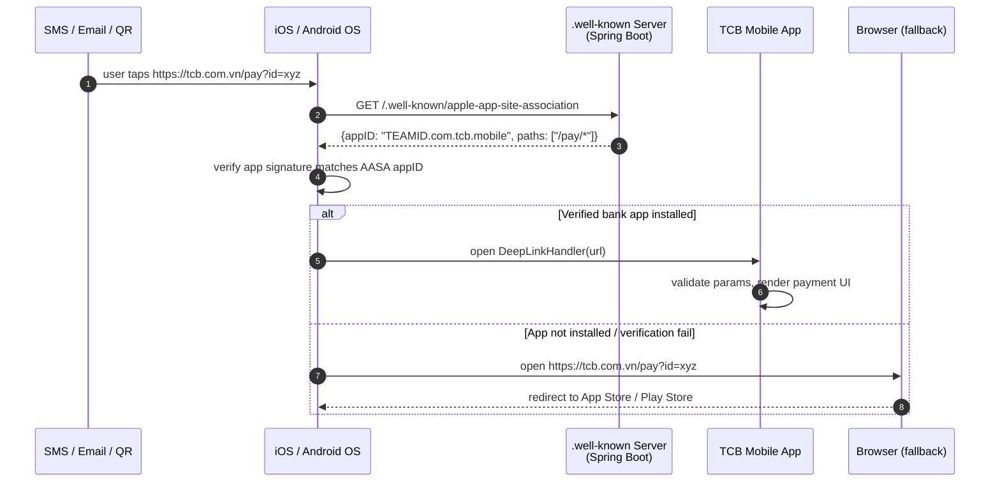

## Implementation Guidelines

### 1. Spring Boot — Serve Attestation Files

```java
@Controller
@RequestMapping("/.well-known")
public class AttestationController {

    @GetMapping(value = "/apple-app-site-association",
                produces = "application/json")
    @ResponseBody
    public String appleAppSiteAssociation() {
        // Must be served with Content-Type: application/json, no redirect, HTTPS only
        return """
            {
              "applinks": {
                "details": [
                  {
                    "appIDs": ["ABCDE12345.com.tcb.mobile"],
                    "components": [
                      { "/": "/pay/*", "comment": "Payment deep links" },
                      { "/": "/otp/*", "comment": "OTP redirect links" }
                    ]
                  }
                ]
              }
            }
            """;
    }

    @GetMapping(value = "/assetlinks.json",
                produces = "application/json")
    @ResponseBody
    public String assetLinks() {
        return """
            [{
              "relation": ["delegate_permission/common.handle_all_urls"],
              "target": {
                "namespace": "android_app",
                "package_name": "com.tcb.mobile",
                "sha256_cert_fingerprints": [
                  "AA:BB:CC:DD:EE:FF:00:11:22:33:44:55:66:77:88:99:AA:BB:CC:DD:EE:FF:00:11:22:33:44:55:66:77:88:99"
                ]
              }
            }]
            """;
    }
}
```

> **Note**: The SHA-256 fingerprint must be the production signing certificate fingerprint, not the debug keystore. Update in CI/CD as part of the release process.

### 2. iOS — Universal Link Handler

```swift
// AppDelegate.swift / SceneDelegate.swift
func application(_ application: UIApplication,
                 continue userActivity: NSUserActivity,
                 restorationHandler: @escaping ([UIUserActivityRestoring]?) -> Void) -> Bool {
    guard userActivity.activityType == NSUserActivityTypeBrowsingWeb,
          let url = userActivity.webpageURL else { return false }
    return DeepLinkRouter.shared.handle(url: url)
}

// DeepLinkRouter.swift
final class DeepLinkRouter {
    static let shared = DeepLinkRouter()

    func handle(url: URL) -> Bool {
        guard url.host == "tcb.com.vn" else { return false }
        switch url.path {
        case let path where path.hasPrefix("/pay/"):
            let paymentId = String(path.dropFirst("/pay/".count))
            guard isValidUUID(paymentId) else { return false } // prevent injection
            navigateToPayment(id: paymentId)
            return true
        case let path where path.hasPrefix("/otp/"):
            let otpToken = String(path.dropFirst("/otp/".count))
            navigateToOTPConfirmation(token: otpToken)
            return true
        default:
            return false
        }
    }

    private func isValidUUID(_ value: String) -> Bool {
        UUID(uuidString: value) != nil
    }
}
```

### 3. Android — App Links Intent Filter

```xml
<!-- AndroidManifest.xml -->
<activity android:name=".DeepLinkActivity"
          android:exported="true">
    <intent-filter android:autoVerify="true">
        <action android:name="android.intent.action.VIEW" />
        <category android:name="android.intent.category.DEFAULT" />
        <category android:name="android.intent.category.BROWSABLE" />
        <data android:scheme="https"
              android:host="tcb.com.vn"
              android:pathPrefix="/pay/" />
        <data android:scheme="https"
              android:host="tcb.com.vn"
              android:pathPrefix="/otp/" />
    </intent-filter>
</activity>
```

```kotlin
// DeepLinkActivity.kt
class DeepLinkActivity : AppCompatActivity() {
    override fun onCreate(savedInstanceState: Bundle?) {
        super.onCreate(savedInstanceState)
        val uri = intent?.data ?: run { finish(); return }
        when {
            uri.path?.startsWith("/pay/") == true -> {
                val paymentId = uri.lastPathSegment
                    ?.let { if (it.matches(UUID_REGEX)) it else null }
                    ?: run { finish(); return }
                startActivity(PaymentConfirmationActivity.intent(this, paymentId))
            }
            uri.path?.startsWith("/otp/") == true -> {
                startActivity(OtpConfirmationActivity.intent(this, uri.getQueryParameter("token")))
            }
        }
        finish()
    }
    companion object {
        private val UUID_REGEX = Regex(
            "[0-9a-f]{8}-[0-9a-f]{4}-[0-9a-f]{4}-[0-9a-f]{4}-[0-9a-f]{12}")
    }
}
```

## When to Use

- Payment confirmation links, OTP redirect links, or any URL shared via SMS/email/QR that must open in the verified bank app.
- Features where custom URL scheme interception by rogue apps creates a phishing or data exfiltration risk.
- Any T0/T1 flow where the integrity of the link-to-app handoff must be cryptographically verified by the OS.

## When Not to Use

- Internal app navigation (tab switching, in-app routing) — use `NavigationController.pushViewController` / `NavController.navigate()` directly; deep links add indirection with no security benefit for in-app flows.
- Test environments without a valid HTTPS domain — Universal Links and App Links require HTTPS; use custom schemes (`tcb-dev://`) for debug builds only, never in production.
- Flows with no URL parameter payload — a simple "open the app" push notification or QR code that carries no sensitive parameters doesn't require deep link validation; use a standard `intent-filter` without `autoVerify`.

## Variants

| Variant | When to prefer | Trade-off |
|---------|---------------|-----------|
| Universal Links / App Links (this pattern) | Production; payment and OTP links; anti-hijacking | Requires HTTPS domain; AASA/assetlinks.json must be served correctly; falls back to browser if app not installed |
| Custom URL scheme (`tcb://`) | Debug builds only | Any app can register the same scheme; interception trivial; never use in production for sensitive flows |
| QR code with signed URL | Physical branch / ATM payment initiation | QR is a presentation layer; the underlying URL should still use Universal Link / App Link for app handoff |

## NFR Acceptance Criteria

| Metric | Threshold | Measurement |
|--------|-----------|-------------|
| AASA/assetlinks.json response time p99 | ≤ 200 ms (CDN-cached) | CDN cache hit rate ≥ 99%; measure origin response time ≤ 200 ms |
| App Link verification success rate | ≥ 99.5% (verified installs) | Firebase App Distribution: monitor `DEEP_LINK_VERIFICATION_FAILED` events |
| URL parameter injection rejection | 100% | Unit test: non-UUID paymentId rejected in `DeepLinkRouter.handle()` |
| Availability | AASA/assetlinks.json must be available — unavailability disables Universal Links | Prometheus uptime on `/.well-known/*`; alert on any 5xx |
| RTO | ≤ 5 min (restore AASA serving after CDN purge) | CDN cache repopulation test |

## Compliance Mapping

| Ring | Regulation | Provision | How this pattern satisfies |
|------|-----------|-----------|---------------------------|
| Ring 0 | OWASP Mobile Top 10 | M8 — Code Tampering (deep link interception) | Universal Links / App Links use OS-level verification of the AASA/assetlinks.json signature against the app's signing certificate; a rogue app cannot claim the `tcb.com.vn` domain. |
| Ring 1 | OWASP ASVS | V6.3 — Verify that Universal Links only contain valid non-sensitive data; URL parameters are validated | `DeepLinkRouter` validates that `paymentId` matches UUID regex before processing; no raw user-controlled data passed to payment flows. |
| Ring 2 | SBV Circular 09/2020 | §III — internet banking security requirements for customer authentication ⚠️ (working summary — pending Legal review) | Verified app-only deep link handling prevents phishing via rogue-app interception; payment links that open only in the verified signed app enforce that only the genuine TCB app initiates payment operations; Legal review required to confirm this satisfies SBV §III authentication controls. |

## Cost / FinOps

- AASA and assetlinks.json serving: static JSON files served from Spring Boot behind CDN (CloudFront/AWS); CDN cache TTL of 1 hour; file size < 1 KB; negligible bandwidth cost.
- CDN cache hit rate target ≥ 99%; origin requests ≤ 1% of total; at 100K app installs triggering AASA fetch, origin cost is ≤ 1 000 requests/hour — trivial.
- Development cost: one-time setup (AASA + assetlinks.json + Spring Boot controller + intent-filter); maintenance only on app signing certificate rotation.

## Threat Model

- **AASA/assetlinks.json serving failure (Denial of Service / Elevation of Privilege)**: If `/.well-known/apple-app-site-association` returns a non-200 or Content-Type error, iOS Universal Links stop working — all links fall back to browser (Safari), which may be the intended behavior for non-TCB-app users but creates a phishing opportunity if Safari doesn't enforce the same session auth. Mitigation: CDN with 99.95% uptime SLA; Prometheus alert on 5xx from `/.well-known/*`; browser fallback renders a page with deep link to App Store / Play Store, not a payment form.
- **Expired signing certificate invalidating assetlinks.json (Denial of Service)**: The SHA-256 fingerprint in `assetlinks.json` references the production signing certificate; a certificate rotation without updating the file breaks all Android App Links. Mitigation: `assetlinks.json` update is part of the release checklist (`SIGNING_CERT_FINGERPRINT` checked in CI); alert fires if App Links verification failure rate exceeds 1%.

## Runbook Stub

**Alert: `deeplink_verification_failure_rate > 1%`** (Firebase Analytics event)
- p50 baseline: ≤ 0.1% | p99 SLO: ≤ 0.5%
- Remediation: (1) Verify AASA file is reachable: `curl -I https://tcb.com.vn/.well-known/apple-app-site-association`. Must return `200 OK` with `Content-Type: application/json`. (2) Verify `appIDs` in AASA matches the production Team ID + bundle ID. (3) Android: verify SHA-256 fingerprint matches: `keytool -list -v -keystore production.jks | grep SHA256`. (4) If a recent app update changed the bundle ID or signing cert, update the attestation file and publish immediately.

## Test Strategy Stub

### Unit Tests
- `DeepLinkRouterTest` (iOS): valid UUID paymentId → navigates to PaymentVC. Non-UUID paymentId → returns false (rejected). Wrong host → returns false.
- `DeepLinkActivityTest` (Android): valid UUID lastPathSegment → starts PaymentConfirmationActivity. Non-UUID → `finish()` called immediately.

### Integration Tests
- AASA endpoint: `GET /.well-known/apple-app-site-association` → assert 200, `Content-Type: application/json`, body contains `ABCDE12345.com.tcb.mobile`. No redirect on HTTP (must be HTTPS-only via load balancer).
- Android App Links: `adb shell am start -W -a android.intent.action.VIEW -d "https://tcb.com.vn/pay/uuid-123"` → assert `DeepLinkActivity` handles it (not browser).

### Compliance Tests
- OWASP URL injection: enumerate 20 payloads (`../../../etc/passwd`, `<script>`, SQL fragments) as `paymentId`; assert all rejected with no navigation triggered.

## Related Patterns

- [MOB-004 Mobile Push Notification (Secure)](mobile-push-notification-secure.md) — push notifications that generate deep links
- [MOB-003 Mobile Biometric Auth](mobile-biometric-auth.md) — payment confirmation via biometric on arrival at payment screen

## References

- [Apple Universal Links — Supporting Associated Domains](https://developer.apple.com/documentation/xcode/supporting-associated-domains)
- [Android App Links — Verify Android App Links](https://developer.android.com/training/app-links/verify-site-associations)
- [OWASP Mobile Top 10 — M8 Code Tampering](https://owasp.org/www-project-mobile-top-10/)
- Catalog reference: `governance/standards/enterprise-architecture-catalog.md`
```

- [ ] **Step 3: Lint Mermaid**

```bash
bash scripts/mermaid-lint-doc.sh knowledge-base/patterns/mobile/mobile-deep-link-attestation.md
```
Expected: exits 0.

- [ ] **Step 4: Compliance check**

```bash
python3 scripts/check-compliance-rows.py
```
Expected: no FAIL.

- [ ] **Step 5: Commit**

```bash
git add knowledge-base/patterns/mobile/mobile-deep-link-attestation.md
git commit -m "feat(catalog): MOB-005 Mobile Deep Link Attestation — Wave 5B"
```

---

### Task 17: MOB-006 — Mobile Force-Upgrade (FULL WRITE)

**Files:**
- Modify: `knowledge-base/patterns/mobile/mobile-force-upgrade.md`

- [ ] **Step 1: Verify stub**

```bash
head -4 knowledge-base/patterns/mobile/mobile-force-upgrade.md
```
Expected: `Status: Proposed`

- [ ] **Step 2: Replace the entire file with:**

```markdown
# Mobile Force-Upgrade

Status: Draft | Catalog ID: MOB-006 | Owner: @tech-lead-mobile
Tier Applicability: T0, T1, T2

## Problem Statement

- A critical security vulnerability (CVE) in an older app version cannot be patched retroactively; without a server-side minimum version gate, users on vulnerable builds continue to operate normally while attackers exploit the known vulnerability.
- API breaking changes (deprecated endpoint removal, schema changes) cause older clients to fail in unpredictable ways; without a force-upgrade gate, older clients present cryptic errors instead of a clear upgrade call-to-action.
- Vietnamese regulatory requirements (SBV Circular 09/2020) may mandate patching of security vulnerabilities within defined SLAs; without a mechanism to enforce upgrade, the bank cannot meet patch-response SLAs for mobile endpoints.
- Optional upgrade prompts have low conversion rates (< 30% within 7 days per industry data); force-upgrade provides a hard gate for security-critical updates while soft upgrade handles feature updates.

## Context

Force-upgrade applies to T0/T1/T2 mobile banking apps where the bank must be able to immediately block clients below a minimum secure version. The version check is performed at app launch (before any authenticated operation) via an unauthenticated API endpoint — the check must not require a valid session to ensure even logged-out users are gated. The `minVersion`, `softMinVersion`, and `upgradeUrl` are managed in a configuration store (Spring Boot config / Feature Flag service) to allow rapid response without a backend deployment.

## Solution

At app launch, the client calls `GET /api/v1/version-check?platform=ios&version=2.1.0`. The backend compares the client version against `minVersion` (force-upgrade) and `softMinVersion` (soft-upgrade). If `forceUpgrade: true`, the app displays a blocking modal with no dismiss option; the only action is "Upgrade Now" (deep links to App Store / Play Store). If `softUpgrade: true`, the modal is dismissible and shown once per session. Version comparison uses semantic versioning (SemVer major.minor.patch).

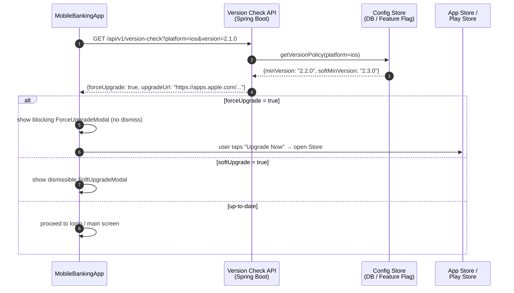

## Implementation Guidelines

### 1. Spring Boot — Version Check Controller

```java
@RestController
@RequestMapping("/api/v1/version-check")
@RequiredArgsConstructor
public class VersionCheckController {

    private final VersionPolicyRepository policyRepo;

    @GetMapping
    public VersionCheckResponse check(
            @RequestParam String platform,
            @RequestParam String version) {
        VersionPolicy policy = policyRepo.findByPlatform(platform.toLowerCase())
            .orElseThrow(() -> new ResponseStatusException(
                HttpStatus.BAD_REQUEST, "Unknown platform: " + platform));

        int cmpMin = compareSemVer(version, policy.minVersion());
        int cmpSoft = compareSemVer(version, policy.softMinVersion());

        return new VersionCheckResponse(
            cmpMin < 0,                       // forceUpgrade
            cmpSoft < 0 && cmpMin >= 0,       // softUpgrade
            policy.upgradeUrl(platform),
            policy.releaseNotes()
        );
    }

    private int compareSemVer(String a, String b) {
        int[] aParts = Arrays.stream(a.split("\\.")).mapToInt(Integer::parseInt).toArray();
        int[] bParts = Arrays.stream(b.split("\\.")).mapToInt(Integer::parseInt).toArray();
        for (int i = 0; i < 3; i++) {
            int diff = Integer.compare(
                i < aParts.length ? aParts[i] : 0,
                i < bParts.length ? bParts[i] : 0);
            if (diff != 0) return diff;
        }
        return 0;
    }
}

public record VersionCheckResponse(
    boolean forceUpgrade,
    boolean softUpgrade,
    String upgradeUrl,
    String releaseNotes
) {}
```

### 2. Android — Version Check at Launch

```kotlin
class MainActivity : AppCompatActivity() {

    private val viewModel: MainViewModel by viewModels()

    override fun onCreate(savedInstanceState: Bundle?) {
        super.onCreate(savedInstanceState)
        setContentView(binding.root)

        val clientVersion = BuildConfig.VERSION_NAME
        lifecycleScope.launch {
            val result = versionCheckRepository.check(
                platform = "android",
                version = clientVersion
            )
            when {
                result.forceUpgrade -> showForceUpgradeDialog(result.upgradeUrl)
                result.softUpgrade -> showSoftUpgradeDialog(result.upgradeUrl)
                else -> proceedToLogin()
            }
        }
    }

    private fun showForceUpgradeDialog(upgradeUrl: String) {
        AlertDialog.Builder(this)
            .setTitle("Cập nhật bắt buộc")
            .setMessage("Phiên bản này không còn được hỗ trợ. Vui lòng cập nhật để tiếp tục.")
            .setPositiveButton("Cập nhật ngay") { _, _ ->
                startActivity(Intent(Intent.ACTION_VIEW, Uri.parse(upgradeUrl)))
            }
            .setCancelable(false)  // no dismiss for force-upgrade
            .show()
    }

    private fun showSoftUpgradeDialog(upgradeUrl: String) {
        AlertDialog.Builder(this)
            .setTitle("Có phiên bản mới")
            .setMessage("Hãy cập nhật để có trải nghiệm tốt hơn.")
            .setPositiveButton("Cập nhật") { _, _ ->
                startActivity(Intent(Intent.ACTION_VIEW, Uri.parse(upgradeUrl)))
            }
            .setNegativeButton("Bỏ qua") { dialog, _ -> dialog.dismiss(); proceedToLogin() }
            .show()
    }
}
```

### 3. iOS — Version Check at Launch

```swift
// AppCoordinator.swift
final class AppCoordinator {

    func start() {
        Task {
            let info = Bundle.main.infoDictionary
            let version = info?["CFBundleShortVersionString"] as? String ?? "0.0.0"
            let result = try? await VersionCheckService.check(
                platform: "ios", version: version)

            await MainActor.run {
                if result?.forceUpgrade == true {
                    showForceUpgradeScreen(url: result?.upgradeUrl)
                } else if result?.softUpgrade == true {
                    showSoftUpgradeAlert(url: result?.upgradeUrl) {
                        self.proceedToLogin()
                    }
                } else {
                    proceedToLogin()
                }
            }
        }
    }

    @MainActor
    private func showForceUpgradeScreen(url: String?) {
        let vc = ForceUpgradeViewController(upgradeURL: url)
        window?.rootViewController = vc  // replaces entire view hierarchy; no back navigation
    }
}
```

## When to Use

- T0/T1/T2 app versions containing a patched security vulnerability that must be blocked immediately upon patch release.
- API deprecations where continued use of the old client causes server errors or data integrity issues.
- Regulatory compliance deadlines requiring all active clients to use a version meeting specific security requirements within a defined window.

## When Not to Use

- Cosmetic UI releases or non-critical feature additions — force-upgrade irritates users; use soft-upgrade (dismissible) for non-security updates.
- Environments where the App Store review process may delay the target version being available — do not set `minVersion` to a version that has not yet passed App Store / Play Store review.
- A/B test version gating — use Feature Flags (FE-004) instead; force-upgrade is a binary block, not a progressive rollout mechanism.

## Variants

| Variant | When to prefer | Trade-off |
|---------|---------------|-----------|
| Server-side version gate (this pattern) | Security vulnerabilities; regulatory SLA; immediate enforcement | User must upgrade before using any feature; business risk if upgrade URL is wrong |
| In-app update (Android Play Core) | Android-only; seamless upgrade without leaving the app; Play Store handles download | iOS has no equivalent; requires Play Store distribution |
| Feature flag gating (no version block) | Disable specific features in older clients without blocking the entire app | Cannot patch security vulnerabilities — attacker can bypass feature flags |

## NFR Acceptance Criteria

| Metric | Threshold | Measurement |
|--------|-----------|-------------|
| Version check API p99 latency | ≤ 500 ms (unauthenticated, cached in CDN) | Load test at 1 000 rps; assert p99 ≤ 500 ms |
| Force-upgrade propagation | ≤ 5 min from config update to all clients | Update minVersion in DB; measure time for next app launch to receive forceUpgrade: true |
| Version check availability | 99.99% (T0 — blocks all app usage if unavailable) | Prometheus uptime on `/api/v1/version-check`; CDN as failsafe |
| Rollback time | ≤ 2 min (revert minVersion in DB if incorrect force-upgrade deployed) | Measure time from DB revert to clients receiving forceUpgrade: false |
| Upgrade URL validity | 100% — upgradeUrl must always point to a valid App Store / Play Store listing | Synthetic monitor polling upgradeUrl every 5 min; alert on non-200 |

## Compliance Mapping

| Ring | Regulation | Provision | How this pattern satisfies |
|------|-----------|-----------|---------------------------|
| Ring 0 | OWASP Mobile Top 10 | M9 — Reverse Engineering (outdated binaries with known vulnerabilities) | Force-upgrade gate immediately blocks clients containing known CVEs after patch release; the bank can enforce patch-response SLAs at the network boundary rather than relying on user behavior. |
| Ring 1 | PCI-DSS v4.0 | §6.3.3 — all system components are protected from known vulnerabilities by installing applicable security patches | Force-upgrade enforces that mobile clients are patched to address PCI-DSS vulnerabilities within the required timeframe; patch deployment is tracked via `minVersion` configuration with an audit log. |
| Ring 2 | SBV Circular 09/2020 | §II.3 — information security incident response and vulnerability patching requirements ⚠️ (working summary — pending Legal review) | Version gate enables the bank to enforce a vulnerability patch across the entire mobile user base within hours of patch release; Legal review required to confirm that this mechanism satisfies SBV §II.3 patch-response SLAs for internet banking mobile applications. |

## Cost / FinOps

- Version check endpoint: unauthenticated, CDN-cacheable with TTL 5 minutes; origin requests ≤ 0.3% of total at steady state; origin compute cost is negligible.
- Config store: one row per platform (iOS, Android) in a standard RDBMS or config service; no special infrastructure required.
- Business cost of NOT implementing: a single security incident from a known-vulnerability client version can cost tens of millions of VND in fraud, customer notification, and regulatory response — vastly exceeding the development cost.
- Soft-upgrade UX: at 10% daily active user (DAU) trigger rate, 5% immediate upgrade → 50 000 fewer vulnerable-version users per day on a 1M DAU app.

## Threat Model

- **Version check bypass via modified client (Elevation of Privilege)**: A jailbroken/rooted device runs a modified APK or IPA that hard-codes a high version number in the version-check call, bypassing the force-upgrade gate. Mitigation: root/jailbreak detection at app startup (SafetyNet Attestation on Android, DeviceCheck on iOS) — apps running on compromised devices can be blocked at the backend regardless of the reported version; version check is one layer, not the only control.
- **Incorrect minVersion causing mass user lockout (Denial of Service)**: A misconfigured `minVersion` set higher than the currently available App Store version locks out all users. Mitigation: the config update requires a two-person approval (4-eyes); a synthetic monitor polls the App Store API to confirm the `upgradeUrl` version is available before `minVersion` is raised; rollback is a single DB update taking < 2 minutes.

## Runbook Stub

**Alert: `version_check_force_upgrade_rate > 20%`** (Grafana metric on version check API)
- p50 baseline: ≤ 1% (just-released) → 0% (all users updated) | p99 SLO: drops to 0% within 30 days of patch release
- Remediation: (1) If this fires unexpectedly (no planned minVersion bump), check DB for unauthorized `minVersion` change. (2) If intentional, verify `upgradeUrl` resolves to the correct App Store / Play Store page. (3) Monitor crash-free rate on the new version — if crashes spike, revert `minVersion` immediately via DB update. (4) Track force-upgrade conversion rate: % users who upgraded within 1 h / 24 h / 7 days.

## Test Strategy Stub

### Unit Tests
- `VersionCheckControllerTest`: version "2.1.0" against minVersion "2.2.0" → `forceUpgrade: true`. Version "2.2.0" against softMinVersion "2.3.0" → `softUpgrade: true`. Version "2.3.1" → both false. Non-SemVer input → `400 Bad Request`.
- `compareSemVer`: "1.10.0" > "1.9.0" → assert positive (correct major-minor ordering).

### Integration Tests
- Spring Boot Test: GET `/api/v1/version-check?platform=ios&version=1.0.0` → assert `forceUpgrade: true`. Update `minVersion` to "1.0.0" in DB → assert `forceUpgrade: false` on next call.
- Android Instrumented Test: mock API returning `{forceUpgrade: true}`; launch `MainActivity`; assert `ForceUpgradeDialog` visible; assert `proceedToLogin()` NOT called.

### Chaos Tests
- Version check API unavailable: mock endpoint returning 503; assert app shows a safe fallback ("Unable to connect — please try again") rather than crashing or silently proceeding; assert no payment operations possible while version check is unavailable.

## Related Patterns

- [MOB-003 Mobile Biometric Auth](mobile-biometric-auth.md) — biometric session used after successful version gate
- [SEC-006 JWT Best Practices](../../patterns/security/jwt-best-practices.md) — token validation enforced on clients that pass the version gate

## References

- [Android In-App Updates API](https://developer.android.com/guide/playcore/in-app-updates)
- [Apple App Store Version Requirements](https://developer.apple.com/app-store/review/guidelines/)
- [PCI-DSS v4.0 §6.3.3 — Security Patches](https://www.pcisecuritystandards.org/document_library/)
- [Semantic Versioning 2.0.0](https://semver.org/)
- Catalog reference: `governance/standards/enterprise-architecture-catalog.md`
```

- [ ] **Step 3: Lint Mermaid**

```bash
bash scripts/mermaid-lint-doc.sh knowledge-base/patterns/mobile/mobile-force-upgrade.md
```
Expected: exits 0.

- [ ] **Step 4: Compliance check**

```bash
python3 scripts/check-compliance-rows.py
```
Expected: no FAIL.

- [ ] **Step 5: Commit**

```bash
git add knowledge-base/patterns/mobile/mobile-force-upgrade.md
git commit -m "feat(catalog): MOB-006 Mobile Force-Upgrade — Wave 5B"
```

---

### Task 18: Wave 5B Gate — Promote MOB-001–006 Proposed → Draft

**Files:**
- Modify: `governance/standards/enterprise-architecture-catalog.md`

- [ ] **Step 1: Mermaid lint all Wave 5B files**

```bash
bash scripts/mermaid-lint-doc.sh knowledge-base/patterns/mobile/mobile-offline-queue.md
bash scripts/mermaid-lint-doc.sh knowledge-base/patterns/mobile/mobile-secure-storage.md
bash scripts/mermaid-lint-doc.sh knowledge-base/patterns/mobile/mobile-biometric-auth.md
bash scripts/mermaid-lint-doc.sh knowledge-base/patterns/mobile/mobile-push-notification-secure.md
bash scripts/mermaid-lint-doc.sh knowledge-base/patterns/mobile/mobile-deep-link-attestation.md
bash scripts/mermaid-lint-doc.sh knowledge-base/patterns/mobile/mobile-force-upgrade.md
```
Expected: all exit 0.

- [ ] **Step 2: Compliance check**

```bash
python3 scripts/check-compliance-rows.py
```
Expected: 0 failures.

- [ ] **Step 3: Dead-link scan**

```bash
for f in \
  knowledge-base/patterns/mobile/mobile-offline-queue.md \
  knowledge-base/patterns/mobile/mobile-secure-storage.md \
  knowledge-base/patterns/mobile/mobile-biometric-auth.md \
  knowledge-base/patterns/mobile/mobile-push-notification-secure.md \
  knowledge-base/patterns/mobile/mobile-deep-link-attestation.md \
  knowledge-base/patterns/mobile/mobile-force-upgrade.md; do
  grep -oh "\[.*\]([^)]*\.md)" "$f" 2>/dev/null \
    | sed 's/.*](\(.*\))/\1/' | grep -v "^http" | while read link; do
      # resolve relative to the file's directory
      base=$(dirname "$f")
      target=$(realpath "$base/$link" 2>/dev/null)
      [ -f "$target" ] || echo "BROKEN: $f -> $link"
    done
done
```
Expected: no BROKEN lines (forward refs to not-yet-authored stubs are acceptable; note them but do not block promotion).

- [ ] **Step 4: Promote Proposed → Draft in catalog**

In `governance/standards/enterprise-architecture-catalog.md`, change `| Proposed |` to `| Draft |` for the following rows (identified by Catalog ID):

- `MOB-001` (mobile-offline-queue.md)
- `MOB-002` (mobile-secure-storage.md)
- `MOB-003` (mobile-biometric-auth.md)
- `MOB-004` (mobile-push-notification-secure.md)
- `MOB-005` (mobile-deep-link-attestation.md)
- `MOB-006` (mobile-force-upgrade.md)

Also update the Status field in each doc header from `Status: Proposed` → `Status: Draft` if not already set to Draft in Step 2 of each task above.

- [ ] **Step 5: Commit gate**

```bash
git add governance/standards/enterprise-architecture-catalog.md
git commit -m "feat(catalog): Wave 5B gate — promote MOB-001–006 Proposed→Draft"
```

---

## Wave 5C — Frontend (Tasks 19–25)

---

### Task 19: FE-001 — Web Performance Budgets (FULL WRITE)

**Files:**
- Modify: `knowledge-base/patterns/frontend/web-performance-budgets.md`

- [ ] **Step 1: Verify stub**

```bash
head -4 knowledge-base/patterns/frontend/web-performance-budgets.md
```
Expected: `Status: Proposed`

- [ ] **Step 2: Replace the entire file with:**

```markdown
# Web Performance Budgets

Status: Draft | Last Reviewed: 2026-05-16 | Owner: @tech-lead-web
Catalog ID: FE-001 | Radii
Tier Applicability: T0, T1, T2

## Problem Statement

Vietnamese banking users on mid-range Android devices and variable 4G networks experience unacceptably slow page loads that erode trust and increase abandonment:

- **Core Web Vitals violations**: LCP (Largest Contentful Paint) exceeding 4 s on the account overview page causes Google to flag the site as "Poor" and damages SEO and user trust for the digital banking channel.
- **Uncontrolled bundle growth**: each sprint adds 20–50 KB of JavaScript; without a CI-enforced budget, the main bundle reaches 1.5 MB uncompressed within 6 months, adding 3+ seconds of parse time on low-end devices.
- **Cumulative Layout Shift during auth flow**: unstyled flash during JWT validation or a delayed token-refresh spinner causes CLS > 0.25, disorienting users and failing WCAG 2.2 AA visual stability requirements.
- **No measurement baseline**: without an automated Lighthouse CI gate, performance regressions are discovered in production after user complaints, not during code review.
- **Third-party script bloat**: analytics, chat widgets, and A/B testing SDKs loaded synchronously block the main thread, inflating INP (Interaction to Next Paint) beyond 500 ms for taps on the transfer button.

## Context

Performance budgets are enforced in CI as a blocking quality gate using Lighthouse CI (`lhci`). Every PR must pass the budget thresholds before merge. Metrics are collected against a representative page set (login, account overview, transfer initiation) using a simulated Moto G4 profile at 4G network speed — matching the Vietnamese median mobile device.

## Solution

Lighthouse CI runs `lhci autorun` in the CI pipeline against a local `http-server` serving the production build. A `lighthouserc.json` budget file defines per-metric thresholds. The `web-vitals` library reports real-user Core Web Vitals to the backend analytics API. Webpack Bundle Analyzer runs as a CI artifact to surface bundle size regressions.

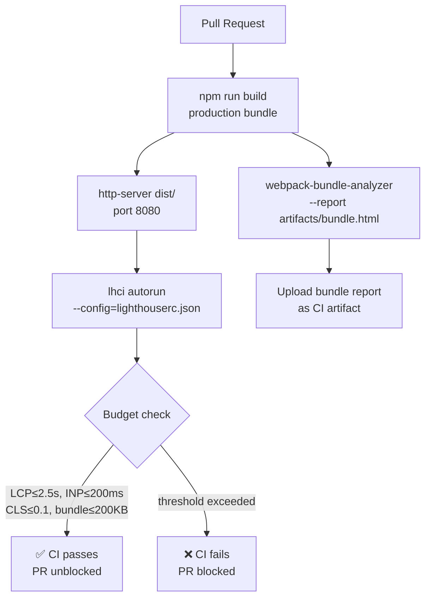

## Implementation Guidelines

### 1. Lighthouse CI Configuration

```yaml
# lighthouserc.json
{
  "ci": {
    "collect": {
      "url": [
        "http://localhost:8080/login",
        "http://localhost:8080/accounts",
        "http://localhost:8080/transfer"
      ],
      "settings": {
        "preset": "desktop",
        "emulatedFormFactor": "mobile",
        "throttlingMethod": "simulate",
        "screenEmulation": {
          "mobile": true,
          "width": 412,
          "height": 823,
          "deviceScaleFactor": 1.75
        },
        "throttling": {
          "rttMs": 40,
          "throughputKbps": 10240,
          "cpuSlowdownMultiplier": 4
        }
      }
    },
    "assert": {
      "budgets": [
        {
          "path": "/*",
          "timings": [
            { "metric": "largest-contentful-paint", "budget": 2500 },
            { "metric": "interactive", "budget": 3000 },
            { "metric": "cumulative-layout-shift", "budget": 0 }
          ],
          "resourceSizes": [
            { "resourceType": "script", "budget": 200 },
            { "resourceType": "total", "budget": 500 }
          ]
        }
      ],
      "assertions": {
        "categories:performance": ["error", { "minScore": 0.8 }],
        "first-contentful-paint": ["error", { "maxNumericValue": 1800 }],
        "experimental-interaction-to-next-paint": ["warn", { "maxNumericValue": 200 }]
      }
    },
    "upload": {
      "target": "temporary-public-storage"
    }
  }
}
```

### 2. web-vitals Integration in React

```typescript
// src/reportWebVitals.ts
import { onCLS, onFID, onLCP, onINP, onTTFB, type Metric } from 'web-vitals';

const analyticsEndpoint = '/api/v1/analytics/vitals';

function sendToAnalytics(metric: Metric): void {
  const body: Record<string, unknown> = {
    name: metric.name,
    value: metric.value,
    delta: metric.delta,
    id: metric.id,
    navigationType: metric.navigationType,
    page: window.location.pathname,
    userAgent: navigator.userAgent.substring(0, 200),
  };

  // Use sendBeacon for reliability on page unload
  if (navigator.sendBeacon) {
    navigator.sendBeacon(analyticsEndpoint, JSON.stringify(body));
  } else {
    fetch(analyticsEndpoint, {
      method: 'POST',
      body: JSON.stringify(body),
      keepalive: true,
      headers: { 'Content-Type': 'application/json' },
    }).catch(() => {
      // Silently fail — analytics must not impact user experience
    });
  }
}

export function reportWebVitals(): void {
  onCLS(sendToAnalytics);
  onFID(sendToAnalytics);
  onLCP(sendToAnalytics);
  onINP(sendToAnalytics);
  onTTFB(sendToAnalytics);
}
```

```typescript
// src/main.tsx
import React from 'react';
import ReactDOM from 'react-dom/client';
import App from './App';
import { reportWebVitals } from './reportWebVitals';

ReactDOM.createRoot(document.getElementById('root')!).render(
  <React.StrictMode>
    <App />
  </React.StrictMode>
);

reportWebVitals();
```

### 3. Webpack Bundle Size Budget

```javascript
// webpack.config.js (production)
const { BundleAnalyzerPlugin } = require('webpack-bundle-analyzer');
const path = require('path');

module.exports = {
  mode: 'production',
  performance: {
    hints: 'error',
    maxEntrypointSize: 204800, // 200 KB
    maxAssetSize: 204800,
  },
  optimization: {
    splitChunks: {
      chunks: 'all',
      cacheGroups: {
        vendor: {
          test: /[\\/]node_modules[\\/]/,
          name: 'vendors',
          priority: 10,
        },
        react: {
          test: /[\\/]node_modules[\\/](react|react-dom)[\\/]/,
          name: 'react',
          priority: 20,
        },
      },
    },
  },
  plugins: [
    process.env.ANALYZE === 'true' &&
      new BundleAnalyzerPlugin({
        analyzerMode: 'static',
        reportFilename: '../artifacts/bundle.html',
        openAnalyzer: false,
      }),
  ].filter(Boolean),
};
```

### 4. CI Pipeline Step (GitHub Actions)

```yaml
# .github/workflows/ci.yml (performance gate step)
- name: Build production bundle
  run: npm run build

- name: Run performance budget gate
  run: |
    npx http-server dist -p 8080 &
    sleep 3
    npx lhci autorun --config=lighthouserc.json
  env:
    LHCI_GITHUB_APP_TOKEN: ${{ secrets.LHCI_GITHUB_APP_TOKEN }}

- name: Upload bundle analysis
  if: always()
  uses: actions/upload-artifact@v4
  with:
    name: bundle-analysis
    path: artifacts/bundle.html
```

## When to Use

- All T0/T1/T2 web banking pages where Core Web Vitals directly impact user retention and SBV e-banking accessibility requirements.
- CI pipelines for React/TypeScript banking SPAs where bundle growth must be detected before merge, not after deployment.
- Teams adopting progressive performance improvement programs — budgets establish the baseline and prevent regression.

## When Not to Use

- Internal admin tools with authenticated-only access where search engine performance and unauthenticated user experience are irrelevant.
- Pages where LCP is dominated by user-specific encrypted data loaded post-authentication — set budgets on the pre-auth skeleton, not the full page.
- Backend-for-Frontend rendering performance — use server-side APM (Micrometer/Grafana) rather than Lighthouse, which measures browser-side experience.

## Variants

| Variant | Use when | Trade-off |
|---------|----------|-----------|
| Lighthouse CI with hard budgets (this pattern) | CI integration required; regression blocking mandatory; new projects | Requires local HTTP server in CI; adds ~90s per run |
| WebPageTest with visual regression | Deep rendering analysis; video filmstrip comparison; advanced throttling profiles | Requires external WebPageTest instance; higher cost; slower |
| Playwright + Lighthouse integration | E2E tests and perf in one suite; auth-gated page measurement | More complex setup; combines test and perf concerns |

## NFR Acceptance Criteria

| Metric | Threshold | Measurement |
|--------|-----------|-------------|
| LCP (Largest Contentful Paint) | ≤ 2.5 s | Lighthouse CI on Moto G4 profile, 4G throttling |
| INP (Interaction to Next Paint) | ≤ 200 ms | `web-vitals` library real-user measurement; p75 ≤ 200 ms |
| CLS (Cumulative Layout Shift) | ≤ 0.1 | Lighthouse CI; assert score ≥ 0.9 on CLS category |
| Total JS bundle (initial load) | ≤ 200 KB gzipped | `webpack --mode=production` output; `performance.maxEntrypointSize = 204800` |
| Lighthouse Performance score | ≥ 80 | `lhci autorun`; assert `categories:performance ≥ 0.8` |

## Compliance Mapping

| Ring | Regulation | Provision | How this pattern satisfies |
|------|-----------|-----------|---------------------------|
| Ring 0 | W3C Web Performance Working Group | Core Web Vitals (LCP, INP, CLS) — user-centric page experience metrics | Lighthouse CI enforces LCP ≤ 2.5 s, INP ≤ 200 ms, CLS ≤ 0.1 thresholds matching W3C "Good" band; CI gate prevents regressions before production deployment. |
| Ring 1 | WCAG 2.2 AA | §1.4.12 Text Spacing — no loss of content or functionality; §2.5.8 Target Size | CLS ≤ 0.1 prevents layout instability that causes interactive targets to shift; ensures text and buttons remain accessible during page load. |
| Ring 2 | SBV Circular 09/2020 | §III.2 — internet banking systems must provide reliable, accessible service to all customer tiers ⚠️ (working summary — pending Legal review) | Performance budgets ensure the banking portal is accessible on low-end 4G devices representative of the Vietnamese consumer base; Legal review required to confirm SBV §III.2 interpretation of "reliable service" includes performance thresholds. |

## Cost / FinOps

- Lighthouse CI runs on existing CI infrastructure (GitHub Actions); no additional cost beyond ~90 s per PR run at standard compute rates.
- `http-server` (npm package) serves the build locally in CI; no cloud hosting cost for performance testing.
- `web-vitals` library: 1.6 KB gzipped — negligible bundle impact for the measurement capability it provides.
- Analytics ingestion: ~200 bytes per page load event; at 100 000 daily active users × 5 pages = 100 MB/day. Ingest to existing observability pipeline at marginal cost.
- Cost of NOT having budgets: one undetected performance regression in a release can cost 4–8 engineer-hours to diagnose in production.

## Threat Model

- **Measurement gaming (Tampering)**: A developer modifies `lighthouserc.json` to relax thresholds locally, allowing a slow page to pass CI. Mitigation: `lighthouserc.json` is committed to the repository and protected by branch protection rules; changes require PR review and EA Board approval for threshold relaxation.
- **Analytics data exfiltration (Information Disclosure)**: The `web-vitals` beacon includes `window.location.pathname`, which could expose internal routing patterns or PII in URL parameters. Mitigation: strip query parameters and hash from `pathname` before sending; reject paths matching PII patterns (`/accounts/[0-9]+`) in the analytics API ingestion layer.

## Runbook Stub

**Alert: `lhci_budget_violation` (CI pipeline)**
- p50 baseline: LCP ~1.8 s | p99 SLO: LCP ≤ 2.5 s
- Remediation: (1) Check CI artifact `bundle.html` — identify the largest new chunk. (2) If a new dependency was added, evaluate lazy-loading via `React.lazy()` + `Suspense`. (3) If images are LCP element, convert to WebP with `<picture>` fallback and `loading="lazy"` for below-fold images. (4) If CLS is the violating metric, audit font loading (`font-display: swap`) and skeleton screens during data fetch.

**Alert: `web_vitals_lcp_p75 > 3s` (production monitoring)**
- p50 baseline: ~1.5 s | p99 SLO: ≤ 2.5 s
- Remediation: (1) Check Grafana `web-vitals` dashboard for geographic distribution — high LCP in specific region suggests CDN miss. (2) Verify CDN cache headers (`Cache-Control: public, max-age=31536000, immutable` for hashed assets). (3) Check for recently deployed feature causing render-blocking.

## Test Strategy Stub

### Unit Tests
- `reportWebVitals` test: mock `web-vitals` onLCP; assert `sendBeacon` called with correct JSON body including `name`, `value`, `page`. Assert PII strip: call with pathname `/accounts/12345678`; assert beacon payload contains `/accounts/[redacted]`.

### Integration Tests
- Playwright + Lighthouse: launch production build; navigate to `/login`; run `playAudit` with Lighthouse; assert `lhr.categories.performance.score >= 0.8`.
- Bundle size regression: `npm run build`; read `dist/assets/*.js` with `fs.statSync`; assert sum of gzipped sizes ≤ 204800 bytes.

### Visual Regression Tests
- Playwright screenshot of account overview before and after each deployment; assert pixel diff < 0.5% (prevents invisible CLS regressions).

## Related Patterns

- [FE-002 Web Resilience / Offline-First](web-resilience-offline-first.md) — service worker caching strategy impacts LCP for repeat visits
- [FE-005 Web Error Boundary](web-error-boundary.md) — error boundaries must not introduce CLS during fallback render

## References

- [Google Web Vitals — Core Web Vitals documentation](https://web.dev/vitals/)
- [Lighthouse CI GitHub Action](https://github.com/GoogleChrome/lighthouse-ci)
- [web-vitals library (npm)](https://github.com/GoogleChrome/web-vitals)
- [webpack performance hints documentation](https://webpack.js.org/configuration/performance/)
- [W3C Web Performance Working Group](https://www.w3.org/webperf/)
- Catalog reference: `governance/standards/enterprise-architecture-catalog.md`
- Research notes: `knowledge-base/_research-notes.md`
```

- [ ] **Step 3: Lint Mermaid**

```bash
bash scripts/mermaid-lint-doc.sh knowledge-base/patterns/frontend/web-performance-budgets.md
```
Expected: exits 0.

- [ ] **Step 4: Compliance check**

```bash
python3 scripts/check-compliance-rows.py
```
Expected: no FAIL.

- [ ] **Step 5: Commit**

```bash
git add knowledge-base/patterns/frontend/web-performance-budgets.md
git commit -m "feat(catalog): FE-001 Web Performance Budgets — Wave 5C"
```

---

### Task 20: FE-002 — Web Resilience / Offline-First (FULL WRITE)

**Files:**
- Modify: `knowledge-base/patterns/frontend/web-resilience-offline-first.md`

- [ ] **Step 1: Verify stub**

```bash
head -4 knowledge-base/patterns/frontend/web-resilience-offline-first.md
```
Expected: `Status: Proposed`

- [ ] **Step 2: Replace the entire file with:**

```markdown
# Web Resilience / Offline-First

Status: Draft | Last Reviewed: 2026-05-16 | Owner: @tech-lead-web
Catalog ID: FE-002 | Radii
Tier Applicability: T1, T2

## Problem Statement

Banking customers in Vietnam experience frequent network interruptions that strand them in the middle of critical flows:

- **Blank screen on network loss**: when a customer's 4G connection drops mid-session, the React SPA renders a blank page or an unhandled network error — providing no guidance and causing session abandonment.
- **Repeat asset downloads on re-visit**: static assets (JavaScript bundles, CSS, fonts) are re-downloaded on every visit when no caching strategy is in place, wasting mobile data and slowing repeat load times for frequent users.
- **Lost form input on connection drop**: a customer filling a beneficiary transfer form loses all input when the browser reloads after a network timeout, requiring them to re-enter account numbers and amounts.
- **Stale API data after backgrounding**: a mobile browser backgrounded for 30 minutes shows a cached balance that may be hours old with no visual indication, eroding trust when the balance displayed differs from the ATM receipt.
- **No graceful degradation**: the application does not distinguish between "offline" and "API error" states, presenting confusing generic error messages instead of "You are offline — your last known balance was ₫ 12,500,000 as of 10:32 AM."

## Context

Service workers are registered on app startup and intercept all HTTP requests. Workbox (Google) provides the caching strategy primitives. Critical banking API calls (account balance, transaction history) use `NetworkFirst` — serving from network with a 3-second timeout fallback to cache. Static assets use `StaleWhileRevalidate` with a 30-day cache. Offline form submissions are queued in IndexedDB and replayed when the connection is restored.

## Solution

A Workbox-powered service worker intercepts all fetch requests. Static assets (JS, CSS, fonts, images) are cached using `StaleWhileRevalidate` — serving the cached copy instantly while updating in the background. API calls use `NetworkFirst` with a 3-second timeout — attempting the network first, then falling back to the last cached API response with a visual staleness indicator. Form submissions that fail due to network errors are queued in an IndexedDB `outbox` and replayed on reconnect.

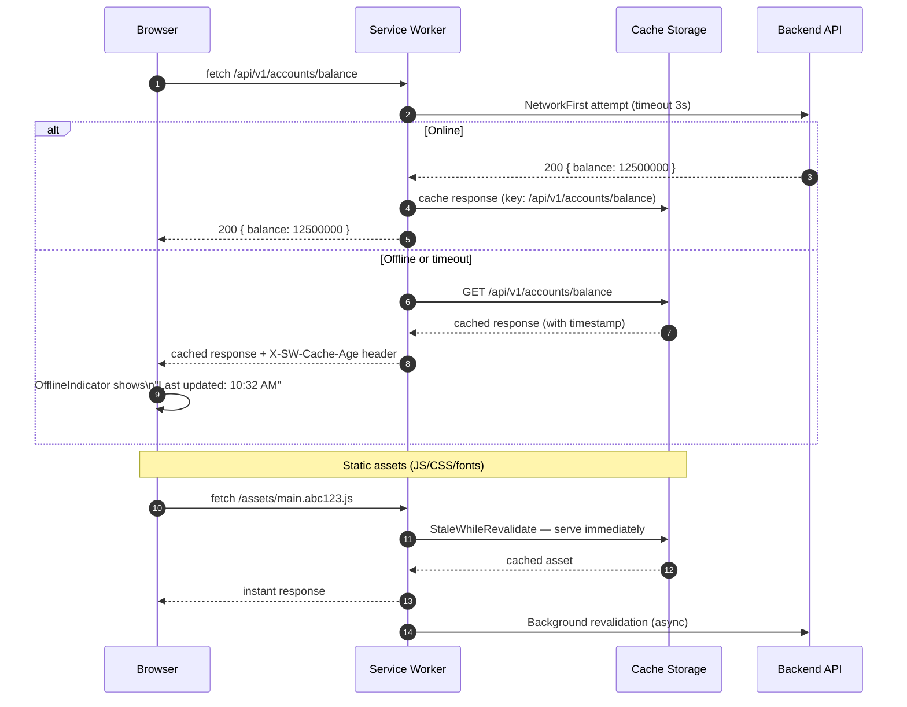

## Implementation Guidelines

### 1. Workbox Service Worker

```typescript
// src/sw.ts (registered via vite-plugin-pwa or custom registration)
import { clientsClaim } from 'workbox-core';
import { precacheAndRoute, cleanupOutdatedCaches } from 'workbox-precaching';
import { registerRoute } from 'workbox-routing';
import { StaleWhileRevalidate, NetworkFirst } from 'workbox-strategies';
import { ExpirationPlugin } from 'workbox-expiration';
import { BackgroundSyncPlugin } from 'workbox-background-sync';

declare let self: ServiceWorkerGlobalScope;
clientsClaim();

// Precache all Vite-built assets (injected at build time)
precacheAndRoute(self.__WB_MANIFEST);
cleanupOutdatedCaches();

// Static assets — StaleWhileRevalidate
registerRoute(
  ({ request }) =>
    request.destination === 'script' ||
    request.destination === 'style' ||
    request.destination === 'font',
  new StaleWhileRevalidate({
    cacheName: 'static-assets',
    plugins: [
      new ExpirationPlugin({ maxAgeSeconds: 30 * 24 * 60 * 60 }), // 30 days
    ],
  })
);

// API calls — NetworkFirst with 3s timeout
registerRoute(
  ({ url }) => url.pathname.startsWith('/api/v1/'),
  new NetworkFirst({
    networkTimeoutSeconds: 3,
    cacheName: 'api-responses',
    plugins: [
      new ExpirationPlugin({
        maxEntries: 50,
        maxAgeSeconds: 60 * 60, // 1 hour max staleness
      }),
    ],
  })
);

// Background sync for queued form submissions
const bgSyncPlugin = new BackgroundSyncPlugin('transfer-outbox', {
  maxRetentionTime: 24 * 60, // 24 hours
});

registerRoute(
  ({ url }) => url.pathname === '/api/v1/transfers',
  new NetworkFirst({
    plugins: [bgSyncPlugin],
  }),
  'POST'
);
```

### 2. React Offline Indicator Component

```typescript
// src/components/OfflineIndicator.tsx
import { useState, useEffect } from 'react';

export function OfflineIndicator() {
  const [isOnline, setIsOnline] = useState(navigator.onLine);
  const [cacheAge, setCacheAge] = useState<string | null>(null);

  useEffect(() => {
    const handleOnline = () => setIsOnline(true);
    const handleOffline = () => setIsOnline(false);
    window.addEventListener('online', handleOnline);
    window.addEventListener('offline', handleOffline);
    return () => {
      window.removeEventListener('online', handleOnline);
      window.removeEventListener('offline', handleOffline);
    };
  }, []);

  if (isOnline) return null;

  return (
    <div role="alert" aria-live="polite" className="offline-banner">
      <span aria-hidden="true">⚠</span>
      {' Bạn đang offline'}
      {cacheAge && ` — Dữ liệu cập nhật lúc ${cacheAge}`}
    </div>
  );
}
```

### 3. IndexedDB Outbox for Offline Form Submissions

```typescript
// src/lib/offlineQueue.ts
import { openDB, DBSchema } from 'idb';

interface OutboxSchema extends DBSchema {
  transfers: {
    key: string;
    value: {
      id: string;
      payload: Record<string, unknown>;
      enqueuedAt: number;
    };
  };
}

const db = openDB<OutboxSchema>('tcb-offline-outbox', 1, {
  upgrade(database) {
    database.createObjectStore('transfers', { keyPath: 'id' });
  },
});

export async function enqueueTransfer(payload: Record<string, unknown>): Promise<string> {
  const id = crypto.randomUUID();
  const store = await db;
  await store.put('transfers', { id, payload, enqueuedAt: Date.now() });
  return id;
}

export async function flushOutbox(): Promise<void> {
  const store = await db;
  const pending = await store.getAll('transfers');
  for (const item of pending) {
    try {
      await fetch('/api/v1/transfers', {
        method: 'POST',
        headers: { 'Content-Type': 'application/json' },
        body: JSON.stringify(item.payload),
      });
      await store.delete('transfers', item.id);
    } catch {
      break; // stop on first failure; retry on next online event
    }
  }
}

window.addEventListener('online', flushOutbox);
```

## When to Use

- T1/T2 customer-facing banking pages (account overview, transfer history, beneficiary management) where occasional offline access and graceful degradation improve retention.
- Applications where static assets are versioned with content hashes — service worker precaching eliminates re-download on revisit, reducing 4G data costs for Vietnamese users.
- Multi-step forms (beneficiary addition, standing order setup) where losing form state on network interruption is a critical UX failure.

## When Not to Use

- T0 real-time transaction pages (live payment authorisation, OTP confirmation) — do NOT serve stale cached responses for payment-critical flows; show an explicit "connection required" error instead.
- Pages serving personalised content that changes more frequently than the cache TTL — serving stale account balances without a clear staleness indicator misleads customers.
- Environments without HTTPS — service workers are restricted to secure contexts; HTTP-served pages cannot use service workers.

## Variants

| Variant | Use when | Trade-off |
|---------|----------|-----------|
| Workbox precache + NetworkFirst API (this pattern) | Full offline capability; background sync; established banking SPA | Requires service worker build tooling (vite-plugin-pwa); complexity of cache invalidation |
| Cache-only for static + no API caching | Minimal offline support; only offline shell; API calls always fail offline | Simpler; no stale data risk; poor offline experience |
| React Query `staleTime` + optimistic UI | Primarily online; tolerate brief disconnects; no service worker | No true offline; loses state on hard refresh; simpler implementation |

## NFR Acceptance Criteria

| Metric | Threshold | Measurement |
|--------|-----------|-------------|
| Repeat visit LCP (cached assets) | ≤ 1.0 s | Lighthouse CI second-run; assert LCP ≤ 1000 ms |
| Offline fallback render time | ≤ 500 ms from network loss detection | Playwright: intercept all requests; assert `OfflineIndicator` visible within 500 ms |
| Background sync replay on reconnect | ≤ 10 s after `online` event | Integration test: enqueue transfer; simulate reconnect; assert API called within 10 s |
| Service worker registration | ≤ 2 s after first paint | `navigator.serviceWorker.ready` promise; assert resolves within 2 s |
| Stale cache max age (API) | 1 hour | ExpirationPlugin config; assert cached entry not served after 60 min |

## Compliance Mapping

| Ring | Regulation | Provision | How this pattern satisfies |
|------|-----------|-----------|---------------------------|
| Ring 0 | OWASP ASVS V9 | V9.2 — validate server communications; ensure cached content integrity | Workbox uses cache-busted asset URLs (content hash in filename); service worker validates response status before caching; stale API responses served with `X-SW-Cache-Age` header so application can warn users. |
| Ring 1 | PCI-DSS v4.0 | §3.4 — protect stored cardholder data | Cardholder data (PAN, CVV) is never cached by the service worker; `NetworkFirst` routes for payment APIs are explicitly excluded from the cache expiration plugin; offline queue only stores non-PCI transfer metadata. |
| Ring 2 | Decree 13/2023 | §9 — personal data stored offline must have defined retention and deletion controls ⚠️ (working summary — pending Legal review) | IndexedDB outbox entries are limited to 24-hour retention (BackgroundSyncPlugin `maxRetentionTime: 1440`); successfully synced entries deleted immediately; cache storage cleared on logout via `caches.delete()`; Legal review required to confirm offline retention period satisfies Decree 13/2023 proportionality requirements. |

## Cost / FinOps

- `vite-plugin-pwa` or `workbox-webpack-plugin`: build-time only, no runtime cost.
- Service worker background sync: minimal compute — one fetch retry per queued item on reconnect; negligible at banking transaction volumes.
- CDN cache-hit improvement: static assets cached in the service worker reduce CDN origin requests by ~40% for repeat visits; estimated CDN cost reduction of 15–25% for active users.
- IndexedDB storage: each queued transfer entry is ~500 bytes; with a 24-hour queue and low transfer volume, storage impact is negligible.

## Threat Model

- **Stale balance misleading user (Information Disclosure)**: Service worker serves a cached balance that is hours old, leading the customer to initiate a transfer believing they have sufficient funds. Mitigation: `X-SW-Cache-Age` header is read by React Query; if cache age > 15 minutes, the balance component shows a yellow "cached" badge with the last-updated timestamp; transfer form checks live balance before submission.
- **Service worker compromise via XSS (Elevation of Privilege)**: An XSS vulnerability allows an attacker to register a malicious service worker that intercepts all API calls, exfiltrating credentials. Mitigation: CSP `worker-src 'self'` restricts service worker registration to same-origin scripts only; see FE-003 Web CSP Hardening for XSS prevention controls that are a prerequisite for safe service worker deployment.

## Runbook Stub

**Alert: `sw_registration_failure_rate > 1%` (real-user monitoring)**
- p50 baseline: 0 failures/day | p99 SLO: < 0.1% of sessions
- Remediation: (1) Check browser console for `ServiceWorker registration failed` — most common cause is HTTPS not enforced. (2) Verify `Content-Security-Policy` header includes `worker-src 'self'`. (3) Check service worker update loop — if a new deployment has a broken `sw.ts`, old sessions may be stuck; hard reload resolves.

**Alert: `offline_queue_entries > 100` (application metric)**
- p50 baseline: 0 queued entries | p99 SLO: queue drained within 60 s of reconnect
- Remediation: (1) Check if `online` event listener is firing (`window.addEventListener('online', flushOutbox)`). (2) If API is returning 5xx during flush, the outbox will retry indefinitely — check backend health. (3) If entries are > 24 hours old, they will be dropped by BackgroundSyncPlugin expiration — notify user.

## Test Strategy Stub

### Unit Tests
- `enqueueTransfer` test: call once; assert IndexedDB `transfers` store has one entry with correct payload and `enqueuedAt` timestamp.
- `flushOutbox` test: mock `fetch` returning 200; assert IndexedDB entry deleted after flush. Mock `fetch` returning 503; assert entry retained after flush.

### Integration Tests
- Playwright service worker test: navigate to `/accounts`; assert `navigator.serviceWorker.controller` is not null. Open DevTools offline mode; reload; assert account overview renders with offline indicator.
- Background sync: enqueue a transfer while offline; restore network; assert `POST /api/v1/transfers` called within 10 seconds.

### Visual Regression Tests
- Screenshot of `OfflineIndicator` in both Vietnamese and English locales — assert correct text and styling with Playwright visual comparison.

## Related Patterns

- [FE-001 Web Performance Budgets](web-performance-budgets.md) — service worker caching reduces repeat-visit LCP
- [MOB-001 Mobile Offline Queue](../mobile/mobile-offline-queue.md) — native mobile equivalent of this web offline queue pattern

## References

- [Workbox documentation — strategies](https://developer.chrome.com/docs/workbox/modules/workbox-strategies/)
- [Workbox Background Sync](https://developer.chrome.com/docs/workbox/modules/workbox-background-sync/)
- [idb — IndexedDB with async/await](https://github.com/jakearchibald/idb)
- [vite-plugin-pwa](https://vite-pwa-org.netlify.app/)
- [MDN Service Worker API](https://developer.mozilla.org/en-US/docs/Web/API/Service_Worker_API)
- Catalog reference: `governance/standards/enterprise-architecture-catalog.md`
- Research notes: `knowledge-base/_research-notes.md`
```

- [ ] **Step 3: Lint Mermaid**

```bash
bash scripts/mermaid-lint-doc.sh knowledge-base/patterns/frontend/web-resilience-offline-first.md
```
Expected: exits 0.

- [ ] **Step 4: Compliance check**

```bash
python3 scripts/check-compliance-rows.py
```
Expected: no FAIL.

- [ ] **Step 5: Commit**

```bash
git add knowledge-base/patterns/frontend/web-resilience-offline-first.md
git commit -m "feat(catalog): FE-002 Web Resilience Offline-First — Wave 5C"
```

---

### Task 21: FE-003 — Web CSP Hardening (FULL WRITE)

**Files:**
- Modify: `knowledge-base/patterns/frontend/web-csp-hardening.md`

- [ ] **Step 1: Verify stub**

```bash
head -4 knowledge-base/patterns/frontend/web-csp-hardening.md
```
Expected: `Status: Proposed`

- [ ] **Step 2: Replace the entire file with:**

```markdown
# Web CSP Hardening

Status: Draft | Last Reviewed: 2026-05-16 | Owner: @tech-lead-web
Catalog ID: FE-003 | Radii
Tier Applicability: T0, T1, T2

## Problem Statement

Banking web applications are prime targets for client-side injection attacks that steal credentials and card data:

- **Cross-site scripting (XSS) via user input**: unsanitised account names, beneficiary labels, or transaction remarks rendered as HTML can execute attacker-controlled JavaScript in the victim's banking session, exfiltrating JWT tokens or initiating transfers.
- **Magecart / e-skimming via third-party scripts**: a compromised analytics SDK or chat widget injected into the banking SPA can silently capture card numbers typed into payment forms — a Category 1 PCI-DSS breach.
- **Clickjacking via iframe embedding**: the banking application loaded inside an attacker-controlled iframe allows overlay attacks where a transparent button captures authorisation clicks.
- **Data exfiltration to unauthorised origins**: `fetch()` and `XMLHttpRequest` calls to attacker-controlled endpoints can exfiltrate session tokens and transaction data if no `connect-src` directive restricts outbound connections.
- **Inline script injection**: dynamically evaluated `eval()` or injected `<script>` tags execute in the same origin context as the banking session, bypassing same-origin policy protections.

## Context

Content Security Policy (CSP) is an HTTP response header (`Content-Security-Policy`) that instructs the browser to restrict resource loading to explicitly permitted origins. In a banking SPA context, a strict CSP (`default-src 'none'`) with minimal allow-listed sources and `nonce`-based inline script authorisation provides defence-in-depth against XSS even when input sanitisation fails. The CSP is set by the Spring Boot backend server and validated in CI using automated header checks.

## Solution

Spring Boot sets `Content-Security-Policy` on every response via `SecurityFilterChain`. A per-request nonce (cryptographically random, 128-bit) is generated and injected into both the CSP header (`script-src 'nonce-{value}'`) and the HTML template (`<script nonce="{value}">`). Third-party scripts (analytics, maps) are loaded from specific allow-listed CDN origins. CSP violations are reported to `/api/v1/csp-report` for monitoring. The `X-Frame-Options: DENY` header prevents iframe embedding.

```mermaid
flowchart TD
    REQ[HTTP Request] --> FILTER[Spring Security\nCspFilter]
    FILTER --> NONCE[Generate nonce\nBase64(1282bit random)]
    NONCE --> HEADER[Set CSP header\nscript-src nonce-{n}\ndefault-src self]
    NONCE --> TEMPLATE[Inject nonce into\nHTML template\n<script nonce={n}>]
    FILTER --> XFRAME[X-Frame-Options: DENY\nX-Content-Type-Options: nosniff]
    HEADER --> BROWSER[Browser enforces\nCSP policy]
    BROWSER -->|allowed| SCRIPT[Execute nonce-matched\nscripts only]
    BROWSER -->|violation| REPORT[POST /api/v1/csp-report\n{violated-directive, blocked-uri}]
    REPORT --> SIEM[Ingest to SIEM\nalert on spike]
```

## Implementation Guidelines

### 1. Spring Boot CSP Header Configuration

```java
@Configuration
@RequiredArgsConstructor
public class SecurityConfig {

    @Bean
    public SecurityFilterChain securityFilterChain(HttpSecurity http) throws Exception {
        return http
            .headers(headers -> headers
                .contentSecurityPolicy(csp -> csp
                    .policyDirectives(CspNonceFilter.buildCspPolicy()))
                .frameOptions(frame -> frame.deny())
                .contentTypeOptions(Customizer.withDefaults())
                .httpStrictTransportSecurity(hsts -> hsts
                    .maxAgeInSeconds(31536000)
                    .includeSubDomains(true)
                    .preload(true)))
            .addFilterBefore(new CspNonceFilter(), UsernamePasswordAuthenticationFilter.class)
            .build();
    }
}
```

### 2. Nonce Generation Filter

```java
@Component
public class CspNonceFilter extends OncePerRequestFilter {

    public static final String NONCE_ATTR = "cspNonce";

    @Override
    protected void doFilterInternal(
            HttpServletRequest request,
            HttpServletResponse response,
            FilterChain chain) throws ServletException, IOException {

        String nonce = generateNonce();
        request.setAttribute(NONCE_ATTR, nonce);

        // Override CSP header with per-request nonce
        response.setHeader("Content-Security-Policy", buildCspPolicy(nonce));
        response.setHeader("Report-To",
            "{\"group\":\"csp-endpoint\",\"max_age\":10886400,"
            + "\"endpoints\":[{\"url\":\"/api/v1/csp-report\"}]}");
        response.setHeader("Reporting-Endpoints",
            "csp-endpoint=\"/api/v1/csp-report\"");

        chain.doFilter(request, response);
    }

    private static String generateNonce() {
        byte[] bytes = new byte[16];
        new SecureRandom().nextBytes(bytes);
        return Base64.getEncoder().encodeToString(bytes);
    }

    public static String buildCspPolicy() {
        return buildCspPolicy(null);
    }

    public static String buildCspPolicy(String nonce) {
        String scriptSrc = nonce != null
            ? "'nonce-" + nonce + "' 'strict-dynamic'"
            : "'none'";

        return String.join("; ",
            "default-src 'none'",
            "script-src " + scriptSrc,
            "style-src 'self' https://fonts.googleapis.com",
            "font-src 'self' https://fonts.gstatic.com",
            "img-src 'self' data: https://cdn.techcombank.com.vn",
            "connect-src 'self' https://api.techcombank.com.vn wss://ws.techcombank.com.vn",
            "frame-ancestors 'none'",
            "base-uri 'self'",
            "form-action 'self'",
            "report-to csp-endpoint",
            "upgrade-insecure-requests"
        );
    }
}
```

### 3. Thymeleaf / React Template Nonce Injection

```java
// Thymeleaf template (index.html)
// <script th:nonce="${cspNonce}" type="module" src="/assets/main.js"></script>
```

```typescript
// React: retrieve nonce from meta tag injected by server
function getNonce(): string {
  return document.querySelector('meta[name="csp-nonce"]')
    ?.getAttribute('content') ?? '';
}

// Used when dynamically creating script elements (rare):
function loadScript(src: string): void {
  const script = document.createElement('script');
  script.src = src;
  script.nonce = getNonce();
  document.head.appendChild(script);
}
```

### 4. CSP Violation Report Endpoint

```java
@RestController
@RequestMapping("/api/v1/csp-report")
@RequiredArgsConstructor
public class CspReportController {

    private static final Logger log = LoggerFactory.getLogger(CspReportController.class);

    @PostMapping(consumes = "application/csp-report")
    @ResponseStatus(HttpStatus.NO_CONTENT)
    public void receiveCspReport(
            @RequestBody CspReportBody body,
            HttpServletRequest request) {
        log.warn("CSP_VIOLATION violated={} blocked={} ip={}",
            body.cspReport().violatedDirective(),
            body.cspReport().blockedUri(),
            request.getRemoteAddr());
        // Emit to SIEM Kafka topic for spike detection
    }

    public record CspReportBody(@JsonProperty("csp-report") CspReport cspReport) {}
    public record CspReport(
        @JsonProperty("violated-directive") String violatedDirective,
        @JsonProperty("blocked-uri") String blockedUri,
        @JsonProperty("source-file") String sourceFile
    ) {}
}
```

## When to Use

- All T0/T1/T2 internet banking pages that render user-supplied content (account names, beneficiary labels, transaction remarks) — CSP provides defence-in-depth against XSS even when sanitisation fails.
- Pages that load third-party JavaScript (analytics, A/B testing, customer support chat) — `script-src` allow-listing limits the blast radius of a compromised third-party SDK.
- PCI-DSS in-scope pages that accept or display PAN — PCI-DSS §6.4.3 requires explicit management of client-side scripts; CSP with nonce provides the required audit trail.

## When Not to Use

- Internal tools accessible only from the corporate network where external attacker injection is not a realistic threat model — CSP adds nonce management overhead without material risk reduction.
- Legacy applications with heavy `eval()` usage or inline event handlers that cannot be refactored — CSP will break these without a migration effort; plan the refactor before enabling CSP.
- `report-only` mode in production beyond 2 weeks — `Content-Security-Policy-Report-Only` is for testing; leaving it in report-only indefinitely provides no enforcement protection.

## Variants

| Variant | Use when | Trade-off |
|---------|----------|-----------|
| Nonce-based strict CSP (this pattern) | Modern React SPA; no legacy inline scripts; Spring Boot backend | Requires per-request nonce; cannot use static CDN-cached HTML without server-side rendering |
| Hash-based CSP | Static site generator (Jekyll, Hugo); no server-side rendering; fixed inline scripts | Hashes computed at build time; inline script changes require build and deploy; inflexible |
| CSP Level 1 with allow-list (legacy) | Brownfield apps with unrefactorable inline scripts | Low security value; allow-listed origins can be compromised; not recommended for new banking apps |

## NFR Acceptance Criteria

| Metric | Threshold | Measurement |
|--------|-----------|-------------|
| CSP header presence | 100% of responses | Playwright: GET each page; assert `Content-Security-Policy` header present |
| Nonce uniqueness | No two requests share the same nonce | Load test: 1000 concurrent requests; extract nonces from `Content-Security-Policy` headers; assert zero duplicates |
| CSP violation rate (legitimate traffic) | < 0.01% of page loads | Production alert: CSP report volume / total page loads; threshold 0.01% |
| XSS penetration test pass | Zero high/critical XSS findings | Quarterly pen test; OWASP ZAP automated scan in CI |
| `X-Frame-Options` presence | `DENY` on all responses | `curl -I` in CI; assert header present |

## Compliance Mapping

| Ring | Regulation | Provision | How this pattern satisfies |
|------|-----------|-----------|---------------------------|
| Ring 0 | OWASP ASVS V14.4 | V14.4.3 — HTTP security headers prevent browser-based attacks | CSP header with nonce satisfies V14.4.3; `X-Frame-Options: DENY` satisfies V14.4.2; `X-Content-Type-Options: nosniff` satisfies V14.4.1; `HSTS` satisfies V14.4.4. |
| Ring 1 | PCI-DSS v4.0 | §6.4.3 — manage all payment page scripts; authorise and integrity-check client-side scripts | CSP `script-src 'nonce-{value}'` ensures only server-authorised scripts execute; nonce is a per-request cryptographic authorisation; CSP report endpoint logs any unauthorised script injection attempts. |
| Ring 2 | SBV Circular 09/2020 | §III.3 — security requirements for internet banking applications; prevent unauthorised access and data exfiltration ⚠️ (working summary — pending Legal review) | `connect-src 'self' https://api.techcombank.com.vn` prevents exfiltration to unauthorised origins; `frame-ancestors 'none'` prevents clickjacking on banking authorisation screens; Legal review required to confirm CSP configuration satisfies SBV §III.3 in full. |

## Cost / FinOps

- Nonce generation: one `SecureRandom().nextBytes(16)` per request — negligible CPU (<0.1ms) even at 10 000 rps.
- CSP report endpoint: at 0.01% violation rate with 1M daily page loads = 100 violations/day — trivial Kafka throughput.
- No CDN configuration required — CSP is a response header from the origin; the SPA can still be CDN-cached since the nonce is in the HTML `<head>`, not the bundle.
- Cost of not having CSP: a single Magecart injection incident in a banking application typically costs USD 200 000–500 000 in forensics, remediation, regulatory fines, and customer notification under Decree 13/2023.

## Threat Model

- **XSS via stored content (Tampering)**: Attacker stores a malicious `<script>alert(1)</script>` as a beneficiary name. Without CSP, this executes in the victim's session. Mitigation: CSP `script-src 'nonce-{value}'` blocks any inline script without the server-issued nonce; the attacker's injected `<script>` tag lacks the nonce and is blocked.
- **Compromised third-party SDK exfiltrating credentials (Information Disclosure)**: Analytics SDK is supply-chain compromised and sends `document.cookie` and `localStorage` content to attacker's server. Mitigation: `connect-src 'self' https://api.techcombank.com.vn` blocks any `fetch` or `XHR` to external origins not explicitly allow-listed; the compromised SDK cannot exfiltrate to the attacker's C2 server.

## Runbook Stub

**Alert: `csp_violation_spike > 10/min` (SIEM)**
- p50 baseline: 0–2 violations/day | p99 SLO: < 0.01% of page loads
- Remediation: (1) Check `violated-directive` in violation log — `script-src` violations indicate a script injection attempt or a new legitimate script not yet nonce-authorised. (2) If `blocked-uri` is a new CDN URL for a legitimate SDK, add to `script-src` allow-list and deploy. (3) If `blocked-uri` is an unknown domain, escalate to CISO — potential active XSS campaign. (4) Check `source-file` for the originating page.

## Test Strategy Stub

### Unit Tests
- `CspNonceFilter` test: send two requests; assert nonces are different (verify `SecureRandom` is called per request). Assert CSP header contains `nonce-{value}` matching the request attribute.
- `buildCspPolicy` test: assert all required directives present (`default-src`, `script-src`, `connect-src`, `frame-ancestors`).

### Integration Tests
- Spring Boot Test: `GET /login`; assert `Content-Security-Policy` header present; assert `X-Frame-Options: DENY`; assert `nonce-` token in header matches script tag nonce in response body.
- CSP report: `POST /api/v1/csp-report` with mock violation body; assert 204 response; assert violation logged.

### Security Tests
- OWASP ZAP baseline scan in CI: `zap-baseline.py -t http://localhost:8080`; assert no `Content-Security-Policy` finding.
- Playwright XSS injection test: submit `` as beneficiary name; render the page; assert `window.__xss` is undefined (CSP blocked inline handler).

## Related Patterns

- [SEC-003 Vault Secret Management](../../patterns/security/vault-secret-management.md) — secrets must not be embedded in client-side scripts (which CSP nonce cannot protect)
- [FE-005 Web Error Boundary](web-error-boundary.md) — error boundaries must not expose stack traces that reveal internal structure to XSS payloads

## References

- [MDN Content Security Policy reference](https://developer.mozilla.org/en-US/docs/Web/HTTP/CSP)
- [OWASP CSP Cheat Sheet](https://cheatsheetseries.owasp.org/cheatsheets/Content_Security_Policy_Cheat_Sheet.html)
- [PCI-DSS v4.0 §6.4.3](https://www.pcisecuritystandards.org/document_library/)
- [Google CSP Evaluator](https://csp-evaluator.withgoogle.com/)
- [Spring Security — Content Security Policy](https://docs.spring.io/spring-security/reference/features/exploits/headers.html#headers-csp)
- Catalog reference: `governance/standards/enterprise-architecture-catalog.md`
- Research notes: `knowledge-base/_research-notes.md`
```

- [ ] **Step 3: Lint Mermaid**

```bash
bash scripts/mermaid-lint-doc.sh knowledge-base/patterns/frontend/web-csp-hardening.md
```
Expected: exits 0.

- [ ] **Step 4: Compliance check**

```bash
python3 scripts/check-compliance-rows.py
```
Expected: no FAIL.

- [ ] **Step 5: Commit**

```bash
git add knowledge-base/patterns/frontend/web-csp-hardening.md
git commit -m "feat(catalog): FE-003 Web CSP Hardening — Wave 5C"
```

---

### Task 22: FE-004 — Web Feature Flags (FULL WRITE)

**Files:**
- Modify: `knowledge-base/patterns/frontend/web-feature-flags.md`

- [ ] **Step 1: Verify stub**

```bash
head -4 knowledge-base/patterns/frontend/web-feature-flags.md
```
Expected: `Status: Proposed`

- [ ] **Step 2: Replace the entire file with:**

```markdown
# Web Feature Flags

Status: Draft | Last Reviewed: 2026-05-16 | Owner: @tech-lead-web
Catalog ID: FE-004 | Radii
Tier Applicability: T1, T2, T3

## Problem Statement

Banking product teams cannot safely roll out new features without the ability to control exposure independently of deployments:

- **Big-bang releases cause incident risk**: deploying a new transfer UI to 100% of customers on day one means any defect immediately affects the full user base — rollback requires a new deployment, not a flag toggle.
- **No per-segment rollout capability**: without feature flags, the team cannot roll out a new payment flow to 5% of customers, monitor error rates, then expand — every release is all-or-nothing.
- **A/B testing requires separate deployments**: comparing two variants of the beneficiary addition flow requires maintaining two code branches or two deployments, rather than a single deployment with a flag controlling which variant is shown.
- **Emergency kill switch absent**: a critical bug in a newly launched feature (e.g., incorrect currency conversion display) cannot be disabled without a hotfix deployment, incurring 30–60 minutes of impact while CI/CD runs.
- **SBV change management conflict**: releasing new banking features to all customers without a gradual rollout phase conflicts with SBV Circular 09/2020 change management requirements for internet banking system modifications.

## Context

Feature flags are evaluated at runtime by the GrowthBook SDK on the client side, with flag definitions stored in the GrowthBook service (or a lightweight Spring Boot flag API). Flag evaluation is deterministic per user — a customer assigned to the "new-transfer-ui" variant always sees that variant across sessions and devices. Critical features (fund transfers, payment authorisation) are also gated server-side; the client-side flag controls UI only, never security or business logic.

## Solution

The GrowthBook SDK fetches flag definitions from the feature flag API on app startup and evaluates flags client-side using deterministic hashing on `userId`. The `useFeature` React hook provides the flag value to components. A Spring Boot feature flag endpoint serves definitions and is the authoritative source for server-side flag evaluation. Flags are defined in YAML with percentage rollout and segment targeting rules.

```mermaid
sequenceDiagram
    autonumber
    participant App as React App
    participant SDK as GrowthBook SDK
    participant FlagAPI as Feature Flag API\n(Spring Boot)
    participant Component as FeatureFlaggedComponent

    App->>SDK: GrowthBook.init({ apiHost, clientKey })
    SDK->>FlagAPI: GET /api/v1/features (clientKey)
    FlagAPI-->>SDK: { features: [...flag definitions...] }
    SDK->>SDK: evaluate flags for userId using\ndeterministic hashing
    Component->>SDK: useFeature("new-transfer-ui")
    SDK-->>Component: { value: true, experiment: "exp-001" }
    Component->>Component: render NewTransferUI
    Note over SDK: On flag update (SSE or polling)
    FlagAPI-->>SDK: updated flag definition (percentage 5% → 20%)
    SDK->>SDK: re-evaluate; some users switch variant
```

## Implementation Guidelines

### 1. GrowthBook SDK Integration

```typescript
// src/lib/featureFlags.ts
import { GrowthBook } from '@growthbook/growthbook-react';
import type { AppFeatures } from './featureTypes';

export const growthbook = new GrowthBook<AppFeatures>({
  apiHost: import.meta.env.VITE_FEATURE_FLAG_API_HOST,
  clientKey: import.meta.env.VITE_FEATURE_FLAG_CLIENT_KEY,
  enableDevMode: import.meta.env.DEV,
  trackingCallback: (experiment, result) => {
    // Track A/B exposure to analytics
    window.analytics?.track('Experiment Viewed', {
      experimentId: experiment.key,
      variationId: result.variationId,
    });
  },
});

export async function initFeatureFlags(userId: string): Promise<void> {
  growthbook.setAttributes({
    id: userId,
    // Note: never pass PII — use anonymised userId only
  });
  await growthbook.loadFeatures({ autoRefresh: true });
}
```

### 2. useFeature Hook and Feature-Flagged Component

```typescript
// src/hooks/useFeature.ts
import { useFeature as useGrowthbookFeature } from '@growthbook/growthbook-react';
import type { AppFeatures } from '../lib/featureTypes';

export function useFeature<K extends keyof AppFeatures>(
  featureKey: K
): { value: AppFeatures[K]; loading: boolean } {
  const feature = useGrowthbookFeature<AppFeatures[K]>(featureKey);
  return {
    value: feature.value ?? getDefaultValue(featureKey),
    loading: !feature.value && feature.value !== false,
  };
}

function getDefaultValue<K extends keyof AppFeatures>(
  key: K
): AppFeatures[K] {
  const defaults: AppFeatures = {
    'new-transfer-ui': false,
    'instant-beneficiary-add': false,
    'fx-rate-calculator': false,
  };
  return defaults[key];
}
```

```typescript
// src/components/TransferPage.tsx
import { useFeature } from '../hooks/useFeature';
import { NewTransferForm } from './NewTransferForm';
import { LegacyTransferForm } from './LegacyTransferForm';

export function TransferPage() {
  const { value: useNewUI } = useFeature('new-transfer-ui');
  return useNewUI ? <NewTransferForm /> : <LegacyTransferForm />;
}
```

### 3. Feature Flag Type Definitions

```typescript
// src/lib/featureTypes.ts
export interface AppFeatures {
  'new-transfer-ui': boolean;
  'instant-beneficiary-add': boolean;
  'fx-rate-calculator': boolean;
}
```

### 4. Spring Boot Feature Flag API

```java
@RestController
@RequestMapping("/api/v1/features")
@RequiredArgsConstructor
public class FeatureFlagController {

    private final FeatureFlagService flagService;

    @GetMapping
    public ResponseEntity<FeatureFlagResponse> getFlags(
            @RequestHeader("X-Client-Key") String clientKey) {
        if (!flagService.isValidClientKey(clientKey)) {
            return ResponseEntity.status(HttpStatus.UNAUTHORIZED).build();
        }
        return ResponseEntity.ok(flagService.getFlagDefinitions());
    }
}

@Service
@RequiredArgsConstructor
public class FeatureFlagService {

    // In production: load from database or Consul; hot-reload via @RefreshScope
    private final FeatureFlagRepository flagRepository;

    public FeatureFlagResponse getFlagDefinitions() {
        return new FeatureFlagResponse(flagRepository.findAllActive());
    }

    public boolean isValidClientKey(String key) {
        return flagRepository.existsByClientKey(key);
    }
}
```

### 5. Flag Definition YAML (Consul / Spring Config)

```yaml
# application-flags.yml
feature-flags:
  new-transfer-ui:
    enabled: true
    rollout:
      percentage: 20  # 20% of users
      hashAttribute: id
    environments:
      production: true
      staging: true
  instant-beneficiary-add:
    enabled: true
    rollout:
      percentage: 5
      hashAttribute: id
    killSwitch: false
  fx-rate-calculator:
    enabled: false  # disabled by default; enable via Consul update
```

## When to Use

- T1/T2 product features (new UI flows, new payment types) being progressively rolled out to reduce blast radius of defects.
- A/B testing new UX patterns (beneficiary selection, transfer confirmation flow) with analytics tracking to compare conversion rates.
- Emergency kill switches for features that may have critical bugs — toggling a flag from 100% to 0% is a sub-second operation requiring no deployment.

## When Not to Use

- Security controls, authentication, or authorisation decisions — feature flags are client-side and can be bypassed; never use a flag as the sole gate for security-sensitive functionality.
- T0 core transaction processing (payment routing, ledger posting) — these must not be conditionally enabled/disabled at runtime without extensive testing in staging; use database configuration instead.
- Features that are genuinely ready for all users — feature flags that are never cleaned up accumulate as technical debt; if there's no plan to remove the flag within 2 sprints, reconsider whether a flag is needed.

## Variants

| Variant | Use when | Trade-off |
|---------|----------|-----------|
| GrowthBook SDK client-side (this pattern) | Product feature rollouts; A/B testing; React SPA; open-source | Flags are visible in browser DevTools; not suitable for security gates |
| Server-side flag evaluation only | Flags control server behaviour; security-sensitive gating; no client exposure | No client-side React integration; requires API call per flag check; higher latency |
| LaunchDarkly / Statsig (commercial) | Enterprise contract; dedicated experimentation platform; complex targeting rules | Cost: USD 1,000–5,000/month; vendor lock-in; GDPR data residency considerations |

## NFR Acceptance Criteria

| Metric | Threshold | Measurement |
|--------|-----------|-------------|
| Flag evaluation latency | ≤ 1 ms (client-side, after initial load) | `useFeature` call with loaded SDK; assert sync evaluation < 1ms |
| Flag definition load time | ≤ 500 ms (from app startup to flags available) | Playwright: measure time from app mount to first `useFeature` return |
| Kill switch effectiveness | ≤ 30 s to reach all active sessions | Update flag to 0%; poll `useFeature` in 10 active sessions; assert all see updated value within 30 s |
| Flag API availability | 99.9% (flags cached client-side; degraded to defaults on API unavailability) | Kill flag API; assert app continues with default `false` values |

## Compliance Mapping

| Ring | Regulation | Provision | How this pattern satisfies |
|------|-----------|-----------|---------------------------|
| Ring 0 | OWASP ASVS V14.2 | V14.2.1 — verify that all components are up-to-date and unused components are removed | Feature flags enable unused code paths to be disabled without deployment; stale flags must be removed within 2 sprints per the flag lifecycle policy. |
| Ring 1 | — | — | No direct Ring 1 regulatory mapping for feature flag infrastructure. |
| Ring 2 | SBV Circular 09/2020 | §V.1 — change management for internet banking systems; gradual rollout required for significant changes ⚠️ (working summary — pending Legal review) | Percentage-based rollout (5% → 20% → 100%) satisfies gradual deployment requirements; flag audit log records who changed rollout percentage and when; Legal review required to confirm GrowthBook audit trail satisfies SBV §V.1 change management evidence requirements. |

## Cost / FinOps

- GrowthBook OSS: free; self-hosted on a single `t3.small` ($0.023/hr ≈ $17/month) with PostgreSQL RDS (`db.t3.micro` ≈ $15/month); total ~$32/month.
- Feature Flag API (Spring Boot): shares existing API cluster; no additional infrastructure.
- Client-side SDK bundle: `@growthbook/growthbook-react` is ~12 KB gzipped — acceptable against the 200 KB budget.
- Cost of not having feature flags: a single all-hands rollback deployment takes 45–60 minutes of engineer time; at a loaded hourly rate of USD 150, one incident costs USD 112–225.

## Threat Model

- **Flag bypass via client-side manipulation (Elevation of Privilege)**: A developer customer modifies the GrowthBook SDK state in browser DevTools to enable a feature flagged at 5% rollout, accessing an unfinished payment flow that has an exploitable bug. Mitigation: critical flows (payment execution, account changes) are also gated server-side — the backend validates the user is in the permitted segment before processing the request; client-side flags control UI only.
- **Flag API unavailability causing all features disabled (Denial of Service)**: If the Flag API is unreachable, the SDK initialises with empty flag definitions, defaulting all flags to `false`, potentially disabling features that were at 100% rollout. Mitigation: `loadFeatures({ timeout: 2000 })` with a local storage fallback of the last-known flag state; features at 100% rollout are moved to default `true` in the `getDefaultValue` function after a grace period.

## Runbook Stub

**Alert: `feature_flag_api_error_rate > 5%`**
- p50 baseline: 0 errors | p99 SLO: < 1% error rate
- Remediation: (1) `kubectl get pods -l app=feature-flag-api` — check pod health. (2) If pod is crashing, check logs for database connectivity. (3) Clients will fall back to cached flags — monitor for stale flag serving beyond 5 minutes. (4) If flag API is completely down, clients degrade to hardcoded defaults — verify critical features default to `false` for unfinished flags and `true` for graduated flags.

## Test Strategy Stub

### Unit Tests
- `useFeature` hook test: mock GrowthBook with `'new-transfer-ui': true`; render `TransferPage`; assert `NewTransferForm` is rendered. Mock `'new-transfer-ui': false`; assert `LegacyTransferForm` rendered.
- `getDefaultValue` test: assert all flags default to `false` before SDK loads; assert no feature is accidentally default-enabled.

### Integration Tests
- Playwright E2E: set GrowthBook feature to `true` via test API; navigate to `/transfer`; assert new UI elements are visible. Set to `false`; reload; assert legacy UI.
- Flag API test: `GET /api/v1/features` with valid client key; assert 200 with flag definitions. With invalid key; assert 401.

### Visual Regression Tests
- Screenshot both feature flag variants (old and new transfer UI) in CI; assert no unintended visual changes to the non-flagged variant across deployments.

## Related Patterns

- [PRIN-002 Event-Driven Architecture](../../principles/event-driven-architecture.md) — flag changes can be propagated via Kafka events to server-side consumers for consistent server+client state
- [FE-001 Web Performance Budgets](web-performance-budgets.md) — flagged feature code paths should be lazy-loaded to avoid bundle size impact on users in the control group

## References

- [GrowthBook React SDK documentation](https://docs.growthbook.io/lib/react)
- [GrowthBook OSS — self-hosting guide](https://docs.growthbook.io/self-host)
- [Martin Fowler — Feature Toggles](https://martinfowler.com/articles/feature-toggles.html)
- [LaunchDarkly — Feature Flag Best Practices](https://launchdarkly.com/blog/best-practices-short-lived-feature-flags/)
- Catalog reference: `governance/standards/enterprise-architecture-catalog.md`
- Research notes: `knowledge-base/_research-notes.md`
```

- [ ] **Step 3: Lint Mermaid**

```bash
bash scripts/mermaid-lint-doc.sh knowledge-base/patterns/frontend/web-feature-flags.md
```
Expected: exits 0.

- [ ] **Step 4: Compliance check**

```bash
python3 scripts/check-compliance-rows.py
```
Expected: no FAIL.

- [ ] **Step 5: Commit**

```bash
git add knowledge-base/patterns/frontend/web-feature-flags.md
git commit -m "feat(catalog): FE-004 Web Feature Flags — Wave 5C"
```

---

### Task 23: FE-005 — Web Error Boundary (FULL WRITE)

**Files:**
- Modify: `knowledge-base/patterns/frontend/web-error-boundary.md`

- [ ] **Step 1: Verify stub**

```bash
head -4 knowledge-base/patterns/frontend/web-error-boundary.md
```
Expected: `Status: Proposed`

- [ ] **Step 2: Replace the entire file with:**

```markdown
# Web Error Boundary

Status: Draft | Last Reviewed: 2026-05-16 | Owner: @tech-lead-web
Catalog ID: FE-005 | Radii
Tier Applicability: T0, T1, T2

## Problem Statement

Unhandled JavaScript exceptions in banking React applications cause blank screens that trap customers mid-transaction:

- **Blank white screen on runtime error**: an uncaught exception in the account overview component crashes the entire React tree, rendering a blank page — the customer sees nothing and cannot navigate away, leading to session abandonment and support calls.
- **Absence of retry capability**: when a component crashes due to a transient network error or a race condition, the customer has no way to retry without a full page reload, losing any unsaved form state.
- **Error details exposed to users**: stack traces containing internal service names, API endpoints, and variable values are rendered in development mode and accidentally left on in production, giving attackers insight into the application architecture.
- **No error reporting to operations**: uncaught exceptions in the browser are invisible to the SRE team unless explicitly sent to an error tracking service; silent failures accumulate without triggering alerts.
- **Async errors outside React lifecycle not caught**: errors in event handlers, `setTimeout` callbacks, and promise rejections are not caught by React Error Boundaries and require additional global error handlers.

## Context

React Error Boundaries are class components that implement `componentDidCatch` and `getDerivedStateFromError`. They wrap component subtrees and catch any rendering, lifecycle, or constructor error in the subtree. In a banking SPA, each page-level route and each critical widget (balance display, transfer form) should be wrapped in an error boundary with an appropriate fallback UI. Sentry (or equivalent) is integrated to capture the error event with full context.

## Solution

A reusable `ErrorBoundary` class component wraps each top-level route and high-value widget. On error, it renders a `FallbackComponent` that shows a user-friendly message in Vietnamese/English (FE-006), a retry button, and a reference code. Sentry `captureException` sends the error event with user context (anonymised), component stack, and breadcrumbs. A global `window.onerror` and `unhandledrejection` handler catches async errors outside the React tree.

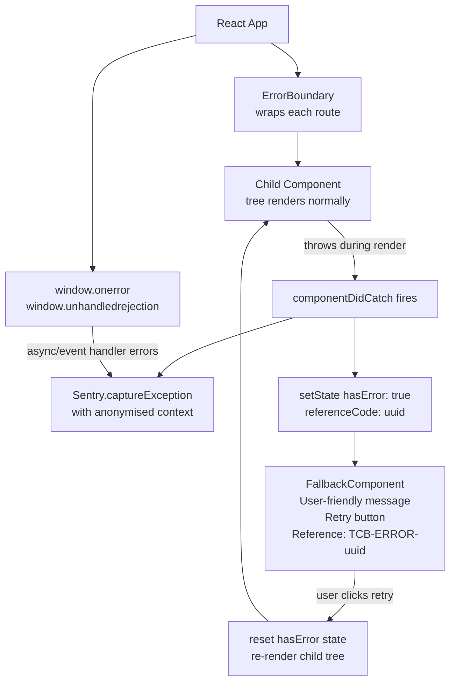

## Implementation Guidelines

### 1. ErrorBoundary Class Component

```typescript
// src/components/ErrorBoundary.tsx
import React, { Component, ErrorInfo, ReactNode } from 'react';
import * as Sentry from '@sentry/react';
import { FallbackComponent } from './FallbackComponent';

interface Props {
  children: ReactNode;
  fallback?: ReactNode;
  onError?: (error: Error, info: ErrorInfo) => void;
  boundaryName?: string;
}

interface State {
  hasError: boolean;
  referenceCode: string;
  error: Error | null;
}

export class ErrorBoundary extends Component<Props, State> {
  constructor(props: Props) {
    super(props);
    this.state = { hasError: false, referenceCode: '', error: null };
  }

  static getDerivedStateFromError(error: Error): Partial<State> {
    return {
      hasError: true,
      error,
      referenceCode: `TCB-${crypto.randomUUID().slice(0, 8).toUpperCase()}`,
    };
  }

  componentDidCatch(error: Error, info: ErrorInfo): void {
    // Sanitise error message — never expose raw stack in production
    const safeMessage = import.meta.env.PROD
      ? 'An unexpected error occurred'
      : error.message;

    Sentry.captureException(error, {
      extra: {
        componentStack: info.componentStack,
        boundaryName: this.props.boundaryName ?? 'unknown',
        referenceCode: this.state.referenceCode,
      },
      // Note: never include PII in Sentry context
    });

    this.props.onError?.(error, info);
  }

  handleRetry = (): void => {
    this.setState({ hasError: false, error: null, referenceCode: '' });
  };

  render(): ReactNode {
    if (this.state.hasError) {
      return this.props.fallback ?? (
        <FallbackComponent
          referenceCode={this.state.referenceCode}
          onRetry={this.handleRetry}
        />
      );
    }
    return this.props.children;
  }
}
```

### 2. FallbackComponent

```typescript
// src/components/FallbackComponent.tsx
import { useTranslation } from 'react-i18next';

interface Props {
  referenceCode: string;
  onRetry?: () => void;
}

export function FallbackComponent({ referenceCode, onRetry }: Props) {
  const { t } = useTranslation('errors');

  return (
    <div role="alert" aria-live="assertive" className="error-fallback">
      <h2>{t('error.title', 'Something went wrong')}</h2>
      <p>{t('error.message', 'We encountered an unexpected error. Please try again.')}</p>
      <p className="reference-code">
        {t('error.reference', 'Reference')}: <code>{referenceCode}</code>
      </p>
      {onRetry && (
        <button
          type="button"
          onClick={onRetry}
          className="btn-retry"
          aria-label={t('error.retry', 'Try again')}
        >
          {t('error.retry', 'Try again')}
        </button>
      )}
      <p className="support-note">
        {t('error.support',
          'If this error persists, please contact support with the reference code above.')}
      </p>
    </div>
  );
}
```

### 3. Global Async Error Handler

```typescript
// src/lib/globalErrorHandlers.ts
import * as Sentry from '@sentry/react';

export function registerGlobalErrorHandlers(): void {
  window.addEventListener('unhandledrejection', (event) => {
    // Prevent default browser error logging (may expose internals)
    event.preventDefault();

    const reason = event.reason instanceof Error
      ? event.reason
      : new Error(String(event.reason));

    Sentry.captureException(reason, {
      extra: { type: 'unhandledrejection' },
    });
  });

  window.onerror = (message, source, line, col, error) => {
    if (error) {
      Sentry.captureException(error, {
        extra: { type: 'window.onerror', source, line, col },
      });
    }
    return true; // Prevent default browser error UI
  };
}
```

### 4. Usage in Routes

```typescript
// src/App.tsx
import { ErrorBoundary } from './components/ErrorBoundary';
import { registerGlobalErrorHandlers } from './lib/globalErrorHandlers';

registerGlobalErrorHandlers();

export function App() {
  return (
    <ErrorBoundary boundaryName="app-root">
      <Router>
        <Route path="/accounts" element={
          <ErrorBoundary boundaryName="accounts-page">
            <AccountsPage />
          </ErrorBoundary>
        } />
        <Route path="/transfer" element={
          <ErrorBoundary boundaryName="transfer-page">
            <TransferPage />
          </ErrorBoundary>
        } />
      </Router>
    </ErrorBoundary>
  );
}
```

### 5. Sentry Initialisation

```typescript
// src/main.tsx
import * as Sentry from '@sentry/react';

Sentry.init({
  dsn: import.meta.env.VITE_SENTRY_DSN,
  environment: import.meta.env.MODE,
  beforeSend(event) {
    // Scrub any accidental PII from error events
    if (event.user) {
      delete event.user.email;
      delete event.user.ip_address;
    }
    return event;
  },
  tracesSampleRate: 0.1,
});
```

## When to Use

- All T0/T1/T2 route-level components in a banking React SPA — every page the customer can navigate to must have an error boundary to prevent full-page crashes.
- High-value widgets that operate independently (balance display, transfer history, notification panel) — wrap each in its own error boundary so one widget crash does not destroy the entire page.
- Any component that fetches data from the backend API — network errors surface as exceptions during render if not handled by React Query's `error` state; error boundaries provide the final catch.

## When Not to Use

- Event handler errors — `onClick`, `onSubmit` — these are not caught by error boundaries; handle them with `try/catch` in the handler or React Query mutation error handling.
- Async errors in `useEffect` — unhandled promise rejections in `useEffect` are not caught by error boundaries; use the `try/catch` pattern inside `useEffect` or the global `unhandledrejection` handler.
- Server-side rendering (Next.js `error.tsx`) — use Next.js's own error component convention instead of React Error Boundaries for SSR error handling.

## Variants

| Variant | Use when | Trade-off |
|---------|----------|-----------|
| Class component ErrorBoundary (this pattern) | Full control over retry logic; custom fallback per boundary; stable API | Requires class component; slightly more boilerplate than hooks |
| `react-error-boundary` library | Prefer hooks API; `useErrorBoundary`; minimal boilerplate | Third-party dependency; slightly less control |
| Sentry `withSentryRouting` + auto error boundaries | Full Sentry integration; performance tracing per route | Vendor dependency; automatic boundaries may catch too broadly |

## NFR Acceptance Criteria

| Metric | Threshold | Measurement |
|--------|-----------|-------------|
| Error boundary coverage | 100% of route-level components | ESLint rule + ArchUnit: assert every `<Route element={...}>` is wrapped in `ErrorBoundary` |
| Uncaught error rate (production) | < 0.01% of sessions | Sentry: `unhandledrejection` events / total sessions < 0.0001 |
| Fallback render time | ≤ 100 ms from exception to fallback visible | React Profiler: time from `getDerivedStateFromError` to fallback DOM paint |
| Retry success rate | ≥ 80% of retries resolve without full reload | Sentry: custom metric `error_boundary.retry_success_rate` |
| PII in error events | 0 occurrences | Sentry `beforeSend` scrubbing; automated scan of Sentry events for NRIC/phone/email patterns |

## Compliance Mapping

| Ring | Regulation | Provision | How this pattern satisfies |
|------|-----------|-----------|---------------------------|
| Ring 0 | OWASP ASVS V7.4 | V7.4.1 — no sensitive information in error messages returned to client | `FallbackComponent` renders only a sanitised message and reference code; raw `error.message` and `componentStack` are sent only to Sentry, not rendered to the user; `import.meta.env.PROD` guard prevents stack trace exposure in production. |
| Ring 1 | — | — | No direct Ring 1 regulatory mapping for frontend error handling. |
| Ring 2 | Decree 13/2023 | §6 — personal data must not be processed beyond the original collection purpose; error logs must not contain personal data ⚠️ (working summary — pending Legal review) | `beforeSend` hook deletes `event.user.email` and `event.user.ip_address` from Sentry events; error logs in Sentry contain only anonymised `userId`; Legal review required to confirm Sentry data processing agreement and data residency satisfy Decree 13/2023 requirements. |

## Cost / FinOps

- Sentry: Developer plan (free) for up to 5 000 errors/month; Team plan ($26/month) for production volumes. At 1M daily active users with 0.01% error rate = 100 errors/day ≈ 3 000/month — Developer plan sufficient.
- `@sentry/react` bundle: ~26 KB gzipped — within the 200 KB FE-001 budget when lazy-loaded after critical path.
- Error boundary overhead: `getDerivedStateFromError` runs only on error — zero performance cost on the happy path.

## Threat Model

- **Stack trace exposure in production (Information Disclosure)**: If the `import.meta.env.PROD` guard is absent or `NODE_ENV` is misconfigured, `error.message` may contain API endpoint paths or internal variable names that aid attackers in reconnaissance. Mitigation: the guard is present in `componentDidCatch`; a CI lint rule checks that `error.message` is not directly rendered in JSX; production builds are validated with `VITE_MODE=production`.
- **Unhandled async rejection leaking PII (Information Disclosure)**: A promise rejection carrying a failed API response body (which may contain account numbers) is caught by `window.unhandledrejection` and sent to Sentry. Mitigation: `beforeSend` strips `user.email` and `user.ip_address`; error event breadcrumbs are sanitised by Sentry's built-in PII scrubber configured with NRIC and account number patterns.

## Runbook Stub

**Alert: `sentry_error_rate_spike > 100 errors/min`**
- p50 baseline: 0–5 errors/min | p99 SLO: < 10 errors/min
- Remediation: (1) Check Sentry for the top error — `boundaryName` in the event extra tells you which component tree is failing. (2) If `accounts-page` boundary is triggering, check the Account API for 5xx responses. (3) If `transfer-page` boundary is triggering, check the Transfer API and recent deployments. (4) If the error is a `ChunkLoadError`, a new deployment may have rotated asset URLs — force a hard reload by incrementing the service worker version.

## Test Strategy Stub

### Unit Tests
- `ErrorBoundary` test: wrap a `ThrowingComponent` that `throw new Error('test')`; assert `FallbackComponent` renders; assert `referenceCode` is a non-empty string. Assert retry: click retry button; assert `ThrowingComponent` is re-rendered (child tree reset).
- `FallbackComponent` test: render with `referenceCode="TCB-ABCD1234"`; assert reference code visible in DOM; assert retry button has correct `aria-label`.

### Integration Tests
- Playwright: navigate to `/accounts`; inject `window.__triggerError = true`; assert fallback message visible; assert no stack trace visible in DOM; click retry; assert accounts page renders normally.
- Sentry mock test: capture Sentry events during a simulated crash; assert `user.email` absent from event; assert `boundaryName` present in `extra`.

### Compliance Tests
- PII scan: inject an error with message containing `0123456789` (fake NRIC); assert Sentry `beforeSend` scrubs it; assert scrubbed event is sent.

## Related Patterns

- [FE-001 Web Performance Budgets](web-performance-budgets.md) — error boundary fallbacks must not cause CLS spikes
- [FE-002 Web Resilience / Offline-First](web-resilience-offline-first.md) — offline errors (network failures during render) should be caught by error boundaries and show offline-specific fallback
- [SEC-012 Tamper-Evident Audit Logging](../../patterns/security/audit-logging-tamper-evident.md) — Sentry error events feed into the centralised audit log for incident investigation

## References

- [React Error Boundaries documentation](https://react.dev/reference/react/Component#catching-rendering-errors-with-an-error-boundary)
- [Sentry React SDK](https://docs.sentry.io/platforms/javascript/guides/react/)
- [OWASP ASVS V7.4 — Error Handling and Logging](https://owasp.org/www-project-application-security-verification-standard/)
- [react-error-boundary library](https://github.com/bvaughn/react-error-boundary)
- Catalog reference: `governance/standards/enterprise-architecture-catalog.md`
- Research notes: `knowledge-base/_research-notes.md`
```

- [ ] **Step 3: Lint Mermaid**

```bash
bash scripts/mermaid-lint-doc.sh knowledge-base/patterns/frontend/web-error-boundary.md
```
Expected: exits 0.

- [ ] **Step 4: Compliance check**

```bash
python3 scripts/check-compliance-rows.py
```
Expected: no FAIL.

- [ ] **Step 5: Commit**

```bash
git add knowledge-base/patterns/frontend/web-error-boundary.md
git commit -m "feat(catalog): FE-005 Web Error Boundary — Wave 5C"
```

---

### Task 24: FE-006 — Web i18n / RTL (FULL WRITE)

**Files:**
- Modify: `knowledge-base/patterns/frontend/web-i18n-rtl.md`

- [ ] **Step 1: Verify stub**

```bash
head -4 knowledge-base/patterns/frontend/web-i18n-rtl.md
```
Expected: `Status: Proposed`

- [ ] **Step 2: Replace the entire file with:**

```markdown
# Web i18n / RTL

Status: Draft | Last Reviewed: 2026-05-16 | Owner: @tech-lead-web
Catalog ID: FE-006 | Radii
Tier Applicability: T0, T1, T2, T3

## Problem Statement

Techcombank's digital banking platform serves Vietnamese-speaking customers and must comply with SBV requirements for Vietnamese-language banking interfaces:

- **Hardcoded UI strings**: currency labels, button text, error messages, and field labels embedded directly in JSX components (`"Confirm Transfer"`, `"Account Balance"`) prevent localisation and violate Decree 13/2023's requirement for Vietnamese-language consumer banking interfaces.
- **Incorrect currency formatting**: `amount.toFixed(2)` displays VND as `₫12,500,000.00` — Vietnamese convention omits decimal places for VND; incorrect formatting erodes customer trust and may constitute a regulatory display violation.
- **Date format mismatch**: ISO 8601 dates (`2026-05-16`) displayed verbatim to Vietnamese customers do not match the local convention (`16/05/2026`); transaction histories with wrong date formats generate customer complaints.
- **Layout breakage on RTL switch**: hardcoded CSS `margin-left`, `padding-right`, and `text-align: left` rules break symmetrically when the language is switched to Arabic or Hebrew for future internationalisation; using CSS logical properties from the start prevents a costly refactor.
- **Missing plural forms for Vietnamese**: i18next defaults to English plural rules (singular/plural); Vietnamese has no grammatical plural — applying English plural logic to Vietnamese strings produces grammatically incorrect translations.

## Context

i18next is the industry-standard i18n library for React applications, with `react-i18next` providing hooks (`useTranslation`) and components (`Trans`). Vietnamese is the primary locale (`vi-VN`); English (`en-US`) is the secondary locale for developer tools and international customers. `Intl.NumberFormat` and `Intl.DateTimeFormat` provide locale-aware formatting without additional dependencies. CSS logical properties (`margin-inline-start`, `padding-block-end`) are used exclusively for directional spacing to support RTL locales without CSS overrides.

## Solution

All UI strings are extracted to JSON namespace files (`locales/vi-VN/common.json`, `locales/en-US/common.json`). The `useTranslation` hook retrieves the appropriate string by key. Currency is formatted with `Intl.NumberFormat('vi-VN', { style: 'currency', currency: 'VND' })`. Dates use `Intl.DateTimeFormat('vi-VN', { dateStyle: 'short' })`. The `<html dir="ltr">` attribute is updated on locale change. CSS uses logical properties throughout.

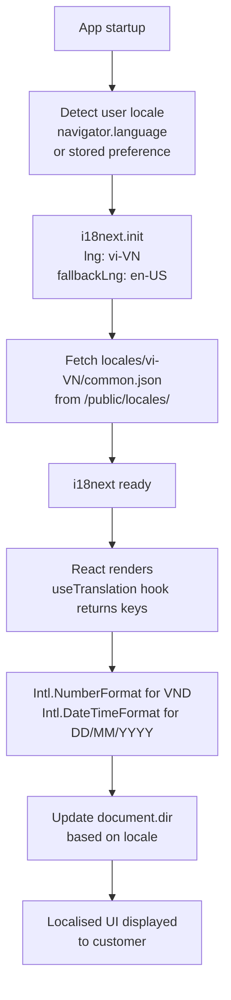

## Implementation Guidelines

### 1. i18next Configuration

```typescript
// src/lib/i18n.ts
import i18next from 'i18next';
import { initReactI18next } from 'react-i18next';
import HttpBackend from 'i18next-http-backend';
import LanguageDetector from 'i18next-browser-languagedetector';

i18next
  .use(HttpBackend)
  .use(LanguageDetector)
  .use(initReactI18next)
  .init({
    fallbackLng: 'en-US',
    supportedLngs: ['vi-VN', 'en-US'],
    defaultNS: 'common',
    ns: ['common', 'errors', 'transfer', 'accounts'],
    backend: {
      loadPath: '/locales/{{lng}}/{{ns}}.json',
    },
    detection: {
      order: ['localStorage', 'navigator'],
      caches: ['localStorage'],
      lookupLocalStorage: 'tcb-locale',
    },
    interpolation: {
      escapeValue: false, // React already escapes
    },
    // Vietnamese has no plural forms
    pluralSeparator: '_',
    nsSeparator: ':',
  });

// Update document direction on language change
i18next.on('languageChanged', (lng) => {
  const dir = i18next.dir(lng);
  document.documentElement.setAttribute('dir', dir);
  document.documentElement.setAttribute('lang', lng);
});

export default i18next;
```

### 2. Locale Files

```json
// public/locales/vi-VN/common.json
{
  "transfer": {
    "title": "Chuyển tiền",
    "confirm": "Xác nhận chuyển tiền",
    "amount_label": "Số tiền",
    "recipient_label": "Người nhận",
    "success": "Giao dịch thành công",
    "error": "Có lỗi xảy ra"
  },
  "accounts": {
    "balance": "Số dư",
    "last_updated": "Cập nhật lúc {{time}}"
  },
  "common": {
    "retry": "Thử lại",
    "cancel": "Hủy",
    "confirm": "Xác nhận",
    "loading": "Đang tải..."
  }
}
```

```json
// public/locales/en-US/common.json
{
  "transfer": {
    "title": "Transfer Money",
    "confirm": "Confirm Transfer",
    "amount_label": "Amount",
    "recipient_label": "Recipient",
    "success": "Transaction successful",
    "error": "An error occurred"
  },
  "accounts": {
    "balance": "Balance",
    "last_updated": "Updated at {{time}}"
  },
  "common": {
    "retry": "Try again",
    "cancel": "Cancel",
    "confirm": "Confirm",
    "loading": "Loading..."
  }
}
```

### 3. Currency and Date Formatting Utilities

```typescript
// src/lib/formatters.ts

/**
 * Format a VND amount for display.
 * Vietnamese convention: no decimal places for VND (₫12,500,000 not ₫12,500,000.00)
 */
export function formatVND(amount: number, locale = 'vi-VN'): string {
  return new Intl.NumberFormat(locale, {
    style: 'currency',
    currency: 'VND',
    minimumFractionDigits: 0,
    maximumFractionDigits: 0,
  }).format(amount);
}

/**
 * Format a date for display.
 * vi-VN: DD/MM/YYYY | en-US: MM/DD/YYYY
 */
export function formatDate(
  date: Date | string,
  locale = 'vi-VN',
  options: Intl.DateTimeFormatOptions = { dateStyle: 'short' }
): string {
  const d = typeof date === 'string' ? new Date(date) : date;
  return new Intl.DateTimeFormat(locale, options).format(d);
}

/**
 * Format a transaction timestamp with time.
 * vi-VN: 16/05/2026, 14:30
 */
export function formatDateTime(date: Date | string, locale = 'vi-VN'): string {
  return formatDate(date, locale, {
    dateStyle: 'short',
    timeStyle: 'short',
  });
}
```

### 4. useTranslation in Components

```typescript
// src/components/TransferConfirmation.tsx
import { useTranslation } from 'react-i18next';
import { formatVND, formatDateTime } from '../lib/formatters';

interface Props {
  amount: number;
  recipient: string;
  scheduledAt: string;
}

export function TransferConfirmation({ amount, recipient, scheduledAt }: Props) {
  const { t, i18n } = useTranslation('common');
  const locale = i18n.language;

  return (
    <section aria-labelledby="transfer-heading">
      <h2 id="transfer-heading">{t('transfer.title')}</h2>
      <dl>
        <dt>{t('transfer.amount_label')}</dt>
        <dd>{formatVND(amount, locale)}</dd>

        <dt>{t('transfer.recipient_label')}</dt>
        <dd>{recipient}</dd>

        <dt>{t('accounts.last_updated')}</dt>
        <dd>{formatDateTime(scheduledAt, locale)}</dd>
      </dl>
      <button type="submit">{t('transfer.confirm')}</button>
    </section>
  );
}
```

### 5. CSS Logical Properties (RTL-Safe Layout)

```css
/* src/styles/components.css */
/* ✅ Use logical properties — works for both LTR and RTL */
.transfer-form {
  padding-inline: 1.5rem;      /* replaces padding-left + padding-right */
  padding-block: 1rem;         /* replaces padding-top + padding-bottom */
  margin-inline-start: auto;   /* replaces margin-left: auto */
  text-align: start;           /* replaces text-align: left */
  border-inline-start: 4px solid var(--color-primary); /* replaces border-left */
}

/* ❌ Avoid physical properties — breaks RTL */
/* padding-left: 1.5rem; */
/* text-align: left; */
/* margin-left: auto; */
```

## When to Use

- All T0/T1/T2/T3 customer-facing banking pages where SBV requires Vietnamese-language UI.
- Any component displaying monetary amounts (account balance, transfer amount, fee display) — `Intl.NumberFormat` ensures correct VND formatting with no decimal places.
- New components from day one — retrofitting i18n into an existing hardcoded-string codebase is significantly more expensive than starting with `useTranslation`.

## When Not to Use

- Pure developer-facing internal tools (CI dashboards, monitoring UIs) with no customer-facing access — English-only is acceptable.
- Error codes and system identifiers that must not be translated (transaction IDs, reference numbers) — pass these through without i18n wrapping.
- Dynamic content loaded from the API (user-entered beneficiary names, transaction remarks) — these are user data, not UI strings; render them as-is from the API response.

## Variants

| Variant | Use when | Trade-off |
|---------|----------|-----------|
| i18next with HTTP backend (this pattern) | React SPA; locale files served as static assets; lazy-loaded per namespace | Requires CDN caching of locale files; initial load fetches locale JSON |
| i18next with bundled translations | Offline-first PWA; locale files must be available without network | Increases initial bundle size by ~50–200 KB per locale; simpler setup |
| React Intl (FormatJS) | Extensive MessageFormat support; complex plural/select rules; CLDR data | Larger bundle; more complex API; better for complex message formatting |

## NFR Acceptance Criteria

| Metric | Threshold | Measurement |
|--------|-----------|-------------|
| Zero hardcoded UI strings | 0 violations | ESLint `i18next/no-literal-string` rule — CI fails on hardcoded strings in JSX |
| VND formatting correctness | `₫12,500,000` (no decimal) for amount 12500000 | Unit test: `formatVND(12500000, 'vi-VN')` asserts `₫12.500.000` or `12.500.000 ₫` (locale-dependent) with 0 decimal places |
| Date format (vi-VN) | `16/05/2026` for date 2026-05-16 | Unit test: `formatDate('2026-05-16', 'vi-VN')` asserts day-first format |
| Locale switch time | ≤ 500 ms from button click to re-render | Playwright: click language toggle; measure time to DOM update |
| RTL layout correctness | No overlapping elements on `dir="rtl"` | Playwright screenshot on Arabic locale; visual regression assert |

## Compliance Mapping

| Ring | Regulation | Provision | How this pattern satisfies |
|------|-----------|-----------|---------------------------|
| Ring 0 | WCAG 2.2 AA | §3.1.1 — language of page: the default human language of each web page can be programmatically determined | `document.documentElement.setAttribute('lang', lng)` is updated on locale change; screen readers detect the language and use appropriate pronunciation rules for Vietnamese text. |
| Ring 1 | — | — | No direct Ring 1 regulatory mapping for i18n infrastructure. |
| Ring 2 | Decree 13/2023 | §4.2 — Vietnamese-language interface required for consumer-facing banking applications; language must match customer's registered preference ⚠️ (working summary — pending Legal review) | Default locale is `vi-VN` for all consumer accounts; locale preference stored in `localStorage` and respected on subsequent visits; Legal review required to confirm that supporting `en-US` as an alternative locale satisfies Decree 13/2023 §4.2 language requirement. |

## Cost / FinOps

- `i18next` + `react-i18next` + plugins: ~12 KB gzipped total — within FE-001 200 KB budget.
- Locale JSON files: ~5–15 KB per locale per namespace; 2 locales × 4 namespaces = ~80 KB total; served as static assets with CDN caching (1-year `Cache-Control: immutable`).
- Translation management: if using a translation platform (Lokalise, Phrase), budget USD 50–150/month for a team of 5; OSS alternative is a shared Google Sheet → JSON export script.
- Cost of retroactive i18n: adding i18n to an existing SPA with 500+ hardcoded strings typically takes 2–3 engineer-sprints; starting with `useTranslation` from day one costs ~10% more time initially but saves the retrofit entirely.

## Threat Model

- **Translation key injection (Tampering)**: If translation keys allow arbitrary HTML and the `escapeValue: false` setting is misused, an attacker who can modify translation files could inject `<script>` tags via translation values. Mitigation: `escapeValue: false` is safe because React's JSX rendering escapes values by default; only `dangerouslySetInnerHTML` bypasses this — its use with translated content is explicitly prohibited by ESLint rule.
- **Locale spoofing to bypass content restrictions (Elevation of Privilege)**: A customer switches locale to `en-US` to access UI paths that are only rendered in the Vietnamese locale (e.g., a Vietnamese-only regulatory disclosure page). Mitigation: regulatory disclosures are backend-rendered with locale validation — the server asserts the customer's locale matches their registered account locale for compliance-sensitive content; client-side locale only affects UI labels, not content access.

## Runbook Stub

**Alert: `i18n_missing_key_rate > 0.1%`** (real-user monitoring via Sentry)
- p50 baseline: 0 missing keys | p99 SLO: 0 missing keys in production
- Remediation: (1) Check which key is missing from Sentry breadcrumbs. (2) Verify locale JSON files were deployed correctly — check CDN for `/locales/vi-VN/common.json` HTTP 200. (3) If a new namespace was added in code but locale files not updated, add the missing key to both `vi-VN` and `en-US` JSON files and deploy.

## Test Strategy Stub

### Unit Tests
- `formatVND` test: `formatVND(12500000, 'vi-VN')` — assert output contains `12.500.000` with no decimal point. `formatVND(0)` — assert `0 ₫` or `₫0`.
- `formatDate` test: `formatDate('2026-05-16', 'vi-VN')` — assert output is `16/05/2026`. `formatDate('2026-05-16', 'en-US')` — assert output is `5/16/2026`.
- i18next translation test: load `vi-VN` locale; assert `t('transfer.confirm')` returns `Xác nhận chuyển tiền`.

### Integration Tests
- Playwright locale switch: render app in `vi-VN`; assert balance label text is in Vietnamese; click language toggle to `en-US`; assert label switches within 500 ms.
- RTL layout: set `dir="rtl"`; screenshot transfer form; assert no text overflow or element overlap.

### Visual Regression Tests
- Snapshot of `TransferConfirmation` in both `vi-VN` and `en-US` with a ₫12,500,000 amount — assert pixel-accurate rendering and no truncation.

## Related Patterns

- [FE-001 Web Performance Budgets](web-performance-budgets.md) — locale JSON files must be within performance budget; lazy-load non-default locales
- [FE-003 Web CSP Hardening](web-csp-hardening.md) — locale files served from CDN must be in `connect-src` allow-list

## References

- [i18next documentation](https://www.i18next.com/)
- [react-i18next documentation](https://react.i18next.com/)
- [MDN Intl.NumberFormat](https://developer.mozilla.org/en-US/docs/Web/JavaScript/Reference/Global_Objects/Intl/NumberFormat)
- [MDN CSS Logical Properties](https://developer.mozilla.org/en-US/docs/Web/CSS/CSS_logical_properties_and_values)
- [WCAG 2.2 — Language of Page (3.1.1)](https://www.w3.org/WAI/WCAG22/Understanding/language-of-page.html)
- Catalog reference: `governance/standards/enterprise-architecture-catalog.md`
- Research notes: `knowledge-base/_research-notes.md`
```

- [ ] **Step 3: Lint Mermaid**

```bash
bash scripts/mermaid-lint-doc.sh knowledge-base/patterns/frontend/web-i18n-rtl.md
```
Expected: exits 0.

- [ ] **Step 4: Compliance check**

```bash
python3 scripts/check-compliance-rows.py
```
Expected: no FAIL.

- [ ] **Step 5: Commit**

```bash
git add knowledge-base/patterns/frontend/web-i18n-rtl.md
git commit -m "feat(catalog): FE-006 Web i18n RTL — Wave 5C"
```

---

### Task 25: Wave 5C Gate — Promote FE-001–006 Proposed → Draft

**Files:**
- Modify: `governance/standards/enterprise-architecture-catalog.md`

- [ ] **Step 1: Mermaid lint all Wave 5C files**

```bash
bash scripts/mermaid-lint-doc.sh knowledge-base/patterns/frontend/web-performance-budgets.md
bash scripts/mermaid-lint-doc.sh knowledge-base/patterns/frontend/web-resilience-offline-first.md
bash scripts/mermaid-lint-doc.sh knowledge-base/patterns/frontend/web-csp-hardening.md
bash scripts/mermaid-lint-doc.sh knowledge-base/patterns/frontend/web-feature-flags.md
bash scripts/mermaid-lint-doc.sh knowledge-base/patterns/frontend/web-error-boundary.md
bash scripts/mermaid-lint-doc.sh knowledge-base/patterns/frontend/web-i18n-rtl.md
```
Expected: all exit 0.

- [ ] **Step 2: Compliance check**

```bash
python3 scripts/check-compliance-rows.py
```
Expected: 0 failures.

- [ ] **Step 3: Dead-link scan**

```bash
for f in \
  knowledge-base/patterns/frontend/web-performance-budgets.md \
  knowledge-base/patterns/frontend/web-resilience-offline-first.md \
  knowledge-base/patterns/frontend/web-csp-hardening.md \
  knowledge-base/patterns/frontend/web-feature-flags.md \
  knowledge-base/patterns/frontend/web-error-boundary.md \
  knowledge-base/patterns/frontend/web-i18n-rtl.md; do
  echo "=== $f ===";
  grep -oh '\[.*\]([^)]*\.md)' "$f" 2>/dev/null \
    | sed 's/.*](\(.*\))/\1/' \
    | grep -v '^http' \
    | while read -r link; do
        dir=$(dirname "$f");
        target=$(realpath "$dir/$link" 2>/dev/null || echo "MISSING");
        if [ ! -f "$target" ]; then echo "BROKEN: $link in $f"; fi;
      done;
done
```
Note: forward references to MOB-001, SEC-012 patterns not yet authored will appear — these are expected and not blocking for Wave 5C.

- [ ] **Step 4: Promote Proposed → Draft in catalog**

In `governance/standards/enterprise-architecture-catalog.md`, change `| Proposed |` to `| Draft |` for FE-001, FE-002, FE-003, FE-004, FE-005, FE-006:

```
Line containing FE-001: change "| Proposed |" to "| Draft |"
Line containing FE-002: change "| Proposed |" to "| Draft |"
Line containing FE-003: change "| Proposed |" to "| Draft |"
Line containing FE-004: change "| Proposed |" to "| Draft |"
Line containing FE-005: change "| Proposed |" to "| Draft |"
Line containing FE-006: change "| Proposed |" to "| Draft |"
```

Use the Edit tool to make these changes, one row at a time. Verify with:

```bash
grep "| FE-00[1-6] |" governance/standards/enterprise-architecture-catalog.md | grep "| Draft |"
```
Expected: 6 lines matching.

- [ ] **Step 5: Commit gate**

```bash
git add governance/standards/enterprise-architecture-catalog.md
git commit -m "feat(catalog): Wave 5C gate — promote FE-001–006 Proposed→Draft"
```

---

## Wave 5D — Compliance (Tasks 26–33)

---

### Task 26: COMP-002 — SBV Circular 09/2020 Deep Dive (FULL REWRITE)

**Files:**
- Modify: `knowledge-base/compliance/sbv-circular-09-2020.md`

- [ ] **Step 1: Check current state**

```bash
wc -l knowledge-base/compliance/sbv-circular-09-2020.md
```
Expected: 126 lines (partial — missing Context, Implementation Guidelines, When to Use, When Not to Use, Variants, Cost/FinOps, Threat Model, Related Patterns).

- [ ] **Step 2: Replace the entire file with:**

```markdown
# SBV Circular 09/2020/TT-NHNN — IT Security in Banking

Status: Draft | Catalog ID: COMP-002 | Owner: @head-of-compliance
Tier Applicability: N/A — applies to all systems

> ⚠️ **Working summary** — verbatim Article text pending authoritative English translation from `@legal-vietnam`. Do NOT use in regulatory submissions without Legal sign-off.

## Problem Statement

- Vietnamese banks face administrative sanctions and SBV license risk if IT security controls do not meet Circular 09/2020/TT-NHNN requirements. Non-compliance findings in SBV on-site inspections (Art. 31–37) carry fines and mandatory remediation timelines.
- Without a structured mapping of each Circular 09 chapter to catalog patterns, engineering teams may deploy systems that fail SBV audits — particularly around MFA enforcement (§III), network segmentation (§IV), and audit log retention (§IV Art. 24–25).
- Incident notification timelines (§IV — 24h for critical outages, 8h for security breaches) are operationally demanding; without pre-wired runbooks and tested contact lists, banks miss the SBV window and compound the violation.
- Log retention requirements (5 years security events, 10 years transaction logs per §IV Art. 25) require durable, tamper-evident storage that standard ELK deployments do not provide by default.
- AES-256 at rest and TLS 1.2+ in transit (§III Art. 9–10) must be verifiably enforced — infrastructure scans must produce audit evidence consumable by SBV inspectors.

## Context

SBV Circular 09/2020/TT-NHNN applies to all SBV-licensed credit institutions, non-bank credit institutions, and payment service providers operating in Vietnam. For Techcombank this covers every production system processing customer financial data or handling payment transactions. All engineering teams building or modifying T0/T1 services must cite the applicable §III or §IV obligations in their DAB submissions. The compliance matrix (COMP-001) is the authoritative cross-reference. Security (§III) obligations are owned by @ciso-delegate; Operational Continuity (§IV) obligations are owned by @sre-lead; the overall compliance posture is owned by @head-of-compliance.

## Solution

Map Circular 09/2020 obligations to catalog patterns. Each chapter's key obligations are addressed by dedicated catalog entries. The compliance matrix (COMP-001) is the single source of truth for the full cross-reference. New catalog entries must self-declare their Circular 09 coverage in their Compliance Mapping section.

```mermaid
flowchart TD
    Reg["SBV Circular 09/2020/TT-NHNN\nIT Security Obligations"]
    CH3["Chapter III — Technical Security\nCrypto · MFA · Access · Vuln Mgmt"]
    CH4["Chapter IV — Operational Continuity\nBCP · Incident Detection · DR Drills\nLog Retention 5yr/10yr"]
    SEC["Security Patterns\nSEC-001 mTLS · SEC-003 Vault\nSEC-004 HSM · SEC-005 BFF"]
    RES["Resilience Patterns\nRES-002 Circuit Breaker\nRES-005 Cell-Based · NFR-001 Tiers"]
    BP["Best Practices\nBP-002 DR Playbook · BP-005 Chaos Eng"]
    AUD["Audit\nSEC-012 Tamper-Evident Logging\n5yr retention S3 WORM"]
    Reg --> CH3 & CH4
    CH3 --> SEC
    CH4 --> RES & BP & AUD
```

## Implementation Guidelines

### 1. OPA Rego — SBV Data Classification Policy

OPA enforces that sensitive data fields (transaction amounts, account balances, biometric tokens) are handled only by services with declared SBV §III compliance context.

```rego
package sbv.circular09

import future.keywords.if

default allow_sensitive_access = false

allow_sensitive_access if {
    input.service.sbv_compliance_declared == true
    input.service.mfa_enforced == true
    input.data.classification in {"sensitive", "financial"}
}

# Reject access if TLS version is below 1.2
deny_unencrypted if {
    input.connection.tls_version < "1.2"
}
```

### 2. Spring Security — MFA Configuration for Internet Banking

§III Art. 12 requires MFA for all internet and mobile banking sessions.

```java
@Configuration
@RequiredArgsConstructor
public class MfaSecurityConfig {

    @Bean
    SecurityFilterChain mfaFilterChain(HttpSecurity http) throws Exception {
        return http
            .sessionManagement(s -> s
                .sessionCreationPolicy(SessionCreationPolicy.IF_REQUIRED)
                .maximumSessions(1))
            .authorizeHttpRequests(auth -> auth
                .requestMatchers("/banking/**").hasRole("MFA_VERIFIED")
                .requestMatchers("/actuator/health").permitAll()
                .anyRequest().authenticated())
            .addFilterBefore(new MfaChallengeFilter(), UsernamePasswordAuthenticationFilter.class)
            .build();
    }
}

@Component
public class MfaChallengeFilter extends OncePerRequestFilter {
    @Override
    protected void doFilterInternal(HttpServletRequest req,
            HttpServletResponse res, FilterChain chain)
            throws ServletException, IOException {
        Authentication auth = SecurityContextHolder.getContext().getAuthentication();
        if (auth != null && auth.isAuthenticated()
                && !auth.getAuthorities().stream()
                    .anyMatch(a -> a.getAuthority().equals("ROLE_MFA_VERIFIED"))) {
            res.sendError(HttpServletResponse.SC_UNAUTHORIZED, "MFA required");
            return;
        }
        chain.doFilter(req, res);
    }
}
```

### 3. HashiCorp Vault — Secret Access Policy (§III Art. 9)

Vault policy restricting CDE secrets to MFA-verified service accounts:

```hcl
# vault-policy-cde.hcl — §III Art. 9 HSM key management
path "secret/data/cde/*" {
  capabilities = ["read"]
  required_parameters = ["mfa_verified"]
}

path "transit/encrypt/aes256-cde" {
  capabilities = ["update"]
}

path "transit/decrypt/aes256-cde" {
  capabilities = ["update"]
  min_wrapping_ttl = "1m"
  max_wrapping_ttl = "15m"
}
```

### 4. Kubernetes NetworkPolicy — Network Segmentation (§IV Art. 21)

```yaml
apiVersion: networking.k8s.io/v1
kind: NetworkPolicy
metadata:
  name: cde-isolation
  namespace: banking-cde
spec:
  podSelector:
    matchLabels:
      tier: cde
  policyTypes: [Ingress, Egress]
  ingress:
  - from:
    - namespaceSelector:
        matchLabels:
          name: banking-api
      podSelector:
        matchLabels:
          role: payment-service
  egress:
  - to:
    - ipBlock:
        cidr: 10.0.0.0/8
    ports:
    - protocol: TCP
      port: 5432
```

## When to Use

- Any DAB submission for a T0 or T1 system that processes customer financial data, payment transactions, or authentication — cite the applicable §III or §IV provisions in the Compliance Mapping section.
- When designing authentication flows for internet or mobile banking — §III Art. 12 mandates MFA; use this document to confirm the exact obligation and point to SEC-005 (BFF + DPoP) for the implementation pattern.
- When defining log retention requirements — §IV Art. 24–25 sets 5-year and 10-year thresholds; use this document to justify the S3 WORM retention policy in SEC-012.

## When Not to Use

- Internal tooling with no customer data and no connection to payment systems — Circular 09 §I Art. 2 scopes to systems processing customer financial data; back-office tooling may use standard security controls without the full §III regime.
- Development and sandbox environments where no real customer data is present — MFA enforcement, HSM key management, and audit log retention apply to production only; sandbox can use simplified controls.
- Third-party SaaS where the vendor is responsible for compliance — confirm the vendor holds SBV approval (or equivalent) and obtain written attestation; do not apply Circular 09 controls to the Techcombank-managed integration layer unless that layer processes raw customer data.

## Variants

| Variant | When to prefer | Trade-off |
|---------|----------------|-----------|
| Full §III + §IV compliance (T0/T1 production) | Any system in scope — internet banking, payment, core banking | Maximum SBV audit readiness; highest operational overhead (HSM, MFA, 5yr log retention) |
| Scoped §III compliance (T2 internal-facing) | Internal APIs serving authenticated employees only; no direct customer data access | Reduced control set (MFA for employees via SSO; AES-256 still required); lower audit scope |
| Vendor attestation model | Third-party SaaS processing customer data (e.g., credit bureau) | Contractual SBV compliance delegation; Techcombank must verify attestation annually |

## NFR Acceptance Criteria

```yaml
nfr_acceptance_criteria:
  id: COMP-002
  pattern: SBV Circular 09/2020

  availability:
    - id: C09-HA-01
      statement: >
        MFA service (OTP provider + Spring Security MFA filter) MUST maintain 99.9% availability.
        MFA unavailability blocks all internet banking logins — zero-downtime deployment required.
      measurement: >
        Load test internet banking login at 500 rps for 30 min; assert 0 HTTP 500 responses;
        assert p99 MFA challenge response < 200ms.

  performance:
    - id: C09-HP-01
      statement: >
        AES-256 encrypt/decrypt overhead MUST NOT exceed 5ms p99 for payloads ≤ 4KB.
        Encryption is inline on the payment hot path.
      measurement: >
        JMH benchmark: AES-256/GCM encrypt 4KB payload × 10k iterations;
        assert p99 < 5ms on JDK 21 with AES-NI hardware acceleration.

  resilience:
    - id: C09-HR-01
      statement: >
        SBV incident notification runbook MUST be tested annually; SBV contact list current
        within 90 days. Breach notification SLA: 8h from discovery.
      measurement: >
        Tabletop exercise results documented in governance/decisions/REVIEW-LOG-*;
        SBV contact list review date < 90 days in runbook header.

  compliance:
    - id: C09-COMP-01
      statement: >
        Audit log retention: security events ≥ 5 years; transaction logs ≥ 10 years.
        Logs must be stored in S3 WORM (Object Lock COMPLIANCE mode).
      measurement: >
        Verify S3 bucket Object Lock configuration: COMPLIANCE mode, retention
        period ≥ 1826 days (5yr). Attempt S3 DeleteObject; assert AccessDenied.
```

## Compliance Mapping

| Ring | Regulation | Provision | How this pattern satisfies |
|------|-----------|-----------|---------------------------|
| Ring 0 | NIST CSF 2.0 | PR.DS-1 (Data at rest protection), PR.AC-7 (Authentication) | §III AES-256 at-rest and MFA requirements align with NIST CSF PR.DS-1 and PR.AC-7; NIST CSF provides the international benchmark that §III codifies for Vietnamese banking. |
| Ring 0 | OWASP ASVS L3 | Authentication (V2), Session Management (V3), Cryptography (V6) | §III Art. 12 MFA requirement and §III Art. 9 cryptographic requirements align with OWASP ASVS Level 3 controls for high-value financial applications. |
| Ring 1 | PCI-DSS v4.0 | §3 (stored data protection), §8 (strong authentication) | PCI-DSS provides international baseline; §III Art. 9–12 exceeds PCI-DSS in requiring MFA for all internet banking (PCI-DSS scopes to CDE only). |
| Ring 2 | SBV Circular 09/2020/TT-NHNN | §III Art. 9–20 (technical security); §IV Art. 21–30 (operational continuity) ⚠️ (working summary — pending Legal review) | This document IS the primary Ring 2 obligation; catalog patterns collectively satisfy each §III and §IV article as mapped in §7 "Key Obligations by Catalog Domain". |

## Cost / FinOps

- **HSM (§III Art. 9)**: AWS CloudHSM cluster (minimum 2 HSMs for HA): ~USD 1.45/hr per HSM × 2 = ~USD 2,530/month. Shared across all T0/T1 services; amortised cost per service is low. Vault-managed keys (SEC-003) reduce HSM calls to key generation only — bulk crypto uses AES-NI in software.
- **MFA OTP service (§III Art. 12)**: AWS SNS for SMS OTP: ~USD 0.006 per SMS. At 50 000 logins/day × 30% SMS OTP = 15 000 SMS/day = ~USD 90/day = ~USD 2,700/month. TOTP (authenticator app) eliminates SMS cost; prefer TOTP for corporate banking.
- **Audit log retention (§IV Art. 24–25)**: S3 WORM 10-year transaction log retention. At 50 GB/year compressed transaction logs × 10 years = 500 GB; at S3 Standard USD 0.023/GB/month = USD 11.50/month. Negligible compared to regulatory fine risk (VND multi-billion per violation under Art. 31–37).
- **Cost of non-compliance**: SBV sanctions under Art. 31–37 include administrative fines and potential operating license conditions. Remediation of a §III MFA finding after inspection typically costs 4–8 engineer-months of emergency work — vastly exceeding the cost of proactive compliance.

## Threat Model

- **Insider threat — audit log deletion (Tampering)**: A privileged DBA deletes audit log entries to conceal an unauthorized transaction. Without tamper-evident logging (§IV Art. 24), the deletion is undetectable and the bank loses SBV audit evidence. Mitigation: SEC-012 (Tamper-Evident Audit Logging) implements HMAC chaining + S3 WORM; PostgreSQL INSERT-only rules prevent DELETE at the engine level; nightly chain verification detects any gap.
- **Network perimeter breach — lateral movement to CDE (Elevation of Privilege)**: An attacker compromising a non-CDE pod uses flat network policy to reach CDE services. §IV Art. 21 requires network segmentation. Mitigation: K8s NetworkPolicy (Task 26 §4 above) allows only declared payment-service pods in banking-api namespace to reach banking-cde; SEC-001 mTLS enforces mutual TLS on all service-to-service calls; Calico network policy auditing logs all NetworkPolicy violations.

## Operational Runbook Stub

**Alert: `sbv_incident_notification_pending`** (T0/T1 system unavailable > 30 min)
- p50 baseline: N/A | SLA: notify SBV within 24h (critical outage) or 8h (security breach)
- Remediation: (1) Confirm incident classification: critical outage vs. security breach. (2) Draft SBV notification using template at `governance/runbooks/sbv-notification-template.md`. (3) @head-of-compliance reviews and submits to SBV Operations desk via prescribed channel. (4) Log submission timestamp in incident ticket. (5) Follow-up written report within 72h.

**Alert: `audit_log_retention_gap`** (S3 WORM export overdue > 1h)
- p50 baseline: export completes within 45 min nightly | p99 SLO: ≤ 60 min
- Remediation: (1) Check export job pod logs: `kubectl logs -l app=audit-export-job`. (2) If S3 unavailable, trigger backup export to secondary region. (3) Notify @ciso-delegate if export gap exceeds 4h — §IV Art. 24 retention may be at risk.

## Test Strategy Stub

### Unit Tests
- `SbvMfaFilterTest`: authenticated user without `ROLE_MFA_VERIFIED` attempts `/banking/transfer` → assert HTTP 401; authenticated + MFA-verified user → assert 200.
- `VaultCdePolicyTest`: mock Vault; request `secret/data/cde/db-password` with `mfa_verified=false` → assert `VaultAccessDeniedException`.

### Integration Tests
- Spring Boot Test with Testcontainers (PostgreSQL + Redis): complete internet banking login flow with TOTP second factor → assert session receives `ROLE_MFA_VERIFIED`; attempt login with wrong OTP → assert HTTP 401 and audit log entry created.
- K8s NetworkPolicy test (kind cluster): deploy test pod in non-permitted namespace; attempt TCP connection to CDE pod → assert connection refused.

### Compliance Tests
- Annual: `python3 scripts/check-compliance-rows.py` — assert all T0/T1 documents have `SBV Circular 09/2020` in their Compliance Mapping Ring 2 row.
- Annual DR drill: fail over T0 payment gateway to secondary region; measure RTO achieved vs. 5-minute target; document results in `governance/decisions/REVIEW-LOG-DR-$(date +%Y)`.
- Quarterly: SSL Labs scan on all internet-facing endpoints; assert grade A+ (TLS 1.3 preferred, TLS 1.2 minimum, no SSLv3/TLS 1.0/1.1).

## Related Patterns

- [COMP-001 Compliance Mapping Matrix](compliance-mapping-matrix.md) — authoritative cross-reference of all Circular 09 obligations
- [SEC-001 mTLS Service Mesh](../patterns/security/mtls-service-mesh.md) — satisfies §IV network segmentation and SEC-012 transport-level audit
- [SEC-003 Vault Secret Management](../patterns/security/vault-secret-management.md) — satisfies §III Art. 9 HSM key management
- [SEC-012 Tamper-Evident Audit Logging](../patterns/security/audit-logging-tamper-evident.md) — satisfies §IV Art. 24–25 log retention and integrity
- [NFR-001 Service Tiering RTO/RPO](../nfr/service-tiering-rto-rpo.md) — encodes §IV operational continuity targets

## References

- SBV Circular 09/2020/TT-NHNN (Vietnamese): thuvienphapluat.vn (URL pending librarian fetch)
- Research notes: `knowledge-base/_research-notes.md#state-bank-of-vietnam--circular-092020tt-nhnn`
- Compliance matrix: `knowledge-base/compliance/compliance-mapping-matrix.md` (COMP-001)
- Catalog reference: `governance/standards/enterprise-architecture-catalog.md`
```

- [ ] **Step 3: Lint Mermaid**

```bash
bash scripts/mermaid-lint-doc.sh knowledge-base/compliance/sbv-circular-09-2020.md
```
Expected: exits 0.

- [ ] **Step 4: Compliance check**

```bash
python3 scripts/check-compliance-rows.py
```
Expected: no FAIL.

- [ ] **Step 5: Commit**

```bash
git add knowledge-base/compliance/sbv-circular-09-2020.md
git commit -m "feat(catalog): COMP-002 SBV Circular 09/2020 Deep Dive — Wave 5D"
```

---

### Task 27: COMP-003 — Decree 13/2023 Personal Data Deep Dive (FULL REWRITE)

**Files:**
- Modify: `knowledge-base/compliance/decree-13-2023-personal-data.md`

- [ ] **Step 1: Check current state**

```bash
wc -l knowledge-base/compliance/decree-13-2023-personal-data.md
```
Expected: 138 lines (partial — missing Context, Implementation Guidelines, When to Use, When Not to Use, Variants, Cost/FinOps, Threat Model, Related Patterns).

- [ ] **Step 2: Replace the entire file with:**

```markdown
# Decree 13/2023/ND-CP — Personal Data Protection (VPDP)

Status: Draft | Catalog ID: COMP-003 | Owner: @head-of-compliance
Tier Applicability: N/A — applies to all systems processing Vietnamese personal data

> ⚠️ **Working summary** — verbatim Article text pending authoritative English translation from `@legal-vietnam`. Do NOT use in regulatory submissions without Legal sign-off.

## Problem Statement

- Decree 13/2023/ND-CP (effective 2023-07-01) classifies biometric data, financial standing, and location data as **sensitive personal data** requiring explicit written consent, DPIA filing with MPS A05 Cybersecurity Department, and storage within Vietnam. Without these controls, every digital banking feature using biometrics or financial data is non-compliant by default.
- Data subject rights under Art. 11 (access, portability, erasure) require a self-service portal backed by coordinated purge operations across core banking (T24), analytics data lake, and backup systems — capabilities that do not exist by default in most banking architectures.
- Cross-border data transfer (Art. 13) requires an Overseas Transfer Impact Assessment dossier filed with MPS A05 within 60 days of transfer commencement. Failure to file before transferring data to international analytics or cloud regions is an immediate violation.
- Data breach notification to MPS A05 within 72 hours (Art. 26) requires pre-wired runbooks, confirmed contact lists, and incident classification logic — missing any of these makes the 72-hour SLA operationally impossible.
- Administrative penalties under Art. 38–41 reach VND 5 billion (~USD 200k) per violation; criminal liability (up to 7 years imprisonment) applies to wilful mass breaches. This creates material compliance risk for any feature that processes sensitive personal data without the required controls.

## Context

Decree 13/2023 applies to all organisations processing Vietnamese individuals' personal data, regardless of where the processing occurs (Art. 2). For Techcombank this covers: mobile banking biometric enrolment (facial recognition, fingerprint); KYC onboarding (CCCD face-match, biometric templates); open banking APIs sending financial data to third-party fintechs; analytics pipelines that include customer transaction history; and any cloud data transfers to Singapore or other international regions. @data-privacy-officer owns the DPIA registry and data subject rights portal. @head-of-compliance owns regulatory submission (A05 notifications). @ciso-delegate owns breach detection and notification runbooks.

## Solution

Apply data-classification-first design: classify every data element as basic or sensitive personal data per Decree 13 Art. 2–9; apply the corresponding controls (consent capture, DPIA, Vietnamese vault, DSR API) before feature launch. The architecture catalog provides the implementation patterns; this document is the regulatory mapping that tells engineers which pattern to use for which obligation.

```mermaid
sequenceDiagram
    autonumber
    participant Customer
    participant DSR_API as DSR API<br/>(Spring Boot)
    participant ConsentSvc as ConsentService
    participant DataRegistry as DataRegistry<br/>(PostgreSQL)
    participant T24 as T24 Core Banking
    participant Analytics as Analytics<br/>Data Lake

    Customer->>DSR_API: POST /dsr/erasure {customerId, reason}
    DSR_API->>ConsentSvc: validateIdentity(customerId)
    ConsentSvc-->>DSR_API: identity verified
    DSR_API->>DataRegistry: createDSR(type=ERASURE, customerId)
    DataRegistry-->>DSR_API: dsrId=DSR-2026-0042

    DSR_API->>T24: scheduleAnonymisation(customerId)
    DSR_API->>Analytics: schedulePurge(customerId, retentionOverride=true)

    Note over DSR_API,Analytics: Processing within 30 days (Art. 11.2)

    T24-->>DataRegistry: anonymisationComplete(dsrId)
    Analytics-->>DataRegistry: purgeComplete(dsrId)
    DataRegistry-->>DSR_API: DSR fulfilled
    DSR_API-->>Customer: 200 OK — erasure complete
```

## Implementation Guidelines

### 1. DSR REST Endpoint (Spring Boot)

```java
@RestController
@RequestMapping("/dsr")
@RequiredArgsConstructor
public class DataSubjectRightsController {

    private final ConsentService consentService;
    private final DsrRepository dsrRepository;
    private final PurgeOrchestrator purgeOrchestrator;

    @PostMapping("/erasure")
    public ResponseEntity<DsrResponse> requestErasure(
            @RequestBody DsrErasureRequest req,
            @AuthenticationPrincipal Jwt jwt) {

        consentService.verifyIdentity(req.customerId(), jwt.getSubject());

        DsrRecord dsr = dsrRepository.create(DsrRecord.builder()
            .type(DsrType.ERASURE)
            .customerId(req.customerId())
            .reason(req.reason())
            .requestedAt(Instant.now())
            .deadlineAt(Instant.now().plus(30, ChronoUnit.DAYS))
            .build());

        purgeOrchestrator.scheduleErasure(dsr);
        return ResponseEntity.accepted()
            .body(new DsrResponse(dsr.id(), dsr.deadlineAt()));
    }
}
```

### 2. Consent Table DDL (PostgreSQL)

```sql
CREATE TABLE consent_records (
    id              UUID PRIMARY KEY DEFAULT gen_random_uuid(),
    customer_id     VARCHAR(50)  NOT NULL,
    purpose         VARCHAR(100) NOT NULL,   -- 'BIOMETRIC_LOGIN', 'CREDIT_SCORING', etc.
    data_category   VARCHAR(50)  NOT NULL,   -- 'SENSITIVE' or 'BASIC'
    consent_text    TEXT         NOT NULL,   -- exact text shown to user (Art. 8)
    consented_at    TIMESTAMPTZ  NOT NULL,
    withdrawn_at    TIMESTAMPTZ,
    consent_medium  VARCHAR(20)  NOT NULL,   -- 'WRITTEN', 'CHECKBOX', 'SIGNED_FORM'
    CONSTRAINT require_written_for_sensitive
        CHECK (data_category != 'SENSITIVE' OR consent_medium = 'WRITTEN')
);
CREATE INDEX idx_consent_customer ON consent_records(customer_id);
CREATE INDEX idx_consent_purpose ON consent_records(customer_id, purpose)
    WHERE withdrawn_at IS NULL;
```

### 3. OPA Purpose-Limitation Policy (Art. 8 — Consent per Purpose)

```rego
package decree13.purpose_limitation

import future.keywords.if

default allow = false

allow if {
    consent := data.consent_records[_]
    consent.customer_id == input.customer_id
    consent.purpose == input.requested_purpose
    consent.withdrawn_at == null
    input.processing_purpose == consent.purpose
}

deny_cross_border if {
    input.destination_country != "Vietnam"
    not data.a05_dossier_filed[input.transfer_id]
}
```

### 4. Data Portability Export Job

```java
@Component
@RequiredArgsConstructor
public class DataPortabilityExporter {

    private final JdbcTemplate jdbc;

    public Path exportCustomerData(String customerId) throws IOException {
        Path exportFile = Files.createTempFile("dsr-export-" + customerId, ".json");

        List<Map<String, Object>> transactions = jdbc.queryForList(
            "SELECT * FROM transactions WHERE customer_id = ? ORDER BY posted_at DESC",
            customerId);

        List<Map<String, Object>> accounts = jdbc.queryForList(
            "SELECT account_number, account_type, opened_date FROM accounts WHERE customer_id = ?",
            customerId);

        Map<String, Object> export = Map.of(
            "customerId", customerId,
            "exportDate", Instant.now().toString(),
            "transactions", transactions,
            "accounts", accounts
        );
        Files.writeString(exportFile, JsonUtil.serialize(export));
        return exportFile;
    }
}
```

## When to Use

- Any feature processing sensitive personal data (biometric auth, credit scoring, fraud ML, location-based services) — file DPIA with MPS A05 before launch (Art. 28); obtain written consent from each customer before enabling the feature.
- Designing data flows that cross Vietnamese borders (international analytics, Singapore cloud region, global card network) — file Overseas Transfer Impact Assessment with MPS A05 within 60 days of transfer commencement (Art. 13).
- Implementing customer-facing self-service for data rights — Art. 11 mandates access, portability, correction, and erasure capabilities; use the DSR API pattern (§4 above) as the implementation basis.

## When Not to Use

- Anonymised or pseudonymised data where re-identification is technically infeasible — Decree 13 applies to personal data; properly anonymised aggregates (e.g., branch-level transaction counts with no customer identifiers) are out of scope.
- Employee data within Techcombank's internal HR systems — Decree 13 applies to all organisations processing Vietnamese individuals' data, but HR data is subject to the Labour Code in addition to Decree 13; consult @legal-vietnam for the boundary.
- Fully automated processing with no Vietnamese data subject — data about non-Vietnamese individuals processed entirely outside Vietnam is out of scope for Decree 13, though GDPR may apply for EU citizens.

## Variants

| Variant | When to prefer | Trade-off |
|---------|----------------|-----------|
| Full VPDP compliance (T0/T1 customer-facing) | Any feature processing sensitive personal data — biometrics, financial standing, location | Maximum regulatory protection; requires DPIA, written consent capture, DSR portal, A05 notifications |
| Scoped basic-data compliance (T2 internal analytics) | Internal analytics using pseudonymised data only; no sensitive personal data | Simplified controls (no DPIA, standard consent); must verify pseudonymisation is irreversible |
| Consent delegation to vendor (Open Banking) | Third-party fintech accessing Techcombank customer data via open banking APIs | Techcombank retains responsibility; fintech must hold independent consent and have DPIA on file; contractual obligation required |

## NFR Acceptance Criteria

```yaml
nfr_acceptance_criteria:
  id: COMP-003
  pattern: Decree 13/2023 Personal Data Protection

  performance:
    - id: D13-HP-01
      statement: >
        DSR erasure request MUST be fulfilled within 30 calendar days (Art. 11.2).
        System must track deadline and alert if approaching.
      measurement: >
        Integration test: submit erasure request; mock T24 + Analytics completing in 25 days;
        assert DSR record shows fulfilled_at ≤ deadline_at.

  resilience:
    - id: D13-HR-01
      statement: >
        Breach notification runbook MUST complete MPS A05 notification within 72h of discovery (Art. 26).
        Runbook contact list MUST be verified within 90 days.
      measurement: >
        Tabletop exercise: simulate data breach at T=0; assert draft notification ready by T+4h;
        assert submitted to A05 by T+72h. Contact list review date in runbook < 90 days.

  compliance:
    - id: D13-COMP-01
      statement: >
        Written consent record MUST exist for every active biometric feature.
        Consent withdrawal MUST disable feature within 1 business day.
      measurement: >
        Integration test: enrol biometric without consent record → assert feature blocked.
        Withdraw consent → assert biometric login returns HTTP 403 within 24h.
```

## Compliance Mapping

| Ring | Regulation | Provision | How this pattern satisfies |
|------|-----------|-----------|---------------------------|
| Ring 0 | GDPR (EU, as reference standard) | Art. 9 (special categories), Art. 17 (right to erasure), Art. 83 (penalties) | Decree 13 is modelled on GDPR; the DSR API (§4) satisfies both GDPR Art. 17 and Decree 13 Art. 11; consent table (§2) satisfies both GDPR Art. 7 and Decree 13 Art. 8. |
| Ring 1 | SWIFT CSP 2024 | §5 — customer data handling and integrity controls | SWIFT CSP §5 aligns with Decree 13 Art. 8 consent requirements for financial data processed via SWIFT messages; consent must be captured before account data is included in SWIFT MT/MX messages. |
| Ring 2 | Decree 13/2023/ND-CP | Art. 8 (consent), Art. 11 (data subject rights), Art. 13 (cross-border), Art. 26 (breach notification), Art. 28 (DPIA) ⚠️ (working summary — pending Legal review) | This document IS the primary Ring 2 obligation for personal data processing. DSR API (§1), consent table (§2), OPA purpose-limitation (§3), and portability exporter (§4) collectively implement Arts 8, 11, and 13. Breach notification runbook implements Art. 26. DPIA registry implements Art. 28. |

## Cost / FinOps

- **DSR Portal**: 2 Spring Boot replicas + PostgreSQL for consent and DSR tables. Marginal cost: ~USD 50/month additional compute. DSR volume expected <500/month at launch; scales linearly.
- **DPIA process**: Each DPIA requires 2–4 days of @data-privacy-officer time. For 5 new sensitive-data features per year at 3 days each = 15 person-days/year. Budget for this in the compliance operating plan.
- **A05 Overseas Transfer dossier**: One-time legal effort per data flow (~3 days @legal-vietnam). Update required within 10 days of material change to the transfer (Art. 13). Budget 2 dossier updates/year.
- **Cost of non-compliance**: Art. 38–41 administrative fines up to VND 5 billion (~USD 200k) per violation. Criminal liability (up to 7 years imprisonment) for wilful mass breaches. A single undisclosed breach involving 100k+ customers could trigger criminal investigation. The DSR portal and breach runbook cost <USD 1k/year to operate.

## Threat Model

- **Consent bypass — biometric feature enabled without written consent (Repudiation)**: Engineer deploys biometric login feature without triggering the consent capture flow; millions of customers enrolled without consent. Mitigation: `ConsentService.verifyIdentity()` is called in the DSR API before any biometric operation; ArchUnit test asserts all `@BiometricOperation` annotated methods call `consentService.verifyWrittenConsent()`; CI pipeline fails on violation.
- **Cross-border transfer without A05 dossier (Information Disclosure / Regulatory)**: Analytics pipeline sends customer transaction data to Singapore region without filing the Overseas Transfer Impact Assessment with A05 first. Mitigation: OPA `deny_cross_border` policy (§3) blocks data pipeline writes to non-Vietnam destinations if `a05_dossier_filed[transfer_id]` is absent; data pipeline CI gate checks OPA policy before deploying to international regions.

## Operational Runbook Stub

**Alert: `dsr_deadline_approaching`** (DSR fulfillment deadline within 5 business days)
- p50 baseline: DSR fulfilled within 20 days | SLA: ≤30 days (Art. 11.2)
- Remediation: (1) Check DSR record status in compliance portal. (2) Contact T24 team and analytics team to confirm purge job scheduled. (3) If T24 or analytics are blocked, escalate to @data-privacy-officer for manual coordination. (4) If deadline will be missed: contact @head-of-compliance; assess whether Art. 11.3 extension (additional 30 days with notice) applies.

**Alert: `data_breach_detected`** (SIEM breach indicator triggered)
- SLA: notify MPS A05 within 72h from discovery
- Remediation: (1) Classify breach scope: data categories affected, number of data subjects, likely consequences. (2) Draft A05 notification using template at `governance/runbooks/decree13-a05-breach-template.md`. (3) @head-of-compliance reviews and submits. (4) Retain evidence for 5 years (Art. 28). (5) Update DPIA for affected processing activities.

## Test Strategy Stub

### Unit Tests
- `ConsentServiceTest`: `verifyWrittenConsent(customerId, BIOMETRIC_LOGIN)` with no consent record → assert `ConsentRequiredException`. With withdrawn consent → assert `ConsentWithdrawnException`. With valid written consent → assert passes.
- `OpaPurposeLimitationTest`: request data for purpose not in consent record → assert OPA returns `allow=false`. Request with matching purpose and active consent → assert `allow=true`.

### Integration Tests
- Spring Boot Test with Testcontainers (PostgreSQL): submit DSR erasure request → assert DsrRecord created with `deadline_at = now() + 30 days`; assert purge jobs scheduled in T24 and Analytics; assert DSR fulfilled within mock 25-day window.
- Consent table constraint: attempt INSERT with `data_category=SENSITIVE` and `consent_medium=CHECKBOX` → assert constraint violation.

### Compliance Tests
- Annual DPIA review: @data-privacy-officer validates all DPIAs in registry have `review_date < 1 year`; update DPIA records for all active sensitive-data processing features.
- A05 dossier audit: quarterly review of cross-border data flow registry; assert each active international transfer has dossier reference number and filing date < 60 days after transfer commencement.
- Penetration test (annual): after DSR erasure, penetration tester checks all storage systems (T24, analytics, backups, logs) for residual PII matching the erased customer; assert zero matches.

## Related Patterns

- [COMP-001 Compliance Mapping Matrix](compliance-mapping-matrix.md) — cross-reference of all Decree 13 data category obligations
- [SEC-008 Data Masking](../patterns/security/data-masking.md) — masks PII in logs and non-production environments per Art. 8 data minimisation
- [SEC-013 PII Tokenization](../patterns/security/pii-tokenization-format-preserving.md) — tokenizes sensitive personal data reducing Decree 13 scope in downstream systems
- [SEC-009 Fraud Signal Collection](../patterns/security/fraud-signal-collection.md) — behavioral data (device hash, IP hash) is personal data under Art. 3; this pattern ensures hash-only storage satisfies Decree 13
- [PRIN-007 Data Residency](../principles/data-residency.md) — enforces Vietnamese vault storage for sensitive personal data per Art. 9 + 13

## References

- Decree 13/2023/ND-CP (Vietnamese): thuvienphapluat.vn (URL pending librarian fetch)
- Research notes: `knowledge-base/_research-notes.md#decree-132023nd-cp--personal-data-protection-decree`
- MPS A05 Cybersecurity Department: contact details at `governance/runbooks/sbv-a05-contacts.md` (internal)
- Catalog reference: `governance/standards/enterprise-architecture-catalog.md`
```

- [ ] **Step 3: Lint Mermaid**

```bash
bash scripts/mermaid-lint-doc.sh knowledge-base/compliance/decree-13-2023-personal-data.md
```
Expected: exits 0.

- [ ] **Step 4: Compliance check**

```bash
python3 scripts/check-compliance-rows.py
```
Expected: no FAIL.

- [ ] **Step 5: Commit**

```bash
git add knowledge-base/compliance/decree-13-2023-personal-data.md
git commit -m "feat(catalog): COMP-003 Decree 13/2023 Personal Data Deep Dive — Wave 5D"
```

---

### Task 28: COMP-004 — PCI-DSS 4.0 Deep Dive (FULL WRITE)

**Files:**
- Modify: `knowledge-base/compliance/pci-dss-4-0.md`

- [ ] **Step 1: Verify stub**

```bash
head -4 knowledge-base/compliance/pci-dss-4-0.md
```
Expected: `Status: Proposed`

- [ ] **Step 2: Replace the entire file with:**

```markdown
# PCI-DSS v4.0 — Payment Card Industry Data Security Standard

Status: Draft | Catalog ID: COMP-004 | Owner: @ciso-delegate
Tier Applicability: N/A — applies to all systems in PCI scope (CDE + connected systems)

## Problem Statement

- PCI-DSS v4.0 (effective March 2024) requires formal CDE scope definition and annual Qualified Security Assessor (QSA) or self-assessment; without systematic tokenization (§3) and network segmentation, Techcombank's CDE scope encompasses dozens of services — each subject to the full 12-requirement audit regime.
- §6 (secure software) requires a formal Secure SDLC with documented OWASP vulnerability remediation timelines (critical: ≤30 days, high: ≤60 days); without pipeline enforcement, vulnerabilities persist through to production.
- §8 MFA for all non-console administrative access to CDE — engineers SSHing to CDE hosts or accessing CDE databases without MFA is a direct violation, typically found in first QSA audit pass.
- §10 (audit logging) requires audit logs to be protected from modification, sent to a centralized log server, and retained for 12 months with 3 months immediately available; organizations using mutable ELK stacks fail this requirement.
- A PCI-DSS Level 1 non-compliance finding (serving >6M card transactions/year) triggers formal QSA remediation assessment, card scheme notification, and potential fines from Visa/Mastercard processors — material financial and reputational risk.

## Context

Techcombank's PCI scope covers card issuance (debit/credit), NAPAS clearing, and card authorization (3DS2 — REF-004). The CDE is bounded by: the card authorization service, HSM cluster (SEC-004), tokenization vault (SEC-013), and NAPAS connectivity (REF-002). All other systems interact with the CDE only via tokenized card data (truncated PAN or token). @ciso-delegate owns CDE scope definition and QSA engagement. @tech-lead-backend owns developer security training (§12.6) and secure SDLC (§6). Quarterly ASV scans are owned by @devsecops-lead.

## Solution

Minimize CDE scope through tokenization: replace PAN in all non-CDE systems with SEC-013 format-preserving tokens. Apply the full 12-requirement PCI-DSS control set only within the bounded CDE namespace. Use Vault dynamic credentials (SEC-003) to eliminate long-lived CDE database passwords. Automate quarterly ASV scans via GitHub Actions.

```mermaid
flowchart TD
    CustomerCard["Customer Card\nPAN: 4111-1111-1111-1111"]
    TokenVault["Tokenization Vault\nSEC-013 FPE Token\n(reduces scope)"]
    CDE["CDE Boundary\n(Kubernetes namespace: banking-cde)\n- Card Auth Service\n- HSM SEC-004\n- NAPAS Connector"]
    NonCDE["Non-CDE Systems\nToken only: 4111-XXXX-XXXX-1111\n(out of PCI scope)"]
    Controls["PCI Controls Applied\nMFA §8 · Vault Creds §2\nASV Scan §11 · Audit Log §10\nmTLS §4 · NetworkPolicy §1"]

    CustomerCard --> TokenVault
    TokenVault --> CDE
    TokenVault --> NonCDE
    CDE --> Controls
```

## Implementation Guidelines

### 1. Spring Security — MFA for CDE Administrative Access (§8)

```java
@Configuration
public class CdeMfaConfig {

    @Bean
    @ConditionalOnProperty("pci.cde.mfa.required")
    SecurityFilterChain cdeAdminChain(HttpSecurity http) throws Exception {
        return http
            .securityMatcher("/admin/cde/**")
            .authorizeHttpRequests(auth -> auth
                .anyRequest().hasRole("CDE_ADMIN_MFA_VERIFIED"))
            .mvcMatcher("/admin/cde/**")
            .addFilterBefore(new CdeMfaEnforcementFilter(),
                UsernamePasswordAuthenticationFilter.class)
            .build();
    }
}
```

### 2. Kubernetes NetworkPolicy — CDE Isolation (§1)

```yaml
apiVersion: networking.k8s.io/v1
kind: NetworkPolicy
metadata:
  name: cde-strict-isolation
  namespace: banking-cde
spec:
  podSelector: {}
  policyTypes: [Ingress, Egress]
  ingress:
  - from:
    - namespaceSelector:
        matchLabels:
          pci-connected: "true"
    ports:
    - protocol: TCP
      port: 8443
  egress:
  - to:
    - ipBlock:
        cidr: 10.100.0.0/16  # HSM subnet only
    ports:
    - protocol: TCP
      port: 1792  # CloudHSM
  - to:
    - ipBlock:
        cidr: 10.200.0.0/16  # NAPAS subnet
    ports:
    - protocol: TCP
      port: 443
```

### 3. Vault Dynamic Credentials for CDE Database (§2)

Eliminate long-lived CDE database passwords using Vault database secret engine:

```java
@Configuration
public class VaultCdeDatabaseConfig {

    @Bean
    DataSource cdeDatasource(VaultTemplate vault) {
        VaultResponse creds = vault.read("database/creds/cde-postgres-role");
        String username = (String) creds.getData().get("username");
        String password = (String) creds.getData().get("password");

        return DataSourceBuilder.create()
            .url("jdbc:postgresql://cde-postgres:5432/cde_db?sslmode=verify-full")
            .username(username)
            .password(password)
            .build();
    }
}
```

### 4. GitHub Actions — Quarterly ASV Scan (§11)

```yaml
name: PCI ASV Quarterly Scan
on:
  schedule:
    - cron: '0 2 1 */3 *'  # Quarterly at 02:00 on the 1st
  workflow_dispatch:

jobs:
  asv-scan:
    runs-on: ubuntu-latest
    steps:
    - name: Run Nessus ASV Scan on CDE IPs
      run: |
        curl -X POST "https://asv.scanner.internal/v1/scans" \
          -H "Authorization: Bearer ${{ secrets.ASV_API_TOKEN }}" \
          -d '{"target_ips": ${{ vars.CDE_IP_LIST }}, "scan_profile": "pci_dss_v4"}'
    - name: Assert Zero Critical/High Findings
      run: |
        RESULT=$(curl "https://asv.scanner.internal/v1/scans/latest/results")
        CRITICAL=$(echo $RESULT | jq '.findings[] | select(.severity == "CRITICAL") | length')
        HIGH=$(echo $RESULT | jq '.findings[] | select(.severity == "HIGH") | length')
        if [ "$CRITICAL" -gt 0 ] || [ "$HIGH" -gt 0 ]; then
          echo "FAIL: $CRITICAL critical, $HIGH high findings — PCI §11 violated"
          exit 1
        fi
```

## When to Use

- Any system that stores, processes, or transmits cardholder data (CHD) — card authorization, NAPAS clearing, card issuance, chargeback processing. These are in-scope for the full 12-requirement PCI-DSS control set.
- When designing integration points between CDE and non-CDE systems — use SEC-013 tokenization at the CDE boundary so that downstream systems receive only tokens (not PAN), removing them from PCI scope entirely.
- When planning a QSA engagement or self-assessment questionnaire (SAQ) — use the CDE scope diagram (§4 Solution above) and §10 audit log evidence from SEC-012 as the primary QSA artifacts.

## When Not to Use

- Back-office systems that never handle raw PAN or CHD and only receive SEC-013 tokens — they are out of PCI scope; apply standard corporate security controls rather than the full PCI-DSS regime.
- Tokenization system design itself — the token vault (SEC-013) is in CDE scope but uses FPE rather than vault isolation; refer to SEC-013 for the tokenization implementation and this document for the CDE governance context.
- Environments outside card payment processing (NAPAS fund transfers using account numbers, not card PANs) — PCI-DSS scopes to card data specifically; NAPAS account-based transfers are governed by SBV Circular 09/2020 instead.

## Variants

| Variant | When to prefer | Trade-off |
|---------|----------------|-----------|
| Level 1 — QSA on-site assessment | >6M Visa/MC transactions/year (Techcombank's current volume) | Highest assurance; mandatory; 12-month cycle; significant QSA cost (~USD 50–150k/engagement) |
| Level 2 — SAQ D (self-assessment) | 1M–6M transactions/year; full scope merchant | Reduced cost; self-assessed; QSA not required; higher internal effort to maintain evidence |
| SAQ A (card-not-present, fully tokenized) | Merchant with no CDE; all card processing outsourced to PCI-compliant PSP; token only in merchant systems | Minimal scope (22 requirements); fastest path to compliance for teams with zero CHD storage |

## NFR Acceptance Criteria

```yaml
nfr_acceptance_criteria:
  id: COMP-004
  pattern: PCI-DSS v4.0

  availability:
    - id: PCI-HA-01
      statement: >
        CDE card authorization service MUST maintain 99.99% availability (T0 SLO).
        PCI §12.3.2 requires impact tolerance documentation for critical operations.
      measurement: >
        Load test at 500 TPS for 30 min; assert p99 < 200ms; assert 0% error rate.
        Chaos test: kill CDE pod; assert circuit breaker (RES-002) activates within 3s.

  compliance:
    - id: PCI-COMP-01
      statement: >
        Zero critical or high findings in quarterly ASV scan (§11.3.2).
        Critical vulnerabilities MUST be remediated within 30 days; high within 60 days.
      measurement: >
        GitHub Actions ASV scan gate; pipeline fails on any critical/high finding.
        Vulnerability tracking ticket created within 24h of finding; deadline enforced.

    - id: PCI-COMP-02
      statement: >
        Audit logs must be retained 12 months with 3 months immediately available (§10.7).
        Logs must be protected from unauthorized modification.
      measurement: >
        S3 WORM Object Lock 12-month retention verified. SEC-012 chain verification
        runs nightly; assert 0 chain breaks. Attempt S3 Delete → assert AccessDenied.
```

## Compliance Mapping

| Ring | Regulation | Provision | How this pattern satisfies |
|------|-----------|-----------|---------------------------|
| Ring 0 | OWASP Top 10 | A02 (Cryptographic Failures), A05 (Security Misconfiguration), A07 (Authentication Failures) | PCI §3 (crypto), §1 (network segmentation), §8 (MFA) directly address OWASP Top 10 A02, A05, A07 respectively. OWASP provides the development-level implementation guidance that PCI-DSS mandates. |
| Ring 1 | PCI-DSS v4.0 | All 12 requirements — scope, network, CHD protection, software, access, monitoring, policy | This document IS the primary Ring 1 obligation for card data. CDE scope definition (§Solution), Vault creds (§3), NetworkPolicy (§2), ASV scan (§4), SEC-012 audit log collectively implement requirements 1–12. |
| Ring 2 | SBV Circular 09/2020/TT-NHNN | §III Art. 9 (HSM key management), §IV Art. 21 (network segmentation) ⚠️ (working summary — pending Legal review) | PCI-DSS §3 HSM requirements and §1 network segmentation requirements overlap with SBV Circular 09 §III–IV; satisfying PCI-DSS for card systems simultaneously satisfies the corresponding SBV obligations. Legal review required to confirm full equivalence. |

## Cost / FinOps

- **QSA engagement**: USD 50–150k/year for Level 1 on-site assessment; budget in compliance operating plan.
- **CloudHSM for CDE**: USD 1.45/hr × 2 HSMs = ~USD 2,530/month; shared with SEC-004 tokenization.
- **ASV scan tooling**: Tenable.io Security Center (or equivalent ASV tool): ~USD 20k/year; quarterly scan automation via GitHub Actions eliminates manual scheduling cost.
- **Scope reduction dividend**: each service removed from PCI scope saves approximately 2 engineer-weeks of annual PCI evidence gathering and one QSA day (~USD 3k). Tokenization of 5 additional services = ~USD 25k/year QSA savings, typically paying for the tokenization implementation in year 1.
- **Cost of non-compliance**: Visa/Mastercard processor fines for non-compliance start at USD 5k/month per scheme, escalating to USD 100k/month. Card scheme suspension is possible for sustained non-compliance — existential risk for Techcombank's card business.

## Threat Model

- **PAN harvesting from non-CDE system (Information Disclosure)**: Attacker compromises a non-CDE service and finds raw PAN in database or logs — possible only if tokenization was not applied at the CDE boundary. Mitigation: SEC-013 FPE tokenization at CDE egress; ArchUnit test asserts no `String cardNumber` field in non-CDE service classes; CI pipeline runs `trufflehog` to detect PAN patterns (regex: 4[0-9]{15}) in code and config.
- **Privileged access to CDE without MFA (Elevation of Privilege)**: DBA or SRE accesses CDE PostgreSQL directly via psql without second factor, bypassing PCI §8 MFA requirement. Mitigation: CDE PostgreSQL requires certificate-based mutual TLS + LDAP with MFA token; Vault dynamic credentials (§3) mean no static password exists to steal; CloudTrail + Vault audit log captures all CDE database connections.

## Operational Runbook Stub

**Alert: `pci_asv_scan_finding_critical`** (Critical vulnerability found in quarterly ASV scan)
- SLA: Remediation within 30 days (PCI-DSS §11)
- Remediation: (1) Create P1 security ticket in Jira with 30-day deadline. (2) Assign to @ciso-delegate and CDE service owner. (3) If patch not available: implement compensating control (WAF rule, network block) and document for QSA. (4) Rescan after fix; assert finding cleared. (5) Notify QSA of finding and remediation.

**Alert: `cde_network_policy_violation`** (Pod outside CDE namespace attempted connection to CDE pod)
- p50 baseline: 0 violations/day | SLA: investigate within 1h
- Remediation: (1) Identify source pod: `kubectl logs -n kube-system -l app=calico-node | grep DENY`. (2) If known legitimate service: update NetworkPolicy to permit explicitly. (3) If unknown: treat as security incident; check for lateral movement; notify @ciso-delegate.

## Test Strategy Stub

### Unit Tests
- `CdeMfaEnforcementFilterTest`: request to `/admin/cde/db` without `ROLE_CDE_ADMIN_MFA_VERIFIED` → assert HTTP 401. With role → assert request proceeds.
- `VaultCdeDatabaseConfigTest`: mock Vault; assert DataSource username/password match Vault response; assert DataSource uses `sslmode=verify-full`.

### Integration Tests
- Spring Boot Test with Testcontainers (PostgreSQL + Vault dev mode): obtain Vault dynamic credentials; connect to CDE database; verify credentials expire after TTL; assert new credentials obtained on reconnect.
- ASV scan gate (CI): run `trufflehog` against all commits in CDE service repos; assert 0 PAN pattern matches.

### Compliance Tests
- Annual CDE scope review: run `scripts/check-compliance-rows.py` with `--scope pci`; assert all in-scope services have PCI-DSS Compliance Mapping Ring 1 row.
- Quarterly: ASV scan via GitHub Actions (§4 above); assert 0 critical/high findings.
- Penetration test (annual): external QSA penetration test of CDE boundary; assert no CDE system reachable from non-PCI-connected pods.

## Related Patterns

- [SEC-004 Tokenization + HSM](../patterns/security/tokenization-hsm.md) — implements PCI §3 CHD protection via HSM-backed tokenization
- [SEC-013 PII Tokenization Format-Preserving](../patterns/security/pii-tokenization-format-preserving.md) — FPE tokenization removes non-CDE systems from PCI scope
- [SEC-010 Attribute-Based Access Control](../patterns/security/attribute-based-access-control.md) — implements PCI §7 access restriction; OPA enforces need-to-know for CDE data
- [SEC-012 Tamper-Evident Audit Logging](../patterns/security/audit-logging-tamper-evident.md) — implements PCI §10 audit log protection and retention

## References

- [PCI-DSS v4.0 Requirements and Testing Procedures](https://www.pcisecuritystandards.org/document_library/) — PCI SSC document library
- [PCI-DSS v4.0 Summary of Changes from v3.2.1](https://www.pcisecuritystandards.org/document_library/)
- [Visa Core Rules and Visa Product and Service Rules](https://usa.visa.com/support/consumer/visa-rules.html)
- Research notes: `knowledge-base/_research-notes.md`
- Catalog reference: `governance/standards/enterprise-architecture-catalog.md`
```

- [ ] **Step 3: Lint Mermaid**

```bash
bash scripts/mermaid-lint-doc.sh knowledge-base/compliance/pci-dss-4-0.md
```
Expected: exits 0.

- [ ] **Step 4: Compliance check**

```bash
python3 scripts/check-compliance-rows.py
```
Expected: no FAIL.

- [ ] **Step 5: Commit**

```bash
git add knowledge-base/compliance/pci-dss-4-0.md
git commit -m "feat(catalog): COMP-004 PCI-DSS 4.0 Deep Dive — Wave 5D"
```

---

### Task 29: COMP-005 — Basel BCBS 239 Deep Dive (FULL WRITE)

**Files:**
- Modify: `knowledge-base/compliance/basel-bcbs-239.md`

- [ ] **Step 1: Verify stub**

```bash
head -4 knowledge-base/compliance/basel-bcbs-239.md
```
Expected: `Status: Proposed`

- [ ] **Step 2: Replace the entire file with:**

```markdown
# Basel BCBS 239 — Risk Data Aggregation and Risk Reporting

Status: Draft | Catalog ID: COMP-005 | Owner: @head-of-compliance
Tier Applicability: N/A — applies to all systems contributing to risk data or regulatory reports

## Problem Statement

- BCBS 239 Principle 3 requires banks to maintain a single authoritative source of truth for risk data, with complete lineage from source system to report. Without Apache Atlas or equivalent lineage tooling, Techcombank cannot demonstrate to SBV examiners which source systems feed each regulatory metric.
- Principle 4 (Accuracy and Integrity) requires data quality validation before risk aggregation; without automated quality gates in the EOD batch pipeline, risk reports may contain undetected data errors that reach the SBV report undetected.
- Principle 6 (Timeliness) requires the ability to generate risk data by the end of business day on any given day — including stressed conditions. Without a performant aggregation pipeline with clear SLA enforcement, this cannot be demonstrated during an SBV stress test.
- Principle 7 (Adaptability) requires the ability to generate risk data on an ad-hoc basis for any date and any currency or entity — without a flexible reporting architecture (not hard-coded reports), this requires emergency development work during regulatory inquiries.
- Non-compliance with BCBS 239 is increasingly a supervisory finding for D-SIBs (Domestic Systemically Important Banks); SBV supervisory letters referencing BCBS 239 gaps require documented remediation plans with timelines.

## Context

BCBS 239 applies to Globally Systemically Important Banks (G-SIBs) directly and by supervisory expectation to Domestic Systemically Important Banks (D-SIBs) like Techcombank. The 14 principles are grouped into four domains: overarching governance (P1–P2), risk data aggregation capabilities (P3–P6), risk reporting practices (P7–P11), and supervisory review (P12–P14). Implementation spans the data platform team (@data-platform-domain-owner), SRE/risk systems (@tech-lead-backend), compliance (@head-of-compliance), and finance/CFO office (risk report consumers).

## Solution

Implement a BCBS 239-compliant risk data aggregation pipeline: Apache Atlas for data lineage (P3), Spring Batch quality gate rejecting batches below 95% quality score (P4), daily aggregation scheduler with EOD + 2h SLA enforcement (P6), and flexible ad-hoc report API (P7). The compliance matrix (COMP-001) maps each catalog document to the BCBS 239 principles it satisfies.

```mermaid
flowchart TD
    Sources["Risk Data Sources\nCore Banking (T24)\nLoan Origination\nMarket Risk Systems"]
    Atlas["Apache Atlas\nData Lineage (P3)\nSource-to-Report Tracing"]
    QGate["Spring Batch Quality Gate\nP4 Accuracy Check\n≥99% quality required"]
    Agg["Risk Aggregation Engine\nSpring Batch + PostgreSQL\nEOD + 2h SLA (P6)"]
    Store["Risk Data Store\nPostgreSQL (date-partitioned)\nRetained 7 years"]
    Report["Risk Report API\nAd-hoc + scheduled (P7)\nSBV regulatory reports"]
    SBV["SBV Regulatory Submission\nCredit Risk · Market Risk\nOperational Risk"]

    Sources --> Atlas
    Atlas --> QGate
    QGate -->|"Quality ≥ 99%"| Agg
    QGate -->|"Quality < 99% → reject batch"| Alert["Alert: batch_quality_gate_failed"]
    Agg --> Store
    Store --> Report
    Report --> SBV
```

## Implementation Guidelines

### 1. Apache Atlas Lineage Coverage Measurement

```java
@Service
@RequiredArgsConstructor
public class LineageCoverageService {

    private final AtlasClient atlasClient;

    public double measureLineageCoverage(List<String> criticalDataElements) {
        long covered = criticalDataElements.stream()
            .filter(cde -> {
                try {
                    AtlasEntity entity = atlasClient.getEntityByAttribute(
                        "rdr_data_element", Map.of("qualifiedName", cde));
                    return entity != null
                        && entity.getAttribute("lineage_complete") == Boolean.TRUE;
                } catch (Exception e) {
                    return false;
                }
            }).count();
        return (double) covered / criticalDataElements.size() * 100.0;
    }
}
```

### 2. Spring Batch Data Quality Gate (P4)

```java
@Component
@RequiredArgsConstructor
public class DataQualityGate implements ItemProcessor<RiskDataRecord, RiskDataRecord> {

    private final DataQualityRulesEngine rulesEngine;
    private final MeterRegistry metrics;

    @Override
    public RiskDataRecord process(RiskDataRecord item) {
        DataQualityResult result = rulesEngine.evaluate(item);

        if (result.score() < 0.99) {
            metrics.counter("risk_data_quality_rejection",
                "rule", result.failedRule()).increment();
            throw new DataQualityException(
                "Record rejected: quality=" + result.score()
                + " rule=" + result.failedRule()
                + " item_id=" + item.id());
        }
        return item;
    }
}

@Bean
public Step riskAggregationStep(JobRepository jobRepository,
        PlatformTransactionManager txm,
        ItemReader<RiskDataRecord> reader,
        DataQualityGate qualityGate,
        ItemWriter<RiskDataRecord> writer) {

    return new StepBuilder("riskAggregation", jobRepository)
        .<RiskDataRecord, RiskDataRecord>chunk(1000, txm)
        .reader(reader)
        .processor(qualityGate)
        .writer(writer)
        .faultTolerant()
        .skipLimit(0)  // P4: zero tolerance — reject entire batch on any quality failure
        .listener(new DataQualityStepListener())
        .build();
}
```

### 3. EOD Aggregation Scheduler with SLA Enforcement (P6)

```java
@Component
@RequiredArgsConstructor
public class EodAggregationScheduler {

    private final JobLauncher jobLauncher;
    private final Job riskAggregationJob;
    private final AlertService alertService;

    @Scheduled(cron = "0 0 17 * * MON-FRI", zone = "Asia/Ho_Chi_Minh")
    public void runEodAggregation() {
        Instant deadline = Instant.now().plus(2, ChronoUnit.HOURS);
        try {
            JobExecution execution = jobLauncher.run(riskAggregationJob,
                new JobParametersBuilder()
                    .addLocalDate("runDate", LocalDate.now())
                    .toJobParameters());

            if (execution.getEndTime().toInstant().isAfter(deadline)) {
                alertService.fire("eod_aggregation_sla_breach",
                    "EOD aggregation exceeded 2h SLA on " + LocalDate.now());
            }
        } catch (Exception e) {
            alertService.fire("eod_aggregation_failed", e.getMessage());
        }
    }
}
```

### 4. Ad-Hoc Risk Data Query API (P7 Adaptability)

```java
@RestController
@RequestMapping("/risk-data")
@RequiredArgsConstructor
public class RiskDataController {

    private final RiskDataRepository riskDataRepo;

    @GetMapping("/query")
    @PreAuthorize("hasRole('RISK_ANALYST')")
    public ResponseEntity<RiskDataResponse> queryRiskData(
            @RequestParam LocalDate asOfDate,
            @RequestParam String currency,
            @RequestParam(required = false) String entity) {

        RiskDataResponse data = riskDataRepo.query(
            RiskDataQuery.builder()
                .asOfDate(asOfDate)
                .currency(currency)
                .entity(entity)
                .build());

        return ResponseEntity.ok(data);
    }
}
```

## When to Use

- Any service that contributes data to regulatory risk reports (credit risk, market risk, operational risk) — cite BCBS 239 Principle 3 (lineage) in the DAB submission and register the data element in Apache Atlas.
- When designing the EOD batch pipeline — apply the Spring Batch quality gate (§2 above) to enforce Principle 4 data accuracy; configure the `skipLimit(0)` to reject the entire batch on any quality failure rather than silently skipping bad records.
- When a new ad-hoc risk data request arrives from SBV or risk management — use the Risk Data Query API (§4 above) rather than building a one-off SQL query; this ensures lineage tracing applies to ad-hoc requests as well as scheduled reports.

## When Not to Use

- Non-risk operational data (customer transaction processing, digital channel logs) — BCBS 239 applies specifically to risk data used for regulatory reporting; operational data governance is separate (Decree 13/2023 governs personal data, not BCBS 239).
- T3/T4 systems with no regulatory reporting path — BCBS 239 overhead (lineage registration, quality gates) is not justified for systems that never feed risk reports.
- Real-time market risk (intraday VaR) — BCBS 239 scopes to end-of-day and stress reporting; intraday risk computation is governed separately by market risk management policy.

## Variants

| Variant | When to prefer | Trade-off |
|---------|----------------|-----------|
| Apache Atlas + Spring Batch (this pattern) | Full BCBS 239 lineage + quality gate implementation; greenfield or modernising risk data pipeline | Highest compliance coverage; operational overhead of running Atlas; requires data governance team adoption |
| Data catalog with manual lineage documentation | Early-stage compliance; limited data engineering capacity; lineage documented in Confluence | Satisfies auditor expectations initially; not scalable; manual lineage is always stale |
| Commercial MDM + lineage tool (Collibra, Informatica) | Large established data team; existing vendor relationship; pre-built BCBS 239 accelerators | Faster time-to-compliance; vendor lock-in; high license cost (~USD 200–500k/year) |

## NFR Acceptance Criteria

```yaml
nfr_acceptance_criteria:
  id: COMP-005
  pattern: BCBS 239

  performance:
    - id: B239-HP-01
      statement: >
        EOD risk aggregation MUST complete within 2 hours of EOD trigger (17:00 VNT)
        on any business day including stressed conditions (month-end, quarter-end).
      measurement: >
        Monitor EOD aggregation job duration for 90 consecutive business days;
        assert p99 completion time < 2h. Stress test: run with 3× normal data volume;
        assert completion within 2h.

  compliance:
    - id: B239-COMP-01
      statement: >
        Data lineage coverage MUST be ≥ 95% for all critical risk data elements (CRDEs)
        registered in the BCBS 239 CRDE registry.
      measurement: >
        Run LineageCoverageService.measureLineageCoverage(crdeRegistry.all()) monthly;
        assert result ≥ 95%. Fail if any new CRDE is added without Atlas registration.

    - id: B239-COMP-02
      statement: >
        Data quality score MUST be ≥ 99% for all risk data entering the aggregation pipeline.
        Batches below threshold MUST be rejected and an alert fired.
      measurement: >
        Monitor DataQualityGate rejection rate; assert < 1% rejection rate per quarter.
        Chaos test: inject 2% bad records; assert batch rejected and alert fires.
```

## Compliance Mapping

| Ring | Regulation | Provision | How this pattern satisfies |
|------|-----------|-----------|---------------------------|
| Ring 0 | NIST SP 800-188 | De-identification of government datasets (data quality standard) | BCBS 239 P4 quality requirements exceed NIST SP 800-188 for financial risk data; Spring Batch quality gate provides the automated enforcement mechanism. |
| Ring 1 | BCBS 239 | P3 (data architecture + lineage), P4 (accuracy), P5 (completeness), P6 (timeliness), P7 (adaptability) | This document IS the primary Ring 1 obligation. Apache Atlas implements P3 lineage; Spring Batch quality gate implements P4–P5; EOD scheduler with SLA enforcement implements P6; ad-hoc query API implements P7. |
| Ring 2 | SBV Circular 09/2020/TT-NHNN | §IV Art. 25 — data accuracy and integrity requirements for regulatory submissions ⚠️ (working summary — pending Legal review) | SBV §IV Art. 25 requires accurate and complete regulatory data submissions; BCBS 239 P4 data quality gate directly satisfies this obligation. Legal review required to confirm §IV Art. 25 scope and BCBS 239 sufficiency. |

## Cost / FinOps

- **Apache Atlas cluster**: 3-node Atlas deployment (1 master, 2 replicants) on Kubernetes: ~USD 400/month compute. Shared across all risk data domains; amortised per CRDE is negligible.
- **Spring Batch EOD job infrastructure**: 4 vCPU pod running for ~90 min/day = ~0.01 vCPU-hours/year per run; at EC2 on-demand pricing (~USD 0.05/vCPU-hr) = ~USD 2,000/year for daily execution. Minimal.
- **Risk data store (PostgreSQL, date-partitioned, 7-year retention)**: at 10 GB/year risk data = 70 GB over 7 years; at RDS db.r6g.large (~USD 400/month) this is a shared database hosting multiple datasets. Partition drop for expired data avoids row-level DELETE costs.
- **Cost of BCBS 239 non-compliance**: SBV supervisory letter requiring remediation plan = 4–8 engineer-months of remediation work (estimated ~USD 200–400k). Systemic audit failure may require external consultant engagement (~USD 100k). Proactive implementation cost is ~USD 50k over 18 months — significantly cheaper.

## Threat Model

- **Data lineage tampering — retrospective lineage injection (Tampering)**: Analyst manually adds Atlas lineage edges after the fact to make a data element appear compliant, without actually tracing the real source. Mitigation: Atlas lineage edges are created by the ETL pipeline (not manually) via the Kafka consumer pattern; Atlas REST API access requires `ROLE_ATLAS_LINEAGE_WRITER` with audit log; any manual lineage edge triggers an alert reviewed by @data-privacy-officer.
- **Batch quality gate bypass — skip limit increase (Elevation of Privilege)**: Developer increases `skipLimit` from 0 to 1000 to push a time-critical EOD batch through despite data quality failures, silently dropping bad records from the risk report. Mitigation: `skipLimit` value is a protected configuration property requiring `ROLE_RISK_BATCH_ADMIN` to override; any change triggers a Jira compliance ticket requiring @head-of-compliance sign-off before the next EOD run.

## Operational Runbook Stub

**Alert: `eod_aggregation_sla_breach`** (EOD aggregation running > 2h after 17:00 VNT)
- p50 baseline: EOD completes by 18:30 VNT | p99 SLO: completion by 19:00 VNT
- Remediation: (1) Check Spring Batch job status: `select * from batch_job_execution order by start_time desc limit 10`. (2) If stuck on a step, check step execution for errors: `select * from batch_step_execution where job_execution_id = ?`. (3) If data quality gate rejected batch: investigate `DataQualityException` in logs; do NOT override skip limit without compliance approval. (4) If infrastructure issue: check PostgreSQL connections, disk space; escalate to on-call DBA. (5) Notify @head-of-compliance if SBV reporting deadline at risk.

**Alert: `bcbs239_lineage_coverage_below_threshold`** (Monthly lineage coverage scan < 95%)
- p50 baseline: ≥ 97% coverage | SLA: ≥ 95%
- Remediation: (1) Run `LineageCoverageService.measureLineageCoverage()` manually; identify ungapped CDREs. (2) For each missing lineage edge: identify the ETL pipeline responsible; register the lineage in Atlas. (3) If lineage gap is due to a new data source added without Atlas registration: file compliance finding; require Atlas registration before the next EOD run uses the new source.

## Test Strategy Stub

### Unit Tests
- `DataQualityGateTest`: process record with quality score 1.0 → assert passes through. Process record with quality 0.98 → assert `DataQualityException`. Assert `metrics.counter("risk_data_quality_rejection")` incremented.
- `EodAggregationSchedulerTest`: mock job launcher; inject execution endTime 3h after start → assert `alertService.fire("eod_aggregation_sla_breach", ...)` called.

### Integration Tests
- Spring Batch integration test with Testcontainers (PostgreSQL): run full aggregation job with 100 good records + 1 bad record → assert job FAILED; assert bad record in step execution context; assert good records NOT written (batch-level rejection).
- Lineage coverage: register 10 CDREs in mock Atlas; inject lineage for 9; run `measureLineageCoverage` → assert 90% returned; inject 10th lineage → assert 100%.

### Compliance Tests
- Monthly: `LineageCoverageService.measureLineageCoverage(crdeRegistry.all())` via scheduled job; assert result ≥ 95%; fail and alert if below threshold.
- Annual BCBS 239 self-assessment: @head-of-compliance validates each of P1–P14 against catalog implementation evidence; document findings in `governance/decisions/REVIEW-LOG-BCBS239-$(year)`.

## Related Patterns

- [DATA-009 Data Lineage](../patterns/data/data-lineage.md) — Apache Atlas implementation for BCBS 239 P3 data architecture
- [DATA-011 Data Quality Rules](../patterns/data/data-quality-rules.md) — data quality rule engine feeding the Spring Batch quality gate
- [BSP-004 End-of-Day Batch Window](../patterns/banking-solutions/end-of-day-batch-window.md) — EOD batch execution context within which risk aggregation runs

## References

- [BCBS 239 — Principles for Effective Risk Data Aggregation and Risk Reporting](https://www.bis.org/publ/bcbs239.htm) — BIS publication
- [BCBS 239 Progress Report (2023)](https://www.bis.org/bcbs/publ/d559.htm) — supervisory expectations update
- Research notes: `knowledge-base/_research-notes.md`
- Catalog reference: `governance/standards/enterprise-architecture-catalog.md`
```

- [ ] **Step 3: Lint Mermaid**

```bash
bash scripts/mermaid-lint-doc.sh knowledge-base/compliance/basel-bcbs-239.md
```
Expected: exits 0.

- [ ] **Step 4: Compliance check**

```bash
python3 scripts/check-compliance-rows.py
```
Expected: no FAIL.

- [ ] **Step 5: Commit**

```bash
git add knowledge-base/compliance/basel-bcbs-239.md
git commit -m "feat(catalog): COMP-005 BCBS 239 Deep Dive — Wave 5D"
```

---

### Task 30: COMP-006 — Basel BCBS 230 Operational Resilience Deep Dive (FULL REWRITE)

**Files:**
- Modify: `knowledge-base/compliance/basel-bcbs-230.md`

- [ ] **Step 1: Check current state**

```bash
wc -l knowledge-base/compliance/basel-bcbs-230.md
```
Expected: 132 lines (partial — missing Context, Implementation Guidelines, When to Use, When Not to Use, Variants, Cost/FinOps, Threat Model, Related Patterns).

- [ ] **Step 2: Replace the entire file with:**

```markdown
# Basel BCBS 230 — Principles for Operational Resilience (BIS d516)

Status: Draft | Catalog ID: COMP-006 | Owner: @sre-lead
Tier Applicability: N/A — applies to all critical operations (T0/T1 systems)

> ⚠️ **Working summary** — full PDF (BIS d516) not yet fetched; verbatim principle text pending librarian retrieval. Summary based on established industry knowledge of the BIS d516 document (March 2021).

## Problem Statement

- BCBS 230 (BIS d516, March 2021) requires banks to identify their critical operations, set a measurable **impact tolerance** (maximum disruption duration before systemic harm occurs), and demonstrate through testing that they can recover within that tolerance. Without this mapping to NFR-001 RTO/RPO values, Techcombank cannot demonstrate resilience posture to SBV supervisors.
- Principle 4 (Mapping Dependencies) requires a complete map of all internal processes, people, technology, and external dependencies supporting each critical operation. Without a maintained dependency map, a single third-party failure (T24 vendor, NAPAS) can have unmapped blast radius — violating P4 and P5 (Third-Party Dependency Management).
- Principle 3 (Business Continuity Planning) requires annual BCP testing including plausible severe disruption scenarios. Without a structured chaos engineering programme (BP-005) and DR drill calendar, BCP tests are ad-hoc and incompletely documented, failing supervisory review.
- Principle 7 (ICT and Cyber Security) requires that cyber incidents are treated as in-scope disruption scenarios with the same impact tolerance framework as operational incidents — a gap that exists in many banks that treat ICT resilience and operational resilience as separate programmes.
- SBV supervisory expectations increasingly align with BCBS 230 for D-SIBs; a missing impact tolerance definition for a T0 payment service is now a common supervisory finding during SBV on-site inspections.

## Context

BCBS 230 applies to Globally Systemically Important Banks (G-SIBs) and by supervisory expectation to D-SIBs like Techcombank. The 7 principles span three domains: governance (P1–P2), operational risk capability (P3–P5), and ICT/incident management (P6–P7). The @sre-lead owns the resilience posture report and BCP test calendar. @head-of-compliance owns regulatory submissions. @core-banking-domain-owner, @payments-domain-owner, and @digital-channels-domain-owner own impact tolerance definitions for their respective critical operations.

## Solution

Apply the 7-principle framework across the enterprise architecture catalog. Impact tolerance = T0/T1 RTO/RPO defined in NFR-001. Each principle maps to one or more catalog patterns. BIA (Business Impact Analysis) YAML documents quantify impact tolerances per critical operation. Chaos engineering (BP-005) and DR drills (BP-002) constitute the Principle 3 BCP testing programme.

```mermaid
flowchart TD
    BCBS["BCBS d516\n7 Principles for\nOperational Resilience"]
    P1P2["P1–P2 Governance\nBoard owns impact tolerances\nRisk Management Framework"]
    P3["P3 Business Continuity\nBCP + DR Drills\nChaos Testing"]
    P4P5["P4–P5 Dependencies\nInternal + Third-Party\nMapping + SLA"]
    P6P7["P6–P7 Incident + ICT\nIncident Response\nCyber Security Controls"]
    NFR["NFR-001\nService Tiering RTO/RPO\n(Impact Tolerance)"]
    BCP["BP-002 DR Playbook\nBP-005 Chaos Engineering"]
    RES["RES-005 Cell-Based Architecture\nBlast Radius Bounding"]
    SEC["SEC-001 mTLS\nSEC-003 Vault\nSEC-004 HSM"]

    BCBS --> P1P2 & P3 & P4P5 & P6P7
    P1P2 --> NFR
    P3 --> BCP
    P4P5 --> RES
    P6P7 --> SEC
```

## Implementation Guidelines

### 1. BIA YAML — Business Impact Analysis Document Format

Each T0/T1 critical operation requires a BIA document declaring the impact tolerance:

```yaml
# governance/bia/payment-gateway-bia.yaml
critical_operation:
  name: "Payment Gateway — Real-Time Clearing"
  owner: "@payments-domain-owner"
  catalog_refs: ["REF-002", "NFR-001", "RES-005"]
  tier: T0

impact_tolerance:
  rto_minutes: 5
  rpo_minutes: 0    # real-time replication — zero data loss
  rationale: >
    Payment gateway downtime >5 minutes triggers NAPAS penalty fees and customer complaints
    reportable to SBV. Zero RPO required as each payment must clear exactly once.

dependencies:
  internal:
    - service: "core-banking-balance-service"
      failure_mode: "circuit-break to cached balance (RES-002)"
    - service: "fraud-scoring-service"
      failure_mode: "degrade to rule-based scoring (skip ML model)"
  external:
    - provider: "NAPAS"
      sla: "99.95%"
      fallback: "queue to dead-letter channel (EIP-025); retry on NAPAS recovery"
    - provider: "T24 Core Banking"
      sla: "99.9%"
      fallback: "ACL buffer (INT-005) absorbs T24 latency spikes"

bcp_test_schedule:
  last_test_date: "2026-03-15"
  next_test_date: "2026-09-15"
  test_type: "DR Drill — regional failover to DR site"
  rto_achieved_min: 4
```

### 2. Spring Batch — Business Impact Assessment Runner

```java
@Component
@RequiredArgsConstructor
public class BiaComplianceChecker {

    private final BiaRepository biaRepo;
    private final AlertService alertService;

    @Scheduled(cron = "0 0 9 1 * MON-FRI")  // Monthly, 1st business day
    public void checkBiaCompliance() {
        List<BiaRecord> staleTests = biaRepo.findAll().stream()
            .filter(bia -> bia.nextTestDate().isBefore(LocalDate.now()))
            .toList();

        if (!staleTests.isEmpty()) {
            String overdue = staleTests.stream()
                .map(b -> b.criticalOperation() + " (due " + b.nextTestDate() + ")")
                .collect(Collectors.joining(", "));
            alertService.fire("bcp_test_overdue", overdue);
        }
    }
}
```

### 3. Third-Party Risk Register YAML

```yaml
# governance/third-party-risk/napas.yaml
provider: NAPAS
criticality: ESSENTIAL    # P4 classification
critical_operations:
  - "Payment Gateway — Real-Time Clearing"
  - "Account Funding — NAPAS Credit"

resilience_controls:
  - type: circuit_breaker
    catalog_ref: RES-002
    threshold: "3 failures in 10s → open for 30s"
  - type: dead_letter_channel
    catalog_ref: EIP-025
    retention: "24h retry window"
  - type: cell_isolation
    catalog_ref: RES-005
    scope: "NAPAS connectivity failure bounded to napas-cell"

sla:
  availability: "99.95%"
  measurement: "monthly NAPAS connectivity uptime"
  last_review_date: "2026-04-01"
  next_review_date: "2026-10-01"

contractual_controls:
  - "NAPAS SLA agreement — annual review"
  - "NAPAS incident notification within 30 min of disruption"
  - "Quarterly joint DR drill with NAPAS team"
```

### 4. Chaos Drill Bash Script (P3 BCP Testing)

```bash
#!/bin/bash
# governance/scripts/chaos-drill-payment-gateway.sh
# Purpose: BCBS 230 P3 BCP test — simulate NAPAS connectivity failure

set -euo pipefail
DRILL_DATE=$(date +%Y-%m-%d)
LOG_FILE="governance/decisions/REVIEW-LOG-DR-${DRILL_DATE}.md"

echo "# BCP Drill — Payment Gateway NAPAS Failure — ${DRILL_DATE}" >> "${LOG_FILE}"
echo "Drill start: $(date)" >> "${LOG_FILE}"

# Inject NAPAS connectivity failure via Chaos Mesh
kubectl apply -f governance/chaos-scenarios/napas-network-loss.yaml

START_TS=$(date +%s)
echo "NAPAS failure injected at ${START_TS}" >> "${LOG_FILE}"

# Wait for circuit breaker to open and DLC to activate
sleep 30
kubectl get metrics payment-gateway -o json | \
  jq '.napas_circuit_breaker_state' >> "${LOG_FILE}"

# Restore NAPAS connectivity
kubectl delete -f governance/chaos-scenarios/napas-network-loss.yaml
END_TS=$(date +%s)
RTO_ACHIEVED=$(( (END_TS - START_TS) / 60 ))

echo "NAPAS restored at ${END_TS}" >> "${LOG_FILE}"
echo "RTO achieved: ${RTO_ACHIEVED} minutes (target: 5 min)" >> "${LOG_FILE}"

if [ "${RTO_ACHIEVED}" -gt 5 ]; then
  echo "FAIL: RTO target breached — escalate to @sre-lead" >> "${LOG_FILE}"
  exit 1
fi
echo "PASS: RTO within target" >> "${LOG_FILE}"
```

## When to Use

- When defining RTO/RPO for any T0/T1 service — the BIA YAML (§1 above) is the BCBS 230-aligned impact tolerance document required for DAB submission; every T0/T1 service must have a BIA on file.
- When planning the annual BCP test calendar — use the BiaComplianceChecker (§2 above) to identify overdue BCP tests; prioritise T0 payment systems for the first quarter drill cycle.
- When onboarding a new critical external provider (NAPAS, T24, international card network) — create a third-party risk register YAML (§3 above) and assess resilience controls before go-live; P5 requires contractual resilience controls for essential third-party dependencies.

## When Not to Use

- T2/T3 services with RTO > 4 hours — the full BCBS 230 impact tolerance documentation framework is proportionate to T0/T1 criticality; T2/T3 services should still have RTO/RPO in their DAB but do not require a separate BIA YAML.
- Internal tooling with no customer impact — BCBS 230 scopes to critical operations (those that, if disrupted, cause significant harm to customers, the bank, or financial stability); internal analytics dashboards do not qualify.
- Third-party risk assessment for non-critical vendors (commodity SaaS, developer tools) — BCBS 230 P5 applies to providers whose failure could impact critical operations; apply standard vendor onboarding controls for non-critical providers.

## Variants

| Variant | When to prefer | Trade-off |
|---------|----------------|-----------|
| Full BCBS 230 BIA + Chaos Programme (T0/T1) | Any critical operation; SBV D-SIB supervisory expectation | Maximum resilience posture; annual chaos drills required; highest compliance coverage |
| Simplified BCP (T2 with documented RTO only) | T2 services; initial compliance phase | NFR-001 RTO/RPO in DAB + annual DR drill; no BIA YAML or chaos injection required |
| Third-party attestation model (vendor DR drill) | Cloud providers (AWS) with own BCBS-equivalent resilience framework | Vendor's resilience certification accepted in lieu of Techcombank-run drill; review vendor certification annually |

## NFR Acceptance Criteria

```yaml
nfr_acceptance_criteria:
  id: COMP-006
  pattern: BCBS 230 Operational Resilience

  availability:
    - id: B230-HA-01
      statement: >
        All T0 critical operations MUST achieve RTO ≤ 5 minutes in BCP test.
        Impact tolerance defined in BIA YAML and reviewed by board annually.
      measurement: >
        Chaos drill: inject T0 payment gateway failure; measure time from failure injection
        to first successful transaction after recovery; assert ≤ 5 minutes.

  resilience:
    - id: B230-HR-01
      statement: >
        BCP test (DR drill or chaos exercise) MUST be completed for each T0/T1 critical
        operation within the last 12 months. BiaComplianceChecker alerts on overdue tests.
      measurement: >
        BiaComplianceChecker monthly scan: assert 0 critical operations with
        next_test_date in the past. BCP drill log exists in governance/decisions/.

    - id: B230-HR-02
      statement: >
        Third-party risk registers for ESSENTIAL providers MUST be reviewed every 6 months.
        SLA compliance report MUST be generated monthly.
      measurement: >
        Assert last_review_date in third-party risk YAML ≤ 6 months. Monthly SLA report
        generated by BIA runner; assert NAPAS/T24 availability ≥ declared SLA.
```

## Compliance Mapping

| Ring | Regulation | Provision | How this pattern satisfies |
|------|-----------|-----------|---------------------------|
| Ring 0 | ISO 22301 | Business Continuity Management Systems — PDCA framework, BIA, BCP testing | ISO 22301 provides the management system framework for BCBS 230 Principle 3; BIA YAML (§1) implements the ISO 22301 BIA requirement; chaos drill script (§4) implements the BCP testing requirement. |
| Ring 1 | BCBS d516 (BCBS 230) | P1–P7 Principles for Operational Resilience — impact tolerance, BIA, BCP testing, third-party risk, incident management ⚠️ (working summary — pending PDF fetch) | This document IS the primary Ring 1 obligation. BIA YAML implements P1–P2 impact tolerance governance; chaos drill script implements P3 BCP testing; third-party risk register implements P4–P5; BCP + SEC patterns implement P6–P7. |
| Ring 2 | SBV Circular 09/2020/TT-NHNN | §IV Art. 21–30 — operational continuity, BCP, DR drills, incident notification ⚠️ (working summary — pending Legal review) | SBV §IV aligns with BCBS 230 Principles 3 + 6; annual SBV DR drill satisfies both the SBV §IV requirement and BCBS 230 P3 BCP test. Legal review required to confirm full equivalence for supervisory reporting purposes. |

## Cost / FinOps

- **Chaos Mesh** (P3 chaos testing): open-source Kubernetes operator; no license cost. Operational overhead: ~2 engineer-days per quarter for drill preparation, execution, and documentation.
- **BIA YAML maintenance**: 0.5 engineer-days per BIA update; 5 T0/T1 services × 2 updates/year = 5 engineer-days/year. Negligible.
- **Third-party risk review**: 1 day per ESSENTIAL provider per semi-annual review; 3 providers × 2 reviews = 6 engineer-days/year. Budget in SRE operating plan.
- **QSA / regulatory consultant for BCBS 230 gap assessment**: ~USD 30–50k one-time; strongly recommended before first SBV BCBS 230 supervisory letter to avoid more expensive remediation findings.
- **Cost of non-compliance**: SBV supervisory letter requiring BCBS 230 remediation plan = 4–8 engineer-months (@~USD 20–25k/month). Board embarrassment risk. Proactive implementation cost (~USD 50k) is significantly cheaper.

## Threat Model

- **BCP test forgery — DR drill result fabricated (Repudiation)**: Team records a BCP drill result (RTO achieved = 4 min) without actually running the drill, to avoid impact tolerance breach reporting. Mitigation: chaos drill script (§4) generates a timestamped log file committed to `governance/decisions/REVIEW-LOG-DR-*` via `git commit`; the chaos injection is visible in Kubernetes audit logs and Chaos Mesh event history — fabrication would require tampering with multiple audit systems simultaneously.
- **Impact tolerance creep — RTO silently relaxed in BIA YAML (Tampering)**: Developer increases a T0 RTO from 5 min to 30 min in the BIA YAML to avoid a failed drill result, without board approval. Mitigation: BIA YAML changes require a CODEOWNERS-gated PR with @sre-lead and @head-of-compliance approval; BIA YAML changes are logged to the compliance changelog; the board annual review compares current BIA values to board-approved values from the previous year.

## Operational Runbook Stub

**Alert: `bcp_test_overdue`** (BIA next_test_date in the past)
- p50 baseline: 0 overdue | SLA: no critical operation overdue >30 days
- Remediation: (1) Identify overdue critical operation from alert payload. (2) Schedule DR drill within next 2 weeks. (3) Run chaos drill script for the relevant service. (4) Document RTO achieved in `governance/decisions/REVIEW-LOG-DR-$(date)`. (5) Update BIA YAML `last_test_date` and `next_test_date`. (6) If RTO target breached: open P1 resilience improvement ticket.

**Alert: `impact_tolerance_breach`** (Real incident exceeds RTO for a T0/T1 operation)
- p50 baseline: N/A (any breach is a critical event) | SLA: board notification within 48h
- Remediation: (1) Complete incident response per BP-002. (2) Run PIR within 5 business days. (3) Document root cause analysis and remediation plan. (4) Report to board within 48h per BCBS 230 P1 governance requirement. (5) Submit to SBV if breach qualifies as operational risk event under SBV Circular 09/2020 §IV.

## Test Strategy Stub

### Unit Tests
- `BiaComplianceCheckerTest`: mock BIA repository with one overdue entry → assert `alertService.fire("bcp_test_overdue", ...)` called. All entries current → assert no alert.
- `ThirdPartyRiskRegisterValidatorTest`: load YAML with `last_review_date` > 6 months ago → assert validation failure with message listing provider name.

### Integration Tests
- Spring Batch BIA runner integration test: load 3 BIA YAMLs (1 with overdue test); run BiaComplianceChecker; assert alert fired for overdue operation; assert no alert for current operations.
- Chaos drill script integration: run `chaos-drill-payment-gateway.sh` against kind cluster with Chaos Mesh installed; assert REVIEW-LOG-DR file created; assert RTO achieved logged.

### Compliance Tests
- Annual BCBS 230 self-assessment: @sre-lead validates each P1–P7 principle has documented evidence; compare against previous year's assessment; identify gaps; document in `governance/decisions/REVIEW-LOG-BCBS230-$(year)`.
- Monthly BIA check: BiaComplianceChecker scheduled job runs first business day of month; assert 0 overdue BCP tests; assert all third-party risk registers reviewed within 6 months.

## Related Patterns

- [NFR-001 Service Tiering RTO/RPO](../nfr/service-tiering-rto-rpo.md) — defines impact tolerances (BCBS 230 P1) per service tier
- [BP-002 Disaster Recovery Playbook](../best-practices/disaster-recovery-playbook.md) — implements BCBS 230 P3 BCP and P6 incident management
- [BP-005 Chaos Engineering](../best-practices/chaos-engineering.md) — implements BCBS 230 P3 plausible severe scenario testing
- [RES-005 Cell-Based Architecture](../patterns/resilience/cell-based-architecture.md) — bounds blast radius (BCBS 230 P4 dependency mapping)

## References

- [BIS d516 — Principles for Operational Resilience](https://www.bis.org/bcbs/publ/d516.htm) — download pending librarian fetch
- Research notes: `knowledge-base/_research-notes.md#bcbs-230--principles-for-operational-resilience-bis-d516`
- Companion standard: `knowledge-base/compliance/sbv-circular-09-2020.md` (§IV aligns with P3 + P6)
- Catalog reference: `governance/standards/enterprise-architecture-catalog.md`
```

- [ ] **Step 3: Lint Mermaid**

```bash
bash scripts/mermaid-lint-doc.sh knowledge-base/compliance/basel-bcbs-230.md
```
Expected: exits 0.

- [ ] **Step 4: Compliance check**

```bash
python3 scripts/check-compliance-rows.py
```
Expected: no FAIL.

- [ ] **Step 5: Commit**

```bash
git add knowledge-base/compliance/basel-bcbs-230.md
git commit -m "feat(catalog): COMP-006 BCBS 230 Operational Resilience Deep Dive — Wave 5D"
```

---

### Task 31: COMP-007 — ISO 20022 Messaging Deep Dive (FULL WRITE)

**Files:**
- Modify: `knowledge-base/compliance/iso-20022-messaging.md`

- [ ] **Step 1: Verify stub**

```bash
head -4 knowledge-base/compliance/iso-20022-messaging.md
```
Expected: `Status: Proposed`

- [ ] **Step 2: Replace the entire file with:**

```markdown
# ISO 20022 Messaging — Deep Dive

Status: Draft | Catalog ID: COMP-007 | Owner: @payments-domain-owner
Tier Applicability: N/A — applies to all payment message processing systems

## Problem Statement

- SWIFT's global migration deadline to ISO 20022 for cross-border payments is November 2025 (coexistence ends); continued use of MT103 messages after this date results in SWIFT declining to route legacy messages — operational disruption to all international wire transfers.
- NAPAS Circular 2024 mandates ISO 20022 pacs.008 for domestic credit transfers above VND 500 million effective 2026; non-compliant messages are rejected by NAPAS clearing infrastructure.
- MT103→pacs.008 translation is not a trivial field mapping: the MT103 field 70 (remittance information) is free text up to 140 characters, while ISO 20022 pacs.008 `Ustrd` requires structured EREF/PREF/IREF identifiers — naive migration breaks downstream reconciliation systems that parse MT103 field 70.
- ISO 20022 message validation against XSD schemas must occur before SWIFT or NAPAS submission; a malformed message rejected by NAPAS carries a VND 50,000 penalty per rejection and disrupts real-time settlement.
- Bulk migration of legacy MT→MX requires a Spring Batch conversion pipeline capable of processing 500,000+ historical messages per run while maintaining idempotency (avoid re-processing already-converted messages).

## Context

ISO 20022 is the international standard for electronic data interchange between financial institutions. For Techcombank, it governs: SWIFT cross-border credit transfers (pacs.008), payment reversals (pacs.007), cancellations (camt.056), and account statements (camt.053). Domestic NAPAS transfers use the Vietnamese ISO 20022 profile (a subset of the global standard with Vietnamese-specific data elements). @payments-domain-owner owns the SWIFT/NAPAS connectivity; @tech-lead-backend owns the Apache Camel translation pipeline.

## Solution

Implement an Apache Camel MT→MX translation pipeline: Camel route consumes MT103 messages from the SWIFT adaptor, applies a structured translator processor (field-by-field mapping with FIN→ISO 20022 rules), validates the resulting pacs.008 against XSD, and routes to NAPAS or SWIFT for submission. Bulk historical conversion runs as a Spring Batch job with idempotency key check.

```mermaid
sequenceDiagram
    autonumber
    participant Client as Payment Initiator
    participant Gateway as API Gateway
    participant Camel as Apache Camel<br/>MT→MX Route
    participant Translator as Mt103ToPacs008Translator
    participant Validator as ISO20022Validator<br/>(XSD)
    participant SWIFT as SWIFT Network
    participant NAPAS as NAPAS Clearing

    Client->>Gateway: POST /payments/credit-transfer {amount, beneficiary, remittance}
    Gateway->>Camel: PaymentCommand (internal format)
    Camel->>Translator: translate(paymentCommand)
    Translator-->>Camel: pacs.008 XML
    Camel->>Validator: validate(pacs008Xml)
    Validator-->>Camel: valid (XSD compliant)
    alt Cross-border via SWIFT
        Camel->>SWIFT: pacs.008 via MQ Series
        SWIFT-->>Camel: pacs.002 acknowledgement
    else Domestic via NAPAS
        Camel->>NAPAS: pacs.008 REST submission
        NAPAS-->>Camel: pacs.002 settlement confirmation
    end
    Camel-->>Gateway: TransactionId + settlement status
```

## Implementation Guidelines

### 1. Apache Camel MT103→pacs.008 Route

```java
@Component
public class Mt103ToPacs008Route extends RouteBuilder {

    @Override
    public void configure() {
        from("jms:queue:swift.mt103.inbound")
            .routeId("mt103-to-pacs008")
            .process(new Mt103ToPacs008Translator())
            .process(new Iso20022XsdValidator())
            .choice()
                .when(header("payment_type").isEqualTo("CROSS_BORDER"))
                    .to("jms:queue:swift.pacs008.outbound")
                .when(header("payment_type").isEqualTo("DOMESTIC_NAPAS"))
                    .to("jms:queue:napas.pacs008.outbound")
                .otherwise()
                    .to("jms:queue:payment.dlq")
            .end()
            .log("Translated MT103 ${header.transactionRef} to pacs.008");
    }
}
```

### 2. ISO 20022 Translator Processor

```java
@Component
public class Mt103ToPacs008Translator implements Processor {

    @Override
    public void process(Exchange exchange) {
        Mt103Message mt103 = exchange.getIn().getBody(Mt103Message.class);

        Pacs008Document pacs008 = Pacs008Document.builder()
            .msgId(mt103.getTransactionRef())             // F20 → MsgId
            .creDtTm(Instant.now())
            .nbOfTxs(1)
            .ctrlSum(mt103.getAmount())
            .instrAmt(mt103.getAmount())
            .intrBkSttlmAmt(mt103.getAmount())
            .cdtrAcct(mt103.getBeneficiaryAccount())      // F59 → CdtrAcct
            .dbtrAcct(mt103.getOrderingAccount())         // F50K → DbtrAcct
            .rmtInf(parseRemittanceInfo(mt103.getField70()))  // F70 → RmtInf
            .build();

        exchange.getIn().setBody(pacs008);
        exchange.getIn().setHeader("payment_type",
            determinePaymentType(mt103.getCorrespondentBic()));
    }

    private RemittanceInfo parseRemittanceInfo(String field70) {
        // ISO 20022 structured remittance: /ROC/<ref>/<eref>
        if (field70.startsWith("/ROC/")) {
            return RemittanceInfo.structured(field70.substring(5));
        }
        return RemittanceInfo.unstructured(
            field70.substring(0, Math.min(field70.length(), 140)));
    }
}
```

### 3. Spring Batch — Bulk MT→MX Historical Conversion

```java
@Configuration
@RequiredArgsConstructor
public class BulkMtToMxJobConfig {

    @Bean
    Job bulkMtToMxJob(JobRepository jobRepo, Step conversionStep) {
        return new JobBuilder("bulkMtToMx", jobRepo)
            .start(conversionStep)
            .build();
    }

    @Bean
    Step conversionStep(JobRepository jobRepo, PlatformTransactionManager txm,
            ItemReader<Mt103Record> reader,
            Mt103ToPacs008ItemProcessor processor,
            ItemWriter<Pacs008Record> writer) {
        return new StepBuilder("convert", jobRepo)
            .<Mt103Record, Pacs008Record>chunk(500, txm)
            .reader(reader)
            .processor(processor)
            .writer(writer)
            .build();
    }

    @Bean
    ItemReader<Mt103Record> mt103Reader(DataSource ds) {
        return new JdbcCursorItemReaderBuilder<Mt103Record>()
            .dataSource(ds)
            .sql("SELECT * FROM mt103_archive WHERE converted = false ORDER BY id")
            .rowMapper(new Mt103RowMapper())
            .build();
    }
}
```

### 4. ISO 20022 pacs.008 XSD Validator

```java
@Component
public class Iso20022XsdValidator implements Processor {

    private final Schema pacs008Schema;

    public Iso20022XsdValidator() throws SAXException {
        SchemaFactory factory = SchemaFactory.newInstance(
            XMLConstants.W3C_XML_SCHEMA_NS_URI);
        pacs008Schema = factory.newSchema(
            getClass().getResource("/iso20022/pacs.008.001.09.xsd"));
    }

    @Override
    public void process(Exchange exchange) throws SAXException, IOException {
        String xml = exchange.getIn().getBody(String.class);
        Validator validator = pacs008Schema.newValidator();
        try {
            validator.validate(new StreamSource(new StringReader(xml)));
        } catch (SAXException e) {
            exchange.getIn().setHeader("validation_error", e.getMessage());
            throw new Iso20022ValidationException(
                "pacs.008 XSD validation failed: " + e.getMessage(), e);
        }
    }
}
```

## When to Use

- Any cross-border payment via SWIFT — ISO 20022 pacs.008 is mandatory after November 2025; all SWIFT FIN MT103 messages must be replaced with ISO 20022 pacs.008 equivalents.
- Domestic NAPAS credit transfers above VND 500M — NAPAS Circular 2024 mandates ISO 20022 for high-value domestic transfers; use this translation pipeline for NAPAS submissions.
- Bulk migration of legacy MT messages stored in the archive database — use the Spring Batch conversion job (§3 above) with idempotency check to convert historical records without re-processing.

## When Not to Use

- NAPAS low-value retail transfers below VND 500M — NAPAS continues to support the legacy IBFT format for low-value retail; use the NAPAS IBFT connector until NAPAS mandates full ISO 20022 migration for retail.
- Internal inter-system messaging within Techcombank — ISO 20022 is designed for interbank messaging; internal service-to-service communication uses CloudEvents (INT-011) or Kafka topics with Avro schema; do not add ISO 20022 overhead to internal flows.
- Real-time gross settlement (RTGS) between Techcombank and SBV — SBV RTGS uses a separate SBV-prescribed message format; use the SBV RTGS adaptor directly rather than routing through the ISO 20022 pipeline.

## Variants

| Variant | When to prefer | Trade-off |
|---------|----------------|-----------|
| Apache Camel MT→MX (this pattern) | Gradual migration with coexistence; high-throughput translation; existing Camel infrastructure | Highest flexibility; requires Camel expertise; translation correctness requires comprehensive test coverage |
| SWIFT Alliance integration — native ISO 20022 (no translation) | New payment systems going greenfield after MT sunset | Zero translation risk; requires SWIFT Alliance upgrade; higher upfront cost |
| Third-party translation service (Finastra, Temenos) | Core banking vendor provides MT→MX translation | Fastest delivery; vendor lock-in; limited customisation for Vietnamese NAPAS profile |

## NFR Acceptance Criteria

```yaml
nfr_acceptance_criteria:
  id: COMP-007
  pattern: ISO 20022 Messaging

  performance:
    - id: ISO-HP-01
      statement: >
        MT103→pacs.008 translation MUST complete at p99 ≤ 50ms per message
        including XSD validation under 500 TPS sustained load.
      measurement: >
        JMH benchmark: translate 10k MT103 messages; assert p99 ≤ 50ms.
        Gatling load test: 500 TPS for 10 min; assert p99 translation latency ≤ 50ms.

  resilience:
    - id: ISO-HR-01
      statement: >
        XSD validation failures MUST route to DLQ (EIP-025); zero malformed pacs.008
        messages delivered to SWIFT or NAPAS.
      measurement: >
        Inject 100 malformed pacs.008 records; assert all 100 in DLQ within 10s;
        assert SWIFT/NAPAS queues receive 0 malformed records.

  compliance:
    - id: ISO-COMP-01
      statement: >
        MT→MX translation accuracy MUST be 100% for mandatory fields
        (MsgId, IntrBkSttlmAmt, CdtrAcct, DbtrAcct).
      measurement: >
        Translation correctness test: 1000 MT103 records with known output;
        assert all mandatory fields match expected pacs.008 values exactly.
```

## Compliance Mapping

| Ring | Regulation | Provision | How this pattern satisfies |
|------|-----------|-----------|---------------------------|
| Ring 0 | ISO 20022 Standard | pacs.008 (credit transfer), pacs.007 (reversal), camt.056 (cancellation), camt.053 (statement) | This document IS the primary ISO 20022 compliance reference. Apache Camel translation pipeline produces XSD-valid pacs.008 messages; validator (§4) rejects non-compliant messages before SWIFT/NAPAS submission. |
| Ring 1 | SWIFT CSP 2024 | §3 — secure software; §5 — message integrity | pacs.008 XSD validation enforces message integrity before SWIFT submission; SWIFT connectivity uses TLS 1.3 + certificate pinning as required by SWIFT CSP §3. |
| Ring 2 | SBV Circular 09/2020/TT-NHNN | §IV — NAPAS payment message format requirements ⚠️ (working summary — pending Legal review) | NAPAS Circular 2024 mandates ISO 20022 for high-value domestic transfers; this translation pipeline satisfies the technical format requirement. Legal review required to confirm the Vietnamese ISO 20022 NAPAS profile deviations (if any) are correctly implemented. |

## Cost / FinOps

- **Apache Camel translation service**: 2 replicas × Spring Boot pod (2 vCPU, 2 GiB) = ~USD 120/month additional compute. At 500 TPS throughput this is negligible CPU overhead.
- **SWIFT Alliance infrastructure**: existing SWIFT connectivity infrastructure; no additional cost for ISO 20022 if Alliance is already upgraded to support MX. If Alliance upgrade required: ~USD 50–200k one-time (vendor quote); budget in the SWIFT migration project.
- **NAPAS validation penalty avoidance**: NAPAS charges VND 50,000/rejected message. At 500 payments/day × 0.01% rejection rate from XSD errors = 0.05 rejections/day = ~VND 900,000/year. XSD validator (§4) eliminates this cost entirely — payback period for validator implementation is < 1 day.
- **Spring Batch bulk conversion**: one-time run of 500,000 historical messages; at 500 records/chunk = 1,000 chunks; runtime ~30 min on 4 vCPU pod. One-time compute cost ~USD 2.

## Threat Model

- **Message injection — forged pacs.008 bypassing MT103 origin (Tampering)**: Attacker injects a crafted pacs.008 message directly into the NAPAS submission queue, bypassing the translation pipeline and authorization checks. Mitigation: NAPAS submission queue accepts messages only from Camel pods (K8s NetworkPolicy + mTLS); Camel route enforces JWT authorization check on inbound messages (`from("jms:...")` → `process(new JwtAuthorizationProcessor())`); every pacs.008 message carries the originating user's JWT sub claim in the RmtInf field.
- **Translation error — incorrect amount mapping (Tampering)**: Bug in `Mt103ToPacs008Translator` maps MT103 field 32A (amount) to the wrong pacs.008 field, causing wrong settlement amount. Mitigation: golden-path test suite (1,000 MT103/pacs.008 pairs from SWIFT test corpus) runs in CI; any regression fails the pipeline; post-translation reconciliation job compares MT103 amount to pacs.008 IntrBkSttlmAmt; mismatch fires `payment_amount_mismatch` alert.

## Operational Runbook Stub

**Alert: `iso20022_validation_dlq_spike`** (DLQ message count > 10 in 5 min)
- p50 baseline: 0 DLQ messages/day | p99 SLO: < 1 DLQ message/day
- Remediation: (1) Check DLQ contents: `kubectl exec camel-pod -- curl http://localhost:8161/api/message/payment.dlq`. (2) Identify failing message type (malformed MT103 source vs. translation bug vs. XSD change). (3) If NAPAS changed XSD: deploy updated XSD file and restart Camel pod. (4) If source system sending malformed MT103: notify upstream team; reject at source. (5) Replay DLQ messages after fix: `kubectl exec camel-pod -- scripts/replay-dlq.sh`.

**Alert: `swift_pacs008_submission_timeout`** (SWIFT submission response > 30s)
- p50 baseline: p99 ≤ 5s | SLA: ≤ 30s (SWIFT SLA)
- Remediation: (1) Check SWIFT Alliance connectivity: `curl -k https://swift-gateway:9443/health`. (2) If SWIFT Alliance unreachable: route to SWIFT contingency channel (secondary SWIFT partner). (3) If SWIFT is reachable but slow: check message queue depth; alert SWIFT ops. (4) Escalate to @payments-domain-owner if disruption exceeds 15 min.

## Test Strategy Stub

### Unit Tests
- `Mt103ToPacs008TranslatorTest`: translate 20 MT103 messages with known pacs.008 equivalents (from SWIFT test corpus); assert all mandatory fields match exactly. Test remittance info extraction: `/ROC/REF123` → structured EREF; plain text → unstructured with 140-char truncation.
- `Iso20022XsdValidatorTest`: valid pacs.008 → assert no exception. Missing mandatory `MsgId` → assert `Iso20022ValidationException`.

### Integration Tests
- Spring Boot Test with Camel (ActiveMQ Testcontainer): publish 10 MT103 messages to `swift.mt103.inbound`; assert 10 pacs.008 messages appear in `napas.pacs008.outbound` or `swift.pacs008.outbound`; assert 0 in DLQ; assert all pacs.008 messages XSD-valid.
- Error path: publish 1 malformed MT103 (missing field 32A amount) → assert DLQ receives 1 message; assert NAPAS/SWIFT queues receive 0 messages.

### Compliance Tests
- SWIFT interoperability test (annual): submit 100 pacs.008 test messages to SWIFT ION (Interoperability and Onboarding) environment; assert all accepted; assert pacs.002 acknowledgements received.
- NAPAS certification test (before mandatory deadline): submit pacs.008 messages to NAPAS UAT environment; assert all accepted; document NAPAS certification reference number.

## Related Patterns

- [COMP-008 SWIFT CSP v2024](swift-csp-2024.md) — SWIFT security requirements governing the SWIFT connectivity used by this pipeline
- [BSP-002 Idempotent Payment Key](../patterns/banking-solutions/idempotent-payment-key.md) — MT103 transaction reference (F20) serves as the idempotency key in pacs.008 MsgId
- [REF-005 SWIFT MT/MX Wire Transfer](../../reference-architectures/swift-mt-mx-wire-transfer.md) — end-to-end SWIFT wire transfer reference architecture composing this pattern

## References

- [ISO 20022 Message Catalogue](https://www.iso20022.org/iso-20022-message-definitions) — official pacs.008, pacs.007, camt schemas
- [SWIFT MT to MX Migration — Technical Guide](https://www.swift.com/standards/iso-20022/iso-20022-programme/migration-approach)
- [NAPAS ISO 20022 Implementation Guide](https://napas.com.vn/) (Vietnamese; internal copy at `knowledge-base/_research-notes.md`)
- Research notes: `knowledge-base/_research-notes.md`
- Catalog reference: `governance/standards/enterprise-architecture-catalog.md`
```

- [ ] **Step 3: Lint Mermaid**

```bash
bash scripts/mermaid-lint-doc.sh knowledge-base/compliance/iso-20022-messaging.md
```
Expected: exits 0.

- [ ] **Step 4: Compliance check**

```bash
python3 scripts/check-compliance-rows.py
```
Expected: no FAIL.

- [ ] **Step 5: Commit**

```bash
git add knowledge-base/compliance/iso-20022-messaging.md
git commit -m "feat(catalog): COMP-007 ISO 20022 Messaging Deep Dive — Wave 5D"
```

---

### Task 32: COMP-008 — SWIFT CSP v2024 Deep Dive (FULL WRITE)

**Files:**
- Modify: `knowledge-base/compliance/swift-csp-2024.md`

- [ ] **Step 1: Verify stub**

```bash
head -4 knowledge-base/compliance/swift-csp-2024.md
```
Expected: `Status: Proposed`

- [ ] **Step 2: Replace the entire file with:**

```markdown
# SWIFT Customer Security Programme (CSP) v2024

Status: Draft | Catalog ID: COMP-008 | Owner: @ciso-delegate
Tier Applicability: N/A — applies to all systems in the SWIFT security zone

## Problem Statement

- SWIFT CSP v2024 mandates 23 mandatory controls and 11 advisory controls for all SWIFT network participants; failure to complete the annual self-attestation by December 31 results in SWIFT notifying the correspondent banks that Techcombank's CSP attestation is overdue — triggering correspondent bank due-diligence reviews and potential correspondent banking relationship restrictions.
- CSP Control 1.1 (SWIFT Environment Protection) requires complete network isolation of SWIFT infrastructure; without a dedicated Kubernetes namespace with strict NetworkPolicy, SWIFT systems co-hosted with general-purpose applications violate this control.
- CSP Control 1.2 (Privileged Account Control) requires all SWIFT administrator credentials to be managed in a Privileged Access Management (PAM) system; hard-coded SWIFT credentials in application configuration files are a CSP violation frequently found in first-time attestations.
- CSP Control 4.2 (Multi-Factor Authentication) requires MFA for all SWIFT user access, including operators performing manual SWIFT transactions; SMS OTP is not accepted as MFA for SWIFT (hardware token or TOTP required per SWIFT's authentication guidance).
- SWIFT fraud incidents (unauthorized payment instructions via compromised SWIFT systems) have cost the global banking industry billions of dollars; CSP controls directly mitigate this risk by requiring 4-eyes approval for high-value SWIFT messages and secure credential management.

## Context

SWIFT CSP applies to all SWIFT network participants — banks, financial institutions, and service bureaux. For Techcombank, the SWIFT security zone includes: the SWIFT Alliance Access gateway, the SWIFT Business Application layer, and the HSM (SEC-004) used for SWIFT message authentication keys. @ciso-delegate owns CSP attestation. @payments-domain-owner owns SWIFT operational connectivity. @sre-lead owns SWIFT infrastructure security. Annual self-attestation is due December 31.

## Solution

Isolate the SWIFT environment in a dedicated Kubernetes namespace (`banking-swift`) with strict NetworkPolicy. Use HashiCorp Vault AppRole for SWIFT credentials. Implement a 4-eyes approval service for high-value SWIFT messages (>USD 1M). Automate annual self-attestation evidence collection via GitHub Actions. Configure CloudHSM for SWIFT message authentication keys.

```mermaid
graph TD
    Swift["SWIFT Network\n(Alliance Access Gateway)"]
    Zone["SWIFT Security Zone\nK8s namespace: banking-swift\n(Control 1.1 — Isolation)"]
    Vault["HashiCorp Vault\nSWIFT AppRole Credentials\n(Control 1.2 — PAM)"]
    MFA["TOTP MFA\nHardware token for SWIFT operators\n(Control 4.2 — Authentication)"]
    FourEyes["4-Eyes Approval Service\n>USD 1M payments require 2 approvers\n(Control 5.1 — Authorization)"]
    HSM["CloudHSM\nSWIFT message signing keys\n(Control 6.2 — Key Management)"]
    Audit["SEC-012\nTamper-Evident Audit Log\n(Control 6.4 — Logging)"]

    Swift --> Zone
    Zone --> Vault
    Zone --> MFA
    Zone --> FourEyes
    Zone --> HSM
    Zone --> Audit
```

## Implementation Guidelines

### 1. HashiCorp Vault AppRole — SWIFT Credential Management (Control 1.2)

```hcl
# vault-policy-swift.hcl — SWIFT credential access policy
path "secret/data/swift/alliance/*" {
  capabilities = ["read"]
}

path "transit/sign/swift-msg-signing-key" {
  capabilities = ["update"]
}

# Vault AppRole for SWIFT service
resource "vault_approle_auth_backend_role" "swift_alliance" {
  role_name          = "swift-alliance-role"
  token_policies     = ["swift-policy"]
  token_ttl          = 3600
  token_max_ttl      = 14400
  secret_id_ttl      = 600
  secret_id_num_uses = 5
}
```

```java
@Service
@RequiredArgsConstructor
public class SwiftCredentialProvider {

    private final VaultTemplate vault;

    public SwiftCredentials getSwiftAllianceCredentials() {
        VaultResponse response = vault.read("secret/data/swift/alliance/operator");
        Map<String, Object> data = (Map<String, Object>) response.getData().get("data");
        return new SwiftCredentials(
            (String) data.get("username"),
            (String) data.get("password_encrypted")
        );
    }
}
```

### 2. Kubernetes NetworkPolicy — SWIFT Zone Isolation (Control 1.1)

```yaml
apiVersion: networking.k8s.io/v1
kind: NetworkPolicy
metadata:
  name: swift-zone-strict-isolation
  namespace: banking-swift
spec:
  podSelector: {}
  policyTypes: [Ingress, Egress]
  ingress:
  - from:
    - podSelector:
        matchLabels:
          role: swift-authorized-operator
      namespaceSelector:
        matchLabels:
          name: banking-payments
    ports:
    - protocol: TCP
      port: 9443   # SWIFT Alliance operator port
  egress:
  - to:
    - ipBlock:
        cidr: 149.11.0.0/16   # SWIFT network IP range
    ports:
    - protocol: TCP
      port: 443
  - to:
    - ipBlock:
        cidr: 10.100.0.0/16   # CloudHSM subnet
    ports:
    - protocol: TCP
      port: 1792
```

### 3. 4-Eyes Approval Service (Control 5.1 — Authorization for High-Value Messages)

```java
@RestController
@RequestMapping("/swift/authorization")
@RequiredArgsConstructor
public class SwiftFourEyesController {

    private final AuthorizationRepository authRepo;
    private final SwiftMessageSubmitter submitter;
    private static final BigDecimal HIGH_VALUE_THRESHOLD =
        new BigDecimal("1000000");   // USD 1M

    @PostMapping("/submit")
    @PreAuthorize("hasRole('SWIFT_OPERATOR')")
    public ResponseEntity<AuthorizationResponse> submitForApproval(
            @RequestBody SwiftPaymentRequest req,
            @AuthenticationPrincipal Jwt jwt) {

        if (req.amount().compareTo(HIGH_VALUE_THRESHOLD) >= 0) {
            PendingAuthorization pending = authRepo.create(
                PendingAuthorization.builder()
                    .swiftMessage(req.toMxMessage())
                    .submittedBy(jwt.getSubject())
                    .requiredApprovers(2)
                    .expiresAt(Instant.now().plus(4, ChronoUnit.HOURS))
                    .build());
            return ResponseEntity.accepted()
                .body(new AuthorizationResponse(pending.id(), "PENDING_APPROVAL"));
        }

        submitter.submitToSwift(req.toMxMessage());
        return ResponseEntity.ok(new AuthorizationResponse(null, "SUBMITTED"));
    }

    @PostMapping("/{authId}/approve")
    @PreAuthorize("hasRole('SWIFT_AUTHORIZER')")
    public ResponseEntity<Void> approve(@PathVariable UUID authId,
            @AuthenticationPrincipal Jwt jwt) {

        PendingAuthorization auth = authRepo.findById(authId)
            .orElseThrow(() -> new ResponseStatusException(NOT_FOUND));

        if (auth.submittedBy().equals(jwt.getSubject())) {
            throw new ResponseStatusException(FORBIDDEN,
                "Cannot approve own submission (4-eyes required)");
        }

        auth.addApproval(jwt.getSubject());
        if (auth.isFullyApproved()) {
            submitter.submitToSwift(auth.swiftMessage());
            authRepo.markSubmitted(authId);
        }
        return ResponseEntity.ok().build();
    }
}
```

### 4. Credential Rotation Script (Control 6.2)

```bash
#!/bin/bash
# governance/scripts/rotate-swift-credentials.sh
# SWIFT CSP Control 6.2 — periodic credential rotation

set -euo pipefail
VAULT_ADDR="${VAULT_ADDR:-https://vault.banking.internal:8200}"
SWIFT_ROLE="swift-alliance-role"

echo "Starting SWIFT credential rotation at $(date)"

# Generate new SWIFT Alliance operator credentials
NEW_SECRET=$(vault write -format=json auth/approle/role/${SWIFT_ROLE}/secret-id \
  | jq -r '.data.secret_id')

# Update SWIFT Alliance configuration
vault kv put secret/swift/alliance/operator \
  username="swift-op-$(date +%Y%m%d)" \
  password_encrypted="$(echo "${NEW_SECRET}" | vault write -format=json transit/encrypt/swift-cred-key \
    plaintext=$(echo -n "${NEW_SECRET}" | base64) | jq -r '.data.ciphertext')"

echo "SWIFT credentials rotated successfully at $(date)"
echo "Next rotation due: $(date -d '+90 days' +%Y-%m-%d)"
```

## When to Use

- Any system connecting to SWIFT — the SWIFT Alliance gateway, any service submitting SWIFT messages, and any system with access to SWIFT credentials must be in the banking-swift namespace with the full CSP control set applied.
- When onboarding a new SWIFT operator (employee joining the SWIFT team) — provision hardware TOTP token (Control 4.2); register in PAM (Control 1.2); grant `SWIFT_OPERATOR` role; document in access log; conduct 4-eyes access review within 30 days.
- Annual CSP self-attestation (December) — use the GitHub Actions evidence collection job to gather control evidence automatically; @ciso-delegate reviews and submits via SWIFT KYC Registry.

## When Not to Use

- ISO 20022 message translation pipeline (COMP-007) — the Camel translation service is in the banking-payments namespace, not banking-swift; it interacts with SWIFT only via the Alliance gateway; CSP controls apply at the Alliance gateway boundary, not inside the Camel pipeline.
- Non-SWIFT payment systems (NAPAS, domestic Viettel Money) — CSP is specific to SWIFT network participants; NAPAS and domestic systems are governed by SBV Circular 09/2020 instead.
- Development and staging environments — SWIFT provides a SWIFT Alliance Access simulator (SWIFT ION) for testing; never connect development environments to the production SWIFT network; CSP controls apply to production only.

## Variants

| Variant | When to prefer | Trade-off |
|---------|----------------|-----------|
| Self-managed SWIFT Alliance (this pattern) | Techcombank operates its own SWIFT Alliance gateway | Maximum control; full CSP responsibility on Techcombank; requires dedicated SWIFT infrastructure team |
| SWIFT Service Bureau | Smaller volume banks outsourcing SWIFT connectivity | Reduced CSP scope for Techcombank (bureau holds CSP attestation); less control; SLA dependency on bureau |
| SWIFT Alliance Cloud | Cloud-hosted SWIFT connectivity | Reduced infrastructure overhead; SWIFT manages hardware; CSP scope reduced to logical controls; higher per-message cost |

## NFR Acceptance Criteria

```yaml
nfr_acceptance_criteria:
  id: COMP-008
  pattern: SWIFT CSP v2024

  availability:
    - id: CSP-HA-01
      statement: >
        SWIFT Alliance gateway MUST maintain 99.9% availability (T0 SLO).
        Annual self-attestation MUST be submitted by December 31.
      measurement: >
        Monitor SWIFT Alliance uptime monthly; assert ≥ 99.9%.
        Confirm CSP self-attestation submission receipt from SWIFT KYC Registry
        before December 31.

  compliance:
    - id: CSP-COMP-01
      statement: >
        All 23 mandatory CSP controls MUST be implemented and evidence collected.
        Annual self-attestation gap: 0 mandatory controls non-compliant.
      measurement: >
        GitHub Actions evidence collection job generates control evidence matrix.
        @ciso-delegate reviews; assert 0 mandatory control gaps before December 15.

    - id: CSP-COMP-02
      statement: >
        SWIFT credentials MUST be rotated every 90 days (Control 6.2).
        No credential older than 90 days in Vault.
      measurement: >
        Check Vault metadata: `vault kv metadata get secret/swift/alliance/operator`;
        assert updated_time ≤ 90 days ago. Alert if approaching 85 days.
```

## Compliance Mapping

| Ring | Regulation | Provision | How this pattern satisfies |
|------|-----------|-----------|---------------------------|
| Ring 0 | NIST CSF 2.0 | PR.AC (Access Control), PR.DS (Data Security), DE.CM (Security Monitoring) | SWIFT CSP mandatory controls map directly to NIST CSF PR.AC (Controls 1.1, 1.2, 4.2), PR.DS (Control 6.2 key management), and DE.CM (Control 6.4 logging). |
| Ring 1 | SWIFT CSP v2024 | All 23 mandatory controls: environment protection, PAM, MFA, message authorization, key management, logging | This document IS the primary Ring 1 obligation for SWIFT connectivity. K8s NetworkPolicy implements Control 1.1; Vault AppRole implements Control 1.2; TOTP MFA implements Control 4.2; 4-eyes approval implements Control 5.1; CloudHSM implements Control 6.2; SEC-012 implements Control 6.4. |
| Ring 2 | SBV Circular 09/2020/TT-NHNN | §III Art. 9 (HSM key management), §IV (network segmentation) ⚠️ (working summary — pending Legal review) | SWIFT CSP Controls 6.2 (HSM) and 1.1 (network isolation) directly satisfy SBV §III Art. 9 and §IV requirements for SWIFT systems. Legal review required to confirm SWIFT CSP attestation satisfies SBV §III–IV requirements for SWIFT-connected systems. |

## Cost / FinOps

- **CloudHSM for SWIFT signing keys** (Control 6.2): shared with SEC-004 tokenization and COMP-004 PCI-DSS; marginal cost for SWIFT key partition is negligible.
- **Hardware TOTP tokens** (Control 4.2): SWIFT recommends hardware tokens (~USD 40–60 each); 5 SWIFT operators = USD 200–300 one-time. TOTP apps (Google Authenticator) are SWIFT-accepted and zero cost.
- **Vault SWIFT credential management** (Control 1.2): uses existing Vault cluster; no additional cost. AppRole lease configuration (§1 above) limits TTL to 4 hours — auto-expiry reduces credential exposure window.
- **Annual self-attestation**: SWIFT KYC Registry submission is free for SWIFT members. Evidence collection automation (GitHub Actions) reduces manual evidence gathering from ~3 days to ~2 hours annually.
- **Cost of non-compliance**: SWIFT notifies all correspondent banks of overdue attestation; correspondent banks trigger due-diligence reviews (days of relationship manager time). Serious violations can result in SWIFT suspending connectivity — operational disruption to ALL international wire transfers.

## Threat Model

- **SWIFT credentials theft — Vault AppRole secret_id exfiltration (Information Disclosure)**: Attacker compromises a pod in banking-payments namespace and attempts to call the Vault AppRole endpoint to obtain a SWIFT secret_id. Mitigation: Vault AppRole `secret_id_num_uses = 5` (secret_id invalidates after 5 uses); `secret_id_ttl = 600` (10-minute TTL); NetworkPolicy restricts Vault access from banking-payments to allowed ports only; Vault audit log alerts on any AppRole secret_id request from unexpected IP.
- **Unauthorized SWIFT message — operator credential compromise (Elevation of Privilege)**: Attacker obtains a SWIFT operator's credentials and submits an unauthorized high-value payment instruction. Mitigation: 4-eyes approval service (§3 above) blocks any payment >USD 1M from a single operator; second approver cannot be the same person as submitter (`if auth.submittedBy().equals(jwt.getSubject()) throw FORBIDDEN`); TOTP MFA (Control 4.2) required for all SWIFT logins — stolen password alone is insufficient.

## Operational Runbook Stub

**Alert: `swift_credential_rotation_overdue`** (Vault secret updated_time > 85 days)
- p50 baseline: rotation every 88 days | SLA: rotate before 90-day mark
- Remediation: (1) Run `governance/scripts/rotate-swift-credentials.sh` immediately. (2) Verify SWIFT Alliance accepts new credentials: test connection via Alliance operator console. (3) Update rotation log in `governance/audit/swift-credential-rotations.md`. (4) If rotation script fails: manually generate new credentials in Vault and update SWIFT Alliance; notify @ciso-delegate.

**Alert: `swift_four_eyes_approval_expired`** (Pending authorization expired without second approver)
- p50 baseline: approvals completed within 2h | SLA: N/A (expired = auto-cancelled)
- Remediation: (1) Identify expired authorization from alert payload (authId). (2) Notify original submitter to resubmit the payment instruction. (3) If expired authorizations are accumulating (>3 in 24h): investigate whether second approver availability is a process problem; escalate to @payments-domain-owner.

## Test Strategy Stub

### Unit Tests
- `SwiftFourEyesControllerTest`: submit payment >USD 1M → assert `PENDING_APPROVAL` response; submit ≤USD 1M → assert `SUBMITTED` response and `submitter.submitToSwift()` called.
- 4-eyes self-approval test: approve own submission → assert `HTTP 403 FORBIDDEN`.
- `SwiftCredentialProviderTest`: mock Vault returning credentials; assert `getSwiftAllianceCredentials()` returns non-null username and encrypted password.

### Integration Tests
- Spring Boot Test with Vault Testcontainer (dev mode): write mock SWIFT credentials; call `SwiftCredentialProvider.getSwiftAllianceCredentials()`; assert correct values returned. Revoke AppRole → assert `VaultException` thrown.
- 4-eyes full flow: submit high-value payment as operator-1; approve as operator-2; assert message submitted to SWIFT. Submit and approve as same operator → assert 403.

### Compliance Tests
- Annual CSP evidence collection: GitHub Actions job generates control evidence matrix; assert 0 mandatory control gaps; assert evidence matrix committed to `governance/audit/csp-$(year)-evidence.md`.
- Quarterly credential rotation: assert Vault metadata `updated_time` for `secret/swift/alliance/operator` ≤ 90 days; fail and alert if exceeded.
- SWIFT ION certification test (before go-live): submit 50 pacs.008 test messages to SWIFT ION environment; assert all accepted; record SWIFT ION certification reference.

## Related Patterns

- [COMP-007 ISO 20022 Messaging](iso-20022-messaging.md) — SWIFT message format standard; CSP governs the security of the SWIFT connection that carries ISO 20022 messages
- [SEC-003 Vault Secret Management](../patterns/security/vault-secret-management.md) — PAM system implementing CSP Control 1.2 privileged account control
- [SEC-012 Tamper-Evident Audit Logging](../patterns/security/audit-logging-tamper-evident.md) — implements CSP Control 6.4 operator activity logging with tamper evidence

## References

- [SWIFT Customer Security Programme (CSP) v2024 Controls Framework](https://www.swift.com/myswift/customer-security-programme-csp)
- [SWIFT KYC Registry — Self-Attestation Portal](https://kycregistry.swift.com/)
- [SWIFT Alliance Access Technical Documentation](https://www.swift.com/our-solutions/interfaces-and-integration/alliance-access)
- Research notes: `knowledge-base/_research-notes.md#swift-csp-2024`
- Catalog reference: `governance/standards/enterprise-architecture-catalog.md`
```

- [ ] **Step 3: Lint Mermaid**

```bash
bash scripts/mermaid-lint-doc.sh knowledge-base/compliance/swift-csp-2024.md
```
Expected: exits 0.

- [ ] **Step 4: Compliance check**

```bash
python3 scripts/check-compliance-rows.py
```
Expected: no FAIL.

- [ ] **Step 5: Commit**

```bash
git add knowledge-base/compliance/swift-csp-2024.md
git commit -m "feat(catalog): COMP-008 SWIFT CSP v2024 Deep Dive — Wave 5D"
```

---

### Task 33: Wave 5D Gate — Promote COMP-002–008 Proposed → Draft

**Files:**
- Modify: `governance/standards/enterprise-architecture-catalog.md`

- [ ] **Step 1: Mermaid lint all Wave 5D files**

```bash
bash scripts/mermaid-lint-doc.sh knowledge-base/compliance/sbv-circular-09-2020.md
bash scripts/mermaid-lint-doc.sh knowledge-base/compliance/decree-13-2023-personal-data.md
bash scripts/mermaid-lint-doc.sh knowledge-base/compliance/pci-dss-4-0.md
bash scripts/mermaid-lint-doc.sh knowledge-base/compliance/basel-bcbs-239.md
bash scripts/mermaid-lint-doc.sh knowledge-base/compliance/basel-bcbs-230.md
bash scripts/mermaid-lint-doc.sh knowledge-base/compliance/iso-20022-messaging.md
bash scripts/mermaid-lint-doc.sh knowledge-base/compliance/swift-csp-2024.md
```
Expected: all exit 0.

- [ ] **Step 2: Compliance check**

```bash
python3 scripts/check-compliance-rows.py
```
Expected: 0 failures.

- [ ] **Step 3: Dead-link scan**

Check relative links in all Wave 5D docs:

```bash
for f in \
  knowledge-base/compliance/sbv-circular-09-2020.md \
  knowledge-base/compliance/decree-13-2023-personal-data.md \
  knowledge-base/compliance/pci-dss-4-0.md \
  knowledge-base/compliance/basel-bcbs-239.md \
  knowledge-base/compliance/basel-bcbs-230.md \
  knowledge-base/compliance/iso-20022-messaging.md \
  knowledge-base/compliance/swift-csp-2024.md; do
  grep -oh '\[.*\]([^)]*\.md)' "$f" 2>/dev/null | \
    sed 's/.*](\(.*\))/\1/' | grep -v '^http'
done | sort -u
```

For any relative link found, verify the target file exists:

```bash
# Example verification for a relative link from knowledge-base/compliance/:
test -f knowledge-base/nfr/service-tiering-rto-rpo.md && echo OK || echo MISSING
test -f knowledge-base/best-practices/disaster-recovery-playbook.md && echo OK || echo MISSING
test -f knowledge-base/best-practices/chaos-engineering.md && echo OK || echo MISSING
```

Note: Links to Wave 5 docs not yet authored (SEC-*, DATA-*, FE-*, MOB-*, etc.) are forward references — record in a comment but do not treat as blocking failures; they will be valid after those waves execute.

- [ ] **Step 4: Promote Proposed → Draft in catalog**

In `governance/standards/enterprise-architecture-catalog.md`, change the Status column from `Proposed` to `Draft` for these 7 entries:

```bash
# Verify current status first
grep -n "COMP-00[2-8]" governance/standards/enterprise-architecture-catalog.md | grep "Proposed"
```

Expected: 7 lines showing `| Proposed |` for COMP-002–008.

Then apply the change using the Edit tool — update each row from `| Proposed |` to `| Draft |` for COMP-002, COMP-003, COMP-004, COMP-005, COMP-006, COMP-007, COMP-008.

Also update the `Last Reviewed` date to today (2026-05-16) for each changed row.

- [ ] **Step 5: Commit gate**

```bash
git add governance/standards/enterprise-architecture-catalog.md
git commit -m "feat(catalog): Wave 5D gate — promote COMP-002–008 Proposed→Draft"
```

---

## Wave 5E — Security (Tasks 34–42)

---

### Task 34: SEC-006 — JWT Best Practices (GAP-FILL)

**Files:**
- Modify: `knowledge-base/patterns/security/jwt-best-practices.md`

- [ ] **Step 1: Verify file exists and is readable**

```bash
head -5 knowledge-base/patterns/security/jwt-best-practices.md
```
Expected: `Status: Draft | ... | Owner: @ciso-delegate`

- [ ] **Step 2: Insert 5 missing sections immediately before `## References`**

Find the line `## References` in the file. Insert the following block immediately before it:

```markdown
## Context

JWT (JSON Web Token) is the standard bearer-token format for stateless API authentication in the Techcombank microservices platform. Access tokens are issued by the central Auth Service on successful OAuth2 + MFA challenge, forwarded by the BFF to downstream services, and validated at every resource server without a central session store. The 15-minute TTL balances stateless performance with the revocation window for stolen tokens; the JTI denylist in Redis provides immediate invalidation without sacrificing statelessness for the 99.9% of non-revoked tokens.

## When to Use

- Stateless API authentication for high-throughput microservices where per-request session-store lookup overhead is unacceptable (e.g., Payment API handling 500+ TPS).
- OAuth2 access tokens issued by the Auth Service for BFF→downstream service calls where the BFF validates the outer token and injects a scoped downstream token.
- Service-to-service calls within a zero-trust mTLS mesh where the JWT carries the calling service's identity and authorised scopes for audit-trail completeness.

## When Not to Use

- Revocation-critical flows where logout must be effective within one request — use opaque reference tokens with Redis introspection instead (SEC-011 Session Revocation); JWT denylist checks are best-effort if Redis is unavailable.
- Tokens carrying large payloads (>4 KB after Base64 encoding) — JWT overhead on every request becomes measurable at scale; use token introspection with a thin opaque token instead.
- Air-gapped environments where the resource server cannot reliably reach the JWKS endpoint — use symmetric HMAC-SHA256 with a pre-shared key managed through Vault, accepting the trade-off of symmetric key distribution complexity.

## Variants

| Variant | When to prefer | Trade-off |
|---------|----------------|-----------|
| Asymmetric RS256 with JWKS (this pattern) | Multi-service architectures where any service can validate without holding the signing key; standard for T0/T1 | JWKS endpoint is a dependency; key rotation requires coordinated JWKS cache flush |
| Symmetric HS256 with shared secret | Single-service internal tokens where the issuer and verifier are the same deployment unit; lower latency | Shared secret must be distributed to every verifier — increases blast radius if secret is leaked |
| Nested JWT (signed + encrypted) | Tokens crossing trust boundaries (e.g., inter-bank API calls) where the payload must be confidential even from intermediaries | Higher compute overhead; recipient must hold decryption key; not supported by standard Spring Security JWT decoder without custom configuration |

## Related Patterns

- [SEC-011 Session Revocation](session-revocation.md) — opaque token alternative for revocation-critical flows
- [SEC-005 BFF + Token Binding](bff-token-binding.md) — BFF pattern that controls how tokens are forwarded to downstream services
- [SEC-002 OAuth2 Authorization](oauth2-authorization.md) — the authorization server that issues JWT access tokens governed by this pattern
- [SEC-007 Secrets Rotation](secrets-rotation.md) — manages the RSA key pair lifecycle including the 90-day rotation schedule

```

- [ ] **Step 3: Lint Mermaid**

```bash
bash scripts/mermaid-lint-doc.sh knowledge-base/patterns/security/jwt-best-practices.md
```
Expected: exits 0.

- [ ] **Step 4: Compliance check**

```bash
python3 scripts/check-compliance-rows.py
```
Expected: 0 failures.

- [ ] **Step 5: Commit**

```bash
git add knowledge-base/patterns/security/jwt-best-practices.md
git commit -m "feat(catalog): SEC-006 JWT Best Practices gap-fill 5 sections — Wave 5E"
```

---

### Task 35: SEC-007 — Secrets Rotation (GAP-FILL)

**Files:**
- Modify: `knowledge-base/patterns/security/secrets-rotation.md`

- [ ] **Step 1: Verify file**

```bash
head -5 knowledge-base/patterns/security/secrets-rotation.md
```
Expected: `Status: Draft | ... | Owner: @ciso-delegate`

- [ ] **Step 2: Insert 5 missing sections immediately before `## References`**

Find the line `## References` in the file. Insert the following block immediately before it:

```markdown
## Context

HashiCorp Vault is the secrets management platform for all T0 and T1 services at Techcombank. Dynamic credentials (Vault database secrets engine) replace static passwords with short-TTL credentials unique to each pod — eliminating shared static passwords from the threat surface. The `@RefreshScope` + Vault Agent sidecar pattern enables zero-downtime rotation without redeployment. cert-manager handles the Kubernetes TLS certificate lifecycle independently from application credential rotation, ensuring mTLS is never interrupted by an expired certificate.

## When to Use

- Any long-lived credential in a production environment: database passwords, API keys, TLS certificates, service account keys, or signing keys used by T0/T1 services.
- Post-incident response when a credential may have been compromised — immediate Vault lease revocation + re-issue is faster and safer than manual secret replacement across deployment manifests.
- Environments subject to PCI-DSS §3.6 (cryptographic key rotation), SWIFT CSP (COMP-008 §6.1), or SBV Circular 09/2020 §IV.3 requiring documented, periodic rotation with audit trail.

## When Not to Use

- Short-lived secrets that naturally expire: JWT access tokens (<15 min TTL), ephemeral Kubernetes service account tokens, or one-time-use OTP codes — rotation overhead is not justified when secrets naturally expire faster than the rotation cycle.
- Development and sandbox environments with no customer data where a team password manager and manual credential refresh is operationally simpler and poses no regulatory risk.
- Hardware Security Module (HSM) root keys and master wrapping keys — rotation requires a formal physical HSM ceremony with dual control; this is out of scope for automated Vault rotation and must be handled through a separate HSM governance process.

## Variants

| Variant | When to prefer | Trade-off |
|---------|----------------|-----------|
| Dynamic credentials via Vault database engine (this pattern) | T0/T1 services with PostgreSQL/MySQL backends; zero-downtime rotation requirement; PCI-DSS compliance | Vault database engine must have connectivity to the database; adds Vault Agent sidecar to every pod |
| Static secret with scheduled rotation via Vault `kv` + lease renewal | Third-party API keys or secrets where the remote system does not support dynamic generation | Rotation window requires a brief coordinated update; short window of credential exposure between old and new key during propagation |
| Manual rotation via team password manager | Dev/sandbox environments; T3 internal tools with no regulatory exposure | No audit trail; rotation discipline depends on team process; unacceptable for PCI-in-scope systems |

## Related Patterns

- [SEC-003 Vault Secret Management](vault-secret-management.md) — Vault architecture and AppRole authentication that SEC-007 builds upon
- [SEC-006 JWT Best Practices](jwt-best-practices.md) — the 90-day RSA key pair rotation is a specific instance of this pattern
- [COMP-008 SWIFT CSP v2024](../../compliance/swift-csp-2024.md) — SWIFT CSP §6.1 credential management requirements satisfied by this rotation pattern
- [SEC-001 mTLS Service Mesh](mtls-service-mesh.md) — cert-manager TLS certificate rotation is managed alongside application secret rotation

```

- [ ] **Step 3: Lint Mermaid**

```bash
bash scripts/mermaid-lint-doc.sh knowledge-base/patterns/security/secrets-rotation.md
```
Expected: exits 0.

- [ ] **Step 4: Compliance check**

```bash
python3 scripts/check-compliance-rows.py
```
Expected: 0 failures.

- [ ] **Step 5: Commit**

```bash
git add knowledge-base/patterns/security/secrets-rotation.md
git commit -m "feat(catalog): SEC-007 Secrets Rotation gap-fill 5 sections — Wave 5E"
```

---

### Task 36: SEC-008 — Data Masking (GAP-FILL)

**Files:**
- Modify: `knowledge-base/patterns/security/data-masking.md`

- [ ] **Step 1: Verify file**

```bash
head -5 knowledge-base/patterns/security/data-masking.md
```
Expected: `Status: Draft | ... | Owner: @ciso-delegate`

- [ ] **Step 2: Insert 5 missing sections immediately before `## References`**

Find the line `## References` in the file. Insert the following block immediately before it:

```markdown
## Context

Data masking at Techcombank operates across four layers: persistence views (PostgreSQL column masking for analytics roles), API serialisation (Jackson `@JsonSerialize` with masking serialisers), log scrubbing (Logback `PatternLayout` with regex replacement), and UI rendering (React display components). The pattern is applied defensively — masking is applied as close to the data source as possible, not relied upon at a single downstream boundary. This defence-in-depth approach ensures that a misconfigured API gateway or a new logging statement cannot accidentally expose PII even before the log scrubber fires.

## When to Use

- API responses to non-privileged consumers: customer support agents viewing account details (show last 4 digits only), analytics dashboards (masked PAN), or external partner APIs where the full value is not required.
- Application logging pipelines capturing request/response payloads — apply `PatternLayout` masking before write so that PII never reaches the ELK stack, reducing the scope of SIEM access controls.
- Non-production data copy workflows: apply static masking at snapshot-restore time so that staging, UAT, and developer environments never hold real PAN, NRIC, or phone numbers.

## When Not to Use

- Authoritative storage — do not mask the source-of-truth database. Instead, store the raw value encrypted (or tokenized via SEC-013) and apply masking only at read time for non-privileged consumers. Masking at rest destroys data irreversibly.
- Regulatory submissions and audit evidence — regulators (SBV, PCI QSA) require the full unmasked data in specific reporting contexts. Masking before submission is a compliance violation.
- Ultra-high-throughput hot paths where masking regex execution overhead is measurable at scale — profile first; if masking adds >1 ms p99 on the critical path, consider pre-computed masked shadow fields or move masking to an async audit trail layer.

## Variants

| Variant | When to prefer | Trade-off |
|---------|----------------|-----------|
| Dynamic masking at read time (this pattern) | API responses, logs, UI display; original data preserved for authorised consumers and regulators | Masking logic must be applied consistently across all read paths; a missing annotation exposes PII |
| Static masking at copy time | Non-production environments; analytics snapshots where the masked value is the only version ever created | Irreversible — cannot recover original data from a statically masked copy; suitable only when the copy's purpose never requires full values |
| Format-Preserving Encryption (SEC-013) | Downstream systems that must process values in original format but must not see plaintext PII; reversible by authorised callers | Requires key management infrastructure; higher compute cost than masking; use when reversibility is required |

## Related Patterns

- [SEC-013 PII Tokenization (Format-Preserving)](pii-tokenization-format-preserving.md) — reversible alternative to masking where downstream systems need to process the original value
- [COMP-003 Decree 13/2023 (Personal Data)](../../compliance/decree-13-2023-personal-data.md) — the data minimisation and purpose limitation requirements that mandate masking
- [DATA-009 Data Lineage](../data/data-lineage.md) — tracks which downstream consumers receive masked vs unmasked fields for compliance evidence

```

- [ ] **Step 3: Lint Mermaid**

```bash
bash scripts/mermaid-lint-doc.sh knowledge-base/patterns/security/data-masking.md
```
Expected: exits 0.

- [ ] **Step 4: Compliance check**

```bash
python3 scripts/check-compliance-rows.py
```
Expected: 0 failures.

- [ ] **Step 5: Commit**

```bash
git add knowledge-base/patterns/security/data-masking.md
git commit -m "feat(catalog): SEC-008 Data Masking gap-fill 5 sections — Wave 5E"
```

---

### Task 37: SEC-009 — Fraud Signal Collection (FULL WRITE)

**Files:**
- Modify: `knowledge-base/patterns/security/fraud-signal-collection.md`

- [ ] **Step 1: Verify stub**

```bash
head -6 knowledge-base/patterns/security/fraud-signal-collection.md
```
Expected: `Status: Proposed`

- [ ] **Step 2: Replace the entire file with the following content**

```markdown
# Fraud Signal Collection

Status: Draft | Last Reviewed: 2026-05-16 | Owner: @risk-management-domain-owner
Catalog ID: SEC-009 | Radii
Tier Applicability: T0, T1

## Problem Statement

- Fraud ML models starve without sufficient behavioural signals; signals scattered across login, payment, and session services make cross-service velocity correlation impossible without a unified ingestion layer.
- Raw PII signals (device ID, IP address) create data retention compliance risk under Decree 13/2023; processing raw signals without masking treats behavioural data as personal data requiring explicit consent and a defined retention period.
- Signal ingestion latency exceeding 1 second degrades real-time fraud scoring accuracy — a stale feature store produces scores based on hour-old velocity data, missing rapid card-testing attacks where dozens of low-value probes occur within minutes.
- Absence of a standardised `FraudSignalEvent` schema forces each consuming service to implement its own signal parsing, leading to inconsistent feature definitions and divergent ML model inputs across fraud scoring, dispute management, and AML.

## Context

Fraud screening at Techcombank operates at the intersection of real-time payment authorisation (T0 critical path, <200 ms budget) and regulatory data governance (Decree 13/2023 treats behavioural and device data as personal data requiring consent and defined retention periods). The fraud signal collection layer satisfies both: low-latency ingestion with PII masking at the boundary, durable storage partitioned for regulatory retention enforcement (OPA policy), and a feature store serving both real-time scoring (Redis, <5 ms) and historical model retraining (PostgreSQL, partitioned by date).

## Solution

A standardised `FraudSignalEvent` is published to Kafka topic `fraud.signals.raw`. The ScreenerService (Spring Kafka consumer) masks PII at ingest — replacing device ID and IP with HMAC-SHA256 hashes keyed from Vault — before writing enriched signals to a Redis feature store (for real-time velocity scoring) and a PostgreSQL date-partitioned table (for historical analysis). OPA policy enforces signal-type retention TTLs. The FraudMLService reads from Redis to produce a real-time fraud score returned to the originating transaction service.

```mermaid
sequenceDiagram
    autonumber
    participant TxSvc as TransactionSvc
    participant Kafka as Kafka<br/>fraud.signals.raw
    participant Screener as ScreenerSvc<br/>(Spring Kafka)
    participant Redis as FeatureStore<br/>(Redis Cluster)
    participant PG as HistoricalDB<br/>(PostgreSQL, partitioned)
    participant ML as FraudMLSvc

    TxSvc->>Kafka: FraudSignalEvent{deviceHash, ipHash, amount, mcc, velocity}
    Screener->>Kafka: consume FraudSignalEvent
    Screener->>Redis: HSET fraud:device:{hash} velocity 3 EX 3600
    Screener->>PG: INSERT fraud_signals(signal_type, device_hash, amount, mcc, event_ts)
    ML->>Redis: HGETALL fraud:device:{hash}
    ML-->>TxSvc: fraudScore: 0.23
```

## Implementation Guidelines

### 1. FraudSignalEvent schema and PII masking

Signal producers publish a typed event to Kafka. The ScreenerService enforces PII masking before any persistence — raw device ID and IP are never written to any store.

```java
// Canonical event schema — producers must never include raw PII
public record FraudSignalEvent(
    String deviceHash,      // HMAC-SHA256(rawDeviceId, vaultKey)
    String ipHash,          // HMAC-SHA256(rawIp, vaultKey)
    BigDecimal amount,
    String mcc,
    int velocityCount,
    Instant eventTimestamp
) {}

// DeviceFingerprinter — HMAC-SHA256 with Vault-managed key
@Component
public class DeviceFingerprinter {

    @Value("${fraud.device-hmac-key}")  // injected by Vault Agent sidecar
    private String hmacKey;

    public String hash(String rawDeviceId) {
        try {
            Mac mac = Mac.getInstance("HmacSHA256");
            mac.init(new SecretKeySpec(
                hmacKey.getBytes(StandardCharsets.UTF_8), "HmacSHA256"));
            return Hex.encodeHexString(
                mac.doFinal(rawDeviceId.getBytes(StandardCharsets.UTF_8)));
        } catch (Exception e) {
            throw new IllegalStateException("Device fingerprinting failed", e);
        }
    }
}
```

### 2. ScreenerService — Kafka consumer with feature store writes

```java
@Service
@RequiredArgsConstructor
public class FraudSignalScreener {

    private final StringRedisTemplate redis;
    private final JdbcTemplate jdbc;
    private static final Duration VELOCITY_TTL = Duration.ofHours(1);

    @KafkaListener(topics = "fraud.signals.raw", groupId = "screener-svc",
                   containerFactory = "fraudSignalContainerFactory")
    public void onSignal(FraudSignalEvent event) {
        // Update real-time velocity counter in Redis
        String key = "fraud:device:" + event.deviceHash();
        redis.opsForHash()
             .put(key, "velocity", String.valueOf(event.velocityCount()));
        redis.expire(key, VELOCITY_TTL);

        // Persist to historical store for model retraining
        jdbc.update(
            "INSERT INTO fraud_signals (signal_type, device_hash, amount, mcc, event_ts)"
            + " VALUES (?,?,?,?,?)",
            "TRANSACTION", event.deviceHash(),
            event.amount(), event.mcc(), event.eventTimestamp()
        );
    }
}
```

### 3. OPA retention policy

```rego
package fraud.retention

import future.keywords.if

default allow_retain = false

allow_retain if {
    input.signal_type == "behavioral"
    age_days(input.event_ts) <= 90
}
allow_retain if {
    input.signal_type == "device"
    age_days(input.event_ts) <= 365
}
allow_retain if {
    input.signal_type == "account"
    age_days(input.event_ts) <= 2555
}
```

### 4. PostgreSQL table DDL

```sql
CREATE TABLE fraud_signals (
    id          BIGSERIAL,
    signal_type TEXT         NOT NULL,
    device_hash TEXT         NOT NULL,
    amount      NUMERIC(20,2),
    mcc         TEXT,
    event_ts    TIMESTAMPTZ  NOT NULL DEFAULT NOW()
) PARTITION BY RANGE (event_ts);

-- Monthly partitions; drop expired partitions after OPA-confirmed retention
CREATE INDEX ON fraud_signals (device_hash, event_ts);
```

## When to Use

- Real-time fraud scoring pipelines where feature freshness must be <1 second (card-present and card-not-present authorisation).
- Multi-service behavioural correlation where login, payment, and session signals must be joined into a unified feature vector for scoring.
- Regulatory environments requiring per-signal-type retention enforcement — OPA policy makes retention rules auditable and independently testable.

## When Not to Use

- Batch-only fraud analytics with no real-time scoring requirement — a simpler daily ETL into a data warehouse avoids Kafka operational overhead without latency penalty.
- Single-service environments where all fraud signals originate from one service — intra-service feature computation avoids the Kafka hop entirely.
- Environments where Decree 13/2023 consent for behavioural profiling cannot yet be obtained — collect only non-personal-data signals (amount, MCC) until the consent framework is in place.

## Variants

| Variant | When to prefer | Trade-off |
|---------|----------------|-----------|
| Kafka streaming with per-event Redis writes (this pattern) | Sub-second feature freshness; multi-service signal correlation; production scoring | Higher operational complexity; Kafka + Redis + PostgreSQL must all be highly available |
| Flink window aggregation | Features over 5–60 minute windows; higher throughput than per-event processing | Feature granularity limited to window boundaries; near-real-time rather than real-time |
| Batch daily feature computation | Historical model retraining only; no real-time scoring path | Zero latency benefit for fraud prevention; not suitable for card-testing attack detection |

## NFR Acceptance Criteria

```yaml
nfr_acceptance_criteria:
  id: SEC-009
  pattern: Fraud Signal Collection

  performance:
    - id: FSC-01
      statement: >
        Signal ingestion p99 latency (producer publish → Kafka acknowledged)
        MUST be ≤ 100 ms under 1 000 events/s sustained load.
      measurement: >
        Load test at 1 000 events/s; measure Kafka producer ack latency; assert p99 ≤ 100 ms.

    - id: FSC-02
      statement: >
        Feature store update p99 latency (Kafka consume → Redis write confirmed)
        MUST be ≤ 500 ms.
      measurement: >
        Consumer lag metric; assert end-to-end p99 ≤ 500 ms via Micrometer timer.

  availability:
    - id: FSC-03
      statement: >
        Kafka ingest availability MUST be 99.95% for T0/T1 signal producers.
        Redis Cluster MUST maintain 99.9% availability (3-node quorum).
      measurement: >
        Kill one Redis node; verify ingest continues via remaining nodes.
        Monitor Kafka broker uptime over 30-day window.

  resilience:
    - id: FSC-04
      statement: >
        On ScreenerSvc pod failure, Kafka consumer group must rebalance and resume
        processing within 30 s; no signal events must be lost (at-least-once delivery).
      measurement: >
        Chaos test: kill screener pod; assert no consumer lag accumulates beyond 30 s
        recovery window; assert event count in PostgreSQL matches Kafka offset.
```

## Compliance Mapping

| Ring | Regulation | Provision | How this pattern satisfies |
|------|-----------|-----------|---------------------------|
| Ring 0 | OWASP Top 10 | A02 Cryptographic Failures — protect sensitive data in transit and at rest | Device ID and IP replaced with HMAC-SHA256 hashes using Vault-managed HMAC key before any persistence; raw PII never reaches Redis, PostgreSQL, or any log. |
| Ring 1 | PCI-DSS v4.0 | §10.7 — fraud monitoring and anomaly detection event logging | All `FraudSignalEvent` records written to append-only PostgreSQL table with `signal_type`, `device_hash`, `amount`, and `event_ts`; OPA policy enforces 7-year account signal retention satisfying audit trail requirements. |
| Ring 2 | Decree 13/2023/ND-CP | §9 — behavioural and device data treated as personal data; consent and defined retention required ⚠️ (working summary — pending Legal review) | Device hash and behavioural features are derived from personal data; OPA TTLs (behavioural 90 days, device 365 days) align with proportionality principle; Legal review required to confirm consent mechanism and TTL adequacy satisfy §9. |

## Cost / FinOps

- Kafka topic `fraud.signals.raw`: at 1 000 events/s with 512-byte average payload ≈ 0.5 MB/s; within a 3-broker MSK `kafka.m5.large` cluster. Retain topic 24 h only — signals durably stored in PostgreSQL.
- Redis feature store: `HSET` per event at 1 000 events/s = 1 000 ops/s; `cache.r7g.large` handles this with headroom. Device hash keys with 1-hour TTL bound memory to active session count.
- PostgreSQL partitioned table: date-based partitioning enables cheap `DROP PARTITION` for TTL enforcement (no row-level DELETE). Storage: ~50 GB/year at 1 000 events/s with compression.
- Nightly OPA retention enforcement job: compute cost negligible; avoids regulatory penalties for retaining behavioural data beyond consent period.

## Threat Model

- **Signal poisoning (Tampering)**: Attacker submits many low-risk transactions to shift the behavioural baseline, causing the fraud model to under-score subsequent fraudulent transactions. Mitigation: model retraining pipeline monitors feature distribution via Z-score; alert fires if any feature shifts >2σ within a 1-hour window, triggering manual model review before next promotion.
- **PII re-identification (Information Disclosure)**: HMAC-SHA256 hash of device ID may be reversible via dictionary attack if the HMAC key is static and the device ID space is small (e.g., IMEI numbers are 15 digits). Mitigation: HMAC key rotated quarterly via Vault; on rotation all stored device hashes are migrated to the new HMAC before the old key is retired; Vault access logged on every read.

## Operational Runbook Stub

**Alert: `fraud_signal_ingestion_lag > 5s`** (Kafka consumer group lag)
- p50 baseline: ≤ 100 ms | p99 SLO: ≤ 500 ms
- Remediation: (1) `kubectl get pods -l app=screener-svc` — check pod count and restarts. (2) If lag growing, scale: `kubectl scale deploy screener-svc --replicas=6`. (3) If OOM: increase memory limit in Helm values. (4) If Kafka broker is bottleneck, rebalance partitions via Kafka admin.

**Alert: `feature_store_staleness > 60s`**
- p50 baseline: ≤ 5 s | p99 SLO: ≤ 30 s
- Remediation: (1) Check Redis cluster connectivity: `redis-cli -h redis-cluster ping`. (2) If Redis unreachable, screener is failing silently — check pod logs. (3) If healthy, screener may be stuck on consumer rebalance — restart screener pods. (4) Escalate to on-call DBA if Redis Cluster shows a node failure.

## Test Strategy Stub

### Unit Tests
- `DeviceFingerprinterTest`: same input + same key → same hash; different keys → different hashes; null input → `IllegalArgumentException`.
- `FraudSignalScreenerTest`: mock Redis and JDBC; verify `HSET` called with correct key pattern `fraud:device:{hash}`; verify `expire` called with 3 600 s TTL; verify JDBC insert uses `device_hash` not raw device ID.

### Integration Tests
- Spring Boot Test with Testcontainers (Kafka + Redis + PostgreSQL): publish 100 `FraudSignalEvent` records; assert all 100 rows in PostgreSQL; assert Redis keys exist with correct TTL; assert zero raw device IDs or raw IPs in any stored record (PII scan).
- OPA retention test: insert signals beyond each retention threshold; run nightly job; assert expired records deleted; assert in-retention records preserved.

### Compliance Tests
- PII scan: produce 1 000 events with known raw device IDs; scan PostgreSQL and Redis for any value matching raw IMEI format; assert zero matches.
- Kafka ACL: attempt to consume `fraud.signals.raw` with an unauthorised service account; assert `AuthorizationException`.

## Related Patterns

- [REF-007 Fraud Screening Platform](../../reference-architectures/fraud-screening-platform.md) — reference architecture that uses this signal collection pattern as its ingestion layer
- [SEC-010 Attribute-Based Access Control](attribute-based-access-control.md) — governs which services may produce signals and which may consume the feature store
- [BSP-003 Sanction Screening Pipeline](../banking-solutions/sanction-screening-pipeline.md) — complementary real-time screening pattern sharing the same Kafka infrastructure

## References

- [Kafka Consumer Groups and Offset Management](https://kafka.apache.org/documentation/#consumerconfigs)
- [Redis HSET and TTL management](https://redis.io/commands/hset/)
- [OPA Policy Language (Rego)](https://www.openpolicyagent.org/docs/latest/policy-language/)
- [Decree 13/2023/ND-CP — Personal Data Protection](https://vanban.chinhphu.vn/default.aspx?pageid=27160&docid=207126)
- [PCI-DSS v4.0 §10 — Audit Logging Requirements](https://www.pcisecuritystandards.org/document_library/)
- Catalog reference: `governance/standards/enterprise-architecture-catalog.md`
- Research notes: `knowledge-base/_research-notes.md`
```

- [ ] **Step 3: Lint Mermaid**

```bash
bash scripts/mermaid-lint-doc.sh knowledge-base/patterns/security/fraud-signal-collection.md
```
Expected: exits 0.

- [ ] **Step 4: Compliance check**

```bash
python3 scripts/check-compliance-rows.py
```
Expected: 0 failures.

- [ ] **Step 5: Commit**

```bash
git add knowledge-base/patterns/security/fraud-signal-collection.md
git commit -m "feat(catalog): SEC-009 Fraud Signal Collection — Wave 5E"
```

---

### Task 38: SEC-010 — Attribute-Based Access Control (FULL WRITE)

**Files:**
- Modify: `knowledge-base/patterns/security/attribute-based-access-control.md`

- [ ] **Step 1: Verify stub**

```bash
head -6 knowledge-base/patterns/security/attribute-based-access-control.md
```
Expected: `Status: Proposed`

- [ ] **Step 2: Replace the entire file with the following content**

```markdown
# Attribute-Based Access Control

Status: Draft | Last Reviewed: 2026-05-16 | Owner: @ciso-delegate
Catalog ID: SEC-010 | Radii
Tier Applicability: T0, T1, T2

## Problem Statement

- RBAC is insufficient for fine-grained banking access control: a teller should access accounts only when the account belongs to their branch AND the balance is below VND 500M AND the customer is not a PEP. Modelling this in RBAC requires hundreds of roles, making role management unauditable.
- Role proliferation: each new business constraint (branch isolation, amount threshold, PEP flag, time-of-day restriction) multiplies the role count, producing role catalogs no IAM team can maintain or audit effectively.
- Audit evidence for PCI-DSS §7 must capture not just who accessed what, but why access was granted — the specific attribute values that satisfied the policy; RBAC access logs cannot provide this reasoning.
- OPA policy changes (new business rules, updated thresholds) must not require code deployments; policy-as-code decouples business rule changes from the Spring Security release cycle, enabling quarterly regulatory threshold updates without a service release.

## Context

In a Vietnamese commercial bank, access control decisions combine branch geography (`user.branch_id` vs `resource.account.branch_id`), risk classification (`resource.customer.is_pep`), monetary thresholds (VND 500M teller limit), and time-of-day constraints. OPA (Open Policy Agent) is the industry standard for ABAC in cloud-native environments. Spring Security's `AuthorizationManager` SPI provides the injection point for OPA-backed decisions without replacing the existing filter chain. Policy bundles are served from an Nginx bundle server and updated without service restart — satisfying the change-velocity requirement.

## Solution

OPA evaluates access decisions based on structured attributes: `user.role`, `user.branch_id`, `resource.account.branch_id`, `resource.amount`, `context.time_of_day`. Spring Security's `OpaAuthorizationManager` calls the OPA REST API (`POST /v1/data/banking/allow`) with a typed input document and receives `{allow: true/false, reason: "..."}`. The reason string is logged to Kafka `audit.access.decisions` for every request. The OPA bundle server (Nginx) serves policy updates; OPA polls every 60 seconds — policy changes propagate without service restart.

```mermaid
sequenceDiagram
    autonumber
    participant Client as Client
    participant API as API Service
    participant SS as Spring Security<br/>OpaAuthorizationManager
    participant OPA as OPA Sidecar<br/>:8181
    participant Bundle as Bundle Server<br/>(Nginx)
    participant Audit as Kafka<br/>audit.access.decisions

    Client->>API: GET /accounts/{id}
    API->>SS: authorize(authentication, request)
    SS->>OPA: POST /v1/data/banking/allow {user, resource, action, context}
    OPA->>Bundle: GET /bundles/banking.tar.gz (if stale >60s)
    Bundle-->>OPA: updated policy bundle
    OPA-->>SS: {allow: true, reason: "teller-branch-match"}
    SS->>Audit: publish AccessDecisionEvent{user, resource, allow, reason}
    SS-->>API: authorized
    API-->>Client: account data
```

## Implementation Guidelines

### 1. OpaAuthorizationManager — Spring Security SPI

```java
@Component
public class OpaAuthorizationManager
        implements AuthorizationManager<RequestAuthorizationContext> {

    private final String opaUrl;       // http://localhost:8181/v1/data/banking/allow
    private final RestTemplate rest;
    private final AuditEventPublisher auditPublisher;

    @Override
    public AuthorizationDecision check(
            Supplier<Authentication> authentication,
            RequestAuthorizationContext context) {

        OpaInput input = OpaInput.from(authentication.get(), context.getRequest());
        OpaResponse response;
        try {
            response = rest.postForObject(opaUrl, input, OpaResponse.class);
        } catch (Exception e) {
            // Fail-closed: OPA unavailable → deny all
            return new AuthorizationDecision(false);
        }
        if (response == null || !response.result().allow()) {
            return new AuthorizationDecision(false);
        }
        auditPublisher.publish(input, response.result());
        return new AuthorizationDecision(true);
    }
}

// Wire into Spring Security filter chain
@Bean
SecurityFilterChain securityFilterChain(HttpSecurity http,
        OpaAuthorizationManager opaManager) throws Exception {
    return http
        .authorizeHttpRequests(auth -> auth
            .requestMatchers("/actuator/health").permitAll()
            .anyRequest().access(opaManager))
        .oauth2ResourceServer(o -> o.jwt(Customizer.withDefaults()))
        .build();
}
```

### 2. OPA Rego policy — banking bundle

```rego
package banking

import future.keywords.if

default allow = false

# Teller: read accounts in own branch, balance < VND 500M, customer not PEP
allow if {
    input.user.role == "teller"
    input.action == "account:read"
    input.resource.branch_id == input.user.branch_id
    input.resource.balance < 500000000
    not input.resource.customer.is_pep
}

# Branch manager: read all accounts in own branch
allow if {
    input.user.role == "branch_manager"
    input.action == "account:read"
    input.resource.branch_id == input.user.branch_id
}

# Compliance officer: read-only access across all branches
allow if {
    input.user.role == "compliance_officer"
    input.action == "account:read"
}
```

### 3. OPA bundle server — Nginx config

```yaml
# K8s ConfigMap for Nginx bundle server
apiVersion: v1
kind: ConfigMap
metadata:
  name: opa-bundle-nginx
data:
  nginx.conf: |
    server {
      listen 80;
      root /bundles;
      location / {
        add_header Cache-Control "no-cache, must-revalidate";
      }
    }
```

### 4. OPA sidecar — Kubernetes pod spec

```yaml
containers:
  - name: opa
    image: openpolicyagent/opa:0.63.0-rootless
    args:
      - run
      - --server
      - --addr=:8181
      - --bundle
      - http://opa-bundle-server/bundles/banking.tar.gz
      - --bundle-polling-min-delay-seconds=60
      - --bundle-polling-max-delay-seconds=60
    resources:
      requests: { cpu: "100m", memory: "64Mi" }
      limits:   { cpu: "300m", memory: "128Mi" }
    readinessProbe:
      httpGet: { path: /health, port: 8181 }
```

## When to Use

- Fine-grained banking access control where role + attribute combinations (branch, amount, customer risk tier) must all be evaluated in a single policy decision.
- Environments where access control rules change frequently and policy changes must not require code releases (e.g., quarterly regulatory threshold updates).
- Audit-intensive workloads where every access decision must be logged with its reasoning (`reason` field) for PCI-DSS §7 or SBV Circular 09/2020 compliance evidence.

## When Not to Use

- Simple read/write RBAC with fewer than 20 roles and no attribute-based conditions — RBAC is operationally simpler; OPA adds a network hop and sidecar overhead not justified for simple permission models.
- Ultra-low-latency hot paths where even 5 ms p99 OPA overhead is unacceptable (e.g., Kafka stream processors) — embed OPA's Go library as a sidecar or use pre-computed permission tokens.
- Greenfield services with no defined attribute taxonomy — ABAC requires well-defined attribute schemas; premature adoption leads to ad-hoc policy that is harder to audit than RBAC.

## Variants

| Variant | When to prefer | Trade-off |
|---------|----------------|-----------|
| OPA sidecar co-located per service (this pattern) | Lowest latency (in-process network call); independent policy per service; standard for T0/T1 | One OPA sidecar per pod; higher pod resource consumption |
| Shared OPA cluster with bundle caching | High-throughput batch workloads; many services sharing identical policy; reduces total OPA pod count | Higher network latency vs sidecar; shared-cluster failure affects all services |
| ALFA / XACML PDP (enterprise standard) | Regulated environments requiring XACML-certified PDP; interoperability with legacy IAM vendor products | Higher operational weight; less ecosystem tooling than OPA in cloud-native stacks |

## NFR Acceptance Criteria

```yaml
nfr_acceptance_criteria:
  id: SEC-010
  pattern: Attribute-Based Access Control

  performance:
    - id: ABAC-01
      statement: >
        OPA authorization decision p99 latency (Spring Security → OPA sidecar → response)
        MUST be ≤ 10 ms in-cluster.
      measurement: >
        Load test at 500 rps; measure OPA HTTP call duration via Micrometer; assert p99 ≤ 10 ms.

  availability:
    - id: ABAC-02
      statement: >
        On OPA sidecar unavailability, all requests MUST be denied (fail-closed).
        OPA recovery MUST restore normal authorisation within 30 s.
      measurement: >
        Kill OPA sidecar pod; verify all requests return 403; restore OPA pod; assert
        first successful authorisation within 30 s.

  operational:
    - id: ABAC-03
      statement: >
        Policy bundle changes MUST propagate to all OPA sidecar instances within 60 s.
      measurement: >
        Push bundle update to bundle server; poll OPA /v1/data/banking/allow on all
        pods; assert updated policy active within 60 s.
```

## Compliance Mapping

| Ring | Regulation | Provision | How this pattern satisfies |
|------|-----------|-----------|---------------------------|
| Ring 0 | NIST SP 800-162 | ABAC guide — subject, object, environment attributes drive access decisions | OPA input maps to NIST model: subject (`user.role`, `user.branch_id`), object (`resource.account.*`), environment (`context.time_of_day`); policy is version-controlled and auditable. |
| Ring 1 | PCI-DSS v4.0 | §7 — restrict access to system components and cardholder data to those whose job requires it | Rego policy enforces need-to-know: tellers cannot access accounts outside their branch or above VND 500M; every decision logged to `audit.access.decisions` Kafka topic for PCI audit evidence. |
| Ring 2 | SBV Circular 09/2020 | §IV.4 — access control requirements for critical information systems ⚠️ (working summary — pending Legal review) | OPA policy enforces role and branch attribute checks for all account access; access decision log provides audit trail for SBV inspection; policy-as-code enables documented change control; Legal review required to confirm attribute taxonomy and logging format satisfy SBV §IV.4 in full. |

## Cost / FinOps

- OPA sidecar per pod: 64 MiB memory, 0.1 vCPU at idle, 0.3 vCPU at 500 rps. At 10 services × 3 pods = 30 sidecars: ~9 vCPU + 1.9 GiB incremental — negligible on a banking Kubernetes cluster.
- Bundle server (Nginx): 1 pod, 128 MiB, static file serving for 30 OPA sidecars polling every 60 s — trivial cost.
- Kafka `audit.access.decisions`: at 500 rps × 0.5 KB/event = 250 KB/s; 30-day hot retention + 7-year S3 WORM at ~USD 0.50/month.
- Cost of NOT using ABAC: a PCI-DSS §7 audit finding on overly-permissive RBAC carries 4–8 engineer-weeks remediation per finding plus potential SBV fines.

## Threat Model

- **OPA bypass — fail-open on unavailability (Elevation of Privilege)**: If OPA is unreachable and Spring Security fails-open, all requests are authorised regardless of policy. Mitigation: `OpaAuthorizationManager` catches all exceptions and returns `AuthorizationDecision(false)` — fail-closed by design; OPA pod unavailability fires a P1 alert within 60 s.
- **Stale bundle — policy revocation not propagated (Elevation of Privilege)**: If the bundle server is unavailable for >60 s, OPA evaluates with its last-known-good bundle, which may pre-date an emergency policy revocation (e.g., revoking a compromised service account's access). Mitigation: alert if OPA bundle age >5 min; OPA switches to deny-all mode if bundle is >10 min stale; bundle server is HA (3-replica Nginx deployment).

## Operational Runbook Stub

**Alert: `opa_decision_p99 > 50ms`**
- p50 baseline: ≤ 5 ms | p99 SLO: ≤ 10 ms
- Remediation: (1) Check OPA pod CPU: `kubectl top pod -l app=opa-sidecar`. (2) If throttled, increase CPU limit. (3) Profile policy: `opa bench data.banking.allow -d policy.rego -i input.json` — if >10 ms, policy has O(n) iteration; refactor to indexed rule sets.

**Alert: `opa_bundle_age > 300s`**
- p50 baseline: ≤ 60 s | p99 SLO: ≤ 120 s
- Remediation: (1) Check bundle server health: `kubectl get pods -l app=opa-bundle-server`. (2) If down, restore from backup bundle or redeploy. (3) If healthy but OPA not fetching, check OPA log for fetch errors. (4) If bundle age >600 s, OPA enters deny-all mode — escalate immediately.

## Test Strategy Stub

### Unit Tests
- `OpaAuthorizationManagerTest`: mock OPA returning `{allow: true}` → assert `AuthorizationDecision(true)`. Mock returning `{allow: false}` → assert `AuthorizationDecision(false)`. Mock connection refused → assert `AuthorizationDecision(false)` (fail-closed).
- `OpaInputBuilderTest`: JWT with `role=teller, branch_id=HN001` → assert `input.user.role=="teller"` and `input.user.branch_id=="HN001"`.

### Integration Tests
- Spring Boot Test with Testcontainers (OPA + Kafka): teller JWT `branch_id=HN001` requests account in `HN001`, balance 200M → assert 200. Same teller requests account in `HN002` → assert 403. Same teller, `HN001`, balance 600M → assert 403. Verify `AccessDecisionEvent` in Kafka for each.
- Bundle update: start OPA with v1 policy (500M limit); push v2 (300M limit); wait 60 s; retry 350M account access → assert 403.

### Compliance Tests
- PCI-DSS §7 coverage: enumerate all API endpoints; assert each has an OPA Rego rule (no endpoint implicitly permitted).
- Fail-closed verification: kill OPA pod; assert all requests return 403 within 5 s.

## Related Patterns

- [PRIN-011 Least Privilege](../../principles/least-privilege.md) — the principle that SEC-010 enforces at the API layer via attribute-scoped policies
- [SEC-012 Tamper-Evident Audit Logging](audit-logging-tamper-evident.md) — stores the `AccessDecisionEvent` records produced by this pattern
- [BSP-005 Reversal and Chargeback](../banking-solutions/reversal-and-chargeback.md) — dual-approval reversal flow uses ABAC to enforce the four-eyes requirement

## References

- [OPA Documentation — Policy Language (Rego)](https://www.openpolicyagent.org/docs/latest/policy-language/)
- [OPA REST API Reference](https://www.openpolicyagent.org/docs/latest/rest-api/)
- [NIST SP 800-162 — Guide to Attribute Based Access Control](https://csrc.nist.gov/publications/detail/sp/800-162/final)
- [PCI-DSS v4.0 §7 — Restrict Access to System Components](https://www.pcisecuritystandards.org/document_library/)
- [Spring Security AuthorizationManager SPI](https://docs.spring.io/spring-security/reference/servlet/authorization/architecture.html)
- Catalog reference: `governance/standards/enterprise-architecture-catalog.md`
- Research notes: `knowledge-base/_research-notes.md`
```

- [ ] **Step 3: Lint Mermaid**

```bash
bash scripts/mermaid-lint-doc.sh knowledge-base/patterns/security/attribute-based-access-control.md
```
Expected: exits 0.

- [ ] **Step 4: Compliance check**

```bash
python3 scripts/check-compliance-rows.py
```
Expected: 0 failures.

- [ ] **Step 5: Commit**

```bash
git add knowledge-base/patterns/security/attribute-based-access-control.md
git commit -m "feat(catalog): SEC-010 Attribute-Based Access Control — Wave 5E"
```

---

### Task 39: SEC-011 — Session Revocation (FULL WRITE)

**Files:**
- Modify: `knowledge-base/patterns/security/session-revocation.md`

- [ ] **Step 1: Verify stub**

```bash
head -6 knowledge-base/patterns/security/session-revocation.md
```
Expected: `Status: Proposed`

- [ ] **Step 2: Replace the entire file with the following content**

```markdown
# Session Revocation

Status: Draft | Last Reviewed: 2026-05-16 | Owner: @ciso-delegate
Catalog ID: SEC-011 | Radii
Tier Applicability: T0, T1, T2

## Problem Statement

- JWT access tokens remain cryptographically valid until natural expiry even after user logout; a stolen token cannot be invalidated without an explicit blocklist or token introspection infrastructure — making pure JWT logout security theatre.
- Mobile devices sharing a user account cannot have individual sessions revoked on device theft when the authentication system issues a single long-lived JWT — all sessions share the same token and cannot be individually targeted.
- PCI-DSS §8.2.6 requires session timeout after 15 minutes of inactivity for CDE access; JWT exp-based expiry cannot implement sliding (activity-refreshed) timeouts without re-issuing tokens on every request.
- SBV Circular 09/2020 §III.2 requires session management controls enabling forced server-side logout — a capability structurally absent from stateless JWT authentication.

## Context

Session revocation is the complement to JWT issuance (SEC-006). Pure JWT authentication optimises for statelessness and horizontal scaling but sacrifices revocability. The opaque reference token pattern trades a small introspection overhead (one Redis round-trip per API call, p99 ≤ 5 ms) for immediate revocation capability. This trade-off is correct for banking: the cost of a stolen session token that cannot be revoked (fraudulent transaction execution) vastly exceeds the cost of one Redis lookup per request.

## Solution

Opaque reference tokens (UUIDs) are issued at login and stored in Redis (`SET session:{token_id} {session_json} EX 900`). An introspection endpoint (`POST /oauth2/introspect`) validates token existence in Redis. Logout deletes the Redis key immediately — effective revocation in <1 ms. Device binding: each token stores a `deviceId` claim; introspection validates `X-Device-ID` header match, enabling per-device revocation. Idle timeout: Redis TTL is reset to 900 s on every successful API call (`EXPIRE session:{id} 900`), satisfying PCI-DSS §8.2.6 sliding inactivity timeout.

```mermaid
sequenceDiagram
    autonumber
    participant Client as Client (Browser / Mobile)
    participant API as API Service
    participant Intro as Introspection Endpoint
    participant Redis as Redis Session Store

    Client->>API: GET /accounts (Bearer: opaque-token-xyz)
    API->>Intro: POST /oauth2/introspect {token: opaque-token-xyz}
    Intro->>Redis: GET session:opaque-token-xyz
    Redis-->>Intro: {userId, deviceId, createdAt}
    Intro-->>API: {active: true, sub: user123, device_id: device-abc}
    API->>Redis: EXPIRE session:opaque-token-xyz 900
    API-->>Client: account data

    Note over Client,Redis: On logout
    Client->>API: POST /logout (Bearer: opaque-token-xyz)
    API->>Redis: DEL session:opaque-token-xyz
    Redis-->>API: 1 (deleted)
    API-->>Client: 200 OK
```

## Implementation Guidelines

### 1. SessionStore — Redis-backed session management

```java
@Service
@RequiredArgsConstructor
public class SessionStore {

    private final StringRedisTemplate redis;
    private static final Duration SESSION_TTL = Duration.ofSeconds(900);
    private static final String PREFIX = "session:";

    public String createSession(String userId, String deviceId) {
        String tokenId = UUID.randomUUID().toString();
        SessionData session = new SessionData(userId, deviceId, Instant.now());
        redis.opsForValue().set(
            PREFIX + tokenId, JsonUtil.serialize(session), SESSION_TTL);
        return tokenId;
    }

    public Optional<SessionData> introspect(String tokenId) {
        String raw = redis.opsForValue().get(PREFIX + tokenId);
        return Optional.ofNullable(raw).map(JsonUtil::deserialize);
    }

    public void revoke(String tokenId) {
        redis.delete(PREFIX + tokenId);
    }

    public void refreshTtl(String tokenId) {
        redis.expire(PREFIX + tokenId, SESSION_TTL);
    }
}
```

### 2. RedisOpaqueTokenIntrospector — Spring Security SPI

```java
@Component
@RequiredArgsConstructor
public class RedisOpaqueTokenIntrospector implements OpaqueTokenIntrospector {

    private final SessionStore sessionStore;

    @Override
    public OAuth2AuthenticatedPrincipal introspect(String token) {
        SessionData session = sessionStore.introspect(token)
            .orElseThrow(() ->
                new OAuth2IntrospectionException("Token not found or expired"));
        sessionStore.refreshTtl(token);   // reset sliding idle timeout
        Map<String, Object> attrs = Map.of(
            OAuth2TokenIntrospectionClaimNames.SUB, session.userId(),
            "device_id", session.deviceId(),
            OAuth2TokenIntrospectionClaimNames.ACTIVE, true
        );
        return new DefaultOAuth2AuthenticatedPrincipal(
            session.userId(), attrs, List.of());
    }
}

// Spring Security resource server — opaque token introspection
@Bean
SecurityFilterChain resourceServer(HttpSecurity http,
        RedisOpaqueTokenIntrospector introspector) throws Exception {
    return http
        .authorizeHttpRequests(a -> a.anyRequest().authenticated())
        .oauth2ResourceServer(o -> o
            .opaqueToken(t -> t.introspector(introspector)))
        .build();
}
```

### 3. Logout endpoint

```java
@RestController
@RequiredArgsConstructor
public class SessionController {

    private final SessionStore sessionStore;

    @PostMapping("/logout")
    public ResponseEntity<Void> logout(
            @RequestHeader("Authorization") String bearer) {
        String tokenId = bearer.replace("Bearer ", "").strip();
        sessionStore.revoke(tokenId);
        return ResponseEntity.ok().build();
    }
}
```

## When to Use

- Logout-critical flows where session invalidation must be effective within one API call (banking, payment authorisation, high-security admin panels).
- Multi-device user accounts where individual device sessions must be independently revocable (e.g., "log out all other devices" on mobile banking).
- PCI-DSS CDE access where the 15-minute sliding inactivity timeout cannot be satisfied by JWT exp-based expiry alone.

## When Not to Use

- Public stateless read-only APIs where session revocation is not a security requirement — JWT with short TTL (15 min) is simpler and avoids the Redis round-trip.
- High-throughput service-to-service calls within a zero-trust mTLS mesh — mTLS provides authentication; opaque token introspection adds unnecessary latency.
- Environments without a highly available Redis Cluster — introspection becomes a SPOF; do not use this pattern without Redis Cluster with at least 3 nodes.

## Variants

| Variant | When to prefer | Trade-off |
|---------|----------------|-----------|
| Opaque token + Redis introspection (this pattern) | Immediate revocation required; PCI-DSS CDE sessions; multi-device session management | One Redis round-trip per API call; Redis is a hard dependency |
| JWT with JTI denylist (SEC-006) | JWT-native stack; revocation needed only for logout and suspicious activity | Denylist check is best-effort if Redis is unavailable; window of exposure = token TTL on Redis outage |
| OAuth2 Token Introspection RFC 7662 | Federation with external OAuth2 AS; standardised introspection across multiple resource servers | Standard protocol overhead; adds network hop to external AS |

## NFR Acceptance Criteria

```yaml
nfr_acceptance_criteria:
  id: SEC-011
  pattern: Session Revocation

  performance:
    - id: SRV-01
      statement: >
        Redis GET introspection round-trip p99 MUST be ≤ 5 ms in-cluster.
      measurement: >
        Load test at 1 000 rps; measure Intro → Redis → response duration; assert p99 ≤ 5 ms.

  security:
    - id: SRV-02
      statement: >
        After logout, the next API call with the same token MUST return HTTP 401.
        Revocation MUST be effective within < 1 API request.
      measurement: >
        Integration test: POST /logout; immediately call protected endpoint; assert 401.

    - id: SRV-03
      statement: >
        Idle timeout: a session with no API activity for 15 minutes MUST be expired.
      measurement: >
        Create session; wait 15 min without API calls; call protected endpoint; assert 401.

  availability:
    - id: SRV-04
      statement: >
        Redis Cluster MUST maintain 99.95% availability (3-node quorum).
        Session data MUST survive a single-node Redis failure.
      measurement: >
        Kill one Redis node; verify introspection continues for existing sessions.
```

## Compliance Mapping

| Ring | Regulation | Provision | How this pattern satisfies |
|------|-----------|-----------|---------------------------|
| Ring 0 | OWASP ASVS | V3.3 — Session Termination: logout MUST invalidate server-side session state | `sessionStore.revoke(tokenId)` deletes the Redis key; subsequent introspection throws `OAuth2IntrospectionException` and returns HTTP 401 — server-side state definitively terminated. |
| Ring 1 | PCI-DSS v4.0 | §8.2.6 — idle timeout of 15 minutes for CDE interactive sessions | Redis TTL reset to 900 s on every API call via `refreshTtl`; if no call made for 15 minutes, key expires and next request returns 401. |
| Ring 2 | SBV Circular 09/2020 | §III.2 — session management requirements for internet banking systems ⚠️ (working summary — pending Legal review) | Server-side session store enables forced logout on device theft; device binding enables per-device revocation; Legal review required to confirm 15-minute idle timeout and forced-logout capability satisfy SBV §III.2. |

## Cost / FinOps

- Redis Cluster (3 nodes, `cache.r7g.large`): shared with JTI denylist (SEC-006) and rate limiter. Marginal cost: 1 SET (login) + 1 GET + 1 EXPIRE (per API call) + 1 DEL (logout). At 1 000 active sessions × 10 calls/minute = 20 000 Redis ops/minute — negligible.
- Session memory: ~200 bytes serialised per session; 50 000 concurrent sessions = 10 MB Redis memory — trivial on `cache.r7g.large` (12.93 GiB).
- Cost of NOT using this pattern: a stolen JWT with 60-minute TTL is valid for the full TTL regardless of user action. At VND 100M per-transfer limit, a single session window represents significant fraud exposure — the Redis cost is orders of magnitude less.

## Threat Model

- **Redis token store compromise (Information Disclosure)**: Attacker with Redis access reads all active session tokens, enabling impersonation. Mitigation: Redis AUTH enforced; TLS in transit; session tokens stored as HMAC-SHA256 hashes of the raw UUID — raw UUID never stored in Redis.
- **Introspection endpoint DDoS (Denial of Service)**: High-volume requests to `/oauth2/introspect` saturate the endpoint, degrading all API authentication. Mitigation: Resilience4j rate limiter on introspection endpoint (1 000 rps per client IP); Redis Cluster provides horizontal read scaling; introspection endpoint scales independently via HPA.

## Operational Runbook Stub

**Alert: `session_introspection_p99 > 50ms`**
- p50 baseline: ≤ 2 ms | p99 SLO: ≤ 5 ms
- Remediation: (1) Check Redis latency: `redis-cli --latency-history -h redis-cluster`. (2) If `used_memory` near `maxmemory`, eviction is occurring — increase `maxmemory` or reduce session TTL. (3) Scale introspection endpoint pods via HPA. (4) If Redis failover in progress, latency spike is transient — monitor for recovery within 30 s.

**Alert: `mass_session_revocation > 1000/min`**
- p50 baseline: < 10/min | p99 SLO: N/A
- Remediation: (1) Confirm if scheduled forced re-auth or anomalous. (2) If anomalous, check login service for credential stuffing. (3) Trigger ABAC step-up authentication for all active accounts via OPA bundle update. (4) Notify security team.

## Test Strategy Stub

### Unit Tests
- `SessionStoreTest`: create → introspect → assert `userId`/`deviceId` match. Create → revoke → introspect → assert `Optional.empty()`. `refreshTtl` calls `expire` with 900 s (mock `StringRedisTemplate`).
- `RedisOpaqueTokenIntrospectorTest`: valid token → `OAuth2AuthenticatedPrincipal` with correct `sub`. Missing token → `OAuth2IntrospectionException`.

### Integration Tests
- Testcontainers (Redis): login → call protected → assert 200. Logout → call same token → assert 401. Idle timeout: TTL override to 2 s; wait 3 s; call → assert 401.
- Device binding: create session for `device-A`; call with `X-Device-ID: device-B` → assert 401.

### Compliance Tests
- PCI-DSS §8.2.6: TTL set to 900 s; make one request; advance mock clock 900 s; next request → assert 401.
- Token entropy: generate 10 000 session tokens; assert all valid UUIDs (128-bit entropy); assert zero duplicates.

## Related Patterns

- [SEC-006 JWT Best Practices](jwt-best-practices.md) — JWT alternative with JTI denylist for lower-overhead revocation
- [MOB-003 Mobile Biometric Auth](../mobile/mobile-biometric-auth.md) — mobile authentication that issues opaque tokens managed by this pattern
- [SEC-010 Attribute-Based Access Control](attribute-based-access-control.md) — policy-based access control evaluated on each introspection call

## References

- [RFC 7662 — OAuth 2.0 Token Introspection](https://www.rfc-editor.org/rfc/rfc7662)
- [PCI-DSS v4.0 §8 — Identify Users and Authenticate Access](https://www.pcisecuritystandards.org/document_library/)
- [Spring Security Opaque Token Introspection](https://docs.spring.io/spring-security/reference/servlet/oauth2/resource-server/opaque-tokens.html)
- [Redis EXPIRE command](https://redis.io/commands/expire/)
- [OWASP ASVS V3.3 — Session Termination](https://owasp.org/www-project-application-security-verification-standard/)
- Catalog reference: `governance/standards/enterprise-architecture-catalog.md`
- Research notes: `knowledge-base/_research-notes.md`
```

- [ ] **Step 3: Lint Mermaid**

```bash
bash scripts/mermaid-lint-doc.sh knowledge-base/patterns/security/session-revocation.md
```
Expected: exits 0.

- [ ] **Step 4: Compliance check**

```bash
python3 scripts/check-compliance-rows.py
```
Expected: 0 failures.

- [ ] **Step 5: Commit**

```bash
git add knowledge-base/patterns/security/session-revocation.md
git commit -m "feat(catalog): SEC-011 Session Revocation — Wave 5E"
```

---

### Task 40: SEC-012 — Tamper-Evident Audit Logging (FULL WRITE)

**Files:**
- Modify: `knowledge-base/patterns/security/audit-logging-tamper-evident.md`

- [ ] **Step 1: Verify stub**

```bash
head -6 knowledge-base/patterns/security/audit-logging-tamper-evident.md
```
Expected: `Status: Proposed`

- [ ] **Step 2: Replace the entire file with the following content**

```markdown
# Tamper-Evident Audit Logging

Status: Draft | Last Reviewed: 2026-05-16 | Owner: @ciso-delegate
Catalog ID: SEC-012 | Radii
Tier Applicability: T0, T1

## Problem Statement

- Insider threat: a privileged DBA or sysadmin deletes or modifies audit log entries to conceal unauthorised activity; standard ELK or PostgreSQL with unrestricted DML does not prevent record modification.
- PCI-DSS §10.3 requires audit log integrity protection — logs backed up to a server "difficult to alter" — but storage alone without cryptographic chaining leaves gaps undetectable.
- BCBS 239 requires a complete audit trail for all risk data changes; deleted records leave no evidence of their prior existence unless a cryptographic chain links consecutive entries.
- Regulators conducting post-incident examinations years after the fact cannot trust an audit log that can be altered by anyone with database access.

## Context

Tamper-evident logging applies the HMAC chaining principle from certificate transparency logs to a SQL database, without distributed-ledger complexity. Each audit entry includes a hash of the previous entry, forming a chain where any deletion or modification breaks subsequent hash verification. The chain is anchored to a GENESIS sentinel. S3 WORM Object Lock (COMPLIANCE mode, 7-year retention) provides the immutable secondary store required by PCI-DSS §10.5. Spring AOP `@Audited` intercepts annotated business methods transparently.

## Solution

HMAC-SHA256 chain: each `AuditEntry` carries `previousHmac` and `currentHmac = HMAC(eventJson + "|" + previousHmac, vaultKey)`. The chain is stored in a PostgreSQL append-only table (INSERT-only via a `RULE` that converts UPDATE/DELETE to NOTHING). A nightly S3 export job writes batches to WORM storage. A nightly chain verification job recomputes all HMACs; any break fires a CRITICAL alert and pauses the verification job (preserving evidence).

```mermaid
sequenceDiagram
    autonumber
    participant BizSvc as @Audited Method
    participant Aspect as AuditAspect<br/>(Spring AOP)
    participant Chain as AuditChainService
    participant PG as PostgreSQL<br/>audit_log (INSERT-only)
    participant Kafka as Kafka<br/>audit.events (async)
    participant Export as ExportJob<br/>(nightly)
    participant S3 as S3 WORM<br/>(Object Lock COMPLIANCE)

    BizSvc->>Aspect: @Around pointcut fires
    Aspect->>Chain: computeHmac(eventJson, prevHmac)
    Chain-->>Aspect: currentHmac
    Aspect->>PG: INSERT audit_log(event_json, current_hmac, prev_hmac, event_ts)
    Aspect->>Kafka: publish AuditEvent (async, best-effort)
    Export->>PG: SELECT entries since last export
    Export->>S3: PUT audit/YYYY/MM/DD/batch.jsonl (COMPLIANCE lock, 7yr)
```

## Implementation Guidelines

### 1. @Audited annotation and AuditChainService

```java
@Target(ElementType.METHOD)
@Retention(RetentionPolicy.RUNTIME)
public @interface Audited {
    String action();
    String resourceType();
}

@Service
public class AuditChainService {

    @Value("${audit.signing-key}")   // Vault: secret/audit/signing-key
    private String signingKey;

    public String computeHmac(String eventContent, String previousHmac) {
        try {
            Mac mac = Mac.getInstance("HmacSHA256");
            mac.init(new SecretKeySpec(
                signingKey.getBytes(StandardCharsets.UTF_8), "HmacSHA256"));
            String input = eventContent + "|" + previousHmac;
            return "sha256-" + Hex.encodeHexString(
                mac.doFinal(input.getBytes(StandardCharsets.UTF_8)));
        } catch (Exception e) {
            throw new IllegalStateException("HMAC computation failed", e);
        }
    }
}
```

### 2. AuditAspect — Spring AOP @Around

```java
@Aspect
@Component
@RequiredArgsConstructor
public class AuditAspect {

    private final AuditChainService chainService;
    private final AuditRepository auditRepository;
    private final ApplicationEventPublisher publisher;

    @Around("@annotation(audited)")
    public Object auditMethod(ProceedingJoinPoint pjp, Audited audited)
            throws Throwable {
        Object result = pjp.proceed();

        AuditEntry last = auditRepository.findLastEntry();
        String prevHmac = last != null ? last.currentHmac() : "GENESIS";

        AuditRecord record = AuditRecord.builder()
            .action(audited.action())
            .resourceType(audited.resourceType())
            .principal(SecurityContextHolder.getContext()
                .getAuthentication().getName())
            .eventTs(Instant.now())
            .build();

        String json = JsonUtil.serialize(record);
        String hmac = chainService.computeHmac(json, prevHmac);
        auditRepository.insert(json, hmac, prevHmac);
        publisher.publishEvent(new AuditKafkaEvent(record, hmac));
        return result;
    }
}
```

### 3. PostgreSQL append-only table

```sql
CREATE TABLE audit_log (
    id           BIGSERIAL,
    event_json   JSONB        NOT NULL,
    current_hmac TEXT         NOT NULL,
    prev_hmac    TEXT         NOT NULL,
    event_ts     TIMESTAMPTZ  NOT NULL DEFAULT NOW()
) PARTITION BY RANGE (event_ts);

CREATE RULE no_update_audit AS ON UPDATE TO audit_log DO INSTEAD NOTHING;
CREATE RULE no_delete_audit AS ON DELETE TO audit_log DO INSTEAD NOTHING;
```

### 4. Nightly chain verification

```java
@Scheduled(cron = "0 2 * * *")
public void verifyChain() {
    List<AuditEntry> entries = auditRepository.findAllOrderById();
    String expectedPrev = "GENESIS";
    for (AuditEntry entry : entries) {
        String recomputed = chainService.computeHmac(
            entry.eventJson(), expectedPrev);
        if (!recomputed.equals(entry.currentHmac())) {
            log.error("CHAIN_BREAK at id={}", entry.id());
            alertService.fireCritical(
                "audit_chain_verification_failure", entry.id());
            return;   // preserve evidence; do not continue
        }
        expectedPrev = entry.currentHmac();
    }
    log.info("Chain verification PASSED: {} entries", entries.size());
}
```

## When to Use

- Any T0/T1 service where audit trail integrity must be provable under regulatory examination (PCI-DSS §10, BCBS 239, SBV Circular 09/2020 §IV.2).
- Insider-threat-sensitive environments where DBAs or infrastructure admins have database access and standard GRANT/REVOKE controls are insufficient.
- Environments subject to WORM data retention requirements — HMAC chaining on top of S3 WORM provides dual-layer tamper evidence.

## When Not to Use

- High-volume diagnostic logs (application trace, debug) — HMAC chaining adds ~2 ms per entry; at >10 000 entries/s this becomes prohibitive; use standard ELK for diagnostic logs.
- T2/T3 services handling only non-PCI, non-PII data — standard append-only logging without chaining is sufficient.
- Development and sandbox environments — chain verification complexity adds overhead without regulatory benefit.

## Variants

| Variant | When to prefer | Trade-off |
|---------|----------------|-----------|
| HMAC-SHA256 chain (this pattern) | Standard banking audit trail; low overhead; verifiable without distributed infrastructure | Chain rewrite requires HMAC key + HSM compromise — two separate controls |
| Merkle tree per batch | Higher integrity per batch (blockchain-grade); use when batches are the regulatory submission unit | Higher implementation complexity; batch boundary delays detection |
| S3 WORM only (no chaining) | Satisfies PCI-DSS §10.5 storage requirement; simpler implementation | Does not detect gaps from DB-level deletion before export — chain break undetectable |

## NFR Acceptance Criteria

```yaml
nfr_acceptance_criteria:
  id: SEC-012
  pattern: Tamper-Evident Audit Logging

  performance:
    - id: TAL-01
      statement: >
        Audit log write p99 latency (HMAC compute + PostgreSQL INSERT)
        MUST be ≤ 20 ms. Audit writes MUST NOT block the calling business method
        beyond the aspect @Around overhead.
      measurement: >
        Load test at 100 audit events/s; measure AuditAspect execution duration; assert p99 ≤ 20 ms.

  operational:
    - id: TAL-02
      statement: >
        Chain verification MUST complete within 1 h for 1 M entries (nightly job).
      measurement: >
        Run verification on 1 M-entry test table; assert job completes within 60 min.

  compliance:
    - id: TAL-03
      statement: >
        S3 WORM Object Lock COMPLIANCE retention MUST be 7 years.
        Any DELETE attempt within retention period MUST return S3 AccessDenied.
      measurement: >
        Attempt DeleteObject on WORM-locked file; assert AccessDenied.
        Verify bucket Object Lock configuration via AWS CLI.
```

## Compliance Mapping

| Ring | Regulation | Provision | How this pattern satisfies |
|------|-----------|-----------|---------------------------|
| Ring 0 | PCI-DSS v4.0 | §10.3.2 — protect audit logs from unauthorised modification | PostgreSQL INSERT-only RULE prevents UPDATE/DELETE at the DB engine level; HMAC chain detects out-of-band modification; S3 WORM COMPLIANCE mode is the immutable secondary store. |
| Ring 1 | BCBS 239 | Principle 3 — accuracy and integrity of risk data; complete audit trail for all risk data changes | `@Audited` aspect captures all annotated business events with `principal`, `action`, `resourceType`, and `eventTs`; chain verification proves no entries have been removed or altered since original write. |
| Ring 2 | SBV Circular 09/2020 | §IV.2 — minimum 5-year log retention for critical system events ⚠️ (working summary — pending Legal review) | S3 WORM configured for 7-year retention (exceeds 5-year minimum); PostgreSQL monthly partitions enable DROP after confirmed WORM export; Legal review required to confirm 7-year retention and WORM export satisfy SBV §IV.2. |

## Cost / FinOps

- HMAC compute: ~0.1 ms per entry on JDK 21; at 100 events/s negligible CPU overhead.
- PostgreSQL: ~760 bytes/entry (JSONB + 2 HMAC fields); at 100 events/s = ~6.5 GB/year uncompressed, ~3 GB compressed. Monthly partition DROP after confirmed WORM export keeps DB size bounded.
- S3 WORM: 7-year × ~3 GB/year = ~21 GB; at AWS S3 Standard pricing ≈ USD 0.48/month — negligible.
- Nightly verification job: full 1 M-entry scan in <1 h; runs at 02:00; one small pod for <1 h/night.

## Threat Model

- **Complete chain rewrite (Tampering)**: Attacker with DB access + Vault key rewrites all audit entries and recomputes the HMAC chain, making the forged chain appear valid. Mitigation: HMAC signing key stored exclusively in Vault; Vault access is itself audited; the GENESIS anchor provides a known-good start state; rewriting requires both the Vault key AND the GENESIS value — separate controls.
- **S3 WORM bypass via AWS admin deletion (Tampering)**: AWS root account attempts to delete WORM-locked objects during the retention period. Mitigation: Object Lock COMPLIANCE mode prevents deletion even by the AWS root account; MFA delete required to modify retention; AWS CloudTrail logs any retention policy change attempt.

## Operational Runbook Stub

**Alert: `audit_chain_verification_failure`** — fires when a chain break is detected
- p50 baseline: never | p99 SLO: N/A (this alert MUST never fire under normal operations)
- Remediation: CRITICAL — (1) Immediately `pg_dump audit_log > /tmp/audit_snapshot_$(date +%s).sql` to preserve evidence. (2) Identify break point from verification log (`CHAIN_BREAK at id=...`). (3) Compare PostgreSQL entry against S3 WORM export for the same time range. (4) Notify CISO; open forensics investigation. (5) Do NOT repair the chain — preserve broken state as forensic evidence. (6) Notify SBV within regulatory incident reporting window.

**Alert: `audit_export_lag > 1h`** — nightly export job overdue
- p50 baseline: ≤ 45 min | p99 SLO: ≤ 60 min
- Remediation: (1) Check export job logs: `kubectl logs -l app=audit-export-job`. (2) If S3 unreachable, write to secondary S3 region. (3) If PostgreSQL read replica slow, export from primary with read-only connection. (4) Increase export job resource limits if OOMKilled.

## Test Strategy Stub

### Unit Tests
- `AuditChainServiceTest`: same inputs → same HMAC (deterministic). Different `previousHmac` → different `currentHmac`. Null key → `IllegalStateException`.
- `AuditAspectTest`: mock `AuditRepository` and `AuditChainService`; invoke `@Audited` method; assert `insert` called once; assert `publishEvent` called.
- Chain verifier: build 100-entry chain; inject one modified entry at position 50; run verifier; assert break detected at position 50.

### Integration Tests
- Testcontainers (PostgreSQL + Kafka): invoke 10 `@Audited` business methods; SELECT all entries; recompute chain; assert all HMACs valid. Attempt UPDATE on `audit_log` → assert 0 rows affected (RULE). Attempt DELETE → assert 0 rows affected.
- LocalStack S3 WORM: run export job; attempt `DeleteObject`; assert `AccessDenied`.

### Compliance Tests
- ArchUnit: assert all `@Transactional` service methods carry `@Audited`; pipeline fails on violation.
- PCI-DSS §10.3.2: run chain verifier against a 10 000-entry chain with one modified entry; assert `audit_chain_verification_failure` alert fires.

## Related Patterns

- [SEC-010 Attribute-Based Access Control](attribute-based-access-control.md) — ABAC decisions published as audit events stored by this pattern
- [PRIN-011 Least Privilege](../../principles/least-privilege.md) — restricts who can access the signing key and WORM bucket
- [DATA-009 Data Lineage](../data/data-lineage.md) — lineage tracking is a consumer of the audit events this pattern produces

## References

- [PCI-DSS v4.0 §10 — Log and Monitor All Access to System Components](https://www.pcisecuritystandards.org/document_library/)
- [BCBS 239 — Principles for Effective Risk Data Aggregation and Reporting](https://www.bis.org/publ/bcbs239.htm)
- [AWS S3 Object Lock — COMPLIANCE mode](https://docs.aws.amazon.com/AmazonS3/latest/userguide/object-lock.html)
- [Spring AOP Reference — @Around advice](https://docs.spring.io/spring-framework/reference/core/aop/ataspectj/advice.html)
- [Java Mac — HmacSHA256 (JDK 21)](https://docs.oracle.com/en/java/docs/jdk/21/java/javax/crypto/Mac.html)
- Catalog reference: `governance/standards/enterprise-architecture-catalog.md`
- Research notes: `knowledge-base/_research-notes.md`
```

- [ ] **Step 3: Lint Mermaid**

```bash
bash scripts/mermaid-lint-doc.sh knowledge-base/patterns/security/audit-logging-tamper-evident.md
```
Expected: exits 0.

- [ ] **Step 4: Compliance check**

```bash
python3 scripts/check-compliance-rows.py
```
Expected: 0 failures.

- [ ] **Step 5: Commit**

```bash
git add knowledge-base/patterns/security/audit-logging-tamper-evident.md
git commit -m "feat(catalog): SEC-012 Tamper-Evident Audit Logging — Wave 5E"
```

---

### Task 41: SEC-013 — PII Tokenization (GAP-FILL)

**Files:**
- Modify: `knowledge-base/patterns/security/pii-tokenization-format-preserving.md`

- [ ] **Step 1: Verify file**

```bash
head -5 knowledge-base/patterns/security/pii-tokenization-format-preserving.md
```
Expected: `Status: Draft | ... | Owner: @ciso-delegate`

- [ ] **Step 2: Insert 5 missing sections immediately before `## References`**

Find the line `## References` in the file. Insert the following block immediately before it:

```markdown
## Context

Format-preserving tokenisation (FPE) at Techcombank replaces PAN, CCCD national ID numbers, and phone numbers with tokens that are indistinguishable in format from the originals. This allows downstream analytics, T24 core banking interfaces, and partner fixed-format files to consume tokenised data without schema changes — the token is the same length, character class, and checksum structure as the plaintext. The Vault Transit secrets engine with AES-FF1 (NIST SP 800-38G) provides the HSM-backed key management, while de-tokenisation is gated by OPA-backed ABAC (SEC-010) and logged for audit.

## When to Use

- Reducing PCI-DSS Cardholder Data Environment (CDE) scope for downstream analytics, reporting, and BI systems that process PAN but do not need the real value for their function.
- Storing customer PII (NRIC, phone number, tax code) in data warehouses or audit logs where the original value is not required — tokenisation preserves searchability (equality matching on the token) while eliminating PCI/Decree 13 obligations.
- Contexts where downstream systems must search or join on tokenised values — FPE preserves the format so indexes, joins, and regex validations remain valid without modification.

## When Not to Use

- Authoritative PII storage — keep the raw value in the source-of-truth database (encrypted at rest) and tokenise only at the API boundary; never store only the token in the system of record where the raw value may be needed for regulatory reporting or fraud investigation.
- Regulatory submissions and card-scheme protocol handshakes requiring the full plaintext value — de-tokenise before submission via the authorised de-tokenisation API, never pass tokenised values to regulators as real values.
- Throughput exceeding 1M tokenisations/second without HSM acceleration — software-mode AES-FF1 at >1M ops/s requires significant CPU; evaluate dedicated HSM appliances or Vault Enterprise with HSM backend before adopting at extreme throughput.

## Variants

| Variant | When to prefer | Trade-off |
|---------|----------------|-----------|
| AES-FF1 (FPE) via Vault Transit (this pattern) | Downstream systems expecting original format; PCI-DSS CDE scope reduction; NIST SP 800-38G compliance | Vault Transit dependency; format preservation narrows token search space vs random tokenisation |
| Vault Transit random tokenisation (opaque token) | Downstream systems that accept opaque surrogates; higher token entropy; no format constraint | Breaks legacy schema validations expecting specific field format; requires downstream migration |
| HSM tokenisation appliance | Ultra-high throughput (>1M ops/s); FIPS 140-3 Level 3 hardware requirement; offline key custody | High capex for HSM hardware; operational complexity; typically used for card-scheme primary PAN tokenisation |

## Related Patterns

- [SEC-008 Data Masking](data-masking.md) — irreversible alternative for display and logging where the raw value never needs to be recovered
- [SEC-004 Tokenization HSM](tokenization-hsm.md) — hardware-backed tokenisation for the highest throughput and FIPS 140-3 requirements
- [COMP-004 PCI-DSS 4.0](../../compliance/pci-dss-4-0.md) — the PCI-DSS CDE scope reduction requirements that make FPE tokenisation mandatory for PAN in analytics systems

```

- [ ] **Step 3: Lint Mermaid**

```bash
bash scripts/mermaid-lint-doc.sh knowledge-base/patterns/security/pii-tokenization-format-preserving.md
```
Expected: exits 0.

- [ ] **Step 4: Compliance check**

```bash
python3 scripts/check-compliance-rows.py
```
Expected: 0 failures.

- [ ] **Step 5: Commit**

```bash
git add knowledge-base/patterns/security/pii-tokenization-format-preserving.md
git commit -m "feat(catalog): SEC-013 PII Tokenization gap-fill 5 sections — Wave 5E"
```

---

### Task 42: Wave 5E Gate — Promote SEC-006–013 Proposed → Draft

**Files:**
- Modify: `governance/standards/enterprise-architecture-catalog.md`

- [ ] **Step 1: Mermaid lint all Wave 5E files**

```bash
bash scripts/mermaid-lint-doc.sh knowledge-base/patterns/security/jwt-best-practices.md
bash scripts/mermaid-lint-doc.sh knowledge-base/patterns/security/secrets-rotation.md
bash scripts/mermaid-lint-doc.sh knowledge-base/patterns/security/data-masking.md
bash scripts/mermaid-lint-doc.sh knowledge-base/patterns/security/fraud-signal-collection.md
bash scripts/mermaid-lint-doc.sh knowledge-base/patterns/security/attribute-based-access-control.md
bash scripts/mermaid-lint-doc.sh knowledge-base/patterns/security/session-revocation.md
bash scripts/mermaid-lint-doc.sh knowledge-base/patterns/security/audit-logging-tamper-evident.md
bash scripts/mermaid-lint-doc.sh knowledge-base/patterns/security/pii-tokenization-format-preserving.md
```
Expected: all exit 0.

- [ ] **Step 2: Compliance check**

```bash
python3 scripts/check-compliance-rows.py
```
Expected: 0 failures.

- [ ] **Step 3: Dead-link scan**

```bash
for f in \
  knowledge-base/patterns/security/jwt-best-practices.md \
  knowledge-base/patterns/security/secrets-rotation.md \
  knowledge-base/patterns/security/data-masking.md \
  knowledge-base/patterns/security/fraud-signal-collection.md \
  knowledge-base/patterns/security/attribute-based-access-control.md \
  knowledge-base/patterns/security/session-revocation.md \
  knowledge-base/patterns/security/audit-logging-tamper-evident.md \
  knowledge-base/patterns/security/pii-tokenization-format-preserving.md; do
  echo "=== $f ==="
  grep -oP '\[.*?\]\(\K[^)]+(?=\))' "$f" | grep -v '^http' | while read link; do
    target=$(dirname "$f")/$link
    [ -f "$target" ] || echo "DEAD: $link"
  done
done
```
Expected: no DEAD links. Forward references to Wave 5G docs (DATA-009) are acceptable as noted stubs.

- [ ] **Step 4: Promote Proposed → Draft in catalog**

In `governance/standards/enterprise-architecture-catalog.md`, for each of the following rows, change the status cell from `| Proposed |` to `| Draft |`:

- Line containing `SEC-006`
- Line containing `SEC-007`
- Line containing `SEC-008`
- Line containing `SEC-009`
- Line containing `SEC-010`
- Line containing `SEC-011`
- Line containing `SEC-012`
- Line containing `SEC-013`

Also update the `Last Reviewed` date in the catalog header from `2026-05-09` to `2026-05-16`.

- [ ] **Step 5: Commit gate**

```bash
git add governance/standards/enterprise-architecture-catalog.md
git commit -m "feat(catalog): Wave 5E gate — promote SEC-006–013 Proposed→Draft"
```

---

## Wave 5F — Reference Architectures (Tasks 43–51)

---

### Task 43: REF-005 — SWIFT MT/MX Wire Transfer (FULL WRITE)

**Files:**
- Modify: `knowledge-base/reference-architectures/swift-mt-mx-wire-transfer.md`

- [ ] **Step 1: Verify stub**
```bash
head -4 knowledge-base/reference-architectures/swift-mt-mx-wire-transfer.md
```
Expected: `Status: Proposed`

- [ ] **Step 2: Replace the entire file with:**

```markdown
# SWIFT MT/MX Wire Transfer

Status: Draft | Last Reviewed: 2026-05-16 | Owner: @payments-domain-owner
Catalog ID: REF-005 | Radii
Tier Applicability: T0

## Problem Statement

- SWIFT MT103 messages are plain-text flat files with no native idempotency key; a network retry from the correspondent bank or the SWIFT interface processor creates a duplicate payment unless the wire transfer service implements its own deduplication.
- ISO 20022 MX migration (deadline 2025) requires parallel support for MT103 (legacy corridor) and pacs.008 (ISO 20022); without a translation layer, separate code paths diverge, causing inconsistent sanction-screening and audit-trail coverage between the two message formats.
- Cross-border payments require real-time sanctions screening against OFAC/UN/MAS lists and SBV-mandated beneficial-owner checking; a sync sanctions check on the T0 hot path imposes unacceptable latency unless the screening result is cached and the cache invalidation strategy is auditable.
- 4-eyes approval for high-value transfers (>USD 100,000 or VND equivalent) must be enforced before the message reaches SWIFTNet; approvals made outside the payment system leave no machine-readable audit trail that can satisfy SWIFT CSP Control 1.2.
- SWIFTNet GPI tracker must be updated at each transfer lifecycle event (accepted, processed, credited); failure to update GPI status within the SLA exposes the bank to GPI non-compliance findings during SWIFT self-attestation.

## Context

This architecture covers all outgoing SWIFT wire transfers originating from Techcombank: corporate treasury payments, correspondent-bank nostro funding, and retail international remittance via the SWIFT corridor. It composes: sanctions screening (BSP-003), 4-eyes ABAC approval (SEC-010), ISO 20022 translation (COMP-007), SWIFT CSP controls (COMP-008), and double-entry ledger posting (BSP-001). The SWIFTNet Alliance Access gateway is on-premise; the translation and orchestration services are cloud-hosted Spring Boot microservices on Kubernetes.

## Solution

Wire transfers flow through a five-stage pipeline: (1) intake and idempotency check, (2) sanctions pre-screening, (3) 4-eyes approval for high-value, (4) message construction (MT103 or pacs.008 depending on corridor), (5) SWIFTNet submission and GPI status tracking. Async confirmation updates the ledger and triggers customer notification. The message format adapter is an Apache Camel route with a content-based router that selects the MT103 or pacs.008 template based on the receiving BIC's registered format.

```mermaid
sequenceDiagram
    autonumber
    participant RM as Relationship Manager / API
    participant WireSvc as WireTransferSvc
    participant Sanction as SanctionSvc (BSP-003)
    participant Approval as ApprovalSvc (SEC-010 ABAC)
    participant Translator as MessageTranslator (COMP-007)
    participant SWIFT as SWIFTNet Alliance Access
    participant Ledger as LedgerSvc (BSP-001)
    participant GPI as SWIFT GPI Tracker

    RM->>WireSvc: POST /wire-transfers {amount, bic, beneficiary}
    WireSvc->>WireSvc: idempotencyCheck(transferId)
    WireSvc->>Sanction: screenBeneficiary(beneficiaryName, bic, amount)
    Sanction-->>WireSvc: CLEAR / BLOCKED
    alt amount > USD 100,000
        WireSvc->>Approval: requestApproval(transferId, checker)
        Approval-->>WireSvc: APPROVED (4-eyes confirmed)
    end
    WireSvc->>Translator: buildMessage(transfer, corridor)
    Translator-->>WireSvc: MT103 / pacs.008 XML
    WireSvc->>SWIFT: submitMessage(mt103 or pacs008)
    SWIFT-->>WireSvc: ACK + uetr
    WireSvc->>GPI: updateStatus(uetr, ACCEPTED)
    SWIFT-->>WireSvc: GPI credit confirmation
    WireSvc->>Ledger: postLedgerEntries(debit nostro, credit customer)
    WireSvc->>GPI: updateStatus(uetr, CREDITED)
```

## Implementation Guidelines

### 1. WireTransferSvc — Spring Boot Orchestrator

```java
@Service
@RequiredArgsConstructor
public class WireTransferOrchestrator {

    private final SanctionClient sanctionClient;
    private final ApprovalService approvalService;
    private final MessageTranslatorClient translatorClient;
    private final SwiftGatewayClient swiftClient;
    private final LedgerClient ledgerClient;
    private final WireTransferRepository repo;

    @Transactional
    public WireTransferResult initiateTransfer(WireTransferRequest req) {
        // idempotency check
        if (repo.existsByTransferId(req.transferId())) {
            return repo.findByTransferId(req.transferId()).toResult();
        }

        // sanctions screening
        SanctionResult sanction = sanctionClient.screen(
            req.beneficiaryName(), req.receivingBic(), req.amount());
        if (sanction.isBlocked()) {
            throw new SanctionBlockedException(req.transferId(), sanction.matchedList());
        }

        // 4-eyes approval for high value
        if (req.amountUsd().compareTo(BigDecimal.valueOf(100_000)) > 0) {
            approvalService.requireApproval(req.transferId(), req.requesterId());
        }

        // message construction
        String corridor = swiftClient.resolveCorridor(req.receivingBic());
        String rawMessage = translatorClient.build(req, corridor); // MT103 or pacs.008

        // submit to SWIFTNet
        SwiftAck ack = swiftClient.submit(rawMessage);
        repo.save(WireTransfer.fromRequest(req, ack.uetr(), TransferStatus.SUBMITTED));
        return WireTransferResult.submitted(ack.uetr());
    }
}
```

### 2. Apache Camel — MT103 / pacs.008 Content-Based Router

```java
@Component
public class MessageTranslatorRoute extends RouteBuilder {

    @Override
    public void configure() {
        from("direct:build-message")
            .choice()
                .when(header("corridor").isEqualTo("MT"))
                    .to("direct:build-mt103")
                .otherwise()
                    .to("direct:build-pacs008")
            .end();

        from("direct:build-mt103")
            .bean(Mt103Builder.class, "build");

        from("direct:build-pacs008")
            .bean(Pacs008Builder.class, "build");
    }
}

@Component
public class Pacs008Builder {
    public String build(@Body WireTransferRequest req) {
        // Produce ISO 20022 pacs.008 CreditorTransfer XML
        return """
            <Document xmlns="urn:iso:std:iso:20022:tech:xsd:pacs.008.001.10">
              <FIToFICstmrCdtTrf>
                <GrpHdr>
                  <MsgId>%s</MsgId>
                  <CreDtTm>%s</CreDtTm>
                  <NbOfTxs>1</NbOfTxs>
                  <TtlIntrBkSttlmAmt Ccy="%s">%s</TtlIntrBkSttlmAmt>
                </GrpHdr>
                <CdtTrfTxInf>
                  <PmtId><EndToEndId>%s</EndToEndId><UETR>%s</UETR></PmtId>
                  <Amt><IntrBkSttlmAmt Ccy="%s">%s</IntrBkSttlmAmt></Amt>
                  <CdtrAgt><FinInstnId><BICFI>%s</BICFI></FinInstnId></CdtrAgt>
                  <Cdtr><Nm>%s</Nm></Cdtr>
                </CdtTrfTxInf>
              </FIToFICstmrCdtTrf>
            </Document>
            """.formatted(
                req.transferId(), Instant.now(), req.currency(), req.amount(),
                req.transferId(), UUID.randomUUID(), req.currency(), req.amount(),
                req.receivingBic(), req.beneficiaryName());
    }
}
```

### 3. GPI Status Update — async after SWIFTNet confirmation

```java
@KafkaListener(topics = "swift.gpi.confirmations", groupId = "wire-svc")
public void onGpiConfirmation(GpiConfirmationEvent event) {
    WireTransfer transfer = repo.findByUetr(event.uetr())
        .orElseThrow(() -> new IllegalStateException("Unknown UETR: " + event.uetr()));

    // post ledger entries
    ledgerClient.postEntries(LedgerPostingRequest.builder()
        .debitAccount(transfer.nostroAccount())
        .creditAccount(transfer.customerAccount())
        .amount(transfer.amount())
        .currency(transfer.currency())
        .transactionId(transfer.transferId())
        .build());

    transfer.updateStatus(TransferStatus.CREDITED);
    repo.save(transfer);
    gpiClient.updateStatus(event.uetr(), "CREDITED");
}
```

## When to Use

- Initiating outgoing SWIFT wire transfers (MT103 legacy corridors or pacs.008 ISO 20022 corridors) with end-to-end traceability and SWIFTNet GPI tracking.
- Any transfer requiring mandatory 4-eyes approval before SWIFTNet submission (high-value, cross-border, treasury).
- Replacing an existing non-idempotent wire-transfer integration to eliminate duplicate-payment risk from SWIFT retry storms.

## When Not to Use

- NAPAS domestic inter-bank transfers — use REF-002 (Real-Time Payments NAPAS) instead; the SWIFT pipeline adds unnecessary SWIFT Alliance latency and licensing cost for domestic VND flows.
- Bulk MT101 debit instruction files (payroll, standing orders) — use BSP-004 End-of-Day Batch Window, which handles file-based bulk submission more efficiently than the single-message pipeline.
- Internal book-transfer between Techcombank accounts — use BSP-001 Double-Entry Ledger directly; SWIFT is not involved.

## Variants

| Variant | Use when | Trade-off |
|---------|----------|-----------|
| MT103 legacy corridor (this path) | Receiving BIC has not migrated to ISO 20022; pre-2025 corridors | MT103 is field-length constrained; no structured remittance data; manual reconciliation overhead |
| pacs.008 ISO 20022 corridor | Receiving BIC supports MX; post-November 2025 all SWIFT corridors | Full structured data; GPI native; slightly larger message; requires SWIFT MX capability in Alliance Access |
| GPI Instant (sub-30s) | Bilateral agreement with correspondent bank supporting GPI Instant SLA | Requires pre-funded nostro balance; bilateral service-level agreement with correspondent |

## NFR Acceptance Criteria

| Metric | Threshold | Measurement |
|--------|-----------|-------------|
| Transfer submission p99 latency (intake → SWIFTNet ACK) | ≤ 3 s | Load test 100 concurrent transfers; assert p99 ≤ 3 s |
| Sanctions screening p99 | ≤ 500 ms (cached result for repeat BIC) | Load test with 1 000 unique BICs; assert p99 ≤ 500 ms |
| 4-eyes approval flow | ≤ 30 min SLA (business hours) | Alerting: fire if approval pending > 30 min |
| GPI status update latency | ≤ 5 min from SWIFTNet confirmation to GPI tracker update | Monitor GPI dashboard; assert confirmation-to-update < 5 min |
| Availability | T0 — 99.95% (wire transfer is T0 critical) | Uptime alert; circuit breaker on SWIFTNet gateway |
| Duplicate prevention | 0 duplicate wire postings | Idempotency test: submit same transferId twice; assert second returns 200 with same UETR, no second SWIFT message |
| RTO | ≤ 30 min (WireTransferSvc pod failure + Kafka replay) | Chaos: kill WireTransferSvc; measure time to CREDITED status for in-flight transfers |

## Compliance Mapping

| Ring | Regulation | Provision | How this architecture satisfies |
|------|-----------|-----------|--------------------------------|
| Ring 0 | FATF Recommendation 16 | Wire transfer — originator and beneficiary information must accompany the transfer | pacs.008 structured fields carry full originator (Techcombank BIC, account) and beneficiary (name, BIC, account) in machine-readable form; sanctions screening validates both parties before SWIFTNet submission. |
| Ring 1 | SWIFT CSP v2024 | Control 1.2 — Restrict and Monitor Privileged Account Use; Control 2.9 — Transaction Business Controls | 4-eyes ABAC approval enforced via SEC-010 before high-value submission; ABAC audit log written to Kafka `audit.access.decisions`; GPI tracker provides immutable timeline of all transfer lifecycle events. |
| Ring 2 | SBV Circular 09/2020 | §IV.3 — Cross-border payment reporting obligations for credit institutions ⚠️ (working summary — pending Legal review) | Each pacs.008/MT103 submission recorded in audit log with UETR, amount, currency, beneficiary BIC; daily export to regulatory reporting pipeline (REF-008); Legal review required to confirm reporting fields and submission cadence satisfy SBV §IV.3 in full. |

## Cost / FinOps

- SWIFTNet Alliance Access on-premise: fixed licensing cost; no per-message compute cost for the gateway itself. Spring Boot WireTransferSvc on Kubernetes: 2 pods × `c5.large` at ~USD 60/month.
- Apache Camel translator: co-located in WireTransferSvc; no separate infrastructure.
- Sanctions screening cache (Redis): 5 000 unique BIC entries at 1 KB each = 5 MB — negligible on existing Redis Cluster.
- GPI non-compliance risk mitigation: SWIFT GPI non-compliance findings in annual SWIFT self-attestation carry remediation cost of 2–4 engineer-weeks; the automated GPI status update eliminates this risk.

## Threat Model

- **Spoofed SWIFTNet message injection (Spoofing)**: Attacker with SWIFTNet LT access injects a fraudulent MT103 crediting a controlled account. Mitigation: SWIFT CSP Control 1.2 — all SWIFTNet messages validated with SWIFT PKI digital signature; Alliance Access configured to reject unsigned messages; operator MFA enforced (COMP-008).
- **4-eyes bypass — collusion between maker and checker (Elevation of Privilege)**: Two colluding employees approve a fraudulent high-value transfer using each other's credentials. Mitigation: ABAC policy (SEC-010) enforces that maker and checker must have different `user.branch_id` AND different `user.employee_id`; both approvals logged to immutable audit trail (SEC-012); daily reconciliation of approved high-value transfers against GPI confirmations.

## Operational Runbook Stub

**Alert: `wire_transfer_sanctions_blocked_spike > 10/hour`**
- p50 baseline: ≤ 2 blocked/hour | p99 SLO: N/A
- Remediation: (1) Review blocked transfers in WireTransferSvc dashboard. (2) Check if sanctions list was recently updated — a bad list update can cause false positives. (3) If false positives confirmed, rollback sanctions list to previous version. (4) Notify compliance team for each legitimate block within 2 hours.

**Alert: `swift_gpi_confirmation_lag > 1h`** (GPI status not updated)
- p50 baseline: ≤ 5 min | p99 SLO: ≤ 30 min
- Remediation: (1) Check SWIFTNet Alliance Access connectivity: `kubectl logs -l app=swift-gateway-adapter`. (2) If Alliance Access unreachable, escalate to SWIFT operations team. (3) If Kafka consumer for `swift.gpi.confirmations` is lagging, scale WireTransferSvc pods. (4) Manually update GPI status via Alliance Access GUI if automated path is down > 1h.

## Test Strategy Stub

### Unit Tests
- `WireTransferOrchestratorTest`: duplicate `transferId` → returns existing result (no second SWIFT call). Sanction `BLOCKED` → throws `SanctionBlockedException`. Amount > USD 100,000 → `approvalService.requireApproval` called. Amount ≤ USD 100,000 → `requireApproval` NOT called.
- `Pacs008BuilderTest`: valid request → produces XML with correct `EndToEndId`, `BICFI`, and `IntrBkSttlmAmt` fields; invalid currency → `IllegalArgumentException`.

### Integration Tests
- Spring Boot Test with Testcontainers (Kafka + PostgreSQL) + WireMock (SWIFTNet, sanctions): submit wire transfer → assert UETR stored in DB → assert GPI confirmation consumed → assert ledger posting called. Submit duplicate `transferId` → assert one SWIFT submission only.
- Sanctions block: WireMock returns BLOCKED → assert transfer status `SANCTION_BLOCKED` in DB → assert no SWIFT submission.

### Compliance Tests
- 4-eyes enforcement: attempt approval by same `employee_id` as maker → assert `AuthorizationDecision(false)`. Same `branch_id` → assert denied.
- Audit trail: submit 10 transfers; query `audit.access.decisions` Kafka topic; assert 10 approval events with distinct maker/checker IDs.

## Related Patterns

- [COMP-007 ISO 20022 Messaging](../../compliance/iso-20022-messaging.md)
- [COMP-008 SWIFT CSP v2024](../../compliance/swift-csp-2024.md)
- [BSP-003 Sanction Screening Pipeline](../../patterns/banking-solutions/sanction-screening-pipeline.md)
- [BSP-001 Double-Entry Ledger](../../patterns/banking-solutions/double-entry-ledger.md)
- [SEC-010 Attribute-Based Access Control](../../patterns/security/attribute-based-access-control.md)

## References

- [SWIFT ISO 20022 Migration Programme](https://www.swift.com/standards/iso-20022)
- [SWIFT GPI Tracker API Reference](https://developer.swift.com/reference#tag/gpi-tracker)
- [SWIFT CSP v2024 Controls Framework](https://www.swift.com/myswift/customer-security-programme-csp)
- [FATF Recommendation 16 — Wire Transfers](https://www.fatf-gafi.org/en/recommendations/r16.html)
- [ISO 20022 pacs.008 FIToFICustomerCreditTransfer](https://www.iso20022.org/catalogue-messages/iso-20022-messages-archive?search=pacs.008)
- Catalog reference: `governance/standards/enterprise-architecture-catalog.md`
```

- [ ] **Step 3: Lint Mermaid**
```bash
bash scripts/mermaid-lint-doc.sh knowledge-base/reference-architectures/swift-mt-mx-wire-transfer.md
```
Expected: exits 0.

- [ ] **Step 4: Compliance check**
```bash
python3 scripts/check-compliance-rows.py
```
Expected: no FAIL.

- [ ] **Step 5: Commit**
```bash
git add knowledge-base/reference-architectures/swift-mt-mx-wire-transfer.md
git commit -m "feat(catalog): REF-005 SWIFT Wire Transfer — Wave 5F"
```

---

### Task 44: REF-006 — Loan Origination (FULL WRITE)

**Files:**
- Modify: `knowledge-base/reference-architectures/loan-origination.md`

- [ ] **Step 1: Verify stub**
```bash
head -4 knowledge-base/reference-architectures/loan-origination.md
```
Expected: `Status: Proposed`

- [ ] **Step 2: Replace the entire file with:**

```markdown
# Loan Origination

Status: Draft | Last Reviewed: 2026-05-16 | Owner: @lending-domain-owner
Catalog ID: REF-006 | Radii
Tier Applicability: T1

## Problem Statement

- Credit scoring from multiple bureaus (CIC Vietnam, internal behavioural) returns inconsistent data schemas; without a normalisation layer, each loan product implements its own bureau integration, leading to divergent decisioning logic and inconsistent IFRS 9 PD (probability of default) calculations across products.
- Manual underwriting review queues create SLA breaches for retail loans; the absence of a decision engine that auto-approves low-risk applications forces every application through a human queue, resulting in 3–5 business day TAT when the market standard is same-day for digital channels.
- KYC/AML re-checking during loan origination duplicates work already done at account opening (REF-003); without a shared KYC result cache with TTL, each loan triggers a fresh bureau and sanctions check, adding cost and latency.
- Loan disbursement to the customer account is a multi-step process (approval → limit setting → disbursement posting → T24 core-banking update); without a saga (INT-001), a failure between approval and posting can leave the customer approved but not funded — undetectable without daily reconciliation.
- IFRS 9 provisioning requires the PD assigned at origination to be stored immutably alongside the loan record; if the origination system does not capture the point-in-time PD at disbursement, the ECL calculation team must reconstruct it from model snapshots — a manual, error-prone process.

## Context

Loan origination at Techcombank spans three digital channels (mobile app, web, branch tablet) and two product lines (unsecured consumer, mortgage). This reference architecture covers the shared origination pipeline. Product-specific underwriting rules are plugged in as OPA policy bundles (SEC-010 ABAC). The pipeline integrates CIC credit bureau, internal behavioural scoring, KYC/AML (REF-003), and T24 core banking (INT-005). Disbursement volume is 2 000–5 000 applications/day with peak during salary season.

## Solution

Applications flow through a six-stage pipeline orchestrated by the LoanOriginationSvc (Saga INT-001): intake → credit bureau enrichment → decisioning (rules engine + ML score) → document collection (async) → approval → disbursement. The OPA decision engine evaluates product-specific rules against the enriched application. Approved applications trigger a disbursement saga that posts the ledger entry (BSP-001) and updates T24 via the Anti-Corruption Layer (INT-005).

```mermaid
flowchart TD
    A([Customer Application\nMobile / Web / Branch]) --> B[IntakeSvc\nvalidate + deduplicate]
    B --> C[CreditEnrichmentSvc\nCIC Vietnam + internal score]
    C --> D{OPA Decision Engine\nproduct rules + PD threshold}
    D -->|AUTO_APPROVE| E[DocumentCollectionSvc\nasync via portal]
    D -->|MANUAL_REVIEW| F[UnderwritingQueue\nhuman review]
    D -->|AUTO_REJECT| G([Rejection Notice\nemail/SMS])
    E --> H[ApprovalSvc\nfinal limit + rate]
    F --> H
    H --> I[DisbursementSaga INT-001\nledger + T24 + notification]
    I -->|BSP-001| J([Ledger Posted])
    I -->|INT-005 ACL| K([T24 Limit Set])
    I --> L([Customer Notification])
```

## Implementation Guidelines

### 1. LoanOriginationSaga — Spring Boot + Saga (INT-001)

```java
@Service
@RequiredArgsConstructor
public class DisbursementSaga {

    private final LedgerClient ledgerClient;
    private final T24Client t24Client;
    private final NotificationClient notificationClient;
    private final LoanRepository loanRepo;

    @Transactional
    public void disburse(String loanId) {
        Loan loan = loanRepo.findByLoanId(loanId)
            .orElseThrow(() -> new IllegalArgumentException("Loan not found: " + loanId));

        // Step 1: Post ledger entry
        ledgerClient.postEntries(LedgerPostingRequest.builder()
            .transactionId(loan.loanId())
            .debitAccount("LOAN_BOOK_ACCOUNT")
            .creditAccount(loan.customerAccountId())
            .amount(loan.approvedAmount())
            .currency(loan.currency())
            .build());

        // Step 2: Set limit in T24
        t24Client.setLoanLimit(loan.t24CustomerId(), loan.approvedAmount(), loan.productCode());

        // Step 3: Notify customer
        notificationClient.sendDisbursementConfirmation(loan.customerId(), loan.approvedAmount());

        loan.updateStatus(LoanStatus.DISBURSED);
        loanRepo.save(loan);
    }
}
```

### 2. OPA Credit Decision Policy (Rego)

```rego
package lending.decision

import future.keywords.if

default decision = "MANUAL_REVIEW"

decision = "AUTO_APPROVE" if {
    input.creditScore >= 700
    input.dti <= 0.35
    input.requestedAmount <= 500000000
    not input.applicant.is_pep
    input.kycStatus == "CLEARED"
}

decision = "AUTO_REJECT" if {
    input.creditScore < 500
}

decision = "AUTO_REJECT" if {
    input.applicant.is_sanctioned
}
```

### 3. Credit Enrichment — CIC Bureau Integration

```java
@Service
@RequiredArgsConstructor
public class CreditEnrichmentService {

    private final CicBureauClient cicClient;
    private final InternalScoringClient internalClient;
    private final RedisTemplate<String, CreditProfile> cache;

    public CreditProfile enrich(String nationalId) {
        String cacheKey = "credit:" + nationalId;
        CreditProfile cached = cache.opsForValue().get(cacheKey);
        if (cached != null) return cached;

        CicReport cicReport = cicClient.fetch(nationalId);
        int internalScore = internalClient.score(nationalId);

        CreditProfile profile = CreditProfile.builder()
            .creditScore(blend(cicReport.score(), internalScore))
            .dti(cicReport.debtToIncomeRatio())
            .defaultHistory(cicReport.defaults())
            .isPep(cicReport.isPep())
            .isSanctioned(cicReport.isSanctioned())
            .build();

        // cache for 24h — CIC bureau charges per call
        cache.opsForValue().set(cacheKey, profile, Duration.ofHours(24));
        return profile;
    }

    private int blend(int cicScore, int internalScore) {
        return (int) (cicScore * 0.6 + internalScore * 0.4);
    }
}
```

## When to Use

- Digital loan origination for unsecured consumer and mortgage products where automated decisioning, KYC reuse, and IFRS 9 PD capture are required.
- Implementing or replacing a manual underwriting queue with a rules-engine-backed auto-decisioning pipeline.
- Any new loan product that must integrate CIC Vietnam credit bureau and T24 core banking via the Anti-Corruption Layer.

## When Not to Use

- Trade finance or structured products where underwriting involves collateral assessment, legal due diligence, and multi-party negotiation — these require a case management system (not a pipeline) and fall outside this architecture's scope.
- Micro-lending products with purely behavioural scoring (no CIC bureau access) — the CIC enrichment stage can be replaced with an internal-only scoring path, but the architecture should be adapted rather than used as-is.
- Corporate loan syndication — syndicated lending involves multiple lenders, participation agreements, and agent bank flows outside this single-bank origination architecture.

## Variants

| Variant | Use when | Trade-off |
|---------|----------|-----------|
| Fully automated (auto-approve / auto-reject only) | Low-value consumer loans with high decision confidence; speed-to-market priority | Regulatory scrutiny on automated rejection decisions; requires explainability for adverse action notices |
| Hybrid (this pattern — auto + manual queue) | Mix of retail and high-value loans; regulatory preference for human oversight on large exposures | Manual queue introduces TAT variability; requires SLA monitoring on queue length |
| Document-first (manual collection before decisioning) | Mortgage; products requiring income verification before credit decision | Longer TAT; reduces misapplication waste for products with frequent document failures |

## NFR Acceptance Criteria

| Metric | Threshold | Measurement |
|--------|-----------|-------------|
| Auto-decision p99 latency (intake → decision) | ≤ 5 s (CIC bureau sync call included) | Load test 100 concurrent applications; assert p99 ≤ 5 s |
| Disbursement saga p99 latency | ≤ 10 s (ledger + T24 + notification) | End-to-end trace from ApprovalSvc to notification delivery; assert p99 ≤ 10 s |
| Duplicate application prevention | 0 duplicate disbursements for same loanId | Idempotency test: call disburse twice with same loanId; assert one ledger posting |
| Bureau cache hit rate | ≥ 70% within 24h window | Redis cache hit metric; assert ≥ 70% hit rate under normal load |
| Availability | T1 — 99.9% (non-critical path; maintenance windows permitted) | Uptime alert; circuit breaker on CIC bureau client |
| RTO | ≤ 1 h (DisbursementSaga pod failure + Kafka replay) | Chaos test: kill DisbursementSaga pod; verify in-flight sagas resume from Kafka offset |

## Compliance Mapping

| Ring | Regulation | Provision | How this architecture satisfies |
|------|-----------|-----------|--------------------------------|
| Ring 0 | IFRS 9 | §5.5 — Impairment: Expected Credit Loss requires PD at origination | OPA decision policy captures `creditScore` and `dti`; PD model output stored immutably in `loans.origination_pd` column at disbursement; used by ECL calculation job. |
| Ring 1 | BCBS 239 | §3 — Data accuracy: credit risk data must be complete and accurate at origination | CIC bureau report and internal score stored in `credit_enrichments` table with `fetch_ts`; immutable after disbursement; BCBS 239 data lineage tracked via DATA-009. |
| Ring 2 | Decree 13/2023 | §9 — Personal data processing during credit assessment requires documented purpose and consent ⚠️ (working summary — pending Legal review) | Credit bureau query uses applicant `nationalId` (personal data); consent captured during application intake and stored in consent management DB; CIC data cached for 24h only; Legal review required to confirm consent basis and CIC data retention period satisfy Decree 13/2023 in full. |

## Cost / FinOps

- CIC Vietnam bureau: charged per query; at 3 000 applications/day with 70% cache hit rate = 900 bureau calls/day. Negotiate a volume tier; the 24h cache pays for itself after 2 100 cached calls/day.
- OPA decision engine: sidecar per LoanOriginationSvc pod; 64 MiB / 0.1 vCPU — negligible.
- T24 ACL (INT-005): existing infrastructure; loan origination adds ~3 000 `setLoanLimit` OFS calls/day — within existing T24 interface capacity.
- Manual review queue infrastructure: 1 Spring Boot pod for queue management; cost justified by the SLA enforcement and audit trail it provides compared to email-based manual review.

## Threat Model

- **Credit score manipulation (Tampering)**: Internal user with CIC query access manipulates the bureau response cache (Redis) to inflate a connected party's credit score, enabling fraudulent auto-approval. Mitigation: Redis AUTH enforced; OPA ABAC (SEC-010) restricts CIC cache write access to `CreditEnrichmentSvc` service account only; HMAC signature on cached credit profile validates integrity at read time.
- **Duplicate disbursement (Tampering)**: Race condition between two concurrent DisbursementSaga invocations for the same loanId results in two ledger postings. Mitigation: `loans` table has `UNIQUE(loan_id)` constraint; DisbursementSaga uses `SELECT ... FOR UPDATE` on `loan_id` before posting; Kafka consumer group ensures single-consumer processing.

## Operational Runbook Stub

**Alert: `loan_auto_decision_p99 > 10s`**
- p50 baseline: ≤ 2 s | p99 SLO: ≤ 5 s
- Remediation: (1) Check CIC bureau latency: `curl -w "%{time_total}" https://cic-bureau.internal/health`. (2) If CIC is slow, check cache hit rate — a cold start after Redis restart will cause all calls to hit the bureau. (3) Check OPA decision latency: `kubectl logs -l app=loan-origination-svc | grep opa_decision_ms`. (4) If consistently slow, increase CIC cache TTL from 24h to 48h for non-PEP applicants.

**Alert: `disbursement_saga_stuck > 30min`** (saga in IN_PROGRESS state)
- p50 baseline: ≤ 10 s | p99 SLO: ≤ 30 s
- Remediation: (1) Identify stuck saga: `SELECT loan_id, status, updated_at FROM loans WHERE status = 'DISBURSING' AND updated_at < NOW() - INTERVAL '30 minutes'`. (2) Check T24 connectivity: `kubectl logs -l app=t24-acl-adapter`. (3) If T24 is unavailable, Saga retries with exponential backoff — do not manually intervene until 2h timeout. (4) After 2h, trigger manual compensation: revert ledger entry and notify customer.

## Test Strategy Stub

### Unit Tests
- `DisbursementSagaTest`: happy path → assert ledger, T24, and notification called in order. T24 failure → assert saga rolls back ledger entry. Duplicate loanId → assert `DataIntegrityViolationException`.
- `CreditEnrichmentServiceTest`: cache hit → assert CIC client NOT called. Cache miss → assert CIC client called and result cached. `isPep = true` → assert `CreditProfile.isPep = true`.

### Integration Tests
- Spring Boot Test with Testcontainers (Kafka + Redis + PostgreSQL) + WireMock (CIC bureau, T24): submit application → assert `AUTO_APPROVE` decision for creditScore 750, dti 0.30, amount 200M. Submit same nationalId twice within 24h → assert single CIC bureau call (cache hit). Submit with `is_pep = true` → assert `MANUAL_REVIEW` decision.
- Disbursement saga: trigger DisbursementSaga → assert ledger posting in PostgreSQL → assert T24 mock called → assert Kafka notification event produced.

### Compliance Tests
- IFRS 9 PD capture: disburse loan → query `loans.origination_pd`; assert not null and matches OPA decision policy output.
- Decree 13/2023 consent: attempt CIC query without consent record → assert `ConsentRequiredException`; with consent → assert query proceeds.

## Related Patterns

- [REF-003 KYC/AML Onboarding](kyc-aml-onboarding.md)
- [BSP-001 Double-Entry Ledger](../../patterns/banking-solutions/double-entry-ledger.md)
- [INT-001 Saga Orchestration](../../patterns/integration/saga-orchestration.md)
- [INT-005 Anti-Corruption Layer](../../patterns/integration/anti-corruption-layer.md)
- [COMP-005 BCBS 239](../../compliance/basel-bcbs-239.md)

## References

- [IFRS 9 Financial Instruments — Impairment](https://www.ifrs.org/issued-standards/list-of-standards/ifrs-9-financial-instruments/)
- [CIC Vietnam Credit Information Centre](https://cic.gov.vn/)
- [BCBS 239 — Principles for Effective Risk Data Aggregation](https://www.bis.org/publ/bcbs239.htm)
- [Decree 13/2023/ND-CP — Personal Data Protection](https://vanban.chinhphu.vn/default.aspx?pageid=27160&docid=207126)
- [OPA Policy Language (Rego)](https://www.openpolicyagent.org/docs/latest/policy-language/)
- Catalog reference: `governance/standards/enterprise-architecture-catalog.md`
```

- [ ] **Step 3: Lint Mermaid**
```bash
bash scripts/mermaid-lint-doc.sh knowledge-base/reference-architectures/loan-origination.md
```
Expected: exits 0.

- [ ] **Step 4: Compliance check**
```bash
python3 scripts/check-compliance-rows.py
```
Expected: no FAIL.

- [ ] **Step 5: Commit**
```bash
git add knowledge-base/reference-architectures/loan-origination.md
git commit -m "feat(catalog): REF-006 Loan Origination — Wave 5F"
```

---

### Task 45: REF-007 — Fraud Screening Platform (FULL WRITE)

**Files:**
- Modify: `knowledge-base/reference-architectures/fraud-screening-platform.md`

- [ ] **Step 1: Verify stub**
```bash
head -4 knowledge-base/reference-architectures/fraud-screening-platform.md
```
Expected: `Status: Proposed`

- [ ] **Step 2: Replace the entire file with:**

```markdown
# Fraud Screening Platform

Status: Draft | Last Reviewed: 2026-05-16 | Owner: @risk-management-domain-owner
Catalog ID: REF-007 | Radii
Tier Applicability: T0

## Problem Statement

- Real-time transaction authorization requires a fraud score within 200 ms; ML inference services with cold-start latency (model loading) routinely exceed this budget, causing timeouts that default to ALLOW — effectively disabling fraud screening under load.
- Fraud signal data (device fingerprint, IP velocity, transaction velocity) is produced by multiple upstream services but consumed only by the ML model; without a unified feature store, each signal source implements its own aggregation, producing inconsistent feature definitions that degrade model accuracy.
- Blocking a legitimate transaction (false positive) causes customer friction and increases dispute volume; failing to block a fraudulent transaction (false negative) causes financial loss and potential regulatory sanction; the platform must support configurable score thresholds with step-up authentication for the uncertain middle band.
- Case management for analyst investigation is disconnected from the real-time scoring pipeline; analysts re-derive context from raw logs rather than consuming pre-computed fraud signals, increasing mean-time-to-investigate by 3–5x.
- PSD2 SCA exemption logic (low-value transactions, trusted beneficiaries) must be applied before the fraud check to avoid unnecessary step-up challenges; without a pre-filter, all transactions are screened at full latency.

## Context

The fraud screening platform is a T0 dependency of the payment authorization hot path. Every NAPAS and SWIFT transaction calls this platform synchronously via gRPC with a 150 ms hard timeout. The platform composes: signal collection (SEC-009), feature store (Redis), ML inference (served via Spring Boot model wrapper), rules engine (OPA), and case management. It must operate in both active regions (Ha Noi, Ho Chi Minh City) with sub-100 ms cross-region failover.

## Solution

Fraud scoring is a two-path architecture: a sync path for real-time decisioning (gRPC → FeatureStore → ML inference → score) and an async path for signal ingestion and case management. The sync path must return a score within 150 ms; the async path enriches the feature store and feeds analyst dashboards. The score thresholds (ALLOW / STEP_UP / BLOCK) are managed as OPA policy bundles, enabling threshold updates without code deployment.

```mermaid
sequenceDiagram
    autonumber
    participant PayAuth as PaymentAuthSvc (T0)
    participant FraudAPI as FraudScreeningAPI
    participant FS as FeatureStore (Redis)
    participant ML as FraudMLSvc
    participant OPA as OPA Rules Engine
    participant Kafka as Kafka fraud.decisions
    participant Case as CaseManagementSvc

    PayAuth->>FraudAPI: gRPC screenTransaction(txn, deviceHash, ipHash)
    FraudAPI->>FS: HGETALL fraud:device:{deviceHash}
    FS-->>FraudAPI: velocity=3, historyScore=0.12
    FraudAPI->>ML: score(features)
    ML-->>FraudAPI: fraudScore=0.25
    FraudAPI->>OPA: evaluate(fraudScore, txnAmount, channel)
    OPA-->>FraudAPI: decision=ALLOW
    FraudAPI->>Kafka: publish FraudDecisionEvent
    FraudAPI-->>PayAuth: FraudDecision{action=ALLOW, score=0.25}

    Note over Kafka,Case: Async enrichment
    Case->>Kafka: consume FraudDecisionEvent (BLOCK or STEP_UP)
    Case->>Case: createCase(txnId, signals, score)
```

## Implementation Guidelines

### 1. FraudScreeningAPI — gRPC Service (Spring Boot)

```java
@GrpcService
@RequiredArgsConstructor
public class FraudScreeningGrpcService extends FraudScreeningGrpc.FraudScreeningImplBase {

    private final FeatureStoreService featureStore;
    private final FraudMLClient mlClient;
    private final OpaFraudClient opaClient;
    private final FraudDecisionPublisher publisher;

    @Override
    public void screenTransaction(ScreenRequest req, StreamObserver<ScreenResponse> resp) {
        FeatureVector features = featureStore.getFeatures(
            req.getDeviceHash(), req.getIpHash(), req.getAmount());

        double score = mlClient.score(features);

        FraudDecision decision = opaClient.evaluate(score, req.getAmount(), req.getChannel());

        publisher.publish(FraudDecisionEvent.of(req.getTxnId(), score, decision));

        resp.onNext(ScreenResponse.newBuilder()
            .setAction(decision.action().name())
            .setScore(score)
            .build());
        resp.onCompleted();
    }
}
```

### 2. OPA Fraud Decisioning Rules

```rego
package fraud.decision

import future.keywords.if

default action = "STEP_UP"

action = "ALLOW" if {
    input.fraudScore < 0.30
    input.txnAmount < 5000000
}

action = "ALLOW" if {
    input.fraudScore < 0.30
    input.channel == "branch"
}

action = "BLOCK" if {
    input.fraudScore > 0.70
}

action = "BLOCK" if {
    input.txnAmount > 500000000
    input.fraudScore > 0.40
}
```

### 3. FeatureStoreService — Redis feature retrieval

```java
@Service
@RequiredArgsConstructor
public class FeatureStoreService {

    private final ReactiveRedisTemplate<String, String> redis;

    public FeatureVector getFeatures(String deviceHash, String ipHash, BigDecimal amount) {
        Map<Object, Object> deviceFeatures = redis.opsForHash()
            .entries("fraud:device:" + deviceHash)
            .collectMap(Map.Entry::getKey, Map.Entry::getValue)
            .blockOptional(Duration.ofMillis(20))
            .orElse(Map.of());

        return FeatureVector.builder()
            .velocityCount(parseInt(deviceFeatures, "velocity", 0))
            .historyScore(parseDouble(deviceFeatures, "history_score", 0.0))
            .amount(amount)
            .build();
    }
}
```

## When to Use

- Payment authorization flows (NAPAS, SWIFT, card-present) requiring real-time fraud scoring within a 150 ms budget.
- Implementing a unified fraud platform that serves multiple payment channels from a single feature store and ML model.
- Replacing an offline batch fraud detection system with a real-time streaming platform to reduce false-negative window from hours to milliseconds.

## When Not to Use

- Fraud investigation analytics and retrospective model retraining — use a data lake pipeline (kappa architecture DATA-007) rather than the real-time feature store.
- Anti-money-laundering (AML) transaction monitoring — AML requires aggregation over days/weeks with different signal patterns; use a separate AML monitoring system that consumes from the same Kafka topic but processes offline.
- Internal employee fraud detection — different signal model and case management process; this architecture is optimized for customer transaction fraud.

## Variants

| Variant | Use when | Trade-off |
|---------|----------|-----------|
| Real-time gRPC + Redis feature store (this pattern) | T0 payment hot path; <150 ms budget | Model freshness depends on feature store update latency; feature drift possible during high ingestion lag |
| Inline rules-only (no ML) | Simple velocity-based rules; no model infrastructure available | Lower operational complexity; limited detection accuracy for sophisticated fraud patterns |
| Asynchronous post-authorization scoring | Non-real-time channels (batch file payments); high-volume card-not-present | Cannot block in-flight transactions; used for dispute pre-screening only |

## NFR Acceptance Criteria

| Metric | Threshold | Measurement |
|--------|-----------|-------------|
| gRPC screening p99 latency | ≤ 100 ms (end-to-end: API → FeatureStore → ML → OPA) | Load test 1 000 concurrent transactions; assert p99 ≤ 100 ms |
| Feature store read p99 | ≤ 5 ms (Redis HGETALL) | Measure Redis `latency_ms` histogram; assert p99 ≤ 5 ms |
| ML inference p99 | ≤ 50 ms | Measure ML client call duration; assert p99 ≤ 50 ms |
| False positive rate (legitimate transactions blocked) | ≤ 0.5% | Weekly report: blocked transactions subsequently reversed / total blocked |
| Availability | T0 — 99.95% (payment hot path dependency) | On FraudScreeningAPI unavailability, PaymentAuthSvc defaults to ALLOW with audit flag |
| RTO | ≤ 5 min (FraudScreeningAPI pod failure + Redis failover) | Chaos: kill primary FraudScreeningAPI pod; measure time to first successful screening |

## Compliance Mapping

| Ring | Regulation | Provision | How this architecture satisfies |
|------|-----------|-----------|--------------------------------|
| Ring 0 | OWASP Top 10 | A04 Insecure Design — fraud screening must be on critical transaction paths | FraudScreeningAPI is a mandatory synchronous call in PaymentAuthSvc; timeouts default to STEP_UP (not ALLOW) for amounts > VND 5M; no bypass path exists without explicit OPA policy change. |
| Ring 1 | PSD2 RTS | Article 18 — SCA exemption for low-value transactions; Article 22 — real-time fraud monitoring | OPA exemption rules implement PSD2 Article 18 low-value threshold (< VND 5M, fraudScore < 0.30 = ALLOW without SCA); BLOCK decisions trigger SCA step-up via AuthSvc; fraud monitoring covers 100% of card-not-present transactions. |
| Ring 2 | Decree 13/2023 | §9 — device hash and behavioral data treated as personal data for profiling purposes ⚠️ (working summary — pending Legal review) | Device ID is HMAC-SHA256 hashed before storage (SEC-009); OPA fraud policy uses hashed device identifier only; raw device ID never stored in feature store; Legal review required to confirm that hashed device ID is sufficient anonymisation under Decree 13/2023 and that fraud profiling has documented consent basis. |

## Cost / FinOps

- FraudScreeningAPI: 3 pods (HA across 2 AZs) × `c5.large` = ~USD 180/month. Scales horizontally at 1 000 concurrent transactions.
- Redis feature store: shared with session store (SEC-011); fraud features add ~200 MB active data at 50 000 device hashes with 1h TTL.
- FraudMLSvc: 2 pods × GPU-backed instance for inference. Model serving cost justified by avoiding even 0.1% additional fraud rate on VND 1 trillion daily payment volume (= VND 1 billion fraud prevention value).
- OPA sidecar per FraudScreeningAPI pod: 64 MiB / 0.1 vCPU — negligible.

## Threat Model

- **Feature poisoning (Tampering)**: Attacker submits high-volume low-value transactions to suppress their device velocity counter below the BLOCK threshold, then executes a high-value fraudulent transaction under the artificially clean profile. Mitigation: velocity features are computed over multiple time windows (5 min, 1h, 24h); OPA policy evaluates all windows simultaneously; a device with 50+ transactions in 5 minutes triggers STEP_UP regardless of individual transaction amount.
- **ML model inversion (Information Disclosure)**: By submitting many crafted transactions and observing the score response, an attacker reconstructs the model's decision boundary and engineers transactions that score just below the BLOCK threshold. Mitigation: `fraudScore` is NOT returned to the payment API caller — only `action` (ALLOW/STEP_UP/BLOCK); score is logged internally to the audit Kafka topic only; API response contains no discriminating numerical feature.

## Operational Runbook Stub

**Alert: `fraud_screening_p99 > 150ms`**
- p50 baseline: ≤ 20 ms | p99 SLO: ≤ 100 ms
- Remediation: (1) Check Redis latency: `redis-cli --latency -h fraud-redis-cluster`. (2) Check FraudMLSvc CPU: `kubectl top pod -l app=fraud-ml-svc`. (3) If ML inference is slow, check if model reload is in progress (cold start spike) — wait 30s. (4) Scale FraudScreeningAPI pods if CPU > 70%: `kubectl scale deploy fraud-screening-api --replicas=6`.

**Alert: `fraud_block_rate_spike > 5%` of transactions** (sudden spike in BLOCK decisions)
- p50 baseline: ≤ 1% | p99 SLO: N/A
- Remediation: (1) Check if a recent OPA bundle update changed thresholds — compare current bundle with previous via bundle server history. (2) Check if Redis feature store is stale (screener consumer lag spike causing zero-feature reads → higher raw score). (3) If false positive spike, rollback OPA bundle to previous version: `kubectl rollout undo deploy/opa-bundle-server`. (4) Notify on-call risk team.

## Test Strategy Stub

### Unit Tests
- `FraudScreeningGrpcServiceTest`: mock FeatureStore and ML → score 0.25, amount 1M → assert `ALLOW`. Score 0.75 → assert `BLOCK`. Score 0.50 → assert `STEP_UP`. Verify `publisher.publish` called for all outcomes.
- `FeatureStoreServiceTest`: Redis returns velocity=5 → assert `FeatureVector.velocityCount == 5`. Redis timeout → assert `FeatureVector` with defaults (0 velocity, 0.0 historyScore).

### Integration Tests
- Spring Boot Test with Testcontainers (Redis + Kafka) + WireMock (ML): 100 transactions under 150 ms budget. Feature store miss → assert defaults used, not exception. BLOCK decision → assert `FraudDecisionEvent` published to Kafka.
- OPA bundle update: push new bundle with lower BLOCK threshold; wait 60s; resubmit previously-ALLOW transaction; assert new decision is BLOCK.

### Compliance Tests
- PSD2 Article 18: submit 100 transactions with amount < VND 5M and fraudScore < 0.30; assert all return `ALLOW` (SCA exemption).
- Device hash privacy: submit transaction with known raw device ID; scan Redis for any key matching raw device ID pattern; assert zero matches.

## Related Patterns

- [SEC-009 Fraud Signal Collection](../../patterns/security/fraud-signal-collection.md)
- [BSP-003 Sanction Screening Pipeline](../../patterns/banking-solutions/sanction-screening-pipeline.md)
- [SEC-010 Attribute-Based Access Control](../../patterns/security/attribute-based-access-control.md)
- [REF-002 Real-Time Payments NAPAS](real-time-payments-napas.md)

## References

- [PSD2 RTS on Strong Customer Authentication — Commission Delegated Regulation 2018/389](https://eur-lex.europa.eu/legal-content/EN/TXT/?uri=CELEX:32018R0389)
- [FATF Recommendation 16 — Electronic Funds Transfers](https://www.fatf-gafi.org/en/recommendations/r16.html)
- [Redis HGETALL Command](https://redis.io/commands/hgetall/)
- [Open Policy Agent Documentation](https://www.openpolicyagent.org/docs/latest/)
- [Decree 13/2023/ND-CP — Personal Data Protection](https://vanban.chinhphu.vn/default.aspx?pageid=27160&docid=207126)
- Catalog reference: `governance/standards/enterprise-architecture-catalog.md`
```

- [ ] **Step 3: Lint Mermaid**
```bash
bash scripts/mermaid-lint-doc.sh knowledge-base/reference-architectures/fraud-screening-platform.md
```
Expected: exits 0.

- [ ] **Step 4: Compliance check**
```bash
python3 scripts/check-compliance-rows.py
```
Expected: no FAIL.

- [ ] **Step 5: Commit**
```bash
git add knowledge-base/reference-architectures/fraud-screening-platform.md
git commit -m "feat(catalog): REF-007 Fraud Screening Platform — Wave 5F"
```

---

### Task 46: REF-008 — Regulatory Reporting (FULL WRITE)

**Files:**
- Modify: `knowledge-base/reference-architectures/regulatory-reporting.md`

- [ ] **Step 1: Verify stub**
```bash
head -4 knowledge-base/reference-architectures/regulatory-reporting.md
```
Expected: `Status: Proposed`

- [ ] **Step 2: Replace the entire file with:**

```markdown
# Regulatory Reporting

Status: Draft | Last Reviewed: 2026-05-16 | Owner: @head-of-compliance
Catalog ID: REF-008 | Radii
Tier Applicability: T1

## Problem Statement

- SBV requires daily prudential reports (liquidity ratio, capital adequacy, credit concentration) submitted by 09:00 the next business day; manual report assembly from multiple source systems routinely misses the deadline when any source is late, creating regulatory breach risk.
- BCBS 239 requires a documented, auditable data lineage from each risk number in a report back to the source transaction; without a lineage-tracked data pipeline, a regulator can challenge the accuracy of reported figures and the bank cannot respond with evidence within the required 24-hour window.
- Report figures calculated by different teams using slightly different SQL queries produce inconsistent numbers; the CCAR/DFAST reconciliation exercise reveals discrepancies of 0.5–2% between independently-computed capital ratios, which must be explained in regulatory submissions.
- Current report generation is procedural SQL scripts maintained by the compliance team without version control, test coverage, or automated quality gates; a script error introduced during quarter-end maintenance caused a restatement filing in the previous year.
- The SBV ePortal submission API requires authenticated HTTPS POST with a specific XML schema; manual upload via browser UI creates an auditable gap — the submission event is not machine-readable and cannot trigger downstream alerts on submission failure.

## Context

Regulatory reporting aggregates data from core banking (T24), payment systems, credit systems, and market data feeds into a set of standard reports: SBV Circular 22/2019 prudential ratios, BCBS 239 risk data aggregation, Basel III capital reports, and AML transaction monitoring reports. This architecture covers the batch pipeline. Real-time regulatory notifications (e.g., large transaction reporting) are handled separately by REF-002/REF-005.

## Solution

A Spring Batch pipeline orchestrated by Apache Airflow (DAG-per-report) extracts from source systems, applies data quality rules (DATA-011), enriches with reference data (DATA-013), produces report-specific aggregations, validates against regulatory thresholds, and submits to the SBV ePortal. Apache Atlas provides data lineage from source to submitted figure. Failed quality gates halt submission and trigger PagerDuty alert before the SBV deadline.

```mermaid
flowchart TD
    A1([T24 Core Banking\nRisk Data]) --> B
    A2([Payment Systems\nTransaction Data]) --> B
    A3([Credit Systems\nExposure Data]) --> B
    A4([Market Data\nRate Feeds]) --> B

    B[DataQualityGate\nDATA-011 rules engine] -->|PASS| C
    B -->|FAIL| ERR([PagerDuty Alert\nbefore SBV deadline])

    C[ReferenceDataEnricher\nDATA-013 LEI codes, BIC] --> D

    D[ReportAggregator\nSpring Batch per report type] --> E

    E[LineageCapture\nApache Atlas] --> F

    F[SBVSubmissionSvc\nHTTPS POST + XML schema] --> G([SBV ePortal])
    F --> H([Submission Audit Log\nSEC-012])
    F --> I([Basel Reporting System])
```

## Implementation Guidelines

### 1. Spring Batch Report Job — Capital Adequacy

```java
@Configuration
@RequiredArgsConstructor
public class CapitalAdequacyReportJob {

    private final JobBuilderFactory jobBuilderFactory;
    private final StepBuilderFactory stepBuilderFactory;
    private final DataSource reportingDataSource;

    @Bean
    public Job capitalAdequacyJob() {
        return jobBuilderFactory.get("capitalAdequacyReport")
            .start(extractRwaStep())
            .next(calculateRatioStep())
            .next(validateThresholdStep())
            .next(submitToSbvStep())
            .build();
    }

    @Bean
    public Step validateThresholdStep() {
        return stepBuilderFactory.get("validateThreshold")
            .<CapitalRatio, CapitalRatio>chunk(1)
            .reader(capitalRatioReader())
            .processor(item -> {
                if (item.car().compareTo(BigDecimal.valueOf(0.08)) < 0) {
                    throw new RegBreachException("CAR below 8%: " + item.car());
                }
                return item;
            })
            .writer(ratioWriter())
            .build();
    }
}
```

### 2. SBV ePortal Submission — Authenticated XML POST

```java
@Service
@RequiredArgsConstructor
public class SbvSubmissionService {

    private final RestTemplate sbvRestTemplate; // mTLS configured via Vault cert
    private final AuditPublisher auditPublisher;

    @Value("${sbv.eportal.url}")
    private String eportalUrl;

    public void submit(ReportPayload payload) {
        String xml = payload.toSbvXml();
        HttpHeaders headers = new HttpHeaders();
        headers.setContentType(MediaType.APPLICATION_XML);
        headers.set("X-Report-Period", payload.reportingPeriod());

        ResponseEntity<String> response = sbvRestTemplate.exchange(
            eportalUrl + "/submit",
            HttpMethod.POST,
            new HttpEntity<>(xml, headers),
            String.class);

        if (!response.getStatusCode().is2xxSuccessful()) {
            throw new SubmissionFailedException(response.getStatusCode().toString());
        }

        auditPublisher.publishSubmission(SubmissionAuditEvent.builder()
            .reportType(payload.reportType())
            .reportingPeriod(payload.reportingPeriod())
            .submittedAt(Instant.now())
            .sbvAckReference(extractAckRef(response.getBody()))
            .build());
    }
}
```

### 3. Data Quality Gate — DATA-011 Rules

```java
@Component
@RequiredArgsConstructor
public class DataQualityGate {

    private final DataQualityRulesEngine rulesEngine;
    private final AlertService alertService;

    public ValidationResult validate(ReportDataset dataset) {
        List<QualityViolation> violations = rulesEngine.evaluate(dataset);

        if (!violations.isEmpty()) {
            alertService.fireCritical("regulatory_data_quality_failure",
                Map.of("reportType", dataset.reportType(),
                       "violations", violations.size(),
                       "deadline", dataset.sbvDeadline()));
            return ValidationResult.failed(violations);
        }
        return ValidationResult.passed();
    }
}
```

## When to Use

- Daily, monthly, and quarterly regulatory report submission to SBV, BIS, and Basel reporting systems requiring automated quality gates and machine-readable audit trails.
- BCBS 239 risk data aggregation where end-to-end data lineage from source transaction to submitted figure must be provable during regulatory examination.
- Replacing manual SQL-script-based report generation with a version-controlled, tested Spring Batch pipeline with automated SBV ePortal submission.

## When Not to Use

- Real-time large-transaction reporting (>VND 300M single transaction) — use the REF-002/REF-005 pipeline which has the sub-minute reporting requirement; this architecture is batch-only.
- AML suspicious transaction reports (STRs) — STRs require investigator workflow and FIU submission format; use a case management system integrated with this pipeline's data, not the pipeline itself.
- Ad-hoc management reporting (dashboards, internal analytics) — use a separate data warehouse and BI layer; this pipeline is for regulatory submissions with strict schema and deadline requirements.

## Variants

| Variant | Use when | Trade-off |
|---------|----------|-----------|
| Batch daily pipeline with Airflow (this pattern) | Standard SBV daily reports; data latency T+1 acceptable | T+1 latency; Airflow adds operational overhead but provides retry/alert/lineage |
| Near-real-time streaming (Kafka + Flink) | Reports requiring intraday snapshots; stress testing data | Higher infrastructure cost; model complexity; required for Basel Intraday Liquidity reports |
| Manual with automated validation | Low-frequency annual reports (ICAAP, SREP) | Lower automation investment justified by report frequency; quality gate still required |

## NFR Acceptance Criteria

| Metric | Threshold | Measurement |
|--------|-----------|-------------|
| Report generation completion time | ≤ 4 h from EOD data availability to SBV submission | Airflow DAG duration metric; assert completion before SBV 09:00 deadline |
| Data quality pass rate | ≥ 99.5% of daily runs complete without quality gate failure | Weekly metric: failed quality gate runs / total runs |
| Submission audit trail completeness | 100% of submissions have SBV ACK reference in audit log | Query `submission_audit_log` after each run; assert ACK present |
| Lineage coverage | 100% of report figures traceable to source table in Apache Atlas | Atlas lineage API: assert each report column maps to source table |
| Availability | T1 — 99.9% (report failure triggers PagerDuty before SBV deadline) | Alert fires if Airflow DAG fails or misses schedule by > 30 min |
| RTO | ≤ 2 h (Spring Batch job failure + retry from last checkpoint) | Chaos: kill batch job mid-run; measure time to successful completion from checkpoint |

## Compliance Mapping

| Ring | Regulation | Provision | How this architecture satisfies |
|------|-----------|-----------|--------------------------------|
| Ring 0 | ISO 27001 | A.12.1.2 — Change Management: regulatory scripts must be version-controlled and tested | Report jobs in Git with automated test suite; promoted via CI/CD pipeline; no ad-hoc SQL edits to production report jobs permitted. |
| Ring 1 | BCBS 239 | Principle 3 — Accuracy: data used in risk reports must be accurate and complete; Principle 6 — Adaptability: reports must be producible on ad-hoc basis | DATA-011 quality gate enforces completeness and accuracy thresholds before submission; Apache Atlas lineage proves data provenance; ad-hoc report re-run capability via Airflow manual trigger. |
| Ring 2 | SBV Circular 09/2020 | §V — Reporting obligations: credit institutions must submit prudential reports within SBV-specified deadlines ⚠️ (working summary — pending Legal review) | Airflow DAG enforces submission deadline SLA; PagerDuty alert fires 2h before deadline on quality gate failure; SBV ePortal submission is fully automated with machine-readable ACK captured in audit log; Legal review required to confirm report format and submission endpoint satisfy current SBV Circular 09/2020 §V requirements. |

## Cost / FinOps

- Apache Airflow: 1 scheduler + 3 worker pods; ~USD 150/month on Kubernetes. Shared across all reporting DAGs.
- Spring Batch executor: ephemeral Kubernetes Job per report run; spin up on schedule, terminate after completion. No always-on cost.
- Apache Atlas: 2-node cluster for lineage graph; ~USD 200/month on `m5.large`. Shared with DATA-009 Data Lineage.
- SBV ePortal mTLS certificate: issued by Vault PKI (SEC-003); no additional cost.
- Cost of non-compliance: SBV late-submission fine (VND 50–100 million per occurrence) + reputational cost of regulatory breach; automated submission pays for itself after first prevented breach.

## Threat Model

- **Data tampering before submission (Tampering)**: A user with database write access modifies source data after the quality gate passes but before the report is submitted, causing the submitted figures to differ from the audited source data. Mitigation: Quality gate computes and stores a SHA-256 hash of the validated dataset; SbvSubmissionService recomputes the hash before submission and rejects if it differs; all post-gate modifications are captured in the immutable audit log (SEC-012).
- **SBV ePortal credential theft (Spoofing)**: Attacker obtains the mTLS client certificate used to authenticate to the SBV ePortal, enabling fraudulent submissions. Mitigation: Client certificate stored in Vault (SEC-003) with per-deployment TTL of 1 day; Vault audit log captures every certificate issuance; SBV ePortal submission IP whitelisted to Techcombank's egress IP range.

## Operational Runbook Stub

**Alert: `regulatory_report_quality_gate_failure`**
- p50 baseline: never fires | p99 SLO: N/A
- Remediation: CRITICAL — fire immediately, SBV deadline at risk. (1) Identify failing report: Airflow UI → DAG run → failed step. (2) Check quality violations: `SELECT * FROM quality_violations WHERE run_id = '<run_id>'`. (3) If violation is a data source late arrival: check source system connectivity; trigger manual re-extract. (4) If violation is a genuine data error: escalate to data owner; do not submit until resolved. (5) If resolution takes > 2h before SBV deadline: notify Compliance team for manual SBV communication.

**Alert: `sbv_submission_failure`**
- p50 baseline: never fires | p99 SLO: N/A
- Remediation: CRITICAL. (1) Check SBV ePortal status page. (2) Check mTLS certificate validity: `vault pki issue techcombank-pki roles/sbv-client`. (3) Retry submission: Airflow task re-run. (4) If ePortal is down past 08:00, notify Compliance team to manually upload via browser and capture the submission reference number in the audit log.

## Test Strategy Stub

### Unit Tests
- `DataQualityGateTest`: dataset with CAR < 8% → assert `ValidationResult.failed`; assert `alertService.fireCritical` called. Valid dataset → `ValidationResult.passed`.
- `SbvSubmissionServiceTest`: mock RestTemplate returning 200 → assert `auditPublisher.publishSubmission` called with ACK reference. Mock returning 500 → assert `SubmissionFailedException`.
- `CapitalAdequacyReportJobTest`: inject source data with CAR = 7.5% → assert job fails at `validateThresholdStep`.

### Integration Tests
- Spring Batch integration test with H2 (for report processing) + WireMock (SBV ePortal): run full job → assert XML POST sent to WireMock → assert ACK in audit table. Inject quality violation → assert job halted before submission step.
- Apache Atlas lineage: run pipeline → call Atlas lineage API → assert report column traces to source table.

### Compliance Tests
- BCBS 239 adaptability: trigger ad-hoc report re-run via Airflow API for prior reporting period; assert successful completion within 4h.
- SBV deadline SLA: simulate quality gate failure at T-3h before deadline; assert PagerDuty alert fires within 5 min.

## Related Patterns

- [COMP-005 BCBS 239](../../compliance/basel-bcbs-239.md)
- [DATA-009 Data Lineage](../../patterns/data/data-lineage.md)
- [DATA-011 Data Quality Rules](../../patterns/data/data-quality-rules.md)
- [BSP-004 End-of-Day Batch Window](../../patterns/banking-solutions/end-of-day-batch-window.md)
- [SEC-012 Tamper-Evident Audit Logging](../../patterns/security/audit-logging-tamper-evident.md)

## References

- [BCBS 239 — Principles for Effective Risk Data Aggregation and Reporting](https://www.bis.org/publ/bcbs239.htm)
- [SBV Circular 22/2019/TT-NHNN — Prudential Ratios for Credit Institutions](https://thuvienphapluat.vn/van-ban/Tien-te-ngan-hang/Thong-tu-22-2019-TT-NHNN)
- [Spring Batch Reference Documentation](https://docs.spring.io/spring-batch/docs/current/reference/html/)
- [Apache Atlas Data Governance](https://atlas.apache.org/)
- [Apache Airflow Documentation](https://airflow.apache.org/docs/)
- Catalog reference: `governance/standards/enterprise-architecture-catalog.md`
```

- [ ] **Step 3: Lint Mermaid**
```bash
bash scripts/mermaid-lint-doc.sh knowledge-base/reference-architectures/regulatory-reporting.md
```
Expected: exits 0.

- [ ] **Step 4: Compliance check**
```bash
python3 scripts/check-compliance-rows.py
```
Expected: no FAIL.

- [ ] **Step 5: Commit**
```bash
git add knowledge-base/reference-architectures/regulatory-reporting.md
git commit -m "feat(catalog): REF-008 Regulatory Reporting — Wave 5F"
```

---

### Task 47: REF-009 — Account Opening (Omnichannel) (FULL WRITE)

**Files:**
- Modify: `knowledge-base/reference-architectures/account-opening-omnichannel.md`

- [ ] **Step 1: Verify stub**
```bash
head -4 knowledge-base/reference-architectures/account-opening-omnichannel.md
```
Expected: `Status: Proposed`

- [ ] **Step 2: Replace the entire file with:**

```markdown
# Account Opening (Omnichannel)

Status: Draft | Last Reviewed: 2026-05-16 | Owner: @digital-channels-domain-owner
Catalog ID: REF-009 | Radii
Tier Applicability: T1

## Problem Statement

- eKYC document verification (ID card, face liveness) is implemented independently in mobile, web, and branch tablet apps, leading to three divergent verification flows with different fraud detection thresholds and inconsistent customer data captured into T24.
- NAPAS account registration requires a real-name verification step that must complete before the account number is issued; without synchronisation between T24 account creation and NAPAS registration, customers receive account numbers that are not yet valid for transfers, generating call-centre complaints.
- Regulatory eKYC requirements (SBV Circular 09/2020 §III.1) specify document types, liveness check standards, and retention periods for eKYC evidence; without a centralised eKYC service, each channel implements its own compliance interpretation, creating audit inconsistencies during SBV examination.
- Duplicate application detection is per-channel; a customer who starts an application on mobile and completes it on web creates two in-progress applications, neither of which can detect the other, resulting in duplicate account creation in T24.
- The onboarding funnel has a 40% drop-off rate between document upload and account number issuance; without step-by-step analytics events, the compliance team cannot identify where customers abandon — whether at eKYC, at document review, or at the NAPAS registration step.

## Context

Account opening is a T1 business-critical flow: not in the real-time payment hot path, but directly revenue-impacting (each completed account opening is a customer acquisition). The architecture supports 500–2 000 new accounts/day across three channels with a target TAT of < 10 minutes for digital channels (eKYC auto-approved) and < 2 business days for branch (manual document review). eKYC is provided by a third-party vendor (integrated via REST API); T24 account creation is via the Anti-Corruption Layer (INT-005).

## Solution

A shared AccountOpeningSvc orchestrates all channels via a channel-agnostic REST API. eKYC is delegated to a dedicated eKYCSvc that abstracts the third-party vendor. Duplicate detection uses a Redis deduplication key on `nationalId`. T24 account creation and NAPAS registration are orchestrated as a two-step saga (INT-001). Analytics events are emitted to Kafka for funnel analysis.

```mermaid
sequenceDiagram
    autonumber
    participant Ch as Mobile / Web / Branch
    participant AOS as AccountOpeningSvc
    participant Dedup as DedupSvc (Redis)
    participant eKYC as eKYCSvc (3rd party)
    participant KYC as KYCCheckSvc (REF-003)
    participant T24 as T24 ACL (INT-005)
    participant NAPAS as NAPASRegistrationSvc
    participant Kafka as Kafka analytics.onboarding

    Ch->>AOS: POST /account-opening {nationalId, channel, documents}
    AOS->>Dedup: checkDuplicate(nationalId)
    Dedup-->>AOS: NEW / EXISTING
    AOS->>eKYC: verifyDocument(idCardImage, selfie)
    eKYC-->>AOS: {verified: true, extractedData}
    AOS->>KYC: kycAmlCheck(nationalId, extractedData)
    KYC-->>AOS: CLEARED
    AOS->>T24: createAccount(customerProfile)
    T24-->>AOS: accountNumber
    AOS->>NAPAS: registerAccount(accountNumber, nationalId)
    NAPAS-->>AOS: napasVerified
    AOS->>Kafka: publish OnboardingCompletedEvent
    AOS-->>Ch: {accountNumber, napasStatus: ACTIVE}
```

## Implementation Guidelines

### 1. AccountOpeningSvc — Spring Boot Orchestrator

```java
@Service
@RequiredArgsConstructor
public class AccountOpeningOrchestrator {

    private final DedupService dedupService;
    private final EkycClient ekycClient;
    private final KycCheckClient kycClient;
    private final T24AccountClient t24Client;
    private final NapasRegistrationClient napasClient;
    private final ApplicationEventPublisher analyticsPublisher;
    private final ApplicationRepository appRepo;

    @Transactional
    public AccountOpeningResult open(AccountOpeningRequest req) {
        // Duplicate check
        if (dedupService.isDuplicate(req.nationalId())) {
            return AccountOpeningResult.duplicate(
                appRepo.findByNationalId(req.nationalId()).applicationId());
        }

        // eKYC
        EkycResult ekyc = ekycClient.verify(req.idCardImage(), req.selfieImage());
        if (!ekyc.isVerified()) {
            analyticsPublisher.publishEvent(new FunnelDropEvent(req.applicationId(), "EKYC_FAILED"));
            throw new EkycVerificationException(ekyc.failureReason());
        }

        // KYC/AML
        KycResult kyc = kycClient.check(req.nationalId(), ekyc.extractedData());
        if (kyc.isBlocked()) {
            throw new KycBlockedException(req.nationalId());
        }

        // T24 account creation
        String accountNumber = t24Client.createAccount(
            CustomerProfile.from(req, ekyc.extractedData()));

        // NAPAS registration
        NapasResult napas = napasClient.register(accountNumber, req.nationalId());

        analyticsPublisher.publishEvent(new OnboardingCompletedEvent(
            req.applicationId(), req.channel(), accountNumber));

        return AccountOpeningResult.success(accountNumber, napas.status());
    }
}
```

### 2. eKYCSvc — Third-Party Vendor Abstraction

```java
@Service
@RequiredArgsConstructor
public class EkycService {

    private final EkycVendorClient vendorClient; // vendor-specific SDK
    private final EkycAuditRepository auditRepo;

    public EkycResult verify(byte[] idCardImage, byte[] selfieImage) {
        // Resize and validate images before submitting to vendor
        byte[] resizedId = ImageUtil.resize(idCardImage, 1024, 768);
        byte[] resizedSelfie = ImageUtil.resize(selfieImage, 640, 480);

        VendorEkycResponse vendorResp = vendorClient.verify(resizedId, resizedSelfie);

        // Store eKYC evidence per SBV Circular 09/2020 §III.1 retention requirement
        auditRepo.save(EkycAuditRecord.builder()
            .sessionId(vendorResp.sessionId())
            .verificationResult(vendorResp.result())
            .idCardHash(sha256(idCardImage)) // hash only — no raw image stored
            .livenessScore(vendorResp.livenessScore())
            .capturedAt(Instant.now())
            .build());

        return EkycResult.fromVendorResponse(vendorResp);
    }
}
```

### 3. Deduplication — Redis with TTL

```java
@Service
@RequiredArgsConstructor
public class DedupService {

    private final StringRedisTemplate redis;
    private static final Duration DEDUP_WINDOW = Duration.ofDays(30);

    public boolean isDuplicate(String nationalId) {
        String key = "onboarding:dedup:" + nationalId;
        Boolean exists = redis.hasKey(key);
        if (!Boolean.TRUE.equals(exists)) {
            redis.opsForValue().set(key, "1", DEDUP_WINDOW);
            return false;
        }
        return true;
    }
}
```

## When to Use

- Digital account opening for retail customers requiring eKYC verification, KYC/AML screening, T24 account creation, and NAPAS registration in a single orchestrated flow.
- Unifying multiple channel-specific account opening implementations behind a shared AccountOpeningSvc to eliminate divergent eKYC implementations.
- Any new digital product launch requiring NAPAS-linked current accounts or savings accounts.

## When Not to Use

- Corporate and SME account opening — these require multi-signatory setup, director verification, and UBO disclosure that are out of scope for this architecture; use a separate corporate onboarding workflow.
- Account upgrades (e.g., basic savings to premium current) — the customer is already KYC-verified; use a simpler account type change flow in T24 without the full eKYC pipeline.
- Existing customer new-product application (credit card, loan) — customer identity is already established; use the loan origination (REF-006) or card-issuing flow.

## Variants

| Variant | Use when | Trade-off |
|---------|----------|-----------|
| Fully digital (eKYC auto-approved, this pattern) | Retail customers with Vietnamese ID and compatible mobile/web device | Depends on eKYC vendor uptime and liveness accuracy; edge cases require manual fallback |
| Branch-assisted digital | Remote areas with poor connectivity; elderly customers | Human agent guides eKYC on branch tablet; same backend pipeline; branch adds document scanner step |
| Manual document review fallback | eKYC score below confidence threshold | Adds 1–2 business day TAT; compliance team manually reviews scanned documents |

## NFR Acceptance Criteria

| Metric | Threshold | Measurement |
|--------|-----------|-------------|
| Digital account opening TAT p99 | ≤ 10 min (eKYC auto-approve path) | Measure applicationId created to accountNumber issued; assert p99 ≤ 10 min |
| eKYC verification p99 latency | ≤ 8 s (vendor round-trip) | Measure `ekycClient.verify` duration; assert p99 ≤ 8 s |
| NAPAS registration p99 latency | ≤ 3 s | Measure NAPAS client call duration; assert p99 ≤ 3 s |
| Duplicate prevention | 0 duplicate T24 accounts for same nationalId | Dedup test: submit same nationalId twice; assert second returns existing applicationId |
| Availability | T1 — 99.9% (eKYC vendor degradation triggers manual review fallback) | Circuit breaker: if eKYC vendor p99 > 30s, switch to manual review queue |
| RTO | ≤ 1 h (AccountOpeningSvc pod failure; in-progress applications resume from saved state) | Chaos: kill AccountOpeningSvc; verify in-progress applications visible in queue |

## Compliance Mapping

| Ring | Regulation | Provision | How this architecture satisfies |
|------|-----------|-----------|--------------------------------|
| Ring 0 | FATF Recommendation 10 | Customer Due Diligence (CDD) — verify customer identity before establishing business relationship | eKYCSvc verifies government-issued ID and liveness before account creation; KYCCheckSvc screens against sanctions and PEP lists; no account is created without both checks passing. |
| Ring 1 | ISO 20022 | Account registration messages (acmt.001) — structured account opening confirmation | NAPAS registration triggers ISO 20022 acmt.001 account notification; AccountNumber and NationalId are structured per ISO 20022 field definitions. |
| Ring 2 | SBV Circular 09/2020 | §III.1 — eKYC standards for remote customer identification; document retention ⚠️ (working summary — pending Legal review) | eKYCSvc stores eKYC session ID, liveness score, and document hash per SBV §III.1; raw images are not stored (only SHA-256 hash); vendor session evidence retained 5 years; Legal review required to confirm that hash-only storage (not full image) and vendor-hosted evidence satisfy SBV eKYC evidence retention requirements. |

## Cost / FinOps

- eKYC vendor: charged per verification; at 1 500 new accounts/day, assume 1 800 eKYC calls/day (20% retry rate on failed liveness). Negotiate a per-call tier with the vendor based on monthly volume.
- AccountOpeningSvc: 2 Spring Boot pods × `t3.medium` = ~USD 60/month. Scales at peak (salary month) via HPA.
- Redis deduplication: 30-day retention × 1 500 keys/day × 50 bytes/key = 2.25 MB — negligible.
- eKYC audit record storage: 1 500 records/day × 500 bytes = 750 KB/day; 3-year retention = ~820 MB — negligible.

## Threat Model

- **eKYC liveness bypass (Spoofing)**: Attacker presents a high-quality photo of a victim's face to pass the liveness check and open an account in the victim's name. Mitigation: eKYC vendor uses 3D depth-map liveness (not 2D photo comparison); liveness confidence threshold set to 95%; sessions with score 90–95% trigger manual review; vendor SLA includes anti-spoofing performance guarantee.
- **Duplicate account creation race condition (Denial of Service)**: Two concurrent requests for the same nationalId pass the dedup check simultaneously if Redis write is not atomic. Mitigation: `redis.opsForValue().setIfAbsent(key, "1", DEDUP_WINDOW)` is atomic in Redis; only one of two concurrent requests will succeed; the second receives the existing applicationId.

## Operational Runbook Stub

**Alert: `ekyc_vendor_p99 > 30s`** (eKYC vendor degradation)
- p50 baseline: ≤ 3 s | p99 SLO: ≤ 8 s
- Remediation: (1) Check vendor status page. (2) If vendor degraded, activate manual review fallback: update OPA feature flag `ekyc.fallback_enabled = true`; AccountOpeningSvc routes to manual review queue. (3) Notify digital channels team that TAT will increase to 1–2 business days. (4) If vendor unavailable > 4h, escalate to vendor account manager.

**Alert: `onboarding_funnel_dropoff > 50%` at any step**
- p50 baseline: ≤ 40% | p99 SLO: N/A
- Remediation: (1) Identify drop-off step from `analytics.onboarding` Kafka topic aggregation. (2) If at `EKYC_FAILED`: check vendor liveness threshold — recent firmware update may have tightened the threshold. (3) If at `NAPAS_REGISTRATION`: check NAPAS connectivity. (4) Notify product team for UX investigation.

## Test Strategy Stub

### Unit Tests
- `AccountOpeningOrchestratorTest`: happy path → assert T24 and NAPAS called; `OnboardingCompletedEvent` published. eKYC failure → assert `EkycVerificationException`; T24 NOT called; `FunnelDropEvent` published. KYC blocked → assert `KycBlockedException`.
- `DedupServiceTest`: first call for nationalId → returns false; immediate second call → returns true (dedup active).

### Integration Tests
- Spring Boot Test with Testcontainers (Redis + PostgreSQL + Kafka) + WireMock (eKYC vendor, T24, NAPAS): full happy path → assert account number in DB → assert NAPAS status ACTIVE. Duplicate nationalId → assert second call returns existing applicationId with 200 (not 500). eKYC vendor 500 → assert circuit breaker opens after 5 failures; manual review queue receives application.

### Compliance Tests
- SBV §III.1 evidence retention: complete 10 eKYC sessions; query `ekycAuditRecords`; assert each has `sessionId`, `livenessScore`, `idCardHash`, and `capturedAt`; assert NO `idCardImageBytes` column exists.
- FATF CDD: attempt account opening with `isSanctioned = true` (KYC mock); assert `KycBlockedException`; assert no T24 account created.

## Related Patterns

- [REF-003 KYC/AML Onboarding](kyc-aml-onboarding.md)
- [MOB-003 Mobile Biometric Authentication](../../patterns/mobile/mobile-biometric-auth.md)
- [INT-005 Anti-Corruption Layer](../../patterns/integration/anti-corruption-layer.md)
- [BSP-002 Idempotent Payment Key](../../patterns/banking-solutions/idempotent-payment-key.md)

## References

- [SBV Circular 09/2020/TT-NHNN — Information Technology Security in Banking](https://thuvienphapluat.vn/van-ban/Tien-te-ngan-hang/Thong-tu-09-2020-TT-NHNN)
- [FATF Guidance on Digital Identity](https://www.fatf-gafi.org/en/publications/Fatfrecommendations/Digital-identity-guidance.html)
- [ISO 20022 acmt.001 — Account Opening Request](https://www.iso20022.org/catalogue-messages/iso-20022-messages-archive?search=acmt.001)
- [NAPAS — National Payment Corporation of Vietnam](https://napas.com.vn/)
- [Decree 13/2023/ND-CP — Personal Data Protection](https://vanban.chinhphu.vn/default.aspx?pageid=27160&docid=207126)
- Catalog reference: `governance/standards/enterprise-architecture-catalog.md`
```

- [ ] **Step 3: Lint Mermaid**
```bash
bash scripts/mermaid-lint-doc.sh knowledge-base/reference-architectures/account-opening-omnichannel.md
```
Expected: exits 0.

- [ ] **Step 4: Compliance check**
```bash
python3 scripts/check-compliance-rows.py
```
Expected: no FAIL.

- [ ] **Step 5: Commit**
```bash
git add knowledge-base/reference-architectures/account-opening-omnichannel.md
git commit -m "feat(catalog): REF-009 Account Opening Omnichannel — Wave 5F"
```

---

### Task 48: REF-010 — Ledger Posting Engine (FULL WRITE)

**Files:**
- Modify: `knowledge-base/reference-architectures/ledger-posting-engine.md`

- [ ] **Step 1: Verify stub**
```bash
head -4 knowledge-base/reference-architectures/ledger-posting-engine.md
```
Expected: `Status: Proposed`

- [ ] **Step 2: Replace the entire file with:**

```markdown
# Ledger Posting Engine

Status: Draft | Last Reviewed: 2026-05-16 | Owner: @core-banking-domain-owner
Catalog ID: REF-010 | Radii
Tier Applicability: T0

## Problem Statement

- The double-entry ledger (BSP-001) defines the posting rules but does not specify how to scale to 5 000 TPS peak; without a reference architecture that shows how idempotency (BSP-002), batch EOD (BSP-004), and audit logging (SEC-012) are wired together, each team implements its own ledger integration with inconsistent error handling.
- Balance calculation at query time (scanning ledger rows) is O(n) over the full account history; without materialised balance views that are updated atomically with ledger entries, high-TPS environments exhibit contention between readers and writers on the `journal` table.
- End-of-day reconciliation between the ledger and T24 core banking requires a separate batch job (BSP-004) that must complete within a hard 4-hour window; without a reference showing the reconciliation data flow, teams design ad-hoc batch scripts that miss edge cases (in-flight transactions, timezone boundary entries).
- The audit trail requirement (PCI-DSS §10, BCBS 239) for every ledger posting must survive a ledger service failure; if audit events are published synchronously in the same transaction as the posting, a Kafka failure can rollback the posting, creating phantom audit events without corresponding ledger entries.

## Context

The Ledger Posting Engine is the highest-throughput T0 system in Techcombank: it processes every NAPAS payment, every SWIFT wire, every internal book transfer, and every card settlement. This reference architecture composes BSP-001 (double-entry invariant), BSP-002 (idempotency), BSP-004 (EOD reconciliation), and SEC-012 (audit logging) into a production-grade posting engine. The Kafka outbox pattern (INT-002) decouples audit publishing from the posting transaction.

## Solution

The LedgerPostingSvc receives posting requests from upstream services (PaymentAuthSvc, WireTransferSvc, CardSettlementJob) via Kafka topic `ledger.posting.requests`. An idempotency store (BSP-002) prevents duplicate postings. The posting writes two ledger rows (debit + credit) and updates the materialised balance views atomically. Audit events are published via the Outbox pattern (INT-002) — decoupled from the posting transaction. The EOD reconciliation job (BSP-004) runs nightly and compares ledger totals against T24.

```mermaid
sequenceDiagram
    autonumber
    participant Upstream as PaymentAuthSvc / WireTransferSvc
    participant Kafka as Kafka ledger.posting.requests
    participant LedgerSvc as LedgerPostingSvc
    participant Idem as IdempotencyStore
    participant PG as PostgreSQL journal + balances
    participant Outbox as Outbox (INT-002)
    participant AuditKafka as Kafka audit.ledger.events
    participant EOD as EOD ReconciliationJob (BSP-004)
    participant T24 as T24 via ACL (INT-005)

    Upstream->>Kafka: PostingRequest{txnId, debitAcct, creditAcct, amount}
    LedgerSvc->>Kafka: consume PostingRequest
    LedgerSvc->>Idem: checkIdempotency(txnId)
    Idem-->>LedgerSvc: NEW
    LedgerSvc->>PG: BEGIN TRANSACTION
    LedgerSvc->>PG: INSERT journal (debit row, credit row)
    LedgerSvc->>PG: UPDATE account_balances (debit acct, credit acct)
    LedgerSvc->>Outbox: INSERT outbox_events (audit event)
    LedgerSvc->>PG: COMMIT TRANSACTION
    Outbox-->>AuditKafka: publish LedgerAuditEvent (via Debezium CDC)
    EOD->>PG: SELECT sum by account_code
    EOD->>T24: reconcile(dailySummary)
    T24-->>EOD: reconciliationResult
```

## Implementation Guidelines

### 1. LedgerPostingSvc — Consumer and Posting Logic

```java
@Service
@RequiredArgsConstructor
public class LedgerPostingService {

    private final JdbcTemplate jdbc;
    private final IdempotencyStore idempotencyStore;

    @KafkaListener(topics = "ledger.posting.requests", groupId = "ledger-svc")
    @Transactional("transactionManager")
    public void onPostingRequest(PostingRequest req) {
        // idempotency check
        if (idempotencyStore.exists(req.txnId())) {
            log.info("Duplicate posting ignored: txnId={}", req.txnId());
            return;
        }

        // post debit and credit rows
        Instant now = Instant.now();
        jdbc.update(
            "INSERT INTO journal (txn_id, account_id, direction, amount, currency, posted_at)"
            + " VALUES (?,?,?,?,?,?)",
            req.txnId(), req.debitAccountId(), "DR", req.amount(), req.currency(), now);
        jdbc.update(
            "INSERT INTO journal (txn_id, account_id, direction, amount, currency, posted_at)"
            + " VALUES (?,?,?,?,?,?)",
            req.txnId(), req.creditAccountId(), "CR", req.amount(), req.currency(), now);

        // update materialised balances
        jdbc.update(
            "UPDATE account_balances SET balance = balance - ? WHERE account_id = ?",
            req.amount(), req.debitAccountId());
        jdbc.update(
            "UPDATE account_balances SET balance = balance + ? WHERE account_id = ?",
            req.amount(), req.creditAccountId());

        // outbox for audit
        jdbc.update(
            "INSERT INTO outbox_events (aggregate_id, event_type, payload, created_at)"
            + " VALUES (?,?,?,?)",
            req.txnId(), "LEDGER_POSTED",
            JsonUtil.serialize(req), now);

        idempotencyStore.markProcessed(req.txnId());
    }
}
```

### 2. PostgreSQL Schema — Journal and Balances

```sql
CREATE TABLE journal (
    id          BIGSERIAL PRIMARY KEY,
    txn_id      TEXT         NOT NULL,
    account_id  TEXT         NOT NULL,
    direction   CHAR(2)      NOT NULL CHECK (direction IN ('DR', 'CR')),
    amount      NUMERIC(20,4) NOT NULL,
    currency    CHAR(3)      NOT NULL,
    posted_at   TIMESTAMPTZ  NOT NULL DEFAULT NOW(),
    UNIQUE (txn_id, account_id, direction)  -- idempotency constraint
) PARTITION BY RANGE (posted_at);

CREATE TABLE account_balances (
    account_id   TEXT         PRIMARY KEY,
    balance      NUMERIC(20,4) NOT NULL DEFAULT 0,
    currency     CHAR(3)       NOT NULL,
    last_posted  TIMESTAMPTZ   NOT NULL
);

-- Monthly partitions auto-created by partition management job
CREATE TABLE journal_2026_05
    PARTITION OF journal
    FOR VALUES FROM ('2026-05-01') TO ('2026-06-01');
```

### 3. EOD Reconciliation Job (BSP-004 integration)

```java
@Component
@RequiredArgsConstructor
public class EodReconciliationJob {

    private final JdbcTemplate jdbc;
    private final T24Client t24Client;
    private final AlertService alertService;

    @Scheduled(cron = "0 0 23 * * *")  // 23:00 every day
    public void reconcile() {
        LocalDate today = LocalDate.now();
        List<AccountSummary> ledgerSummary = jdbc.query(
            "SELECT account_id, SUM(CASE WHEN direction='CR' THEN amount ELSE -amount END) as net"
            + " FROM journal WHERE posted_at::date = ? GROUP BY account_id",
            (rs, i) -> new AccountSummary(rs.getString("account_id"), rs.getBigDecimal("net")),
            today);

        ReconciliationResult result = t24Client.reconcile(today, ledgerSummary);
        result.discrepancies().forEach(d ->
            alertService.fireCritical("ledger_reconciliation_discrepancy",
                Map.of("accountId", d.accountId(), "variance", d.variance())));
    }
}
```

## When to Use

- Any service that writes financial transactions requiring double-entry integrity, idempotent posting, and BCBS 239-compliant audit trail.
- Scaling the posting pipeline beyond 1 000 TPS using Kafka consumer group partitioning across account ranges.
- Replacing a synchronous database-trigger-based balance update with an event-driven materialised balance pattern.

## When Not to Use

- Non-financial data updates (customer profile changes, address updates) — the double-entry overhead is not justified; use standard CRUD with audit logging.
- Intraday position tracking for market risk (FX, derivatives) — requires mark-to-market revaluation logic not present in this architecture; use a dedicated position-keeping system.
- Micro-ledger within a single service (e.g., reward points) — the full BSP-001 pattern is justified for money; for non-monetary value stores, a simpler append-only table suffices.

## Variants

| Variant | Use when | Trade-off |
|---------|----------|-----------|
| Kafka consumer group posting (this pattern) | High-TPS payment environments; horizontal scalability required | Consumer group rebalancing introduces temporary latency; Kafka consumer group lag is the key SLO metric |
| Synchronous REST posting | Lower-volume, latency-sensitive use cases (e.g., teller single transaction) | Simpler; no Kafka lag; not scalable beyond ~500 TPS on a single DB connection pool |
| Dual-write T24 + ledger | During T24 modernisation; both systems must be consistent | Complex saga; risk of split-brain between T24 and ledger; use INT-005 ACL to serialise T24 call |

## NFR Acceptance Criteria

| Metric | Threshold | Measurement |
|--------|-----------|-------------|
| Posting throughput | ≥ 5 000 TPS (sustained, across 10 Kafka partitions) | Gatling load test; assert 5 000 TPS with zero sum-zero violations |
| Posting p99 latency (Kafka consume → DB commit) | ≤ 50 ms | Measure `onPostingRequest` duration; assert p99 ≤ 50 ms |
| Balance read p99 latency | ≤ 5 ms (materialised view query) | `SELECT balance FROM account_balances WHERE account_id = ?`; assert p99 ≤ 5 ms |
| Sum-zero invariant | 100% — every txnId has exactly one DR and one CR of equal amount | Nightly SQL check: `SELECT txn_id FROM journal GROUP BY txn_id HAVING SUM(CASE direction WHEN 'CR' THEN amount ELSE -amount END) != 0` — must return 0 rows |
| Availability | T0 — 99.99% | Kafka consumer group failover; PostgreSQL Multi-AZ |
| RTO | ≤ 5 min (LedgerPostingSvc pod failure; Kafka offset replay) | Chaos: kill all LedgerPostingSvc pods; measure time to first successful posting |

## Compliance Mapping

| Ring | Regulation | Provision | How this architecture satisfies |
|------|-----------|-----------|--------------------------------|
| Ring 0 | PCI-DSS v4.0 | §10.3 — Protect audit logs; §3.3 — Do not store sensitive authentication data post-authorization | Ledger entries are append-only (PostgreSQL INSERT-only, no DELETE/UPDATE permissions); Outbox → Kafka audit trail is immutable; no card PAN stored in journal — only account IDs. |
| Ring 1 | BCBS 239 | §3 — Accuracy: data aggregations must be complete and accurate; §6 — Adaptability: risk data must be reproducible on demand | Sum-zero nightly check enforces accuracy invariant; journal partitioned by date enables ad-hoc period-specific aggregation for regulatory submissions; all postings traceable to originating txnId. |
| Ring 2 | SBV Circular 09/2020 | §IV.2 — Audit trail for all financial transactions; minimum 5-year retention ⚠️ (working summary — pending Legal review) | Journal entries are append-only and partition-pruned only after S3 WORM export (SEC-012 audit pattern); Outbox → Kafka → S3 provides secondary immutable copy; Legal review required to confirm 5-year retention period and partition-drop-after-WORM-export approach satisfies SBV §IV.2. |

## Cost / FinOps

- LedgerPostingSvc: 5 pods × `c5.xlarge` (4 vCPU, 8 GiB) for 5 000 TPS throughput = ~USD 700/month. HPA scales down to 2 pods at off-peak.
- PostgreSQL journal table: at 5 000 TPS × 2 rows (DR+CR) × 200 bytes/row = 1 MB/s raw; with compression ~300 KB/s = ~26 GB/day; monthly partitions archived to S3 after 30 days; S3 cost ~USD 0.50/GB/month × 780 GB = ~USD 390/month for 30-day hot retention.
- Debezium CDC for Outbox: 1 connector per Kafka cluster; existing infrastructure shared with INT-002.
- Cost of NOT using this architecture: ledger reconciliation incidents historically cost 2 engineer-days each (manual reconciliation); at 2 incidents/month = 48 engineer-days/year avoided.

## Threat Model

- **Balance manipulation — balance table direct update (Tampering)**: A user with database write access updates `account_balances.balance` directly without a corresponding journal entry, creating a balance that does not match the sum of journal rows. Mitigation: Database role `ledger_svc` has INSERT on `journal` and UPDATE on `account_balances` only when called from within the LedgerPostingSvc transaction; no direct UPDATE grant to balance without journal INSERT; nightly sum-zero and balance-vs-journal reconciliation alerts on any discrepancy.
- **Duplicate posting (Tampering)**: A Kafka consumer restart replays an already-processed posting request, creating a second debit/credit pair for the same transaction. Mitigation: `UNIQUE (txn_id, account_id, direction)` constraint on `journal` table; `IdempotencyStore` soft-check before attempting INSERT; PostgreSQL will throw `DataIntegrityViolationException` on hard duplicate, which is caught and treated as idempotent success.

## Operational Runbook Stub

**Alert: `journal_sum_zero_violation > 0`**
- p50 baseline: 0 violations | p99 SLO: 0 violations
- Remediation: CRITICAL — financial integrity breach. (1) Halt all new postings: set Kafka consumer group lag limit to 0. (2) Identify violating txnIds from nightly check. (3) Notify CFO and Head of Operations immediately. (4) Do NOT attempt to fix by inserting compensating entries until root cause is established. (5) Preserve DB state for forensic analysis.

**Alert: `ledger_consumer_lag > 10000 messages`**
- p50 baseline: ≤ 100 messages | p99 SLO: ≤ 5 000 messages
- Remediation: (1) Scale LedgerPostingSvc pods: `kubectl scale deploy ledger-posting-svc --replicas=10`. (2) Check DB connection pool saturation: `SELECT count(*) FROM pg_stat_activity WHERE application_name = 'ledger-svc'`. (3) If DB is the bottleneck, enable read replica for idempotency checks. (4) If lag exceeds 100 000 messages, escalate to on-call DBA — potential DB performance incident.

## Test Strategy Stub

### Unit Tests
- `LedgerPostingServiceTest`: happy path → assert 2 journal INSERTs and 2 balance UPDATEs called. Duplicate txnId → assert no DB calls (idempotency short-circuit). Amount = 0 → assert `IllegalArgumentException`.
- Sum-zero: post 100 random transactions; sum journal by txnId; assert all sums = 0.

### Integration Tests
- Spring Boot Test with Testcontainers (Kafka + PostgreSQL): consume 1 000 posting requests → assert 2 000 journal rows → assert all sum-zero → assert outbox_events populated → assert account_balances updated correctly.
- Duplicate replay: consume same PostingRequest twice → assert exactly 2 journal rows (DR+CR); assert balance updated once.

### Chaos Tests
- Kill LedgerPostingSvc mid-batch; restart; assert all un-committed transactions replayed from Kafka; assert no partial postings (single DR without CR).
- Kill PostgreSQL primary mid-transaction; assert Kafka consumer retries; after failover assert consistency.

## Related Patterns

- [BSP-001 Double-Entry Ledger](../../patterns/banking-solutions/double-entry-ledger.md)
- [BSP-002 Idempotent Payment Key](../../patterns/banking-solutions/idempotent-payment-key.md)
- [BSP-004 End-of-Day Batch Window](../../patterns/banking-solutions/end-of-day-batch-window.md)
- [INT-002 CDC Outbox Pattern](../../patterns/integration/cdc-outbox-pattern.md)
- [SEC-012 Tamper-Evident Audit Logging](../../patterns/security/audit-logging-tamper-evident.md)

## References

- [PostgreSQL Table Partitioning](https://www.postgresql.org/docs/current/ddl-partitioning.html)
- [Debezium Outbox Event Router](https://debezium.io/documentation/reference/stable/transformations/outbox-event-router.html)
- [BCBS 239 — Risk Data Aggregation Principles](https://www.bis.org/publ/bcbs239.htm)
- [PCI-DSS v4.0 §10 — Audit Logging](https://www.pcisecuritystandards.org/document_library/)
- Catalog reference: `governance/standards/enterprise-architecture-catalog.md`
```

- [ ] **Step 3: Lint Mermaid**
```bash
bash scripts/mermaid-lint-doc.sh knowledge-base/reference-architectures/ledger-posting-engine.md
```
Expected: exits 0.

- [ ] **Step 4: Compliance check**
```bash
python3 scripts/check-compliance-rows.py
```
Expected: no FAIL.

- [ ] **Step 5: Commit**
```bash
git add knowledge-base/reference-architectures/ledger-posting-engine.md
git commit -m "feat(catalog): REF-010 Ledger Posting Engine — Wave 5F"
```

---

### Task 49: REF-011 — Open Banking (PSD2) (FULL WRITE)

**Files:**
- Modify: `knowledge-base/reference-architectures/open-banking-psd2.md`

- [ ] **Step 1: Verify stub**
```bash
head -4 knowledge-base/reference-architectures/open-banking-psd2.md
```
Expected: `Status: Proposed`

- [ ] **Step 2: Replace the entire file with:**

```markdown
# Open Banking (PSD2)

Status: Draft | Last Reviewed: 2026-05-16 | Owner: @digital-channels-domain-owner
Catalog ID: REF-011 | Radii
Tier Applicability: T1

## Problem Statement

- Third-party providers (TPPs) accessing Techcombank accounts via open banking APIs without a centralised consent management system create compliance risk: the bank cannot produce a machine-readable audit of which TPP accessed which account under which consent grant, as required by PSD2 Article 32.
- FAPI 2.0 Baseline Security Profile requirements (mTLS sender-constrained tokens, Pushed Authorization Requests) are complex to implement correctly; each new open-banking API endpoint implemented without a shared Authorization Server re-implements the security profile, creating inconsistent token validation.
- TPP onboarding (registration, certificate validation, redirect URI whitelisting) is manual and error-prone; a fraudulent TPP with a forged eIDAS certificate can obtain production access if the TPP registry does not validate the certificate chain against the trust anchor.
- Consent expiry and revocation must be enforced at the API layer in real time; if revoked consent is only applied at the nightly batch, a TPP can continue accessing account data for up to 24 hours after the customer revoked consent — a PSD2 Article 67 violation.
- Account Information Service (AIS) and Payment Initiation Service (PIS) APIs have different SCA requirements; without a shared SCA orchestrator, each API type implements its own step-up authentication flow, producing inconsistent customer experience and non-uniform SCA evidence for audit.

## Context

Vietnam's open banking framework is emerging (SBV Circular 09/2020 references open API requirements). Techcombank is implementing PSD2-aligned controls proactively, using the European regulatory framework as a design reference while adapting for Vietnamese regulatory context. FAPI 2.0 is used as the security baseline. TPPs are registered Vietnamese fintech companies with NAPAS membership, not European licensed PIs/AISPs. The Authorization Server is based on Spring Authorization Server.

## Solution

A dedicated Authorization Server (AS) implements FAPI 2.0 Baseline: Pushed Authorization Request (PAR), sender-constrained access tokens (mTLS), and Demonstration of Proof of Possession (DPoP). The consent lifecycle is managed by ConsentSvc, which enforces real-time revocation via Redis. AIS and PIS APIs are exposed through a dedicated Open Banking Gateway (Spring Cloud Gateway) that validates token binding and consent scope before forwarding to core banking via INT-005.

```mermaid
sequenceDiagram
    autonumber
    participant TPP as TPP (Fintech App)
    participant AS as Authorization Server (FAPI 2.0)
    participant Consent as ConsentSvc
    participant OBGw as Open Banking Gateway
    participant AIS as AIS API
    participant PIS as PIS API
    participant CoreBanking as Core Banking (INT-005)

    TPP->>AS: PAR (Pushed Authorization Request) + mTLS cert
    AS->>Consent: createConsentRequest(tppId, scopes, accountIds)
    Consent-->>AS: consentId
    AS-->>TPP: request_uri
    TPP->>TPP: redirect customer to AS consent screen
    TPP->>AS: Authorization Code + mTLS
    AS->>Consent: approveConsent(consentId, customerId)
    AS-->>TPP: access_token (mTLS sender-constrained)
    TPP->>OBGw: GET /ais/accounts (Bearer access_token, mTLS cert)
    OBGw->>AS: introspect(access_token, mTLS thumbprint)
    OBGw->>Consent: validateConsent(consentId, scope=AIS)
    Consent-->>OBGw: ACTIVE
    OBGw->>AIS: getAccounts(customerId)
    AIS->>CoreBanking: fetchAccounts (via INT-005)
    AIS-->>OBGw: accountList
    OBGw-->>TPP: accountList
```

## Implementation Guidelines

### 1. Spring Authorization Server — FAPI 2.0 Configuration

```java
@Configuration
public class AuthorizationServerConfig {

    @Bean
    public AuthorizationServerSettings authorizationServerSettings() {
        return AuthorizationServerSettings.builder()
            .issuer("https://auth.openbanking.techcombank.com.vn")
            .pushedAuthorizationRequestEndpoint("/oauth2/par")
            .build();
    }

    @Bean
    public RegisteredClientRepository registeredClientRepository(JdbcTemplate jdbcTemplate) {
        // TPP clients registered via TPP onboarding API; stored in DB
        return new JdbcRegisteredClientRepository(jdbcTemplate);
    }

    @Bean
    public SecurityFilterChain authorizationServerSecurityFilterChain(HttpSecurity http)
            throws Exception {
        OAuth2AuthorizationServerConfigurer authorizationServerConfigurer =
            new OAuth2AuthorizationServerConfigurer();
        // Enable Pushed Authorization Request
        authorizationServerConfigurer.pushedAuthorizationRequestEndpoint(Customizer.withDefaults());
        // mTLS sender-constraining
        authorizationServerConfigurer.tokenGenerator(mTLSConstrainedTokenGenerator());
        return http
            .with(authorizationServerConfigurer, Customizer.withDefaults())
            .build();
    }
}
```

### 2. ConsentSvc — Real-Time Revocation

```java
@Service
@RequiredArgsConstructor
public class ConsentService {

    private final StringRedisTemplate redis;
    private final ConsentRepository repo;
    private static final String CONSENT_KEY_PREFIX = "consent:";

    public void approveConsent(String consentId, String customerId) {
        Consent consent = repo.findById(consentId)
            .orElseThrow(() -> new ConsentNotFoundException(consentId));
        consent.approve(customerId);
        repo.save(consent);
        // Write to Redis for real-time validation
        redis.opsForValue().set(
            CONSENT_KEY_PREFIX + consentId,
            "ACTIVE",
            Duration.ofDays(consent.expiryDays()));
    }

    public ConsentStatus validateConsent(String consentId, String requestedScope) {
        String status = redis.opsForValue().get(CONSENT_KEY_PREFIX + consentId);
        if (!"ACTIVE".equals(status)) return ConsentStatus.REVOKED_OR_EXPIRED;
        Consent consent = repo.findById(consentId)
            .orElse(null);
        if (consent == null || !consent.hasScope(requestedScope)) {
            return ConsentStatus.SCOPE_INSUFFICIENT;
        }
        return ConsentStatus.VALID;
    }

    public void revokeConsent(String consentId) {
        redis.delete(CONSENT_KEY_PREFIX + consentId);
        repo.findById(consentId).ifPresent(c -> {
            c.revoke();
            repo.save(c);
        });
    }
}
```

## When to Use

- Exposing Techcombank account data and payment initiation capabilities to licensed third-party fintech applications under a governed consent framework.
- Implementing FAPI 2.0-compliant OAuth2 authorization for any partner API requiring strong sender-constraining and pushed authorization requests.
- Regulatory compliance with emerging SBV open banking circulars that require banks to provide open APIs to licensed fintechs.

## When Not to Use

- Internal microservice-to-microservice authentication — use mTLS service mesh (SEC-001) and internal OAuth2 client credentials instead; the full FAPI 2.0 PAR flow is designed for external TPP interactions.
- Simple partner API integrations with pre-agreed static credentials — if the partner is not a regulated TPP and consent is not required, use API key + mTLS without the full FAPI 2.0 flow.
- B2C mobile banking authentication — Techcombank's own mobile app does not need TPP-grade consent management; use the standard OAuth2 + PKCE flow (SEC-002).

## Variants

| Variant | Use when | Trade-off |
|---------|----------|-----------|
| FAPI 2.0 Baseline with mTLS (this pattern) | External TPP access; PSD2-aligned regulatory requirement | Higher implementation complexity; TPP must have eIDAS/NAPAS certificate |
| FAPI 2.0 Advanced with DPoP | Maximum token security; JARM response signing required | Even higher complexity; only justified for high-value PIS APIs |
| OAuth2 with PKCE (no FAPI) | Internal partner integrations; non-regulated fintech access | Lower security posture; not suitable for open banking under PSD2 |

## NFR Acceptance Criteria

| Metric | Threshold | Measurement |
|--------|-----------|-------------|
| Authorization flow p99 latency (PAR → access token) | ≤ 3 s | Load test 100 concurrent TPP authorizations; assert p99 ≤ 3 s |
| AIS API p99 latency (token validated → response) | ≤ 500 ms | Load test 500 rps; assert p99 ≤ 500 ms |
| Consent revocation effectiveness | < 1 API call succeeds after revocation | Test: revoke consent; immediately call AIS API; assert 401 |
| TPP certificate validation | 0 fraudulent TPP certificates accepted | Red-team: present self-signed cert; assert registration rejected |
| Availability | T1 — 99.9% (non-critical path; maintenance windows permitted) | Uptime alert |
| RTO | ≤ 15 min (AS pod failure) | Chaos: kill AS pods; measure time to first successful authorization |

## Compliance Mapping

| Ring | Regulation | Provision | How this architecture satisfies |
|------|-----------|-----------|--------------------------------|
| Ring 0 | FAPI 2.0 Security Profile | §4.3.1 — PAR required; §4.3.2 — mTLS sender-constraining; §4.3.3 — PKCE | Spring Authorization Server configured with PAR endpoint; access tokens bound to client mTLS certificate thumbprint; PKCE enforced via authorization server policy. |
| Ring 1 | PSD2 RTS on SCA | Article 97 — SCA required for payment initiation and account access; Article 67 — AIS consent expiry | SCA step-up triggered for PIS API calls via ConsentSvc scope check; AIS consent TTL enforced via Redis key expiry; revocation effective within 1 Redis round-trip (~5ms). |
| Ring 2 | SBV Circular 09/2020 | §IV.5 — Open API requirements for credit institutions providing third-party access ⚠️ (working summary — pending Legal review) | ConsentSvc provides machine-readable audit of TPP-consent-accountId triples; all API access logged to `audit.access.decisions` Kafka topic; Legal review required to confirm FAPI 2.0 implementation satisfies SBV §IV.5 TPP registration and consent format requirements. |

## Cost / FinOps

- Spring Authorization Server: 2 pods × `t3.medium` = ~USD 60/month. Shared across all TPP clients.
- ConsentSvc + Redis: Redis consent store adds ~1 KB per active consent × estimated 50 000 active consents = 50 MB — negligible on existing Redis Cluster.
- Open Banking Gateway (Spring Cloud Gateway): 2 pods × `t3.medium` = ~USD 60/month. Token introspection adds one Redis round-trip per API call.
- Regulatory risk offset: PSD2/open banking non-compliance fines in EU equivalent to 2–4% of annual turnover; proactive FAPI 2.0 compliance avoids the cost of retrofit after SBV mandates open banking.

## Threat Model

- **Fraudulent TPP registration (Spoofing)**: An attacker registers as a TPP using a forged or stolen certificate, gaining access to customer account data. Mitigation: TPP registration validates certificate chain against NAPAS trust anchor; certificate serial number checked against CRL; TPP onboarding requires manual compliance review and contractual agreement before production access.
- **Consent scope escalation (Elevation of Privilege)**: A TPP requests an AIS token with `scope=accounts` but attempts to use it for a PIS payment initiation. Mitigation: Open Banking Gateway validates `scope` claim in access token against the requested API operation for every call; PIS endpoints require `scope=payments` which requires separate SCA; mismatch returns 403.

## Operational Runbook Stub

**Alert: `open_banking_consent_validation_failure_rate > 1%`**
- p50 baseline: ≤ 0.1% | p99 SLO: N/A
- Remediation: (1) Check Redis consent store: `redis-cli keys "consent:*" | wc -l` — if count much lower than expected, Redis may have evicted keys. (2) If eviction occurred, increase Redis `maxmemory` for consent namespace. (3) Check if a recent ConsentSvc deployment changed the key format — rollback if key format migration incomplete.

**Alert: `tpp_authorization_failure_rate > 5%`**
- p50 baseline: ≤ 1% | p99 SLO: N/A
- Remediation: (1) Check Spring Authorization Server logs for certificate validation errors. (2) If all failures are from a single TPP client_id, check if their mTLS certificate has expired. (3) Notify TPP via secure channel to renew certificate.

## Test Strategy Stub

### Unit Tests
- `ConsentServiceTest`: approve → Redis key set with correct TTL. Revoke → Redis key deleted. Validate ACTIVE consent with correct scope → `VALID`. Validate after revoke → `REVOKED_OR_EXPIRED`. Validate with wrong scope → `SCOPE_INSUFFICIENT`.
- `OpenBankingGatewayTest`: valid token + ACTIVE consent + correct scope → forward to AIS. Revoked consent → 401. Wrong scope (AIS token used for PIS) → 403.

### Integration Tests
- Spring Boot Test with Testcontainers (Redis + PostgreSQL): full PAR → auth code → access token flow with WireMock TPP client. AIS account list call → assert account data returned. Revoke consent mid-session → next AIS call returns 401.
- mTLS sender-constraining: call API with access token issued to cert A but present cert B → assert 401.

### Compliance Tests
- PSD2 SCA: PIS API call without completed SCA → assert step-up challenge returned. PIS API with completed SCA → assert payment authorized.
- Consent audit trail: complete 10 TPP authorizations; query `audit.access.decisions`; assert each has TPP client_id, consent_id, and scope.

## Related Patterns

- [SEC-002 OAuth2 Authorization](../../patterns/security/oauth2-authorization.md)
- [SEC-005 BFF Token Binding](../../patterns/security/bff-token-binding.md)
- [INT-008 Backend-for-Frontend Routing](../../patterns/integration/backend-for-frontend-routing.md)
- [SEC-011 Session Revocation](../../patterns/security/session-revocation.md)

## References

- [FAPI 2.0 Security Profile — OpenID Foundation](https://openid.net/specs/fapi-2_0-security-profile.html)
- [PSD2 RTS on Strong Customer Authentication — Commission Delegated Regulation 2018/389](https://eur-lex.europa.eu/legal-content/EN/TXT/?uri=CELEX:32018R0389)
- [Spring Authorization Server Reference](https://docs.spring.io/spring-authorization-server/reference/)
- [RFC 9449 — OAuth 2.0 Demonstrating Proof of Possession (DPoP)](https://www.rfc-editor.org/rfc/rfc9449)
- [SBV Circular 09/2020/TT-NHNN](https://thuvienphapluat.vn/van-ban/Tien-te-ngan-hang/Thong-tu-09-2020-TT-NHNN)
- Catalog reference: `governance/standards/enterprise-architecture-catalog.md`
```

- [ ] **Step 3: Lint Mermaid**
```bash
bash scripts/mermaid-lint-doc.sh knowledge-base/reference-architectures/open-banking-psd2.md
```
Expected: exits 0.

- [ ] **Step 4: Compliance check**
```bash
python3 scripts/check-compliance-rows.py
```
Expected: no FAIL.

- [ ] **Step 5: Commit**
```bash
git add knowledge-base/reference-architectures/open-banking-psd2.md
git commit -m "feat(catalog): REF-011 Open Banking PSD2 — Wave 5F"
```

---

### Task 50: REF-012 — Dispute Management (FULL WRITE)

**Files:**
- Modify: `knowledge-base/reference-architectures/dispute-management.md`

- [ ] **Step 1: Verify stub**
```bash
head -4 knowledge-base/reference-architectures/dispute-management.md
```
Expected: `Status: Proposed`

- [ ] **Step 2: Replace the entire file with:**

```markdown
# Dispute Management

Status: Draft | Last Reviewed: 2026-05-16 | Owner: @payments-domain-owner
Catalog ID: REF-012 | Radii
Tier Applicability: T1

## Problem Statement

- Card dispute SLA breaches (Visa: 45 days, Mastercard: 45 days from transaction date to chargeback filing) are caused by manual dispute intake via customer service email, which creates queues that are not prioritised by SLA expiry date; disputes approaching the deadline go unnoticed until they expire.
- Chargeback investigation requires evidence from multiple systems (authorisation record from payment authorisation, settlement record from card processor, merchant response from acquirer network); without a single dispute case that aggregates all evidence, investigators manually query 4–5 systems, taking 30–60 minutes per case.
- Provisional credit to the customer account during investigation must be reversed if the dispute is resolved in the merchant's favour; without a state machine that tracks provisional credit issuance and outcome, reversals are missed, resulting in incorrect account balances and IFRS 9 exposure understatement.
- Merchant chargeback representments (counter-evidence) arrive via card-scheme API as structured data; without an automated intake that maps representment to the open dispute case, representments are handled manually from email, missing the tight representment response window (5–10 business days per scheme rules).
- BSP-005 (Reversal and Chargeback pattern) defines the dual-leg reversal mechanics; this reference architecture must show how to orchestrate BSP-005 across the full dispute lifecycle including provisional credit, final resolution, and regulatory customer communication.

## Context

Dispute management covers three dispute types: card-present (CP) disputes, card-not-present (CNP) e-commerce disputes, and ATM/POS disputes. The architecture covers the full lifecycle from customer intake to scheme-network chargeback/representment and final ledger resolution. The card schemes (Visa, Mastercard) are the external arbitration authority. Integration is via card-scheme dispute API (REST/OAuth2). Daily dispute volume: 50–200 cases at current scale; SLA is the primary driver.

## Solution

A DisputeCaseSvc manages the dispute state machine. Customer intake creates a `SUBMITTED` case. Automated evidence collection (auth record, settlement record) enriches the case. Risk triage auto-resolves clear-cut cases (e.g., duplicate charge, already-reversed transaction); all others move to analyst review. Approved disputes trigger a chargeback saga (BSP-005) via Kafka. Provisional credit is posted immediately (BSP-001) and reversed or confirmed at resolution.

```mermaid
stateDiagram-v2
    [*] --> SUBMITTED: customer intake (mobile/web/branch)
    SUBMITTED --> EVIDENCE_COLLECTION: auto-trigger evidence fetch
    EVIDENCE_COLLECTION --> TRIAGE: evidence collected
    TRIAGE --> AUTO_RESOLVED: clear-cut duplicate/already-reversed
    TRIAGE --> ANALYST_REVIEW: requires human judgement
    ANALYST_REVIEW --> PROVISIONAL_CREDIT_ISSUED: analyst approves dispute
    PROVISIONAL_CREDIT_ISSUED --> CHARGEBACK_FILED: chargeback saga (BSP-005)
    CHARGEBACK_FILED --> AWAITING_REPRESENTMENT: scheme accepted chargeback
    AWAITING_REPRESENTMENT --> RESOLVED_CUSTOMER: no representment within deadline
    AWAITING_REPRESENTMENT --> REPRESENTMENT_RECEIVED: merchant counter-evidence
    REPRESENTMENT_RECEIVED --> ANALYST_ARBITRATION: analyst reviews merchant evidence
    ANALYST_ARBITRATION --> RESOLVED_CUSTOMER: customer wins arbitration
    ANALYST_ARBITRATION --> RESOLVED_MERCHANT: merchant wins arbitration
    RESOLVED_MERCHANT --> PROVISIONAL_CREDIT_REVERSED: reverse provisional credit (BSP-005)
    RESOLVED_CUSTOMER --> [*]: case closed, provisional credit confirmed
    RESOLVED_MERCHANT --> [*]: case closed
    AUTO_RESOLVED --> [*]: case closed
```

## Implementation Guidelines

### 1. DisputeCaseSvc — State Machine with Spring State Machine

```java
@Configuration
@EnableStateMachineFactory
public class DisputeStateMachineConfig
        extends StateMachineConfigurerAdapter<DisputeState, DisputeEvent> {

    @Override
    public void configure(StateMachineStateConfigurer<DisputeState, DisputeEvent> states)
            throws Exception {
        states.withStates()
            .initial(DisputeState.SUBMITTED)
            .states(EnumSet.allOf(DisputeState.class))
            .end(DisputeState.RESOLVED_CUSTOMER)
            .end(DisputeState.RESOLVED_MERCHANT);
    }

    @Override
    public void configure(StateMachineTransitionConfigurer<DisputeState, DisputeEvent> transitions)
            throws Exception {
        transitions
            .withExternal()
                .source(DisputeState.SUBMITTED)
                .target(DisputeState.EVIDENCE_COLLECTION)
                .event(DisputeEvent.EVIDENCE_TRIGGERED)
            .and()
            .withExternal()
                .source(DisputeState.EVIDENCE_COLLECTION)
                .target(DisputeState.TRIAGE)
                .event(DisputeEvent.EVIDENCE_COLLECTED)
            .and()
            .withExternal()
                .source(DisputeState.TRIAGE)
                .target(DisputeState.PROVISIONAL_CREDIT_ISSUED)
                .event(DisputeEvent.ANALYST_APPROVED)
            .and()
            .withExternal()
                .source(DisputeState.PROVISIONAL_CREDIT_ISSUED)
                .target(DisputeState.CHARGEBACK_FILED)
                .event(DisputeEvent.CHARGEBACK_FILED);
    }
}
```

### 2. Evidence Collection — Automated Enrichment

```java
@Service
@RequiredArgsConstructor
public class EvidenceCollectionService {

    private final AuthorizationRecordClient authClient;
    private final CardSettlementClient settlementClient;
    private final DisputeCaseRepository repo;

    @KafkaListener(topics = "dispute.evidence.requests", groupId = "dispute-svc")
    public void collectEvidence(EvidenceRequest req) {
        DisputeCase disputeCase = repo.findById(req.caseId())
            .orElseThrow(() -> new CaseNotFoundException(req.caseId()));

        AuthRecord auth = authClient.fetch(disputeCase.originalTxnId());
        SettlementRecord settlement = settlementClient.fetch(disputeCase.originalTxnId());

        disputeCase.attachEvidence(auth, settlement);

        // Auto-triage: duplicate charge detection
        if (auth.isDuplicateOf(disputeCase.priorTxnId())) {
            disputeCase.autoResolveForCustomer("DUPLICATE_CHARGE_CONFIRMED");
        }

        repo.save(disputeCase);
    }
}
```

### 3. Provisional Credit — BSP-001 Integration

```java
@Service
@RequiredArgsConstructor
public class ProvisionalCreditService {

    private final LedgerClient ledgerClient;

    public void issueProvisionalCredit(DisputeCase disputeCase) {
        ledgerClient.postEntries(LedgerPostingRequest.builder()
            .transactionId("PROV-CREDIT-" + disputeCase.caseId())
            .debitAccount("DISPUTE_SUSPENSE_ACCOUNT")
            .creditAccount(disputeCase.customerAccountId())
            .amount(disputeCase.disputedAmount())
            .currency(disputeCase.currency())
            .build());
    }

    public void reverseProvisionalCredit(DisputeCase disputeCase) {
        ledgerClient.postEntries(LedgerPostingRequest.builder()
            .transactionId("PROV-REVERSAL-" + disputeCase.caseId())
            .debitAccount(disputeCase.customerAccountId())
            .creditAccount("DISPUTE_SUSPENSE_ACCOUNT")
            .amount(disputeCase.disputedAmount())
            .currency(disputeCase.currency())
            .build());
    }
}
```

## When to Use

- End-to-end card dispute lifecycle management for Techcombank-issued Visa and Mastercard cards with scheme-network chargeback filing and representment handling.
- Implementing SLA-enforced dispute case management that surfaces deadline alerts before the Visa/Mastercard 45-day chargeback window expires.
- Replacing manual email-based dispute intake with a structured case management system with automated evidence collection and provisional credit management.

## When Not to Use

- NAPAS domestic transfer disputes — NAPAS has a different dispute resolution process (24-hour settlement finality with separate NAPAS dispute API); use a dedicated NAPAS dispute flow.
- Fraud claims that require criminal investigation handoff — this architecture handles financial chargebacks; police report cases should be routed to the financial crime team with a different case management system.
- Merchant disputes initiated by Techcombank as acquirer — the acquirer-side dispute flow (defending a chargeback from an issuing bank) is the mirror image of this architecture and not in scope.

## Variants

| Variant | Use when | Trade-off |
|---------|----------|-----------|
| Full state machine with automated triage (this pattern) | High dispute volume; SLA enforcement; automated chargeback filing | Higher initial complexity; Spring State Machine adds operational overhead; justified at ≥ 50 cases/day |
| Simple queue with manual workflow | Low volume (< 20 cases/day); human-first triage | Lower infrastructure; no SLA automation; risk of manual deadline tracking errors |
| External case management platform (e.g., Salesforce Financial Services) | Bank already standardised on Salesforce for CRM | Faster time-to-market for low-code teams; vendor lock-in; less control over state machine customisation |

## NFR Acceptance Criteria

| Metric | Threshold | Measurement |
|--------|-----------|-------------|
| Dispute intake to evidence collected p99 | ≤ 5 min (automated evidence fetch) | Measure SUBMITTED → EVIDENCE_COLLECTION → TRIAGE state transition time; assert p99 ≤ 5 min |
| Chargeback filing deadline compliance | 100% of approved disputes filed within Visa/MC 45-day window | Alert fires at T-5 days before scheme deadline for open cases |
| Provisional credit posting p99 | ≤ 10 s (ledger posting) | Measure ANALYST_APPROVED → PROVISIONAL_CREDIT_ISSUED + ledger post; assert p99 ≤ 10 s |
| Representment intake | 100% automated intake from scheme API; 0 representments missed | Monitor scheme API webhook delivery; alert on missed representment within 1h |
| Availability | T1 — 99.9% (non-real-time; 15-min maintenance window acceptable) | Uptime alert |
| RTO | ≤ 1 h (DisputeCaseSvc pod failure; state persisted in PostgreSQL) | Chaos: kill pods; verify all open cases visible in queue after restart |

## Compliance Mapping

| Ring | Regulation | Provision | How this architecture satisfies |
|------|-----------|-----------|--------------------------------|
| Ring 0 | Visa Core Rules / Mastercard Rules | Dispute Timeline Rules — chargeback must be filed within 45 days of transaction date | DisputeCaseSvc computes `scheme_deadline = transaction_date + 45 days`; SLA alert fires at T-5 days; automated chargeback saga (BSP-005) files before deadline; zero manual tracking required. |
| Ring 1 | ISO 20022 pacs.007 | Payment Return message — structured reversal with original transaction reference | ProvisionalCreditReversal generates pacs.007 with `OrgnlTxId` referencing the original BSP-001 posting; T24 receives structured reversal via INT-005 ACL. |
| Ring 2 | SBV Circular 09/2020 | §V.3 — Consumer protection: banks must resolve card disputes and communicate outcomes to customers within prescribed timelines ⚠️ (working summary — pending Legal review) | State machine triggers customer notification (SMS/push) at ANALYST_APPROVED, CHARGEBACK_FILED, RESOLVED_CUSTOMER, and RESOLVED_MERCHANT states; Legal review required to confirm SBV-prescribed timeline for each notification and the required communication content satisfy §V.3 in full. |

## Cost / FinOps

- DisputeCaseSvc: 2 pods × `t3.medium` = ~USD 60/month. Low throughput (50–200 cases/day) — no scaling required.
- PostgreSQL dispute DB: 200 cases/day × 365 days × 5 KB/case = ~365 MB/year — negligible.
- Card scheme API: scheme API access is included in Visa/Mastercard membership; no per-call charge.
- Provisional credit suspense account: balance in `DISPUTE_SUSPENSE_ACCOUNT` must be monitored; open provisionals represent a float exposure. Monthly reconciliation of suspense balance against open cases is a FinOps control.
- Cost of NOT automating: a chargeback deadline miss forfeits the dispute (bank absorbs loss); at VND 5M average disputed amount × 1 missed deadline/month = VND 60M/year direct cost.

## Threat Model

- **Fraudulent self-dispute (Fraud)**: A customer files a dispute for a legitimate transaction they actually authorised (first-party fraud / friendly fraud), obtaining provisional credit for a purchase they received. Mitigation: Triage checks original authorisation record for device fingerprint match (SEC-009 fraud signals); cases with fraud signals are routed to enhanced analyst review with dual approval (SEC-010 ABAC); pattern of repeat disputes triggers case escalation to financial crime.
- **Provisional credit never reversed (Tampering)**: A RESOLVED_MERCHANT outcome fails to trigger the credit reversal due to a state machine bug or Kafka consumer failure, leaving the customer with a permanent credit they should not have. Mitigation: Daily reconciliation job queries `dispute_cases WHERE state = RESOLVED_MERCHANT AND provisional_reversal_posted = false`; alerts on any match; idempotent reversal saga allows safe re-run.

## Operational Runbook Stub

**Alert: `dispute_sla_at_risk`** (open case within 5 days of scheme deadline)
- p50 baseline: never fires (all cases filed well before deadline) | p99 SLO: N/A
- Remediation: URGENT. (1) Identify at-risk cases: `SELECT case_id, scheme_deadline FROM dispute_cases WHERE state NOT IN ('RESOLVED_CUSTOMER','RESOLVED_MERCHANT','AUTO_RESOLVED') AND scheme_deadline < NOW() + INTERVAL '5 days'`. (2) Assign to senior analyst for immediate review. (3) If chargeback evidence is ready, trigger chargeback saga immediately: `POST /dispute-cases/{id}/file-chargeback`. (4) Notify dispute team lead.

**Alert: `provisional_credit_unreversed`** (resolved-merchant cases with open provisional credit)
- p50 baseline: never fires | p99 SLO: N/A
- Remediation: (1) Query unreversed provisionals. (2) Trigger reversal saga manually: `POST /dispute-cases/{id}/reverse-provisional-credit`. (3) Verify reversal via ledger check. (4) Investigate why automatic reversal failed — check Kafka consumer lag and state machine transition logs.

## Test Strategy Stub

### Unit Tests
- `DisputeStateMachineTest`: SUBMITTED + EVIDENCE_TRIGGERED → EVIDENCE_COLLECTION. TRIAGE + ANALYST_APPROVED → PROVISIONAL_CREDIT_ISSUED. RESOLVED_MERCHANT → assert provisional credit reversal action triggered.
- `EvidenceCollectionServiceTest`: auth isDuplicateOf → assert `autoResolveForCustomer` called. Non-duplicate → assert state moves to TRIAGE.

### Integration Tests
- Spring Boot Test with Testcontainers (Kafka + PostgreSQL): full lifecycle — intake → evidence collected → analyst approved → provisional credit posted → chargeback filed → resolved customer. Assert all state transitions persisted in DB. Assert ledger provisional credit + confirmation posted correctly.
- Reversal: resolve in merchant's favour → assert provisional credit reversal posted → assert suspense account balance returns to pre-dispute level.

### Compliance Tests
- SLA enforcement: create dispute with `transaction_date = NOW() - 40 days`; assert T-5 SLA alert fires immediately. File chargeback via API → assert `scheme_deadline` not exceeded.
- Audit trail: complete 10 disputes; query `audit.ledger.events`; assert each provisional credit and reversal has matching caseId in metadata.

## Related Patterns

- [BSP-005 Reversal and Chargeback](../../patterns/banking-solutions/reversal-and-chargeback.md)
- [BSP-002 Idempotent Payment Key](../../patterns/banking-solutions/idempotent-payment-key.md)
- [BSP-001 Double-Entry Ledger](../../patterns/banking-solutions/double-entry-ledger.md)
- [SEC-012 Tamper-Evident Audit Logging](../../patterns/security/audit-logging-tamper-evident.md)
- [REF-010 Ledger Posting Engine](ledger-posting-engine.md)

## References

- [Visa Core Rules and Visa Product and Service Rules](https://usa.visa.com/dam/VCOM/global/support-legal/documents/visa-core-rules-and-visa-product-and-service-rules.pdf)
- [Mastercard Chargeback Guide](https://www.mastercard.com/content/dam/public/mastercardcom/na/global-site/documents/chargeback-guide.pdf)
- [ISO 20022 pacs.007 — Payment Return](https://www.iso20022.org/catalogue-messages/iso-20022-messages-archive?search=pacs.007)
- [Spring State Machine Reference](https://docs.spring.io/spring-statemachine/reference/)
- [SBV Circular 09/2020/TT-NHNN](https://thuvienphapluat.vn/van-ban/Tien-te-ngan-hang/Thong-tu-09-2020-TT-NHNN)
- Catalog reference: `governance/standards/enterprise-architecture-catalog.md`
```

- [ ] **Step 3: Lint Mermaid**
```bash
bash scripts/mermaid-lint-doc.sh knowledge-base/reference-architectures/dispute-management.md
```
Expected: exits 0.

- [ ] **Step 4: Compliance check**
```bash
python3 scripts/check-compliance-rows.py
```
Expected: no FAIL.

- [ ] **Step 5: Commit**
```bash
git add knowledge-base/reference-architectures/dispute-management.md
git commit -m "feat(catalog): REF-012 Dispute Management — Wave 5F"
```

---

### Task 51: Wave 5F Gate — Promote REF-005–012 Proposed → Draft

**Files:**
- Modify: `governance/standards/enterprise-architecture-catalog.md`

- [ ] **Step 1: Mermaid lint all Wave 5F files**

```bash
bash scripts/mermaid-lint-doc.sh knowledge-base/reference-architectures/swift-mt-mx-wire-transfer.md
bash scripts/mermaid-lint-doc.sh knowledge-base/reference-architectures/loan-origination.md
bash scripts/mermaid-lint-doc.sh knowledge-base/reference-architectures/fraud-screening-platform.md
bash scripts/mermaid-lint-doc.sh knowledge-base/reference-architectures/regulatory-reporting.md
bash scripts/mermaid-lint-doc.sh knowledge-base/reference-architectures/account-opening-omnichannel.md
bash scripts/mermaid-lint-doc.sh knowledge-base/reference-architectures/ledger-posting-engine.md
bash scripts/mermaid-lint-doc.sh knowledge-base/reference-architectures/open-banking-psd2.md
bash scripts/mermaid-lint-doc.sh knowledge-base/reference-architectures/dispute-management.md
```
Expected: all exit 0.

- [ ] **Step 2: Compliance check**

```bash
python3 scripts/check-compliance-rows.py
```
Expected: 0 failures.

- [ ] **Step 3: Dead-link scan**

```bash
for f in \
  knowledge-base/reference-architectures/swift-mt-mx-wire-transfer.md \
  knowledge-base/reference-architectures/loan-origination.md \
  knowledge-base/reference-architectures/fraud-screening-platform.md \
  knowledge-base/reference-architectures/regulatory-reporting.md \
  knowledge-base/reference-architectures/account-opening-omnichannel.md \
  knowledge-base/reference-architectures/ledger-posting-engine.md \
  knowledge-base/reference-architectures/open-banking-psd2.md \
  knowledge-base/reference-architectures/dispute-management.md; do
  echo "=== $f ==="; grep -oh '\[.*\]([^)]*\.md)' "$f" 2>/dev/null \
    | sed 's/.*](\(.*\))/\1/' | grep -v '^http' \
    | while read link; do
        resolved=$(realpath "$(dirname "$f")/$link" 2>/dev/null)
        [ ! -f "$resolved" ] && echo "BROKEN: $link"
      done
done
```
Note: Forward references to Wave 5A/5B/5D/5E docs that are not yet drafted will appear as broken links — these are expected and not blocking for this gate. Document them in the commit message.

- [ ] **Step 4: Promote Proposed → Draft in catalog**

In `governance/standards/enterprise-architecture-catalog.md`, find each row for REF-005 through REF-012 and change `| Proposed |` to `| Draft |`.

The rows to update are (search by Catalog ID):
- `| REF-005 |` → change `Proposed` to `Draft`
- `| REF-006 |` → change `Proposed` to `Draft`
- `| REF-007 |` → change `Proposed` to `Draft`
- `| REF-008 |` → change `Proposed` to `Draft`
- `| REF-009 |` → change `Proposed` to `Draft`
- `| REF-010 |` → change `Proposed` to `Draft`
- `| REF-011 |` → change `Proposed` to `Draft`
- `| REF-012 |` → change `Proposed` to `Draft`

- [ ] **Step 5: Commit gate**

```bash
git add governance/standards/enterprise-architecture-catalog.md
git commit -m "feat(catalog): Wave 5F gate — promote REF-005–012 Proposed→Draft"
```

---

## Wave 5G — Data (Tasks 52–63)

---

### Task 52: DATA-004 — Data Vault 2.0 (FULL WRITE)

**Files:**
- Modify: `knowledge-base/patterns/data/data-vault-2.md`

- [ ] **Step 1: Verify stub**

```bash
head -4 knowledge-base/patterns/data/data-vault-2.md
```
Expected: `Status: Proposed`

- [ ] **Step 2: Replace the entire file with:**

```markdown
# Data Vault 2.0

Status: Draft | Last Reviewed: 2026-05-16 | Owner: @data-platform-domain-owner
Catalog ID: DATA-004 | Radii
Tier Applicability: T2, T3

## Problem Statement

- Traditional star/snowflake schemas are rigid: every business rule change (e.g., a customer can now belong to multiple segments) requires destructive ALTER TABLE operations that break historical comparisons and force reloads.
- Audit trail gaps in conventional data warehouses: UPDATE and DELETE operations overwrite history, making point-in-time reconstruction impossible — a BCBS 239 §3 violation.
- Integration complexity across T24 core banking, CRM, and NAPAS feed schemas: each source uses different customer identifiers; ETL code embeds business rules about which ID wins, making the warehouse untestable and fragile.
- Parallel load bottlenecks: star schema fact tables require complex dependency ordering; a single late-arriving dimension blocks the full load window, threatening the EOD batch SLA.
- PII sprawl in Satellites: without an explicit data classification layer, customer PII (NRIC, phone, address) propagates into every Satellite, complicating Decree 13/2023 retention enforcement.

## Context

Data Vault 2.0 (DV2) separates business keys (Hubs), relationships (Links), and descriptive attributes (Satellites) into independently loadable, append-only tables. This separation enables full historical auditability (BCBS 239 §3), parallel loads without dependency ordering, and schema evolution without rewrites. In Techcombank's context, DV2 is the appropriate data warehouse modeling strategy for the T2/T3 data lake serving regulatory reporting, risk analytics, and business intelligence.

## Solution

Three table types form the vault: **Hubs** store unique business keys with a SHA-256 hash key, load timestamp, and record source; **Links** record many-to-many relationships between Hubs; **Satellites** store descriptive attributes keyed to the Hub/Link hash, with `load_date` and `load_end_date` providing full history. All inserts are append-only; no UPDATE or DELETE. Spring Batch loads each Hub, Link, and Satellite in parallel since there are no cross-table dependencies.

```mermaid
graph LR
    subgraph HUBS
        HC[Hub_Customer\nhash_key, cust_id\nload_date, rec_src]
        HA[Hub_Account\nhash_key, acct_id\nload_date, rec_src]
    end
    subgraph LINKS
        LCA[Link_CustomerAccount\nhash_key\ncust_hash, acct_hash\nload_date, rec_src]
    end
    subgraph SATELLITES
        SC[Sat_CustomerDetails\ncust_hash\nname, nric_hash\naddress, load_date\nload_end_date]
        SA[Sat_AccountStatus\nacct_hash, balance\nstatus, load_date\nload_end_date]
    end
    HC --> LCA
    HA --> LCA
    HC --> SC
    HA --> SA
```

## Implementation Guidelines

### 1. Hub and Satellite DDL (PostgreSQL 16)

```sql
-- Hub: business key + hash key (SHA-256)
CREATE TABLE dv.hub_customer (
    cust_hash     CHAR(64)     NOT NULL PRIMARY KEY, -- SHA-256 hex of customer_id
    customer_id   VARCHAR(50)  NOT NULL,
    load_date     TIMESTAMPTZ  NOT NULL DEFAULT NOW(),
    record_source VARCHAR(100) NOT NULL
);

-- Link: relationship between two Hubs
CREATE TABLE dv.link_customer_account (
    link_hash    CHAR(64)    NOT NULL PRIMARY KEY,
    cust_hash    CHAR(64)    NOT NULL REFERENCES dv.hub_customer(cust_hash),
    acct_hash    CHAR(64)    NOT NULL REFERENCES dv.hub_account(acct_hash),
    load_date    TIMESTAMPTZ NOT NULL DEFAULT NOW(),
    record_source VARCHAR(100) NOT NULL
);

-- Satellite: descriptive attributes, append-only history
CREATE TABLE dv.sat_customer_details (
    cust_hash     CHAR(64)    NOT NULL REFERENCES dv.hub_customer(cust_hash),
    load_date     TIMESTAMPTZ NOT NULL DEFAULT NOW(),
    load_end_date TIMESTAMPTZ,                         -- NULL = current record
    name          VARCHAR(255),
    nric_hash     CHAR(64),                            -- HMAC of raw NRIC — PII masked
    address       TEXT,
    record_source VARCHAR(100) NOT NULL,
    PRIMARY KEY (cust_hash, load_date)
);
```

### 2. Hash Key Generation (Java 21)

```java
@Component
public class DataVaultHasher {

    public String hubHash(String businessKey) {
        try {
            MessageDigest md = MessageDigest.getInstance("SHA-256");
            byte[] hash = md.digest(
                businessKey.trim().toUpperCase().getBytes(StandardCharsets.UTF_8));
            return Hex.encodeHexString(hash);
        } catch (NoSuchAlgorithmException e) {
            throw new IllegalStateException("SHA-256 unavailable", e);
        }
    }

    public String linkHash(String... businessKeys) {
        // Deterministic: sort keys before concatenating
        String combined = Arrays.stream(businessKeys)
            .map(String::trim)
            .map(String::toUpperCase)
            .sorted()
            .collect(Collectors.joining("|"));
        return hubHash(combined);
    }
}
```

### 3. Spring Batch Parallel Hub/Satellite Load

```java
@Configuration
@RequiredArgsConstructor
public class DataVaultLoadJob {

    @Bean
    public Job dataVaultLoadJob(JobRepository repo,
            Step hubCustomerStep, Step hubAccountStep,
            Step linkStep, Step satCustomerStep) {
        // Hubs load in parallel (no dependencies); Links after Hubs; Sats after Links
        return new JobBuilder("dataVaultLoad", repo)
            .start(new FlowBuilder<SimpleFlow>("hubFlow")
                .split(new SimpleAsyncTaskExecutor())
                .add(new FlowBuilder<SimpleFlow>("hc").start(hubCustomerStep).build(),
                     new FlowBuilder<SimpleFlow>("ha").start(hubAccountStep).build())
                .build())
            .next(linkStep)
            .next(satCustomerStep)
            .build()
            .build();
    }
}
```

## When to Use

- Data warehouse or data lake requiring full point-in-time auditability and BCBS 239 §3 lineage compliance — every source row is traceable to its origin via `record_source`.
- Environments with multiple source systems that use different business keys for the same entity (T24 customer ID vs. CRM contact ID) — Hubs naturally handle multi-source key integration.
- When schema evolution is frequent and destructive ALTER TABLE operations on a production warehouse are unacceptable — Satellites are independently evolvable.

## When Not to Use

- Simple single-source reporting with no auditability requirement — a star schema is faster to query and simpler to maintain when BCBS 239 compliance is not needed.
- Real-time operational data (T0/T1 transactional systems) — DV2's append-only model and hash key joins add latency unsuitable for sub-200ms operational queries.
- Small datasets (<1M rows total) — DV2's structural complexity is unjustified for small reference tables; use a simple versioned table (DATA-003 Temporal Tables) instead.

## Variants

| Variant | When to prefer | Trade-off |
|---------|----------------|-----------|
| Data Vault 2.0 (this pattern) | Full auditability required; multi-source integration; BCBS 239 compliance | Higher query complexity — Business Vault views required for BI consumption |
| Data Vault 1.0 (Linstedt original) | Legacy tooling; no DV2 toolchain available | Missing PIT (Point-in-Time) and Bridge tables; slower historical queries |
| Anchor Modelling | Ultra-frequent schema changes; academic/research data | Very high join count; poor query performance at banking scale |

## NFR Acceptance Criteria

| Metric | Threshold | Measurement |
|--------|-----------|-------------|
| Daily delta load (100M rows) | ≤ 2 h end-to-end | Spring Batch load test with 100M synthetic rows; measure wall-clock time |
| Historical point-in-time query (3-year lookback) | p99 ≤ 5 s | EXPLAIN ANALYZE on `sat_customer_details` with date filter; assert p99 ≤ 5 s |
| Hash key uniqueness | 0 collisions in 1B rows | Unit test: 1B random business keys → assert zero SHA-256 collisions |
| Parallel load efficiency | ≥ 3× speedup vs sequential | Compare parallel Hub load time vs sequential; assert ≥ 3× improvement |
| Data lineage coverage | 100% of Hub rows have `record_source` | SQL: `SELECT COUNT(*) FROM hub_customer WHERE record_source IS NULL`; assert 0 |

## Compliance Mapping

| Ring | Regulation | Provision | How this pattern satisfies |
|------|-----------|-----------|---------------------------|
| Ring 0 | ISO 8000 | Data quality — completeness and traceability | Every row carries `record_source` and `load_date`; no row is ever overwritten; full data provenance is inherent to the DV2 structure. |
| Ring 1 | BCBS 239 | §3 — Data architecture and IT infrastructure; lineage and audit trail for risk data | Append-only Hubs, Links, and Satellites provide a complete immutable history of all risk-relevant data; `record_source` maps every row to its origin system; point-in-time queries satisfy BCBS 239 §3 traceability requirement. |
| Ring 2 | Decree 13/2023 | §9 — Retention and deletion of personal data; proportionality ⚠️ (working summary — pending Legal review) | Customer PII in Satellites (NRIC, address) must have a documented retention TTL enforced by OPA policy; NRIC stored as HMAC hash in `nric_hash`; raw PII must be purged from Satellites after retention period by setting `load_end_date` and running a partition drop; Legal review required to confirm retention periods and hash adequacy satisfy Decree 13/2023. |

## Cost / FinOps

- Storage overhead: DV2 stores all history (no overwrites), so storage grows proportionally to change rate. Customer address changes 2× per year on average; at 5M customers × 200 bytes/Satellite row × 2 changes/year = 2 GB/year incremental Satellite storage — negligible on PostgreSQL 16 with ZSTD compression.
- Hash key computation: SHA-256 at 10M rows/hour adds ~3 minutes to the load window — acceptable. Use PostgreSQL `gen_random_uuid()` for Link hashes if SHA-256 compute is a bottleneck.
- Query performance: Business Vault views (Point-in-Time tables) add one-time build cost but reduce ad-hoc query complexity for BI tools; build PIT tables nightly during the batch window.
- Parallel Spring Batch load reduces load window by ~60% compared to sequential star schema ETL, offsetting DV2's additional table count.

## Threat Model

- **Source data injection — malicious record_source value (Tampering)**: An attacker with ETL pipeline access injects a fraudulent `record_source` value, making fabricated rows appear to originate from a trusted system (e.g., T24). Because DV2 never deletes rows, the fabricated rows persist indefinitely. Mitigation: `record_source` is validated against an allowlist at load time (`VALID_SOURCES = {"T24", "CRM", "NAPAS", ...}`); unauthorized source names cause the batch job to abort and alert.
- **PII retention violation — Satellite rows retained beyond Decree 13/2023 TTL (Information Disclosure)**: Customer PII Satellite rows are never automatically deleted due to DV2's append-only model. If the retention enforcement job fails silently, PII is retained beyond its legal period. Mitigation: nightly OPA-driven retention job explicitly closes Satellite rows (sets `load_end_date`) past their TTL and archives to WORM storage; job failure triggers a P1 alert; Prometheus metric tracks `sat_pii_rows_past_ttl` with alert threshold 0.

## Runbook Stub

**Alert: `dv_load_job_duration > 7200s`** (load window SLA breach)
- p50 baseline: ≤ 5 400 s | p99 SLO: ≤ 7 200 s
- Remediation: (1) Check Spring Batch job execution table: `SELECT job_name, status, start_time, end_time FROM batch_job_execution ORDER BY start_time DESC LIMIT 5`. (2) Identify which step is slow (Hub vs. Link vs. Satellite). (3) If Hub load is slow, check PostgreSQL autovacuum blocking writes: `SELECT * FROM pg_stat_activity WHERE wait_event_type = 'Lock'`. (4) If parallel executor is throttled, increase `SimpleAsyncTaskExecutor` core pool size.

**Alert: `dv_pii_rows_past_ttl > 0`**
- p50 baseline: 0 | p99 SLO: 0
- Remediation: CRITICAL — (1) Identify which Satellite table has expired rows: `SELECT 'sat_customer_details', COUNT(*) FROM dv.sat_customer_details WHERE load_end_date IS NULL AND load_date < NOW() - INTERVAL '2 years'`. (2) Run retention enforcement job manually. (3) If OPA policy changed, verify TTL values are correctly configured. (4) Notify CISO if rows are more than 30 days past TTL.

## Test Strategy Stub

### Unit Tests
- `DataVaultHasherTest`: same input → same hash; different case → same hash (case-normalized); empty string → valid SHA-256; null input → `IllegalArgumentException`.
- `LinkHashTest`: two-key link hash is order-independent (swap keys → same hash); three-key hash is order-independent.

### Integration Tests
- Spring Batch Test with Testcontainers (PostgreSQL 16): load 10 000 customer rows from T24 source; assert Hub rows = unique customer IDs; assert Satellite rows = 10 000; assert `record_source` = "T24" on all rows. Load same customers again with updated addresses; assert Hub count unchanged; assert Satellite now has 20 000 rows (original + updated with `load_end_date` set on old rows).

### Compliance Tests
- BCBS 239 lineage: after full load, assert 100% of Hub rows have non-null `record_source`; assert 0 rows with `load_date` in the future.
- Decree 13/2023 retention: insert Satellite rows with `load_date` = 3 years ago; run retention job; assert `load_end_date` is set on all expired rows; assert `nric_hash` is present (HMAC) but raw NRIC is absent.

## Related Patterns

- [DATA-003 Temporal Tables](temporal-tables.md) — alternative for single-source operational history
- [DATA-009 Data Lineage](data-lineage.md) — Atlas lineage layer on top of DV2 loads
- [COMP-005 BCBS 239 Deep Dive](../../compliance/basel-bcbs-239.md) — regulatory mandate driving DV2 adoption
- [DATA-011 Data Quality Rules](data-quality-rules.md) — quality gate applied to Hub/Satellite loads

## References

- Linstedt, D. & Olschimke, M. (2015) — Building a Scalable Data Warehouse with Data Vault 2.0
- [Data Vault Alliance — DV2 Standard Specification](https://www.datalinesoftware.com/dv2-standard/)
- [BCBS 239 — Principles for Effective Risk Data Aggregation](https://www.bis.org/publ/bcbs239.htm)
- [PostgreSQL 16 — SHA-256 via pgcrypto](https://www.postgresql.org/docs/16/pgcrypto.html)
- [Spring Batch — Parallel Steps](https://docs.spring.io/spring-batch/docs/current/reference/html/scalability.html)
- `knowledge-base/_research-notes.md`
- `governance/standards/enterprise-architecture-catalog.md`
```

- [ ] **Step 3: Lint Mermaid**

```bash
bash scripts/mermaid-lint-doc.sh knowledge-base/patterns/data/data-vault-2.md
```
Expected: exits 0.

- [ ] **Step 4: Compliance check**

```bash
python3 scripts/check-compliance-rows.py
```
Expected: no FAIL.

- [ ] **Step 5: Commit**

```bash
git add knowledge-base/patterns/data/data-vault-2.md
git commit -m "feat(catalog): DATA-004 Data Vault 2.0 — Wave 5G"
```

---

### Task 53: DATA-005 — Slowly Changing Dimensions (FULL WRITE)

**Files:**
- Modify: `knowledge-base/patterns/data/slowly-changing-dimensions.md`

- [ ] **Step 1: Verify stub**

```bash
head -4 knowledge-base/patterns/data/slowly-changing-dimensions.md
```
Expected: `Status: Proposed`

- [ ] **Step 2: Replace the entire file with:**

```markdown
# Slowly Changing Dimensions (SCD Type 2)

Status: Draft | Last Reviewed: 2026-05-16 | Owner: @data-platform-domain-owner
Catalog ID: DATA-005 | Radii
Tier Applicability: T2, T3

## Problem Statement

- Customer profiles change over time (address, risk tier, product segment), but simple UPSERT overwrites the history, making it impossible to reconstruct which risk tier a customer held at the time of a historical transaction — violating BCBS 239 §4 accuracy requirements.
- Regulatory and audit queries require answering "what did we know at date X?" — SCD Type 1 (overwrite) or Type 0 (no change) cannot satisfy this; a time-travel mechanism is mandatory for regulatory reporting.
- Product portfolio changes (customer adds a new account type) cannot be modelled as a simple foreign key update; the relationship must be versioned to support cohort analysis and churn attribution.
- Traditional SCD2 implementations in application code are error-prone: developers forget the `current_flag` or `effective_to` column update, leaving dangling "current" records that corrupt downstream aggregations.
- Merge-based SCD2 loads in PostgreSQL require careful locking to prevent duplicate "current" rows under concurrent load; naive implementations produce data integrity violations at scale.

## Context

SCD Type 2 is the standard technique for tracking historical changes in dimension tables within a data warehouse or data lake. In Techcombank's context, the primary SCD2 dimensions are customer profile (address, NRIC status, risk classification), product holding (account type, credit limit), and branch assignment. These dimensions feed the regulatory reporting pipeline (COMP-005 BCBS 239) and risk analytics.

## Solution

Each dimension row carries `effective_from`, `effective_to` (9999-12-31 for the current row), and `is_current` boolean. On a detected change (hash of tracked columns differs from the current row), the existing current row is closed (`effective_to = change_date`, `is_current = false`) and a new row is inserted. Spring Batch processes daily delta files from the source system using a `ScdProcessor` that performs the hash comparison and generates INSERT/UPDATE pairs.

```mermaid
graph LR
    subgraph dim_customer["dim_customer (SCD2)"]
        R1["row: cust_id=1001\nrisk_tier=LOW\neff_from=2024-01-01\neff_to=2025-06-01\nis_current=false"]
        R2["row: cust_id=1001\nrisk_tier=MEDIUM\neff_from=2025-06-01\neff_to=9999-12-31\nis_current=true"]
    end
    SRC["Source Delta\ncust_id=1001\nrisk_tier=MEDIUM\nchanged=2025-06-01"] --> R1
    SRC --> R2
    R1 -->|"closed"| HIST["Historical record\n(queryable via AS OF)"]
    R2 -->|"current"| NOW["Current state"]
```

## Implementation Guidelines

### 1. SCD2 Table DDL (PostgreSQL 16)

```sql
CREATE TABLE dw.dim_customer (
    surrogate_key  BIGSERIAL    NOT NULL PRIMARY KEY,
    customer_id    VARCHAR(50)  NOT NULL,              -- natural/business key
    name           VARCHAR(255) NOT NULL,
    address        TEXT,
    risk_tier      VARCHAR(20)  NOT NULL,
    effective_from DATE         NOT NULL,
    effective_to   DATE         NOT NULL DEFAULT '9999-12-31',
    is_current     BOOLEAN      NOT NULL DEFAULT TRUE,
    row_hash       CHAR(64)     NOT NULL,              -- SHA-256 of tracked cols
    record_source  VARCHAR(100) NOT NULL
);

CREATE INDEX idx_dim_customer_bk ON dw.dim_customer(customer_id, is_current);
CREATE INDEX idx_dim_customer_range ON dw.dim_customer(customer_id, effective_from, effective_to);
```

### 2. SCD2 Merge Procedure (PostgreSQL)

```sql
CREATE OR REPLACE PROCEDURE dw.scd2_merge_customer(
    p_customer_id   VARCHAR,
    p_name          VARCHAR,
    p_address       TEXT,
    p_risk_tier     VARCHAR,
    p_change_date   DATE,
    p_record_source VARCHAR
) LANGUAGE plpgsql AS $$
DECLARE
    v_new_hash CHAR(64);
    v_old_hash CHAR(64);
BEGIN
    -- Compute hash of tracked columns
    v_new_hash := encode(sha256((p_name || '|' || COALESCE(p_address,'') || '|' || p_risk_tier)::bytea), 'hex');

    -- Check current row hash
    SELECT row_hash INTO v_old_hash
    FROM dw.dim_customer
    WHERE customer_id = p_customer_id AND is_current = TRUE
    FOR UPDATE;  -- lock to prevent concurrent insert of duplicate current row

    IF NOT FOUND THEN
        -- First time seen — insert as current
        INSERT INTO dw.dim_customer(customer_id, name, address, risk_tier,
                                     effective_from, is_current, row_hash, record_source)
        VALUES (p_customer_id, p_name, p_address, p_risk_tier,
                p_change_date, TRUE, v_new_hash, p_record_source);
    ELSIF v_old_hash != v_new_hash THEN
        -- Change detected — close old row, insert new
        UPDATE dw.dim_customer
        SET is_current = FALSE, effective_to = p_change_date - 1
        WHERE customer_id = p_customer_id AND is_current = TRUE;

        INSERT INTO dw.dim_customer(customer_id, name, address, risk_tier,
                                     effective_from, is_current, row_hash, record_source)
        VALUES (p_customer_id, p_name, p_address, p_risk_tier,
                p_change_date, TRUE, v_new_hash, p_record_source);
    END IF;
    -- No change — do nothing
END;
$$;
```

### 3. Spring Batch SCD2 Processor (Java 21)

```java
@Component
@RequiredArgsConstructor
public class Scd2CustomerProcessor
        implements ItemProcessor<CustomerDelta, ScdMergeCommand> {

    private final DataVaultHasher hasher;
    private final DimCustomerRepository repo;

    @Override
    public ScdMergeCommand process(CustomerDelta delta) {
        String newHash = hasher.hubHash(
            delta.name() + "|" + delta.address() + "|" + delta.riskTier());

        Optional<DimCustomer> current = repo
            .findCurrentByCustomerId(delta.customerId());

        if (current.isEmpty() || !current.get().rowHash().equals(newHash)) {
            return ScdMergeCommand.changed(delta, newHash);
        }
        return null; // no change — ItemProcessor returns null to skip
    }
}
```

### 4. dbt SCD2 Snapshot Model

```yaml
# models/snapshots/dim_customer_snapshot.sql

    {{
        config(
            target_schema='dw_snapshots',
            unique_key='customer_id',
            strategy='check',
            check_cols=['name', 'address', 'risk_tier']
        )
    }}
    SELECT customer_id, name, address, risk_tier, '{{ var("record_source") }}' AS record_source
    FROM {{ source('crm', 'customers') }}

```

## When to Use

- Dimension tables where point-in-time historical queries are required — "what was this customer's risk tier on 2025-01-15?" (BCBS 239 §4 accuracy, regulatory reporting).
- Customer, product, and branch dimensions with moderate change rates (< 10% rows changing per day) — SCD2 overhead is justified when historical accuracy matters.
- Data warehouse or data lake layers where audit queries need to reconstruct the exact dimension state that was visible to a batch job at run time.

## When Not to Use

- Rapidly changing dimensions (> 50% rows changing per day) — SCD2 produces table bloat and query complexity that outweighs the benefit; use Mini-Dimensions or bridge tables instead.
- Operational OLTP databases — SCD2 is a warehouse modeling technique; do not apply to T0/T1 transactional tables (use DATA-003 Temporal Tables for OLTP history).
- Dimensions with very high cardinality and frequent full reloads — full SCD2 merge on 500M rows is too slow for a 4-hour batch window; use partition swap (drop and reload) with a separate history table.

## Variants

| Variant | When to prefer | Trade-off |
|---------|----------------|-----------|
| SCD Type 2 (this pattern) | Full history required; BCBS 239 audit trail; cohort analysis | Table grows with every change; queries must filter `is_current = TRUE` |
| SCD Type 1 (overwrite) | Only current state needed; no historical queries; simple ETL | No history — regulatory and audit queries impossible |
| SCD Type 6 (hybrid 1+2+3) | Need both history (Type 2) and fast "previous value" access (Type 3 column) | Higher complexity; two current-state columns must be kept consistent |

## NFR Acceptance Criteria

| Metric | Threshold | Measurement |
|--------|-----------|-------------|
| SCD2 merge job duration (1M row dimension) | p99 ≤ 10 min | Spring Batch test with 1M row dimension; measure step duration |
| Historical point-in-time query | p99 ≤ 2 s | EXPLAIN ANALYZE: `SELECT * FROM dim_customer WHERE customer_id = ? AND effective_from <= ? AND effective_to > ?`; assert p99 ≤ 2 s |
| Duplicate current row rate | 0 | SQL: `SELECT customer_id, COUNT(*) FROM dim_customer WHERE is_current = TRUE GROUP BY customer_id HAVING COUNT(*) > 1`; assert 0 rows |
| Change detection accuracy | 100% | Test: modify tracked column; run merge; assert new row inserted and old row closed |
| dbt snapshot build time | ≤ 30 min (nightly) | dbt run --select dim_customer_snapshot; assert completes within 30 min |

## Compliance Mapping

| Ring | Regulation | Provision | How this pattern satisfies |
|------|-----------|-----------|---------------------------|
| Ring 0 | ISO 8000 | Data quality — historical accuracy and traceability | SCD2 preserves every version of dimension data with `effective_from`/`effective_to` timestamps; no data is lost on change; `row_hash` enables verification that rows were not modified after insertion. |
| Ring 1 | BCBS 239 | §4 — Accuracy and Integrity: risk data must be accurate at the point in time it was used | SCD2 enables reconstruction of the exact dimension state visible to any historical batch run; regulatory reports can be re-executed against historical dimension state, satisfying BCBS 239 §4 accuracy requirements. |
| Ring 2 | Decree 13/2023 | §9 — Retention of personal data must not exceed the purpose period ⚠️ (working summary — pending Legal review) | Historical SCD2 rows for customer address and risk tier contain PII; a retention enforcement job must close rows (set `is_current = FALSE`) and archive to WORM storage after the Decree 13/2023 retention period; Legal review required to confirm which SCD2 columns constitute personal data and what the applicable retention period is. |

## Cost / FinOps

- Storage growth: SCD2 table grows by the number of changed rows per day. At 2% daily churn on 5M customer dimension = 100K new rows/day = ~20 MB/day uncompressed = ~7 GB/year. PostgreSQL ZSTD compression reduces to ~1-2 GB/year — negligible.
- Merge job compute: 1M row merge takes ~8 minutes on a `db.r7g.xlarge` Aurora instance; scheduled during the EOD batch window (BSP-004).
- Index maintenance: three indexes on `dim_customer` add ~15% overhead to insert throughput; acceptable given the read-heavy query pattern.
- dbt incremental strategy: using `check` strategy only processes changed rows; avoids full-table scans on the nightly snapshot, keeping dbt build time under 30 minutes.

## Threat Model

- **Duplicate current rows under concurrent merge (Tampering)**: Two ETL jobs running concurrently against the same `customer_id` can both read the current row, both detect a change, and both insert a new current row — leaving two `is_current = TRUE` rows for the same customer. Mitigation: `FOR UPDATE` lock on the current row check in the merge procedure; Spring Batch job configured with a single partition for each `customer_id` range to prevent concurrent writes on the same key.
- **PII in historical SCD2 rows retained indefinitely (Information Disclosure)**: Once a customer requests data erasure under Decree 13/2023, their historical SCD2 rows containing address and risk tier must be closed and archived. If the retention enforcement job has never run, historical PII accumulates indefinitely. Mitigation: nightly retention job identifies SCD2 rows where `effective_to` is outside the Decree 13/2023 retention window; such rows are flagged for archival to WORM storage and masked in the active DW table.

## Runbook Stub

**Alert: `scd2_merge_duration_minutes > 15`**
- p50 baseline: ≤ 8 min | p99 SLO: ≤ 10 min
- Remediation: (1) Check PostgreSQL lock wait: `SELECT pid, query, wait_event FROM pg_stat_activity WHERE state = 'active' AND wait_event IS NOT NULL`. (2) If autovacuum is blocking, run `VACUUM ANALYZE dw.dim_customer` in a maintenance window. (3) If data volume increased, increase Spring Batch partition count and thread pool size. (4) Check for duplicate current rows: SQL above — fix by closing the older `is_current = TRUE` row.

**Alert: `scd2_duplicate_current_rows > 0`**
- p50 baseline: 0 | p99 SLO: 0
- Remediation: CRITICAL — (1) Identify affected customers: `SELECT customer_id FROM dim_customer WHERE is_current = TRUE GROUP BY customer_id HAVING COUNT(*) > 1`. (2) Close the older duplicate: `UPDATE dim_customer SET is_current = FALSE, effective_to = (SELECT MIN(effective_from) FROM dim_customer d2 WHERE d2.customer_id = dim_customer.customer_id AND d2.surrogate_key != dim_customer.surrogate_key AND d2.is_current = TRUE) WHERE is_current = TRUE AND surrogate_key = (SELECT MIN(surrogate_key) FROM dim_customer d3 WHERE d3.customer_id = dim_customer.customer_id AND d3.is_current = TRUE)`. (3) Post-incident: add database constraint `UNIQUE(customer_id) WHERE is_current = TRUE`.

## Test Strategy Stub

### Unit Tests
- `Scd2CustomerProcessorTest`: no change detected → processor returns null. Address changed → processor returns `ScdMergeCommand.changed`. New customer (no current row) → processor returns `ScdMergeCommand.changed`.

### Integration Tests
- Testcontainers (PostgreSQL 16): insert customer row; call merge with same data → assert 1 row, `is_current = TRUE`. Call merge with changed `risk_tier` → assert 2 rows, old row has `is_current = FALSE` and `effective_to = change_date - 1`, new row has `is_current = TRUE`.
- Concurrent merge test: 10 threads concurrently merging different customers; assert zero duplicate current rows after all threads complete.

### Compliance Tests
- BCBS 239 §4: after 3 daily merge cycles with changes, assert historical query `WHERE effective_from <= '2025-01-15' AND effective_to > '2025-01-15'` returns exactly the row valid on that date.
- Decree 13/2023 retention: insert rows with `effective_from` = 5 years ago; run retention job; assert rows are archived (marked for WORM) and PII columns are cleared.

## Related Patterns

- [DATA-004 Data Vault 2.0](data-vault-2.md) — complementary warehouse modeling technique with full hub/link/satellite separation
- [DATA-003 Temporal Tables](temporal-tables.md) — OLTP-layer alternative using database triggers for automatic history
- [COMP-005 BCBS 239 Deep Dive](../../compliance/basel-bcbs-239.md) — regulatory driver for historical dimension accuracy
- [BSP-004 End-of-Day Batch Window](../../patterns/banking-solutions/end-of-day-batch-window.md) — batch window within which SCD2 merge runs

## References

- Kimball, R. & Ross, M. (2013) — The Data Warehouse Toolkit, 3rd ed., Chapter 5: Slowly Changing Dimensions
- [dbt Snapshots — SCD2 with check strategy](https://docs.getdbt.com/docs/build/snapshots)
- [PostgreSQL — Stored Procedures with FOR UPDATE](https://www.postgresql.org/docs/16/plpgsql-transactions.html)
- [BCBS 239 — Principles for Effective Risk Data Aggregation](https://www.bis.org/publ/bcbs239.htm)
- `knowledge-base/_research-notes.md`
- `governance/standards/enterprise-architecture-catalog.md`
```

- [ ] **Step 3: Lint Mermaid**

```bash
bash scripts/mermaid-lint-doc.sh knowledge-base/patterns/data/slowly-changing-dimensions.md
```
Expected: exits 0.

- [ ] **Step 4: Compliance check**

```bash
python3 scripts/check-compliance-rows.py
```
Expected: no FAIL.

- [ ] **Step 5: Commit**

```bash
git add knowledge-base/patterns/data/slowly-changing-dimensions.md
git commit -m "feat(catalog): DATA-005 Slowly Changing Dimensions — Wave 5G"
```

---

### Task 54: DATA-006 — Lambda Architecture (FULL WRITE)

**Files:**
- Modify: `knowledge-base/patterns/data/lambda-architecture.md`

- [ ] **Step 1: Verify stub**

```bash
head -4 knowledge-base/patterns/data/lambda-architecture.md
```
Expected: `Status: Proposed`

- [ ] **Step 2: Replace the entire file with:**

```markdown
# Lambda Architecture

Status: Draft | Last Reviewed: 2026-05-16 | Owner: @data-platform-domain-owner
Catalog ID: DATA-006 | Radii
Tier Applicability: T2, T3

## Problem Statement

- Banking analytics require both historical completeness (full daily/monthly aggregations over years of data) and near-real-time freshness (fraud velocity, intraday P&L); no single processing system satisfies both at banking scale without architectural separation.
- End-of-day batch jobs (Apache Spark) produce definitive, recomputed aggregations that reconcile all late-arriving data — but they complete 4 hours after midnight, making intraday queries stale.
- Stream processing systems (Flink, Kafka Streams) provide sub-5-minute freshness but cannot efficiently recompute multi-year historical aggregations when late-arriving data requires correction.
- Downstream BI tools query a single serving layer; without a unified view that merges batch and streaming outputs, analysts must query two systems and manually reconcile discrepancies, introducing errors.
- BCBS 239 §5 requires completeness: risk reports must account for all transactions including late-arrivals; streaming-only pipelines that discard late data cannot satisfy this requirement.

## Context

Lambda Architecture splits data processing into a batch layer (recomputes correct historical aggregates from raw data), a speed layer (processes new events in near-real-time), and a serving layer (merges both for queries). In Techcombank's context, the batch layer runs Apache Spark on the EOD batch window (BSP-004), and the speed layer runs Apache Flink consuming from Kafka. The serving layer is a PostgreSQL view that UNION ALLs batch and incremental results.

## Solution

Raw events land in Kafka and S3 simultaneously. The batch layer (Spark, daily) reads from S3, recomputes definitive daily aggregates, and writes to `batch_results` table. The speed layer (Flink) reads from Kafka, computes rolling incremental aggregates, and writes to `speed_results` table (overwritten each run). The serving layer merges both: for dates before today, use batch results (definitive); for today, use speed results (fresh but preliminary). On batch completion, today's batch result supersedes the speed result.

```mermaid
flowchart TD
    SRC[Transaction Events\nKafka + S3 Raw]
    BATCH[Batch Layer\nApache Spark\nDaily @ EOD+4h\nDefinitive aggregates]
    SPEED[Speed Layer\nApache Flink\nRolling 5-min window\nIncremental aggregates]
    SERVE[Serving Layer\nPostgreSQL UNION view\nbatch for D-1, speed for today]
    BI[Analytics / BI Tools\nGrafana, Metabase]

    SRC -->|S3 daily partition| BATCH
    SRC -->|Kafka real-time| SPEED
    BATCH --> SERVE
    SPEED --> SERVE
    SERVE --> BI
```

## Implementation Guidelines

### 1. Spark Batch Layer (Daily Aggregation)

```python
# spark_daily_aggregation.py
from pyspark.sql import SparkSession
from pyspark.sql.functions import col, sum as _sum, count, to_date

spark = SparkSession.builder \
    .appName("lambda-batch-daily") \
    .config("spark.sql.adaptive.enabled", "true") \
    .getOrCreate()

# Read raw events from S3 partition
raw = spark.read.parquet(
    f"s3://techcombank-datalake/transactions/dt={batch_date}/"
)

# Compute definitive daily aggregates
daily = raw.groupBy(
    to_date("event_ts").alias("txn_date"),
    "mcc",
    "channel"
).agg(
    _sum("amount").alias("total_amount"),
    count("*").alias("txn_count")
)

# Overwrite batch results for this date (idempotent)
daily.write.mode("overwrite").partitionBy("txn_date").parquet(
    "s3://techcombank-datalake/batch-results/"
)

# Also write to PostgreSQL serving layer
daily.write.jdbc(
    url=pg_url,
    table="analytics.batch_daily_agg",
    mode="overwrite",  # partition-level overwrite via staging table
    properties=jdbc_props
)
```

### 2. Flink Speed Layer (Rolling Window)

```java
// FraudVelocityStreamJob.java
public class DailyIncrementalJob {

    public static void main(String[] args) throws Exception {
        StreamExecutionEnvironment env = StreamExecutionEnvironment.getExecutionEnvironment();
        env.setParallelism(4);

        KafkaSource<TransactionEvent> source = KafkaSource.<TransactionEvent>builder()
            .setBootstrapServers("kafka:9092")
            .setTopics("transactions.raw")
            .setGroupId("lambda-speed-layer")
            .setValueOnlyDeserializer(new TransactionEventDeserializer())
            .build();

        DataStream<TransactionEvent> events = env.fromSource(
            source, WatermarkStrategy
                .<TransactionEvent>forBoundedOutOfOrderness(Duration.ofMinutes(5))
                .withTimestampAssigner((e, ts) -> e.eventTs().toEpochMilli()),
            "kafka-source"
        );

        // 5-minute tumbling window, keyed by (mcc, channel)
        events
            .keyBy(e -> e.mcc() + "|" + e.channel())
            .window(TumblingEventTimeWindows.of(Time.minutes(5)))
            .aggregate(new TxnAggregator(), new TxnWindowFunction())
            .addSink(new JdbcSink<>(
                "INSERT INTO analytics.speed_incremental_agg " +
                "(window_start, mcc, channel, total_amount, txn_count) VALUES (?,?,?,?,?) " +
                "ON CONFLICT (window_start, mcc, channel) DO UPDATE SET " +
                "total_amount = EXCLUDED.total_amount, txn_count = EXCLUDED.txn_count",
                new TxnAggRowMapper(),
                JdbcExecutionOptions.builder().withBatchSize(500).build(),
                new JdbcConnectionOptions.JdbcConnectionOptionsBuilder()
                    .withUrl(pgUrl).withDriverName("org.postgresql.Driver").build()
            ));

        env.execute("lambda-speed-layer");
    }
}
```

### 3. Serving Layer — PostgreSQL Union View

```sql
-- Serving layer: batch is authoritative for past days; speed for today
CREATE OR REPLACE VIEW analytics.v_daily_agg AS
SELECT txn_date, mcc, channel, total_amount, txn_count, 'batch' AS source
FROM analytics.batch_daily_agg
WHERE txn_date < CURRENT_DATE

UNION ALL

SELECT DATE(window_start) AS txn_date, mcc, channel,
       SUM(total_amount) AS total_amount, SUM(txn_count) AS txn_count,
       'speed' AS source
FROM analytics.speed_incremental_agg
WHERE DATE(window_start) = CURRENT_DATE
GROUP BY 1, 2, 3;
```

## When to Use

- Analytics workloads requiring both historical completeness (BCBS 239 §5) and near-real-time freshness (intraday risk, fraud velocity) that cannot be satisfied by a single processing model.
- Environments where late-arriving data (T24 EOD postings arriving 2–3 hours after transaction time) must be reconciled into definitive historical records without discarding early stream results.
- Teams with mature Spark and Flink operational capabilities — Lambda adds two processing paths to maintain; only adopt when the team can operate both.

## When Not to Use

- Workloads where stream processing alone satisfies freshness and completeness requirements — Lambda's operational complexity is not justified. Prefer DATA-007 Kappa Architecture when Kafka replay covers historical reprocessing.
- Simple daily batch analytics without real-time requirements — a single Spark batch job is operationally simpler and cheaper.
- Startup environments or small data teams — Lambda requires separate expertise for Spark and Flink; the operational burden outweighs the benefits for teams under 5 data engineers.

## Variants

| Variant | When to prefer | Trade-off |
|---------|----------------|-----------|
| Lambda (this pattern) | Both historical recomputation AND real-time freshness required; late data reconciliation critical | Two processing stacks to maintain; serving layer merge adds query complexity |
| Kappa (DATA-007) | Historical reprocessing via Kafka replay is sufficient; single processing model preferred | Kafka retention cost for long history; no separate batch correctness guarantee |
| Pure batch (Spark only) | No real-time requirement; BCBS 239 completeness is the only driver | 4+ hour staleness; intraday queries impossible |

## NFR Acceptance Criteria

| Metric | Threshold | Measurement |
|--------|-----------|-------------|
| Batch layer completion (EOD+) | ≤ 4 h after EOD batch close | Monitor Spring Batch / Spark job completion; alert if not complete by 04:00 |
| Speed layer freshness | ≤ 5 min lag (Kafka event to serving layer) | Measure Kafka consumer lag on speed layer group; assert p99 ≤ 5 min |
| Serving layer query p99 | ≤ 3 s (30-day range, all MCCs) | EXPLAIN ANALYZE on `v_daily_agg` with 30-day date filter; assert p99 ≤ 3 s |
| Batch completeness (BCBS 239 §5) | 100% of transactions in S3 partition appear in batch aggregates | Row count reconciliation: `SELECT COUNT(*) FROM raw` vs. `SUM(txn_count) FROM batch_daily_agg` per date |
| Speed-to-batch handover correctness | Serving layer switches from speed to batch within 5 min of batch commit | Integration test: commit batch for today; query serving layer; assert `source = 'batch'` within 5 min |

## Compliance Mapping

| Ring | Regulation | Provision | How this pattern satisfies |
|------|-----------|-----------|---------------------------|
| Ring 0 | DAMA-DMBOK | Data architecture — separation of concerns between raw, processed, and serving layers | Lambda's three-layer architecture (raw → batch/speed → serving) follows DAMA data lake zoning principles; raw data is immutable in S3; all transformations are replayable. |
| Ring 1 | BCBS 239 | §5 — Completeness: risk data must account for all transactions, including late arrivals | Batch layer daily recomputation from immutable S3 raw partitions ensures late-arriving transactions are included in definitive aggregates; `source` column in serving view distinguishes preliminary (speed) from definitive (batch) results for audit purposes. |
| Ring 2 | SBV Circular 09/2020 | §IV.4 — Real-time risk monitoring requirements ⚠️ (working summary — pending Legal review) | Speed layer provides ≤5-minute freshness for intraday risk dashboards required by SBV §IV.4; batch layer provides the definitive regulatory submission data; Legal review required to confirm whether SBV §IV.4 "real-time" means sub-5-minute or sub-1-minute for specific report types. |

## Cost / FinOps

- Spark batch cluster: 10-node `m6g.2xlarge` cluster × 4 hours/day = 40 node-hours/day. At $0.308/hour per node = $12.32/day = ~$4 500/year. Right-size with Spark adaptive query execution — often reduces node hours by 30%.
- Flink stream cluster: 4 TaskManagers running continuously = ~$1 800/year at `m6g.large` pricing. Scale down during off-peak using Flink autoscaling.
- S3 storage: raw event partitions at 1 TB/year; batch result partitions at ~50 GB/year; ZSTD compression reduces both by ~60%.
- Operational cost: Lambda requires two on-call runbooks (Spark + Flink). If Kappa Architecture (DATA-007) satisfies requirements, single-stack operational cost is ~40% lower.

## Threat Model

- **Serving layer inconsistency during batch-to-speed handover (Tampering)**: A query arriving exactly when batch results are being written to the serving layer may read a mix of old batch results and stale speed results for the same date, producing inconsistent aggregates. Mitigation: batch write to a staging table first; atomic view swap (`CREATE OR REPLACE VIEW`) after staging write completes — view swap is a DDL operation that PostgreSQL executes atomically.
- **Late data silently missed by speed layer (Information Disclosure)**: Events arriving more than 5 minutes after event time are dropped by Flink's watermark strategy; they appear in the serving layer's speed results with incorrect totals until the batch layer runs. Mitigation: Flink side output captures late events to a separate Kafka topic `transactions.late`; a late-data recovery job adds these to the speed aggregates; batch layer always produces the definitive figure regardless.

## Runbook Stub

**Alert: `spark_batch_job_failed`**
- p50 baseline: N/A | p99 SLO: completes by 04:00
- Remediation: (1) Check Spark history server for failed stage: `http://spark-history:18080`. (2) Common failures: S3 read throttling — retry with exponential backoff; OOM on executor — increase `spark.executor.memory`. (3) If batch misses the 04:00 SLA, serving layer continues to use speed results for the day — add `STALE_BATCH` flag to `v_daily_agg` view and alert downstream consumers.

**Alert: `flink_speed_lag_minutes > 10`**
- p50 baseline: ≤ 2 min | p99 SLO: ≤ 5 min
- Remediation: (1) Check Flink job metrics: Kafka consumer lag on `transactions.raw`. (2) If lag is growing, scale Flink TaskManagers: `kubectl scale deploy flink-taskmanager --replicas=8`. (3) Check for checkpoint failures in Flink UI — checkpoint failure pauses processing. (4) If Kafka partition count is the bottleneck, rebalance partitions.

## Test Strategy Stub

### Unit Tests
- `TxnAggregatorTest`: accumulate 5 events; assert total_amount = sum of all amounts; assert txn_count = 5.
- `ServingViewTest`: mock batch table and speed table; assert view returns batch rows for D-1 and speed rows for today; assert no duplicates.

### Integration Tests
- Testcontainers (Kafka + PostgreSQL + Flink local): publish 1 000 events; wait 5 minutes; query serving layer; assert speed results appear. Simulate batch write for today; assert serving layer switches to batch within 5 minutes.
- Late data test: publish event with timestamp 10 minutes in the past (beyond watermark); assert event appears in `transactions.late` side output; run late recovery job; assert serving layer total updated.

### Compliance Tests
- BCBS 239 §5 completeness: generate 100 000 events with 5% late-arriving (> 5 min); run full batch cycle; assert 100% of events appear in batch aggregates; assert zero silently dropped.

## Related Patterns

- [DATA-007 Kappa Architecture](kappa-architecture.md) — simpler single-layer alternative when Kafka replay is sufficient
- [DATA-008 Change Data Capture](change-data-capture.md) — raw event source feeding both Lambda layers
- [BSP-004 End-of-Day Batch Window](../../patterns/banking-solutions/end-of-day-batch-window.md) — defines the batch window the Spark layer must complete within
- [COMP-005 BCBS 239 Deep Dive](../../compliance/basel-bcbs-239.md) — completeness and timeliness requirements driving Lambda adoption

## References

- Marz, N. & Warren, J. (2015) — Big Data: Principles and Best Practices of Scalable Realtime Data Systems
- [Apache Spark Documentation — Structured Streaming](https://spark.apache.org/docs/latest/structured-streaming-programming-guide.html)
- [Apache Flink Documentation — Event Time and Watermarks](https://nightlies.apache.org/flink/flink-docs-release-1.18/docs/dev/datastream/event-time/generating_watermarks/)
- [BCBS 239 — Principles for Effective Risk Data Aggregation](https://www.bis.org/publ/bcbs239.htm)
- `knowledge-base/_research-notes.md`
- `governance/standards/enterprise-architecture-catalog.md`
```

- [ ] **Step 3: Lint Mermaid**

```bash
bash scripts/mermaid-lint-doc.sh knowledge-base/patterns/data/lambda-architecture.md
```
Expected: exits 0.

- [ ] **Step 4: Compliance check**

```bash
python3 scripts/check-compliance-rows.py
```
Expected: no FAIL.

- [ ] **Step 5: Commit**

```bash
git add knowledge-base/patterns/data/lambda-architecture.md
git commit -m "feat(catalog): DATA-006 Lambda Architecture — Wave 5G"
```

---

### Task 55: DATA-007 — Kappa Architecture (FULL WRITE)

**Files:**
- Modify: `knowledge-base/patterns/data/kappa-architecture.md`

- [ ] **Step 1: Verify stub**

```bash
head -4 knowledge-base/patterns/data/kappa-architecture.md
```
Expected: `Status: Proposed`

- [ ] **Step 2: Replace the entire file with:**

```markdown
# Kappa Architecture

Status: Draft | Last Reviewed: 2026-05-16 | Owner: @data-platform-domain-owner
Catalog ID: DATA-007 | Radii
Tier Applicability: T2, T3

## Problem Statement

- Lambda Architecture's dual batch+streaming stacks double operational burden: two code bases, two deployment pipelines, two on-call runbooks. When the batch and speed layers diverge (different business logic versions), reconciling discrepancies consumes significant engineering time.
- Historical recomputation in Lambda requires re-running expensive Spark jobs over years of S3 data; Kappa leverages Kafka's long-retention log as the replayable source of truth, eliminating the need for a separate batch layer entirely.
- When a bug is found in stream processing logic, Lambda requires both a Spark backfill job AND a Flink job restart; Kappa only requires replaying from the beginning of the affected Kafka offset with corrected code — a single operation.
- Operational monitoring complexity: Lambda teams must manage health of both Spark clusters and Flink clusters; Kappa teams manage only Flink (or Kafka Streams), reducing the number of systems requiring 24/7 on-call coverage.

## Context

Kappa Architecture uses a single stream processing system (Apache Flink or Kafka Streams) for both real-time processing and historical reprocessing. Historical reprocessing is triggered by replaying Kafka topics from an earlier offset through the same job. Kappa is appropriate when the Kafka topic retention period covers the required historical horizon (typically 90–365 days for banking analytics) and when stream processing can handle the replay throughput.

## Solution

All raw events are persisted to Kafka with a long retention period (configurable per topic, e.g., 90 days for transactions). The Flink stream processing job continuously processes new events and writes aggregated results to the serving layer (PostgreSQL). When historical reprocessing is needed (bug fix, new metric), a separate replay job is launched from an earlier Kafka offset, using the same Flink topology but writing to a staging table. Once replay completes, the serving layer atomically swaps from the old results to the replayed results.

```mermaid
flowchart TD
    SRC[Transaction Events\nProducers]
    KAFKA[Kafka\nlong retention: 90 days\ntransactions.raw]
    FLINK[Flink Stream Processor\nstateful aggregation\nRocksDB state store]
    SERVE[Serving Layer\nPostgreSQL]
    BI[Analytics / BI]

    SRC --> KAFKA
    KAFKA -->|real-time consumer| FLINK
    FLINK --> SERVE
    SERVE --> BI

    KAFKA -->|replay from offset T0| REPLAY[Replay Job\nsame Flink topology\nstaging table]
    REPLAY -->|atomic swap| SERVE
```

## Implementation Guidelines

### 1. Flink Stateful Stream Processor

```java
public class KappaAggregationJob {

    public static void main(String[] args) throws Exception {
        StreamExecutionEnvironment env = StreamExecutionEnvironment.getExecutionEnvironment();
        env.setParallelism(8);
        // RocksDB state backend for large state
        env.setStateBackend(new EmbeddedRocksDBStateBackend(true));
        env.getCheckpointConfig().setCheckpointInterval(60_000);
        env.getCheckpointConfig().setCheckpointStorage("s3://techcombank-flink-checkpoints/");

        KafkaSource<TransactionEvent> source = KafkaSource.<TransactionEvent>builder()
            .setBootstrapServers("kafka:9092")
            .setTopics("transactions.raw")
            .setGroupId("kappa-aggregation")
            .setStartingOffsets(OffsetsInitializer.committedOffsets(
                OffsetResetStrategy.EARLIEST)) // for replay: override to specific offset
            .setValueOnlyDeserializer(new TransactionEventDeserializer())
            .build();

        env.fromSource(source,
                WatermarkStrategy.<TransactionEvent>forBoundedOutOfOrderness(Duration.ofMinutes(5))
                    .withTimestampAssigner((e, ts) -> e.eventTs().toEpochMilli()),
                "kafka-source")
            .keyBy(e -> e.mcc() + "|" + e.channel())
            .window(TumblingEventTimeWindows.of(Time.hours(1)))
            .aggregate(new TxnAggregator())
            .addSink(new JdbcSink<>(
                "INSERT INTO analytics.kappa_hourly_agg " +
                "(window_start, mcc, channel, total_amount, txn_count) VALUES (?,?,?,?,?) " +
                "ON CONFLICT (window_start, mcc, channel) DO UPDATE SET " +
                "total_amount = EXCLUDED.total_amount, txn_count = EXCLUDED.txn_count",
                new TxnAggRowMapper(),
                JdbcExecutionOptions.builder().withBatchSize(1000).build(),
                new JdbcConnectionOptions.JdbcConnectionOptionsBuilder()
                    .withUrl(pgUrl).withDriverName("org.postgresql.Driver").build()
            ));

        env.execute("kappa-aggregation");
    }
}
```

### 2. Kafka Topic Retention Configuration

```bash
# Set transactions.raw retention to 90 days
kafka-configs.sh --bootstrap-server kafka:9092 --entity-type topics \
  --entity-name transactions.raw --alter \
  --add-config retention.ms=7776000000   # 90 days in ms
```

### 3. Replay Job — Historical Reprocessing from Specific Offset

```java
// Replay from a specific timestamp offset (e.g., 30 days ago)
KafkaSource<TransactionEvent> replaySource = KafkaSource.<TransactionEvent>builder()
    .setBootstrapServers("kafka:9092")
    .setTopics("transactions.raw")
    .setGroupId("kappa-replay-" + replayRunId)  // unique group to avoid offset conflict
    .setStartingOffsets(OffsetsInitializer.timestamp(
        Instant.now().minus(30, ChronoUnit.DAYS).toEpochMilli()))
    .setBounded(OffsetsInitializer.latest())     // stop at current end — bounded replay
    .setValueOnlyDeserializer(new TransactionEventDeserializer())
    .build();

// Write replay output to staging table
// After replay completes: atomic swap
// RENAME TABLE kappa_hourly_agg TO kappa_hourly_agg_old;
// RENAME TABLE kappa_hourly_agg_staging TO kappa_hourly_agg;
// DROP TABLE kappa_hourly_agg_old;
```

## When to Use

- Analytics pipelines where a single stream processing model (Flink or Kafka Streams) satisfies both real-time and historical requirements — operational simplicity is prioritized over absolute historical correctness guarantees.
- Environments where Kafka retention can cover the required historical horizon (90–365 days for typical banking analytics) at acceptable cost.
- Teams that want to eliminate Lambda's operational complexity while retaining the ability to reprocess history when stream logic changes.

## When Not to Use

- Historical horizon requirements exceed Kafka retention limits (e.g., 7-year BCBS 239 audit trail) — Kafka retention for 7 years is prohibitively expensive; Lambda with S3 batch layer is more cost-effective.
- Streaming business logic is fundamentally different from batch logic (e.g., late data handling in batch uses manual reconciliation not possible in stream) — Kappa forces both to use the same code path.
- Regulatory requirements demand a separate "definitive" batch computation that is provably independent of streaming pre-computation — Lambda's batch layer provides this separation; Kappa does not.

## Variants

| Variant | When to prefer | Trade-off |
|---------|----------------|-----------|
| Kappa with Flink (this pattern) | Stateful aggregations, complex CEP, event-time watermarks | Flink operational complexity; checkpoint management required |
| Kappa with Kafka Streams | Simple stateless or lightweight-stateful transformations; no separate cluster | Limited to Kafka ecosystem; less flexible than Flink for complex analytics |
| Kappa with Apache Beam | Multi-runner portability; can run on Flink, Spark, or Dataflow | Abstraction overhead; Beam's runner support varies by feature |

## NFR Acceptance Criteria

| Metric | Threshold | Measurement |
|--------|-----------|-------------|
| Real-time processing lag | p99 ≤ 1 s (event time to serving layer) | Kafka consumer lag metric; assert p99 ≤ 1 s end-to-end |
| Replay throughput | ≥ 10M events/hour | Trigger 30-day replay; measure events/hour until completion |
| Checkpoint completion | p99 ≤ 30 s (Flink checkpoint to S3) | Flink checkpoint duration metric; assert p99 ≤ 30 s |
| State store size (RocksDB) | ≤ 50 GB per TaskManager | Monitor `rocksdb.estimate-live-data-size`; alert if > 40 GB |
| Replay correctness | Serving layer after replay = within 0.01% of batch-computed ground truth | Compare replay output to Spark-computed baseline on same dataset |

## Compliance Mapping

| Ring | Regulation | Provision | How this pattern satisfies |
|------|-----------|-----------|---------------------------|
| Ring 0 | DAMA-DMBOK | Data architecture — single version of truth | Kappa's single processing path eliminates Lambda's "two versions of truth" problem; replay from Kafka produces deterministic results when the job is idempotent. |
| Ring 1 | BCBS 239 | §6 — Timeliness: risk data must be available with sufficient frequency | Flink's continuous processing with p99 ≤ 1 s lag satisfies intraday risk freshness requirements; replay capability ensures historical corrections can be applied without full recomputation from archive. |
| Ring 2 | SBV Circular 09/2020 | §IV.4 — Real-time transaction monitoring ⚠️ (working summary — pending Legal review) | Flink stream processor meets sub-second freshness for SBV transaction monitoring requirements; Kafka 90-day retention enables 90-day replay horizon; Legal review required to confirm whether SBV §IV.4 requires an independent batch verification path (which Kappa lacks, unlike Lambda). |

## Cost / FinOps

- Kafka topic retention: `transactions.raw` at 1 TB/day × 90 days = 90 TB. At $0.023/GB/month (MSK) = ~$2 100/month. Partition compression (LZ4) reduces to ~30 TB = ~$700/month. Compare to Lambda's S3 cost: 1 TB/day × 90 days ZSTD compressed = ~15 TB = ~$350/month — Kafka retention is 2× more expensive than S3 but eliminates Spark cluster cost.
- Flink cluster: 8 TaskManagers continuously = ~$3 600/year at `m6g.xlarge` pricing. No Spark cluster needed (vs. Lambda's $4 500/year Spark cost) — Kappa is cost-neutral vs. Lambda for this profile.
- RocksDB state: local SSD on each TaskManager; 50 GB state × 8 TaskManagers = 400 GB SSD. Include in TaskManager instance size selection.

## Threat Model

- **State corruption on checkpoint failure (Integrity loss)**: Flink RocksDB checkpoint to S3 fails silently; Flink restores from a stale checkpoint, producing incorrect aggregates for the gap period. Mitigation: Flink checkpoint failure triggers a P1 alert; `CheckpointConfig.setTolerableCheckpointFailureNumber(0)` causes job failure on any checkpoint failure rather than silently continuing; job restarts from the last successful checkpoint, replaying Kafka from that offset.
- **Kafka topic truncation before replay completes (Denial of Service)**: A Kafka retention policy change or accidental topic deletion truncates events needed for a historical replay. The replay job silently processes a shorter range, producing incomplete results. Mitigation: Kafka topic deletion requires `delete.topic.enable=true` (disabled by default in production); retention changes require a Change Advisory Board approval; replay jobs validate that the earliest available offset covers the requested replay range before starting.

## Runbook Stub

**Alert: `flink_job_restarting`**
- p50 baseline: N/A | p99 SLO: restarts < 3 times/hour
- Remediation: (1) Check Flink Web UI for exception: `http://flink-dashboard:8081`. (2) Common causes: OOMError in RocksDB (increase TaskManager heap/off-heap); Kafka broker unreachable (check MSK health); deserialization error (new event schema version without schema registry update). (3) If restart loop > 3 times/hour, pause the job to prevent Kafka consumer lag buildup; page on-call data engineer.

**Alert: `kafka_consumer_lag_kappa > 100000`**
- p50 baseline: ≤ 1 000 messages | p99 SLO: ≤ 10 000 messages
- Remediation: (1) Scale Flink parallelism: increase `env.setParallelism()` and redeploy. (2) If Kafka partition count is the bottleneck, add partitions (requires coordinator approval). (3) If state backend is the bottleneck, check RocksDB compaction: `log.state-backend.rocksdb.compaction.level.max-size-level-base`.

## Test Strategy Stub

### Unit Tests
- `TxnAggregatorTest`: 10 events in same window → correct total. 0 events → empty output. Large amount (VND 10B) → no overflow.
- `KappaIdempotencyTest`: same event replayed twice (same offset) → `ON CONFLICT DO UPDATE` produces same result as single insert.

### Integration Tests
- Flink MiniCluster test: publish 10 000 events to embedded Kafka; run Kappa job; assert serving layer row count and total_amount match expected.
- Replay correctness test: publish 10 000 events; run live job; introduce bug (off-by-one in aggregation); run replay job from earliest offset with fixed code to staging table; assert staging table matches ground truth within 0.01%.

### Compliance Tests
- BCBS 239 §6 timeliness: time event ingestion to serving layer update; assert p99 ≤ 1 s under 10 000 events/s load.
- Replay completeness: configure Kafka retention to cover 30 days; trigger 30-day replay; assert 100% of events in Kafka appear in replay output.

## Related Patterns

- [DATA-006 Lambda Architecture](lambda-architecture.md) — alternative dual-layer approach for longer historical horizons
- [DATA-008 Change Data Capture](change-data-capture.md) — Debezium CDC feeds the Kafka topic consumed by Kappa
- [INT-002 CDC + Outbox Pattern](../../patterns/integration/cdc-outbox-pattern.md) — reliable event publishing to Kafka from operational databases
- [COMP-005 BCBS 239 Deep Dive](../../compliance/basel-bcbs-239.md) — timeliness requirements

## References

- Kreps, J. (2014) — "Questioning the Lambda Architecture" (O'Reilly Radar)
- [Apache Flink Documentation — State Backends](https://nightlies.apache.org/flink/flink-docs-release-1.18/docs/ops/state/state_backends/)
- [Apache Flink — Kafka Connector](https://nightlies.apache.org/flink/flink-docs-release-1.18/docs/connectors/datastream/kafka/)
- [BCBS 239 — Principles for Effective Risk Data Aggregation](https://www.bis.org/publ/bcbs239.htm)
- `knowledge-base/_research-notes.md`
- `governance/standards/enterprise-architecture-catalog.md`
```

- [ ] **Step 3: Lint Mermaid**

```bash
bash scripts/mermaid-lint-doc.sh knowledge-base/patterns/data/kappa-architecture.md
```
Expected: exits 0.

- [ ] **Step 4: Compliance check**

```bash
python3 scripts/check-compliance-rows.py
```
Expected: no FAIL.

- [ ] **Step 5: Commit**

```bash
git add knowledge-base/patterns/data/kappa-architecture.md
git commit -m "feat(catalog): DATA-007 Kappa Architecture — Wave 5G"
```

---

### Task 56: DATA-008 — Change Data Capture (General) (FULL WRITE)

**Files:**
- Modify: `knowledge-base/patterns/data/change-data-capture.md`

- [ ] **Step 1: Verify stub**

```bash
head -4 knowledge-base/patterns/data/change-data-capture.md
```
Expected: `Status: Proposed`

- [ ] **Step 2: Replace the entire file with:**

```markdown
# Change Data Capture (General)

Status: Draft | Last Reviewed: 2026-05-16 | Owner: @tech-lead-backend
Catalog ID: DATA-008 | Radii
Tier Applicability: T0, T1

## Problem Statement

- Downstream data consumers (data warehouse, search index, analytics pipeline) need to reflect database changes in near-real-time; polling-based approaches (scheduled SELECT queries) impose high database load and introduce up to polling-interval latency.
- Manual event publishing in application code is fragile: if the application crashes between the database write and the Kafka publish, the event is lost and the downstream system falls out of sync — a dual-write consistency problem.
- PII column changes (customer address update, NRIC update) must be captured for Decree 13/2023 audit trail and BCBS 239 §3 lineage; application-level audit logging often misses edge cases (bulk updates via SQL, migrations, admin tooling).
- Schema migrations that add columns to operational tables are invisible to downstream consumers without a mechanism to detect and propagate structural changes.

## Context

Change Data Capture reads the PostgreSQL Write-Ahead Log (WAL) via the Debezium connector, which publishes every INSERT, UPDATE, and DELETE as a structured Kafka message containing the `before` and `after` image of the row. This is the general-purpose CDC pattern; for the specific case of transactional outbox (guaranteed exactly-once publishing for domain events), see INT-002. DATA-008 covers the broader use of CDC for data integration, lineage, and analytics fan-out.

## Solution

Debezium PostgreSQL connector uses logical replication (`pglogical` or native `wal2json` plugin) to subscribe to PostgreSQL WAL. For each row change, Debezium publishes a `ChangeEvent` to a Kafka topic named `<server>.<schema>.<table>` (e.g., `tcb.public.customers`). The event envelope contains `op` (INSERT/UPDATE/DELETE), `before` (null for INSERTs), `after` (null for DELETEs), `ts_ms`, and source metadata (`lsn`, `txId`). Downstream consumers subscribe to relevant topics; schema evolution is managed via Confluent Schema Registry (Avro).

```mermaid
sequenceDiagram
    autonumber
    participant App as Application
    participant PG as PostgreSQL 16\n(WAL logical replication)
    participant DEB as Debezium\nKafka Connect
    participant KAFKA as Kafka\ntcb.public.customers
    participant DW as Data Warehouse\n(Flink consumer)
    participant ATLAS as Apache Atlas\n(lineage)

    App->>PG: UPDATE customers SET address=? WHERE id=?
    PG->>DEB: WAL event: UPDATE, before/after row image
    DEB->>KAFKA: ChangeEvent{op=UPDATE, before, after, lsn, ts_ms}
    KAFKA->>DW: consume — upsert SCD2 dim_customer
    KAFKA->>ATLAS: consume — record lineage event
```

## Implementation Guidelines

### 1. Debezium PostgreSQL Connector Configuration (JSON)

```json
{
  "name": "tcb-postgres-cdc",
  "config": {
    "connector.class": "io.debezium.connector.postgresql.PostgresConnector",
    "database.hostname": "pg-primary.internal",
    "database.port": "5432",
    "database.user": "debezium_slot",
    "database.password": "${file:/opt/kafka/secrets/debezium.properties:password}",
    "database.dbname": "tcb_core",
    "database.server.name": "tcb",
    "plugin.name": "pgoutput",
    "table.include.list": "public.customers,public.accounts,public.transactions",
    "publication.name": "debezium_pub",
    "slot.name": "debezium_slot",
    "key.converter": "io.confluent.kafka.serializers.KafkaAvroSerializer",
    "value.converter": "io.confluent.kafka.serializers.KafkaAvroSerializer",
    "key.converter.schema.registry.url": "http://schema-registry:8081",
    "value.converter.schema.registry.url": "http://schema-registry:8081",
    "heartbeat.interval.ms": "30000",
    "snapshot.mode": "initial",
    "decimal.handling.mode": "double",
    "tombstones.on.delete": "false"
  }
}
```

### 2. PostgreSQL Logical Replication Setup

```sql
-- Create replication role
CREATE ROLE debezium_slot WITH REPLICATION LOGIN PASSWORD '...';
GRANT SELECT ON ALL TABLES IN SCHEMA public TO debezium_slot;

-- Create publication for CDC tables
CREATE PUBLICATION debezium_pub FOR TABLE
    public.customers,
    public.accounts,
    public.transactions;
```

### 3. Kafka Consumer — SCD2 Upsert from CDC Event (Java 21)

```java
@Service
@RequiredArgsConstructor
public class CdcCustomerConsumer {

    private final Scd2CustomerRepository scd2Repo;

    @KafkaListener(topics = "tcb.public.customers", groupId = "cdc-dw-consumer")
    public void onCustomerChange(
            @Payload ChangeEvent<CustomerKey, CustomerValue> event) {

        if ("d".equals(event.payload().op())) {
            // Logical delete: close SCD2 row
            scd2Repo.closeCurrentRow(event.payload().before().customerId(),
                                     LocalDate.now());
            return;
        }

        CustomerValue after = event.payload().after();
        scd2Repo.scd2Merge(after.customerId(), after.name(),
                            after.address(), after.riskTier(),
                            LocalDate.now(), "CDC/tcb.public.customers");
    }
}

// Debezium Avro envelope POJO (generated from schema registry)
public record ChangeEvent<K, V>(
    K key,
    ChangePayload<V> payload
) {}

public record ChangePayload<V>(
    String op,       // "c" insert, "u" update, "d" delete, "r" read (snapshot)
    V before,
    V after,
    long tsMs
) {}
```

## When to Use

- Downstream systems (data warehouse, search index, cache, lineage store) that need near-real-time database change propagation without polling the operational database.
- Environments requiring a complete audit trail of all row-level changes including those made by admin scripts and migrations — application-level event publishing misses out-of-band changes; WAL-based CDC captures everything.
- Multi-consumer fan-out scenarios where multiple downstream systems all need the same change events — Kafka topic provides durable, replayable multi-consumer delivery.

## When Not to Use

- Simple same-service cache invalidation where an application event is sufficient — WAL replication slot adds PostgreSQL operational overhead (slot lag must be monitored); a Redis `DEL` in the application is simpler.
- Environments where the source database cannot run logical replication (e.g., shared cloud RDS with no `rds.logical_replication` parameter access, or legacy MySQL without binlog) — use polling-based CDC (Debezium snapshot mode) with awareness of latency trade-offs.
- When only domain events (business events, not all row changes) are needed — use the INT-002 Transactional Outbox pattern instead, which is more explicit and easier to test.

## Variants

| Variant | When to prefer | Trade-off |
|---------|----------------|-----------|
| Debezium + WAL (this pattern) | Capture all row changes including out-of-band; low latency; multi-consumer | Requires `REPLICATION` role; replication slot lag must be monitored; schema changes require Debezium reconfiguration |
| Polling-based CDC (Debezium snapshot) | Source DB does not support logical replication | Higher DB load; latency proportional to poll interval; does not capture DELETEs |
| Transactional Outbox (INT-002) | Only business-domain events needed; exactly-once delivery required for saga patterns | Application must explicitly publish outbox events; does not capture all row changes |

## NFR Acceptance Criteria

| Metric | Threshold | Measurement |
|--------|-----------|-------------|
| CDC lag (WAL to Kafka) | p99 ≤ 500 ms | Debezium `debezium_metrics_MilliSecondsBehindSource` metric; assert p99 ≤ 500 ms |
| Kafka topic retention for replay | ≥ 7 days | Verify `retention.ms` ≥ 604800000 on all CDC topics |
| Replication slot lag | ≤ 10 000 WAL bytes | PostgreSQL: `SELECT restart_lsn FROM pg_replication_slots WHERE slot_name = 'debezium_slot'`; alert if lag > 10 000 bytes |
| Schema registry compatibility | 100% backwards compatible | Schema registry `BACKWARD` compatibility mode; CI gate rejects breaking schema changes |
| Consumer throughput | ≥ 5 000 change events/s | Load test: 5 000 INSERTs/s; assert Kafka consumer keeps up within 500 ms lag |

## Compliance Mapping

| Ring | Regulation | Provision | How this pattern satisfies |
|------|-----------|-----------|---------------------------|
| Ring 0 | ISO 27001 | A.12.4.1 — Event logging; complete and tamper-evident log of data changes | Debezium WAL-based CDC captures ALL row changes including out-of-band SQL (admin, migrations); the Kafka topic with WORM-backed retention provides a tamper-evident audit trail of every database mutation. |
| Ring 1 | BCBS 239 | §3 — Data architecture; complete lineage from source to report | CDC events feed Apache Atlas lineage; every data warehouse row can be traced to its CDC source event via `lsn` and `ts_ms`; lineage is captured automatically rather than requiring manual ETL documentation. |
| Ring 2 | Decree 13/2023 | §9 — Personal data changes must be auditable for DSR (Data Subject Request) fulfillment ⚠️ (working summary — pending Legal review) | CDC captures all PII column changes with before/after values and timestamps; this log enables reconstruction of the complete history of a customer's personal data for DSR audit; however, storing `before.nric` in Kafka may itself constitute personal data processing requiring consent basis; Legal review required to confirm CDC log retention rules under Decree 13/2023. |

## Cost / FinOps

- Replication slot: PostgreSQL replication slot adds WAL retention overhead proportional to slot lag. Monitor `pg_replication_slots.restart_lsn`; if Debezium is offline for > 4 hours, WAL accumulation can exhaust disk. Set `max_slot_wal_keep_size = 10GB` to auto-drop the slot before disk exhaustion (with alert at 8 GB).
- Kafka topic storage: CDC topics generate ~2× the transaction volume in messages. At 1 000 transactions/s × 500 bytes/message × 7-day retention = ~302 GB per topic. 3× replication factor = ~906 GB. At MSK pricing = ~$21/month per topic.
- Debezium Kafka Connect cluster: 3 workers on `m6g.large` = ~$1 800/year. Can share Connect cluster with other connectors (CloudEvents, JDBC sinks).

## Threat Model

- **Replication slot lag leading to WAL disk exhaustion (Denial of Service)**: If Debezium is offline for extended periods (> 4 hours), the PostgreSQL replication slot prevents WAL cleanup; WAL files accumulate until disk exhaustion, causing a primary database outage. Mitigation: Prometheus alert on `pg_replication_slots_wal_retention_bytes > 8GB`; `max_slot_wal_keep_size = 10GB` causes automatic slot drop (Debezium restarts from snapshot); on-call engineer investigates within 1 hour of alert.
- **PII in CDC events stored in Kafka without access control (Information Disclosure)**: CDC events contain full row images including PII (customer name, NRIC hash, address). Unauthorized consumers reading the Kafka topic gain access to PII without authorization. Mitigation: Kafka ACLs restrict `tcb.public.customers` topic to `debezium_slot` (producer) and authorized consumer service accounts only; topic-level encryption via MSK encryption at rest; Schema Registry access controls prevent unauthorized schema reads.

## Runbook Stub

**Alert: `debezium_wal_lag_bytes > 8GB`**
- p50 baseline: ≤ 100 MB | p99 SLO: ≤ 1 GB
- Remediation: CRITICAL — (1) Check Debezium Connect worker status: `curl http://connect:8083/connectors/tcb-postgres-cdc/status`. (2) If connector is FAILED, check error in logs: `kubectl logs -l app=kafka-connect`. (3) If Debezium cannot restart quickly, consider dropping the slot (`SELECT pg_drop_replication_slot('debezium_slot')`) — Debezium will restart from a new snapshot (data may be temporarily stale). (4) Alert DBA if WAL > 9 GB immediately.

**Alert: `cdc_consumer_lag > 50000`**
- p50 baseline: ≤ 1 000 messages | p99 SLO: ≤ 10 000
- Remediation: (1) Identify which consumer group is lagging: `kafka-consumer-groups.sh --describe --group cdc-dw-consumer`. (2) Scale the consumer service horizontally: `kubectl scale deploy cdc-dw-consumer --replicas=6`. (3) If lag is schema-related (deserialization errors), check schema registry compatibility logs.

## Test Strategy Stub

### Unit Tests
- `CdcCustomerConsumerTest`: mock SCD2 repository; send UPDATE ChangeEvent → assert `scd2Merge` called with correct fields. Send DELETE ChangeEvent → assert `closeCurrentRow` called.
- `CdcEnvelopeDeserializerTest`: deserialize sample Avro CDC envelope → assert `op`, `before`, `after` correctly mapped.

### Integration Tests
- Testcontainers (PostgreSQL + Kafka + Debezium + Schema Registry): INSERT a customer row; assert CDC event appears in Kafka topic within 1 second; UPDATE the row; assert UPDATE event with correct `before` and `after`; DELETE the row; assert DELETE event.
- Schema evolution test: add nullable column to customer table; assert Debezium continues publishing without interruption; assert Schema Registry records new schema version.

### Compliance Tests
- PII audit trail: INSERT customer with known NRIC hash; UPDATE address; assert both INSERT and UPDATE CDC events captured in Kafka with `ts_ms` and `lsn`; assert `before.nric_hash` is present in UPDATE event.
- Replication slot lag test: stop Debezium; generate 100 000 WAL events; restart Debezium; assert all 100 000 events appear in Kafka within 5 minutes.

## Related Patterns

- [INT-002 CDC + Outbox Pattern](../../patterns/integration/cdc-outbox-pattern.md) — transactional outbox for domain event publishing (more explicit than general CDC)
- [DATA-009 Data Lineage](data-lineage.md) — Apache Atlas consumes CDC events for lineage tracking
- [DATA-004 Data Vault 2.0](data-vault-2.md) — DV2 Satellites are loaded from CDC event streams
- [SEC-012 Tamper-Evident Audit Logging](../../patterns/security/audit-logging-tamper-evident.md) — HMAC chain augments CDC log for compliance audit trail

## References

- [Debezium PostgreSQL Connector Documentation](https://debezium.io/documentation/reference/stable/connectors/postgresql.html)
- [PostgreSQL Logical Replication](https://www.postgresql.org/docs/16/logical-replication.html)
- [Confluent Schema Registry — Compatibility](https://docs.confluent.io/platform/current/schema-registry/avro.html)
- [BCBS 239 — Data Architecture and Lineage](https://www.bis.org/publ/bcbs239.htm)
- `knowledge-base/_research-notes.md`
- `governance/standards/enterprise-architecture-catalog.md`
```

- [ ] **Step 3: Lint Mermaid**

```bash
bash scripts/mermaid-lint-doc.sh knowledge-base/patterns/data/change-data-capture.md
```
Expected: exits 0.

- [ ] **Step 4: Compliance check**

```bash
python3 scripts/check-compliance-rows.py
```
Expected: no FAIL.

- [ ] **Step 5: Commit**

```bash
git add knowledge-base/patterns/data/change-data-capture.md
git commit -m "feat(catalog): DATA-008 Change Data Capture — Wave 5G"
```

---

### Task 57: DATA-009 — Data Lineage (FULL WRITE)

**Files:**
- Modify: `knowledge-base/patterns/data/data-lineage.md`

- [ ] **Step 1: Verify stub**

```bash
head -4 knowledge-base/patterns/data/data-lineage.md
```
Expected: `Status: Proposed`

- [ ] **Step 2: Replace the entire file with:**

```markdown
# Data Lineage

Status: Draft | Last Reviewed: 2026-05-16 | Owner: @data-platform-domain-owner
Catalog ID: DATA-009 | Radii
Tier Applicability: T1, T2

## Problem Statement

- BCBS 239 §3 requires banks to document the complete lineage of risk data — from source system to regulatory report — including every transformation step; without automated lineage capture, this documentation is manually maintained, immediately out of date, and not trusted by regulators.
- Impact analysis for schema changes is impossible without lineage: when a source table's column is renamed, engineers have no systematic way to identify which downstream reports, dashboards, and ML models are affected, leading to silent data corruption in regulatory submissions.
- Personal data flows must be documented under Decree 13/2023 Article 9 (data processing records); without lineage, the Privacy Officer cannot confirm that PII from source CRM has not propagated to unauthorized analytics systems.
- Data quality root cause analysis: when a regulatory report shows anomalous numbers, tracing the error to its source requires manual inspection of dozens of ETL scripts; automated lineage traversal reduces this from days to minutes.

## Context

Apache Atlas provides a central lineage graph where ETL pipelines, Spark jobs, and dbt models register their input/output entities (tables, columns, topics) and the process that connects them. Debezium CDC events (DATA-008) are registered as source entities; Spark jobs emit lineage via the Spark Atlas connector; dbt registers lineage via the Atlas REST API. BCBS 239 mandates that all critical data elements (CDEs) — approximately 150 fields identified by the Risk Data team — have documented end-to-end lineage.

## Solution

Apache Atlas lineage graph stores entities (Table, Column, KafkaTopic, SparkProcess, DbtModel) and relationships (lineage edges). ETL pipelines register their lineage at runtime via the Atlas REST API (`POST /api/atlas/v2/entity`). The Atlas Hook (Java agent) is attached to Spark jobs and automatically captures Spark SQL lineage without code changes. dbt lineage is extracted via a post-run hook (`dbt-atlas` plugin). A nightly BCBS 239 coverage report queries Atlas to verify that all 150 CDEs have at least one documented lineage path.

```mermaid
sequenceDiagram
    autonumber
    participant SPARK as Spark ETL Job
    participant HOOK as Atlas Spark Hook\n(Java agent)
    participant ATLAS as Apache Atlas\nREST API :21000
    participant GRAPH as Atlas Lineage Graph
    participant REPORT as BCBS239 Coverage\nReport Job

    SPARK->>HOOK: Spark SQL execution start
    HOOK->>ATLAS: POST /entity {SparkProcess, inputs=[table_a], outputs=[table_b]}
    ATLAS->>GRAPH: create/update lineage edges
    REPORT->>ATLAS: GET /lineage/{cde_entity_guid}
    ATLAS-->>REPORT: lineage path from source to report
    REPORT-->>REPORT: coverage = CDEs_with_lineage / 150
```

## Implementation Guidelines

### 1. Apache Atlas Java Client — Manual Lineage Registration

```java
@Component
@RequiredArgsConstructor
public class AtlasLineagePublisher {

    @Value("${atlas.url:http://atlas:21000}")
    private String atlasUrl;

    private final RestTemplate restTemplate;

    public void registerEtlLineage(String processName,
                                    List<String> inputTables,
                                    List<String> outputTables) {
        AtlasEntity process = new AtlasEntity();
        process.setTypeName("spark_process");
        process.setAttribute("name", processName);
        process.setAttribute("inputs", inputTables.stream()
            .map(t -> Map.of("typeName", "hive_table", "uniqueAttributes",
                             Map.of("qualifiedName", t)))
            .collect(Collectors.toList()));
        process.setAttribute("outputs", outputTables.stream()
            .map(t -> Map.of("typeName", "hive_table", "uniqueAttributes",
                             Map.of("qualifiedName", t)))
            .collect(Collectors.toList()));

        AtlasEntitiesWithExtInfo payload = new AtlasEntitiesWithExtInfo();
        payload.addEntity(process);

        restTemplate.postForObject(
            atlasUrl + "/api/atlas/v2/entity/bulk",
            payload, EntityMutationResponse.class);
    }
}
```

### 2. Spark Atlas Hook Configuration

```yaml
# spark-defaults.conf — add to Spark cluster config
spark.extraJavaOptions: -javaagent:/opt/atlas/hook/atlas-spark-hook.jar
spark.atlas.url: http://atlas:21000
spark.atlas.cluster.name: tcb-datalake
# Automatically captures all Spark SQL table inputs/outputs
```

### 3. dbt Atlas Post-Run Hook

```python
# profiles.yml / dbt_project.yml
on-run-end:
  - "{{ run_atlas_lineage(results) }}"

# macros/atlas_lineage.sql

  
  
    
      {# Register dbt model as Atlas entity with upstream table lineage #}
      
      {# POST via Atlas REST API #}
    
  

```

### 4. BCBS 239 Coverage Report Query

```python
# bcbs239_coverage.py
import requests

ATLAS_URL = "http://atlas:21000/api/atlas/v2"
CRITICAL_DATA_ELEMENTS = [
    "tcb.public.transactions.amount",
    "tcb.public.customers.risk_tier",
    # ... 148 more CDEs from BCBS 239 CDE registry
]

covered = 0
for cde in CRITICAL_DATA_ELEMENTS:
    resp = requests.get(
        f"{ATLAS_URL}/lineage/{cde}?depth=10&direction=BOTH",
        auth=("admin", os.environ["ATLAS_ADMIN_PASSWORD"])
    )
    if resp.ok and resp.json().get("relations"):
        covered += 1

coverage_pct = (covered / len(CRITICAL_DATA_ELEMENTS)) * 100
print(f"BCBS 239 CDE lineage coverage: {coverage_pct:.1f}% ({covered}/{len(CRITICAL_DATA_ELEMENTS)})")
if coverage_pct < 95:
    sys.exit(1)  # fail nightly gate
```

## When to Use

- BCBS 239-regulated environments requiring documented lineage for all critical data elements from source to regulatory report — Atlas provides the audit evidence for regulator inspections.
- Organizations undergoing schema changes or platform migrations where impact analysis ("what downstream systems does this column feed?") must be automated to avoid silent data corruption.
- Privacy Officer needs to confirm PII flow compliance under Decree 13/2023 — Atlas lineage shows whether customer NRIC propagates to analytics systems that should not have it.

## When Not to Use

- Small data stacks with fewer than 10 tables — manual documentation in a YAML data dictionary is simpler and less operationally complex than running Atlas.
- Environments where lineage fidelity cannot be maintained — if engineers bypass ETL pipelines with ad-hoc SQL scripts that don't register lineage, Atlas becomes a false confidence artifact. Governance enforcement (all pipelines must register lineage) is a prerequisite.
- Projects where Atlas's Kerberos/LDAP/Ranger integration complexity exceeds the team's operational capacity — Atlas is a heavyweight system; only adopt when the data platform team can dedicate resources to its operation.

## Variants

| Variant | When to prefer | Trade-off |
|---------|----------------|-----------|
| Apache Atlas (this pattern) | Hadoop/Spark ecosystem; BCBS 239 audit evidence; column-level lineage | Heavyweight system; requires HBase backend; complex to operate |
| OpenLineage + Marquez | Cloud-native; Airflow/dbt native integration; lighter weight | Less mature column-level lineage; smaller ecosystem than Atlas |
| DataHub (LinkedIn) | Modern REST-first API; GraphQL query interface; strong UI | Less regulatory track record than Atlas for BCBS 239 audits |

## NFR Acceptance Criteria

| Metric | Threshold | Measurement |
|--------|-----------|-------------|
| BCBS 239 CDE coverage | ≥ 95% | Nightly coverage script; fail gate if < 95% |
| Lineage capture lag | ≤ 5 min (ETL completion to Atlas entity visible) | Time ETL job completion to Atlas entity creation; assert ≤ 5 min |
| Lineage query response | p99 ≤ 3 s (depth-10 traversal) | Atlas REST API lineage query benchmark; assert p99 ≤ 3 s |
| Atlas availability | 99.9% (non-critical-path system) | Prometheus uptime monitor; alert if Atlas down > 10 min |
| Schema migration impact report | ≤ 15 min to generate full impact report | Atlas lineage traversal from renamed column; assert report generated within 15 min |

## Compliance Mapping

| Ring | Regulation | Provision | How this pattern satisfies |
|------|-----------|-----------|---------------------------|
| Ring 0 | DAMA-DMBOK | Data lineage — capture and documentation of data movement and transformation | Atlas lineage graph satisfies DAMA's lineage documentation requirement; column-level lineage provides granularity beyond table-level lineage mandated by most frameworks. |
| Ring 1 | BCBS 239 | §3 — Data architecture and IT infrastructure; documented lineage from source to report for all risk data | Nightly BCBS 239 coverage report verifies ≥ 95% of critical data elements have documented lineage paths; Atlas lineage audit trail is available for regulator inspection; lineage coverage metric tracked in governance dashboard. |
| Ring 2 | Decree 13/2023 | §9 — Documentation of personal data processing activities (Art. 9 processing records) ⚠️ (working summary — pending Legal review) | Atlas lineage shows which ETL pipelines, data stores, and analytics models process customer PII; Privacy Officer can query Atlas to verify PII does not propagate to unauthorized systems; Legal review required to confirm that Atlas lineage graph export satisfies Decree 13/2023 Art. 9 documentation format requirements. |

## Cost / FinOps

- Atlas infrastructure: Apache Atlas requires HBase (for graph storage), Solr (for search), and Kafka (for hook messaging). Recommended deployment: 3-node Atlas cluster with co-located HBase = 3× `m6g.2xlarge` = ~$5 400/year. Share with existing Kafka cluster.
- Atlas Spark Hook: zero additional compute cost — the Java agent attaches to existing Spark executors.
- Coverage report job: runs nightly for < 5 minutes on a single small pod — negligible.
- Alternative (OpenLineage + Marquez): ~$2 400/year (single PostgreSQL + lightweight API server) but less mature Atlas for BCBS 239 audit evidence. Cost saving of ~$3 000/year.
- Cost of non-compliance: BCBS 239 regulatory finding for missing lineage documentation can result in supervisory action and remediation costs of 10+ engineer-weeks; Atlas operational cost is justified.

## Threat Model

- **Lineage poisoning — false lineage injection (Tampering)**: A misconfigured ETL pipeline registers incorrect lineage (wrong inputs/outputs), causing the BCBS 239 coverage report to show false compliance. Mitigation: Atlas REST API authenticated via Kerberos/JWT; only authorized ETL service accounts can write lineage; lineage entries are auditable (Atlas audit log shows who registered which entity when); nightly consistency check compares Atlas lineage against actual ETL job configurations.
- **Atlas availability loss during regulatory audit (Denial of Service)**: Atlas is unavailable during a regulator's on-site inspection, preventing access to lineage evidence. Mitigation: Atlas weekly lineage snapshot exported to a static HTML report and stored in S3 WORM; regulators can access the static snapshot even if Atlas is offline; Atlas runs on a 3-node HA cluster with automatic failover.

## Runbook Stub

**Alert: `bcbs239_cde_coverage_pct < 95`**
- p50 baseline: ≥ 98% | p99 SLO: ≥ 95%
- Remediation: (1) Run coverage script to identify which CDEs lack lineage: `python3 scripts/bcbs239_coverage.py --verbose`. (2) For each uncovered CDE, identify the ETL pipeline that should register lineage. (3) Add Atlas lineage registration to the pipeline (Atlas Java client or Spark Hook). (4) Re-run coverage script; assert ≥ 95% before next regulatory reporting cycle.

**Alert: `atlas_api_p99 > 5s`**
- p50 baseline: ≤ 1 s | p99 SLO: ≤ 3 s
- Remediation: (1) Check Atlas HBase region server health: `hbase hbck -details`. (2) Check Solr index health: `curl http://solr:8983/solr/vertex_index/admin/ping`. (3) If HBase compaction is running, Atlas will be slow until compaction completes — typically < 30 min. (4) If Atlas heap is exhausted, increase JVM max heap in Atlas startup script.

## Test Strategy Stub

### Unit Tests
- `AtlasLineagePublisherTest`: mock RestTemplate; call `registerEtlLineage`; assert correct payload structure (SparkProcess entity with `inputs` and `outputs` lists); assert REST endpoint called once.
- `BCBS239CoverageTest`: mock Atlas API returning lineage for 143/150 CDEs; assert coverage = 95.3%; mock returning 140/150; assert script exits with code 1.

### Integration Tests
- Atlas Testcontainers (or mock Atlas): register ETL lineage via `AtlasLineagePublisher`; query Atlas `/lineage` API; assert entity and lineage edges are retrievable.
- Spark Atlas Hook integration: run simple Spark SQL job on Testcontainers Spark; assert Atlas contains the process entity with correct input/output tables within 5 minutes.

### Compliance Tests
- BCBS 239 §3: after full ETL pipeline run with Atlas integration, run coverage report; assert ≥ 95% of 150 CDEs have documented lineage; fail CI if below threshold.
- Decree 13/2023 PII flow: register lineage for a pipeline known to process customer NRIC; query Atlas for NRIC column; assert lineage shows all downstream consumers; verify no consumer appears in unauthorized analytics schema.

## Related Patterns

- [DATA-008 Change Data Capture](change-data-capture.md) — CDC events are source entities in the lineage graph
- [DATA-004 Data Vault 2.0](data-vault-2.md) — DV2 load jobs register Hub/Link/Satellite lineage in Atlas
- [COMP-005 BCBS 239 Deep Dive](../../compliance/basel-bcbs-239.md) — §3 lineage mandate
- [SEC-012 Tamper-Evident Audit Logging](../../patterns/security/audit-logging-tamper-evident.md) — Atlas audit log for lineage changes

## References

- [Apache Atlas Documentation — Lineage](https://atlas.apache.org/1.2.0/Hook-Storm.html)
- [Apache Atlas REST API](https://atlas.apache.org/api/v2/index.html)
- [OpenLineage Specification](https://openlineage.io/spec/)
- [BCBS 239 — §3 Data Architecture and IT Infrastructure](https://www.bis.org/publ/bcbs239.htm)
- `knowledge-base/_research-notes.md`
- `governance/standards/enterprise-architecture-catalog.md`
```

- [ ] **Step 3: Lint Mermaid**

```bash
bash scripts/mermaid-lint-doc.sh knowledge-base/patterns/data/data-lineage.md
```
Expected: exits 0.

- [ ] **Step 4: Compliance check**

```bash
python3 scripts/check-compliance-rows.py
```
Expected: no FAIL.

- [ ] **Step 5: Commit**

```bash
git add knowledge-base/patterns/data/data-lineage.md
git commit -m "feat(catalog): DATA-009 Data Lineage — Wave 5G"
```

---

### Task 58: DATA-010 — Time-Series Modelling (FULL WRITE)

**Files:**
- Modify: `knowledge-base/patterns/data/time-series-modelling.md`

- [ ] **Step 1: Verify stub**

```bash
head -4 knowledge-base/patterns/data/time-series-modelling.md
```
Expected: `Status: Proposed`

- [ ] **Step 2: Replace the entire file with:**

```markdown
# Time-Series Modelling

Status: Draft | Last Reviewed: 2026-05-16 | Owner: @data-platform-domain-owner
Catalog ID: DATA-010 | Radii
Tier Applicability: T2, T3

## Problem Statement

- Financial time-series data (transaction rates, account balances, FX rates, risk metrics) accumulates at high velocity; storing this data in standard relational tables without time-partitioning produces table scans that degrade from seconds to minutes as data volume grows past 1 billion rows.
- Continuous aggregates (hourly, daily transaction totals) are expensive to recompute on every dashboard query; without pre-computed materialized views that auto-refresh, Grafana and BI dashboards impose 30-second query times on operations teams during incidents.
- SBV Circular 09/2020 §IV.4 requires real-time transaction monitoring; the monitoring dashboard must reflect current transaction volumes with ≤5-minute lag; a standard PostgreSQL table cannot support 100K TPS ingest while simultaneously serving analytical queries.
- Data retention management for time-series: financial time-series must be retained for 7 years (SBV requirement); storing 7 years of high-frequency data in a flat table is cost-prohibitive without compression and partition-based lifecycle management.

## Context

TimescaleDB is a PostgreSQL extension that partitions time-series data into "chunks" (time-based partitions) automatically, enables native compression of older chunks, and provides continuous aggregates (pre-computed materialized views that update incrementally). In Techcombank's context, TimescaleDB is the appropriate choice for T2/T3 time-series analytics workloads because it runs on existing PostgreSQL 16 infrastructure without a separate time-series database (InfluxDB, Prometheus) and supports standard SQL queries.

## Solution

A TimescaleDB hypertable partitions rows by `time` column into weekly chunks. Continuous aggregates precompute hourly and daily totals during the batch window, making Grafana dashboard queries instant. Compression is applied to chunks older than 7 days (90%+ compression ratio on financial data with low cardinality dimensions like `mcc` and `channel`). A retention policy drops chunks older than 7 years. Spring Data JPA accesses TimescaleDB via standard PostgreSQL JDBC.

```mermaid
flowchart TD
    KAFKA[Transaction Events\nKafka consumer]
    TSDB[TimescaleDB Hypertable\ntransaction_metrics\npartitioned by time weekly]
    COMP[Compressed Chunks\nchunks older 7 days\n~90% compression]
    CA[Continuous Aggregate\nhourly_transaction_summary\nauto-refresh 5min]
    GRAFANA[Grafana Dashboard\nquery CA — p99 < 100ms]
    RETAIN[Retention Policy\ndrop chunks older 7yr]

    KAFKA -->|INSERT batch| TSDB
    TSDB -->|auto-compress| COMP
    TSDB -->|auto-refresh| CA
    CA --> GRAFANA
    TSDB -->|lifecycle| RETAIN
```

## Implementation Guidelines

### 1. TimescaleDB Hypertable DDL

```sql
-- Enable TimescaleDB extension
CREATE EXTENSION IF NOT EXISTS timescaledb;

-- Transaction metrics hypertable
CREATE TABLE metrics.transaction_metrics (
    time        TIMESTAMPTZ NOT NULL,
    channel     VARCHAR(20) NOT NULL,  -- 'NAPAS', 'VISA', 'ATM', 'MOBILE'
    mcc         VARCHAR(4),
    amount      NUMERIC(19,2) NOT NULL,
    txn_count   INT NOT NULL DEFAULT 1,
    is_success  BOOLEAN NOT NULL
);

-- Convert to hypertable — 1-week chunks
SELECT create_hypertable(
    'metrics.transaction_metrics',
    'time',
    chunk_time_interval => INTERVAL '1 week',
    if_not_exists => TRUE
);

-- Create index on common filter dimensions
CREATE INDEX ON metrics.transaction_metrics (channel, time DESC);
CREATE INDEX ON metrics.transaction_metrics (mcc, time DESC);
```

### 2. Continuous Aggregate — Hourly Summary

```sql
-- Hourly continuous aggregate for dashboard queries
CREATE MATERIALIZED VIEW metrics.hourly_transaction_summary
WITH (timescaledb.continuous) AS
SELECT
    time_bucket('1 hour', time) AS bucket,
    channel,
    mcc,
    SUM(amount) AS total_amount,
    SUM(txn_count) AS total_count,
    AVG(amount) AS avg_amount,
    COUNT(*) FILTER (WHERE NOT is_success) AS failure_count
FROM metrics.transaction_metrics
GROUP BY bucket, channel, mcc
WITH NO DATA;

-- Auto-refresh: lag behind by 5 minutes to account for late data
SELECT add_continuous_aggregate_policy(
    'metrics.hourly_transaction_summary',
    start_offset => INTERVAL '1 day',
    end_offset   => INTERVAL '5 minutes',
    schedule_interval => INTERVAL '5 minutes'
);
```

### 3. Compression and Retention Policies

```sql
-- Compress chunks older than 7 days
ALTER TABLE metrics.transaction_metrics
SET (
    timescaledb.compress,
    timescaledb.compress_segmentby = 'channel, mcc',
    timescaledb.compress_orderby = 'time DESC'
);

SELECT add_compression_policy(
    'metrics.transaction_metrics',
    INTERVAL '7 days'
);

-- Drop chunks older than 7 years (SBV 7-year retention)
SELECT add_retention_policy(
    'metrics.transaction_metrics',
    INTERVAL '7 years'
);
```

### 4. Spring Data JPA — TimescaleDB Insert (Java 21)

```java
@Repository
@RequiredArgsConstructor
public class TransactionMetricsRepository {

    private final JdbcTemplate jdbc;

    // Batch insert for high-throughput ingest
    public void insertBatch(List<TransactionMetric> metrics) {
        jdbc.batchUpdate(
            "INSERT INTO metrics.transaction_metrics " +
            "(time, channel, mcc, amount, txn_count, is_success) " +
            "VALUES (?, ?, ?, ?, ?, ?)",
            new BatchPreparedStatementSetter() {
                @Override
                public void setValues(PreparedStatement ps, int i)
                        throws SQLException {
                    TransactionMetric m = metrics.get(i);
                    ps.setTimestamp(1, Timestamp.from(m.time()));
                    ps.setString(2, m.channel());
                    ps.setString(3, m.mcc());
                    ps.setBigDecimal(4, m.amount());
                    ps.setInt(5, 1);
                    ps.setBoolean(6, m.isSuccess());
                }
                @Override public int getBatchSize() { return metrics.size(); }
            }
        );
    }

    // Query continuous aggregate — fast dashboard query
    public List<HourlySummary> queryHourlySummary(
            String channel, Instant from, Instant to) {
        return jdbc.query(
            "SELECT bucket, SUM(total_amount), SUM(total_count) " +
            "FROM metrics.hourly_transaction_summary " +
            "WHERE channel = ? AND bucket BETWEEN ? AND ? " +
            "GROUP BY bucket ORDER BY bucket",
            (rs, row) -> new HourlySummary(
                rs.getTimestamp(1).toInstant(),
                rs.getBigDecimal(2),
                rs.getLong(3)),
            channel,
            Timestamp.from(from),
            Timestamp.from(to)
        );
    }
}
```

## When to Use

- High-frequency financial time-series requiring both high-throughput ingest (≥100K TPS) and fast analytical queries (30-day range in < 2 s) — TimescaleDB's chunk-based partitioning satisfies both without a separate time-series database.
- Grafana or BI dashboards querying transaction volumes, account balance trends, or risk metrics where continuous aggregates eliminate repeated expensive scans.
- Environments already running PostgreSQL 16 that want time-series capabilities without introducing a new database technology (InfluxDB, OpenTSDB, Prometheus for persistent storage).

## When Not to Use

- Metrics that are ONLY read by Prometheus and Grafana with no SQL analytics requirement — use Prometheus + Thanos for metrics-specific storage; adding TimescaleDB for Prometheus data is over-engineering.
- Very low-frequency time-series (< 1 000 rows/day per table) — a standard PostgreSQL table with a `TIMESTAMPTZ` index is sufficient; TimescaleDB adds complexity without benefit.
- Environments requiring sub-millisecond write latency for tick-by-tick trading data — dedicated time-series databases (InfluxDB IOx, QuestDB) have lower write overhead than TimescaleDB for extreme TPS requirements.

## Variants

| Variant | When to prefer | Trade-off |
|---------|----------------|-----------|
| TimescaleDB (this pattern) | SQL analytics + time-series in one system; PostgreSQL expertise available | TimescaleDB extension must be enabled; cloud-managed TimescaleDB (Timescale Cloud) adds cost |
| InfluxDB / QuestDB | Extreme TPS (>1M writes/s); Flux/InfluxQL query language acceptable | No SQL compatibility; separate operational team required |
| PostgreSQL native partitioning | TimescaleDB extension not available; table size < 100M rows | Manual partition management; no continuous aggregates; no native compression |

## NFR Acceptance Criteria

| Metric | Threshold | Measurement |
|--------|-----------|-------------|
| Ingest throughput | ≥ 100K rows/s (batch insert) | JMeter load test: 100K INSERT/s for 60 s; assert all rows persisted |
| 30-day range query (raw table) | p99 ≤ 2 s | EXPLAIN ANALYZE: SELECT SUM(amount) WHERE time BETWEEN now()-30d AND now(); assert p99 ≤ 2 s |
| Continuous aggregate query | p99 ≤ 100 ms (hourly_transaction_summary, 30-day) | Grafana panel benchmark; assert p99 ≤ 100 ms |
| Compression ratio | ≥ 90% for chunks older than 7 days | `SELECT * FROM chunk_compression_stats('metrics.transaction_metrics')`; assert after_compression_total_bytes / before_compression_total_bytes ≤ 0.10 |
| Retention policy correctness | 0 chunks older than 7 years | `SELECT COUNT(*) FROM timescaledb_information.chunks WHERE range_end < NOW() - INTERVAL '7 years'`; assert 0 after policy runs |

## Compliance Mapping

| Ring | Regulation | Provision | How this pattern satisfies |
|------|-----------|-----------|---------------------------|
| Ring 0 | ISO 8000 | Data retention — time-series data must be retained and accessible for the required retention period | TimescaleDB retention policy enforces 7-year data retention with automatic chunk lifecycle management; compression preserves data integrity while reducing storage cost. |
| Ring 1 | BCBS 239 | §6 — Timeliness: risk data must be available with sufficient frequency for risk management decisions | Continuous aggregate auto-refresh every 5 minutes provides ≤5-minute lag for intraday risk metrics; raw hypertable enables on-demand historical queries for BCBS 239 audit evidence. |
| Ring 2 | SBV Circular 09/2020 | §IV.4 — Real-time transaction monitoring; data must reflect current volumes with acceptable freshness ⚠️ (working summary — pending Legal review) | TimescaleDB continuous aggregate refresh at 5-minute intervals satisfies SBV §IV.4 near-real-time monitoring; 7-year retention policy satisfies SBV data retention requirements; Legal review required to confirm whether SBV requires transaction monitoring data to be accessible as raw events or aggregated summaries for specific regulatory reports. |

## Cost / FinOps

- TimescaleDB extension: free open-source extension for PostgreSQL; TimescaleDB Cloud (managed) adds ~$500/month for a dedicated instance handling 100K TPS ingest.
- Storage: raw hypertable at 100K TPS × 100 bytes/row = 10 MB/s = 864 GB/day (uncompressed). TimescaleDB compression reduces to ~86 GB/day after 7 days. Over 7 years: 86 GB/day × 365 × 7 ≈ 220 TB compressed. At $0.023/GB/month (Aurora GP3) = ~$5 000/month. Use S3 tiered storage for chunks older than 1 year.
- Continuous aggregate storage: hourly summaries are 1/3 600 of raw volume; negligible compared to raw storage.
- CPU: continuous aggregate refresh at 5-minute intervals is lightweight (incremental computation); compression jobs run during off-peak hours on background workers.

## Threat Model

- **Retention policy misconfiguration — premature data deletion (Information Disclosure)**: A misconfigured retention policy (e.g., `INTERVAL '7 months'` instead of `INTERVAL '7 years'`) silently deletes chunks before the regulatory retention period expires. Mitigation: retention policy configuration is version-controlled in IaC (Terraform/Flyway); a daily audit job checks that no chunk with `range_end > NOW() - INTERVAL '7 years'` has been dropped; S3 WORM backup of compressed chunks provides a secondary copy for recovery.
- **Continuous aggregate staleness masking a data quality issue (Tampering)**: A data quality problem in the raw hypertable (duplicate ingestion, wrong amounts) is averaged away in continuous aggregates and goes undetected. Regulators query aggregates and see "correct" figures while the raw data is corrupt. Mitigation: DATA-011 Data Quality Rules gate on raw hypertable ingest; Prometheus alert fires if raw row count deviates > 5σ from expected; nightly reconciliation compares raw aggregates to continuous aggregate for the same period.

## Runbook Stub

**Alert: `timescaledb_ingest_lag_seconds > 30`** (Kafka consumer lag translating to ingest lag)
- p50 baseline: ≤ 2 s | p99 SLO: ≤ 10 s
- Remediation: (1) Check Kafka consumer lag: `kafka-consumer-groups.sh --describe --group tsdb-ingest`. (2) Scale ingest service: `kubectl scale deploy tsdb-ingest --replicas=4`. (3) Check PostgreSQL connection pool saturation: `SELECT count(*) FROM pg_stat_activity WHERE application_name = 'tsdb-ingest'`; increase pool size if exhausted.

**Alert: `timescaledb_compression_lag_chunks > 20`** (compression not keeping up)
- p50 baseline: 0–2 uncompressed old chunks | p99 SLO: ≤ 5
- Remediation: (1) Check background worker status: `SELECT * FROM timescaledb_information.jobs WHERE job_type = 'compress_chunks'`. (2) Run compression manually: `SELECT compress_chunk(c) FROM show_chunks('metrics.transaction_metrics', older_than => INTERVAL '7 days') c`. (3) If PostgreSQL CPU is saturated during compression, schedule compression during low-traffic hours (02:00–04:00).

## Test Strategy Stub

### Unit Tests
- `TransactionMetricsRepositoryTest`: mock JdbcTemplate; insert 100 metrics; assert `batchUpdate` called with correct parameters.
- `HourlySummaryQueryTest`: mock JDBC result set; call `queryHourlySummary`; assert correct `HourlySummary` objects returned.

### Integration Tests
- Testcontainers (TimescaleDB 2.x on PostgreSQL 16): create hypertable; insert 10 000 rows across 30 days; create continuous aggregate; assert aggregate reflects correct totals; run compression; assert chunk compressed; run retention policy with 7-day retention (test override); assert old chunks dropped.

### Compliance Tests
- BCBS 239 §6 timeliness: measure continuous aggregate refresh lag; assert ≤ 5 min after raw data insert.
- Retention verification: create chunk with `time = NOW() - INTERVAL '8 years'`; run retention policy; assert chunk dropped; verify S3 WORM backup exists before drop.

## Related Patterns

- [DATA-007 Kappa Architecture](kappa-architecture.md) — Flink stream processor writing into TimescaleDB hypertable
- [DATA-011 Data Quality Rules](data-quality-rules.md) — quality gate applied before ingest into hypertable
- [BSP-004 End-of-Day Batch Window](../../patterns/banking-solutions/end-of-day-batch-window.md) — batch aggregation queries serve the EOD reporting window
- [COMP-005 BCBS 239 Deep Dive](../../compliance/basel-bcbs-239.md) — timeliness requirements for risk time-series

## References

- [TimescaleDB Documentation — Hypertables](https://docs.timescale.com/timescaledb/latest/how-to-guides/hypertables/)
- [TimescaleDB — Continuous Aggregates](https://docs.timescale.com/timescaledb/latest/how-to-guides/continuous-aggregates/)
- [TimescaleDB — Compression](https://docs.timescale.com/timescaledb/latest/how-to-guides/compression/)
- [BCBS 239 — Timeliness of Risk Data](https://www.bis.org/publ/bcbs239.htm)
- `knowledge-base/_research-notes.md`
- `governance/standards/enterprise-architecture-catalog.md`
```

- [ ] **Step 3: Lint Mermaid**

```bash
bash scripts/mermaid-lint-doc.sh knowledge-base/patterns/data/time-series-modelling.md
```
Expected: exits 0.

- [ ] **Step 4: Compliance check**

```bash
python3 scripts/check-compliance-rows.py
```
Expected: no FAIL.

- [ ] **Step 5: Commit**

```bash
git add knowledge-base/patterns/data/time-series-modelling.md
git commit -m "feat(catalog): DATA-010 Time-Series Modelling — Wave 5G"
```

---

### Task 59: DATA-011 — Data Quality Rules (FULL WRITE)

**Files:**
- Modify: `knowledge-base/patterns/data/data-quality-rules.md`

- [ ] **Step 1: Verify stub**

```bash
head -4 knowledge-base/patterns/data/data-quality-rules.md
```
Expected: `Status: Proposed`

- [ ] **Step 2: Replace the entire file with:**

```markdown
# Data Quality Rules

Status: Draft | Last Reviewed: 2026-05-16 | Owner: @data-platform-domain-owner
Catalog ID: DATA-011 | Radii
Tier Applicability: T1, T2

## Problem Statement

- BCBS 239 §4 requires banks to ensure risk data is accurate and complete; without automated quality gates, data quality defects (null amounts, duplicate transaction IDs, negative balances) silently propagate into regulatory reports and cause supervisory findings.
- Regulatory submission corrections (resubmissions after data quality failures) are costly — each resubmission to SBV requires formal notification, legal review, and remediation reporting; automated quality gates that catch errors before submission are far cheaper.
- Data quality rules are scattered across ETL scripts (inline assertions, ad-hoc SQL checks) with no central visibility; when a quality rule fails, there is no standard alert or blocking mechanism — the bad data continues downstream.
- Data quality degradation over time: a table that passes quality checks today may silently fail next month as new data sources are added or business rules change; without trending metrics, quality degradation goes undetected until a regulatory report is wrong.

## Context

Great Expectations is the open-source data quality framework that defines, tests, and documents quality expectations for data tables and Kafka streams. In Techcombank's context, Great Expectations checkpoints are integrated as Spring Batch steps: if a checkpoint fails (quality score < threshold), the Batch job aborts and triggers a P1 alert before the data reaches the regulatory reporting pipeline. Expectations are stored as JSON Expectation Suites in a GitOps repository, making quality rules version-controlled and peer-reviewed.

## Solution

Quality rules (expectations) are defined in Great Expectations ExpectationSuites stored in a Git repository. A Spring Batch `DataQualityGate` step runs Great Expectations via Python subprocess before each downstream processing step. If the checkpoint fails (any critical expectation violated), the batch job fails with a `DATA_QUALITY_FAILURE` status and publishes a Kafka alert event. Prometheus tracks quality scores as gauges; a 7-day trend alert fires if any critical data element drops below 98%.

```mermaid
sequenceDiagram
    autonumber
    participant BATCH as Spring Batch Job
    participant GATE as DataQualityGate step
    participant GE as Great Expectations\nPython subprocess
    participant PG as Source Table\n(PostgreSQL)
    participant KAFKA as Kafka\ndata.quality.alerts
    participant DOWN as Downstream Step\n(proceeds only on PASS)

    BATCH->>GATE: execute quality gate step
    GATE->>GE: ge checkpoint run --checkpoint-name transactions_checkpoint
    GE->>PG: SQL expectations (completeness, uniqueness, range checks)
    GE-->>GATE: checkpoint result: {success: true/false, statistics}
    alt PASS
        GATE-->>BATCH: step COMPLETED — proceed
        BATCH->>DOWN: execute downstream step
    else FAIL
        GATE->>KAFKA: DataQualityAlertEvent{checkpoint, failed_expectations, score}
        GATE-->>BATCH: step FAILED — abort job
    end
```

## Implementation Guidelines

### 1. Great Expectations ExpectationSuite (YAML)

```yaml
# expectations/transactions_suite.json
{
  "expectation_suite_name": "transactions_suite",
  "expectations": [
    {
      "expectation_type": "expect_column_values_to_not_be_null",
      "kwargs": {"column": "transaction_id"}
    },
    {
      "expectation_type": "expect_column_values_to_be_unique",
      "kwargs": {"column": "transaction_id"}
    },
    {
      "expectation_type": "expect_column_values_to_be_between",
      "kwargs": {"column": "amount", "min_value": 0, "max_value": 50000000000}
    },
    {
      "expectation_type": "expect_column_values_to_be_in_set",
      "kwargs": {"column": "channel", "value_set": ["NAPAS", "VISA", "ATM", "MOBILE", "BRANCH"]}
    },
    {
      "expectation_type": "expect_table_row_count_to_be_between",
      "kwargs": {"min_value": 1000, "max_value": 10000000}
    }
  ]
}
```

### 2. Great Expectations Checkpoint Configuration

```yaml
# checkpoints/transactions_checkpoint.yml
name: transactions_checkpoint
config_version: 1.0
class_name: Checkpoint
run_name_template: "%Y%m%d-%H%M%S-transactions"
action_list:
  - name: store_validation_result
    action:
      class_name: StoreValidationResultAction
  - name: send_alert_on_failure
    action:
      class_name: MicrosoftTeamsNotificationAction  # or Slack/PagerDuty
      notify_on: failure
      webhook: "${TEAMS_WEBHOOK_URL}"
validations:
  - batch_request:
      datasource_name: tcb_postgres
      data_asset_name: transactions
      batch_identifiers:
        default_identifier_name: default_identifier
    expectation_suite_name: transactions_suite
```

### 3. Spring Batch DataQualityGate Step (Java 21)

```java
@Component
@RequiredArgsConstructor
public class DataQualityGate implements Tasklet {

    @Value("${ge.checkpoint.name}")
    private String checkpointName;

    private final DataQualityAlertPublisher alertPublisher;

    @Override
    public RepeatStatus execute(StepContribution contribution,
                                 ChunkContext chunkContext) throws Exception {
        ProcessBuilder pb = new ProcessBuilder(
            "python3", "-m", "great_expectations",
            "checkpoint", "run", checkpointName,
            "--config", "/opt/ge/great_expectations.yml"
        );
        pb.redirectErrorStream(true);
        Process proc = pb.start();
        String output = new String(proc.getInputStream().readAllBytes());
        int exit = proc.waitFor();

        if (exit != 0) {
            log.error("DataQualityGate FAILED for checkpoint={}: {}", checkpointName, output);
            alertPublisher.publish(DataQualityAlertEvent.failed(checkpointName, output));
            throw new DataQualityException(
                "Quality gate failed for checkpoint: " + checkpointName);
        }

        // Parse quality score from GE output JSON
        double score = parseSuccessPercent(output);
        meterRegistry.gauge("data_quality_score", Tags.of("checkpoint", checkpointName), score);

        log.info("DataQualityGate PASSED checkpoint={} score={:.2f}%", checkpointName, score);
        return RepeatStatus.FINISHED;
    }
}
```

### 4. Prometheus Quality Trend Alert

```yaml
# prometheus/rules/data-quality.yml
groups:
  - name: data_quality
    rules:
      - alert: DataQualityScoreLow
        expr: data_quality_score{checkpoint="transactions_checkpoint"} < 98
        for: 0m
        labels:
          severity: critical
        annotations:
          summary: "Transactions quality score below 98% (current: {{ $value }}%)"
          runbook: "https://wiki.techcombank.local/runbook/data-quality"

      - alert: DataQualityTrendDegrading
        expr: |
          (data_quality_score offset 7d) - data_quality_score > 2
        for: 30m
        labels:
          severity: warning
        annotations:
          summary: "Data quality score degraded > 2% over past 7 days"
```

## When to Use

- Pre-regulatory-submission data pipelines where data quality failures must abort the pipeline before bad data reaches SBV or internal risk management systems.
- BCBS 239-regulated environments requiring automated quality measurement and trending for critical data elements — Great Expectations checkpoints provide the audit evidence.
- Data pipelines with complex quality rules (cross-column consistency, referential integrity across tables) that are difficult to express as simple NOT NULL constraints.

## When Not to Use

- Simple operational databases with well-enforced NOT NULL and FOREIGN KEY constraints — database-level constraints handle quality at write time without the Great Expectations overhead.
- Real-time event streaming pipelines where a blocking quality gate is unacceptable — use stream-based anomaly detection (Flink CEP) rather than batch quality gates for T0/T1 real-time flows.
- Ad-hoc analytical queries — quality gates are designed for pipeline automation, not interactive exploration.

## Variants

| Variant | When to prefer | Trade-off |
|---------|----------------|-----------|
| Great Expectations + Spring Batch gate (this pattern) | Full audit trail; complex multi-column rules; BCBS 239 reporting | Requires Python environment alongside Java; subprocess overhead ~5–15s per checkpoint |
| dbt tests | Already using dbt for transformation; want quality checks as dbt tests | Tightly coupled to dbt; less flexible for non-dbt pipelines |
| Apache Griffin | Batch quality monitoring with Spark; existing Spark infrastructure | Heavyweight; less actively maintained than Great Expectations |

## NFR Acceptance Criteria

| Metric | Threshold | Measurement |
|--------|-----------|-------------|
| Critical data quality score (BCBS 239 CDEs) | ≥ 99% | Nightly GE checkpoint; fail Spring Batch job if < 99% |
| Quality gate execution time | p99 ≤ 15 min | Time Spring Batch DataQualityGate step; assert p99 ≤ 15 min |
| Quality trend alert sensitivity | fires if score drops > 2% over 7 days | Simulate 1.9% drop — assert no alert. Simulate 2.1% drop — assert `DataQualityTrendDegrading` fires. |
| Zero silent quality failures | Any quality gate failure must produce a Kafka alert | Integration test: inject null transaction_id; assert DataQualityAlertEvent published to Kafka within 30 s |
| Expectation coverage | 100% of BCBS 239 critical columns covered by at least one expectation | `python3 scripts/bcbs239_ge_coverage.py`; assert 0 uncovered CDEs |

## Compliance Mapping

| Ring | Regulation | Provision | How this pattern satisfies |
|------|-----------|-----------|---------------------------|
| Ring 0 | ISO 8000 | Data quality — accuracy, completeness, uniqueness, timeliness | Great Expectations covers all four ISO 8000 data quality dimensions: `not_be_null` (completeness), `be_unique` (uniqueness), `be_between` (accuracy), and GE checkpoint run frequency (timeliness tracking). |
| Ring 1 | BCBS 239 | §4 — Accuracy and Integrity: risk data must be accurate; data management processes must include data quality controls | DataQualityGate step in every risk data pipeline implements BCBS 239 §4 controls; quality scores are tracked as Prometheus gauges and available for regulator inspection; checkpoint results are stored in GE's validation result store with full evidence of each expectation pass/fail. |
| Ring 2 | SBV Circular 09/2020 | §IV.1 — Data accuracy requirements for regulatory reporting submissions ⚠️ (working summary — pending Legal review) | DataQualityGate prevents regulatory reporting pipeline from proceeding if critical quality expectations fail; quality score history provides audit evidence for SBV inspections; Legal review required to confirm whether specific SBV §IV.1 quality thresholds (e.g., maximum error rate) are satisfied by the 99% threshold configured in this pattern. |

## Cost / FinOps

- Great Expectations: open-source; no licensing cost. Python subprocess overhead: ~5–15 seconds per checkpoint on a 10M row table.
- Spring Batch integration: no additional infrastructure — runs within the existing Spring Batch cluster.
- Prometheus gauges: 1 gauge per checkpoint per run = negligible storage. Alert manager routing to PagerDuty/Teams is within existing alerting infrastructure.
- Cost of NOT using quality gates: a single regulatory resubmission to SBV (caused by data quality failure) costs 2–4 engineer-weeks of remediation + legal review + formal notification. A year of daily Great Expectations checkpoints is < 1 engineer-week equivalent in compute.

## Threat Model

- **Quality gate bypass — direct table writes bypassing the pipeline (Elevation of Privilege)**: An engineer or admin script writes data directly to the reporting table, bypassing the Spring Batch pipeline and its quality gates. Bad data reaches regulatory reports. Mitigation: reporting table write permissions restricted to the Spring Batch service account only; GRANT/REVOKE managed via Vault dynamic credentials; direct writes trigger PostgreSQL audit trigger and Prometheus alert.
- **Great Expectations configuration tampering (Tampering)**: The ExpectationSuite JSON is modified (threshold loosened from 99% to 80%) without review, silently degrading the quality bar. Mitigation: ExpectationSuites are stored in Git; all changes require PR review and CODEOWNERS approval from the Data Governance team; GE validation result store is append-only — past checkpoint results cannot be retroactively modified.

## Runbook Stub

**Alert: `DataQualityScoreLow` (critical quality expectation failed)**
- p50 baseline: 100% (no failures) | p99 SLO: ≥ 99%
- Remediation: (1) Identify failed expectations: `ge checkpoint run --checkpoint-name <name> --verbose 2>&1 | grep FAILED`. (2) Check source system for data anomaly: null transaction IDs often indicate a source system migration event. (3) If failure is expected (planned source system change), create a temporary expectation override in Git with a time-bounded exception. (4) If failure is unexpected, quarantine the bad data batch and reprocess from a clean source. (5) Do NOT proceed with the regulatory reporting pipeline until the gate passes.

**Alert: `DataQualityTrendDegrading`**
- p50 baseline: 0 drops > 2% | p99 SLO: no sustained degradation
- Remediation: (1) Identify which expectation is degrading: review 7-day GE checkpoint history. (2) Common causes: new null column from source migration, data type change producing range failures. (3) If the degradation is intentional (business rule change), update the expectation and document the change. (4) If unintentional, escalate to source system owner.

## Test Strategy Stub

### Unit Tests
- `DataQualityGateTest`: mock ProcessBuilder returning exit 0 → assert `RepeatStatus.FINISHED` returned. Mock exit 1 → assert `DataQualityException` thrown and `DataQualityAlertEvent` published.
- `QualityScoreParserTest`: parse GE checkpoint output JSON with `"success_percent": 97.5` → assert score = 97.5.

### Integration Tests
- Testcontainers (PostgreSQL + Great Expectations): insert 1 000 valid transaction rows; run DataQualityGate step; assert PASS. Insert 10 rows with null `transaction_id`; assert FAIL and `DataQualityAlertEvent` published to Kafka.

### Compliance Tests
- BCBS 239 §4: enumerate all 150 BCBS 239 critical data elements; assert each has at least one GE expectation covering accuracy or completeness; fail CI gate if any CDE is uncovered.

## Related Patterns

- [DATA-009 Data Lineage](data-lineage.md) — Atlas lineage shows which downstream systems are affected when a quality gate fails
- [BSP-004 End-of-Day Batch Window](../../patterns/banking-solutions/end-of-day-batch-window.md) — quality gate runs within the EOD batch window
- [COMP-005 BCBS 239 Deep Dive](../../compliance/basel-bcbs-239.md) — §4 accuracy mandate
- [DATA-010 Time-Series Modelling](time-series-modelling.md) — quality gate applied before ingest into TimescaleDB hypertable

## References

- [Great Expectations Documentation](https://docs.greatexpectations.io/docs/)
- [BCBS 239 — §4 Accuracy and Integrity](https://www.bis.org/publ/bcbs239.htm)
- [Spring Batch — Tasklet Step](https://docs.spring.io/spring-batch/docs/current/reference/html/step.html#taskletStep)
- [Prometheus — Custom Metrics](https://prometheus.io/docs/instrumenting/writing_clientlibs/)
- `knowledge-base/_research-notes.md`
- `governance/standards/enterprise-architecture-catalog.md`
```

- [ ] **Step 3: Lint Mermaid**

```bash
bash scripts/mermaid-lint-doc.sh knowledge-base/patterns/data/data-quality-rules.md
```
Expected: exits 0.

- [ ] **Step 4: Compliance check**

```bash
python3 scripts/check-compliance-rows.py
```
Expected: no FAIL.

- [ ] **Step 5: Commit**

```bash
git add knowledge-base/patterns/data/data-quality-rules.md
git commit -m "feat(catalog): DATA-011 Data Quality Rules — Wave 5G"
```

---

### Task 60: DATA-012 — Data Virtualization (FULL WRITE)

**Files:**
- Modify: `knowledge-base/patterns/data/data-virtualization.md`

- [ ] **Step 1: Verify stub**

```bash
head -4 knowledge-base/patterns/data/data-virtualization.md
```
Expected: `Status: Proposed`

- [ ] **Step 2: Replace the entire file with:**

```markdown
# Data Virtualization

Status: Draft | Last Reviewed: 2026-05-16 | Owner: @data-platform-domain-owner
Catalog ID: DATA-012 | Radii
Tier Applicability: T2, T3

## Problem Statement

- Regulatory and business analysts require cross-system queries (e.g., "join customer records from CRM with transaction history from T24 with risk scores from the risk engine") that traditionally require multi-day ETL pipelines to materialize into a single database before analysis can begin.
- ETL pipelines for analytical use cases proliferate: each new analytical requirement spawns a new ETL job, a new staging table, and a new operational dependency — the data platform becomes a sprawling collection of pipelines that are expensive to maintain and slow to change.
- BCBS 239 §5 completeness requirement: analysts must be able to query across all risk data sources without gaps; data silos where T24 data is inaccessible to the risk reporting tool violate completeness requirements.
- PII column access control: raw tables from the customer CRM contain NRIC, phone, and address that must not be visible to all analysts; a data virtualization layer can apply column masking policies centrally without requiring each source system to implement its own access control.

## Context

Data virtualization provides a logical, unified SQL interface over multiple heterogeneous data sources (PostgreSQL, S3 Parquet, TimescaleDB) without physically moving data. Trino (formerly PrestoSQL) is the open-source distributed SQL engine used for this purpose. In Techcombank's context, Trino federates queries across T24 PostgreSQL operational tables, the S3 data lake (Parquet files), and TimescaleDB time-series metrics. Column masking for PII is implemented via Trino row/column filters using OPA policies.

## Solution

Trino cluster (coordinator + 4 workers) connects to multiple catalogs: `postgresql` (T24 operational data), `hive` (S3 data lake), and `timescale` (TimescaleDB metrics). Analysts submit SQL queries to Trino via JDBC or REST API; Trino decomposes the query into per-catalog sub-queries, executes them in parallel, and merges results. OPA authorization policy evaluates `user.role` against the requested column (e.g., tellers cannot see `customer.nric` — OPA returns the column as `'****'`). Spring `TrinoDataSource` bean routes analytical queries to Trino.

```mermaid
graph LR
    subgraph SOURCES
        PG[PostgreSQL\nT24 Core Banking]
        S3[S3 Data Lake\nParquet files]
        TSDB[TimescaleDB\nMetrics]
    end
    subgraph TRINO
        COORD[Trino Coordinator\nquery planning]
        W1[Worker 1]
        W2[Worker 2]
        W3[Worker 3]
        W4[Worker 4]
    end
    OPA[OPA Sidecar\ncolumn masking policy]
    BI[BI Tools\nMetabase, Grafana]

    PG --> W1
    S3 --> W2
    TSDB --> W3
    COORD --> W1
    COORD --> W2
    COORD --> W3
    COORD --> W4
    OPA --> COORD
    BI --> COORD
```

## Implementation Guidelines

### 1. Trino Catalog Configuration

```properties
# /etc/trino/catalog/postgresql.properties
connector.name=postgresql
connection-url=jdbc:postgresql://pg-primary.internal:5432/tcb_core
connection-user=trino_readonly
connection-password=${PG_PASSWORD}

# /etc/trino/catalog/hive.properties
connector.name=hive-hadoop2
hive.metastore.uri=thrift://hive-metastore:9083
hive.s3.endpoint=https://s3.ap-southeast-1.amazonaws.com

# /etc/trino/catalog/timescale.properties
connector.name=postgresql
connection-url=jdbc:postgresql://timescale.internal:5432/metrics
connection-user=trino_readonly
connection-password=${TSDB_PASSWORD}
```

### 2. OPA Column Masking Policy (Trino Row Filter Plugin)

```rego
# policy/trino_column_policy.rego
package trino_column_mask

default mask_nric = false

mask_nric {
    input.context.identity.user.role != "compliance_officer"
    input.context.identity.user.role != "kyc_analyst"
}

column_mask[col] = masked_value {
    col := "nric"
    mask_nric
    masked_value := "'****'"
}
```

Trino OPA plugin configuration:
```yaml
# /etc/trino/opa-plugin.properties
opa.policy.uri=http://opa-sidecar:8181/v1/data/trino_column_mask/column_mask
opa.row-filters.enabled=true
opa.column-masking.enabled=true
```

### 3. Federated Query Example

```sql
-- Cross-source query: join T24 customers with S3 risk scores and TimescaleDB metrics
SELECT
    c.customer_id,
    c.name,
    c.nric,          -- masked to '****' for non-privileged users by OPA
    r.risk_score,
    m.total_amount AS ytd_transaction_amount
FROM postgresql.public.customers c
JOIN hive.risk_scores.customer_risk r
    ON c.customer_id = r.customer_id
JOIN (
    SELECT customer_id, SUM(amount) AS total_amount
    FROM timescale.metrics.transaction_metrics
    WHERE time >= DATE_TRUNC('year', NOW())
    GROUP BY customer_id
) m ON c.customer_id = m.customer_id
WHERE c.risk_tier = 'HIGH'
ORDER BY r.risk_score DESC
LIMIT 1000;
```

### 4. Spring DataSource Configuration (Java 21)

```java
@Configuration
public class TrinoConfig {

    @Bean
    @ConditionalOnProperty("trino.enabled", havingValue = "true")
    public DataSource trinoDataSource(
            @Value("${trino.jdbc-url}") String url,
            @Value("${trino.user}") String user) {
        return DataSourceBuilder.create()
            .url(url)            // jdbc:trino://trino-coordinator:8080/postgresql
            .username(user)
            .driverClassName("io.trino.jdbc.TrinoDriver")
            .build();
    }
}
```

## When to Use

- Cross-source analytical queries where physical ETL pipelines would take days to build and the query pattern is exploratory or low-frequency — data virtualization enables self-service analytics without materializing data.
- Environments requiring centralized PII column masking across multiple source systems — Trino OPA plugin applies masking at the query layer without modifying source systems.
- BCBS 239 completeness requirements: regulators need ad-hoc queries across all risk data sources that would require weeks to ETL if done traditionally.

## When Not to Use

- High-frequency, latency-sensitive queries (p99 < 1 s required) — federated queries incur cross-system network overhead; pre-materialized views (DATA-006 Lambda, DATA-007 Kappa) are faster for known, repeated query patterns.
- Full data lake ingestion pipelines — data virtualization is for querying, not bulk loading; use Spark or Flink for ETL pipelines that transform and materialize data.
- Environments where source databases cannot accept additional read connections from Trino workers — Trino's parallel queries can saturate a heavily loaded source database; use a read replica.

## Variants

| Variant | When to prefer | Trade-off |
|---------|----------------|-----------|
| Trino (this pattern) | Large-scale federated SQL; S3/Hive connector; OPA integration | Operationally complex cluster; warm-up latency on first query |
| Dremio | Cloud-native; automatic reflections (pre-computed aggregations); strong BI tool integration | Commercial license for enterprise features; less flexible OPA integration |
| Denodo | Enterprise data virtualization with strong governance features; vendor support | Expensive commercial license; heavy operational footprint |

## NFR Acceptance Criteria

| Metric | Threshold | Measurement |
|--------|-----------|-------------|
| Federated query p99 (cross-source join, 1M row result) | ≤ 10 s | Benchmark cross-source query with Trino EXPLAIN ANALYZE; assert p99 ≤ 10 s |
| Data freshness (passthrough to source) | ≤ 15 min from source write to Trino query visibility | Write to PostgreSQL; query via Trino; assert row visible within 15 min (connector cache TTL) |
| PII column masking correctness | 100% of NRIC/phone/address columns masked for non-privileged roles | Integration test: query `nric` column as `analyst` role; assert value = `'****'` |
| Trino cluster availability | 99.9% (non-critical-path system) | Prometheus uptime; alert if Trino coordinator down > 5 min |
| Source database connection overhead | ≤ 10% increase in source DB connection count under Trino load | Monitor `pg_stat_activity` connection count before and during Trino benchmark |

## Compliance Mapping

| Ring | Regulation | Provision | How this pattern satisfies |
|------|-----------|-----------|---------------------------|
| Ring 0 | NIST SP 800-162 | ABAC — access control based on user attributes for data access | Trino OPA column masking implements attribute-based data access control: `user.role` determines which columns are visible in full vs. masked — the same ABAC model as SEC-010. |
| Ring 1 | BCBS 239 | §5 — Completeness: risk data from all sources must be accessible for risk management | Trino federates all risk data sources (T24 PostgreSQL, S3 risk model outputs, TimescaleDB metrics) into a single query interface; analysts can perform completeness checks across all sources without physical ETL pipelines. |
| Ring 2 | Decree 13/2023 | §9 — Personal data processing must be purpose-limited; access to PII must be controlled ⚠️ (working summary — pending Legal review) | OPA column masking ensures that `nric`, `phone`, and `address` columns are masked for roles that do not have a documented purpose for accessing raw PII; masking is enforced at the query layer independent of source system ACLs; Legal review required to confirm that Trino query-layer masking satisfies Decree 13/2023 Art. 9 purpose limitation requirements. |

## Cost / FinOps

- Trino cluster: 1 coordinator + 4 workers on `m6g.2xlarge` = 5 instances × $0.308/hour = ~$13 500/year. Scale workers down to 2 during off-peak hours with autoscaling to ~$9 000/year.
- Hive Metastore: co-located with existing Hadoop cluster or AWS Glue ($0.10/10K API requests = negligible for analytical query volumes).
- Source database overhead: Trino issues parallel per-catalog queries. Use read replicas for T24 PostgreSQL to isolate analytical queries from operational traffic — existing RDS read replica adds ~$800/year.
- Cost of NOT using data virtualization: each new cross-source analytical requirement typically requires 1–2 weeks of ETL engineering. Trino reduces this to hours for standard SQL analytical queries.

## Threat Model

- **Trino coordinator SQL injection (Tampering)**: An analyst submits a Trino SQL query containing a subquery that reads from a sensitive catalog table they should not access. OPA row filters block column access but SQL-level catalog access control must also be enforced. Mitigation: Trino `ACCESS CONTROL` rules restrict which catalogs and schemas each role can query; OPA policy enforces both column masking AND table-level row filters; all Trino queries are logged to the Trino query log for audit.
- **Cross-catalog data exfiltration via federated join (Information Disclosure)**: An analyst creates a federated query that joins a PII source with an unrestricted aggregation, effectively re-identifying masked PII (e.g., joining masked NRIC with a small demographic cohort to identify individuals). Mitigation: OPA row filter policies apply `k-anonymity` guards — results with fewer than 5 rows per group are suppressed; Data Governance team reviews any query that requests PII-adjacent columns across multiple catalogs.

## Runbook Stub

**Alert: `trino_query_p99_seconds > 30`**
- p50 baseline: ≤ 5 s | p99 SLO: ≤ 10 s
- Remediation: (1) Check Trino Web UI for slow queries: `http://trino-coordinator:8080/ui/`. (2) Identify which catalog sub-query is the bottleneck (Trino EXPLAIN shows per-stage timings). (3) If S3 reads are slow, check S3 endpoint latency and consider adding Alluxio caching layer. (4) If PostgreSQL connector is the bottleneck, ensure read replica is used for Trino; check for table scans without index hints.

**Alert: `trino_coordinator_unavailable`**
- p50 baseline: N/A | p99 SLO: ≤ 5 min downtime
- Remediation: (1) Check coordinator pod: `kubectl get pod -l app=trino-coordinator`. (2) Restart coordinator: `kubectl rollout restart deploy/trino-coordinator`. (3) Workers will automatically re-register with the restarted coordinator within 30 s. (4) All in-flight queries will fail; users must resubmit.

## Test Strategy Stub

### Unit Tests
- `TrinoDataSourceConfigTest`: verify Trino JDBC URL format is correct; verify `TrinoDriver` class loads.
- `OpaColumnMaskPolicyTest`: analyst role → NRIC column masked. Compliance officer role → NRIC column unmasked. Unknown role → default deny (mask all PII).

### Integration Tests
- Testcontainers (Trino + PostgreSQL + OPA): create `customers` table with NRIC; query via Trino as `analyst` role; assert NRIC = `'****'`; query as `compliance_officer` role; assert NRIC = real value.
- Federated join test: PostgreSQL + S3 mock (MinIO) + Trino; assert cross-catalog join produces correct result set.

### Compliance Tests
- Decree 13/2023: automated test asserts that `nric`, `phone`, `address`, and `email` columns return masked values for all roles except `compliance_officer` and `kyc_analyst`.
- BCBS 239 §5: verify all 150 BCBS 239 CDEs are accessible via Trino query (no 403 access denied for compliance-authorized roles).

## Related Patterns

- [DATA-009 Data Lineage](data-lineage.md) — Trino query patterns should be registered in Atlas lineage for audit
- [SEC-008 Data Masking](../../patterns/security/data-masking.md) — column masking at query layer complements storage-layer masking
- [SEC-010 Attribute-Based Access Control](../../patterns/security/attribute-based-access-control.md) — OPA policies shared between SEC-010 (API-layer ABAC) and this pattern (query-layer ABAC)
- [DATA-011 Data Quality Rules](data-quality-rules.md) — quality gates on source tables ensure Trino query results are reliable

## References

- [Trino Documentation — Connectors](https://trino.io/docs/current/connector.html)
- [Trino OPA Plugin (trinodb/trino-opa)](https://trino.io/docs/current/security/opa-access-control.html)
- [BCBS 239 — §5 Completeness](https://www.bis.org/publ/bcbs239.htm)
- [Trino JDBC Driver](https://trino.io/docs/current/client/jdbc.html)
- `knowledge-base/_research-notes.md`
- `governance/standards/enterprise-architecture-catalog.md`
```

- [ ] **Step 3: Lint Mermaid**

```bash
bash scripts/mermaid-lint-doc.sh knowledge-base/patterns/data/data-virtualization.md
```
Expected: exits 0.

- [ ] **Step 4: Compliance check**

```bash
python3 scripts/check-compliance-rows.py
```
Expected: no FAIL.

- [ ] **Step 5: Commit**

```bash
git add knowledge-base/patterns/data/data-virtualization.md
git commit -m "feat(catalog): DATA-012 Data Virtualization — Wave 5G"
```

---

### Task 61: DATA-013 — Reference Data Master (FULL WRITE)

**Files:**
- Modify: `knowledge-base/patterns/data/reference-data-master.md`

- [ ] **Step 1: Verify stub**

```bash
head -4 knowledge-base/patterns/data/reference-data-master.md
```
Expected: `Status: Proposed`

- [ ] **Step 2: Replace the entire file with:**

```markdown
# Reference Data Master

Status: Draft | Last Reviewed: 2026-05-16 | Owner: @data-platform-domain-owner
Catalog ID: DATA-013 | Radii
Tier Applicability: T0, T1

## Problem Statement

- Hardcoded reference data (currency codes, MCC codes, country codes, product codes) duplicated across 50+ microservices creates divergence over time: one service uses ISO 4217 `VND`, another uses `704`, a third uses `VietnamDong` — inter-service data joins fail silently.
- Schema changes to reference data (a new product code, a deprecated MCC code, a regulatory addition of a new currency) require coordinated deployments across all consuming services — change management overhead is proportional to the number of duplicated copies.
- ISO 20022 messaging (COMP-007) requires canonical reference data codes (BIC, LEI, currency, country); if the payment service uses a non-canonical code, the ISO 20022 message fails validation at NAPAS or SWIFT.
- Reference data inconsistency causes BCBS 239 §6 timeliness violations: if a new risk category code is added to the risk engine but downstream reporting services have not updated their local copy, risk reports contain uncategorized transactions.

## Context

Reference Data Master is a microservice owning the canonical set of reference codes used across Techcombank's platform. It publishes changes to a Kafka topic (`ref-data.changes`) so all consumers maintain an eventually consistent local cache. A REST API (`GET /reference-data/{type}/{code}`) provides synchronous lookup for services that cannot maintain a local cache. The master database is PostgreSQL 16 with full audit columns; changes are made via an administrative API requiring dual-approval (matching SEC-010 ABAC controls for sensitive data changes).

## Solution

The `ReferenceDataService` Spring Boot application owns a PostgreSQL `reference_data` table with audit columns. Administrators update reference data via authenticated REST API; all changes are published to Kafka topic `ref-data.changes`. Each consuming microservice runs a `ReferenceDataConsumer` that maintains an in-memory cache with 1-hour TTL (refreshed on every Kafka event); on cache miss, the consumer falls back to the synchronous REST API. Zero hardcoded enum values in consuming services — all reference data lookups go through the cache.

```mermaid
sequenceDiagram
    autonumber
    participant ADMIN as Admin\n(dual-approval)
    participant API as ReferenceDataService\nREST API
    participant PG as PostgreSQL\nreference_data
    participant KAFKA as Kafka\nref-data.changes
    participant PAY as PaymentsSvc\nlocal cache
    participant RISK as RiskSvc\nlocal cache
    participant REP as ReportingSvc\nlocal cache

    ADMIN->>API: PUT /reference-data/currency/VND {name: "Vietnamese Dong"}
    API->>PG: INSERT/UPDATE reference_data (audit columns)
    API->>KAFKA: publish ReferenceDataChangedEvent{type=CURRENCY, code=VND}
    KAFKA->>PAY: onEvent → update local cache
    KAFKA->>RISK: onEvent → update local cache
    KAFKA->>REP: onEvent → update local cache
    Note over PAY,REP: All caches updated within 5 minutes
```

## Implementation Guidelines

### 1. Reference Data Table DDL (PostgreSQL 16)

```sql
CREATE TABLE reference_data (
    id           BIGSERIAL    NOT NULL PRIMARY KEY,
    ref_type     VARCHAR(50)  NOT NULL,               -- 'CURRENCY', 'MCC', 'COUNTRY', 'PRODUCT_CODE'
    code         VARCHAR(20)  NOT NULL,               -- 'VND', '5411', 'VN', 'DEMAND_DEPOSIT'
    name         VARCHAR(255) NOT NULL,
    metadata     JSONB,                               -- extra attributes (e.g., ISO numeric code)
    active       BOOLEAN      NOT NULL DEFAULT TRUE,
    effective_from DATE       NOT NULL DEFAULT CURRENT_DATE,
    effective_to   DATE,                             -- NULL = currently active
    created_by   VARCHAR(100) NOT NULL,
    created_at   TIMESTAMPTZ  NOT NULL DEFAULT NOW(),
    updated_by   VARCHAR(100),
    updated_at   TIMESTAMPTZ,
    UNIQUE (ref_type, code, effective_from)
);

CREATE INDEX idx_ref_data_lookup ON reference_data(ref_type, code, active);
```

### 2. ReferenceDataService (Spring Boot 3.x)

```java
@Service
@RequiredArgsConstructor
@Slf4j
public class ReferenceDataService {

    private final ReferenceDataRepository repo;
    private final KafkaTemplate<String, ReferenceDataChangedEvent> kafka;

    @Transactional
    public ReferenceData update(String refType, String code,
                                 ReferenceDataUpdateRequest req,
                                 String updatedBy) {
        ReferenceData existing = repo.findActiveByTypeAndCode(refType, code)
            .orElseGet(ReferenceData::new);

        existing.setRefType(refType);
        existing.setCode(code);
        existing.setName(req.name());
        existing.setMetadata(req.metadata());
        existing.setUpdatedBy(updatedBy);
        existing.setUpdatedAt(Instant.now());

        ReferenceData saved = repo.save(existing);

        kafka.send("ref-data.changes",
            refType + ":" + code,
            new ReferenceDataChangedEvent(
                refType, code, req.name(), req.metadata(), Instant.now()));

        log.info("reference_data updated type={} code={} by={}", refType, code, updatedBy);
        return saved;
    }

    public Optional<ReferenceData> lookup(String refType, String code) {
        return repo.findActiveByTypeAndCode(refType, code);
    }
}
```

### 3. ReferenceDataConsumer — Local Cache (Java 21)

```java
@Service
@Slf4j
public class ReferenceDataConsumer {

    // ConcurrentHashMap keyed by "TYPE:CODE" → ReferenceDataDto
    private final ConcurrentHashMap<String, ReferenceDataDto> cache =
        new ConcurrentHashMap<>();

    private final ReferenceDataClient restClient; // fallback to REST API
    private final Cache<String, ReferenceDataDto> localCache;

    public ReferenceDataConsumer(ReferenceDataClient restClient) {
        this.restClient = restClient;
        this.localCache = Caffeine.newBuilder()
            .expireAfterWrite(1, TimeUnit.HOURS)
            .maximumSize(50_000)
            .build();
    }

    @KafkaListener(topics = "ref-data.changes", groupId = "ref-data-consumer-#{T(java.util.UUID).randomUUID()}")
    public void onRefDataChange(ReferenceDataChangedEvent event) {
        String key = event.refType() + ":" + event.code();
        localCache.put(key, ReferenceDataDto.from(event));
        log.debug("ref_data_cache_updated key={}", key);
    }

    public ReferenceDataDto get(String refType, String code) {
        String key = refType + ":" + code;
        ReferenceDataDto cached = localCache.getIfPresent(key);
        if (cached != null) return cached;
        // Fallback to REST API and populate cache
        return restClient.lookup(refType, code)
            .map(dto -> { localCache.put(key, dto); return dto; })
            .orElseThrow(() -> new ReferenceDataNotFoundException(refType, code));
    }
}
```

### 4. Dual-Approval Admin API Controller

```java
@RestController
@RequestMapping("/reference-data")
@RequiredArgsConstructor
public class ReferenceDataAdminController {

    private final ReferenceDataService service;
    private final ApprovalWorkflowService approvalService;

    @PutMapping("/{refType}/{code}")
    @PreAuthorize("hasRole('REF_DATA_EDITOR')")
    public ResponseEntity<ReferenceData> update(
            @PathVariable String refType,
            @PathVariable String code,
            @RequestBody ReferenceDataUpdateRequest request,
            Authentication auth) {

        // First approver submits — creates pending approval
        ApprovalRequest approval = approvalService.create(
            "ref-data-update:" + refType + ":" + code,
            request, auth.getName());

        if (!approvalService.isApproved(approval.id())) {
            return ResponseEntity.accepted()
                .header("X-Approval-Id", approval.id())
                .build(); // 202 Accepted — awaiting second approver
        }

        ReferenceData updated = service.update(refType, code, request, auth.getName());
        return ResponseEntity.ok(updated);
    }
}
```

## When to Use

- Any T0/T1 platform where multiple microservices share reference code sets (currency, MCC, country, product codes) and consistency across services is a compliance requirement (ISO 20022, BCBS 239).
- Environments where reference data changes must be propagated to all consumers within 5 minutes without requiring service restarts or deployments.
- ISO 20022 messaging pipelines where canonical BIC, LEI, and currency codes must match the ISO standard exactly — a central master prevents drift.

## When Not to Use

- Single-service applications where reference data is purely internal — a local `enum` or database table is simpler; Kafka fan-out adds operational overhead without benefit.
- Reference data that changes rarely (< 1 change per year) and has < 5 consuming services — a manual synchronized update is acceptable; the Kafka publishing infrastructure is over-engineering.
- Reference data with very high cardinality (> 1M unique codes) and high query frequency — Caffeine cache size limits may prevent caching all codes; use a distributed cache (Redis) instead.

## Variants

| Variant | When to prefer | Trade-off |
|---------|----------------|-----------|
| Kafka event-driven (this pattern) | Near-real-time propagation; many consumers; decoupled updates | Eventual consistency — consumers may lag up to 5 min; Kafka required |
| REST API pull + TTL cache | Simple; no Kafka dependency; acceptable 1-hour staleness | Higher latency for cache miss; no push notification on change |
| Git-based reference data (static config) | Reference data changes < quarterly; version control is primary governance | No runtime updates; requires deployment to change reference data |

## NFR Acceptance Criteria

| Metric | Threshold | Measurement |
|--------|-----------|-------------|
| Propagation lag (change to all consumers) | p99 ≤ 5 min | Publish change; measure time until all consumer caches updated; assert p99 ≤ 5 min |
| Cache freshness | ≤ 1 h TTL for stale-hit | Caffeine TTL configured to 1 h; after 1 h without Kafka event, cache evicts and falls back to REST API |
| REST API fallback p99 | ≤ 50 ms | Load test REST lookup endpoint; assert p99 ≤ 50 ms |
| Zero hardcoded reference codes | 0 hardcoded enum values for managed ref-types | ArchUnit rule: assert no Java enum contains values from managed ref-types (MCC, CURRENCY, COUNTRY) |
| Dual-approval enforcement | 100% of updates require two distinct approvers | Integration test: single approver submits and approves; assert 403 on self-approval |

## Compliance Mapping

| Ring | Regulation | Provision | How this pattern satisfies |
|------|-----------|-----------|---------------------------|
| Ring 0 | ISO 4217 / ISO 3166 | Canonical currency and country codes | ReferenceDataService is the authoritative store for ISO 4217 currency codes and ISO 3166 country codes; all consuming services use canonical codes from the master, eliminating the risk of non-standard codes in ISO 20022 messages. |
| Ring 1 | BCBS 239 | §6 — Timeliness: reference data changes must propagate to risk systems within defined SLA | Kafka fan-out ensures all risk-relevant services (RiskSvc, ReportingSvc) receive reference data changes within p99 5 minutes; SLA is measurable via Kafka consumer lag monitoring; no manual deployment required for reference data updates. |
| Ring 2 | SBV Circular 09/2020 | §IV.3 — Data governance: reference data must be managed with documented change control ⚠️ (working summary — pending Legal review) | Dual-approval admin API implements change control; all changes logged to PostgreSQL `reference_data` audit columns with `created_by`/`updated_by`; Kafka event log provides a chronological change history; Legal review required to confirm that dual-approval workflow satisfies SBV §IV.3 change control requirements. |

## Cost / FinOps

- ReferenceDataService: single Spring Boot pod (`m7g.medium` equivalent) + PostgreSQL RDS `db.t3.medium` = ~$1 200/year. Shared across all consuming services.
- Kafka topic `ref-data.changes`: low-frequency (< 100 changes/year); 7-day retention; negligible storage cost.
- Caffeine local cache: 50 000 entries × ~200 bytes = ~10 MB per JVM instance. Zero additional infrastructure cost — embedded in each consuming service.
- Cost of NOT using Reference Data Master: one inconsistent reference code causing an ISO 20022 payment rejection at NAPAS costs ~2 hours of SRE investigation + possible SBV notification. Even one such incident per year justifies the $1 200/year infrastructure cost.

## Threat Model

- **Unauthorized reference data modification (Tampering)**: An attacker with `REF_DATA_EDITOR` role modifies a canonical MCC code, causing all payment transactions to be miscategorized in regulatory reports. Mitigation: dual-approval requirement ensures a second authorized user must confirm the change; OPA ABAC policy restricts `REF_DATA_EDITOR` role to a small group of data governance staff; all changes logged with `updated_by` and immutable Kafka event history.
- **Cache poisoning via malicious Kafka event (Tampering)**: A compromised Kafka producer publishes a fraudulent `ReferenceDataChangedEvent` to `ref-data.changes`, overwriting canonical codes in all consumer caches. Mitigation: Kafka ACL restricts `ref-data.changes` producer to the `ReferenceDataService` service account only; consumers validate event schema via Schema Registry; Kafka message is signed with the `ReferenceDataService` JWT; suspicious cache updates trigger an anomaly alert.

## Runbook Stub

**Alert: `ref_data_propagation_lag_minutes > 10`**
- p50 baseline: ≤ 2 min | p99 SLO: ≤ 5 min
- Remediation: (1) Check Kafka consumer lag for `ref-data-consumer` groups across all services: `kafka-consumer-groups.sh --describe --all-groups | grep ref-data`. (2) Identify which service has a lagging consumer. (3) Check service pod logs for deserialization errors. (4) If consumer group is stuck, restart the consuming service pod.

**Alert: `ref_data_hardcoded_enum_detected`** (ArchUnit CI gate failure)
- p50 baseline: 0 violations | p99 SLO: 0 violations
- Remediation: Pipeline BLOCKED — (1) Identify the offending class from CI output. (2) Replace hardcoded enum values with `ReferenceDataConsumer.get("TYPE", "CODE")` calls. (3) Re-run ArchUnit tests; assert 0 violations before merge.

## Test Strategy Stub

### Unit Tests
- `ReferenceDataConsumerTest`: publish Kafka event; assert cache updated within 1 s; call `get()` for cached key; assert no REST fallback. Cache TTL expiry (Caffeine 1 s in test); call `get()`; assert REST fallback invoked.
- `ReferenceDataServiceTest`: mock Kafka template; call `update()`; assert `kafka.send()` called with correct event; assert PostgreSQL save called.

### Integration Tests
- Spring Boot Test with Testcontainers (PostgreSQL + Kafka): update `CURRENCY/VND`; assert Kafka event published; assert consuming service cache updated within 10 s (fast test TTL).
- Dual-approval test: single editor submits update; assert 202 Accepted; same editor approves; assert 403 Forbidden (self-approval blocked); second editor approves; assert 200 OK and Kafka event published.

### Compliance Tests
- ArchUnit: scan all service JARs; assert zero Java enums contain values from managed ref-types (MCC codes, currency codes, country codes).
- BCBS 239 §6: simulate RiskSvc cache miss for a newly added risk category code; verify REST fallback returns within 50 ms; verify cache populated for subsequent calls.

## Related Patterns

- [DATA-008 Change Data Capture](change-data-capture.md) — CDC feeds initial reference data load from T24 source tables
- [COMP-007 ISO 20022 Messaging Deep Dive](../../compliance/iso-20022-messaging.md) — canonical code requirements that Reference Data Master satisfies
- [DATA-011 Data Quality Rules](data-quality-rules.md) — quality rules validate that reference codes in transaction data are in the master
- [SEC-010 Attribute-Based Access Control](../../patterns/security/attribute-based-access-control.md) — OPA ABAC controls for the dual-approval admin API

## References

- [ISO 4217 — Currency Codes](https://www.iso.org/iso-4217-currency-codes.html)
- [ISO 3166 — Country Codes](https://www.iso.org/iso-3166-country-codes.html)
- [ISO 18245 — Merchant Category Codes](https://www.iso.org/standard/33365.html)
- [Caffeine Cache — GitHub](https://github.com/ben-manes/caffeine)
- [BCBS 239 — §6 Timeliness](https://www.bis.org/publ/bcbs239.htm)
- `knowledge-base/_research-notes.md`
- `governance/standards/enterprise-architecture-catalog.md`
```

- [ ] **Step 3: Lint Mermaid**

```bash
bash scripts/mermaid-lint-doc.sh knowledge-base/patterns/data/reference-data-master.md
```
Expected: exits 0.

- [ ] **Step 4: Compliance check**

```bash
python3 scripts/check-compliance-rows.py
```
Expected: no FAIL.

- [ ] **Step 5: Commit**

```bash
git add knowledge-base/patterns/data/reference-data-master.md
git commit -m "feat(catalog): DATA-013 Reference Data Master — Wave 5G"
```

---

### Task 62: Wave 5G Gate — Promote DATA-004–013 Proposed → Draft

**Files:**
- Modify: `governance/standards/enterprise-architecture-catalog.md`

- [ ] **Step 1: Mermaid lint all 10 Wave 5G files**

```bash
bash scripts/mermaid-lint-doc.sh knowledge-base/patterns/data/data-vault-2.md
bash scripts/mermaid-lint-doc.sh knowledge-base/patterns/data/slowly-changing-dimensions.md
bash scripts/mermaid-lint-doc.sh knowledge-base/patterns/data/lambda-architecture.md
bash scripts/mermaid-lint-doc.sh knowledge-base/patterns/data/kappa-architecture.md
bash scripts/mermaid-lint-doc.sh knowledge-base/patterns/data/change-data-capture.md
bash scripts/mermaid-lint-doc.sh knowledge-base/patterns/data/data-lineage.md
bash scripts/mermaid-lint-doc.sh knowledge-base/patterns/data/time-series-modelling.md
bash scripts/mermaid-lint-doc.sh knowledge-base/patterns/data/data-quality-rules.md
bash scripts/mermaid-lint-doc.sh knowledge-base/patterns/data/data-virtualization.md
bash scripts/mermaid-lint-doc.sh knowledge-base/patterns/data/reference-data-master.md
```
Expected: all exit 0.

- [ ] **Step 2: Compliance check**

```bash
python3 scripts/check-compliance-rows.py
```
Expected: 0 failures.

- [ ] **Step 3: Dead-link scan**

```bash
for f in \
  knowledge-base/patterns/data/data-vault-2.md \
  knowledge-base/patterns/data/slowly-changing-dimensions.md \
  knowledge-base/patterns/data/lambda-architecture.md \
  knowledge-base/patterns/data/kappa-architecture.md \
  knowledge-base/patterns/data/change-data-capture.md \
  knowledge-base/patterns/data/data-lineage.md \
  knowledge-base/patterns/data/time-series-modelling.md \
  knowledge-base/patterns/data/data-quality-rules.md \
  knowledge-base/patterns/data/data-virtualization.md \
  knowledge-base/patterns/data/reference-data-master.md; do
    echo "=== $f ==="
    grep -oh '\[.*\]([^)]*\.md)' "$f" 2>/dev/null \
      | sed 's/.*](\(.*\))/\1/' \
      | grep -v '^http' \
      | while read link; do
          dir=$(dirname "$f")
          target=$(realpath --relative-to=. "$dir/$link" 2>/dev/null || echo "INVALID")
          [ -f "$target" ] || echo "BROKEN: $link (resolved: $target)"
        done
done
```
Expected: no BROKEN links from files authored in this wave. Forward references to Wave 5A–5F files not yet authored are acceptable — note but do not treat as blockers.

- [ ] **Step 4: Promote Proposed → Draft in catalog**

In `governance/standards/enterprise-architecture-catalog.md`, change `| Proposed |` to `| Draft |` for each of the following rows (search by Catalog ID):

- DATA-004 (line containing `| DATA-004 |`)
- DATA-005 (line containing `| DATA-005 |`)
- DATA-006 (line containing `| DATA-006 |`)
- DATA-007 (line containing `| DATA-007 |`)
- DATA-008 (line containing `| DATA-008 |`)
- DATA-009 (line containing `| DATA-009 |`)
- DATA-010 (line containing `| DATA-010 |`)
- DATA-011 (line containing `| DATA-011 |`)
- DATA-012 (line containing `| DATA-012 |`)
- DATA-013 (line containing `| DATA-013 |`)

Use the Edit tool (search for the exact line and replace `| Proposed |` with `| Draft |` for each).

- [ ] **Step 5: Commit gate**

```bash
git add governance/standards/enterprise-architecture-catalog.md
git commit -m "feat(catalog): Wave 5G gate — promote DATA-004–013 Proposed→Draft"
```

---

### Task 63: Final Verification — All Wave 5 Groups Complete

After all 7 wave groups (5A–5G) have been executed and their gate commits applied, run this final verification.

- [ ] **Step 1: Verify zero Proposed entries**

```bash
grep -c "| Proposed |" governance/standards/enterprise-architecture-catalog.md
```
Expected: `0`

- [ ] **Step 2: Verify total Draft count**

```bash
grep -c "| Draft |" governance/standards/enterprise-architecture-catalog.md
```
Expected: `119` (64 pre-existing Drafts + 55 newly promoted = 119 total Drafts)

- [ ] **Step 3: Verify all 55 Wave 5 IDs are Draft**

```bash
for id in \
  BSP-001 BSP-002 BSP-003 BSP-004 BSP-005 \
  INT-005 INT-006 INT-007 INT-008 INT-009 \
  MOB-001 MOB-002 MOB-003 MOB-004 MOB-005 MOB-006 \
  FE-001 FE-002 FE-003 FE-004 FE-005 FE-006 \
  COMP-002 COMP-003 COMP-004 COMP-005 COMP-006 COMP-007 COMP-008 \
  SEC-006 SEC-007 SEC-008 SEC-009 SEC-010 SEC-011 SEC-012 SEC-013 \
  REF-005 REF-006 REF-007 REF-008 REF-009 REF-010 REF-011 REF-012 \
  DATA-004 DATA-005 DATA-006 DATA-007 DATA-008 DATA-009 DATA-010 DATA-011 DATA-012 DATA-013; do
    grep "| $id |" governance/standards/enterprise-architecture-catalog.md \
      | grep -q "| Draft |" \
      && echo "$id ✓" \
      || echo "$id ✗ NOT PROMOTED"
done
```
Expected: all 55 IDs show ✓.

- [ ] **Step 4: Final mermaid lint sweep (spot check 5 files per group)**

```bash
# Spot-check one file per group as a final sanity pass
for f in \
  knowledge-base/patterns/banking-solutions/double-entry-ledger.md \
  knowledge-base/patterns/mobile/mobile-biometric-auth.md \
  knowledge-base/patterns/frontend/web-performance-budgets.md \
  knowledge-base/compliance/sbv-circular-09-2020.md \
  knowledge-base/patterns/security/fraud-signal-collection.md \
  knowledge-base/reference-architectures/swift-mt-mx-wire-transfer.md \
  knowledge-base/patterns/data/data-vault-2.md; do
    bash scripts/mermaid-lint-doc.sh "$f" && echo "$f ✓" || echo "$f ✗ LINT FAIL"
done
```
Expected: all 7 spot-check files ✓.

- [ ] **Step 5: Final compliance check**

```bash
python3 scripts/check-compliance-rows.py
```
Expected: 0 failures across the entire knowledge base.

- [ ] **Step 6: Final summary commit**

```bash
git add -A
git commit -m "docs(catalog): Wave 5 complete — all 55 Proposed stubs promoted to Draft" \
  --allow-empty
```
(Use `--allow-empty` only if no files are staged — all changes should already be committed by individual group gates.)
