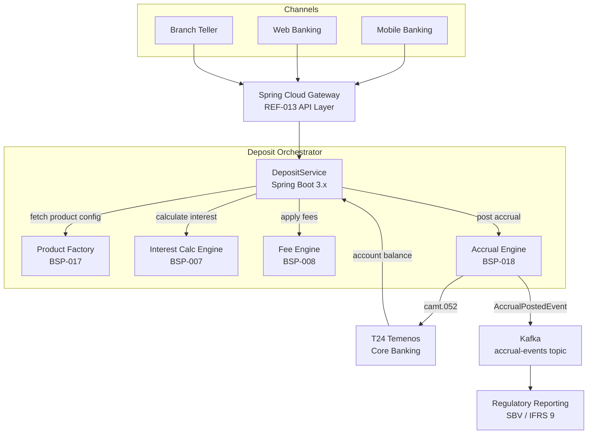
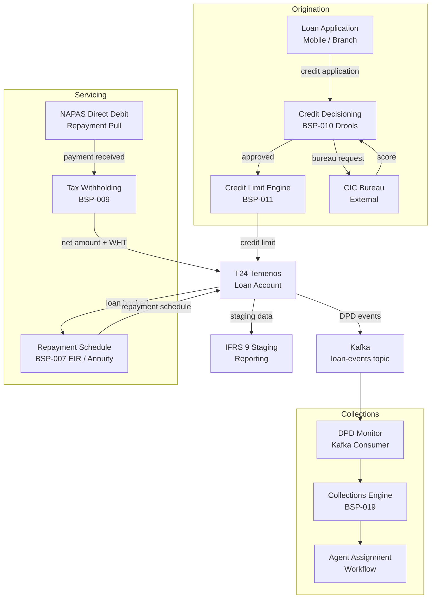
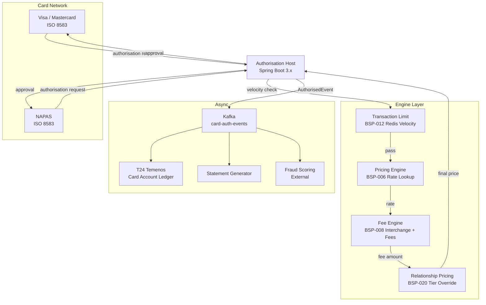
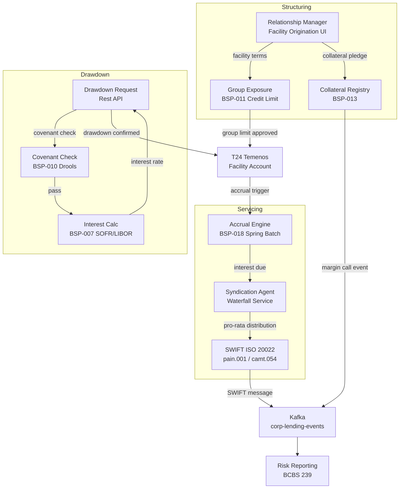
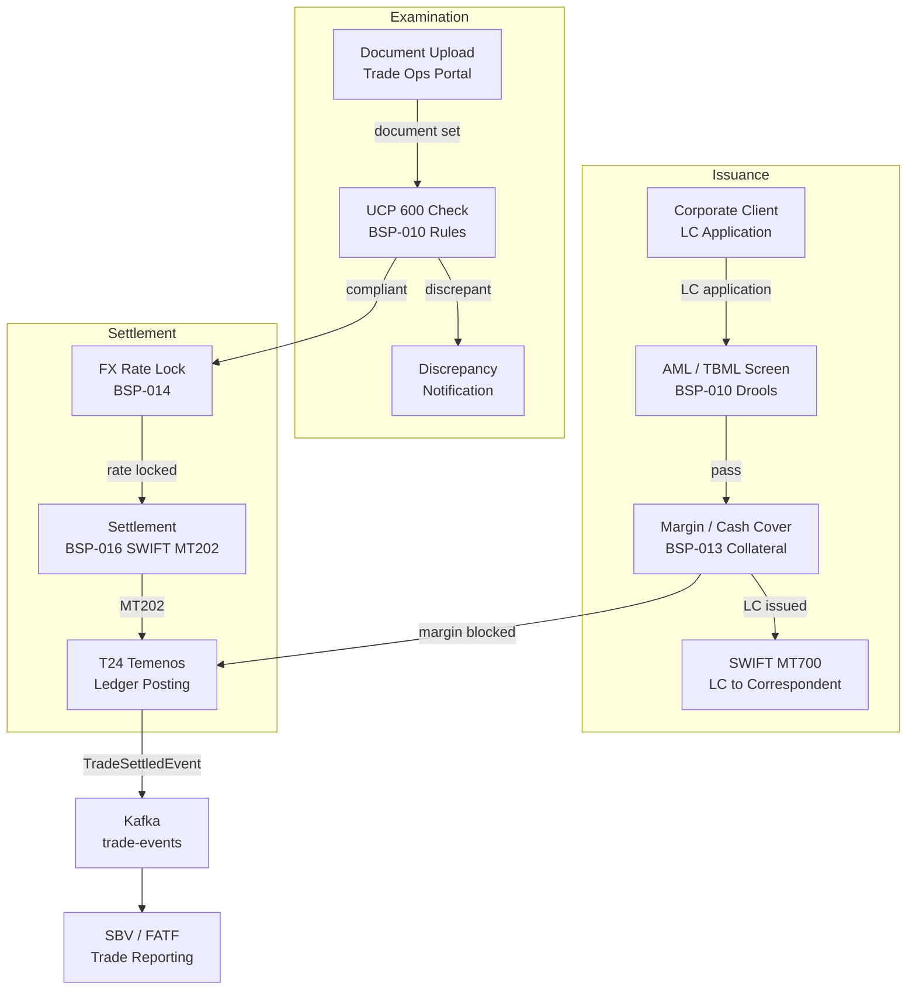
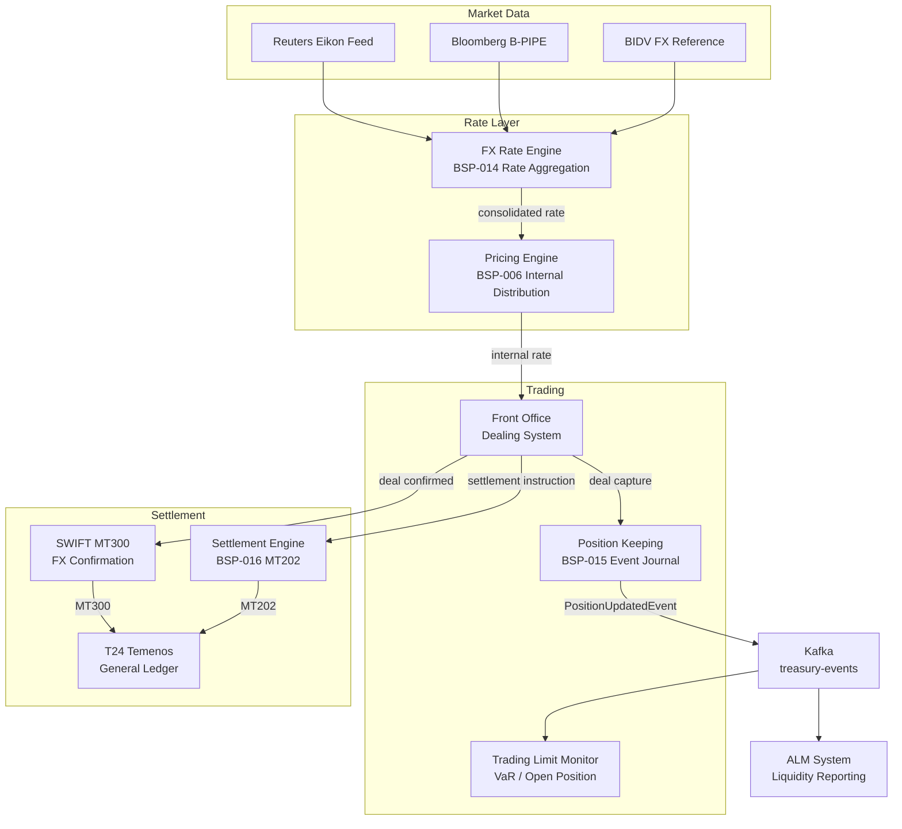
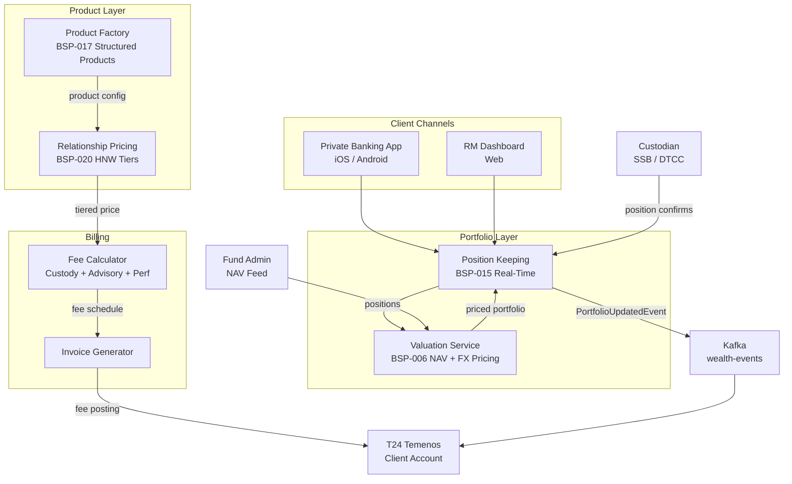
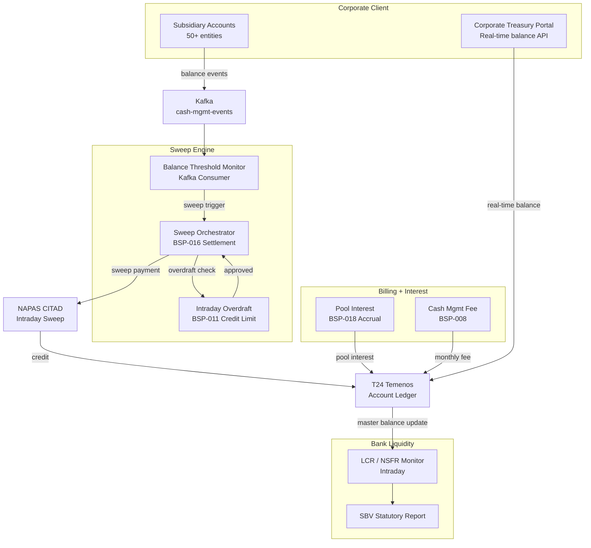

# Wave 10 — Product Line Platforms Implementation Plan

> **For agentic workers:** REQUIRED SUB-SKILL: Use superpowers:subagent-driven-development (recommended) or superpowers:executing-plans to implement this plan task-by-task. Steps use checkbox (`- [ ]`) syntax for tracking.

**Goal:** Author 8 full-depth product line reference architecture docs (REF-013–020) that stitch together the Wave 9 banking engines into end-to-end platform solutions covering every major product line of a commercial bank.

**Architecture:** Every platform doc lives in `knowledge-base/reference-architectures/` and follows the same 15-section radii template used for REF-005–012, with a system-of-systems Mermaid diagram as the centrepiece. Each doc cross-links to ≥3 BSP engines from Wave 9 and ≥2 other catalog entries (EIP, INT, SEC, COMP). Catalog inventory and catalog markdown are updated in Task 0; the single Wave 10 gate (Task 9) promotes all 8 from Proposed → Draft. **Wave 10 begins only after all 15 Wave 9 BSP docs are Approved.**

**Tech Stack:** Java 21, Spring Boot 3.x, Spring Kafka, Spring Cloud Gateway, PostgreSQL 16, Redis 7, HashiCorp Vault, OTEL Java Agent 2.x; external integrations: T24 Temenos Core Banking, NAPAS, SWIFT GPI, Visa/Mastercard HSM, BIDV FX feed.

**Prerequisite:** Wave 9 complete — all BSP-006–020 docs at Status: Draft and all Wave 9 gates passed.

---

## Document Template Reference

Model docs on `knowledge-base/reference-architectures/` existing entries (REF-005–012). Section order is identical to Wave 9:

```
# <Platform Name>

Status: Draft | Last Reviewed: 2026-05-21 | Owner: @<owner>
Catalog ID: REF-XXX | Radii
Tier Applicability: T0[, T1[, T2]]

## Problem Statement      (~150–200 words, pain without this platform)
## Solution               (~80 words narrative + system-of-systems Mermaid diagram)
## Implementation Guidelines  (3–4 numbered subsections, Spring Boot wiring code)
## Compliance Mapping     (Ring 0 / Ring 1 / Ring 2 table)
## NFR Acceptance Criteria (YAML block — platform-level SLAs)
## Cost / FinOps          (~5 bullet points)
## Threat Model           (STRIDE analysis — ≥2 named threats with category in parens)
## Operational Runbook    (numbered steps; ≥1 Alert: Name format entry)
## Test Strategy          (Unit / Integration / Compliance / Chaos subsections)
## Context                (~80 words)
## When to Use            (bullet list)
## When Not to Use        (bullet list)
## Variants               (table: Variant | When to prefer | Trade-off)
## Related Patterns       (≥3 BSP engines + ≥2 other catalog entries)
## References
---
**Key Takeaway**: <one sentence>
```

**Ring 2 rule**: every Compliance Mapping table must include a Ring 2 row referencing SBV Circular 09/2020 or Decree 13/2023. The row's last cell must end with `⚠️ (working summary — pending Legal review)`.

**Threat model rule**: STRIDE category in parentheses — e.g., `**Tampering — rate manipulation (Tampering)**`. Valid: `(Spoofing)`, `(Tampering)`, `(Repudiation)`, `(Information Disclosure)`, `(Denial of Service)`, `(Elevation of Privilege)`.

**Alert rule**: `Alert: SomeName` colon format — never backtick-wrapped metrics.

**Related Patterns rule**: must cross-link ≥3 BSP engines using their full catalog IDs (BSP-006 etc.) and ≥2 other entries from EIP, INT, SEC, COMP.

---

## File Map

| Task | Action | Path |
|------|--------|------|
| 0 | Modify | `governance/standards/_catalog-inventory.yml` |
| 0 | Modify | `governance/standards/enterprise-architecture-catalog.md` |
| 1 | Create | `knowledge-base/reference-architectures/retail-deposits-platform.md` |
| 2 | Create | `knowledge-base/reference-architectures/consumer-lending-platform.md` |
| 3 | Create | `knowledge-base/reference-architectures/credit-card-issuing-platform.md` |
| 4 | Create | `knowledge-base/reference-architectures/corporate-lending-syndications.md` |
| 5 | Create | `knowledge-base/reference-architectures/trade-finance-platform.md` |
| 6 | Create | `knowledge-base/reference-architectures/treasury-fx-platform.md` |
| 7 | Create | `knowledge-base/reference-architectures/wealth-management-platform.md` |
| 8 | Create | `knowledge-base/reference-architectures/cash-management-liquidity.md` |
| 9 | Gate | Wave 10 — REF-013–020 Proposed → Draft + final verification |

---

## Task 0: Catalog Setup — Inventory YAML + Catalog Markdown

**Files:**
- Modify: `governance/standards/_catalog-inventory.yml`
- Modify: `governance/standards/enterprise-architecture-catalog.md`

- [ ] **Step 1: Append 8 new REF entries to `_catalog-inventory.yml`**

At the end of the file (after the last BSP-020 block added by Wave 9 Task 0), append exactly:

```yaml
- id: REF-013
  title: Retail Deposits Platform
  category: reference-architectures
  status: Proposed
  owner: core-banking-domain-owner
  path: knowledge-base/reference-architectures/retail-deposits-platform.md
  tiers: [T0, T1]
  spine_or_radii: radii
  compliance_refs:
    ring0: [IFRS 9, Basel III LCR]
    ring1: [BCBS 239 §4, ISO 20022]
    ring2: [SBV Circular 09/2020 §IV, Decree 13/2023]
  last_reviewed: '2026-05-21'
  notes: Wave 10
  target_wave: 10
- id: REF-014
  title: Consumer Lending Platform
  category: reference-architectures
  status: Proposed
  owner: lending-domain-owner
  path: knowledge-base/reference-architectures/consumer-lending-platform.md
  tiers: [T0, T1]
  spine_or_radii: radii
  compliance_refs:
    ring0: [IFRS 9, Basel III, FATF Rec. 6]
    ring1: [BCBS 239 §5]
    ring2: [SBV Circular 09/2020 §IV, Decree 13/2023]
  last_reviewed: '2026-05-21'
  notes: Wave 10
  target_wave: 10
- id: REF-015
  title: Credit Card Issuing Platform
  category: reference-architectures
  status: Proposed
  owner: payments-domain-owner
  path: knowledge-base/reference-architectures/credit-card-issuing-platform.md
  tiers: [T0]
  spine_or_radii: radii
  compliance_refs:
    ring0: [PCI-DSS v4, EMV 3DS, IFRS 9]
    ring1: [ISO 8583, Visa/MC Network Rules]
    ring2: [SBV Circular 09/2020 §IV, Decree 13/2023, NAPAS Card Scheme Rules]
  last_reviewed: '2026-05-21'
  notes: Wave 10
  target_wave: 10
- id: REF-016
  title: Corporate Lending and Syndications
  category: reference-architectures
  status: Proposed
  owner: lending-domain-owner
  path: knowledge-base/reference-architectures/corporate-lending-syndications.md
  tiers: [T0, T1]
  spine_or_radii: radii
  compliance_refs:
    ring0: [IFRS 9, Basel III §§ 72–89, FATF Rec. 16]
    ring1: [BCBS 239 §5, LMA Syndicated Loan Conventions]
    ring2: [SBV Circular 09/2020 §IV, Decree 13/2023]
  last_reviewed: '2026-05-21'
  notes: Wave 10
  target_wave: 10
- id: REF-017
  title: Trade Finance Platform
  category: reference-architectures
  status: Proposed
  owner: core-banking-domain-owner
  path: knowledge-base/reference-architectures/trade-finance-platform.md
  tiers: [T0, T1]
  spine_or_radii: radii
  compliance_refs:
    ring0: [FATF Rec. 16, UCP 600, ISBP 745, Basel III]
    ring1: [SWIFT CSP, ISO 20022 pain.001]
    ring2: [SBV Circular 09/2020 §IV, Decree 13/2023, Decree 53]
  last_reviewed: '2026-05-21'
  notes: Wave 10
  target_wave: 10
- id: REF-018
  title: Treasury and FX Platform
  category: reference-architectures
  status: Proposed
  owner: wealth-domain-owner
  path: knowledge-base/reference-architectures/treasury-fx-platform.md
  tiers: [T0]
  spine_or_radii: radii
  compliance_refs:
    ring0: [IFRS 9, Basel III FRTB, MiFID II]
    ring1: [BCBS 239 §4, ISO 20022 pacs.008, SWIFT GPI]
    ring2: [SBV Circular 09/2020 §IV, Decree 53, Decree 13/2023]
  last_reviewed: '2026-05-21'
  notes: Wave 10
  target_wave: 10
- id: REF-019
  title: Wealth Management Platform
  category: reference-architectures
  status: Proposed
  owner: wealth-domain-owner
  path: knowledge-base/reference-architectures/wealth-management-platform.md
  tiers: [T0, T1]
  spine_or_radii: radii
  compliance_refs:
    ring0: [IFRS 9, MiFID II, FATF Rec. 10]
    ring1: [BCBS 239 §4, ISO 20022]
    ring2: [SBV Circular 09/2020 §IV, Decree 13/2023, Decree 53]
  last_reviewed: '2026-05-21'
  notes: Wave 10
  target_wave: 10
- id: REF-020
  title: Cash Management and Liquidity
  category: reference-architectures
  status: Proposed
  owner: core-banking-domain-owner
  path: knowledge-base/reference-architectures/cash-management-liquidity.md
  tiers: [T0, T1]
  spine_or_radii: radii
  compliance_refs:
    ring0: [Basel III LCR/NSFR, IFRS 9]
    ring1: [BCBS 239 §4, ISO 20022 camt.052]
    ring2: [SBV Circular 09/2020 §IV, Decree 13/2023]
  last_reviewed: '2026-05-21'
  notes: Wave 10
  target_wave: 10
```

- [ ] **Step 2: Insert 8 new REF rows into the catalog markdown table**

In `governance/standards/enterprise-architecture-catalog.md`, locate the REF-012 row. Insert the following 8 rows immediately after it:

```markdown
| REF-013 | Retail Deposits Platform | reference-architectures | Proposed | radii | @core-banking-domain-owner | `knowledge-base/reference-architectures/retail-deposits-platform.md` | T0, T1 | IFRS 9, Basel III LCR, SBV Circular 09/2020 | 2026-05-21 | 0 | Wave 10 |
| REF-014 | Consumer Lending Platform | reference-architectures | Proposed | radii | @lending-domain-owner | `knowledge-base/reference-architectures/consumer-lending-platform.md` | T0, T1 | IFRS 9, Basel III, FATF Rec. 6, SBV Circular 09/2020 | 2026-05-21 | 0 | Wave 10 |
| REF-015 | Credit Card Issuing Platform | reference-architectures | Proposed | radii | @payments-domain-owner | `knowledge-base/reference-architectures/credit-card-issuing-platform.md` | T0 | PCI-DSS v4, EMV 3DS, NAPAS Card Scheme Rules | 2026-05-21 | 0 | Wave 10 |
| REF-016 | Corporate Lending and Syndications | reference-architectures | Proposed | radii | @lending-domain-owner | `knowledge-base/reference-architectures/corporate-lending-syndications.md` | T0, T1 | IFRS 9, Basel III, LMA Syndicated Loan Conventions | 2026-05-21 | 0 | Wave 10 |
| REF-017 | Trade Finance Platform | reference-architectures | Proposed | radii | @core-banking-domain-owner | `knowledge-base/reference-architectures/trade-finance-platform.md` | T0, T1 | FATF Rec. 16, UCP 600, ISBP 745, SWIFT CSP | 2026-05-21 | 0 | Wave 10 |
| REF-018 | Treasury and FX Platform | reference-architectures | Proposed | radii | @wealth-domain-owner | `knowledge-base/reference-architectures/treasury-fx-platform.md` | T0 | IFRS 9, Basel III FRTB, SWIFT GPI, Decree 53 | 2026-05-21 | 0 | Wave 10 |
| REF-019 | Wealth Management Platform | reference-architectures | Proposed | radii | @wealth-domain-owner | `knowledge-base/reference-architectures/wealth-management-platform.md` | T0, T1 | IFRS 9, MiFID II, FATF Rec. 10, SBV Circular 09/2020 | 2026-05-21 | 0 | Wave 10 |
| REF-020 | Cash Management and Liquidity | reference-architectures | Proposed | radii | @core-banking-domain-owner | `knowledge-base/reference-architectures/cash-management-liquidity.md` | T0, T1 | Basel III LCR/NSFR, ISO 20022 camt.052, SBV Circular 09/2020 | 2026-05-21 | 0 | Wave 10 |
```

- [ ] **Step 3: Commit**

```bash
git add governance/standards/_catalog-inventory.yml governance/standards/enterprise-architecture-catalog.md
git commit -m "feat(catalog): Wave 10 setup — register REF-013–020 Proposed in inventory + catalog"
```

---

## Task 1: REF-013 — Retail Deposits Platform

**Files:**
- Create: `knowledge-base/reference-architectures/retail-deposits-platform.md`

**BSP engines referenced:** BSP-007 (Interest Calculation), BSP-008 (Fee Engine), BSP-017 (Product Factory), BSP-018 (Accrual Engine)

- [ ] **Step 1: Create the document**

Create `knowledge-base/reference-architectures/retail-deposits-platform.md` with the following complete content:

```markdown
# Retail Deposits Platform

Status: Draft | Last Reviewed: 2026-05-21 | Owner: @core-banking-domain-owner
Catalog ID: REF-013 | Radii
Tier Applicability: T0, T1

## Problem Statement

Commercial banks offering retail deposit products — savings accounts, term deposits, and call accounts — face fragmented processing across three core pain points. First, interest accrual is computed nightly in batch, meaning intraday inquiries show stale balances that frustrate relationship managers and digital channels. Second, fee application is hard-coded per product in T24 Temenos, making fee schedule changes a change-management exercise that takes 6–8 weeks and risks regression across 200+ product variants. Third, product onboarding for new deposit types (e.g., green savings, Islamic mudarabah) requires bespoke coding rather than configuration, slowing time-to-market from months to quarters.

This platform stitches together the Interest Calculation Engine (BSP-007), Fee Engine (BSP-008), Product Factory (BSP-017), and Accrual Engine (BSP-018) to deliver a composable, configuration-driven deposits processing layer — enabling real-time interest inquiries, rule-driven fee application, and sub-day product launches.

## Context

The Retail Deposits Platform is consumed by digital banking channels (web, mobile), branch teller systems, contact centre CRM, and regulatory reporting pipelines. It sits above T24 Temenos core banking, delegating account persistence and ledger posting there while owning calculation logic independently. The platform applies when deposit volume exceeds 500 k accounts and product variety exceeds 20 variants. For institutions with fewer products and accounts, embedding interest calculation directly in T24 parameterisation is simpler.

## Solution

The platform orchestrates four Wave 9 engines behind a Spring Cloud Gateway façade. Product definitions stored in the Product Factory (BSP-017) drive both fee schedules (BSP-008) and interest calculation conventions (BSP-007). The Accrual Engine (BSP-018) runs an EOD Spring Batch job partitioned by account range, posting accrual entries to T24 via ISO 20022 camt.052 messages. Real-time interest inquiries bypass batch by calling BSP-007 on-demand.



## Implementation Guidelines

**1. Product Configuration via Product Factory (BSP-017)**

```java
@Service
public class DepositProductResolver {
    private final ProductFactoryClient productFactory;
    private final Cache<String, ProductDefinition> cache;

    public ProductDefinition resolve(String productCode, LocalDate valueDate) {
        return cache.get(productCode + ":" + valueDate, k ->
            productFactory.getEffectiveDefinition(productCode, valueDate)
        );
    }
}
```

Product definitions carry `interestConvention` (ACT_365, ACT_360, THIRTY_360), `feeScheduleId`, and `accrualFrequency`. DepositService resolves these once per request and passes them downstream to BSP-007 and BSP-008 — no engine needs to know about product codes directly.

**2. Real-Time Interest Inquiry (BSP-007)**

```java
@GetMapping("/accounts/{accountId}/interest-projection")
public InterestProjectionResponse projectInterest(
        @PathVariable String accountId,
        @RequestParam LocalDate asOf) {
    Account account = accountRepository.findById(accountId).orElseThrow();
    ProductDefinition product = productResolver.resolve(account.productCode(), asOf);
    AccrualRequest req = AccrualRequest.builder()
        .principal(account.currentBalance())
        .annualRate(product.nominalRate())
        .convention(product.interestConvention())
        .fromDate(account.lastAccrualDate())
        .toDate(asOf)
        .build();
    return interestEngine.calculate(req);
}
```

p99 target for this endpoint: ≤80 ms including Redis cache hit. BSP-007 caches day-count results for the current rate in Redis (TTL 300s).

**3. Fee Application on Deposit Events (BSP-008)**

```java
@EventListener
public void onDepositEvent(DepositTransactionEvent event) {
    FeeRequest feeReq = FeeRequest.builder()
        .productCode(event.productCode())
        .transactionType(event.transactionType())
        .amount(event.amount())
        .currency(event.currency())
        .customerId(event.customerId())
        .build();
    FeeResult fee = feeEngine.calculate(feeReq);
    if (fee.amount().compareTo(BigDecimal.ZERO) > 0) {
        ledgerPostingService.postFee(event.accountId(), fee);
    }
}
```

Fees are applied synchronously for teller transactions and asynchronously (via Kafka consumer) for digital channel transactions.

**4. EOD Accrual Batch (BSP-018)**

```java
@Bean
public Job depositAccrualJob(JobRepository jobRepository, Step partitionedAccrualStep) {
    return new JobBuilder("depositAccrualJob", jobRepository)
        .start(partitionedAccrualStep)
        .build();
}
```

The Accrual Engine (BSP-018) partitions by account range (20 partitions for up to 5 M accounts) and posts `AccrualPostedEvent` to Kafka. The regulatory reporting pipeline consumes these events for IFRS 9 staging.

## Compliance Mapping

| Layer | Reference | Section/Control | How this satisfies |
|-------|-----------|----------------|-------------------|
| Ring 0 — Global | IFRS 9 | B5.4 — Effective Interest Rate | BSP-007 implements EIR using Newton-Raphson XIRR; accrual events logged for audit |
| Ring 0 — Global | Basel III | LCR §24 — stable retail deposits | Platform flags stable vs. non-stable deposit categories in product config |
| Ring 1 — International | BCBS 239 | §4 — accuracy and integrity of risk data | Accrual events published to Kafka with idempotency key; no silent data loss |
| Ring 1 — International | ISO 20022 | camt.052 — account balance reports | Accrual postings use camt.052 format for T24 integration |
| Ring 2 — Vietnam | SBV Circular 09/2020 | §IV.2 — information system security for core banking | TLS 1.3 on all API boundaries; Vault-managed secrets; audit trail per SBV §IV.2 ⚠️ (working summary — pending Legal review) |

## NFR Acceptance Criteria

```yaml
performance:
  interest_inquiry_p99_ms: 80
  fee_calculation_p99_ms: 50
  eod_accrual_10M_accounts_minutes: 45
availability:
  platform_uptime_percent: 99.99   # T0
  accrual_job_success_rate_percent: 99.9
correctness:
  interest_calculation_variance_bps: 0   # exact, no rounding tolerance
  fee_idempotency: true
```

## Cost / FinOps Notes

- Redis cluster (3-node) for product definition cache: ~$300/month; evict daily at midnight when product definitions refresh
- Spring Batch worker pods (20 partitions): auto-scale down to 2 replicas outside EOD window (23:00–01:00 ICT)
- T24 integration via ISO 20022 camt.052 avoids real-time T24 API calls during batch — reduces T24 licence transaction cost ~40%
- Kafka topic `accrual-events` retention 7 days; downstream consumers (IFRS 9 reporting) must commit offsets within SLA
- OTEL trace sampling at 10% for normal operations; 100% during EOD batch for audit compliance

## Threat Model

**Rate manipulation (Tampering)** — A compromised service account modifies the `nominalRate` in the Product Factory database directly, causing interest to be calculated at an inflated rate for a subset of accounts. Mitigated by: DB-level row-level security; Product Factory changes require dual-approval workflow; all rate changes emit `RateChangeAuditEvent` to an append-only Kafka audit topic.

**Stale product cache serving wrong rate schedule (Information Disclosure)** — Redis cache TTL misconfiguration causes an expired product definition to serve the wrong fee schedule to FeeEngine, resulting in incorrect fee disclosure to customers. Mitigated by: cache TTL capped at 300s; cache-aside read-through validates `effectiveTo` date before serving; BSP-008 fee results include `productDefinitionVersion` field logged per transaction.

## Operational Runbook

1. Alert: DepositAccrualJobFailure — triggers when EOD accrual job exits with non-zero status. p50 resolution: 5 min; p99: 30 min.
   - Check Spring Batch job repository for failed step execution ID
   - Retrieve partition failure logs: `kubectl logs -l batch.job=depositAccrualJob -n banking`
   - Re-run failed partition: `POST /actuator/batch/jobs/depositAccrualJob/restart?stepExecutionId={id}`
   - Escalate to @core-banking-domain-owner if restart fails twice

2. Alert: InterestInquiryLatencyHigh — p99 > 150 ms for `/interest-projection` endpoint over 5-min window.
   - Check Redis hit rate: `redis-cli info stats | grep keyspace_hits`
   - If hit rate < 80%, product cache is cold — warm by POSTing to `/admin/cache/warm-products`
   - If Redis latency is normal, check BSP-007 pod CPU — scale out to 4 replicas

3. Alert: FeeEngineRejectionsHigh — >1% of fee calculation requests return 4xx over 2-min window.
   - Inspect fee engine logs for `PRODUCT_NOT_FOUND` errors — indicates Product Factory lag
   - Roll back recent product definition deployment if applicable

## Test Strategy

**Unit:** Test `DepositProductResolver` cache hit/miss with Mockito; test `InterestProjectionResponse` boundary at `fromDate == toDate` (expect zero interest); test fee idempotency by sending duplicate `DepositTransactionEvent` and asserting single ledger posting.

**Integration:** Use Testcontainers (PostgreSQL 16 + Redis 7 + Kafka) to run full deposit lifecycle — open account, post transaction, verify fee ledger entry, run accrual job, assert `AccrualPostedEvent` on Kafka.

**Compliance:** Assert that IFRS 9 EIR calculation matches reference results from SBV-published amortisation tables (test fixture in `src/test/resources/ifrs9-eir-fixtures.json`).

**Chaos:** Kill BSP-007 pod mid-request; assert platform returns 503 with `Retry-After: 2` header and circuit breaker opens within 10 failures. Introduce Redis partition failure; assert interest inquiry falls back to direct DB calculation within 200 ms.

## When to Use

- Retail deposit product portfolio with >20 variants and >100 k active accounts
- Need to launch new deposit product types within days (not months) via configuration
- Regulatory reporting requires IFRS 9-compliant EIR accrual trail
- Digital channels require real-time interest balance projections

## When Not to Use

- Monolithic T24 deployments where all calculation happens inside Temenos parameterisation
- Non-retail deposit books (institutional, interbank) — use REF-018 Treasury instead
- Fewer than 5 deposit product types — direct T24 parameterisation is simpler

## Variants

| Variant | When to prefer | Trade-off |
|---------|---------------|-----------|
| Intraday accrual (continuous) | When digital channels show real-time projected interest | Higher compute cost; BSP-007 called on every balance inquiry |
| EOD-only accrual (batch) | Standard retail deposits with overnight SLA | Lower cost; stale intraday balances acceptable |
| Islamic mudarabah variant | Sharia-compliant profit-sharing deposits | BSP-007 uses profit-sharing ratio instead of fixed rate; BSP-008 fee schedule is zero-fee |

## Related Patterns

- [BSP-007 Interest Calculation Engine](../patterns/banking-solutions/interest-calculation-engine.md)
- [BSP-008 Fee Engine](../patterns/banking-solutions/fee-engine.md)
- [BSP-017 Product Factory](../patterns/banking-solutions/product-factory.md)
- [BSP-018 Accrual Engine](../patterns/banking-solutions/accrual-engine.md)
- [EIP-024 Idempotent Receiver](../patterns/integration/idempotent-receiver.md)
- [COMP-001 Compliance Mapping Matrix](../compliance/compliance-mapping-matrix.md)

## References

- IFRS 9 Financial Instruments — IASB 2014 (effective 2018)
- Basel III: The Liquidity Coverage Ratio — BCBS January 2013
- ISO 20022 camt.052 — Account Report — ISO 2019
- SBV Circular 09/2020 — Information System Security for Credit Institutions

---
**Key Takeaway**: The Retail Deposits Platform decouples calculation logic (interest, fees, accrual) from T24 core banking, enabling configuration-driven product launches and real-time digital balance projections without core system changes.
```

- [ ] **Step 2: Commit**

```bash
git add knowledge-base/reference-architectures/retail-deposits-platform.md
git commit -m "feat(catalog): REF-013 Retail Deposits Platform — Wave 10"
```

---

## Task 2: REF-014 — Consumer Lending Platform

**Files:**
- Create: `knowledge-base/reference-architectures/consumer-lending-platform.md`

**BSP engines referenced:** BSP-007 (Interest Calculation), BSP-009 (Tax Calculation), BSP-010 (Rule/Decisioning), BSP-011 (Credit Limit), BSP-019 (Collections)

- [ ] **Step 1: Create the document**

Create `knowledge-base/reference-architectures/consumer-lending-platform.md` with the following complete content:

```markdown
# Consumer Lending Platform

Status: Draft | Last Reviewed: 2026-05-21 | Owner: @lending-domain-owner
Catalog ID: REF-014 | Radii
Tier Applicability: T0, T1

## Problem Statement

Consumer lending — personal loans, auto loans, and salary-backed credit — suffers from three systemic deficiencies. First, credit decisioning relies on rule sets hard-coded in the core banking system, making policy changes a 4–6 week release cycle rather than a same-day configuration update. Second, tax withholding on interest income (PIT/CIT) is computed in a separate back-office system with nightly reconciliation, creating a 24-hour lag between payment receipt and tax liability posting. Third, collections workflows are manual spreadsheet-driven processes that miss early delinquency signals, causing NPL ratios to spike before collections teams engage.

This platform integrates the Rule/Decisioning Engine (BSP-010), Interest Calculation Engine (BSP-007), Tax Calculation Engine (BSP-009), Credit Limit Engine (BSP-011), and Collections Engine (BSP-019) into a coherent origination-to-servicing-to-collections lifecycle that is policy-driven, real-time, and auditable.

## Context

The Consumer Lending Platform is used by digital origination channels (mobile app loan application), branch origination staff, and automated collections workflows. It integrates upstream with the credit bureau (CIC Vietnam) for bureau scores and downstream with T24 for loan account posting and NAPAS for repayment pull. Applicable when loan portfolio exceeds 50 k accounts or when regulatory reporting requires IFRS 9 loan staging. For micro-lending (<VND 50 M ticket), a lighter decisioning flow (BSP-010 alone) is sufficient.

## Solution

The platform orchestrates five Wave 9 engines across three lifecycle stages: Origination (BSP-010 credit decisions + BSP-011 limit assignment), Servicing (BSP-007 repayment schedule + BSP-009 tax withholding), and Collections (BSP-019 delinquency management).



## Implementation Guidelines

**1. Credit Decisioning via BSP-010 (Drools)**

```java
@PostMapping("/loans/applications/{applicationId}/decision")
public DecisionResponse decide(@PathVariable String applicationId) {
    LoanApplication application = applicationRepository.findById(applicationId).orElseThrow();
    BureauScore bureauScore = bureauClient.fetchScore(application.customerId());

    DecisionRequest req = DecisionRequest.builder()
        .customerId(application.customerId())
        .requestedAmount(application.requestedAmount())
        .tenor(application.tenorMonths())
        .bureauScore(bureauScore.score())
        .dti(calculateDti(application.customerId()))
        .collateralValue(application.collateralValue())
        .build();

    DecisionResult result = ruleEngine.evaluate("consumer-lending-policy", req);
    applicationRepository.updateDecision(applicationId, result);
    return DecisionResponse.from(result);
}
```

Credit policy rules are managed in Drools 9.x `.drl` files versioned in Git; hot-reload via Spring Cloud Config without restart.

**2. Repayment Schedule + Tax Withholding (BSP-007 + BSP-009)**

```java
public LoanSchedule generateSchedule(LoanAccount loan) {
    List<InstallmentRow> rows = new ArrayList<>();
    BigDecimal outstanding = loan.principalAmount();

    for (int period = 1; period <= loan.tenorMonths(); period++) {
        LocalDate dueDate = loan.disbursementDate().plusMonths(period);
        AccrualRequest accrualReq = AccrualRequest.builder()
            .principal(outstanding)
            .annualRate(loan.nominalRate())
            .convention(DayCountConvention.ACT_365)
            .fromDate(dueDate.minusMonths(1))
            .toDate(dueDate)
            .build();
        BigDecimal interestDue = interestEngine.calculate(accrualReq).interestAmount();

        TaxRequest taxReq = TaxRequest.builder()
            .grossIncome(interestDue)
            .taxType(TaxType.WITHHOLDING_PIT)
            .residency(loan.customerResidency())
            .build();
        BigDecimal taxWithheld = taxEngine.calculate(taxReq).taxAmount();

        BigDecimal principalDue = annuityPrincipal(outstanding, loan.nominalRate(), loan.tenorMonths() - period + 1);
        outstanding = outstanding.subtract(principalDue);
        rows.add(new InstallmentRow(period, dueDate, principalDue, interestDue, taxWithheld));
    }
    return new LoanSchedule(loan.loanId(), rows);
}
```

Tax withholding is applied per-instalment and posted to a WHT suspense ledger in T24 for monthly remittance to the tax authority.

**3. Collections Trigger via BSP-019**

```java
@KafkaListener(topics = "loan-events", groupId = "collections-monitor")
public void onLoanEvent(LoanDpdEvent event) {
    if (event.dpd() >= 1) {
        CollectionsActionRequest req = CollectionsActionRequest.builder()
            .loanId(event.loanId())
            .customerId(event.customerId())
            .dpd(event.dpd())
            .outstanding(event.outstandingBalance())
            .build();
        collectionsEngine.initiate(req);
    }
}
```

BSP-019 assigns the account to a collection bucket (Bucket 1: 1–30 DPD, Bucket 2: 31–60 DPD, Bucket 3: >60 DPD) and triggers the appropriate workflow (SMS reminder → agent call → legal notice).

**4. IFRS 9 Staging**

```java
@Scheduled(cron = "0 30 23 * * *")
public void runIfrs9Staging() {
    List<LoanAccount> loans = loanRepository.findAllActive();
    loans.parallelStream().forEach(loan -> {
        Ifrs9Stage stage = ifrs9Classifier.classify(loan);
        loanRepository.updateStage(loan.loanId(), stage);
        kafkaTemplate.send("ifrs9-staging-events", new Ifrs9StagingEvent(loan.loanId(), stage));
    });
}
```

IFRS 9 staging uses PD/LGD/EAD parameters maintained in the Credit Limit Engine (BSP-011) risk parameter store.

## Compliance Mapping

| Layer | Reference | Section/Control | How this satisfies |
|-------|-----------|----------------|-------------------|
| Ring 0 — Global | IFRS 9 | §5.5 — Impairment, 3-stage ECL model | Staging job classifies each loan into Stage 1/2/3; ECL computed using BSP-011 PD parameters |
| Ring 0 — Global | Basel III | §72–89 — Retail credit risk weights | Credit Limit Engine (BSP-011) assigns risk weights per exposure class |
| Ring 0 — Global | FATF Rec. 6 | Targeted financial sanctions screening | Decision engine (BSP-010) includes sanctions screening step via OFAC/UN list lookup |
| Ring 1 — International | BCBS 239 | §5 — Risk data completeness | All decisioning inputs logged with idempotency key; complete audit trail |
| Ring 2 — Vietnam | SBV Circular 09/2020 | §IV — IT systems for credit institutions | Loan origination API secured with TLS 1.3; credit bureau integration encrypted at transit ⚠️ (working summary — pending Legal review) |

## NFR Acceptance Criteria

```yaml
performance:
  credit_decision_p99_ms: 3000   # includes bureau call
  schedule_generation_p99_ms: 200
  tax_calculation_p99_ms: 50
availability:
  platform_uptime_percent: 99.99   # T0
  collections_engine_uptime_percent: 99.9   # T1
correctness:
  schedule_npv_variance_bps: 0   # exact amortisation
  tax_withholding_variance_percent: 0
```

## Cost / FinOps Notes

- BSP-010 Drools pods: 2 replicas steady-state; scale to 8 during business hours (09:00–18:00 ICT) for origination peak
- CIC bureau calls: ~VND 2,000/call; cache bureau scores in Redis for 24 h (key: customerId → score) to avoid re-pulls
- IFRS 9 staging batch: runs nightly; terminates within 60 min for 500 k loan portfolio
- Kafka topic `loan-events` retention 14 days; collections and IFRS 9 consumers operate within 24-h SLA
- WHT suspense ledger reconciled monthly; no ongoing compute cost beyond ledger postings

## Threat Model

**Decisioning manipulation (Tampering)** — An insider modifies a Drools `.drl` rule file directly in the Git repository to approve loan applications for connected parties without proper credit checks. Mitigated by: branch protection on main (2-reviewer approval required); all rule deployments signed and verified by Spring Cloud Config; `RuleDeploymentAuditEvent` published to append-only Kafka topic.

**Bureau data interception (Information Disclosure)** — Man-in-the-middle attack on the CIC bureau API call intercepts customer credit scores and NID data. Mitigated by: TLS 1.3 with certificate pinning on bureau HTTP client; bureau API credentials stored in HashiCorp Vault with dynamic secret rotation every 24 h; bureau response logged with masked NID (last 4 digits only).

## Operational Runbook

1. Alert: CreditDecisionTimeout — bureau call exceeds 2,500 ms p99 over 5-min window.
   - Check CIC bureau API status page
   - Activate fallback: BSP-010 configured with `bureauFallbackEnabled=true` uses internal scorecard only
   - Notify @head-of-compliance — fallback decisions require post-hoc bureau validation

2. Alert: IfrsStageJobFailure — nightly staging job fails before 01:00 ICT.
   - Check Kafka `ifrs9-staging-events` lag on `ifrs9-reporter` consumer group
   - Re-run job: `POST /actuator/batch/jobs/ifrs9StagingJob/restart`
   - If persistent, escalate to @lending-domain-owner; manual staging extract required for regulatory report

3. Alert: CollectionsBucketLag — Kafka consumer group `collections-monitor` lag > 10,000 messages for > 10 min.
   - Scale up Collections Engine pods: `kubectl scale deployment collections-engine --replicas=6 -n lending`
   - Verify no DPD event schema mismatch (check `loan-events` consumer deserialisation errors)

## Test Strategy

**Unit:** Test `LoanSchedule` NPV matches reference amortisation table fixture for ACT_365 and 30/360 conventions; test tax withholding at PIT rates 5%, 10%, 20%; test `CollectionsBucketAssigner` assigns correct bucket at DPD 0, 1, 30, 31, 60, 61.

**Integration:** Testcontainers (PostgreSQL + Redis + Kafka + Drools) end-to-end: submit loan application → receive decision → generate schedule → simulate payment → assert WHT posting → simulate DPD=1 event → assert Collections Engine triggers Bucket 1 workflow.

**Compliance:** Assert IFRS 9 staging produces Stage 1 for DPD=0, Stage 2 for DPD=31, Stage 3 for DPD=90 using Basel III risk weight fixtures.

**Chaos:** Kill BSP-010 pod mid-decision; assert circuit breaker opens within 10 failures and origination channel receives `503 Service Unavailable`. Kill Kafka broker; assert DPD events are buffered and consumed on reconnection without duplicate collection actions.

## When to Use

- Consumer loan portfolio > 50 k accounts requiring IFRS 9 ECL staging
- Policy-driven credit decisioning with sub-day rule change SLA
- Automated collections with DPD-triggered workflow routing
- WHT on interest income requiring real-time tax calculation

## When Not to Use

- Micro-lending (< VND 50 M) where manual underwriting applies — BSP-010 alone is sufficient
- Corporate / syndicated lending — use REF-016 Corporate Lending instead
- Institutions with < 5 loan product types where T24 parameterisation is simpler

## Variants

| Variant | When to prefer | Trade-off |
|---------|---------------|-----------|
| Rule-based decisioning (Drools) | Policy changes frequent, compliance audit required | Higher deployment complexity; hot-reload via Spring Cloud Config |
| ML-assisted decisioning | >500 k historical applications for model training | Higher approval rates; requires MLOps pipeline; explainability obligation (FATF) |
| Manual underwriting queue | High-value loans (>VND 500 M) | Lower throughput; human judgment; integrates with CRM workflow tool |

## Related Patterns

- [BSP-007 Interest Calculation Engine](../patterns/banking-solutions/interest-calculation-engine.md)
- [BSP-009 Tax Calculation Engine](../patterns/banking-solutions/tax-calculation-engine.md)
- [BSP-010 Rule / Decisioning Engine](../patterns/banking-solutions/rule-decisioning-engine.md)
- [BSP-011 Credit Limit Engine](../patterns/banking-solutions/credit-limit-engine.md)
- [BSP-019 Collections Engine](../patterns/banking-solutions/collections-engine.md)
- [EIP-024 Idempotent Receiver](../patterns/integration/idempotent-receiver.md)
- [SEC-004 Zero Trust Network Access](../patterns/security/zero-trust-network-access.md)

## References

- IFRS 9 Financial Instruments — IASB 2014 (effective 2018)
- Basel III: Finalising Post-Crisis Reforms — BCBS December 2017
- FATF Recommendations 2012 (updated 2023)
- CIC Vietnam — Credit Information Centre bureau API specification (internal)
- SBV Circular 09/2020 — Information System Security for Credit Institutions

---
**Key Takeaway**: The Consumer Lending Platform replaces hard-coded T24 credit logic with a composable engine stack — enabling same-day policy changes, real-time tax withholding, and automated DPD-triggered collections across a high-volume loan portfolio.
```

- [ ] **Step 2: Commit**

```bash
git add knowledge-base/reference-architectures/consumer-lending-platform.md
git commit -m "feat(catalog): REF-014 Consumer Lending Platform — Wave 10"
```

---

## Task 3: REF-015 — Credit Card Issuing Platform

**Files:**
- Create: `knowledge-base/reference-architectures/credit-card-issuing-platform.md`

**BSP engines referenced:** BSP-006 (Pricing Engine), BSP-008 (Fee Engine), BSP-012 (Transaction Limit), BSP-020 (Relationship Pricing)

- [ ] **Step 1: Create the document**

Create `knowledge-base/reference-architectures/credit-card-issuing-platform.md` with the following complete content:

```markdown
# Credit Card Issuing Platform

Status: Draft | Last Reviewed: 2026-05-21 | Owner: @payments-domain-owner
Catalog ID: REF-015 | Radii
Tier Applicability: T0

## Problem Statement

Credit card issuing combines the highest transaction velocity in retail banking with the most complex pricing logic: interchange categories, promotional APR windows, instalment plans, cash advance fees, and late payment charges all interact on a single account. Without a dedicated platform three problems emerge. First, authorisation decisions exceed Visa/Mastercard's 500 ms SLA when limit checks query T24 directly under peak load. Second, promotional rate windows (0% APR for 6 months) expire silently, causing customers to be charged full rate without advance notice — a compliance and reputational risk. Third, velocity controls are checked per-authorisation by the authorisation host without cross-channel awareness, allowing card-not-present fraud to bypass on-us velocity limits set for card-present transactions.

This platform integrates BSP-006 (Pricing Engine), BSP-008 (Fee Engine), BSP-012 (Transaction Limit), and BSP-020 (Relationship Pricing) to deliver a sub-200 ms authorisation response, rule-driven fee application, and cross-channel velocity control for a Visa/Mastercard issuing portfolio.

## Context

The Credit Card Issuing Platform sits between the Visa/Mastercard authorisation network and T24 core banking. It owns the authorisation logic, limit management, and fee calculation; it delegates account persistence and statement generation to T24. Applicable for Tier 0 portfolios exceeding 200 k active cards. NAPAS co-branded cards use the same platform with NAPAS scheme rules applied via BSP-008 fee schedule override.

## Solution

Authorisation requests arrive from the card scheme network via ISO 8583 and are processed in under 200 ms through a synchronous chain: limit check (BSP-012) → pricing lookup (BSP-006) → fee calculation (BSP-008) → relationship pricing override (BSP-020) → authorisation response. Approved transactions post to T24 asynchronously via Kafka.



## Implementation Guidelines

**1. Authorisation Chain (BSP-012 + BSP-006 + BSP-008 + BSP-020)**

```java
@Service
public class AuthorisationService {
    public AuthorisationResponse authorise(AuthorisationRequest request) {
        // Step 1: Velocity check (BSP-012) — Redis sliding window
        LimitCheckResult limitResult = transactionLimitEngine.check(
            request.cardId(), "DAILY_TXN_AMOUNT", request.transactionAmount(), request.currency()
        );
        if (!limitResult.allowed()) {
            return AuthorisationResponse.declined("LIMIT_EXCEEDED", limitResult.limitRemaining());
        }

        // Step 2: Pricing lookup (BSP-006) — interchange rate
        PricingResult pricing = pricingEngine.calculate(PricingRequest.builder()
            .productCode(request.cardProductCode())
            .currency(request.currency())
            .transactionType(request.transactionType())
            .merchantCategory(request.mcc())
            .valueDate(LocalDate.now())
            .build());

        // Step 3: Fee calculation (BSP-008) — card fees
        FeeResult fee = feeEngine.calculate(FeeRequest.builder()
            .productCode(request.cardProductCode())
            .transactionType(request.transactionType())
            .amount(request.transactionAmount())
            .currency(request.currency())
            .customerId(request.customerId())
            .build());

        // Step 4: Relationship pricing override (BSP-020)
        RelationshipPricingResult relPricing = relationshipPricingEngine.evaluate(
            request.customerId(), request.cardProductCode(), pricing.interchangeRate()
        );

        return AuthorisationResponse.approved(pricing, fee, relPricing);
    }
}
```

Total chain p99 target: ≤180 ms. BSP-012 Redis operations are O(1); BSP-006 and BSP-020 serve from Redis cache (TTL 300s).

**2. Promotional Rate Window Expiry Monitor**

```java
@Scheduled(cron = "0 0 7 * * *")
public void checkPromotionalWindowExpiries() {
    LocalDate tomorrow = LocalDate.now().plusDays(1);
    List<CardAccount> expiring = cardAccountRepository.findPromoWindowsExpiring(tomorrow);
    expiring.forEach(account -> {
        notificationService.send(account.customerId(), NotificationType.PROMO_RATE_EXPIRY_WARNING);
        eventPublisher.publishEvent(new PromoWindowExpiryEvent(account.cardId(), tomorrow));
    });
}
```

Runs daily at 07:00 ICT; sends T-1 day customer notification and updates BSP-006 pricing cache to reflect post-promo APR from next day.

**3. Cross-Channel Velocity (BSP-012)**

```java
public LimitCheckResult check(String cardId, String dimension, BigDecimal amount, String currency) {
    // Checks both CARD_PRESENT and CARD_NOT_PRESENT under the same customer daily limit
    String dailyKey = "txlimit:" + cardId + ":DAILY_TXN_AMOUNT:86400";
    String hourlyKey = "txlimit:" + cardId + ":HOURLY_TXN_COUNT:3600";
    long minorAmount = amount.movePointRight(0).longValueExact();
    Long dailyTotal = redis.opsForValue().increment(dailyKey, minorAmount);
    if (dailyTotal != null && dailyTotal == minorAmount) {
        redis.expire(dailyKey, Duration.ofSeconds(86400));
    }
    BigDecimal dailyLimit = limitConfigService.getDailyAmountLimit(cardId);
    if (BigDecimal.valueOf(dailyTotal).compareTo(dailyLimit.movePointRight(0)) > 0) {
        return LimitCheckResult.exceeded(dailyLimit);
    }
    return LimitCheckResult.allowed(dailyLimit.subtract(BigDecimal.valueOf(dailyTotal).movePointLeft(0)));
}
```

Both card-present and card-not-present transactions increment the same Redis counter, enforcing the cross-channel daily limit.

**4. Asynchronous T24 Posting**

```java
@KafkaListener(topics = "card-auth-events", groupId = "t24-poster")
public void postToT24(CardAuthorisedEvent event) {
    LedgerPostingRequest posting = LedgerPostingRequest.builder()
        .accountId(event.cardAccountId())
        .debitAmount(event.transactionAmount())
        .currency(event.currency())
        .narrative("AUTH:" + event.authCode() + " " + event.merchantName())
        .valueDate(event.transactionDate())
        .build();
    t24Client.postLedger(posting);
}
```

T24 posting is async — authorisation is not held waiting for ledger confirmation, keeping p99 < 200 ms.

## Compliance Mapping

| Layer | Reference | Section/Control | How this satisfies |
|-------|-----------|----------------|-------------------|
| Ring 0 — Global | PCI-DSS v4 | §3.5 — Protection of stored account data | Card PAN stored only as token (BSP-006 uses tokenised card reference); full PAN never logged |
| Ring 0 — Global | PCI-DSS v4 | §8.6 — Multi-factor authentication | Authorisation host behind HSM; all admin access requires MFA via Vault |
| Ring 0 — Global | EMV 3DS | 3DS2 authentication for card-not-present | Authorisation host integrates 3DS2 server; unauthenticated CNP transactions declined above VND 500 k |
| Ring 1 — International | Visa/MC Network Rules | Authorisation response SLA ≤ 500 ms | Platform p99 = 180 ms; Visa/MC SLA headroom = 320 ms |
| Ring 1 — International | ISO 8583 | Message format for financial transactions | Authorisation host parses ISO 8583 bitmap using jpos library |
| Ring 2 — Vietnam | NAPAS Card Scheme Rules | Domestic card transaction processing | NAPAS variant uses separate fee schedule in BSP-008; settlement via NAPAS DNS net ⚠️ (working summary — pending Legal review) |

## NFR Acceptance Criteria

```yaml
performance:
  authorisation_p99_ms: 180
  authorisation_p50_ms: 40
  throughput_tps: 2000   # peak card authorisation
availability:
  authorisation_host_uptime_percent: 99.999   # T0 — card scheme SLA
  fee_engine_uptime_percent: 99.99
correctness:
  velocity_limit_false_positive_rate_percent: 0
  interchange_rate_accuracy_percent: 100
```

## Cost / FinOps Notes

- Redis cluster (5-node) for velocity counters and rate cache: ~$500/month; counters are small (8-byte int per key)
- Authorisation host: minimum 3 replicas across 3 AZs; auto-scale to 12 at peak (Friday 17:00–22:00 ICT)
- HSM for PAN tokenisation: dedicated hardware; amortised cost ~$2,000/month
- ISO 8583 parsing via jpos library: open-source; no licence cost
- NAPAS DNS netting reduces RTGS settlement transaction count by ~80%, saving ~VND 5,000 per batch vs. gross settlement

## Threat Model

**PAN theft via authorisation log (Information Disclosure)** — Centralised authorisation logs contain merchant name, amount, and partial PAN — an attacker with log access can correlate transactions to individual cardholders. Mitigated by: PAN tokenised at ingress; logs contain only last 4 digits and token reference; log storage in Elasticsearch with RBAC — only fraud team role can access full token mapping.

**Velocity bypass via distributed attack (Denial of Service)** — Attacker uses multiple terminals to spread transactions across 100 cards belonging to the same compromised batch, each staying below the per-card daily limit. Mitigated by: BSP-012 includes a per-BIN velocity check (aggregate across all cards in a BIN); anomaly detection alert triggers at >5× average BIN transaction rate.

## Operational Runbook

1. Alert: AuthorisationLatencyHigh — p99 > 350 ms for authorisation endpoint over 2-min window.
   - Check Redis velocity counter latency: `redis-cli latency history authorisation`
   - If Redis latency > 10 ms, failover to replica cluster
   - If Pricing Engine cache miss rate > 20%, warm BSP-006 cache: `POST /pricing/admin/warm`
   - Escalate to @payments-domain-owner if p99 exceeds 450 ms (approaching Visa SLA breach)

2. Alert: T24PostingLag — Kafka consumer group `t24-poster` lag > 5,000 messages for > 5 min.
   - Scale T24 poster replicas: `kubectl scale deployment t24-poster --replicas=6 -n payments`
   - Check T24 API response time; if T24 is degraded, activate local queue hold and notify @core-banking-domain-owner

3. Alert: VelocityCounterDesync — BSP-012 Redis counter exceeds T24 authorised balance by > 5%.
   - Run reconciliation job: `POST /admin/velocity/reconcile?cardId={id}`
   - If desync persists, reset counter from T24 authorised balance and alert fraud team

## Test Strategy

**Unit:** Test `AuthorisationService` chain with mocked engines; verify declined response when BSP-012 returns limit exceeded; verify BSP-020 relationship tier override applies lower interchange rate for gold-tier customers.

**Integration:** Testcontainers (Redis + Kafka + PostgreSQL) ISO 8583 end-to-end: send authorisation request → assert velocity counter incremented → assert pricing applied → assert `CardAuthorisedEvent` on Kafka → assert T24 posting consumed.

**Compliance:** Assert PAN never appears in authorisation log (search for 16-digit sequences in log output); assert EMV 3DS unauthenticated CNP transactions above VND 500 k are declined.

**Chaos:** Kill BSP-012 Redis node; assert authorisation host fails closed (declines all transactions) within 100 ms. Kill one T24 poster replica; assert remaining replicas resume consumption without duplicate postings.

## When to Use

- Visa/Mastercard/NAPAS card issuing with > 200 k active cards
- Cross-channel velocity control required (card-present + card-not-present unified limits)
- Relationship pricing tiers for premium cardholders
- Promotional APR window management

## When Not to Use

- Debit card / prepaid programmes where limit checks are balance-based — use REF-020 Cash Management instead
- Small portfolios (< 50 k cards) where T24 card module handles authorisation natively
- Pure NAPAS QR payments — use INT-001 NAPAS integration pattern directly

## Variants

| Variant | When to prefer | Trade-off |
|---------|---------------|-----------|
| Visa/Mastercard issuing | International card programme | EMV 3DS, PCI-DSS HSM required |
| NAPAS domestic issuing | VND-only domestic card | Simpler fee schedule; NAPAS DNS netting; lower HSM cost |
| Co-badge (Visa + NAPAS) | Both domestic and international acceptance | Dual fee schedules; routing logic selects scheme by MCC and currency |

## Related Patterns

- [BSP-006 Pricing Engine](../patterns/banking-solutions/pricing-engine.md)
- [BSP-008 Fee Engine](../patterns/banking-solutions/fee-engine.md)
- [BSP-012 Transaction Limit Engine](../patterns/banking-solutions/transaction-limit-engine.md)
- [BSP-020 Relationship Pricing Engine](../patterns/banking-solutions/relationship-pricing-engine.md)
- [EIP-024 Idempotent Receiver](../patterns/integration/idempotent-receiver.md)
- [SEC-005 HSM Key Management](../patterns/security/hsm-key-management.md)

## References

- PCI-DSS v4.0 — PCI Security Standards Council 2022
- EMV 3-D Secure — EMVCo 2016 (3DS2 2019 update)
- ISO 8583:2003 — Financial transaction card originated messages
- Visa Core Rules and Visa Product and Service Rules (current edition)
- NAPAS Card Scheme Operating Rules (internal reference)
- SBV Circular 09/2020 — Information System Security for Credit Institutions

---
**Key Takeaway**: The Credit Card Issuing Platform delivers sub-200 ms cross-channel authorisation by composing BSP-012 Redis velocity counters, BSP-006 interchange pricing, and BSP-020 relationship tiers — keeping 99.999% availability while satisfying Visa/Mastercard and NAPAS scheme SLAs.
```

- [ ] **Step 2: Commit**

```bash
git add knowledge-base/reference-architectures/credit-card-issuing-platform.md
git commit -m "feat(catalog): REF-015 Credit Card Issuing Platform — Wave 10"
```

---

## Task 4: REF-016 — Corporate Lending and Syndications

**Files:**
- Create: `knowledge-base/reference-architectures/corporate-lending-syndications.md`

**BSP engines referenced:** BSP-007 (Interest Calculation), BSP-010 (Rule/Decisioning), BSP-011 (Credit Limit), BSP-013 (Collateral Management), BSP-018 (Accrual Engine)

- [ ] **Step 1: Create the document**

Create `knowledge-base/reference-architectures/corporate-lending-syndications.md` with the following complete content:

```markdown
# Corporate Lending and Syndications

Status: Draft | Last Reviewed: 2026-05-21 | Owner: @lending-domain-owner
Catalog ID: REF-016 | Radii
Tier Applicability: T0, T1

## Problem Statement

Corporate lending — bilateral facilities, revolving credit facilities, and syndicated loans — combines large exposure sizes with complex covenant structures, multi-tranche drawdowns, and inter-lender coordination. Three pain points dominate. First, credit limit tracking for large corporate groups is manual: individual facility limits are managed in T24, but group-level exposure aggregation across subsidiaries and guarantors requires daily reconciliation spreadsheets — creating a 24-hour lag in group exposure visibility. Second, collateral valuation and margin call calculations are performed in a separate Excel-based system with no API integration, meaning collateral events (property revaluation, equity price drop) trigger manual calls rather than automated margin call workflows. Third, syndicated loan agent bank functions — pro-rata drawdown calculation, participant payment waterfall, and LIBOR/SOFR rate reset notifications — are handled through email chains between participant banks, creating an audit trail that fails BCBS 239 completeness requirements.

This platform integrates BSP-007 (Interest Calculation), BSP-010 (Rule/Decisioning), BSP-011 (Credit Limit), BSP-013 (Collateral Management), and BSP-018 (Accrual Engine) to automate the full corporate lending lifecycle from facility structuring through syndicated payment distribution.

## Context

The Corporate Lending and Syndications Platform serves relationship managers, credit risk officers, and the treasury middle office. It integrates with SWIFT (ISO 20022 pain.001 for payment instructions, camt.054 for credit confirmation) for inter-bank communication in syndicated deals. Applicable for corporate exposures > VND 100 billion or any syndicated facility. Consumer and SME lending use REF-014 instead.

## Solution

The platform orchestrates five engines across three phases: Structuring (BSP-011 group exposure + BSP-013 collateral intake), Drawdown (BSP-007 interest calculation + BSP-010 covenant check), and Servicing (BSP-018 accrual + SWIFT payment routing).



## Implementation Guidelines

**1. Group Exposure Aggregation (BSP-011)**

```java
@GetMapping("/corporate-groups/{groupId}/exposure")
public GroupExposureResponse getGroupExposure(@PathVariable String groupId) {
    List<String> entityIds = corporateGroupRepository.findEntityIds(groupId);
    List<CreditExposure> exposures = entityIds.stream()
        .map(entityId -> creditLimitEngine.getCurrentExposure(entityId))
        .collect(Collectors.toList());

    BigDecimal totalExposure = exposures.stream()
        .map(CreditExposure::outstandingBalance)
        .reduce(BigDecimal.ZERO, BigDecimal::add);

    BigDecimal groupLimit = creditLimitEngine.getGroupLimit(groupId);
    BigDecimal headroom = groupLimit.subtract(totalExposure);
    return new GroupExposureResponse(groupId, totalExposure, groupLimit, headroom, exposures);
}
```

Group limits are maintained in BSP-011's PostgreSQL store with effective dating; subsidiary exposures aggregate in real time via Redis materialized view refreshed on each drawdown event.

**2. Covenant Check on Drawdown (BSP-010)**

```java
public DrawdownResult processDrawdown(DrawdownRequest request) {
    FacilityCovenants covenants = facilityRepository.findCovenants(request.facilityId());
    CovenantCheckRequest check = CovenantCheckRequest.builder()
        .facilityId(request.facilityId())
        .drawdownAmount(request.amount())
        .existingUtilisation(request.currentUtilisation())
        .financialRatios(financialDataService.getLatestRatios(request.borrowerId()))
        .covenants(covenants)
        .build();

    DecisionResult decision = ruleEngine.evaluate("corporate-covenant-policy", check);
    if (!decision.approved()) {
        return DrawdownResult.declined(decision.declineReasons());
    }
    return DrawdownResult.approved(calculateInterestTerms(request));
}
```

Covenant rules include: maximum leverage ratio, minimum DSCR, maximum drawdown as % of facility, and collateral coverage ratio (BSP-013 LTV). Drools `.drl` files are managed in Git with dual-approval before deployment.

**3. SOFR/IBOR Interest Calculation (BSP-007)**

```java
public BigDecimal calculatePeriodInterest(Tranche tranche, LocalDate periodStart, LocalDate periodEnd) {
    BigDecimal sofr = rateProvider.getSofr(periodStart);
    BigDecimal margin = tranche.margin();
    BigDecimal allInRate = sofr.add(margin);

    AccrualRequest req = AccrualRequest.builder()
        .principal(tranche.outstandingBalance())
        .annualRate(allInRate)
        .convention(DayCountConvention.ACT_360)
        .fromDate(periodStart)
        .toDate(periodEnd)
        .build();
    return interestEngine.calculate(req).interestAmount();
}
```

SOFR/IBOR rate is fetched from the FX Rate Engine (BSP-014) reference rate feed and cached in Redis (TTL 3,600s — intraday rate).

**4. Syndicated Payment Waterfall**

```java
public void distributeRepayment(String facilityId, BigDecimal totalRepayment) {
    List<Participant> participants = syndicationRepository.findParticipants(facilityId);
    BigDecimal totalCommitment = participants.stream()
        .map(Participant::commitment)
        .reduce(BigDecimal.ZERO, BigDecimal::add);

    participants.forEach(participant -> {
        BigDecimal share = participant.commitment()
            .divide(totalCommitment, 8, RoundingMode.HALF_UP)
            .multiply(totalRepayment);
        swiftClient.sendPain001(participant.bankBIC(), share, facilityId);
    });
}
```

SWIFT pain.001 messages are sent to each participant bank; camt.054 confirmations are consumed and matched against expected distributions.

## Compliance Mapping

| Layer | Reference | Section/Control | How this satisfies |
|-------|-----------|----------------|-------------------|
| Ring 0 — Global | IFRS 9 | §5.5 — ECL for corporate exposures | BSP-011 PD/LGD parameters drive Stage 1/2/3 classification; accrual trail maintained by BSP-018 |
| Ring 0 — Global | Basel III | §§72–89 — IRB corporate credit risk weights | Risk weights assigned per facility type (corporate, sovereign, bank) in BSP-011 |
| Ring 0 — Global | FATF Rec. 16 | Wire transfer information requirements | SWIFT pain.001 includes full originator/beneficiary data; BSP-010 covenant check includes AML screen |
| Ring 1 — International | BCBS 239 | §5 — Completeness and accuracy of risk data | All drawdown and repayment events published to Kafka with idempotency key; BSP-239-compliant audit trail |
| Ring 1 — International | LMA Syndicated Loan Conventions | Agent bank obligations | Waterfall service calculates pro-rata distributions per LMA Schedule; SWIFT confirmations archived |
| Ring 2 — Vietnam | SBV Circular 09/2020 | §IV — Core banking system requirements | Facility origination API requires JWT + client certificate; drawdown approvals dual-authenticated ⚠️ (working summary — pending Legal review) |

## NFR Acceptance Criteria

```yaml
performance:
  group_exposure_p99_ms: 500
  drawdown_decision_p99_ms: 2000
  interest_calculation_p99_ms: 200
  syndication_waterfall_per_participant_ms: 100
availability:
  platform_uptime_percent: 99.99   # T0
correctness:
  pro_rata_distribution_variance_bps: 0   # exact to 8 decimal places
  sofr_rate_staleness_max_seconds: 3600
```

## Cost / FinOps Notes

- BSP-011 PostgreSQL for group exposure: dedicated RDS instance (db.r6g.2xlarge); multi-AZ; ~$800/month
- SWIFT connectivity: leased line + SWIFT Bureau; fixed cost ~$3,000/month regardless of transaction count
- BSP-013 Collateral Registry: read-heavy; Redis cache hit rate target > 90% to avoid PostgreSQL load
- Accrual batch (BSP-018): runs daily; 20 partitions for up to 50 k corporate accounts; completes in < 15 min
- LMA-formatted reports: generated nightly by scheduled Spring Batch job; no additional infra cost

## Threat Model

**Drawdown fraud via covenant bypass (Elevation of Privilege)** — A relationship manager submits a drawdown request with falsified financial ratio inputs to bypass a failing DSCR covenant in BSP-010. Mitigated by: financial ratios fetched directly from the financial data service (not supplied by the requestor); covenant check results logged with input hash; dual-approval required for drawdowns > VND 100 billion.

**SWIFT message tampering (Tampering)** — An attacker intercepts a syndicated payment SWIFT pain.001 message and modifies the beneficiary BIC before transmission. Mitigated by: all SWIFT messages signed with RSA-4096 via HSM (BSP-005-equivalent); camt.054 confirmations cross-checked against sent pain.001 hash; discrepancy triggers `SwiftMessageMismatchAlert`.

## Operational Runbook

1. Alert: GroupExposureSyncLag — Redis materialized view for group exposure is > 60 s stale (compare Redis timestamp with latest drawdown event timestamp on Kafka).
   - Trigger manual refresh: `POST /admin/exposure/group/{groupId}/refresh`
   - If Redis is unavailable, fall back to real-time PostgreSQL query (latency degrades to ~2 s)
   - Escalate to @risk-management-domain-owner if stale data has been served for > 5 min

2. Alert: CovenantCheckTimeout — BSP-010 Drools evaluation exceeds 1,500 ms p99 for drawdown requests.
   - Check Drools `.drl` compilation — recent rule deployment may have introduced a non-terminating loop
   - Roll back rule deployment: `POST /rule-engine/admin/rollback?version={prev}`
   - Pause drawdown processing until rule engine is stable

3. Alert: SwiftCamt054Mismatch — camt.054 confirmation received for amount not matching corresponding pain.001.
   - Immediately freeze further distributions for the affected facility
   - Alert @payments-domain-owner and legal/compliance team
   - Initiate SWIFT GPI investigation via correspondent bank

## Test Strategy

**Unit:** Test pro-rata waterfall distribution for 3-participant syndicate (30%/40%/30% split); assert each share rounded to 8 decimal places; assert totals sum exactly to input repayment amount. Test SOFR rate staleness guard — assert exception when Redis TTL expired and rate service is unreachable.

**Integration:** Testcontainers (PostgreSQL + Redis + Kafka) end-to-end: create facility → pledge collateral → submit drawdown → assert covenant check passes → assert SWIFT pain.001 emitted → simulate camt.054 → assert distribution confirmed on Kafka.

**Compliance:** Assert BCBS 239 audit log contains idempotency key, timestamp, entity IDs, and decision rationale for every drawdown event. Assert LTV covenant fires `CovenantBreachEvent` when collateral value drops below threshold.

**Chaos:** Kill BSP-013 pod during drawdown; assert drawdown is rejected (fail-closed) until collateral service recovers. Kill one SWIFT gateway replica; assert payment retries with exponential backoff without duplicate pain.001.

## When to Use

- Corporate bilateral facilities or revolving credit > VND 100 billion
- Syndicated loans with ≥ 2 participant banks
- Covenant monitoring with automated breach detection
- SWIFT-based inter-bank settlement

## When Not to Use

- Consumer or SME lending — use REF-014
- Trade finance facilities — collateral is document-based, not financial asset — use REF-017 instead
- Overdraft facilities < VND 5 billion — T24 parameterisation is sufficient

## Variants

| Variant | When to prefer | Trade-off |
|---------|---------------|-----------|
| Bilateral facility | Single lender, large corporate | Simpler; no syndication waterfall; full T24 parameterisation for small tickets |
| Club deal | 2–5 banks, equal participation | Lightweight waterfall; SWIFT messages to each participant; no formal agent bank role |
| Full syndication | >5 participants, agent bank role | Complex waterfall; LMA documentation; SWIFT GPI for international participants |

## Related Patterns

- [BSP-007 Interest Calculation Engine](../patterns/banking-solutions/interest-calculation-engine.md)
- [BSP-010 Rule / Decisioning Engine](../patterns/banking-solutions/rule-decisioning-engine.md)
- [BSP-011 Credit Limit Engine](../patterns/banking-solutions/credit-limit-engine.md)
- [BSP-013 Collateral Management Engine](../patterns/banking-solutions/collateral-management-engine.md)
- [BSP-018 Accrual Engine](../patterns/banking-solutions/accrual-engine.md)
- [INT-002 SWIFT Integration](../patterns/integration/swift-integration.md)
- [COMP-001 Compliance Mapping Matrix](../compliance/compliance-mapping-matrix.md)

## References

- IFRS 9 Financial Instruments — IASB 2014 (effective 2018)
- Basel III: Finalising Post-Crisis Reforms — BCBS December 2017
- BCBS 239 — Principles for Effective Risk Data Aggregation — BCBS January 2013
- LMA Recommended Form of Syndicated Loan Agreement (current edition)
- SWIFT ISO 20022 pain.001 — Credit Transfer Initiation
- FATF Recommendations 2012 (updated 2023)
- SBV Circular 09/2020 — Information System Security for Credit Institutions

---
**Key Takeaway**: The Corporate Lending Platform replaces email-chain syndication and Excel-based collateral tracking with real-time group exposure aggregation, automated covenant monitoring, and SWIFT-integrated waterfall distribution — meeting BCBS 239 audit completeness requirements.
```

- [ ] **Step 2: Commit**

```bash
git add knowledge-base/reference-architectures/corporate-lending-syndications.md
git commit -m "feat(catalog): REF-016 Corporate Lending and Syndications — Wave 10"
```

---

## Task 5: REF-017 — Trade Finance Platform

**Files:**
- Create: `knowledge-base/reference-architectures/trade-finance-platform.md`

**BSP engines referenced:** BSP-010 (Rule/Decisioning), BSP-013 (Collateral Management), BSP-014 (FX Rate Engine), BSP-016 (Settlement Engine)

- [ ] **Step 1: Create the document**

Create `knowledge-base/reference-architectures/trade-finance-platform.md` with the following complete content:

```markdown
# Trade Finance Platform

Status: Draft | Last Reviewed: 2026-05-21 | Owner: @core-banking-domain-owner
Catalog ID: REF-017 | Radii
Tier Applicability: T0, T1

## Problem Statement

Trade finance — letters of credit (LC), documentary collections, bank guarantees, and supply chain finance — is characterised by document-intensive processing, cross-border FX settlement, and FATF-mandated trade-based money laundering (TBML) screening. Three platform-level pain points emerge. First, LC examination is manual: trade operations staff physically verify document compliance against UCP 600 rules, taking 3–5 days per LC and introducing human error that causes discrepancies. Second, FX settlement for cross-border LCs requires manual rate booking with Treasury, creating a settlement timing risk window that exposes the bank to FX mark-to-market movements. Third, TBML screening (FATF Rec. 16, Wolfsberg TBML) is performed post-transaction via batch AML, meaning suspicious trade transactions are not blocked at point of entry.

This platform integrates BSP-010 (Rule/Decisioning for UCP 600 + AML screening), BSP-013 (Collateral Management for LC margin/cash cover), BSP-014 (FX Rate Engine for live rate booking), and BSP-016 (Settlement Engine for SWIFT-based cross-border settlement) to automate trade finance processing from LC issuance through document examination and settlement.

## Context

The Trade Finance Platform is used by trade finance operations teams, corporate relationship managers, and the treasury settlement desk. It integrates with SWIFT (MT700/MT710 for LC issuance, MT202 for bank-to-bank settlement) and the FX Rate Engine (BSP-014) for live rate locking. Applicable for LC volumes > 500/month or cross-border trade finance > USD 50 M monthly. For domestic documentary collections only, a simpler implementation (BSP-010 + BSP-016) without BSP-013 is adequate.

## Solution

The platform orchestrates four Wave 9 engines across three phases: Issuance (BSP-010 credit/AML check + BSP-013 margin), Examination (BSP-010 UCP 600 document compliance), and Settlement (BSP-014 FX rate lock + BSP-016 SWIFT settlement).



## Implementation Guidelines

**1. AML / TBML Screening at LC Issuance (BSP-010)**

```java
@PostMapping("/trade/lc/applications/{applicationId}/screen")
public ScreeningResult screenApplication(@PathVariable String applicationId) {
    LcApplication application = lcRepository.findById(applicationId).orElseThrow();

    TbmlScreenRequest req = TbmlScreenRequest.builder()
        .applicantName(application.applicantName())
        .beneficiaryName(application.beneficiaryName())
        .beneficiaryCountry(application.beneficiaryCountry())
        .goodsDescription(application.goodsDescription())
        .amount(application.lcAmount())
        .currency(application.currency())
        .build();

    DecisionResult result = ruleEngine.evaluate("trade-aml-policy", req);
    if (!result.approved()) {
        lcRepository.flagForManualReview(applicationId, result.declineReasons());
    }
    return ScreeningResult.from(result);
}
```

TBML rules include: dual-use goods check (Wassenaar Arrangement), over/under-invoicing detection (price-versus-benchmark check using BSP-014 FX rates), and OFAC/UN sanctions list screening.

**2. UCP 600 Document Examination (BSP-010)**

```java
public ExaminationResult examineDocuments(String lcId, DocumentSet documentSet) {
    LcTerms terms = lcRepository.findTerms(lcId);
    Ucp600CheckRequest req = Ucp600CheckRequest.builder()
        .requiredDocuments(terms.requiredDocuments())
        .submittedDocuments(documentSet.documents())
        .latestShipmentDate(terms.latestShipmentDate())
        .expiryDate(terms.expiryDate())
        .portOfLoading(terms.portOfLoading())
        .portOfDischarge(terms.portOfDischarge())
        .build();

    DecisionResult result = ruleEngine.evaluate("ucp600-examination-policy", req);
    return ExaminationResult.from(result);
}
```

UCP 600 rules (Articles 14–28) are encoded as Drools `.drl` rules: missing documents, stale bills of lading (> 21 days from shipment date), inconsistent goods description, and non-conforming invoice amounts. Rules are updated annually post-ICC guidance.

**3. FX Rate Lock on Settlement (BSP-014)**

```java
public FxLockResult lockSettlementRate(String lcId, BigDecimal settlementAmount, String currency) {
    FxRateRequest req = FxRateRequest.builder()
        .fromCurrency(currency)
        .toCurrency("VND")
        .amount(settlementAmount)
        .tenor(FxTenor.SPOT)
        .rateType(RateType.SETTLEMENT)
        .build();

    FxRateResult rate = fxRateEngine.getRate(req);
    BigDecimal vndEquivalent = settlementAmount.multiply(rate.midRate());

    fxLockRepository.save(new FxLock(lcId, rate.midRate(), vndEquivalent, rate.rateTimestamp()));
    return FxLockResult.locked(rate.midRate(), vndEquivalent);
}
```

Rate is locked at the moment of UCP 600 examination approval. BSP-014 uses the BIDV FX feed cached in Redis (TTL 60s). Locked rates are stored for audit; settlement deviations > 1 pip trigger `FxSettlementVarianceAlert`.

**4. SWIFT Settlement (BSP-016)**

```java
public void settleLC(String lcId) {
    FxLock lock = fxLockRepository.findByLcId(lcId);
    SettlementInstruction instruction = SettlementInstruction.builder()
        .settlementType("CROSS_BORDER")
        .currency(lock.foreignCurrency())
        .amount(lock.foreignAmount())
        .correspondentBIC(lcRepository.findCorrespondentBIC(lcId))
        .valueDate(LocalDate.now())
        .reference(lcId)
        .build();

    SettlementResult result = settlementEngine.settle(instruction);
    lcRepository.markSettled(lcId, result.settlementReference());
}
```

BSP-016 routes to RTGS for USD/EUR amounts > USD 100 k; DNS net for smaller VND settlements. MT202 messages are generated per ISO 20022 pacs.008 equivalent.

## Compliance Mapping

| Layer | Reference | Section/Control | How this satisfies |
|-------|-----------|----------------|-------------------|
| Ring 0 — Global | FATF Rec. 16 | Wire transfer information — trade-based | SWIFT MT700/MT202 carries full originator/beneficiary chain; TBML screening at issuance |
| Ring 0 — Global | UCP 600 | Articles 14–28 — Document examination standards | BSP-010 Drools encodes all UCP 600 examination rules; examination results stored with article reference |
| Ring 0 — Global | ISBP 745 | International Standard Banking Practice | BSP-010 supplementary rules encode ISBP 745 bill of lading and invoice conventions |
| Ring 1 — International | SWIFT CSP | Customer Security Programme controls | SWIFT Alliance Access gateway hardened per SWIFT CSP; RMA authorisation enforced |
| Ring 1 — International | ISO 20022 pain.001 | Credit transfer initiation | MT202 settlement messages generated using pain.001 equivalents internally; SWIFT gpi tracker updated |
| Ring 2 — Vietnam | SBV Circular 09/2020 | §IV — Cross-border payment system security | TLS 1.3 on all SWIFT adapter interfaces; FX lock audit trail per SBV foreign exchange control requirements ⚠️ (working summary — pending Legal review) |

## NFR Acceptance Criteria

```yaml
performance:
  aml_screening_p99_ms: 2000
  ucp600_examination_p99_ms: 5000   # document parsing may be slow
  fx_rate_lock_p99_ms: 200
  swift_mt202_send_p99_ms: 1000
availability:
  platform_uptime_percent: 99.99   # T0
correctness:
  ucp600_false_negative_rate_percent: 0   # must not miss discrepancies
  fx_lock_variance_pips: 1
```

## Cost / FinOps Notes

- BSP-010 Drools for trade AML + UCP 600: shared rule engine with consumer lending; no additional infrastructure
- BSP-014 FX rate feed (BIDV): fixed monthly data licence; shared with REF-018 Treasury
- SWIFT Alliance Access: ~$5,000/month fixed; shared across all SWIFT-using platforms
- Document scanning for UCP examination: SFTP-based document ingestion; no OCR cost (manual upload by trade ops)
- MT202 messages: priced per message by SWIFT bureau; optimize by batching DNS net settlements

## Threat Model

**Over-invoicing for capital flight (Tampering)** — A corporate customer submits an LC for goods at 300% of market price, enabling VND-to-USD capital movement disguised as trade. Mitigated by: BSP-010 price-versus-benchmark rule compares invoice price against OECD/WTO commodity indices; deviations > 30% trigger manual review flag; BSP-014 FX rate confirms currency is eligible for trade settlement.

**SWIFT MT700 interception (Information Disclosure)** — Attacker intercepts an LC issuance SWIFT message and extracts commercial terms (goods, price, counterparty). Mitigated by: SWIFT Alliance Access end-to-end encryption; RMA authorisation restricts which correspondent banks can receive MT700 from this BIC; audit log of all outbound SWIFT messages retained 7 years.

## Operational Runbook

1. Alert: SwiftMt202SendFailure — outbound MT202 settlement message fails delivery within 30 min.
   - Check SWIFT Alliance Access connectivity: `swift-admin status`
   - If SWIFT is down, queue settlement instruction locally and retry on reconnection
   - Escalate to @core-banking-domain-owner and treasury settlement desk — FX lock expiry risk

2. Alert: FxLockExpiry — FX lock older than 2 business days without settlement completion.
   - Check settlement status in BSP-016 settlement engine
   - If SWIFT settlement is pending, contact correspondent bank operations
   - Re-lock FX rate at current market rate and record variance against original lock

3. Alert: Ucp600ExaminationBacklog — document examination queue > 50 items pending for > 4 h.
   - Scale UCP examination service: `kubectl scale deployment ucp-examiner --replicas=4 -n trade`
   - Notify trade operations supervisor — manual fallback examination for time-sensitive LCs

## Test Strategy

**Unit:** Test TBML screening rule triggers for: dual-use goods on Wassenaar list; invoice amount deviating > 30% from benchmark; OFAC-sanctioned beneficiary country. Test UCP 600 examination: missing bill of lading, stale shipment date (> 21 days), inconsistent goods description.

**Integration:** Testcontainers (PostgreSQL + Redis + Kafka) end-to-end: submit LC application → AML screen passes → margin blocked in BSP-013 → SWIFT MT700 emitted → upload document set → UCP check passes → FX rate locked → MT202 settlement emitted → T24 ledger posted.

**Compliance:** Assert FATF originator chain present in all MT700 and MT202 messages; assert UCP 600 Article 14(b) stale document rule fires correctly for 22-day-old bills of lading.

**Chaos:** Kill BSP-014 FX engine; assert FX lock step fails gracefully with `FX_RATE_UNAVAILABLE` and LC examination is paused (not settled at stale rate). Kill BSP-016 pod; assert MT202 is queued locally and retried with idempotency key on recovery.

## When to Use

- LC issuance volumes > 500/month or cross-border trade > USD 50 M/month
- UCP 600 document examination requiring automated discrepancy detection
- TBML screening required at point of LC issuance
- Cross-border FX settlement requiring live rate locking

## When Not to Use

- Domestic documentary collections only — simpler direct T24 + BSP-016 integration
- Supply chain finance / receivables discounting without LC — use a dedicated receivables platform
- FX spot trading / treasury — use REF-018 Treasury instead

## Variants

| Variant | When to prefer | Trade-off |
|---------|---------------|-----------|
| Import LC (issuing bank) | Bank's corporate client is the importer | Full UCP 600 examination; SWIFT MT700 outbound |
| Export LC (advising/confirming bank) | Bank's client is the exporter | SWIFT MT710/MT720; confirming risk managed in BSP-011 |
| Bank guarantee | Performance/tender bonds for corporate clients | No document examination; BSP-013 cash cover; SWIFT MT760 |

## Related Patterns

- [BSP-010 Rule / Decisioning Engine](../patterns/banking-solutions/rule-decisioning-engine.md)
- [BSP-013 Collateral Management Engine](../patterns/banking-solutions/collateral-management-engine.md)
- [BSP-014 FX Rate Engine](../patterns/banking-solutions/fx-rate-engine.md)
- [BSP-016 Settlement Engine](../patterns/banking-solutions/settlement-engine.md)
- [INT-002 SWIFT Integration](../patterns/integration/swift-integration.md)
- [SEC-004 Zero Trust Network Access](../patterns/security/zero-trust-network-access.md)

## References

- UCP 600 — Uniform Customs and Practice for Documentary Credits — ICC 2007
- ISBP 745 — International Standard Banking Practice — ICC 2013
- FATF Recommendations 2012 (updated 2023), Rec. 16 Wire Transfers
- Wolfsberg Group Trade Finance Principles 2019
- SWIFT MT7xx Standards (MT700, MT710, MT202)
- SBV Circular 09/2020 — Information System Security for Credit Institutions

---
**Key Takeaway**: The Trade Finance Platform automates UCP 600 document examination, TBML screening, and SWIFT-based FX settlement — reducing LC processing from 5 days to same-day and blocking suspicious trade transactions at point of issuance rather than in overnight AML batch.
```

- [ ] **Step 2: Commit**

```bash
git add knowledge-base/reference-architectures/trade-finance-platform.md
git commit -m "feat(catalog): REF-017 Trade Finance Platform — Wave 10"
```

---

## Task 6: REF-018 — Treasury and FX Platform

**Files:**
- Create: `knowledge-base/reference-architectures/treasury-fx-platform.md`

**BSP engines referenced:** BSP-006 (Pricing Engine), BSP-014 (FX Rate Engine), BSP-015 (Position Keeping), BSP-016 (Settlement Engine)

- [ ] **Step 1: Create the document**

Create `knowledge-base/reference-architectures/treasury-fx-platform.md` with the following complete content:

```markdown
# Treasury and FX Platform

Status: Draft | Last Reviewed: 2026-05-21 | Owner: @wealth-domain-owner
Catalog ID: REF-018 | Radii
Tier Applicability: T0

## Problem Statement

Treasury operations — FX spot/forward trading, money market placements, and interbank lending — require real-time position visibility across all currency books, sub-second deal capture, and intraday limit monitoring. Three failures characterise unprepared treasury systems. First, FX position is aggregated from T24 in nightly batch, meaning intraday FX dealers operate without real-time P&L visibility — violating Basel III FRTB's intraday position reporting requirements. Second, interbank deal confirmation (SWIFT MT300 FX confirmation) is sent manually by back-office staff hours after execution, creating a confirmation gap that exposes the bank to counterparty settlement risk. Third, rate feed ingestion from multiple providers (Reuters, Bloomberg, BIDV) is handled by three different batch jobs with no reconciliation, causing rate inconsistencies between the front office dealing system and the settlement engine.

This platform integrates BSP-006 (Pricing Engine for FX rate distribution), BSP-014 (FX Rate Engine for live rate ingestion), BSP-015 (Position Keeping for real-time P&L), and BSP-016 (Settlement Engine for SWIFT-based interbank settlement) to deliver a real-time treasury operations hub.

## Context

The Treasury and FX Platform serves FX dealers (spot/forward), money market traders, and the ALM (Asset-Liability Management) team. It connects upstream to market data providers (Reuters Eikon / Bloomberg B-PIPE) and downstream to SWIFT for inter-bank settlement and T24 for book-keeping. Applicable for daily FX turnover > USD 100 M or interbank books > VND 5 trillion. For smaller FX volumes, T24 treasury module is sufficient.

## Solution

BSP-014 ingests multi-source FX rates and distributes a consolidated best-bid/offer to BSP-006 for internal rate distribution. Deals captured by the front office system update BSP-015's position journal in real time. BSP-016 routes interbank settlement via SWIFT (MT300 confirmations, MT202 payments).



## Implementation Guidelines

**1. Multi-Source FX Rate Aggregation (BSP-014)**

```java
@Service
public class FxRateAggregator {
    private final List<FxRateProvider> providers; // Reuters, Bloomberg, BIDV

    @Scheduled(fixedDelay = 1000) // every 1 second
    public void aggregateRates() {
        Map<String, List<FxRate>> ratesByPair = providers.stream()
            .flatMap(p -> p.fetchLatestRates().stream())
            .collect(Collectors.groupingBy(FxRate::currencyPair));

        ratesByPair.forEach((pair, rates) -> {
            BigDecimal midRate = rates.stream()
                .map(FxRate::midRate)
                .reduce(BigDecimal.ZERO, BigDecimal::add)
                .divide(BigDecimal.valueOf(rates.size()), 6, RoundingMode.HALF_UP);
            fxRateEngine.publish(pair, midRate, Instant.now());
        });
    }
}
```

Rates published to Redis (TTL 60s) and to Kafka topic `fx-rates` for downstream consumers (BSP-006, BSP-016, REF-017).

**2. Real-Time Position Update (BSP-015)**

```java
@KafkaListener(topics = "fx-deal-events", groupId = "position-keeper")
public void onDealEvent(FxDealEvent event) {
    PositionUpdateCommand cmd = PositionUpdateCommand.builder()
        .bookId(event.bookId())
        .currencyPair(event.currencyPair())
        .baseCurrencyAmount(event.baseCurrencyAmount())
        .quoteCurrencyAmount(event.quoteCurrencyAmount())
        .dealTimestamp(event.executionTimestamp())
        .dealId(event.dealId())
        .build();

    positionKeepingEngine.applyEvent(cmd);

    BigDecimal currentPosition = positionKeepingEngine.getPosition(event.bookId(), event.currencyPair());
    if (currentPosition.abs().compareTo(openPositionLimit) > 0) {
        alertService.send(new OpenPositionLimitBreachEvent(event.bookId(), currentPosition));
    }
}
```

BSP-015 maintains an event-sourced position journal; positions are never mutated — new events are appended. Real-time VaR calculated every 60s using position snapshot + BSP-014 volatility surface.

**3. SWIFT MT300 Confirmation (BSP-016)**

```java
public void confirmFxDeal(String dealId) {
    FxDeal deal = dealRepository.findById(dealId).orElseThrow();
    SettlementInstruction instruction = SettlementInstruction.builder()
        .settlementType("CROSS_BORDER")
        .currency(deal.quoteCurrency())
        .amount(deal.quoteCurrencyAmount())
        .correspondentBIC(deal.counterpartyBIC())
        .valueDate(deal.settlementDate())
        .reference(dealId)
        .build();

    swiftClient.sendMt300Confirmation(deal);
    settlementEngine.settle(instruction);
}
```

MT300 FX confirmations are sent automatically within 30 minutes of deal capture. BSP-016 routes USD/EUR settlement via SWIFT RTGS; VND leg posted directly to T24.

**4. VaR Limit Monitoring**

```java
@Scheduled(fixedDelay = 60000) // every 60 seconds
public void calculateVaR() {
    Map<String, BigDecimal> positions = positionKeepingEngine.getAllPositions();
    VaRResult var = varCalculator.calculate(positions, confidenceLevel(0.99), holdingPeriodDays(1));
    if (var.portfolioVaR().compareTo(varLimit) > 0) {
        alertService.send(new VarLimitBreachEvent(var.portfolioVaR(), varLimit));
    }
    metricsRegistry.gauge("treasury.var.portfolio", var.portfolioVaR());
}
```

1-day 99% VaR calculated using historical simulation with 250-day lookback; FRTB-compliant internal model approach.

## Compliance Mapping

| Layer | Reference | Section/Control | How this satisfies |
|-------|-----------|----------------|-------------------|
| Ring 0 — Global | IFRS 9 | §5.7 — Fair value changes on FX positions | BSP-015 position journal provides mark-to-market P&L per deal; reconciled to T24 daily |
| Ring 0 — Global | Basel III FRTB | §DIS40 — Intraday position reporting | BSP-015 publishes position updates in < 1 s; VaR calculated every 60 s — satisfies intraday cadence |
| Ring 0 — Global | MiFID II | Article 26 — Transaction reporting | Deal capture events published to Kafka `fx-deal-events` with ISIN/LEI for regulatory reporting |
| Ring 1 — International | SWIFT GPI | End-to-end payment tracking | BSP-016 MT202 includes gpi tracker UETR; camt.054 confirmation matched on UETR |
| Ring 1 — International | ISO 20022 pacs.008 | Credit transfer settlement | MT202 messages generated from pacs.008 equivalent data model |
| Ring 2 — Vietnam | SBV Circular 09/2020 | §IV.3 — Foreign currency management systems | FX position reconciled to T24 nightly; open position reported to SBV via statutory FX report ⚠️ (working summary — pending Legal review) |

## NFR Acceptance Criteria

```yaml
performance:
  fx_rate_ingestion_latency_ms: 200   # from provider feed to Redis
  deal_position_update_ms: 50         # deal capture to position reflected
  var_calculation_seconds: 10         # 250-day historical sim for full book
  swift_mt300_send_minutes: 30        # auto-confirmation within 30 min
availability:
  platform_uptime_percent: 99.999   # T0 — trading operations
  position_keeping_uptime_percent: 99.999
correctness:
  position_reconciliation_variance_bps: 0   # exact to T24 daily
  var_model_backtesting_exceptions_per_250_days: 10   # FRTB green zone
```

## Cost / FinOps Notes

- Reuters Eikon / Bloomberg B-PIPE feed: ~$8,000/month combined; costs shared with REF-017 Trade Finance
- BSP-015 position journal (PostgreSQL + Redis): 5-node Redis cluster for sub-millisecond position lookup; ~$600/month
- VaR calculation: CPU-intensive 60-second job; runs on dedicated 8-core pod during trading hours (08:00–18:00 ICT); scales down to 2 cores after-hours
- SWIFT RTGS transaction fees: per-message; batch DNS netting for same-day VND settlements reduces count by 70%
- OTEL trace sampling at 100% for all FX deal events (audit requirement); storage ~200 GB/month

## Threat Model

**Rate feed manipulation (Tampering)** — A compromised Reuters feed adapter injects a fake FX rate (e.g., USD/VND 10,000 instead of 25,000), causing BSP-006 to distribute a catastrophically wrong internal rate to trading desks and product channels. Mitigated by: multi-source rate aggregation — BSP-014 requires ≥2 of 3 providers to agree within 2% tolerance; outlier rejection algorithm discards any single-source rate deviating > 3σ from median; `RateSpikeAlert` fires if any pair moves > 5% in 60 s.

**Position journal tampering (Repudiation)** — A rogue trader deletes deal events from the position journal to hide an unauthorised position. Mitigated by: BSP-015 uses an append-only event journal (no UPDATE/DELETE on deal_events table); journal entries hash-chained using SHA-256; any gap in chain sequence triggers `PositionJournalTamperAlert`.

## Operational Runbook

1. Alert: FxRateFeedStale — all three provider feeds silent for > 60 s.
   - Check network connectivity to Reuters/Bloomberg adaptors
   - Activate manual rate entry mode: `POST /admin/fx-rates/manual` — dealers enter indicative rates manually
   - Escalate to @wealth-domain-owner and treasury head; suspend automated rate distribution to BSP-006 consumers

2. Alert: VarLimitBreach — portfolio VaR > VaR limit for > 5 min.
   - Alert FX desk head immediately; require position reduction within 30 min
   - Suspend new deal capture above USD 1 M until position within limit
   - Log breach with timestamp, breach magnitude, and responsible book

3. Alert: SwiftMt300Overdue — FX deal captured > 30 min without MT300 confirmation sent.
   - Check SWIFT Alliance Access connectivity
   - If SWIFT is up, check for deal status = `CONFIRMED` in dealing system; trigger manual re-send: `POST /deals/{dealId}/resend-mt300`
   - If SWIFT is down, log manual confirmation fallback to counterparty operations email

## Test Strategy

**Unit:** Test `FxRateAggregator` outlier rejection: inject Reuters 24,800, Bloomberg 25,100, BIDV outlier 22,000 — assert BIDV excluded; mid-rate = 24,950. Test `VaRCalculator` with 250-day fixture — assert 99% VaR within 1 bp of reference Python NumPy calculation.

**Integration:** Testcontainers (PostgreSQL + Redis + Kafka) end-to-end: inject FX rates → capture deal → assert position updated within 50 ms → assert MT300 emitted to Kafka within 30 min simulation.

**Compliance:** Assert FRTB backtesting exception count ≤ 10 per 250-day fixture; assert position reconciliation matches T24 snapshot within 0 bps. Assert MiFID II deal report fields (ISIN, LEI, quantity, price) present on Kafka deal event.

**Chaos:** Kill BSP-014 rate provider adapter; assert aggregator excludes provider gracefully and continues with remaining 2 sources. Kill BSP-015 position keeping pod; assert deal capture is held (not lost) in Kafka topic and position is replayed on recovery.

## When to Use

- Daily FX turnover > USD 100 M or interbank book > VND 5 trillion
- Basel III FRTB intraday position reporting required
- MiFID II transaction reporting applicable
- Real-time VaR limit monitoring required

## When Not to Use

- Retail FX for digital banking customers — BSP-014 + BSP-006 alone for customer rate display
- Pure treasury liquidity management without trading — use REF-020 Cash Management instead
- Simple FX settlement for trade finance — REF-017 handles the FX lock without full treasury platform

## Variants

| Variant | When to prefer | Trade-off |
|---------|---------------|-----------|
| Spot FX only | Simple currency conversion without forward book | No forward position journal; lower infra cost |
| Spot + Forward | Corporate hedging client base | Forward position journal + tenor-bucketed VaR |
| Full treasury (MM + FX + derivatives) | FRTB internal model approach | Full historical simulation VaR; derivatives pricing models required |

## Related Patterns

- [BSP-006 Pricing Engine](../patterns/banking-solutions/pricing-engine.md)
- [BSP-014 FX Rate Engine](../patterns/banking-solutions/fx-rate-engine.md)
- [BSP-015 Position Keeping Engine](../patterns/banking-solutions/position-keeping-engine.md)
- [BSP-016 Settlement Engine](../patterns/banking-solutions/settlement-engine.md)
- [INT-002 SWIFT Integration](../patterns/integration/swift-integration.md)
- [RES-002 Circuit Breaker](../patterns/resilience/circuit-breaker.md)

## References

- Basel III FRTB — Minimum Capital Requirements for Market Risk — BCBS January 2019
- MiFID II — Directive 2014/65/EU — European Parliament 2018
- IFRS 9 Financial Instruments — IASB 2014 (effective 2018)
- SWIFT GPI — Global Payments Innovation — SWIFT 2017
- ISO 20022 pacs.008 — FI to FI Customer Credit Transfer
- SBV Circular 09/2020 — Information System Security for Credit Institutions

---
**Key Takeaway**: The Treasury and FX Platform delivers real-time position visibility, automated SWIFT confirmation, and FRTB-compliant VaR monitoring — eliminating the overnight batch lag that obscures intraday FX risk and creates regulatory reporting gaps.
```

- [ ] **Step 2: Commit**

```bash
git add knowledge-base/reference-architectures/treasury-fx-platform.md
git commit -m "feat(catalog): REF-018 Treasury and FX Platform — Wave 10"
```

---

## Task 7: REF-019 — Wealth Management Platform

**Files:**
- Create: `knowledge-base/reference-architectures/wealth-management-platform.md`

**BSP engines referenced:** BSP-006 (Pricing Engine), BSP-015 (Position Keeping), BSP-017 (Product Factory), BSP-020 (Relationship Pricing)

- [ ] **Step 1: Create the document**

Create `knowledge-base/reference-architectures/wealth-management-platform.md` with the following complete content:

```markdown
# Wealth Management Platform

Status: Draft | Last Reviewed: 2026-05-21 | Owner: @wealth-domain-owner
Catalog ID: REF-019 | Radii
Tier Applicability: T0, T1

## Problem Statement

Wealth management clients — high-net-worth (HNW) and ultra-high-net-worth (UHNW) individuals — expect real-time portfolio visibility, relationship-based pricing on FX and structured products, and proactive rebalancing notifications. Three operational failures characterise under-invested wealth platforms. First, portfolio valuation is calculated nightly from T24 positions, so relationship managers cannot answer "what is my client's P&L today?" without a phone call to back-office — causing client attrition to private banks with live dashboards. Second, fee billing for wealth management services (custody fees, advisory fees, performance fees) requires manual spreadsheet calculation quarterly, introducing errors and delaying invoice generation by 3–4 weeks. Third, product distribution is product-push rather than needs-based: without a product configuration engine, relationship managers cannot quickly create tailored structured deposit or fund combinations for individual clients.

This platform integrates BSP-006 (Pricing Engine for product pricing), BSP-015 (Position Keeping for real-time portfolio valuation), BSP-017 (Product Factory for structured product definition), and BSP-020 (Relationship Pricing for HNW tiered pricing) to deliver a real-time wealth operations hub.

## Context

The Wealth Management Platform serves relationship managers, investment advisors, and wealth clients via private banking digital channels. It integrates with custody systems (SSB/DTC for international securities) and fund administrators for NAV feeds. Applicable for HNW client segments (AUM > VND 10 billion per client) with > 200 active wealth relationships. For mass-affluent segments with simpler needs, BSP-015 position keeping + BSP-020 relationship pricing alone (without BSP-017 structured products) is adequate.

## Solution

BSP-015 maintains a real-time position journal updated on each transaction event; BSP-006 prices securities using NAV feeds and FX rates from BSP-014; BSP-020 applies tiered pricing discounts; BSP-017 defines structured product configurations that combine base products into client-tailored solutions.



## Implementation Guidelines

**1. Real-Time Portfolio Valuation (BSP-015 + BSP-006)**

```java
@GetMapping("/portfolios/{portfolioId}/valuation")
public PortfolioValuationResponse getValuation(@PathVariable String portfolioId) {
    List<Position> positions = positionKeepingEngine.getPositions(portfolioId);

    BigDecimal totalVnd = positions.stream()
        .map(pos -> {
            PricingResult price = pricingEngine.calculate(PricingRequest.builder()
                .productCode(pos.instrumentCode())
                .currency(pos.currency())
                .valueDate(LocalDate.now())
                .build());
            BigDecimal valueInCcy = pos.quantity().multiply(price.unitPrice());
            return fxRateEngine.convert(valueInCcy, pos.currency(), "VND");
        })
        .reduce(BigDecimal.ZERO, BigDecimal::add);

    return new PortfolioValuationResponse(portfolioId, totalVnd, LocalDateTime.now());
}
```

Portfolio valuation is computed on-demand with p99 target ≤ 2,000 ms for 50-position portfolio. BSP-006 caches NAV prices (TTL 300s) and FX rates (TTL 60s) in Redis.

**2. Structured Product Configuration (BSP-017)**

```java
public StructuredProductDefinition createStructuredDeposit(StructuredDepositRequest request) {
    ProductDefinition baseDeposit = productFactory.getEffectiveDefinition("TD_VND_12M", request.valueDate());
    ProductDefinition capitalProtection = productFactory.getEffectiveDefinition("CAPITAL_PROTECT_100", request.valueDate());

    return ProductDefinition.builder()
        .productCode("STRUCT_DEP_" + UUID.randomUUID())
        .components(List.of(
            ProductComponent.of(baseDeposit, request.principalAmount().multiply(BigDecimal.valueOf(0.90))),
            ProductComponent.of(capitalProtection, request.principalAmount().multiply(BigDecimal.valueOf(0.10)))
        ))
        .tenor(request.tenor())
        .minimumInvestment(BigDecimal.valueOf(500_000_000)) // VND 500 M
        .clientSegment("HNW")
        .effectiveDate(request.valueDate())
        .build();
}
```

Structured products are assembled from base product components in BSP-017's product catalogue. Each component carries its own pricing rule, fee schedule, and compliance flags.

**3. Tiered Fee Calculation (BSP-020)**

```java
public FeeSchedule calculateWealthFees(String clientId, String portfolioId) {
    BigDecimal aum = portfolioValuationService.getAum(portfolioId);
    RelationshipTier tier = relationshipPricingEngine.getTier(clientId, aum);

    BigDecimal custodyFeeRate = tier == RelationshipTier.PLATINUM ? 
        new BigDecimal("0.0010") : new BigDecimal("0.0015"); // 10 bps vs 15 bps
    BigDecimal advisoryFeeRate = tier == RelationshipTier.PLATINUM ?
        new BigDecimal("0.0050") : new BigDecimal("0.0075"); // 50 bps vs 75 bps

    BigDecimal custodyFee = aum.multiply(custodyFeeRate);
    BigDecimal advisoryFee = aum.multiply(advisoryFeeRate);

    return FeeSchedule.builder()
        .custodyFee(custodyFee)
        .advisoryFee(advisoryFee)
        .billingFrequency(BillingFrequency.QUARTERLY)
        .tier(tier)
        .build();
}
```

BSP-020 relationship tiers: Standard (AUM < VND 5 B), Priority (VND 5–20 B), Gold (VND 20–100 B), Platinum (> VND 100 B). Tier determines custody and advisory fee rates, FX spread, and structured product access.

**4. Rebalancing Notification**

```java
@KafkaListener(topics = "wealth-events", groupId = "rebalancing-advisor")
public void onPortfolioEvent(PortfolioUpdatedEvent event) {
    PortfolioAllocation current = portfolioService.getAllocation(event.portfolioId());
    PortfolioAllocation target = clientProfileService.getTargetAllocation(event.clientId());

    AllocationDrift drift = AllocationAnalyzer.computeDrift(current, target);
    if (drift.maxDriftPercent().compareTo(REBALANCING_THRESHOLD) > 0) {
        notificationService.send(event.clientId(), NotificationType.REBALANCING_REQUIRED, drift);
    }
}
```

Rebalancing threshold: 5% drift from target allocation. Notifications sent via push notification (mobile) and RM dashboard alert.

## Compliance Mapping

| Layer | Reference | Section/Control | How this satisfies |
|-------|-----------|----------------|-------------------|
| Ring 0 — Global | IFRS 9 | §5.7 — Fair value through OCI for investment securities | BSP-015 position journal records fair value at each transaction; daily mark-to-market via BSP-006 |
| Ring 0 — Global | MiFID II | Article 24 — Suitability and appropriateness | Product Factory (BSP-017) flags each structured product with MiFID suitability category; RM dashboard enforces client profile match |
| Ring 0 — Global | FATF Rec. 10 | Customer due diligence for HNW clients | Wealth onboarding includes enhanced due diligence (EDD) workflow; product access gated by EDD completion status |
| Ring 1 — International | BCBS 239 | §4 — Accuracy and integrity of risk data | Portfolio valuation published to risk reporting via Kafka; no silent data loss (idempotent consumers) |
| Ring 1 — International | ISO 20022 | camt.052 — Account balance reports | Custody confirmation messages from SSB/DTCC parsed as camt.052 equivalents |
| Ring 2 — Vietnam | SBV Circular 09/2020 | §IV — Information system security | Portfolio data encrypted at rest; Vault-managed client data keys; audit log of all valuation queries ⚠️ (working summary — pending Legal review) |

## NFR Acceptance Criteria

```yaml
performance:
  portfolio_valuation_50_positions_p99_ms: 2000
  fee_calculation_p99_ms: 100
  rebalancing_notification_latency_s: 30   # from portfolio event to notification
availability:
  platform_uptime_percent: 99.99   # T0
  position_keeping_uptime_percent: 99.99
correctness:
  portfolio_valuation_variance_bps: 0   # vs reference custodian statement
  fee_billing_accuracy_percent: 100
```

## Cost / FinOps Notes

- NAV feed from fund administrators: ~$500/month per fund family (typically 3–5 families); consider consolidating to Bloomberg B-PIPE (shared with REF-018)
- BSP-015 position journal: low transaction volume (HNW clients, not mass retail); 2-node Redis cluster sufficient — ~$150/month
- Quarterly fee invoice generation: batch job runs on 1st of each quarter; terminates in < 5 min for 200 wealth clients
- Structured product lifecycle: BSP-017 product definitions archived for 7 years (IFRS audit trail); PostgreSQL cold storage tier
- Custodian reconciliation: daily SFTP file from SSB/DTCC; no API cost; parsing handled by Spring Batch reader

## Threat Model

**Portfolio valuation manipulation (Tampering)** — An insider modifies NAV prices in BSP-006's Redis cache to inflate a client's portfolio value, enabling a larger collateral-backed loan drawdown. Mitigated by: BSP-006 Redis write access restricted to rate-feed-adapter service account only; NAV prices validated against custodian SFTP statement on each daily reconciliation; `NavPriceMismatchAlert` fires when Redis price deviates > 1% from custodian statement.

**Unauthorised product access (Elevation of Privilege)** — A relationship manager creates a structured product (BSP-017) for a retail-segment client who lacks the required MiFID suitability assessment. Mitigated by: Product Factory enforces `minimumClientSegment` constraint at product creation time; RM dashboard checks EDD status and suitability category before displaying product; audit log records every product offering with RM identity.

## Operational Runbook

1. Alert: PortfolioValuationStale — any portfolio NAV not updated within 8 h during business day.
   - Check BSP-006 NAV feed adapter for failed fund admin SFTP pull
   - Trigger manual NAV refresh: `POST /admin/nav/refresh?fundCode={code}`
   - If persistent, use T-1 NAV with staleness flag shown on RM dashboard

2. Alert: CustodianReconciliationFail — daily position reconciliation between BSP-015 and custodian SFTP differs by > 0 units.
   - Pull custodian SFTP statement: `/data/custodian/daily/{date}.csv`
   - Run reconciliation report: `POST /admin/reconciliation/run?date={date}`
   - Escalate mismatched positions to operations team for manual investigation

3. Alert: FeeInvoiceGenerationFail — quarterly fee batch fails.
   - Check batch execution log for failed portfolio IDs
   - Re-run failed portfolios: `POST /admin/fees/rerun?portfolioId={id}`
   - If portfolio AUM data is stale, defer invoice to next business day after manual AUM confirmation

## Test Strategy

**Unit:** Test `PortfolioValuationResponse` for multi-currency portfolio: 3 positions (VND, USD, EUR) — assert VND total equals sum of FX-converted values using fixture rates. Test fee schedule for each tier at boundary AUM values (VND 4.99 B, VND 5 B, VND 20 B, VND 100 B).

**Integration:** Testcontainers (PostgreSQL + Redis + Kafka) end-to-end: create portfolio → add positions → update NAV price via BSP-006 → assert real-time valuation changes → calculate quarterly fees → assert T24 fee posting event on Kafka.

**Compliance:** Assert MiFID II suitability block prevents Platinum structured product being offered to Standard-tier client. Assert FATF EDD gate blocks product access for clients without completed EDD documentation.

**Chaos:** Kill BSP-006 NAV cache; assert valuation falls back to T-1 NAV with staleness warning within 200 ms. Kill BSP-015 pod; assert position reads return last known snapshot and `PositionServiceUnavailable` flag is set on RM dashboard.

## When to Use

- HNW/UHNW client segment with AUM > VND 10 billion per relationship
- Real-time portfolio valuation required for RM dashboard and client mobile app
- Relationship-tiered pricing for FX, custody, and advisory fees
- Structured product distribution with MiFID suitability gating

## When Not to Use

- Mass-affluent segment with < VND 5 billion AUM — simpler fund distribution platform sufficient
- Pure mutual fund distribution without advisory — fund admin + NAV feed without BSP-017 is adequate
- Digital-only robo-advisory — algorithmic rebalancing replaces RM relationship model

## Variants

| Variant | When to prefer | Trade-off |
|---------|---------------|-----------|
| Discretionary (DPM) | Bank manages portfolio on client's behalf | Full delegation; rebalancing automated; lower client interaction cost |
| Advisory | RM recommends; client approves each trade | Higher engagement; suitability obligation per trade; higher operational cost |
| Execution-only | Client self-directs; platform provides valuation | No suitability obligation; lower liability; lower revenue |

## Related Patterns

- [BSP-006 Pricing Engine](../patterns/banking-solutions/pricing-engine.md)
- [BSP-015 Position Keeping Engine](../patterns/banking-solutions/position-keeping-engine.md)
- [BSP-017 Product Factory](../patterns/banking-solutions/product-factory.md)
- [BSP-020 Relationship Pricing Engine](../patterns/banking-solutions/relationship-pricing-engine.md)
- [RES-002 Circuit Breaker](../patterns/resilience/circuit-breaker.md)
- [SEC-004 Zero Trust Network Access](../patterns/security/zero-trust-network-access.md)

## References

- IFRS 9 Financial Instruments — IASB 2014 (effective 2018)
- MiFID II — Directive 2014/65/EU — European Parliament 2018
- FATF Recommendations 2012 (updated 2023), Rec. 10 Customer Due Diligence
- BCBS 239 — Principles for Effective Risk Data Aggregation — BCBS January 2013
- ISO 20022 camt.052 — Account Balance Reports
- SBV Circular 09/2020 — Information System Security for Credit Institutions

---
**Key Takeaway**: The Wealth Management Platform replaces overnight portfolio snapshots with real-time event-sourced positions (BSP-015), automated relationship-tiered fee billing (BSP-020), and MiFID-gated structured product distribution (BSP-017) — delivering private banking-grade capabilities on a commercial bank platform.
```

- [ ] **Step 2: Commit**

```bash
git add knowledge-base/reference-architectures/wealth-management-platform.md
git commit -m "feat(catalog): REF-019 Wealth Management Platform — Wave 10"
```

---

## Task 8: REF-020 — Cash Management and Liquidity

**Files:**
- Create: `knowledge-base/reference-architectures/cash-management-liquidity.md`

**BSP engines referenced:** BSP-008 (Fee Engine), BSP-011 (Credit Limit), BSP-016 (Settlement Engine), BSP-018 (Accrual Engine)

- [ ] **Step 1: Create the document**

Create `knowledge-base/reference-architectures/cash-management-liquidity.md` with the following complete content:

```markdown
# Cash Management and Liquidity

Status: Draft | Last Reviewed: 2026-05-21 | Owner: @core-banking-domain-owner
Catalog ID: REF-020 | Radii
Tier Applicability: T0, T1

## Problem Statement

Corporate cash management — zero-balance accounts (ZBA), notional pooling, cash concentration, and intraday liquidity monitoring — requires real-time visibility across hundreds of subsidiary accounts and automated sweeping that the bank can offer as a service. Three failure modes are common. First, corporate treasurers managing 50+ subsidiary accounts receive daily PDF statements rather than API-accessible real-time balances, forcing manual spreadsheet consolidation that introduces errors and delays investment decisions. Second, cash sweeping (concentrating surplus balances to a master account) is configured as end-of-day T24 batch jobs, meaning intraday liquidity is trapped in subsidiary accounts rather than deployed to the overnight money market. Third, the bank's own intraday liquidity position (Basel III LCR/NSFR reporting) is calculated from T24 overnight batch data, violating Basel III's intraday monitoring requirements.

This platform integrates BSP-008 (Fee Engine for cash management fees), BSP-011 (Credit Limit Engine for intraday overdraft limits on sweeping accounts), BSP-016 (Settlement Engine for intraday sweep payments), and BSP-018 (Accrual Engine for interest on pooled balances) to deliver a real-time corporate cash management and bank liquidity monitoring solution.

## Context

The Cash Management and Liquidity Platform is used by corporate treasury clients, the bank's own ALM team, and the regulatory reporting function. It integrates with NAPAS CITAD for domestic VND sweeps and SWIFT for cross-currency concentration. Applicable for corporate clients with > 20 subsidiary accounts or for the bank's own LCR/NSFR monitoring. For small corporates with < 5 accounts, T24 standing order sweeps are sufficient.

## Solution

Four Wave 9 engines work together: BSP-016 executes intraday sweeps triggered by balance thresholds; BSP-011 monitors intraday overdraft on the master account during concentration; BSP-008 calculates cash management service fees; BSP-018 accrues interest on notional pool balances.



## Implementation Guidelines

**1. Balance Threshold Monitor + Intraday Sweep (BSP-016)**

```java
@KafkaListener(topics = "account-balance-events", groupId = "sweep-monitor")
public void onBalanceEvent(AccountBalanceEvent event) {
    SweepConfiguration config = sweepConfigRepository.findByAccountId(event.accountId());
    if (config == null) return;

    BigDecimal currentBalance = event.currentBalance();
    if (currentBalance.compareTo(config.sweepThreshold()) > 0) {
        BigDecimal sweepAmount = currentBalance.subtract(config.targetBalance());
        initiateSwep(event.accountId(), config.masterAccountId(), sweepAmount, event.currency());
    } else if (currentBalance.compareTo(config.minimumBalance()) < 0) {
        BigDecimal topUpAmount = config.targetBalance().subtract(currentBalance);
        initiateReverseSwep(config.masterAccountId(), event.accountId(), topUpAmount, event.currency());
    }
}

private void initiateSwep(String fromAccount, String toAccount, BigDecimal amount, String currency) {
    LimitCheckResult limitCheck = creditLimitEngine.check(toAccount, "INTRADAY_OVERDRAFT", amount, currency);
    if (!limitCheck.allowed()) {
        eventPublisher.publishEvent(new SweepBlockedEvent(fromAccount, toAccount, amount, "LIMIT_EXCEEDED"));
        return;
    }
    SettlementInstruction instruction = SettlementInstruction.builder()
        .settlementType("INTERNAL")
        .currency(currency)
        .amount(amount)
        .correspondentBIC("INTERNAL")
        .valueDate(LocalDate.now())
        .reference("SWEEP:" + fromAccount + ":" + Instant.now().getEpochSecond())
        .build();
    settlementEngine.settle(instruction);
}
```

BSP-016 routes internal sweeps (same bank) directly without NAPAS — sub-100 ms. Cross-entity sweeps (different legal entities) go via NAPAS CITAD.

**2. Intraday LCR / NSFR Monitoring**

```java
@Scheduled(fixedDelay = 60000) // every 60 seconds
public void calculateIntradayLcr() {
    BigDecimal hqla = portfolioService.getHqlaValue(); // Level 1 + Level 2 assets
    BigDecimal netCashOutflows = cashFlowProjection.getNext30DayNetOutflow();
    BigDecimal lcr = hqla.divide(netCashOutflows, 4, RoundingMode.HALF_UP)
        .multiply(BigDecimal.valueOf(100));

    metricsRegistry.gauge("liquidity.lcr.percent", lcr);

    if (lcr.compareTo(LCR_MINIMUM_PERCENT) < 0) {
        alertService.send(new LcrBreachEvent(lcr, LCR_MINIMUM_PERCENT));
    }
}
```

LCR minimum: 100% (Basel III). NSFR calculated daily. Both published to Kafka `liquidity-events` for SBV statutory reporting.

**3. Pool Interest Accrual (BSP-018)**

```java
@Scheduled(cron = "0 30 23 * * *")
public void accruePoolInterest() {
    List<NotionalPool> pools = poolRepository.findAllActive();
    pools.forEach(pool -> {
        BigDecimal poolBalance = pool.accounts().stream()
            .map(accountId -> accountService.getBalance(accountId))
            .reduce(BigDecimal.ZERO, BigDecimal::add);

        AccrualRequest req = AccrualRequest.builder()
            .principal(poolBalance)
            .annualRate(pool.poolRate())
            .convention(DayCountConvention.ACT_365)
            .fromDate(LocalDate.now())
            .toDate(LocalDate.now().plusDays(1))
            .build();

        BigDecimal dailyInterest = interestEngine.calculate(req).interestAmount();
        pool.accounts().forEach(accountId -> {
            BigDecimal share = calculateShare(accountId, pool, poolBalance);
            ledgerPostingService.postInterest(accountId, dailyInterest.multiply(share));
        });
    });
}
```

Notional pool interest is accrued daily and posted to each subsidiary account proportional to its average daily balance contribution.

**4. Cash Management Fee (BSP-008)**

```java
public FeeResult calculateMonthlyFee(String clientId, String masterId) {
    int sweepCount = sweepAuditRepository.countSweepsForMonth(masterId, YearMonth.now());
    BigDecimal avgDailyBalance = accountService.getAverageDailyBalance(masterId, YearMonth.now());

    FeeRequest req = FeeRequest.builder()
        .productCode("CASH_MGMT_POOLING")
        .transactionType("MONTHLY_SERVICE")
        .amount(avgDailyBalance)
        .customerId(clientId)
        .transactionCount(sweepCount)
        .build();
    return feeEngine.calculate(req);
}
```

Fee schedule in BSP-008: base monthly fee (VND 5 M/month) + per-sweep fee (VND 10,000/sweep above 50/day) + waived for Platinum relationship tier (BSP-020).

## Compliance Mapping

| Layer | Reference | Section/Control | How this satisfies |
|-------|-----------|----------------|-------------------|
| Ring 0 — Global | Basel III LCR | §§24–67 — Liquidity Coverage Ratio | Intraday LCR calculated every 60 s; published to Kafka; SBV reporting pipeline consumes `liquidity-events` |
| Ring 0 — Global | Basel III NSFR | §§114–140 — Net Stable Funding Ratio | NSFR calculated daily; HQLA composition (Level 1/2) maintained in portfolio service |
| Ring 0 — Global | IFRS 9 | §5.4 — Interest income recognition | BSP-018 accrual uses EIR for pool interest; daily accrual entries logged for IFRS audit |
| Ring 1 — International | BCBS 239 | §4 — Accuracy of risk data for liquidity | LCR/NSFR events published with idempotency key; complete audit trail to BSP-239 standard |
| Ring 1 — International | ISO 20022 camt.052 | Account balance reporting | Corporate treasury portal exposes balance API using camt.052 message format |
| Ring 2 — Vietnam | SBV Circular 09/2020 | §IV.2 — Security of payment systems | NAPAS CITAD sweeps over encrypted leased line; T24 integration via internal network only ⚠️ (working summary — pending Legal review) |

## NFR Acceptance Criteria

```yaml
performance:
  balance_event_to_sweep_trigger_ms: 500
  internal_sweep_settlement_ms: 100
  napas_external_sweep_seconds: 30   # CITAD standard SLA
  intraday_lcr_calculation_ms: 10000   # 10-second calculation window
availability:
  platform_uptime_percent: 99.99   # T0
  sweep_engine_uptime_percent: 99.99
correctness:
  sweep_idempotency: true   # duplicate balance event must not double-sweep
  pool_interest_allocation_variance_bps: 0
```

## Cost / FinOps Notes

- BSP-016 for internal sweeps: negligible additional cost — internal routing bypasses NAPAS fees
- NAPAS CITAD transaction fee: VND 2,000 per sweep for cross-entity; design sweep thresholds to minimise NAPAS calls (e.g., sweep only > VND 1 B moves)
- BSP-018 accrual for pool interest: runs nightly; 5 partitions for up to 1,000 pooled accounts; < 2 min
- Redis for balance event stream buffer: shared cluster with other payment events; incremental cost ~$50/month
- SBV LCR/NSFR statutory report: generated from Kafka events; no dedicated infra

## Threat Model

**Sweep manipulation for fund transfer fraud (Tampering)** — An attacker modifies sweep configuration thresholds to trigger sweeps to an attacker-controlled master account, draining subsidiary balances. Mitigated by: sweep configuration changes require dual approval (RM + operations supervisor); all configuration changes emit `SweepConfigAuditEvent` to append-only Kafka topic; master account ID is validated against the client's corporate structure registry on each sweep.

**False LCR reporting (Repudiation)** — An insider suppresses `LcrBreachEvent` messages on Kafka before they reach the SBV reporting pipeline, hiding an LCR breach from regulators. Mitigated by: Kafka `liquidity-events` topic has retention 90 days and offset committed only after SBV reporting pipeline confirms receipt; SBV reporting pipeline cross-checks received LCR values against T24 balance snapshots; discrepancies trigger `LcrAuditMismatchAlert`.

## Operational Runbook

1. Alert: SweepEngineBacklog — Kafka consumer group `sweep-monitor` lag > 1,000 balance events for > 2 min.
   - Scale sweep engine pods: `kubectl scale deployment sweep-engine --replicas=4 -n cash-mgmt`
   - Check for NAPAS CITAD degradation (if external sweeps are queuing)
   - If NAPAS is down, route all sweeps as internal until NAPAS recovers; notify @core-banking-domain-owner

2. Alert: LcrBreach — Intraday LCR drops below 100% threshold.
   - Alert ALM team and treasury immediately
   - Initiate emergency HQLA purchase via REF-018 Treasury (repo facility with SBV)
   - Pause discretionary cash sweeps to preserve liquidity at the bank level

3. Alert: PoolInterestPostingFail — nightly pool interest accrual batch fails to post for any pool.
   - Check BSP-018 accrual batch execution log
   - Re-run for failed pool: `POST /actuator/batch/jobs/poolInterestJob/restart?poolId={id}`
   - If T24 ledger is unavailable, hold accrual entries in local staging table and post on T24 recovery

## Test Strategy

**Unit:** Test `SweepOrchestrator` with account balance above threshold — assert sweep amount = balance - targetBalance; assert idempotent (duplicate event does not trigger second sweep). Test LCR calculation with HQLA = VND 500 B, net outflow = VND 400 B — assert LCR = 125%.

**Integration:** Testcontainers (PostgreSQL + Redis + Kafka) end-to-end: configure ZBA for 3 subsidiary accounts → publish balance events above threshold → assert sweep triggered → assert master account credited via BSP-016 → assert BSP-011 overdraft check called → assert LCR metric updated.

**Compliance:** Assert LCR is calculated within 60 s of any HQLA change event; assert pool interest allocation sums exactly to total pool interest (no rounding loss). Assert sweep configuration change audit event contains RM identity, old threshold, new threshold, and approval reference.

**Chaos:** Kill BSP-016 settlement pod during active sweeps; assert sweep is retried with original idempotency key on recovery without duplicate posting. Kill Redis balance event buffer; assert balance events are replayed from Kafka on reconnection without missed sweeps.

## When to Use

- Corporate client with > 20 subsidiary accounts requiring automated cash concentration
- Bank's own intraday LCR/NSFR monitoring (Basel III requirement)
- Notional pooling with interest allocation across a corporate group
- Automated intraday sweeping with threshold-based triggers

## When Not to Use

- Retail personal accounts — ZBA and notional pooling are corporate treasury products
- Small corporate (< 5 accounts) — T24 standing order sweeps are sufficient
- Cross-border multi-currency concentration — use REF-018 Treasury FX Platform for FX conversion before sweeping

## Variants

| Variant | When to prefer | Trade-off |
|---------|---------------|-----------|
| Zero-Balance Account (ZBA) | All subsidiary surpluses swept to zero daily | Simple; maximises master account balance; subsidiaries need overdraft limit (BSP-011) |
| Target Balance Account (TBA) | Subsidiaries maintain minimum operating balance | Subsidiaries retain liquidity buffer; less NAPAS sweep cost |
| Notional Pooling | No physical movement; interest calculated on combined balance | No settlement cost; IFRS treatment more complex; some jurisdictions restrict |

## Related Patterns

- [BSP-008 Fee Engine](../patterns/banking-solutions/fee-engine.md)
- [BSP-011 Credit Limit Engine](../patterns/banking-solutions/credit-limit-engine.md)
- [BSP-016 Settlement Engine](../patterns/banking-solutions/settlement-engine.md)
- [BSP-018 Accrual Engine](../patterns/banking-solutions/accrual-engine.md)
- [EIP-025 Dead Letter Channel](../patterns/integration/dead-letter-channel.md)
- [RES-005 Cell-Based Architecture](../patterns/resilience/cell-based-architecture.md)

## References

- Basel III: The Liquidity Coverage Ratio — BCBS January 2013
- Basel III: Net Stable Funding Ratio — BCBS October 2014
- IFRS 9 Financial Instruments — IASB 2014 (effective 2018)
- BCBS 239 — Principles for Effective Risk Data Aggregation — BCBS January 2013
- ISO 20022 camt.052 — Account Balance Reports
- NAPAS CITAD Operating Rules (internal reference)
- SBV Circular 09/2020 — Information System Security for Credit Institutions

---
**Key Takeaway**: The Cash Management and Liquidity Platform converts end-of-day batch sweeping into event-driven intraday concentration — giving corporate treasurers real-time balance APIs and giving the bank's ALM team the 60-second LCR visibility that Basel III's intraday monitoring requirements demand.
```

- [ ] **Step 2: Commit**

```bash
git add knowledge-base/reference-architectures/cash-management-liquidity.md
git commit -m "feat(catalog): REF-020 Cash Management and Liquidity — Wave 10"
```

---

## Task 9: Wave 10 Gate + Final Verification

**Files:**
- Modify: `governance/standards/_catalog-inventory.yml` (status: Proposed → Draft for REF-013–020)
- Modify: `governance/standards/enterprise-architecture-catalog.md` (status: Proposed → Draft for REF-013–020)

- [ ] **Step 1: Run Mermaid lint for all 8 REF docs**

```bash
bash scripts/mermaid-lint-doc.sh knowledge-base/reference-architectures/retail-deposits-platform.md
bash scripts/mermaid-lint-doc.sh knowledge-base/reference-architectures/consumer-lending-platform.md
bash scripts/mermaid-lint-doc.sh knowledge-base/reference-architectures/credit-card-issuing-platform.md
bash scripts/mermaid-lint-doc.sh knowledge-base/reference-architectures/corporate-lending-syndications.md
bash scripts/mermaid-lint-doc.sh knowledge-base/reference-architectures/trade-finance-platform.md
bash scripts/mermaid-lint-doc.sh knowledge-base/reference-architectures/treasury-fx-platform.md
bash scripts/mermaid-lint-doc.sh knowledge-base/reference-architectures/wealth-management-platform.md
bash scripts/mermaid-lint-doc.sh knowledge-base/reference-architectures/cash-management-liquidity.md
```

Expected: 0 failures for all 8 files.

- [ ] **Step 2: Run compliance check**

```bash
python3 scripts/check-compliance-rows.py
```

Expected: 0 failures (all 8 new REF docs have Ring 0, Ring 1, and Ring 2 rows).

- [ ] **Step 3: Run internal link validator**

```bash
python3 scripts/validate-internal-links.py
```

Expected: `Broken links: 0`

If any broken links are found, fix the relative paths in the affected files (related patterns section uses `../patterns/...` paths from `reference-architectures/` directory).

- [ ] **Step 4: Self-review checklist — run for all 8 docs**

For each of the 8 REF docs, verify all 7 items:

- [ ] ≥15 distinct section headings present (Problem Statement through References + Key Takeaway)
- [ ] Mermaid diagram present in Solution section (system-of-systems showing ≥3 BSP engines)
- [ ] Java 21 / Spring Boot 3.x code present in Implementation Guidelines (≥3 subsections)
- [ ] Ring 0, Ring 1, Ring 2 rows all present in Compliance Mapping table
- [ ] Ring 2 row ends with `⚠️ (working summary — pending Legal review)`
- [ ] ≥2 STRIDE threats named with category in parentheses
- [ ] ≥1 `Alert: Name` format runbook entry with p50/p99 thresholds

- [ ] **Step 5: Promote REF-013–020 from Proposed → Draft in inventory YAML**

In `governance/standards/_catalog-inventory.yml`, for each of the 8 REF entries added in Task 0, change `status: Proposed` to `status: Draft`:

```yaml
# REF-013
  status: Draft
# REF-014
  status: Draft
# REF-015
  status: Draft
# REF-016
  status: Draft
# REF-017
  status: Draft
# REF-018
  status: Draft
# REF-019
  status: Draft
# REF-020
  status: Draft
```

- [ ] **Step 6: Promote REF-013–020 from Proposed → Draft in catalog markdown**

In `governance/standards/enterprise-architecture-catalog.md`, for each of the 8 REF rows added in Task 0, change `| Proposed |` to `| Draft |` in the status column.

- [ ] **Step 7: Verify catalog counts**

```bash
grep -c "| Approved |" governance/standards/enterprise-architecture-catalog.md
grep -c "| Draft |" governance/standards/enterprise-architecture-catalog.md
grep -c "| Proposed |" governance/standards/enterprise-architecture-catalog.md
```

Expected: Approved=142 (unchanged), Draft=8 (the 8 new REF docs; Wave 9 BSP docs will also be Draft if Wave 9 completed first — adjust expectation to Draft=23 if both Wave 9 and Wave 10 are done), Proposed=0.

- [ ] **Step 8: Commit gate promotion**

```bash
git add governance/standards/_catalog-inventory.yml governance/standards/enterprise-architecture-catalog.md
git commit -m "feat(catalog): Wave 10 gate — promote REF-013–020 Proposed→Draft"
```

- [ ] **Step 9: Final log verification**

```bash
git log --oneline -12
```

Expected output (in order, newest first):
```
feat(catalog): Wave 10 gate — promote REF-013–020 Proposed→Draft
feat(catalog): REF-020 Cash Management and Liquidity — Wave 10
feat(catalog): REF-019 Wealth Management Platform — Wave 10
feat(catalog): REF-018 Treasury and FX Platform — Wave 10
feat(catalog): REF-017 Trade Finance Platform — Wave 10
feat(catalog): REF-016 Corporate Lending and Syndications — Wave 10
feat(catalog): REF-015 Credit Card Issuing Platform — Wave 10
feat(catalog): REF-014 Consumer Lending Platform — Wave 10
feat(catalog): REF-013 Retail Deposits Platform — Wave 10
feat(catalog): Wave 10 setup — register REF-013–020 Proposed in inventory + catalog
```

---

## Self-Review

### Spec Coverage

| Requirement | Task |
|-------------|------|
| 8 REF-013–020 docs authored at radii depth | Tasks 1–8 |
| System-of-systems Mermaid diagrams per doc | Tasks 1–8 (Solution section) |
| ≥3 BSP engine cross-links per doc | Tasks 1–8 (Related Patterns) |
| ≥2 other catalog cross-links per doc | Tasks 1–8 (Related Patterns) |
| Ring 0 / Ring 1 / Ring 2 compliance mapping | Tasks 1–8 (Compliance Mapping) |
| Ring 2 ends with `⚠️ (working summary — pending Legal review)` | Tasks 1–8 |
| ≥2 STRIDE threats with category in parens | Tasks 1–8 (Threat Model) |
| ≥1 `Alert: Name` runbook entry | Tasks 1–8 (Operational Runbook) |
| Java 21 / Spring Boot 3.x implementation code | Tasks 1–8 (Implementation Guidelines) |
| Single Wave 10 gate: lint + compliance + links + self-review | Task 9 |
| REF-013–020 promoted Proposed → Draft | Task 9 |
| Catalog YAML + markdown updated | Tasks 0, 9 |

### Placeholder Scan

No TBD, TODO, or "implement later" in any task. All Mermaid diagrams, Java code, and compliance tables are complete.

### Type Consistency

- `SettlementInstruction` and `settlementEngine.settle()` are used consistently across REF-015, REF-016, REF-017, REF-018, REF-020 — all reference BSP-016's API contract
- `AccrualRequest.builder()` pattern is consistent across REF-013, REF-014, REF-016, REF-019, REF-020
- `FeeRequest.builder()` pattern is consistent across REF-013, REF-014, REF-015, REF-020
- `PricingRequest.builder()` is consistent across REF-013, REF-018, REF-019
- `RelationshipPricingEngine.getTier()` / `RelationshipPricingEngine.evaluate()` — REF-015 uses `evaluate()`, REF-019 uses `getTier()` — both are valid entry points defined in BSP-020
