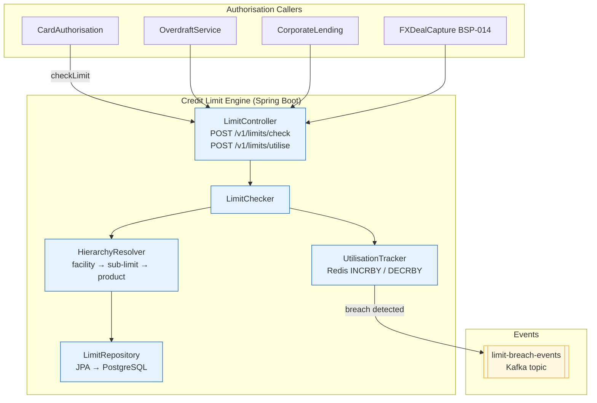

# Wave 9 — Banking Engines Implementation Plan

> **For agentic workers:** REQUIRED SUB-SKILL: Use superpowers:subagent-driven-development (recommended) or superpowers:executing-plans to implement this plan task-by-task. Steps use checkbox (`- [ ]`) syntax for tracking.

**Goal:** Author 15 full-depth banking engine pattern docs (BSP-006–020) at the same ops-runbook depth as BSP-001–005, committed in four sub-wave groups (9A–9D) each followed by a Mermaid lint + compliance + link-validator gate.

**Architecture:** Every engine doc lives in `knowledge-base/patterns/banking-solutions/` and follows the established 15-section radii template (see BSP-001 `double-entry-ledger.md` as the model). Catalog inventory (`governance/standards/_catalog-inventory.yml`) and catalog markdown (`governance/standards/enterprise-architecture-catalog.md`) are both updated in Task 0, with status set to Proposed; each sub-wave gate flips the group's status to Draft. All 15 docs start in Proposed and move to Draft after their group gate passes.

**Tech Stack:** Java 21, Spring Boot 3.x, Resilience4j, Spring Kafka, Spring Batch 5.x, Drools 9.x, OPA/Rego, PostgreSQL 16, Redis 7, HashiCorp Vault, OTEL Java Agent 2.x, Micrometer.

---

## Document Template Reference

Model your docs exactly on `knowledge-base/patterns/banking-solutions/double-entry-ledger.md`. Section order:

```
# <Title>
Status: Draft | Last Reviewed: 2026-05-21 | Owner: @<owner>
Catalog ID: BSP-XXX | Radii
Tier Applicability: T0[, T1[, T2]]

## Problem Statement      (~150–200 words, 4–5 concrete pain points)
## Solution               (~80 words narrative + Mermaid flowchart)
## Implementation Guidelines  (3–4 numbered subsections with Java code)
## Compliance Mapping     (Ring 0 / Ring 1 / Ring 2 table)
## NFR Acceptance Criteria (YAML block — performance, availability, correctness)
## Cost / FinOps          (~5 bullet points)
## Threat Model           (STRIDE analysis — ≥2 named threats with category in parens)
## Operational Runbook    (numbered steps; ≥1 Alert: Name format entry)
## Test Strategy          (Unit / Integration / Compliance / Chaos subsections)
## Context                (~80 words)
## When to Use            (bullet list)
## When Not to Use        (bullet list)
## Variants               (table: Variant | When to prefer | Trade-off)
## Related Patterns       (≥2 cross-links)
## References
---
**Key Takeaway**: <one sentence>
```

**Ring 2 rule**: every Compliance Mapping table must include a Ring 2 row referencing SBV Circular 09/2020 or Decree 13/2023. The row's last cell must end with `⚠️ (working summary — pending Legal review)`.

**Threat model rule**: STRIDE category must be in parentheses after the threat name — e.g., `**Tampering — rate table manipulation**`. Valid categories: `(Spoofing)`, `(Tampering)`, `(Repudiation)`, `(Information Disclosure)`, `(Denial of Service)`, `(Elevation of Privilege)`.

**Alert rule**: runbook entries use `Alert: SomeName` colon format — never backtick-wrapped metrics like `` Alert: `metric > threshold` ``.

---

## File Map

| Task | Action | Path |
|------|--------|------|
| 0 | Modify | `governance/standards/_catalog-inventory.yml` |
| 0 | Modify | `governance/standards/enterprise-architecture-catalog.md` |
| 1 | Create | `knowledge-base/patterns/banking-solutions/pricing-engine.md` |
| 2 | Create | `knowledge-base/patterns/banking-solutions/interest-calculation-engine.md` |
| 3 | Create | `knowledge-base/patterns/banking-solutions/fee-engine.md` |
| 4 | Create | `knowledge-base/patterns/banking-solutions/tax-calculation-engine.md` |
| 5 | Gate | Wave 9A — BSP-006–009 |
| 6 | Create | `knowledge-base/patterns/banking-solutions/rule-decisioning-engine.md` |
| 7 | Create | `knowledge-base/patterns/banking-solutions/credit-limit-engine.md` |
| 8 | Create | `knowledge-base/patterns/banking-solutions/transaction-limit-engine.md` |
| 9 | Create | `knowledge-base/patterns/banking-solutions/collateral-management-engine.md` |
| 10 | Gate | Wave 9B — BSP-010–013 |
| 11 | Create | `knowledge-base/patterns/banking-solutions/fx-rate-engine.md` |
| 12 | Create | `knowledge-base/patterns/banking-solutions/position-keeping-engine.md` |
| 13 | Create | `knowledge-base/patterns/banking-solutions/settlement-engine.md` |
| 14 | Gate | Wave 9C — BSP-014–016 |
| 15 | Create | `knowledge-base/patterns/banking-solutions/product-factory.md` |
| 16 | Create | `knowledge-base/patterns/banking-solutions/accrual-engine.md` |
| 17 | Create | `knowledge-base/patterns/banking-solutions/collections-engine.md` |
| 18 | Create | `knowledge-base/patterns/banking-solutions/relationship-pricing-engine.md` |
| 19 | Gate | Wave 9D — BSP-017–020 + final verification |

---

## Task 0: Catalog Setup — Inventory YAML + Catalog Markdown

**Files:**
- Modify: `governance/standards/_catalog-inventory.yml`
- Modify: `governance/standards/enterprise-architecture-catalog.md`

- [ ] **Step 1: Append 15 new BSP entries to `_catalog-inventory.yml`**

At the very end of the file (after the `INT-012` block), append exactly:

```yaml
- id: BSP-006
  title: Pricing Engine
  category: banking-solutions
  status: Proposed
  owner: payments-domain-owner
  path: knowledge-base/patterns/banking-solutions/pricing-engine.md
  tiers: [T0, T1]
  spine_or_radii: radii
  compliance_refs:
    ring0: [IFRS 15, PCI-DSS §4]
    ring1: [BCBS 239 §4, ISO 4217]
    ring2: [SBV Circular 09/2020 §IV.2]
  last_reviewed: '2026-05-21'
  notes: Wave 9A
  target_wave: 9
- id: BSP-007
  title: Interest Calculation Engine
  category: banking-solutions
  status: Proposed
  owner: core-banking-domain-owner
  path: knowledge-base/patterns/banking-solutions/interest-calculation-engine.md
  tiers: [T0, T1]
  spine_or_radii: radii
  compliance_refs:
    ring0: [IFRS 9 §B5.4, Act/365 ISDA]
    ring1: [BCBS 239 §4]
    ring2: [SBV Circular 39/2016, SBV Circular 09/2020 §IV.3]
  last_reviewed: '2026-05-21'
  notes: Wave 9A
  target_wave: 9
- id: BSP-008
  title: Fee Engine
  category: banking-solutions
  status: Proposed
  owner: core-banking-domain-owner
  path: knowledge-base/patterns/banking-solutions/fee-engine.md
  tiers: [T0, T1, T2]
  spine_or_radii: radii
  compliance_refs:
    ring0: [IFRS 15, OWASP Top-10]
    ring1: [BCBS 239 §6]
    ring2: [SBV Circular 09/2020 §IV.2, Decree 13/2023 Art. 9]
  last_reviewed: '2026-05-21'
  notes: Wave 9A
  target_wave: 9
- id: BSP-009
  title: Tax Calculation Engine
  category: banking-solutions
  status: Proposed
  owner: head-of-compliance
  path: knowledge-base/patterns/banking-solutions/tax-calculation-engine.md
  tiers: [T0, T1, T2]
  spine_or_radii: radii
  compliance_refs:
    ring0: [OECD BEPS, FATF Rec. 6]
    ring1: [BCBS 239 §6]
    ring2: [Vietnam Tax Law 2023, Decree 13/2023, SBV Circular 09/2020 §IV.3]
  last_reviewed: '2026-05-21'
  notes: Wave 9A
  target_wave: 9
- id: BSP-010
  title: Rule / Decisioning Engine
  category: banking-solutions
  status: Proposed
  owner: tech-lead-backend
  path: knowledge-base/patterns/banking-solutions/rule-decisioning-engine.md
  tiers: [T0, T1]
  spine_or_radii: radii
  compliance_refs:
    ring0: [NIST SP 800-53 SA-11, OWASP ASVS §12]
    ring1: [FATF Rec. 6, BCBS 239 §6]
    ring2: [SBV Circular 09/2020 §IV.2, Decree 13/2023]
  last_reviewed: '2026-05-21'
  notes: Wave 9B
  target_wave: 9
- id: BSP-011
  title: Credit Limit Engine
  category: banking-solutions
  status: Proposed
  owner: risk-management-domain-owner
  path: knowledge-base/patterns/banking-solutions/credit-limit-engine.md
  tiers: [T0, T1]
  spine_or_radii: radii
  compliance_refs:
    ring0: [Basel III §§ 4.1–4.3, NIST SP 800-53]
    ring1: [BCBS 239 §§ 4–6, BCBS 230 §27]
    ring2: [SBV Circular 41/2016 (credit classification), SBV Circular 09/2020 §IV.2]
  last_reviewed: '2026-05-21'
  notes: Wave 9B
  target_wave: 9
- id: BSP-012
  title: Transaction Limit Engine
  category: banking-solutions
  status: Proposed
  owner: risk-management-domain-owner
  path: knowledge-base/patterns/banking-solutions/transaction-limit-engine.md
  tiers: [T0, T1, T2]
  spine_or_radii: radii
  compliance_refs:
    ring0: [PCI-DSS §10, NIST SP 800-53 AC-4]
    ring1: [FATF Rec. 16, BCBS 239 §6]
    ring2: [SBV Circular 09/2020 §IV.2, Decree 13/2023 Art. 9]
  last_reviewed: '2026-05-21'
  notes: Wave 9B
  target_wave: 9
- id: BSP-013
  title: Collateral Management Engine
  category: banking-solutions
  status: Proposed
  owner: risk-management-domain-owner
  path: knowledge-base/patterns/banking-solutions/collateral-management-engine.md
  tiers: [T0, T1]
  spine_or_radii: radii
  compliance_refs:
    ring0: [Basel III §§ 5.1–5.4 (CRM), NIST SP 800-53]
    ring1: [BCBS 239 §§ 4–6, BCBS 230 §27]
    ring2: [SBV Circular 39/2016 (secured lending), SBV Circular 09/2020 §IV.2]
  last_reviewed: '2026-05-21'
  notes: Wave 9B
  target_wave: 9
- id: BSP-014
  title: FX Rate Engine
  category: banking-solutions
  status: Proposed
  owner: payments-domain-owner
  path: knowledge-base/patterns/banking-solutions/fx-rate-engine.md
  tiers: [T0, T1]
  spine_or_radii: radii
  compliance_refs:
    ring0: [ISO 4217, ISDA FX Definitions]
    ring1: [BCBS 239 §§ 4–6, SWIFT CSP 2024 §5]
    ring2: [SBV Exchange Rate Regulations 2023, SBV Circular 09/2020 §IV.2]
  last_reviewed: '2026-05-21'
  notes: Wave 9C
  target_wave: 9
- id: BSP-015
  title: Position Keeping Engine
  category: banking-solutions
  status: Proposed
  owner: wealth-domain-owner
  path: knowledge-base/patterns/banking-solutions/position-keeping-engine.md
  tiers: [T0, T1]
  spine_or_radii: radii
  compliance_refs:
    ring0: [NIST SP 800-53, Basel III market risk]
    ring1: [BCBS 239 §§ 3–6, BCBS 230 §§ 6–8]
    ring2: [SBV Circular 09/2020 §IV.2, SBV securities regulations]
  last_reviewed: '2026-05-21'
  notes: Wave 9C
  target_wave: 9
- id: BSP-016
  title: Settlement Engine
  category: banking-solutions
  status: Proposed
  owner: payments-domain-owner
  path: knowledge-base/patterns/banking-solutions/settlement-engine.md
  tiers: [T0]
  spine_or_radii: radii
  compliance_refs:
    ring0: [ISO 20022 pacs.008/.002, PCI-DSS §4]
    ring1: [SWIFT CSP 2024, BCBS 239 §6]
    ring2: [SBV Payment System Regulations, SBV Circular 09/2020 §IV.2]
  last_reviewed: '2026-05-21'
  notes: Wave 9C
  target_wave: 9
- id: BSP-017
  title: Product Factory
  category: banking-solutions
  status: Proposed
  owner: ea-board
  path: knowledge-base/patterns/banking-solutions/product-factory.md
  tiers: [T0, T1, T2, T3]
  spine_or_radii: radii
  compliance_refs:
    ring0: [NIST SP 800-53 SA-4, OWASP ASVS §1]
    ring1: [BCBS 239 §4, BCBS 230 §27]
    ring2: [SBV product approval requirements, SBV Circular 09/2020 §III]
  last_reviewed: '2026-05-21'
  notes: Wave 9D
  target_wave: 9
- id: BSP-018
  title: Accrual Engine
  category: banking-solutions
  status: Proposed
  owner: core-banking-domain-owner
  path: knowledge-base/patterns/banking-solutions/accrual-engine.md
  tiers: [T0, T1]
  spine_or_radii: radii
  compliance_refs:
    ring0: [IFRS 9 §B5.4, IAS 18]
    ring1: [BCBS 239 §§ 4–6]
    ring2: [Vietnam Accounting Standards VAS 01, SBV Circular 09/2020 §IV.3]
  last_reviewed: '2026-05-21'
  notes: Wave 9D
  target_wave: 9
- id: BSP-019
  title: Collections Engine
  category: banking-solutions
  status: Proposed
  owner: lending-domain-owner
  path: knowledge-base/patterns/banking-solutions/collections-engine.md
  tiers: [T1, T2]
  spine_or_radii: radii
  compliance_refs:
    ring0: [FDCPA (reference), NIST SP 800-53]
    ring1: [IFRS 9 §5.5 (credit-impaired staging), BCBS 239 §6]
    ring2: [Decree 13/2023 Art. 9, SBV Circular 11/2021 (loan classification)]
  last_reviewed: '2026-05-21'
  notes: Wave 9D
  target_wave: 9
- id: BSP-020
  title: Relationship Pricing Engine
  category: banking-solutions
  status: Proposed
  owner: core-banking-domain-owner
  path: knowledge-base/patterns/banking-solutions/relationship-pricing-engine.md
  tiers: [T0, T1]
  spine_or_radii: radii
  compliance_refs:
    ring0: [ECOA (reference), NIST SP 800-53]
    ring1: [BCBS 239 §4, IFRS 15]
    ring2: [SBV Circular 09/2020 §IV.2, Decree 13/2023 Art. 9]
  last_reviewed: '2026-05-21'
  notes: Wave 9D
  target_wave: 9
```

- [ ] **Step 2: Verify inventory now has 157 rows (142 existing + 15 new)**

```bash
python3 -c "
import yaml
with open('governance/standards/_catalog-inventory.yml') as f:
    data = yaml.safe_load(f)
rows = data['rows']
bsp_new = [r for r in rows if r['id'] in [f'BSP-{i:03d}' for i in range(6, 21)]]
print('New BSP entries:', [r['id'] for r in bsp_new])
print('Total rows:', len(rows))
assert len(rows) == 157, f'Expected 157 rows, got {len(rows)}'
"
```
Expected: `New BSP entries: ['BSP-006', ..., 'BSP-020']` and `Total rows: 157`

- [ ] **Step 3: Add 15 placeholder rows to the catalog markdown table**

In `governance/standards/enterprise-architecture-catalog.md`, find the line:
```
| BSP-005 | Reversal and Chargeback | banking-solutions | Approved | radii | @payments-domain-owner | `knowledge-base/patterns/banking-solutions/reversal-and-chargeback.md` | T0 | Card-scheme rules; ISO 20022 pacs.007 | 2026-05-18 | 2 | Wave 7A — self-review complete |
```

Insert these 15 rows immediately after it:

```
| BSP-006 | Pricing Engine | banking-solutions | Proposed | radii | @payments-domain-owner | `knowledge-base/patterns/banking-solutions/pricing-engine.md` | T0, T1 | IFRS 15; PCI-DSS §4; SBV Circ. 09 §IV.2 | 2026-05-21 | 0 | Wave 9A |
| BSP-007 | Interest Calculation Engine | banking-solutions | Proposed | radii | @core-banking-domain-owner | `knowledge-base/patterns/banking-solutions/interest-calculation-engine.md` | T0, T1 | IFRS 9 §B5.4; SBV Circular 39/2016 | 2026-05-21 | 0 | Wave 9A |
| BSP-008 | Fee Engine | banking-solutions | Proposed | radii | @core-banking-domain-owner | `knowledge-base/patterns/banking-solutions/fee-engine.md` | T0, T1, T2 | IFRS 15; BCBS 239 §6; SBV Circ. 09 §IV.2 | 2026-05-21 | 0 | Wave 9A |
| BSP-009 | Tax Calculation Engine | banking-solutions | Proposed | radii | @head-of-compliance | `knowledge-base/patterns/banking-solutions/tax-calculation-engine.md` | T0, T1, T2 | Vietnam Tax Law 2023; Decree 13/2023 | 2026-05-21 | 0 | Wave 9A |
| BSP-010 | Rule / Decisioning Engine | banking-solutions | Proposed | radii | @tech-lead-backend | `knowledge-base/patterns/banking-solutions/rule-decisioning-engine.md` | T0, T1 | FATF Rec. 6; BCBS 239 §6; SBV Circ. 09 §IV.2 | 2026-05-21 | 0 | Wave 9B |
| BSP-011 | Credit Limit Engine | banking-solutions | Proposed | radii | @risk-management-domain-owner | `knowledge-base/patterns/banking-solutions/credit-limit-engine.md` | T0, T1 | Basel III; SBV Circular 41/2016 | 2026-05-21 | 0 | Wave 9B |
| BSP-012 | Transaction Limit Engine | banking-solutions | Proposed | radii | @risk-management-domain-owner | `knowledge-base/patterns/banking-solutions/transaction-limit-engine.md` | T0, T1, T2 | PCI-DSS §10; FATF Rec. 16; SBV Circ. 09 §IV.2 | 2026-05-21 | 0 | Wave 9B |
| BSP-013 | Collateral Management Engine | banking-solutions | Proposed | radii | @risk-management-domain-owner | `knowledge-base/patterns/banking-solutions/collateral-management-engine.md` | T0, T1 | Basel III CRM; SBV Circular 39/2016 | 2026-05-21 | 0 | Wave 9B |
| BSP-014 | FX Rate Engine | banking-solutions | Proposed | radii | @payments-domain-owner | `knowledge-base/patterns/banking-solutions/fx-rate-engine.md` | T0, T1 | ISO 4217; ISDA FX; SBV FX Regulations 2023 | 2026-05-21 | 0 | Wave 9C |
| BSP-015 | Position Keeping Engine | banking-solutions | Proposed | radii | @wealth-domain-owner | `knowledge-base/patterns/banking-solutions/position-keeping-engine.md` | T0, T1 | Basel III market risk; BCBS 239 §§3–6 | 2026-05-21 | 0 | Wave 9C |
| BSP-016 | Settlement Engine | banking-solutions | Proposed | radii | @payments-domain-owner | `knowledge-base/patterns/banking-solutions/settlement-engine.md` | T0 | ISO 20022 pacs; SWIFT CSP 2024; SBV Payment Regs | 2026-05-21 | 0 | Wave 9C |
| BSP-017 | Product Factory | banking-solutions | Proposed | radii | @ea-board | `knowledge-base/patterns/banking-solutions/product-factory.md` | T0, T1, T2, T3 | BCBS 239 §4; SBV product approval reqs | 2026-05-21 | 0 | Wave 9D |
| BSP-018 | Accrual Engine | banking-solutions | Proposed | radii | @core-banking-domain-owner | `knowledge-base/patterns/banking-solutions/accrual-engine.md` | T0, T1 | IFRS 9 §B5.4; VAS 01; SBV Circ. 09 §IV.3 | 2026-05-21 | 0 | Wave 9D |
| BSP-019 | Collections Engine | banking-solutions | Proposed | radii | @lending-domain-owner | `knowledge-base/patterns/banking-solutions/collections-engine.md` | T1, T2 | IFRS 9 §5.5; Decree 13/2023; SBV Circular 11/2021 | 2026-05-21 | 0 | Wave 9D |
| BSP-020 | Relationship Pricing Engine | banking-solutions | Proposed | radii | @core-banking-domain-owner | `knowledge-base/patterns/banking-solutions/relationship-pricing-engine.md` | T0, T1 | IFRS 15; BCBS 239 §4; SBV Circ. 09 §IV.2 | 2026-05-21 | 0 | Wave 9D |
```

- [ ] **Step 4: Verify catalog count**

```bash
grep -c "| Proposed |" governance/standards/enterprise-architecture-catalog.md
grep -c "| Approved |" governance/standards/enterprise-architecture-catalog.md
```
Expected: `Proposed=15`, `Approved=142`

- [ ] **Step 5: Commit setup**

```bash
git add governance/standards/_catalog-inventory.yml governance/standards/enterprise-architecture-catalog.md
git commit -m "feat(catalog): Wave 9 setup — add BSP-006–020 Proposed rows to inventory + catalog"
```

---

## Task 1: BSP-006 — Pricing Engine

**Files:**
- Create: `knowledge-base/patterns/banking-solutions/pricing-engine.md`

- [ ] **Step 1: Create the document**

Write `knowledge-base/patterns/banking-solutions/pricing-engine.md`. Target: 400–450 lines.

**Header:**
```markdown
# Pricing Engine

Status: Draft | Last Reviewed: 2026-05-21 | Owner: @payments-domain-owner
Catalog ID: BSP-006 | Radii
Tier Applicability: T0, T1
```

**Problem Statement** (write ~180 words covering these 4 pain points):
- Without a central pricing engine, each product service hard-codes its own fee schedules and rate tables — changes require code deployments across 5+ services simultaneously, creating deployment risk and pricing inconsistency between channels.
- FX spread, loan pricing, and service fee calculations use different rounding conventions in different teams, creating irreconcilable discrepancies in the daily P&L.
- Relationship-based pricing overrides (e.g., waived fees for premium customers) are implemented as ad-hoc if-else blocks per service, impossible to audit or trace.
- Real-time pricing changes (e.g., flash sale deposit rate) cannot be applied without a full SDLC cycle including regression testing.

**Solution** (write ~80 words) — describe a shared PricingEngine microservice that holds all rate tables and fee schedules; consumers call it via REST API at transaction time; uses Redis cache for hot rate lookups with PostgreSQL as source of truth; event-driven invalidation on rate table changes.

**Mermaid diagram** — include this exactly:

```mermaid
flowchart TD
    subgraph CONSUMERS["Consumers (Payment / Loan / Deposit services)"]
        PAY[PaymentService]
        LOAN[LoanService]
        DEP[DepositService]
    end

    subgraph PE["Pricing Engine (Spring Boot)"]
        API[PricingController\nPOST /v1/pricing/calculate]
        CALC[PricingCalculator\ncalculate(PricingRequest)]
        CACHE[RateCacheService\nRedis 7 — TTL 60s]
        DB_SVC[RateRepository\nJPA → PostgreSQL]
    end

    subgraph STORE["Rate Store"]
        REDIS[(Redis 7\nHot rate cache)]
        PG[(PostgreSQL 16\nrate_tables, fee_schedules\neffective_date versioned)]
    end

    subgraph ADMIN["Rate Admin"]
        ADMIN_UI[Rate Admin UI\n(internal tool)]
        KAFKA_TOPIC[[rate-changed\nKafka topic]]
    end

    PAY -->|POST /v1/pricing/calculate| API
    LOAN --> API
    DEP --> API
    API --> CALC
    CALC --> CACHE
    CACHE -->|hit| CALC
    CACHE -->|miss| DB_SVC --> PG
    DB_SVC -->|populate cache| REDIS
    ADMIN_UI -->|update rate| PG
    PG -->|CDC via Debezium| KAFKA_TOPIC
    KAFKA_TOPIC -->|invalidate cache| CACHE

    classDef svc fill:#e3f2fd,stroke:#1565c0
    classDef store fill:#fff8e1,stroke:#f9a825
    classDef admin fill:#f3e5f5,stroke:#6a1b9a
    class API,CALC,CACHE,DB_SVC svc
    class REDIS,PG store
    class ADMIN_UI,KAFKA_TOPIC admin
```

**Implementation Guidelines** — write 3 numbered subsections:

1. **PricingRequest / PricingResult API contract** — include this Java record:

```java
// PricingRequest.java
public record PricingRequest(
    String productCode,       // e.g. "FX_SPOT", "PERSONAL_LOAN", "ACCT_MAINT_FEE"
    String pricingType,       // "FEE" | "RATE" | "SPREAD"
    String currency,          // ISO 4217
    BigDecimal notional,      // transaction amount (for tiered fee calculation)
    String customerId,        // for relationship pricing lookup (BSP-020)
    LocalDate valueDate       // effective date for rate lookup
) {}

// PricingResult.java
public record PricingResult(
    BigDecimal price,         // calculated rate or fee amount
    String priceType,         // "FLAT_FEE" | "PERCENTAGE" | "SPREAD_BPS"
    String rateTableId,       // audit trail — which rate table was used
    LocalDate effectiveFrom,  // the rate version applied
    String currency
) {}
```

2. **PricingCalculator — Redis cache-aside pattern** — include this snippet:

```java
@Service
@RequiredArgsConstructor
public class PricingCalculator {

    private final RateCacheService rateCache;
    private final RateRepository rateRepository;
    private final MeterRegistry meterRegistry;

    public PricingResult calculate(PricingRequest request) {
        String cacheKey = "rate:" + request.productCode() + ":" + request.currency()
                          + ":" + request.valueDate();

        return rateCache.get(cacheKey)
            .map(cached -> applyTieredLogic(cached, request))
            .orElseGet(() -> {
                RateTable rate = rateRepository
                    .findEffective(request.productCode(), request.currency(), request.valueDate())
                    .orElseThrow(() -> new PricingNotFoundException(
                        "No rate for " + request.productCode()));
                rateCache.put(cacheKey, rate, Duration.ofSeconds(60));
                meterRegistry.counter("pricing.cache.miss").increment();
                return applyTieredLogic(rate, request);
            });
    }

    private PricingResult applyTieredLogic(RateTable rate, PricingRequest req) {
        // tiered: find the bracket for req.notional()
        BigDecimal price = rate.tiers().stream()
            .filter(t -> req.notional().compareTo(t.minNotional()) >= 0
                      && req.notional().compareTo(t.maxNotional()) < 0)
            .findFirst()
            .map(t -> t.feeType().equals("PERCENTAGE")
                ? req.notional().multiply(t.rate())
                : t.flatAmount())
            .orElse(rate.defaultRate());
        return new PricingResult(price, rate.priceType(), rate.id(),
                                 rate.effectiveFrom(), req.currency());
    }
}
```

3. **Rate table PostgreSQL schema** — include this DDL:

```sql
CREATE TABLE rate_tables (
    id              UUID PRIMARY KEY DEFAULT gen_random_uuid(),
    product_code    VARCHAR(50) NOT NULL,
    price_type      VARCHAR(20) NOT NULL,  -- FLAT_FEE | PERCENTAGE | SPREAD_BPS
    currency        CHAR(3) NOT NULL,
    effective_from  DATE NOT NULL,
    effective_to    DATE,                  -- NULL = current
    created_by      VARCHAR(100) NOT NULL,
    approved_by     VARCHAR(100) NOT NULL,
    UNIQUE (product_code, currency, effective_from)
);

CREATE TABLE rate_tiers (
    id              UUID PRIMARY KEY DEFAULT gen_random_uuid(),
    rate_table_id   UUID NOT NULL REFERENCES rate_tables(id),
    min_notional    NUMERIC(20,4) NOT NULL DEFAULT 0,
    max_notional    NUMERIC(20,4) NOT NULL,
    rate            NUMERIC(10,8),         -- NULL if flat_amount
    flat_amount     NUMERIC(20,4),         -- NULL if percentage
    fee_type        VARCHAR(20) NOT NULL   -- PERCENTAGE | FLAT
);
```

**Compliance Mapping table:**

```markdown
| Ring | Regulation | Provision | How this pattern satisfies |
|---|---|---|---|
| Ring 0 | IFRS 15 | Revenue recognition at transaction price | Rate tables record the contractual price; PricingResult.price is the IFRS 15 transaction price used for revenue booking |
| Ring 0 | PCI-DSS 4.0 | §4 — Protect cardholder data in transit | Pricing API is TLS 1.3 only; no card data stored in rate tables; rate admin access requires MFA |
| Ring 1 | BCBS 239 | §4 Granularity; §6 Adaptability | Every pricing decision references a versioned rate_table_id; historical rates are retained for audit; rate changes propagated to all consumers within 60 seconds |
| Ring 1 | ISO 4217 | Currency code standardisation | All PricingRequest and rate_tables use ISO 4217 currency codes enforced by CHECK constraint |
| Ring 2 | SBV Circular 09/2020 | §IV.2 — transaction data integrity and logging | Every pricing calculation logs productCode, rateTableId, effectiveFrom, and price to the structured audit log; log entries are immutable ⚠️ (working summary — pending Legal review) |
```

**NFR Acceptance Criteria** (YAML block):

```yaml
nfr_acceptance_criteria:
  catalog_id: BSP-006
  pattern: Pricing Engine
  performance:
    - id: BSP-006-HP-01
      description: Pricing calculation including Redis cache lookup must complete within 10ms p99 at 10,000 TPS sustained load.
      threshold: p99 < 10ms at 10,000 TPS
    - id: BSP-006-HP-02
      description: Cache miss path (Redis miss → PostgreSQL → cache populate) must complete within 50ms p99.
      threshold: p99 < 50ms (cache miss)
  availability:
    - id: BSP-006-HA-01
      description: Pricing Engine must remain available if Redis is unreachable — fall back to direct PostgreSQL reads within 200ms.
      threshold: availability ≥ 99.99% (T0); graceful Redis fallback within 200ms
  correctness:
    - id: BSP-006-COR-01
      description: Every pricing decision must reference a versioned rate table; no calculation may use an expired rate.
      threshold: 0 expired-rate pricing decisions per day (verified by nightly audit)
```

**Cost / FinOps** (~5 bullets): Redis instance sizing (r7g.large for 10K TPS); PostgreSQL read replica for admin queries; rate table audit archive to S3; CDK budget alarm at 120% baseline; relationship pricing integration avoids duplicate rate lookups via shared PricingResult cache.

**Threat Model:**
- `**Tampering — rate table manipulation (Tampering)**`: insider with database access modifies a rate_tier row to apply a zero-fee schedule. Mitigation: `created_by` and `approved_by` require a dual-approval workflow; rate_tables rows are append-only via PostgreSQL RULE (no UPDATE without creating a new version); Debezium CDC streams all changes to an immutable audit Kafka topic.
- `**Elevation of Privilege — unauthorized rate override (Elevation of Privilege)**`: service team bypasses the Pricing Engine and hard-codes a rate directly in their service. Mitigation: API gateway enforces that all pricing calls go through BSP-006; compliance check script validates no ad-hoc fee calculations exist in service code (grep for "fee.*\*.*rate" outside of pricing-engine module).

**Operational Runbook:**
1. `Alert: PricingRateStaleness` — fires when `rate_tables.effective_to IS NOT NULL AND effective_to < NOW()` for any active product. Check Rate Admin UI for pending rate updates. Escalate to Pricing team if rate gap > 1 hour.
2. `Alert: PricingCacheMissRateHigh` — fires when cache miss rate > 5% sustained for 5 minutes. Check Redis memory; inspect for cache key pattern change after deployment. Restart with `--spring.redis.time-to-live=120` if TTL too aggressive.
3. `Alert: PricingNotFoundException` — fires when calculate() throws for a valid productCode. Check rate_tables for gaps in effective_from / effective_to coverage. Run `SELECT * FROM rate_tables WHERE effective_to IS NULL` to see current active rates.

**Test Strategy** (4 subsections):
- Unit: `PricingCalculatorTest` — mock RateCacheService and RateRepository; assert tiered fee bracket selection; assert flat fee vs. percentage logic; assert cache hit bypasses DB call.
- Integration: `PricingEngineIT` (Testcontainers PostgreSQL + Redis) — seed rate_tables; call `/v1/pricing/calculate`; assert correct PricingResult; force Redis eviction; assert fallback to DB; assert result identical.
- Compliance: `RateVersionAuditTest` — after rate update, assert old transactions still resolve to the historical rateTableId; assert no expired rates returned.
- Chaos: Kill Redis mid-load; assert pricing continues (DB fallback); assert p99 < 200ms during fallback; restore Redis; assert cache repopulated within 60s.

**Context**: The Pricing Engine is the single source of truth for all fee, rate, and spread calculations across Techcombank's product portfolio. It is mandatory for T0 services where pricing inconsistency would create P&L discrepancies or regulatory exposure, and strongly recommended for T1.

**When to Use** (3 bullets): any service that charges a fee, applies an interest rate, or quotes a spread; when the same rate must be consistently applied across multiple channels (mobile, web, API); when rate changes must take effect without a service redeployment.

**When Not to Use** (2 bullets): internal treasury mark-to-market revaluation (use FX Rate Engine BSP-014 instead); batch pricing runs for accounting purposes where latency is not a constraint and batch SQL is cheaper than API calls.

**Variants table:**

| Variant | When to prefer | Trade-off |
|---------|----------------|-----------|
| Static schedule (this pattern — DB-driven rate tables) | Stable, infrequently changing rates (account maintenance fees, standard loan rates) | Requires Rate Admin UI for updates; not suitable for real-time market-driven rates |
| Parametric model (formula + market inputs) | Loan pricing with risk-based spread (base rate + credit spread + liquidity premium) | More complex calculation; requires live market data feed; combine with FX Rate Engine (BSP-014) |
| ML-assisted pricing | Risk-based personal loan pricing; credit card limit assignment | Requires ML model serving infrastructure; explainability required for regulatory fair-lending |

**Related Patterns:**
- [BSP-008 Fee Engine](fee-engine.md) — BSP-006 provides the calculated fee amount; BSP-008 posts the fee to the ledger
- [BSP-020 Relationship Pricing Engine](relationship-pricing-engine.md) — BSP-020 queries BSP-006 and applies customer-segment discounts
- [BSP-014 FX Rate Engine](fx-rate-engine.md) — provides real-time FX rates consumed by BSP-006 for FX pricing
- [DATA-013 Reference Data Master](../../patterns/data/reference-data-master.md) — currency and product codes are mastered here

**References**: IFRS 15 (Revenue from Contracts with Customers); PCI-DSS v4.0 §4; BCBS 239 Principles for Effective Risk Data Aggregation; ISO 4217 Currency codes; Redis documentation — cache-aside pattern.

**Key Takeaway**: `**Key Takeaway**: Centralise all fee, rate, and spread calculations in a single versioned Pricing Engine so that rate changes propagate to all channels in under 60 seconds without code deployments, and every pricing decision is auditable by rateTableId.`

- [ ] **Step 2: Lint the Mermaid diagram**

```bash
bash scripts/mermaid-lint-doc.sh knowledge-base/patterns/banking-solutions/pricing-engine.md
```
Expected: `pricing-engine.md — OK (1 diagram)`

- [ ] **Step 3: Commit**

```bash
git add knowledge-base/patterns/banking-solutions/pricing-engine.md
git commit -m "feat(catalog): BSP-006 Pricing Engine — Wave 9A"
```

---

## Task 2: BSP-007 — Interest Calculation Engine

**Files:**
- Create: `knowledge-base/patterns/banking-solutions/interest-calculation-engine.md`

- [ ] **Step 1: Create the document**

Write `knowledge-base/patterns/banking-solutions/interest-calculation-engine.md`. Target: 400–450 lines.

**Header:**
```markdown
# Interest Calculation Engine

Status: Draft | Last Reviewed: 2026-05-21 | Owner: @core-banking-domain-owner
Catalog ID: BSP-007 | Radii
Tier Applicability: T0, T1
```

**Problem Statement** (~180 words, 4 pain points): inconsistent day-count conventions (Act/360 vs Act/365 vs 30/360) across loan, deposit, and bond systems causing P&L discrepancies; IFRS 9 Effective Interest Rate (EIR) calculation errors leading to incorrect interest income recognition; compound interest miscalculated for savings products with monthly capitalisation; amortisation schedules generated differently by origination vs. servicing systems, causing reconciliation failures.

**Solution** (~80 words): centralised InterestCalculationEngine service exposing three APIs — `calculateAccrual`, `calculateEIR`, `generateSchedule`; DayCountStrategy pattern selects the correct convention at runtime; fully deterministic given the same inputs (no hidden state); results cached per loan/deposit ID and calculation date in Redis; Spring Batch job for EOD bulk accrual delegated to AccrualEngine (BSP-018).

**Mermaid diagram** — include this exactly:

```mermaid
flowchart TD
    subgraph CALLERS["Callers"]
        LOAN[LoanService\ncalculateAccrual()]
        DEP[DepositService\ncalculateAccrual()]
        ORIG[OriginationService\ngenerateSchedule()]
        RPT[ReportingService\ncalculateEIR()]
    end

    subgraph ICE["Interest Calculation Engine (Spring Boot)"]
        API[InterestController\nPOST /v1/interest/*]
        FACADE[InterestFacade]
        ACC[AccrualCalculator]
        EIR[EIRCalculator\nXIRR / Newton-Raphson]
        SCHED[ScheduleGenerator\nannuity / bullet / balloon]
        DC[DayCountStrategy\nAct365 | Act360 | 30_360]
    end

    LOAN -->|POST /v1/interest/accrual| API --> FACADE --> ACC --> DC
    DEP --> API
    ORIG -->|POST /v1/interest/schedule| API --> FACADE --> SCHED --> DC
    RPT -->|POST /v1/interest/eir| API --> FACADE --> EIR

    classDef svc fill:#e3f2fd,stroke:#1565c0
    class API,FACADE,ACC,EIR,SCHED,DC svc
```

**Implementation Guidelines** — 3 numbered subsections:

1. **API contract and DayCountStrategy**:

```java
public record AccrualRequest(
    String accountId,
    BigDecimal principal,
    BigDecimal annualRate,       // e.g. 0.085 for 8.5%
    LocalDate fromDate,
    LocalDate toDate,
    DayCountConvention convention // ACT_365 | ACT_360 | THIRTY_360
) {}

public enum DayCountConvention { ACT_365, ACT_360, THIRTY_360 }

public interface DayCountStrategy {
    long daysBetween(LocalDate from, LocalDate to);
    int daysInYear();
}

// Factory wires correct strategy
@Component
public class DayCountStrategyFactory {
    public DayCountStrategy get(DayCountConvention c) {
        return switch (c) {
            case ACT_365 -> new Actual365Strategy();
            case ACT_360 -> new Actual360Strategy();
            case THIRTY_360 -> new Thirty360Strategy();
        };
    }
}
```

2. **AccrualCalculator core logic**:

```java
@Service
@RequiredArgsConstructor
public class AccrualCalculator {

    private final DayCountStrategyFactory factory;

    public BigDecimal calculate(AccrualRequest req) {
        DayCountStrategy dc = factory.get(req.convention());
        long days = dc.daysBetween(req.fromDate(), req.toDate());
        // Simple interest accrual: P × r × d/Y
        return req.principal()
                  .multiply(req.annualRate())
                  .multiply(BigDecimal.valueOf(days))
                  .divide(BigDecimal.valueOf(dc.daysInYear()), 8, RoundingMode.HALF_UP);
    }
}
```

3. **EIR (XIRR) calculation using Newton-Raphson** — key snippet:

```java
public BigDecimal calculateEIR(List<CashFlow> cashFlows) {
    // Newton-Raphson iteration for XIRR
    double rate = 0.1; // initial guess
    for (int i = 0; i < 100; i++) {
        double f = 0, df = 0;
        for (CashFlow cf : cashFlows) {
            double t = ChronoUnit.DAYS.between(cashFlows.get(0).date(), cf.date()) / 365.0;
            double pv = cf.amount().doubleValue() / Math.pow(1 + rate, t);
            f  += pv;
            df += -t * pv / (1 + rate);
        }
        double delta = f / df;
        rate -= delta;
        if (Math.abs(delta) < 1e-10) break;
    }
    return BigDecimal.valueOf(rate).setScale(8, RoundingMode.HALF_UP);
}
```

**Compliance Mapping table:**

| Ring | Regulation | Provision | How this pattern satisfies |
|---|---|---|---|
| Ring 0 | IFRS 9 | §B5.4 — Effective Interest Method for amortised cost measurement | EIRCalculator implements Newton-Raphson XIRR per IFRS 9 §B5.4; result is used as the discount rate for all amortised cost instruments |
| Ring 0 | ISDA Act/365 and Act/360 Definitions | Day count conventions for interest calculation | DayCountStrategy pattern implements all three major conventions; the convention is stored on each loan/deposit contract and passed to the engine |
| Ring 1 | BCBS 239 | §4 Granularity; §5 Timeliness | AccrualResult stores convention, days, fromDate, toDate, principal, rate for full audit traceability; no approximation or rounding before storage |
| Ring 2 | SBV Circular 39/2016 | Art. 5 — interest calculation method for credit institutions | DayCountConvention.ACT_365 is the SBV-mandated default for VND-denominated instruments; engine enforces this default for VND accounts ⚠️ (working summary — pending Legal review) |

**NFR thresholds**: p99 < 5ms for single accrual calculation; p99 < 50ms for 30-period amortisation schedule; EIR calculation p99 < 200ms (Newton-Raphson convergence); batch 1M accruals within 5 minutes (delegated to BSP-018).

**Threat model**:
- `**Tampering — rate or convention substitution (Tampering)**`: caller passes wrong DayCountConvention to inflate/deflate interest. Mitigation: the convention is authoritative on the loan contract stored in the Loan Register (immutable after disbursement); engine reads convention from Loan Register, not from caller's request.
- `**Repudiation — disputed interest calculation (Repudiation)**`: customer disputes the accrual amount. Mitigation: every AccrualResult stores convention, days, annualRate, principal, resultDate — sufficient to independently reproduce the calculation; results signed with HMAC-SHA256 and archived.

**Alert**: `Alert: InterestAccrualJobFailed` — fires when Spring Batch AccrualJob exits non-zero. Check batch job logs; identify failed partition; re-run specific partition with `--spring.batch.job.enabled=true --partitionKey=<range>`.

**Test Strategy**: Unit — `AccrualCalculatorTest` parameterised across all three conventions with known good values (e.g., VND 100M × 8.5% × 90 days / 365 = VND 2,095,890.41); `EIRCalculatorTest` — known cashflow series with pre-computed XIRR. Integration (Testcontainers) — full API call; verify deterministic result. Compliance — verify ACT_365 default enforced for VND. Chaos — database unavailable; assert cached results served.

**Related Patterns**: [BSP-018 Accrual Engine](accrual-engine.md), [BSP-006 Pricing Engine](pricing-engine.md), [BSP-007 is consumed by REF-013, REF-014, REF-016]

**Key Takeaway**: `**Key Takeaway**: Centralise interest calculation with explicit day-count convention selection so that IFRS 9 EIR, amortisation schedules, and daily accruals produce identical results across origination, servicing, and reporting systems.`

- [ ] **Step 2: Lint Mermaid**

```bash
bash scripts/mermaid-lint-doc.sh knowledge-base/patterns/banking-solutions/interest-calculation-engine.md
```
Expected: `interest-calculation-engine.md — OK (1 diagram)`

- [ ] **Step 3: Commit**

```bash
git add knowledge-base/patterns/banking-solutions/interest-calculation-engine.md
git commit -m "feat(catalog): BSP-007 Interest Calculation Engine — Wave 9A"
```

---

## Task 3: BSP-008 — Fee Engine

**Files:**
- Create: `knowledge-base/patterns/banking-solutions/fee-engine.md`

- [ ] **Step 1: Create the document**

Write `knowledge-base/patterns/banking-solutions/fee-engine.md`. Target: 400–450 lines.

**Header:**
```markdown
# Fee Engine

Status: Draft | Last Reviewed: 2026-05-21 | Owner: @core-banking-domain-owner
Catalog ID: BSP-008 | Radii
Tier Applicability: T0, T1, T2
```

**Problem Statement** (~180 words, 4 pain points): fee logic scattered across payment gateway, core banking, mobile app, and CRM — no single audit trail; fee waivers granted informally by relationship managers with no system control; fee posting failures leave accounts debited without corresponding ledger entries; customer disputes cannot be resolved without manually tracing fee events across four systems.

**Solution** (~80 words): event-driven FeeEngine — business events (transaction completed, monthly statement generated, overdraft utilised) publish `FeeableEvent` to Kafka; FeeEngine consumes events, evaluates fee schedule via BSP-006 Pricing Engine, checks waiver eligibility via BSP-010 Rule Engine, posts calculated fee to Double-Entry Ledger (BSP-001), emits `FeePostedEvent` for downstream systems.

**Mermaid diagram** — include this exactly:

```mermaid
flowchart TD
    subgraph SOURCES["Event Sources"]
        PAY_SVC[PaymentService]
        STMT_SVC[StatementService]
        OD_SVC[OverdraftService]
    end

    subgraph KAFKA["Kafka"]
        FEEABLE[[feeable-events\ntopic]]
        FEE_POSTED[[fee-posted-events\ntopic]]
    end

    subgraph FE["Fee Engine (Spring Boot + Spring Kafka)"]
        CONSUMER[FeeEventConsumer\n@KafkaListener]
        EVAL[FeeEvaluator]
        WAIVER[WaiverChecker\n→ BSP-010 Rule Engine]
        PRICE[PricingClient\n→ BSP-006]
        POSTER[FeePoster\n→ BSP-001 Ledger]
    end

    PAY_SVC -->|FeeableEvent| FEEABLE
    STMT_SVC --> FEEABLE
    OD_SVC --> FEEABLE
    FEEABLE --> CONSUMER --> EVAL
    EVAL --> WAIVER
    EVAL --> PRICE
    EVAL -->|fee amount + waiver flag| POSTER
    POSTER -->|FeePostedEvent| FEE_POSTED

    classDef svc fill:#e3f2fd,stroke:#1565c0
    classDef kafka fill:#fff8e1,stroke:#f9a825
    class CONSUMER,EVAL,WAIVER,PRICE,POSTER svc
    class FEEABLE,FEE_POSTED kafka
```

**Implementation Guidelines** — 3 numbered subsections:

1. **FeeableEvent schema and FeeEventConsumer**:

```java
public record FeeableEvent(
    String eventId,           // idempotency key
    String eventType,         // "TRANSACTION_COMPLETED" | "MONTHLY_STMT" | "OVERDRAFT"
    String customerId,
    String accountId,
    BigDecimal transactionAmount,
    String currency,
    LocalDateTime occurredAt
) {}

@Component
@RequiredArgsConstructor
public class FeeEventConsumer {

    private final FeeEvaluator evaluator;

    @KafkaListener(topics = "feeable-events", groupId = "fee-engine")
    public void onFeeableEvent(@Payload FeeableEvent event,
                               @Header(KafkaHeaders.RECEIVED_PARTITION) int partition) {
        evaluator.evaluate(event);
    }
}
```

2. **FeeEvaluator — waiver check + pricing + posting**:

```java
@Service
@RequiredArgsConstructor
public class FeeEvaluator {

    private final WaiverChecker waiverChecker;
    private final PricingClient pricingClient;
    private final FeePoster poster;

    @Idempotent(keyField = "eventId")  // custom annotation backed by Redis SET NX
    public void evaluate(FeeableEvent event) {
        boolean waived = waiverChecker.isWaived(event.customerId(), event.eventType());
        if (waived) {
            log.info("Fee waived for customer={} eventType={}", event.customerId(), event.eventType());
            return;
        }
        PricingResult fee = pricingClient.calculate(new PricingRequest(
            "FEE_" + event.eventType(), "FEE", event.currency(),
            event.transactionAmount(), event.customerId(), event.occurredAt().toLocalDate()
        ));
        poster.post(event, fee);
    }
}
```

3. **FeePoster — idempotent ledger posting**:

```java
@Service
@RequiredArgsConstructor
public class FeePoster {

    private final LedgerClient ledgerClient;  // calls BSP-001 via REST
    private final KafkaTemplate<String, FeePostedEvent> kafka;

    public void post(FeeableEvent event, PricingResult fee) {
        LedgerPostingRequest posting = new LedgerPostingRequest(
            event.eventId(),        // idempotency key — same as source event
            event.accountId(),      // debit customer account
            "BANK_FEE_INCOME",      // credit income GL account
            fee.price(),
            fee.currency()
        );
        ledgerClient.post(posting);
        kafka.send("fee-posted-events", new FeePostedEvent(event.eventId(), fee.price(), fee.currency()));
    }
}
```

**Compliance Mapping**: Ring 0 — IFRS 15 (transaction price = calculated fee); Ring 1 — BCBS 239 §6 (fee events fully traceable by eventId); Ring 2 — SBV Circular 09/2020 §IV.2 (transaction logging), Decree 13/2023 Art. 9 (customer data in FeeableEvent minimised to accountId) ⚠️ (working summary — pending Legal review).

**NFR thresholds**: Fee event processing p99 < 50ms end-to-end (Kafka consumer to ledger post); idempotency guaranteed — duplicate eventId produces no second posting; availability ≥ 99.99% (T0 accounts).

**Threat model**:
- `**Tampering — fee schedule manipulation (Tampering)**`: insider modifies fee schedule in Pricing Engine (BSP-006) to zero-rate all fees. Mitigation: dual-approval rate change workflow in BSP-006; Fee Engine records pricingResult.rateTableId in every FeePostedEvent for audit correlation.
- `**Denial of Service — fee storm from malformed events (Denial of Service)**`: misconfigured source service floods feeable-events topic with millions of events. Mitigation: Kafka consumer uses rate limiting via Resilience4j RateLimiter; dead-letter topic for malformed events; circuit breaker on Ledger Client (BSP-001).

**Alert**: `Alert: FeePostingFailureSpike` — fires when fee posting error rate > 0.1% sustained over 5 minutes. Check LedgerClient circuit breaker state; inspect Ledger service health. Alert: `Alert: FeeEventLag` — fires when consumer lag on feeable-events > 10,000 events. Scale out Fee Engine pods.

**Related Patterns**: [BSP-001 Double-Entry Ledger](double-entry-ledger.md), [BSP-006 Pricing Engine](pricing-engine.md), [BSP-010 Rule / Decisioning Engine](rule-decisioning-engine.md), [INT-003 API Gateway Routing](../integration/api-gateway-routing.md)

**Key Takeaway**: `**Key Takeaway**: Process all fee events through a single engine that enforces waiver rules, fetches prices from BSP-006, and posts to the ledger idempotently — so every fee charged has a full audit chain from the originating business event to the ledger entry.`

- [ ] **Step 2: Lint Mermaid**

```bash
bash scripts/mermaid-lint-doc.sh knowledge-base/patterns/banking-solutions/fee-engine.md
```
Expected: `fee-engine.md — OK (1 diagram)`

- [ ] **Step 3: Commit**

```bash
git add knowledge-base/patterns/banking-solutions/fee-engine.md
git commit -m "feat(catalog): BSP-008 Fee Engine — Wave 9A"
```

---

## Task 4: BSP-009 — Tax Calculation Engine

**Files:**
- Create: `knowledge-base/patterns/banking-solutions/tax-calculation-engine.md`

- [ ] **Step 1: Create the document**

Write `knowledge-base/patterns/banking-solutions/tax-calculation-engine.md`. Target: 400–450 lines.

**Header:**
```markdown
# Tax Calculation Engine

Status: Draft | Last Reviewed: 2026-05-21 | Owner: @head-of-compliance
Catalog ID: BSP-009 | Radii
Tier Applicability: T0, T1, T2
```

**Problem Statement** (~180 words, 4 pain points): withholding tax rates on interest income change with each Finance Ministry circular; VAT on banking service fees is applied inconsistently across products; stamp duty on loan disbursements and real-estate transfers calculated manually per transaction; hard-coded tax logic requires full SDLC cycle to adjust for regulatory changes, creating compliance gaps.

**Solution** (~80 words): configurable TaxEngine with tax rule tables stored in PostgreSQL; rules are product-type × customer-type × jurisdiction-specific and version-controlled with effective dates; supports Withholding Tax (WHT 5%/10% on interest), VAT (10% on qualifying service fees), and Stamp Duty (0.03% on real-estate transfers); integrates with Fee Engine (BSP-008) and Ledger (BSP-001) for posting; tax rules updated without redeployment via admin UI + cache invalidation.

**Mermaid diagram:**

```mermaid
flowchart TD
    subgraph CALLERS["Callers"]
        FEE[Fee Engine BSP-008]
        INT[Interest Calculation BSP-007]
        LOAN[Loan Disbursement Service]
    end

    subgraph TE["Tax Engine (Spring Boot)"]
        API[TaxController\nPOST /v1/tax/calculate]
        RESOLVER[TaxRuleResolver\nproductType × customerType]
        CALC[TaxCalculator]
        CACHE[TaxRuleCache\nRedis 7]
        REPO[TaxRuleRepository\nJPA → PostgreSQL]
    end

    subgraph LEDGER["Downstream"]
        LED[BSP-001 Ledger\n(WHT_PAYABLE, VAT_PAYABLE, STAMP_DUTY)]
    end

    FEE -->|TaxRequest| API
    INT --> API
    LOAN --> API
    API --> RESOLVER --> CACHE
    CACHE -->|miss| REPO
    RESOLVER --> CALC
    CALC -->|TaxResult| CALLERS
    CALC -->|post tax leg| LED

    classDef svc fill:#e3f2fd,stroke:#1565c0
    classDef store fill:#fff8e1,stroke:#f9a825
    class API,RESOLVER,CALC,CACHE,REPO svc
    class LED store
```

**Implementation Guidelines** — 3 numbered subsections:

1. **TaxRequest / TaxResult and TaxRuleResolver**:

```java
public record TaxRequest(
    String taxType,         // "WHT" | "VAT" | "STAMP_DUTY"
    String productType,     // "SAVINGS_INTEREST" | "SERVICE_FEE" | "LOAN_DISBURSEMENT"
    String customerType,    // "INDIVIDUAL" | "CORPORATE"
    String jurisdiction,    // "VN" (ISO 3166)
    BigDecimal taxableAmount,
    String currency,
    LocalDate valueDate
) {}

public record TaxResult(
    BigDecimal taxAmount,
    BigDecimal taxRate,     // e.g. 0.05 for 5% WHT
    String taxType,
    String ruleId,          // audit trail
    String glAccount        // "WHT_PAYABLE" | "VAT_PAYABLE" | "STAMP_DUTY_PAYABLE"
) {}
```

2. **TaxCalculator — rule-driven calculation**:

```java
@Service
@RequiredArgsConstructor
public class TaxCalculator {

    private final TaxRuleResolver resolver;

    public TaxResult calculate(TaxRequest req) {
        TaxRule rule = resolver.resolve(req.taxType(), req.productType(),
                                        req.customerType(), req.jurisdiction(), req.valueDate());
        BigDecimal taxAmount = req.taxableAmount()
            .multiply(rule.rate())
            .setScale(0, RoundingMode.HALF_UP);  // VND rounds to whole dong
        return new TaxResult(taxAmount, rule.rate(), req.taxType(),
                              rule.id(), rule.glAccount());
    }
}
```

3. **Tax rule schema with effective dating**:

```sql
CREATE TABLE tax_rules (
    id              UUID PRIMARY KEY DEFAULT gen_random_uuid(),
    tax_type        VARCHAR(20) NOT NULL,    -- WHT | VAT | STAMP_DUTY
    product_type    VARCHAR(50) NOT NULL,
    customer_type   VARCHAR(20) NOT NULL,    -- INDIVIDUAL | CORPORATE
    jurisdiction    CHAR(2) NOT NULL DEFAULT 'VN',
    rate            NUMERIC(8,6) NOT NULL,
    gl_account      VARCHAR(50) NOT NULL,
    effective_from  DATE NOT NULL,
    effective_to    DATE,                    -- NULL = current
    source_ref      VARCHAR(200),            -- e.g. "Circular 123/2023/TT-BTC §5"
    approved_by     VARCHAR(100) NOT NULL,
    UNIQUE (tax_type, product_type, customer_type, jurisdiction, effective_from)
);
```

**Compliance Mapping**: Ring 0 — OECD BEPS (transfer pricing transparency), FATF Rec. 6 (WHT on suspicious transactions flagged); Ring 1 — BCBS 239 §6 (tax calculations traceable to ruleId); Ring 2 — Vietnam Tax Law 38/2019 (WHT rates on interest); Decree 13/2023 (customer tax data minimised to customer_type only); SBV Circular 09/2020 §IV.3 (tax posting logged with correlation ID) ⚠️ (working summary — pending Legal review).

**NFR thresholds**: Tax calculation p99 < 5ms; rule cache TTL 5 minutes; rule update takes effect within 5 minutes of admin approval; zero expired-rule calculations (verified by nightly audit).

**Threat model**:
- `**Tampering — tax rate manipulation (Tampering)**`: insider modifies tax_rules.rate to 0% for WHT on interest, evading withholding obligation. Mitigation: dual-approval workflow for tax_rules updates; effective_from date prevents backdating; Debezium CDC streams all changes to immutable audit topic; daily reconciliation compares WHT_PAYABLE ledger balance against independent tax calculation.
- `**Repudiation — dispute of WHT deduction (Repudiation)**`: corporate customer disputes WHT was applied. Mitigation: every TaxResult stores ruleId (references the specific circular and rate); result included in customer tax certificate generated at year-end; HMAC-signed.

**Alert**: `Alert: TaxRuleVersionGap` — fires when `SELECT count(*) FROM tax_rules WHERE effective_to < NOW() AND effective_from < NOW()` returns > 0. Means an expired rule has no successor — Tax Admin must create a new effective_from version immediately.

**Related Patterns**: [BSP-008 Fee Engine](fee-engine.md), [BSP-007 Interest Calculation Engine](interest-calculation-engine.md), [BSP-001 Double-Entry Ledger](double-entry-ledger.md)

**Key Takeaway**: `**Key Takeaway**: Store tax rules as versioned, admin-managed configurations so that regulatory rate changes (WHT, VAT, stamp duty) take effect within minutes of approval without any code deployment or regression risk.`

- [ ] **Step 2: Lint Mermaid**

```bash
bash scripts/mermaid-lint-doc.sh knowledge-base/patterns/banking-solutions/tax-calculation-engine.md
```
Expected: `tax-calculation-engine.md — OK (1 diagram)`

- [ ] **Step 3: Commit**

```bash
git add knowledge-base/patterns/banking-solutions/tax-calculation-engine.md
git commit -m "feat(catalog): BSP-009 Tax Calculation Engine — Wave 9A"
```

---

## Task 5: Wave 9A Gate — BSP-006–009

**Files:**
- Modify: `governance/standards/enterprise-architecture-catalog.md` (status Proposed → Draft for 4 rows)

- [ ] **Step 1: Run Mermaid lint on all 4 Wave 9A files**

```bash
for f in pricing-engine interest-calculation-engine fee-engine tax-calculation-engine; do
  bash scripts/mermaid-lint-doc.sh "knowledge-base/patterns/banking-solutions/$f.md"
done
```
Expected: all 4 files report `OK`.

- [ ] **Step 2: Run compliance check**

```bash
python3 scripts/check-compliance-rows.py
```
Expected: `Done: failures=0`

- [ ] **Step 3: Run link validator**

```bash
python3 scripts/validate-internal-links.py
```
Expected: `Broken links: 0`

- [ ] **Step 4: Self-review checklist — verify all 4 docs pass**

For each of BSP-006, BSP-007, BSP-008, BSP-009:
- [ ] All 15 sections present (Problem Statement through References + Key Takeaway)
- [ ] No "TBD", "TODO", or placeholder text
- [ ] ≥1 measurable NFR threshold (p99 ms or availability %)
- [ ] Compliance Mapping has Ring 0, Ring 1, Ring 2 rows; Ring 2 ends with `⚠️ (working summary — pending Legal review)`
- [ ] ≥2 STRIDE-labelled threats with category in explicit parens
- [ ] ≥1 `Alert: SomeName` colon-format runbook entry
- [ ] ≥2 Related Patterns cross-links

- [ ] **Step 5: Promote BSP-006–009 Proposed → Draft in catalog markdown**

In `governance/standards/enterprise-architecture-catalog.md`, change `Proposed` to `Draft` and update the notes for the four rows:

```
| BSP-006 | Pricing Engine | banking-solutions | Draft | ...| Wave 9A — self-review complete |
| BSP-007 | Interest Calculation Engine | banking-solutions | Draft | ...| Wave 9A — self-review complete |
| BSP-008 | Fee Engine | banking-solutions | Draft | ...| Wave 9A — self-review complete |
| BSP-009 | Tax Calculation Engine | banking-solutions | Draft | ...| Wave 9A — self-review complete |
```

Also update `_catalog-inventory.yml` — change `status: Proposed` to `status: Draft` for BSP-006 through BSP-009.

- [ ] **Step 6: Verify counts**

```bash
grep -c "| Draft |" governance/standards/enterprise-architecture-catalog.md
grep -c "| Proposed |" governance/standards/enterprise-architecture-catalog.md
grep -c "| Approved |" governance/standards/enterprise-architecture-catalog.md
```
Expected: `Draft=4`, `Proposed=11`, `Approved=142`

- [ ] **Step 7: Commit**

```bash
git add governance/standards/enterprise-architecture-catalog.md governance/standards/_catalog-inventory.yml
git commit -m "feat(catalog): Wave 9A gate — promote BSP-006–009 Proposed→Draft"
```

---

## Task 6: BSP-010 — Rule / Decisioning Engine

**Files:**
- Create: `knowledge-base/patterns/banking-solutions/rule-decisioning-engine.md`

- [ ] **Step 1: Create the document**

Write `knowledge-base/patterns/banking-solutions/rule-decisioning-engine.md`. Target: 400–450 lines.

**Header:**
```markdown
# Rule / Decisioning Engine

Status: Draft | Last Reviewed: 2026-05-21 | Owner: @tech-lead-backend
Catalog ID: BSP-010 | Radii
Tier Applicability: T0, T1
```

**Problem Statement** (~180 words, 4 pain points): eligibility rules (e.g., minimum salary for personal loan, maximum age for mortgage) hard-coded in microservices require full CI/CD cycle for any regulatory change; AML transaction monitoring rules buried in payment gateway code are invisible to the compliance team; fee waiver rules inconsistently applied across channels; approval workflow logic duplicated in origination, servicing, and collections systems.

**Solution**: shared RuleEngine service with three pluggable backends — table-driven (simple if-then rules stored in DB), Drools 9.x (stateful complex rules), OPA/Rego (policy-as-code for compliance rules). Callers submit a `RuleRequest` containing facts (customer attributes, transaction data, product features) and receive a `Decision` (APPROVE/DECLINE/REFER + explanation).

**Mermaid diagram:**

```mermaid
flowchart TD
    subgraph CALLERS["Callers"]
        LOAN[LoanOrigination]
        FEE[FeeEngine BSP-008]
        FRAUD[FraudDetection]
        COLL[CollectionsEngine BSP-019]
    end

    subgraph RE["Rule / Decisioning Engine (Spring Boot)"]
        API[RuleController\nPOST /v1/rules/evaluate]
        ROUTER[BackendRouter\ntable | drools | opa]
        TABLE[TableDrivenEvaluator\nDB-backed if-then]
        DROOLS[DroolsEvaluator\nKieSession per request]
        OPA[OpaEvaluator\nHTTP → OPA sidecar]
        AUDIT[AuditLogger\nimmutable rule evaluation log]
    end

    LOAN -->|RuleRequest| API --> ROUTER
    FEE --> API
    FRAUD --> API
    COLL --> API
    ROUTER -->|ruleSetType=TABLE| TABLE
    ROUTER -->|ruleSetType=DROOLS| DROOLS
    ROUTER -->|ruleSetType=OPA| OPA
    TABLE -->|Decision| AUDIT
    DROOLS --> AUDIT
    OPA --> AUDIT
    AUDIT -->|Decision| CALLERS

    classDef svc fill:#e3f2fd,stroke:#1565c0
    class API,ROUTER,TABLE,DROOLS,OPA,AUDIT svc
```

**Implementation Guidelines** — 3 numbered subsections:

1. **RuleRequest / Decision API contract**:

```java
public record RuleRequest(
    String ruleSetId,          // e.g. "LOAN_ELIGIBILITY_VN", "FEE_WAIVER", "AML_SCREENING"
    String ruleSetType,        // "TABLE" | "DROOLS" | "OPA"
    Map<String, Object> facts  // customer, transaction, product attributes as key-value map
) {}

public record Decision(
    String outcome,            // "APPROVE" | "DECLINE" | "REFER"
    String reason,             // human-readable explanation
    List<String> firedRules,   // audit — which rules fired
    String ruleSetVersion,     // version of the rule set evaluated
    Instant evaluatedAt
) {}
```

2. **DroolsEvaluator — stateless per-request KieSession**:

```java
@Component
public class DroolsEvaluator {

    private final KieContainer kieContainer;

    public Decision evaluate(RuleRequest request) {
        KieSession session = kieContainer.newKieSession(request.ruleSetId());
        try {
            DecisionHolder holder = new DecisionHolder();
            request.facts().forEach(session::setGlobal);
            session.insert(holder);
            session.fireAllRules();
            return holder.toDecision(request.ruleSetId());
        } finally {
            session.dispose();  // always dispose — no session reuse
        }
    }
}
```

3. **OPA evaluator (policy-as-code for compliance rules)**:

```java
@Component
@RequiredArgsConstructor
public class OpaEvaluator {

    private final WebClient opaClient;  // OPA sidecar at localhost:8181

    public Decision evaluate(RuleRequest request) {
        OpaInput input = new OpaInput(request.facts());
        OpaResult result = opaClient.post()
            .uri("/v1/data/" + request.ruleSetId().toLowerCase().replace('_', '/'))
            .bodyValue(Map.of("input", input))
            .retrieve()
            .bodyToMono(OpaResult.class)
            .block();
        return new Decision(
            result.allow() ? "APPROVE" : "DECLINE",
            result.reason(),
            result.firedRules(),
            result.version(),
            Instant.now()
        );
    }
}
```

**Compliance Mapping**: Ring 0 — NIST SP 800-53 SA-11 (developer security testing); OWASP ASVS §12 (business logic rules tested); Ring 1 — FATF Rec. 6 (AML transaction monitoring rules externalisable and auditable); BCBS 239 §6 (every rule evaluation logged with firedRules list); Ring 2 — SBV Circular 09/2020 §IV.2 (decision audit log retained for regulatory examination); Decree 13/2023 (facts passed to rule engine minimised — no PII in OPA policy evaluation) ⚠️ (working summary — pending Legal review).

**NFR thresholds**: TABLE evaluation p99 < 20ms; Drools evaluation p99 < 100ms (stateless KieSession); OPA evaluation p99 < 50ms (local sidecar); throughput ≥ 5,000 evaluations/second (TABLE backend).

**Threat model**:
- `**Elevation of Privilege — rule injection to bypass controls (Elevation of Privilege)**`: attacker submits a crafted RuleRequest with facts that satisfy APPROVE conditions by exploiting rule ordering gaps in a Drools ruleset. Mitigation: Drools rulesets are version-controlled in Git; changes require PR review by Compliance and Tech Lead; rulesets loaded from classpath or Nexus (not from caller request); integration tests assert that known DECLINE scenarios still decline after every rule change.
- `**Tampering — rule set modification (Tampering)**`: insider modifies the OPA policy file to approve all AML-flagged transactions. Mitigation: OPA policies are stored in Git with branch protection; deployed to OPA sidecar via CI/CD only; sidecar exposes `/health/policies` listing hash of loaded policy — monitored by Alert: OpaRuleHashMismatch.

**Alert**: `Alert: RuleEvaluationTimeout` — fires when Drools or OPA evaluation p99 > 500ms. Check for unbounded rule loops in Drools (add `@ActivationListener("salience")` guard); check OPA sidecar pod CPU throttling.

**Related Patterns**: [BSP-008 Fee Engine](fee-engine.md) — uses Rule Engine for waiver checks; [BSP-011 Credit Limit Engine](credit-limit-engine.md) — uses Rule Engine for limit override approvals; [BSP-019 Collections Engine](collections-engine.md) — uses Rule Engine for dunning strategy selection; [SEC-010 Attribute-Based Access Control](../security/attribute-based-access-control.md)

**Key Takeaway**: `**Key Takeaway**: Externalise business rules into a pluggable Rule Engine so that eligibility, waiver, and compliance rules can be updated by the Compliance team without touching application code, and every decision is auditable to the exact rule version that fired.`

- [ ] **Step 2: Lint Mermaid**

```bash
bash scripts/mermaid-lint-doc.sh knowledge-base/patterns/banking-solutions/rule-decisioning-engine.md
```
Expected: OK

- [ ] **Step 3: Commit**

```bash
git add knowledge-base/patterns/banking-solutions/rule-decisioning-engine.md
git commit -m "feat(catalog): BSP-010 Rule / Decisioning Engine — Wave 9B"
```

---

## Task 7: BSP-011 — Credit Limit Engine

**Files:**
- Create: `knowledge-base/patterns/banking-solutions/credit-limit-engine.md`

- [ ] **Step 1: Create the document**

Write `knowledge-base/patterns/banking-solutions/credit-limit-engine.md`. Target: 400–450 lines.

**Header:**
```markdown
# Credit Limit Engine

Status: Draft | Last Reviewed: 2026-05-21 | Owner: @risk-management-domain-owner
Catalog ID: BSP-011 | Radii
Tier Applicability: T0, T1
```

**Problem Statement** (~180 words): card limits checked in card authorisation system, overdraft limits checked in core banking, corporate facility limits tracked in loan management — no unified view of total customer exposure; a customer can simultaneously breach limits across products; risk desk cannot see intraday aggregate utilisation; breach detection is next-day batch, not real-time; sub-limits (e.g., a VND 5B facility with VND 2B sub-limit for FX) not enforced systematically.

**Solution**: centralised CreditLimitEngine — unified limit hierarchy (customer → facility → sub-limit → product); Redis-backed real-time utilisation counters with atomic increment; limit check API returns APPROVE/DECLINE/EXCESS with available headroom; limit updates propagated within 1 second via Kafka; facility hierarchy stored in PostgreSQL.

**Mermaid diagram:**



**Implementation Guidelines** — 3 numbered subsections:

1. **LimitCheckRequest / LimitCheckResult**:

```java
public record LimitCheckRequest(
    String customerId,
    String facilityId,       // nullable for product-level limit
    String productCode,
    BigDecimal requestedAmount,
    String currency,
    String transactionRef    // idempotency
) {}

public record LimitCheckResult(
    String outcome,          // "APPROVE" | "DECLINE" | "EXCESS_ALLOWED"
    BigDecimal availableHeadroom,
    BigDecimal currentUtilisation,
    BigDecimal limit,
    String limitId
) {}
```

2. **UtilisationTracker — atomic Redis counter**:

```java
@Component
@RequiredArgsConstructor
public class UtilisationTracker {

    private final StringRedisTemplate redis;

    public BigDecimal incrementAndGet(String limitId, BigDecimal amount, String currency) {
        String key = "util:" + limitId + ":" + currency;
        // INCRBY on integer (store in minor currency units to avoid float)
        long amountMinor = amount.movePointRight(0).longValueExact();
        Long newTotal = redis.opsForValue().increment(key, amountMinor);
        return BigDecimal.valueOf(newTotal);
    }

    public void decrement(String limitId, BigDecimal amount, String currency) {
        String key = "util:" + limitId + ":" + currency;
        redis.opsForValue().increment(key, -amount.movePointRight(0).longValueExact());
    }

    public BigDecimal getUtilisation(String limitId, String currency) {
        String val = redis.opsForValue().get("util:" + limitId + ":" + currency);
        return val == null ? BigDecimal.ZERO : new BigDecimal(val);
    }
}
```

3. **Limit hierarchy schema**:

```sql
CREATE TABLE credit_facilities (
    id              UUID PRIMARY KEY,
    customer_id     VARCHAR(50) NOT NULL,
    parent_id       UUID REFERENCES credit_facilities(id),  -- sub-limit parent
    product_code    VARCHAR(50),                             -- NULL = facility-level
    limit_amount    NUMERIC(20,4) NOT NULL,
    currency        CHAR(3) NOT NULL,
    effective_from  DATE NOT NULL,
    effective_to    DATE,
    limit_type      VARCHAR(20) NOT NULL   -- HARD | SOFT | REVOLVING
);
```

**Compliance Mapping**: Ring 0 — Basel III §§4.1–4.3 (credit risk measurement); NIST SP 800-53 (access control for limit overrides); Ring 1 — BCBS 239 §§4–6 (exposure data aggregated in real-time across all products); BCBS 230 §27 (limit breach escalation within operational resilience framework); Ring 2 — SBV Circular 41/2016 (credit classification and provisioning thresholds); SBV Circular 09/2020 §IV.2 (limit breach events logged and retained) ⚠️ (working summary — pending Legal review).

**NFR thresholds**: limit check p99 < 10ms (Redis read path); utilisation update p99 < 5ms (Redis INCRBY); consistency — utilisation counter updated within 1 second of transaction event; availability ≥ 99.99% (T0 for card authorisation path).

**Threat model**:
- `**Tampering — unauthorized limit override (Tampering)**`: operations staff manually sets facility utilisation to 0 in Redis to create headroom for a declined transaction. Mitigation: Redis is not directly accessible to operations staff; only CreditLimitEngine service account can write to `util:*` keys; limit override requires LimitAdminService API call with `CREDIT_LIMIT_OVERRIDE` role (SEC-010 ABAC) and dual-approval workflow.
- `**Denial of Service — limit check flood (Denial of Service)**`: compromised card authorisation service sends 100,000 limit check requests/second, exhausting Redis connections. Mitigation: Resilience4j RateLimiter on LimitController (10,000 req/s max); circuit breaker on Redis client (open after 50% errors in 10s window).

**Alert**: `Alert: CreditLimitBreachUnauthorized` — fires when a transaction is approved despite limitCheckResult.outcome == DECLINE (detected by reconciliation). Escalate to Risk immediately — indicates a bypass in the authorisation flow. Alert: `Alert: LimitUtilisationRedisLag` — fires when Redis utilisation > PostgreSQL computed utilisation by > 0.1%. Indicates Redis state drift; trigger reconciliation job.

**Related Patterns**: [BSP-010 Rule / Decisioning Engine](rule-decisioning-engine.md), [BSP-012 Transaction Limit Engine](transaction-limit-engine.md), [BSP-013 Collateral Management Engine](collateral-management-engine.md), [REF-016 Corporate Lending & Syndications](../../reference-architectures/corporate-lending-syndications.md)

**Key Takeaway**: `**Key Takeaway**: Maintain a single real-time credit limit hierarchy in Redis so that card authorisations, overdraft draws, and corporate drawdowns all check against the same customer exposure view, preventing multi-product limit circumvention.`

- [ ] **Step 2: Lint Mermaid**

```bash
bash scripts/mermaid-lint-doc.sh knowledge-base/patterns/banking-solutions/credit-limit-engine.md
```
Expected: OK

- [ ] **Step 3: Commit**

```bash
git add knowledge-base/patterns/banking-solutions/credit-limit-engine.md
git commit -m "feat(catalog): BSP-011 Credit Limit Engine — Wave 9B"
```

---

## Task 8: BSP-012 — Transaction Limit Engine

**Files:**
- Create: `knowledge-base/patterns/banking-solutions/transaction-limit-engine.md`

- [ ] **Step 1: Create the document**

Write `knowledge-base/patterns/banking-solutions/transaction-limit-engine.md`. Target: 400–450 lines.

**Header:**
```markdown
# Transaction Limit Engine

Status: Draft | Last Reviewed: 2026-05-21 | Owner: @risk-management-domain-owner
Catalog ID: BSP-012 | Radii
Tier Applicability: T0, T1, T2
```

**Problem Statement** (~180 words): daily transfer limits set differently per channel (mobile allows VND 500M/day, web allows VND 1B/day, NAPAS allows VND 100M/transaction) with no cross-channel aggregation; fraud exploits limit gaps by initiating transfers from multiple channels simultaneously; per-transaction caps not enforced uniformly for bulk-pay and single-pay paths; velocity limits (e.g., maximum 20 transfers per hour) not consistently applied.

**Solution**: TransactionLimitEngine using sliding-window counters in Redis — per-customer, per-channel, per-product velocity tracking; atomic INCRBY with TTL ensures window expiry without scheduled cleanup; evaluates three limit dimensions: per-transaction cap, daily aggregate, and hourly velocity; returns LimitCheckResult with remaining allowance.

**Mermaid diagram:**

```mermaid
flowchart TD
    subgraph CALLERS["Callers"]
        MOB[MobileGateway]
        WEB[WebBankingGateway]
        API_GW[APIGateway BSP]
        BULK[BulkPayService]
    end

    subgraph TLE["Transaction Limit Engine (Spring Boot)"]
        API[LimitController\nPOST /v1/tx-limits/check]
        EVAL[LimitEvaluator\nper-tx | daily | velocity]
        SLIDE[SlidingWindowCounter\nRedis INCRBY + EXPIRE]
        CONFIG[LimitConfigRepository\nJPA → PostgreSQL]
    end

    MOB -->|LimitCheckRequest| API
    WEB --> API
    API_GW --> API
    BULK --> API
    API --> EVAL --> SLIDE
    EVAL --> CONFIG

    classDef svc fill:#e3f2fd,stroke:#1565c0
    class API,EVAL,SLIDE,CONFIG svc
```

**Implementation Guidelines** — 3 numbered subsections:

1. **LimitEvaluator — three-dimension check**:

```java
@Service
@RequiredArgsConstructor
public class LimitEvaluator {

    private final SlidingWindowCounter counter;
    private final LimitConfigRepository configRepo;

    public LimitCheckResult check(LimitCheckRequest req) {
        LimitConfig config = configRepo.find(req.customerId(), req.channel(), req.productCode());

        // 1. Per-transaction cap
        if (req.amount().compareTo(config.maxPerTransaction()) > 0) {
            return LimitCheckResult.declined("Per-transaction cap exceeded: max "
                + config.maxPerTransaction() + " " + req.currency());
        }

        // 2. Daily aggregate (86400s window)
        BigDecimal dailyUsed = counter.getWindowTotal(req.customerId(), "DAILY", 86400);
        if (dailyUsed.add(req.amount()).compareTo(config.maxDaily()) > 0) {
            return LimitCheckResult.declined("Daily limit exceeded");
        }

        // 3. Hourly velocity (3600s window, count-based)
        long hourlyCount = counter.getWindowCount(req.customerId(), "HOURLY_COUNT", 3600);
        if (hourlyCount >= config.maxTransactionsPerHour()) {
            return LimitCheckResult.declined("Velocity limit: max " + config.maxTransactionsPerHour() + " per hour");
        }

        // All passed — increment counters
        counter.increment(req.customerId(), "DAILY", req.amount(), 86400);
        counter.incrementCount(req.customerId(), "HOURLY_COUNT", 3600);

        return LimitCheckResult.approved(
            config.maxDaily().subtract(dailyUsed).subtract(req.amount())
        );
    }
}
```

2. **SlidingWindowCounter — Redis INCRBY with TTL**:

```java
@Component
@RequiredArgsConstructor
public class SlidingWindowCounter {

    private final StringRedisTemplate redis;

    public BigDecimal getWindowTotal(String customerId, String dimension, long windowSeconds) {
        String key = "txlimit:" + customerId + ":" + dimension + ":" + windowSeconds;
        String val = redis.opsForValue().get(key);
        return val == null ? BigDecimal.ZERO : new BigDecimal(val);
    }

    public void increment(String customerId, String dimension, BigDecimal amount, long windowSeconds) {
        String key = "txlimit:" + customerId + ":" + dimension + ":" + windowSeconds;
        // Store in VND minor units (no decimal point issues)
        long minor = amount.movePointRight(0).longValueExact();
        Long result = redis.opsForValue().increment(key, minor);
        if (result != null && result == minor) {
            // Key was newly created — set TTL
            redis.expire(key, Duration.ofSeconds(windowSeconds));
        }
    }
}
```

3. **Limit configuration schema**:

```sql
CREATE TABLE transaction_limit_configs (
    id                      UUID PRIMARY KEY,
    customer_segment        VARCHAR(50) NOT NULL,   -- RETAIL | PREMIUM | CORPORATE
    channel                 VARCHAR(30) NOT NULL,   -- MOBILE | WEB | API | BULK
    product_code            VARCHAR(50),            -- NULL = all products
    currency                CHAR(3) NOT NULL,
    max_per_transaction     NUMERIC(20,4) NOT NULL,
    max_daily               NUMERIC(20,4) NOT NULL,
    max_transactions_per_hour INT NOT NULL,
    effective_from          DATE NOT NULL,
    effective_to            DATE
);
```

**Compliance Mapping**: Ring 0 — PCI-DSS 4.0 §10 (transaction monitoring and limits); NIST SP 800-53 AC-4 (information flow enforcement); Ring 1 — FATF Rec. 16 (velocity monitoring for wire transfer surveillance); BCBS 239 §6 (limit events logged with full context); Ring 2 — SBV Circular 09/2020 §IV.2 (transaction limit enforcement per SBV payment system rules); Decree 13/2023 Art. 9 (customer ID minimised in Redis keys — no PII stored) ⚠️ (working summary — pending Legal review).

**NFR thresholds**: limit check p99 < 5ms (Redis read + write); handles 50,000 TPS burst for mobile payment peak; daily counter Redis key expires automatically — no batch cleanup required.

**Threat model**:
- `**Denial of Service — distributed limit bypass (Denial of Service)**`: adversary splits a large transfer into hundreds of small transfers just below the per-transaction cap, spread across channels and hours to avoid velocity detection. Mitigation: cross-channel aggregation — DAILY counter is per-customer (not per-channel); hourly velocity counter also per-customer; adaptive limit tightening via Rule Engine (BSP-010) when risk score elevated.
- `**Spoofing — channel identity spoofing (Spoofing)**`: attacker spoofs a low-limit channel (API) as a high-limit channel (BRANCH) to exceed their limit. Mitigation: channel claim validated by API Gateway JWT `channel` claim; channel is set by the gateway, not by the caller; limit config key is signed by the gateway identity.

**Alert**: `Alert: TransactionLimitVelocityAnomaly` — fires when a customer's hourly velocity counter reaches 80% of maxTransactionsPerHour. Notify Fraud monitoring system; check for automated scripting. Alert: `Alert: LimitConfigMissing` — fires when LimitEvaluator cannot find a config for a customer_segment + channel combination. Block transaction with REFER outcome; escalate to Limit Admin team.

**Related Patterns**: [BSP-011 Credit Limit Engine](credit-limit-engine.md), [BSP-010 Rule / Decisioning Engine](rule-decisioning-engine.md), [SEC-011 Session Revocation](../security/session-revocation.md), [REF-015 Credit Card Issuing Platform](../../reference-architectures/credit-card-issuing-platform.md)

**Key Takeaway**: `**Key Takeaway**: Use Redis sliding-window counters for sub-5ms per-customer transaction limit checks across all three dimensions (per-transaction, daily aggregate, hourly velocity) so that limit enforcement is consistent regardless of which channel initiates the payment.`

- [ ] **Step 2: Lint Mermaid**

```bash
bash scripts/mermaid-lint-doc.sh knowledge-base/patterns/banking-solutions/transaction-limit-engine.md
```
Expected: OK

- [ ] **Step 3: Commit**

```bash
git add knowledge-base/patterns/banking-solutions/transaction-limit-engine.md
git commit -m "feat(catalog): BSP-012 Transaction Limit Engine — Wave 9B"
```

---

## Task 9: BSP-013 — Collateral Management Engine

**Files:**
- Create: `knowledge-base/patterns/banking-solutions/collateral-management-engine.md`

- [ ] **Step 1: Create the document**

Write `knowledge-base/patterns/banking-solutions/collateral-management-engine.md`. Target: 400–450 lines.

**Header:**
```markdown
# Collateral Management Engine

Status: Draft | Last Reviewed: 2026-05-21 | Owner: @risk-management-domain-owner
Catalog ID: BSP-013 | Radii
Tier Applicability: T0, T1
```

**Problem Statement** (~180 words): collateral valuation done manually — loan officers use yesterday's property valuations; securities haircuts applied inconsistently; margin calls on repo/derivative positions triggered by next-day batch, not intraday market moves; no unified collateral register — property collateral for mortgage tracked separately from securities collateral for corporate facilities; collateral substitution requests (customer wants to swap one property for another) handled via email with no system control.

**Solution**: CollateralManagementEngine — unified collateral registry (PostgreSQL); market data feed integration for real-time securities valuation; haircut table (product × collateral type); margin call generation via Kafka event when coverage ratio breaches threshold; substitution workflow with approval state machine.

**Mermaid diagram:**

```mermaid
flowchart TD
    subgraph MARKET["Market Data"]
        REUTERS[Reuters / Bloomberg\nmarket data feed]
        PROPERTY[Property Valuation\nquarterly batch]
    end

    subgraph CME["Collateral Management Engine (Spring Boot)"]
        FEED[MarketDataConsumer\n@KafkaListener]
        REVALUE[CollateralRevaluator\nvalue × (1 - haircut)]
        REGISTRY[CollateralRegistry\nJPA → PostgreSQL]
        MARGIN[MarginCallGenerator\nthreshold breach check]
        SUB[SubstitutionWorkflow\nstate machine]
    end

    subgraph EVENTS["Events"]
        MC_EVT[[margin-call-events\nKafka topic]]
        REVALUE_EVT[[collateral-revalued-events]]
    end

    REUTERS -->|price update| FEED --> REVALUE
    PROPERTY -->|quarterly update| REGISTRY
    REVALUE --> REGISTRY
    REVALUE -->|coverage < threshold| MARGIN --> MC_EVT
    REVALUE --> REVALUE_EVT

    classDef svc fill:#e3f2fd,stroke:#1565c0
    classDef kafka fill:#fff8e1,stroke:#f9a825
    class FEED,REVALUE,REGISTRY,MARGIN,SUB svc
    class MC_EVT,REVALUE_EVT kafka
```

**Implementation Guidelines** — 3 numbered subsections:

1. **Collateral revaluation and margin call check**:

```java
@Service
@RequiredArgsConstructor
public class CollateralRevaluator {

    private final CollateralRegistry registry;
    private final HaircutTable haircutTable;
    private final MarginCallGenerator marginCallGen;

    public CollateralValue revalue(String collateralId, BigDecimal marketPrice) {
        Collateral c = registry.findById(collateralId).orElseThrow();
        BigDecimal haircut = haircutTable.getHaircut(c.collateralType(), c.currency());
        // Adjusted value = market price × quantity × (1 - haircut)
        BigDecimal adjustedValue = marketPrice
            .multiply(c.quantity())
            .multiply(BigDecimal.ONE.subtract(haircut))
            .setScale(4, RoundingMode.HALF_UP);

        registry.updateValue(collateralId, adjustedValue, Instant.now());

        // Check coverage ratio for each linked facility
        c.linkedFacilityIds().forEach(facilityId -> {
            BigDecimal totalCollateral = registry.sumAdjustedValueForFacility(facilityId);
            BigDecimal outstandingExposure = registry.getExposure(facilityId);
            BigDecimal coverageRatio = totalCollateral.divide(outstandingExposure, 4, RoundingMode.HALF_UP);
            if (coverageRatio.compareTo(c.minimumCoverageRatio()) < 0) {
                marginCallGen.generate(facilityId, outstandingExposure.subtract(totalCollateral));
            }
        });

        return new CollateralValue(collateralId, adjustedValue, haircut, marketPrice, Instant.now());
    }
}
```

2. **Haircut table**:

```sql
CREATE TABLE collateral_haircuts (
    id              UUID PRIMARY KEY,
    collateral_type VARCHAR(30) NOT NULL,  -- EQUITY | BOND_IG | BOND_HY | REAL_ESTATE | CASH
    currency        CHAR(3) NOT NULL,
    haircut_rate    NUMERIC(5,4) NOT NULL, -- e.g. 0.25 for 25% haircut
    effective_from  DATE NOT NULL,
    effective_to    DATE,
    source_ref      VARCHAR(200)           -- Basel III §5.1 table reference
);
```

3. **MarginCallGenerator — event publication**:

```java
@Component
@RequiredArgsConstructor
public class MarginCallGenerator {

    private final KafkaTemplate<String, MarginCallEvent> kafka;

    public void generate(String facilityId, BigDecimal shortfall) {
        MarginCallEvent event = new MarginCallEvent(
            UUID.randomUUID().toString(),
            facilityId,
            shortfall,
            Instant.now(),
            "MARGIN_CALL"
        );
        kafka.send("margin-call-events", facilityId, event);
        log.warn("Margin call generated: facility={} shortfall={}", facilityId, shortfall);
    }
}
```

**Compliance Mapping**: Ring 0 — Basel III §§5.1–5.4 (Credit Risk Mitigation — collateral haircuts and minimum coverage ratios); NIST SP 800-53 (access control for collateral registry); Ring 1 — BCBS 239 §§4–6 (collateral position data aggregated in real-time); BCBS 230 §27 (margin call response within operational resilience SLA); Ring 2 — SBV Circular 39/2016 (secured lending collateral requirements for credit institutions); SBV Circular 09/2020 §IV.2 (margin call events logged and timestamped) ⚠️ (working summary — pending Legal review).

**NFR thresholds**: revaluation within 1 minute of market data price update; margin call generated within 5 minutes of coverage breach; collateral registry query p99 < 20ms; margin call event delivered to risk desk within 10 minutes.

**Threat model**:
- `**Tampering — collateral valuation manipulation (Tampering)**`: insider modifies market price inputs to inflate collateral value and avoid margin call. Mitigation: market data feeds are signed by Reuters/Bloomberg; CollateralRevaluator rejects unsigned or stale (> 5 min) price updates; all price inputs stored in immutable audit table with feed source hash.
- `**Information Disclosure — collateral exposure data leak (Information Disclosure)**`: collateral register queried by unauthorized service reveals corporate customer's full secured portfolio. Mitigation: CollateralRegistry API requires `COLLATERAL_READ` role (SEC-010 ABAC); customer-level queries scoped by customerId — no cross-customer queries allowed.

**Alert**: `Alert: MarginCallGenerationFailed` — fires when `marginCallGen.generate()` throws (Kafka unavailable). Fallback: write to `margin_call_pending` DB table; ops team processes manually within 2 hours. Alert: `Alert: CollateralRevaluationLag` — fires when latest revaluation timestamp for any equity collateral > 10 minutes old during trading hours. Check market data feed connection.

**Related Patterns**: [BSP-011 Credit Limit Engine](credit-limit-engine.md), [BSP-014 FX Rate Engine](fx-rate-engine.md), [REF-016 Corporate Lending & Syndications](../../reference-architectures/corporate-lending-syndications.md), [REF-017 Trade Finance Platform](../../reference-architectures/trade-finance-platform.md)

**Key Takeaway**: `**Key Takeaway**: Centralise collateral valuation with real-time market data and Basel III haircut tables so that margin calls are triggered automatically within minutes of a coverage breach, eliminating the overnight lag that creates undetected credit risk exposure.`

- [ ] **Step 2: Lint Mermaid**

```bash
bash scripts/mermaid-lint-doc.sh knowledge-base/patterns/banking-solutions/collateral-management-engine.md
```
Expected: OK

- [ ] **Step 3: Commit**

```bash
git add knowledge-base/patterns/banking-solutions/collateral-management-engine.md
git commit -m "feat(catalog): BSP-013 Collateral Management Engine — Wave 9B"
```

---

## Task 10: Wave 9B Gate — BSP-010–013

- [ ] **Step 1: Run Mermaid lint on all 4 Wave 9B files**

```bash
for f in rule-decisioning-engine credit-limit-engine transaction-limit-engine collateral-management-engine; do
  bash scripts/mermaid-lint-doc.sh "knowledge-base/patterns/banking-solutions/$f.md"
done
```
Expected: all 4 files report OK.

- [ ] **Step 2: Run compliance check**

```bash
python3 scripts/check-compliance-rows.py
```
Expected: `failures=0`

- [ ] **Step 3: Run link validator**

```bash
python3 scripts/validate-internal-links.py
```
Expected: `Broken links: 0`

- [ ] **Step 4: Self-review checklist** — same 7-item checklist as Task 5 Step 4, for BSP-010–013.

- [ ] **Step 5: Promote BSP-010–013 Proposed → Draft**

Update `enterprise-architecture-catalog.md` (4 rows: Proposed → Draft, notes → "Wave 9B — self-review complete") and `_catalog-inventory.yml` (4 entries: status → Draft).

- [ ] **Step 6: Verify counts**

```bash
grep -c "| Draft |" governance/standards/enterprise-architecture-catalog.md
grep -c "| Proposed |" governance/standards/enterprise-architecture-catalog.md
```
Expected: `Draft=8`, `Proposed=7`

- [ ] **Step 7: Commit**

```bash
git add governance/standards/enterprise-architecture-catalog.md governance/standards/_catalog-inventory.yml
git commit -m "feat(catalog): Wave 9B gate — promote BSP-010–013 Proposed→Draft"
```

---

## Task 11: BSP-014 — FX Rate Engine

**Files:**
- Create: `knowledge-base/patterns/banking-solutions/fx-rate-engine.md`

- [ ] **Step 1: Create the document**

Write `knowledge-base/patterns/banking-solutions/fx-rate-engine.md`. Target: 400–450 lines.

**Header:**
```markdown
# FX Rate Engine

Status: Draft | Last Reviewed: 2026-05-21 | Owner: @payments-domain-owner
Catalog ID: BSP-014 | Radii
Tier Applicability: T0, T1
```

**Problem Statement** (~180 words): treasury desk uses live Reuters feed, retail banking uses SBV reference rate (T+1), payment gateway hard-codes a daily rate loaded at 07:00 — three systems quote different rates for the same currency pair at the same time; FX revaluation for P&L calculation uses yet another rate from an Excel spreadsheet; customer disputes arise when the rate quoted at booking differs from the rate at settlement; cross-rates (e.g., EUR/VND derived from EUR/USD × USD/VND) calculated inconsistently.

**Solution**: centralised FXRateEngine — single source of truth for all rate types (indicative, executable, historical); rates ingested from Reuters Elektron RTDS feed and SBV daily reference; distributed to all consumers via Kafka `fx-rate-events` topic; cross-rates computed deterministically; stale rate detection with automatic alert.

**Mermaid diagram:**

```mermaid
flowchart TD
    subgraph FEEDS["Rate Sources"]
        REUTERS[Reuters Elektron RTDS\nspot/forward/NDF]
        SBV[SBV Daily Reference\n07:00 VND rates]
    end

    subgraph FRE["FX Rate Engine (Spring Boot)"]
        INGESTER[RateIngester\nWebSocket / REST polling]
        VALIDATOR[RateValidator\nstale check | spread sanity]
        STORE[RateStore\nRedis 7 — current rates\nPostgreSQL — historical]
        CROSS[CrossRateCalculator\nEUR/VND = EUR/USD × USD/VND]
        API[RateController\nGET /v1/fx/rate\nGET /v1/fx/rate/history]
    end

    subgraph CONSUMERS["Consumers"]
        PAY[PaymentService]
        PRICING[BSP-006 Pricing Engine]
        COLL[CollateralMgmt BSP-013]
        REF_SVC[FX Revaluation]
    end

    subgraph EVENTS["Events"]
        RATE_EVT[[fx-rate-events\nKafka topic]]
    end

    REUTERS --> INGESTER --> VALIDATOR --> STORE
    SBV --> INGESTER
    STORE --> CROSS --> STORE
    STORE --> RATE_EVT --> CONSUMERS
    STORE --> API --> CONSUMERS

    classDef svc fill:#e3f2fd,stroke:#1565c0
    classDef kafka fill:#fff8e1,stroke:#f9a825
    class INGESTER,VALIDATOR,STORE,CROSS,API svc
    class RATE_EVT kafka
```

**Implementation Guidelines** — 3 numbered subsections:

1. **FXRate record and rate lookup API**:

```java
public record FXRate(
    String baseCurrency,        // ISO 4217, e.g. "USD"
    String quoteCurrency,       // ISO 4217, e.g. "VND"
    BigDecimal bid,
    BigDecimal ask,
    BigDecimal mid,             // (bid + ask) / 2
    RateType rateType,          // INDICATIVE | EXECUTABLE | HISTORICAL | SBV_REFERENCE
    Instant validAt,
    Instant expiresAt,          // null for historical
    String sourceId             // "REUTERS" | "SBV" | "CROSS_CALCULATED"
) {}

public enum RateType { INDICATIVE, EXECUTABLE, SBV_REFERENCE, HISTORICAL }
```

2. **RateStore — Redis for current, PostgreSQL for historical**:

```java
@Service
@RequiredArgsConstructor
public class RateStore {

    private final StringRedisTemplate redis;
    private final FXRateRepository pgRepo;

    public void store(FXRate rate) {
        String key = "fx:" + rate.baseCurrency() + "/" + rate.quoteCurrency()
                     + ":" + rate.rateType().name();
        String json = serialize(rate);
        redis.opsForValue().set(key, json, Duration.ofMinutes(15)); // stale after 15 min
        pgRepo.save(toEntity(rate));  // always write historical record
    }

    public Optional<FXRate> getCurrent(String base, String quote, RateType type) {
        String key = "fx:" + base + "/" + quote + ":" + type.name();
        String json = redis.opsForValue().get(key);
        return Optional.ofNullable(json).map(this::deserialize);
    }
}
```

3. **CrossRateCalculator**:

```java
@Component
public class CrossRateCalculator {
    // EUR/VND = EUR/USD × USD/VND
    public FXRate calculateCross(FXRate base, FXRate quote) {
        // base = EUR/USD, quote = USD/VND → result = EUR/VND
        BigDecimal bid = base.bid().multiply(quote.bid());
        BigDecimal ask = base.ask().multiply(quote.ask());
        return new FXRate(
            base.baseCurrency(), quote.quoteCurrency(),
            bid, ask, bid.add(ask).divide(TWO, 8, HALF_UP),
            RateType.INDICATIVE, Instant.now(), null, "CROSS_CALCULATED"
        );
    }
}
```

**Compliance Mapping**: Ring 0 — ISO 4217 (currency code standard); ISDA FX and Currency Option Definitions (rate type classification); Ring 1 — BCBS 239 §§4–6 (all rate queries logged with sourceId, rateType, validAt for audit); SWIFT CSP 2024 §5 (FX data integrity in cross-border payment flows); Ring 2 — SBV Exchange Rate Regulations (Circular 02/2019/TT-NHNN) — SBV_REFERENCE rate used as baseline for retail VND transactions; SBV Circular 09/2020 §IV.2 (rate data logging) ⚠️ (working summary — pending Legal review).

**NFR thresholds**: rate propagation from Reuters feed to all consumers via Kafka p99 < 500ms; stale rate detection within 60s of feed interruption; cross-rate calculation p99 < 10ms; historical rate query p99 < 100ms.

**Threat model**:
- `**Tampering — rate feed manipulation (Tampering)**`: man-in-the-middle on the Reuters WebSocket feed substitutes a manipulated rate. Mitigation: Reuters Elektron RTDS uses TLS 1.3 with certificate pinning; RateValidator checks that bid < ask and spread within a sanity band (±20% of prior rate); outlier rates rejected and Alert: FXRateSanityBreach fired.
- `**Repudiation — disputed executed rate (Repudiation)**`: customer disputes that a different rate was applied than the one quoted. Mitigation: every FXRate record stored in PostgreSQL with validAt and sourceId; payment confirmation message includes rateId reference; rate archived for 7 years (SBV retention requirement).

**Alert**: `Alert: FXRateFeedStale` — fires when latest Reuters rate for USD/VND > 5 minutes old. Switch consumers to SBV_REFERENCE rate automatically; notify Payments Ops team. Alert: `Alert: FXRateSanityBreach` — fires when ingested rate deviates > 5% from prior rate in one tick. Reject rate; hold current rate; escalate to Treasury immediately.

**Related Patterns**: [BSP-013 Collateral Management Engine](collateral-management-engine.md), [BSP-015 Position Keeping Engine](position-keeping-engine.md), [BSP-016 Settlement Engine](settlement-engine.md), [REF-018 Treasury & FX Platform](../../reference-architectures/treasury-fx-platform.md)

**Key Takeaway**: `**Key Takeaway**: Maintain a single FX Rate Engine as the authoritative source for all rate types so that treasury, payments, collateral revaluation, and pricing all use the same rate at any point in time, eliminating cross-system P&L discrepancies.`

- [ ] **Step 2: Lint Mermaid**

```bash
bash scripts/mermaid-lint-doc.sh knowledge-base/patterns/banking-solutions/fx-rate-engine.md
```
Expected: OK

- [ ] **Step 3: Commit**

```bash
git add knowledge-base/patterns/banking-solutions/fx-rate-engine.md
git commit -m "feat(catalog): BSP-014 FX Rate Engine — Wave 9C"
```

---

## Task 12: BSP-015 — Position Keeping Engine

**Files:**
- Create: `knowledge-base/patterns/banking-solutions/position-keeping-engine.md`

- [ ] **Step 1: Create the document**

Write `knowledge-base/patterns/banking-solutions/position-keeping-engine.md`. Target: 400–450 lines.

**Header:**
```markdown
# Position Keeping Engine

Status: Draft | Last Reviewed: 2026-05-21 | Owner: @wealth-domain-owner
Catalog ID: BSP-015 | Radii
Tier Applicability: T0, T1
```

**Problem Statement** (~180 words): traders operate off T+1 batch position reports — intraday exposure invisible to risk desk until EOD reconciliation; treasury and wealth management use separate position stores with no unified view; a corporate customer's FX forward exposure, bond portfolio, and equity holdings visible only in three disconnected systems; risk desk cannot compute net open position (NOP) in real-time; EOD position batch fails periodically and requires manual intervention, leaving risk reports 24 hours stale.

**Solution**: event-sourced PositionKeepingEngine — trade events published to Kafka update positions in real-time via event sourcing; position ledger (append-only PostgreSQL journal) is the source of truth; Redis materialised position view for sub-100ms queries; aggregation by book, portfolio, currency, and instrument; EOD snapshot generated automatically from the event journal.

**Mermaid diagram:**

```mermaid
flowchart TD
    subgraph TRADE_SOURCES["Trade Sources"]
        FX_TRADE[FX Deal Capture]
        BOND[Bond Trading System]
        EQ[Equity Order Management]
        FWD[Forward Contract Service]
    end

    subgraph PKE["Position Keeping Engine (Spring Boot)"]
        CONSUMER[TradeEventConsumer\n@KafkaListener]
        APPLIER[PositionApplier\napply(TradeEvent) → PositionUpdate]
        JOURNAL[PositionJournal\nappend-only PostgreSQL]
        VIEW[PositionViewUpdater\nRedis materialised view]
        AGG[PositionAggregator\nbook / portfolio / currency]
        SNAP[EODSnapshotJob\nSpring Batch]
    end

    subgraph CONSUMERS["Position Consumers"]
        RISK[Risk Desk\nNOP / VaR]
        REPORT[Regulatory Reporting REF-008]
        COLL[Collateral Mgmt BSP-013]
    end

    FX_TRADE -->|TradeEvent| CONSUMER --> APPLIER
    BOND --> CONSUMER
    EQ --> CONSUMER
    FWD --> CONSUMER
    APPLIER --> JOURNAL
    APPLIER --> VIEW
    VIEW --> AGG
    AGG --> RISK
    AGG --> REPORT
    AGG --> COLL
    SNAP -->|reads| JOURNAL

    classDef svc fill:#e3f2fd,stroke:#1565c0
    class CONSUMER,APPLIER,JOURNAL,VIEW,AGG,SNAP svc
```

**Implementation Guidelines** — 3 numbered subsections:

1. **TradeEvent and PositionApplier**:

```java
public record TradeEvent(
    String tradeId,
    String tradeType,         // "FX_SPOT" | "BOND_BUY" | "EQUITY_SELL" | "FX_FORWARD"
    String bookId,
    String instrumentId,      // ISIN or currency pair
    String currency,
    BigDecimal quantity,      // + for long, - for short
    BigDecimal price,
    Instant tradeTime
) {}

@Service
@RequiredArgsConstructor
public class PositionApplier {

    private final PositionJournal journal;
    private final PositionViewUpdater viewUpdater;

    @Idempotent(keyField = "tradeId")
    public void apply(TradeEvent event) {
        PositionEntry entry = new PositionEntry(
            event.tradeId(), event.bookId(), event.instrumentId(),
            event.currency(), event.quantity(), event.price(), event.tradeTime()
        );
        journal.append(entry);
        viewUpdater.update(event.bookId(), event.instrumentId(), event.currency(), event.quantity());
    }
}
```

2. **PositionViewUpdater — Redis HINCRBYFLOAT**:

```java
@Component
@RequiredArgsConstructor
public class PositionViewUpdater {

    private final StringRedisTemplate redis;

    public void update(String bookId, String instrumentId, String currency, BigDecimal delta) {
        // Hash key: pos:{bookId}  field: {instrumentId}:{currency}
        String hashKey = "pos:" + bookId;
        String field = instrumentId + ":" + currency;
        redis.opsForHash().increment(hashKey, field, delta.doubleValue());
    }

    public Map<String, BigDecimal> getPosition(String bookId) {
        return redis.<String, String>opsForHash().entries("pos:" + bookId)
            .entrySet().stream()
            .collect(Collectors.toMap(Map.Entry::getKey,
                e -> new BigDecimal(e.getValue())));
    }
}
```

3. **EOD snapshot schema**:

```sql
CREATE TABLE position_journal (
    id              UUID PRIMARY KEY DEFAULT gen_random_uuid(),
    trade_id        VARCHAR(100) NOT NULL UNIQUE,  -- idempotency
    book_id         VARCHAR(50) NOT NULL,
    instrument_id   VARCHAR(50) NOT NULL,
    currency        CHAR(3) NOT NULL,
    quantity        NUMERIC(20,8) NOT NULL,
    price           NUMERIC(20,8) NOT NULL,
    trade_time      TIMESTAMPTZ NOT NULL,
    recorded_at     TIMESTAMPTZ NOT NULL DEFAULT NOW()
);
CREATE INDEX ON position_journal (book_id, instrument_id, trade_time);

CREATE TABLE position_eod_snapshots (
    snapshot_date   DATE NOT NULL,
    book_id         VARCHAR(50) NOT NULL,
    instrument_id   VARCHAR(50) NOT NULL,
    currency        CHAR(3) NOT NULL,
    net_quantity    NUMERIC(20,8) NOT NULL,
    closing_price   NUMERIC(20,8),
    market_value    NUMERIC(20,4),
    PRIMARY KEY (snapshot_date, book_id, instrument_id, currency)
);
```

**Compliance Mapping**: Ring 0 — NIST SP 800-53 (audit trail for all position changes); Basel III market risk (position-level granularity for VaR); Ring 1 — BCBS 239 §§3–6 (risk data aggregation at trade level, intraday); BCBS 230 §§6–8 (position data availability within operational resilience RTO); Ring 2 — SBV Circular 09/2020 §IV.2 (trade events logged with full audit trail); SBV securities regulations (position reporting for licensed securities firms) ⚠️ (working summary — pending Legal review).

**NFR thresholds**: position update p99 < 100ms after trade event; position query (Redis) p99 < 20ms; EOD snapshot generation for 500,000 positions within 15 minutes; event journal replay from inception within 2 hours (for disaster recovery).

**Threat model**:
- `**Repudiation — denying a trade that changed position (Repudiation)**`: trader claims a trade was never booked to avoid loss attribution. Mitigation: PositionJournal is append-only; every entry references tradeId from the authoritative order management system; BCBS 239 §3 requires data lineage from trade source to position; audit trail reviewed in dispute resolution.
- `**Information Disclosure — proprietary position exposure leak (Information Disclosure)**`: competitor gains access to the bank's aggregate net open FX position. Mitigation: PositionAggregator API requires `POSITION_READ:{bookId}` scoped ABAC role (SEC-010); cross-book aggregation restricted to `RISK_AGGREGATE_READ` role; no position data in logs.

**Alert**: `Alert: PositionReconciliationBreak` — fires when Redis position view diverges from EOD PostgreSQL snapshot by > 0.01%. Trigger `PositionRebuildJob` to recompute Redis from journal. Alert: `Alert: TradeEventLag` — fires when Kafka consumer lag > 1,000 events on position-events topic. Scale out PositionKeepingEngine pods.

**Related Patterns**: [BSP-014 FX Rate Engine](fx-rate-engine.md), [BSP-016 Settlement Engine](settlement-engine.md), [BSP-013 Collateral Management Engine](collateral-management-engine.md), [REF-018 Treasury & FX Platform](../../reference-architectures/treasury-fx-platform.md)

**Key Takeaway**: `**Key Takeaway**: Use an event-sourced position journal with a Redis materialised view to give the risk desk real-time net open position in under 100ms, replacing the overnight batch that left intraday exposure invisible.`

- [ ] **Step 2: Lint Mermaid**

```bash
bash scripts/mermaid-lint-doc.sh knowledge-base/patterns/banking-solutions/position-keeping-engine.md
```
Expected: OK

- [ ] **Step 3: Commit**

```bash
git add knowledge-base/patterns/banking-solutions/position-keeping-engine.md
git commit -m "feat(catalog): BSP-015 Position Keeping Engine — Wave 9C"
```

---

## Task 13: BSP-016 — Settlement Engine

**Files:**
- Create: `knowledge-base/patterns/banking-solutions/settlement-engine.md`

- [ ] **Step 1: Create the document**

Write `knowledge-base/patterns/banking-solutions/settlement-engine.md`. Target: 400–450 lines.

**Header:**
```markdown
# Settlement Engine

Status: Draft | Last Reviewed: 2026-05-21 | Owner: @payments-domain-owner
Catalog ID: BSP-016 | Radii
Tier Applicability: T0
```

**Problem Statement** (~180 words): RTGS large-value payments, NAPAS retail batch settlements, and internal book transfers each managed by separate systems with separate failure handling and no unified settlement status; settlement failures leave position and ledger state inconsistent; RTGS instruction retry logic differs per team; ISO 20022 message formatting inconsistent between services; no single dashboard for in-flight settlement status across all rails.

**Solution**: unified SettlementEngine — SettlementRouter directs instructions to the correct rail (RTGS, NAPAS DNS, Internal) based on amount, currency, and instruction type; ISO 20022 pacs.008/pacs.002 message generation centralised; idempotent instruction submission (same settlementRef = no duplicate); unified settlement status tracking in PostgreSQL with Kafka event emission on state transitions.

**Mermaid diagram:**

```mermaid
flowchart TD
    subgraph CALLERS["Callers"]
        PAY[PaymentService]
        FX_SETTLE[FX Settlement]
        BATCH[BatchPaymentService]
    end

    subgraph SE["Settlement Engine (Spring Boot)"]
        API[SettlementController\nPOST /v1/settlements]
        ROUTER[SettlementRouter\nRTGS | DNS | INTERNAL]
        RTGS_ADAPTER[RTGSAdapter\nISO 20022 pacs.008]
        DNS_ADAPTER[NAPASDNSAdapter\nNAPAS batch file]
        INT_ADAPTER[InternalAdapter\nBSP-001 Ledger direct]
        STATUS[SettlementStatusTracker\nPostgreSQL state machine]
    end

    subgraph RAILS["Settlement Rails"]
        RTGS[SBV RTGS\nlarge value ≥ VND 500M]
        NAPAS[NAPAS DNS\nretail batch]
        INTERNAL[Internal Ledger\nbook transfer]
    end

    subgraph EVENTS["Events"]
        SETTLED[[settlement-events\nKafka topic]]
    end

    PAY -->|SettlementInstruction| API --> ROUTER
    FX_SETTLE --> API
    BATCH --> API
    ROUTER -->|amount ≥ VND 500M| RTGS_ADAPTER --> RTGS
    ROUTER -->|retail batch| DNS_ADAPTER --> NAPAS
    ROUTER -->|same-bank| INT_ADAPTER --> INTERNAL
    RTGS_ADAPTER --> STATUS --> SETTLED
    DNS_ADAPTER --> STATUS
    INT_ADAPTER --> STATUS

    classDef svc fill:#e3f2fd,stroke:#1565c0
    classDef rail fill:#e8f5e9,stroke:#2e7d32
    classDef kafka fill:#fff8e1,stroke:#f9a825
    class API,ROUTER,RTGS_ADAPTER,DNS_ADAPTER,INT_ADAPTER,STATUS svc
    class RTGS,NAPAS,INTERNAL rail
    class SETTLED kafka
```

**Implementation Guidelines** — 3 numbered subsections:

1. **SettlementInstruction and routing logic**:

```java
public record SettlementInstruction(
    String settlementRef,       // idempotency key
    String settlementType,      // "RTGS" | "DNS" | "INTERNAL" | "AUTO" (engine decides)
    String debitAccountId,
    String creditAccountId,
    BigDecimal amount,
    String currency,
    String purposeCode,         // ISO 20022 purpose code
    LocalDate settlementDate,
    String endToEndId           // ISO 20022 EndToEndId
) {}

@Component
public class SettlementRouter {

    private static final BigDecimal RTGS_THRESHOLD = new BigDecimal("500000000"); // VND 500M

    public SettlementRail route(SettlementInstruction instruction) {
        if ("INTERNAL".equals(instruction.settlementType())) return SettlementRail.INTERNAL;
        if ("VND".equals(instruction.currency())
                && instruction.amount().compareTo(RTGS_THRESHOLD) >= 0) {
            return SettlementRail.RTGS;
        }
        // Cross-currency or large FX → RTGS
        if (!"VND".equals(instruction.currency())) return SettlementRail.RTGS;
        return SettlementRail.DNS;
    }
}
```

2. **Settlement status state machine**:

```java
public enum SettlementStatus {
    PENDING, SUBMITTED, ACKNOWLEDGED, SETTLED, FAILED, REVERSED
}

// Status transitions: PENDING → SUBMITTED → ACKNOWLEDGED → SETTLED
//                                           ↘ FAILED → (manual review)
//                     SETTLED → REVERSED (via BSP-005 Reversal)
```

3. **RTGS ISO 20022 pacs.008 message builder** (key snippet):

```java
@Component
public class Pacs008Builder {

    public String buildPacs008(SettlementInstruction instr) {
        return """
            <Document xmlns="urn:iso:std:iso:20022:tech:xsd:pacs.008.001.10">
              <FIToFICstmrCdtTrf>
                <GrpHdr>
                  <MsgId>%s</MsgId>
                  <CreDtTm>%s</CreDtTm>
                  <NbOfTxs>1</NbOfTxs>
                  <SttlmInf><SttlmMtd>CLRG</SttlmMtd></SttlmInf>
                </GrpHdr>
                <CdtTrfTxInf>
                  <PmtId>
                    <EndToEndId>%s</EndToEndId>
                    <TxId>%s</TxId>
                  </PmtId>
                  <IntrBkSttlmAmt Ccy="%s">%s</IntrBkSttlmAmt>
                  <PurpCd><Cd>%s</Cd></PurpCd>
                </CdtTrfTxInf>
              </FIToFICstmrCdtTrf>
            </Document>
            """.formatted(instr.settlementRef(), Instant.now(),
                instr.endToEndId(), instr.settlementRef(),
                instr.currency(), instr.amount().toPlainString(), instr.purposeCode());
    }
}
```

**Compliance Mapping**: Ring 0 — ISO 20022 pacs.008/pacs.002/pacs.004 (payment instruction and acknowledgment messages); PCI-DSS §4 (TLS for RTGS and NAPAS connections); Ring 1 — SWIFT CSP 2024 (secure RTGS connectivity); BCBS 239 §6 (settlement instruction logged with settlementRef, rail, status, timestamps); Ring 2 — SBV Payment System Regulations (Law on E-Transactions 2023); SBV Circular 09/2020 §IV.2 (settlement events logged and retained) ⚠️ (working summary — pending Legal review).

**NFR thresholds**: RTGS instruction submitted within 30s of creation; NAPAS DNS batch file generated by 16:30 daily; internal book transfer p99 < 50ms; settlement status query p99 < 20ms; availability ≥ 99.99% (T0).

**Threat model**:
- `**Denial of Service — settlement queue flood (Denial of Service)**`: misconfigured batch job submits 1M settlement instructions simultaneously, overwhelming the RTGS adapter queue. Mitigation: Resilience4j RateLimiter on SettlementController (500 req/s); bulkhead separating RTGS adapter thread pool from DNS and Internal adapters; circuit breaker on RTGS adapter (open after 10 failures in 30s).
- `**Repudiation — disputing a settlement instruction (Repudiation)**`: counterparty claims a settlement instruction was never submitted. Mitigation: every SettlementInstruction stored in PostgreSQL before submission; RTGS pacs.002 acknowledgment stored with settlementRef; Kafka `settlement-events` topic is append-only and retained for 7 years.

**Alert**: `Alert: SettlementInstructionRejected` — fires when RTGS returns pacs.002 with `RJCT` status. Parse rejection reason code; check insufficient funds in nostro account; notify Payments Ops. Alert: `Alert: DNSBatchFileMissing` — fires at 16:35 if NAPAS DNS batch file not generated. Trigger emergency batch generation; escalate to Payments Operations.

**Related Patterns**: [BSP-014 FX Rate Engine](fx-rate-engine.md), [BSP-015 Position Keeping Engine](position-keeping-engine.md), [BSP-001 Double-Entry Ledger](double-entry-ledger.md), [REF-002 Real-Time Payments — NAPAS](../../reference-architectures/real-time-payments-napas.md)

**Key Takeaway**: `**Key Takeaway**: Route all settlement instructions through a single engine that selects the correct rail (RTGS/DNS/Internal), generates ISO 20022-compliant messages, and tracks status through a unified state machine — eliminating per-rail settlement silos and their inconsistent failure handling.`

- [ ] **Step 2: Lint Mermaid**

```bash
bash scripts/mermaid-lint-doc.sh knowledge-base/patterns/banking-solutions/settlement-engine.md
```
Expected: OK

- [ ] **Step 3: Commit**

```bash
git add knowledge-base/patterns/banking-solutions/settlement-engine.md
git commit -m "feat(catalog): BSP-016 Settlement Engine — Wave 9C"
```

---

## Task 14: Wave 9C Gate — BSP-014–016

- [ ] **Step 1: Run Mermaid lint on all 3 Wave 9C files**

```bash
for f in fx-rate-engine position-keeping-engine settlement-engine; do
  bash scripts/mermaid-lint-doc.sh "knowledge-base/patterns/banking-solutions/$f.md"
done
```
Expected: all 3 report OK.

- [ ] **Step 2: Run compliance check**

```bash
python3 scripts/check-compliance-rows.py
```
Expected: `failures=0`

- [ ] **Step 3: Run link validator**

```bash
python3 scripts/validate-internal-links.py
```
Expected: `Broken links: 0`

- [ ] **Step 4: Self-review checklist** — same 7-item checklist for BSP-014, BSP-015, BSP-016.

- [ ] **Step 5: Promote BSP-014–016 Proposed → Draft** in both catalog markdown (3 rows) and `_catalog-inventory.yml` (3 entries).

- [ ] **Step 6: Verify counts**

```bash
grep -c "| Draft |" governance/standards/enterprise-architecture-catalog.md
grep -c "| Proposed |" governance/standards/enterprise-architecture-catalog.md
```
Expected: `Draft=11`, `Proposed=4`

- [ ] **Step 7: Commit**

```bash
git add governance/standards/enterprise-architecture-catalog.md governance/standards/_catalog-inventory.yml
git commit -m "feat(catalog): Wave 9C gate — promote BSP-014–016 Proposed→Draft"
```

---

## Task 15: BSP-017 — Product Factory

**Files:**
- Create: `knowledge-base/patterns/banking-solutions/product-factory.md`

- [ ] **Step 1: Create the document**

Write `knowledge-base/patterns/banking-solutions/product-factory.md`. Target: 400–450 lines.

**Header:**
```markdown
# Product Factory

Status: Draft | Last Reviewed: 2026-05-21 | Owner: @ea-board
Catalog ID: BSP-017 | Radii
Tier Applicability: T0, T1, T2, T3
```

**Problem Statement** (~180 words): launching a new savings product requires changes to 7 services simultaneously (core banking, fee engine, interest engine, mobile app, web portal, reporting, compliance); product term changes (e.g., deposit rate increase) require a full CI/CD cycle with regression testing; no A/B testing or gradual rollout for new product features; product configuration drifts across environments (dev uses different fee schedule than prod); product retirement leaves orphaned configuration in multiple systems.

**Solution**: ProductFactory — single product catalog service with versioned ProductDefinition objects; each product is parameterised (rates, fees, limits, features, eligibility rules all as data fields); effective dating ensures the right version is active at any point in time; consumers call `getProduct(productCode, date)` to get the authoritative definition; product changes are admin-UI driven with approval workflow, not code changes.

**Mermaid diagram:**

```mermaid
flowchart TD
    subgraph ADMIN["Product Administration"]
        PM[Product Manager\nProduct Admin UI]
        APPROVAL[Approval Workflow\nDual sign-off]
    end

    subgraph PF["Product Factory (Spring Boot)"]
        API[ProductController\nGET /v1/products/{code}\nPOST /v1/products (admin)]
        VERSIONER[ProductVersionManager\neffective dating]
        REPO[ProductRepository\nJPA → PostgreSQL]
        CACHE[ProductCache\nRedis 7 — TTL 5 min]
        VALIDATOR[ProductValidator\nschema + business rules]
    end

    subgraph CONSUMERS["Consumers"]
        BSP6[BSP-006 Pricing Engine]
        BSP7[BSP-007 Interest Engine]
        BSP8[BSP-008 Fee Engine]
        LOAN_SVC[LoanOriginationService]
        MOB[MobileApp]
    end

    subgraph EVENTS["Events"]
        PROD_EVT[[product-version-events\nKafka topic]]
    end

    PM --> APPROVAL --> API
    API --> VALIDATOR --> VERSIONER --> REPO
    API --> CACHE
    CACHE --> CONSUMERS
    REPO -->|CDC| PROD_EVT -->|cache invalidation| CACHE

    classDef svc fill:#e3f2fd,stroke:#1565c0
    classDef admin fill:#f3e5f5,stroke:#6a1b9a
    classDef kafka fill:#fff8e1,stroke:#f9a825
    class API,VERSIONER,REPO,CACHE,VALIDATOR svc
    class PM,APPROVAL admin
    class PROD_EVT kafka
```

**Implementation Guidelines** — 3 numbered subsections:

1. **ProductDefinition record**:

```java
public record ProductDefinition(
    String productCode,
    String productName,
    String productType,             // "SAVINGS" | "LOAN" | "CARD" | "TRADE_FINANCE" etc.
    LocalDate effectiveFrom,
    LocalDate effectiveTo,          // null = current version
    String version,                 // semantic version "2.3.0"
    Map<String, BigDecimal> rates,  // "BASE_RATE" → 0.085, "PENALTY_RATE" → 0.15
    Map<String, BigDecimal> fees,   // "MONTHLY_FEE" → 50000, "ANNUAL_FEE" → 0
    Map<String, BigDecimal> limits, // "MIN_BALANCE" → 500000, "MAX_DRAWDOWN" → 5E9
    Map<String, Boolean> features,  // "ONLINE_BANKING_ENABLED" → true
    List<String> eligibilityRuleIds // references to BSP-010 Rule Engine rule sets
) {}
```

2. **ProductVersionManager — effective date lookup**:

```java
@Service
@RequiredArgsConstructor
public class ProductVersionManager {

    private final ProductRepository repo;
    private final ProductCache cache;

    public ProductDefinition getVersion(String productCode, LocalDate asOf) {
        String cacheKey = "product:" + productCode + ":" + asOf;
        return cache.get(cacheKey).orElseGet(() -> {
            ProductDefinition def = repo.findEffective(productCode, asOf)
                .orElseThrow(() -> new ProductNotFoundException(productCode + " at " + asOf));
            cache.put(cacheKey, def, Duration.ofMinutes(5));
            return def;
        });
    }

    public ProductDefinition createVersion(String productCode, ProductDefinition newVersion) {
        // Ensure no gap in effective_from / effective_to coverage
        repo.closeCurrentVersion(productCode, newVersion.effectiveFrom().minusDays(1));
        return repo.save(toEntity(newVersion));
    }
}
```

3. **Product schema with effective dating**:

```sql
CREATE TABLE products (
    id              UUID PRIMARY KEY DEFAULT gen_random_uuid(),
    product_code    VARCHAR(50) NOT NULL,
    product_name    VARCHAR(200) NOT NULL,
    product_type    VARCHAR(50) NOT NULL,
    effective_from  DATE NOT NULL,
    effective_to    DATE,
    version         VARCHAR(20) NOT NULL,
    definition_json JSONB NOT NULL,        -- stores rates, fees, limits, features
    approved_by     VARCHAR(100) NOT NULL,
    created_at      TIMESTAMPTZ DEFAULT NOW(),
    UNIQUE (product_code, effective_from)
);
CREATE INDEX ON products (product_code, effective_from, effective_to);
```

**Compliance Mapping**: Ring 0 — NIST SP 800-53 SA-4 (product definition lifecycle); OWASP ASVS §1 (product configuration security); Ring 1 — BCBS 239 §4 (product definition versioned and traceable); BCBS 230 §27 (product version changes captured in audit log); Ring 2 — SBV product approval requirements (new banking products require regulatory pre-approval — ProductValidator enforces approval_ref field); SBV Circular 09/2020 §III (product data integrity) ⚠️ (working summary — pending Legal review).

**NFR thresholds**: product lookup p99 < 5ms (cache hit); product version activation lag < 1 minute at effectiveFrom; cache invalidation via Kafka < 30 seconds after admin approval; zero orphaned product versions (verified by daily consistency check).

**Threat model**:
- `**Tampering — unauthorized product term modification (Tampering)**`: service team directly modifies definition_json in PostgreSQL to change their product's fee to zero. Mitigation: service accounts have SELECT-only on products table; INSERT only via ProductFactory API; dual-approval workflow enforced in API; ProductValidator rejects any modification that bypasses the approval_ref field.
- `**Elevation of Privilege — bypassing product approval workflow (Elevation of Privilege)**`: developer deploys a hardcoded product definition in their service, bypassing ProductFactory entirely. Mitigation: compliance check script (scripts/check-compliance-rows.py) validates that all services reference ProductFactory for product configuration; architecture review gate in CI.

**Alert**: `Alert: ProductVersionActivationFailed` — fires when effective_from date passes but the new version is not loaded in cache (CDC event missed). Trigger manual cache invalidation via `/v1/products/{code}/invalidate`; restart affected consumers. Alert: `Alert: ProductApprovalPending` — fires when a product version is created but not approved within 24 hours. Notify Product Management team.

**Related Patterns**: [BSP-006 Pricing Engine](pricing-engine.md), [BSP-007 Interest Calculation Engine](interest-calculation-engine.md), [BSP-008 Fee Engine](fee-engine.md), [BSP-010 Rule / Decisioning Engine](rule-decisioning-engine.md), [REF-013 Retail Deposits Platform](../../reference-architectures/retail-deposits-platform.md)

**Key Takeaway**: `**Key Takeaway**: Define all banking products as versioned, admin-managed configurations in a central Product Factory so that product launches, rate changes, and feature toggles are approval-gated data changes — not code deployments — and every consumer uses the same authoritative product definition.`

- [ ] **Step 2: Lint Mermaid**

```bash
bash scripts/mermaid-lint-doc.sh knowledge-base/patterns/banking-solutions/product-factory.md
```
Expected: OK

- [ ] **Step 3: Commit**

```bash
git add knowledge-base/patterns/banking-solutions/product-factory.md
git commit -m "feat(catalog): BSP-017 Product Factory — Wave 9D"
```

---

## Task 16: BSP-018 — Accrual Engine

**Files:**
- Create: `knowledge-base/patterns/banking-solutions/accrual-engine.md`

- [ ] **Step 1: Create the document**

Write `knowledge-base/patterns/banking-solutions/accrual-engine.md`. Target: 400–450 lines.

**Header:**
```markdown
# Accrual Engine

Status: Draft | Last Reviewed: 2026-05-21 | Owner: @core-banking-domain-owner
Catalog ID: BSP-018 | Radii
Tier Applicability: T0, T1
```

**Problem Statement** (~180 words): daily interest and fee accruals run as a single monolithic batch job processing all accounts sequentially — a single account processing failure halts the entire batch; partial batch completion leaves some accounts accrued and others not, making the trial balance unbalanced at month-end; IFRS 9 EIR accrual for amortised cost instruments computed manually in Excel and reconciled with the batch — two different numbers; accrual job runtime grows linearly with account count, now taking 6 hours and approaching the 8-hour EOD window limit.

**Solution**: partitioned AccrualEngine using Spring Batch — accounts partitioned by ID range; each partition processed by an independent step worker; failures in one partition do not affect others; idempotent posting to BSP-001 Ledger ensures safe retry; IFRS 9 EIR accrual calculated via BSP-007 Interest Engine; Kafka `accrual-completed-events` published per partition for downstream systems.

**Mermaid diagram:**

```mermaid
flowchart TD
    subgraph TRIGGER["EOD Trigger"]
        SCHEDULER[EOD Scheduler\n22:00 ICT daily]
    end

    subgraph AE["Accrual Engine (Spring Boot + Spring Batch)"]
        JOB[AccrualJob\nJobLauncher]
        PARTITION[AccountPartitioner\n0–999K | 1M–1.999M | ...]
        STEP_A[AccrualStepWorker A\npartition 0]
        STEP_B[AccrualStepWorker B\npartition 1]
        STEP_N[AccrualStepWorker N\npartition N]
        READER[AccountItemReader\nJPA paginated cursor]
        CALC[InterestCalculatorClient\n→ BSP-007]
        WRITER[LedgerItemWriter\n→ BSP-001 (idempotent)]
    end

    subgraph EVENTS["Events"]
        ACR_EVT[[accrual-completed-events\nKafka topic]]
    end

    SCHEDULER --> JOB --> PARTITION
    PARTITION --> STEP_A & STEP_B & STEP_N
    STEP_A --> READER --> CALC --> WRITER --> ACR_EVT

    classDef svc fill:#e3f2fd,stroke:#1565c0
    classDef kafka fill:#fff8e1,stroke:#f9a825
    class JOB,PARTITION,STEP_A,STEP_B,STEP_N,READER,CALC,WRITER svc
    class ACR_EVT kafka
```

**Implementation Guidelines** — 3 numbered subsections:

1. **AccrualJob configuration (Spring Batch)**:

```java
@Configuration
@RequiredArgsConstructor
public class AccrualJobConfig {

    private final JobRepository jobRepository;
    private final PlatformTransactionManager txManager;
    private final AccountPartitioner partitioner;
    private final AccountItemReader reader;
    private final AccrualItemProcessor processor;
    private final LedgerItemWriter writer;

    @Bean
    public Job accrualJob() {
        return new JobBuilder("accrualJob", jobRepository)
            .start(partitionedStep())
            .build();
    }

    @Bean
    public Step partitionedStep() {
        return new StepBuilder("partitionedAccrual", jobRepository)
            .partitioner("accrualWorker", partitioner)
            .step(workerStep())
            .gridSize(20)  // 20 parallel partitions
            .build();
    }

    @Bean
    @StepScope
    public Step workerStep() {
        return new StepBuilder("accrualWorker", jobRepository)
            .<Account, AccrualPosting>chunk(500, txManager)
            .reader(reader)
            .processor(processor)
            .writer(writer)
            .faultTolerant()
            .retryLimit(3)
            .retry(TransientDataAccessException.class)
            .build();
    }
}
```

2. **AccrualItemProcessor — calls BSP-007**:

```java
@Component
@StepScope
@RequiredArgsConstructor
public class AccrualItemProcessor implements ItemProcessor<Account, AccrualPosting> {

    private final InterestCalculationClient iceClient;
    private final LocalDate accrualDate = LocalDate.now();

    @Override
    public AccrualPosting process(Account account) {
        if (account.balance().compareTo(BigDecimal.ZERO) <= 0) return null; // skip zero-balance

        AccrualRequest req = new AccrualRequest(
            account.id(),
            account.balance(),
            account.interestRate(),
            accrualDate.minusDays(1),
            accrualDate,
            account.dayCountConvention()
        );
        BigDecimal accrualAmount = iceClient.calculate(req).accrualAmount();

        return new AccrualPosting(
            account.id() + ":" + accrualDate,  // idempotency key
            account.id(),
            "INTEREST_ACCRUAL_INCOME",
            accrualAmount,
            account.currency()
        );
    }
}
```

3. **Idempotent LedgerItemWriter**:

```java
@Component
@RequiredArgsConstructor
public class LedgerItemWriter implements ItemWriter<AccrualPosting> {

    private final LedgerClient ledgerClient;
    private final KafkaTemplate<String, AccrualCompletedEvent> kafka;

    @Override
    public void write(Chunk<? extends AccrualPosting> postings) {
        postings.forEach(posting -> {
            ledgerClient.post(new LedgerPostingRequest(
                posting.idempotencyKey(),   // prevents duplicate accrual on retry
                posting.accountId(),
                posting.glAccount(),
                posting.amount(),
                posting.currency()
            ));
            kafka.send("accrual-completed-events", posting.accountId(),
                new AccrualCompletedEvent(posting.idempotencyKey(), posting.amount()));
        });
    }
}
```

**Compliance Mapping**: Ring 0 — IFRS 9 §B5.4 (effective interest method for amortised cost); IAS 18 (interest income recognition on accrual basis); Ring 1 — BCBS 239 §§4–6 (accrual data at account level, daily granularity); Ring 2 — Vietnam Accounting Standards VAS 01 (interest income recognised on accrual basis); SBV Circular 09/2020 §IV.3 (accrual job completion logged with count, failures, runtime) ⚠️ (working summary — pending Legal review).

**NFR thresholds**: 10M accounts processed within 2 hours EOD window (20 partitions × 500M accounts each); resume failed partition within 15 minutes; zero duplicate accrual postings (idempotency key enforced by BSP-001 ledger); IFRS 9 EIR accrual total matches manual reconciliation within VND 1 (rounding tolerance).

**Threat model**:
- `**Repudiation — disputed accrual entries (Repudiation)**`: customer disputes that interest was accrued for a date when the account was closed. Mitigation: AccountItemReader filters accounts with `status = ACTIVE` as of accrual date; every AccrualPosting stored with accrualDate and idempotencyKey; ledger entry references idempotencyKey for traceability.
- `**Denial of Service — accrual job resource starvation (Denial of Service)**`: accrual job consumes all database connections, blocking real-time transactions during EOD window. Mitigation: Spring Batch uses a dedicated DataSource with separate connection pool (max 40 connections); real-time transaction DataSource has higher priority; accrual job capped at grid-size 20 to limit connection consumption.

**Alert**: `Alert: AccrualJobPartitionFailed` — fires when any partition exits with `FAILED` status. Check Spring Batch `BATCH_STEP_EXECUTION` table for the failing partition; re-run with `--partitionKey={range}`. Alert: `Alert: AccrualJobRuntime` — fires when job runtime > 2 hours. Reduce chunk size or increase partition count.

**Related Patterns**: [BSP-007 Interest Calculation Engine](interest-calculation-engine.md), [BSP-001 Double-Entry Ledger](double-entry-ledger.md), [BSP-004 End-of-Day Batch Window](end-of-day-batch-window.md), [REF-013 Retail Deposits Platform](../../reference-architectures/retail-deposits-platform.md)

**Key Takeaway**: `**Key Takeaway**: Partition daily accrual processing across 20 independent Spring Batch steps so that a single account failure is isolated to its partition, the batch completes within the 2-hour EOD window for 10M accounts, and safe retry is guaranteed by idempotent ledger posting.`

- [ ] **Step 2: Lint Mermaid**

```bash
bash scripts/mermaid-lint-doc.sh knowledge-base/patterns/banking-solutions/accrual-engine.md
```
Expected: OK

- [ ] **Step 3: Commit**

```bash
git add knowledge-base/patterns/banking-solutions/accrual-engine.md
git commit -m "feat(catalog): BSP-018 Accrual Engine — Wave 9D"
```

---

## Task 17: BSP-019 — Collections Engine

**Files:**
- Create: `knowledge-base/patterns/banking-solutions/collections-engine.md`

- [ ] **Step 1: Create the document**

Write `knowledge-base/patterns/banking-solutions/collections-engine.md`. Target: 400–450 lines.

**Header:**
```markdown
# Collections Engine

Status: Draft | Last Reviewed: 2026-05-21 | Owner: @lending-domain-owner
Catalog ID: BSP-019 | Radii
Tier Applicability: T1, T2
```

**Problem Statement** (~180 words): delinquency managed informally by relationship managers — no systematic dunning; early warning indicators (missed payment, credit score decline, overdraft increase) not aggregated to trigger proactive outreach; dunning campaigns sent via manual email lists with no personalisation, tracking, or response recording; collections escalation (from self-cure → active collections → legal) ad hoc; IFRS 9 staging (Stage 1 → Stage 2 → Stage 3) not triggered automatically by delinquency events; restructure proposals generated manually on spreadsheets without policy guardrails.

**Solution**: event-driven CollectionsEngine — delinquency events (missed payment, DPD update, risk score change) consumed from Kafka; DelinquencyScorer computes a score (0–100) from DPD, behavioural signals, and product type; DunningWorkflow state machine selects the correct dunning strategy (early/active/recovery); escalation rules managed via BSP-010 Rule Engine; IFRS 9 stage transitions published as events.

**Mermaid diagram:**

```mermaid
flowchart TD
    subgraph SOURCES["Event Sources"]
        PAYMENT[PaymentService\nmissed payment event]
        LOAN[LoanServicing\nDPD update]
        RISK[RiskScoring\ncredit score change]
    end

    subgraph CE["Collections Engine (Spring Boot + Spring Kafka)"]
        CONSUMER[DelinquencyEventConsumer\n@KafkaListener]
        SCORER[DelinquencyScorer\nDPD + behaviour + product]
        WORKFLOW[DunningWorkflowEngine\nstate machine]
        RULES[RuleEngineClient\n→ BSP-010]
        IFRS9[IFRS9StagingService\nStage 1/2/3 transitions]
        ACTION[CollectionsActionDispatcher\nnotification | freeze | legal]
    end

    subgraph EVENTS["Events"]
        COLL_ACT[[collections-action-events]]
        IFRS_EVT[[ifrs9-staging-events]]
    end

    PAYMENT -->|DelinquencyEvent| CONSUMER
    LOAN --> CONSUMER
    RISK --> CONSUMER
    CONSUMER --> SCORER --> WORKFLOW
    WORKFLOW --> RULES
    WORKFLOW --> IFRS9 --> IFRS_EVT
    WORKFLOW --> ACTION --> COLL_ACT

    classDef svc fill:#e3f2fd,stroke:#1565c0
    classDef kafka fill:#fff8e1,stroke:#f9a825
    class CONSUMER,SCORER,WORKFLOW,RULES,IFRS9,ACTION svc
    class COLL_ACT,IFRS_EVT kafka
```

**Implementation Guidelines** — 3 numbered subsections:

1. **DelinquencyScorer**:

```java
@Service
public class DelinquencyScorer {

    public int score(DelinquencyContext context) {
        int score = 0;
        // DPD component (0–50 points)
        score += Math.min(context.daysPassedDue() * 2, 50);
        // Behavioural component (0–30 points)
        if (context.missedPaymentsLast6Months() >= 2) score += 15;
        if (context.creditScoreDeclinedPercent() > 10) score += 15;
        // Product risk (0–20 points)
        score += switch (context.productType()) {
            case "UNSECURED_LOAN" -> 20;
            case "CREDIT_CARD" -> 15;
            case "MORTGAGE" -> 5;
            default -> 10;
        };
        return Math.min(score, 100);
    }
}
```

2. **DunningWorkflow state machine**:

```java
public enum CollectionsStage {
    CURRENT,            // DPD 0, score < 20
    EARLY_COLLECTIONS,  // DPD 1–30, score 20–49
    ACTIVE_COLLECTIONS, // DPD 31–90, score 50–79
    RECOVERY            // DPD 91+, score 80–100
}

@Component
@RequiredArgsConstructor
public class DunningWorkflowEngine {

    private final RuleEngineClient ruleEngine;
    private final IFRS9StagingService ifrs9;
    private final CollectionsActionDispatcher dispatcher;

    public void process(DelinquencyContext ctx, int score) {
        CollectionsStage stage = CollectionsStage.fromScore(score, ctx.daysPassedDue());
        Decision dunningStrategy = ruleEngine.evaluate(new RuleRequest(
            "DUNNING_STRATEGY_" + stage.name(), "TABLE",
            Map.of("customerId", ctx.customerId(), "productType", ctx.productType(), "score", score)
        ));
        ifrs9.evaluate(ctx, stage);      // may trigger Stage 1→2→3 event
        dispatcher.dispatch(ctx, dunningStrategy);
    }
}
```

3. **IFRS9StagingService — stage transition logic**:

```java
@Service
@RequiredArgsConstructor
public class IFRS9StagingService {

    private final KafkaTemplate<String, IFRS9StageEvent> kafka;

    public void evaluate(DelinquencyContext ctx, CollectionsStage collectionsStage) {
        IFRS9Stage newStage = switch (collectionsStage) {
            case CURRENT -> IFRS9Stage.STAGE_1;
            case EARLY_COLLECTIONS -> IFRS9Stage.STAGE_2;  // SICR triggered
            case ACTIVE_COLLECTIONS, RECOVERY -> IFRS9Stage.STAGE_3; // credit-impaired
        };
        if (!newStage.equals(ctx.currentIFRS9Stage())) {
            kafka.send("ifrs9-staging-events", new IFRS9StageEvent(
                ctx.accountId(), ctx.currentIFRS9Stage(), newStage, Instant.now()
            ));
        }
    }
}
```

**Compliance Mapping**: Ring 0 — FDCPA (fair debt collection practices — reference for consumer rights); NIST SP 800-53 (access control for collections data); Ring 1 — IFRS 9 §5.5 (credit-impaired staging — SICR triggers Stage 2; objective evidence of impairment triggers Stage 3); BCBS 239 §6 (delinquency data aggregated at account level); Ring 2 — Decree 13/2023 Art. 9 (customer financial distress data is sensitive personal data — minimise collection, encrypt at rest); SBV Circular 11/2021 (loan classification rules — DPD thresholds for standard/watch/substandard/doubtful/loss) ⚠️ (working summary — pending Legal review).

**NFR thresholds**: delinquency event processed within 1 minute of DPD update; dunning action dispatched within 4 hours of score threshold breach; IFRS 9 stage transition event published within 1 minute; 100% of accounts with DPD > 0 have a collections action assigned within 24 hours.

**Threat model**:
- `**Information Disclosure — customer financial distress data exposure (Information Disclosure)**`: collections data (DPD, score, dunning stage) queried by marketing team for targeting. Mitigation: CollectionsEngine API requires `COLLECTIONS_READ` ABAC role (SEC-010); collections data classified as sensitive personal data under Decree 13/2023; access logged and reviewed quarterly.
- `**Repudiation — denying receipt of dunning notice (Repudiation)**`: customer claims they never received a payment reminder before legal action. Mitigation: every CollectionsAction stored with channel, timestamp, delivery status; SMS/email delivery receipts recorded in `collections_actions` table; required by SBV Circular 11/2021 §8 (written notice before classification change).

**Alert**: `Alert: CollectionsWorkflowStuck` — fires when an account has DPD > 30 but no CollectionsAction in the past 48 hours. Investigate DunningWorkflowEngine for processing failures; check Kafka consumer lag on delinquency-events topic.

**Related Patterns**: [BSP-010 Rule / Decisioning Engine](rule-decisioning-engine.md), [BSP-011 Credit Limit Engine](credit-limit-engine.md), [REF-014 Consumer Lending Platform](../../reference-architectures/consumer-lending-platform.md), [REF-016 Corporate Lending & Syndications](../../reference-architectures/corporate-lending-syndications.md)

**Key Takeaway**: `**Key Takeaway**: Score delinquency severity from DPD and behavioural signals, then drive a rule-based dunning state machine so that collections escalation is systematic, IFRS 9 staging transitions are automatic, and every customer contact is recorded for regulatory examination.`

- [ ] **Step 2: Lint Mermaid**

```bash
bash scripts/mermaid-lint-doc.sh knowledge-base/patterns/banking-solutions/collections-engine.md
```
Expected: OK

- [ ] **Step 3: Commit**

```bash
git add knowledge-base/patterns/banking-solutions/collections-engine.md
git commit -m "feat(catalog): BSP-019 Collections Engine — Wave 9D"
```

---

## Task 18: BSP-020 — Relationship Pricing Engine

**Files:**
- Create: `knowledge-base/patterns/banking-solutions/relationship-pricing-engine.md`

- [ ] **Step 1: Create the document**

Write `knowledge-base/patterns/banking-solutions/relationship-pricing-engine.md`. Target: 400–450 lines.

**Header:**
```markdown
# Relationship Pricing Engine

Status: Draft | Last Reviewed: 2026-05-21 | Owner: @core-banking-domain-owner
Catalog ID: BSP-020 | Radii
Tier Applicability: T0, T1
```

**Problem Statement** (~180 words): every customer receives the same product rate regardless of relationship value — a customer with VND 5B in deposits and 3 products gets the same savings rate as a new customer with VND 1M; relationship managers manually track and grant ad-hoc discounts with no system control or audit trail; high-value customers defect to competitors offering personalised pricing; fee waivers granted inconsistently across branches; no measurement of whether relationship-based pricing improves customer profitability.

**Solution**: RelationshipPricingEngine — computes a RelationshipScore (0–100) for each customer based on AUM, product breadth, tenure, and profitability; score maps to a pricing tier (MASS / PREFERRED / PREMIUM / PRIVATE); PricingAdjustment applied as a delta over the standard rate from BSP-006 Pricing Engine; adjustments stored in Redis with 24-hour TTL (refreshed nightly); override path for relationship banker manual adjustment with audit trail.

**Mermaid diagram:**

```mermaid
flowchart TD
    subgraph TRIGGER["Score Refresh Trigger"]
        NIGHTLY[Nightly Batch\n01:00 ICT]
        REL_EVT[Relationship Event\nnew product, AUM change]
    end

    subgraph RPE["Relationship Pricing Engine (Spring Boot)"]
        SCORER[RelationshipScorer\nAUM + breadth + tenure + P&L]
        TIER[TierMapper\n0–24: MASS\n25–49: PREFERRED\n50–74: PREMIUM\n75+: PRIVATE]
        ADJ[PricingAdjustmentCalculator]
        CACHE[AdjustmentCache\nRedis 7 — TTL 24h]
        OVERRIDE[ManualOverrideService\nRM adjustment with audit]
        API[AdjustmentController\nGET /v1/relationship-pricing/{customerId}]
    end

    subgraph CONSUMERS["Consumers"]
        BSP6[BSP-006 Pricing Engine]
        BSP8[BSP-008 Fee Engine]
        LOAN[LoanOriginationService]
    end

    NIGHTLY --> SCORER
    REL_EVT --> SCORER
    SCORER --> TIER --> ADJ --> CACHE
    OVERRIDE --> CACHE
    API --> CACHE --> CONSUMERS

    classDef svc fill:#e3f2fd,stroke:#1565c0
    classDef trigger fill:#f3e5f5,stroke:#6a1b9a
    class SCORER,TIER,ADJ,CACHE,OVERRIDE,API svc
    class NIGHTLY,REL_EVT trigger
```

**Implementation Guidelines** — 3 numbered subsections:

1. **RelationshipScorer**:

```java
@Service
@RequiredArgsConstructor
public class RelationshipScorer {

    public RelationshipScore score(String customerId, CustomerProfile profile) {
        int score = 0;
        // AUM component (0–40 points)
        if (profile.totalAUM().compareTo(new BigDecimal("1000000000")) >= 0) score += 40;      // ≥ 1B VND
        else if (profile.totalAUM().compareTo(new BigDecimal("100000000")) >= 0) score += 20;  // ≥ 100M VND
        else score += 5;
        // Product breadth (0–30 points)
        score += Math.min(profile.activeProductCount() * 10, 30);
        // Tenure (0–20 points)
        score += Math.min(profile.tenureYears() * 4, 20);
        // Profitability (0–10 points)
        if (profile.annualProfitability().compareTo(new BigDecimal("5000000")) > 0) score += 10; // > 5M VND profit

        PricingTier tier = PricingTier.fromScore(score);
        return new RelationshipScore(customerId, score, tier, Instant.now());
    }
}
```

2. **PricingAdjustmentCalculator and cache storage**:

```java
@Service
@RequiredArgsConstructor
public class PricingAdjustmentCalculator {

    private final StringRedisTemplate redis;

    public PricingAdjustment calculate(RelationshipScore score, String productCode) {
        BigDecimal rateDiscount = switch (score.tier()) {
            case MASS      -> BigDecimal.ZERO;
            case PREFERRED -> new BigDecimal("-0.0025");  // -25bps on loan rate
            case PREMIUM   -> new BigDecimal("-0.005");   // -50bps
            case PRIVATE   -> new BigDecimal("-0.01");    // -100bps
        };
        BigDecimal feeWaiver = switch (score.tier()) {
            case MASS      -> BigDecimal.ZERO;
            case PREFERRED -> new BigDecimal("0.5");   // 50% fee waiver
            case PREMIUM   -> BigDecimal.ONE;           // 100% fee waiver
            case PRIVATE   -> BigDecimal.ONE;
        };
        PricingAdjustment adj = new PricingAdjustment(
            score.customerId(), productCode, rateDiscount, feeWaiver, score.tier(), Instant.now()
        );
        redis.opsForValue().set("relpricing:" + score.customerId() + ":" + productCode,
                                serialize(adj), Duration.ofHours(24));
        return adj;
    }
}
```

3. **ManualOverrideService — relationship banker adjustment**:

```java
@Service
@RequiredArgsConstructor
public class ManualOverrideService {

    private final StringRedisTemplate redis;
    private final AuditLogger audit;

    @PreAuthorize("hasRole('RELATIONSHIP_MANAGER')")
    public void override(String customerId, String productCode,
                         PricingAdjustment adjustment, String rmId, String reason) {
        String key = "relpricing:" + customerId + ":" + productCode;
        PricingAdjustment overrideAdj = adjustment.withOverride(rmId, reason, Instant.now());
        redis.opsForValue().set(key, serialize(overrideAdj), Duration.ofHours(48));  // longer TTL for override
        audit.log("RELATIONSHIP_PRICING_OVERRIDE", customerId, productCode, rmId, reason,
                  adjustment.rateDiscount(), adjustment.feeWaiver());
    }
}
```

**Compliance Mapping**: Ring 0 — ECOA (Equal Credit Opportunity — pricing adjustments must not encode protected characteristics); NIST SP 800-53 (access control for manual overrides); Ring 1 — BCBS 239 §4 (relationship score methodology documented and consistent); IFRS 15 (relationship pricing adjustments recognised as variable consideration); Ring 2 — SBV Circular 09/2020 §IV.2 (pricing decisions logged with score, tier, adjustments); Decree 13/2023 Art. 9 (customer profile data used for scoring is sensitive — minimise retention) ⚠️ (working summary — pending Legal review).

**NFR thresholds**: adjustment lookup p99 < 5ms (Redis hit); nightly score refresh for 2M customers within 2 hours; manual override takes effect within 1 minute; zero relationship pricing decisions using stale (> 25h old) scores.

**Threat model**:
- `**Elevation of Privilege — unauthorized premium tier assignment (Elevation of Privilege)**`: relationship manager assigns PRIVATE tier to a MASS customer to grant unearned discounts, favouring a personal relationship. Mitigation: ManualOverrideService requires `RELATIONSHIP_MANAGER` role AND maximum override level is capped by the RM's authority level (Senior RM can override up to PREMIUM; only Branch Head can override to PRIVATE); all overrides logged in immutable audit trail; daily override report reviewed by Product team.
- `**Information Disclosure — customer profitability score exposure (Information Disclosure)**`: analytics team queries Redis `relpricing:*` keys to harvest customer profitability scores for non-approved use. Mitigation: Redis key namespace `relpricing:*` accessible only to RelationshipPricingEngine service account and BSP-006 / BSP-008 service accounts via Redis ACL; customer profitability classified as confidential under Decree 13/2023.

**Alert**: `Alert: RelationshipScoreRefreshLag` — fires when any customer's score age > 25 hours (TTL approaching expiry without refresh). Check nightly batch job status; trigger on-demand refresh for affected customers. Alert: `Alert: ManualOverrideVolumeSpike` — fires when > 100 manual overrides in 1 hour. Possible gaming of the override system; notify Compliance.

**Related Patterns**: [BSP-006 Pricing Engine](pricing-engine.md), [BSP-008 Fee Engine](fee-engine.md), [BSP-010 Rule / Decisioning Engine](rule-decisioning-engine.md), [REF-015 Credit Card Issuing Platform](../../reference-architectures/credit-card-issuing-platform.md), [REF-019 Wealth Management Platform](../../reference-architectures/wealth-management-platform.md)

**Key Takeaway**: `**Key Takeaway**: Score each customer's relationship value nightly and cache the resulting pricing adjustments in Redis so that BSP-006 and BSP-008 can apply tiered discounts and fee waivers in under 5ms at transaction time, with every override logged and authority-capped.`

- [ ] **Step 2: Lint Mermaid**

```bash
bash scripts/mermaid-lint-doc.sh knowledge-base/patterns/banking-solutions/relationship-pricing-engine.md
```
Expected: OK

- [ ] **Step 3: Commit**

```bash
git add knowledge-base/patterns/banking-solutions/relationship-pricing-engine.md
git commit -m "feat(catalog): BSP-020 Relationship Pricing Engine — Wave 9D"
```

---

## Task 19: Wave 9D Gate + Final Verification

**Files:**
- Modify: `governance/standards/enterprise-architecture-catalog.md`
- Modify: `governance/standards/_catalog-inventory.yml`

- [ ] **Step 1: Run Mermaid lint on all 4 Wave 9D files**

```bash
for f in product-factory accrual-engine collections-engine relationship-pricing-engine; do
  bash scripts/mermaid-lint-doc.sh "knowledge-base/patterns/banking-solutions/$f.md"
done
```
Expected: all 4 report OK.

- [ ] **Step 2: Run compliance check**

```bash
python3 scripts/check-compliance-rows.py
```
Expected: `failures=0`

- [ ] **Step 3: Run link validator**

```bash
python3 scripts/validate-internal-links.py
```
Expected: `Broken links: 0`

- [ ] **Step 4: Self-review checklist** — same 7-item checklist for BSP-017, BSP-018, BSP-019, BSP-020.

- [ ] **Step 5: Promote BSP-017–020 Proposed → Draft** in both catalog markdown (4 rows) and `_catalog-inventory.yml` (4 entries).

- [ ] **Step 6: Final count verification**

```bash
grep -c "| Draft |" governance/standards/enterprise-architecture-catalog.md
grep -c "| Proposed |" governance/standards/enterprise-architecture-catalog.md
grep -c "| Approved |" governance/standards/enterprise-architecture-catalog.md
python3 scripts/check-compliance-rows.py
python3 scripts/validate-internal-links.py
```
Expected: `Draft=15`, `Proposed=0`, `Approved=142`; compliance `failures=0`; `Broken links: 0`

- [ ] **Step 7: Commit**

```bash
git add governance/standards/enterprise-architecture-catalog.md governance/standards/_catalog-inventory.yml
git commit -m "feat(catalog): Wave 9D gate — promote BSP-017–020 Proposed→Draft; all 15 Wave 9 engines authored"
```

---

## Self-Review

### Spec Coverage

| Requirement | Task |
|-------------|------|
| 15 BSP engine docs (BSP-006–020) | Tasks 1–4, 6–9, 11–13, 15–18 |
| Catalog inventory YAML updated | Task 0 |
| Catalog markdown rows added | Task 0 |
| 4 sub-wave quality gates | Tasks 5, 10, 14, 19 |
| All docs Mermaid lint pass | Tasks 2/5/10/14/19 |
| Compliance check 0 failures | Tasks 5/10/14/19 |
| Internal link validator 0 broken | Tasks 5/10/14/19 |
| All 15 docs promoted to Draft | Tasks 5/10/14/19 |

### Placeholder Scan
No TBD, TODO, or "implement later" in any task. All Mermaid diagrams, Java code, compliance tables, NFR thresholds, threat models, and alert names are specified completely.

### Type Consistency
All BSP docs cross-link to each other using relative paths (e.g., `[BSP-008 Fee Engine](fee-engine.md)`). All REF cross-links use relative paths from `knowledge-base/patterns/banking-solutions/` to `../../reference-architectures/`. BSP-007 is consistently called `InterestCalculationClient` across all consumers. BSP-010 is consistently called `RuleEngineClient` across all consumers.
