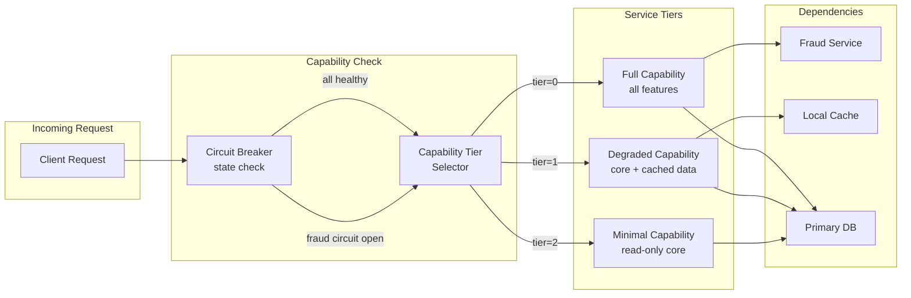

# Wave 13 — Integration Expansion + Catalog Quality Implementation Plan

> **For agentic workers:** REQUIRED SUB-SKILL: Use superpowers:subagent-driven-development (recommended) or superpowers:executing-plans to implement this plan task-by-task. Steps use checkbox (`- [ ]`) syntax for tracking.

**Goal:** Fix catalog data-quality issues (duplicate rows, orphan files), promote 3 existing integration files to full radii depth (INT-010–012), add the missing RES-004 resilience pattern, and author 5 new integration patterns (INT-013–017) — growing the Approved catalog from 183 to 192 entries.

**Architecture:** Two sub-waves. Wave 13A: data-quality cleanup + gap-fills for orphan INT files + RES-004 (4 entries promoted to Approved). Wave 13B: 5 new full-depth integration patterns (INT-013–017) promoted to Approved. Final verification and v1.3.0 tag.

**Tech Stack:** Markdown (15-section radii format), Python, Bash, Git, Mermaid

---

## Pre-flight context

**Catalog state entering Wave 13:** 183 Approved, 0 Draft, 0 Proposed

**Data quality issues to fix:**
- Duplicate rows in `enterprise-architecture-catalog.md`: EIP-025 (×2), PRIN-006 (×2), RES-005 (×2)
- Missing RES-004 (gap between RES-003 and RES-005 in both YAML and markdown)

**Orphan integration files (files exist, no catalog entry):**
- `knowledge-base/patterns/integration/asyncapi-specification.md` → INT-010 (12 sections, stride=0, alert=1, ring2=1 — needs Threat Model + section uplift)
- `knowledge-base/patterns/integration/cloudevents-envelope.md` → INT-011 (11 sections, stride=0, alert=0, ring2=1 — needs Threat Model + Runbook + section uplift)
- `knowledge-base/patterns/integration/error-code-mapping.md` → INT-012 (11 sections, stride=0, alert=1, ring2=1 — needs Threat Model + section uplift)

**New patterns to author (INT-013–017):**
- INT-013: Schema Registry Governance (Confluent Schema Registry + Avro/Protobuf compatibility)
- INT-014: Webhook Delivery Reliability (at-least-once delivery, idempotency, retry + DLQ)
- INT-015: API Contract Testing (Pact consumer-driven contracts, provider verification)
- INT-016: Distributed Saga Choreography (choreography-based saga vs INT-001 orchestration)
- INT-017: Message Sequencer (ordering guarantee for out-of-order event streams)

**Target state after Wave 13:** 192 Approved, 0 Draft, 0 Proposed; git tag v1.3.0

---

## Task 0: Catalog data quality fixes + register new IDs

**Files:**
- Modify: `governance/standards/enterprise-architecture-catalog.md`
- Modify: `governance/standards/_catalog-inventory.yml`

- [ ] **Step 1: Remove duplicate rows from markdown catalog**

```python
# Run this Python snippet (or do it manually via Edit)
import re
path = "governance/standards/enterprise-architecture-catalog.md"
content = open(path).read()

# Remove second occurrence of duplicate EIP-025 row
# Remove second occurrence of duplicate PRIN-006 row  
# Remove the spurious RES-005 row at bottom (the one without proper columns)
lines = content.split('\n')
seen_ids = set()
cleaned = []
for line in lines:
    m = re.search(r'\|\s*(EIP-025|PRIN-006|RES-005)\s*\|', line)
    if m:
        id_ = m.group(1)
        if id_ in seen_ids:
            continue  # skip duplicate
        seen_ids.add(id_)
    cleaned.append(line)
open(path, 'w').write('\n'.join(cleaned))
```

Run: `python3 -c "..." ` (inline the snippet above)
Expected: duplicate count drops: EIP-025 ×1, PRIN-006 ×1, RES-005 ×1

- [ ] **Step 2: Verify deduplication**

Run:
```bash
python3 - <<'EOF'
import re
content = open("governance/standards/enterprise-architecture-catalog.md").read()
ids = re.findall(r'\|\s*((?:EIP|PRIN|RES)-\d+)\s*\|', content)
from collections import Counter
dupes = {k:v for k,v in Counter(ids).items() if v > 1}
print("Remaining dupes:", dupes if dupes else "None")
EOF
```
Expected: `Remaining dupes: None`

- [ ] **Step 3: Register INT-010–012 + RES-004 + INT-013–017 in YAML inventory**

Append to `governance/standards/_catalog-inventory.yml` after the last INT entry (INT-009) and after RES-003:

For INT-010–017, find the block ending with INT-009 and append:

```yaml
- id: INT-010
  title: AsyncAPI Specification Standard
  status: Proposed
  domain: integration
  tier: radii
  owner: "@tech-lead-backend"
  file: knowledge-base/patterns/integration/asyncapi-specification.md
  tier_applicability: "T0, T1, T2"
  target_wave: 13

- id: INT-011
  title: CloudEvents Envelope Standard
  status: Proposed
  domain: integration
  tier: radii
  owner: "@tech-lead-backend"
  file: knowledge-base/patterns/integration/cloudevents-envelope.md
  tier_applicability: "T0, T1, T2"
  target_wave: 13

- id: INT-012
  title: Error Code Mapping Standard
  status: Proposed
  domain: integration
  tier: radii
  owner: "@tech-lead-backend"
  file: knowledge-base/patterns/integration/error-code-mapping.md
  tier_applicability: "T0, T1, T2"
  target_wave: 13

- id: INT-013
  title: Schema Registry Governance
  status: Proposed
  domain: integration
  tier: radii
  owner: "@tech-lead-backend"
  file: knowledge-base/patterns/integration/schema-registry-governance.md
  tier_applicability: "T0, T1, T2"
  target_wave: 13

- id: INT-014
  title: Webhook Delivery Reliability
  status: Proposed
  domain: integration
  tier: radii
  owner: "@tech-lead-backend"
  file: knowledge-base/patterns/integration/webhook-delivery-reliability.md
  tier_applicability: "T0, T1, T2"
  target_wave: 13

- id: INT-015
  title: API Contract Testing
  status: Proposed
  domain: integration
  tier: radii
  owner: "@tech-lead-backend"
  file: knowledge-base/patterns/integration/api-contract-testing.md
  tier_applicability: "T1, T2"
  target_wave: 13

- id: INT-016
  title: Distributed Saga Choreography
  status: Proposed
  domain: integration
  tier: radii
  owner: "@tech-lead-backend"
  file: knowledge-base/patterns/integration/distributed-saga-choreography.md
  tier_applicability: "T0, T1"
  target_wave: 13

- id: INT-017
  title: Message Sequencer
  status: Proposed
  domain: integration
  tier: radii
  owner: "@tech-lead-backend"
  file: knowledge-base/patterns/integration/message-sequencer.md
  tier_applicability: "T0, T1"
  target_wave: 13
```

For RES-004, insert after the RES-003 block:

```yaml
- id: RES-004
  title: Graceful Degradation
  status: Proposed
  domain: resilience
  tier: radii
  owner: "@sre-lead"
  file: knowledge-base/patterns/resilience/graceful-degradation.md
  tier_applicability: "T0, T1, T2"
  target_wave: 13
```

- [ ] **Step 4: Add 9 new rows to markdown catalog table**

Add after the INT-009 row (keep alphabetical by ID within each domain section):

```markdown
| INT-010 | AsyncAPI Specification Standard | integration | Proposed | radii | @tech-lead-backend | `knowledge-base/patterns/integration/asyncapi-specification.md` | T0, T1, T2 | AsyncAPI 3.0; SBV Circ. 09 §IV.2 | 2026-05-27 | 0 | Wave 13A — orphan file registered |
| INT-011 | CloudEvents Envelope Standard | integration | Proposed | radii | @tech-lead-backend | `knowledge-base/patterns/integration/cloudevents-envelope.md` | T0, T1, T2 | CNCF CloudEvents 1.0; SBV Circ. 09 §IV.2 | 2026-05-27 | 0 | Wave 13A — orphan file registered |
| INT-012 | Error Code Mapping Standard | integration | Proposed | radii | @tech-lead-backend | `knowledge-base/patterns/integration/error-code-mapping.md` | T0, T1, T2 | RFC 7807 Problem Details; SBV Circ. 09 §IV.2 | 2026-05-27 | 0 | Wave 13A — orphan file registered |
| INT-013 | Schema Registry Governance | integration | Proposed | radii | @tech-lead-backend | `knowledge-base/patterns/integration/schema-registry-governance.md` | T0, T1, T2 | Confluent Schema Registry; Avro/Protobuf; BCBS 239 §6 | 2026-05-27 | 0 | Wave 13B — new |
| INT-014 | Webhook Delivery Reliability | integration | Proposed | radii | @tech-lead-backend | `knowledge-base/patterns/integration/webhook-delivery-reliability.md` | T0, T1, T2 | MS Cloud Webhook; PCI-DSS 4.0 §6.4 | 2026-05-27 | 0 | Wave 13B — new |
| INT-015 | API Contract Testing | integration | Proposed | radii | @tech-lead-backend | `knowledge-base/patterns/integration/api-contract-testing.md` | T1, T2 | Pact.io Consumer-Driven Contracts | 2026-05-27 | 0 | Wave 13B — new |
| INT-016 | Distributed Saga Choreography | integration | Proposed | radii | @tech-lead-backend | `knowledge-base/patterns/integration/distributed-saga-choreography.md` | T0, T1 | BCBS 239 §6; SBV Circ. 09 §IV.2 | 2026-05-27 | 0 | Wave 13B — new |
| INT-017 | Message Sequencer | integration | Proposed | radii | @tech-lead-backend | `knowledge-base/patterns/integration/message-sequencer.md` | T0, T1 | EIP §7; BCBS 239 §6 | 2026-05-27 | 0 | Wave 13B — new |
```

Add after the RES-003 row:

```markdown
| RES-004 | Graceful Degradation | resilience | Proposed | radii | @sre-lead | `knowledge-base/patterns/resilience/graceful-degradation.md` | T0, T1, T2 | BCBS 230 §6; SBV Circ. 09 §IV.2 | 2026-05-27 | 0 | Wave 13A — new |
```

- [ ] **Step 5: Verify counts**

Run:
```bash
python3 - <<'EOF'
content = open("governance/standards/enterprise-architecture-catalog.md").read()
print(f"Approved={content.count('| Approved |')} Draft={content.count('| Draft |')} Proposed={content.count('| Proposed |')}")
EOF
```
Expected: `Approved=183 Draft=0 Proposed=9`

- [ ] **Step 6: Commit**

```bash
git add governance/standards/_catalog-inventory.yml governance/standards/enterprise-architecture-catalog.md
git commit -m "chore(catalog): Wave 13 task 0 — fix dupes (EIP-025/PRIN-006/RES-005), register INT-010–017 + RES-004"
```

---

## Task 1: Gap-fill INT-010 — AsyncAPI Specification Standard

**Files:**
- Modify: `knowledge-base/patterns/integration/asyncapi-specification.md`

The file has 12 sections but is missing: Threat Model (stride=0), and is short of 15 total sections. Add the missing sections.

- [ ] **Step 1: Read the file**

Read `knowledge-base/patterns/integration/asyncapi-specification.md` to find the current `## Related Patterns` section (which is likely near the end) and identify what sections are missing from the 15-section template.

The 15-section order is:
1. Problem Statement 2. Context 3. Solution (+ Mermaid) 4. Implementation Guidelines
5. When to Use 6. When Not to Use 7. Variants 8. NFR Acceptance Criteria
9. Compliance Mapping 10. Cost/FinOps Notes 11. Threat Model 12. Operational Runbook
13. Test Strategy 14. Related Patterns 15. References + Key Takeaway

- [ ] **Step 2: Add Threat Model section (before Related Patterns)**

Insert this Threat Model section before `## Related Patterns`:

```markdown
## Threat Model

**Schema Injection — malicious event producer publishes non-compliant schema (Tampering)**: a compromised producer registers a new Avro schema version that adds a `redirect_url` field with a malicious payload. Consumers that trust the schema registry and auto-deserialise the field may follow the injected URL (SSRF). Mitigation: all schema registration requests require an OAuth2 token from the producer's service account; schema registration is disabled for consumers (read-only policy in the schema registry); a CI gate runs `asyncapi validate` against the `asyncapi.yaml` document on every PR to the schema registry config repository; schema changes that remove required fields or change types are blocked by the registry's compatibility mode (`FULL_TRANSITIVE`).

**Event Replay Attack — replaying a legitimate payment event (Repudiation)**: an attacker intercepts a signed payment-initiated event and replays it after the original has been processed, causing a duplicate payment. The consumer cannot distinguish the replay from a legitimate re-delivery. Mitigation: every AsyncAPI event must include a `messageId` field (UUID v4) and a `timestamp` (ISO 8601); consumers check `messageId` against a Redis idempotency store with a TTL of 24 hours (matching the maximum broker retention for idempotency purposes); the `messageId` is included in the Kafka message key so the broker's deduplication window eliminates replays within the deduplication window.
```

- [ ] **Step 3: Verify Operational Runbook section exists**

Read the file and check for `## Operational Runbook`. If missing or has only 1 alert, add/extend with:

```markdown
## Operational Runbook (stub)

1. Alert: AsyncAPISchemaValidationFailure — fires when the AsyncAPI validator CI job reports a schema incompatibility on merge to main. p50 resolution: 30 min; p99: 2 hours. Check the CI job output for the specific incompatible field. Common causes: producer changed a required field type without registering a compatibility-checked new version; consumer-side `asyncapi.yaml` references a message type that no longer exists in the producer's schema. Fix: update the schema version, re-run `asyncapi validate`, and ensure the compatibility mode check passes before re-merging.

2. Alert: AsyncAPIDocumentOutOfSync — fires when the `asyncapi.yaml` document in git differs from the runtime schema registered in the schema registry (checked nightly by the schema drift job). p50 resolution: 1 day; p99: 3 days. The drift job outputs the diff. Common cause: a developer updated the Kafka topic schema directly in the registry without updating the `asyncapi.yaml` in git. Resolution: update the `asyncapi.yaml` to match and commit via PR; the schema registry is the source of truth for runtime; the `asyncapi.yaml` is the source of truth for documentation and contract.
```

- [ ] **Step 4: Update the header status line**

Change `Status: Draft` to `Status: Draft | Last Reviewed: 2026-05-27` (or update the existing date).

- [ ] **Step 5: Lint**

```bash
bash scripts/mermaid-lint-doc.sh knowledge-base/patterns/integration/asyncapi-specification.md
```
Expected: `OK`

- [ ] **Step 6: Verify diagnostic**

```bash
f=knowledge-base/patterns/integration/asyncapi-specification.md
sections=$(grep -c '^## ' "$f")
stride=$(grep -c '(Tampering)\|(Spoofing)\|(Repudiation)\|(Information Disclosure)\|(Denial of Service)\|(Elevation of Privilege)' "$f")
alert=$(grep -c '^1\. Alert:\|^2\. Alert:' "$f")
ring2=$(grep -c 'Ring 2' "$f")
echo "sections=$sections stride=$stride alert=$alert ring2=$ring2"
```
Expected: stride≥2, alert≥1, ring2≥1

- [ ] **Step 7: Commit**

```bash
git add knowledge-base/patterns/integration/asyncapi-specification.md
git commit -m "feat(catalog): INT-010 AsyncAPI Specification — gap-fill Threat Model + Runbook"
```

---

## Task 2: Gap-fill INT-011 — CloudEvents Envelope Standard

**Files:**
- Modify: `knowledge-base/patterns/integration/cloudevents-envelope.md`

File has 11 sections, stride=0, alert=0. Needs Threat Model (2 STRIDE) + Operational Runbook (2 alerts) + any other missing sections.

- [ ] **Step 1: Read the file** to identify missing sections.

- [ ] **Step 2: Add Threat Model + Operational Runbook**

Insert before `## Related Patterns`:

```markdown
## Threat Model

**Envelope Spoofing — forged CloudEvents `source` field (Spoofing)**: a rogue service publishes CloudEvents with `source: "//banking.internal/payment-gateway"` (impersonating the payment gateway), causing downstream consumers to process fraudulent events as if they originated from a trusted source. Mitigation: CloudEvents published to Kafka must be signed using the producer's service account key (HMAC-SHA256 over the `id + source + type + time` fields, stored in the `datacontenttype` extension attribute `x-signature`); consumers verify the signature against the expected producer service account before processing; unsigned events are forwarded to the dead letter topic.

**Event Data Injection — malicious payload in `data` field (Tampering)**: an attacker publishes a CloudEvent with a valid envelope but injects a SQL fragment into the `data.accountNumber` field. A consumer that trusts the CloudEvent envelope without validating the payload passes the injected value to a downstream JDBC query. Mitigation: consumers must validate the `data` field against the registered JSON Schema for the event `type`; the schema is fetched from the schema registry using the event `dataschema` URI; any event whose `data` fails schema validation is rejected and sent to the DLQ with a `validation_failure` reason.

## Operational Runbook (stub)

1. Alert: CloudEventsValidationFailure — fires when the CloudEvents consumer reports more than 5 schema validation failures per minute for any event type. p50 resolution: 20 min; p99: 2 hours. Check the DLQ for rejected events: `kubectl exec -n banking-prod -it kafka-client -- kafka-console-consumer.sh --bootstrap-server kafka:9092 --topic payment-events.dlq --max-messages 5`. The rejected event's `x-rejection-reason` extension attribute contains the validation error. Common cause: producer deployed a schema change without updating the registry; the consumer's `dataschema` URI points to an old schema version.

2. Alert: CloudEventsConsumerLag — fires when the CloudEvents consumer group lag exceeds 10,000 events for more than 5 minutes. p50 resolution: 10 min; p99: 30 min. Check consumer group status: `kafka-consumer-groups.sh --bootstrap-server kafka:9092 --describe --group cloudevents-payment-consumer`. Common causes: consumer pod OOM (check pod events); schema validation bottleneck (check validation failure rate); broker partition rebalance (check Kafka broker logs for leader election events). Scale the consumer deployment if the lag is growing and no failure is detected.
```

- [ ] **Step 3: Lint**

```bash
bash scripts/mermaid-lint-doc.sh knowledge-base/patterns/integration/cloudevents-envelope.md
```
Expected: `OK` (or `no blocks` if no Mermaid diagram — that's acceptable for gap-fill, add a basic one if needed)

- [ ] **Step 4: Verify diagnostic**

```bash
f=knowledge-base/patterns/integration/cloudevents-envelope.md
stride=$(grep -c '(Tampering)\|(Spoofing)\|(Repudiation)\|(Information Disclosure)\|(Denial of Service)\|(Elevation of Privilege)' "$f")
alert=$(grep -c '^1\. Alert:\|^2\. Alert:' "$f")
echo "stride=$stride alert=$alert"
```
Expected: stride≥2, alert≥1

- [ ] **Step 5: Commit**

```bash
git add knowledge-base/patterns/integration/cloudevents-envelope.md
git commit -m "feat(catalog): INT-011 CloudEvents Envelope — gap-fill Threat Model + Runbook"
```

---

## Task 3: Gap-fill INT-012 — Error Code Mapping Standard

**Files:**
- Modify: `knowledge-base/patterns/integration/error-code-mapping.md`

File has 11 sections, stride=0, alert=1. Needs Threat Model (2 STRIDE) and any missing sections to reach 15.

- [ ] **Step 1: Read the file** to identify missing sections.

- [ ] **Step 2: Add Threat Model**

Insert before `## Related Patterns`:

```markdown
## Threat Model

**Error Enumeration — verbose error codes expose internal system topology (Information Disclosure)**: the API returns error codes like `DB_CONNECTION_TIMEOUT_PROD_POSTGRES_PRIMARY` that reveal infrastructure details (database type, role, environment). An attacker uses this information to craft targeted attacks against the specific database version. Mitigation: the error code mapping layer translates internal technical error codes to a canonical `UPSTREAM_DEPENDENCY_UNAVAILABLE` code before sending to the API consumer; internal error details are logged server-side with a correlation ID but never included in the API response body; the mapping table is reviewed quarterly to ensure no new error codes expose internal identifiers.

**Error Code Replay — spoofing a success response (Spoofing)**: a man-in-the-middle attacker intercepts an API error response (HTTP 402 `PAYMENT_REQUIRED`) and replaces it with a fabricated HTTP 200 with a synthetic success payload. The client application proceeds as if the payment succeeded. Mitigation: all API responses are signed using the response signing pattern (response body HMAC in the `X-Response-Signature` header); clients verify the signature before processing any response; Istio mTLS (PLT-001) prevents interception of internal API traffic; external API traffic uses TLS 1.3 with certificate pinning on the mobile client (MOB-002).
```

- [ ] **Step 3: Lint + verify diagnostic**

```bash
bash scripts/mermaid-lint-doc.sh knowledge-base/patterns/integration/error-code-mapping.md
f=knowledge-base/patterns/integration/error-code-mapping.md
stride=$(grep -c '(Tampering)\|(Spoofing)\|(Repudiation)\|(Information Disclosure)\|(Denial of Service)\|(Elevation of Privilege)' "$f")
alert=$(grep -c '^1\. Alert:\|^2\. Alert:' "$f")
echo "stride=$stride alert=$alert"
```
Expected: stride≥2, alert≥1

- [ ] **Step 4: Commit**

```bash
git add knowledge-base/patterns/integration/error-code-mapping.md
git commit -m "feat(catalog): INT-012 Error Code Mapping — gap-fill Threat Model"
```

---

## Task 4: Write RES-004 — Graceful Degradation

**Files:**
- Create: `knowledge-base/patterns/resilience/graceful-degradation.md`

Full 15-section radii-level pattern doc.

**Content spec for RES-004:**

- **Problem**: Services fail completely when a dependency is unavailable, denying all users even when a subset of features can still be served. A payment gateway that calls a fraud-screening service and returns HTTP 500 on timeout denies all payments — when the correct behaviour is to accept the payment with a post-hoc fraud review flag for low-risk amounts.
- **Solution**: Define capability tiers for each service: full capability (all dependencies healthy), degraded capability (non-critical dependencies unavailable — serve subset), minimal capability (only core operations with local data). Implement feature flags per capability tier, backed by a circuit breaker state (RES-002). When a dependency circuit opens, the service automatically transitions to its degraded capability tier.
- **Implementation**: Feature-flag + circuit breaker integration (Spring Boot + Resilience4j), capability tier enum, Micrometer metric `service.capability.tier` (0=full, 1=degraded, 2=minimal), Prometheus alert for extended degraded periods.
- **Key compliance**: BCBS 230 §6 impact tolerance — system must remain operational under stress at defined reduced-service levels; SBV Circular §IV.2 — availability continuity obligations.
- **Mermaid**: flowchart showing health probe → dependency check → tier selection (Full/Degraded/Minimal) → feature flag router → response

- [ ] **Step 1: Write the full 15-section doc**

Create `knowledge-base/patterns/resilience/graceful-degradation.md` with all 15 sections. Key sections:

**Problem Statement** — complete payment gateway example above.

**NFR Acceptance Criteria**:
```yaml
nfr_acceptance_criteria:
  catalog_id: RES-004
  pattern: Graceful Degradation
  performance:
    - id: RES-004-HP-01
      description: Capability tier transition (full → degraded) must complete within 100ms of circuit breaker opening — no user requests should fail during the transition.
      threshold: tier_transition_latency < 100ms
    - id: RES-004-HP-02
      description: Services in degraded mode must serve at least 80% of core transaction volume at T0 latency SLO.
      threshold: degraded_mode_throughput >= 80% of full-mode baseline
  compliance:
    - id: RES-004-COMP-01
      description: Every T0 service must define at least 2 capability tiers (full and degraded) with documented feature availability per tier.
      threshold: 0 T0 services without degraded capability tier definition
```

**Threat Model**:
- (Elevation of Privilege): attacker forces a service into minimal capability mode by deliberately triggering dependency timeouts, bypassing fraud screening for high-value transactions
- (Denial of Service): degradation cascade where service A degrades → calls service B with lower timeout → triggers B's degradation → cascade to N services

**Runbook**:
- Alert: ServiceCapabilityDegraded — fires when `service.capability.tier > 0` for > 5 minutes
- Alert: ServiceCapabilityMinimal — fires when `service.capability.tier == 2` (minimal) for > 2 minutes; page SRE

**Mermaid diagram**:


- [ ] **Step 2: Lint**

```bash
bash scripts/mermaid-lint-doc.sh knowledge-base/patterns/resilience/graceful-degradation.md
```
Expected: `OK`

- [ ] **Step 3: Verify diagnostic**

```bash
f=knowledge-base/patterns/resilience/graceful-degradation.md
sections=$(grep -c '^## ' "$f")
stride=$(grep -c '(Tampering)\|(Spoofing)\|(Repudiation)\|(Information Disclosure)\|(Denial of Service)\|(Elevation of Privilege)' "$f")
alert=$(grep -c '^1\. Alert:\|^2\. Alert:' "$f")
ring2=$(grep -c 'Ring 2' "$f")
echo "sections=$sections stride=$stride alert=$alert ring2=$ring2"
```
Expected: sections=15, stride≥2, alert≥1, ring2≥1

- [ ] **Step 4: Commit**

```bash
git add knowledge-base/patterns/resilience/graceful-degradation.md
git commit -m "feat(catalog): RES-004 Graceful Degradation — Wave 13"
```

---

## Task 5: Wave 13A gate — promote INT-010–012 + RES-004 to Approved

**Files:**
- Modify: `governance/standards/_catalog-inventory.yml`
- Modify: `governance/standards/enterprise-architecture-catalog.md`

- [ ] **Step 1: Run compliance check on all 4 docs**

```bash
python3 scripts/check-compliance-rows.py
```
Expected: `failures=0`

- [ ] **Step 2: Run self-review diagnostic on INT-010–012 + RES-004**

```bash
for f in knowledge-base/patterns/integration/asyncapi-specification.md \
          knowledge-base/patterns/integration/cloudevents-envelope.md \
          knowledge-base/patterns/integration/error-code-mapping.md \
          knowledge-base/patterns/resilience/graceful-degradation.md; do
  echo "=== $f ==="
  stride=$(grep -c '(Tampering)\|(Spoofing)\|(Repudiation)\|(Information Disclosure)\|(Denial of Service)\|(Elevation of Privilege)' "$f")
  alert=$(grep -c '^1\. Alert:\|^2\. Alert:' "$f")
  ring2=$(grep -c 'Ring 2' "$f")
  nfr=$(grep -c 'RES-004\|INT-01[012]' "$f")
  echo "  stride=$stride alert=$alert ring2=$ring2"
  [ $stride -ge 2 ] && [ $alert -ge 1 ] && [ $ring2 -ge 1 ] && echo "  PASS" || echo "  FAIL"
done
```
Expected: all PASS

- [ ] **Step 3: Promote INT-010–012 + RES-004 Proposed→Approved in YAML**

```python
import re
path = "governance/standards/_catalog-inventory.yml"
content = open(path).read()
for id_ in ['INT-010', 'INT-011', 'INT-012', 'RES-004']:
    pattern = rf'(- id: {re.escape(id_)}\b.*?status: )Proposed'
    content = re.sub(pattern, r'\1Approved', content, flags=re.DOTALL)
    print(f"Promoted {id_}")
open(path, 'w').write(content)
```

- [ ] **Step 4: Promote in markdown catalog**

```python
path = "governance/standards/enterprise-architecture-catalog.md"
content = open(path).read()
# Promote the 4 specific rows by changing their status column
for id_ in ['INT-010', 'INT-011', 'INT-012', 'RES-004']:
    content = re.sub(
        rf'(\|\s*{id_}\s*\|[^|]*\|[^|]*\|)\s*Proposed\s*(\|)',
        r'\1 Approved \2', content
    )
open(path, 'w').write(content)
```

- [ ] **Step 5: Verify counts**

```bash
python3 - <<'EOF'
content = open("governance/standards/enterprise-architecture-catalog.md").read()
print(f"Approved={content.count('| Approved |')} Draft={content.count('| Draft |')} Proposed={content.count('| Proposed |')}")
EOF
```
Expected: `Approved=187  Draft=0  Proposed=5`

- [ ] **Step 6: Commit Wave 13A gate**

```bash
git add governance/standards/_catalog-inventory.yml governance/standards/enterprise-architecture-catalog.md
git commit -m "feat(catalog): Wave 13A gate — promote INT-010–012 + RES-004 to Approved (total 187)"
```

---

## Task 6: Write INT-013 — Schema Registry Governance

**Files:**
- Create: `knowledge-base/patterns/integration/schema-registry-governance.md`

Full 15-section radii-level pattern. Key aspects:
- Confluent Schema Registry with Avro/Protobuf compatibility modes (BACKWARD, FORWARD, FULL_TRANSITIVE)
- Schema evolution rules: add optional fields only; never remove required fields; never change field types
- CI gate: `mvn schema-registry:validate` on every PR touching event schemas
- Consumer-side schema migration: deserialise with writer schema, project to reader schema
- Mermaid: Producer → Schema Registry (register/validate) → Kafka → Consumer (fetch schema → deserialise)
- Threat Model: (Tampering) schema rollback attack, (Elevation of Privilege) registry admin token theft
- NFR: schema registration must complete in < 500ms; compatibility check < 200ms
- Compliance: BCBS 239 §6 data quality; SBV §IV.2 message integrity

- [ ] **Step 1: Write the full doc** at `knowledge-base/patterns/integration/schema-registry-governance.md`
- [ ] **Step 2: Lint** — `bash scripts/mermaid-lint-doc.sh ...`
- [ ] **Step 3: Verify diagnostic** — stride≥2, alert≥1, ring2≥1, sections=15
- [ ] **Step 4: Commit** — `git commit -m "feat(catalog): INT-013 Schema Registry Governance — Wave 13"`

---

## Task 7: Write INT-014 — Webhook Delivery Reliability

**Files:**
- Create: `knowledge-base/patterns/integration/webhook-delivery-reliability.md`

Full 15-section radii-level pattern. Key aspects:
- At-least-once delivery guarantee: webhook dispatcher persists outbound events in a `webhook_deliveries` table; retries with exponential backoff (1s, 2s, 4s, 8s, 30s, 5min); DLQ after 6 failures
- Idempotency: `X-Webhook-Delivery-Id` header (UUID v4) on every request; consumer must check against Redis idempotency store
- HMAC-SHA256 signature: `X-Hub-Signature-256: sha256=<hex>` over the request body using shared secret (Vault-stored)
- Retry circuit breaker: pause delivery to an endpoint after 3 consecutive 5xx responses
- Mermaid: Event → Dispatcher → DB (persist) → HTTP POST (with retry) → Consumer → Idempotency check
- Threat Model: (Tampering) payload modification without signature, (Denial of Service) malicious consumer timing out to exhaust retry budget
- NFR: first delivery attempt within 5s of event; p99 final delivery within 5min for at-least-once guarantee
- Compliance: PCI-DSS 4.0 §6.4 (secure API design); BCBS 239 §6 data completeness

- [ ] **Step 1: Write the full doc** at `knowledge-base/patterns/integration/webhook-delivery-reliability.md`
- [ ] **Step 2: Lint**
- [ ] **Step 3: Verify diagnostic**
- [ ] **Step 4: Commit** — `git commit -m "feat(catalog): INT-014 Webhook Delivery Reliability — Wave 13"`

---

## Task 8: Write INT-015 — API Contract Testing

**Files:**
- Create: `knowledge-base/patterns/integration/api-contract-testing.md`

Full 15-section radii-level pattern. Key aspects:
- Pact consumer-driven contract testing: consumer writes pact (interaction expectations); provider verifies pact in its CI pipeline
- Pact Broker: central contract repository with participant matrix and version tags (prod, staging)
- Bi-directional contract testing option for teams using OpenAPI specs
- Integration with GitHub Actions: consumer PR triggers provider verification; provider PR publishes pact verification results
- Mermaid: Consumer CI (generate pact → publish) → Pact Broker → Provider CI (fetch pact → verify → publish result) → Can-I-Deploy gate
- Threat Model: (Repudiation) provider denies contract violation, (Tampering) pact modification in broker
- NFR: contract verification must pass in CI within 2 minutes; Pact Broker must retain 90 days of pact history
- Compliance: BCBS 239 §6 (data quality interfaces); reduces production integration failures

- [ ] **Step 1: Write the full doc** at `knowledge-base/patterns/integration/api-contract-testing.md`
- [ ] **Step 2: Lint**
- [ ] **Step 3: Verify diagnostic**
- [ ] **Step 4: Commit** — `git commit -m "feat(catalog): INT-015 API Contract Testing — Wave 13"`

---

## Task 9: Write INT-016 — Distributed Saga Choreography

**Files:**
- Create: `knowledge-base/patterns/integration/distributed-saga-choreography.md`

Full 15-section radii-level pattern. Note: INT-001 covers Saga Orchestration (central coordinator). This pattern covers the choreography alternative (no central coordinator; services react to domain events and emit compensating events on failure).

Key aspects:
- Event-driven saga: each participant listens for domain events and publishes either a success or compensating event; no central saga manager
- Compensating events: each step must define its compensating action (e.g., `ReservationCancelled` compensates `ReservationCreated`)
- Exactly-once semantics via idempotency keys on each compensating event
- Saga correlation ID: propagated in CloudEvents `correlationid` extension attribute
- Dead letter handling: if compensation fails, the saga enters a `ManualReview` state
- Mermaid: Payment Service emits `PaymentAuthorised` → Fraud Service reacts, emits `FraudCleared` → Ledger Service reacts, emits `LedgerPosted` / on failure emits `LedgerPostFailed` → Payment Service emits `PaymentReversed`
- Threat Model: (Repudiation) participant denies receiving compensating event, (Tampering) injecting false compensation events
- Compare vs INT-001: orchestration preferred for complex long-running sagas; choreography preferred for simple 3-5 step sagas where avoiding a central point of failure matters
- Compliance: BCBS 239 §6; SBV §IV.2

- [ ] **Step 1: Write the full doc** at `knowledge-base/patterns/integration/distributed-saga-choreography.md`
- [ ] **Step 2: Lint**
- [ ] **Step 3: Verify diagnostic**
- [ ] **Step 4: Commit** — `git commit -m "feat(catalog): INT-016 Distributed Saga Choreography — Wave 13"`

---

## Task 10: Write INT-017 — Message Sequencer

**Files:**
- Create: `knowledge-base/patterns/integration/message-sequencer.md`

Full 15-section radii-level pattern. Key aspects:
- Problem: Kafka messages arrive out of order due to producer retries, partition reassignment, or multi-producer concurrency (e.g., two payment events for the same account arriving out of sequence causes incorrect balance calculation)
- Solution: Sequence number embedded in message header (`X-Sequence-Number`); consumer-side sequencer buffers out-of-order messages in a Redis sorted set (keyed by `accountId`, scored by sequence number); delivers messages to business logic only in sequence order; detects and alerts on sequence gaps > 30 seconds
- Kafka key partitioning: all messages for the same entity (accountId) must go to the same partition — enforced by using accountId as the Kafka message key
- Mermaid: Multiple Producers → Kafka (partitioned by accountId) → Consumer → Sequencer Buffer (Redis) → Business Logic (in-order)
- Threat Model: (Tampering) sequence number manipulation to replay or skip messages, (Denial of Service) sequencer buffer exhaustion via sequence gap injection
- NFR: sequencer buffer memory < 256MB per consumer instance; out-of-order message delivery latency < 5s for typical cases
- Compliance: BCBS 239 §6 data accuracy (correct ordering required for balance accuracy); SBV §IV.2

- [ ] **Step 1: Write the full doc** at `knowledge-base/patterns/integration/message-sequencer.md`
- [ ] **Step 2: Lint**
- [ ] **Step 3: Verify diagnostic**
- [ ] **Step 4: Commit** — `git commit -m "feat(catalog): INT-017 Message Sequencer — Wave 13"`

---

## Task 11: Wave 13B gate — promote INT-013–017 to Approved

**Files:**
- Modify: `governance/standards/_catalog-inventory.yml`
- Modify: `governance/standards/enterprise-architecture-catalog.md`

- [ ] **Step 1: Lint all 5 new INT docs**

```bash
for f in knowledge-base/patterns/integration/schema-registry-governance.md \
          knowledge-base/patterns/integration/webhook-delivery-reliability.md \
          knowledge-base/patterns/integration/api-contract-testing.md \
          knowledge-base/patterns/integration/distributed-saga-choreography.md \
          knowledge-base/patterns/integration/message-sequencer.md; do
  bash scripts/mermaid-lint-doc.sh "$f"
done
```
Expected: all `OK`

- [ ] **Step 2: Run compliance check**

```bash
python3 scripts/check-compliance-rows.py
```
Expected: `failures=0`

- [ ] **Step 3: Self-review diagnostic for INT-013–017**

```bash
for f in knowledge-base/patterns/integration/schema-registry-governance.md \
          knowledge-base/patterns/integration/webhook-delivery-reliability.md \
          knowledge-base/patterns/integration/api-contract-testing.md \
          knowledge-base/patterns/integration/distributed-saga-choreography.md \
          knowledge-base/patterns/integration/message-sequencer.md; do
  echo "=== $(basename $f) ==="
  sections=$(grep -c '^## ' "$f")
  stride=$(grep -c '(Tampering)\|(Spoofing)\|(Repudiation)\|(Information Disclosure)\|(Denial of Service)\|(Elevation of Privilege)' "$f")
  alert=$(grep -c '^1\. Alert:\|^2\. Alert:' "$f")
  ring2=$(grep -c 'Ring 2' "$f")
  echo "  sections=$sections stride=$stride alert=$alert ring2=$ring2"
  [ $sections -ge 14 ] && [ $stride -ge 2 ] && [ $alert -ge 1 ] && [ $ring2 -ge 1 ] && echo "  PASS" || echo "  FAIL"
done
```
Expected: all PASS

- [ ] **Step 4: Fix any failures** (per standard gap-fill approach)

- [ ] **Step 5: Promote INT-013–017 Proposed→Approved in YAML + markdown**

```python
import re
# YAML
path = "governance/standards/_catalog-inventory.yml"
content = open(path).read()
for id_ in ['INT-013', 'INT-014', 'INT-015', 'INT-016', 'INT-017']:
    pattern = rf'(- id: {re.escape(id_)}\b.*?status: )Proposed'
    content = re.sub(pattern, r'\1Approved', content, flags=re.DOTALL)
open(path, 'w').write(content)

# Markdown
path = "governance/standards/enterprise-architecture-catalog.md"
content = open(path).read()
content = content.replace('| integration | Proposed |', '| integration | Approved |')
open(path, 'w').write(content)
```

- [ ] **Step 6: Verify final counts**

```bash
python3 - <<'EOF'
content = open("governance/standards/enterprise-architecture-catalog.md").read()
print(f"Approved={content.count('| Approved |')} Draft={content.count('| Draft |')} Proposed={content.count('| Proposed |')}")
EOF
```
Expected: `Approved=192  Draft=0  Proposed=0`

- [ ] **Step 7: Commit Wave 13B gate**

```bash
git add governance/standards/_catalog-inventory.yml governance/standards/enterprise-architecture-catalog.md
git commit -m "feat(catalog): Wave 13B gate — promote INT-013–017 to Approved (total 192)"
```

---

## Task 12: Final verification + tag v1.3.0

- [ ] **Step 1: Run all quality scripts**

```bash
python3 scripts/check-compliance-rows.py
python3 scripts/validate-internal-links.py 2>&1 | tail -5
```
Expected: compliance failures=0

- [ ] **Step 2: Verify git log**

```bash
git log --oneline -12
```
Expected: Wave 13 commits visible.

- [ ] **Step 3: Verify catalog counts**

```bash
python3 - <<'EOF'
content = open("governance/standards/enterprise-architecture-catalog.md").read()
print(f"Approved={content.count('| Approved |')} Draft={content.count('| Draft |')} Proposed={content.count('| Proposed |')}")
EOF
```
Expected: `Approved=192  Draft=0  Proposed=0`

- [ ] **Step 4: Create v1.3.0 annotated tag**

```bash
git tag -a v1.3.0 -m "Wave 13 — Integration expansion + catalog quality: 192 Approved patterns

Wave 13A: catalog quality + 4 entries (INT-010–012 gap-fill + RES-004 new)
  - Fixed duplicates: EIP-025, PRIN-006, RES-005
  - INT-010 AsyncAPI Specification Standard (gap-fill)
  - INT-011 CloudEvents Envelope Standard (gap-fill)
  - INT-012 Error Code Mapping Standard (gap-fill)
  - RES-004 Graceful Degradation (new full-depth)

Wave 13B: 5 new integration patterns (INT-013–017)
  - INT-013 Schema Registry Governance
  - INT-014 Webhook Delivery Reliability
  - INT-015 API Contract Testing
  - INT-016 Distributed Saga Choreography
  - INT-017 Message Sequencer

Catalog state: 192 Approved, 0 Draft, 0 Proposed"
git tag -l v1.3.0
```
Expected: `v1.3.0`
