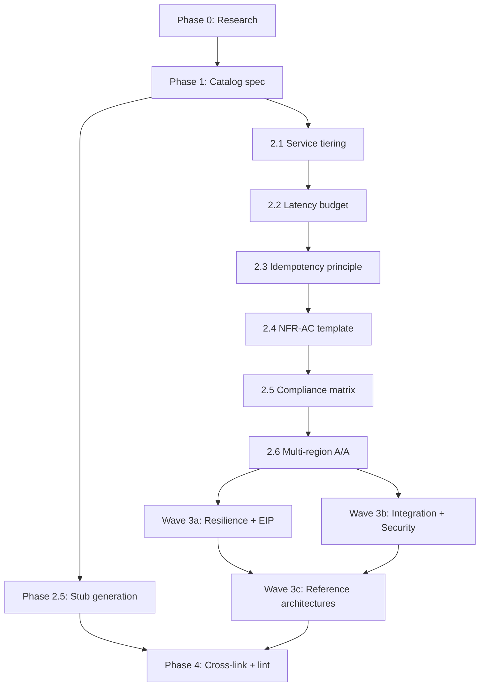

# Design Spec — Banking Enterprise Architecture Catalog & Starter-Set Patterns

Status: Approved-for-implementation-planning | Authored: 2026-05-08 | Owner: Director, Solution Architecture | Approver (G2): EA-Board, DAB Chair, Domain Owners, CISO delegate, SRE Lead, Head of Compliance

---

## 0. Purpose & Context

This spec describes how Techcombank's `Arch-As-Code` repository will be extended into a complete enterprise architecture catalog meeting banking-grade standards for High Availability (HA), High Performance (HP), and High Resilience (HR), with explicit regulatory mapping across three rings (Global → International banking → Vietnam-specific).

The repository today contains 22 reference documents (5 principles, 13 patterns, 4 best-practices), a Design Approval Board (DAB) template structure, governance standards, and 7 banking-domain folders. This delivery extends that to **145 catalog rows** comprising:

- **22 existing** documents (cross-link upgrades only)
- **20 new starter-set documents** authored at full ops-runbook depth (≈600–1000 lines each)
- **103 new stub documents** (≈30–60 lines each) so every catalog row resolves to a real file
- **1 master catalog spec** at `governance/standards/enterprise-architecture-catalog.md`
- **1 research-notes appendix** at `knowledge-base/_research-notes.md`

The terminal output of this brainstorming spec is an implementation plan produced by the writing-plans skill. The implementation work is sized at ≈6–8 weeks wall-clock with stakeholder review gates and a 30% engineering buffer.

---

## 1. Scope Confirmations (locked during brainstorming)

| Dimension | Decision |
| --- | --- |
| Deliverable | Catalog + roadmap + starter-set of high-priority patterns written now (Option B) |
| Regulatory scope | 3-ring concentric mapping: Ring 0 (Global generic) → Ring 1 (International banking) → Ring 2 (Vietnam-specific) |
| Catalog categories (A–K) | Architecture principles; software design patterns; EIP (curated banking subset ~25 of 66); Resilience/HA; Performance/scalability; Security; Data; Banking solution / reference architectures; Best-practices & operational standards; Compliance & regulatory mapping; NFR catalogs |
| Tech stack | Java 21 + Spring Boot 3.x primary; T24 / mainframe legacy integration explicit; React + TypeScript for web; native iOS Swift + native Android Kotlin (no React Native / Flutter / KMP) |
| Quality bar | Full ops-runbook depth — Problem, Context, Solution + Mermaid, Implementation (multi-stack), Variants, NFR Acceptance Criteria, Compliance Mapping (3 rings), **Cost/FinOps notes**, **Threat Model summary**, Operational Runbook stub, Test Strategy stub, When to Use / Not Use, Related Patterns, References |
| Layout | Extend existing `knowledge-base/` taxonomy; catalog spec lives in `governance/standards/` |
| Approach | Spine-then-Radii (Approach A) |
| Starter set size | 20 docs (12 high-leverage core + 8 expansion). Note: this "12 high-leverage core" is a *prioritisation* concept; the *phasing* concept of "Spine" (Phase 2) is a strict subset of 6. See Section 2 reconciliation note re: an earlier brainstorming miscount of 21. |
| Stub policy | Every catalog row resolves to a real file. No "Placeholder" rows pointing nowhere. |
| Spine vs Radii | Made **explicit** in the catalog text, not just internal phasing |
| Reviewer model | Role-based references in catalog (`@payments-domain-owner`, `@sre-lead`); actual humans listed in `registry/catalog-reviewers.yml` |
| SLA padding | Engineering buffer +30%; stakeholder review SLAs left as-is |

---

## 2. Repository Structure (post-delivery)

```
governance/
  standards/
    enterprise-architecture-catalog.md          ← THE master catalog (NEW)
    api-standards.md                              (existing)
    security-baseline.md                          (existing)
    data-classification.md                        (existing)
    naming-conventions.md                         (existing)
    diagram-standards.md                          (existing)
  decisions/
    ADR-004-enterprise-architecture-catalog.md   ← final sign-off ADR (NEW, end of Phase 4)

knowledge-base/
  _research-notes.md                             ← Phase-0 appendix (NEW)

  principles/                                    (5 existing → 13 total inc. stubs)
    api-first-design.md, event-driven-architecture.md,
    zero-trust-security.md, database-per-service.md, cloud-native-first.md   (existing)
    idempotency-by-default.md                    ← NEW spine, full-depth
    data-residency.md                            ← NEW radii, full-depth
    defense-in-depth.md, observability-first.md, fail-safe-defaults.md,
    least-privilege.md, async-by-default.md, modular-monolith-preference.md   ← stubs

  patterns/
    data/         (3 existing + ~10 stubs)
      cqrs-pattern.md  ← upgraded radii, full-depth
      data-mesh-ownership.md, temporal-tables.md   (existing)
      data-vault-2.md, slowly-changing-dimensions.md, lambda-architecture.md,
      kappa-architecture.md, change-data-capture.md, data-lineage.md,
      time-series-modelling.md, data-quality-rules.md, data-virtualization.md,
      reference-data-master.md   ← stubs

    integration/  (4 existing + ~5 stubs)
      saga-orchestration.md      ← upgraded radii, full-depth
      cdc-outbox-pattern.md      ← upgraded radii, full-depth
      api-gateway-routing.md, event-sourcing.md   (existing, cross-link only)
      anti-corruption-layer.md, strangler-fig.md, sidecar-ambassador.md,
      backend-for-frontend-routing.md, content-based-router.md   ← stubs

    resilience/   (3 existing + ~7 stubs)
      circuit-breaker.md         ← upgraded radii, full-depth
      bulkhead-isolation.md      (existing — cell-based-architecture extends it)
      retry-with-backoff.md      (existing, cross-link only)
      cell-based-architecture.md ← NEW radii, full-depth
      timeout-budget.md, fallback-strategies.md, throttling-rate-limiting.md,
      load-shedding.md, leader-election.md, queue-based-load-levelling.md,
      health-check-aggregation.md   ← stubs

    security/     (3 existing + ~10 stubs/full)
      mtls-service-mesh.md, oauth2-authorization.md, vault-secret-management.md   (existing)
      tokenization-hsm.md           ← NEW radii, full-depth
      bff-token-binding.md          ← NEW radii, full-depth (web + iOS + Android)
      jwt-best-practices.md, secrets-rotation.md, data-masking.md,
      fraud-signal-collection.md, attribute-based-access-control.md,
      session-revocation.md, audit-logging-tamper-evident.md,
      pii-tokenization-format-preserving.md   ← stubs

    eip/          ← NEW sub-folder (banking-relevant subset of Hohpe/Woolf)
      idempotent-receiver.md       ← NEW radii, full-depth
      dead-letter-channel.md       ← NEW radii, full-depth
      message-channel.md, point-to-point-channel.md, publish-subscribe-channel.md,
      message-router.md, content-enricher.md, content-filter.md,
      claim-check.md, normalizer.md, message-translator.md,
      aggregator.md, splitter.md, resequencer.md,
      composed-message-processor.md, scatter-gather.md, routing-slip.md,
      process-manager.md, message-store.md, smart-proxy.md, test-message.md,
      channel-purger.md, durable-subscriber.md, guaranteed-delivery.md   ← 23 stubs

    frontend/     ← NEW sub-folder
      web-performance-budgets.md, web-resilience-offline-first.md,
      web-csp-hardening.md, web-feature-flags.md,
      web-error-boundary.md, web-i18n-rtl.md   ← 6 stubs

    mobile/       ← NEW sub-folder
      mobile-offline-queue.md, mobile-secure-storage.md,
      mobile-biometric-auth.md, mobile-push-notification-secure.md,
      mobile-deep-link-attestation.md, mobile-force-upgrade.md   ← 6 stubs

    banking-solutions/  ← NEW sub-folder (atomic banking patterns; ref-archs are separate)
      double-entry-ledger.md, idempotent-payment-key.md,
      sanction-screening-pipeline.md, end-of-day-batch-window.md,
      reversal-and-chargeback.md   ← 5 stubs

  reference-architectures/                       ← NEW
    multi-region-active-active.md                ← NEW spine, full-depth
    real-time-payments-napas.md                  ← NEW radii, full-depth
    kyc-aml-onboarding.md                        ← NEW radii, full-depth
    card-authorization-3ds2.md                   ← NEW radii, full-depth
    swift-mt-mx-wire-transfer.md, loan-origination.md,
    fraud-screening-platform.md, regulatory-reporting.md,
    account-opening-omnichannel.md, ledger-posting-engine.md,
    open-banking-psd2.md, dispute-management.md   ← 8 stubs

  nfr/                                           ← NEW
    service-tiering-rto-rpo.md                   ← NEW spine, full-depth
    latency-budget-model.md                      ← NEW spine, full-depth
    capacity-planning-model.md, throughput-model.md, error-budget-policy.md   ← 3 stubs

  compliance/                                    ← NEW
    compliance-mapping-matrix.md                 ← NEW spine, full-depth (master matrix)
    sbv-circular-09-2020.md, decree-13-2023-personal-data.md,
    pci-dss-4-0.md, basel-bcbs-239.md, basel-bcbs-230.md,
    iso-20022-messaging.md, swift-csp-2024.md   ← 7 stubs

  templates/                                     ← NEW
    nfr-acceptance-criteria-dab.md               ← NEW spine, full-depth (DAB checklist)
    pattern-doc-template.md, stub-doc-template.md, ref-arch-doc-template.md   ← 3 stubs

  best-practices/                                (4 existing + 7 new)
    ci-cd-pipeline-design.md, disaster-recovery-playbook.md,
    microservice-decomposition.md, observability-standards.md   (existing)
    chaos-engineering.md                         ← NEW radii, full-depth
    capacity-planning.md, golden-signals-sre.md, error-budgets.md,
    runbook-authoring.md, incident-postmortem.md, blameless-culture.md   ← 6 stubs

registry/
  catalog-reviewers.yml                          ← role → human mapping (NEW)
```

### Inventory totals

| Category | Existing | Starter-set (full) | Stubs | Total |
| --- | --- | --- | --- | --- |
| Principles | 5 | 2 | 6 | 13 |
| Patterns / data | 3 | 1 | 10 | 14 |
| Patterns / integration | 4 | 2 | 5 | 11 |
| Patterns / resilience | 3 | 2 | 7 | 12 |
| Patterns / security | 3 | 2 | 8 | 13 |
| Patterns / EIP | 0 | 2 | 23 | 25 |
| Patterns / frontend | 0 | 0 | 6 | 6 |
| Patterns / mobile | 0 | 0 | 6 | 6 |
| Patterns / banking-solutions | 0 | 0 | 5 | 5 |
| Reference architectures | 0 | 4 | 8 | 12 |
| NFR | 0 | 2 | 3 | 5 |
| Compliance | 0 | 1 | 7 | 8 |
| Templates | 0 | 1 | 3 | 4 |
| Best-practices | 4 | 1 | 6 | 11 |
| **Total** | **22** | **20** | **103** | **see footnote** |

> **Inventory totals — footnote.** The Starter (full) column counts *work-deliverables* — and includes 4 upgrades of existing files (saga-orchestration, cdc-outbox-pattern, cqrs-pattern, circuit-breaker). Those 4 are also counted in the Existing column, so the column-sum 22 + 20 + 103 = **145** double-counts them. The **unique catalog row count** (= one row per file in the inventory table) is **141**: 22 existing + 16 net-new starter-set + 103 net-new stubs. Both numbers appear in the spec; treat them as: "≈141 unique catalog rows, of which 20 receive full ops-runbook content this delivery". Implementation phase will tabulate the exact count when populating the catalog inventory table.

> Reconciliation note: an earlier brainstorming exchange settled on "21 starter-set docs". Reconciliation against the enumerated inventory above yields **20** (12 high-leverage core + 8 expansion). The Idempotency-by-default principle is item #1 of the 12, not a separate addition. Spec uses **20** throughout. If the user wants exactly 21, the cleanest addition is upgrading the existing `patterns/integration/event-sourcing.md` to full ops-runbook depth and slotting it into Wave 3b alongside Saga / Outbox / CQRS. This is flagged as Open Question Q7.
>
> **Important terminology disambiguation**: "Spine" appears twice in this spec with two different meanings.
> - **Phase-2 Spine** = the 6 foundational docs authored sequentially in Phase 2 (Service Tiering, Latency Budget, Idempotency principle, NFR-AC template, Compliance matrix, Multi-Region A/A). Used in phasing.
> - **Spine doc** (catalog-level) = any normative doc that radii must not contradict (broader category). Used in the catalog text itself.
> - The "12 high-leverage core" of the starter set is a *prioritisation* label; it is a superset of the Phase-2 Spine 6 and NOT the same thing.

---

## 3. The Master Catalog Spec — `governance/standards/enterprise-architecture-catalog.md`

The catalog file's outline:

1. **Purpose & How to Use** — audience, three reading paths (by-category, by-banking-flow, by-regulation)
2. **Architecture Principles** — the 3-ring concentric model; spine-vs-radii doc model **made explicit** (spine docs are normative, radii inherit and may not contradict); HA / HP / HR positioned as properties enforced via spine docs, not as patterns
3. **Taxonomy (Categories A–K)** — one paragraph per category with inclusion / exclusion rules
4. **Master Inventory Table** — single sortable table, one row per artifact, columns: ID, Title, Category, Status, Owner, Path, Tier-Applicability, Compliance Refs, Last-Reviewed, Notes; status enum: Approved | Proposed | Draft | Deprecated (no "Placeholder" — every row points to a real file)
5. **Gap Analysis** — coverage % per category; Tier-1 risk highlights
6. **Regulatory Mapping Framework** — the compliance-row schema every doc must complete; pointer to the master matrix; one worked example
7. **NFR Framework Summary** — service tiers T0–T3; RTO/RPO + latency targets per tier (cribbed from spine docs)
8. **Sequencing & Roadmap** — Wave 0 (this delivery); Wave 1 (Q+1, ~25 EIP patterns); Wave 2 (Q+2, ref-archs and frontend/mobile); Wave 3 (Q+3, regulatory deep-dives); owners per wave
9. **Acceptance Criteria** — what makes a doc Approved (8-point DoD; see Section 7 below)
10. **DAB Integration** — how a new DAB submission references the catalog by ID; "Pattern Compliance Section" snippet for DAB authors
11. **Maintenance** — quarterly review cadence; change process; deprecation rules

### Sample inventory row format

| ID | Title | Category | Status | Owner | Path | Tiers | Compliance | Reviewed | Notes |
| --- | --- | --- | --- | --- | --- | --- | --- | --- | --- |
| RES-005 | Cell-Based Architecture | Resilience | Approved | @ea-board | `knowledge-base/patterns/resilience/cell-based-architecture.md` | T0–T2 | SBV Circ. 09 §IV.2; BCBS 230 §27; ISO 27001 A.17 | 2026-05-08 | Extends existing bulkhead-isolation; required for payment & ledger T0 services |

---

## 4. Document Templates

### 4a. Full pattern doc template (used for the 20 starter-set + cross-link upgrades to existing 22)

```markdown
# {Pattern Name}

Status: Approved | Last Reviewed: YYYY-MM-DD | Owner: @team
Catalog ID: {CATEGORY-NNN}  | Spine | Radii
Tier Applicability: T0 | T1 | T2 | T3

## Problem Statement
## Context (when this applies in a banking flow)
## Solution
   - Mermaid solution diagram
   - Mermaid sequence/state diagram where helpful
## Implementation Guidelines
   - Java 21 / Spring Boot 3.x reference (always present)
   - T24 / legacy integration notes (where relevant)
   - React/TypeScript notes (frontend-touching patterns)
   - iOS Swift / Android Kotlin notes (mobile-touching patterns)
## Variants & Trade-offs
## NFR Acceptance Criteria
   - HA: required RTO / RPO / availability target this pattern enables
   - HP: latency P50/P95/P99, throughput target
   - HR: failure modes, recovery behaviour, blast radius
## Compliance Mapping
   | Layer | Reference | Section/Control | How this pattern satisfies |
   | Ring 0 (generic) | NIST / OWASP / etc. | ... | ... |
   | Ring 1 (intl banking) | PCI-DSS 4.0 / Basel / SWIFT / ISO 20022 / GDPR | ... | ... |
   | Ring 2 (Vietnam) | SBV Circ. 09 / Decree 13 / Decree 53 | ... | ... |
## Cost / FinOps Notes
   - Cost driver(s); rough order of magnitude per Tier
   - FinOps levers (autoscaling boundaries, reserved capacity, cold-storage tiers)
   - "Cost of NOT having this pattern" (incident cost; SLA penalty exposure)
## Threat Model Summary
   - STRIDE in one paragraph (Spoofing/Tampering/Repudiation/InfoDisc/DoS/EoP)
   - Top 3 threats addressed; top 3 residual threats; pointer to full STRIDE if applicable
## Operational Runbook (stub)
   - Alerts (golden signals + pattern-specific)
   - Dashboards (links / Grafana panels)
   - On-call escalation
   - Recovery steps (numbered, tested)
## Test Strategy (stub)
   - Unit | Integration | Contract | Chaos | DR-drill | Performance
## When to Use
## When NOT to Use
## Related Patterns (links to other catalog IDs)
## References (links to authoritative external sources gathered in Phase 0)

---
**Key Takeaway**: one sentence.
```

### 4b. Stub doc template (used for the 103 placeholder docs, ≈30–60 lines)

```markdown
# {Pattern Name}

Status: Proposed | Target Wave: {1|2|3} | Owner: @team
Catalog ID: {CATEGORY-NNN}
Tier Applicability: {T0–T3, declared upfront}

> **STUB** — full content authored in Wave {N}.
> Catalog: ../../governance/standards/enterprise-architecture-catalog.md#{anchor}

## Problem Statement (1 paragraph)

## Sketch of Solution (3–5 bullets)

## Compliance Hooks
- Ring 0: ...
- Ring 1: ...
- Ring 2: ...

## NFR Hooks
- HA: ...
- HP: ...
- HR: ...

## Authoring Checklist (DoD for moving Status → Approved)
- [ ] Mermaid solution diagram
- [ ] Java/Spring code sample
- [ ] Legacy / frontend / mobile notes (if applicable)
- [ ] Compliance Mapping table populated
- [ ] NFR Acceptance Criteria block
- [ ] Cost/FinOps notes
- [ ] Threat Model summary
- [ ] Runbook stub
- [ ] Test strategy stub
- [ ] EA-board review
- [ ] Domain-owner review

## References (placeholders OK)
```

---

## 5. Phasing, Dependencies, and Parallelism

### Phase 0 — Industry research pass

Produces `knowledge-base/_research-notes.md`. All 12 sources fetched via WebFetch (not memory):

- enterpriseintegrationpatterns.com (Hohpe & Woolf)
- microsoft.com/azure/architecture/patterns
- learn.microsoft.com/azure/well-architected
- docs.aws.amazon.com/wellarchitected
- microservices.io/patterns
- resilience4j.readme.io
- sbv.gov.vn + vbpl.vn (SBV Circular 09/2020/TT-NHNN)
- vbpl.vn (Decree 13/2023, Decree 53/2022)
- pcisecuritystandards.org (PCI-DSS 4.0)
- bis.org (Basel BCBS 239 + 230 ops-resilience)
- iso20022.org
- swift.com/csp (SWIFT CSP v2024)
- napas.com.vn (public docs only)

Output structure per source: URL & date fetched; sections relevant to this catalog; direct quotes for compliance mapping; pattern → Catalog-ID mapping table.

**Gate G1**: EA-Board chair sign-off. SLA: 1 business day.
**Risk**: SBV / Decree texts may be Vietnamese-only; flagged for human translation review.

### Phase 1 — Master catalog spec

Authors `governance/standards/enterprise-architecture-catalog.md` per the outline in Section 3 above. Inventory table populated with all 145 rows pointing at correct paths (paths created in Phase 2.5).

**Gate G2 — THE BIG GATE**.
- Approvers: EA-Board (full), DAB Chair, Domain Owners (Payments, Core-Banking, Digital-Channels, Risk, Lending, Wealth, Data-Platform), CISO delegate, SRE Lead, Head of Compliance.
- SLA: 5–7 business days (multiple rounds expected).
- Reject criteria: taxonomy disagreement, scope, ownership, sequence.
- **Mitigation for #1 risk**: pre-circulate Sections 2 + 3 of the catalog spec to EA-Board informally before triggering G2.

### Phase 2 — SPINE (6 docs, sequential)

Each spine doc unblocks the next; sequencing reflects dependency:

1. `knowledge-base/nfr/service-tiering-rto-rpo.md` — defines T0–T3 service classes.
2. `knowledge-base/nfr/latency-budget-model.md` — uses tiers from #1; defines per-tier P50/P95/P99 budgets.
3. `knowledge-base/principles/idempotency-by-default.md` — referenced by integration / EIP / saga / outbox.
4. `knowledge-base/templates/nfr-acceptance-criteria-dab.md` — DAB-checklist template; references #1 + #2.
5. `knowledge-base/compliance/compliance-mapping-matrix.md` — master matrix; rows pre-stubbed for all 145 patterns.
6. `knowledge-base/reference-architectures/multi-region-active-active.md` — HA blueprint; uses #1, #2, #3.

**Gate G3 (per spine doc)**: EA-Board + relevant topic owner. SLA: 1–2 business days each.

### Phase 2.5 — Stub generation (parallel-safe with Phase 2)

Generate ~103 stub files mechanically from the catalog inventory using Template 4b. Stubs depend only on the catalog (Phase 1) and the stub template — not on spine docs.

**Gate G2.5**: light spot-check by EA-Board chair; ensures no broken catalog rows.

### Phase 3 — RADII (14 docs, 3 sub-waves, parallel within each)

**Wave 3a — Resilience + EIP (5 docs):**
- `patterns/eip/idempotent-receiver.md`
- `patterns/eip/dead-letter-channel.md`
- `patterns/resilience/cell-based-architecture.md`
- `patterns/resilience/circuit-breaker.md` (upgrade existing)
- `best-practices/chaos-engineering.md`

**Wave 3b — Integration + Security (5 docs):**
- `patterns/integration/cdc-outbox-pattern.md` (upgrade existing)
- `patterns/integration/saga-orchestration.md` (upgrade existing)
- `patterns/data/cqrs-pattern.md` (upgrade existing)
- `patterns/security/tokenization-hsm.md`
- `patterns/security/bff-token-binding.md` (web + iOS + Android)

**Wave 3c — Reference architectures + Data-residency (4 docs):**
- `reference-architectures/real-time-payments-napas.md`
- `reference-architectures/kyc-aml-onboarding.md`
- `reference-architectures/card-authorization-3ds2.md`
- `principles/data-residency.md`

**Gate G4 (per radii wave)**: relevant domain leads + EA-Board. SLA: 2–3 business days each (batched review).

### Phase 4 — Cross-link & lint

1. Update existing 22 docs to cite spine doc IDs (mechanical edits, scoped diffs).
2. Mermaid lint, link-check, "compliance row complete" check across all 42 authored docs.
3. Update `knowledge-base/README.md`, `knowledge-base/principles/README.md` indices.
4. Update `governance/standards/` entry points and `registry/dab-index.md`.
5. Author `governance/decisions/ADR-004-enterprise-architecture-catalog.md`.

**Gate G5 — Final**: EA-Board (full). SLA: 2–3 business days. Output: catalog moves to Status=Approved; baseline freeze for Wave 1 (next quarter).

### Dependency graph



### Effort sizing (with +30% authoring buffer + stakeholder review SLAs)

| Phase | Authoring | Review Gate | Reviewers | Wall-clock |
| --- | --- | --- | --- | --- |
| 0 — Research | ~1.3d | G1 | EA-Board chair | ~2.3d |
| 1 — Catalog spec | ~1.3d | G2 (big) | EA-Board, DAB Chair, 7 Domain Owners, CISO, SRE Lead, Compliance | ~7–8d |
| 2 — Spine (6 docs) | ~4–5d | G3 ×6 | EA-Board + topic owner per doc | ~12–13d |
| 2.5 — Stubs (parallel with 2) | ~1.3d | G2.5 light | EA-Board chair | absorbed |
| 3a — Resilience + EIP | ~4d | G4 | SRE lead, EA-Board | ~7d |
| 3b — Integration + Security | ~4d | G4 | Security lead, Integration architect, EA-Board | ~7d |
| 3c — Reference architectures | ~4–5d | G4 (heavy) | Domain owners (Payments / KYC / Cards), EA-Board, Compliance | ~8–10d |
| 4 — Cross-link + lint | ~1.3d | G5 | EA-Board (full) | ~4d |

**Total wall-clock: ~6–8 weeks**, with Wave 3a / 3b / 3c overlapping their review windows: ~5–6 weeks realistic floor.

---

## 6. Risks (consolidated)

| ID | Risk | Likelihood | Severity | Mitigation |
| --- | --- | --- | --- | --- |
| R1 | G2 stakeholder disagreement re-baselines the catalog | High | High | Pre-circulate catalog Sections 2+3 informally to EA-Board before triggering G2 |
| R2 | SBV/Decree translation rejected by Compliance at G3 | Medium | High | Engage Legal/Compliance team in Phase 0 (not Phase 2.5); request authoritative translations early |
| R3 | Code-sample style drift from current Techcombank conventions (Spring versions, Resilience4j config style) | Medium | Medium | Tech-Lead + Senior Backend reviewer added to G3 + G4 |
| R4 | Domain owner unavailability breaches review SLA | Medium | Medium | Identify primary + backup reviewer per domain in `registry/catalog-reviewers.yml`; escalate via DAB SLA matrix |
| R5 | Reference architectures (Wave 3c) leak vendor-confidential details (T24 internals, NAPAS protocol depth) | Low–Medium | High | Mark security-classification per doc; G4 reviewer includes InfoSec; bound depth to public documentation |
| R6 | Authoring effort sized too low → schedule slips beyond +30% buffer | Medium | Medium | Weekly burndown against the inventory; surface slip at Phase 2 boundary so 3c can be deferred to Wave 1 if needed |
| R7 | Stub template too thin → reviewers reject as "useless placeholder" | Low | Low | Stubs must include Authoring Checklist + Compliance Hooks + NFR Hooks; this signals intent and bounds future work |
| R8 | Catalog grows past 145 during authoring (scope creep) | High | Medium | Catalog scope is frozen at G2 sign-off; new entries deferred to Wave 1 |

---

## 7. Acceptance Criteria — Definition of Done for the implementation work

| ID | Criterion |
| --- | --- |
| DoD-1 | Master catalog at `governance/standards/enterprise-architecture-catalog.md` is merged with all 145 inventory rows present; every row resolves to a real file (no broken catalog links). |
| DoD-2 | All 20 starter-set docs are at Status=Approved with: Mermaid solution diagram; Java/Spring sample; legacy/T24, React/TS, Swift, Kotlin notes where applicable; NFR Acceptance Criteria block populated with concrete numbers; Compliance Mapping table populated for all 3 rings; Cost/FinOps notes; Threat Model summary; Operational Runbook stub; Test Strategy stub; reviewed by EA-Board + at least one topic owner; lint clean. |
| DoD-3 | All 103 stub docs exist, conform to the stub template (4b), and are linked from the catalog. Each has Status=Proposed and a Target Wave. |
| DoD-4 | Existing 22 docs are updated to cite spine doc IDs where relevant. `knowledge-base/README.md` and `knowledge-base/principles/README.md` indices are regenerated. |
| DoD-5 | Compliance Mapping Matrix at `knowledge-base/compliance/compliance-mapping-matrix.md` has rows pre-stubbed for all 145 patterns (cells filled for the 20 starter-set + 22 existing; cells marked TBD for the 103 stubs). |
| DoD-6 | Research notes at `knowledge-base/_research-notes.md` cite all 12 authoritative sources with URLs and access dates. |
| DoD-7 | Final EA-Board sign-off recorded as `governance/decisions/ADR-004-enterprise-architecture-catalog.md`. |
| DoD-8 | `registry/catalog-reviewers.yml` exists, mapping role-based reviewers to actual humans. |

### Success metrics (post-delivery, tracked by EA-Board)

**Adoption (12 weeks after merge)**
- ≥ 80% of new DAB submissions cite ≥ 3 catalog patterns.
- ≥ 10 patterns moved Status=Proposed → Approved.
- Avg DAB submission-to-approval time: −30%.

**Quality (continuous)**
- Catalog row → file link integrity: 100%.
- Compliance Mapping completeness (3 rings filled) on Approved docs: 100%.
- Quarterly review compliance: 100%.

**Coverage (per quarter)**
- Q+0: 42 Approved (20 new + 22 existing).
- Q+1: +25 (EIP wave).
- Q+2: +30 (ref-archs and frontend/mobile).
- Q+4 target: < 20 stubs remaining.

---

## 8. Out of Scope

- Authoring full content for the 103 stubs — those are Wave 1+ deliveries.
- Migrating existing Confluence content (covered by separate Migration Strategy in `Architecture-As-Code-Proposal-Techcombank.md`).
- Changes to the existing DAB process or templates beyond `knowledge-base/templates/nfr-acceptance-criteria-dab.md`.
- Tooling work (mkdocs theme, linters, knowledge-graph integration with `code-review-graph`).
- A pattern-adoption tracker / metrics dashboard — track via DAB MR labels for now.
- Changes to `openapi.yaml` or domain models in `domains/*/domain-model.md`.
- Vendor-confidential implementation guides (T24 internals, NAPAS protocol depth beyond public docs).
- Hands-on training material — separate Change Management deliverable.

---

## 9. Open Questions — Decisions

All seven open questions were resolved by the user with "decide for me and proceed". Defaults applied as follows:

| ID | Question | **Decision** |
| --- | --- | --- |
| Q1 | Tet 2027 holiday timing — does G2 review window cross Tet? | **Schedule G2 to clear Tet by ≥ 2 weeks.** Implementation plan must include a calendar check at Phase 1 entry. |
| Q2 | Authoritative SBV Circ. 09/2020 English translation source | **In-house Legal team**, with explicit "unofficial translation pending Legal review" badge on each Compliance Mapping row until Legal sign-off. |
| Q3 | Number of parallel sub-agent authors for Wave 3 sub-waves | **3 parallel sub-agents in Phase 3** (one per sub-wave 3a / 3b / 3c). Single author for Phases 0, 1, 2, 2.5, and 4. |
| Q4 | Should the catalog auto-index into the project's `code-review-graph` knowledge graph? | **Out of scope** for this delivery. Tracked as a Wave 1 enablement item. |
| Q5 | Status badges — markdown header line vs frontmatter? | **Markdown header line** (matches existing 22 docs). |
| Q6 | EIP banking-subset (~25 of 66) confirmation source | **SA judgment**, with the subset listed in the catalog for EA-Board challenge at G2. |
| Q7 | Starter-set count: 20 (enumerated) or 21 (add event-sourcing upgrade) | **20** — matches the enumerated inventory in Section 2. The brainstormed "accept 21" rested on an arithmetic error. event-sourcing upgrade can be slotted into Wave 1 if EA-Board prefers it later. |

---

## 10. References (consumed by Phase 0 research notes)

- Hohpe & Woolf — Enterprise Integration Patterns (book + enterpriseintegrationpatterns.com)
- Microsoft Cloud Design Patterns — learn.microsoft.com/azure/architecture/patterns
- Microsoft Azure Well-Architected — learn.microsoft.com/azure/well-architected
- AWS Well-Architected Framework — docs.aws.amazon.com/wellarchitected
- Microservices.io — microservices.io/patterns
- Resilience4j — resilience4j.readme.io
- State Bank of Vietnam — Circular 09/2020/TT-NHNN (sbv.gov.vn, vbpl.vn)
- Government of Vietnam — Decree 13/2023/NĐ-CP on Personal Data Protection; Decree 53/2022/NĐ-CP
- PCI Security Standards Council — PCI-DSS v4.0 (pcisecuritystandards.org)
- Bank for International Settlements — BCBS 239 (Risk Data Aggregation), BCBS 230 (Operational Resilience) (bis.org)
- ISO 20022 — iso20022.org
- SWIFT — Customer Security Programme v2024 (swift.com/csp)
- NAPAS — public technical references (napas.com.vn)

---

## 11. Next Step

Once this spec is approved by the user, invoke the **writing-plans** skill to produce a detailed phased implementation plan. The implementation plan will:

1. Break each phase into ordered tasks with concrete deliverables, owners, and review gates.
2. Provide WebFetch task scripts for Phase 0.
3. Provide a stub-generation script template for Phase 2.5.
4. Identify dispatch points for parallel sub-agents in Wave 3.
5. Define explicit handoff artefacts between phases.

Do **not** invoke any other skill (frontend-design, mcp-builder, etc.). The terminal step of brainstorming is writing-plans.

---

**Last updated**: 2026-05-08 | **Author**: brainstorming session | **Approver pending**: user
