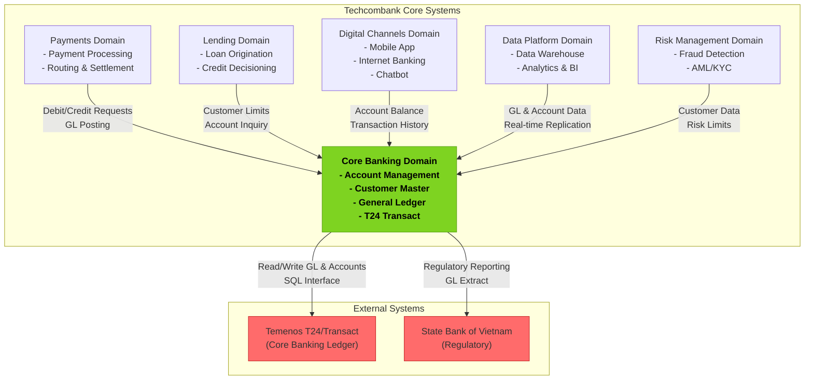

# Core Banking Domain Context Map

## C4 Level 1: System Context



---

## Key Integration Flows

### Account Opening Flow

**Actors**: Digital Channels → Core Banking → T24

```
1. Customer submits account opening request via mobile app
2. Digital Channels validates and creates in-process account
3. Core Banking receives account opening request
4. Core Banking posts account in T24 via API
5. T24 assigns unique account number
6. Core Banking creates account record with T24 reference
7. Digital Channels displays account details to customer
```

### Payment Settlement Flow

**Actors**: Payments → Core Banking → T24

```
1. Payments domain processes payment
2. Payments sends debit request to Core Banking
3. Core Banking posts debit in T24 (GL entry)
4. Core Banking returns confirmation with GL reference
5. Payments executes payment via payment network
6. Payments sends credit request to Core Banking
7. Core Banking posts credit in T24
8. T24 generates GL entries for both accounts
```

### GL Reconciliation Flow

**Actors**: Payments ↔ Core Banking ↔ Data Platform

```
1. Each night, reconciliation job extracts GL from T24
2. Compares GL with payment ledger
3. Identifies breaks and exceptions
4. Data Platform ingests reconciliation results
5. Dashboard shows reconciliation status
```

---

## Boundary Context

### Inside Core Banking
- Account master data
- GL postings and journal entries
- Customer profile data
- Interest accrual and posting
- Account statements

### Outside Core Banking (owned by other domains)
- Payment routing (Payments)
- Fraud detection (Risk Management)
- Customer notifications (Digital Channels)
- Data analytics (Data Platform)

---

## External Dependencies

| System | Purpose | SLA | Notes |
|--------|---------|-----|-------|
| Temenos T24 | Core ledger system | 99.99% | Critical; no fallback |
| Oracle Database | T24 repository | 99.99% | Replicated across regions |
| SBV | Regulatory reporting | — | Batch submissions |

---

## Ubiquitous Language

| Term | Definition |
|------|-----------|
| **Account** | A customer's relationship with the bank for funds storage/management |
| **GL (General Ledger)** | Complete record of all financial transactions |
| **CIF (Customer Information File)** | Unique customer identifier in T24 |
| **Account Product** | Type of account (Savings, Checking, Investment) |
| **Interest Accrual** | Accumulation of interest income over time |
| **T24** | Temenos T24 core banking system; legacy but still primary |

---

Last Updated: March 8, 2026 | Domain: Core Banking
