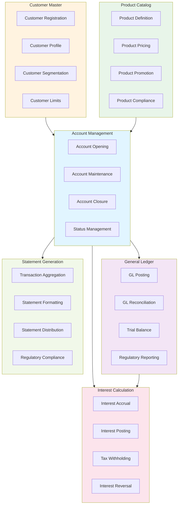

# Core Banking Domain Model

## Business Capability Map

The Core Banking domain provides six major capabilities fundamental to retail and corporate banking operations.

### 1. Account Management

**Definition**: Create, manage, and maintain customer accounts throughout their lifecycle.

**Sub-capabilities**:
- **Account Opening** — Create new checking, savings, and investment accounts
- **Account Maintenance** — Update account details, manage signatory rights
- **Account Closure** — Close accounts with funds settlement
- **Account Status Management** — Activate, freeze, suspend accounts based on customer lifecycle

### 2. Customer Master

**Definition**: Maintain centralized customer identity, profile, and relationship data.

**Sub-capabilities**:
- **Customer Registration** — Onboard new customers with KYC verification
- **Customer Profile** — Manage customer demographic and contact information
- **Customer Segmentation** — Classify customers (retail, SME, corporate)
- **Customer Limits** — Set and manage transaction and credit limits per customer

### 3. General Ledger

**Definition**: Record and maintain all financial transactions in standardized accounting format.

**Sub-capabilities**:
- **GL Posting** — Post debit/credit entries from transaction systems
- **GL Reconciliation** — Reconcile GL with transaction ledgers and payment networks
- **Trial Balance** — Generate periodic trial balance for financial reporting
- **Regulatory Reporting** — Generate financial statements (P&L, Balance Sheet) per SBV

### 4. Product Catalog

**Definition**: Define and manage banking product offerings and terms.

**Sub-capabilities**:
- **Product Definition** — Define product features, fees, interest rates
- **Product Pricing** — Manage pricing rules and discount policies
- **Product Promotion** — Create and manage promotional offers
- **Product Compliance** — Ensure products comply with SBV regulations

### 5. Interest Calculation

**Definition**: Calculate and post interest income on customer accounts.

**Sub-capabilities**:
- **Interest Accrual** — Calculate daily interest based on balance and rate
- **Interest Posting** — Post accrued interest to customer accounts monthly
- **Tax Withholding** — Withhold personal income tax from interest income
- **Interest Reversal** — Handle interest reversal for closed accounts

### 6. Statement Generation

**Definition**: Generate and deliver account statements to customers.

**Sub-capabilities**:
- **Transaction Aggregation** — Aggregate all account transactions in period
- **Statement Formatting** — Format statement for customer delivery
- **Statement Distribution** — Deliver via digital/physical channels
- **Regulatory Compliance** — Ensure statements comply with SBV requirements

---

## Business Capability Diagram



---

## Data Model

### Core Entities

```
Customer
├── customer_id (unique identifier)
├── first_name, last_name
├── date_of_birth
├── nationality
├── kyc_status
└── customer_segment (RETAIL | SME | CORPORATE)

Account
├── account_id (unique identifier)
├── customer_id (foreign key)
├── account_type (CHECKING | SAVINGS | INVESTMENT)
├── currency (VND | USD | EUR)
├── balance
├── status (ACTIVE | FROZEN | SUSPENDED | CLOSED)
├── opened_date
└── closed_date

GeneralLedger
├── gl_id (unique identifier)
├── account_id (foreign key)
├── transaction_date
├── debit_amount
├── credit_amount
├── transaction_type (DEPOSIT | WITHDRAWAL | TRANSFER | INTEREST)
├── post_status (POSTED | REVERSED | PENDING)
└── description

Product
├── product_id (unique identifier)
├── product_name
├── product_type (ACCOUNT | LOAN | INVESTMENT)
├── interest_rate
├── annual_fee
├── monthly_fee
├── status (ACTIVE | DISCONTINUED)
└── regulatory_restrictions
```

---

## Integration Points

### Core Banking ↔ Payments

**Data Flow**:
- Payments sends account debit/credit requests
- Core Banking returns account balance and available funds
- Core Banking posts GL entries for payment transactions

### Core Banking ↔ Lending

**Data Flow**:
- Lending queries customer credit limits
- Lending accesses account data for loan eligibility
- Core Banking receives loan disbursement/repayment requests

### Core Banking ↔ Digital Channels

**Data Flow**:
- Digital Channels queries account balance and transaction history
- Digital Channels reads account statements
- Core Banking receives account update requests (address change, etc.)

---

## Key Contacts

- **Domain Lead**: @core-banking-lead
- **Lead Engineer**: @core-banking-engineer
- **Product Manager**: @core-banking-pm

---

Last Updated: March 8, 2026 | Domain: Core Banking
