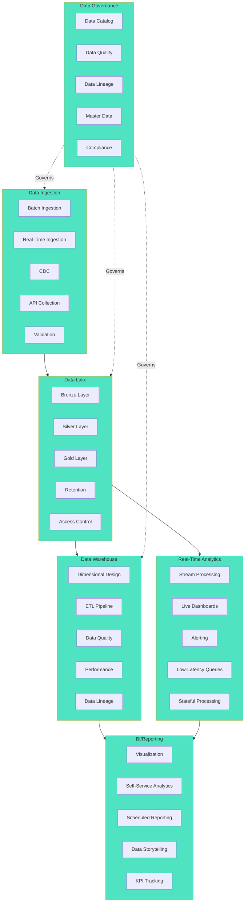

# Data Platform Domain Model

## Business Capability Map

The Data Platform domain provides five core data infrastructure capabilities.

### 1. Data Ingestion

**Definition**: Collect and ingest data from all banking systems into centralized platform.

**Sub-capabilities**:
- **Batch Ingestion** — Scheduled extract-load of data (nightly, weekly)
- **Real-Time Ingestion** — Continuous data streaming from event sources
- **CDC (Change Data Capture)** — Capture incremental changes from databases
- **API Data Collection** — Ingest data via third-party APIs
- **Data Validation** — Validate data quality during ingestion

### 2. Data Lake

**Definition**: Raw data storage with schema-on-read approach for data exploration.

**Sub-capabilities**:
- **Bronze Layer** — Raw, immutable data from source systems
- **Silver Layer** — Cleaned, deduplicated data with quality checks
- **Gold Layer** — Domain-specific curated data for analytics
- **Data Retention** — Archive and deletion policies per regulatory requirements
- **Access Control** — Role-based access to sensitive data

### 3. Data Warehouse

**Definition**: Dimensional data model optimized for analytics and reporting.

**Sub-capabilities**:
- **Dimensional Design** — Star schema with facts and dimensions
- **ETL Pipeline** — Extract, transform, load processes
- **Data Quality** — Data validation and reconciliation
- **Performance** — Query optimization and indexing
- **Data Lineage** — Track data transformation pipelines

### 4. Real-Time Analytics

**Definition**: Stream processing and real-time dashboards for operational monitoring.

**Sub-capabilities**:
- **Stream Processing** — Real-time aggregation and computation
- **Real-Time Dashboards** — Live monitoring dashboards
- **Alerting** — Automated alerts for anomalies
- **Low-Latency Queries** — Sub-second query response times
- **Stateful Processing** — Window functions, joins over streaming data

### 5. BI/Reporting

**Definition**: Self-service analytics and reporting tools for business users.

**Sub-capabilities**:
- **Data Visualization** — Interactive dashboards and reports
- **Self-Service Analytics** — Ad-hoc query tools for business users
- **Scheduled Reporting** — Automated report generation and distribution
- **Data Storytelling** — Narrative analysis and insights
- **Performance Metrics** — KPI tracking and scorecard management

### 6. Data Governance

**Definition**: Management of data quality, lineage, and compliance.

**Sub-capabilities**:
- **Data Catalog** — Centralized metadata registry
- **Data Quality** — Quality rules and monitoring
- **Data Lineage** — Track data flow and transformations
- **Master Data Mgmt** — Reference data management
- **Compliance** — Regulatory compliance and audit trails

---

## Business Capability Diagram



---

## Data Architecture Layers

### Ingest Layer
Source systems (Payments, Core Banking, Risk, Digital) → Kafka topics

### Lake Layer (Bronze/Silver/Gold)

**Bronze**: Raw from sources
```
s3://data-lake/bronze/payments/2026-03-08/payment_events.parquet
s3://data-lake/bronze/core-banking/2026-03-08/accounts.csv
```

**Silver**: Cleaned, deduplicated
```
s3://data-lake/silver/payments/2026-03-08/payment_events_clean.parquet
s3://data-lake/silver/core-banking/2026-03-08/accounts_deduplicated.parquet
```

**Gold**: Domain-curated
```
s3://data-lake/gold/analytics/payment_metrics_daily.parquet
s3://data-lake/gold/analytics/customer_segments_daily.parquet
```

### Warehouse Layer (Snowflake)

Dimensional model with facts and dimensions:
- Fact tables: payment_fact, account_fact, transaction_fact
- Dimension tables: customer_dim, account_dim, time_dim, payment_method_dim

### Analytics Layer

Real-time dashboards (Tableau, Looker) backed by warehouse and streaming data.

---

## Key Metrics

| Metric | Target | Current |
|--------|--------|---------|
| Data Freshness | < 1 hour | 6 hours |
| Data Quality Score | 98%+ | 94% |
| Query Latency (p95) | < 5 seconds | 8 seconds |
| Dashboard Load Time | < 3 seconds | 5 seconds |
| Data Catalog Completeness | 95%+ | 75% |

---

## See Also

- [Data Platform Context Map](../context-map.md)
- [Lakehouse Migration Project](../dab/2026/lakehouse-migration/README.md)
- [Real-Time Analytics Project](../dab/2026/real-time-analytics/README.md)

---

Last Updated: March 8, 2026 | Domain: Data Platform
