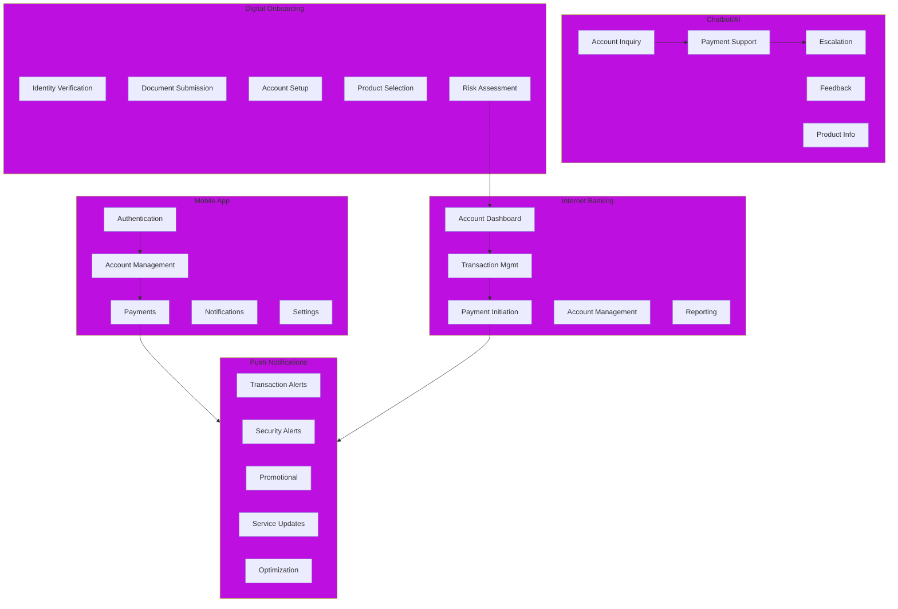

# Digital Channels Domain Model

## Business Capability Map

The Digital Channels domain provides customer-facing capabilities across multiple digital touchpoints.

### 1. Mobile App

**Definition**: Native iOS and Android applications providing banking functionality on smartphones.

**Sub-capabilities**:
- **Authentication** — Biometric login, password authentication
- **Account Management** — View balance, transaction history, account details
- **Payments** — Initiate transfers, QR payments, bill payments
- **Notifications** — Real-time alerts and confirmations
- **User Settings** — Preferences, security settings, device management

### 2. Internet Banking

**Definition**: Web-based platform accessible from browsers providing full banking functionality.

**Sub-capabilities**:
- **Account Dashboard** — Overview of all customer accounts
- **Transaction Management** — Detailed transaction history and filters
- **Payment Initiation** — Batch payments, recurring payments
- **Account Management** — Profile updates, limit changes
- **Reporting** — Custom reports, statements download

### 3. Push Notifications

**Definition**: Real-time notifications delivered to customer devices.

**Sub-capabilities**:
- **Transaction Alerts** — Payment completed, large withdrawal
- **Security Alerts** — Login from new device, failed login attempt
- **Promotional** — New product launches, special offers
- **Service Updates** — Maintenance notifications, service changes
- **Delivery Optimization** — Smart timing, frequency caps

### 4. Chatbot/AI Assistant

**Definition**: Conversational AI providing customer service and support automation.

**Sub-capabilities**:
- **Account Inquiry** — Balance, transaction history, account details
- **Payment Support** — Help with payment initiation and troubleshooting
- **Feedback & Complaints** — Customer complaint registration
- **Product Information** — Product features, rates, terms
- **Escalation** — Route to human agents when needed

### 5. Digital Onboarding

**Definition**: Streamlined account opening and customer onboarding through digital channels.

**Sub-capabilities**:
- **Identity Verification** — eKYC with biometric matching
- **Document Submission** — Digital document capture and validation
- **Account Setup** — Account selection, initial funding
- **Product Selection** — Choosing accounts and services
- **Risk Assessment** — Automated fraud and risk scoring

---

## Business Capability Diagram

---

## Device Support

### Mobile App

| Platform | Version | Support | Users |
|----------|---------|---------|-------|
| **iOS** | 14.0+ | Full | 55% |
| **Android** | 9.0+ | Full | 45% |

### Internet Banking

| Browser | Support | Coverage |
|---------|---------|----------|
| Chrome | Latest 2 | 60% |
| Safari | Latest 2 | 20% |
| Firefox | Latest 2 | 10% |
| Edge | Latest 2 | 10% |

---

## User Segments

### Retail Customers
- **Usage**: Daily transactions, fund transfers, bill payments
- **Features**: Simplified interface, quick actions
- **Volume**: 2.5M active users/month

### SME Customers
- **Usage**: Payroll, inventory payments, reporting
- **Features**: Batch payments, detailed reporting, API access
- **Volume**: 150K active users/month

### Corporate Customers
- **Usage**: Treasury, trade finance, complex transactions
- **Features**: Advanced permissions, audit trails, integration
- **Volume**: 2K active users/month

---

## Key Metrics

| Metric | Target | Current |
|--------|--------|---------|
| Mobile App Downloads | 5M+ | 4.2M |
| Daily Active Users | 1.5M | 1.2M |
| Payment Completion Rate | > 98% | 97% |
| App Store Rating | 4.5+ stars | 4.3 stars |
| Web Platform Uptime | 99.95% | 99.92% |

---

## See Also

- [Digital Channels Context Map](../context-map.md)
- [Mobile App Project](../dab/2026/mobile-app-redesign/README.md)
- [Chatbot Platform Project](../dab/2026/chatbot-ai-platform/README.md)

---

Last Updated: March 8, 2026 | Domain: Digital Channels
