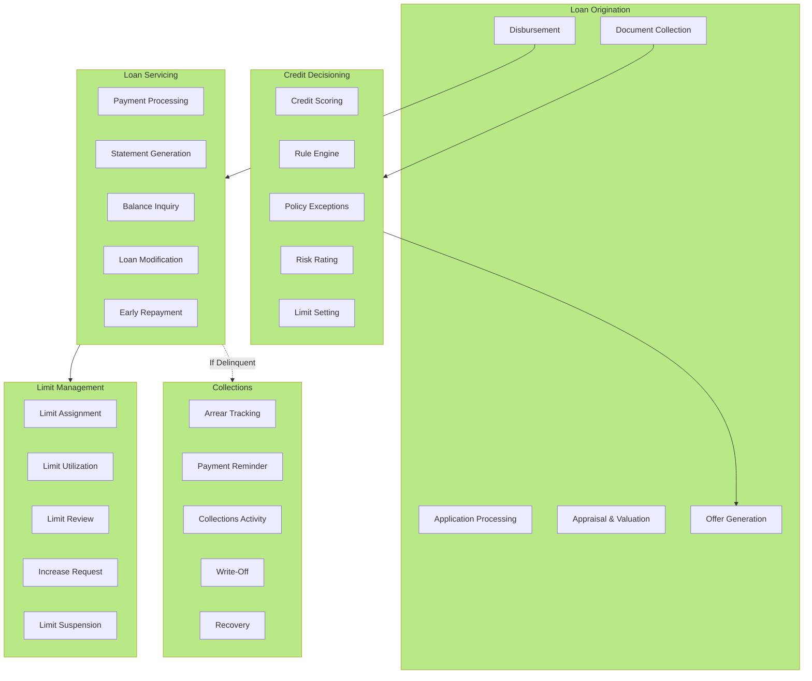

# Lending Domain Model

## Business Capability Map

The Lending domain encompasses five core lending capabilities.

### 1. Loan Origination

**Definition**: End-to-end process of evaluating, approving, and disbursing loans to customers.

**Sub-capabilities**:
- **Application Processing** — Accept and validate loan applications
- **Document Collection** — Gather and verify required documents
- **Appraisal & Valuation** — Assess collateral value (for secured loans)
- **Offer Generation** — Create loan offer with terms and conditions
- **Disbursement** — Disburse funds to customer account

### 2. Credit Decisioning

**Definition**: Automated and manual evaluation of creditworthiness and approval decisions.

**Sub-capabilities**:
- **Credit Scoring** — Numerical scoring of customer creditworthiness
- **Rule Engine** — Automated decision rules based on credit policy
- **Policy Exceptions** — Manual review of applications outside policy
- **Risk Rating** — Classification of approved loans by risk tier
- **Limit Setting** — Determine approved loan amount and terms

### 3. Loan Servicing

**Definition**: Ongoing management of loans throughout their lifecycle.

**Sub-capabilities**:
- **Payment Processing** — Collection of monthly/periodic loan payments
- **Statement Generation** — Monthly loan statements
- **Balance Inquiry** — Customer access to loan balance and payment history
- **Loan Modification** — Changes to loan terms (repricing, restructuring)
- **Early Repayment** — Handling of prepayment requests

### 4. Collections

**Definition**: Management of overdue loans and arrear collection.

**Sub-capabilities**:
- **Arrear Tracking** — Monitor and classify delinquent accounts
- **Payment Reminder** — Send notifications for upcoming and overdue payments
- **Collections Activity** — Track collection calls, letters, and actions
- **Write-Off** — Classification of uncollectible loans as losses
- **Recovery** — Post-write-off recovery efforts

### 5. Limit Management

**Definition**: Management of customer credit lines and facility limits.

**Sub-capabilities**:
- **Limit Assignment** — Set credit limit for customer
- **Limit Utilization** — Track and manage limit utilization
- **Limit Review** — Periodic review and renewal of limits
- **Increase Request** — Process customer requests for limit increase
- **Limit Suspension** — Suspend limits for delinquent accounts

---

## Business Capability Diagram



---

## Product Categories

### Retail Loans

| Product | Purpose | LTV | Max Amount | Terms |
|---------|---------|-----|-----------|-------|
| **Personal Loan** | Consumption | 0% | VND 500M | 1-5 years |
| **Auto Loan** | Vehicle purchase | 70-80% | VND 3B | 3-7 years |
| **Home Loan** | Property purchase | 70-80% | VND 10B+ | 5-20 years |
| **Education Loan** | Education expenses | 0% | VND 500M | 5-10 years |

### SME Loans

| Product | Purpose | Security | Max Amount | Terms |
|---------|---------|----------|-----------|-------|
| **Working Capital** | Business operations | Collateral | VND 5B | 1-3 years |
| **Equipment Loan** | Equipment purchase | Equipment | VND 3B | 3-7 years |
| **Trade Finance** | Import/export | LC | VND 10B | 30-180 days |

### Corporate Loans

| Product | Purpose | Max Amount | Tenor |
|---------|---------|-----------|-------|
| **Term Loan** | General corporate use | VND 100B+ | 1-10 years |
| **Credit Facility** | Committed credit line | VND 100B+ | Renewable |
| **Syndicated Loan** | Large projects | VND 500B+ | 3-10 years |

---

## Credit Approval Workflow

```
Application Received
    ↓
Credit Scoring (automated)
    ├─ Score > 700: Auto-approve ✓
    ├─ 400-700: Manual review
    └─ Score < 400: Auto-decline ✗
    ↓
Manual Underwriting (if applicable)
    ├─ Policy exceptions approval
    └─ Additional documentation
    ↓
Risk Rating & Limit Setting
    ├─ AAA-CCC rating assignment
    └─ Loan amount and tenure
    ↓
Offer Generation & Customer Acceptance
    ↓
Document Execution
    ↓
Disbursement
```

---

## Key Metrics

| Metric | Target | Current |
|--------|--------|---------|
| Loan Approval Rate | 45-55% | 48% |
| Average Approval Time | < 3 days | 4 days |
| Portfolio Default Rate | < 2% | 1.8% |
| Loan-to-Value Ratio | < 75% | 72% |
| Net Interest Margin | 3.5-4.5% | 4.1% |

---

## See Also

- [Lending Context Map](../context-map.md)
- [Auto Loan Origination Project](../dab/2026/auto-loan-origination/README.md)

---

Last Updated: March 8, 2026 | Domain: Lending
