# Payments Domain Context Map

## C4 Level 1: System Context

This diagram shows the Payments domain and its relationships to other domains, systems, and external actors within the Techcombank architecture.

```mermaid
graph TB
    subgraph External["External Systems"]
        NAPAS["NAPAS Network"]
        SWIFT["SWIFT Network"]
        VIETQR["VietQR Infrastructure"]
        PSP1["Stripe"]
        PSP2["PayPal"]
        SBV["State Bank of Vietnam<br/>SBV Circular 64"]
    end

    subgraph TechcomCore["Techcombank Core"]
        Payments["<b>Payments Domain</b><br/>- Payment Processing<br/>- Routing & Settlement<br/>- Reconciliation<br/>- Fraud Screening"]

        CoreBanking["Core Banking Domain<br/>- Account Master<br/>- General Ledger<br/>- Customer Master<br/>- T24 Transact"]

        RiskMgmt["Risk Management Domain<br/>- Fraud Detection<br/>- Credit Risk<br/>- AML/KYC<br/>- Compliance Reporting"]

        Digital["Digital Channels Domain<br/>- Mobile App<br/>- Internet Banking<br/>- Push Notifications<br/>- Chatbot"]

        DataPlatform["Data Platform Domain<br/>- Data Lake<br/>- Analytics<br/>- Real-time Streaming<br/>- BI/Reporting"]

        Lending["Lending Domain<br/>- Loan Origination<br/>- Credit Decisioning<br/>- Loan Servicing"]
    end

    subgraph Customers["Customers & Partners"]
        RetailCustomer["Retail Customers<br/>Mobile/Web"]
        Corporate["Corporate Customers<br/>API Integration"]
        Partners["Partner Banks<br/>Interbank Network"]
    end

    %% External System Connections
    Payments -->|"Payment Request<br/>Route to NAPAS"| NAPAS
    Payments -->|"International Transfer<br/>SWIFT MT103"| SWIFT
    Payments -->|"QR Code Payment<br/>VietQR API"| VIETQR
    Payments -->|"Card Payment<br/>Processing"| PSP1
    Payments -->|"Card Payment<br/>Processing"| PSP2
    Payments -->|"Settlement Confirmation<br/>Reconciliation"| NAPAS
    Payments -->|"Settlement Confirmation<br/>Reconciliation"| SWIFT
    Payments -->|"Regulatory Reporting<br/>SBV Circular 64"| SBV

    %% Internal Domain Connections
    Digital -->|"Payment Request"| Payments
    Corporate -->|"API Request"| Payments
    RetailCustomer -->|"Payment Request"| Payments

    Payments -->|"Account Debit/Credit<br/>GL Posting"| CoreBanking
    Payments -->|"Customer Master Lookup<br/>Account Details"| CoreBanking

    Payments -->|"Fraud Screening<br/>Transaction Limits"| RiskMgmt
    RiskMgmt -->|"Alert Results<br/>Risk Score"| Payments

    Payments -->|"Payment Analytics<br/>Audit Trail"| DataPlatform
    DataPlatform -->|"Historical Data<br/>Real-time Feeds"| Payments

    Payments -.->|"Loan-related Payments"| Lending

    %% Customer Notifications
    Payments -->|"Payment Confirmation<br/>SMS/Push/Email"| Digital

    %% Partner Bank Settlement
    Payments -->|"Interbank Settlement<br/>ACH/RTGS"| Partners

    style Payments fill:#4A90E2,stroke:#2E5C8A,color:#fff,font-weight:bold
    style CoreBanking fill:#7ED321,stroke:#5BA318
    style RiskMgmt fill:#F5A623,stroke:#C67F1A
    style Digital fill:#BD10E0,stroke:#8B0AA8
    style DataPlatform fill:#50E3C2,stroke:#37A89A
    style Lending fill:#B8E986,stroke:#8BA952
    style NAPAS fill:#FF6B6B,stroke:#C92A2A
    style SWIFT fill:#FF6B6B,stroke:#C92A2A
    style VIETQR fill:#FF6B6B,stroke:#C92A2A
    style SBV fill:#FF6B6B,stroke:#C92A2A
```



---

## Domain Interactions

### 1. **Payments ↔ Core Banking**

**Direction**: Bidirectional

**Data Flow**:
- **Payments → Core Banking**: Payment posting requests (debit/credit), GL entries
- **Core Banking → Payments**: Account master, customer limits, available balance
- **Frequency**: Real-time
- **Protocol**: Synchronous (REST) for queries, Asynchronous (Kafka) for postings

**Example**:
A domestic transfer payment must:
1. Query Core Banking for account existence and balance
2. Post debit entry to sending account in T24
3. Post credit entry to receiving account in T24
4. Update GL for fee collection

### 2. **Payments ↔ Risk Management**

**Direction**: Bidirectional

**Data Flow**:
- **Payments → Risk Management**: Payment transaction details for fraud screening
- **Risk Management → Payments**: Fraud score, risk rating, alert status
- **Frequency**: Real-time (< 100ms SLA)
- **Protocol**: gRPC for low-latency scoring

**Example**:
A high-value international transfer triggers:
1. Real-time fraud detection checks
2. AML screening against blacklists
3. Customer KYC verification
4. Transaction limit validation

### 3. **Payments ↔ Digital Channels**

**Direction**: Bidirectional

**Data Flow**:
- **Digital → Payments**: Payment requests from mobile app, web app
- **Payments → Digital**: Payment status updates, confirmations
- **Frequency**: Real-time
- **Protocol**: REST API v2.0

**Example**:
Customer initiates transfer via mobile app:
1. Digital Channels validates user session
2. Digital sends payment request to Payments
3. Payments processes and routes payment
4. Payments sends confirmation back to Digital
5. Digital displays confirmation to customer

### 4. **Payments ↔ Data Platform**

**Direction**: Unidirectional (Payments → Data Platform)

**Data Flow**:
- **Payments → Data Platform**: Payment events (initiated, processed, failed), analytics
- **Frequency**: Near real-time (event streaming)
- **Protocol**: Kafka topics for streaming, REST for batch queries

**Topics**:
- `payments.transactions.initiated`
- `payments.transactions.processed`
- `payments.transactions.failed`
- `payments.network.settlement`

**Example**:
All payment transactions are streamed to Kafka for:
- Real-time dashboard monitoring
- Daily analytics reports
- Fraud pattern analysis
- Regulatory reporting

### 5. **Payments ↔ External Payment Networks**

**Direction**: Bidirectional

**Integrations**:

| Network | Direction | Protocol | Frequency |
|---------|-----------|----------|-----------|
| NAPAS | Both | ISO 20022 XML | Real-time (batch hourly) |
| SWIFT | Both | SWIFT FIN MT103 | Batch (hourly) |
| VietQR | Both | REST API | Real-time |
| Stripe/PayPal | Both | REST/Webhook | Real-time |

**Example NAPAS Flow**:
1. Payments receives domestic transfer request
2. Validates and routes to NAPAS via secure connection
3. NAPAS processes and returns confirmation
4. Payments posts GL entries
5. Payments receives settlement confirmation (next day)
6. Reconciliation team matches with GL

### 6. **Payments ↔ SBV (Regulator)**

**Direction**: Unidirectional (Payments → SBV)

**Compliance**:
- SBV Circular 64 reporting
- Large transaction reporting (> VND 1 billion)
- AML/KYC compliance
- Transaction monitoring
- Cross-border transaction reporting

**Frequency**: Daily, weekly, and ad-hoc

---

## Bounded Context Definition

### Context Boundary

The Payments domain owns all **payment transaction processing** from initiation through settlement and reconciliation. This includes:

**Inside Boundary**:
- Payment request intake and validation
- Fraud screening coordination
- Payment routing logic
- Settlement orchestration
- Reconciliation

**Outside Boundary** (owned by other domains):
- Account master data (Core Banking)
- Customer KYC/AML data (Risk Management)
- Customer notifications (Digital Channels)
- Data analytics (Data Platform)

### Ubiquitous Language

Key terms used consistently throughout Payments domain:

| Term | Definition |
|------|-----------|
| **Payment** | A financial transaction transferring funds from one account to another |
| **Payment Order** | A request to execute a payment containing payer, payee, and amount |
| **Saga** | A distributed transaction coordinating multiple services (e.g., debit, credit, fee) |
| **Settlement** | Final confirmation and posting of payment to destination |
| **Reconciliation** | Matching payment records with external network confirmations |
| **Idempotency Key** | Unique identifier ensuring payment is not processed twice |
| **PSP** | Payment Service Provider (e.g., Stripe, PayPal) |

See [`shared/payment-glossary.md`](./shared/payment-glossary.md) for complete glossary.

---

## Architecture Patterns

### Saga Orchestration

The Payments domain uses **Saga pattern** to coordinate distributed payment processing:

```
Payment Order
    ↓
[Orchestrator: Temporal]
    ├─→ Debit Account (Core Banking)
    ├─→ Fraud Check (Risk Management)
    ├─→ Route Payment (External Network)
    ├─→ Credit Account (Core Banking)
    ├─→ Calculate Fee (Payments)
    └─→ Send Notification (Digital)
```

See [`dab/2026/payment-saga-platform/decisions/ADR-001-saga-vs-2pc.md`](./dab/2026/payment-saga-platform/decisions/ADR-001-saga-vs-2pc.md) for justification.

---

## External Dependencies

| System | Purpose | SLA | Fallback |
|--------|---------|-----|----------|
| NAPAS | Domestic transfer routing | 99.95% | Queue + retry |
| SWIFT | International transfer routing | 99.90% | Manual intervention |
| VietQR | QR code payment routing | 99.90% | Fallback to NAPAS |
| Stripe | Card payment processing | 99.99% | PayPal fallback |
| Core Banking (T24) | Account posting | 99.99% | None (critical) |
| Risk Management | Fraud screening | 99.99% | Default: block |

---

## Data Flow Diagram

See [`shared/diagrams/payment-flow-template.md`](./shared/diagrams/payment-flow-template.md) for reusable sequence diagram template.

---

Last Updated: March 8, 2026 | Domain: Payments
