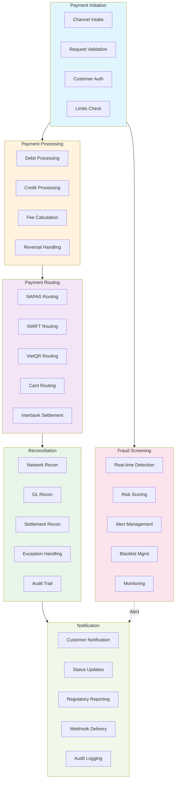

# Payments Domain Model

## Business Capability Map

The Payments domain is decomposed into six major business capabilities, each representing a distinct business function within payment processing.

### 1. Payment Initiation

**Definition**: Accept and validate payment requests from internal systems and external channels.

**Sub-capabilities**:
- **Channel Intake** — Receive payment requests from mobile app, internet banking, ATM, branch, third-party APIs
- **Request Validation** — Validate payment format, mandatory fields, data consistency
- **Customer Authentication** — Verify customer identity and transaction authorization
- **Limits Checking** — Validate transaction amount against customer limits

**Success Metrics**:
- Payment request acceptance rate > 99.9%
- Request validation latency < 500ms (p95)
- False rejection rate < 0.1%

### 2. Payment Processing

**Definition**: Execute debit and credit operations for payment transactions.

**Sub-capabilities**:
- **Debit Processing** — Deduct funds from customer account in real-time
- **Credit Processing** — Credit funds to beneficiary account (same-day or next-day)
- **Fee Calculation** — Calculate and apply transaction fees based on customer profile
- **Reversal Processing** — Handle transaction reversals and chargebacks

**Success Metrics**:
- Processing latency < 2 seconds (p99)
- Debit-credit balance accuracy: 100%
- Fee calculation accuracy: 100%

### 3. Payment Routing

**Definition**: Route payment transactions through appropriate payment networks based on destination and payment type.

**Sub-capabilities**:
- **NAPAS Routing** — Route domestic transfers through NAPAS network
- **SWIFT Routing** — Route international transfers through SWIFT network
- **VietQR Routing** — Route QR code payments through VietQR infrastructure
- **Card Network Routing** — Route card transactions through Visa/Mastercard/JCB networks
- **Interbank Settlement** — Handle settlement with other banks via ACH or real-time gross settlement

**Success Metrics**:
- Correct routing accuracy: 99.99%
- Network availability: 99.95% (SLA)
- Settlement completion rate: 100% (within SLA)

### 4. Reconciliation

**Definition**: Reconcile payment transactions with external payment networks and internal ledger systems.

**Sub-capabilities**:
- **Network Reconciliation** — Match sent transactions with network confirmations (NAPAS, SWIFT, VietQR)
- **GL Reconciliation** — Reconcile payment postings with General Ledger entries
- **Settlement Reconciliation** — Verify settlement amounts and timing
- **Exception Handling** — Identify and resolve discrepancies (breaks, reversals, duplicates)
- **Audit Trail** — Maintain immutable records for regulatory compliance

**Success Metrics**:
- Reconciliation completion rate: 100% (within 24 hours)
- Unresolved breaks: < 0.01% of volume
- Reconciliation SLA achievement: > 99.9%

### 5. Fraud Screening

**Definition**: Detect and prevent fraudulent payment transactions in real-time.

**Sub-capabilities**:
- **Real-time Detection** — Perform real-time fraud checks using rules and machine learning
- **Risk Scoring** — Assign risk scores to transactions based on patterns and anomalies
- **Alert Management** — Generate and escalate fraud alerts to investigation teams
- **Blacklist Management** — Maintain and query fraud blacklists
- **Transaction Monitoring** — Monitor suspicious transaction patterns over time

**Success Metrics**:
- Fraud detection latency < 100ms (p99)
- True positive rate: > 85%
- False positive rate: < 5%
- Fraud catch rate: > 90%

### 6. Notification

**Definition**: Deliver payment status notifications and confirmations to customers and regulators.

**Sub-capabilities**:
- **Customer Notification** — Send SMS, push, email confirmations to customers
- **Status Update** — Provide real-time status of payment processing
- **Regulatory Reporting** — Generate reports for SBV and other regulators
- **Webhook Delivery** — Deliver webhooks to third-party systems for payment events
- **Audit Logging** — Log all notifications for compliance

**Success Metrics**:
- Notification delivery rate: > 99%
- Delivery latency: < 5 seconds (p95)
- Regulatory report accuracy: 100%

---

## Business Capability Diagram

---

## Capability Maturity

| Capability | Maturity Level | Notes | Target (2026) |
|-----------|---|-------|--------------|
| Payment Initiation | Optimized | Multi-channel support mature | Optimized |
| Payment Processing | Optimized | Real-time processing stable | Optimized |
| Payment Routing | Managed | NAPAS/SWIFT/VietQR mature | Optimized |
| Reconciliation | Managed | Manual breaks still exist | Optimized |
| Fraud Screening | Repeatable | Rule-based detection in place | Optimized (ML) |
| Notification | Managed | Multi-channel but not unified | Optimized |

---

## Glossary

For detailed payment domain terminology, see [`shared/payment-glossary.md`](./shared/payment-glossary.md).

## Architecture References

- See [`context-map.md`](./context-map.md) for system context
- See [`technology-radar.md`](./technology-radar.md) for technology recommendations
- See [`dab/2026/payment-saga-platform/`](./dab/2026/payment-saga-platform/) for SAGA orchestration approach

---

Last Updated: March 8, 2026 | Domain: Payments
