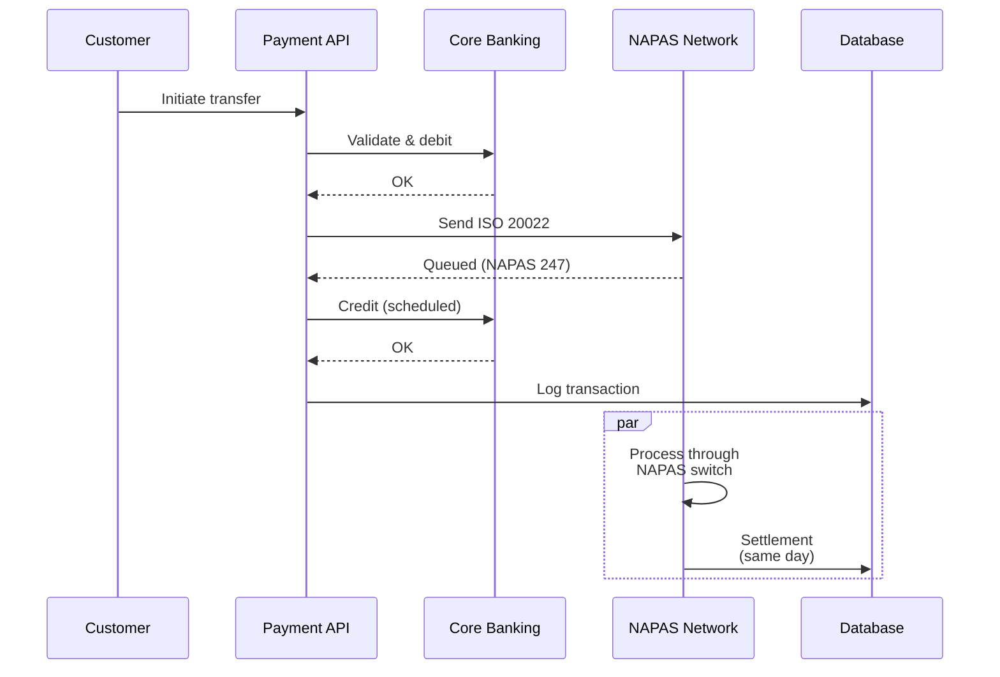
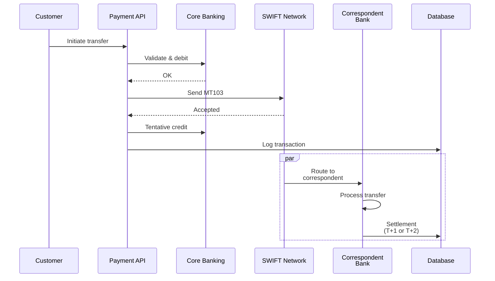
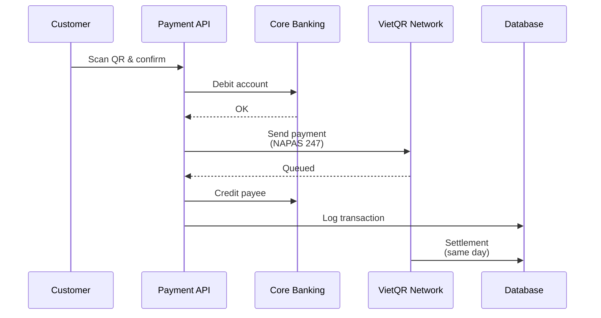
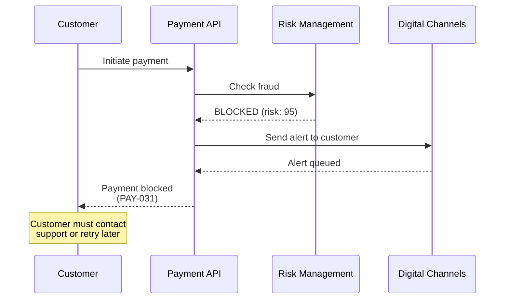
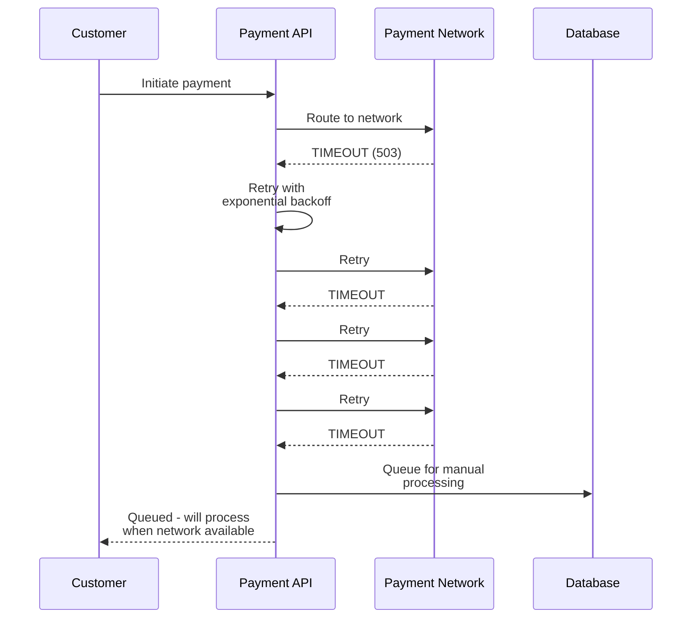

# Payment Flow Sequence Diagram Template

This document provides a reusable Mermaid sequence diagram template for payment flows across the Payments domain. Use this as a starting point for documenting specific payment scenarios.

---

## Generic Payment Flow (Template)

The following is a generic template showing the main phases of payment processing:

```mermaid
sequenceDiagram
    participant C as Customer/<br/>Channel
    participant PA as Payment API<br/>(Payments Domain)
    participant CB as Core Banking<br/>(T24)
    participant RM as Risk Management<br/>(Fraud/AML)
    participant PN as Payment Network<br/>(NAPAS/SWIFT)
    participant DB as Database<br/>Reconciliation
    participant DC as Digital Channels<br/>(Notification)

    C->>PA: 1. Initiate Payment<br/>(payer, payee, amount)
    activate PA

    PA->>PA: 2. Validate Request<br/>(format, fields, syntax)

    PA->>CB: 3. Query Account<br/>(availability, balance)
    activate CB
    CB-->>PA: Account details, balance
    deactivate CB

    PA->>RM: 4. Fraud Check<br/>(risk scoring, AML screening)
    activate RM
    RM-->>PA: Risk score, decision<br/>(approve/block)
    deactivate RM

    alt Fraud Detected
        PA-->>C: Payment Blocked<br/>(PAY-031)
        deactivate PA
    else Approved
        PA->>CB: 5. Debit Account<br/>(SAGA step 1)
        activate CB
        CB-->>PA: Debit confirmed<br/>(GL entry posted)
        deactivate CB

        PA->>PN: 6. Route Payment<br/>(send to NAPAS/SWIFT)
        activate PN
        PN-->>PA: Routing accepted<br/>(network reference)
        deactivate PN

        PA->>CB: 7. Credit Account<br/>(SAGA step 2)
        activate CB
        CB-->>PA: Credit confirmed<br/>(GL entry posted)
        deactivate CB

        PA->>PA: 8. Calculate Fee<br/>(SAGA step 3)

        PA->>DB: 9. Log Transaction<br/>(record, audit trail)
        activate DB
        DB-->>PA: Logged
        deactivate DB

        PA->>DC: 10. Send Notification<br/>(SMS/push/email)
        activate DC
        DC-->>PA: Notification queued
        deactivate DC

        PA-->>C: Payment Successful<br/>(confirmation, reference)
        deactivate PA

        par Network Settlement
            PN->>DB: Settlement confirmation<br/>(T+0 or T+1)
            activate DB
            DB->>DB: Reconciliation<br/>(match & verify)
            deactivate DB
        end
    end
```

---

## Template Explanation

### Phase 1: Initiation (Step 1)
**Participant**: Customer/Channel
- Customer initiates payment via mobile app, web, or API
- **Input**: Payer account, payee account, amount
- **Output**: Payment order accepted

### Phase 2: Validation (Step 2)
**Participant**: Payment API
- Validate payment order format and mandatory fields
- **Checks**:
  - Account number format (10-12 digits)
  - Amount > 0 and < maximum
  - Currency supported
  - Beneficiary name not empty
- **Error Codes**: PAY-001 through PAY-010
- **SLA**: < 500ms (P95)

### Phase 3: Account Check (Step 3)
**Participant**: Core Banking (T24)
- Query payer and beneficiary accounts
- Verify accounts exist and are active
- **Retrieves**:
  - Available balance
  - Account type
  - Account status (active/blocked)
  - Customer limits
- **Error Codes**: PAY-021 through PAY-028
- **SLA**: < 1 second (P99)

### Phase 4: Fraud & Risk Check (Step 4)
**Participant**: Risk Management
- Real-time fraud detection and risk scoring
- **Checks**:
  - Transaction amount vs. historical patterns
  - Beneficiary account reputation
  - Customer behavior (time of day, location, device)
  - AML/KYC screening
  - Sanctions list matching
- **Returns**: Risk score (0-100), decision (approve/block/challenge)
- **Error Codes**: PAY-031 through PAY-037
- **SLA**: < 100ms (P99)

### Phase 5: Debit Account (Step 5)
**Participant**: Core Banking
- **SAGA Orchestration Step 1**
- Deduct amount from payer account
- Create GL entry (debit asset account, credit liability account)
- Post fee charge if applicable
- **Atomicity**: Full transaction must complete or fully rollback
- **Error**: If fails, SAGA triggers compensation (reverse debit)

### Phase 6: Route Payment (Step 6)
**Participant**: Payment Network (NAPAS/SWIFT/VietQR)
- Route payment to appropriate network
- **Routing Logic**:
  - Domestic → NAPAS
  - International → SWIFT
  - QR payment → VietQR
- **Sends**: Standardized payment message (ISO 20022 or SWIFT FIN)
- **Returns**: Network reference number, acceptance confirmation
- **SLA**: < 2 seconds (P99)

### Phase 7: Credit Account (Step 7)
**Participant**: Core Banking
- **SAGA Orchestration Step 2**
- Credit amount to beneficiary account (in same bank or scheduled for next day)
- Create GL entry
- **Note**: For interbank transfers, credit happens when destination bank confirms

### Phase 8: Fee Calculation (Step 8)
**Participant**: Payment API
- Calculate transaction fee based on:
  - Transfer type (domestic/international)
  - Amount
  - Customer tier
  - Promotional discounts
- **SLA**: < 100ms

### Phase 9: Log Transaction (Step 9)
**Participant**: Database (Audit & Reconciliation)
- Record complete payment transaction
- Store:
  - Payment details (payer, payee, amount)
  - Timeline (initiation, routing, settlement)
  - Fraud risk score and decision
  - GL references
  - Network references (NAPAS, SWIFT)
  - Fee applied
  - Idempotency key
- **Durability**: Immutable, append-only log
- **Retention**: 7 years (regulatory requirement)

### Phase 10: Notification (Step 10)
**Participant**: Digital Channels
- Send payment confirmation to customer
- **Methods**:
  - SMS (instant)
  - Push notification (instant)
  - Email (instant to 5 minutes)
  - In-app notification (instant)
- **Content**: Amount, beneficiary, reference, fees, timestamp
- **SLA**: < 5 seconds (P95)

### Phase 11: Settlement (Parallel)
**Participants**: Payment Network → Reconciliation
- Network confirms funds have been settled
- Reconciliation team matches:
  - Sent payment vs. network confirmation
  - Payment posting vs. GL entries
- **Timeline**: T+0 (NAPAS, immediate) or T+1 (SWIFT, next day)

---

## Common Payment Flow Variations

### Variation A: Domestic Transfer (NAPAS)



### Variation B: International Transfer (SWIFT)



### Variation C: QR Code Payment (VietQR)



---

## Error Handling in Flows

### Scenario: Fraud Detected



### Scenario: Network Unavailable



---

## Metrics and Observability

Each step should be instrumented with:

1. **Latency** (p50, p95, p99)
2. **Error Rate** (count and %ge)
3. **Success Rate**

```
# Example Prometheus metrics:
payment_request_validation_duration_seconds{quantile="0.95"} 0.45
payment_api_fraud_check_duration_seconds{quantile="0.99"} 0.087
payment_network_routing_errors_total{network="NAPAS"} 42
payment_processing_success_rate 0.9999
```

---

## Implementation Checklist

When implementing a payment flow:

- [ ] Validate all required fields
- [ ] Check customer authentication and authorization
- [ ] Query account master from Core Banking
- [ ] Perform fraud/risk screening
- [ ] Execute debit in SAGA transaction
- [ ] Route to appropriate payment network
- [ ] Execute credit in SAGA transaction
- [ ] Calculate and apply fees
- [ ] Log transaction with idempotency key
- [ ] Send customer notification
- [ ] Set up reconciliation for settlement verification
- [ ] Implement error handling and retries
- [ ] Add monitoring and alerting
- [ ] Document with sequence diagram

---

## Tools

- **Mermaid** — Generate sequence diagrams
- **PlantUML** — Alternative diagram format
- **DataDog** — Monitor actual flows in production
- **Jaeger** — Distributed tracing for debugging

---

## See Also

- [Payment Error Codes](../payment-error-codes.md)
- [Payment Glossary](../payment-glossary.md)
- [Context Map](../../context-map.md)
- [SAGA Pattern (ADR-001)](../../dab/2026/payment-saga-platform/decisions/ADR-001-saga-vs-2pc.md)

---

Last Updated: March 8, 2026 | Domain: Payments
