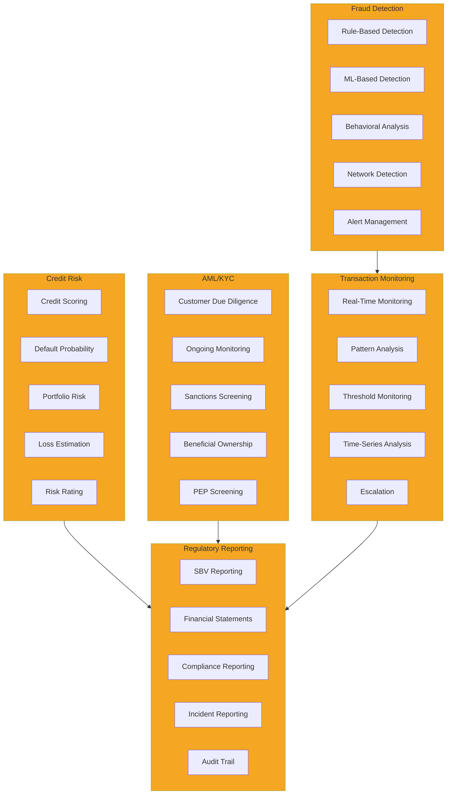

# Risk Management Domain Model

## Business Capability Map

The Risk Management domain encompasses six core capabilities for identifying and mitigating banking risks.

### 1. Fraud Detection

**Definition**: Real-time identification and prevention of fraudulent financial transactions.

**Sub-capabilities**:
- **Rule-Based Detection** — Pattern matching against predefined fraud rules
- **ML-Based Detection** — Machine learning models for anomaly detection
- **Behavioral Analysis** — Detection based on customer historical patterns
- **Network Detection** — Detection of fraud rings and coordinated attacks
- **Alert Management** — Generation and escalation of fraud alerts

### 2. Credit Risk

**Definition**: Assessment of credit risk for lending decisions and portfolio monitoring.

**Sub-capabilities**:
- **Credit Scoring** — Numerical scoring of customer creditworthiness
- **Default Probability** — Prediction of customer default likelihood
- **Portfolio Risk** — Aggregate risk assessment across loan portfolio
- **Loss Estimation** — Expected loss on loans
- **Risk Rating** — Classification of customers by risk tier

### 3. AML/KYC

**Definition**: Compliance with anti-money laundering and know-your-customer regulations.

**Sub-capabilities**:
- **Customer Due Diligence** — KYC verification and documentation
- **Ongoing Monitoring** — Continuous customer profile verification
- **Sanctions Screening** — Check against government blacklists
- **Beneficial Ownership** — Verify ultimate beneficial owners
- **PEP Screening** — Check for politically exposed persons

### 4. Regulatory Reporting

**Definition**: Preparation and submission of required regulatory reports.

**Sub-capabilities**:
- **SBV Reporting** — Large transaction and incident reporting to State Bank
- **Financial Statements** — Preparation of regulatory financial reports
- **Compliance Reporting** — Status reports on compliance programs
- **Incident Reporting** — Reporting of security incidents and breaches
- **Audit Trail** — Maintenance of complete records for audits

### 5. Transaction Monitoring

**Definition**: Continuous monitoring of transactions for suspicious patterns.

**Sub-capabilities**:
- **Real-Time Monitoring** — Monitoring of transactions as they occur
- **Pattern Analysis** — Detection of unusual transaction patterns
- **Threshold Monitoring** — Alerts for transactions exceeding limits
- **Time-Series Analysis** — Detection of trends and seasonality
- **Escalation** — Automatic escalation for investigation

---

## Business Capability Diagram

---

## Risk Frameworks

### Fraud Risk Scoring

Transaction risk scores from 0-100 determine approval:

| Score | Risk Level | Action |
|-------|-----------|--------|
| 0-20 | Low | Auto-approve |
| 20-50 | Medium | Flag for review |
| 50-80 | High | Likely block |
| 80-100 | Critical | Auto-block |

### Credit Risk Rating

Customer credit ratings per SBV guidelines:

| Rating | Description | Default Probability |
|--------|-------------|-------------------|
| **AAA** | Excellent | < 0.1% |
| **AA** | Very Good | 0.1-0.5% |
| **A** | Good | 0.5-2% |
| **BBB** | Acceptable | 2-5% |
| **BB** | Below Average | 5-10% |
| **B** | Weak | 10-20% |
| **CCC** | Very Weak | > 20% |

### AML/KYC Tiers

Customer risk classification for ongoing monitoring:

| Tier | Risk | Monitoring Frequency | Examples |
|------|------|-------------------|----------|
| **Low** | Low inherent risk | Annual | Salaried employees, small merchants |
| **Medium** | Moderate risk | Quarterly | Professional services, small businesses |
| **High** | Elevated risk | Monthly | Traders, importers, cash-intensive businesses |
| **Extreme** | Very high risk | Real-time | Large traders, shell companies, high-risk jurisdictions |

---

## Key Metrics

| Metric | Target | Current |
|--------|--------|---------|
| Fraud Detection Rate | > 90% | 87% |
| False Positive Rate | < 5% | 6.2% |
| Average Investigation Time | < 24 hours | 36 hours |
| Regulatory Incident Response | < 4 hours | 5.5 hours |
| Customer Complaint Rate | < 0.2% | 0.25% |

---

## See Also

- [Risk Management Context Map](../context-map.md)
- [Fraud Detection ML Project](../dab/2026/fraud-detection-ml/README.md)

---

Last Updated: March 8, 2026 | Domain: Risk Management
