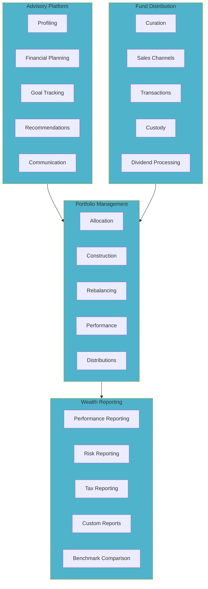

# Wealth Management Domain Model

## Business Capability Map

The Wealth Management domain encompasses four core wealth management capabilities.

### 1. Portfolio Management

**Definition**: Management of customer investment portfolios with allocation, rebalancing, and performance tracking.

**Sub-capabilities**:
- **Portfolio Allocation** — Design optimal asset allocation per customer profile
- **Portfolio Construction** — Build portfolio from curated investment products
- **Rebalancing** — Periodic adjustment to maintain target allocation
- **Performance Tracking** — Monitor portfolio performance vs. benchmarks
- **Dividend & Interest Processing** — Handle distributions and reinvestment

### 2. Fund Distribution

**Definition**: Distribution and sales of mutual funds, stocks, bonds, and structured products.

**Sub-capabilities**:
- **Product Curation** — Select and approve investment products
- **Sales Channels** — Distribution through branches, digital, advisors
- **Transaction Processing** — Execute buy/sell transactions
- **Custody Services** — Safekeeping of customer securities
- **Dividend Processing** — Distribution of dividends and interest income

### 3. Advisory Platform

**Definition**: Wealth advisory and financial planning tools and services.

**Sub-capabilities**:
- **Investor Profiling** — Assess customer risk tolerance and goals
- **Financial Planning** — Create personalized financial plans
- **Goal Tracking** — Monitor progress toward financial goals
- **Recommendations** — Provide investment recommendations
- **Client Communication** — Periodic updates and reporting to clients

### 4. Wealth Reporting

**Definition**: Comprehensive reporting on portfolio performance and wealth metrics.

**Sub-capabilities**:
- **Performance Reporting** — Historical and YTD performance metrics
- **Risk Reporting** — Portfolio risk analysis and stress testing
- **Tax Reporting** — Capital gains and dividend reporting for tax purposes
- **Custom Reports** — Bespoke reporting for clients and advisors
- **Benchmark Comparison** — Compare performance against indices and peers

---

## Business Capability Diagram

---

## Investment Product Catalog

### Mutual Funds

| Category | Examples | Risk Level | Typical Allocation |
|----------|----------|-----------|------------------|
| **Money Market** | Short-term bond funds | Very Low | 5-10% |
| **Fixed Income** | Bond funds, government bonds | Low | 20-40% |
| **Equity** | Stock funds, Vietnam equities | Medium-High | 30-50% |
| **Balanced** | Mixed allocation funds | Medium | 10-20% |
| **International** | Overseas equity, forex | High | 10-20% |

### Direct Securities

| Type | Examples | Risk Level |
|------|----------|-----------|
| **Government Bonds** | T-bills, bonds | Very Low |
| **Corporate Bonds** | Corporate debt | Low-Medium |
| **Equities** | Stock market securities | Medium-High |
| **Structured Products** | Capital protected notes | Medium |

---

## Customer Segments

### Mass-Affluent

| Characteristic | Details |
|----------------|---------|
| **Investable Assets** | VND 500M - 5B |
| **Target Return** | 4-8% annually |
| **Profile** | Salaried professionals, small business owners |
| **Services** | Self-service digital + periodic advisor meetings |
| **Fee Model** | Assets under management (AUM) 0.5-1.5% |

### High-Net-Worth

| Characteristic | Details |
|----------------|---------|
| **Investable Assets** | VND 5B+ |
| **Target Return** | 6-12% annually |
| **Profile** | Business owners, executives, entrepreneurs |
| **Services** | Dedicated advisor, customized planning |
| **Fee Model** | AUM 0.5-1.0% + performance fees |

### Ultra-High-Net-Worth

| Characteristic | Details |
|----------------|---------|
| **Investable Assets** | VND 50B+ |
| **Target Return** | 8-15% annually |
| **Profile** | Major entrepreneurs, family offices |
| **Services** | Private banking, estate planning, alternatives |
| **Fee Model** | Negotiated AUM + performance fees |

---

## Portfolio Risk Framework

### Risk Profiling

| Risk Level | Risk Tolerance | Typical Allocation | Volatility |
|-----------|---------------|------------------|-----------|
| **Conservative** | Low | 70% FI / 30% Equity | 4-6% |
| **Moderate** | Medium | 50% FI / 50% Equity | 7-10% |
| **Aggressive** | High | 30% FI / 70% Equity | 12-18% |

### Risk Metrics

- **Volatility** — Standard deviation of returns
- **Sharpe Ratio** — Risk-adjusted return metric
- **Maximum Drawdown** — Largest peak-to-trough decline
- **Value-at-Risk (VaR)** — Potential loss in adverse scenario

---

## Performance Benchmarks

| Portfolio Type | Benchmark | Target Outperformance |
|---|---|---|
| **Conservative** | Government Bond Index | 0.5-1.5% p.a. |
| **Moderate** | 50/50 Bond-Equity Index | 1-2% p.a. |
| **Aggressive** | Equity Market Index | 2-3% p.a. |

---

## Key Metrics

| Metric | Target | Current |
|--------|--------|---------|
| Customer Satisfaction | 4.5/5 stars | 4.2/5 |
| Average Portfolio Return | Market + 1-2% | Market + 0.8% |
| Customer Retention Rate | 95%+ | 92% |
| Assets Under Management | VND 500B+ | VND 400B |

---

## See Also

- [Wealth Management Context Map](../context-map.md)

---

Last Updated: March 8, 2026 | Domain: Wealth Management
