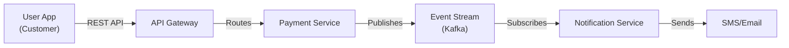

# Full Design Approval Board Process

**SLA Target:** 10 business days end-to-end

**Use this process for:** Major new platforms, significant refactoring, cross-domain integration, new external integrations, data architecture changes, technology stack decisions, security/compliance initiatives.

---

## DAB Triggers (Full Process Required)

Any of the following automatically triggers the Full DAB process:

### 1. New Platforms or Products
- New customer-facing application
- New internal platform or service
- New API ecosystem
- New data pipeline or analytics platform

### 2. Major Refactoring
- Significant rearchitecture of critical system (>30% design change)
- Migration between technology stacks
- Domain decomposition or re-aggregation

### 3. Cross-Domain Integration
- Integration connecting 2 or more business domains
- Data sharing agreements between domains
- Shared infrastructure or resources

### 4. New External Integration
- Integration with external bank (payment networks, correspondent banks)
- Integration with 3rd-party vendor (SaaS platform, fintech partner)
- Integration with regulatory or government system

### 5. Data Architecture Changes
- New data sources or lakes
- Significant data model changes
- Introduction of new data classification tier
- Privacy or data protection initiatives

### 6. Technology Stack Change
- New programming language, framework, or library adoption
- New database or data warehouse platform
- New infrastructure pattern (containers, serverless, etc.)
- New messaging, caching, or queue system

### 7. Security or Compliance Initiative
- New mandatory security controls
- Regulatory requirement implementation
- Security incident remediation with design changes

---

## Required Documentation (9 Sections)

Each Full DAB submission must include all 9 sections. Use the [Naming Conventions](../standards/naming-conventions.md) guide.

### Section 1: Business Context & Requirements
**File:** `01-business-context.md`

**Content:**
- Problem statement: What business challenge does this address?
- Goals and success criteria
- Affected business domains and stakeholders
- Timeline and dependencies
- Alignment with strategic roadmap
- Cost-benefit analysis (if applicable)

**Example outline:**
```markdown
## Business Context
- Problem: Current payment processing takes 45 seconds for remittance transfers
- Goal: Reduce to <2 seconds for customer experience
- Scope: Remittance domain, affecting 500K daily transactions
- Timeline: Q2 2026 rollout
```

### Section 2: High-Level Architecture (HLA)
**File:** `02-high-level-architecture.md`

**Content:**
- System context diagram (Mermaid C4 Container level)
- Component relationships
- Technology selections and rationale
- Architectural patterns used
- Link to detailed diagrams

**Diagram example:**


### Section 3: Detailed Design
**File:** `03-detailed-design.md`

**Content:**
- Component diagrams (C4 Component level)
- Sequence diagrams for critical flows
- Data flow diagrams
- Database schema (if applicable)
- API contract documentation (OpenAPI 3.0)

**Must include:** Technology-specific design patterns, failure mode analysis, concurrency handling.

### Section 4: Integration Points & Dependencies
**File:** `04-integration-points.md`

**Content:**
- List of all systems this integrates with
- Integration method (API, message queue, file, database)
- Data contracts and agreements
- Version compatibility
- Cross-domain dependencies
- Risk of breaking existing systems

**Table format:**
| System | Type | Method | Version | Owner | Risk |
|--------|------|--------|---------|-------|------|
| Ledger Core | Internal | REST | 2.1 | Finance Tech | High |
| External Bank XYZ | External | ISO 20022 | - | Integration | Medium |

### Section 5: Security & Compliance Assessment
**File:** `05-security-assessment.md`

**Content:**
- Data classification of inputs/outputs
- Authentication mechanism (OAuth2, OIDC, mTLS)
- Authorization model (RBAC, ABAC)
- Encryption: in-transit (TLS 1.2+ minimum) and at-rest (AES-256 minimum)
- Audit logging strategy (all access logged, PII masked)
- Compliance frameworks (PCI-DSS, BCL, GDPR if applicable)
- Vulnerability scanning and penetration test results
- Security baseline checklist confirmation (see [Security Baseline](../standards/security-baseline.md))

**Mandatory certification:**
```markdown
✅ Authentication: OAuth2/OIDC implemented per standards
✅ Authorization: RBAC enforced on all endpoints
✅ Encryption: TLS 1.2+ in transit, AES-256 at rest
✅ Logging: All access logged, PII masked, retention: 90 days
✅ Data Classification: Applied per tier (Public/Internal/Confidential/Restricted)
✅ Vulnerability Scanning: OWASP Top 10 reviewed, 0 critical findings
```

### Section 6: Operational Requirements & Runbooks
**File:** `06-operational-requirements.md`

**Content:**
- SLA targets (availability, latency, throughput)
- Monitoring and alerting strategy
- Incident response procedures
- Backup and disaster recovery procedures
- Runbooks for common operations
- Capacity planning and scaling strategy
- Change management process

**Example runbook outline:**
```markdown
### Runbook: Recover from Payment Service Failure
1. Alert received on payment_service_down
2. Check service health dashboard
3. If healthy: Drain load balancer for 5 seconds
4. If degraded: Execute automated failover to DR region
5. If unhealthy: Page on-call engineer for manual intervention
6. Post-incident: RCA within 24 hours, blameless culture
```

### Section 7: Performance & Scalability Analysis
**File:** `07-performance-analysis.md`

**Content:**
- Performance targets (latency percentiles: p50, p95, p99)
- Load test results or projections
- Scalability model: horizontal vs. vertical
- Database optimization strategy
- Caching strategy (Redis, CDN, etc.)
- Bottleneck analysis and mitigations
- Cost projections at scale

**Example:**
```markdown
## Performance Targets
- Payment API latency: p50 < 100ms, p95 < 500ms, p99 < 1s
- Throughput: 10,000 TPS sustained, 20,000 TPS burst
- Database query latency: p99 < 50ms

## Scalability
- Horizontal scaling: Kubernetes auto-scaling based on CPU/memory
- Database: Sharding on merchant_id for payment service
- Cache: Redis cluster for session/state
```

### Section 8: Migration & Rollout Strategy
**File:** `08-migration-rollout.md`

**Content:**
- Cutover approach (big-bang, phased, blue-green, canary)
- Data migration strategy (if applicable)
- Rollback procedures
- Timeline and phase gates
- User communication plan
- Success criteria per phase

**Example:**
```markdown
## Rollout Phases
### Phase 1 (Week 1-2): Canary
- 5% of traffic to new payment service
- Success criteria: Error rate < 0.1%, p99 latency < 1s
- Rollback: Immediate traffic reroute to legacy

### Phase 2 (Week 3): Gradual
- 25% → 50% → 100% traffic migration
- Monitoring: Continuous, with daily review gates
```

### Section 9: Risk Assessment & Mitigation
**File:** `09-risk-assessment.md`

**Content:**
- List of identified risks (technical, operational, business)
- Risk scoring (probability × impact)
- Mitigation strategy for each high/medium risk
- Contingency plans
- Owner accountability

**Risk matrix:**
| Risk | Probability | Impact | Score | Mitigation |
|------|-------------|--------|-------|-----------|
| Database query timeout at scale | Medium | High | 8 | Load test to 15K TPS, implement query optimization |
| Payment network unavailable | Low | Critical | 7 | Implement retry queue, manual settlement procedures |
| Security breach in integration | Low | Critical | 8 | mTLS, API key rotation, network segmentation |

---

## Approval Flow (5 Phases)

### Phase 1: Initiation (Day 0-1)
**Submitter Actions:**
1. Create feature branch: `dab/{domain}/{project-slug}` (see [Naming Conventions](../standards/naming-conventions.md))
2. Prepare all 9 documents in `dab-submission/` folder
3. Create GitLab MR with title: `DAB: {Domain} — {Project Name}`
4. Assign MR to relevant reviewers (see [Approval Matrix](./approval-matrix.md))
5. Add labels: `dab`, `dab-full`, `{domain}`

**Expected outcome:** Reviewers acknowledge receipt. MR assigned and visible in tracking system.

### Phase 2: Automated Quality Gate (Day 1-3)
**CI/CD Automated Checks:**
- Verify all 9 documents present (script checks filenames)
- Validate Markdown syntax and links
- Check diagram format (Mermaid/PlantUML valid syntax)
- Verify naming conventions (kebab-case, numeric prefixes)
- Security baseline checklist completeness

**If checks fail:** System comments on MR with gaps. Submitter adds/fixes, re-triggers pipeline.

**If checks pass:** MR auto-labeled as `quality-gate-passed`, proceeds to Peer Review.

**SLA:** Within 1 business day (automatic, blocking).

### Phase 3: Peer Review (Day 3-5)
**Solution Architect & Domain Lead Review:**
1. Read business context (Section 1)
2. Assess architectural fit (Section 2)
3. Identify missing integration points (Section 4)
4. Check for domain consistency
5. Provide feedback comments on MR

**Outputs:**
- Approval: "Approved for specialist review" (MR review approval)
- Conditional: "Changes requested - [specific feedback]"
- Rejection: "Do not proceed - [reason, e.g., conflicts with roadmap]"

**Response time:**
- Initial comment within 2 business days
- Detailed review and decision within 5 business days

**If blocked:** Submitter addresses feedback, re-requests review.

### Phase 4: Specialist Review (Day 5-8)
**Security, Infrastructure, Data Architects Deep-Dive:**

**Security Architect:**
- Reviews Section 5 (Security & Compliance)
- Verifies data classification alignment
- Checks authentication/authorization design
- Confirms encryption standards met
- Approves or requests mitigations

**Infrastructure Architect:**
- Reviews Section 6 (Operations) & Section 7 (Performance)
- Assesses scalability and deployment model
- Confirms SLA feasibility
- Reviews monitoring and incident procedures
- Approves or requests design changes

**Data Architect (if data changes):**
- Reviews data model and schema
- Assesses classification tier fit
- Checks retention and privacy compliance
- Approves or recommends alternatives

**Outputs:**
- "Approved for EA decision"
- "Changes requested - [specific issues]"
- "Do not approve - [blocking concern]"

**Response time:**
- Initial comment within 2 business days
- Detailed review within 5 business days

**If blocked:** Escalation procedure engaged (see [Escalation Procedure](./escalation-procedure.md)).

### Phase 5: EA Approval & Merge (Day 8-10)
**Enterprise Architect Decision:**
1. Synthesize feedback from all reviewers
2. Make final approval decision based on business alignment, technical merit, security, operations
3. Document any conditions or follow-up actions
4. Approve MR and merge to main branch

**Merge triggers:**
- All required reviewers have approved (see [Approval Matrix](./approval-matrix.md))
- Automated quality gates passed
- Security baseline met
- No unresolved escalations

**Post-merge:**
- Tag merged commit: `dab-approved/{domain}/{project}/{date}` (see [Naming Conventions](../standards/naming-conventions.md))
- Update governance tracking spreadsheet
- Close DAB tracking issue
- Notify stakeholders of approval

**SLA:** Final decision within 10 business days from MR creation.

---

## Communication & Status Tracking

All Full DAB submissions tracked in GitLab Issues with:
- Title: `DAB: {Domain} — {Project Name}`
- Labels: `dab`, `dab-full`, `{domain}`
- Milestone: Target go-live date
- Description: Links to MR, business context, owner

Reviewers updated via:
- MR comments and thread resolution
- Daily standup (if critical path)
- Escalation notifications (if deadlock)

---

## Approval Decision Outcomes

### Approved
- MR merged to main branch
- Tagged with approval date
- Baseline documentation established
- Team proceeds to development/implementation

### Approved with Conditions
- Additional verification or testing required before implementation
- Follow-up DAB (Mini-DAB) may be needed after conditions met
- Implementation timeline adjusted

### Not Approved
- MR closed without merge
- Feedback documented and reviewed
- Team may resubmit after addressing concerns
- Escalation to CTO if disagreement persists (rare)

---

## Common Pitfalls to Avoid

1. **Incomplete documentation** — Skipping sections 7-9 thinking they're "optional". All 9 required for Full DAB.
2. **No business context** — Submitting architecture without explaining the "why". Section 1 is critical.
3. **Missing integration review** — Forgetting to consult owners of dependent systems. Section 4 prevents surprises.
4. **Weak security assessment** — Generic checklist without specific implementation details. Security Architect will bounce.
5. **Vague operational runbooks** — Runbooks must be step-by-step, testable, not aspirational.
6. **Over-optimistic performance claims** — Load test results required to back up performance targets.
7. **No rollback plan** — Cutover without defined rollback is risky. Always include in Section 8.
8. **Delayed responses** — If feedback arrives, respond within 2 business days to keep momentum.

---

## Timeline Example: Payment Service DAB

```
Day 1 (Mon):   MR created, assigned to reviewers
Day 1-2 (Mon-Tue): Automated quality gate runs, all sections validated
Day 3 (Wed):   Solution Architect comments, requests clarification on integration with Ledger Core
Day 4 (Thu):   Submitter responds with updated Section 4, re-requests review
Day 5 (Fri):   Solution Architect approves for specialist review
Day 5-6 (Fri-Mon): Security Architect reviews, approves with note on encryption key rotation
Day 6 (Mon):   Infrastructure Architect approves after load test review
Day 8 (Wed):   Enterprise Architect synthesizes feedback, approves, merges MR
Day 8 (Wed):   Commit tagged with dab-approved/payments/payment-acceleration/2026-03-08
Total: 8 business days (within 10-day SLA)
```

---

## Next Steps

1. Prepare your 9 sections following this guide
2. Review [Naming Conventions](../standards/naming-conventions.md) before creating files
3. Consult [Approval Matrix](./approval-matrix.md) to identify your reviewers
4. Plan timeline accounting for [SLA Targets](./sla-targets.md)
5. Create your MR and await Phase 1 kickoff

**Questions?** Contact Enterprise Architecture Technology team or submit a discussion in GitLab.
