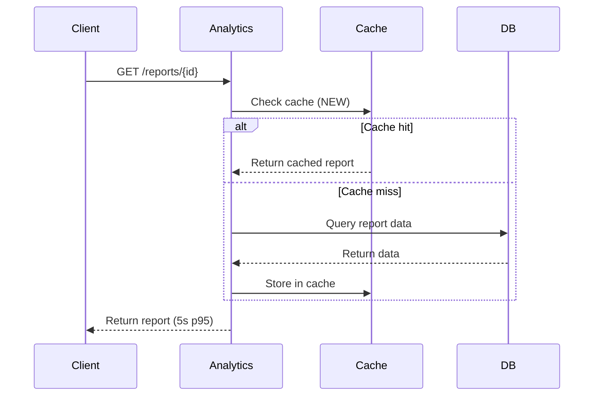

# Light Design Approval Board Process

**SLA Target:** 5 business days end-to-end

**Use this process for:** Minor enhancements, config changes, version upgrades with no architecture impact, performance optimization, bug fixes with no API changes.

---

## DAB Triggers (Light Process Suitable)

Any of the following can use the Light DAB fast-track:

### 1. Minor Enhancements
- Incremental feature additions within existing architecture
- No API contract changes
- No new external dependencies
- Scope: Single service or tightly coupled component

**Example:** Adding a new report type to existing analytics dashboard using same data source.

### 2. Configuration Changes
- Parameter tuning (timeouts, batch sizes, connection pools)
- Feature flags and A/B test configurations
- Routing and load balancing rules
- Environment variable changes

**Example:** Increasing Redis cache TTL from 1 hour to 4 hours for session data.

### 3. Version Upgrades
- Framework, library, or middleware version updates
- No architecture change (drop-in replacement)
- No API breaking changes
- Backward compatible

**Example:** Upgrading Spring Boot from 2.7.x to 3.2.x with no code changes.

### 4. Performance Optimization
- Algorithmic improvements with no design changes
- Database index addition or query optimization
- Caching layer addition (transparent to APIs)
- Code refactoring with no API contract change

**Example:** Adding database index on frequently filtered column reducing query latency.

### 5. Bug Fixes
- Defect correction with no API contract change
- No new external dependencies
- No data model changes
- Scope limited to affected component

**Example:** Fixing pagination bug in existing endpoint without changing request/response schema.

---

## When Light DAB Is NOT Suitable

Escalate to Full DAB if:
- External integration is added (even if to existing system)
- Data model changes or new data sources
- Cross-domain dependencies introduced
- Security or compliance controls changed
- Technology stack components added
- API contract changes
- Risk of breaking existing downstream consumers

**Uncertainty?** Always escalate to Full DAB. Better to spend extra time than miss architectural impact.

---

## Required Documentation (4 Sections)

Light DAB submissions require only 4 focused sections. Keep concise but complete.

### Section 1: Business Context & Requirements (Brief)
**File:** `01-business-context.md`

**Content (keep to 1-2 pages):**
- What problem does this address? (1 paragraph)
- Why now? Any user impact or metrics?
- Affected scope (single service vs. multi-service)
- Success criteria (specific, measurable)

**Example:**
```markdown
## Business Context
- **Problem:** Report generation takes 45 seconds, affecting user experience
- **Why Now:** New customer segment expects reports in <5 seconds
- **Scope:** Analytics Service only, no cross-domain changes
- **Success:** p95 latency < 5 seconds for report endpoint
```

### Section 2: High-Level Architecture
**File:** `02-high-level-architecture.md`

**Content:**
- Simple diagram (Mermaid flowchart or sequence, not full C4)
- Changes from current state vs. new state (if applicable)
- No more than 1 diagram
- Keep to 1 page

**Diagram example:**


### Section 3: Security & Compliance Assessment
**File:** `03-security-assessment.md`

**Content:**
- Is authentication/authorization affected? How?
- Any data classification changes?
- Encryption, if applicable?
- PII handling (if any)?
- Compliance impact?
- Confirm no security regression

**Quick assessment format:**
```markdown
## Security Assessment
- **Authentication:** No change (uses existing OAuth2)
- **Authorization:** No change (RBAC unchanged)
- **Data Classification:** No change (Confidential tier as before)
- **Encryption:** No change
- **PII Handling:** No change
- **Compliance:** No impact to PCI-DSS, BCL, or GDPR controls

✅ **Conclusion:** No security regression. Safe to proceed.
```

### Section 4: Risk Assessment (Brief)
**File:** `04-risk-assessment.md`

**Content:**
- Key risks (1-3 bullets, keep high-level)
- Mitigation for each
- Rollback approach if needed

**Concise format:**
```markdown
## Risk Assessment

| Risk | Mitigation |
|------|-----------|
| Cache eviction causes stale reports | Implement cache validation on update, TTL = 1 hour |
| Performance improvement doesn't meet target | Rollback by disabling cache, revert to DB queries only |
| Unexpected downstream impact | Monitor report endpoint latency for 24h post-deploy |

## Rollback
- Disable caching via feature flag (0 code changes needed)
- Takes <5 minutes to revert
```

---

## Approval Flow (3 Phases)

### Phase 1: Initiation (Day 1)
**Submitter Actions:**
1. Create feature branch: `dab/{domain}/{project-slug}` (see [Naming Conventions](../standards/naming-conventions.md))
2. Prepare 4 documents in `dab-submission/` folder
3. Create GitLab MR with title: `DAB: {Domain} — {Project Name}`
4. Assign to Enterprise Architect (primary) + optional: Security Architect (if security-related)
5. Add labels: `dab`, `dab-light`, `{domain}`

**Expected outcome:** MR visible, assigned, awaiting review.

**SLA:** Same-day acknowledgment.

### Phase 2: Automated Quality Gate (Day 1-2)
**CI/CD Checks:**
- Verify all 4 documents present
- Validate Markdown syntax
- Check diagram format (Mermaid/PlantUML valid)
- Verify naming conventions
- Basic completeness scan

**If checks fail:** System comments on MR. Submitter fixes, re-triggers.

**If checks pass:** MR auto-labeled `quality-gate-passed`, proceeds to EA review.

**SLA:** Within 1 business day.

### Phase 3: EA Fast-Track Review (Day 2-5)
**Enterprise Architect Decision:**
1. Read all 4 sections (15-20 minute review target)
2. Assess if truly Light DAB eligible (not actually Full DAB scope)
3. Check security assessment is reasonable
4. Verify risks and rollback are sound
5. Decide: Approve, Conditional, or Reject

**Decision options:**
- **Approved** → Merge immediately, apply approval tag, close
- **Conditional** → Requires minor changes before merge (same MR)
- **Rejected** → Escalate to Full DAB process (usually means scope misassessed)

**Response time:**
- Initial review and decision within 3 business days
- If conditional changes, final approval within 5 business days

**If rejected (escalate to Full DAB):**
- MR closed
- New Full DAB MR created with all 9 sections
- Clock restarts (10-day SLA for Full)

**Post-approval:**
- Merge to main branch
- Tag commit: `dab-approved/{domain}/{project}/{date}`
- Update tracking spreadsheet
- Proceed to development

---

## Checklist for Submitters

Before creating your Light DAB MR, confirm:

- [ ] Change does NOT involve external integration
- [ ] Change does NOT cross domains
- [ ] Change does NOT modify data model or add data source
- [ ] Change does NOT affect authentication/authorization logic
- [ ] Change does NOT introduce new technology components
- [ ] All 4 sections written, reviewed internally by team
- [ ] Diagrams valid Mermaid/PlantUML syntax
- [ ] Files named with numeric prefixes (01-, 02-, 03-, 04-)
- [ ] Branch named: `dab/{domain}/{project-slug}`
- [ ] MR title format: `DAB: {Domain} — {Project Name}`
- [ ] Labels added: `dab`, `dab-light`, `{domain}`

---

## Common Light DAB Examples

### Example 1: Redis Cache Addition
**Change:** Add caching layer to frequently accessed user profile endpoint.

**Why Light?**
- No external integration
- No data model change
- No API contract change (transparent to clients)
- Single service change
- Security: Cache contains only non-sensitive profile data

**Sections:**
1. **Business Context:** Reduce latency from 500ms to 100ms (p95)
2. **HLA:** Diagram showing cache layer between API and DB
3. **Security:** Cache stores public profile data only, TTL 1 hour
4. **Risk:** Cache miss on profile updates mitigated by event listener

---

### Example 2: Spring Boot Version Upgrade
**Change:** Upgrade Spring Boot framework from 2.7.x to 3.2.x.

**Why Light?**
- Drop-in replacement (no API changes)
- No architecture change
- No new dependencies
- Backward compatible with existing code
- Security: Newer version includes security patches

**Sections:**
1. **Business Context:** Security patches, performance improvements
2. **HLA:** No diagram needed (one-line: "Framework version bump")
3. **Security:** No authentication/authorization changes, patches included
4. **Risk:** Regression testing before rollout, rollback via dependency revert

---

### Example 3: Database Index Optimization
**Change:** Add composite index on (merchant_id, created_at) for reporting queries.

**Why Light?**
- No schema change
- No API change
- Single database optimization
- No cross-service dependencies

**Sections:**
1. **Business Context:** Report query latency p99 currently 8s, target <1s
2. **HLA:** Index addition diagram (before/after)
3. **Security:** No security impact, same data access
4. **Risk:** Index build takes 2 hours offline during maintenance window, rollback by dropping index

---

## When to Escalate to Full DAB

Light DAB is **not suitable** if your change involves:

1. **External integration** — Even connecting to existing external system
2. **Data changes** — New data sources, model changes, classification tier changes
3. **Cross-domain impact** — Changes affecting other business domains
4. **Authentication/authorization** — Changes to access control logic
5. **Technology stack** — Adding new framework, database, messaging system
6. **API breaking changes** — Even if backward compatible shim provided
7. **High-risk changes** — Changes with significant business impact

**Example of escalation:**
> You wanted to add caching to payment API, but this integrates with legacy external payment processor. Payment processor interface has API contract not currently versioned. Escalate to Full DAB.

---

## Timeline Example: Analytics Cache Addition

```
Day 1 (Mon):   MR created, assigned to EA, quality gate runs
Day 1 (Mon):   Quality gate passes, MR labeled ready for review
Day 2 (Tue):   EA reviews, asks clarification on cache TTL and stale data handling
Day 3 (Wed):   Submitter responds, EA approves, merges MR
Day 3 (Wed):   Commit tagged dab-approved/analytics/cache-layer/2026-03-08
Total: 3 business days (within 5-day SLA)
```

---

## Difference: Full DAB vs. Light DAB

| Aspect | Full DAB | Light DAB |
|--------|----------|-----------|
| **Use for** | Major initiatives | Minor changes |
| **Documentation** | 9 sections | 4 sections |
| **Reviewers** | 4-6 (Solution, Enterprise, Security, Infra, Data, SRE) | 1-2 (Enterprise Architect, optional Security) |
| **Review depth** | Deep technical review | Quick assessment |
| **SLA** | 10 business days | 5 business days |
| **Approval decision** | Consensus-based | EA decision |
| **Complexity** | 5+ days of preparation | 1-2 hours of prep |
| **Examples** | New platform, major rewrite | Cache layer, index, version bump |

---

## Next Steps

1. Confirm your change qualifies for Light DAB (see Checklist above)
2. Write 4 concise sections following templates
3. Create MR following [Naming Conventions](../standards/naming-conventions.md)
4. Plan for 5-day SLA (usually completes in 3 days)
5. Monitor for approval and merge

**Unsure about Light vs. Full?** Contact Enterprise Architecture Technology team. Better to ask than submit incorrectly.
