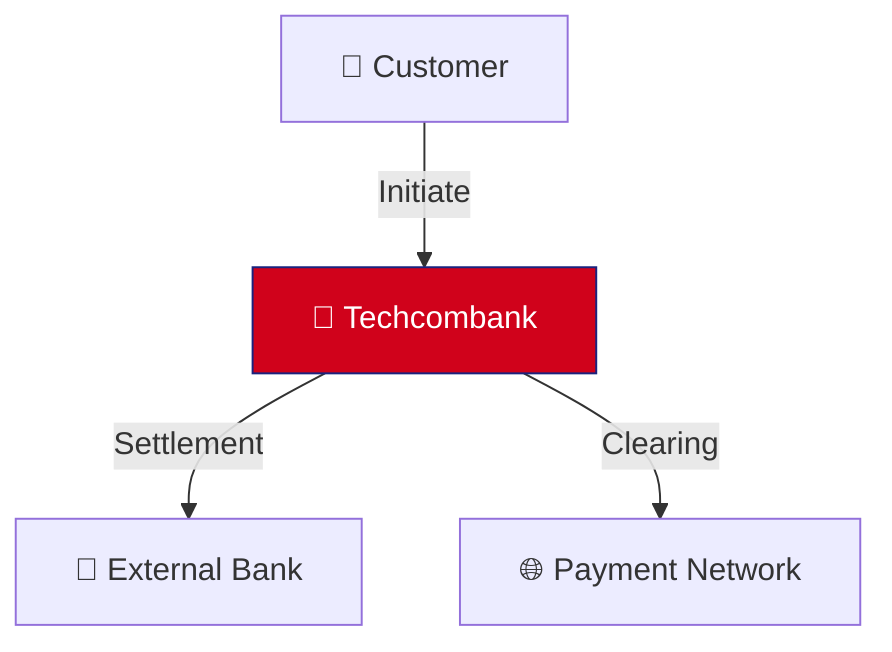
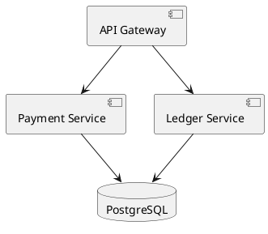

# ADR-002: Prefer MermaidJS/PlantUML Over Drawio for Architecture Diagrams

**Status:** Accepted

**Date:** 2026-01-15

**Authors:** Enterprise Architecture Technology Team

**Relates To:** ADR-001 (Adopt Architecture-as-Code)

---

## Context

As part of adopting Architecture-as-Code (ADR-001), we must select the tooling for creating and maintaining text-based architecture diagrams. Drawio (formerly Diagrams.net) is currently used for most architecture diagrams at Techcombank.

**Current State:**
- Drawio cloud edition: $50K/year for enterprise license
- Binary XML format: Not diffable via Git, poor version control
- Drag-and-drop interface: User-friendly but not developer-friendly
- Closed proprietary tool: Not parsable by AI/LLMs
- Export formats: SVG, PNG (lossy; editable source lost)

**Objectives:**
- Replace Drawio to eliminate licensing cost
- Use text-based format for Git diff and version control
- Enable AI/ML parsing and auto-generation
- Maintain or improve usability and aesthetics

---

## Decision Drivers

1. **Cost Reduction** — Eliminate $50K/year Drawio licensing
2. **Open Source** — No vendor lock-in, community support
3. **Git Integration** — Text format supports diff, merge, blame
4. **AI/ML Ready** — Parsable by language models for validation and generation
5. **Developer UX** — Familiar workflow (text editor, Git)
6. **Performance** — Fast rendering, lightweight (no SaaS latency)
7. **Standardization** — One diagram tool (not Drawio + Visio + PowerPoint)
8. **Offline Capability** — Works without internet connection

---

## Considered Options

### Option 1: Continue with Drawio
**Pros:**
- Familiar drag-and-drop interface
- Can export to many formats
- Collaborative cloud editing

**Cons:**
- $50K annual license
- Binary files, no Git diff/merge
- Vendor lock-in
- Not parsable by AI/LLMs
- No version history in file

**Verdict:** Rejected. Conflicts with AaC goals.

---

### Option 2: PlantUML Only
**Pros:**
- Powerful for UML and technical diagrams
- Open source, free
- Text-based, Git-friendly
- Good for: C4, class diagrams, deployment diagrams
- Large ecosystem of integrations

**Cons:**
- Steeper learning curve than Mermaid
- More verbose syntax
- Weak for simple flowcharts and sequences
- Rendering can be slow for large diagrams
- Less visual polish than Mermaid

**Verdict:** Partial. Good for technical diagrams, but not best for all diagram types.

---

### Option 3: Mermaid Only
**Pros:**
- Simple, intuitive syntax
- Excellent for flowcharts, sequences, state diagrams
- Open source, free
- JavaScript-based, renders in browser instantly
- GitHub/GitLab native integration
- Active community, rapid feature updates
- Good for: business flows, process diagrams, dependencies

**Cons:**
- Limited for complex UML (class, object diagrams)
- Component diagrams not as powerful as PlantUML
- Customization limited compared to PlantUML
- Rendering quality sometimes inconsistent
- Not ideal for deployment architecture

**Verdict:** Partial. Excellent for most diagrams, but lacks for complex UML.

---

### Option 4: Hybrid Approach (Mermaid + PlantUML)
**Pros:**
- Best of both tools
- Mermaid for business/flow diagrams (80% of use case)
- PlantUML for technical/UML diagrams (20% of use case)
- Both free and open source
- Team picks best tool per diagram type
- Scales to different diagram complexity

**Cons:**
- Two tools to learn and maintain
- Must define when to use which tool
- Some diagram overlap (which tool for sequence?)

**Verdict:** Selected. Pragmatic balance of coverage and complexity.

---

## Decision

**Use hybrid approach: Mermaid as primary, PlantUML for specialized cases.**

### Tool Selection Matrix

| Diagram Type | Primary | Secondary | Notes |
|---|---|---|---|
| **Flowchart / Process Flow** | Mermaid | — | Simple, intuitive, renders fast |
| **Sequence Diagram** | Mermaid | PlantUML | Mermaid sufficient for most; PlantUML if complex |
| **State Diagram** | Mermaid | — | Mermaid perfect for state machines |
| **System Context (C4 L1)** | Mermaid | — | Simple diagram showing boundaries |
| **Container (C4 L2)** | Mermaid | PlantUML | Mermaid for most; PlantUML if complex |
| **Component (C4 L3)** | PlantUML | Mermaid | PlantUML for detailed components |
| **Class Diagram (UML)** | PlantUML | — | PlantUML is UML standard |
| **Deployment Diagram** | PlantUML | Mermaid | PlantUML for infrastructure topology |
| **Entity-Relationship (ER)** | PlantUML | — | Database schema, relationships |
| **Dependency Graph** | Mermaid | PlantUML | Mermaid for service dependencies |
| **Wireframe / Mockup** | Mermaid | — | Basic wireframes only |
| **Gantt / Timeline** | Mermaid | — | Project planning, roadmaps |

---

## Implementation

### Tool Setup

**Mermaid:**
- Embedded in Markdown: ` ```mermaid ... ``` `
- Standalone: `.mmd` file extension
- Rendering: Browser native (GitHub, GitLab, VS Code plugins)
- Installation: None required (web-based)

**PlantUML:**
- Standalone: `.puml` or `.plantuml` file extension
- Rendering: Requires CI/CD pipeline or PlantUML server
- Installation: Local Java tool or Docker image
- Output: PNG, SVG, PDF

### File Organization

```
diagrams/
├── mermaid/                    (Mermaid diagrams)
│   ├── system-context.mmd
│   ├── payment-flow.mmd
│   ├── state-machine.mmd
│   └── service-dependencies.mmd
└── plantuml/                   (PlantUML diagrams)
    ├── component-architecture.puml
    ├── deployment-topology.puml
    ├── data-model.puml
    └── class-diagram.puml
```

### CI/CD Integration

**Pipeline steps:**
1. Validate Mermaid syntax: `mermaid-cli --validate`
2. Validate PlantUML syntax: `plantuml -Djava.awt.headless=true -validate`
3. Render to images: `mermaid` and `plantuml` CLI
4. Include rendered images in documentation

**Example GitHub Actions:**
```yaml
- name: Validate and Render Diagrams
  run: |
    npx -y @mermaid-js/mermaid-cli@latest --input diagrams/mermaid/ --output target/
    docker run --rm -v $(pwd):/data plantuml/plantuml:latest diagrams/plantuml/ -o ../target/
```

---

## Migration Strategy

### Phase 1: New Diagrams (Immediate)
- All new diagrams created in Mermaid or PlantUML
- Old Drawio diagrams referenced for reference only
- No migration of existing diagrams yet

### Phase 2: Core Diagrams (Week 2-3)
- Migrate 20 critical diagrams (system context, payment flow, etc.)
- Prioritize high-impact diagrams used frequently
- Manual migration + QA review

### Phase 3: Remaining Diagrams (Week 3-4)
- Migrate remaining Drawio diagrams
- Semi-automated: Use Drawio export to SVG → Manual recreation
- Archive original Drawio files (reference only)

### Phase 4: Cleanup (Week 5)
- Cancel Drawio license
- Remove archived Drawio files from repo
- Documentation complete

---

## Consequences

### Positive

1. **Cost Savings** — $50K/year eliminated
2. **Git Integration** — Full diff/merge/blame on diagram changes
3. **No Vendor Lock-In** — Open source, can switch anytime
4. **AI/ML Ready** — Text format parsable by LLMs for validation
5. **Developer UX** — Text editors, Git workflows, CLI tools
6. **Performance** — Mermaid renders in milliseconds, no SaaS latency
7. **Offline** — Works without internet; edit, commit, push later
8. **Standardization** — One approach across all diagrams

### Negative

1. **Learning Curve** — Teams must learn Mermaid/PlantUML syntax
   - Mitigation: Simple syntax, examples provided, templates
2. **Loss of Drag-and-Drop** — Cannot draw freely, must use syntax
   - Mitigation: Trade-off acceptable; structure > perfection
3. **Visual Polish** — Less polished than Drawio WYSIWYG editor
   - Mitigation: Adequate for technical documentation
4. **Rendering Inconsistency** — Browser rendering may vary
   - Mitigation: Export to SVG/PNG for stability in presentations
5. **Complex Diagrams** — Very large diagrams may render slowly
   - Mitigation: Break into smaller modular diagrams

---

## Validation & Success Criteria

**Rollout Success (Weeks 1-4):**
- [ ] All teams trained on Mermaid + PlantUML syntax
- [ ] 50 critical diagrams migrated successfully
- [ ] CI/CD pipeline validates all diagrams on MR
- [ ] Drawio license cancelled
- [ ] No loss of architectural information in migration

**Long-term Success (6 months):**
- [ ] 100% of new diagrams in Mermaid/PlantUML
- [ ] Zero Drawio files in repo
- [ ] Diagram rendering in CI/CD < 30 seconds
- [ ] Team satisfaction with new tools > 4/5
- [ ] AI-assisted diagram generation piloted

**Metrics:**
- Diagram update frequency: Should increase (easier to update)
- Diagram staleness: Should decrease (version-controlled)
- Licensing cost: $50K → $0
- Diagram review time: Should decrease (text diff review)

---

## Risk Management

| Risk | Probability | Impact | Mitigation |
|---|---|---|---|
| **Team resistance** | Medium | Medium | Training, benefits demo, leadership support |
| **Syntax errors** | Medium | Low | CI/CD validation, linting |
| **Rendering bugs** | Low | Low | Use stable versions, fallback to SVG |
| **Complex diagram limits** | Low | Low | PlantUML as fallback for edge cases |
| **Performance (large files)** | Low | Low | Split large diagrams; use modular approach |

---

## Comparison: Mermaid vs PlantUML vs Drawio

| Feature | Mermaid | PlantUML | Drawio |
|---|---|---|---|
| **Cost** | Free | Free | $50K/year |
| **License** | MIT (open) | Dual (open+commercial) | Commercial |
| **Text-based** | Yes | Yes | No (XML) |
| **Git-friendly** | Yes | Yes | No |
| **Learning curve** | Low | Medium | None (visual) |
| **Flowcharts** | Excellent | Good | Excellent |
| **Sequences** | Excellent | Excellent | Good |
| **C4 Diagrams** | Good | Excellent | Excellent |
| **Class/UML** | Poor | Excellent | Good |
| **Deployment** | Fair | Excellent | Excellent |
| **Rendering speed** | Fast | Slow | N/A (local) |
| **Browser support** | Excellent | Good | Excellent |
| **AI-parsable** | Yes | Yes | No |
| **Offline** | Yes | Yes | Yes (local) |
| **Collaboration** | Git-based | Git-based | Cloud-native |

---

## Related Decisions

- **ADR-001:** Adopt Architecture-as-Code approach (parent decision)
- **[Diagram Standards](../standards/diagram-standards.md):** Complete diagram guidelines including Mermaid/PlantUML syntax

---

## Appendix: Example Diagrams

### Mermaid: System Context


### PlantUML: Component Diagram


---

## References

- Mermaid Docs: https://mermaid.js.org/
- PlantUML Docs: https://plantuml.com/
- C4 Model + Tools: https://c4model.com/
- GitHub Mermaid Support: https://github.blog/2022-02-14-include-diagrams-in-your-markdown-files-with-mermaid/
- GitLab Mermaid Support: https://docs.gitlab.com/ee/writing_comprehensive_markdown.html#mermaid

---

## Sign-Off

**Enterprise Architecture Director:** _______________ **Date:** ___________

**Technology Lead (Diagrams):** _______________ **Date:** ___________
