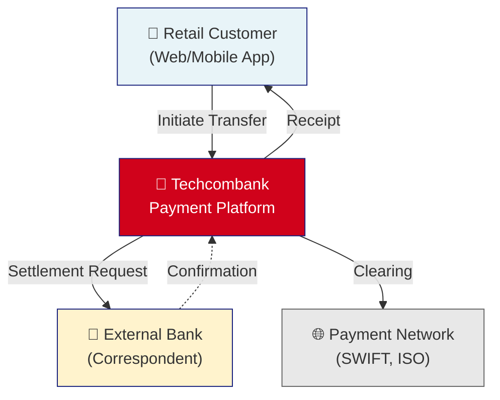
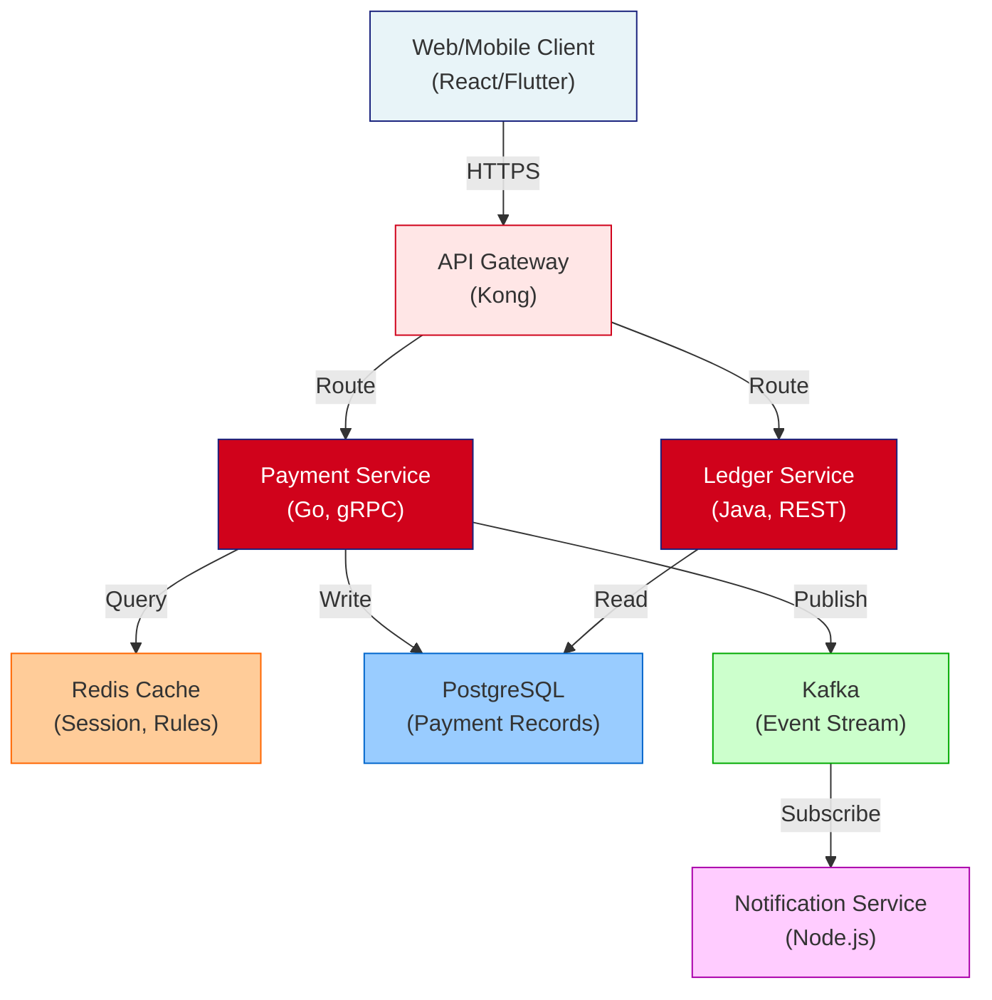
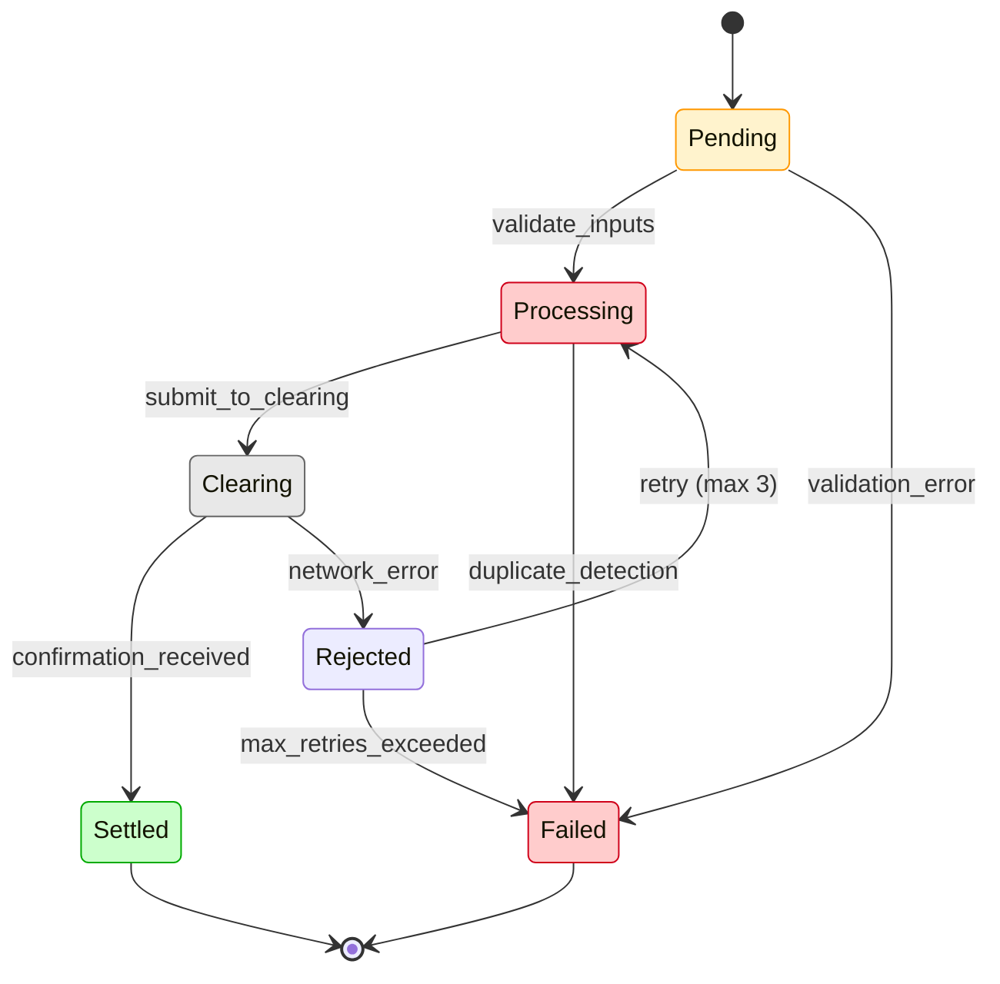
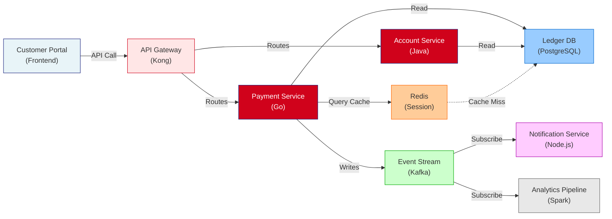
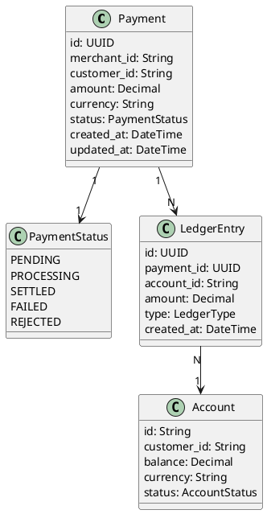
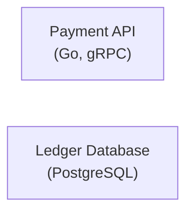
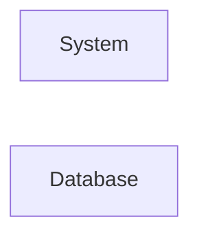
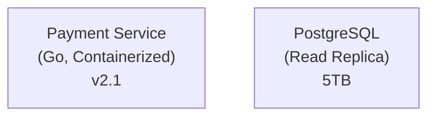
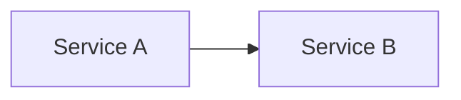

# Diagram Standards for DAB Submissions

Technical standards for architecture diagrams in Design Approval Board submissions. Covers tool selection, diagram types, color schemes, naming conventions, and metadata requirements.

---

## Tool Selection Guide

### Use MermaidJS When
- Creating flowcharts or process flows
- Drawing sequence diagrams (interactions over time)
- Creating simple state diagrams
- Building relationship/dependency diagrams
- Documenting approval workflows or procedures
- Need version-controllable, text-based format
- Diagram will be embedded in Markdown

**Mermaid is preferred for most DAB submissions** — text-based, diffable, no licensing cost.

### Use PlantUML When
- Creating C4 architecture diagrams (Component level and below)
- Drawing class diagrams (UML)
- Creating deployment diagrams (infrastructure topology)
- Documenting complex entity relationships
- Creating activity diagrams with detailed swim lanes
- Need advanced formatting or specific UML notation

### Use Both Together
Larger submissions may use:
- **Mermaid** for high-level flows, sequences, context diagrams
- **PlantUML** for detailed component, class, or deployment diagrams

### Never Use (Don't Use)
- Drawio / Lucidchart — Binary format, not diffable, licensing cost
- Visio — Not web-based, not integrated with Git
- Google Slides / PowerPoint — Not version-controlled, not in architecture repo
- Screenshots of diagrams — Update when diagram changes; source must be in repo

---

## File Organization

### Directory Structure
```
dab-submission/
  01-business-context.md
  02-high-level-architecture.md
  03-detailed-design.md
  ...
  diagrams/                                 ← All diagrams in this folder
    01-system-context.mmd                  ← Mermaid diagram
    02-c4-container.puml                   ← PlantUML diagram
    03-payment-sequence.mmd
    04-database-schema.mmd
    05-deployment-topology.puml
```

### Naming Convention
- Format: `{NN}-{kebab-case-description}.{ext}`
- Numeric prefix (01-09) corresponds to document order
- Extensions: `.mmd` (Mermaid) or `.puml` (PlantUML)
- Example: `02-high-level-architecture.mmd`

---

## Mermaid Diagram Types & Standards

### 1. System Context Diagram (C4 Level 1)
**When:** Show external systems, users, and scope boundaries

**Example:**


**Metadata:**
```mermaid
%% Title: Payment Platform System Context
%% Domain: Payments
%% Author: Architecture Team
%% Version: 1.0
%% Last Updated: 2026-03-08
```

### 2. Container Diagram (C4 Level 2)
**When:** Show major applications, services, or containers and their interactions

**Example:**


### 3. Sequence Diagram (Interactions)
**When:** Show step-by-step flow of interactions between components

**Example:**
```mermaid
sequenceDiagram
    actor C as Customer
    participant Gateway as API Gateway
    participant PaymentSvc as Payment Service
    participant Cache as Redis Cache
    participant DB as PostgreSQL
    participant Queue as Kafka
    participant Notif as Notification Svc

    C->>+Gateway: POST /v1/transfer
    Note over Gateway: Validate & Route

    Gateway->>+PaymentSvc: gRPC Transfer Request
    PaymentSvc->>+Cache: Check Rate Limits
    Cache-->>-PaymentSvc: Limits OK

    PaymentSvc->>+DB: BEGIN Transaction
    DB-->>-PaymentSvc: Transaction Started

    PaymentSvc->>DB: Insert Payment Record
    PaymentSvc->>DB: Update Balances
    PaymentSvc->>DB: COMMIT

    Note over PaymentSvc,DB: Payment Committed

    PaymentSvc->>+Queue: Publish payment.completed
    Queue-->>-PaymentSvc: Event Queued

    PaymentSvc-->>-Gateway: 200 OK
    Gateway-->>-C: Transfer Confirmed

    Queue->>+Notif: payment.completed Event
    Notif->>Notif: Format Message
    Notif->>Notif: Send SMS/Email
    Notif-->>-Queue: ACK

    style C fill:#E8F4F8
    style PaymentSvc fill:#D0021B,color:#fff
    style DB fill:#99CCFF,color:#000
```

### 4. State Diagram
**When:** Show states and transitions (e.g., payment status flow)

**Example:**


### 5. Dependency/Flow Diagram
**When:** Show data flow or dependency graph

**Example:**


---

## PlantUML Diagram Types & Standards

### 1. C4 Component Diagram
**When:** Show internal structure of a service/application

**File:** `02-c4-component.puml`

**Example:**
```plantuml
@startuml
!include https://raw.githubusercontent.com/plantuml-stdlib/C4-PlantUML/master/C4_Component.puml

LAYOUT_WITH_LEGEND()

System_Boundary(payment_svc, "Payment Service (Go)") {
    Component(api, "REST API Layer", "HTTP/gRPC", "Request routing, validation")
    Component(business, "Business Logic", "Go Structs", "Payment processing, rules")
    Component(repo, "Data Repository", "SQL/NoSQL", "CRUD operations")
    Component(event, "Event Publisher", "Kafka Client", "Publishes events")
}

System_Ext(external_bank, "External Bank", "Settlement")
System_Ext(queue, "Kafka", "Event Stream")

Rel(api, business, "Uses")
Rel(business, repo, "Reads/Writes")
Rel(business, event, "Publishes")
Rel(api, external_bank, "ISO 20022 Message")
Rel(event, queue, "Sends to")

@enduml
```

### 2. Deployment Diagram
**When:** Show infrastructure topology and deployment

**File:** `05-deployment-topology.puml`

**Example:**
```plantuml
@startuml
!include https://raw.githubusercontent.com/rabelenda/cicons/master/cicons.puml

card "Kubernetes Cluster" as k8s {
    node "Payment Pod (3x)" as payment_pod {
        artifact "Payment Service v2.1" as payment_svc
    }
    node "Ledger Pod (2x)" as ledger_pod {
        artifact "Ledger Service v1.3" as ledger_svc
    }
    node "Redis StatefulSet" as redis_sts {
        artifact "Redis Cluster 7.2" as redis
    }
}

card "Data Center" as dc {
    node "RDS PostgreSQL (Primary + Replica)" as db {
        artifact "Payment DB (5TB)" as paydb
    }
    node "Kafka Cluster" as kafka_cluster {
        artifact "Kafka Brokers (5x)" as kafka
    }
}

card "External" as ext {
    node "CDN" as cdn
    node "SWIFT Network" as swift
}

payment_pod --> redis_sts: Cache
payment_pod --> db: SQL
ledger_pod --> db: SQL
payment_pod --> kafka_cluster: Events
payment_pod --> swift: Settlement
ledger_pod --> cdn: Reports

@enduml
```

### 3. Class Diagram (Data Model)
**When:** Show detailed data model or domain objects

**File:** `04-data-model.puml`

**Example:**


---

## Techcombank Color Scheme

### Brand Colors
```
Primary Red:        #D0021B (Techcombank signature red)
Dark Blue:          #1A237E (Deep blue, corporate)
Light Blue:         #0D47A1 (Lighter blue, accent)
```

### Semantic Colors
```
Success (Green):    #00AA00 or #4CAF50
Warning (Amber):    #FF9800 or #FFC107
Error (Red):        #D0021B (aligns with brand)
Info (Blue):        #1A237E or #0D47A1
Neutral (Gray):     #666666 or #E8E8E8
```

### Component Colors
```
External Systems:   #FFF3CD (Amber background)
Internal Services:  #D0021B (Brand red)
Data Stores:        #99CCFF (Light blue)
Caches:             #FFCC99 (Orange)
Queues/Streams:     #CCFFCC (Light green)
User Interface:     #E8F4F8 (Pale blue)
```

### Mermaid Theme Variables
```mermaid
%%{
  init: {
    'theme': 'default',
    'themeVariables': {
      'primaryColor': '#D0021B',
      'primaryBorderColor': '#1A237E',
      'primaryTextColor': '#ffffff',
      'secondBkgColor': '#0D47A1',
      'tertiaryColor': '#FFF3CD',
      'tertiaryTextColor': '#000000',
      'tertiaryBorderColor': '#FF9800',
      'lineColor': '#666666'
    }
  }
}%%
```

---

## Diagram Metadata Requirements

### Mermaid Metadata Block
Every Mermaid diagram must include:

```mermaid
%%{
  init: {
    'theme': 'default',
    'themeVariables': {
      'primaryColor': '#D0021B',
      'primaryBorderColor': '#1A237E',
      'primaryTextColor': '#ffffff'
    }
  }
}%%

%% ============================================
%% Diagram Title: Payment Architecture
%% Domain: Payments
%% Process Type: Full DAB
%% Author: Payment Architecture Team
%% Version: 1.0
%% Created: 2026-03-01
%% Last Updated: 2026-03-08
%% Status: In Review (Draft | In Review | Approved)
%% ============================================
```

### PlantUML Metadata
Every PlantUML diagram must include header:

```plantuml
@startuml
'============================================
' Diagram: Payment Component Architecture
' Domain: Payments
' Process Type: Full DAB
' Author: Payment Architecture Team
' Version: 1.0
' Created: 2026-03-01
' Last Updated: 2026-03-08
' Status: In Review
'============================================

!include https://raw.githubusercontent.com/...
...
@enduml
```

---

## Node Naming Conventions

### Consistent Naming
- Use descriptive names (not generic "System A")
- Include technology stack if relevant
- Use camelCase for nodes, follow standard naming in labels

**Good:**


**Bad:**


### Multi-line Labels
Use `<br/>` for line breaks in labels:



---

## Diagram Validation Checklist

Before finalizing, ensure:

- [ ] Diagram file follows naming convention: `{NN}-{kebab-case}.{ext}`
- [ ] Metadata block included with title, domain, author, version, date
- [ ] Techcombank colors used (Primary Red #D0021B, Dark Blue #1A237E)
- [ ] All nodes have descriptive labels (not A, B, C)
- [ ] External systems visually distinct from internal systems
- [ ] Diagram syntax is valid (no parse errors)
- [ ] Text is readable (font size, contrast)
- [ ] Line directions are clear and minimal crossing
- [ ] Legend provided if using non-obvious colors/symbols
- [ ] Mermaid diagrams saved as `.mmd`, PlantUML as `.puml`

---

## Embedding Diagrams in Markdown

### Mermaid in Markdown
```markdown
## Architecture Overview


```

### PlantUML in Markdown (Reference)
If using PlantUML, reference the file:

```markdown
## Component Architecture

See diagram in: `diagrams/02-c4-component.puml`

[Rendered View: [Link to rendered diagram in repo]]
```

---

## Common Mistakes to Avoid

1. **Binary Diagram Files** — Using Drawio/Visio exports instead of text-based formats
2. **Missing Metadata** — No title, author, or version info in diagram
3. **Inconsistent Styling** — Colors vary between diagrams, hard to read
4. **Vague Node Names** — "System", "App", "DB" instead of "Payment Service", "PostgreSQL"
5. **Too Much Detail** — Diagram cluttered with implementation details; should be architectural
6. **External Systems Indistinguishable** — Can't tell what's internal vs. external
7. **Poor Layout** — Lines crossing, no clear flow direction
8. **Text Too Small** — Hard to read when diagram is scaled
9. **No Legend** — Non-standard symbols not explained
10. **Outdated Diagrams** — Diagram doesn't match current design

---

## Tool References

- **Mermaid Docs:** https://mermaid.js.org/
- **PlantUML Docs:** https://plantuml.com/
- **C4 Model:** https://c4model.com/
- **PlantUML C4 Library:** https://github.com/plantuml-stdlib/C4-PlantUML

---

## Related Documents
- [Naming Conventions](./naming-conventions.md)
- [API Standards](./api-standards.md)
