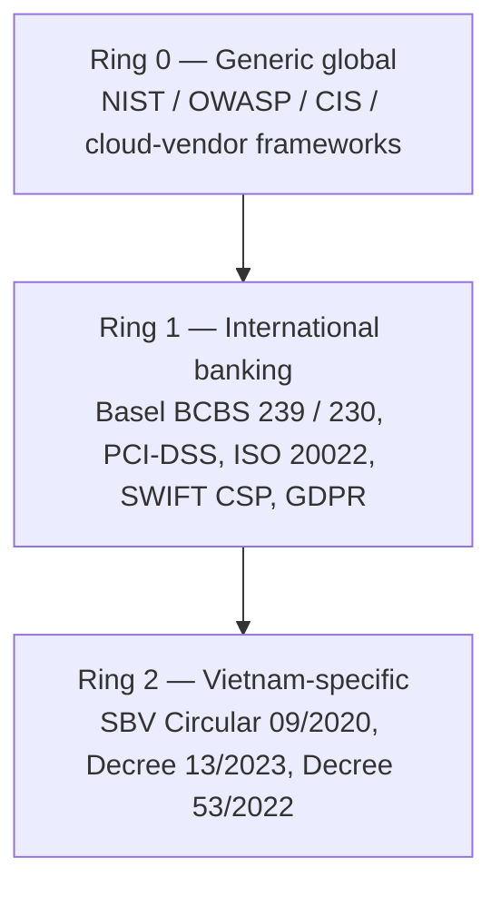

# Enterprise Architecture Catalog

Status: Draft | Last Reviewed: 2026-05-09 | Owner: @ea-board
Catalog version: 1.0
Coverage: 142 catalog rows across 14 categories — 22 existing + 16 new full-depth + 4 upgrades-of-existing + 100 stubs.

> **For DAB authors**: every DAB submission must cite ≥3 catalog rows by ID (e.g., `RES-005`, `EIP-024`, `COMP-001`). See §10.

---

## 1. Purpose & How to Use

This catalog is the single source of truth for architecture patterns, principles, NFRs, compliance mappings, and reference architectures used across Techcombank engineering. It is the **mandatory companion** to every Design Approval Board (DAB) submission.

### Audiences

- **Solution Architects** — find a pattern that solves your problem; cite it in your DAB.
- **Engineers** — implement using the canonical Java/Spring/iOS/Android references.
- **DAB Reviewers** — verify submissions reference the right patterns; reject submissions missing required citations.
- **Security & Compliance** — trace a pattern to the regulatory controls it satisfies.

### Three reading paths

1. **By-category** (this doc, §3 → §4) — start at the taxonomy, drill into categories.
2. **By-banking-flow** — start in `domains/{your-domain}/` and follow the catalog IDs cited.
3. **By-regulation** — open [`compliance-mapping-matrix.md`](../../knowledge-base/compliance/compliance-mapping-matrix.md), filter by SBV / PCI-DSS / Basel / etc., then traverse to the patterns.

### How to cite a row in your DAB

```
> **Pattern compliance** — This service uses [RES-005 Cell-Based Architecture](../../knowledge-base/patterns/resilience/cell-based-architecture.md), satisfying SBV Circ. 09 §IV.2 and BCBS 230 §27.
```

---

## 2. Architecture Principles

### 2.1 The Three Concentric Rings (regulatory layering)

Every catalog row is mapped to up to 3 regulatory rings, from generic outward to Vietnam-specific:



A pattern's Compliance Mapping table has one row per ring it satisfies. Patterns may apply to all three rings, two, one, or zero (in the rare case of a purely internal engineering convention).

### 2.2 Spine vs Radii

Catalog rows divide into two normative classes:

- **Spine docs** are *normative*. They define numbers, taxonomies, or templates that other docs **must inherit and may not contradict**. There are 6 spine docs in this delivery (Wave 0 / Phase 2):
  1. [NFR-001 Service Tiering + RTO/RPO Matrix](../../knowledge-base/nfr/service-tiering-rto-rpo.md)
  2. [NFR-002 Latency Budget Model](../../knowledge-base/nfr/latency-budget-model.md)
  3. [PRIN-006 Idempotency-by-default](../../knowledge-base/principles/idempotency-by-default.md)
  4. [TPL-001 NFR Acceptance Criteria DAB Template](../../knowledge-base/templates/nfr-acceptance-criteria-dab.md)
  5. [COMP-001 Compliance Mapping Matrix](../../knowledge-base/compliance/compliance-mapping-matrix.md)
  6. [REF-001 Multi-Region Active-Active](../../knowledge-base/reference-architectures/multi-region-active-active.md)
- **Radii docs** are everything else: patterns, reference architectures, best-practices. They **inherit from spine docs** by reference and may not redefine spine concepts.

### 2.3 HA / HP / HR

High Availability, High Performance, and High Resilience are **NFR properties enforced via spine docs**, not patterns themselves. Each pattern declares which NFRs it contributes to via the **NFR Acceptance Criteria** block (template in spine doc TPL-001).

---

## 3. Taxonomy

### 3.1 Architecture Principles (`knowledge-base/principles/`)

High-level beliefs that guide all decisions. Vendor-, pattern-, and stack-neutral. Each principle is a 1–2-page doc framing the problem and the boundary conditions. **Inclusion**: cross-cutting decisions (API-First, Event-Driven, Zero-Trust, Idempotency, Data-Residency). **Exclusion**: a specific algorithm choice; a tool selection; a deployment topology.

### 3.2 Data Patterns (`knowledge-base/patterns/data/`)

Patterns for data modelling, partitioning, replication, lineage, and consistency. **Inclusion**: CQRS, Data Mesh, Temporal tables, CDC, lineage, time-series, MDM. **Exclusion**: schema-design conventions (in `governance/standards/naming-conventions.md`); per-database-vendor optimisations.

### 3.3 Integration Patterns (`knowledge-base/patterns/integration/`)

Patterns for cross-service communication, cross-system bridges, legacy modernisation. **Inclusion**: Saga, Outbox + CDC, API Gateway, Event Sourcing, Anti-Corruption Layer, Strangler Fig, Sidecar. **Exclusion**: protocol-specific patterns (those go in EIP §3.6).

### 3.4 Resilience Patterns (`knowledge-base/patterns/resilience/`)

Patterns for fault tolerance, blast-radius limitation, recovery. **Inclusion**: Circuit Breaker, Bulkhead, Cell-Based Architecture, Retry, Timeout, Fallback, Throttling, Load Shedding, Leader Election. **Exclusion**: end-to-end DR processes (see best-practices §3.14, BP-002).

### 3.5 Security Patterns (`knowledge-base/patterns/security/`)

Patterns for auth, secrets, cryptography, fraud, audit. **Inclusion**: mTLS, OAuth2, BFF + token-binding, Tokenization + HSM, JWT best practice, ABAC, audit logging. **Exclusion**: governance / policy controls (those live in `governance/standards/security-baseline.md`).

### 3.6 Enterprise Integration Patterns / EIP (`knowledge-base/patterns/eip/`)

The Hohpe & Woolf catalogue (65 patterns), curated to a banking-relevant subset of 25. **Inclusion**: messaging, routing, transformation, endpoint patterns used in payment / ledger / event-driven flows. **Exclusion**: deprecated XML/SOAP-only transformers from 2003.

### 3.7 Frontend Patterns (`knowledge-base/patterns/frontend/`)

Web-tier patterns — performance budgets, offline-first, CSP hardening, feature flags, error boundary, i18n/RTL. Stack-aligned to React + TypeScript per Techcombank standard. Stubs only in this wave; full content in Wave 2.

### 3.8 Mobile Patterns (`knowledge-base/patterns/mobile/`)

Native-mobile patterns for iOS Swift + Android Kotlin — offline queue, secure storage, biometric auth, push notification, deep-link attestation, force-upgrade. Stubs only in this wave.

### 3.9 Banking Solution Patterns (`knowledge-base/patterns/banking-solutions/`)

Atomic banking-specific patterns (double-entry ledger, idempotent payment key, sanction screening, EOD batch window, reversal/chargeback). Distinct from Reference Architectures (§3.10) which compose multiple patterns into a flow.

### 3.10 Reference Architectures (`knowledge-base/reference-architectures/`)

End-to-end designs combining many patterns into a coherent banking flow. **Inclusion**: Multi-Region Active-Active (spine), Real-Time Payments NAPAS, KYC/AML, Card Authorization 3DS2, SWIFT MT/MX, Loan Origination, Fraud Screening, Regulatory Reporting, Account Opening, Ledger Posting, Open Banking PSD2, Dispute Management.

### 3.11 Non-Functional Requirements (`knowledge-base/nfr/`)

Catalogues of numbers — service tiers (T0–T3), RTO/RPO matrices, latency budgets, capacity models, error budgets. These are *spine* docs; every pattern declares its tier and inherits the NFRs from this category.

### 3.12 Compliance & Regulatory (`knowledge-base/compliance/`)

The master mapping matrix (spine, COMP-001) plus per-regulation deep-dive stubs. Authoritative quotes traced back to `_research-notes.md`. Vietnamese sources flagged "UNOFFICIAL TRANSLATION pending Legal review" until Legal sign-off.

### 3.13 Templates (`knowledge-base/templates/`)

Reusable doc skeletons. NFR-AC DAB Template (TPL-001) is spine and required by every DAB submission. Stubs cover pattern-doc, stub-doc, and ref-arch-doc shapes for future authors.

### 3.14 Best Practices (`knowledge-base/best-practices/`)

Operational and process guidelines. **Inclusion**: CI/CD, DR playbook, microservice decomposition, observability, chaos engineering, capacity planning, golden signals, error budgets, runbooks, postmortems. Distinct from patterns (which are *what* to build) — best practices are *how to operate*.

---

## 4. Master Inventory Table

> **Source of truth**: `_catalog-inventory.yml`. This table is regenerated by `scripts/render-catalog-table.py`. Do not hand-edit.

| ID | Title | Category | Status | Spine | Owner | Path | Tiers | Compliance | Last Reviewed | Wave | Notes |
|---|---|---|---|---|---|---|---|---|---|---|---|
| BP-001 | CI/CD Pipeline Design | best-practices | Approved | radii | @sre-lead | `knowledge-base/best-practices/ci-cd-pipeline-design.md` | T0, T1, T2, T3 | — | 2026-03-08 | 0 | Existing — cross-link only |
| BP-002 | Disaster Recovery Playbook | best-practices | Approved | radii | @sre-lead | `knowledge-base/best-practices/disaster-recovery-playbook.md` | T0, T1 | — | 2026-03-08 | 0 | Existing — cross-link only |
| BP-003 | Microservice Decomposition | best-practices | Approved | radii | @ea-board | `knowledge-base/best-practices/microservice-decomposition.md` | T0, T1, T2, T3 | — | 2026-03-08 | 0 | Existing — cross-link only |
| BP-004 | Observability Standards | best-practices | Approved | radii | @sre-lead | `knowledge-base/best-practices/observability-standards.md` | T0, T1, T2, T3 | — | 2026-03-08 | 0 | Existing — cross-link only |
| BP-005 | Chaos Engineering | best-practices | Approved | radii | @sre-lead | `knowledge-base/best-practices/chaos-engineering.md` | T0, T1 | Principles of Chaos Engineering; BCBS 230 §6 (UNOFFICIAL); SBV Circ. 09 §IV.2 (UNOFFICIAL) | 2026-05-18 | 1 | Wave 6E — self-review complete |
| BP-006 | Capacity Planning | best-practices | Approved | radii | @sre-lead | `knowledge-base/best-practices/capacity-planning.md` | T0, T1 | — | 2026-05-18 | 1 | Wave 6E — self-review complete |
| BP-007 | Golden Signals (SRE) | best-practices | Approved | radii | @sre-lead | `knowledge-base/best-practices/golden-signals-sre.md` | T0, T1, T2 | Google SRE Book | 2026-05-18 | 1 | Wave 6E — self-review complete |
| BP-008 | Error Budgets | best-practices | Approved | radii | @sre-lead | `knowledge-base/best-practices/error-budgets.md` | T0, T1 | Google SRE Book | 2026-05-18 | 1 | Wave 6E — self-review complete |
| BP-009 | Runbook Authoring | best-practices | Approved | radii | @sre-lead | `knowledge-base/best-practices/runbook-authoring.md` | T0, T1, T2, T3 | — | 2026-05-18 | 1 | Wave 6E — self-review complete |
| BP-010 | Incident Postmortem | best-practices | Approved | radii | @sre-lead | `knowledge-base/best-practices/incident-postmortem.md` | T0, T1 | Google SRE Book | 2026-05-18 | 1 | Wave 6E — self-review complete |
| BP-011 | Blameless Culture | best-practices | Approved | radii | @sre-lead | `knowledge-base/best-practices/blameless-culture.md` | T0, T1, T2, T3 | — | 2026-05-18 | 1 | Wave 6E — self-review complete |
| BSP-001 | Double-Entry Ledger | banking-solutions | Approved | radii | @payments-domain-owner | `knowledge-base/patterns/banking-solutions/double-entry-ledger.md` | T0 | BCBS 239 §6; IFRS 9; SBV Circ. 09 §IV (UNOFFICIAL) | 2026-05-18 | 2 | Wave 7A — self-review complete |
| BSP-002 | Idempotent Payment Key | banking-solutions | Approved | radii | @payments-domain-owner | `knowledge-base/patterns/banking-solutions/idempotent-payment-key.md` | T0 | ISO 20022 EndToEndId; SBV Circ. 09 §IV.2 (UNOFFICIAL) | 2026-05-18 | 2 | Wave 7A — self-review complete |
| BSP-003 | Sanction Screening Pipeline | banking-solutions | Approved | radii | @risk-management-domain-owner | `knowledge-base/patterns/banking-solutions/sanction-screening-pipeline.md` | T0 | FATF Rec. 6 | 2026-05-18 | 2 | Wave 7A — self-review complete |
| BSP-004 | End-of-Day Batch Window | banking-solutions | Approved | radii | @core-banking-domain-owner | `knowledge-base/patterns/banking-solutions/end-of-day-batch-window.md` | T0, T1 | — | 2026-05-18 | 2 | Wave 7A — self-review complete |
| BSP-005 | Reversal and Chargeback | banking-solutions | Approved | radii | @payments-domain-owner | `knowledge-base/patterns/banking-solutions/reversal-and-chargeback.md` | T0 | Card-scheme rules; ISO 20022 pacs.007 | 2026-05-18 | 2 | Wave 7A — self-review complete |
| COMP-001 | Compliance Mapping Matrix (master) | compliance | Approved | spine | @head-of-compliance | `knowledge-base/compliance/compliance-mapping-matrix.md` | — | ISO 27001; ALL Ring-1 sources; ALL Ring-2 sources | 2026-05-18 | 1 | Wave 6F — self-review complete |
| COMP-002 | SBV Circular 09/2020/TT-NHNN — Deep Dive | compliance | Approved | radii | @head-of-compliance | `knowledge-base/compliance/sbv-circular-09-2020.md` | — | SBV Circ. 09/2020 (UNOFFICIAL) | 2026-05-18 | 3 | Wave 7E — self-review complete |
| COMP-003 | Decree 13/2023 (Personal Data) — Deep Dive | compliance | Approved | radii | @head-of-compliance | `knowledge-base/compliance/decree-13-2023-personal-data.md` | — | Decree 13/2023 (UNOFFICIAL) | 2026-05-18 | 3 | Wave 7E — self-review complete |
| COMP-004 | PCI-DSS 4.0 — Deep Dive | compliance | Approved | radii | @ciso-delegate | `knowledge-base/compliance/pci-dss-4-0.md` | — | PCI-DSS 4.0 | 2026-05-18 | 3 | Wave 7E — self-review complete |
| COMP-005 | Basel BCBS 239 — Deep Dive | compliance | Approved | radii | @head-of-compliance | `knowledge-base/compliance/basel-bcbs-239.md` | — | BCBS 239 | 2026-05-18 | 3 | Wave 7E — self-review complete |
| COMP-006 | Basel BCBS 230 (Operational Resilience) — Deep Dive | compliance | Approved | radii | @sre-lead | `knowledge-base/compliance/basel-bcbs-230.md` | — | BCBS 230 (UNOFFICIAL) | 2026-05-18 | 3 | Wave 7E — self-review complete |
| COMP-007 | ISO 20022 Messaging — Deep Dive | compliance | Approved | radii | @payments-domain-owner | `knowledge-base/compliance/iso-20022-messaging.md` | — | ISO 20022 | 2026-05-18 | 3 | Wave 7E — self-review complete |
| COMP-008 | SWIFT CSP v2024 — Deep Dive | compliance | Approved | radii | @ciso-delegate | `knowledge-base/compliance/swift-csp-2024.md` | — | SWIFT CSP v2024 | 2026-05-18 | 3 | Wave 7E — self-review complete |
| DATA-001 | CQRS Pattern | data | Approved | radii | @tech-lead-backend | `knowledge-base/patterns/data/cqrs-pattern.md` | T1, T2 | microservices.io CQRS; BCBS 239 §3 timeliness | 2026-05-09 | 0 | Existing — UPGRADED in Wave 3b to full ops-runbook depth |
| DATA-002 | Data Mesh Ownership | data | Approved | radii | @data-platform-domain-owner | `knowledge-base/patterns/data/data-mesh-ownership.md` | T1, T2 | — | 2026-03-08 | 0 | Existing — cross-link only |
| DATA-003 | Temporal Tables | data | Approved | radii | @tech-lead-backend | `knowledge-base/patterns/data/temporal-tables.md` | T1, T2 | BCBS 239 §6 | 2026-03-08 | 0 | Existing — cross-link only |
| DATA-004 | Data Vault 2.0 | data | Approved | radii | @data-platform-domain-owner | `knowledge-base/patterns/data/data-vault-2.md` | T2, T3 | BCBS 239 §3 lineage | 2026-05-18 | 2 | Wave 7H — self-review complete |
| DATA-005 | Slowly Changing Dimensions | data | Approved | radii | @data-platform-domain-owner | `knowledge-base/patterns/data/slowly-changing-dimensions.md` | T2, T3 | — | 2026-05-18 | 2 | Wave 7H — self-review complete |
| DATA-006 | Lambda Architecture | data | Approved | radii | @data-platform-domain-owner | `knowledge-base/patterns/data/lambda-architecture.md` | T2, T3 | — | 2026-05-18 | 2 | Wave 7H — self-review complete |
| DATA-007 | Kappa Architecture | data | Approved | radii | @data-platform-domain-owner | `knowledge-base/patterns/data/kappa-architecture.md` | T2, T3 | — | 2026-05-18 | 2 | Wave 7H — self-review complete |
| DATA-008 | Change Data Capture (general) | data | Approved | radii | @tech-lead-backend | `knowledge-base/patterns/data/change-data-capture.md` | T0, T1 | BCBS 239 §3 | 2026-05-18 | 2 | Wave 7H — self-review complete |
| DATA-009 | Data Lineage | data | Approved | radii | @data-platform-domain-owner | `knowledge-base/patterns/data/data-lineage.md` | T1, T2 | BCBS 239 §3 | 2026-05-18 | 2 | Wave 7H — self-review complete |
| DATA-010 | Time-Series Modelling | data | Approved | radii | @data-platform-domain-owner | `knowledge-base/patterns/data/time-series-modelling.md` | T2, T3 | — | 2026-05-18 | 2 | Wave 7H — self-review complete |
| DATA-011 | Data Quality Rules | data | Approved | radii | @data-platform-domain-owner | `knowledge-base/patterns/data/data-quality-rules.md` | T1, T2 | BCBS 239 §4 | 2026-05-18 | 2 | Wave 7H — self-review complete |
| DATA-012 | Data Virtualization | data | Approved | radii | @data-platform-domain-owner | `knowledge-base/patterns/data/data-virtualization.md` | T2, T3 | — | 2026-05-18 | 2 | Wave 7H — self-review complete |
| DATA-013 | Reference Data Master | data | Approved | radii | @data-platform-domain-owner | `knowledge-base/patterns/data/reference-data-master.md` | T0, T1 | BCBS 239 §6 | 2026-05-18 | 2 | Wave 7H — self-review complete |
| EIP-001 | Message Channel | eip | Approved | radii | @tech-lead-backend | `knowledge-base/patterns/eip/message-channel.md` | T0, T1, T2 | EIP §3 | 2026-05-17 | 1 | Wave 6A — self-review complete |
| EIP-002 | Point-to-Point Channel | eip | Approved | radii | @tech-lead-backend | `knowledge-base/patterns/eip/point-to-point-channel.md` | T0, T1 | EIP §3 | 2026-05-17 | 1 | Wave 6A — self-review complete |
| EIP-003 | Publish-Subscribe Channel | eip | Approved | radii | @tech-lead-backend | `knowledge-base/patterns/eip/publish-subscribe-channel.md` | T0, T1, T2 | EIP §3 | 2026-05-17 | 1 | Wave 6A — self-review complete |
| EIP-004 | Message Router | eip | Approved | radii | @tech-lead-backend | `knowledge-base/patterns/eip/message-router.md` | T0, T1 | EIP §4 | 2026-05-17 | 1 | Wave 6A — self-review complete |
| EIP-005 | Content-Based Router | eip | Approved | radii | @tech-lead-backend | `knowledge-base/patterns/eip/content-based-router.md` | T0, T1 | EIP §4 | 2026-05-17 | 1 | Wave 6A — self-review complete |
| EIP-006 | Message Translator | eip | Approved | radii | @tech-lead-backend | `knowledge-base/patterns/eip/message-translator.md` | T0, T1 | EIP §8 | 2026-05-17 | 1 | Wave 6A — self-review complete |
| EIP-007 | Content Enricher | eip | Approved | radii | @tech-lead-backend | `knowledge-base/patterns/eip/content-enricher.md` | T0, T1 | EIP §8 | 2026-05-17 | 1 | Wave 6A — self-review complete |
| EIP-008 | Content Filter | eip | Approved | radii | @tech-lead-backend | `knowledge-base/patterns/eip/content-filter.md` | T0, T1 | EIP §8 | 2026-05-17 | 1 | Wave 6A — self-review complete |
| EIP-009 | Claim Check | eip | Approved | radii | @tech-lead-backend | `knowledge-base/patterns/eip/claim-check.md` | T0, T1 | EIP §8 | 2026-05-17 | 1 | Wave 6A — self-review complete |
| EIP-010 | Normalizer | eip | Approved | radii | @tech-lead-backend | `knowledge-base/patterns/eip/normalizer.md` | T0, T1 | EIP §8 | 2026-05-17 | 1 | Wave 6A — self-review complete |
| EIP-011 | Aggregator | eip | Approved | radii | @tech-lead-backend | `knowledge-base/patterns/eip/aggregator.md` | T0, T1 | EIP §7 | 2026-05-17 | 1 | Wave 6A — self-review complete |
| EIP-012 | Splitter | eip | Approved | radii | @tech-lead-backend | `knowledge-base/patterns/eip/splitter.md` | T0, T1 | EIP §7 | 2026-05-17 | 1 | Wave 6A — self-review complete |
| EIP-013 | Resequencer | eip | Approved | radii | @tech-lead-backend | `knowledge-base/patterns/eip/resequencer.md` | T0, T1 | EIP §7 | 2026-05-18 | 1 | Wave 6B — self-review complete |
| EIP-014 | Composed Message Processor | eip | Approved | radii | @tech-lead-backend | `knowledge-base/patterns/eip/composed-message-processor.md` | T0, T1 | EIP §7 | 2026-05-18 | 1 | Wave 6B — self-review complete |
| EIP-015 | Scatter-Gather | eip | Approved | radii | @tech-lead-backend | `knowledge-base/patterns/eip/scatter-gather.md` | T0, T1 | EIP §7 | 2026-05-18 | 1 | Wave 6B — self-review complete |
| EIP-016 | Routing Slip | eip | Approved | radii | @tech-lead-backend | `knowledge-base/patterns/eip/routing-slip.md` | T0, T1 | EIP §7 | 2026-05-18 | 1 | Wave 6B — self-review complete |
| EIP-017 | Process Manager | eip | Approved | radii | @tech-lead-backend | `knowledge-base/patterns/eip/process-manager.md` | T0, T1 | EIP §7 | 2026-05-18 | 1 | Wave 6B — self-review complete |
| EIP-018 | Message Store | eip | Approved | radii | @tech-lead-backend | `knowledge-base/patterns/eip/message-store.md` | T0, T1 | EIP §11; BCBS 239 §6 | 2026-05-18 | 1 | Wave 6B — self-review complete |
| EIP-019 | Smart Proxy | eip | Approved | radii | @tech-lead-backend | `knowledge-base/patterns/eip/smart-proxy.md` | T0, T1 | EIP §11 | 2026-05-18 | 1 | Wave 6B — self-review complete |
| EIP-020 | Test Message | eip | Approved | radii | @tech-lead-backend | `knowledge-base/patterns/eip/test-message.md` | T0, T1, T2 | EIP §11 | 2026-05-18 | 1 | Wave 6B — self-review complete |
| EIP-021 | Channel Purger | eip | Approved | radii | @tech-lead-backend | `knowledge-base/patterns/eip/channel-purger.md` | T1, T2 | EIP §11 | 2026-05-18 | 1 | Wave 6B — self-review complete |
| EIP-022 | Durable Subscriber | eip | Approved | radii | @tech-lead-backend | `knowledge-base/patterns/eip/durable-subscriber.md` | T0, T1 | EIP §10 | 2026-05-18 | 1 | Wave 6B — self-review complete |
| EIP-023 | Guaranteed Delivery | eip | Approved | radii | @tech-lead-backend | `knowledge-base/patterns/eip/guaranteed-delivery.md` | T0, T1 | EIP §3; BCBS 239 §6 | 2026-05-18 | 1 | Wave 6B — self-review complete |
| EIP-024 | Idempotent Receiver | eip | Approved | radii | @tech-lead-backend | `knowledge-base/patterns/eip/idempotent-receiver.md` | T0, T1 | EIP §10.1; BCBS 239 §6 (accuracy); SBV Circ. 09 §IV.2 (UNOFFICIAL) | 2026-05-18 | 1 | Wave 6B — self-review complete |
| EIP-025 | Dead Letter Channel | eip | Approved | radii | @tech-lead-backend | `knowledge-base/patterns/eip/dead-letter-channel.md` | T0, T1 | EIP §10.5; BCBS 239 §6; SBV Circ. 09 §IV.3 (UNOFFICIAL) | 2026-05-18 | 1 | Wave 6B — self-review complete |
| FE-001 | Web Performance Budgets | frontend | Approved | radii | @tech-lead-web | `knowledge-base/patterns/frontend/web-performance-budgets.md` | T0, T1, T2 | Core Web Vitals; W3C Web Vitals; WCAG 2.2 AA; SBV Circular 09/2020 | 2026-05-18 | 2 | Wave 7D — self-review complete |
| FE-002 | Web Resilience / Offline-First | frontend | Approved | radii | @tech-lead-web | `knowledge-base/patterns/frontend/web-resilience-offline-first.md` | T1, T2 | OWASP ASVS V9; PCI-DSS §3.4; Decree 13/2023 §9 | 2026-05-18 | 2 | Wave 7D — self-review complete |
| FE-003 | Web CSP Hardening | frontend | Approved | radii | @tech-lead-web | `knowledge-base/patterns/frontend/web-csp-hardening.md` | T0, T1, T2 | OWASP ASVS V14.4; PCI-DSS §6.4.3; SBV Circular 09/2020 §III.3 | 2026-05-18 | 2 | Wave 7D — self-review complete |
| FE-004 | Web Feature Flags | frontend | Approved | radii | @tech-lead-web | `knowledge-base/patterns/frontend/web-feature-flags.md` | T1, T2, T3 | OWASP ASVS V14.2; SBV Circular 09/2020 §V.1 | 2026-05-18 | 2 | Wave 7D — self-review complete |
| FE-005 | Web Error Boundary | frontend | Approved | radii | @tech-lead-web | `knowledge-base/patterns/frontend/web-error-boundary.md` | T0, T1, T2 | OWASP ASVS V7.4; Decree 13/2023 §6 | 2026-05-18 | 2 | Wave 7D — self-review complete |
| FE-006 | Web i18n / RTL | frontend | Approved | radii | @tech-lead-web | `knowledge-base/patterns/frontend/web-i18n-rtl.md` | T0, T1, T2, T3 | WCAG 2.2 AA §3.1.1; Decree 13/2023 §4.2 | 2026-05-18 | 2 | Wave 7D — self-review complete |
| INT-001 | Saga Orchestration | integration | Approved | radii | @tech-lead-backend | `knowledge-base/patterns/integration/saga-orchestration.md` | T0, T1 | microservices.io Saga; BCBS 239 §6; ISO 20022 message-flow; SBV Circ. 09 §IV.2 (UNOFFICIAL) | 2026-05-09 | 0 | Existing — UPGRADED in Wave 3b to full ops-runbook depth |
| INT-002 | Transactional Outbox + CDC | integration | Approved | radii | @tech-lead-backend | `knowledge-base/patterns/integration/cdc-outbox-pattern.md` | T0, T1 | microservices.io Outbox; BCBS 239 §6; SBV Circ. 09 §IV.2 (UNOFFICIAL) | 2026-05-09 | 0 | Existing — UPGRADED in Wave 3b |
| INT-003 | API Gateway Routing | integration | Approved | radii | @tech-lead-backend | `knowledge-base/patterns/integration/api-gateway-routing.md` | T0, T1, T2, T3 | — | 2026-03-08 | 0 | Existing — cross-link only |
| INT-004 | Event Sourcing | integration | Approved | radii | @tech-lead-backend | `knowledge-base/patterns/integration/event-sourcing.md` | T0, T1 | BCBS 239 §6 | 2026-03-08 | 0 | Existing — cross-link only (could be upgraded in Wave 1) |
| INT-005 | Anti-Corruption Layer | integration | Approved | radii | @tech-lead-backend | `knowledge-base/patterns/integration/anti-corruption-layer.md` | T0, T1, T2 | DDD Tactical | 2026-05-18 | 2 | Wave 7B — self-review complete |
| INT-006 | Strangler Fig | integration | Approved | radii | @tech-lead-backend | `knowledge-base/patterns/integration/strangler-fig.md` | T1, T2 | MS Cloud Pattern | 2026-05-18 | 2 | Wave 7B — self-review complete |
| INT-007 | Sidecar / Ambassador | integration | Approved | radii | @sre-lead | `knowledge-base/patterns/integration/sidecar-ambassador.md` | T0, T1 | MS Cloud Sidecar | 2026-05-18 | 2 | Wave 7B — self-review complete |
| INT-008 | Backend-for-Frontend Routing | integration | Approved | radii | @tech-lead-backend | `knowledge-base/patterns/integration/backend-for-frontend-routing.md` | T0, T1 | MS Cloud BFF | 2026-05-18 | 2 | Wave 7B — self-review complete |
| INT-009 | Content-Based Router | integration | Approved | radii | @tech-lead-backend | `knowledge-base/patterns/integration/content-based-router.md` | T0, T1 | EIP §4 | 2026-05-18 | 2 | Wave 7B — self-review complete |
| MOB-001 | Mobile Offline Queue | mobile | Approved | radii | @tech-lead-mobile | `knowledge-base/patterns/mobile/mobile-offline-queue.md` | T1, T2 | OWASP M2; PCI-DSS §3.5; Decree 13/2023 §9 | 2026-05-18 | 2 | Wave 7C — self-review complete |
| MOB-002 | Mobile Secure Storage | mobile | Approved | radii | @tech-lead-mobile | `knowledge-base/patterns/mobile/mobile-secure-storage.md` | T0, T1 | OWASP M2; PCI-DSS §3.5; SBV Circ. 09 §III | 2026-05-18 | 2 | Wave 7C — self-review complete |
| MOB-003 | Mobile Biometric Auth | mobile | Approved | radii | @tech-lead-mobile | `knowledge-base/patterns/mobile/mobile-biometric-auth.md` | T0, T1 | NIST SP 800-63B; PCI-DSS §8.4; SBV Circ. 09 §III.2 | 2026-05-18 | 2 | Wave 7C — self-review complete |
| MOB-004 | Mobile Push Notification (Secure) | mobile | Approved | radii | @tech-lead-mobile | `knowledge-base/patterns/mobile/mobile-push-notification-secure.md` | T1, T2 | OWASP M7; PCI-DSS §6.4; Decree 13/2023 §17 | 2026-05-18 | 2 | Wave 7C — self-review complete |
| MOB-005 | Mobile Deep Link Attestation | mobile | Approved | radii | @tech-lead-mobile | `knowledge-base/patterns/mobile/mobile-deep-link-attestation.md` | T0, T1 | OWASP M8; OWASP ASVS V6.3; SBV Circ. 09 §III | 2026-05-18 | 2 | Wave 7C — self-review complete |
| MOB-006 | Mobile Force-Upgrade | mobile | Approved | radii | @tech-lead-mobile | `knowledge-base/patterns/mobile/mobile-force-upgrade.md` | T0, T1, T2 | OWASP M9; PCI-DSS §6.3.3; SBV Circ. 09 §II.3 | 2026-05-18 | 2 | Wave 7C — self-review complete |
| NFR-001 | Service Tiering + RTO/RPO Matrix | nfr | Approved | spine | @sre-lead | `knowledge-base/nfr/service-tiering-rto-rpo.md` | — | AWS Well-Architected Reliability; BCBS 230 §6 (UNOFFICIAL); BCBS 239 §3; SBV Circ. 09 §IV.2 (UNOFFICIAL) | 2026-05-18 | 1 | Wave 6E — self-review complete |
| NFR-002 | Latency Budget Model | nfr | Approved | spine | @sre-lead | `knowledge-base/nfr/latency-budget-model.md` | — | Azure WAF Performance Efficiency; BCBS 239 §3 timeliness; ISO 20022 RTPS | 2026-05-18 | 1 | Wave 6E — self-review complete |
| NFR-003 | Capacity Planning Model | nfr | Approved | radii | @sre-lead | `knowledge-base/nfr/capacity-planning-model.md` | — | — | 2026-05-18 | 1 | Wave 6E — self-review complete |
| NFR-004 | Throughput Model | nfr | Approved | radii | @sre-lead | `knowledge-base/nfr/throughput-model.md` | — | — | 2026-05-18 | 1 | Wave 6E — self-review complete |
| NFR-005 | Error Budget Policy | nfr | Approved | radii | @sre-lead | `knowledge-base/nfr/error-budget-policy.md` | — | Google SRE Book | 2026-05-18 | 1 | Wave 6E — self-review complete |
| PRIN-001 | API-First Design | principles | Approved | radii | @ea-board | `knowledge-base/principles/api-first-design.md` | T0, T1, T2, T3 | — | 2026-03-08 | 0 | Existing — cross-link only in Phase 4 |
| PRIN-002 | Event-Driven Architecture | principles | Approved | radii | @ea-board | `knowledge-base/principles/event-driven-architecture.md` | T0, T1, T2, T3 | — | 2026-03-08 | 0 | Existing — cross-link only |
| PRIN-003 | Zero-Trust Security | principles | Approved | radii | @ciso-delegate | `knowledge-base/principles/zero-trust-security.md` | T0, T1, T2, T3 | NIST SP 800-207 | 2026-03-08 | 0 | Existing — cross-link only |
| PRIN-004 | Database-Per-Service | principles | Approved | radii | @ea-board | `knowledge-base/principles/database-per-service.md` | T0, T1, T2, T3 | — | 2026-03-08 | 0 | Existing — cross-link only |
| PRIN-005 | Cloud-Native-First | principles | Approved | radii | @ea-board | `knowledge-base/principles/cloud-native-first.md` | T0, T1, T2, T3 | — | 2026-03-08 | 0 | Existing — cross-link only |
| PRIN-006 | Idempotency-by-default | principles | Approved | spine | @ea-board | `knowledge-base/principles/idempotency-by-default.md` | T0, T1, T2 | NIST SP 800-53 SC-23; BCBS 239 §6 (accuracy); SBV Circ. 09 §IV.2 (UNOFFICIAL) | 2026-05-18 | 1 | Wave 6C — self-review complete |
| PRIN-007 | Data Residency | principles | Approved | radii | @head-of-compliance | `knowledge-base/principles/data-residency.md` | T0, T1, T2, T3 | ISO 27017; ISO 27018; GDPR Art. 44–49; Decree 53/2022 (UNOFFICIAL); Decree 13/2023 (UNOFFICIAL) | 2026-05-18 | 1 | Wave 6C — self-review complete |
| PRIN-008 | Defense-in-Depth | principles | Approved | radii | @ciso-delegate | `knowledge-base/principles/defense-in-depth.md` | T0, T1, T2, T3 | NIST SP 800-53; PCI-DSS 4.0 multi-layer controls; SBV Circ. 09 §II (UNOFFICIAL) | 2026-05-18 | 1 | Wave 6C — self-review complete |
| PRIN-009 | Observability-First | principles | Approved | radii | @sre-lead | `knowledge-base/principles/observability-first.md` | T0, T1, T2, T3 | OpenTelemetry standards | 2026-05-18 | 1 | Wave 6C — self-review complete |
| PRIN-010 | Fail-Safe Defaults | principles | Approved | radii | @ciso-delegate | `knowledge-base/principles/fail-safe-defaults.md` | T0, T1, T2, T3 | NIST SP 800-160 | 2026-05-18 | 1 | Wave 6C — self-review complete |
| PRIN-011 | Least-Privilege | principles | Approved | radii | @ciso-delegate | `knowledge-base/principles/least-privilege.md` | T0, T1, T2, T3 | NIST SP 800-53 AC-6; PCI-DSS §7 | 2026-05-18 | 1 | Wave 6C — self-review complete |
| PRIN-012 | Async-by-default | principles | Approved | radii | @ea-board | `knowledge-base/principles/async-by-default.md` | T0, T1, T2 | — | 2026-05-18 | 1 | Wave 6C — self-review complete |
| PRIN-013 | Modular Monolith Preference | principles | Approved | radii | @ea-board | `knowledge-base/principles/modular-monolith-preference.md` | T1, T2, T3 | — | 2026-05-18 | 1 | Wave 6C — self-review complete |
| REF-001 | Multi-Region Active-Active | reference-architectures | Approved | spine | @ea-board | `knowledge-base/reference-architectures/multi-region-active-active.md` | T0, T1 | AWS Well-Architected Reliability §3; BCBS 230 §6 (UNOFFICIAL); BCBS 239 §3; SBV Circ. 09 §IV.2 (UNOFFICIAL) | 2026-05-18 | 1 | Wave 6G — self-review complete |
| REF-002 | Real-Time Payments — NAPAS / Instant | reference-architectures | Approved | radii | @payments-domain-owner | `knowledge-base/reference-architectures/real-time-payments-napas.md` | T0 | AWS Reliability; ISO 20022 pacs.008/.002; PCI-DSS 4.0; SBV Circ. 09 §IV (UNOFFICIAL) | 2026-05-18 | 1 | Wave 6G — self-review complete |
| REF-003 | KYC / AML Onboarding | reference-architectures | Approved | radii | @risk-management-domain-owner | `knowledge-base/reference-architectures/kyc-aml-onboarding.md` | T1 | NIST SP 800-63A; FATF Rec. 10–12; GDPR Art. 9; SBV Circ. 09 (UNOFFICIAL); Decree 13/2023 (UNOFFICIAL) | 2026-05-18 | 1 | Wave 6G — self-review complete |
| REF-004 | Card Authorization (3DS2) | reference-architectures | Approved | radii | @payments-domain-owner | `knowledge-base/reference-architectures/card-authorization-3ds2.md` | T0 | EMVCo 3DS 2.3; PCI-DSS 4.0 §6, §8; PSD2 SCA; SBV Circ. 09 §III (UNOFFICIAL) | 2026-05-18 | 1 | Wave 6G — self-review complete |
| REF-005 | SWIFT MT/MX Wire Transfer | reference-architectures | Approved | radii | @payments-domain-owner | `knowledge-base/reference-architectures/swift-mt-mx-wire-transfer.md` | T0 | SWIFT CSP; ISO 20022 pacs | 2026-05-18 | 2 | Wave 7G — self-review complete |
| REF-006 | Loan Origination | reference-architectures | Approved | radii | @lending-domain-owner | `knowledge-base/reference-architectures/loan-origination.md` | T1 | IFRS 9 | 2026-05-18 | 2 | Wave 7G — self-review complete |
| REF-007 | Fraud Screening Platform | reference-architectures | Approved | radii | @risk-management-domain-owner | `knowledge-base/reference-architectures/fraud-screening-platform.md` | T0 | PSD2; FATF | 2026-05-18 | 2 | Wave 7G — self-review complete |
| REF-008 | Regulatory Reporting | reference-architectures | Approved | radii | @head-of-compliance | `knowledge-base/reference-architectures/regulatory-reporting.md` | T1 | BCBS 239; SBV Reporting (UNOFFICIAL) | 2026-05-18 | 2 | Wave 7G — self-review complete |
| REF-009 | Account Opening (Omnichannel) | reference-architectures | Approved | radii | @digital-channels-domain-owner | `knowledge-base/reference-architectures/account-opening-omnichannel.md` | T1 | FATF Rec. 10 | 2026-05-18 | 2 | Wave 7G — self-review complete |
| REF-010 | Ledger Posting Engine | reference-architectures | Approved | radii | @core-banking-domain-owner | `knowledge-base/reference-architectures/ledger-posting-engine.md` | T0 | IFRS 9; BCBS 239 | 2026-05-18 | 2 | Wave 7G — self-review complete |
| REF-011 | Open Banking (PSD2) | reference-architectures | Approved | radii | @digital-channels-domain-owner | `knowledge-base/reference-architectures/open-banking-psd2.md` | T1 | PSD2 RTS; FAPI 2.0 | 2026-05-18 | 2 | Wave 7G — self-review complete |
| REF-012 | Dispute Management | reference-architectures | Approved | radii | @payments-domain-owner | `knowledge-base/reference-architectures/dispute-management.md` | T1 | Card-scheme rules | 2026-05-18 | 2 | Wave 7G — self-review complete |
| RES-001 | Bulkhead Isolation | resilience | Approved | radii | @sre-lead | `knowledge-base/patterns/resilience/bulkhead-isolation.md` | T0, T1, T2 | MS Cloud Bulkhead; BCBS 230 §6 (UNOFFICIAL) | 2026-03-08 | 0 | Existing — cross-link only; extended by RES-005 cell-based |
| RES-002 | Circuit Breaker | resilience | Approved | radii | @sre-lead | `knowledge-base/patterns/resilience/circuit-breaker.md` | T0, T1, T2 | Resilience4j /circuitbreaker; BCBS 230 §6 (UNOFFICIAL); SBV Circ. 09 §IV.2 (UNOFFICIAL) | 2026-05-09 | 0 | Existing — UPGRADED in Wave 3a |
| RES-003 | Retry with Backoff | resilience | Approved | radii | @sre-lead | `knowledge-base/patterns/resilience/retry-with-backoff.md` | T0, T1, T2 | Resilience4j Retry | 2026-03-08 | 0 | Existing — cross-link only |
| RES-005 | Cell-Based Architecture | resilience | Approved | radii | @sre-lead | `knowledge-base/patterns/resilience/cell-based-architecture.md` | T0, T1 | AWS Operational Excellence — bulkhead; BCBS 230 §27 impact tolerance (UNOFFICIAL); SBV Circ. 09 §IV.2 (UNOFFICIAL) | 2026-05-18 | 1 | Wave 6D — self-review complete |
| RES-006 | Timeout Budget | resilience | Approved | radii | @sre-lead | `knowledge-base/patterns/resilience/timeout-budget.md` | T0, T1, T2 | Resilience4j TimeLimiter | 2026-05-18 | 1 | Wave 6D — self-review complete |
| RES-007 | Fallback Strategies | resilience | Approved | radii | @sre-lead | `knowledge-base/patterns/resilience/fallback-strategies.md` | T0, T1 | — | 2026-05-18 | 1 | Wave 6D — self-review complete |
| RES-008 | Throttling / Rate Limiting | resilience | Approved | radii | @sre-lead | `knowledge-base/patterns/resilience/throttling-rate-limiting.md` | T0, T1, T2 | MS Cloud Throttling | 2026-05-18 | 1 | Wave 6D — self-review complete |
| RES-009 | Load Shedding | resilience | Approved | radii | @sre-lead | `knowledge-base/patterns/resilience/load-shedding.md` | T0, T1 | — | 2026-05-18 | 1 | Wave 6D — self-review complete |
| RES-010 | Leader Election | resilience | Approved | radii | @sre-lead | `knowledge-base/patterns/resilience/leader-election.md` | T0, T1, T2 | MS Cloud Leader Election | 2026-05-18 | 1 | Wave 6D — self-review complete |
| RES-011 | Queue-Based Load Levelling | resilience | Approved | radii | @sre-lead | `knowledge-base/patterns/resilience/queue-based-load-levelling.md` | T0, T1, T2 | MS Cloud Queue-Based Load Leveling | 2026-05-18 | 1 | Wave 6D — self-review complete |
| RES-012 | Health Check Aggregation | resilience | Approved | radii | @sre-lead | `knowledge-base/patterns/resilience/health-check-aggregation.md` | T0, T1, T2, T3 | MS Cloud Health Endpoint Monitoring | 2026-05-18 | 1 | Wave 6D — self-review complete |
| SEC-001 | mTLS Service Mesh | security | Approved | radii | @ciso-delegate | `knowledge-base/patterns/security/mtls-service-mesh.md` | T0, T1, T2 | NIST SP 800-207; PCI-DSS §4 | 2026-03-08 | 0 | Existing — cross-link only |
| SEC-002 | OAuth2 Authorization | security | Approved | radii | @ciso-delegate | `knowledge-base/patterns/security/oauth2-authorization.md` | T0, T1, T2 | RFC 6749; PCI-DSS §8 | 2026-03-08 | 0 | Existing — cross-link only |
| SEC-003 | Vault Secret Management | security | Approved | radii | @ciso-delegate | `knowledge-base/patterns/security/vault-secret-management.md` | T0, T1, T2 | NIST SP 800-57; PCI-DSS §3.6 | 2026-03-08 | 0 | Existing — cross-link only |
| SEC-004 | Tokenization + HSM Key Management | security | Approved | radii | @ciso-delegate | `knowledge-base/patterns/security/tokenization-hsm.md` | T0, T1 | NIST SP 800-57; PCI-DSS 4.0 §3.5; PCI-DSS 4.0 §3.6; PCI-DSS 4.0 §3.7; Decree 13/2023 (UNOFFICIAL); SBV Circ. 09 §III (UNOFFICIAL) | 2026-05-18 | 1 | Wave 6G — self-review complete |
| SEC-005 | BFF + Token-Binding (web + iOS + Android) | security | Approved | radii | @ciso-delegate | `knowledge-base/patterns/security/bff-token-binding.md` | T0, T1 | OWASP ASVS; NIST SP 800-63; PCI-DSS 4.0 §8; FAPI 2.0; SBV Circ. 09 §III (UNOFFICIAL) | 2026-05-18 | 1 | Wave 6G — self-review complete |
| SEC-006 | JWT Best Practices | security | Approved | radii | @ciso-delegate | `knowledge-base/patterns/security/jwt-best-practices.md` | T0, T1, T2 | RFC 8725 | 2026-05-18 | 1 | Wave 7F — self-review complete |
| SEC-007 | Secrets Rotation | security | Approved | radii | @ciso-delegate | `knowledge-base/patterns/security/secrets-rotation.md` | T0, T1, T2 | NIST SP 800-57; PCI-DSS §3.6 | 2026-05-18 | 1 | Wave 7F — self-review complete |
| SEC-008 | Data Masking | security | Approved | radii | @ciso-delegate | `knowledge-base/patterns/security/data-masking.md` | T0, T1, T2 | PCI-DSS §3.4; Decree 13/2023 (UNOFFICIAL) | 2026-05-18 | 1 | Wave 7F — self-review complete |
| SEC-009 | Fraud Signal Collection | security | Approved | radii | @risk-management-domain-owner | `knowledge-base/patterns/security/fraud-signal-collection.md` | T0, T1 | — | 2026-05-18 | 1 | Wave 7F — self-review complete |
| SEC-010 | Attribute-Based Access Control | security | Approved | radii | @ciso-delegate | `knowledge-base/patterns/security/attribute-based-access-control.md` | T0, T1, T2 | NIST SP 800-162 | 2026-05-18 | 1 | Wave 7F — self-review complete |
| SEC-011 | Session Revocation | security | Approved | radii | @ciso-delegate | `knowledge-base/patterns/security/session-revocation.md` | T0, T1, T2 | PCI-DSS §8 | 2026-05-18 | 1 | Wave 7F — self-review complete |
| SEC-012 | Tamper-Evident Audit Logging | security | Approved | radii | @ciso-delegate | `knowledge-base/patterns/security/audit-logging-tamper-evident.md` | T0, T1 | PCI-DSS §10 | 2026-05-18 | 1 | Wave 7F — self-review complete |
| SEC-013 | PII Tokenization (Format-Preserving) | security | Approved | radii | @ciso-delegate | `knowledge-base/patterns/security/pii-tokenization-format-preserving.md` | T0, T1 | NIST SP 800-38G; Decree 13/2023 (UNOFFICIAL) | 2026-05-18 | 1 | Wave 7F — self-review complete |
| TPL-001 | NFR Acceptance Criteria — DAB Submission Template | templates | Approved | spine | @dab-chair | `knowledge-base/templates/nfr-acceptance-criteria-dab.md` | — | — | 2026-05-18 | 1 | Wave 6F — self-review complete |
| TPL-002 | Pattern Doc Template | templates | Approved | radii | @ea-board | `knowledge-base/templates/pattern-doc-template.md` | — | — | 2026-05-18 | 1 | Wave 6F — self-review complete |
| TPL-003 | Stub Doc Template | templates | Approved | radii | @ea-board | `knowledge-base/templates/stub-doc-template.md` | — | — | 2026-05-18 | 1 | Wave 6F — self-review complete |
| TPL-004 | Reference Architecture Doc Template | templates | Approved | radii | @ea-board | `knowledge-base/templates/ref-arch-doc-template.md` | — | — | 2026-05-18 | 1 | Wave 6F — self-review complete |

## 5. Gap Analysis

Coverage as of 2026-05-09 (auto-derivable by counting rows in `_catalog-inventory.yml`):

| Category | Approved | Draft (Wave 0) | Proposed (stubs) | Total | Approved + Draft % | Tier-1 Risk Highlight |
|---|---|---|---|---|---|---|
| Principles | 5 | 2 | 6 | 13 | 54% | Idempotency required for any T0 service |
| Patterns / data | 3 | 1 (cqrs upgrade) | 9 | 13 | 31% | CQRS upgrade pending Wave 3b |
| Patterns / integration | 4 | 2 (saga + outbox upgrades) | 5 | 11 | 55% | Saga + outbox both T0-critical |
| Patterns / resilience | 3 | 2 (cb upgrade + cell-based new) | 7 | 12 | 42% | Cell-based architecture is the BCBS 230 §27 hook |
| Patterns / security | 3 | 2 (tokenization-hsm + bff-token-binding) | 8 | 13 | 38% | Tokenization + HSM is PCI-DSS Req 3 hard requirement |
| Patterns / EIP | 0 | 2 (idempotent receiver + DLC) | 23 | 25 | 8% | Idempotent Receiver + DLC are foundational; rest are Wave 1 |
| Patterns / frontend | 0 | 0 | 6 | 6 | 0% | All Wave 2; no T0 risk |
| Patterns / mobile | 0 | 0 | 6 | 6 | 0% | All Wave 2; mobile resilience is T1 |
| Patterns / banking-solutions | 0 | 0 | 5 | 5 | 0% | Double-entry ledger is T0-critical for any banking system |
| Reference architectures | 0 | 4 (multi-region + RT payments + KYC + card auth) | 8 | 12 | 33% | RT Payments, KYC, Card Auth are all T0 |
| NFR | 0 | 2 (tiering + latency budget) | 3 | 5 | 40% | Both spine NFRs are blocking everything else |
| Compliance | 0 | 1 (master matrix) | 7 | 8 | 13% | Master matrix is spine; per-regulation deep-dives are Wave 3 |
| Templates | 0 | 1 (NFR-AC DAB template) | 3 | 4 | 25% | NFR-AC is spine |
| Best-practices | 4 | 1 (chaos engineering) | 6 | 11 | 45% | Chaos engineering pending Wave 3a |
| **Total** | **22** | **20** | **100** | **142** | **30%** | |

### Highest Tier-0/Tier-1 risks today

1. **Cell-Based Architecture** undocumented (BCBS 230 §27 gap) — addressed in Wave 3a (RES-005).
2. **Tokenization + HSM key management** undocumented (PCI-DSS Req 3 gap) — addressed in Wave 3b (SEC-004).
3. **Real-Time Payments NAPAS reference architecture** undocumented (operational SBV exposure) — addressed in Wave 3c (REF-002).
4. **Compliance Mapping Matrix** absent (regulatory traceability gap across all patterns) — addressed in Phase 2 (COMP-001).

---

## 6. Regulatory Mapping Framework

Every Approved doc must complete this 3-ring Compliance Mapping table:

| Layer | Reference | Section/Control | How this pattern satisfies |
|---|---|---|---|
| Ring 0 (generic) | NIST SP 800-53 / OWASP / CIS / cloud-vendor framework | §… | one sentence |
| Ring 1 (intl banking) | PCI-DSS 4.0 / Basel BCBS 239 / 230 / SWIFT CSP / ISO 20022 / GDPR | §… | one sentence |
| Ring 2 (Vietnam) | SBV Circ. 09 / Decree 13 / Decree 53 | §… | one sentence — flag "UNOFFICIAL TRANSLATION pending Legal review" if applicable |

The master cross-reference matrix lives in [`compliance-mapping-matrix.md`](../../knowledge-base/compliance/compliance-mapping-matrix.md). It is generated from per-pattern Compliance Mapping tables (Wave 0 baseline; ongoing maintenance).

### Worked example — Idempotent Receiver (EIP-024)

| Layer | Reference | Section/Control | How |
|---|---|---|---|
| Ring 0 | EIP §10.1 (Hohpe/Woolf) | Chapter 10 — Endpoint Patterns | Defines the canonical contract: dedupe by message ID, side-effect-free re-delivery |
| Ring 1 | BCBS 239 §6 (accuracy) | Principle 3 (accuracy) | Prevents duplicate posting → accurate risk-data aggregation |
| Ring 2 | SBV Circ. 09/2020 §IV.2 | Operational continuity | Required behaviour for retried messages following a network blip during EOD batch (UNOFFICIAL TRANSLATION pending Legal review) |

---

## 7. NFR Framework Summary

> **Placeholder snapshot — backfilled from spine docs in Phase 2 (Task P2.6.B).** Authoritative numbers live in [`nfr/service-tiering-rto-rpo.md`](../../knowledge-base/nfr/service-tiering-rto-rpo.md) and [`nfr/latency-budget-model.md`](../../knowledge-base/nfr/latency-budget-model.md).

### Service Tiers (preliminary)

| Tier | Name | Examples | RTO | RPO | Availability target |
|---|---|---|---|---|---|
| T0 | Critical | Payment auth, real-time clearing, ledger | < 5 min | 0 (sync replication) | 99.99% |
| T1 | Important | Account services, core banking, KYC | < 15 min | < 5 min | 99.95% |
| T2 | Standard | Reporting, analytics, batch jobs | < 1 hour | < 30 min | 99.9% |
| T3 | Best-effort | Internal tooling, dashboards | < 4 hours | < 1 hour | 99.5% |

### Latency Budgets (P50 / P95 / P99) — preliminary

| Tier | P50 | P95 | P99 |
|---|---|---|---|
| T0 (sync API) | 50ms | 200ms | 500ms |
| T1 | 100ms | 500ms | 1s |
| T2 | 500ms | 2s | 5s |
| T3 | best-effort | best-effort | best-effort |

Every starter-set pattern declares its **Tier Applicability** and inherits these targets.

---

## 8. Sequencing & Roadmap

| Wave | Period | Scope | Owner | Status |
|---|---|---|---|---|
| Wave 0 | 2026-05-09 → 2026-06-30 (this delivery) | Master catalog spec; 6 spine docs; 14 radii starter-set; 100 stubs; cross-link of existing 22 | @ea-board | In progress |
| Wave 1 | 2026-Q3 | Author full content for the 25 EIP banking patterns and ~30 other Wave-1 stubs (status Proposed → Approved) | @tech-lead-backend | Planned |
| Wave 2 | 2026-Q4 | Author full content for remaining ~50 reference architectures, frontend, mobile, banking-solutions patterns | @tech-lead-mobile + @tech-lead-web + @payments-domain-owner | Planned |
| Wave 3 | 2027-Q1 | Regulatory deep-dives — 7 docs, 1 per major regulation (SBV Circ. 09, Decree 13, PCI-DSS, BCBS 239, BCBS 230, ISO 20022, SWIFT CSP) | @head-of-compliance | Planned |

Tet 2027 falls in late January / early February; Wave 0 G2 timing must clear Tet by ≥ 2 weeks (per Spec Q1 decision). Wave 3 cadence accommodates Tet.

---

## 9. Acceptance Criteria

A catalog row reaches **Status=Approved** only when the linked doc satisfies all 11 conditions. This is the DoD that gates all G3 / G4 reviews.

| Condition | Verification |
|---|---|
| Catalog ID and Spine/Radii classification declared | grep header line in doc |
| Tier Applicability declared (T0–T3) | grep header line |
| At least one Mermaid diagram present | check Mermaid block count |
| Java/Spring code sample (where applicable; mark N/A explicitly otherwise) | check for ```java code fence |
| Legacy / frontend / mobile notes (where applicable) | spot-check |
| NFR Acceptance Criteria block populated with concrete numbers | regex `RTO\|RPO\|P95` in §NFR Acceptance Criteria |
| Compliance Mapping table populated for all 3 rings | `scripts/check-compliance-rows.py` (Phase 4) |
| Cost/FinOps notes section populated | grep `## Cost` |
| Threat Model summary present | grep `## Threat Model` |
| Operational Runbook stub present | grep `## Operational Runbook` |
| Reviewed by EA-Board + ≥1 topic owner; lint clean | review-log file in `governance/decisions/` + `markdownlint-cli2` exit 0 |

---

## 10. DAB Integration

Every DAB submission MUST include a "Pattern Compliance" section that cites at least 3 catalog rows by ID. Reviewer rejects the submission if missing or incorrect.

### Template snippet for DAB authors

Paste this into your `dab/05-detailed-design.md`:

```markdown
## Pattern Compliance

This solution implements the following catalog patterns:

| Catalog ID | Title | Why we use it | Variant chosen (if any) |
|---|---|---|---|
| PRIN-006 | Idempotency-by-default | All write APIs may be retried | strict idempotency key in HTTP header |
| EIP-025 | Dead Letter Channel | Poison-message handling on payment-events topic | DLT with 3-day retention |
| RES-005 | Cell-Based Architecture | Blast-radius isolation | 3 cells per AZ |

Compliance posture (cross-referenced from each pattern's Compliance Mapping):
- SBV Circ. 09 §IV.2 — satisfied via PRIN-006 + RES-005
- PCI-DSS 4.0 §3.5 — satisfied via SEC-004 (if card-data flows)
- BCBS 230 §27 — satisfied via RES-005
```

---

## 11. Maintenance

- **Review cadence**: every catalog row at Status=Approved is reviewed annually; Status=Draft and Status=Proposed reviewed quarterly. Mirrors the existing `knowledge-base/README.md` convention.
- **Change process**: edit the row in `_catalog-inventory.yml` → run `scripts/render-catalog-table.py` → submit MR → EA-Board approval at quarterly cadence (or expedited for security-critical changes).
- **Deprecation**: a row's status moves to `Deprecated` only with EA-Board sign-off and a forwarding pointer to its replacement. Deprecated rows remain in the catalog for at least 12 months.
- **New entries (post-G2)**: deferred to Wave 1 unless approved as a security-critical exception.

---

**Last Updated**: 2026-05-09 | **Maintained By**: Enterprise Architecture Board | **Source-of-truth**: `_catalog-inventory.yml`
