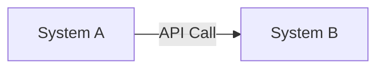

# Naming Conventions for DAB Submissions

Standard naming rules for all artifacts related to Design Approval Board processes, ensuring consistency, traceability, and automated validation.

---

## Git Branch Naming

### Format
```
dab/{domain}/{project-slug}
```

### Rules
- **Prefix:** Always start with `dab/`
- **Domain:** One of the approved domains (lowercase):
  - `payments` — Payment processing and transfers
  - `cards` — Card services (debit, credit, prepaid)
  - `deposits` — Savings accounts, CDs, deposit products
  - `lending` — Loans, credit facilities
  - `operations` — Internal ops, reconciliation, settlement
  - `technology` — Platform infrastructure, tools
  - `data` — Data platform, analytics, warehousing
  - `security` — Identity, access control, security services
  - `mobile` — Mobile applications
  - `corporate` — Corporate banking services

- **Project-slug:**
  - Lowercase alphanumeric + hyphens only
  - Descriptive (2-5 words)
  - No underscores, spaces, or special characters
  - Max 50 characters

### Examples
```
dab/payments/payment-acceleration-engine
dab/cards/tap-to-phone-integration
dab/deposits/high-yield-savings-api
dab/lending/loan-origination-system-v2
dab/technology/kubernetes-migration
dab/data/customer-360-warehouse
dab/security/zero-trust-network-access
```

### Invalid Examples
```
dab/Payments/payment_acceleration        ❌ Capital letters, underscore
dab/unknown-domain/feature                ❌ Invalid domain
dab/payments/a                            ❌ Too short/vague
dab/payemts/project                       ❌ Typo in domain
```

---

## Document File Naming

### Format
```
{NN}-{kebab-case-description}.md
```

### Rules
- **Numeric Prefix (NN):**
  - Two-digit zero-padded number (01-09)
  - Indicates section order
  - Full DAB uses 01-09; Light DAB uses 01-04

- **Separator:** Single hyphen between number and description

- **Description:**
  - Kebab-case (lowercase words separated by hyphens)
  - Descriptive of section content
  - Max 50 characters after number
  - No special characters except hyphens

- **Extension:** Always `.md` for Markdown

### Full DAB Files (9 sections)
```
01-business-context.md                    (Business Context & Requirements)
02-high-level-architecture.md             (High-Level Architecture)
03-detailed-design.md                     (Detailed Design)
04-integration-points.md                  (Integration Points & Dependencies)
05-security-assessment.md                 (Security & Compliance Assessment)
06-operational-requirements.md            (Operational Requirements & Runbooks)
07-performance-analysis.md                (Performance & Scalability Analysis)
08-migration-rollout.md                   (Migration & Rollout Strategy)
09-risk-assessment.md                     (Risk Assessment & Mitigation)
```

### Light DAB Files (4 sections)
```
01-business-context.md                    (Business Context & Requirements)
02-high-level-architecture.md             (High-Level Architecture)
03-security-assessment.md                 (Security & Compliance Assessment)
04-risk-assessment.md                     (Risk Assessment & Mitigation)
```

### Supplementary Files (Optional)
```
diagrams/                                 (Folder for diagram files)
  - 01-system-context.mmd                (Mermaid diagrams)
  - 02-component-architecture.puml       (PlantUML diagrams)
  - 03-sequence-flow.mmd
  - 04-data-model.mmd

appendix/                                 (Folder for supporting docs)
  - load-test-results.pdf
  - security-assessment-checklist.xlsx
  - compliance-mapping.md
```

### Invalid Examples
```
01_business_context.md                    ❌ Underscores instead of hyphens
1-business-context.md                     ❌ Missing zero-padding
business-context.md                       ❌ Missing numeric prefix
01-BusinessContext.md                     ❌ Mixed case
01-business-context.txt                   ❌ Wrong extension
```

---

## Directory/Folder Naming

### Format
```
{lowercase-kebab-case}/
```

### Rules
- **Lowercase only** — Never use capitals
- **Kebab-case** — Words separated by single hyphens
- **No spaces** — Ever
- **No special characters** except hyphens
- **Descriptive** — Clear purpose
- **Max 30 characters**

### Approved Folders (Governance Structure)
```
governance/
  dab-process/
  standards/
  decisions/
```

### DAB Submission Folders
```
dab-submission/                           (Top-level submission folder)
  diagrams/                              (Diagram artifacts)
  appendix/                              (Supporting documentation)
```

### Invalid Examples
```
DAB_Submission/                           ❌ Capitals, underscore
dab submission/                           ❌ Space
dab-submission                            ❌ No trailing slash
High Level Architecture/                  ❌ Capitals, space
```

---

## Git Tag Naming

### Format (Approval Tag)
```
dab-approved/{domain}/{project}/{date}
```

### Rules
- **Prefix:** Always `dab-approved/`
- **Domain:** Same as branch domain (lowercase)
- **Project:** Same as branch project-slug
- **Date:** ISO 8601 format (YYYY-MM-DD) — approval date, not submission date

### Examples
```
dab-approved/payments/payment-acceleration-engine/2026-03-08
dab-approved/cards/tap-to-phone-integration/2026-03-06
dab-approved/data/customer-360-warehouse/2026-03-10
dab-approved/technology/kubernetes-migration/2026-02-28
```

### Application
- Created immediately after merge approval
- Attached to the commit that closed the DAB
- Used for historical traceability and rollback reference
- Example in GitLab: `git tag dab-approved/payments/project/2026-03-08 <commit-hash>`

### Invalid Examples
```
dab-approved/Payments/project/2026-03-08           ❌ Capital letter
dab-approved/payments/project/03-08-2026           ❌ Wrong date format
dab-approved/payments/project/march-8-2026         ❌ Non-ISO date
dab-approved/payments/project                       ❌ Missing date
approved-dab/payments/project/2026-03-08           ❌ Wrong prefix
```

---

## Merge Request (MR) Title Format

### Format
```
DAB: {Domain} — {Project Name}
```

### Rules
- **Prefix:** `DAB:` (capital, with colon and space)
- **Separator:** Em-dash with spaces ( — ) — not regular hyphen
- **Domain:** Capitalized (e.g., "Payments", "Cards", "Deposits")
- **Project Name:** Title case (capitalize main words)
- **Length:** Max 72 characters (Git convention)

### Examples
```
DAB: Payments — Payment Acceleration Engine
DAB: Cards — Tap to Phone Integration
DAB: Deposits — High-Yield Savings API
DAB: Lending — Loan Origination System v2
DAB: Technology — Kubernetes Migration
DAB: Data — Customer 360 Warehouse
DAB: Security — Zero Trust Network Access
DAB: Mobile — Push Notification Service
```

### Valid Variations
```
DAB: Payments — Payment Acceleration Engine (Full)
DAB: Cards — Tap to Phone Integration (Light)
```
(Adding "Full" or "Light" is optional but helpful)

### Invalid Examples
```
DAB: payments - payment acceleration engine          ❌ Lowercase, hyphen instead of em-dash
DAB Payment Acceleration Engine                      ❌ Missing colon and domain
DAB: Payments - Payment Acceleration Engine v2       ❌ Regular hyphen, too long
DAB Payments: Payment Acceleration Engine            ❌ Wrong punctuation order
dab: Payments — Payment Acceleration Engine          ❌ Lowercase prefix
```

---

## MR Labels (GitLab)

Apply these labels to all DAB MRs for automated tracking:

### Required Labels
```
dab                   (All DAB submissions)
dab-full              (Full DAB process)
dab-light             (Light DAB process)
{domain}              (One of: payments, cards, deposits, lending, operations, technology, data, security, mobile, corporate)
```

### Optional Labels (For Tracking)
```
priority::high        (Timeline-critical submission)
priority::normal      (Standard review timeline)
security-focus       (Security-heavy submission)
cross-domain         (Involves multiple domains)
external-integration (External system involved)
urgent               (Expedited review request, requires CTO sponsorship)
```

### Example Label Set (Full DAB)
```
dab, dab-full, payments, priority::normal
```

### Example Label Set (Light DAB, Security-Heavy)
```
dab, dab-light, security, security-focus
```

---

## Issue/Tracking Item Naming

### Format (GitHub/GitLab Issue)
```
DAB: {Domain} — {Project Name}
```
(Same as MR title format)

### Issue Description Template
```markdown
## DAB Submission

**Domain:** [e.g., Payments]
**Process:** [Full DAB | Light DAB]
**Branch:** [dab/domain/project-slug]
**MR Link:** [Link to GitLab MR]

**Business Summary:**
[1-2 sentences on why this DAB exists]

**Expected Timeline:**
- MR Created: [Date]
- Target Approval: [Date, +10 days for Full, +5 for Light]
- Planned Deployment: [Date if known]

**Stakeholders:**
- Submitter: [Name]
- Domain Lead: [Name]
- EA Reviewer: [Name]
```

---

## Document Headers & Metadata

### Markdown Front Matter (Optional but Recommended)
```yaml
---
title: "DAB: Payments — Payment Acceleration Engine"
domain: payments
process-type: full
status: in-review
created: 2026-03-01
last-updated: 2026-03-08
author: [Team Name]
reviewers:
  - Solution Architect
  - Enterprise Architect
  - Security Architect
  - Infrastructure Architect
mr-link: "https://gitlab.techcombank.local/arch/dab-submissions/-/merge_requests/42"
---
```

### Each Document Header Example
```markdown
# 01-Business-Context.md

**Document:** Business Context & Requirements
**DAB:** Payments — Payment Acceleration Engine
**Domain:** Payments
**Status:** In Review
**Last Updated:** 2026-03-08
**Prepared By:** [Team]

---
## Business Context
[Content starts here]
```

---

## Diagram File Naming

### Mermaid Diagram Files
```
{NN}-{short-description}.mmd
```

**Examples:**
```
01-system-context.mmd
02-component-architecture.mmd
03-sequence-payment-flow.mmd
04-data-model.mmd
```

### PlantUML Diagram Files
```
{NN}-{short-description}.puml
```

**Examples:**
```
01-c4-container-diagram.puml
02-deployment-architecture.puml
03-class-diagram.puml
```

### Diagram Metadata (Inside File)


---

## Compliance Automation

CI/CD pipeline auto-validates:
- Branch naming format (`dab/{domain}/{project-slug}`)
- File naming (numeric prefix, kebab-case, .md extension)
- MR title format (`DAB: {Domain} — {Project Name}`)
- Required labels present
- Diagram file types (.mmd, .puml)
- Markdown syntax validity

**Pipeline will reject if:**
- Files don't follow naming convention
- MR title doesn't match format
- Invalid domain specified
- Documents out of numeric order

---

## Exceptions & Waivers

Standard exceptions (no waiver needed):
- Supplementary files in `appendix/` folder may use alternative naming
- Third-party tools may generate files with different naming (e.g., load test reports)
- Sensitive files may use generic names (e.g., `appendix/security-findings.pdf` instead of specific vulnerability names)

**Requesting waiver:** Contact EAT Governance team with rationale.

---

## Tools & Validation

### Local Validation (Before Committing)
```bash
# Check branch name
current_branch=$(git rev-parse --abbrev-ref HEAD)
if ! [[ $current_branch =~ ^dab/[a-z-]+/[a-z0-9-]+$ ]]; then
  echo "Branch name does not match pattern: dab/{domain}/{project-slug}"
  exit 1
fi

# Check file naming
find . -name "*.md" | while read file; do
  if ! [[ $file =~ /0[1-9]-[a-z0-9-]+\.md$ ]]; then
    echo "File naming error: $file"
  fi
done
```

### GitLab CI/CD Validation (Automatic)
Pipeline runs on MR creation:
- Checks branch format
- Validates file names and structure
- Confirms all required sections present
- Verifies diagram syntax

---

## Related Documents
- [DAB Full Process](./dab-full-process.md)
- [DAB Light Process](./dab-light-process.md)
- [Diagram Standards](./diagram-standards.md)
