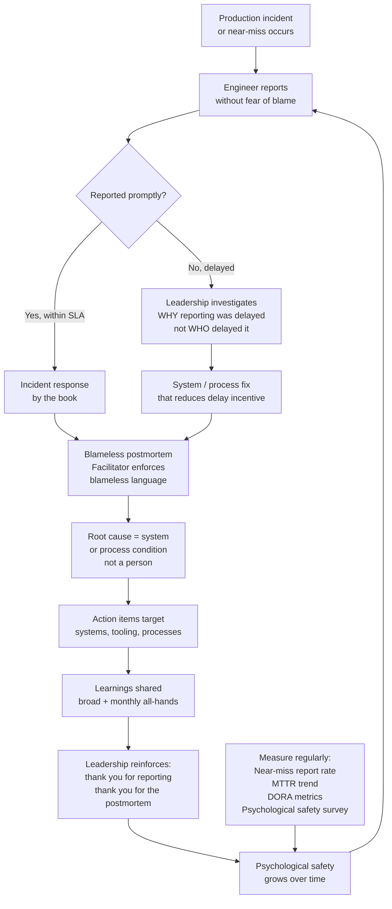

# Blameless Culture

Status: Draft | Last Reviewed: 2026-05-09 | Owner: @sre-lead
Catalog ID: BP-011 | Radii
Tier Applicability: T0, T1, T2, T3

## Problem Statement

- When engineers fear blame, they conceal near-misses and delay incident reporting. In banking, a delayed report of a payment anomaly is not a team-management issue — it is a compliance failure. SBV Circular 09/2020 and Decree 13/2023 Art. 26 impose explicit timelines on breach notification; a culture that discourages reporting makes those timelines impossible to meet.
- Blame-oriented postmortems produce shallow root-cause analysis. Engineers describe events defensively, omitting context. The resulting action items fix the symptom, not the system — and the incident repeats.
- Fear of punishment suppresses the reporting of near-misses: the payment processing anomaly that was manually corrected before customers noticed, the config that almost went to production, the capacity limit that was 95% reached at 2am. These signals are the most valuable leading indicators a reliability team has. Suppressing them eliminates early warning.
- High-blame cultures increase engineer attrition. Losing a senior payment systems engineer takes 6–12 months to recover; the cost of that gap in operational knowledge outweighs the cost of any single incident they might have contributed to.
- Without psychological safety, engineers do not surface architectural risks during design reviews. Risks go undiscussed, are not mitigated, and emerge as production incidents.
- DORA research demonstrates that high-performing engineering organisations have significantly higher incident reporting rates than low performers — not lower. Blameless culture is a leading indicator of reliability, not a lagging one.

## Context

Banking operations teams under high-pressure environments tend toward blame when incidents occur, suppressing near-miss reporting and creating silent risks that accumulate until a major outage forces them into the open. Psychological safety — where engineers can report errors without career consequences — is the foundation for learning from failures before they become systemic. SBV Circular 09/2020 and Decree 13/2023 impose explicit timelines on breach notification; a culture that discourages reporting makes those timelines structurally impossible to meet. DORA research (2022, 2023) demonstrates that high-performing engineering organisations have significantly higher incident reporting rates than low performers, confirming that blameless culture is a leading indicator of reliability.

## Solution / Practice Description

Blameless culture is an organisational practice — reinforced by leadership behaviour, process design, and measurable safety metrics — in which production incidents and near-misses are treated as system failures to be understood and fixed, not as individual errors to be punished, creating the psychological safety that makes reliable systems possible.



## Implementation Guidelines

### 1. Just Culture Framework — The Line Between Blameless and Accountable

Blameless does not mean consequence-free. The Just Culture framework distinguishes:

| Behaviour | Response |
|---|---|
| Human error (slip, mistake, misapplication of knowledge) | Console — system improvement; no individual consequence |
| At-risk behaviour (shortcut taken because incentives misalign) | Coach — change the incentive or process that made the shortcut attractive |
| Reckless behaviour (knowingly disregarding clear risk) | Remediate — this is the narrow space where individual accountability applies |

The critical insight: most banking production incidents fall in the first two categories. The task is to identify which, and fix the system condition. Jumping to the third category without evidence is punitive, not just.

Facilitators of postmortems must be trained on this framework. When a discussion drifts toward naming a person as the root cause, the facilitator asks: "What system condition, process gap, or incentive misalignment made this outcome possible?"

### 2. Leadership Behaviours That Build or Destroy Blameless Culture

Culture is not built by policy documents — it is built by what leaders do after incidents:

**Behaviours that build blameless culture:**
- After a T0 incident: "Thank you for the transparent postmortem. What do we need to change so this cannot happen again?"
- Attending the monthly postmortem all-hands summary and asking questions about systemic fixes, not about who was on shift.
- Publicly recognising engineers who report near-misses: "This caught a potential T0 incident four weeks early. This is exactly the behaviour we want."
- When a new engineer makes a mistake: "That config gap exists because we didn't have validation. Let's fix the deployment pipeline."

**Behaviours that destroy blameless culture:**
- Referencing a postmortem in a performance review (explicitly prohibited in Techcombank SRE policy).
- Asking "who approved this change?" in an incident Slack channel before the incident is resolved.
- Using incident frequency as a negative metric for an individual without examining the reporting rate (higher reporting = better, not worse).
- "Why didn't anyone catch this?" directed at a person, not at the review process.

Managers and leads must receive explicit training on this distinction annually, delivered by the SRE lead or an external facilitator.

### 3. Psychological Safety Measurement

Psychological safety is not assumed — it is measured. Techcombank SRE uses two instruments:

**Quarterly psychological safety survey (5 questions, anonymous, Google Form):**

```
Rate each from 1 (strongly disagree) to 5 (strongly agree):
1. I can report a near-miss without fear of negative consequences.
2. I can raise a concern about a production system in a design review and be heard.
3. When something goes wrong, our team focuses on fixing systems, not finding fault.
4. I would feel comfortable telling my manager I made a mistake.
5. Postmortem action items in my area are addressed, not ignored.
```

Target: average >= 4.0 across all five questions. Below 3.5 on any question triggers a leadership review and a targeted intervention.

**Leading indicator metrics tracked in Grafana:**

```yaml
# Psychological safety proxy metrics
metrics:
  near_miss_reports_per_month:
    description: "Count of near-miss reports submitted via #near-misses Slack channel"
    target: "> 3 per month per team"
    signal: "Low count = suppression; sudden drop = cultural regression"

  postmortem_completion_rate:
    description: "% of qualifying incidents with postmortem published within SLA"
    target: ">= 95%"
    signal: "Below target = process friction or avoidance"

  action_item_closure_rate:
    description: "% of postmortem action items closed by due date"
    target: ">= 80% on-time"
    signal: "Low = action items not taken seriously; signals low accountability without blame"
```

### 4. Near-Miss Reporting Process

Near-miss reports are first-class artefacts, not afterthoughts. Every Techcombank engineer can report a near-miss via:

1. **Slack channel `#near-misses`** — low friction, no form, just a message. SRE lead triages within 24 hours.
2. **Confluence near-miss log** — for near-misses that warrant structured documentation (used when the near-miss reveals a systemic gap).

Near-miss report template:

```markdown
## Near-Miss Report

**Date**: YYYY-MM-DD
**Reporter**: [anonymous option available]
**Service affected**: [service name]
**What almost happened**: [1–3 sentences]
**What prevented it**: [1–3 sentences]
**What would have made it worse**: [optional]
**Suggested improvement**: [optional]
```

Near-miss reports are reviewed in the monthly SRE team meeting. High-value near-misses are shared (anonymised) at the engineering all-hands as "what our early warning system caught."

### 5. Integration with Postmortem and Runbook Processes

Blameless culture is not a standalone practice — it is the operating environment for:

- **Postmortems ([BP-010](incident-postmortem.md))**: every postmortem explicitly states "This postmortem is blameless. Individuals are not causes." The facilitator enforces this. Language is reviewed before publication.
- **Runbooks ([BP-009](runbook-authoring.md))**: runbooks that assign blame ("if the engineer had run the correct command") are rewritten to describe system controls that should have prevented the error.
- **Chaos engineering ([BP-005](chaos-engineering.md))**: engineers propose chaos hypotheses without fear that a failed drill reflects on them personally. A drill that finds a fragility is a success.

### 6. DORA Metrics as Blameless Culture Indicators

DORA metrics (tracked in Grafana, sourced from GitLab CI and PagerDuty) are monitored not just as engineering performance metrics but as cultural health indicators:

| DORA Metric | Blameless culture signal |
|---|---|
| Deployment frequency | Low frequency in a capable team may indicate fear of deploying (fear of causing an incident) |
| Change failure rate | Tracked without attribution to individuals; used to identify process gaps in testing or review |
| MTTR (Mean Time to Restore) | Improving MTTR over time indicates growing blameless culture — engineers act faster when not paralysed by fear of blame |
| Change lead time | Delays in review stages examined as process friction, not individual slowness |

DORA metrics are reviewed in the quarterly engineering health check, alongside the psychological safety survey results.

## When to Apply

Always — this is a cultural baseline, not a feature:

- Conducting any incident postmortem for any tier.
- Reviewing near-miss reports.
- Running retrospectives on chaos engineering drills.
- Onboarding engineers to the on-call rotation — blameless culture orientation is part of the onboarding checklist.
- Leadership training and manager calibration sessions.

## When NOT to Apply

Do NOT confuse blameless with:

- Absence of accountability — reckless behaviour has consequences; blameless culture is precise about the distinction.
- Absence of urgency — reporting near-misses without fixing them is not blameless culture; it is noise. Every near-miss triggers at minimum a triage decision.
- Protecting poor performance — blameless culture focuses on systems; it does not exempt individuals from performance management on dimensions unrelated to incident response.

## Variants & Trade-offs

| Variant | When | Trade-off |
|---|---|---|
| **Full Just Culture framework (default)** | T0/T1 — high-stakes, regulated services | Maximum psychological safety; requires leadership training; hard to sustain without executive buy-in |
| **Blameless postmortems only** | Teams new to blameless culture | Low adoption friction; limited to incident context; does not change near-miss reporting culture |
| **Anonymous reporting only** | High-blame legacy culture; transitional phase | Lowers barrier to reporting; does not build long-term psychological safety; can create distrust |
| **Learning reviews instead of postmortems** | Teams where "postmortem" language carries baggage | Same content, different framing; useful when the word "postmortem" triggers blame associations |

## NFR Acceptance Criteria

Measurable thresholds:

- Mean Time To Detect (MTTD) p50 < 5 min for T0 services (on-call response latency from alert fire to first action).
- Blameless post-mortem completed ≤ 72 h after every P1/P2 incident.
- Near-miss report rate ≥ 2 per team per quarter (leading indicator of psychological safety).
- Psychological safety survey average ≥ 4.0 / 5.0 across all five questions, measured quarterly.

```yaml
service_name: "[team]-blameless-culture-compliance"
tier: T0
acceptance_criteria:
  - id: BC-1
    description: >
      The quarterly psychological safety survey average is >= 4.0 across all five
      questions. Any question averaging < 3.5 triggers a leadership review within
      30 days.
    verification: >
      Survey results are published to the SRE lead within 5 days of quarter end.
      Grafana dashboard shows rolling 4-quarter trend. Leadership review meeting
      minutes exist for any quarter where a question averaged < 3.5.

  - id: BC-2
    description: >
      The near-miss reporting rate is >= 3 reports per team per month. A sustained
      drop below 1 report per team per month for two consecutive months triggers a
      cultural health review.
    verification: >
      Count of #near-misses Slack messages per team per month, tracked in Grafana.
      No two-month window with < 1 report per team without a documented leadership review.

  - id: BC-3
    description: >
      Zero postmortems contain individual names as root causes or contributing factors.
      All postmortem documents use systems/processes as subjects of root cause statements.
    verification: >
      SRE lead conducts a quarterly audit of all postmortems published in the prior
      quarter. Any postmortem failing the blameless language check is corrected within
      5 business days and the author receives coaching.

  - id: BC-4
    description: >
      All engineers in the on-call rotation have completed blameless culture orientation
      within 30 days of joining the rotation, and all team leads have completed Just
      Culture training within 90 days of assuming a lead role.
    verification: >
      Training completion records in the HR system. On-call rotation roster cross-checked
      against training completion list quarterly.
```

## Compliance Mapping

| Layer | Reference | Section/Control | How |
|---|---|---|---|
| Ring 0 | Google SRE Book Chapter 15 (Postmortem Culture) | "The goal is to understand how an accident could happen, not to find a person to blame" | Blameless postmortem language policy and facilitator training directly implement the SRE postmortem culture principles |
| Ring 0 | NIST SP 800-55 Rev 1 (Security Metrics) | Measurement of security program effectiveness | Psychological safety survey and near-miss reporting rate are leading indicators of the security reporting culture |
| Ring 0 | DORA State of DevOps Research | Psychological safety as a key predictor of software delivery performance | DORA metrics tracked as cultural health indicators, reviewed quarterly |
| Ring 1 | BCBS 230 Principle 1 ⚠️ (working summary — pending PDF fetch) | Board and senior management set the governance and risk culture tone | Leadership behaviour guidelines and the prohibition on referencing postmortems in performance reviews implement the governance culture requirement |
| Ring 2 | SBV Circular 09/2020 §IV; Decree 13/2023 | Operational risk culture and incident reporting obligations ⚠️ (working summary — pending Legal review) | Blameless culture directly enables timely incident and breach reporting required by the circular and Decree 13 Art. 26 72-hour notification obligation, by removing the disincentive to report |

## Cost / FinOps Notes

| Item | Cost driver | Guidance |
|---|---|---|
| Just Culture / blameless training | External facilitator or internal SRE lead time | Run annually for leads; blameless orientation in on-call onboarding costs ~1 hour |
| Psychological safety survey tooling | Google Forms (free) or Culture Amp ($) | Google Forms sufficient for teams < 50; Culture Amp adds benchmarking for larger orgs |
| Near-miss triage time | SRE lead reviews all reports within 24h | Budge 30 min/week for triage; most reports are quick decisions |
| DORA metric instrumentation | GitLab CI + PagerDuty integration | One-time setup; ongoing cost negligible |

**Cost of blame culture**: a single T0 incident where a near-miss was not reported (because the engineer feared consequences) that escalates to a customer-facing outage and SBV breach notification has a compliance cost and reputational cost that cannot be offset by any cultural shortcut.

## Threat Model Summary

- **Culture regression after leadership change (Tampering)**: a new manager with blame-oriented instincts overrides blameless postmortem language, inserting individual attribution into published documents. Mitigation: blameless policy is written into the SRE team charter; new managers complete Just Culture training within 90 days; psychological safety survey detects regression within a quarter.
- **Blameless used to avoid accountability (Elevation of Privilege)**: an engineer engages in genuinely reckless behaviour and references blameless culture as a shield to avoid the consequences that the Just Culture framework reserves for reckless acts. Mitigation: Just Culture framework provides a clear definition of reckless behaviour; the SRE lead and HR apply the framework consistently with documented evidence.
- **Near-miss report data reveals breach before official notification (Information Disclosure)**: a near-miss report submitted via the #near-misses Slack channel is publicly accessible and reveals a payment anomaly that has not yet been assessed for SBV notification requirements. Mitigation: #near-misses is a private channel accessible only to the SRE team and engineering leads; reports are triaged within 24 hours and assessed for regulatory notification obligations.
- **Spoofing psychological safety metrics**: a team artificially inflates near-miss report counts by submitting trivial noise reports, masking a genuine decline in real safety signals. Mitigation: SRE lead triages all near-miss reports and categorises them; the meaningful-report rate (categorised as `actioned` or `logged`) is the tracked metric, not the raw submission count.

## Operational Runbook (stub)

- **Onboarding**: new on-call engineers complete blameless orientation in their first week; link to training materials in `governance/culture/blameless-orientation.md`.
- **Quarterly survey**: SRE lead sends survey link in first week of each quarter; results reviewed in SRE team meeting; presented (aggregated) to engineering all-hands.
- **Near-miss triage**: SRE lead reviews `#near-misses` daily; labels each as `actioned`, `logged`, or `escalated`; monthly review of patterns.
- Alert: `BlamelessCultureRegressionDetected` — psychological safety survey average drops > 0.5 points in a single quarter or falls below 3.5 on any individual question; PagerDuty low-urgency to SRE lead; escalate to engineering director within 5 business days.
- Alert: `NearMissReportRateLow` — near-miss meaningful-report rate falls below 1 per team per month for two consecutive months; PagerDuty low-urgency to SRE lead; triggers cultural health review.
- **Postmortem language audit**: conducted by SRE lead in the first week of each quarter for the prior quarter's postmortems.

## Test Strategy (stub)

- **Survey validity**: cross-validate psychological safety survey results against near-miss reporting rate and MTTR trend. If survey scores are high but near-miss rate is low, the survey instrument is not capturing reality.
- **Postmortem language check**: automated Confluence search for individual names in postmortem root-cause sections (regex on postmortem template fields). Flag any matches for manual review.
- **Training completion audit**: quarterly cross-check of on-call rotation roster against HR training completion records. Gaps trigger automated Jira ticket to the team lead.

## Related Patterns / Best Practices

- [BP-010 Incident Postmortem](incident-postmortem.md) — postmortems are the primary process vehicle for blameless culture; the two are inseparable
- [BP-009 Runbook Authoring](runbook-authoring.md) — blameless language applies to runbooks too; runbooks that imply blame for incorrect execution are rewritten
- [BP-005 Chaos Engineering](chaos-engineering.md) — blameless culture enables engineers to propose and run chaos experiments without fear that a drill that finds fragility reflects poorly on them
- [BP-006 Capacity Planning](capacity-planning.md) — engineers must feel safe reporting approaching capacity limits as near-misses, not only after breaches

## References

- Google SRE Book Chapter 15 (Postmortem Culture: Learning from Failure)
- "Just Culture: Balancing Safety and Accountability" — Sidney Dekker
- DORA State of DevOps Report (2022, 2023) — psychological safety findings
- Amy Edmondson, "The Fearless Organization" — psychological safety research
- NIST SP 800-55 Rev 1 (Security Metrics Guide)
- Etsy Engineering Blog — "Blameless PostMortems and a Just Culture" (John Allspaw)

---

**Key Takeaway**: Blameless culture is not a soft practice — at Techcombank it is the compliance mechanism that enables engineers to report payment anomalies before they become SBV breach notifications; it must be actively maintained through leadership behaviour, measurement, and the consistent application of Just Culture, not assumed to exist because a policy document says so.
