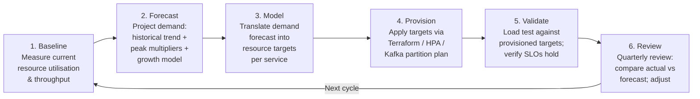

# Capacity Planning

Status: Draft | Last Reviewed: 2026-05-09 | Owner: @sre-lead
Catalog ID: BP-006 | Radii
Tier Applicability: T0, T1, T2

## Problem Statement

- Techcombank's digital banking platform experiences extreme, predictable demand spikes — Tết (Lunar New Year) payment volumes reach 3–5× normal, and monthly salary disbursement days create sharp intraday surges. Without systematic capacity planning, these events breach SLOs and exhaust NAPAS per-second transaction quotas precisely when customer trust is most fragile.
- T24 Temenos is licensed per concurrent session. Underprovisioning concurrent sessions starves new logins during peak hours; overprovisioning wastes six-figure licensing budget. Neither outcome is acceptable.
- Kafka partition counts and consumer group throughput are set at cluster creation and are expensive to change at runtime. Partition starvation during peak events causes consumer lag that propagates into real-time payment confirmation delays.
- Growth in digital banking adoption is nonlinear; a purely reactive approach — provisioning after a breach — is incompatible with a platform serving T0 payment flows where five minutes of unavailability carries regulatory reporting obligations.
- Cloud resource waste accumulates silently. Without modelled targets, teams overprovision "to be safe," and that cost compounds across dozens of microservices across two AWS regions.
- Capacity decisions made without a documented forecast model are invisible to auditors and cannot satisfy BCBS 239 timeliness requirements for risk data reporting that depends on infrastructure availability.

## Solution / Practice Description

Capacity planning is the six-phase discipline of establishing baselines, modelling demand, translating models into provisioning targets, validating those targets against live traffic, and reviewing the cycle quarterly — producing documented, auditable capacity forecasts that keep every service within its SLO while respecting external quotas (NAPAS TPS, T24 sessions) and controlling cloud spend.



## Implementation Guidelines

### 1. Establish Baselines with Prometheus and Grafana

Capture the four golden-signal dimensions (latency, traffic, errors, saturation) for every T0/T1 service at daily, weekly, and annual granularity. Use 13 months of data to capture one full Tết cycle. Prometheus recording rules reduce cardinality cost:

```yaml
# prometheus/recording-rules/capacity-baseline.yml
groups:
  - name: capacity_baseline
    interval: 5m
    rules:
      - record: job:http_requests:rate5m
        expr: sum by (job, route) (rate(http_requests_total[5m]))
      - record: job:jvm_memory_used:avg
        expr: avg by (job) (jvm_memory_used_bytes{area="heap"})
      - record: job:kafka_consumer_lag:max
        expr: max by (job, topic, partition) (kafka_consumer_group_lag)
```

Dashboards must show P50/P95/P99 latency, request rate, error rate, and saturation (CPU/memory/connection pool) on the same time axis, with a "same period last year" overlay to expose seasonal shape.

### 2. Demand Forecasting — Seasonal and Growth Models

Combine three inputs into an 18-month rolling forecast:

| Input | Method | Tooling |
|---|---|---|
| Historical trend | Linear / exponential regression on 13-month baseline | Python (pandas, scikit-learn), exported to Confluence |
| Seasonal multiplier | Tết = 4×, salary day = 2×, end of quarter = 1.5× | Validated against prior-year actuals |
| User growth | Digital banking MAU growth rate (sourced from Product) | Reviewed quarterly with product owner |

The composite forecast is: `target_capacity = baseline × growth_factor × peak_multiplier × safety_margin (1.25)`.

Output is a capacity forecast table committed to `governance/capacity/forecasts/YYYY-QQ.md` and presented at the quarterly Capacity Review.

### 3. NAPAS Quota and T24 Session Planning

NAPAS enforces a per-second transaction quota contractually. Every real-time payment path must be modelled against this quota:

```yaml
# governance/capacity/napas-quota.yml
napas_quota:
  transactions_per_second: 500          # contractual ceiling
  alerting_threshold_pct: 80            # alert at 400 TPS — head-room before breach
  peak_forecast_tps: 380                # Tet peak model — within 80% threshold
  actions_if_exceeded:
    - throttle_non_critical_retry_queue
    - escalate_to_napas_liaison
    - activate_payment_queueing_mode    # deferred settlement fallback
```

T24 session capacity is tracked separately. Current licensed sessions, peak observed concurrent sessions, and forecast sessions for the next quarter are maintained in `governance/capacity/t24-sessions.yml`. The SRE lead reviews this monthly; a 90% utilisation threshold triggers a licensing procurement request.

### 4. Kafka Partition and Retention Planning

Partition count drives maximum parallelism; it cannot be reduced after creation without partition reassignment downtime. Plan ahead using the formula:

```
required_partitions = ceil(peak_throughput_MBps / per_partition_throughput_MBps)
                    × replication_redundancy_factor
```

Retention storage must be sized for: `retention_GB = throughput_MBps × retention_seconds / 1024`. For the payment-events topic:

```yaml
# kafka/topic-configs/payment-events.yml
topic: payment-events
partitions: 48                 # supports 96 MB/s at 2 MB/s per partition
replication_factor: 3
retention.ms: 604800000        # 7 days
retention.bytes: 536870912000  # 500 GB per partition cap
segment.bytes: 1073741824      # 1 GB segments for efficient compaction
```

Partition count must be recalculated at each quarterly review against the current throughput baseline.

### 5. Infrastructure Provisioning via Terraform and HPA

Capacity targets are codified, not ad-hoc. EKS workloads use Horizontal Pod Autoscaler with explicit `minReplicas` derived from the capacity model:

```yaml
# k8s/hpa/payment-auth-hpa.yaml
apiVersion: autoscaling/v2
kind: HorizontalPodAutoscaler
metadata:
  name: payment-auth
  namespace: payment-auth
spec:
  scaleTargetRef:
    apiVersion: apps/v1
    kind: Deployment
    name: payment-auth
  minReplicas: 6          # capacity model: sustains baseline load + 1 AZ loss
  maxReplicas: 30         # capacity model: Tet peak × 1.25 safety margin
  metrics:
    - type: Resource
      resource:
        name: cpu
        target:
          type: Utilization
          averageUtilization: 60   # scale before saturation; 60% leaves headroom
```

RDS Aurora read-replica count and ElastiCache node size are tracked in `terraform/modules/capacity-managed/variables.tf` with a mandatory comment referencing the quarterly forecast.

### 6. Quarterly Capacity Review Process

A structured review is conducted within the first two weeks of each quarter:

1. Pull actual utilisation from Prometheus for the prior quarter.
2. Compare actuals against the forecast made 6 months prior; document variance.
3. Update the 18-month forecast with new MAU data and confirmed peak dates.
4. Revise HPA configs, Kafka partition plans, and T24 session targets.
5. Present findings at the Capacity Review Board (SRE lead, Product, Finance, Procurement).
6. Publish the updated forecast to `governance/capacity/forecasts/` and link from `.bmad/handoff-log.md`.

## When to Apply / When NOT to Apply

**Apply when:**
- Onboarding any T0 or T1 service — a capacity baseline is a Day 1 requirement.
- Preparing for a known peak event (Tết, salary day, product launch, marketing campaign).
- Observing > 70% sustained utilisation on any resource dimension for two consecutive weeks.
- Planning a Kafka topic that will carry > 10 MB/s throughput.
- Renewing a T24 license or NAPAS quota negotiation cycle.

**Do NOT apply when:**
- T3 internal tooling with < 100 users and no SLO — lightweight right-sizing is sufficient.
- The service is being decommissioned within the forecast horizon.
- The capacity question is about a single batch job that runs once a month — use a dedicated job-sizing analysis instead of the full six-phase cycle.

## Variants & Trade-offs

| Variant | When | Trade-off |
|---|---|---|
| **Manual quarterly review only** | T2 services, stable load | Low overhead; misses intra-quarter spikes |
| **HPA-only reactive scaling** | T2/T3, unpredictable-but-bounded load | Responsive; no forecast model; can saturate before scale-out completes |
| **Full six-phase cycle (default for T0/T1)** | T0/T1, seasonal peaks, quota-constrained | Most accurate; highest process overhead |
| **Predictive autoscaling (KEDA + Prometheus)** | T0, when Tết date is known | Pre-scales before traffic arrives; requires well-tuned metrics; complex to debug |

## NFR Acceptance Criteria

```yaml
service_name: "[service]-capacity-planning-compliance"
tier: T0
acceptance_criteria:
  - id: CP-1
    description: >
      A documented capacity forecast exists for the next 18 months, updated at least
      quarterly, covering CPU, memory, storage, network, and NAPAS TPS quota utilisation.
    verification: >
      governance/capacity/forecasts/YYYY-QQ.md exists and was committed within the last
      90 days. Prometheus dashboard shows forecast vs actual overlay for the prior quarter.

  - id: CP-2
    description: >
      HPA minReplicas for every T0 deployment is derived from the current capacity model
      and can sustain baseline load plus the loss of one Availability Zone.
    verification: >
      kubectl get hpa -n <namespace> shows minReplicas >= model minimum.
      Load test at baseline × 1.5 passes with P99 latency within SLO.

  - id: CP-3
    description: >
      NAPAS TPS utilisation alert fires at 80% of the contractual quota ceiling.
      A documented throttling runbook exists and is linked from the alert.
    verification: >
      Prometheus alert rule napas_tps_utilisation_high is present in alerting config.
      Alert fires in a test environment when simulated TPS exceeds 80% threshold.

  - id: CP-4
    description: >
      T24 concurrent session utilisation is monitored. When utilisation exceeds 90%,
      a Jira procurement ticket is automatically created within 24 hours.
    verification: >
      Grafana panel shows real-time T24 session count vs licensed ceiling.
      Test by simulating 91% utilisation; confirm Jira ticket is created.
```

## Compliance Mapping

| Layer | Reference | Section/Control | How |
|---|---|---|---|
| Ring 0 | AWS Well-Architected Framework — Performance Efficiency Pillar | PERF 1: Selection, PERF 4: Monitoring | Capacity baselines, HPA targets, and quarterly reviews implement the Well-Architected performance efficiency practices |
| Ring 0 | Google SRE Book Chapter 11 (Being On-Call) and Chapter 18 (Software Engineering in SRE) | Capacity planning as an SRE responsibility | Six-phase process and quarterly review align with SRE capacity planning discipline |
| Ring 0 | NIST SP 800-53 SA-8 (Security Engineering Principles) | System capacity sizing | Capacity model documents resource sizing decisions with auditable rationale |
| Ring 1 | BCBS 230 Principle 2 ⚠️ (working summary — pending PDF fetch) | Operational risk data infrastructure must be sufficient for peak demand | Capacity forecasts ensure infrastructure can sustain risk data flows during peak periods |
| Ring 1 | BCBS 239 §3 Timeliness | Risk data must be available on demand, especially during stress | Proven capacity headroom ensures risk reporting pipelines are not starved during Tết peak |
| Ring 2 | SBV Circular 09/2020 §IV.2 ⚠️ (working summary — pending Legal review) | Operational continuity resourcing | Quarterly capacity review and documented NAPAS quota management evidence operational continuity planning |

## Cost / FinOps Notes

| Item | Cost driver | Guidance |
|---|---|---|
| EC2 / EKS node over-provisioning | Safety margin set too high | Use 1.25× safety margin; revisit if consistently < 40% utilisation |
| T24 session over-licensing | Licence count not reviewed | Monthly monitoring + 90% threshold alert avoids both waste and shortage |
| Kafka storage retention | Retention.ms set to "safe" large values | Set retention to minimum compliant value; use tiered storage for archive |
| Predictive autoscaling engineering | KEDA integration complexity | ROI only for T0 services with well-known peak dates (Tết); not worth it for T2+ |
| Quarterly review engineering time | 2–3 person-days per cycle | Amortised across 5–10 services; invest once in tooling (recording rules, Grafana templates) |

**Cost of under-planning**: A Tết breach of NAPAS quota causes real-time payment failures across all Techcombank customers. The reputational and regulatory cost of a 30-minute T0 outage vastly exceeds a year of capacity planning engineering investment.

## Threat Model Summary

- **Forecast drift**: the forecast is accurate at creation but not updated as product growth accelerates. Mitigation: quarterly mandatory review with product owner sign-off on growth figures.
- **NAPAS quota breach**: burst traffic exceeds TPS quota, causing payment rejections. Mitigation: 80% alerting threshold, automated throttling of non-critical retry queues, pre-negotiated quota uplift for Tết window.
- **T24 session starvation**: concurrent users exceed licensed sessions; new logins rejected. Mitigation: 90% utilisation alert, 30-day procurement lead time buffer, session pooling for internal automation.
- **Kafka consumer lag cascade**: under-partitioned topic cannot absorb peak throughput; lag grows until messages expire. Mitigation: partition plan reviewed quarterly; lag alert at 60-second threshold triggers consumer group scale-out.
- **Region capacity asymmetry**: active-active failover sends all traffic to Region B, which was sized for only 60% of total traffic. Mitigation: both regions provisioned to 100% capacity target; validated annually in chaos engineering game-day ([BP-005](chaos-engineering.md)).

## Operational Runbook (stub)

- **Quarterly review trigger**: calendar invite recurring on first Monday of each quarter; SRE lead owns.
- **Alert: `CapacityForecastStale`** — forecast file older than 90 days; PagerDuty low-urgency.
- **Alert: `NapasTpsUtilisationHigh`** — TPS > 80% of quota; PagerDuty high-urgency; runbook: `runbooks/napas-tps-throttle.md`.
- **Alert: `T24SessionUtilisationCritical`** — concurrent sessions > 90% of license; PagerDuty high-urgency; runbook: `runbooks/t24-session-exhaustion.md`.
- **Alert: `KafkaConsumerLagHigh`** — consumer lag > 60 s on payment-events; PagerDuty high-urgency; runbook: `runbooks/kafka-consumer-lag.md`.
- **Forecast publication**: committed to `governance/capacity/forecasts/YYYY-QQ.md`; Confluence page `Capacity Planning > Forecasts` auto-linked via GitLab webhook.

## Test Strategy (stub)

- **Load testing**: quarterly load test against provisioned targets using k6 or Gatling. Test profiles must include Tết peak multiplier (4×) and salary-day multiplier (2×).
- **Chaos integration**: capacity validation is a prerequisite for chaos engineering drills ([BP-005](chaos-engineering.md)) — drill at provisioned minReplicas, not at current running replicas.
- **Forecast accuracy test**: after each quarter, run a retrospective comparison of forecast vs actual. If variance > 20%, the forecasting model is updated.
- **NAPAS quota simulation**: staging environment test that artificially caps TPS at 80% of quota to verify throttling logic fires and non-critical queues pause.
- **T24 session boundary test**: simulate 91% concurrent session utilisation in staging to confirm the Jira procurement auto-creation trigger fires within the 24-hour window.

## Related Patterns / Best Practices

- [BP-005 Chaos Engineering](chaos-engineering.md) — drills validate that provisioned capacity actually sustains the declared SLO under failure
- [BP-007 Golden Signals (SRE)](golden-signals-sre.md) — golden signal dashboards are the observability layer that feeds baseline measurement
- [BP-010 Incident Postmortem](incident-postmortem.md) — capacity-related incidents generate action items that feed back into the forecast model
- [REF-001 Multi-Region Active-Active](../reference-architectures/multi-region-active-active.md) — capacity must be provisioned symmetrically across both regions for failover to be safe

## References

- AWS Well-Architected Framework — Performance Efficiency Pillar
- Google SRE Book Chapter 11, Chapter 18 (Capacity Planning)
- BCBS 239 — Principles for Effective Risk Data Aggregation and Risk Reporting
- Prometheus recording rules documentation — prometheus.io
- KEDA (Kubernetes Event-Driven Autoscaling) — keda.sh
- Kafka partition sizing guide — Confluent documentation

---

**Key Takeaway**: Capacity planning at Techcombank is not optional infrastructure housekeeping — it is the mechanism by which the platform guarantees its SLOs survive Tết, respects the NAPAS TPS quota, and avoids T24 session exhaustion; the six-phase cycle must run quarterly without exception for all T0 and T1 services.
