# CI/CD Pipeline Design Best Practice

Status: Approved | Last Reviewed: 2026-03-07 | Owner: @ea-board
Catalog ID: BP-001 | Radii
Tier Applicability: T0, T1, T2, T3

## Problem Statement

Manual deployments are slow and error-prone:
- Code changes sit in branches for weeks
- Deployment day is stressful (unknown what's in the release)
- Rollbacks are difficult and risky
- Quality gates are inconsistent
- Security vulnerabilities not caught early

## Solution

Implement automated CI/CD pipelines. Every commit is built, tested, and security-scanned automatically. Deployments are frequent, consistent, and reversible.

## Pipeline Stages

```mermaid
flowchart LR
    Git([Git Push / MR]) --> Lint[1 Lint\ncheckstyle · PMD · SpotBugs]
    Lint --> Build[2 Build\nmvn clean package]
    Build --> Test[3 Tests\nunit + integration]
    Test --> Sec[4 Security Scan\nSAST · DAST · dependency-check\ncontainer scan]
    Sec --> Cov[5 Coverage Gate\n≥ 80% required]
    Cov --> Artifact[6 Build + Push Artifact\nDocker → registry.techcombank.com]
    Artifact --> Dev[7 Deploy Dev\nautomatic]
    Dev --> Stg[8 Deploy Staging\nauto or manual gate]
    Stg --> Prod[9 Deploy Prod\nmanual approval required]
    Prod --> Live([Service Live in Production])

    style Git fill:#2050a0,color:#fff
    style Live fill:#2a8d4f,color:#fff
    style Sec fill:#fee,stroke:#c00
    style Prod fill:#fff5d8,stroke:#c08c00
```



## GitLab CI/CD Implementation

```yaml
# .gitlab-ci.yml
stages:
  - lint
  - build
  - test
  - security
  - coverage
  - artifact
  - deploy-dev
  - deploy-staging
  - deploy-prod

variables:
  REGISTRY: registry.techcombank.com
  IMAGE_NAME: $REGISTRY/order-service
  IMAGE_TAG: $CI_COMMIT_SHA
  DOCKER_DRIVER: overlay2
  DOCKER_TLS_CERTDIR: ""

# ========== LINT ==========
code-quality:
  stage: lint
  image: maven:3.8-openjdk-17
  script:
    - mvn checkstyle:check
    - mvn pmd:check
    - mvn spotbugs:check
  allow_failure: false
  only:
    - branches
    - merge_requests

# ========== BUILD ==========
maven-build:
  stage: build
  image: maven:3.8-openjdk-17
  script:
    - mvn clean package -DskipTests
  artifacts:
    paths:
      - target/*.jar
    expire_in: 1 day
  cache:
    paths:
      - .m2/repository/

# ========== TEST ==========
unit-tests:
  stage: test
  image: maven:3.8-openjdk-17
  script:
    - mvn test
  coverage: '/Coverage: \d+\.\d+%/'
  artifacts:
    reports:
      junit: target/surefire-reports/TEST-*.xml
      coverage_report:
        coverage_format: cobertura
        path: target/site/cobertura/coverage.xml
  only:
    - branches
    - merge_requests

integration-tests:
  stage: test
  image: maven:3.8-openjdk-17
  services:
    - postgres:14
    - redis:latest
    - testcontainers  # For container-based tests
  variables:
    POSTGRES_DB: test_db
    POSTGRES_USER: test
    POSTGRES_PASSWORD: test
  script:
    - mvn verify -Dgroups=integration
  artifacts:
    reports:
      junit: target/failsafe-reports/TEST-*.xml
  only:
    - merge_requests

# ========== SECURITY ==========
sast-scan:
  stage: security
  image: sonarsource/sonar-scanner-cli:latest
  script:
    - sonar-scanner
      -Dsonar.projectKey=order-service
      -Dsonar.host.url=https://sonarqube.techcombank.com
      -Dsonar.login=$SONARQUBE_TOKEN
  allow_failure: false
  only:
    - merge_requests
    - main
    - develop

dependency-check:
  stage: security
  image: owasp/dependency-check:latest
  script:
    - dependency-check.sh --scan . --format JSON --out reports
  artifacts:
    paths:
      - reports/
    expire_in: 30 days
  allow_failure: false
  only:
    - merge_requests
    - main

# ========== CODE COVERAGE ==========
coverage-report:
  stage: coverage
  image: maven:3.8-openjdk-17
  script:
    - mvn jacoco:report
    - |
      COVERAGE=$(mvn jacoco:report -q -DdataFile=target/jacoco.exec \
        -o | grep -oP 'Total.*?\K[0-9.]+' | head -1)
      if [ $(echo "$COVERAGE < 80" | bc) -eq 1 ]; then
        echo "Code coverage is ${COVERAGE}%, below 80% threshold"
        exit 1
      fi
  coverage: '/^Total.*?([0-9.]+)%/'
  only:
    - merge_requests

# ========== BUILD ARTIFACT ==========
build-docker:
  stage: artifact
  image: docker:latest
  services:
    - docker:dind
  script:
    - docker build -t $IMAGE_NAME:$IMAGE_TAG -t $IMAGE_NAME:latest .
    - docker login -u $REGISTRY_USER -p $REGISTRY_PASSWORD $REGISTRY
    - docker push $IMAGE_NAME:$IMAGE_TAG
    - docker push $IMAGE_NAME:latest
  only:
    - main
    - develop
    - tags

# ========== DEPLOY TO DEV ==========
deploy-dev:
  stage: deploy-dev
  image: bitnami/kubectl:latest
  script:
    - kubectl config use-context order-service/k8s-dev
    - helm upgrade --install order-service ./helm/order-service
        --namespace dev
        --values helm/values-dev.yaml
        --set image.tag=$IMAGE_TAG
        --wait
    - kubectl rollout status deployment/order-service -n dev
  environment:
    name: dev
    kubernetes:
      namespace: dev
    url: https://dev.order-service.techcombank.com
    deployment_tier: development
  only:
    - develop
  when: automatic

# ========== DEPLOY TO STAGING ==========
deploy-staging:
  stage: deploy-staging
  image: bitnami/kubectl:latest
  script:
    - kubectl config use-context order-service/k8s-staging
    - helm upgrade --install order-service ./helm/order-service
        --namespace staging
        --values helm/values-staging.yaml
        --set image.tag=$IMAGE_TAG
        --wait
    - kubectl rollout status deployment/order-service -n staging
  environment:
    name: staging
    kubernetes:
      namespace: staging
    url: https://staging.order-service.techcombank.com
    deployment_tier: staging
  only:
    - main
  when: automatic

# ========== SMOKE TESTS (POST DEPLOY) ==========
smoke-tests:
  stage: deploy-staging
  image: curlimages/curl:latest
  script:
    - |
      curl -s -f https://staging.order-service.techcombank.com/health \
        || exit 1
    - |
      curl -s -f https://staging.order-service.techcombank.com/metrics \
        || exit 1
  only:
    - main
  when: on_success

# ========== DEPLOY TO PROD ==========
deploy-prod:
  stage: deploy-prod
  image: bitnami/kubectl:latest
  script:
    - kubectl config use-context order-service/k8s-prod
    - helm upgrade --install order-service ./helm/order-service
        --namespace production
        --values helm/values-prod.yaml
        --set image.tag=$IMAGE_TAG
        --wait
        --timeout 10m
    - kubectl rollout status deployment/order-service -n production
  environment:
    name: production
    kubernetes:
      namespace: production
    url: https://order-service.techcombank.com
    deployment_tier: production
  only:
    - tags
    - main
  when: manual  # Requires manual approval
  needs:
    - build-docker
    - deploy-staging
    - smoke-tests

# ========== ROLLBACK ==========
rollback-prod:
  stage: deploy-prod
  image: bitnami/kubectl:latest
  script:
    - kubectl config use-context order-service/k8s-prod
    - kubectl rollout undo deployment/order-service -n production
    - kubectl rollout status deployment/order-service -n production
  when: manual
  only:
    - main
```

## Quality Gates

```yaml
# Quality Gate Thresholds (SonarQube)
Quality Gate:
  - Code Coverage: >= 80%
  - Duplicated Lines: < 3%
  - Bugs: 0 (blocking)
  - Critical Issues: 0 (blocking)
  - Major Issues: < 5
  - Code Smells: < 10
  - Security Hotspots: Review all (blocking)
  - OWASP Top 10: 0 (blocking)

Approval Process:
  - Merge Request requires:
    ✓ All tests passing
    ✓ Code coverage >= 80%
    ✓ SonarQube quality gate passed
    ✓ No merge conflicts
    ✓ Security scan completed (no critical vulnerabilities)
    ✓ 2 code reviews approved (for production changes)

  - Production deployment requires:
    ✓ All above quality gates
    ✓ Release notes documented
    ✓ Deployment plan reviewed
    ✓ On-call engineer acknowledged
    ✓ Rollback plan prepared
    ✓ Manual approval from tech lead
```

## Artifact Management

```yaml
# Artifact Retention Policy
Docker Images:
  - Development: Keep 10 latest
  - Staging: Keep 20 latest
  - Production: Keep 50 latest (for rollback)
  - Retention: 6 months

JAR Artifacts:
  - Development: 7 days
  - Production: 1 year

Test Reports:
  - Success: 7 days
  - Failure: 30 days
  - Coverage: 1 year

Build Logs:
  - Success: 30 days
  - Failure: 90 days
```

## Pipeline Best Practices

1. **Fast Feedback**
   - Lint/compile: < 2 minutes
   - Unit tests: < 5 minutes
   - Build artifact: < 2 minutes
   - Total pipeline: < 15 minutes for merge

2. **Parallel Execution**
   ```yaml
   # Run tests in parallel
   test_suite_a:
     stage: test
     script: mvn test -Dgroups=suite-a

   test_suite_b:
     stage: test
     script: mvn test -Dgroups=suite-b

   test_suite_c:
     stage: test
     script: mvn test -Dgroups=suite-c
   ```

3. **Caching**
   ```yaml
   cache:
     paths:
       - .m2/repository/           # Maven cache
       - node_modules/             # NPM cache
       - .gradle/                  # Gradle cache
     key: "${CI_COMMIT_REF_SLUG}"  # Per branch
   ```

4. **Artifact Management**
   - Keep only necessary artifacts
   - Set expiration times
   - Don't cache large files

5. **Error Handling**
   ```yaml
   allow_failure: false         # Block pipeline on failure
   retry:
     max: 2
     when:
       - runner_system_failure
       - stuck_or_timeout_failure
   ```

## Pipeline Metrics

```
Track:
  - Pipeline duration
  - Success rate
  - Stage duration breakdown
  - Failure reasons
  - Deployment frequency
  - Lead time for changes
  - Mean time to recovery (MTTR)
```

## References

- [GitLab CI/CD](https://docs.gitlab.com/ee/ci/)
- [Jenkins Best Practices](https://www.jenkins.io/doc/book/using-jenkins-agents/)
- [GitHub Actions](https://docs.github.com/en/actions)
- [Continuous Integration (Fowler)](https://martinfowler.com/articles/continuousIntegration.html)

---

**Key Takeaway**: Automate lint, build, test, security scan, and artifact build. Use quality gates to prevent regressions. Deploy to lower environments automatically; production deployments require manual approval.
