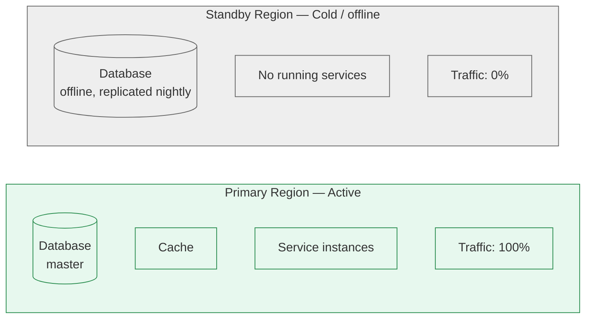
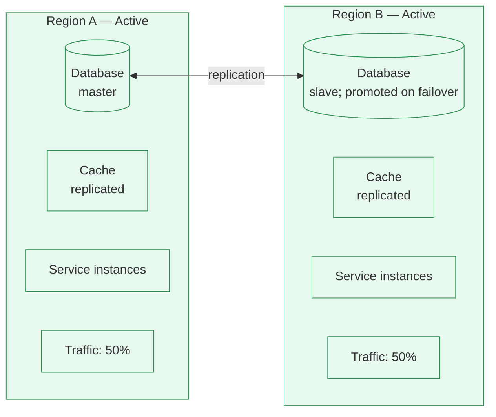
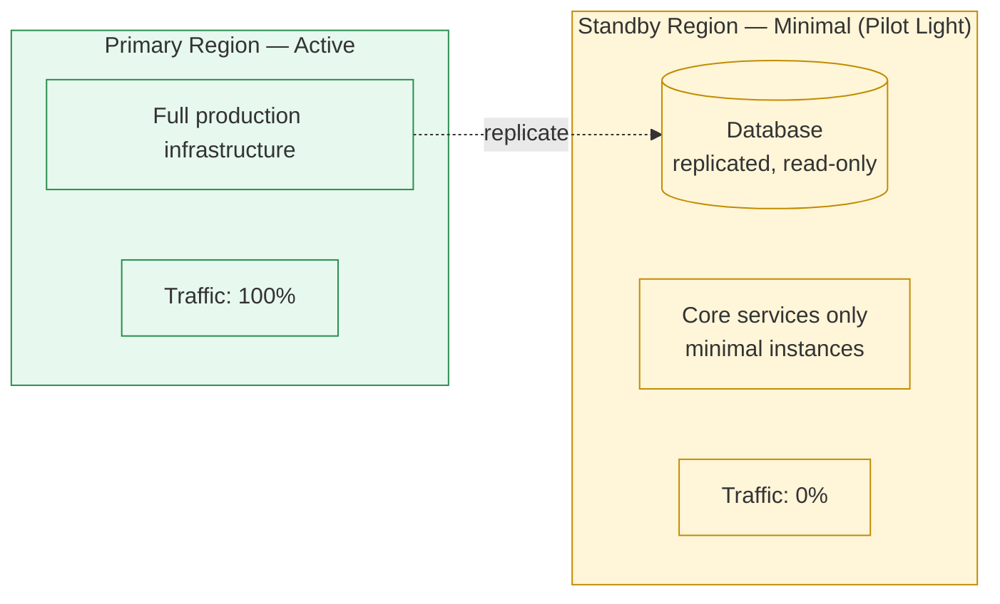

# Disaster Recovery Playbook Best Practice

Status: Approved | Last Reviewed: 2026-03-08 | Owner: @ea-board
Catalog ID: BP-002 | Radii
Tier Applicability: T0, T1

## Problem Statement

Without a DR plan, recovery from disasters is chaotic:
- Unknown what data is lost
- No documented recovery procedures
- Inconsistent backups
- Recovery takes hours when minutes matter
- Untested procedures fail during critical incident

## Solution

Document and test disaster recovery procedures. Define RTO/RPO. Practice regularly via DR drills.

## Key Definitions

**RTO** (Recovery Time Objective): Maximum acceptable downtime
- Example: "Restore payment system within 15 minutes"

**RPO** (Recovery Point Objective): Maximum acceptable data loss
- Example: "Lose no more than 1 hour of transactions"

**MTTR** (Mean Time To Recovery): Average time to recover from failure
- Target: MTTR < RTO

## RTO/RPO by Service Tier

| Service | RTO | RPO | Tier |
|---------|-----|-----|------|
| Payment Gateway | 5 min | 0 min (real-time) | Tier 1 (Critical) |
| Account Service | 15 min | 5 min | Tier 1 |
| Order Service | 1 hour | 30 min | Tier 2 (Important) |
| Reporting | 4 hours | 1 hour | Tier 3 (Non-critical) |

## Disaster Recovery Strategies

### 1. Active-Passive (Cold Standby)

**Setup**:



**Failover Process**:
1. Detect primary failure (health checks, manual alert)
2. Promote standby database (from backup)
3. Restore data from last backup
4. Start services in standby region
5. Switch DNS to standby
6. Estimated RTO: 30-60 minutes

**Cost**: Moderate (standby infrastructure idle)

### 2. Active-Active (Hot Standby)

**Setup**:



**Failover Process**:
1. Detect failure (automatic or manual)
2. Promote Region B database from slave to master
3. Update application configuration (use Region B)
4. Estimated RTO: 1-5 minutes

**Cost**: High (duplicate infrastructure always running)
**Benefit**: Zero or minimal data loss, instant recovery

### 3. Pilot Light

**Setup**:



**Failover Process**:
1. Detect failure
2. Scale up standby region services
3. Promote standby database to master
4. Update DNS/load balancer
5. Estimated RTO: 15-30 minutes

**Cost**: Moderate (small standby infrastructure)

## Backup & Recovery

### Database Backup Strategy

```yaml
# Backup Configuration
Database Backups:
  Full Backup:
    Frequency: Daily (1am UTC)
    Location: S3 multi-region
    Retention: 30 days
    Encryption: AES-256

  Incremental Backup:
    Frequency: Every 6 hours
    Retention: 7 days

  Transaction Log Backup:
    Frequency: Every 15 minutes
    Retention: 7 days
    Purpose: Point-in-time recovery

  Replication:
    Type: Synchronous (for payments)
    Type: Asynchronous (for orders)
    Regions: Primary + Standby + Tertiary
    Lag: < 1 second (payments), < 5 seconds (orders)
```

### Recovery Procedure

```bash
#!/bin/bash
# recover-database.sh

# 1. Stop application
kubectl scale deployment payment-service --replicas=0 -n production

# 2. Restore from backup
BACKUP_ID="backup-2026-03-08-0100"
aws s3 cp s3://backups/payment-db/$BACKUP_ID.sql.gz .
gunzip $BACKUP_ID.sql.gz
psql -h payment-db-restore -U admin -d payments < $BACKUP_ID.sql

# 3. Verify data integrity
psql -h payment-db-restore -U admin -d payments -c \
  "SELECT COUNT(*) as transaction_count FROM transactions;"

# 4. Promote standby to master (if needed)
pg_ctl promote -D /var/lib/postgresql/data

# 5. Verify replication
psql -h payment-db -U admin -d payments -c "SELECT * FROM pg_stat_replication;"

# 6. Restart application
kubectl scale deployment payment-service --replicas=3 -n production

# 7. Monitor
kubectl logs -f deployment/payment-service -n production
```

## Disaster Recovery Plan Document

**Payment Service DR Plan**

```yaml
Service: Payment Service
Owner: Payment Platform Team
RTO: 5 minutes
RPO: 0 minutes (real-time replication)
Last Tested: 2026-03-01
Next Test: 2026-03-15

Architecture:
  Primary: us-east-1
  Standby: us-west-2
  Type: Active-Active

Failure Scenarios:

  Scenario 1: Database Master Down
    Detection: 3 failed health checks (30 seconds)
    Recovery Steps:
      1. Promote standby database to master
      2. Update app connection string (automatic via config server)
      3. Verify master-slave replication reversed
      4. Verify application health
    RTO: 1 minute
    Actions:
      - PagerDuty alert: Critical
      - Notify on-call engineer
      - Page database team

  Scenario 2: Region Down
    Detection: 5 failed health checks (50 seconds)
    Recovery Steps:
      1. DNS failover to standby region (manual via Route53)
      2. Scale up standby region (auto-scaling)
      3. Verify all services healthy
      4. Run smoke tests
    RTO: 5 minutes
    Actions:
      - PagerDuty alert: Critical
      - Page on-call engineer + tech lead
      - Initiate war room

  Scenario 3: Partial Failure (Payment Gateway)
    Detection: Circuit breaker opens
    Recovery Steps:
      1. Route payments to backup gateway
      2. Page payment gateway vendor
      3. Monitor gateway metrics
      4. Switch back when healthy
    RTO: 2 minutes
    Actions:
      - PagerDuty alert: High
      - Page ops engineer
      - Update status page

Runbook Links:
  - Promote standby database: /docs/runbook/promote-database
  - Failover to standby region: /docs/runbook/regional-failover
  - Rollback procedure: /docs/runbook/rollback

Recovery Contacts:
  - On-Call Engineer: pagerduty.com
  - Tech Lead: slack #payment-team
  - VP Infrastructure: contact list
```

## Testing & Drills

### DR Drill Schedule

```
Quarterly (Every 3 months):
  - Payment Service: Full regional failover
  - Order Service: Database restore from backup
  - Inventory Service: Partial failure scenario

Monthly:
  - Backup integrity check
  - RTO/RPO validation
  - Documentation review

Weekly:
  - Automated backup verification
  - Replication lag monitoring
```

### DR Drill Checklist

```yaml
Drill: Payment Service Regional Failover
Date: 2026-03-15
Duration: 1 hour
Participants: DevOps, SRE, Payment Team, Database Team

Pre-Drill:
  ☐ Notify stakeholders (business team, support)
  ☐ Disable monitoring alerts (to avoid false alarms)
  ☐ Prepare rollback plan
  ☐ Start recording

During-Drill:
  ☐ Simulate region failure (kill services in primary)
  ☐ Measure detection time (should be < 1 min)
  ☐ Measure failover time
  ☐ Verify data integrity
  ☐ Run smoke tests
  ☐ Monitor error rates, latency

Post-Drill:
  ☐ Restore to primary region
  ☐ Re-enable monitoring
  ☐ Document observations
  ☐ Update runbooks with lessons learned
  ☐ RTO achieved? Yes/No
  ☐ RPO achieved? Yes/No
  ☐ Retrain on any issues identified
  ☐ Schedule next drill

Results:
  RTO Achieved: Yes (4 minutes 32 seconds)
  RPO Achieved: Yes (0 data loss)
  Issues Found:
    - DNS failover took 2 minutes (expected ~30 seconds)
      Action: Investigate Route53 health checks
    - Standby database had stale data (5 minute lag)
      Action: Verify replication is synchronous
  Action Items: ...
```

## Monitoring & Alerting

```yaml
Disaster Recovery Health Metrics:

Backup Health:
  - Last successful backup: < 24 hours
  - Backup size: expected range (alert if outside)
  - Backup verification: run hourly

Replication Health:
  - Master-slave replication lag: < 1 second
  - Replication errors: 0
  - Slave disk usage: < 90%

Failover Readiness:
  - Standby database connectivity: OK
  - Standby region services: running
  - DNS failover configuration: verified
  - Runbooks updated: within 1 month

Alerts:
  - Backup failed: Critical (PagerDuty)
  - Replication lag > 5 seconds: High
  - Standby region down: Critical
  - RTO estimated > target: High
```

## Post-Incident Recovery (PIR)

After any production incident:

```yaml
Incident: Payment service outage 2026-03-08
Duration: 23 minutes
Impact: 150,000 failed transactions

Timeline:
  10:30:00 - Database became unresponsive
  10:31:00 - PagerDuty alert triggered
  10:35:00 - On-call engineer started investigation
  10:40:00 - Failover initiated to standby
  10:53:00 - Service restored
  11:00:00 - All health checks passing

Root Cause:
  - Database master out of disk space
  - Cleanup job scheduled but failed
  - Runbook was outdated (disk cleanup step missing)

Lessons Learned:
  1. Add disk space monitoring (alert at 80%)
  2. Automate disk cleanup
  3. Update runbook with disk troubleshooting
  4. Schedule disk capacity planning review

Follow-Up Actions:
  ☐ Implement disk space alert (assign: @sre-team)
  ☐ Add disk cleanup automation (assign: @database-team)
  ☐ Update all runbooks (assign: @documentation-team)
  ☐ Schedule DR drill to test recovery (assign: @ops-lead)
  ☐ Review with all teams (schedule meeting)

Target Completion: 2026-03-15
```

## DR Checklist for New Services

When launching a new service:

- [ ] RTO/RPO defined and documented
- [ ] Backup strategy defined (frequency, retention, location)
- [ ] Replication configured (if applicable)
- [ ] Failover procedures documented
- [ ] DR runbooks created
- [ ] Monitoring and alerts configured
- [ ] DR drill scheduled within 30 days of launch
- [ ] Team trained on recovery procedures
- [ ] Insurance: disaster recovery insurance for critical data

## References

- [AWS Well-Architected Framework: Reliability](https://docs.aws.amazon.com/wellarchitected/latest/reliability-pillar/)
- [Google Cloud Disaster Recovery](https://cloud.google.com/architecture/disaster-recovery)
- [Azure Business Continuity](https://docs.microsoft.com/en-us/azure/architecture/framework/resiliency/overview)
- [NIST Disaster Recovery](https://csrc.nist.gov/publications/detail/sp/800-34/rev-1/final)

---

**Key Takeaway**: Define RTO/RPO per service. Implement backups, replication, and failover. Test quarterly via DR drills. Document and practice all recovery procedures. Maintain runbooks and update after incidents.
