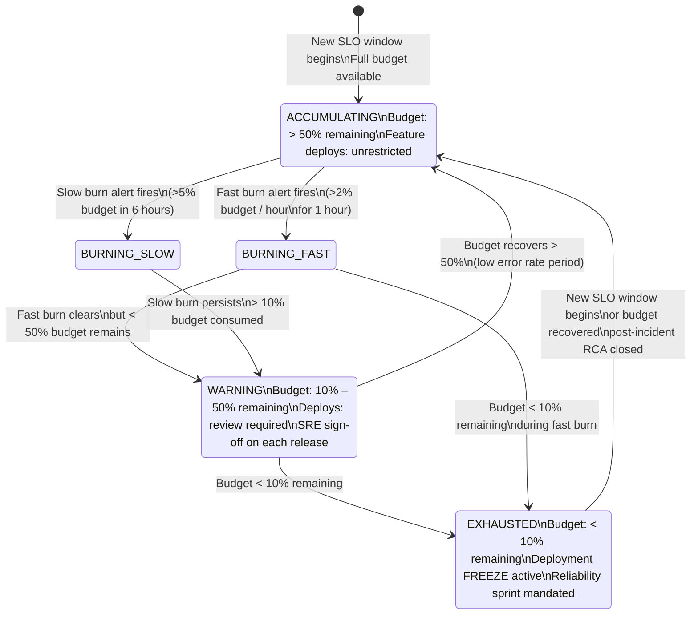

# Error Budgets

Status: Draft | Last Reviewed: 2026-05-09 | Owner: @sre-lead
Catalog ID: BP-008 | Radii
Tier Applicability: T0, T1

## Problem Statement

Reliability and feature velocity are in tension — and without a quantitative framework that tension resolves through politics rather than data:

- **No shared language for reliability trade-offs**: product owners push for more deploys; SRE engineers push back on grounds of "it feels risky." Neither side has a number. Decisions are made by seniority, not evidence.
- **SLO targets without burn-rate awareness**: a service holds its monthly 99.95% SLO on average but burns 80% of its error budget in a single week with aggressive releases. The remaining three weeks are spent in a reliability deficit with no policy governing feature freeze.
- **Incident impact not linked to budget**: a 45-minute T0 outage is recovered and closed as a "resolved" ticket. Nobody reconciles the 45 minutes against the annual error budget (52 minutes for 99.99% SLO), which is now effectively exhausted.
- **Reliability work unfunded by policy**: when the budget is depleted, engineering teams continue feature work because there is no formal freeze policy. Reliability improvements are perpetually deferred.
- **Velocity-blame cycle**: a post-mortem names a specific deployment as the cause of a budget-consuming incident. Developers distrust the SLO system; SRE distrusts deployment velocity. The error budget model, properly implemented, replaces blame with shared accountability.

## Context

Reliability and feature velocity are in tension on every T0 payment service: each new deployment carries a small regression probability, while the entire annual error budget for a 99.99% SLO is only 52 minutes. Without quantitative budget accounting, this tension resolves through politics — seniority and intuition rather than data. The error budget framework converts the SLO from an aspirational target into an operational contract: budget is earned by reliability, and budget consumption governs deployment velocity. This practice is the operational layer on top of [NFR-005 Error Budget Policy](../nfr/error-budget-policy.md), which defines the policy bands; this document describes the engineering implementation.

## Solution

The error budget is `1 - SLO target`. It is the maximum allowable unreliability per rolling window. Burn-rate alerts detect budget consumption early — fast burn catches an active incident; slow burn catches a gradual drift. When the budget is exhausted, a deployment freeze is activated per NFR-005. Reliability sprints fund the work to recover.



### Banking SLO and Budget Reference

| Service | Tier | SLO Target | Error Budget / Year | Error Budget / Month | Fast Burn Threshold |
|---|---|---|---|---|---|
| Payment Gateway | T0 | 99.99% | 52 min/year | 4.3 min/month | > 5% budget/hour |
| Core Banking ACL | T0 | 99.99% | 52 min/year | 4.3 min/month | > 5% budget/hour |
| Account Service | T1 | 99.95% | 4.4 hours/year | 21.9 min/month | > 5% budget/hour |
| Notification Service | T1 | 99.9% | 8.7 hours/year | 43.8 min/month | > 5% budget/hour |

## Implementation Guidelines

### 1. SLI Definition — What "Good" Means

An SLI must reflect what the customer experiences, not what is convenient to measure:

```yaml
# sli-definitions.yml — stored in governance/slo/ alongside the service
service: payment-gateway
tier: T0

slis:
  - name: payment_success_ratio
    description: >
      Ratio of payment transactions that complete with a successful response
      (HTTP 200 with outcome=SUCCESS) to total payment transactions initiated.
      Excludes transactions rejected for validation errors (customer fault).
    good_events:
      metric: payment_transaction_total{outcome="SUCCESS"}
    total_events:
      metric: payment_transaction_total{outcome!="VALIDATION_ERROR"}
    window: 28d   # rolling 28-day window

  - name: payment_latency_ratio
    description: >
      Ratio of payment transactions completing within 1000ms (P99 budget) to
      total successful payment transactions.
    good_events:
      metric: >
        sum(rate(http_server_request_seconds_bucket{service="payment-gateway",
          endpoint="/api/v1/payments", le="1.0"}[5m]))
    total_events:
      metric: >
        sum(rate(http_server_request_seconds_count{service="payment-gateway",
          endpoint="/api/v1/payments"}[5m]))
    window: 28d
```

### 2. Prometheus Recording Rules — Error Budget Burn Rate

```yaml
# prometheus/rules/error-budget-t0.yml
groups:
  - name: error_budget_t0
    interval: 1m
    rules:

      # --- Error ratio (1 - success_ratio) ---
      - record: job:payment_error_ratio:rate5m
        expr: |
          1 - (
            sum(rate(payment_transaction_total{service="payment-gateway", outcome="SUCCESS"}[5m]))
            /
            sum(rate(payment_transaction_total{service="payment-gateway", outcome!="VALIDATION_ERROR"}[5m]))
          )

      - record: job:payment_error_ratio:rate1h
        expr: |
          1 - (
            sum(rate(payment_transaction_total{service="payment-gateway", outcome="SUCCESS"}[1h]))
            /
            sum(rate(payment_transaction_total{service="payment-gateway", outcome!="VALIDATION_ERROR"}[1h]))
          )

      - record: job:payment_error_ratio:rate6h
        expr: |
          1 - (
            sum(rate(payment_transaction_total{service="payment-gateway", outcome="SUCCESS"}[6h]))
            /
            sum(rate(payment_transaction_total{service="payment-gateway", outcome!="VALIDATION_ERROR"}[6h]))
          )

      # --- Burn rate: ratio of current error rate to acceptable error rate ---
      # SLO = 99.99% over 28 days → acceptable error rate = 0.01% = 0.0001
      # burn_rate = current_error_rate / slo_error_rate
      # burn_rate > 1 = consuming budget faster than it accumulates
      - record: job:payment_burn_rate:rate1h
        expr: job:payment_error_ratio:rate1h / 0.0001

      - record: job:payment_burn_rate:rate6h
        expr: job:payment_error_ratio:rate6h / 0.0001

      # --- Remaining budget (fraction) over the 28-day window ---
      - record: job:payment_budget_remaining:rate28d
        expr: |
          1 - (
            sum(increase(payment_transaction_total{
              service="payment-gateway", outcome!="SUCCESS",
              outcome!="VALIDATION_ERROR"}[28d]))
            /
            (sum(increase(payment_transaction_total{
              service="payment-gateway",
              outcome!="VALIDATION_ERROR"}[28d])) * 0.0001)
          )
```

### 3. Burn-Rate Alert Rules

```yaml
# prometheus/rules/error-budget-alerts-t0.yml
groups:
  - name: error_budget_alerts_t0
    rules:

      # FAST BURN: consuming > 5% of monthly budget per hour
      # For T0 (4.3 min/month), 5% = 12.9 seconds → burn_rate > 14.4 (= 1h/window × 5%)
      - alert: T0ErrorBudgetFastBurn
        expr: |
          job:payment_burn_rate:rate1h{service="payment-gateway"} > 14.4
          AND
          job:payment_burn_rate:rate5m{service="payment-gateway"} > 14.4
        for: 2m
        labels:
          severity: critical
          tier: T0
          budget_signal: fast_burn
        annotations:
          summary: "T0 Payment Gateway fast burn: consuming monthly error budget at {{ $value | humanize }}x the sustainable rate"
          description: >
            Current 1h burn rate exceeds 14.4x the SLO threshold.
            At this rate, the monthly budget will be exhausted in
            {{ printf "%.0f" (div 1.0 $value | mul 60) }} minutes.
          runbook: "https://wiki.techcombank.internal/runbooks/error-budgets#fast-burn"

      # SLOW BURN: consuming > 5% of budget over 6 hours (sustainable but concerning)
      - alert: T0ErrorBudgetSlowBurn
        expr: |
          job:payment_burn_rate:rate6h{service="payment-gateway"} > 6
          AND
          job:payment_burn_rate:rate1h{service="payment-gateway"} > 6
        for: 15m
        labels:
          severity: warning
          tier: T0
          budget_signal: slow_burn
        annotations:
          summary: "T0 Payment Gateway slow burn: 6h burn rate {{ $value | humanize }}x sustainable"
          runbook: "https://wiki.techcombank.internal/runbooks/error-budgets#slow-burn"

      # BUDGET EXHAUSTION: < 10% remaining in the 28-day window
      - alert: T0ErrorBudgetNearExhaustion
        expr: job:payment_budget_remaining:rate28d{service="payment-gateway"} < 0.10
        for: 5m
        labels:
          severity: critical
          tier: T0
          budget_signal: exhaustion
        annotations:
          summary: "T0 Payment Gateway error budget < 10% remaining: deployment freeze required"
          runbook: "https://wiki.techcombank.internal/runbooks/error-budgets#freeze"
```

### 4. Java Spring Boot — Budget Status Endpoint

```java
@RestController
@RequestMapping("/internal/v1/error-budget")
public class ErrorBudgetController {

    private final PrometheusQueryClient prometheusClient;

    public ErrorBudgetController(PrometheusQueryClient prometheusClient) {
        this.prometheusClient = prometheusClient;
    }

    /**
     * Returns the current error budget status for a service.
     * Used by the deployment pipeline to enforce the freeze policy (NFR-005).
     */
    @GetMapping("/{service}")
    @PreAuthorize("hasRole('SRE_PLATFORM') or hasRole('CI_PIPELINE')")
    public ResponseEntity<ErrorBudgetStatus> getStatus(
            @PathVariable String service) {

        double budgetRemaining = prometheusClient.queryInstant(
            "job:payment_budget_remaining:rate28d{service=\"" + service + "\"}");
        double burnRate1h = prometheusClient.queryInstant(
            "job:payment_burn_rate:rate1h{service=\"" + service + "\"}");

        BudgetState state = computeState(budgetRemaining, burnRate1h);

        return ResponseEntity.ok(ErrorBudgetStatus.builder()
            .service(service)
            .budgetRemainingFraction(budgetRemaining)
            .burnRate1h(burnRate1h)
            .state(state)
            .deploymentsAllowed(state != BudgetState.EXHAUSTED)
            .message(state.message())
            .asOf(Instant.now())
            .build());
    }

    private BudgetState computeState(double remaining, double burnRate) {
        if (remaining < 0.10) return BudgetState.EXHAUSTED;
        if (remaining < 0.50) return BudgetState.WARNING;
        if (burnRate  > 14.4) return BudgetState.FAST_BURN;
        return BudgetState.ACCUMULATING;
    }
}
```

```java
public enum BudgetState {
    ACCUMULATING("Budget healthy. Unrestricted deploys permitted."),
    FAST_BURN   ("Fast burn detected. Investigate immediately. Deploys require SRE sign-off."),
    WARNING     ("Budget below 50%. Deploys require SRE review."),
    EXHAUSTED   ("Budget exhausted. DEPLOYMENT FREEZE active. Reliability sprint required.");

    private final String message;
    BudgetState(String message) { this.message = message; }
    public String message() { return message; }
}
```

### 5. Grafana Dashboard Panel — Budget Remaining (JSON Outline)

```json
{
  "title": "Error Budget Remaining — 28d Rolling Window",
  "type": "gauge",
  "targets": [
    {
      "expr": "job:payment_budget_remaining:rate28d{service=\"$service\"}",
      "legendFormat": "Budget Remaining"
    }
  ],
  "fieldConfig": {
    "defaults": {
      "unit": "percentunit",
      "min": 0,
      "max": 1,
      "thresholds": {
        "steps": [
          { "color": "red",    "value": 0    },
          { "color": "orange", "value": 0.10 },
          { "color": "yellow", "value": 0.50 },
          { "color": "green",  "value": 0.75 }
        ]
      }
    }
  }
}
```

### 6. Reliability Sprint Playbook

When `BudgetState = EXHAUSTED`:

```
RELIABILITY SPRINT ACTIVATION CHECKLIST
========================================
Trigger:   Error budget < 10% for service {X}, tier {T0|T1}
Initiator: SRE lead (or automated alert from CI pipeline gate)

Immediate actions (within 2 hours):
  [ ] Activate deployment freeze in CI pipeline (NFR-005 gate = REJECT)
  [ ] Page SRE lead and engineering manager
  [ ] Open reliability sprint Jira epic: RELSPRINT-{YYYYMM}-{SERVICE}
  [ ] Run post-incident RCA for any open incidents contributing to budget consumption

First 5 actions (within 1 sprint):
  1. Identify top-3 reliability risks from the prior month's incident log
  2. Fix or mitigate the highest-impact risk (aim for > 50% budget recovery)
  3. Add a regression test for each fixed issue
  4. Review SLI definition — is it measuring the right thing?
  5. Conduct SLO review meeting with product owner and engineering lead

Exit criteria (to lift deployment freeze):
  [ ] Budget recovered to > 25%
  [ ] Root cause of budget consumption identified and documented
  [ ] At least one reliability improvement merged and deployed
  [ ] SRE lead signs off on re-opening deploy gates
```

## Compliance Mapping

| Ring | Regulation | Provision | How this pattern satisfies |
|---|---|---|---|
| Ring 0 | Google SRE Book | Chapters 3–5 (SLIs, SLOs, Error Budgets) | Pattern is the direct operational implementation of the SRE error budget model |
| Ring 0 | NIST SP 800-53 | CA-7 (Continuous Monitoring); CP-2 (Contingency Plan) | Burn-rate alerts provide continuous monitoring; the reliability sprint playbook is the operational contingency plan for SLO degradation |
| Ring 1 | BCBS 230 | Principle 1 — Impact Tolerance: the SLO target is the quantitative definition of acceptable disruption | The T0 SLO of 99.99% defines 52 minutes/year as the maximum tolerable outage; the deployment freeze at budget exhaustion enforces that tolerance |
| Ring 1 | BCBS 239 | §3 Data Architecture and IT Infrastructure; reliability of risk data systems | Error budget policy ensures the risk-data reporting systems (BSP-001, BP-007) maintain reliability commitments; budget burn from unreliable reporting infrastructure is tracked and remediated |
| Ring 2 | SBV Circular 09/2020 | §IV — Operational continuity requirements; incident frequency reporting | Monthly SLO compliance reports (budget consumed, incidents contributing) satisfy SBV §IV operational continuity documentation requirements ⚠️ (working summary — pending Legal review) |

## NFR Acceptance Criteria

```yaml
nfr_acceptance_criteria:
  catalog_id: BP-008
  pattern: Error Budgets

  coverage:
    - id: BP-008-COV-01
      description: >
        Every T0 and T1 service must have a documented SLI definition,
        an SLO target, and Prometheus recording rules for burn_rate_1h
        and burn_rate_6h before production deployment.
      measurement: governance/slo/ directory check in CI; recording rules
        validated by promtool
      threshold: 100% of T0/T1 services with complete SLO documentation

  alerting:
    - id: BP-008-ALT-01
      description: >
        A T0 fast burn (14.4x burn rate for 2 minutes) must produce a
        PagerDuty Critical alert within 3 minutes of the condition beginning.
      measurement: chaos drill — inject errors at 14.4x burn rate;
        measure time to PagerDuty notification
      threshold: <= 3 minutes to PagerDuty Critical

  freeze_enforcement:
    - id: BP-008-FRZ-01
      description: >
        The CI/CD pipeline must call /internal/v1/error-budget/{service}
        before each production deployment. If BudgetState = EXHAUSTED,
        the deploy must be rejected automatically.
      measurement: integration test — set budget to EXHAUSTED state;
        trigger deploy; assert pipeline returns exit code 1 with
        "DEPLOYMENT FREEZE" message
      threshold: 100% of production deploys gated by budget status check

  review_cadence:
    - id: BP-008-REV-01
      description: >
        Monthly SLO review meetings for T0 services and quarterly for T1
        must be documented in the incident log with attendance records.
      measurement: governance audit — check meeting records in Confluence
      threshold: 0 missed SLO reviews per quarter
```

## Cost / FinOps

- **SRE time — budget reviews**: monthly T0 SLO reviews require approximately 2 hours per service (preparation + meeting + documentation). At 3 T0 services and a 10-member SRE team, this is 6 person-hours/month for review — a fixed cost regardless of this pattern. The pattern makes the reviews data-driven rather than opinion-driven, reducing review cycle time.
- **Reliability sprint cost**: a reliability sprint (2 weeks, 2 engineers) costs approximately 4 person-weeks/sprint. However, without an error budget policy, the same reliability debt manifests as unplanned incidents — which cost significantly more in P1 response time, customer trust, and potential SBV fines. The reliability sprint is the planned version of work that would otherwise happen reactively.
- **Feature freeze opportunity cost**: a deployment freeze during budget exhaustion delays feature velocity. For a T0 Payment Gateway, a 2-week freeze delays revenue-generating features. This is intentional — the cost of the freeze is the incentive for teams to invest in reliability proactively. Quantify this cost during SLO review to drive the business case for reliability investment.
- **Prometheus additional storage for recording rules**: burn-rate recording rules add approximately 4 additional time series per service. At current Prometheus storage rates, this is negligible (< 1 MB/month per service).
- **Tooling**: all components (Prometheus, Grafana, AlertManager) are open-source. The `/internal/v1/error-budget` endpoint is custom Java code, estimated 2 days engineering effort to implement and test.

## Threat Model

STRIDE analysis against the error budget practice:

- **Tampering — SLI metric manipulation**: a team modifies the SLI metric query to exclude a category of errors (e.g., filtering out `outcome="TIMEOUT"` from the denominator), artificially improving the apparent success ratio and slowing budget burn. Mitigation: SLI definitions are stored in `governance/slo/` as code and require SRE lead approval via pull request. Changes to SLI queries trigger an automated review gate that validates the SLI against the prior month's incident data.
- **Repudiation — disputed budget consumption**: after a reliability sprint, a team claims the outage did not consume the budget because it was caused by a third party (T24, payment network). Mitigation: the monthly SLO review meeting is documented with attendance; budget consumption is reconciled against incident records. Third-party-caused outages are excluded from the budget per a pre-approved exclusion policy documented in `governance/slo/exclusion-policy.md`.
- **Denial of Service — burn rate calculation error**: a bug in the Prometheus recording rule computes a near-infinite burn rate, triggering a false deployment freeze. Mitigation: `promtool test rules` runs against all recording rules in CI with synthetic test data; the `/internal/v1/error-budget` endpoint applies bounds checking (burn_rate capped at 1000 before state computation); a second-level approval is required before a freeze is lifted to verify it is genuine.
- **Information Disclosure — budget status exposes service reliability data**: the `/internal/v1/error-budget` endpoint returns reliability data that could be useful to an attacker planning an attack during a depleted-budget period. Mitigation: the endpoint is on the internal network only (`/internal/` path prefix, not exposed via the public API gateway); access is restricted to `SRE_PLATFORM` and `CI_PIPELINE` roles.
- **Elevation of Privilege — freeze bypass**: a developer bypasses the deploy gate by setting an environment variable or modifying the pipeline script. Mitigation: the deploy gate is enforced by the platform-level CI system (not a step the developer controls); the gate's code is in a protected repository requiring SRE lead review to modify.

## Operational Runbook

1. **New service SLO onboarding**: (a) run the SLI definition workshop (1-hour session with engineering lead and product owner); (b) document the SLI in `governance/slo/{service}-sli.yml`; (c) deploy the Prometheus recording rules to the staging Prometheus instance; (d) validate with 2 weeks of shadow-mode data before activating alerts in production; (e) add the service to the monthly SLO review schedule.
2. **Alert: `T0ErrorBudgetFastBurn`**: (a) open the Golden Signals dashboard (BP-007) for the service — identify the error spike by endpoint and error class; (b) check recent deployments (`kubectl rollout history`); (c) if deployment correlates, roll back immediately; (d) if no deployment, identify the upstream or dependency causing the errors; (e) if the burn rate does not recover within 30 minutes, escalate to P1 and activate incident response.
3. **Alert: `T0ErrorBudgetNearExhaustion`**: (a) freeze deployments via the CI pipeline configuration (`BUDGET_STATE=EXHAUSTED` environment variable); (b) notify engineering manager and product owner; (c) open the reliability sprint epic; (d) conduct root-cause analysis on incidents that consumed the budget; (e) prioritise the top-3 reliability risks for the sprint.
4. **Monthly SLO review (T0 services)**: (a) pull the monthly SLO compliance report from Grafana (export as PDF); (b) review budget consumed vs prior month; (c) review incidents that contributed to budget consumption; (d) review whether SLI definitions still reflect customer experience (adjust if the metric is not correlating with customer complaints); (e) set feature-velocity guidance for the next month based on remaining budget; (f) document in the incident log.
5. **Post-incident budget reconciliation**: after a P1 incident is resolved, the incident lead must calculate the budget consumed: `(incident_duration_minutes / slo_window_minutes) / (1 - slo_target)`. Update the `job:payment_budget_remaining:rate28d` recording rule's reference value if the incident was excluded per the exclusion policy. Document the calculation in the post-mortem.
6. **Reliability sprint retrospective**: at the end of a reliability sprint, measure budget recovery: compare `job:payment_budget_remaining:rate28d` before and after the sprint. If budget has not recovered to > 25%, extend the sprint or escalate to the CTO for additional resource allocation. Publish the reliability sprint outcomes in the engineering newsletter for cross-team learning.
7. **SLO target revision**: if a service consistently exhausts its budget despite reliability investment, the SLO target may be too aggressive for the current infrastructure maturity. Initiate an SLO target revision: (a) analyse the prior 6-month budget consumption; (b) propose a revised target with supporting data; (c) obtain approval from the SRE lead and CTO; (d) document the change in `governance/slo/` and update the Prometheus alert thresholds; (e) notify the business stakeholders of the revised impact tolerance.

## Test Strategy

### Unit Tests
- `ErrorBudgetControllerTest`: mock `PrometheusQueryClient`; test `computeState()` with boundary values (0.09 → EXHAUSTED, 0.10 → WARNING, 0.50 → ACCUMULATING, burn_rate 15.0 → FAST_BURN); assert `deploymentsAllowed = false` for EXHAUSTED state.
- `BurnRateCalculationTest`: feed synthetic Prometheus metric values into the recording rule expressions (evaluated via `promtool`); assert burn rate > 14.4 for an error rate of `slo_error_rate * 14.4`; assert burn rate = 1.0 for an error rate exactly at the SLO threshold.

### Integration Tests
- `ErrorBudgetGateIT`: call `/internal/v1/error-budget/payment-gateway` with a mocked Prometheus instance returning `budget_remaining = 0.05`; assert HTTP 200 with `deploymentsAllowed: false` and `state: EXHAUSTED`.
- `CiPipelineGateIT`: simulate a CI pipeline deploy step that calls the budget endpoint; inject EXHAUSTED state; assert the pipeline step exits with code 1 and the "DEPLOYMENT FREEZE" message; inject ACCUMULATING state; assert the pipeline step exits with code 0.

### Compliance Tests
- `SloDocumentationCoverageTest`: enumerate all services in `governance/slo/`; cross-reference against the service registry; assert every T0 and T1 service has a corresponding `{service}-sli.yml` file with `slis`, `slo_target`, and `window` fields.
- `RecordingRuleValidationTest`: run `promtool test rules` against all files in `prometheus/rules/error-budget-*.yml` using the synthetic test fixtures in `prometheus/tests/`; assert zero failures.

### Chaos Tests
- Inject a sustained 2% error rate into the Payment Gateway for 5 minutes (simulating a fast burn at 20x rate); assert PagerDuty receives a Critical alert within 3 minutes; assert the Grafana budget gauge drops to reflect the consumed budget; assert the CI pipeline rejects a test deploy within 10 minutes of the alert.
- Inject a Prometheus outage for 30 minutes; assert the CI pipeline fails safe (rejects deploys when budget status is unknown, rather than defaulting to ACCUMULATING); verify Prometheus recovers and recording rules back-fill correctly from WAL.

## When to Use

- Every T0 and T1 service that has a customer-facing availability or latency SLO — the error budget converts the SLO from a number into an operational contract.
- When the organisation needs a quantitative basis for deployment freeze decisions (prevents the velocity/reliability debate from becoming political).
- When SLO breaches are recurrent and the team needs a forcing function to prioritise reliability work over feature velocity.
- As the primary evidence artefact for BCBS 230 impact tolerance and SBV §IV operational continuity regulatory conversations.

## When Not to Use

- T3 internal tooling with no SLO or informal best-effort availability — error budget overhead is not justified; use basic alerting instead.
- Services in pre-production or alpha where the SLI definition has not yet been validated against real user behaviour — shadow-mode data collection for 2 weeks before activating budget enforcement.
- One-off migration jobs where the completion rate matters but burn-rate alerting has no operational value.

## Variants & Trade-offs

- **Rolling 28-day window (default)** — smooths out short incidents; good for comparing service reliability month-over-month; the 28-day window means a bad week can stay in the window for four weeks.
- **Calendar-month window** — aligns with business reporting cycles and SBV monthly compliance reports; simpler to explain to stakeholders; susceptible to gaming (bad event at end of month falls out of window faster).
- **Availability + latency composite SLI** — combines the success ratio and the latency ratio into a single budget; more complete representation of user experience but harder to debug which dimension is consuming budget.
- **Separate availability and latency budgets** — simplest to reason about; easier to triage (budget drain is unambiguously from errors or from latency); the approach used in this practice document.

## Related Patterns / Best Practices

- [NFR-005 Error Budget Policy](../nfr/error-budget-policy.md) — policy companion: defines Green/Amber/Red bands and the deployment freeze enforcement mechanism
- [BP-007 Golden Signals (SRE)](golden-signals-sre.md) — error signal is the primary feed into the error budget burn-rate calculation
- [NFR-002 Latency Budget Model](../nfr/latency-budget-model.md) — per-tier P95/P99 thresholds used in latency SLI definitions
- [BP-010 Incident Postmortem](incident-postmortem.md) — post-incident budget reconciliation feeds back into reliability sprint prioritisation
- [RES-002 Circuit Breaker](../patterns/resilience/circuit-breaker.md) — fast-burn alerts often coincide with CB OPEN events; CB state is a leading signal

## References

- Google SRE Book — Chapter 3 (Embracing Risk), Chapter 4 (SLOs), Chapter 5 (Eliminating Toil)
- Google SRE Workbook — Chapter 2 (Implementing SLOs), Chapter 5 (Alerting on SLOs)
- Alex Hidalgo — *Implementing Service Level Objectives* (O'Reilly, 2020)
- BCBS 230 — Principles for Effective Risk Data Aggregation (Principle 1, Impact Tolerance)
- BCBS 239 — Principles for Effective Risk Data Aggregation (§3 Data Architecture)
- SBV Circular 09/2020/TT-NHNN §IV — Operational Continuity
- [NFR-005 Error Budget Policy](../nfr/error-budget-policy.md) — policy companion to this practice document
- [BP-007 Golden Signals (SRE)](golden-signals-sre.md) — provides the metrics that feed error budget calculations
- [NFR-002 Latency Budget Model](../nfr/latency-budget-model.md) — defines per-tier P95/P99 thresholds used in latency SLIs
- [RES-002 Circuit Breaker](../patterns/resilience/circuit-breaker.md) — fast-burn alerts often coincide with CB OPEN events

---

**Key Takeaway**: The error budget converts an SLO from a number on a slide into an operational contract — it quantifies exactly how much unreliability each team has earned, drives the deployment freeze and reliability sprint when it is consumed, and replaces blame with shared accountability for the reliability/velocity trade-off.
