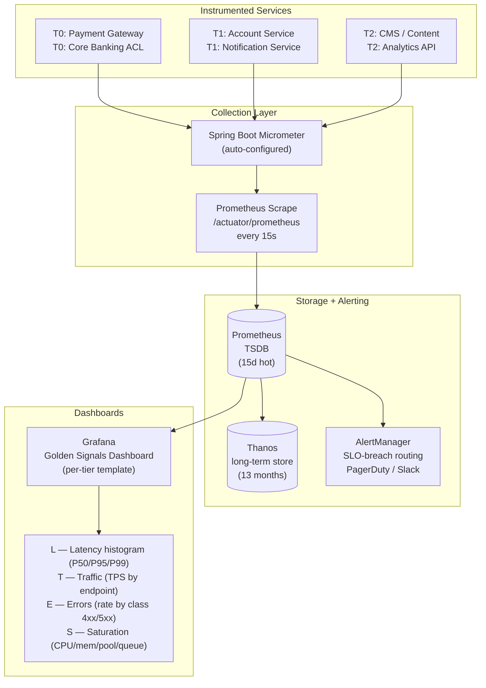

# Golden Signals (SRE)

Status: Draft | Last Reviewed: 2026-05-09 | Owner: @sre-lead
Catalog ID: BP-007 | Radii
Tier Applicability: T0, T1, T2, T3

## Problem Statement

Observability without a standard framework produces either observability debt or observability sprawl — both are dangerous in a banking environment:

- **Under-instrumentation**: teams ship services with no latency histogram or error counter. The first indication of a degraded T0 payment service is a customer complaint or a failed settlement, not an alert.
- **Inconsistent metric naming**: one service emits `http_request_duration_ms`, another emits `api_latency_seconds`, a third uses a custom business metric with no SLO alert. Dashboards cannot be templated; on-call engineers waste time during incidents translating between schemas.
- **Observability overload**: some teams emit hundreds of metrics with high-cardinality labels (e.g., per-user). Prometheus storage costs balloon; dashboards are unusable; the signal-to-noise ratio collapses.
- **Missing saturation signals**: thread pool exhaustion, connection pool starvation, and queue back-pressure are the leading indicators of impending outage. Services that only emit request-level metrics give no warning before a hard failure.
- **Compliance gap**: BCBS 239 §5 requires that risk data be available in a timely manner. Golden signals are the operational definition of "timely" — they must be present and alerting before a human detects the issue.

## Context

Distributed banking services on Kubernetes and multi-AZ cloud infrastructure fail in ways that cannot be predicted from code review alone: thread pool exhaustion, connection pool saturation, and downstream latency spikes are all invisible without a standard measurement framework. The Google SRE Four Golden Signals (Latency, Traffic, Errors, Saturation) provide the minimum viable observability vocabulary for every service — consistent metric names and label schemas allow Grafana dashboards to be templated once and reused across all tiers. BCBS 239 §5 requires risk data to be available in a timely manner; Golden Signals are the operational definition of "timely" — they must be alerting before a human detects a degradation.

## Solution

Every Techcombank service must emit exactly the four Google SRE Golden Signals — **Latency**, **Traffic**, **Errors**, **Saturation** — using the standard Micrometer metric names and label set defined below. Prometheus collects them; Grafana dashboards are templated per tier; SLO alerts are defined for each signal per tier threshold from NFR-002 and NFR-005.



### Signal-to-Metric Mapping

| Signal | Standard Metric Name | Labels | Banking Specifics |
|---|---|---|---|
| Latency | `http_server_request_seconds` | `service, tier, region, endpoint, status` | P95/P99 per payment endpoint |
| Traffic | `payment_transaction_total` | `service, tier, type, currency` | TPS including VND / USD / EUR breakdown |
| Errors | `payment_error_total` | `service, tier, error_class, error_code` | Transaction failure rate by error code |
| Saturation | `thread_pool_queue_size` | `service, tier, pool_name` | Queue depth is the leading saturation signal |
| Saturation | `db_connection_pool_pending` | `service, tier, datasource` | Connection pool exhaustion |
| Saturation | `jvm_gc_pause_seconds` | `service, tier, gc_cause` | GC pause as saturation proxy |

## Implementation Guidelines

### 1. Spring Boot Micrometer Configuration

```java
@Configuration
@Slf4j
public class GoldenSignalsMetricsConfig {

    /**
     * Standard label binder — attaches service, tier, region, cell, version
     * to every metric emitted by this service.
     */
    @Bean
    MeterRegistryCustomizer<MeterRegistry> commonTags(
            @Value("${spring.application.name}") String serviceName,
            @Value("${app.tier:T2}") String tier,
            @Value("${app.region:ap-southeast-1}") String region,
            @Value("${app.cell:cell-01}") String cell,
            @Value("${app.version:unknown}") String version) {
        return registry -> registry.config()
            .commonTags(
                "service", serviceName,
                "tier",    tier,
                "region",  region,
                "cell",    cell,
                "version", version
            );
    }

    /**
     * Banking-specific Traffic signal:
     * payment_transaction_total{type, currency, outcome}
     */
    @Bean
    public Counter paymentTransactionCounter(MeterRegistry registry) {
        // Counters are incremented by the PaymentService; this bean provides
        // the canonical metric name. Use MeterRegistry.counter() directly in the
        // service to avoid a singleton counter (tags vary per call).
        return Counter.builder("payment_transaction_total")
            .description("Total payment transactions processed")
            .register(registry);
    }
}
```

```java
@Service
@Slf4j
public class PaymentMetricsService {

    private final MeterRegistry registry;

    public PaymentMetricsService(MeterRegistry registry) {
        this.registry = registry;
    }

    // --- Traffic Signal ---
    public void recordTransaction(String type, String currency, String outcome) {
        registry.counter("payment_transaction_total",
            "type",     type,       // TRANSFER, BILL_PAYMENT, TOP_UP
            "currency", currency,   // VND, USD, EUR
            "outcome",  outcome     // SUCCESS, FAILED, PENDING
        ).increment();
    }

    // --- Error Signal ---
    public void recordError(String errorClass, String errorCode) {
        registry.counter("payment_error_total",
            "error_class", errorClass,  // VALIDATION, TIMEOUT, INSUFFICIENT_FUNDS
            "error_code",  errorCode    // domain-specific code
        ).increment();
    }

    // --- Latency Signal (manual timing for non-HTTP paths, e.g. Kafka consumers) ---
    public Timer.Sample startTimer() {
        return Timer.start(registry);
    }

    public void stopTimer(Timer.Sample sample, String operation, String outcome) {
        sample.stop(Timer.builder("payment_processing_seconds")
            .description("Payment processing latency")
            .tag("operation", operation)  // AUTHORIZE, CAPTURE, SETTLE
            .tag("outcome",   outcome)
            .publishPercentiles(0.50, 0.95, 0.99)
            .publishPercentileHistogram()
            .register(registry));
    }

    // --- Saturation Signal: thread pool queue depth ---
    public void bindThreadPoolMetrics(ThreadPoolExecutor executor, String poolName) {
        registry.gauge("thread_pool_queue_size",
            Tags.of("pool_name", poolName),
            executor, e -> (double) e.getQueue().size());

        registry.gauge("thread_pool_active_threads",
            Tags.of("pool_name", poolName),
            executor, e -> (double) e.getActiveCount());
    }
}
```

### 2. Spring Boot Actuator + Prometheus Endpoint Configuration

```yaml
# application.yml
management:
  endpoints:
    web:
      exposure:
        include: health, info, prometheus, metrics
      base-path: /actuator
  endpoint:
    prometheus:
      enabled: true
    health:
      show-details: always
  metrics:
    distribution:
      percentiles-histogram:
        http.server.requests: true
        payment.processing.seconds: true
      percentiles:
        http.server.requests: 0.50, 0.95, 0.99
      slo:
        http.server.requests: 100ms, 500ms, 1000ms, 2000ms  # SLO bucket boundaries
    tags:
      # common tags are set in GoldenSignalsMetricsConfig @Bean
```

### 3. Prometheus Alert Rules (YAML) — One per Signal per Tier

```yaml
# prometheus/rules/golden-signals-t0.yml
groups:
  - name: golden_signals_t0
    interval: 30s
    rules:

      # LATENCY: T0 P99 > 200ms for 2 consecutive minutes
      - alert: T0LatencyP99Breach
        expr: |
          histogram_quantile(0.99,
            sum(rate(http_server_request_seconds_bucket{tier="T0"}[2m])) by (le, service, endpoint)
          ) > 0.200
        for: 2m
        labels:
          severity: critical
          tier: T0
        annotations:
          summary: "T0 service {{ $labels.service }} P99 latency {{ $value | humanizeDuration }} exceeds 200ms"
          runbook: "https://wiki.techcombank.internal/runbooks/golden-signals#latency"

      # TRAFFIC: T0 TPS drops > 50% vs 1-week baseline (traffic collapse = upstream failure)
      - alert: T0TrafficCollapse
        expr: |
          (
            sum(rate(payment_transaction_total{tier="T0"}[5m])) by (service)
            /
            sum(rate(payment_transaction_total{tier="T0"}[7d] offset 5m)) by (service)
          ) < 0.5
        for: 3m
        labels:
          severity: critical
          tier: T0
        annotations:
          summary: "T0 service {{ $labels.service }} traffic dropped >50% vs 7d baseline"
          runbook: "https://wiki.techcombank.internal/runbooks/golden-signals#traffic"

      # ERRORS: T0 error rate > 0.1% over 5 minutes
      - alert: T0ErrorRateBreach
        expr: |
          (
            sum(rate(payment_error_total{tier="T0"}[5m])) by (service)
            /
            sum(rate(payment_transaction_total{tier="T0"}[5m])) by (service)
          ) > 0.001
        for: 5m
        labels:
          severity: critical
          tier: T0
        annotations:
          summary: "T0 service {{ $labels.service }} error rate {{ $value | humanizePercentage }} exceeds 0.1%"
          runbook: "https://wiki.techcombank.internal/runbooks/golden-signals#errors"

      # SATURATION: Thread pool queue depth > 50 (impending thread exhaustion)
      - alert: T0ThreadPoolSaturation
        expr: thread_pool_queue_size{tier="T0"} > 50
        for: 1m
        labels:
          severity: warning
          tier: T0
        annotations:
          summary: "T0 service {{ $labels.service }} thread pool {{ $labels.pool_name }} queue depth {{ $value }}"
          runbook: "https://wiki.techcombank.internal/runbooks/golden-signals#saturation"

      # SATURATION: DB connection pool pending > 10
      - alert: T0DbConnectionPoolSaturation
        expr: db_connection_pool_pending{tier="T0"} > 10
        for: 2m
        labels:
          severity: critical
          tier: T0
        annotations:
          summary: "T0 service {{ $labels.service }} DB connection pool pending {{ $value }} connections"
          runbook: "https://wiki.techcombank.internal/runbooks/golden-signals#saturation"
```

### 4. Prometheus Recording Rules — Pre-aggregated for Dashboard Performance

```yaml
# prometheus/rules/golden-signals-recording.yml
groups:
  - name: golden_signals_recording
    interval: 1m
    rules:
      # Pre-compute per-service error ratio for dashboard and burn-rate alerts (BP-008)
      - record: job:payment_error_ratio:rate5m
        expr: |
          sum(rate(payment_error_total[5m])) by (service, tier)
          /
          sum(rate(payment_transaction_total[5m])) by (service, tier)

      # Pre-compute P95 latency per service
      - record: job:http_request_latency_p95:rate5m
        expr: |
          histogram_quantile(0.95,
            sum(rate(http_server_request_seconds_bucket[5m])) by (le, service, tier)
          )

      # Traffic rate per service
      - record: job:payment_tps:rate1m
        expr: |
          sum(rate(payment_transaction_total[1m])) by (service, tier, type, currency)
```

## Compliance Mapping

| Ring | Regulation | Provision | How this pattern satisfies |
|---|---|---|---|
| Ring 0 | Google SRE Book | Chapter 6 — Monitoring Distributed Systems; Four Golden Signals | Pattern is the direct implementation of the canonical SRE monitoring model with banking-specific adaptations |
| Ring 0 | NIST SP 800-53 | AU-6 (Audit Record Review); SI-4 (Information System Monitoring) | Prometheus + Alertmanager provides continuous monitoring; SLO breach alerts satisfy AU-6 automated review |
| Ring 0 | AWS WAF | Reliability Pillar — Monitor workload health | Golden signals are the minimum viable health monitoring set; SLO alerts map to CloudWatch Alarms for AWS-hosted services |
| Ring 1 | BCBS 239 | §5 Timeliness — risk data must be available in a timely manner | Golden signal dashboards provide near-real-time (15s scrape interval) operational risk data; latency and error signals detect risk degradation within minutes |
| Ring 1 | BCBS 230 | Principle 6 (Incident Management) — detect and respond to operational incidents | SLO breach alerts are the automated incident detection mechanism; alert routing to PagerDuty initiates the incident response process within the Principle 6 framework |
| Ring 2 | SBV Circular 09/2020 | §IV.3 — Monitoring and incident logging requirements for banking systems | Golden signals satisfy SBV §IV.3 continuous monitoring requirement; alert events are logged to SIEM with correlation IDs; monthly SLO compliance reports satisfy the reporting obligation ⚠️ (working summary — pending Legal review) |

## NFR Acceptance Criteria

```yaml
nfr_acceptance_criteria:
  catalog_id: BP-007
  pattern: Golden Signals (SRE)

  coverage:
    - id: BP-007-COV-01
      description: >
        Every deployed service (T0 through T3) must emit all four golden signals
        (latency histogram, traffic counter, error counter, saturation gauge)
        before the service may be promoted to production.
      measurement: ArchUnit test + Prometheus target label check in CI
      threshold: 100% of services with all four signals present at deploy gate

  timeliness:
    - id: BP-007-TIM-01
      description: >
        A T0 SLO breach alert must fire within 5 minutes of the breach beginning.
        A T1 breach alert must fire within 10 minutes.
      measurement: chaos drill — inject errors exceeding SLO threshold;
        measure time to PagerDuty notification
      threshold: T0 <= 5min; T1 <= 10min

  cardinality:
    - id: BP-007-CAR-01
      description: >
        No metric label must contain user IDs, account IDs, or any PII.
        High-cardinality labels degrade Prometheus storage and query performance.
      measurement: automated cardinality check in CI (label value count > 10,000 = fail)
      threshold: 0 high-cardinality PII labels in any metric

  cost:
    - id: BP-007-COST-01
      description: >
        Total unique time series per service must not exceed 5,000.
        Cardinality budget per team enforced at deploy gate.
      measurement: Prometheus TSDB cardinality query per service label
      threshold: <= 5,000 time series per service
```

## Cost / FinOps

- **Prometheus storage**: each time series consumes approximately 2 bytes/sample at 15-second scrape intervals. At 5,000 series per service × 20 services × 4 samples/minute × 1,440 minutes/day = ~576 MB/day uncompressed; Prometheus TSDB compresses to ~10% = ~58 MB/day. A 15-day hot retention requires ~870 MB per Prometheus instance. Negligible cost.
- **Thanos long-term storage (13 months)**: Thanos compacts and downsizes older blocks. Estimated S3 storage for 13 months across 20 services: ~50 GB. At AWS S3 Standard pricing (~USD 0.023/GB/month), cost is ~USD 1.15/month. Practically free.
- **Cardinality discipline is the primary cost control**: a single high-cardinality label (per-user or per-account) can multiply series count 100x–1000x and make Prometheus OOM. Enforce the 5,000-series-per-service budget at the deploy gate (BP-007-COST-01). This is a cultural cost, not a tooling cost.
- **Grafana**: Grafana OSS is free. Grafana Cloud (if used for alerting or on-call integration) is ~USD 8/user/month for the Pro tier. For a 10-person SRE team, this is USD 80/month.
- **Alert routing**: PagerDuty Business tier (~USD 21/user/month for on-call engineers) is the primary cost associated with the alerting pipeline. This cost exists regardless of the golden-signals pattern; the pattern reduces unnecessary page volume by setting precise SLO-bound alert thresholds.

## Threat Model

STRIDE analysis against the golden signals observability stack:

- **Tampering — metric spoofing**: a compromised service pod emits falsely healthy metrics, masking an ongoing incident. Mitigation: cross-validate golden signals against synthetic probes (Blackbox Exporter pings the payment endpoint from outside the cluster); discrepancy between internal metrics and external probe fires a `MetricSpoofingDetected` alert.
- **Information Disclosure — PII in metric labels**: a developer accidentally adds an account number as a metric label (`account_id=...`). Mitigation: automated cardinality check at deploy gate (BP-007-CAR-01) fails the pipeline if any label has > 10,000 unique values. Additionally, `PiiMaskingFilter` is applied to the Micrometer `MeterFilter` layer to strip labels matching PAN/CCCD patterns.
- **Denial of Service — metric cardinality explosion**: a bug creates a unique label combination per request (e.g., request ID as a tag), exploding Prometheus memory. Mitigation: Prometheus is configured with `--storage.tsdb.max-block-duration=2h`; a `prometheus_tsdb_head_series` alert fires at 80% of the per-service cardinality budget; the deploy gate blocks high-cardinality deployments.
- **Repudiation — alert suppression**: an on-call engineer acknowledges a PagerDuty alert and sets a long silence window, hiding a continuing incident from management. Mitigation: alert silences exceeding 2 hours require a second approver (SRE lead); all silence events are logged in the incident management system.
- **Denial of Service — Prometheus scrape overload**: a service exposes a `/actuator/prometheus` endpoint that generates 100,000 metrics per scrape, slowing Prometheus collection. Mitigation: Prometheus scrape timeout = 10s; cardinality budget enforced at deploy gate; rogue endpoints are automatically dropped from the scrape pool by the `PrometheusOperator` ServiceMonitor controller.

## Operational Runbook

1. **New service onboarding**: before the first production deploy, verify that `http://service:8080/actuator/prometheus` returns metrics for all four signals. Run `promtool query instant` against the Prometheus API to confirm the metrics are scraped. Add the service to the appropriate Grafana dashboard tier folder (T0/T1/T2/T3). Create SLO alert rules from the tier template.
2. **Alert: SLO breach (any signal)**: (a) open the Golden Signals dashboard for the affected service; (b) identify which signal is breaching and since when; (c) cross-reference with recent deployments (`kubectl rollout history`); (d) if a deployment correlates, roll back and confirm the metric recovers; (e) if no deployment correlation, investigate the downstream dependency graph (circuit breaker state, DB connection pool, upstream traffic change); (f) document findings in the incident log.
3. **Alert: `MetricScrapeMissing` — Prometheus cannot reach a service's `/actuator/prometheus`**: verify the pod is running (`kubectl get pods`); check for a network policy blocking the Prometheus namespace from scraping; check if the service was redeployed without the actuator dependency. P1 for T0 services — a missing scrape means the SLO alert will not fire during a real incident.
4. **Cardinality budget breach** (`prometheus_tsdb_head_series{service=X} > 4500`): identify the high-cardinality metric using `topk(10, count by (__name__)({service="X"}))`. Find the developer who introduced the label; work with them to replace high-cardinality labels with bounded categorical labels (e.g., replace `account_id` with `account_tier`).
5. **Dashboard templating**: all production Grafana dashboards must be derived from the `golden-signals-tier-template.json` in `governance/grafana/templates/`. Do not create ad hoc dashboards for individual services — extend the template. This ensures all SRE on-call engineers can navigate any service dashboard without prior context.
6. **Monthly SLO compliance report (BCBS 239 / SBV §IV.3)**: export the Prometheus recording rule results for `job:payment_error_ratio:rate5m` and `job:http_request_latency_p95:rate5m` for the prior month. Generate the SLO compliance PDF using the Grafana Report plugin. Archive under `governance/evidence/slo-compliance/YYYY-MM/`.

## Test Strategy

### Unit Tests
- `GoldenSignalsMetricsConfigTest`: instantiate `SimpleMeterRegistry`; apply `MeterRegistryCustomizer`; verify that a sample counter has all required common tags (`service`, `tier`, `region`, `cell`, `version`).
- `PaymentMetricsServiceTest`: call `recordTransaction()`, `recordError()`, and `stopTimer()`; assert the corresponding meters exist in the registry with correct tag sets.

### Integration Tests
- `ActuatorPrometheusIT` (Testcontainers Spring Boot): start the service; call `/actuator/prometheus`; parse the response; assert all four golden signal metric families are present (`http_server_request_seconds_bucket`, `payment_transaction_total`, `payment_error_total`, `thread_pool_queue_size`).
- `SloAlertIT`: use `promtool test rules` on each golden-signals alert rule file; inject synthetic time-series data that breaches the threshold; assert the alert fires at the correct `for:` duration.

### Compliance Tests
- `NoPiiInMetricLabelsTest`: scrape `/actuator/prometheus`; parse all label values; apply PAN/CCCD/phone regex from `PiiMaskingFilter`; assert zero matches.
- `CardinalityBudgetTest`: scrape the live Prometheus API `api/v1/label/__name__/values`; filter to the test service; assert the series count is within the 5,000 budget.

### Chaos Tests
- Inject 10% error rate into a T0 service (Toxiproxy); measure the time from injection to PagerDuty notification; assert it is within 5 minutes (BP-007-TIM-01).
- Stop the Prometheus pod; restart after 5 minutes; assert that no metric data is permanently lost (Prometheus WAL recovery) and that all dashboards return data for the gap period.

## When to Use

- Any service with user-facing latency SLOs where operator response time matters — the four signals give the fastest path to identifying which dimension is degrading.
- Services whose health cannot be inferred from a single metric alone (payment gateways, API BFFs, Kafka consumers).
- Post-incident reviews to identify which signal first detected the failure and whether it fired before customers noticed.
- When instrumenting a new service for production — Golden Signals are the minimum viable observability set required before launch.

## When Not to Use

- Ultra-low-traffic batch jobs (< 1 request/min) where signal rates are meaningless at low cardinality — use job-completion and error-count metrics instead.
- Exploratory development environments where signal drift is expected and unactionable — instrument only when the service carries production SLOs.
- T3 internal tooling with no SLO — basic health checks are sufficient; full Golden Signals add cardinality overhead without operational value.

## Variants & Trade-offs

- **USE method** (Utilisation, Saturation, Errors) — preferred for infrastructure/resource-centric observability (e.g., Kafka brokers, database nodes); Golden Signals are preferred for service-centric (user-facing) observability.
- **RED method** (Rate, Errors, Duration) — a subset of Golden Signals focused on request-driven services; simpler but omits Saturation, missing thread-pool and connection-pool exhaustion signals that precede hard failures.
- **Full OpenTelemetry instrumentation** — adds distributed tracing on top of the four signals; higher overhead and cardinality but enables root-cause correlation across service boundaries; recommended for T0 services after baseline Golden Signals are stable.
- **Synthetic probes (Blackbox Exporter)** — complement Golden Signals with external availability checks; detects cases where internal metrics look healthy but the service is unreachable from outside the cluster.

## Related Patterns / Best Practices

- [BP-008 Error Budgets](error-budgets.md) — error budget burn rate is computed directly from the golden error signal
- [NFR-001 Service Tiering + RTO/RPO Matrix](../nfr/service-tiering-rto-rpo.md) — tier determines which thresholds apply to each signal
- [NFR-002 Latency Budget Model](../nfr/latency-budget-model.md) — latency budget thresholds feed the Prometheus alert rules
- [NFR-005 Error Budget Policy](../nfr/error-budget-policy.md) — policy bands (Green/Amber/Red) are driven by the error signal
- [RES-002 Circuit Breaker](../patterns/resilience/circuit-breaker.md) — CB state transitions are a supplementary saturation signal

## References

- Google SRE Book — Chapter 6 "Monitoring Distributed Systems" (Four Golden Signals)
- Google SRE Workbook — Chapter 5 "Alerting on SLOs"
- Prometheus documentation — Recording Rules, Alert Rules
- Micrometer documentation — Spring Boot auto-configuration, MeterRegistry
- BCBS 239 — Principles for Effective Risk Data Aggregation (§5 Timeliness)
- BCBS 230 — Principles for Effective Risk Data Aggregation (Principle 6 Incident Management)
- SBV Circular 09/2020/TT-NHNN §IV.3 — Monitoring requirements
- [NFR-002 Latency Budget Model](../nfr/latency-budget-model.md) — feeds `slowCallDurationThreshold` and alert P95 values
- [NFR-005 Error Budget Policy](../nfr/error-budget-policy.md) — error signal maps to SLO error budget
- [BP-008 Error Budgets](error-budgets.md) — operational practice built on top of golden signals
- [RES-002 Circuit Breaker](../patterns/resilience/circuit-breaker.md) — CB state transitions are a supplementary signal

---

**Key Takeaway**: Emit Latency, Traffic, Errors, and Saturation with a consistent label schema from every service — these four signals, properly alerted on tier-specific thresholds, give early warning of every class of production incident before customers or regulators notice.
