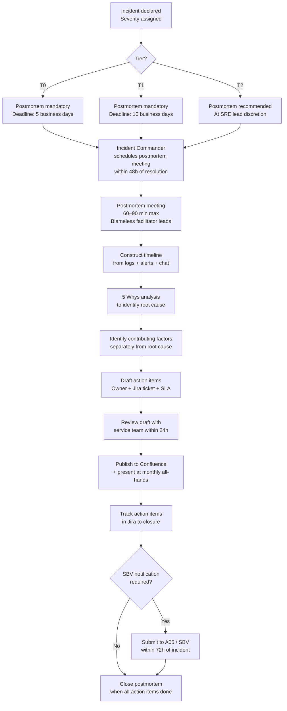

# Incident Postmortem

Status: Draft | Last Reviewed: 2026-05-09 | Owner: @sre-lead
Catalog ID: BP-010 | Radii
Tier Applicability: T0, T1, T2

## Problem Statement

- Techcombank is subject to SBV breach notification under Decree 13/2023 Art. 26, which requires documented incident analysis to be submitted within 72 hours of a qualifying incident. Without a structured postmortem process, assembling that documentation under time pressure is error-prone and risks regulatory non-compliance.
- T0 incidents involving the payment gateway or NAPAS integration directly affect customer transactions. Repeating the same incident — because the root cause was never properly identified — is a failure of process, not of people.
- Without a blameless framework, engineers withhold information during postmortem discussions, producing incomplete timelines and shallow root-cause analysis. Shallow analysis generates action items that do not address systemic causes.
- Postmortem action items that are not tracked to closure recur as incidents. Without Jira tickets with SLA-bound due dates, action items drift and accumulate technical debt.
- Postmortems completed in isolation — not shared with the broader engineering organisation — fail to produce cross-team learning. The same class of failure can independently recur in a separate service.
- Inconsistent postmortem formats across services make it impossible to trend root-cause categories, spot systemic patterns, or satisfy auditor requests for incident documentation.

## Solution / Practice Description

Incident postmortem is a structured, blameless review conducted within a defined SLA after every qualifying production incident — producing a standardised document that captures timeline, impact, root cause (via 5 Whys), contributing factors, and action items with owners and due dates — shared broadly to maximise organisational learning.



## Implementation Guidelines

### 1. Incident Severity and Postmortem SLA

| Severity | Definition | Postmortem SLA | Action Item SLA (Critical) | Action Item SLA (Major) |
|---|---|---|---|---|
| SEV-1 (T0) | Payment gateway, NAPAS, core banking unavailable | 5 business days | 14 calendar days | 30 calendar days |
| SEV-2 (T1) | Degraded service affecting > 10% of users | 10 business days | 14 calendar days | 30 calendar days |
| SEV-3 (T2) | Degraded service < 10% users, workaround available | Recommended; no hard SLA | 30 calendar days | 60 calendar days |

### 2. Postmortem Template

```markdown
# Postmortem: [Incident Title]

**Incident ID**: INC-YYYY-NNNN
**Severity**: SEV-1 | SEV-2 | SEV-3
**Postmortem ID**: PM-YYYY-NNNN
**Date of Incident**: YYYY-MM-DD HH:MM UTC+7
**Date of Resolution**: YYYY-MM-DD HH:MM UTC+7
**Duration**: X hours Y minutes
**Postmortem Author**: @[name]
**Facilitator**: @[name — must not be the incident commander]
**Review Date**: YYYY-MM-DD
**SBV Notification Required**: Yes | No | Pending Legal review

---

## Impact Summary

| Dimension | Value |
|---|---|
| Customer impact | [X% of users affected; Y transactions failed] |
| Financial impact | [Estimated VND value of failed transactions] |
| Duration | [HH:MM] |
| Services affected | [payment-gateway, napas-connector, ...] |
| Regions affected | [vn-south-1, vn-north-1, or both] |

## Incident Timeline

All times UTC+7.

| Time | Event | Source |
|---|---|---|
| HH:MM | Alert `PaymentGatewayLatencyHigh` fired | Prometheus |
| HH:MM | On-call engineer paged | PagerDuty |
| HH:MM | Incident declared SEV-1 | Slack #incidents |
| HH:MM | Root cause identified | Engineering investigation |
| HH:MM | Mitigation applied | [describe action] |
| HH:MM | Service restored to normal | Prometheus dashboard |
| HH:MM | Incident closed | Incident Commander |

## Root Cause Analysis — 5 Whys

**Symptom**: [What the customer/monitor observed]

1. **Why did customers see payment failures?** → Because the payment-gateway service returned HTTP 503.
2. **Why did payment-gateway return 503?** → Because all connection pool slots to the NAPAS connector were exhausted.
3. **Why were connection pool slots exhausted?** → Because NAPAS upstream latency spiked to 4× normal, holding connections open longer than the timeout.
4. **Why did NAPAS latency spike?** → Because NAPAS was processing a backlog from a prior network event on their side.
5. **Why did we not have a circuit breaker to shed load before pool exhaustion?** → Because the circuit breaker threshold was configured for average latency, not for connection pool utilisation.

**Root Cause**: Missing connection-pool saturation metric in the circuit breaker configuration.

## Contributing Factors

Contributing factors are distinct from the root cause — they are conditions that made the incident worse or harder to detect, but did not alone cause it:

- Monitoring alert for NAPAS latency was set at P99 > 2000 ms; the incident was severe at P99 > 1500 ms, which did not alert.
- Runbook RB-PAY-001 did not include a step for connection pool diagnosis.
- Salary disbursement day amplified the volume of in-flight connections (demand was 2× normal).

## Action Items

| ID | Description | Owner | Jira | Priority | Due Date |
|---|---|---|---|---|---|
| AI-1 | Add connection-pool saturation metric to circuit breaker configuration | @[engineer] | TCB-NNNN | Critical | YYYY-MM-DD |
| AI-2 | Lower NAPAS latency alert threshold to P99 > 1500 ms | @[engineer] | TCB-NNNN | Major | YYYY-MM-DD |
| AI-3 | Update RB-PAY-001 to include connection pool diagnosis steps | @[engineer] | TCB-NNNN | Major | YYYY-MM-DD |
| AI-4 | Add salary disbursement day to capacity planning peak calendar | @sre-lead | TCB-NNNN | Major | YYYY-MM-DD |

## What Went Well

- On-call engineer was paged within 45 seconds of alert firing.
- Incident Commander declared SEV-1 within 3 minutes of page.
- Stakeholder communication sent to Customer Service within 10 minutes.

## Lessons Learned

[3–5 bullet points of transferable learnings for the engineering organisation]

---
*This postmortem is blameless. Individuals are not identified as causes. Systems, configurations, and processes are the subjects of analysis.*
```

### 3. Blameless Facilitation in Practice

The facilitator's role is to enforce blameless language and redirect blame:

- **Redirect pattern**: "It sounds like we're identifying a person as the cause. Let me reframe: what was the system or process condition that made this outcome possible?"
- **Acceptable language**: "The deploy script did not validate the config before applying it."
- **Unacceptable language**: "Alice pushed a bad config."
- The facilitator is never the incident commander — the IC has operational context that makes neutrality difficult.
- Maximum meeting length: 90 minutes. If not finished, continue async in the document. Time-boxing prevents the meeting becoming a tribunal.

### 4. 5 Whys Execution

5 Whys is a structured causal chain, not a brainstorming session:

```
Start from the symptom (what the customer or monitor observed).
Ask "Why?" — answer must be a specific, verifiable condition.
Repeat until the answer is a missing or failed control (process, config, test, monitoring).
That control is the root cause — the thing to fix.
```

Common failure mode: stopping at "human error." A 5 Whys that terminates at a person has not gone deep enough. Continue: "Why was the human in a position where that error was possible?"

### 5. Action Item Tracking in Jira

Every action item from a postmortem becomes a Jira ticket immediately — not "after the postmortem." The postmortem author creates the tickets during or immediately after the meeting:

```
Jira ticket fields (mandatory):
  - Summary: [PM-YYYY-NNNN] [AI-N] [Short description]
  - Description: Link to postmortem Confluence page + full action item text
  - Assignee: Named owner from postmortem table
  - Due Date: Per SLA (critical: 14 days; major: 30 days)
  - Label: postmortem-action-item
  - Epic: SRE-Reliability-[Year]
```

SRE lead reviews open postmortem action items weekly in the SRE team meeting. Overdue tickets trigger a PagerDuty low-urgency notification to the ticket owner and the SRE lead.

### 6. Sharing and Organisational Learning

- **Confluence**: postmortem published to `SRE > Postmortems > YYYY` within 24 hours of postmortem meeting.
- **Monthly engineering all-hands**: SRE lead presents 2–3 postmortem summaries — focus on lessons learned, not incident details.
- **Cross-service pattern tracking**: postmortems tagged with root-cause category (e.g., `missing-circuit-breaker`, `config-not-validated`, `alert-threshold-too-high`). Quarterly review of tag frequency identifies systemic patterns.

## When to Apply / When NOT to Apply

**Apply when:**
- Any SEV-1 (T0) or SEV-2 (T1) incident has occurred — postmortem is mandatory.
- A SEV-3 incident has a novel root cause that other teams could learn from.
- A chaos engineering drill ([BP-005](chaos-engineering.md)) reveals a gap that needs systemic remediation.
- SBV breach notification is required — the postmortem document is the primary evidence artefact.

**Do NOT apply when:**
- An alert was a confirmed monitoring false positive with no customer impact — log it in the alert configuration backlog instead.
- The event was a planned maintenance window — use a maintenance review form, not a postmortem.

## Variants & Trade-offs

| Variant | When | Trade-off |
|---|---|---|
| **Full postmortem (default for T0/T1)** | SEV-1 and SEV-2 incidents | Maximum learning; highest process cost (60–90 min meeting + document) |
| **Lightweight postmortem** | SEV-3, no novel cause | Document only: impact, root cause, 1–2 action items; no meeting required |
| **Joint postmortem** | Multiple services affected by same incident | Single document reduces duplication; requires cross-team facilitator |
| **Async postmortem** | Team is distributed; meeting scheduling is hard | Document-first, comment-based; risk of lower participation depth |

## NFR Acceptance Criteria

```yaml
service_name: "[service]-incident-postmortem-compliance"
tier: T0
acceptance_criteria:
  - id: IP-1
    description: >
      Every SEV-1 (T0) incident has a published postmortem in Confluence within
      5 business days of incident resolution, containing all mandatory sections.
    verification: >
      Query Confluence label "postmortem" + service name. Verify date published vs
      incident resolution date. Spot-check three postmortems for mandatory section
      completeness (timeline, 5 Whys, action items with Jira links).

  - id: IP-2
    description: >
      Every postmortem action item with Critical priority has a Jira ticket created
      on the day of the postmortem meeting, with due date within 14 calendar days.
    verification: >
      Jira query: label = postmortem-action-item AND priority = Critical AND
      created > [postmortem date]. Confirm due dates are within 14-day window.

  - id: IP-3
    description: >
      If the incident triggered SBV breach notification requirements, the postmortem
      summary was submitted to the SBV (A05) within 72 hours of the incident.
    verification: >
      Compliance team attestation in the postmortem document. SBV submission
      timestamp recorded in the postmortem under "SBV Notification" section.

  - id: IP-4
    description: >
      No SEV-1 postmortem is authored by the incident commander — a neutral
      facilitator is named in every postmortem document.
    verification: >
      Postmortem template field "Facilitator" is populated and is a different
      person from the "Incident Commander" field. Spot-check 5 recent postmortems.
```

## Compliance Mapping

| Layer | Reference | Section/Control | How |
|---|---|---|---|
| Ring 0 | Google SRE Book Chapter 15 (Postmortem Culture: Learning from Failure) | Blameless postmortem framework, 5 Whys, action item tracking | Postmortem template and blameless facilitation process directly implement the SRE postmortem framework |
| Ring 0 | NIST SP 800-53 IR-4 (Incident Handling) | Post-incident analysis and lessons learned | Postmortem process satisfies IR-4's requirement for documented incident analysis and improvement actions |
| Ring 1 | BCBS 230 Principle 6 ⚠️ (working summary — pending PDF fetch) | Operational risk incidents require structured analysis and remediation tracking | Jira action item tracking with SLA and the Confluence postmortem artefact satisfy the analysis and remediation documentation requirement |
| Ring 2 | Decree 13/2023 Art. 26 ⚠️ (working summary — pending Legal review) | Breach notification — incident analysis must be submitted to A05 within 72 hours | Postmortem document is the primary artefact for the SBV 72-hour notification; the 5-business-day postmortem SLA for T0 ensures it is ready |
| Ring 2 | SBV Circular 09/2020 §IV.3 ⚠️ (working summary — pending Legal review) | Incident logging and documentation requirements | Postmortem Confluence publication and ServiceNow incident log satisfy the circular's incident documentation requirements |

## Cost / FinOps Notes

| Item | Cost driver | Guidance |
|---|---|---|
| Postmortem meeting time | 60–90 min × participants (typically 5–8 people) | Facilitation keeps meetings to 90 min; async doc completion for remaining details |
| Document authoring | 2–4 hours for author post-meeting | Invest in the template — fill-in-the-blank reduces effort significantly |
| Jira ticket management | Minimal if tickets are created at meeting time | Do not defer ticket creation — tickets created days later lose context |
| Monthly all-hands preparation | 30 min per postmortem summary slide | Rotate responsibility across the SRE team to distribute load |

**ROI**: A single prevented recurrence of a T0 incident (30 min downtime, 3,000 failed transactions) pays for a full year of postmortem investment across a 10-person SRE team.

## Threat Model Summary

- **Incomplete timeline**: chat logs and alert history are not collected within 24h and are lost. Mitigation: incident commander is responsible for immediately archiving Slack thread and alert timeline before the postmortem meeting.
- **Shallow root cause**: 5 Whys stops at "human error." Mitigation: facilitator is trained to redirect; the template requires the root cause to be a system/process condition.
- **Action item drift**: Jira tickets are created but never worked. Mitigation: SRE lead reviews open postmortem action items weekly; overdue tickets trigger PagerDuty notification.
- **Postmortem used punitively**: management references postmortem documents in performance reviews. Mitigation: blameless policy ([BP-011](blameless-culture.md)) explicitly prohibits this; postmortems are HR-neutral documents.
- **SBV deadline breach**: 72-hour notification window missed because postmortem was not started until after the window. Mitigation: Compliance team is notified within 1 hour of incident resolution when SBV notification may be required; initial notification is sent immediately with a full report to follow.

## Operational Runbook (stub)

- **Trigger postmortem**: incident resolved → Incident Commander creates postmortem document from template in Confluence; schedules meeting within 48 hours.
- **Alert: `PostmortemOverdue`** — postmortem not published within SLA; PagerDuty low-urgency to SRE lead.
- **Alert: `PostmortemActionItemOverdue`** — Jira ticket past due date; PagerDuty low-urgency to ticket owner and SRE lead.
- **SBV notification flow**: on T0 incident resolution, Compliance is paged immediately; postmortem summary is forwarded to the SBV liaison within 72 hours.
- **Monthly all-hands slot**: SRE lead owns a standing 15-minute slot in the engineering all-hands to present postmortem learnings.

## Test Strategy (stub)

- **Template completeness check**: GitLab CI lint validates that the postmortem template has not been modified to remove mandatory sections.
- **Jira integration test**: staging environment test that creates a postmortem action item and verifies the Jira ticket is auto-linked.
- **Quarterly process review**: SRE lead reviews the last quarter's postmortems for blameless language compliance, root-cause depth (no "human error" root causes), and action item closure rate.

## Related Patterns / Best Practices

- [BP-005 Chaos Engineering](chaos-engineering.md) — postmortems generate new chaos hypotheses; chaos drills that reveal gaps are treated as proto-incidents requiring postmortem-style analysis
- [BP-009 Runbook Authoring](runbook-authoring.md) — postmortems frequently identify missing or inadequate runbooks as contributing factors
- [BP-011 Blameless Culture](blameless-culture.md) — postmortems are only effective if the organisational culture is blameless; the two practices are inseparable
- [BP-006 Capacity Planning](capacity-planning.md) — capacity-related postmortems feed back into the quarterly forecast model

## References

- Google SRE Book Chapter 15 (Postmortem Culture: Learning from Failure)
- Google SRE Workbook Chapter 10 (Postmortem example and template)
- NIST SP 800-53 Rev 5, Control IR-4 (Incident Handling)
- Atlassian Jira documentation (for postmortem action item tracking integration)
- Decree 13/2023 Art. 26 — Vietnamese personal data breach notification requirements
- SBV Circular 09/2020 — Vietnamese banking operational resilience requirements

---

**Key Takeaway**: Every T0 incident at Techcombank must produce a blameless postmortem within 5 business days — a structured document with timeline, 5 Whys root cause, Jira-tracked action items, and regulatory evidence for SBV breach notification — because unexamined failures in banking do not merely repeat; they compound.
