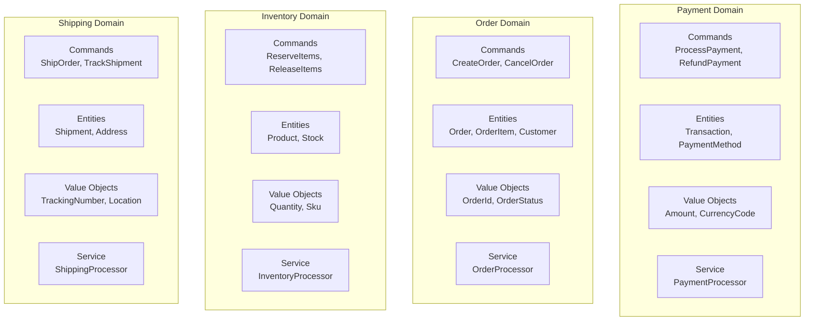
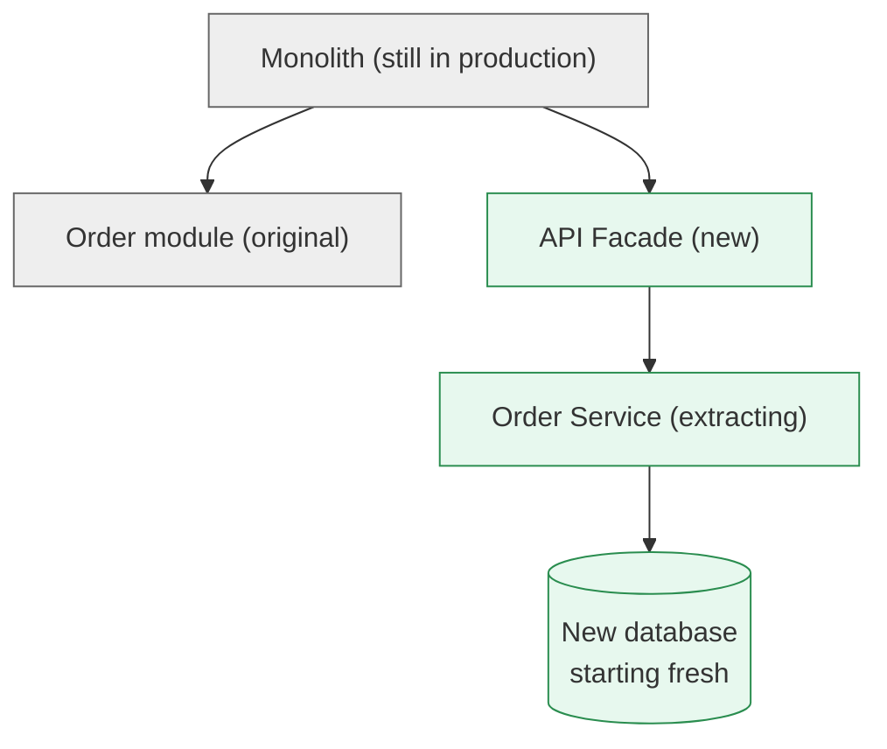
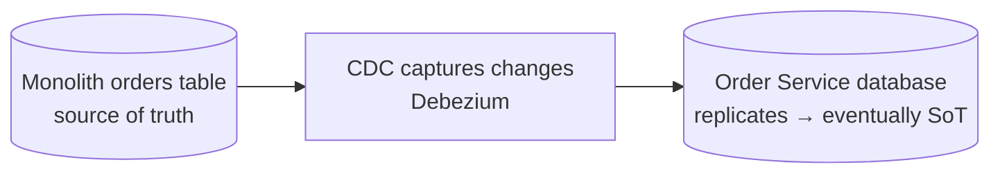
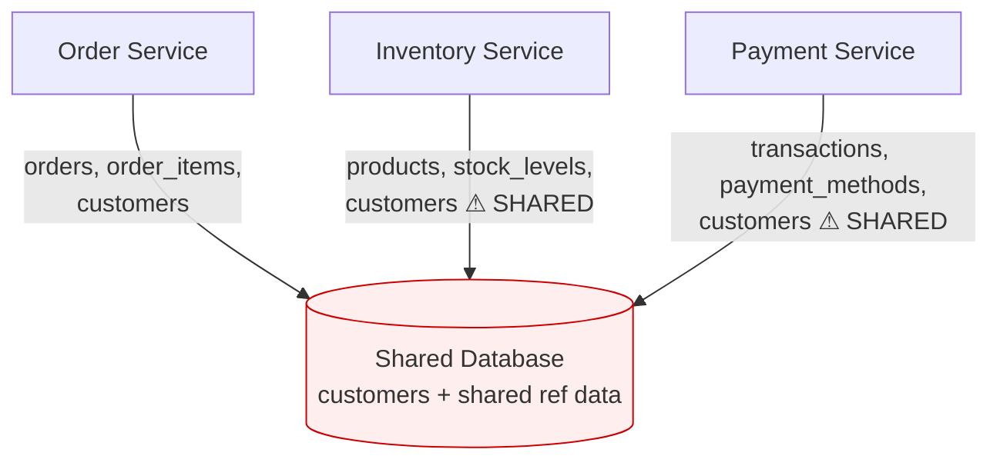
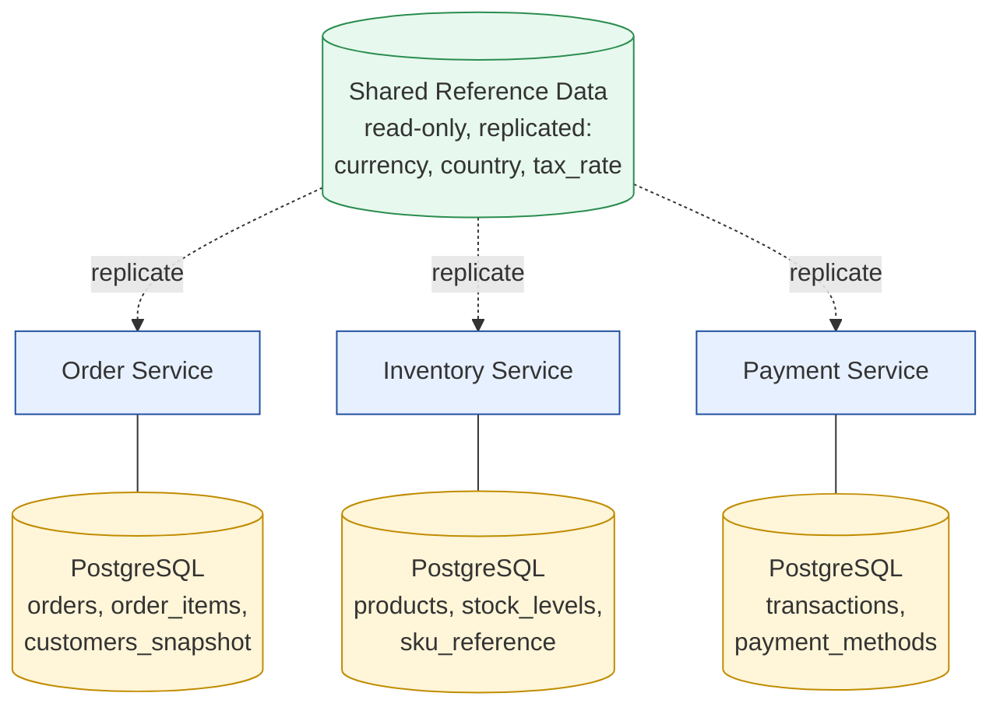

# Microservice Decomposition Best Practice

Status: Approved | Last Reviewed: 2026-03-05 | Owner: @ea-board
Catalog ID: BP-003 | Radii
Tier Applicability: T0, T1, T2, T3

## Problem Statement

Monolithic applications lack autonomy:
- Teams blocked waiting for others' deployments
- Database schema changes require coordination across teams
- Scaling difficult (scale entire monolith, not individual features)
- Technology stack locked (all code uses same language/framework)
- Single point of failure: monolith down = entire system down

## Solution

Decompose monolith into microservices. Each service owns its domain, data, and deployment.

## Decomposition Strategy

### 1. Domain-Driven Design (DDD)

**Bounded Contexts**: Core organizational principle for service boundaries.

Bounded Contexts (natural service boundaries):



**Identifying Bounded Contexts**:
1. Interview domain experts
2. Identify ubiquitous language (terminology)
3. Find context boundaries (where terminology changes)
4. Map to service boundaries

### 2. Service Identification Framework

| Criterion | Question | Weight |
|-----------|----------|--------|
| **Autonomy** | Can this be deployed independently? | High |
| **Cohesion** | Are entities strongly related? | High |
| **Coupling** | How often does it interact with others? | High |
| **Scalability** | Different scaling needs? | Medium |
| **Team Size** | Can one team own it? | Medium |
| **Data Isolation** | Can it own its database? | High |

### 3. Strangler Fig Pattern** (Gradual Migration)

Phase 1: **Analysis** — Monolith contains Order, Payment, Inventory, Shipping modules. Identify the lowest-coupled module (typically Order) as the first extraction candidate.

Phase 2: **Parallel Implementation**



Phase 3: **Intercept Requests**

For each Order request:

1. Check: does the order exist in the new Order Service?
2. If yes: route to the Order Service.
3. If no: route to the Monolith (fallback).

Dual writes during the cutover window:

1. Write to the new Order Service.
2. Write to the Monolith (this leg eventually stops).

Phase 4: **Data Sync**



Phase 5: **Switch Over** — all traffic routed to the Order Service; Monolith order code can be retired.

### 4. Database Decomposition

**Before** (shared database — services tightly coupled through `customers`):



**After** (database per service + replicated reference data):



**Implementation Steps**:
1. Create new database for service
2. Copy relevant data from monolith
3. Implement CDC (Debezium) to sync
4. Deploy service pointing to new DB
5. Run dual writes (monolith + service)
6. Verify data consistency
7. Switch reads to new DB
8. Remove dual writes

### 5. API Contract Definition

Before extracting service, define contracts:

```yaml
# order-service-contract-v1.yaml
openapi: 3.0.0
info:
  title: Order Service API
  version: 1.0.0

paths:
  /api/v1/orders:
    post:
      summary: Create order
      requestBody:
        required: true
        content:
          application/json:
            schema:
              $ref: '#/components/schemas/CreateOrderRequest'
      responses:
        '201':
          description: Order created
          content:
            application/json:
              schema:
                $ref: '#/components/schemas/Order'

components:
  schemas:
    CreateOrderRequest:
      type: object
      properties:
        customerId:
          type: string
        items:
          type: array
          items:
            $ref: '#/components/schemas/OrderItem'
```

## Decomposition Checklist

- [ ] Bounded contexts identified (via DDD)
- [ ] Service candidates ranked by decomposition difficulty
- [ ] API contracts defined in OpenAPI
- [ ] Database decomposition planned
- [ ] Strangler facade designed
- [ ] CDC strategy for data sync
- [ ] Dual-write temporary implementation planned
- [ ] Circuit breaker for fallback to monolith
- [ ] Monitoring for service health
- [ ] Team assignments and ownership

## Anti-Patterns to Avoid

❌ **Chatty Services**
```
Service A calls Service B calls Service C (high latency, brittle)
✓ Better: Cache or use events
```

❌ **Distributed Transactions**
```
2-phase commit across services (blocks, unreliable)
✓ Better: SAGA pattern with compensation
```

❌ **Shared Database**
```
Multiple services use same tables (tight coupling)
✓ Better: Database per service, sync via CDC/events
```

❌ **Service Too Small**
```
One endpoint per service (overhead outweighs benefits)
✓ Better: 3-5 related entities per service
```

## Metrics to Track

Decomposition health metrics:

- **Deployment frequency** (should increase per service)
- **Lead time for changes** (should decrease)
- **Mean time to recovery (MTTR)**
- **Change failure rate**
- **Inter-service call latency**
- **Data consistency gaps** (CDC lag)

## Timeline Expectations

| Phase | Duration | Effort |
|-------|----------|--------|
| Analysis | 2-4 weeks | 2-3 people |
| Pilot extraction | 2-4 weeks | 3-5 people |
| Full rollout | 3-6 months | Team per service |

## Team Structure Post-Decomposition

Squad model:

- **Order Squad**: 1 Backend Engineer · 1 Frontend Engineer · 1 Product Manager
- **Payment Squad**: 2 Backend Engineers (payment is complex) · 1 Product Manager
- **Platform Squad** (cross-cutting): Infrastructure engineer · Security engineer · Data engineer · DBA

## Common Pitfalls

1. **Decomposing too early**: Extract when clear boundaries exist, not before
2. **Wrong boundaries**: Use DDD, don't decompose by layer
3. **Ignoring data consistency**: Plan CDC/event sync carefully
4. **Inadequate monitoring**: Can't operate what you can't see
5. **Underestimating operational complexity**: More services = more to operate

## References

- [Domain-Driven Design (Evans)](https://www.domainlanguage.com/ddd/)
- [Building Microservices (Newman)](https://samnewman.net/books/building_microservices/)
- [Strangler Fig Pattern](https://martinfowler.com/bliki/StranglerFigApplication.html)
- [Microservice Prerequisites](https://martinfowler.com/bliki/MicroservicePrerequisites.html)

---

**Key Takeaway**: Use Domain-Driven Design to identify service boundaries. Extract using Strangler Fig pattern. Each service owns its database. Plan carefully before decomposing.
