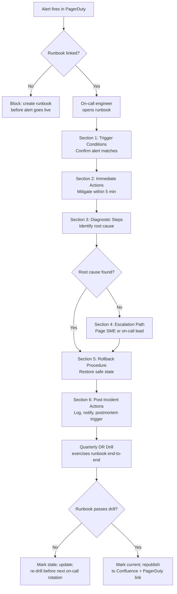

# Runbook Authoring

Status: Draft | Last Reviewed: 2026-05-09 | Owner: @sre-lead
Catalog ID: BP-009 | Radii
Tier Applicability: T0, T1, T2, T3

## Problem Statement

- A vague or incomplete runbook for NAPAS session recovery can add 10–20 minutes to a T0 incident. At Techcombank's transaction volumes, 10 minutes of payment gateway unavailability during peak hours represents hundreds of thousands of VND in failed settlement and triggers SBV breach notification obligations.
- On-call engineers rotate. The engineer paged at 3am may never have touched the affected service. If the runbook assumes tribal knowledge, the responder is effectively flying blind while customers cannot make payments.
- Runbooks that lack exact commands, expected outputs, and "what-if" branches slow down every step of the incident response cycle — detection, diagnosis, mitigation, escalation — compounding the blast radius.
- PagerDuty alerts without a direct runbook link force responders to search Confluence under pressure. Every second of search time is a second of unmitigated impact.
- Runbooks that are never exercised rot. DR drills reveal gaps; gaps not found in drills are found during real incidents.
- Inconsistent runbook formats across services mean on-call engineers must relearn the structure for every service, increasing cognitive load at exactly the moment when load must be minimised.

## Solution / Practice Description

Runbook authoring is the disciplined process of writing, structuring, validating, and maintaining operational runbooks to a standard that allows any trained on-call engineer to execute them correctly under pressure — every runbook follows a mandatory six-section structure, contains exact commands with expected outputs, and is exercised in quarterly DR drills before it is declared current.



## Implementation Guidelines

### 1. Mandatory Six-Section Structure

Every runbook — regardless of service or tier — must contain these six sections in this order:

```markdown
# Runbook: [Alert Name] — [Service Name]

**Alert**: `<PagerDuty alert name>`
**Runbook ID**: RB-[service-abbrev]-[NNN]
**Last Verified**: YYYY-MM-DD (DR drill or live incident)
**Owner**: @[team-handle]
**Tier**: T0 | T1 | T2 | T3

---

## 1. Trigger Conditions
<!-- When does this runbook apply? What alert(s) fire? What thresholds? -->
- Alert `PaymentGatewayLatencyHigh` fires when P99 latency > 2000 ms for > 3 minutes.
- Symptom: customers report "payment pending" with no confirmation.
- Distinguish from: `PaymentGatewayDown` (no traffic at all) — use RB-PAY-002 instead.

## 2. Immediate Actions (< 5 min)
<!-- Steps that reduce blast radius NOW. Commands must be copy-pasteable. -->
1. Verify the alert is real (not a monitoring false positive):
   ```bash
   kubectl top pods -n payment-gateway --sort-by=cpu
   ```
   Expected: you see pods with CPU > 80%. If all pods are < 20%, check Prometheus query.

2. Check NAPAS downstream latency:
   ```bash
   curl -s https://internal-monitoring/api/napas/latency | jq '.p99_ms'
   ```
   Expected: value < 500. If > 1000, the issue is downstream — proceed to Section 3 step 2.

3. If pods are CPU-saturated, trigger manual scale-out:
   ```bash
   kubectl scale deployment payment-gateway -n payment-gateway --replicas=12
   ```
   Expected: `deployment.apps/payment-gateway scaled`. New pods ready in ~90 seconds.

## 3. Diagnostic Steps
<!-- Ordered steps to identify the root cause. Include expected vs unexpected output. -->

## 4. Escalation Path
<!-- Who to call, when, how. Never ambiguous. -->
- If not resolved in 15 min: page `@sre-lead` via PagerDuty escalation policy `P-PAY-SRE`.
- If NAPAS is the root cause: contact NAPAS liaison (name, phone in 1Password vault `napas-contacts`).
- If T24 sessions exhausted: contact T24 DBA on-call (PagerDuty `P-T24-DBA`).

## 5. Rollback Procedure
<!-- How to restore the last known good state if the fix makes things worse. -->

## 6. Post-Incident Actions
<!-- Steps after mitigation: logging, notifications, postmortem trigger. -->
- Log incident in ServiceNow with incident ID and timeline.
- If T0: trigger postmortem per BP-010 within 5 business days.
- If SBV notification required: alert Compliance within 1 hour (Decree 13/2023 Art. 26).
- Update this runbook with any gaps found.
```

### 2. Command Standards — Exact, Copy-Pasteable, With Expected Output

Every command block in a runbook must follow this pattern:

```markdown
Run the following command to check consumer group lag:
```bash
kubectl exec -n kafka kafka-client-0 -- kafka-consumer-groups.sh \
  --bootstrap-server kafka-bootstrap:9092 \
  --group payment-processor \
  --describe
```
**Expected output**: LAG column shows < 1000 for all partitions.
**If LAG > 10000**: consumer group is stalled — proceed to step 4b.
**If command fails with "connection refused"**: Kafka broker is down — escalate to Section 4 immediately.
```

Never write a command without an expected output and at least one "if not expected" branch. This is the most important rule for 3am usability.

### 3. PagerDuty Integration — Every Alert Links to Its Runbook

No PagerDuty alert goes live without a runbook link. Enforce this via the alert annotation standard:

```yaml
# Prometheus alerting rule — required annotation format
groups:
  - name: payment_gateway
    rules:
      - alert: PaymentGatewayLatencyHigh
        expr: histogram_quantile(0.99, rate(http_request_duration_seconds_bucket{job="payment-gateway"}[5m])) > 2.0
        for: 3m
        labels:
          severity: critical
          tier: T0
        annotations:
          summary: "Payment Gateway P99 latency exceeded 2000ms"
          description: "P99 latency is {{ $value | humanizeDuration }} on job={{ $labels.job }}"
          runbook_url: "https://confluence.techcombank.vn/runbooks/RB-PAY-001"
          dashboard_url: "https://grafana.techcombank.vn/d/payment-gateway/overview"
```

The `runbook_url` annotation is mandatory for all T0/T1 alerts. GitLab CI pipeline validation checks that every alert rule with `tier: T0` or `tier: T1` has a non-empty `runbook_url` annotation.

### 4. Runbook Lifecycle — Creation, Review, and Staleness

```
New service onboarding
  └─> Identify all PagerDuty alerts (minimum: 1 per critical failure mode)
  └─> Author runbook for each alert (use template above)
  └─> Peer review by one on-call engineer who did NOT author it
  └─> DR drill exercise (simulate alert; execute runbook; document gaps)
  └─> Publish to Confluence + link in PagerDuty annotation
  └─> Mark: verified_date = today

Quarterly DR drill
  └─> Execute each T0/T1 runbook against a simulated incident
  └─> If runbook fails drill: mark stale; open Jira ticket; fix before next rotation
  └─> Update verified_date on pass

Staleness rule
  └─> verified_date > 90 days ago → runbook tagged [STALE] in Confluence
  └─> [STALE] runbooks: PagerDuty on-call lead notified; must be re-drilled
  └─> [STALE] runbooks used in a real incident → post-incident action item to update
```

### 5. Runbook Authoring Checklist for Authors

Before marking a runbook as ready for DR drill:

- [ ] All six sections are present and non-empty.
- [ ] Every command has an expected output and at least one branch for unexpected output.
- [ ] Escalation path names specific people or PagerDuty policies — not "contact the team."
- [ ] Rollback procedure is present and has been manually tested in staging.
- [ ] PagerDuty alert annotation `runbook_url` is set and resolves to this runbook.
- [ ] A second on-call engineer (not the author) has read and confirmed they could execute it cold.
- [ ] `Last Verified` date is set to the date of the peer review.

### 6. Storing and Discovering Runbooks

Runbooks live in two places and must be kept in sync:

| Location | Purpose | Tooling |
|---|---|---|
| `runbooks/` in the service repository | Source of truth; reviewed in MR | GitLab, Markdown |
| Confluence space `SRE > Runbooks > [Service]` | Searchable during incident | Auto-published via GitLab CI webhook on merge to main |

The Confluence page title follows the format: `[RB-PAY-001] Payment Gateway — Latency High`. This makes it findable by alert name within seconds.

## When to Apply / When NOT to Apply

**Apply when:**
- Creating any PagerDuty alert for a T0, T1, T2, or T3 service — all alerts need runbooks.
- Onboarding a new service to the on-call rotation.
- An incident postmortem ([BP-010](incident-postmortem.md)) identifies a missing or inadequate runbook.
- A quarterly DR drill flags a runbook as stale.

**Do NOT apply when:**
- An alert is informational only (no action required by the on-call engineer) — use a comment in the alert annotation instead of a full runbook.
- A runbook would be a single line ("restart the pod") — embed that as an annotation note and save the full runbook format for alerts requiring judgement.

## Variants & Trade-offs

| Variant | When | Trade-off |
|---|---|---|
| **Full six-section runbook (default)** | T0/T1 critical alerts | Maximum usability under pressure; high authoring cost |
| **Abbreviated runbook (3 sections)** | T2/T3 low-urgency alerts | Faster to author; less prescriptive for complex failures |
| **Automated runbook (runbook-as-code)** | Repeatable, fully automatable recovery (e.g., scale-out) | Zero human time if it works; dangerous if automation runs in the wrong context |
| **Decision-tree runbook** | Multi-path incidents (e.g., latency could be NAPAS, Kafka, or DB) | Clearest for complex triage; more effort to maintain all branches |

## NFR Acceptance Criteria

```yaml
service_name: "[service]-runbook-authoring-compliance"
tier: T0
acceptance_criteria:
  - id: RA-1
    description: >
      Every PagerDuty alert for this service has a runbook_url annotation that resolves
      to a published Confluence runbook following the six-section standard.
    verification: >
      GitLab CI pipeline check: all alert rules with tier T0 or T1 have non-empty
      runbook_url. Spot-check: follow 3 random runbook_url values; confirm all six
      sections are present and non-empty.

  - id: RA-2
    description: >
      Every T0/T1 runbook has been exercised in a DR drill within the last 90 days.
      Runbooks older than 90 days are tagged [STALE] and a Jira ticket is open for update.
    verification: >
      Confluence search for [STALE] tag returns zero results for this service's runbooks.
      Drill log in governance/dr-drills/ shows each T0/T1 runbook exercised within 90 days.

  - id: RA-3
    description: >
      Every command in the runbook has an expected output documented and at least one
      branch for when the output does not match expectations.
    verification: >
      Peer review attestation present on the runbook MR. Second engineer sign-off recorded
      in GitLab MR approval history.

  - id: RA-4
    description: >
      Time from PagerDuty alert to runbook open is < 30 seconds for a trained on-call
      engineer — the runbook_url in the alert body is a direct deep-link to the runbook,
      not a search page.
    verification: >
      Timed walkthrough: page a test alert in staging, open the runbook from PagerDuty,
      confirm the link goes directly to the runbook. Timer must read < 30 s.
```

## Compliance Mapping

| Layer | Reference | Section/Control | How |
|---|---|---|---|
| Ring 0 | Google SRE Book Chapter 14 (Managing Incidents) | Structured incident response requires documented procedures | Six-section runbook structure operationalises the SRE incident management framework |
| Ring 0 | NIST SP 800-53 IR-8 (Incident Response Plan) | Documented, tested incident response procedures | Quarterly DR drill exercise requirement satisfies IR-8 testing mandate |
| Ring 0 | PagerDuty Incident Response Guide | Alert-to-runbook linkage as operational best practice | `runbook_url` annotation standard enforces this pattern for every alert |
| Ring 1 | BCBS 230 Principle 6 ⚠️ (working summary — pending PDF fetch) | Operational risk requires documented and tested response procedures | Runbook lifecycle (author, review, drill, publish) directly satisfies the testing and documentation control |
| Ring 2 | SBV Circular 09/2020 §IV.3 Incident logging ⚠️ (working summary — pending Legal review) | Incident responses must be logged with timeline evidence | Post-incident actions section mandates ServiceNow logging; DR drill logs satisfy audit trail requirement |

## Cost / FinOps Notes

| Item | Cost driver | Guidance |
|---|---|---|
| Runbook authoring time | 2–4 hours per runbook (first time) | Investment pays back at first 3am incident; amortise across service lifetime |
| DR drill time | 0.5–1 person-day per service per quarter | Bundle multiple service runbooks into a single drill window to reduce overhead |
| Confluence hosting | Negligible per page | No cost concern |
| Automation investment | High for runbook-as-code | Only invest when the same manual recovery step recurs > 3 times per quarter |

**Cost of poor runbooks**: a 10-minute delay in NAPAS payment recovery costs more than a full year of runbook authoring investment across the entire SRE team.

## Threat Model Summary

- **Runbook drift**: the system changes; the runbook does not. Commands fail. Mitigation: 90-day staleness policy and mandatory DR drill exercise.
- **Runbook unavailability**: Confluence is down during an incident. Mitigation: runbooks committed to the service repository in `runbooks/`; on-call engineers have local git clones.
- **Incorrect escalation path**: the runbook names a person who has left the team. Mitigation: escalation paths reference PagerDuty policy names (stable) not individual names (volatile).
- **Automation runbook misfire**: automated runbook triggers in the wrong environment. Mitigation: all automation runbooks check `CLUSTER_ENV` before executing; T0 automation requires human confirmation.

## Operational Runbook (stub)

- **Alert: `RunbookStale`** — runbook verified_date > 90 days; PagerDuty low-urgency to SRE lead.
- **Alert: `AlertMissingRunbookUrl`** — CI pipeline detected a T0/T1 alert without runbook_url; blocks merge.
- **Quarterly drill scheduling**: SRE lead publishes drill calendar in `governance/dr-drills/YYYY-QQ-plan.md` at the start of each quarter.
- **Runbook publication**: GitLab CI job `publish-runbooks` runs on merge to main; pushes updated Markdown to Confluence via API.

## Test Strategy (stub)

- **CI lint**: GitLab CI pipeline validates every alert rule file — checks for `runbook_url`, `severity`, and `tier` annotations. Fails the pipeline if any T0/T1 alert is missing a runbook link.
- **Quarterly DR drill**: each T0/T1 runbook is executed against a simulated incident in staging. Pass criteria: engineer unfamiliar with the service can reach mitigation step within the declared RTO using only the runbook.
- **Runbook review**: every runbook MR requires approval from one engineer who did not author it. Reviewer must attest they could execute the runbook cold.

## Related Patterns / Best Practices

- [BP-005 Chaos Engineering](chaos-engineering.md) — chaos drills exercise runbooks; gaps feed back into runbook updates
- [BP-010 Incident Postmortem](incident-postmortem.md) — postmortem action items frequently include runbook creation or updates
- [BP-011 Blameless Culture](blameless-culture.md) — runbooks that are clear and blame-free lower the barrier to incident reporting
- [BP-007 Golden Signals (SRE)](golden-signals-sre.md) — diagnostic steps in runbooks reference golden signal dashboards

## References

- Google SRE Book Chapter 14 (Managing Incidents)
- PagerDuty Incident Response Guide — response.pagerduty.com
- NIST SP 800-53 Rev 5, Control IR-8
- Confluence REST API documentation (for automated runbook publishing)
- SBV Circular 09/2020 (Vietnamese banking operational continuity regulation)

---

**Key Takeaway**: A runbook that cannot be executed by an on-call engineer at 3am who has never seen the service is not a runbook — it is a liability; every Techcombank T0 alert must link to a six-section, command-complete, quarterly-drilled runbook before it goes live in PagerDuty.
