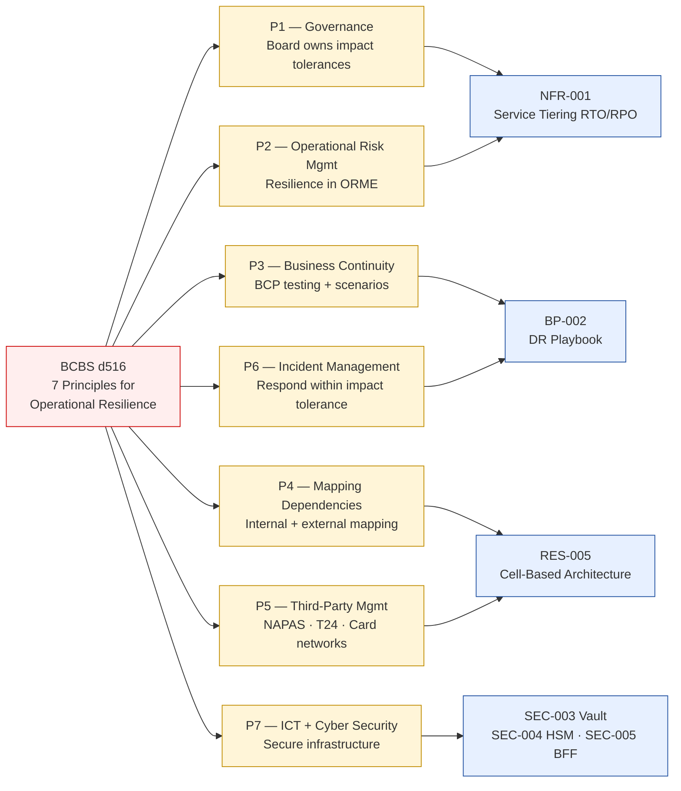

# Basel BCBS 230 — Principles for Operational Resilience (BIS d516)

Status: Draft | Last Reviewed: 2026-05-09 | Owner: @sre-lead
Catalog ID: COMP-006 | Radii
Tier Applicability: T0, T1

> ⚠️ **Working summary** — full PDF (BIS d516) not yet fetched; verbatim principle text pending librarian retrieval. Summary below is based on established industry knowledge of the BIS d516 document (March 2021). See `knowledge-base/_research-notes.md` for the expanded working summary.

## Problem Statement

Basel BCBS 230 (*Principles for Operational Resilience*, BIS d516, March 2021) requires internationally active banks — and by supervisory expectation, domestic systemically important banks (D-SIBs) like Techcombank — to identify their **critical operations**, define an **impact tolerance** for each, and demonstrate through testing that they can recover within that tolerance. Without mapping these 7 principles to the architecture catalog, the bank cannot demonstrate regulatory compliance or measure its actual resilience posture.

## Solution

Apply the 7-principle framework across the enterprise architecture catalog. Impact tolerance becomes the T0/T1 RTO/RPO defined in NFR-001. Each principle maps to one or more catalog patterns that implement its intent.



## The 7 Principles (Working Summary)

> ⚠️ Principle numbering and content below are based on established industry knowledge of BIS d516. Confirm against the full PDF before regulatory submissions.

| # | Principle | Key obligation | Catalog implementation |
|---|-----------|----------------|----------------------|
| 1 | **Governance** | Board and senior management identify critical operations, set impact tolerances, and review resilience posture at least annually | NFR-001 tier definitions + NFR-AC template (TPL-001) constitute the documented impact tolerances |
| 2 | **Operational Risk Management** | Embed operational resilience within the Operational Risk Management Evaluation (ORME); risk identification, assessment, monitoring, and reporting for each critical operation | Risk register + NFR-001 tier review process |
| 3 | **Business Continuity Planning and Testing** | Develop and maintain BCP; conduct regular testing including plausible but severe disruption scenarios (pandemic, cyber-attack, natural disaster); test third-party dependencies | BP-002 (DR Playbook) — quarterly drills; BP-005 (Chaos Engineering) — failure injection |
| 4 | **Mapping Interconnections and Interdependencies** | Map all internal processes, people, technology, facilities, and external providers that support critical operations; identify single points of failure | REF-001 (multi-region topology) — dependency map; RES-005 (cell-based) — blast radius bounding |
| 5 | **Third-party Dependency Management** | Critical operations dependent on third parties must be managed to the same resilience standards; contractual and operational controls | REF-002 (NAPAS integration resilience); T24 vendor SLA management |
| 6 | **Incident Management** | Effective response capability to identify, manage, escalate, resolve, and communicate incidents while staying within impact tolerance | BP-002 (DR runbooks); EIP-025 (Dead Letter Channel); RES-002 (Circuit Breaker) |
| 7 | **ICT including Cyber Security** | ICT infrastructure and cyber security practices support operational resilience; cyber incidents are in-scope disruption scenarios; secure software development lifecycle | SEC-003 (Vault), SEC-004 (HSM), SEC-005 (BFF + DPoP), INT-002 (CDC + Outbox) |

## Impact Tolerance → Catalog RTO/RPO Mapping

| Tier | Critical operation example | Impact tolerance (RTO/RPO) | Catalog reference |
|------|---------------------------|---------------------------|------------------|
| T0 | Payment gateway, real-time settlement | RTO 5 min / RPO 0 (real-time replication) | NFR-001 + REF-001 (active-active) |
| T0 | Core banking balance enquiry | RTO 5 min / RPO 0 | NFR-001 |
| T1 | Account opening and KYC | RTO 15 min / RPO 5 min | NFR-001 |
| T1 | Card authorisation (3DS2) | RTO 5 min / RPO 0 | NFR-001 + REF-004 |
| T2 | Order/loan origination processing | RTO 1 hour / RPO 30 min | NFR-001 |
| T3 | Regulatory reporting batch | RTO 4 hours / RPO 1 hour | NFR-001 |

## Compliance Mapping

| Ring | Regulation | Provision | Pattern implementation |
|------|-----------|-----------|----------------------|
| Ring 0 (global) | NIST SP 800-34 Rev.1 | Contingency Planning; BCP/DRP | Principle 3 (BCP) — methodology reference |
| Ring 0 (global) | ISO 22301 | Business Continuity Management Systems | Provides management system framework for Principle 3 |
| Ring 1 (international banking) | BCBS d516 Principle 1 | Governance — board owns impact tolerances | NFR-001 tier definitions + TPL-001 NFR-AC blocks |
| Ring 1 (international banking) | BCBS d516 Principle 3 | BCP testing including plausible severe scenarios | BP-002 (DR Playbook) + BP-005 (Chaos Engineering) |
| Ring 1 (international banking) | BCBS d516 Principle 6 | Incident management within impact tolerance | BP-002 runbooks + EIP-025 DLT + RES-002 CB |
| Ring 2 (Vietnam) | SBV Circular 09/2020 §IV | Operational continuity and DR drills | SBV §IV aligns with Principles 3 + 6; annual SBV drill = BCBS annual BCP test |

## NFR Acceptance Criteria

```yaml
service_name: "[service]-bcbs230-compliance"
tier: T0
compliance_context:
  regulation: BCBS d516 Principles for Operational Resilience (working summary — pending PDF fetch)
  impact_tolerance_definition: NFR-001 tier RTO/RPO values
  board_review_cadence_months: 12
  bcp_test_cadence_months: 12       # Principle 3 minimum
  incident_mgmt_target_rto_min: 5   # T0 critical operations
acceptance_criteria:
  - id: B230-1
    description: Impact tolerances documented and board-approved for all T0/T1 critical operations
    verification: NFR-AC block present in each T0/T1 service's DAB submission; annual board review meeting minutes on file
  - id: B230-2
    description: BCP test (DR drill) completed within last 12 months for each T0/T1 service
    verification: DR drill log exists in governance/decisions/REVIEW-LOG-DR-*; RTO achieved vs. target recorded
  - id: B230-3
    description: Third-party dependency (NAPAS, card networks, T24) covered by resilience controls
    verification: REF-002 circuit breaker and fallback paths tested in last BCP exercise
  - id: B230-4
    description: Mapping of interconnections maintained and reviewed annually
    verification: REF-001 topology diagram updated within last 12 months; new dependencies added within 30 days of change
```

## Operational Runbook (stub)

1. **Annual board review** — @sre-lead prepares resilience posture report (impact tolerance achieved vs. target per tier); board sub-committee reviews and approves
2. **BCP test cycle** — Q1: DR drill for T0 payment systems; Q2: T1 systems; Q3: third-party dependency test (NAPAS failover simulation); Q4: full enterprise DR drill
3. **Impact tolerance breach** — if actual MTTR > RTO in a real incident: (a) PIR within 5 days, (b) root cause to board within 30 days, (c) remediation plan with timeline
4. **Dependency mapping update** — when a new external provider is onboarded: update REF-001 topology within 30 days; assess resilience controls within 60 days

## Test Strategy (stub)

- **Quarterly**: DR drills per BP-002; measure RTO achieved; compare to impact tolerance
- **Semi-annual**: chaos engineering exercises per BP-005; validate cell isolation (RES-005)
- **Annual**: full BCP test including third-party failover simulation (NAPAS, T24)
- **Per release**: NFR-AC gate in CI pipeline (`lint-nfr-ac.py`) — reject builds where T0/T1 service lacks impact-tolerance documentation

## References

- BIS d516 PDF: https://www.bis.org/bcbs/publ/d516.htm (download pending librarian fetch)
- Research notes: `knowledge-base/_research-notes.md#bcbs-230--principles-for-operational-resilience-bis-d516`
- Related patterns: NFR-001, BP-002, BP-005, RES-002, RES-005, REF-001, EIP-025
- Companion standard: `knowledge-base/compliance/sbv-circular-09-2020.md` (§IV aligns with Principles 3 + 6)

---

**Key Takeaway**: BCBS d516 requires banks to define impact tolerances per critical operation (= RTO/RPO in NFR-001), test BCP annually via DR drills, map all dependencies, and maintain effective incident management. The 7 principles map directly to catalog patterns across the Resilience, Security, and NFR domains.
