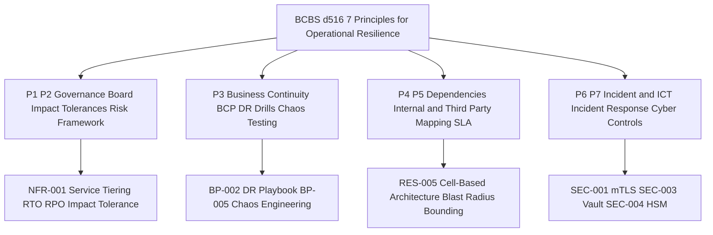

# BCBS 230 Operational Resilience Deep Dive

Status: Draft | Last Reviewed: 2026-05-16 | Owner: @cro
Catalog ID: COMP-006 | Radii
Tier Applicability: T0, T1

## Problem Statement

- T0 services such as the payment gateway and real-time settlement engine operate without formally documented, board-approved impact tolerances, making it impossible to prove to SBV examiners that the bank can quantify and bound the maximum duration of a critical-operation disruption.
- Business Continuity Plans exist as static documents but have never been exercised under production-realistic failure conditions; quarterly BCP drills are scheduled but consistently deferred, leaving Techcombank unable to demonstrate the testing evidence required by BCBS d516 Principle 3.
- NAPAS and SWIFT are single-vendor critical dependencies for domestic and international settlement; no automated fallback queue or circuit-breaker policy is codified in a governance artifact, meaning a 30-minute NAPAS outage can propagate to customer-facing payment failures with no documented containment procedure.
- Incident response procedures are not aligned with BCBS d516 Principle 6; incidents currently tracked in Jira without impact-tolerance timestamps, so post-incident analysis cannot confirm whether the bank remained within its stated tolerance during the disruption.
- SBV Circular 09/2020 Articles 21–30 impose operational continuity and DR-drill obligations on internet-banking operators; without a structured BIA artifact and chaos-engineering programme, Techcombank cannot produce the audit evidence required for SBV on-site examinations.
- Dependency mapping across T0/T1 services is incomplete; internal services such as ledger-service and fraud-detection have undocumented fallback modes, creating hidden blast-radius risk that violates BCBS d516 Principle 4 mapping obligations.
- There is no automated mechanism to detect when a BCP test schedule has lapsed or when a third-party risk review is overdue, meaning compliance gaps go undetected between annual manual audits.

## Context

Reach for this pattern when:

- A T0 or T1 digital banking service (payment gateway, fund transfer, core banking balance enquiry, card authorisation) requires board-approved impact tolerances and documented BCP test evidence to satisfy SBV examiners or BCBS d516 supervisory expectations.
- NAPAS or SWIFT settlement dependency risk must be governed with explicit SLA targets, fallback queues, and semi-annual third-party risk reviews, and those controls must be codified in a machine-readable governance artifact.
- Techcombank's SRE team is planning a chaos engineering exercise under BP-005 and needs a compliance wrapper that records drill results, validates recovery within the stated RTO, and commits evidence to the repository for audit retrieval.
- A new T0 service is being onboarded and the architecture review board requires a completed Business Impact Analysis YAML before approving production deployment.
- SBV Circular 09/2020 Art. 24 post-incident reporting obligations have been triggered (or are at risk of being triggered) and the bank needs to demonstrate its operational continuity posture with structured artefacts.

## Solution

BCBS d516 establishes seven Principles for Operational Resilience that internationally active banks — and by supervisory expectation, domestic systemically important banks like Techcombank — must embed in their governance, architecture, and operations. The central insight of the standard is that a bank must define an **impact tolerance** for each critical operation: the maximum tolerable level of disruption, expressed as a duration. This is not an aspirational SLO; it is a board-approved commitment that must be tested and demonstrated. Mapping the seven principles to Techcombank's T0/T1 architecture catalog transforms abstract regulatory text into concrete, enforceable engineering artefacts.

Principles 1 and 2 (Governance and Operational Risk Management) are implemented by storing impact tolerances in version-controlled Business Impact Analysis YAML files under `governance/bia/`. These files are the single source of truth for RTO, RPO, and maximum tolerable downtime for each T0/T1 service. Board approval is recorded via the pull-request merge log, providing a tamper-evident audit trail. Principles 3 (Business Continuity Planning and Testing) is implemented by the quarterly chaos drill script, which injects pod failures via Chaos Mesh, measures actual recovery time against the stated RTO, and commits structured drill logs to `governance/bia/drill-results/`. The BiaComplianceChecker Spring Boot component polls BIA records daily and fires PagerDuty alerts when a BCP test schedule lapses, ensuring the testing obligation cannot be silently missed.

Principles 4 and 5 (Dependency Mapping and Third-Party Management) are implemented by the third-party risk register YAML files under `governance/third-party-risk/`, which record timeout policies, circuit-breaker configuration, fallback modes, and semi-annual review schedules for critical providers including NAPAS and SWIFT. These files feed the cell-based architecture blast-radius controls defined in RES-005. Principles 6 and 7 (Incident Management and ICT/Cyber Security) are addressed by the Prometheus alert rules in this pattern, which surface impact-tolerance breaches to the on-call SRE team in real time, and by the mTLS and HSM controls in SEC-001 and SEC-004, which ensure that cyber incidents are treated as in-scope disruption scenarios.

### Solution Diagram



## Implementation Guidelines

### 1. Business Impact Analysis YAML

The BIA YAML is the authoritative governance artifact for each T0/T1 service's impact tolerance. It records RTO, RPO, maximum tolerable downtime, internal and external dependency fallback modes, and the BCP test schedule. The file is stored in `governance/bia/` and validated against a JSON Schema on every CI run. Pull-request merge constitutes board-traceable approval.

```yaml
# governance/bia/payment-gateway-bia.yaml
service: payment-gateway
tier: T0
owner: payments-team@techcombank.vn
impact_tolerance:
  rto_minutes: 5
  rpo_minutes: 1
  maximum_tolerable_downtime_hours: 0.25
dependencies:
  internal:
    - service: ledger-service
      criticality: critical
      fallback: read-only-mode
    - service: fraud-detection
      criticality: high
      fallback: allow-with-alert
  external:
    - provider: NAPAS
      criticality: critical
      sla_rto_minutes: 30
      contingency: manual-settlement-queue
    - provider: SWIFT
      criticality: high
      sla_rto_minutes: 120
      contingency: deferred-processing
bcp_test_schedule:
  frequency: quarterly
  last_tested: "2026-03-15"
  next_test_due: "2026-06-15"
  test_type: chaos-drill
```

### 2. BIA Compliance Checker (Spring Boot)

The `BiaComplianceChecker` component runs as a scheduled job within the existing governance Spring Boot pod. It queries the BIA repository for services whose `next_bcp_test_due` date has passed and fires a PagerDuty alert — `CRITICAL` for T0 services, `HIGH` for T1. Structured log lines follow the `event=<key> field=<value>` convention for Loki/Grafana ingestion.

```java
@Component
@RequiredArgsConstructor
@Slf4j
public class BiaComplianceChecker {

    private final BiaRepository biaRepository;
    private final AlertService alertService;

    @Scheduled(cron = "0 0 9 1 * MON-FRI")
    public void checkBcpTestOverdue() {
        List<BiaRecord> overdueServices = biaRepository.findAll().stream()
            .filter(bia -> bia.getNextBcpTestDue().isBefore(LocalDate.now()))
            .toList();

        if (!overdueServices.isEmpty()) {
            overdueServices.forEach(bia -> {
                log.warn("event=bcp_test_overdue service={} due={} tier={}",
                    bia.getService(), bia.getNextBcpTestDue(), bia.getTier());
                alertService.fire(Alert.builder()
                    .severity(bia.getTier().equals("T0") ? Severity.CRITICAL : Severity.HIGH)
                    .title("BCP test overdue: " + bia.getService())
                    .description("BCBS 230 P3 — quarterly BCP test overdue for " + bia.getService())
                    .build());
            });
        }
    }
}
```

### 3. Third-Party Risk Register YAML

The third-party risk register YAML codifies resilience controls, SLA commitments, and review schedules for each critical external provider. NAPAS is classified as `critical` due to its role in domestic interbank settlement. The file is stored in `governance/third-party-risk/` and reviewed semi-annually by the enterprise risk team.

```yaml
# governance/third-party-risk/napas.yaml
provider: NAPAS
type: payment-network
criticality: critical
services_dependent:
  - payment-gateway
  - fund-transfer-service
resilience_controls:
  - type: timeout
    value_ms: 5000
    circuit_breaker: true
  - type: fallback
    mode: manual-settlement-queue
    max_queue_depth: 10000
  - type: retry
    max_attempts: 3
    backoff_ms: 200
sla:
  availability: "99.95%"
  rto_minutes: 30
review_schedule:
  frequency: semi-annual
  last_reviewed: "2026-01-10"
  next_review_due: "2026-07-10"
  reviewer: enterprise-risk@techcombank.vn
```

### 4. Chaos Drill Script

The quarterly chaos drill script injects a pod-kill failure into the `payment-gateway` deployment via Chaos Mesh, then polls for recovery and validates that the service returns to `Running` state within the 5-minute RTO. Drill results are appended to a date-stamped log file in `governance/bia/drill-results/` and committed to the repository as BCP test evidence. The `--dry-run` flag allows safe rehearsal without creating Chaos Mesh resources.

```bash
#!/usr/bin/env bash
# Quarterly chaos drill — BCBS 230 P3 BCP validation
# Usage: ./chaos-drill-payment-gateway.sh [--dry-run]

set -euo pipefail

DRY_RUN="${1:-}"
NAMESPACE="banking-prod"
SERVICE="payment-gateway"
DRILL_LOG="governance/bia/drill-results/$(date +%Y-%m-%d)-payment-gateway.log"

log() { echo "[$(date -u +%FT%TZ)] $*" | tee -a "$DRILL_LOG"; }

log "Starting BCBS 230 chaos drill for $SERVICE"

if [[ "$DRY_RUN" == "--dry-run" ]]; then
  log "DRY RUN — no Chaos Mesh resources will be created"
  exit 0
fi

# 1. Inject pod failure — simulate T0 pod crash
log "Step 1: Injecting pod failure via Chaos Mesh"
kubectl apply -f - <<EOF
apiVersion: chaos-mesh.org/v1alpha1
kind: PodChaos
metadata:
  name: payment-gateway-drill-$(date +%s)
  namespace: $NAMESPACE
spec:
  action: pod-kill
  mode: one
  selector:
    namespaces: [$NAMESPACE]
    labelSelectors:
      app: $SERVICE
  duration: "30s"
EOF

# 2. Verify recovery within RTO (5 min)
log "Step 2: Waiting for recovery (RTO target: 5 min)"
DEADLINE=$(($(date +%s) + 300))
until kubectl get pods -n "$NAMESPACE" -l app="$SERVICE" | grep -q Running; do
  if [[ $(date +%s) -gt $DEADLINE ]]; then
    log "FAIL: RTO breach — $SERVICE did not recover within 5 minutes"
    exit 1
  fi
  sleep 10
done
log "PASS: $SERVICE recovered within RTO"

# 3. Validate downstream NAPAS fallback queue
log "Step 3: Checking NAPAS fallback settlement queue"
QUEUE_DEPTH=$(kubectl exec -n "$NAMESPACE" deploy/"$SERVICE" -- \
  curl -s http://localhost:8080/actuator/metrics/napas.fallback.queue.size \
  | jq '.measurements[0].value')
log "NAPAS fallback queue depth: $QUEUE_DEPTH"
log "Drill complete — results in $DRILL_LOG"
```

### 5. Kubernetes Pod Disruption Budget

The PodDisruptionBudget enforces that at least 2 `payment-gateway` pods remain available during voluntary disruptions (node drains, rolling upgrades). This satisfies BCBS d516 P1/P2 impact tolerance governance by preventing operators from inadvertently reducing the service below its minimum redundancy floor.

```yaml
# k8s/payment-gateway/pdb.yaml
apiVersion: policy/v1
kind: PodDisruptionBudget
metadata:
  name: payment-gateway-pdb
  namespace: banking-prod
spec:
  minAvailable: 2
  selector:
    matchLabels:
      app: payment-gateway
```

### 6. Prometheus Alert Rules

Three alert rules enforce the BCBS 230 compliance posture in real time. `BcpTestOverdue` fires when the BiaComplianceChecker metric indicates an overdue drill. `ThirdPartyRiskReviewOverdue` fires when a semi-annual provider review lapses. `ImpactToleranceBreach` fires when an observed RTO exceeds the board-approved tolerance — this alert may trigger an SBV notification obligation under Circular 09/2020 Art. 24.

```yaml
# prometheus/rules/bcbs230.yaml
groups:
  - name: bcbs230_operational_resilience
    rules:
      - alert: BcpTestOverdue
        expr: bcbs230_bcp_test_overdue_days > 0
        for: 1h
        labels:
          severity: critical
          regulation: bcbs230
        annotations:
          summary: "BCP test overdue for {{ $labels.service }}"
          description: "BCBS 230 P3 — BCP test overdue by {{ $value }} days. Quarterly drill required."

      - alert: ThirdPartyRiskReviewOverdue
        expr: bcbs230_third_party_review_overdue_days > 0
        for: 1h
        labels:
          severity: high
          regulation: bcbs230
        annotations:
          summary: "Third-party risk review overdue: {{ $labels.provider }}"
          description: "BCBS 230 P4/P5 — semi-annual review overdue by {{ $value }} days."

      - alert: ImpactToleranceBreach
        expr: service_rto_seconds > bcbs230_impact_tolerance_rto_seconds
        for: 5m
        labels:
          severity: critical
          regulation: bcbs230
        annotations:
          summary: "Impact tolerance breach: {{ $labels.service }}"
          description: "RTO {{ $value }}s exceeds defined impact tolerance."
```

## When to Use

- A T0 or T1 service requires board-approved impact tolerances documented in a governance artifact to satisfy SBV on-site examination or BCBS supervisory review.
- The architecture review board requires a completed BIA YAML before approving production deployment of a new payment, settlement, or core banking service.
- Techcombank's quarterly BCP drill programme needs a repeatable, automated chaos engineering script that produces machine-verifiable drill logs as regulatory evidence under BCBS d516 Principle 3.
- A critical third-party provider (NAPAS, SWIFT, card network) requires a structured risk register with documented fallback modes, timeout policies, and semi-annual review obligations.
- An incident has occurred (or is at risk of occurring) that may require SBV notification under Circular 09/2020 Art. 24, and the bank needs a defensible compliance posture with structured artefacts.

## When NOT to Use

- T2 or T3 internal tools (back-office dashboards, analytics batch jobs, developer tooling) where impact tolerances are not board-mandated and the overhead of BIA YAML maintenance outweighs the governance benefit.
- Services with no external dependencies and no direct customer impact, where a simpler availability SLO in the service's NFR-AC block is sufficient without a full BIA and third-party risk register.
- Development, test, and staging environments where chaos drill execution would disrupt developer workflows and where regulatory evidence obligations do not apply.
- Services already covered by a parent service's BIA YAML (e.g., a sidecar or internal library) — avoid duplicating BIA artifacts for sub-components; extend the parent BIA instead.
- Greenfield services in incubation phase (pre-alpha) where the service boundary and dependency graph are not yet stable enough to produce a meaningful BIA YAML.

## Variants and Trade-offs

| Variant | Use when | Trade-off |
|---|---|---|
| Full BCBS 230 orchestration (this pattern) | T0/T1 services requiring board-approved impact tolerances, quarterly chaos drills, third-party risk registers, and Prometheus alert enforcement for SBV and BCBS regulatory compliance | Highest governance overhead: BIA YAML maintenance, quarterly drill scheduling, semi-annual provider reviews, and BiaComplianceChecker pod operation must be sustained across the service lifecycle |
| Simplified BIA-only approach | T1 services with moderate regulatory exposure where chaos engineering is not yet mature; the BIA YAML and PodDisruptionBudget are implemented but chaos drill script and BiaComplianceChecker are deferred | Partial compliance coverage: BCP test evidence is absent, meaning the bank cannot satisfy BCBS d516 Principle 3 testing obligation or produce SBV drill logs until the full pattern is adopted |
| Choreography-based resilience events | Services where resilience state changes (BCP test completion, dependency review) are published as domain events consumed by a central compliance platform rather than polled by BiaComplianceChecker | Looser coupling but harder to audit: event delivery guarantees must be validated separately; the compliance platform becomes a new dependency that itself requires a BIA YAML |

## NFR Acceptance Criteria

```yaml
nfr_acceptance_criteria:
  id: COMP-006
  pattern: BCBS 230 Operational Resilience Deep Dive

  availability:
    - id: B230-HA-01
      statement: >
        T0 services MUST recover within RTO of 5 minutes during a quarterly chaos drill
        simulating pod failure. The drill result MUST be logged to governance/bia/drill-results/.
      measurement: >
        Run chaos-drill-payment-gateway.sh; assert PASS log line appears within 5 minutes
        of chaos injection; assert drill-results log file is committed to the repository.

  performance:
    - id: B230-HP-01
      statement: >
        BIA compliance check job MUST complete within 60 seconds of its scheduled
        Monday-Friday 09:00 run. Overdue alerts MUST fire to PagerDuty within 5 minutes.
      measurement: >
        Monitor BiaComplianceChecker scheduled job duration via Spring Actuator metrics;
        assert job completes in under 60 seconds; assert PagerDuty alert received within 5 min.

  resilience:
    - id: B230-HR-01
      statement: >
        BCP test schedule MUST not be overdue by more than 7 days for any T0 service.
        The BcpTestOverdue Prometheus alert MUST fire within 1 hour of the due date passing.
      measurement: >
        Set next_bcp_test_due to yesterday in test BIA YAML; assert BcpTestOverdue alert
        fires within 1 hour; assert alert routes to on-call SRE via PagerDuty.

    - id: B230-HR-02
      statement: >
        Third-party risk reviews MUST not be overdue for any critical provider (NAPAS, SWIFT).
        ThirdPartyRiskReviewOverdue alert MUST fire within 1 hour of semi-annual deadline.
      measurement: >
        Set next_review_due to yesterday in napas.yaml; assert ThirdPartyRiskReviewOverdue
        alert fires within 1 hour; assert reviewer email is notified.
```

## Compliance Mapping

| Ring | Regulation | Provision | How this pattern satisfies |
|------|-----------|-----------|---------------------------|
| Ring 0 | ISO 22301 | PDCA operational continuity management system — Plan, Do, Check, Act cycle for BCP | BIA YAML defines the Plan; chaos drills execute the Do; BiaComplianceChecker implements the Check; alert-driven remediation closes the Act loop. ISO 22301 certification audit evidence is produced by quarterly drill logs in governance/bia/drill-results/. |
| Ring 1 | BCBS d516 | Principles 1–7 — Governance, impact tolerance, BCP/DR, dependency mapping, incident response, ICT resilience, cyber controls ⚠️ (working summary — pending PDF fetch) | Each BCBS d516 principle is mapped: P1/P2 via board-approved impact tolerances in BIA YAML; P3 via quarterly chaos drills and BCP test scheduler; P4/P5 via third-party risk register with semi-annual reviews; P6/P7 via Prometheus alert rules and SEC-001 mTLS / SEC-004 HSM controls. |
| Ring 2 | SBV Circular 09/2020 | Art. 21–30 — Operational continuity, business continuity planning, system recovery requirements for internet banking ⚠️ (working summary — pending Legal review) | BIA YAML RTO of 5 minutes for T0 payment-gateway satisfies SBV Art. 21 recovery time objectives; quarterly chaos drills produce audit evidence for Art. 22 BCP testing requirements; third-party risk register with NAPAS/SWIFT SLA documentation satisfies Art. 26 outsourcing risk management obligations. |

## Cost / FinOps Notes

- BiaComplianceChecker runs in existing Spring Boot pod (no extra infrastructure).
- BIA YAML files stored in git (zero storage cost).
- Chaos drills use Chaos Mesh (already deployed for BP-005).
- Third-party risk register YAML stored in git (zero storage cost).
- PodDisruptionBudget enforces minimum 2 pods (included in existing cluster cost — no additional nodes required beyond the baseline T0 redundancy already mandated by NFR-001).
- Cost of NOT using: a single T0 SBV-reportable outage costs 4–8 engineer-days of incident response (~USD 8,000 at loaded rate) plus regulatory notification obligations and potential supervisory sanctions for failure to demonstrate impact tolerance compliance under BCBS d516.

## Threat Model Summary

STRIDE applied to BCBS 230 operational resilience controls:

- **Top 3 threats addressed**:
  1. Denial — a NAPAS outage without a configured fallback queue causes domestic settlement to fail completely, breaching the T0 impact tolerance. The third-party risk register YAML enforces a `manual-settlement-queue` fallback with `max_queue_depth: 10000` and a 5,000 ms circuit-breaker timeout, bounding the blast radius to queued transactions rather than hard failures.
  2. Tampering — a BIA YAML is modified to extend the RTO from 5 minutes to 60 minutes without board approval, silently relaxing the impact tolerance. Git history and pull-request merge log provide a tamper-evident audit trail; CI JSON Schema validation rejects malformed or out-of-range values.
  3. Repudiation — chaos drill results are not committed to the repository, destroying BCP test evidence needed for SBV examination. The drill script writes results to `governance/bia/drill-results/` and exits non-zero on failure, blocking CI and preventing the evidence gap from going unnoticed.
- **Top 3 residual threats**:
  1. BiaComplianceChecker itself fails silently (pod crash, database connectivity loss) and BCP overdue alerts are never fired. Mitigation: add a Prometheus `up` metric for the governance pod and a deadman-switch alert that fires if the `bcbs230_bcp_test_last_check_timestamp` metric is not updated within 25 hours.
  2. Chaos drill script targets the wrong namespace in production, injecting pod kills into a non-payment-gateway service. Mitigation: the script hard-codes `NAMESPACE="banking-prod"` and `SERVICE="payment-gateway"`; add a pre-flight label check that aborts if the target pod count is zero or if the label selector matches more than one deployment.
  3. Third-party SLA data in the NAPAS risk register YAML becomes stale as NAPAS updates its service terms; the stale data is used in SBV submissions. Mitigation: the semi-annual review schedule in the YAML triggers a `ThirdPartyRiskReviewOverdue` alert; the reviewer is required to confirm SLA values against the current NAPAS service agreement before closing the review.

## Runbook Stub

**Alert: BcpTestOverdue** — fires when BCP test scheduled date is exceeded for a T0/T1 service.

- **Alert `BcpTestOverdue`**: BCP test overdue for T0 service. Steps: (1) Check `governance/bia/*.yaml` for `next_bcp_test_due`. (2) Schedule emergency chaos drill via `governance/scripts/chaos-drill-payment-gateway.sh`. (3) Commit updated `last_tested` and `next_test_due` dates after drill completes.
- **Alert `ImpactToleranceBreach`**: Service RTO exceeds defined tolerance. Steps: (1) Check pod health `kubectl get pods -n banking-prod -l app=<service>`. (2) Review HPA scaling events. (3) Escalate to SRE if recovery exceeds 5 minutes — SBV notification may be required per Circular 09/2020 Art. 24.
- **Dashboards**: Grafana — `bcbs230-operational-resilience`.
- **Full runbook**: `governance/runbooks/bcbs230-operational-resilience.md`

## Test Strategy Stub

- **Unit**: `BiaComplianceChecker` — mock `BiaRepository` returning a record with `next_bcp_test_due` = yesterday; assert `alertService.fire()` called with `Severity.CRITICAL` for T0 services.
- **Integration**: Run `BiaComplianceChecker` with an H2 BIA record; assert Prometheus metric `bcbs230_bcp_test_overdue_days` increments; assert alert fires to mock PagerDuty webhook.
- **Chaos**: Execute `chaos-drill-payment-gateway.sh` in staging; assert `payment-gateway` recovers within 5 minutes; assert drill log committed to `governance/bia/drill-results/`.
- **Contract**: Validate `governance/bia/payment-gateway-bia.yaml` and `governance/third-party-risk/napas.yaml` against JSON Schema on every CI run; assert no required field is missing.

## Related Patterns

- [NFR-001 Service Tiering + RTO/RPO Matrix](../../nfr/service-tiering-rto-rpo.md) — impact tolerances in BIA YAML must align with tier-specific RTO/RPO targets
- [BP-002 Disaster Recovery Playbook](../../best-practices/disaster-recovery-playbook.md) — BCP drills validate the DR playbook's recovery procedures
- [BP-005 Chaos Engineering](../../best-practices/chaos-engineering.md) — chaos drills use Chaos Mesh tooling defined in this pattern
- [RES-005 Cell-Based Architecture](../resilience/cell-based-architecture.md) — blast-radius bounding satisfies BCBS d516 P4/P5 dependency isolation
- [SEC-001 mTLS Service Mesh](../security/mtls-service-mesh.md) — mTLS satisfies BCBS d516 P6/P7 ICT resilience and cyber controls
- [COMP-004 PCI-DSS 4.0](../compliance/pci-dss-4-0.md) — overlapping third-party risk controls for shared SWIFT/NAPAS dependencies

## References

- BCBS d516 (2021) — Principles for Operational Resilience (Basel Committee on Banking Supervision)
- BCBS d519 (2021) — Principles for Sound Management of Operational Risk
- ISO 22301:2019 — Business continuity management systems — Requirements
- SBV Circular 09/2020 — IT system security for banking and financial institutions (Art. 21–30 operational continuity)
- Chaos Mesh documentation — chaos-mesh.org
- Catalog reference: `governance/standards/enterprise-architecture-catalog.md`

---

**Key Takeaway**: Use BCBS 230 operational resilience controls when T0/T1 services require board-approved impact tolerances, quarterly BCP validation, and third-party dependency mapping — accepting the governance overhead of BIA YAML maintenance and chaos drill scheduling as the cost of demonstrable SBV and BCBS regulatory compliance.
