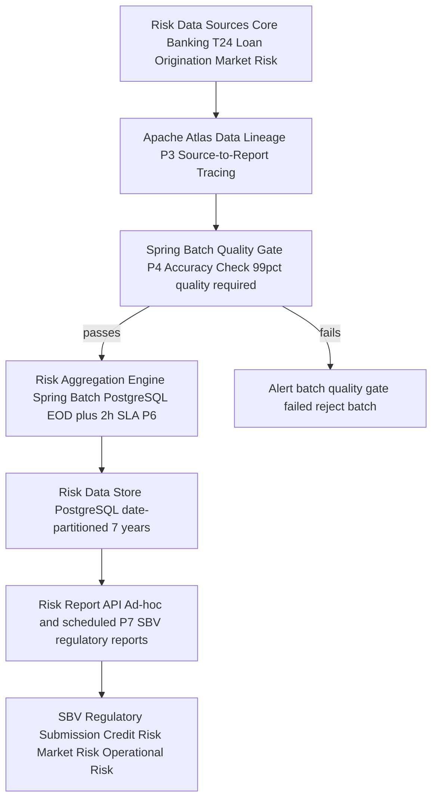

# Basel BCBS 239 — Risk Data Aggregation and Risk Reporting

Status: Draft | Catalog ID: COMP-005 | Owner: @head-of-compliance
Tier Applicability: N/A — applies to all systems contributing to risk data or regulatory reports

## Problem Statement

- BCBS 239 Principle 3 requires banks to maintain a single authoritative source of truth for risk data, with complete lineage from source system to report. Without Apache Atlas or equivalent lineage tooling, Techcombank cannot demonstrate to SBV examiners which source systems feed each regulatory metric.
- Principle 4 (Accuracy and Integrity) requires data quality validation before risk aggregation; without automated quality gates in the EOD batch pipeline, risk reports may contain undetected data errors that reach the SBV report undetected.
- Principle 6 (Timeliness) requires the ability to generate risk data by the end of business day on any given day — including stressed conditions. Without a performant aggregation pipeline with clear SLA enforcement, this cannot be demonstrated during an SBV stress test.
- Principle 7 (Adaptability) requires the ability to generate risk data on an ad-hoc basis for any date and any currency or entity — without a flexible reporting architecture (not hard-coded reports), this requires emergency development work during regulatory inquiries.
- Non-compliance with BCBS 239 is increasingly a supervisory finding for D-SIBs (Domestic Systemically Important Banks); SBV supervisory letters referencing BCBS 239 gaps require documented remediation plans with timelines.

## Context

BCBS 239 applies to Globally Systemically Important Banks (G-SIBs) directly and by supervisory expectation to Domestic Systemically Important Banks (D-SIBs) like Techcombank. The 14 principles are grouped into four domains: overarching governance (P1–P2), risk data aggregation capabilities (P3–P6), risk reporting practices (P7–P11), and supervisory review (P12–P14). Implementation spans the data platform team (@data-platform-domain-owner), SRE/risk systems (@tech-lead-backend), compliance (@head-of-compliance), and finance/CFO office (risk report consumers).

## Solution

Implement a BCBS 239-compliant risk data aggregation pipeline: Apache Atlas for data lineage (P3), Spring Batch quality gate rejecting batches below 99% quality score (P4), daily aggregation scheduler with EOD plus 2h SLA enforcement (P6), and flexible ad-hoc report API (P7). The compliance matrix (COMP-001) maps each catalog document to the BCBS 239 principles it satisfies.



## Implementation Guidelines

### 1. Apache Atlas Lineage Coverage Measurement

```java
@Service
@RequiredArgsConstructor
public class LineageCoverageService {

    private final AtlasClient atlasClient;

    public double measureLineageCoverage(List<String> criticalDataElements) {
        long covered = criticalDataElements.stream()
            .filter(cde -> {
                try {
                    AtlasEntity entity = atlasClient.getEntityByAttribute(
                        "rdr_data_element", Map.of("qualifiedName", cde));
                    return entity != null
                        && entity.getAttribute("lineage_complete") == Boolean.TRUE;
                } catch (Exception e) {
                    return false;
                }
            }).count();
        return (double) covered / criticalDataElements.size() * 100.0;
    }
}
```

### 2. Spring Batch Data Quality Gate (P4)

```java
@Component
@RequiredArgsConstructor
public class DataQualityGate implements ItemProcessor<RiskDataRecord, RiskDataRecord> {

    private final DataQualityRulesEngine rulesEngine;
    private final MeterRegistry metrics;

    @Override
    public RiskDataRecord process(RiskDataRecord item) {
        DataQualityResult result = rulesEngine.evaluate(item);

        if (result.score() < 0.99) {
            metrics.counter("risk_data_quality_rejection",
                "rule", result.failedRule()).increment();
            throw new DataQualityException(
                "Record rejected: quality=" + result.score()
                + " rule=" + result.failedRule()
                + " item_id=" + item.id());
        }
        return item;
    }
}

@Bean
public Step riskAggregationStep(JobRepository jobRepository,
        PlatformTransactionManager txm,
        ItemReader<RiskDataRecord> reader,
        DataQualityGate qualityGate,
        ItemWriter<RiskDataRecord> writer) {

    return new StepBuilder("riskAggregation", jobRepository)
        .<RiskDataRecord, RiskDataRecord>chunk(1000, txm)
        .reader(reader)
        .processor(qualityGate)
        .writer(writer)
        .faultTolerant()
        .skipLimit(0)
        .listener(new DataQualityStepListener())
        .build();
}
```

### 3. EOD Aggregation Scheduler with SLA Enforcement (P6)

```java
@Component
@RequiredArgsConstructor
public class EodAggregationScheduler {

    private final JobLauncher jobLauncher;
    private final Job riskAggregationJob;
    private final AlertService alertService;

    @Scheduled(cron = "0 0 17 * * MON-FRI", zone = "Asia/Ho_Chi_Minh")
    public void runEodAggregation() {
        Instant deadline = Instant.now().plus(2, ChronoUnit.HOURS);
        try {
            JobExecution execution = jobLauncher.run(riskAggregationJob,
                new JobParametersBuilder()
                    .addLocalDate("runDate", LocalDate.now())
                    .toJobParameters());

            if (execution.getEndTime().toInstant().isAfter(deadline)) {
                alertService.fire("eod_aggregation_sla_breach",
                    "EOD aggregation exceeded 2h SLA on " + LocalDate.now());
            }
        } catch (Exception e) {
            alertService.fire("eod_aggregation_failed", e.getMessage());
        }
    }
}
```

### 4. Ad-Hoc Risk Data Query API (P7 Adaptability)

```java
@RestController
@RequestMapping("/risk-data")
@RequiredArgsConstructor
public class RiskDataController {

    private final RiskDataRepository riskDataRepo;

    @GetMapping("/query")
    @PreAuthorize("hasRole('RISK_ANALYST')")
    public ResponseEntity<RiskDataResponse> queryRiskData(
            @RequestParam LocalDate asOfDate,
            @RequestParam String currency,
            @RequestParam(required = false) String entity) {

        RiskDataResponse data = riskDataRepo.query(
            RiskDataQuery.builder()
                .asOfDate(asOfDate)
                .currency(currency)
                .entity(entity)
                .build());

        return ResponseEntity.ok(data);
    }
}
```

## When to Use

- Any service that contributes data to regulatory risk reports (credit risk, market risk, operational risk) — cite BCBS 239 Principle 3 (lineage) in the DAB submission and register the data element in Apache Atlas.
- When designing the EOD batch pipeline — apply the Spring Batch quality gate to enforce Principle 4 data accuracy; configure `skipLimit(0)` to reject the entire batch on any quality failure rather than silently skipping bad records.
- When a new ad-hoc risk data request arrives from SBV or risk management — use the Risk Data Query API rather than building a one-off SQL query; this ensures lineage tracing applies to ad-hoc requests as well as scheduled reports.

## When Not to Use

- Non-risk operational data (customer transaction processing, digital channel logs) — BCBS 239 applies specifically to risk data used for regulatory reporting; operational data governance is separate.
- T3/T4 systems with no regulatory reporting path — BCBS 239 overhead (lineage registration, quality gates) is not justified for systems that never feed risk reports.
- Real-time market risk (intraday VaR) — BCBS 239 scopes to end-of-day and stress reporting; intraday risk computation is governed separately by market risk management policy.

## Variants

| Variant | When to prefer | Trade-off |
|---------|----------------|-----------|
| Apache Atlas + Spring Batch (this pattern) | Full BCBS 239 lineage + quality gate implementation; greenfield or modernising risk data pipeline | Highest compliance coverage; operational overhead of running Atlas; requires data governance team adoption |
| Data catalog with manual lineage documentation | Early-stage compliance; limited data engineering capacity | Satisfies auditor expectations initially; not scalable; manual lineage is always stale |
| Commercial MDM + lineage tool (Collibra, Informatica) | Large established data team; existing vendor relationship; pre-built BCBS 239 accelerators | Faster time-to-compliance; vendor lock-in; high license cost (~USD 200–500k/year) |

## NFR Acceptance Criteria

```yaml
nfr_acceptance_criteria:
  id: COMP-005
  pattern: BCBS 239

  performance:
    - id: B239-HP-01
      statement: >
        EOD risk aggregation MUST complete within 2 hours of EOD trigger (17:00 VNT)
        on any business day including stressed conditions (month-end, quarter-end).
      measurement: >
        Monitor EOD aggregation job duration for 90 consecutive business days;
        assert p99 completion time < 2h. Stress test: run with 3x normal data volume;
        assert completion within 2h.

  compliance:
    - id: B239-COMP-01
      statement: >
        Data lineage coverage MUST be >= 95% for all critical risk data elements (CRDEs)
        registered in the BCBS 239 CRDE registry.
      measurement: >
        Run LineageCoverageService.measureLineageCoverage(crdeRegistry.all()) monthly;
        assert result >= 95%. Fail if any new CRDE is added without Atlas registration.

    - id: B239-COMP-02
      statement: >
        Data quality score MUST be >= 99% for all risk data entering the aggregation pipeline.
        Batches below threshold MUST be rejected and an alert fired.
      measurement: >
        Monitor DataQualityGate rejection rate; assert < 1% rejection rate per quarter.
        Chaos test: inject 2% bad records; assert batch rejected and alert fires.
```

## Compliance Mapping

| Ring | Regulation | Provision | How this pattern satisfies |
|------|-----------|-----------|---------------------------|
| Ring 0 | NIST SP 800-188 | De-identification of government datasets (data quality standard) | BCBS 239 P4 quality requirements exceed NIST SP 800-188 for financial risk data; Spring Batch quality gate provides the automated enforcement mechanism. |
| Ring 1 | BCBS 239 | P3 (data architecture + lineage), P4 (accuracy), P5 (completeness), P6 (timeliness), P7 (adaptability) | This document IS the primary Ring 1 obligation. Apache Atlas implements P3 lineage; Spring Batch quality gate implements P4–P5; EOD scheduler with SLA enforcement implements P6; ad-hoc query API implements P7. |
| Ring 2 | SBV Circular 09/2020/TT-NHNN | §IV Art. 25 — data accuracy and integrity requirements for regulatory submissions ⚠️ (working summary — pending Legal review) | SBV §IV Art. 25 requires accurate and complete regulatory data submissions; BCBS 239 P4 data quality gate directly satisfies this obligation. Legal review required to confirm §IV Art. 25 scope and BCBS 239 sufficiency. |

## Cost / FinOps

- **Apache Atlas cluster**: 3-node Atlas deployment on Kubernetes: ~USD 400/month compute. Shared across all risk data domains.
- **Spring Batch EOD job infrastructure**: 4 vCPU pod running for ~90 min/day; at EC2 on-demand pricing ~USD 2,000/year for daily execution.
- **Risk data store (PostgreSQL, date-partitioned, 7-year retention)**: at 10 GB/year risk data = 70 GB over 7 years; at RDS db.r6g.large (~USD 400/month) shared database. Partition drop for expired data avoids row-level DELETE costs.
- **Cost of BCBS 239 non-compliance**: SBV supervisory letter requiring remediation plan = 4–8 engineer-months (~USD 200–400k). Systemic audit failure may require external consultant engagement (~USD 100k). Proactive implementation cost is ~USD 50k over 18 months — significantly cheaper.

## Threat Model

- **Data lineage tampering — retrospective lineage injection (Tampering)**: Analyst manually adds Atlas lineage edges after the fact to make a data element appear compliant, without actually tracing the real source. Mitigation: Atlas lineage edges are created by the ETL pipeline (not manually) via the Kafka consumer pattern; Atlas REST API access requires `ROLE_ATLAS_LINEAGE_WRITER` with audit log; any manual lineage edge triggers an alert reviewed by @data-privacy-officer.
- **Batch quality gate bypass — skip limit increase (Elevation of Privilege)**: Developer increases `skipLimit` from 0 to 1000 to push a time-critical EOD batch through despite data quality failures, silently dropping bad records from the risk report. Mitigation: `skipLimit` value is a protected configuration property requiring `ROLE_RISK_BATCH_ADMIN` to override; any change triggers a Jira compliance ticket requiring @head-of-compliance sign-off before the next EOD run.

## Operational Runbook Stub

**Alert: `eod_aggregation_sla_breach`** (EOD aggregation running > 2h after 17:00 VNT)
- p50 baseline: EOD completes by 18:30 VNT | p99 SLO: completion by 19:00 VNT
- Remediation: (1) Check Spring Batch job status: `select * from batch_job_execution order by start_time desc limit 10`. (2) If stuck on a step: check step execution for errors. (3) If data quality gate rejected batch: investigate `DataQualityException` in logs; do NOT override skip limit without compliance approval. (4) If infrastructure issue: check PostgreSQL connections, disk space; escalate to on-call DBA. (5) Notify @head-of-compliance if SBV reporting deadline at risk.

**Alert: `bcbs239_lineage_coverage_below_threshold`** (Monthly lineage coverage scan < 95%)
- p50 baseline: >= 97% coverage | SLA: >= 95%
- Remediation: (1) Run `LineageCoverageService.measureLineageCoverage()` manually; identify uncovered CDREs. (2) For each missing lineage edge: identify the ETL pipeline responsible; register the lineage in Atlas. (3) If lineage gap is due to a new data source added without Atlas registration: file compliance finding; require Atlas registration before the next EOD run uses the new source.

## Test Strategy Stub

### Unit Tests
- `DataQualityGateTest`: process record with quality score 1.0 → assert passes through. Process record with quality 0.98 → assert `DataQualityException`. Assert `metrics.counter("risk_data_quality_rejection")` incremented.
- `EodAggregationSchedulerTest`: mock job launcher; inject execution endTime 3h after start → assert `alertService.fire("eod_aggregation_sla_breach", ...)` called.

### Integration Tests
- Spring Batch integration test with Testcontainers (PostgreSQL): run full aggregation job with 100 good records + 1 bad record → assert job FAILED; assert bad record in step execution context; assert good records NOT written (batch-level rejection).
- Lineage coverage: register 10 CDREs in mock Atlas; inject lineage for 9; run `measureLineageCoverage` → assert 90% returned; inject 10th lineage → assert 100%.

### Compliance Tests
- Monthly: `LineageCoverageService.measureLineageCoverage(crdeRegistry.all())` via scheduled job; assert result >= 95%; fail and alert if below threshold.
- Annual BCBS 239 self-assessment: @head-of-compliance validates each of P1–P14 against catalog implementation evidence; document findings in governance decisions log.

## Related Patterns

- [DATA-009 Data Lineage](../patterns/data/data-lineage.md) — Apache Atlas implementation for BCBS 239 P3 data architecture
- [DATA-011 Data Quality Rules](../patterns/data/data-quality-rules.md) — data quality rule engine feeding the Spring Batch quality gate
- [BSP-004 End-of-Day Batch Window](../patterns/banking-solutions/end-of-day-batch-window.md) — EOD batch execution context within which risk aggregation runs

## References

- [BCBS 239 — Principles for Effective Risk Data Aggregation and Risk Reporting](https://www.bis.org/publ/bcbs239.htm)
- [BCBS 239 Progress Report (2023)](https://www.bis.org/bcbs/publ/d559.htm)
- Research notes: `knowledge-base/_research-notes.md`
- Catalog reference: `governance/standards/enterprise-architecture-catalog.md`
