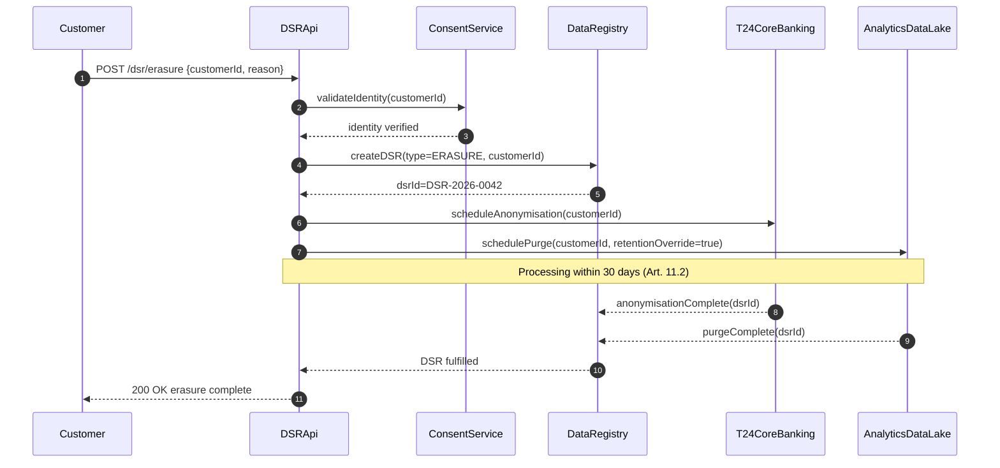

# Decree 13/2023/ND-CP — Personal Data Protection (VPDP)

Status: Draft | Catalog ID: COMP-003 | Owner: @head-of-compliance
Tier Applicability: N/A — applies to all systems processing Vietnamese personal data

> ⚠️ **Working summary** — verbatim Article text pending authoritative English translation from `@legal-vietnam`. Do NOT use in regulatory submissions without Legal sign-off.

## Problem Statement

- Decree 13/2023/ND-CP (effective 2023-07-01) classifies biometric data, financial standing, and location data as **sensitive personal data** requiring explicit written consent, DPIA filing with MPS A05 Cybersecurity Department, and storage within Vietnam. Without these controls, every digital banking feature using biometrics or financial data is non-compliant by default.
- Data subject rights under Art. 11 (access, portability, erasure) require a self-service portal backed by coordinated purge operations across core banking (T24), analytics data lake, and backup systems — capabilities that do not exist by default in most banking architectures.
- Cross-border data transfer (Art. 13) requires an Overseas Transfer Impact Assessment dossier filed with MPS A05 within 60 days of transfer commencement. Failure to file before transferring data to international analytics or cloud regions is an immediate violation.
- Data breach notification to MPS A05 within 72 hours (Art. 26) requires pre-wired runbooks, confirmed contact lists, and incident classification logic — missing any of these makes the 72-hour SLA operationally impossible.
- Administrative penalties under Art. 38–41 reach VND 5 billion (~USD 200k) per violation; criminal liability (up to 7 years imprisonment) applies to wilful mass breaches. This creates material compliance risk for any feature that processes sensitive personal data without the required controls.

## Context

Decree 13/2023 applies to all organisations processing Vietnamese individuals' personal data, regardless of where the processing occurs (Art. 2). For Techcombank this covers: mobile banking biometric enrolment (facial recognition, fingerprint); KYC onboarding (CCCD face-match, biometric templates); open banking APIs sending financial data to third-party fintechs; analytics pipelines that include customer transaction history; and any cloud data transfers to Singapore or other international regions. @data-privacy-officer owns the DPIA registry and data subject rights portal. @head-of-compliance owns regulatory submission (A05 notifications). @ciso-delegate owns breach detection and notification runbooks.

## Solution

Apply data-classification-first design: classify every data element as basic or sensitive personal data per Decree 13 Art. 2–9; apply the corresponding controls (consent capture, DPIA, Vietnamese vault, DSR API) before feature launch. The architecture catalog provides the implementation patterns; this document is the regulatory mapping that tells engineers which pattern to use for which obligation.



## Implementation Guidelines

### 1. DSR REST Endpoint (Spring Boot)

```java
@RestController
@RequestMapping("/dsr")
@RequiredArgsConstructor
public class DataSubjectRightsController {

    private final ConsentService consentService;
    private final DsrRepository dsrRepository;
    private final PurgeOrchestrator purgeOrchestrator;

    @PostMapping("/erasure")
    public ResponseEntity<DsrResponse> requestErasure(
            @RequestBody DsrErasureRequest req,
            @AuthenticationPrincipal Jwt jwt) {

        consentService.verifyIdentity(req.customerId(), jwt.getSubject());

        DsrRecord dsr = dsrRepository.create(DsrRecord.builder()
            .type(DsrType.ERASURE)
            .customerId(req.customerId())
            .reason(req.reason())
            .requestedAt(Instant.now())
            .deadlineAt(Instant.now().plus(30, ChronoUnit.DAYS))
            .build());

        purgeOrchestrator.scheduleErasure(dsr);
        return ResponseEntity.accepted()
            .body(new DsrResponse(dsr.id(), dsr.deadlineAt()));
    }
}
```

### 2. Consent Table DDL (PostgreSQL)

```sql
CREATE TABLE consent_records (
    id              UUID PRIMARY KEY DEFAULT gen_random_uuid(),
    customer_id     VARCHAR(50)  NOT NULL,
    purpose         VARCHAR(100) NOT NULL,
    data_category   VARCHAR(50)  NOT NULL,
    consent_text    TEXT         NOT NULL,
    consented_at    TIMESTAMPTZ  NOT NULL,
    withdrawn_at    TIMESTAMPTZ,
    consent_medium  VARCHAR(20)  NOT NULL,
    CONSTRAINT require_written_for_sensitive
        CHECK (data_category != 'SENSITIVE' OR consent_medium = 'WRITTEN')
);
CREATE INDEX idx_consent_customer ON consent_records(customer_id);
CREATE INDEX idx_consent_purpose ON consent_records(customer_id, purpose)
    WHERE withdrawn_at IS NULL;
```

### 3. OPA Purpose-Limitation Policy (Art. 8 — Consent per Purpose)

```rego
package decree13.purpose_limitation

import future.keywords.if

default allow = false

allow if {
    consent := data.consent_records[_]
    consent.customer_id == input.customer_id
    consent.purpose == input.requested_purpose
    consent.withdrawn_at == null
    input.processing_purpose == consent.purpose
}

deny_cross_border if {
    input.destination_country != "Vietnam"
    not data.a05_dossier_filed[input.transfer_id]
}
```

### 4. Data Portability Export Job

```java
@Component
@RequiredArgsConstructor
public class DataPortabilityExporter {

    private final JdbcTemplate jdbc;

    public Path exportCustomerData(String customerId) throws IOException {
        Path exportFile = Files.createTempFile("dsr-export-" + customerId, ".json");

        List<Map<String, Object>> transactions = jdbc.queryForList(
            "SELECT * FROM transactions WHERE customer_id = ? ORDER BY posted_at DESC",
            customerId);

        List<Map<String, Object>> accounts = jdbc.queryForList(
            "SELECT account_number, account_type, opened_date FROM accounts WHERE customer_id = ?",
            customerId);

        Map<String, Object> export = Map.of(
            "customerId", customerId,
            "exportDate", Instant.now().toString(),
            "transactions", transactions,
            "accounts", accounts
        );
        Files.writeString(exportFile, JsonUtil.serialize(export));
        return exportFile;
    }
}
```

## When to Use

- Any feature processing sensitive personal data (biometric auth, credit scoring, fraud ML, location-based services) — file DPIA with MPS A05 before launch (Art. 28); obtain written consent from each customer before enabling the feature.
- Designing data flows that cross Vietnamese borders (international analytics, Singapore cloud region, global card network) — file Overseas Transfer Impact Assessment with MPS A05 within 60 days of transfer commencement (Art. 13).
- Implementing customer-facing self-service for data rights — Art. 11 mandates access, portability, correction, and erasure capabilities; use the DSR API pattern (§4 above) as the implementation basis.

## When Not to Use

- Anonymised or pseudonymised data where re-identification is technically infeasible — Decree 13 applies to personal data; properly anonymised aggregates (e.g., branch-level transaction counts with no customer identifiers) are out of scope.
- Employee data within Techcombank's internal HR systems — Decree 13 applies to all organisations processing Vietnamese individuals' data, but HR data is subject to the Labour Code in addition to Decree 13; consult @legal-vietnam for the boundary.
- Fully automated processing with no Vietnamese data subject — data about non-Vietnamese individuals processed entirely outside Vietnam is out of scope for Decree 13, though GDPR may apply for EU citizens.

## Variants

| Variant | When to prefer | Trade-off |
|---------|----------------|-----------|
| Full VPDP compliance (T0/T1 customer-facing) | Any feature processing sensitive personal data — biometrics, financial standing, location | Maximum regulatory protection; requires DPIA, written consent capture, DSR portal, A05 notifications |
| Scoped basic-data compliance (T2 internal analytics) | Internal analytics using pseudonymised data only; no sensitive personal data | Simplified controls (no DPIA, standard consent); must verify pseudonymisation is irreversible |
| Consent delegation to vendor (Open Banking) | Third-party fintech accessing Techcombank customer data via open banking APIs | Techcombank retains responsibility; fintech must hold independent consent and have DPIA on file; contractual obligation required |

## NFR Acceptance Criteria

```yaml
nfr_acceptance_criteria:
  id: COMP-003
  pattern: Decree 13/2023 Personal Data Protection

  performance:
    - id: D13-HP-01
      statement: >
        DSR erasure request MUST be fulfilled within 30 calendar days (Art. 11.2).
        System must track deadline and alert if approaching.
      measurement: >
        Integration test: submit erasure request; mock T24 + Analytics completing in 25 days;
        assert DSR record shows fulfilled_at <= deadline_at.

  resilience:
    - id: D13-HR-01
      statement: >
        Breach notification runbook MUST complete MPS A05 notification within 72h of discovery (Art. 26).
        Runbook contact list MUST be verified within 90 days.
      measurement: >
        Tabletop exercise: simulate data breach at T=0; assert draft notification ready by T+4h;
        assert submitted to A05 by T+72h. Contact list review date in runbook < 90 days.

  compliance:
    - id: D13-COMP-01
      statement: >
        Written consent record MUST exist for every active biometric feature.
        Consent withdrawal MUST disable feature within 1 business day.
      measurement: >
        Integration test: enrol biometric without consent record -> assert feature blocked.
        Withdraw consent -> assert biometric login returns HTTP 403 within 24h.
```

## Compliance Mapping

| Ring | Regulation | Provision | How this pattern satisfies |
|------|-----------|-----------|---------------------------|
| Ring 0 | GDPR (EU, as reference standard) | Art. 9 (special categories), Art. 17 (right to erasure), Art. 83 (penalties) | Decree 13 is modelled on GDPR; the DSR API satisfies both GDPR Art. 17 and Decree 13 Art. 11; consent table satisfies both GDPR Art. 7 and Decree 13 Art. 8. |
| Ring 1 | SWIFT CSP 2024 | Control 5 — customer data handling and integrity controls | SWIFT CSP §5 aligns with Decree 13 Art. 8 consent requirements for financial data processed via SWIFT messages; consent must be captured before account data is included in SWIFT MT/MX messages. |
| Ring 2 | Decree 13/2023/ND-CP | Art. 8 (consent), Art. 11 (data subject rights), Art. 13 (cross-border), Art. 26 (breach notification), Art. 28 (DPIA) ⚠️ (working summary — pending Legal review) | This document IS the primary Ring 2 obligation for personal data processing. DSR API, consent table, OPA purpose-limitation, and portability exporter collectively implement Arts 8, 11, and 13. Breach notification runbook implements Art. 26. DPIA registry implements Art. 28. |

## Cost / FinOps

- **DSR Portal**: 2 Spring Boot replicas + PostgreSQL for consent and DSR tables. Marginal cost: ~USD 50/month additional compute. DSR volume expected <500/month at launch; scales linearly.
- **DPIA process**: Each DPIA requires 2–4 days of @data-privacy-officer time. For 5 new sensitive-data features per year at 3 days each = 15 person-days/year. Budget for this in the compliance operating plan.
- **A05 Overseas Transfer dossier**: One-time legal effort per data flow (~3 days @legal-vietnam). Update required within 10 days of material change to the transfer (Art. 13). Budget 2 dossier updates/year.
- **Cost of non-compliance**: Art. 38–41 administrative fines up to VND 5 billion (~USD 200k) per violation. Criminal liability (up to 7 years imprisonment) for wilful mass breaches. A single undisclosed breach involving 100k+ customers could trigger criminal investigation. The DSR portal and breach runbook cost <USD 1k/year to operate.

## Threat Model

- **Consent bypass — biometric feature enabled without written consent (Repudiation)**: Engineer deploys biometric login feature without triggering the consent capture flow; millions of customers enrolled without consent. Mitigation: `ConsentService.verifyIdentity()` is called in the DSR API before any biometric operation; ArchUnit test asserts all `@BiometricOperation` annotated methods call `consentService.verifyWrittenConsent()`; CI pipeline fails on violation.
- **Cross-border transfer without A05 dossier (Information Disclosure / Regulatory)**: Analytics pipeline sends customer transaction data to Singapore region without filing the Overseas Transfer Impact Assessment with A05 first. Mitigation: OPA `deny_cross_border` policy blocks data pipeline writes to non-Vietnam destinations if `a05_dossier_filed[transfer_id]` is absent; data pipeline CI gate checks OPA policy before deploying to international regions.

## Operational Runbook Stub

**Alert: `dsr_deadline_approaching`** (DSR fulfillment deadline within 5 business days)
- p50 baseline: DSR fulfilled within 20 days | SLA: 30 days (Art. 11.2)
- Remediation: (1) Check DSR record status in compliance portal. (2) Contact T24 team and analytics team to confirm purge job scheduled. (3) If T24 or analytics are blocked, escalate to @data-privacy-officer for manual coordination. (4) If deadline will be missed: contact @head-of-compliance; assess whether Art. 11.3 extension (additional 30 days with notice) applies.

**Alert: `data_breach_detected`** (SIEM breach indicator triggered)
- SLA: notify MPS A05 within 72h from discovery
- Remediation: (1) Classify breach scope: data categories affected, number of data subjects, likely consequences. (2) Draft A05 notification using template at `governance/runbooks/decree13-a05-breach-template.md`. (3) @head-of-compliance reviews and submits. (4) Retain evidence for 5 years (Art. 28). (5) Update DPIA for affected processing activities.

## Test Strategy Stub

### Unit Tests
- `ConsentServiceTest`: `verifyWrittenConsent(customerId, BIOMETRIC_LOGIN)` with no consent record → assert `ConsentRequiredException`. With withdrawn consent → assert `ConsentWithdrawnException`. With valid written consent → assert passes.
- `OpaPurposeLimitationTest`: request data for purpose not in consent record → assert OPA returns `allow=false`. Request with matching purpose and active consent → assert `allow=true`.

### Integration Tests
- Spring Boot Test with Testcontainers (PostgreSQL): submit DSR erasure request → assert DsrRecord created with `deadline_at = now() + 30 days`; assert purge jobs scheduled in T24 and Analytics; assert DSR fulfilled within mock 25-day window.
- Consent table constraint: attempt INSERT with `data_category=SENSITIVE` and `consent_medium=CHECKBOX` → assert constraint violation.

### Compliance Tests
- Annual DPIA review: @data-privacy-officer validates all DPIAs in registry have `review_date < 1 year`; update DPIA records for all active sensitive-data processing features.
- A05 dossier audit: quarterly review of cross-border data flow registry; assert each active international transfer has dossier reference number and filing date < 60 days after transfer commencement.
- Penetration test (annual): after DSR erasure, penetration tester checks all storage systems (T24, analytics, backups, logs) for residual PII matching the erased customer; assert zero matches.

## Related Patterns

- [COMP-001 Compliance Mapping Matrix](compliance-mapping-matrix.md) — cross-reference of all Decree 13 data category obligations
- [SEC-008 Data Masking](../patterns/security/data-masking.md) — masks PII in logs and non-production environments per Art. 8 data minimisation
- [SEC-013 PII Tokenization](../patterns/security/pii-tokenization-format-preserving.md) — tokenizes sensitive personal data reducing Decree 13 scope in downstream systems
- [SEC-009 Fraud Signal Collection](../patterns/security/fraud-signal-collection.md) — behavioral data (device hash, IP hash) is personal data under Art. 3; this pattern ensures hash-only storage satisfies Decree 13
- [PRIN-007 Data Residency](../principles/data-residency.md) — enforces Vietnamese vault storage for sensitive personal data per Art. 9 + 13

## References

- Decree 13/2023/ND-CP (Vietnamese): thuvienphapluat.vn (URL pending librarian fetch)
- Research notes: `knowledge-base/_research-notes.md`
- MPS A05 Cybersecurity Department: contact details at `governance/runbooks/sbv-a05-contacts.md` (internal)
- Catalog reference: `governance/standards/enterprise-architecture-catalog.md`
