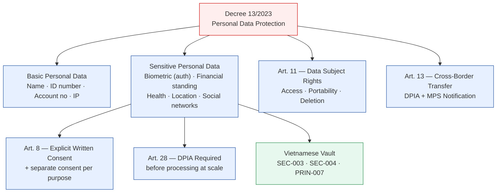

# Decree 13/2023/ND-CP — Personal Data Protection

Status: Draft | Last Reviewed: 2026-05-09 | Owner: @head-of-compliance
Catalog ID: COMP-003 | Radii
Tier Applicability: T0, T1, T2

> ⚠️ **Working summary** — verbatim Article text pending authoritative English translation from `@legal-vietnam`. Do NOT use in regulatory submissions without Legal sign-off. See `knowledge-base/_research-notes.md` for the expanded working summary and TODO list.

## Problem Statement

Decree 13/2023/ND-CP (effective July 1, 2023) is Vietnam's primary personal data protection regulation, analogous to GDPR in scope. It classifies biometric data, financial standing, and location data as **sensitive personal data** requiring explicit written consent, Data Privacy Impact Assessment (DPIA), and storage within Vietnam. Without a clear mapping of this Decree to architecture patterns, Techcombank's digital banking features (biometric login, KYC, open banking) may inadvertently violate data-subject rights or cross-border transfer restrictions.

## Solution

Apply a data-classification-first design: identify whether each data element is basic or sensitive personal data, then apply the corresponding controls. The architecture catalog encodes these controls via dedicated patterns (PRIN-007, SEC-004, REF-003).



## Data Classification (Articles 2, 9)

> ⚠️ Working classification — confirm article numbers with `@legal-vietnam`.

| Data element | Category | Controls required |
|---|---|---|
| Full name, date of birth | Basic | Standard privacy controls |
| Vietnamese national ID (CCCD number) | Basic | Standard privacy controls |
| Account numbers (bank, card) | Basic | Standard privacy controls |
| IP address, device ID | Basic | Standard privacy controls |
| Biometric data used for **authentication** (fingerprint, face recognition, iris for login) | **Sensitive** | Written consent + DPIA + 60-day A05 filing + Vietnamese vault |
| Biometric image/template (CCCD face photo used for KYC matching) | **Sensitive** | Written consent + DPIA + 60-day A05 filing + Vietnamese vault |
| **Customer data of credit institutions** (banking relationship, account status, product holdings) | **Sensitive** (explicitly listed in Art. 9) | Written consent + DPIA + Vietnamese vault |
| Account balance, transaction history, credit score, income | **Sensitive** (financial standing) | Written consent + DPIA + Vietnamese vault |
| GPS / location data (transaction location, device location) | **Sensitive** | Written consent + DPIA |
| Health / medical data | **Sensitive** | Written consent + DPIA |
| Political views, religious beliefs | **Sensitive** | Written consent + DPIA |

## Key Provisions (Working Summary)

| Article | Provision | Banking impact |
|---------|-----------|----------------|
| Art. 2 | Scope — applies to all organisations processing Vietnamese individuals' data, regardless of where processing occurs | Applies to Techcombank's international analytics pipelines and third-party integrations |
| Art. 8 | Consent — voluntary, specific, informed, unambiguous; separate for each purpose; biometric requires written consent; withdrawable at any time | Mobile banking onboarding must capture layered consent; facial-recognition feature requires separate written consent |
| Art. 11 | Data subject rights — access, portability (machine-readable), correction, deletion ("right to be forgotten"), restriction, object to processing | Self-service portal required for T0/T1 customer-facing systems |
| Art. 13 | Cross-border transfer — submit **Overseas Transfer Impact Assessment dossier** to **Cybersecurity Department (A05, MPS)** within **60 days** of transfer commencement; notify after each transfer; update within 10 days of changes | Any customer data flowing to international analytics (e.g., Singapore region) requires 60-day A05 dossier; credit bureau cross-border connections require A05 notification |
| Art. 26 | Data breach notification — within **72 hours** of discovery to **Cybersecurity Department (A05, MPS)**; include nature, volume, categories of records, likely consequences, remediation | Incident response runbooks must include A05 notification step; SLA: 72h from discovery |
| Art. 28 | DPIA — required before processing sensitive personal data at scale or using automated decision-making; submit dossier to A05 within **60 days** of processing start; results retained 5 years; A05 may inspect | KYC biometric matching, credit-scoring models, and fraud-detection ML must each have a DPIA filed with A05 within 60 days of feature launch |
| Art. 38–41 | Penalties — administrative fines up to VND 5 billion (~USD 200k) per violation; criminal liability (up to 7 years imprisonment) for wilful mass breaches | Material compliance risk for unauthorised data sharing or inadequate consent capture |

## Compliance Mapping

| Ring | Regulation | Provision | Pattern implementation |
|------|-----------|-----------|----------------------|
| Ring 0 (global) | GDPR (EU, as reference standard) | Art. 9 (special categories), Art. 17 (right to erasure), Art. 83 (penalties) | Decree 13 is modelled on GDPR; GDPR patterns apply where Vietnamese law doesn't specify differently |
| Ring 0 (global) | NIST Privacy Framework | Data processing transparency, individual participation | Informs data-subject rights portal design |
| Ring 1 (international banking) | SWIFT CSP 2024 | Customer data handling controls | SWIFT CSP §5 (data integrity) aligned with Decree 13 Art. 8 consent requirements |
| Ring 2 (Vietnam) | Decree 13/2023/ND-CP — Art. 8 | Consent for biometric data | Required by SEC-005 (BFF + DPoP biometric), REF-003 (KYC/AML), REF-004 (3DS2) |
| Ring 2 (Vietnam) | Decree 13/2023/ND-CP — Art. 9, 13 | Sensitive data + cross-border transfer | Required by SEC-004 (Tokenisation — CCCD data), PRIN-007 (Data Residency) |
| Ring 2 (Vietnam) | Decree 13/2023/ND-CP — Art. 26, 28 | Breach notification + DPIA | Required by BP-002 (DR Playbook) incident response section |
| Ring 2 (Vietnam) | Decree 53/2022/ND-CP | Data localisation | Tokenised biometric templates must remain in Vietnamese vault (Decree 13 + 53 combined obligation) |

## NFR Acceptance Criteria

```yaml
service_name: "[service]-decree13-compliance"
tier: T0
compliance_context:
  regulation: Decree 13/2023/ND-CP Personal Data Protection (working summary — pending Legal)
  consent_capture: explicit per purpose; written consent for biometric
  breach_notification_hours: 72           # Art. 26 — notify Cybersecurity Dept A05 (MPS) within 72h
  cross_border_dossier_days: 60           # Art. 13 — file Overseas Transfer Impact Assessment with A05 within 60 days
  dpia_filing_days: 60                    # Art. 28 — submit DPIA dossier to A05 within 60 days of processing start
  dpia_record_retention_years: 5         # Art. 28 — retain DPIA records 5 years
acceptance_criteria:
  - id: D13-1
    description: Written consent captured and logged before biometric feature activation
    verification: integration test — biometric enrol fails if consent record absent in audit log
  - id: D13-2
    description: Data subject deletion request processed within 30 days
    verification: QA test — submit deletion request via self-service portal; verify data purged in core banking and analytics within 30 days
  - id: D13-3
    description: DPIA completed and filed for all sensitive-data processing at scale
    verification: DPIA registry reviewed annually by @data-privacy-officer; each DPIA record has expiry date
  - id: D13-4
    description: Breach notification playbook tested annually; Cybersecurity Department A05 contact details current
    verification: tabletop exercise results documented in governance/decisions/REVIEW-LOG-*
  - id: D13-5
    description: Overseas Transfer Impact Assessment dossier filed with A05 for all active cross-border data flows within 60 days of commencement (Art. 13)
    verification: cross-border data flow registry reviewed quarterly by @data-privacy-officer; each entry has A05 dossier reference number
```

## Operational Runbook (stub)

1. **Data subject rights request** — customer submits via self-service portal; ticket auto-created in compliance queue
2. **Triage** — within 3 business days: confirm identity; determine data scope
3. **Fulfilment** — access/portability requests: export within 15 days; deletion requests: purge within 30 days
4. **Cross-system coordination** — instruct T24 core banking, analytics data lake, and backup systems to purge/anonymise
5. **Breach incident** — identify scope within 24h; prepare Cybersecurity Department A05 notification form within 72h; submit via prescribed channel (A05, MPS); retain evidence 5 years
6. **New sensitive-data feature launch** — before go-live: (a) submit DPIA dossier to A05, (b) if cross-border data flow: submit Overseas Transfer Impact Assessment dossier to A05 within 60 days, (c) capture written/checkbox consent before enabling feature for any user

## Test Strategy (stub)

- **Unit**: consent capture — assert consent record written to audit table before biometric enrolment
- **Integration**: data subject access — assert all customer data exportable in machine-readable format
- **Compliance**: annual DPIA review — @data-privacy-officer reviews and re-certifies all DPIAs
- **Penetration test**: anonymisation verification — after deletion request, confirm no residual PII in logs, analytics, and backups

## References

- Decree 13/2023/ND-CP (Vietnamese): thuvienphapluat.vn (URL pending librarian fetch)
- Research notes: `knowledge-base/_research-notes.md#decree-132023nd-cp--personal-data-protection-decree`
- Related patterns: PRIN-007, SEC-004, SEC-005, REF-003, REF-004, BP-002
- Companion regulation: `knowledge-base/compliance/sbv-circular-09-2020.md` (COMP-002)

---

**Key Takeaway**: Biometric authentication data, financial standing, and location data are **sensitive personal data** under Decree 13/2023 — requiring explicit written consent, DPIA, and Vietnamese vault storage. Data breach notification to the Ministry of Public Security within 72 hours is mandatory.
