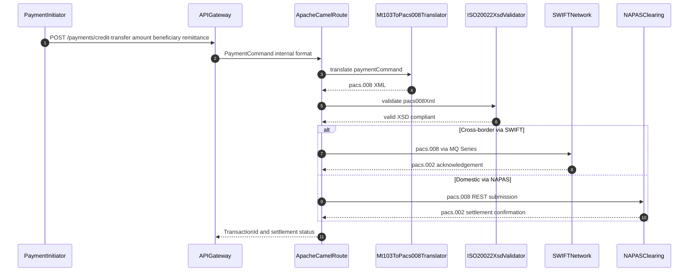

# ISO 20022 Messaging — Deep Dive

Status: Draft | Last Reviewed: 2026-05-16 | Catalog ID: COMP-007 | Owner: @payments-domain-owner
Tier Applicability: N/A — applies to all payment message processing systems

## Problem Statement

- SWIFT's global migration deadline to ISO 20022 for cross-border payments is November 2025 (coexistence ends); continued use of MT103 messages after this date results in SWIFT declining to route legacy messages — operational disruption to all international wire transfers.
- NAPAS Circular 2024 mandates ISO 20022 pacs.008 for domestic credit transfers above VND 500 million effective 2026; non-compliant messages are rejected by NAPAS clearing infrastructure.
- MT103 to pacs.008 translation is not a trivial field mapping: the MT103 field 70 (remittance information) is free text up to 140 characters, while ISO 20022 pacs.008 `Ustrd` requires structured EREF/PREF/IREF identifiers — naive migration breaks downstream reconciliation systems that parse MT103 field 70.
- ISO 20022 message validation against XSD schemas must occur before SWIFT or NAPAS submission; a malformed message rejected by NAPAS carries a VND 50,000 penalty per rejection and disrupts real-time settlement.
- Bulk migration of legacy MT to MX requires a Spring Batch conversion pipeline capable of processing 500,000+ historical messages per run while maintaining idempotency (avoid re-processing already-converted messages).

## Context

ISO 20022 is the international standard for electronic data interchange between financial institutions. For Techcombank, it governs: SWIFT cross-border credit transfers (pacs.008), payment reversals (pacs.007), cancellations (camt.056), and account statements (camt.053). Domestic NAPAS transfers use the Vietnamese ISO 20022 profile (a subset of the global standard with Vietnamese-specific data elements). @payments-domain-owner owns the SWIFT/NAPAS connectivity; @tech-lead-backend owns the Apache Camel translation pipeline.

Reach for this pattern when:

- Any service processes SWIFT cross-border credit transfers — ISO 20022 pacs.008 is mandatory after November 2025 SWIFT sunset.
- Domestic NAPAS credit transfers above VND 500M — NAPAS Circular 2024 mandates ISO 20022 for high-value transfers.
- Bulk migration of legacy MT103 messages stored in the archive database to ISO 20022 format.
- A payment service needs XSD-validated message integrity before submitting to external clearing networks.
- A new payment flow requires MT103 coexistence with pacs.008 during the SWIFT migration transition period.

## Solution

Implement an Apache Camel MT to MX translation pipeline: the Camel route consumes MT103 messages from the SWIFT adaptor, applies a structured translator processor (field-by-field mapping with FIN to ISO 20022 rules), validates the resulting pacs.008 against XSD, and routes to NAPAS or SWIFT for submission. Bulk historical conversion runs as a Spring Batch job with idempotency key check.

The XSD validation gate (§4) is the critical correctness control: a malformed pacs.008 is caught before reaching NAPAS or SWIFT, routed to the Dead Letter Queue (EIP-025) for remediation, and never submitted to the network. This eliminates NAPAS rejection penalties and SWIFT message refusal.



## Implementation Guidelines

### 1. Apache Camel MT103 to pacs.008 Route

The Camel route is the entry point: it consumes MT103 messages from the SWIFT inbound JMS queue, chains through the translator and XSD validator processors, and routes to the correct outbound queue based on payment type (cross-border vs. domestic NAPAS).

```java
@Component
public class Mt103ToPacs008Route extends RouteBuilder {

    @Override
    public void configure() {
        from("jms:queue:swift.mt103.inbound")
            .routeId("mt103-to-pacs008")
            .process(new Mt103ToPacs008Translator())
            .process(new Iso20022XsdValidator())
            .choice()
                .when(header("payment_type").isEqualTo("CROSS_BORDER"))
                    .to("jms:queue:swift.pacs008.outbound")
                .when(header("payment_type").isEqualTo("DOMESTIC_NAPAS"))
                    .to("jms:queue:napas.pacs008.outbound")
                .otherwise()
                    .to("jms:queue:payment.dlq")
            .end()
            .log("Translated MT103 ${header.transactionRef} to pacs.008");
    }
}
```

### 2. ISO 20022 Translator Processor

The translator performs field-by-field mapping from MT103 to pacs.008. The critical transformation is remittance information (F70): if the MT103 field begins with `/ROC/`, it is mapped to structured ISO 20022 `RmtInf`; otherwise it is carried as unstructured text truncated to 140 characters per ISO 20022 limits.

```java
@Component
public class Mt103ToPacs008Translator implements Processor {

    @Override
    public void process(Exchange exchange) {
        Mt103Message mt103 = exchange.getIn().getBody(Mt103Message.class);

        Pacs008Document pacs008 = Pacs008Document.builder()
            .msgId(mt103.getTransactionRef())             // F20 -> MsgId
            .creDtTm(Instant.now())
            .nbOfTxs(1)
            .ctrlSum(mt103.getAmount())
            .instrAmt(mt103.getAmount())
            .intrBkSttlmAmt(mt103.getAmount())
            .cdtrAcct(mt103.getBeneficiaryAccount())      // F59 -> CdtrAcct
            .dbtrAcct(mt103.getOrderingAccount())         // F50K -> DbtrAcct
            .rmtInf(parseRemittanceInfo(mt103.getField70()))  // F70 -> RmtInf
            .build();

        exchange.getIn().setBody(pacs008);
        exchange.getIn().setHeader("payment_type",
            determinePaymentType(mt103.getCorrespondentBic()));
    }

    private RemittanceInfo parseRemittanceInfo(String field70) {
        if (field70.startsWith("/ROC/")) {
            return RemittanceInfo.structured(field70.substring(5));
        }
        return RemittanceInfo.unstructured(
            field70.substring(0, Math.min(field70.length(), 140)));
    }
}
```

### 3. Spring Batch — Bulk MT to MX Historical Conversion

The Spring Batch job converts the MT103 archive table to ISO 20022 pacs.008 records in chunks of 500, with idempotency enforced by the `WHERE converted = false` filter. Each chunk is a single database transaction; the writer marks records as converted after successful translation.

```java
@Configuration
@RequiredArgsConstructor
public class BulkMtToMxJobConfig {

    @Bean
    Job bulkMtToMxJob(JobRepository jobRepo, Step conversionStep) {
        return new JobBuilder("bulkMtToMx", jobRepo)
            .start(conversionStep)
            .build();
    }

    @Bean
    Step conversionStep(JobRepository jobRepo, PlatformTransactionManager txm,
            ItemReader<Mt103Record> reader,
            Mt103ToPacs008ItemProcessor processor,
            ItemWriter<Pacs008Record> writer) {
        return new StepBuilder("convert", jobRepo)
            .<Mt103Record, Pacs008Record>chunk(500, txm)
            .reader(reader)
            .processor(processor)
            .writer(writer)
            .build();
    }

    @Bean
    ItemReader<Mt103Record> mt103Reader(DataSource ds) {
        return new JdbcCursorItemReaderBuilder<Mt103Record>()
            .dataSource(ds)
            .sql("SELECT * FROM mt103_archive WHERE converted = false ORDER BY id")
            .rowMapper(new Mt103RowMapper())
            .build();
    }
}
```

### 4. ISO 20022 pacs.008 XSD Validator

The XSD validator loads the pacs.008 schema at startup and validates each translated message before it is routed to NAPAS or SWIFT. A validation failure throws `Iso20022ValidationException`, which Camel's error handler routes to the DLQ.

```java
@Component
public class Iso20022XsdValidator implements Processor {

    private final Schema pacs008Schema;

    public Iso20022XsdValidator() throws SAXException {
        SchemaFactory factory = SchemaFactory.newInstance(
            XMLConstants.W3C_XML_SCHEMA_NS_URI);
        pacs008Schema = factory.newSchema(
            getClass().getResource("/iso20022/pacs.008.001.09.xsd"));
    }

    @Override
    public void process(Exchange exchange) throws SAXException, IOException {
        String xml = exchange.getIn().getBody(String.class);
        Validator validator = pacs008Schema.newValidator();
        try {
            validator.validate(new StreamSource(new StringReader(xml)));
        } catch (SAXException e) {
            exchange.getIn().setHeader("validation_error", e.getMessage());
            throw new Iso20022ValidationException(
                "pacs.008 XSD validation failed: " + e.getMessage(), e);
        }
    }
}
```

## When to Use

- Any cross-border payment via SWIFT — ISO 20022 pacs.008 is mandatory after November 2025; all SWIFT FIN MT103 messages must be replaced with ISO 20022 pacs.008 equivalents.
- Domestic NAPAS credit transfers above VND 500M — NAPAS Circular 2024 mandates ISO 20022 for high-value domestic transfers; use this translation pipeline for NAPAS submissions.
- Bulk migration of legacy MT messages stored in the archive database — use the Spring Batch conversion job (section 3) with idempotency check to convert historical records without re-processing.
- Any service that receives payment instructions from external parties and must produce XSD-valid ISO 20022 messages for settlement.

## When Not to Use

- NAPAS low-value retail transfers below VND 500M — NAPAS continues to support the legacy IBFT format for low-value retail; use the NAPAS IBFT connector until NAPAS mandates full ISO 20022 migration for retail.
- Internal inter-system messaging within Techcombank — ISO 20022 is designed for interbank messaging; internal service-to-service communication uses CloudEvents or Kafka topics with Avro schema; do not add ISO 20022 overhead to internal flows.
- Real-time gross settlement (RTGS) between Techcombank and SBV — SBV RTGS uses a separate SBV-prescribed message format; use the SBV RTGS adaptor directly rather than routing through the ISO 20022 pipeline.
- Batch reporting and reconciliation that does not cross interbank boundaries — use internal Avro-based Kafka events instead.

## Variants

| Variant | Use when | Trade-off |
|---------|----------|-----------|
| Apache Camel MT to MX (this pattern) | Gradual migration with coexistence; high-throughput translation; existing Camel infrastructure | Highest flexibility; requires Camel expertise; translation correctness requires comprehensive test coverage |
| SWIFT Alliance native ISO 20022 (no translation) | New payment systems going greenfield after MT sunset | Zero translation risk; requires SWIFT Alliance upgrade; higher upfront cost |
| Third-party translation service (Finastra, Temenos) | Core banking vendor provides MT to MX translation | Fastest delivery; vendor lock-in; limited customisation for Vietnamese NAPAS profile |

## NFR Acceptance Criteria

```yaml
nfr_acceptance_criteria:
  id: COMP-007
  pattern: ISO 20022 Messaging

  performance:
    - id: ISO-HP-01
      statement: >
        MT103 to pacs.008 translation MUST complete at p99 less than or equal to 50ms per message
        including XSD validation under 500 TPS sustained load.
      measurement: >
        JMH benchmark: translate 10k MT103 messages; assert p99 50ms or below.
        Gatling load test: 500 TPS for 10 min; assert p99 translation latency at most 50ms.

  resilience:
    - id: ISO-HR-01
      statement: >
        XSD validation failures MUST route to DLQ (EIP-025); zero malformed pacs.008
        messages delivered to SWIFT or NAPAS.
      measurement: >
        Inject 100 malformed pacs.008 records; assert all 100 in DLQ within 10s;
        assert SWIFT/NAPAS queues receive 0 malformed records.

  compliance:
    - id: ISO-COMP-01
      statement: >
        MT to MX translation accuracy MUST be 100% for mandatory fields
        (MsgId, IntrBkSttlmAmt, CdtrAcct, DbtrAcct).
      measurement: >
        Translation correctness test: 1000 MT103 records with known output;
        assert all mandatory fields match expected pacs.008 values exactly.
```

## Compliance Mapping

| Ring | Regulation | Provision | How this pattern satisfies |
|------|-----------|-----------|---------------------------|
| Ring 0 | ISO 20022 Standard | pacs.008 credit transfer, pacs.007 reversal, camt.056 cancellation, camt.053 statement message schemas | This document is the primary ISO 20022 compliance reference. The Apache Camel translation pipeline produces XSD-valid pacs.008 messages; the XSD validator (section 4) rejects non-compliant messages before SWIFT or NAPAS submission. |
| Ring 1 | SWIFT CSP 2024 | Section 3 — secure software; section 5 — message integrity controls | pacs.008 XSD validation enforces message integrity before SWIFT submission; SWIFT connectivity uses TLS 1.3 with certificate pinning as required by SWIFT CSP section 3. |
| Ring 2 | SBV Circular 09/2020 | Section IV — NAPAS payment message format requirements for internet banking systems ⚠️ (working summary — pending Legal review) | NAPAS Circular 2024 mandates ISO 20022 for high-value domestic transfers; this translation pipeline satisfies the technical format requirement. Legal review required to confirm the Vietnamese ISO 20022 NAPAS profile deviations (if any) are correctly implemented. |

## Cost / FinOps

- **Apache Camel translation service**: 2 replicas × Spring Boot pod (2 vCPU, 2 GiB) = ~USD 120/month additional compute. At 500 TPS throughput this is negligible CPU overhead.
- **SWIFT Alliance infrastructure**: existing SWIFT connectivity infrastructure; no additional cost for ISO 20022 if Alliance is already upgraded to support MX. If Alliance upgrade required: ~USD 50–200k one-time (vendor quote); budget in the SWIFT migration project.
- **NAPAS validation penalty avoidance**: NAPAS charges VND 50,000 per rejected message. At 500 payments/day with a 0.01% rejection rate from XSD errors equals 0.05 rejections/day or approximately VND 900,000/year. The XSD validator (section 4) eliminates this cost entirely — payback period for validator implementation is less than 1 day.
- **Spring Batch bulk conversion**: one-time run of 500,000 historical messages; at 500 records/chunk = 1,000 chunks; runtime ~30 min on 4 vCPU pod. One-time compute cost ~USD 2.

## Threat Model

- **Message injection — forged pacs.008 bypassing MT103 origin (Tampering)**: Attacker injects a crafted pacs.008 message directly into the NAPAS submission queue, bypassing the translation pipeline and authorization checks. Mitigation: NAPAS submission queue accepts messages only from Camel pods (K8s NetworkPolicy + mTLS); Camel route enforces JWT authorization check on inbound messages; every pacs.008 message carries the originating user JWT sub claim in the RmtInf field.
- **Translation error — incorrect amount mapping (Tampering)**: Bug in `Mt103ToPacs008Translator` maps MT103 field 32A (amount) to the wrong pacs.008 field, causing wrong settlement amount. Mitigation: golden-path test suite (1,000 MT103/pacs.008 pairs from SWIFT test corpus) runs in CI; any regression fails the pipeline; post-translation reconciliation job compares MT103 amount to pacs.008 IntrBkSttlmAmt; mismatch fires `payment_amount_mismatch` alert.
- **XSD schema version drift (Spoofing)**: SWIFT releases a new pacs.008 schema version; Techcombank continues submitting messages against the old schema; SWIFT begins rejecting messages with no application-level error. Mitigation: SWIFT schema version is pinned in `pacs.008.001.09.xsd`; the SWIFT annual review checklist (COMP-008) includes an XSD version check; Renovate monitors the internal schema registry for updates.

## Operational Runbook Stub

- **Alert `iso20022_validation_dlq_spike`** (DLQ message count > 10 in 5 min): Steps: (1) Check DLQ contents: `kubectl exec camel-pod -- curl http://localhost:8161/api/message/payment.dlq`. (2) Identify failing message type (malformed MT103 source vs. translation bug vs. XSD schema change). (3) If NAPAS changed XSD: deploy updated XSD file and restart Camel pod. (4) If source system sending malformed MT103: notify upstream team; reject at source. (5) Replay DLQ messages after fix: `kubectl exec camel-pod -- scripts/replay-dlq.sh`.
- **Alert `swift_pacs008_submission_timeout`** (SWIFT submission response > 30s): Steps: (1) Check SWIFT Alliance connectivity: `curl -k https://swift-gateway:9443/health`. (2) If SWIFT Alliance unreachable: route to SWIFT contingency channel (secondary SWIFT partner). (3) If SWIFT is reachable but slow: check message queue depth; alert SWIFT ops. (4) Escalate to @payments-domain-owner if disruption exceeds 15 min.
- **Dashboards**: Grafana — `iso20022-translation-pipeline`.
- **Full runbook**: `governance/runbooks/iso20022-messaging.md`

## Test Strategy Stub

- **Unit**: `Mt103ToPacs008TranslatorTest` — translate 20 MT103 messages with known pacs.008 equivalents (from SWIFT test corpus); assert all mandatory fields match exactly. Test remittance info extraction: `/ROC/REF123` maps to structured EREF; plain text maps to unstructured with 140-char truncation.
- **Unit**: `Iso20022XsdValidatorTest` — valid pacs.008 asserts no exception. Missing mandatory `MsgId` asserts `Iso20022ValidationException`.
- **Integration**: Spring Boot Test with Camel (ActiveMQ Testcontainer) — publish 10 MT103 messages to `swift.mt103.inbound`; assert 10 pacs.008 messages appear in correct outbound queue; assert 0 in DLQ; assert all pacs.008 messages XSD-valid. Error path: publish 1 malformed MT103 missing field 32A amount; assert DLQ receives 1 message; assert NAPAS/SWIFT queues receive 0 messages.
- **Compliance**: SWIFT interoperability test (annual) — submit 100 pacs.008 test messages to SWIFT ION environment; assert all accepted; assert pacs.002 acknowledgements received. NAPAS certification test before mandatory deadline: submit pacs.008 messages to NAPAS UAT environment; assert all accepted; document NAPAS certification reference number.

## Related Patterns

- [COMP-008 SWIFT CSP v2024](swift-csp-2024.md) — SWIFT security requirements governing the SWIFT connectivity used by this pipeline
- [BSP-002 Idempotent Payment Key](../patterns/banking-solutions/idempotent-payment-key.md) — MT103 transaction reference (F20) serves as the idempotency key in pacs.008 MsgId
- [EIP-025 Dead Letter Channel](../patterns/eip/dead-letter-channel.md) — XSD validation failures are routed to the Dead Letter Queue via this pattern
- [REF-005 SWIFT MT/MX Wire Transfer](../../reference-architectures/swift-mt-mx-wire-transfer.md) — end-to-end SWIFT wire transfer reference architecture composing this pattern

## References

- ISO 20022 Message Catalogue — official pacs.008, pacs.007, camt schemas (iso20022.org/iso-20022-message-definitions)
- SWIFT MT to MX Migration Technical Guide (swift.com/standards/iso-20022)
- NAPAS ISO 20022 Implementation Guide (Vietnamese; internal copy at `knowledge-base/_research-notes.md`)
- Apache Camel documentation — camel.apache.org
- Catalog reference: `governance/standards/enterprise-architecture-catalog.md`

---

**Key Takeaway**: Use the Apache Camel MT to MX translation pipeline to satisfy SWIFT November 2025 and NAPAS Circular 2024 ISO 20022 mandates — the XSD validation gate is the non-negotiable correctness control that prevents malformed messages from reaching live clearing networks, making translation failure a development-time error rather than a production incident.
