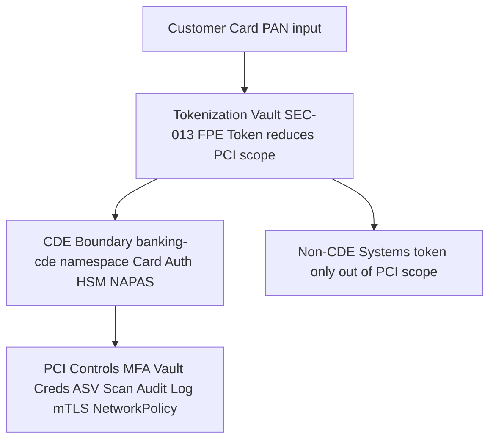

# PCI-DSS v4.0 — Payment Card Industry Data Security Standard

Status: Draft | Catalog ID: COMP-004 | Owner: @ciso-delegate
Tier Applicability: N/A — applies to all systems in PCI scope (CDE + connected systems)

## Problem Statement

- PCI-DSS v4.0 (effective March 2024) requires formal CDE scope definition and annual Qualified Security Assessor (QSA) or self-assessment; without systematic tokenization (§3) and network segmentation, Techcombank's CDE scope encompasses dozens of services — each subject to the full 12-requirement audit regime.
- §6 (secure software) requires a formal Secure SDLC with documented OWASP vulnerability remediation timelines (critical: 30 days, high: 60 days); without pipeline enforcement, vulnerabilities persist through to production.
- §8 MFA for all non-console administrative access to CDE — engineers SSHing to CDE hosts or accessing CDE databases without MFA is a direct violation, typically found in first QSA audit pass.
- §10 (audit logging) requires audit logs to be protected from modification, sent to a centralized log server, and retained for 12 months with 3 months immediately available; organizations using mutable ELK stacks fail this requirement.
- A PCI-DSS Level 1 non-compliance finding (serving >6M card transactions/year) triggers formal QSA remediation assessment, card scheme notification, and potential fines from Visa/Mastercard processors — material financial and reputational risk.

## Context

Techcombank's PCI scope covers card issuance (debit/credit), NAPAS clearing, and card authorization (3DS2 — REF-004). The CDE is bounded by: the card authorization service, HSM cluster (SEC-004), tokenization vault (SEC-013), and NAPAS connectivity (REF-002). All other systems interact with the CDE only via tokenized card data (truncated PAN or token). @ciso-delegate owns CDE scope definition and QSA engagement. @tech-lead-backend owns developer security training (§12.6) and secure SDLC (§6). Quarterly ASV scans are owned by @devsecops-lead.

## Solution

Minimize CDE scope through tokenization: replace PAN in all non-CDE systems with SEC-013 format-preserving tokens. Apply the full 12-requirement PCI-DSS control set only within the bounded CDE namespace. Use Vault dynamic credentials (SEC-003) to eliminate long-lived CDE database passwords. Automate quarterly ASV scans via GitHub Actions.



## Implementation Guidelines

### 1. Spring Security — MFA for CDE Administrative Access (§8)

```java
@Configuration
public class CdeMfaConfig {

    @Bean
    @ConditionalOnProperty("pci.cde.mfa.required")
    SecurityFilterChain cdeAdminChain(HttpSecurity http) throws Exception {
        return http
            .securityMatcher("/admin/cde/**")
            .authorizeHttpRequests(auth -> auth
                .anyRequest().hasRole("CDE_ADMIN_MFA_VERIFIED"))
            .addFilterBefore(new CdeMfaEnforcementFilter(),
                UsernamePasswordAuthenticationFilter.class)
            .build();
    }
}
```

### 2. Kubernetes NetworkPolicy — CDE Isolation (§1)

```yaml
apiVersion: networking.k8s.io/v1
kind: NetworkPolicy
metadata:
  name: cde-strict-isolation
  namespace: banking-cde
spec:
  podSelector: {}
  policyTypes: [Ingress, Egress]
  ingress:
  - from:
    - namespaceSelector:
        matchLabels:
          pci-connected: "true"
    ports:
    - protocol: TCP
      port: 8443
  egress:
  - to:
    - ipBlock:
        cidr: 10.100.0.0/16
    ports:
    - protocol: TCP
      port: 1792
  - to:
    - ipBlock:
        cidr: 10.200.0.0/16
    ports:
    - protocol: TCP
      port: 443
```

### 3. Vault Dynamic Credentials for CDE Database (§2)

Eliminate long-lived CDE database passwords using Vault database secret engine:

```java
@Configuration
public class VaultCdeDatabaseConfig {

    @Bean
    DataSource cdeDatasource(VaultTemplate vault) {
        VaultResponse creds = vault.read("database/creds/cde-postgres-role");
        String username = (String) creds.getData().get("username");
        String password = (String) creds.getData().get("password");

        return DataSourceBuilder.create()
            .url("jdbc:postgresql://cde-postgres:5432/cde_db?sslmode=verify-full")
            .username(username)
            .password(password)
            .build();
    }
}
```

### 4. GitHub Actions — Quarterly ASV Scan (§11)

```yaml
name: PCI ASV Quarterly Scan
on:
  schedule:
    - cron: '0 2 1 */3 *'
  workflow_dispatch:

jobs:
  asv-scan:
    runs-on: ubuntu-latest
    steps:
    - name: Run Nessus ASV Scan on CDE IPs
      run: |
        curl -X POST "https://asv.scanner.internal/v1/scans" \
          -H "Authorization: Bearer ${{ secrets.ASV_API_TOKEN }}" \
          -d '{"target_ips": ${{ vars.CDE_IP_LIST }}, "scan_profile": "pci_dss_v4"}'
    - name: Assert Zero Critical/High Findings
      run: |
        RESULT=$(curl "https://asv.scanner.internal/v1/scans/latest/results")
        CRITICAL=$(echo $RESULT | jq '.findings[] | select(.severity == "CRITICAL") | length')
        HIGH=$(echo $RESULT | jq '.findings[] | select(.severity == "HIGH") | length')
        if [ "$CRITICAL" -gt 0 ] || [ "$HIGH" -gt 0 ]; then
          echo "FAIL: $CRITICAL critical, $HIGH high findings"
          exit 1
        fi
```

## When to Use

- Any system that stores, processes, or transmits cardholder data (CHD) — card authorization, NAPAS clearing, card issuance, chargeback processing. These are in-scope for the full 12-requirement PCI-DSS control set.
- When designing integration points between CDE and non-CDE systems — use SEC-013 tokenization at the CDE boundary so that downstream systems receive only tokens (not PAN), removing them from PCI scope entirely.
- When planning a QSA engagement or self-assessment questionnaire (SAQ) — use the CDE scope diagram and audit log evidence from SEC-012 as the primary QSA artifacts.

## When Not to Use

- Back-office systems that never handle raw PAN or CHD and only receive SEC-013 tokens — they are out of PCI scope; apply standard corporate security controls rather than the full PCI-DSS regime.
- Tokenization system design itself — the token vault (SEC-013) is in CDE scope but uses FPE rather than vault isolation; refer to SEC-013 for the tokenization implementation and this document for the CDE governance context.
- Environments outside card payment processing (NAPAS fund transfers using account numbers, not card PANs) — PCI-DSS scopes to card data specifically; NAPAS account-based transfers are governed by SBV Circular 09/2020 instead.

## Variants

| Variant | When to prefer | Trade-off |
|---------|----------------|-----------|
| Level 1 — QSA on-site assessment | More than 6M Visa/MC transactions per year (Techcombank's current volume) | Highest assurance; mandatory; 12-month cycle; significant QSA cost (~USD 50–150k per engagement) |
| Level 2 — SAQ D (self-assessment) | 1M–6M transactions per year; full scope merchant | Reduced cost; self-assessed; QSA not required; higher internal effort to maintain evidence |
| SAQ A (card-not-present, fully tokenized) | Merchant with no CDE; all card processing outsourced to PCI-compliant PSP | Minimal scope (22 requirements); fastest path to compliance for teams with zero CHD storage |

## NFR Acceptance Criteria

```yaml
nfr_acceptance_criteria:
  id: COMP-004
  pattern: PCI-DSS v4.0

  availability:
    - id: PCI-HA-01
      statement: >
        CDE card authorization service MUST maintain 99.99% availability (T0 SLO).
        PCI requires impact tolerance documentation for critical operations.
      measurement: >
        Load test at 500 TPS for 30 min; assert p99 < 200ms; assert 0% error rate.
        Chaos test: kill CDE pod; assert circuit breaker activates within 3s.

  compliance:
    - id: PCI-COMP-01
      statement: >
        Zero critical or high findings in quarterly ASV scan.
        Critical vulnerabilities MUST be remediated within 30 days; high within 60 days.
      measurement: >
        GitHub Actions ASV scan gate; pipeline fails on any critical/high finding.
        Vulnerability tracking ticket created within 24h; deadline enforced.

    - id: PCI-COMP-02
      statement: >
        Audit logs must be retained 12 months with 3 months immediately available.
        Logs must be protected from unauthorized modification.
      measurement: >
        S3 WORM Object Lock 12-month retention verified. SEC-012 chain verification
        runs nightly; assert 0 chain breaks. Attempt S3 Delete -> assert AccessDenied.
```

## Compliance Mapping

| Ring | Regulation | Provision | How this pattern satisfies |
|------|-----------|-----------|---------------------------|
| Ring 0 | OWASP Top 10 | A02 (Cryptographic Failures), A05 (Security Misconfiguration), A07 (Authentication Failures) | PCI requirements for crypto, network segmentation, and MFA directly address OWASP Top 10 A02, A05, A07 respectively. |
| Ring 1 | PCI-DSS v4.0 | All 12 requirements — scope, network, CHD protection, software, access, monitoring, policy | This document IS the primary Ring 1 obligation for card data. CDE scope definition, Vault creds, NetworkPolicy, ASV scan, SEC-012 audit log collectively implement requirements 1–12. |
| Ring 2 | SBV Circular 09/2020/TT-NHNN | §III Art. 9 (HSM key management), §IV Art. 21 (network segmentation) ⚠️ (working summary — pending Legal review) | PCI-DSS HSM requirements and network segmentation requirements overlap with SBV Circular 09; satisfying PCI-DSS for card systems simultaneously satisfies the corresponding SBV obligations. Legal review required to confirm full equivalence. |

## Cost / FinOps

- **QSA engagement**: USD 50–150k/year for Level 1 on-site assessment; budget in compliance operating plan.
- **CloudHSM for CDE**: USD 1.45/hr × 2 HSMs = ~USD 2,530/month; shared with SEC-004 tokenization.
- **ASV scan tooling**: Tenable.io Security Center (or equivalent ASV tool): ~USD 20k/year; quarterly scan automation via GitHub Actions eliminates manual scheduling cost.
- **Scope reduction dividend**: each service removed from PCI scope saves approximately 2 engineer-weeks of annual PCI evidence gathering and one QSA day (~USD 3k). Tokenization of 5 additional services = ~USD 25k/year QSA savings, typically paying for the tokenization implementation in year 1.
- **Cost of non-compliance**: Visa/Mastercard processor fines for non-compliance start at USD 5k/month per scheme, escalating to USD 100k/month. Card scheme suspension is possible for sustained non-compliance — existential risk for Techcombank's card business.

## Threat Model

- **PAN harvesting from non-CDE system (Information Disclosure)**: Attacker compromises a non-CDE service and finds raw PAN in database or logs — possible only if tokenization was not applied at the CDE boundary. Mitigation: SEC-013 FPE tokenization at CDE egress; ArchUnit test asserts no `String cardNumber` field in non-CDE service classes; CI pipeline runs trufflehog to detect PAN patterns in code and config.
- **Privileged access to CDE without MFA (Elevation of Privilege)**: DBA or SRE accesses CDE PostgreSQL directly via psql without second factor, bypassing PCI MFA requirement. Mitigation: CDE PostgreSQL requires certificate-based mutual TLS + LDAP with MFA token; Vault dynamic credentials mean no static password exists to steal; CloudTrail + Vault audit log captures all CDE database connections.

## Operational Runbook Stub

**Alert: `pci_asv_scan_finding_critical`** (Critical vulnerability found in quarterly ASV scan)
- SLA: Remediation within 30 days (PCI-DSS §11)
- Remediation: (1) Create P1 security ticket in Jira with 30-day deadline. (2) Assign to @ciso-delegate and CDE service owner. (3) If patch not available: implement compensating control (WAF rule, network block) and document for QSA. (4) Rescan after fix; assert finding cleared. (5) Notify QSA of finding and remediation.

**Alert: `cde_network_policy_violation`** (Pod outside CDE namespace attempted connection to CDE pod)
- p50 baseline: 0 violations/day | SLA: investigate within 1h
- Remediation: (1) Identify source pod from Calico logs. (2) If known legitimate service: update NetworkPolicy to permit explicitly. (3) If unknown: treat as security incident; check for lateral movement; notify @ciso-delegate.

## Test Strategy Stub

### Unit Tests
- `CdeMfaEnforcementFilterTest`: request to `/admin/cde/db` without `ROLE_CDE_ADMIN_MFA_VERIFIED` -> assert HTTP 401. With role -> assert request proceeds.
- `VaultCdeDatabaseConfigTest`: mock Vault; assert DataSource username/password match Vault response; assert DataSource uses `sslmode=verify-full`.

### Integration Tests
- Spring Boot Test with Testcontainers (PostgreSQL + Vault dev mode): obtain Vault dynamic credentials; connect to CDE database; verify credentials expire after TTL; assert new credentials obtained on reconnect.
- ASV scan gate (CI): run trufflehog against all commits in CDE service repos; assert 0 PAN pattern matches.

### Compliance Tests
- Annual CDE scope review: verify all in-scope services have PCI-DSS Compliance Mapping Ring 1 row.
- Quarterly: ASV scan via GitHub Actions; assert 0 critical/high findings.
- Penetration test (annual): external QSA penetration test of CDE boundary; assert no CDE system reachable from non-PCI-connected pods.

## Related Patterns

- [SEC-004 Tokenization + HSM](../patterns/security/tokenization-hsm.md) — implements PCI CHD protection via HSM-backed tokenization
- [SEC-013 PII Tokenization Format-Preserving](../patterns/security/pii-tokenization-format-preserving.md) — FPE tokenization removes non-CDE systems from PCI scope
- [SEC-010 Attribute-Based Access Control](../patterns/security/attribute-based-access-control.md) — OPA enforces need-to-know for CDE data
- [SEC-012 Tamper-Evident Audit Logging](../patterns/security/audit-logging-tamper-evident.md) — implements PCI audit log protection and retention

## References

- [PCI-DSS v4.0 Requirements and Testing Procedures](https://www.pcisecuritystandards.org/document_library/)
- [PCI-DSS v4.0 Summary of Changes from v3.2.1](https://www.pcisecuritystandards.org/document_library/)
- Research notes: `knowledge-base/_research-notes.md`
- Catalog reference: `governance/standards/enterprise-architecture-catalog.md`
