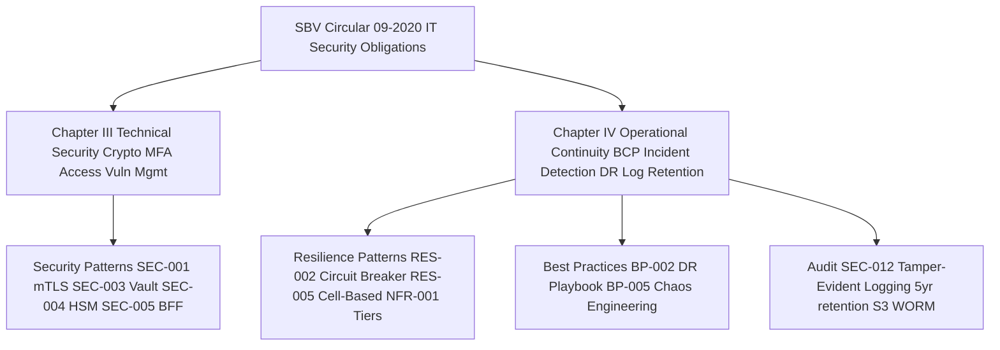

# SBV Circular 09/2020/TT-NHNN — IT Security in Banking

Status: Draft | Catalog ID: COMP-002 | Owner: @head-of-compliance
Tier Applicability: N/A — applies to all systems

> ⚠️ **Working summary** — verbatim Article text pending authoritative English translation from `@legal-vietnam`. Do NOT use in regulatory submissions without Legal sign-off.

## Problem Statement

- Vietnamese banks face administrative sanctions and SBV license risk if IT security controls do not meet Circular 09/2020/TT-NHNN requirements. Non-compliance findings in SBV on-site inspections (Art. 31–37) carry fines and mandatory remediation timelines.
- Without a structured mapping of each Circular 09 chapter to catalog patterns, engineering teams may deploy systems that fail SBV audits — particularly around MFA enforcement (§III), network segmentation (§IV), and audit log retention (§IV Art. 24–25).
- Incident notification timelines (§IV — 24h for critical outages, 8h for security breaches) are operationally demanding; without pre-wired runbooks and tested contact lists, banks miss the SBV window and compound the violation.
- Log retention requirements (5 years security events, 10 years transaction logs per §IV Art. 25) require durable, tamper-evident storage that standard ELK deployments do not provide by default.
- AES-256 at rest and TLS 1.2+ in transit (§III Art. 9–10) must be verifiably enforced — infrastructure scans must produce audit evidence consumable by SBV inspectors.

## Context

SBV Circular 09/2020/TT-NHNN applies to all SBV-licensed credit institutions, non-bank credit institutions, and payment service providers operating in Vietnam. For Techcombank this covers every production system processing customer financial data or handling payment transactions. All engineering teams building or modifying T0/T1 services must cite the applicable §III or §IV obligations in their DAB submissions. The compliance matrix (COMP-001) is the authoritative cross-reference. Security (§III) obligations are owned by @ciso-delegate; Operational Continuity (§IV) obligations are owned by @sre-lead; the overall compliance posture is owned by @head-of-compliance.

## Solution

Map Circular 09/2020 obligations to catalog patterns. Each chapter's key obligations are addressed by dedicated catalog entries. The compliance matrix (COMP-001) is the single source of truth for the full cross-reference. New catalog entries must self-declare their Circular 09 coverage in their Compliance Mapping section.



## Implementation Guidelines

### 1. OPA Rego — SBV Data Classification Policy

OPA enforces that sensitive data fields (transaction amounts, account balances, biometric tokens) are handled only by services with declared SBV §III compliance context.

```rego
package sbv.circular09

import future.keywords.if

default allow_sensitive_access = false

allow_sensitive_access if {
    input.service.sbv_compliance_declared == true
    input.service.mfa_enforced == true
    input.data.classification in {"sensitive", "financial"}
}

# Reject access if TLS version is below 1.2
deny_unencrypted if {
    input.connection.tls_version < "1.2"
}
```

### 2. Spring Security — MFA Configuration for Internet Banking

§III Art. 12 requires MFA for all internet and mobile banking sessions.

```java
@Configuration
@RequiredArgsConstructor
public class MfaSecurityConfig {

    @Bean
    SecurityFilterChain mfaFilterChain(HttpSecurity http) throws Exception {
        return http
            .sessionManagement(s -> s
                .sessionCreationPolicy(SessionCreationPolicy.IF_REQUIRED)
                .maximumSessions(1))
            .authorizeHttpRequests(auth -> auth
                .requestMatchers("/banking/**").hasRole("MFA_VERIFIED")
                .requestMatchers("/actuator/health").permitAll()
                .anyRequest().authenticated())
            .addFilterBefore(new MfaChallengeFilter(), UsernamePasswordAuthenticationFilter.class)
            .build();
    }
}

@Component
public class MfaChallengeFilter extends OncePerRequestFilter {
    @Override
    protected void doFilterInternal(HttpServletRequest req,
            HttpServletResponse res, FilterChain chain)
            throws ServletException, IOException {
        Authentication auth = SecurityContextHolder.getContext().getAuthentication();
        if (auth != null && auth.isAuthenticated()
                && !auth.getAuthorities().stream()
                    .anyMatch(a -> a.getAuthority().equals("ROLE_MFA_VERIFIED"))) {
            res.sendError(HttpServletResponse.SC_UNAUTHORIZED, "MFA required");
            return;
        }
        chain.doFilter(req, res);
    }
}
```

### 3. HashiCorp Vault — Secret Access Policy (§III Art. 9)

Vault policy restricting CDE secrets to MFA-verified service accounts:

```hcl
# vault-policy-cde.hcl — paragraph III Art. 9 HSM key management
path "secret/data/cde/*" {
  capabilities = ["read"]
  required_parameters = ["mfa_verified"]
}

path "transit/encrypt/aes256-cde" {
  capabilities = ["update"]
}

path "transit/decrypt/aes256-cde" {
  capabilities = ["update"]
  min_wrapping_ttl = "1m"
  max_wrapping_ttl = "15m"
}
```

### 4. Kubernetes NetworkPolicy — Network Segmentation (§IV Art. 21)

```yaml
apiVersion: networking.k8s.io/v1
kind: NetworkPolicy
metadata:
  name: cde-isolation
  namespace: banking-cde
spec:
  podSelector:
    matchLabels:
      tier: cde
  policyTypes: [Ingress, Egress]
  ingress:
  - from:
    - namespaceSelector:
        matchLabels:
          name: banking-api
      podSelector:
        matchLabels:
          role: payment-service
  egress:
  - to:
    - ipBlock:
        cidr: 10.0.0.0/8
    ports:
    - protocol: TCP
      port: 5432
```

## When to Use

- Any DAB submission for a T0 or T1 system that processes customer financial data, payment transactions, or authentication — cite the applicable §III or §IV provisions in the Compliance Mapping section.
- When designing authentication flows for internet or mobile banking — §III Art. 12 mandates MFA; use this document to confirm the exact obligation and point to SEC-005 (BFF + DPoP) for the implementation pattern.
- When defining log retention requirements — §IV Art. 24–25 sets 5-year and 10-year thresholds; use this document to justify the S3 WORM retention policy in SEC-012.

## When Not to Use

- Internal tooling with no customer data and no connection to payment systems — Circular 09 §I Art. 2 scopes to systems processing customer financial data; back-office tooling may use standard security controls without the full §III regime.
- Development and sandbox environments where no real customer data is present — MFA enforcement, HSM key management, and audit log retention apply to production only; sandbox can use simplified controls.
- Third-party SaaS where the vendor is responsible for compliance — confirm the vendor holds SBV approval (or equivalent) and obtain written attestation; do not apply Circular 09 controls to the Techcombank-managed integration layer unless that layer processes raw customer data.

## Variants

| Variant | When to prefer | Trade-off |
|---------|----------------|-----------|
| Full §III + §IV compliance (T0/T1 production) | Any system in scope — internet banking, payment, core banking | Maximum SBV audit readiness; highest operational overhead (HSM, MFA, 5yr log retention) |
| Scoped §III compliance (T2 internal-facing) | Internal APIs serving authenticated employees only; no direct customer data access | Reduced control set (MFA for employees via SSO; AES-256 still required); lower audit scope |
| Vendor attestation model | Third-party SaaS processing customer data (e.g., credit bureau) | Contractual SBV compliance delegation; Techcombank must verify attestation annually |

## NFR Acceptance Criteria

```yaml
nfr_acceptance_criteria:
  id: COMP-002
  pattern: SBV Circular 09/2020

  availability:
    - id: C09-HA-01
      statement: >
        MFA service (OTP provider + Spring Security MFA filter) MUST maintain 99.9% availability.
        MFA unavailability blocks all internet banking logins — zero-downtime deployment required.
      measurement: >
        Load test internet banking login at 500 rps for 30 min; assert 0 HTTP 500 responses;
        assert p99 MFA challenge response < 200ms.

  performance:
    - id: C09-HP-01
      statement: >
        AES-256 encrypt/decrypt overhead MUST NOT exceed 5ms p99 for payloads up to 4KB.
        Encryption is inline on the payment hot path.
      measurement: >
        JMH benchmark: AES-256/GCM encrypt 4KB payload 10k iterations;
        assert p99 < 5ms on JDK 21 with AES-NI hardware acceleration.

  resilience:
    - id: C09-HR-01
      statement: >
        SBV incident notification runbook MUST be tested annually; SBV contact list current
        within 90 days. Breach notification SLA: 8h from discovery.
      measurement: >
        Tabletop exercise results documented in governance/decisions/REVIEW-LOG-*;
        SBV contact list review date < 90 days in runbook header.

  compliance:
    - id: C09-COMP-01
      statement: >
        Audit log retention: security events 5 years minimum; transaction logs 10 years minimum.
        Logs must be stored in S3 WORM (Object Lock COMPLIANCE mode).
      measurement: >
        Verify S3 bucket Object Lock configuration: COMPLIANCE mode, retention
        period >= 1826 days (5yr). Attempt S3 DeleteObject; assert AccessDenied.
```

## Compliance Mapping

| Ring | Regulation | Provision | How this pattern satisfies |
|------|-----------|-----------|---------------------------|
| Ring 0 | NIST CSF 2.0 | PR.DS-1 (Data at rest protection), PR.AC-7 (Authentication) | §III AES-256 at-rest and MFA requirements align with NIST CSF PR.DS-1 and PR.AC-7; NIST CSF provides the international benchmark that §III codifies for Vietnamese banking. |
| Ring 0 | OWASP ASVS L3 | Authentication (V2), Session Management (V3), Cryptography (V6) | §III Art. 12 MFA requirement and §III Art. 9 cryptographic requirements align with OWASP ASVS Level 3 controls for high-value financial applications. |
| Ring 1 | PCI-DSS v4.0 | §3 (stored data protection), §8 (strong authentication) | PCI-DSS provides international baseline; §III Art. 9–12 exceeds PCI-DSS in requiring MFA for all internet banking (PCI-DSS scopes to CDE only). |
| Ring 2 | SBV Circular 09/2020/TT-NHNN | §III Art. 9–20 (technical security); §IV Art. 21–30 (operational continuity) ⚠️ (working summary — pending Legal review) | This document IS the primary Ring 2 obligation; catalog patterns collectively satisfy each §III and §IV article as mapped in the key obligations section. |

## Cost / FinOps

- **HSM (§III Art. 9)**: AWS CloudHSM cluster (minimum 2 HSMs for HA): ~USD 1.45/hr per HSM × 2 = ~USD 2,530/month. Shared across all T0/T1 services; amortised cost per service is low. Vault-managed keys (SEC-003) reduce HSM calls to key generation only — bulk crypto uses AES-NI in software.
- **MFA OTP service (§III Art. 12)**: AWS SNS for SMS OTP: ~USD 0.006 per SMS. At 50 000 logins/day × 30% SMS OTP = 15 000 SMS/day = ~USD 90/day = ~USD 2,700/month. TOTP (authenticator app) eliminates SMS cost; prefer TOTP for corporate banking.
- **Audit log retention (§IV Art. 24–25)**: S3 WORM 10-year transaction log retention. At 50 GB/year compressed transaction logs × 10 years = 500 GB; at S3 Standard USD 0.023/GB/month = USD 11.50/month. Negligible compared to regulatory fine risk (VND multi-billion per violation under Art. 31–37).
- **Cost of non-compliance**: SBV sanctions under Art. 31–37 include administrative fines and potential operating license conditions. Remediation of a §III MFA finding after inspection typically costs 4–8 engineer-months of emergency work — vastly exceeding the cost of proactive compliance.

## Threat Model

- **Insider threat — audit log deletion (Tampering)**: A privileged DBA deletes audit log entries to conceal an unauthorized transaction. Without tamper-evident logging (§IV Art. 24), the deletion is undetectable and the bank loses SBV audit evidence. Mitigation: SEC-012 (Tamper-Evident Audit Logging) implements HMAC chaining + S3 WORM; PostgreSQL INSERT-only rules prevent DELETE at the engine level; nightly chain verification detects any gap.
- **Network perimeter breach — lateral movement to CDE (Elevation of Privilege)**: An attacker compromising a non-CDE pod uses flat network policy to reach CDE services. §IV Art. 21 requires network segmentation. Mitigation: K8s NetworkPolicy (Implementation §4 above) allows only declared payment-service pods in banking-api namespace to reach banking-cde; SEC-001 mTLS enforces mutual TLS on all service-to-service calls; Calico network policy auditing logs all NetworkPolicy violations.

## Operational Runbook Stub

**Alert: `sbv_incident_notification_pending`** (T0/T1 system unavailable > 30 min)
- p50 baseline: N/A | SLA: notify SBV within 24h (critical outage) or 8h (security breach)
- Remediation: (1) Confirm incident classification: critical outage vs. security breach. (2) Draft SBV notification using template at `governance/runbooks/sbv-notification-template.md`. (3) @head-of-compliance reviews and submits to SBV Operations desk via prescribed channel. (4) Log submission timestamp in incident ticket. (5) Follow-up written report within 72h.

**Alert: `audit_log_retention_gap`** (S3 WORM export overdue > 1h)
- p50 baseline: export completes within 45 min nightly | p99 SLO: 60 min
- Remediation: (1) Check export job pod logs: `kubectl logs -l app=audit-export-job`. (2) If S3 unavailable, trigger backup export to secondary region. (3) Notify @ciso-delegate if export gap exceeds 4h — §IV Art. 24 retention may be at risk.

## Test Strategy Stub

### Unit Tests
- `SbvMfaFilterTest`: authenticated user without `ROLE_MFA_VERIFIED` attempts `/banking/transfer` → assert HTTP 401; authenticated + MFA-verified user → assert 200.
- `VaultCdePolicyTest`: mock Vault; request `secret/data/cde/db-password` with `mfa_verified=false` → assert `VaultAccessDeniedException`.

### Integration Tests
- Spring Boot Test with Testcontainers (PostgreSQL + Redis): complete internet banking login flow with TOTP second factor → assert session receives `ROLE_MFA_VERIFIED`; attempt login with wrong OTP → assert HTTP 401 and audit log entry created.
- K8s NetworkPolicy test (kind cluster): deploy test pod in non-permitted namespace; attempt TCP connection to CDE pod → assert connection refused.

### Compliance Tests
- Annual: `python3 scripts/check-compliance-rows.py` — assert all T0/T1 documents have `SBV Circular 09/2020` in their Compliance Mapping Ring 2 row.
- Annual DR drill: fail over T0 payment gateway to secondary region; measure RTO achieved vs. 5-minute target; document results in `governance/decisions/REVIEW-LOG-DR-$(date +%Y)`.
- Quarterly: SSL Labs scan on all internet-facing endpoints; assert grade A+ (TLS 1.3 preferred, TLS 1.2 minimum, no SSLv3/TLS 1.0/1.1).

## Related Patterns

- [COMP-001 Compliance Mapping Matrix](compliance-mapping-matrix.md) — authoritative cross-reference of all Circular 09 obligations
- [SEC-001 mTLS Service Mesh](../patterns/security/mtls-service-mesh.md) — satisfies §IV network segmentation and SEC-012 transport-level audit
- [SEC-003 Vault Secret Management](../patterns/security/vault-secret-management.md) — satisfies §III Art. 9 HSM key management
- [SEC-012 Tamper-Evident Audit Logging](../patterns/security/audit-logging-tamper-evident.md) — satisfies §IV Art. 24–25 log retention and integrity
- [NFR-001 Service Tiering RTO/RPO](../nfr/service-tiering-rto-rpo.md) — encodes §IV operational continuity targets

## References

- SBV Circular 09/2020/TT-NHNN (Vietnamese): thuvienphapluat.vn (URL pending librarian fetch)
- Research notes: `knowledge-base/_research-notes.md`
- Compliance matrix: `knowledge-base/compliance/compliance-mapping-matrix.md` (COMP-001)
- Catalog reference: `governance/standards/enterprise-architecture-catalog.md`
