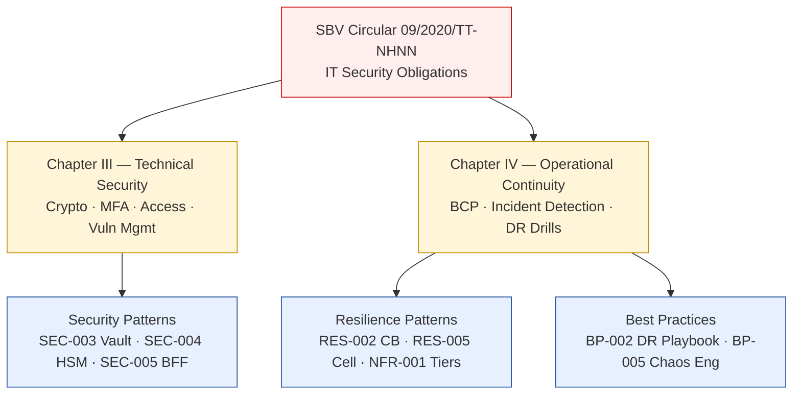

# SBV Circular 09/2020/TT-NHNN — IT Security in Banking

Status: Draft | Last Reviewed: 2026-05-09 | Owner: @head-of-compliance
Catalog ID: COMP-002 | Radii
Tier Applicability: T0, T1, T2

> ⚠️ **Working summary** — verbatim Article text pending authoritative English translation from `@legal-vietnam`. Do NOT use in regulatory submissions without Legal sign-off. See `knowledge-base/_research-notes.md` for the expanded working summary and TODO list.

## Problem Statement

Vietnamese banks operate under SBV Circular 09/2020/TT-NHNN, which mandates a comprehensive information security regime across cryptographic controls, multi-factor authentication, operational continuity, and incident response. Without a structured mapping of this circular to platform architecture, teams may unknowingly deploy systems that fail SBV audits or miss notification timelines — exposing the bank to regulatory sanctions.

## Solution

Map Circular 09/2020 obligations to the enterprise architecture catalog. Each relevant catalog document must cite the applicable Chapter and Article(s). The compliance matrix (COMP-001) is the authoritative cross-reference.



## Chapter / Article Structure (Working Summary)

> ⚠️ Article numbers are approximate. Confirm with authoritative Vietnamese text.

| Chapter | Articles (approx.) | Key obligations |
|---------|-------------------|-----------------|
| I — General Provisions | Art. 1–3 | Scope: all SBV-licensed credit institutions, non-bank credit institutions, payment service providers; definitions of information system tiers |
| II — Security Organisation | Art. 4–8 | Board-level information security committee (required for Tier-1 banks); designated Information Security Officer (ISO) role; mandatory security policies and annual review |
| III — Technical Security | Art. 9–20 | Network segmentation + IPS/IDS; AES-256 at rest, TLS 1.2+ in transit; HSM for key management (T0/T1); MFA for internet and mobile banking; privileged access controls; vulnerability scanning ≥ every 6 months |
| IV — Operational Continuity | Art. 21–30 | Documented BCP with RTO/RPO per critical system; hot/warm standby for critical systems; DR drills at minimum annually; SBV incident notification within 24h (critical) / 8h (security breach); 5-year audit log retention; 10-year transaction log retention |
| V — Compliance and Penalties | Art. 31–37 | Annual self-assessment; SBV on-site inspection rights; administrative sanctions for non-compliance |

## Compliance Mapping

| Ring | Regulation | Provision | Pattern implementation |
|------|-----------|-----------|----------------------|
| Ring 0 (global) | NIST CSF 2.0 | PR.DS-1 (Data at rest protection), PR.AC-7 (Authentication) | Informs technical security requirements in §III |
| Ring 0 (global) | OWASP ASVS L3 | Authentication, Session Management, Cryptography | MFA and crypto requirements align with ASVS Level 3 for banking applications |
| Ring 1 (international banking) | PCI-DSS v4.0 §3/§8 | Cryptographic key management; strong authentication | PCI-DSS provides international baseline; §III exceeds it in some areas |
| Ring 2 (Vietnam) | SBV Circular 09/2020 §III | Cryptographic controls, MFA, access management | Primary mandate for SEC-003, SEC-004, SEC-005 |
| Ring 2 (Vietnam) | SBV Circular 09/2020 §IV | Operational continuity, DR, incident reporting | Primary mandate for NFR-001 (RTO/RPO), BP-002 (DR Playbook), BP-005 (Chaos Engineering) |

## Key Obligations by Catalog Domain

### Security Domain (Chapter III)
- **Encryption at rest**: AES-256 for all customer data and transaction records → SEC-004 (Tokenisation + HSM)
- **Encryption in transit**: TLS 1.2 minimum on internal APIs; TLS 1.3 recommended internet-facing → enforced via mTLS service mesh (SEC-001) and API gateway
- **HSM key management**: HSM required for key generation + storage at T0/T1 → SEC-003 (Vault) + SEC-004 (HSM)
- **MFA**: Mandatory for internet and mobile banking sessions; session re-authentication for high-value transactions (threshold ≥ VND 100 million per bank risk policy) → SEC-005 (BFF + DPoP), REF-003 (KYC/AML), REF-004 (3DS2)
- **Vulnerability scanning**: Minimum every 6 months; penetration testing annually → BP-005 (Chaos Engineering) covers failure-mode testing; pen-test programme separate

### Resilience Domain (Chapter IV)
- **BCP**: Documented per critical system with RTO/RPO → NFR-001 (Service Tiering RTO/RPO), NFR-AC template (TPL-001)
- **DR drill**: Annually minimum; results documented → BP-002 (DR Playbook)
- **Incident notification**: Critical system down → SBV within 24h; security breach → within 8h
- **Log retention**: Security events 5 years; transaction logs 10 years → EIP-025 (Dead Letter Channel) + operational runbooks

## NFR Acceptance Criteria

```yaml
service_name: "[service]-circular09-compliance"
tier: T0
compliance_context:
  regulation: SBV Circular 09/2020/TT-NHNN (working summary — pending Legal)
  chapter_iii_mfa: required for all internet and mobile banking sessions
  chapter_iii_encryption: AES-256 at rest; TLS 1.2+ in transit
  chapter_iv_rto_minutes: 5        # T0 critical systems
  chapter_iv_rpo_seconds: 0        # real-time replication
  chapter_iv_dr_drill_months: 12   # minimum annual
  chapter_iv_incident_notify_h: 24 # critical system; 8h for security breach
  chapter_iv_log_retention_years: 5  # security events; 10 for transactions
acceptance_criteria:
  - id: C09-1
    description: MFA enforced for all internet and mobile banking sessions
    verification: integration test — session without second factor returns HTTP 401
  - id: C09-2
    description: All at-rest data encrypted AES-256; in-transit TLS 1.2+
    verification: infrastructure scan (SSL Labs A+ rating); storage encryption tag audit
  - id: C09-3
    description: DR drill completed within last 12 months; results documented
    verification: DR drill log in governance/decisions/REVIEW-LOG-DR-*
  - id: C09-4
    description: Incident notification runbook tested; SBV contact list current
    verification: runbook review date < 90 days
```

## Operational Runbook (stub)

1. **Incident detection** — SIEM alert fires → on-call acknowledges within 15 min
2. **Classification** — determine if event qualifies as "critical" (T0/T1 system unavailable) or "security breach" (data exfiltration, auth bypass)
3. **SBV notification** — if critical: notify SBV Operations desk within 24h via prescribed form; if security breach: within 8h
4. **Evidence preservation** — snapshot logs; do not modify audit trail
5. **Post-incident** — PIR within 5 business days; update DR runbook if gaps found

## Test Strategy (stub)

- **Unit**: crypto utility tests — encrypt/decrypt round-trips with AES-256
- **Integration**: MFA flow tests — assert second-factor challenge on new session
- **Compliance**: quarterly `check-compliance-rows.py` — all Approved docs have §III/§IV references
- **DR drill**: annual regional failover drill per BP-002; document RTO achieved vs. target

## References

- SBV Circular 09/2020/TT-NHNN (Vietnamese): thuvienphapluat.vn (URL pending librarian fetch)
- Research notes: `knowledge-base/_research-notes.md#state-bank-of-vietnam--circular-092020tt-nhnn`
- Compliance matrix: `knowledge-base/compliance/compliance-mapping-matrix.md` (COMP-001)
- Related patterns: SEC-003, SEC-004, SEC-005, NFR-001, BP-002, BP-005

---

**Key Takeaway**: SBV Circular 09/2020 mandates AES-256 + TLS 1.2+, MFA for digital banking, HSM for T0/T1 key management, annual DR drills, and 24h SBV incident notification. All T0/T1 catalog documents must cite applicable Chapter III or IV obligations.
