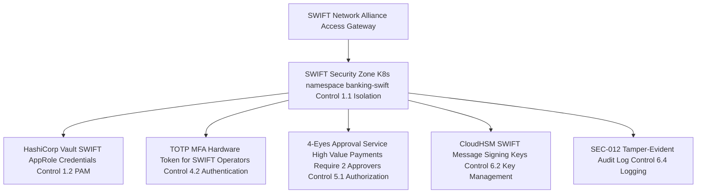

# SWIFT Customer Security Programme (CSP) v2024

Status: Draft | Last Reviewed: 2026-05-16 | Catalog ID: COMP-008 | Owner: @ciso-delegate
Tier Applicability: N/A — applies to all systems in the SWIFT security zone

## Problem Statement

- SWIFT CSP v2024 mandates 23 mandatory controls and 11 advisory controls for all SWIFT network participants; failure to complete the annual self-attestation by December 31 results in SWIFT notifying correspondent banks that Techcombank's CSP attestation is overdue — triggering correspondent bank due-diligence reviews and potential correspondent banking relationship restrictions.
- CSP Control 1.1 (SWIFT Environment Protection) requires complete network isolation of SWIFT infrastructure; without a dedicated Kubernetes namespace with strict NetworkPolicy, SWIFT systems co-hosted with general-purpose applications violate this control.
- CSP Control 1.2 (Privileged Account Control) requires all SWIFT administrator credentials to be managed in a Privileged Access Management (PAM) system; hard-coded SWIFT credentials in application configuration files are a CSP violation frequently found in first-time attestations.
- CSP Control 4.2 (Multi-Factor Authentication) requires MFA for all SWIFT user access, including operators performing manual SWIFT transactions; SMS OTP is not accepted as MFA for SWIFT (hardware token or TOTP required per SWIFT authentication guidance).
- SWIFT fraud incidents (unauthorized payment instructions via compromised SWIFT systems) have cost the global banking industry billions of dollars; CSP controls directly mitigate this risk by requiring 4-eyes approval for high-value SWIFT messages and secure credential management.

## Context

SWIFT CSP applies to all SWIFT network participants — banks, financial institutions, and service bureaux. For Techcombank, the SWIFT security zone includes: the SWIFT Alliance Access gateway, the SWIFT Business Application layer, and the HSM (SEC-004) used for SWIFT message authentication keys. @ciso-delegate owns CSP attestation. @payments-domain-owner owns SWIFT operational connectivity. @sre-lead owns SWIFT infrastructure security. Annual self-attestation is due December 31.

Reach for this pattern when:

- Any system connects to the SWIFT Alliance gateway or submits SWIFT messages — CSP mandatory controls apply to all systems in the SWIFT security zone.
- Onboarding a new SWIFT operator — provision hardware TOTP token (Control 4.2), register in PAM (Control 1.2), grant SWIFT_OPERATOR role, document in access log.
- Annual CSP self-attestation cycle (December) — use GitHub Actions evidence collection to gather control evidence for @ciso-delegate review.
- Designing or reviewing infrastructure in the banking-swift Kubernetes namespace.

## Solution

Isolate the SWIFT environment in a dedicated Kubernetes namespace (`banking-swift`) with strict NetworkPolicy. Use HashiCorp Vault AppRole for SWIFT credentials. Implement a 4-eyes approval service for high-value SWIFT messages (above USD 1M). Automate annual self-attestation evidence collection via GitHub Actions. Configure CloudHSM for SWIFT message authentication keys.

The 4-eyes approval service is the critical fraud-prevention control: a single SWIFT operator cannot submit a high-value payment unilaterally — a second approver (who cannot be the same person as the submitter) must confirm before the message is routed to SWIFT Alliance.



## Implementation Guidelines

### 1. HashiCorp Vault AppRole — SWIFT Credential Management (Control 1.2)

Vault AppRole provides machine-to-machine credential access with short-lived tokens and use-limited secret IDs. The `secret_id_num_uses = 5` and `secret_id_ttl = 600` limits ensure that an exfiltrated secret_id expires quickly and cannot be replayed indefinitely.

```hcl
# vault-policy-swift.hcl — SWIFT credential access policy
path "secret/data/swift/alliance/*" {
  capabilities = ["read"]
}

path "transit/sign/swift-msg-signing-key" {
  capabilities = ["update"]
}
```

```hcl
# Vault AppRole for SWIFT service
resource "vault_approle_auth_backend_role" "swift_alliance" {
  role_name          = "swift-alliance-role"
  token_policies     = ["swift-policy"]
  token_ttl          = 3600
  token_max_ttl      = 14400
  secret_id_ttl      = 600
  secret_id_num_uses = 5
}
```

```java
@Service
@RequiredArgsConstructor
public class SwiftCredentialProvider {

    private final VaultTemplate vault;

    public SwiftCredentials getSwiftAllianceCredentials() {
        VaultResponse response = vault.read("secret/data/swift/alliance/operator");
        Map<String, Object> data = (Map<String, Object>) response.getData().get("data");
        return new SwiftCredentials(
            (String) data.get("username"),
            (String) data.get("password_encrypted")
        );
    }
}
```

### 2. Kubernetes NetworkPolicy — SWIFT Zone Isolation (Control 1.1)

The `banking-swift` namespace accepts ingress only from SWIFT-authorized operator pods in the `banking-payments` namespace, and restricts egress to the SWIFT network IP range and CloudHSM subnet. No general-purpose pod can reach the SWIFT zone.

```yaml
apiVersion: networking.k8s.io/v1
kind: NetworkPolicy
metadata:
  name: swift-zone-strict-isolation
  namespace: banking-swift
spec:
  podSelector: {}
  policyTypes: [Ingress, Egress]
  ingress:
  - from:
    - podSelector:
        matchLabels:
          role: swift-authorized-operator
      namespaceSelector:
        matchLabels:
          name: banking-payments
    ports:
    - protocol: TCP
      port: 9443
  egress:
  - to:
    - ipBlock:
        cidr: 149.11.0.0/16
    ports:
    - protocol: TCP
      port: 443
  - to:
    - ipBlock:
        cidr: 10.100.0.0/16
    ports:
    - protocol: TCP
      port: 1792
```

### 3. 4-Eyes Approval Service (Control 5.1 — Authorization for High-Value Messages)

Payments above USD 1M are held in a pending authorization state until a second SWIFT_AUTHORIZER (distinct from the submitter) approves. The `submittedBy` equality check enforces the 4-eyes requirement at the application layer.

```java
@RestController
@RequestMapping("/swift/authorization")
@RequiredArgsConstructor
public class SwiftFourEyesController {

    private final AuthorizationRepository authRepo;
    private final SwiftMessageSubmitter submitter;
    private static final BigDecimal HIGH_VALUE_THRESHOLD =
        new BigDecimal("1000000");

    @PostMapping("/submit")
    @PreAuthorize("hasRole('SWIFT_OPERATOR')")
    public ResponseEntity<AuthorizationResponse> submitForApproval(
            @RequestBody SwiftPaymentRequest req,
            @AuthenticationPrincipal Jwt jwt) {

        if (req.amount().compareTo(HIGH_VALUE_THRESHOLD) >= 0) {
            PendingAuthorization pending = authRepo.create(
                PendingAuthorization.builder()
                    .swiftMessage(req.toMxMessage())
                    .submittedBy(jwt.getSubject())
                    .requiredApprovers(2)
                    .expiresAt(Instant.now().plus(4, ChronoUnit.HOURS))
                    .build());
            return ResponseEntity.accepted()
                .body(new AuthorizationResponse(pending.id(), "PENDING_APPROVAL"));
        }

        submitter.submitToSwift(req.toMxMessage());
        return ResponseEntity.ok(new AuthorizationResponse(null, "SUBMITTED"));
    }

    @PostMapping("/{authId}/approve")
    @PreAuthorize("hasRole('SWIFT_AUTHORIZER')")
    public ResponseEntity<Void> approve(@PathVariable UUID authId,
            @AuthenticationPrincipal Jwt jwt) {

        PendingAuthorization auth = authRepo.findById(authId)
            .orElseThrow(() -> new ResponseStatusException(NOT_FOUND));

        if (auth.submittedBy().equals(jwt.getSubject())) {
            throw new ResponseStatusException(FORBIDDEN,
                "Cannot approve own submission (4-eyes required)");
        }

        auth.addApproval(jwt.getSubject());
        if (auth.isFullyApproved()) {
            submitter.submitToSwift(auth.swiftMessage());
            authRepo.markSubmitted(authId);
        }
        return ResponseEntity.ok().build();
    }
}
```

### 4. Credential Rotation Script (Control 6.2)

Credentials must be rotated every 90 days per CSP Control 6.2. The script generates a new AppRole secret_id, encrypts it via Vault transit, and stores the result in the SWIFT credential path.

```bash
#!/bin/bash
# governance/scripts/rotate-swift-credentials.sh
# SWIFT CSP Control 6.2 — periodic credential rotation

set -euo pipefail
VAULT_ADDR="${VAULT_ADDR:-https://vault.banking.internal:8200}"
SWIFT_ROLE="swift-alliance-role"

echo "Starting SWIFT credential rotation at $(date)"

NEW_SECRET=$(vault write -format=json auth/approle/role/${SWIFT_ROLE}/secret-id \
  | jq -r '.data.secret_id')

vault kv put secret/swift/alliance/operator \
  username="swift-op-$(date +%Y%m%d)" \
  password_encrypted="$(echo "${NEW_SECRET}" | vault write -format=json transit/encrypt/swift-cred-key \
    plaintext=$(echo -n "${NEW_SECRET}" | base64) | jq -r '.data.ciphertext')"

echo "SWIFT credentials rotated successfully at $(date)"
echo "Next rotation due: $(date -d '+90 days' +%Y-%m-%d)"
```

## When to Use

- Any system connecting to SWIFT — the SWIFT Alliance gateway, any service submitting SWIFT messages, and any system with access to SWIFT credentials must be in the banking-swift namespace with the full CSP control set applied.
- When onboarding a new SWIFT operator — provision hardware TOTP token (Control 4.2); register in PAM (Control 1.2); grant SWIFT_OPERATOR role; document in access log; conduct 4-eyes access review within 30 days.
- Annual CSP self-attestation (December) — use the GitHub Actions evidence collection job to gather control evidence automatically; @ciso-delegate reviews and submits via SWIFT KYC Registry.

## When Not to Use

- ISO 20022 message translation pipeline (COMP-007) — the Camel translation service is in the banking-payments namespace, not banking-swift; it interacts with SWIFT only via the Alliance gateway; CSP controls apply at the Alliance gateway boundary, not inside the Camel pipeline.
- Non-SWIFT payment systems (NAPAS, domestic Viettel Money) — CSP is specific to SWIFT network participants; NAPAS and domestic systems are governed by SBV Circular 09/2020 instead.
- Development and staging environments — SWIFT provides a SWIFT Alliance Access simulator (SWIFT ION) for testing; never connect development environments to the production SWIFT network; CSP controls apply to production only.
- Internal inter-system messaging — CSP governs SWIFT network participation only; internal service-to-service communication is out of scope.

## Variants

| Variant | Use when | Trade-off |
|---------|----------|-----------|
| Self-managed SWIFT Alliance (this pattern) | Techcombank operates its own SWIFT Alliance gateway | Maximum control; full CSP responsibility on Techcombank; requires dedicated SWIFT infrastructure team |
| SWIFT Service Bureau | Smaller volume banks outsourcing SWIFT connectivity | Reduced CSP scope for Techcombank (bureau holds CSP attestation); less control; SLA dependency on bureau |
| SWIFT Alliance Cloud | Cloud-hosted SWIFT connectivity | Reduced infrastructure overhead; SWIFT manages hardware; CSP scope reduced to logical controls; higher per-message cost |

## NFR Acceptance Criteria

```yaml
nfr_acceptance_criteria:
  id: COMP-008
  pattern: SWIFT CSP v2024

  availability:
    - id: CSP-HA-01
      statement: >
        SWIFT Alliance gateway MUST maintain 99.9% availability (T0 SLO).
        Annual self-attestation MUST be submitted by December 31.
      measurement: >
        Monitor SWIFT Alliance uptime monthly; assert 99.9% or above.
        Confirm CSP self-attestation submission receipt from SWIFT KYC Registry
        before December 31.

  compliance:
    - id: CSP-COMP-01
      statement: >
        All 23 mandatory CSP controls MUST be implemented and evidence collected.
        Annual self-attestation gap: 0 mandatory controls non-compliant.
      measurement: >
        GitHub Actions evidence collection job generates control evidence matrix.
        @ciso-delegate reviews; assert 0 mandatory control gaps before December 15.

    - id: CSP-COMP-02
      statement: >
        SWIFT credentials MUST be rotated every 90 days (Control 6.2).
        No credential older than 90 days in Vault.
      measurement: >
        Check Vault metadata: vault kv metadata get secret/swift/alliance/operator;
        assert updated_time is at most 90 days ago. Alert if approaching 85 days.
```

## Compliance Mapping

| Ring | Regulation | Provision | How this pattern satisfies |
|------|-----------|-----------|---------------------------|
| Ring 0 | NIST CSF 2.0 | PR.AC (Access Control), PR.DS (Data Security), DE.CM (Security Monitoring) | SWIFT CSP mandatory controls map directly to NIST CSF PR.AC (Controls 1.1, 1.2, 4.2), PR.DS (Control 6.2 key management), and DE.CM (Control 6.4 logging). |
| Ring 1 | SWIFT CSP v2024 | All 23 mandatory controls: environment protection, PAM, MFA, message authorization, key management, logging | This document is the primary Ring 1 obligation for SWIFT connectivity. K8s NetworkPolicy implements Control 1.1; Vault AppRole implements Control 1.2; TOTP MFA implements Control 4.2; 4-eyes approval implements Control 5.1; CloudHSM implements Control 6.2; SEC-012 implements Control 6.4. |
| Ring 2 | SBV Circular 09/2020 | Art. 9 HSM key management and Art. IV network segmentation requirements for SWIFT-connected systems ⚠️ (working summary — pending Legal review) | SWIFT CSP Controls 6.2 (HSM) and 1.1 (network isolation) directly satisfy SBV Art. 9 and Art. IV requirements for SWIFT systems. Legal review required to confirm SWIFT CSP attestation satisfies SBV requirements for SWIFT-connected systems. |

## Cost / FinOps

- **CloudHSM for SWIFT signing keys** (Control 6.2): shared with SEC-004 tokenization and COMP-004 PCI-DSS; marginal cost for SWIFT key partition is negligible.
- **Hardware TOTP tokens** (Control 4.2): SWIFT recommends hardware tokens (~USD 40–60 each); 5 SWIFT operators = USD 200–300 one-time. TOTP apps (Google Authenticator) are SWIFT-accepted and zero cost.
- **Vault SWIFT credential management** (Control 1.2): uses existing Vault cluster; no additional cost. AppRole lease configuration (section 1) limits TTL to 4 hours — auto-expiry reduces credential exposure window.
- **Annual self-attestation**: SWIFT KYC Registry submission is free for SWIFT members. Evidence collection automation (GitHub Actions) reduces manual evidence gathering from ~3 days to ~2 hours annually.
- **Cost of non-compliance**: SWIFT notifies all correspondent banks of overdue attestation; correspondent banks trigger due-diligence reviews (days of relationship manager time). Serious violations can result in SWIFT suspending connectivity — operational disruption to ALL international wire transfers.

## Threat Model

- **SWIFT credentials theft — Vault AppRole secret_id exfiltration (Information Disclosure)**: Attacker compromises a pod in banking-payments namespace and attempts to call the Vault AppRole endpoint to obtain a SWIFT secret_id. Mitigation: Vault AppRole `secret_id_num_uses = 5` (secret_id invalidates after 5 uses); `secret_id_ttl = 600` (10-minute TTL); NetworkPolicy restricts Vault access from banking-payments to allowed ports only; Vault audit log alerts on any AppRole secret_id request from unexpected source IP.
- **Unauthorized SWIFT message — operator credential compromise (Elevation of Privilege)**: Attacker obtains a SWIFT operator's credentials and submits an unauthorized high-value payment instruction. Mitigation: 4-eyes approval service (section 3) blocks any payment above USD 1M from a single operator; second approver cannot be the same person as submitter (enforced by `submittedBy` equality check returning HTTP 403); TOTP MFA (Control 4.2) required for all SWIFT logins — stolen password alone is insufficient.
- **CSP attestation gap — undiscovered control failure (Repudiation)**: A mandatory CSP control is implemented incorrectly but passes the self-attestation review; SWIFT auditors discover the gap during a targeted review. Mitigation: GitHub Actions evidence collection generates machine-readable control evidence matrix; @ciso-delegate performs manual review of each control before submission; quarterly internal CSP control validation audit (not just annual) catches regressions early.

## Operational Runbook Stub

- **Alert `swift_credential_rotation_overdue`** (Vault secret updated_time > 85 days): Steps: (1) Run `governance/scripts/rotate-swift-credentials.sh` immediately. (2) Verify SWIFT Alliance accepts new credentials: test connection via Alliance operator console. (3) Update rotation log in `governance/audit/swift-credential-rotations.md`. (4) If rotation script fails: manually generate new credentials in Vault and update SWIFT Alliance; notify @ciso-delegate.
- **Alert `swift_four_eyes_approval_expired`** (Pending authorization expired without second approver): Steps: (1) Identify expired authorization from alert payload (authId). (2) Notify original submitter to resubmit the payment instruction. (3) If expired authorizations are accumulating (more than 3 in 24h): investigate whether second approver availability is a process problem; escalate to @payments-domain-owner.
- **Dashboards**: Grafana — `swift-csp-compliance`.
- **Full runbook**: `governance/runbooks/swift-csp-v2024.md`

## Test Strategy Stub

- **Unit**: `SwiftFourEyesControllerTest` — submit payment above USD 1M; assert `PENDING_APPROVAL` response. Submit payment at or below USD 1M; assert `SUBMITTED` response and `submitter.submitToSwift()` called. 4-eyes self-approval test: approve own submission; assert HTTP 403 FORBIDDEN.
- **Unit**: `SwiftCredentialProviderTest` — mock Vault returning credentials; assert `getSwiftAllianceCredentials()` returns non-null username and encrypted password.
- **Integration**: Spring Boot Test with Vault Testcontainer (dev mode) — write mock SWIFT credentials; call `SwiftCredentialProvider.getSwiftAllianceCredentials()`; assert correct values returned. Revoke AppRole; assert `VaultException` thrown.
- **Integration**: 4-eyes full flow — submit high-value payment as operator-1; approve as operator-2; assert message submitted to SWIFT. Submit and approve as same operator; assert 403.
- **Compliance**: Annual CSP evidence collection — GitHub Actions job generates control evidence matrix; assert 0 mandatory control gaps; assert evidence matrix committed to `governance/audit/csp-$(year)-evidence.md`. Quarterly credential rotation: assert Vault metadata `updated_time` for `secret/swift/alliance/operator` is at most 90 days; fail and alert if exceeded. SWIFT ION certification test (before go-live): submit 50 pacs.008 test messages to SWIFT ION environment; assert all accepted; record SWIFT ION certification reference.

## Related Patterns

- [COMP-007 ISO 20022 Messaging](iso-20022-messaging.md) — SWIFT message format standard; CSP governs the security of the SWIFT connection that carries ISO 20022 messages
- [SEC-003 Vault Secret Management](../patterns/security/vault-secret-management.md) — PAM system implementing CSP Control 1.2 privileged account control
- [SEC-012 Tamper-Evident Audit Logging](../patterns/security/audit-logging-tamper-evident.md) — implements CSP Control 6.4 operator activity logging with tamper evidence
- [COMP-004 PCI-DSS 4.0](pci-dss-4-0.md) — overlapping HSM and network isolation controls for shared CDE/SWIFT infrastructure

## References

- SWIFT Customer Security Programme (CSP) v2024 Controls Framework (swift.com/myswift/customer-security-programme-csp)
- SWIFT KYC Registry Self-Attestation Portal (kycregistry.swift.com)
- SWIFT Alliance Access Technical Documentation (swift.com/our-solutions/interfaces-and-integration/alliance-access)
- Research notes: `knowledge-base/_research-notes.md`
- Catalog reference: `governance/standards/enterprise-architecture-catalog.md`

---

**Key Takeaway**: SWIFT CSP v2024 compliance requires isolating the SWIFT environment in a dedicated Kubernetes namespace, managing all SWIFT credentials through Vault PAM, enforcing TOTP MFA for operators, and implementing 4-eyes approval for high-value messages — the 4-eyes control is the primary fraud-prevention gate that prevents a single compromised operator from submitting unauthorized international wire transfers.
