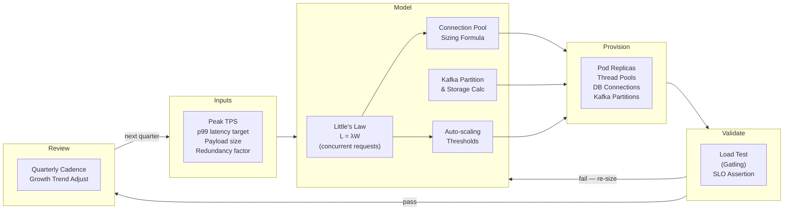

# Capacity Planning Model

Status: Draft | Last Reviewed: 2026-05-09 | Owner: @sre-lead
Catalog ID: NFR-003 | Spine
Tier Applicability: T0, T1, T2

## Problem Statement

- Reactive capacity management causes T0 services to exhaust resources during predictable peaks — Tết, payroll day, end-of-quarter settlement — leading to latency breaches and regulatory exposure precisely when transaction volumes are highest.
- Without a quantitative model, provisioning decisions are made by intuition, leading to chronic over-provisioning on T2 services and chronic under-provisioning on T0 payment paths.
- Kafka partition counts and database connection pools sized for normal load become a systemic bottleneck at peak; once throughput hits the hard ceiling there is no self-healing path — only degradation or manual intervention.
- BCBS 239 §3 requires timely risk-data aggregation; a capacity model that cannot sustain peak throughput silently violates timeliness obligations.
- Thread pool exhaustion cascades across services via synchronous call chains: one under-sized pool in the NAPAS gateway can freeze the entire payment authorisation flow within seconds.
- Capacity reviews done annually — or not at all — mean that organic growth in transaction volume consumes headroom unnoticed until a traffic spike triggers an incident.

## Context

Reach for this doc when:

- Planning a new T0 or T1 service and needing to justify initial pod counts, Kafka partition counts, and database connection pool sizes to the infrastructure board.
- Preparing for a known peak event (Tết, payroll run, promotional campaign) and validating that current provisioning can sustain the projected TPS.
- Post-incident — a throughput ceiling was hit; use the model to calculate the correct sizing and produce a corrective action plan.
- Quarterly infrastructure review — recalibrate capacity against the previous quarter's observed peak TPS and growth trend.

## Solution

A four-step quantitative model: collect input parameters, apply Little's Law and utilisation formulas to derive thread/connection pool sizes, calculate Kafka storage and partition requirements, then auto-scaling thresholds. All parameters are codified in the service's `capacity-profile.yaml` and validated in CI.



### Input Parameters

| Parameter | Description | Unit | Example (NAPAS gateway) |
|---|---|---|---|
| `peak_tps` | Maximum expected sustained arrival rate | requests/sec | 1,500 (Tết peak) |
| `avg_payload_bytes` | Mean request + response payload | bytes | 2,048 |
| `p99_latency_target` | P99 response-time SLO | milliseconds | 200 |
| `error_budget_fraction` | Fraction of requests allowed to fail (1 – SLO) | decimal | 0.0001 (99.99%) |
| `redundancy_factor` | Minimum replica count for HA (N+1 or N+2) | integer | 2 |
| `replication_factor` | Kafka replication factor | integer | 3 |
| `retention_days` | Kafka topic retention | days | 7 |
| `avg_query_ms` | Average DB query execution time | milliseconds | 20 |
| `target_cpu_utilisation` | Auto-scaling target CPU headroom | decimal | 0.70 |

### Little's Law — Thread Pool and Pod Sizing

Little's Law for a stable queueing system:

```
L = λ × W
```

Where:
- **L** = mean number of requests concurrently in-flight (concurrent requests)
- **λ** = arrival rate (requests/sec = TPS)
- **W** = mean time each request spends in the system (seconds = p99 / 1000 for conservative sizing)

**Conservative sizing rule**: use p99 latency as W (not mean), because thread-pool exhaustion happens at the tail, not the average.

Example for NAPAS payment gateway at Tết peak (1,500 TPS, p99 = 200 ms):

```
L = 1500 req/s × 0.200 s = 300 concurrent requests
```

With one pod handling 100 concurrent requests at 70% CPU target:

```
Pods required = ceil(L / requests_per_pod) × (1 / (1 - headroom))
              = ceil(300 / 100) × (1 / 0.70)
              ≈ 3 × 1.43
              = 4.3 → round up to 5 pods (add 1 for N+1 HA)
```

Add the redundancy factor (minimum 2 replicas even at zero load), so the result is **max(redundancy_factor, calculated_pods)**.

### Database Connection Pool Sizing

The connection pool must sustain the concurrent query load without queuing at the pool level:

```
Pool size = (max_threads × avg_query_ms) / avg_response_time_ms + buffer
```

Where:
- `max_threads` = number of application threads that issue DB queries concurrently (typically = L × db_call_fraction)
- `avg_query_ms` = average database query execution time
- `avg_response_time_ms` = service p95 response time (not p99, to avoid over-sizing)
- `buffer` = fixed slack for DDL, health-check, and admin connections (recommend: 5)

Example (NAPAS gateway, p99 = 200 ms, 80% of requests hit DB, avg query = 20 ms):

```
DB-calling threads = 300 × 0.80 = 240
Pool size          = (240 × 20) / 200 + 5 = 24 + 5 = 29
Round up to        = 32 (next power of 2 for HikariCP efficiency)
```

**HikariCP configuration** — codified in `application-capacity.yaml`:

```yaml
spring:
  datasource:
    hikari:
      maximum-pool-size: 32
      minimum-idle: 8
      connection-timeout: 3000     # ms — fail fast; do not queue beyond 3s
      idle-timeout: 600000         # 10 min
      max-lifetime: 1800000        # 30 min — recycle before DB firewall timeout
      pool-name: napas-payment-pool
```

### Kafka Capacity

**Storage per partition per day**:

```
Storage (bytes/day) = messages_per_sec × avg_msg_bytes × replication_factor × 86400
```

**Total partition count**:

```
Partitions = ceil(peak_tps / throughput_per_partition)
```

Where `throughput_per_partition` is empirically measured (typically 5–10 MB/s for Confluent on MSK; use 8 MB/s as a conservative default for Techcombank's cluster).

Example (NAPAS gateway, 1,500 TPS, 2 KB messages, replication=3, retention=7 days, 8 MB/s per partition):

```
Partition throughput needed = 1500 msg/s × 2048 bytes = 3,072,000 bytes/s ≈ 2.93 MB/s
Partitions                  = ceil(2.93 / 8.0) = 1 (raw) → apply 3× headroom → 3 partitions minimum
Add consumer parallelism    = target 24 partitions (8 consumers × 3)
Storage per topic           = 1500 × 2048 × 3 × 7 × 86400 ≈ 5.58 TB (compressed ~1.4 TB at 4:1 ratio)
```

### Auto-Scaling Formula

Horizontal Pod Autoscaler (HPA) is configured with:

```
Desired replicas = ceil(current_replicas × (current_metric / target_metric))
```

Techcombank standard parameters:

| Parameter | T0 | T1 | T2 |
|---|---|---|---|
| Target CPU utilisation | 70% | 70% | 75% |
| Scale-out stabilisation window | 60 s | 120 s | 300 s |
| Scale-in stabilisation window | 300 s | 300 s | 600 s |
| Min replicas | 3 | 2 | 1 |
| Max replicas | 20 | 10 | 5 |

```yaml
# napas-gateway-hpa.yaml
apiVersion: autoscaling/v2
kind: HorizontalPodAutoscaler
metadata:
  name: napas-payment-gateway
spec:
  scaleTargetRef:
    apiVersion: apps/v1
    kind: Deployment
    name: napas-payment-gateway
  minReplicas: 3
  maxReplicas: 20
  metrics:
    - type: Resource
      resource:
        name: cpu
        target:
          type: Utilization
          averageUtilization: 70
  behavior:
    scaleOut:
      stabilizationWindowSeconds: 60
      policies:
        - type: Pods
          value: 2
          periodSeconds: 60
    scaleIn:
      stabilizationWindowSeconds: 300
      policies:
        - type: Pods
          value: 1
          periodSeconds: 120
```

### Worked Example — NAPAS Payment Gateway at Tết Peak

| Parameter | Normal | Tết Peak (3×) | Headroom (1.5×) |
|---|---|---|---|
| Target TPS | 500 | 1,500 | 2,250 |
| p99 latency target | 200 ms | 200 ms | 200 ms |
| Concurrent requests (L = λW) | 100 | 300 | 450 |
| Pod replicas (@ 100 req/pod) | 2 | 4 | 6 |
| Kafka partitions | 12 | 24 | 36 |
| DB connection pool size | 13 | 32 | 48 |
| Kafka storage (7d, compressed) | ~467 GB | ~1.4 TB | ~2.1 TB |

> **Headroom column** (1.5×): represents provisioned capacity above the Tết peak. This absorbs unexpected spikes (flash sales, system retries on upstream failure) without breaching SLOs. SRE-lead must pre-provision to the Headroom level at least 72 hours before the peak event window.

### Quarterly Review Cadence

1. **Week 1 of each quarter**: SRE lead pulls the 90th-percentile peak TPS for each T0/T1 service from the previous quarter's Prometheus data.
2. **Week 2**: recalculate L, pool sizes, and partition counts using observed values. Compare against current provisioning.
3. **Week 3**: raise a capacity change request if any resource is running above 80% of its provisioned maximum during non-peak periods (indicates growth is consuming headroom faster than planned).
4. **Week 4**: apply approved changes before the start of the next quarter; validate with a synthetic load test at 1.5× the new capacity target.

## Implementation Guidelines

1. Baseline current utilisation with 30-day Prometheus/Datadog metrics before modelling — use the `job:http_requests:rate5m` recording rules from [BP-006 Capacity Planning](../best-practices/capacity-planning.md) as the primary data source.
2. Apply the traffic patterns from [NFR-002 Latency Budget Model](latency-budget-model.md) for per-tier load estimates; use p99 latency as the service time W in Little's Law for conservative sizing.
3. Size for p95 sustained traffic plus a 30% headroom buffer; define HPA auto-scale triggers at 70% of reserved CPU capacity (T0) or 75% (T1).
4. Codify all calculated values in the service's `capacity-profile.yaml` and validate via the `capacity-plan validate` CLI step in CI before each production deployment.
5. Review the model quarterly or after any change that shifts traffic volume by > 20% (new product launch, marketing campaign, payment partner addition).

## Variants & Trade-offs

- **Static reservation** — pre-allocate fixed instance counts (`minReplicas = peak_capacity`); simplest to reason about and fastest to recover from a cold start; wastes resources during off-peak hours (typically 30–50% idle for T0 at 02:00–06:00 UTC+7).
- **Auto-scaling with forecasting** — predictive scale-out using ML-based forecasting (AWS Predictive Scaling, KEDA Cron trigger for known Tết dates); reduces idle waste but adds operational complexity and requires 8+ weeks of historical data to train.
- **Over-subscription model** — share burst headroom across services within a node pool; acceptable for T2/T3 batch tiers but unsuitable for T0 critical payment paths where a noisy neighbour can cause latency jitter that consumes the P99 budget.
- **Reserved + on-demand hybrid** — run T0 baseline on Reserved Instances (3-year commitment, 40% saving) and scale-out layers on On-Demand; recommended for Techcombank's T0 services where the baseline replicas are predictable and the Tết surge is time-bounded.

## NFR Acceptance Criteria

```yaml
nfr_acceptance_criteria:
  id: NFR-003
  pattern: Capacity Planning Model

  capacity_model:
    - id: CPM-1
      statement: >
        Every T0 and T1 service MUST have a committed capacity-profile.yaml in its
        repository defining peak_tps, p99_latency_target, redundancy_factor, and
        db_pool_size. The profile MUST be validated in CI using the capacity-planning
        CLI tool before each production deployment.
      measurement: >
        CI pipeline step `capacity-plan validate` exits 0 on valid profile;
        exits non-zero and blocks merge if any required parameter is missing
        or if calculated pod count exceeds max_replicas.

    - id: CPM-2
      statement: >
        At Tết peak load (3× normal TPS), T0 services MUST sustain their p99
        latency SLO with pod CPU utilisation below 80% and no thread-pool or
        connection-pool rejections (HikariCP connectionTimeout exceptions = 0).
      measurement: >
        Pre-Tết load test via Gatling at 1,500 TPS sustained for 30 minutes;
        assert p99 < 200 ms, HTTP 5xx rate < 0.01%, HikariCP timeout counter = 0.

    - id: CPM-3
      statement: >
        Kafka consumer lag for T0 topics MUST remain below 10,000 messages
        (approx. 7 seconds at 1,500 TPS) during sustained peak load.
        Auto-scaling MUST add a new pod within 90 seconds of CPU crossing 70%.
      measurement: >
        During Gatling peak test, record kafka_consumer_group_lag metric;
        assert max lag < 10,000. Inject CPU spike; assert HPA adds a pod
        within 90 seconds via kube_horizontalpodautoscaler_status_current_replicas.
```

## Compliance Mapping

| Ring | Regulation | Provision | How this pattern satisfies |
|---|---|---|---|
| Ring 0 | ISO 27001 | A.12.1.3 Capacity Management | The capacity-profile.yaml, quarterly review cadence, and load-test gate directly implement ISO 27001's requirement that organisations monitor, tune, and make projections of future capacity needs to ensure the required system performance. |
| Ring 0 | NIST SP 800-53 | SC-5 Denial of Service Protection; SA-8 Security Engineering Principles | Headroom provisioning (1.5×) and HPA scale-out policies protect against resource-exhaustion DoS; Little's Law sizing is a formal engineering principle applied before production deployment. |
| Ring 1 | BCBS 230 | Principle 2 — Data Architecture and IT Infrastructure ⚠️ (working summary — pending PDF fetch) | Capacity planning model ensures the IT infrastructure supporting risk-data aggregation can sustain peak transaction volumes without degradation, satisfying the infrastructure-adequacy dimension of Principle 2. |
| Ring 1 | BCBS 239 | §3 Timeliness | T0 services sized to sustain 1,500 TPS at p99 < 200 ms ensure risk data flows (payment confirmations, ledger postings) are aggregated and available within regulatory timeliness expectations even at peak event load. |
| Ring 2 | SBV Circular 09/2020; Decree 13/2023 | §IV.2 Operational continuity — capacity and performance ⚠️ (working summary — pending Legal review) | Quarterly capacity reviews and pre-peak provisioning provide the documented operational continuity planning required for Techcombank's system performance obligations under the circular; Decree 13 breach-notification timelines require that T0 capacity never degrades below the 72-hour incident-reporting threshold. |

## Cost / FinOps Notes

| Resource | Lean sizing | Headroom sizing (1.5×) | Delta | Mitigation |
|---|---|---|---|---|
| EKS compute (T0) | 4 pods × m5.xlarge | 6 pods × m5.xlarge | +50% compute cost during peak | Use Spot instances for T1; Reserved instances for T0 baseline 3 pods |
| RDS Aurora connections | 32 connections | 48 connections | Negligible (Aurora scales connection handling via RDS Proxy) | Enable RDS Proxy for all T0 services — eliminates per-connection cost at scale |
| Kafka MSK storage (7d) | ~1.4 TB | ~2.1 TB | +0.7 TB / month at USD ~0.10/GB = ~USD 70/month | Apply compression (LZ4); 4:1 ratio reduces effective storage to ~350 GB extra |
| HPA over-provisioning risk | — | Pre-provisioning 72h before peak means you pay for idle pods | ~72h × 2 extra pods | Accept — cost of not pre-provisioning is an SLA breach (VND 1B+ exposure) |

**Standing recommendation**: use AWS Compute Savings Plans for the T0 baseline (3 pods always on). Scale layers above baseline with On-Demand for Tết surge. Total Tết incremental cost is typically < 5% of the annual compute budget — well justified by the SLA exposure it prevents.

## Threat Model Summary

STRIDE applied to the capacity model itself:

- **Spoofing — Falsified TPS metrics**: a misconfigured exporter reports lower TPS than actual, causing the quarterly review to under-provision. Mitigation: cross-validate Prometheus `http_server_requests_seconds_count` against NAPAS switch-level transaction counters monthly.
- **Tampering — capacity-profile.yaml manipulation**: a developer lowers `peak_tps` in the profile to pass the CI gate while the service is actually under-provisioned. Mitigation: the capacity-plan CLI validates against the previous quarter's observed P95 TPS from Prometheus; if the declared `peak_tps` is below observed P95, the CI gate fails.
- **Denial of Service — connection pool exhaustion cascade**: T0 service pool is exhausted during a traffic spike; upstream timeouts cascade. Mitigation: HikariCP `connection-timeout: 3000` ms causes fast-fail rather than queueing; circuit breaker (RES-002) trips before cascade propagates.
- **Elevation of Privilege — bypassing pre-peak provisioning**: a team skips the 72h pre-provisioning step, relying solely on HPA reactive scaling. At Tết TPS ramp, HPA cannot scale fast enough (60s stabilisation window + pod startup time). Mitigation: pre-peak provisioning is a mandatory runbook gate validated by the on-call SRE before any peak event window opens.

## Operational Runbook (stub)

- Alert: `CapacityHeadroomWarning` — CPU > 80% for 10 min on any T0 service; PagerDuty high-urgency. Check current pod count vs max_replicas. If at max_replicas, escalate to SRE lead for emergency node-pool expansion; else verify HPA is functioning (`kubectl describe hpa napas-payment-gateway`).
- Alert: `KafkaConsumerLagCritical` — lag > 10,000 on a T0 topic for > 5 min; PagerDuty high-urgency. Increase partition count (requires topic recreation or partition reassignment) or add consumer pods.
- Alert: `HikariConnectionTimeout` — any HikariCP connection timeout on T0; PagerDuty critical. Immediately check RDS Proxy connection count, RDS CPU, and active connections. If pool is exhausted, restart the saturated pod to release stale connections.
- **Pre-peak runbook trigger**: 72h before each identified peak event, SRE lead runs `capacity-plan provision --event tet-peak --tier T0` which scales T0 deployments to the headroom column values and validates via a synthetic 5-minute load test.
- **Dashboards**: Grafana — `capacity-overview`, `kafka-lag-by-topic`, `hikari-pool-by-service`, `hpa-scaling-events`.

## Test Strategy (stub)

- **Unit**: capacity-plan CLI — given a `capacity-profile.yaml`, assert that calculated pod count, pool size, and partition count match hand-verified expected values.
- **Integration**: HikariCP pool exhaustion test — configure pool size = 2, fire 50 concurrent queries; assert `HikariPool-Unavailable` metric increments and no unhandled exception escapes the service layer.
- **Performance**: quarterly Gatling load test at Tết peak profile (1,500 TPS, 30 min sustained); assert all NFR-AC thresholds (CPM-1 through CPM-3).
- **Chaos**: kill 50% of pods mid-test; assert HPA recovers within 90 s and p99 latency does not breach 500 ms (degraded budget) during the recovery window.

## When to Use

- Any T0 or T1 service onboarding to production — the capacity profile is required before the service can pass the Design Approval Board (DAB) gate.
- Any service expecting a 2× or greater traffic increase (e.g., marketing campaign, new product launch).
- Quarterly SRE infrastructure review.

## When NOT to Use

- T3 internal tooling — best-effort provisioning is acceptable; skip the model and accept that the service may degrade under unexpected load.
- Ephemeral batch jobs (one-off data migrations) — size empirically from a staging run and accept that over-provisioning for a single run is cheaper than the model overhead.

## Related Patterns

- [NFR-001 Service Tiering + RTO/RPO Matrix](service-tiering-rto-rpo.md) — tier determines the SLO that drives p99 targets in this model
- [NFR-002 Latency Budget Model](latency-budget-model.md) — p99 latency budget is an input to Little's Law sizing
- [NFR-004 Throughput Model](throughput-model.md) — companion; throughput model defines goodput targets that set the peak_tps input here
- [NFR-005 Error Budget Policy](error-budget-policy.md) — deployment gate prevents deploying under-provisioned changes during Amber/Red bands
- [RES-002 Circuit Breaker](../patterns/resilience/circuit-breaker.md) — caps cascade exposure when capacity is transiently exhausted
- [BP-004 Observability Standards](../best-practices/observability-standards.md) — Prometheus metrics that feed quarterly capacity review

## References

- Little, J.D.C. (1961) "A Proof for the Queuing Formula: L = λW", Operations Research 9(3)
- Brendan Gregg — Systems Performance, Chapter 6: CPUs (USL and utilisation law)
- HikariCP documentation — Pool Sizing (brettwooldridge/HikariCP wiki)
- Confluent Kafka — Partition Count and Consumer Throughput guidance
- AWS MSK Best Practices — storage and partition sizing
- `_research-notes.md` §Kafka and §HikariCP for Techcombank-specific benchmark data

---

**Key Takeaway**: Size every T0/T1 service using Little's Law (L = λW) with p99 latency as the service time, then add 1.5× headroom for peak events. Codify the result in `capacity-profile.yaml`, gate it in CI, and revalidate every quarter.
