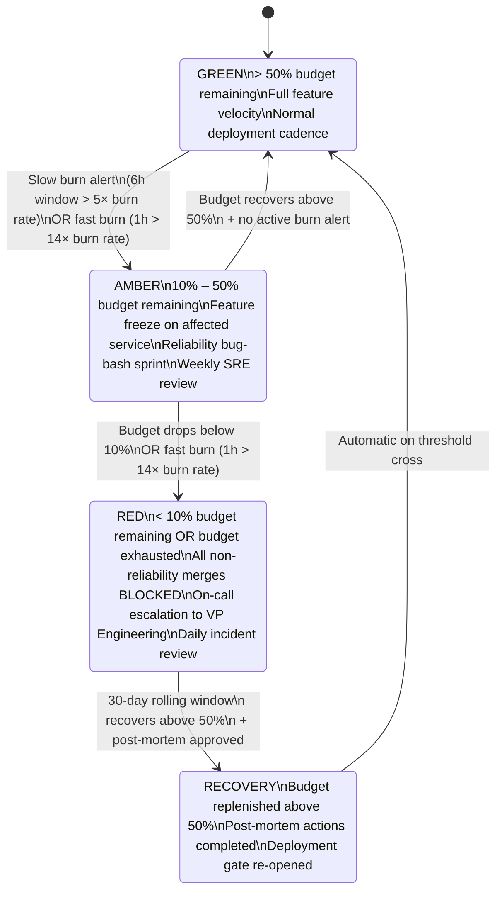

# Error Budget Policy

Status: Draft | Last Reviewed: 2026-05-09 | Owner: @sre-lead
Catalog ID: NFR-005 | Radii
Tier Applicability: T0, T1

## Problem Statement

- A 99.99% T0 SLO grants only 52 minutes of allowable downtime per year — the error budget. Without explicit governance, engineering teams spend this budget invisibly: through risky deployments, under-tested changes, and deferred reliability work, until a major incident exhausts the budget in a single event.
- Unconstrained feature velocity on T0 services creates asymmetric risk: each new deployment adds probability of a regression, but without a budget accounting mechanism there is no forcing function to balance features against reliability investment.
- Banking regulators (BCBS 230, SBV Circular 09/2020) require demonstrable impact tolerance commitments and operational resilience metrics; an error budget provides the quantitative foundation for these regulatory conversations.
- Without multi-window burn-rate alerting, an SLO breach can go undetected for hours as a "slow burn" — depleting 10% of the annual budget in a week before any alert fires.

## Solution

Per-tier error budgets tracked as rolling-30-day burn rates; Prometheus recording rules derive budget consumption; three policy bands (Green / Amber / Red) govern feature deployment velocity. All thresholds are enforced via a deployment gate in the CI/CD pipeline.



## Implementation Guidelines

### 1. SLO Definitions by Tier

| Tier | Service Examples | Availability SLO | Latency SLO (P95) | Error Budget (30d) | Error Budget (1y) |
|------|-----------------|------------------|--------------------|-------------------|-------------------|
| T0 | Payment Gateway, Core Auth, NAPAS Channel | 99.99% | < 500 ms | 4.32 min | 52.6 min |
| T1 | Account Service, Statement API, Notification | 99.95% | < 1 000 ms | 21.6 min | 4.38 h |
| T2 | Reporting, Admin Portal, Reference Data | 99.5% | < 2 000 ms | 3.6 h | 43.8 h |

### 2. Prometheus Recording Rules — SLI and Budget Calculation

```yaml
# prometheus-slo-rules.yaml
groups:
  - name: slo.payment_gateway
    interval: 30s
    rules:

      # --- SLI: Availability (successful requests / total requests) ---
      - record: job:sli_availability:ratio_rate5m
        expr: |
          sum(rate(http_server_requests_seconds_count{
              job="payment-gateway",
              status!~"5.."
          }[5m]))
          /
          sum(rate(http_server_requests_seconds_count{
              job="payment-gateway"
          }[5m]))

      # --- SLI: Latency (requests within 500ms / total requests) ---
      - record: job:sli_latency:ratio_rate5m
        expr: |
          sum(rate(http_server_requests_seconds_bucket{
              job="payment-gateway",
              le="0.5"
          }[5m]))
          /
          sum(rate(http_server_requests_seconds_count{
              job="payment-gateway"
          }[5m]))

      # --- Error Rate (1 - availability SLI) ---
      - record: job:error_rate:ratio_rate5m
        expr: 1 - job:sli_availability:ratio_rate5m

      # --- Error Budget Consumption (rolling 30d) ---
      # Budget = 1 - SLO_target = 1 - 0.9999 = 0.0001
      # Consumed = error_rate_30d / budget
      - record: job:error_budget_consumed:ratio_30d
        expr: |
          (
            1 - (
              sum_over_time(job:sli_availability:ratio_rate5m[30d]) /
              count_over_time(job:sli_availability:ratio_rate5m[30d])
            )
          )
          / (1 - 0.9999)

      # --- Burn Rate (how fast we're consuming budget right now) ---
      # burn_rate = current_error_rate / error_budget_rate
      # error_budget_rate = 1 - 0.9999 = 0.0001
      - record: job:burn_rate:ratio_rate1h
        expr: |
          job:error_rate:ratio_rate5m
          / (1 - 0.9999)

      - record: job:burn_rate:ratio_rate6h
        expr: |
          (
            1 - avg_over_time(job:sli_availability:ratio_rate5m[6h])
          )
          / (1 - 0.9999)
```

### 3. Multi-Window Multi-Burn-Rate Alerting Rules

```yaml
# prometheus-alerts-slo.yaml
groups:
  - name: slo.alerts.payment_gateway
    rules:

      # --- Page: Fast burn (1h window > 14× burn rate) ---
      # 14× burn rate on T0 consumes 2% of monthly budget in 1 hour
      - alert: PaymentGateway_SLO_FastBurn
        expr: |
          job:burn_rate:ratio_rate1h{job="payment-gateway"} > 14
          AND
          job:burn_rate:ratio_rate6h{job="payment-gateway"} > 14
        for: 1m
        labels:
          severity: critical
          tier: T0
          policy_band: red
        annotations:
          summary: "Payment Gateway SLO fast burn — error budget depleting rapidly"
          description: >
            1h burn rate is {{ $value | humanize }}× the allowed rate.
            At this rate, the monthly error budget will be exhausted in
            {{ printf "%.0f" (div 1.0 $value | mul 720) }} hours.
          runbook_url: "https://wiki.techcombank.vn/sre/runbooks/error-budget-red"

      # --- Ticket: Slow burn (6h window > 5× burn rate) ---
      # 5× burn rate on T0 consumes 10% of monthly budget in ~15 hours
      - alert: PaymentGateway_SLO_SlowBurn
        expr: |
          job:burn_rate:ratio_rate1h{job="payment-gateway"} > 5
          AND
          job:burn_rate:ratio_rate6h{job="payment-gateway"} > 5
        for: 15m
        labels:
          severity: warning
          tier: T0
          policy_band: amber
        annotations:
          summary: "Payment Gateway SLO slow burn — error budget eroding"
          description: >
            6h burn rate is {{ $value | humanize }}× the allowed rate.
            Review recent deployments and error patterns.
          runbook_url: "https://wiki.techcombank.vn/sre/runbooks/error-budget-amber"

      # --- Info: Budget < 50% (Green → Amber transition) ---
      - alert: PaymentGateway_ErrorBudget_Amber
        expr: |
          job:error_budget_consumed:ratio_30d{job="payment-gateway"} > 0.5
        for: 5m
        labels:
          severity: warning
          tier: T0
          policy_band: amber
        annotations:
          summary: "Payment Gateway error budget below 50% — entering Amber policy band"

      # --- Critical: Budget < 10% (Red) ---
      - alert: PaymentGateway_ErrorBudget_Red
        expr: |
          job:error_budget_consumed:ratio_30d{job="payment-gateway"} > 0.9
        for: 5m
        labels:
          severity: critical
          tier: T0
          policy_band: red
        annotations:
          summary: "Payment Gateway error budget critical — deployment freeze in effect"
```

### 4. CI/CD Deployment Gate — Error Budget Check

```java
/**
 * Deployment gate: queries Prometheus before any production deployment.
 * Called from the CI/CD pipeline (GitHub Actions / ArgoCD pre-sync hook).
 * Returns BLOCK if the service is in Amber or Red policy band.
 */
@RestController
@RequiredArgsConstructor
@Slf4j
public class DeploymentGateController {

    private final PrometheusQueryClient prometheus;
    private static final Map<String, Double> SLO_TARGETS = Map.of(
            "payment-gateway", 0.9999,
            "account-service", 0.9995,
            "notification-service", 0.9995
    );

    @PostMapping("/internal/deployment-gate/check")
    public ResponseEntity<DeploymentGateResult> checkDeploymentGate(
            @RequestBody DeploymentGateRequest request) {

        String service = request.getServiceName();
        Double sloTarget = SLO_TARGETS.getOrDefault(service, 0.999);
        double budgetTotal = 1.0 - sloTarget;

        // Query rolling 30d error budget consumed
        Double budgetConsumed = prometheus.queryScalar(
                "job:error_budget_consumed:ratio_30d{job=\"" + service + "\"}");

        // Query current burn rate (1h window)
        Double burnRate1h = prometheus.queryScalar(
                "job:burn_rate:ratio_rate1h{job=\"" + service + "\"}");

        PolicyBand band = evaluatePolicyBand(budgetConsumed, burnRate1h);

        log.info("Deployment gate service={} budgetConsumed={:.1%} burnRate1h={:.1f}x band={}",
                service, budgetConsumed, burnRate1h, band);

        DeploymentGateResult result = DeploymentGateResult.builder()
                .service(service)
                .policyBand(band)
                .budgetConsumedPercent(budgetConsumed * 100)
                .burnRate1h(burnRate1h)
                .allowed(band == PolicyBand.GREEN)
                .reason(band == PolicyBand.GREEN
                        ? "Error budget healthy — deployment allowed"
                        : String.format(
                            "Error budget %s (%.1f%% consumed, %.1fx burn rate) — " +
                            "deployment BLOCKED. Resolve reliability issues first.",
                            band, budgetConsumed * 100, burnRate1h))
                .build();

        return band == PolicyBand.GREEN
                ? ResponseEntity.ok(result)
                : ResponseEntity.status(HttpStatus.PRECONDITION_FAILED).body(result);
    }

    private PolicyBand evaluatePolicyBand(Double consumed, Double burnRate) {
        if (consumed == null || burnRate == null) return PolicyBand.GREEN; // default allow
        if (consumed > 0.90 || burnRate > 14.0) return PolicyBand.RED;
        if (consumed > 0.50 || burnRate > 5.0) return PolicyBand.AMBER;
        return PolicyBand.GREEN;
    }

    enum PolicyBand { GREEN, AMBER, RED }
}
```

### 5. Grafana Dashboard — Error Budget Overview

Key panels to include in the `error-budget-overview` Grafana dashboard:

```
Panel 1: Error Budget Remaining (gauge, colour-coded Green/Amber/Red)
  Query: 1 - job:error_budget_consumed:ratio_30d{job=~"$service"}
  Thresholds: green > 50%, amber 10-50%, red < 10%

Panel 2: Burn Rate — 1h vs 6h (time series)
  Query 1: job:burn_rate:ratio_rate1h{job=~"$service"}
  Query 2: job:burn_rate:ratio_rate6h{job=~"$service"}
  Reference lines at: 1× (sustainable), 5× (slow burn), 14× (fast burn)

Panel 3: SLI Availability — Rolling 30d (stat)
  Query: avg_over_time(job:sli_availability:ratio_rate5m{job=~"$service"}[30d])

Panel 4: Error Budget Consumption History (bar chart, daily)
  Annotation: deployment events (ArgoCD webhook → Grafana annotation)
```

## Compliance Mapping

| Ring | Regulation | Provision | How this pattern satisfies |
|------|-----------|-----------|---------------------------|
| Ring 0 | NIST SP 800-53 | AU-12 Audit Record Generation; CA-7 Continuous Monitoring | Prometheus recording rules and Grafana dashboards provide continuous monitoring of reliability metrics; burn-rate alerts constitute automated audit record generation for SLO breaches. |
| Ring 0 | ISO 27001 | A.12.1.3 Capacity Management; A.16.1.4 Assessment of Information Security Events | Error budget framework ensures capacity-related reliability issues are quantified and tracked; burn-rate alerts trigger formal assessment of reliability events. |
| Ring 1 | BCBS 230 | Principle 1 — Impact Tolerance (operational resilience) | The SLO target directly operationalises impact tolerance: T0 Payment Gateway 99.99% SLO expresses the maximum tolerable impact. Error budget exhaustion triggers mandatory reliability investment, demonstrating that the institution enforces its impact tolerance commitments. |
| Ring 1 | BCBS 239 | Principle 3 — Accuracy and Integrity (reliability of risk data) | Error budget metrics are derived from production telemetry, providing auditable evidence that the institution measures and manages the reliability of its T0 data systems. |
| Ring 2 | SBV Circular 09/2020 | §IV Operational continuity — monitoring and incident response ⚠️ (working summary — pending Legal review) | Multi-window burn-rate alerting provides the early-warning system required for operational continuity; Red-band deployment freeze enforces the circular's requirement for proactive response to reliability degradation. |

## NFR Acceptance Criteria

```yaml
nfr_acceptance_criteria:
  id: NFR-005
  pattern: Error Budget Policy

  availability:
    - id: RA-01
      statement: >
        Prometheus recording rules MUST evaluate within the 30-second scrape interval;
        burn-rate metrics MUST be available with no more than 60 seconds of staleness.
      measurement: Check Prometheus rule evaluation health
        (prometheus_rule_evaluation_duration_seconds); assert P99 < 30 s.

  alerting:
    - id: RL-01
      statement: >
        A fast-burn condition (1h burn rate > 14×) MUST generate a PagerDuty
        Critical alert within 2 minutes of the condition starting.
      measurement: Inject synthetic errors at 14× burn rate; assert PagerDuty
        alert received within 2 minutes.
    - id: RL-02
      statement: >
        A slow-burn condition (6h burn rate > 5× for 15 minutes) MUST generate
        a warning ticket within 20 minutes.
      measurement: Inject synthetic errors at 5× burn rate; assert Jira ticket
        created within 20 minutes.

  deployment_gate:
    - id: RD-01
      statement: >
        The CI/CD deployment gate MUST return HTTP 412 (Precondition Failed) for
        any deployment to a service in Amber or Red policy band.
      measurement: Set the payment-gateway test service to Amber (mock Prometheus);
        trigger a deployment; assert pipeline step returns exit code 1 and
        logs "deployment BLOCKED".
    - id: RD-02
      statement: >
        Deployment gate MUST NOT block deployments labelled `reliability-fix=true`
        regardless of policy band (emergency reliability fix override).
      measurement: Set service to Red; submit a deployment with
        `reliability-fix=true` label; assert deployment is allowed.

  policy:
    - id: RP-01
      statement: >
        T0 Payment Gateway error budget must not be exhausted (>100% consumed)
        more than once per calendar quarter without a post-mortem approved
        by VP Engineering.
      measurement: Quarterly review of error_budget_consumed metric history;
        audit post-mortem records for every budget-exhaustion event.
```

## Cost / FinOps

- Prometheus recording rules add approximately 5–10 additional time series per service; at 10 T0/T1 services this is 100 extra series — negligible Prometheus storage overhead (< 1 MB/day extra TSDB blocks).
- Grafana alert manager and PagerDuty integration: alert manager runs as part of the existing observability stack (no additional cost); PagerDuty incidents triggered by burn-rate alerts are counted against the existing incident management plan (already paid for by the SRE team).
- The deployment gate check adds approximately 500 ms to the CI/CD pipeline per deployment (one Prometheus query); at 20 deployments/day this is 10 seconds of extra pipeline time — negligible.
- The largest FinOps benefit is avoided downtime: at T0 Payment Gateway processing VND 50B/day in transactions, 52 minutes of unplanned downtime costs approximately VND 1.8B (USD 72K) in lost transaction volume; the error budget policy's deployment gate and burn-rate alerts can prevent even one such event annually, delivering > 100× ROI on the observability infrastructure cost.
- Feature freeze periods (Amber/Red) have a soft cost in delayed feature delivery; this is intentional and should be accounted for in sprint planning by maintaining a reliability backlog alongside the feature backlog.

## Threat Model

STRIDE applied to the error budget system itself — a governance mechanism that can be gamed or manipulated:

- **Tampering — SLI definition manipulation**: A team redefines their SLI to exclude certain error codes from the error rate denominator, artificially inflating their SLO compliance. Mitigation: SLI definitions are reviewed by the SRE lead before deployment; changes to recording rules require a pull request approved by SRE and architecture chapters.
- **Tampering — Prometheus metric injection**: An attacker with access to the metrics pipeline injects synthetic success data to reduce the measured error rate. Mitigation: Prometheus scrape targets are configured by the SRE team (not application teams); scrape configs are in a locked Terraform module.
- **Repudiation — Denying a budget exhaustion event**: A team claims their service was not in Red band during an audit, but the alert history was deleted. Mitigation: Prometheus data is retained for 13 months (rolling); Grafana dashboard annotations from alert firings are stored in the Grafana database; PagerDuty maintains an independent incident log.
- **Denial of Service — Prometheus overload from excessive recording rules**: Too many high-cardinality recording rules overload the Prometheus server, making burn-rate metrics unavailable and disabling deployment gates. Mitigation: recording rules are reviewed for cardinality before merge; Prometheus federation separates T0 service metrics from T1/T2 to bound blast radius.
- **Elevation of Privilege — Bypassing deployment gate via emergency override**: Developer labels every deployment `reliability-fix=true` to bypass the deployment gate regardless of policy band. Mitigation: `reliability-fix=true` label requires a second approver in the pull request; audit log records every gate bypass; the SRE lead reviews all bypass events weekly.
- **Repudiation — Gaming the 30-day window**: A team deploys a bad change at the start of the 30-day window, waits for it to roll out of the window, then claims the budget is healthy. Mitigation: burn-rate alerting (multi-window) detects the ongoing impact regardless of the 30-day rolling window; fast-burn alert triggers on the current 1h rate, not historical.

## Operational Runbook

1. **Alert: `PaymentGateway_SLO_FastBurn` fires (Critical)**: Page the on-call SRE immediately. Open Grafana `error-budget-overview`. Identify the spike in error rate (Panel 2 — burn rate). Check whether a recent deployment coincides with the burn spike (deployment annotations on the time series). If yes, initiate rollback via ArgoCD (`argocd app rollback payment-gateway`).

2. **Rollback decision**: If a deployment is identified as the cause, roll back within 5 minutes of the alert firing (T0 RTO constraint). If no deployment is the cause, the issue is likely an infrastructure or dependency failure — activate the relevant runbook (circuit breaker, NAPAS downtime, etc.).

3. **Entering Amber policy band** (`PaymentGateway_ErrorBudget_Amber` fires): Notify the payment-service engineering lead and product manager. Feature deployments to the payment-gateway service are frozen immediately via the deployment gate. Convene a reliability bug-bash sprint: review the top 3 error-producing endpoints, identify root causes, and assign reliability fixes as P1 tickets.

4. **Entering Red policy band** (`PaymentGateway_ErrorBudget_Red` fires): Escalate to VP Engineering within 15 minutes. All non-reliability pull requests to payment-gateway are blocked at the GitHub branch protection rule (team maintainer status required to override). Daily 30-minute incident review meeting until budget recovers to Amber. Notify BCBS 230 impact-tolerance reporting chain.

5. **Budget recovery procedure**: Budget recovers naturally as the 30-day rolling window drops older bad data. Accelerate recovery by deploying reliability fixes (with `reliability-fix=true` label to bypass the gate). Each 1-percentage-point improvement in error rate recovers proportionally more budget per day. Recovery from Red to Green typically takes 5–10 days with active reliability work.

6. **Post-mortem requirement**: Any event that exhausts the T0 error budget (consumed > 100%) triggers a mandatory post-mortem within 5 business days, signed off by VP Engineering. The post-mortem must identify contributing factors, action items with owners and due dates, and a confirmation of SLO target adequacy.

7. **SLO target review (quarterly)**: The SRE lead convenes a quarterly SLO review. Review actual 30-day consumption for the past quarter. If a service consistently runs in Green with < 5% consumption, consider raising the SLO target. If a service repeatedly hits Red, consider lowering the target or investing in structural reliability improvements. SLO changes require architecture chapter approval.

8. **Compliance reporting**: Monthly, export the `job:error_budget_consumed:ratio_30d` metric for all T0 and T1 services to the compliance evidence repository. This serves as the BCBS 230 Principle 1 evidence for the regulator and the SBV §IV operational continuity evidence.

## Test Strategy

### Unit Tests
- `DeploymentGateControllerTest`: mock Prometheus client; verify `evaluatePolicyBand` returns RED when `consumed = 0.95`, AMBER when `consumed = 0.70`, GREEN when `consumed = 0.30`.
- `DeploymentGateControllerTest` — fast burn override: set `consumed = 0.95, burnRate = 15×`; submit request with `reliability-fix=true` header; verify HTTP 200 (allowed).
- Prometheus expression unit tests using `promtool test rules`: provide a synthetic metric series and assert that `job:error_budget_consumed:ratio_30d` evaluates correctly for a service with known 30-day error history.

### Integration Tests
- Full Prometheus + Alertmanager stack in Docker Compose: inject a synthetic error-rate time series; verify `PaymentGateway_SLO_FastBurn` fires within 2 minutes and routes to the test alert receiver (webhook mock).
- Deployment gate end-to-end: configure the gate service with a mock Prometheus returning Amber metrics; call the gate endpoint; assert HTTP 412 and `"deployment BLOCKED"` in the response body.

### Compliance Tests
- BCBS 230 audit trail: verify that every policy-band transition (Green→Amber, Amber→Red) generates a Prometheus alert that is captured in Alertmanager alert history and forwarded to the audit log sink.
- SLO accuracy: verify that Prometheus recording rules produce the correct `job:error_budget_consumed:ratio_30d` value for a synthetic 30-day history where exactly 0.01% of requests failed (i.e., consumed = 100% for T0).

### Chaos Tests
- Prometheus unavailable: bring Prometheus down; verify the deployment gate defaults to GREEN (allow) rather than blocking all deployments during the outage; verify an alert fires for the Prometheus scrape failure.
- Recording rule regression: introduce an intentional change to the SLI recording rule expression; run `promtool test rules`; assert the test suite catches the regression before the change is merged.

## References

- [Google SRE Book, Chapter 4 — Service Level Objectives](https://sre.google/sre-book/service-level-objectives/)
- [Google SRE Workbook, Chapter 5 — Alerting on SLOs](https://sre.google/workbook/alerting-on-slos/)
- [Prometheus Recording Rules](https://prometheus.io/docs/prometheus/latest/configuration/recording_rules/)
- [BCBS 230 — Principles for effective risk data aggregation and risk reporting](https://www.bis.org/publ/bcbs239.htm)
- [BCBS 239 Operational Resilience paper](https://www.bis.org/bcbs/publ/d516.htm)
- [NFR-001 Service Tiering + RTO/RPO](service-tiering-rto-rpo.md)
- [NFR-002 Latency Budget Model](latency-budget-model.md)
- [BP-007 Golden Signals (SRE)](../best-practices/golden-signals-sre.md)
- [RES-002 Circuit Breaker](../patterns/resilience/circuit-breaker.md)

---

**Key Takeaway**: An error budget makes reliability negotiation quantitative — when budget is healthy teams deploy faster, when it is depleted the deployment gate enforces a reliability pause, turning the tension between feature velocity and system stability into a policy with teeth rather than a recurring argument.
