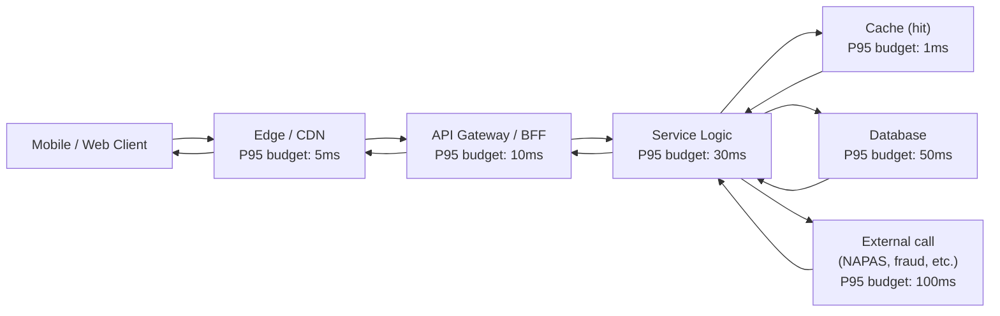

# Latency Budget Model (P50 / P95 / P99)

Status: Draft | Last Reviewed: 2026-05-09 | Owner: @sre-lead
Catalog ID: NFR-002 | **Spine**
Tier Applicability: N/A (defines budgets)

## Problem Statement

Without a normative latency budget per service tier, every team chooses its own targets, end-to-end latency drifts upward over time as new dependencies are added, and there is no objective basis for rejecting a downstream that "just" adds 50ms. For a banking platform on the NAPAS 247 / payment hot path, P95 must stay sub-second end-to-end — that requires per-component budgets that sum correctly.

## Context

Reach for this doc when:

- Authoring a DAB submission that needs explicit P50/P95/P99 numbers in its NFR-AC block.
- Adding a new dependency on the request path of a T0 / T1 service — verify the dependency fits within the calling service's remaining budget.
- Investigating a P95 SLO breach — decompose by component and identify which budget was overspent.
- Sizing capacity — throughput at target latency drives instance counts.

## Solution

Two-layer model: **per-tier end-to-end budgets** (the customer-facing target) decomposed into **per-component budgets** (what each layer of the stack is allowed to consume).

### Latency decomposition



### End-to-end budgets per tier (customer-facing)

| Tier | P50 | P95 | P99 | Notes |
|---|---|---|---|---|
| **T0** (sync API: payment auth, card auth, ledger post) | **50 ms** | **200 ms** | **500 ms** | Customer-facing payment-confirmation expectation |
| **T0** (async ack: NAPAS 247 settlement notify) | 200 ms | 800 ms | 2 s | Async-ack budget; settlement is async after auth |
| **T1** (account services, internet banking) | 100 ms | 500 ms | 1 s | Common dashboards |
| **T1** (KYC submit) | 500 ms | 2 s | 5 s | Single submission; ML decisions may push P99 |
| **T2** (reporting, batch) | 500 ms | 2 s | 5 s | Customer not actively waiting |
| **T3** (internal tools) | best-effort | best-effort | best-effort | No SLO enforcement |

### Per-component budgets (what each layer is allowed to consume)

| Component | T0 P95 | T1 P95 | Notes |
|---|---|---|---|
| Edge / CDN | 5 ms | 10 ms | CloudFront-class POP latency to Vietnam |
| API Gateway / BFF | 10 ms | 20 ms | Spring Cloud Gateway routing + auth |
| Service logic (in-process) | 30 ms | 50 ms | Excluding DB and external |
| Cache hit (Redis-class) | 1 ms | 2 ms | Local-AZ Redis |
| Cache miss → DB | 50 ms | 100 ms | Single-row primary-key fetch on Aurora; cross-AZ |
| Database write (sync replicated) | 50 ms | 80 ms | Includes cross-region sync replica ack for T0 |
| External: NAPAS 247 | 100 ms | n/a | Production observed P95; do not exceed 1× of this in service-side budget |
| External: card-network 3DS2 ACS | 200 ms | n/a | Beyond control; design async UX for breaches |
| External: fraud screening | 50 ms | 80 ms | Internal service; lower budget |

> **Reconciliation rule**: sum of per-component P95 budgets (Edge + Gateway + Service + DB + max external) should be ≤ tier P95 budget × 1.5. The 1.5× factor allows for percentile-aggregation overhead. T0 sync API: 5 + 10 + 30 + 50 + 100 = 195 ms < 200 ms × 1.5 = 300 ms ✓.

### Latency budget composition (mathematical guidance)

For a request that calls N independent downstream services in sequence, the upstream P95 is approximately the sum of downstream P95s — but the upstream P99 is **less than** the sum of downstream P99s because long-tail correlations are weak. The realistic rule of thumb is:

- **P95(upstream) ≈ Σ P95(downstream_i)** — sum behaves linearly.
- **P99(upstream) ≈ Σ P99(downstream_i) × 0.85** — long-tails partially correlate.

For parallel (fan-out) calls: upstream latency ≈ max(downstream latencies). Use scatter-gather (EIP-015) to parallelise where possible to keep budgets in check.

## Implementation Guidelines

### Java / Spring — declaring a service's latency contract

```java
package com.techcombank.platform.tiering;

@Target({ElementType.TYPE, ElementType.METHOD})
@Retention(RetentionPolicy.RUNTIME)
public @interface LatencyBudget {
    long p50Millis();
    long p95Millis();
    long p99Millis();
    String tier();    // "T0", "T1", etc. — must match @ServiceTier
}

@Service
@LatencyBudget(tier = "T0", p50Millis = 50, p95Millis = 200, p99Millis = 500)
public class PaymentAuthorisationService {
    // ...
}
```

### Spring Boot Actuator + Micrometer — exposing per-method histograms

```java
@RestController
@RequestMapping("/payments")
public class PaymentController {

    private final Timer authTimer;

    public PaymentController(MeterRegistry meterRegistry) {
        this.authTimer = Timer.builder("payment.auth.latency")
            .tag("service", "payment-auth")
            .tag("tier", "T0")
            .publishPercentiles(0.5, 0.95, 0.99)
            .publishPercentileHistogram()
            .sla(Duration.ofMillis(200), Duration.ofMillis(500))   // P95, P99 SLO boundaries
            .register(meterRegistry);
    }

    @PostMapping("/authorise")
    @Timed(value = "payment.auth")
    public ResponseEntity<AuthResult> authorise(@RequestBody AuthRequest req) {
        return authTimer.record(() -> processAuth(req));
    }
}
```

### Frontend (React + TypeScript) — recording client-perceived latency

```typescript
// src/lib/latency.ts
import { onLCP, onINP, onCLS } from 'web-vitals';

export function reportWebVitals(report: (metric: { name: string; value: number; id: string }) => void) {
    onLCP(report);    // Largest Contentful Paint
    onINP(report);    // Interaction to Next Paint
    onCLS(report);    // Cumulative Layout Shift
}

// usage in main.tsx
reportWebVitals(({ name, value }) => {
    fetch('/telemetry/vitals', {
        method: 'POST',
        keepalive: true,
        body: JSON.stringify({ name, value, ts: Date.now() }),
    });
});
```

**Web budgets** (Core Web Vitals, customer-facing pages on T0/T1 flows):
- LCP P75 ≤ 2.5 s
- INP P75 ≤ 200 ms
- CLS P75 ≤ 0.1

### Mobile (iOS Swift / Android Kotlin) — recording client-perceived latency

```swift
// iOS
import os.signpost

let log = OSLog(subsystem: "vn.techcombank.payments", category: .pointsOfInterest)

func authorisePayment() async {
    let signpostID = OSSignpostID(log: log)
    os_signpost(.begin, log: log, name: "payment-authorise", signpostID: signpostID)
    defer { os_signpost(.end, log: log, name: "payment-authorise", signpostID: signpostID) }
    _ = try? await client.authorise(/* ... */)
}
```

```kotlin
// Android
import androidx.tracing.Trace

suspend fun authorisePayment() {
    Trace.beginSection("payment-authorise")
    try {
        client.authorise(/* ... */)
    } finally {
        Trace.endSection()
    }
}
```

**Mobile budgets** (T0 customer flow):
- App cold start to interactive ≤ 2.5 s P95
- Tap-to-confirmation (full payment flow) ≤ 5 s P95
- Background sync acknowledgement (push) ≤ 30 s P95

### YAML — Prometheus alerting on breach

```yaml
groups:
  - name: latency-budget-T0
    rules:
      - alert: T0_P95_BudgetBreach
        expr: |
          histogram_quantile(0.95,
            rate(payment_auth_latency_seconds_bucket{tier="T0"}[5m])
          ) > 0.200
        for: 5m
        labels:
          severity: critical
          tier: T0
        annotations:
          summary: "T0 service {{ $labels.service }} P95 latency budget breached"
          runbook: "https://wiki.techcombank.local/runbook/t0-latency-breach"
```

## Variants & Trade-offs

| Variant | Use when | Trade-off |
|---|---|---|
| Static budgets (this doc) | Default | Simple to enforce; needs annual review |
| Adaptive budgets | Auto-loosen during regional failover | Complex; risk of "permanent loosening" creep |
| User-segment budgets | High-net-worth path needs lower latency | Operational complexity |

## NFR Acceptance Criteria

- **HA**: not directly addressed; see [NFR-001](service-tiering-rto-rpo.md).
- **HP**: this doc IS the HP backbone. Self-referential.
- **HR**: latency-breach alerts are a leading indicator of resilience issues — sustained P95 breach often precedes hard failure.

## Compliance Mapping

| Layer | Reference | Section/Control | How this satisfies |
|---|---|---|---|
| Ring 0 (generic) | Microsoft Azure Well-Architected — Performance Efficiency Pillar | "Define performance targets in measurable terms (P95, P99)" | Per-tier P50/P95/P99 budgets directly satisfy this guidance |
| Ring 0 (generic) | Google SRE Book Chapter 4 (Service Level Objectives) | SLO/SLI/error-budget framework | Latency budgets are the SLI side of T0/T1 SLOs |
| Ring 1 (international banking) | Basel BCBS 239 — §3 (Timeliness) | "Risk data must be aggregated and reported on a timely basis" | T0/T1 P95 budgets ensure risk-data flows complete within minute-level supervisory expectations |
| Ring 1 (international banking) | ISO 20022 RTPS (Real-Time Payment Scheme) | Settlement timestamp expectations | T0 sync-API P95 < 200 ms supports same-second response per RTPS norms |
| Ring 2 (Vietnam) | SBV Circular 09/2020 §IV.2 | Operational continuity (UNOFFICIAL TRANSLATION pending Legal review) | Latency budgets are part of "operational service quality" obligations |

## Cost / FinOps Notes

Tighter latency budgets cost more — primarily through over-provisioning to absorb load spikes without queuing.

| Tier | Typical CPU headroom | Indicative cost vs naive sizing |
|---|---|---|
| T0 | 60% headroom | 1.5× |
| T1 | 40% headroom | 1.25× |
| T2 | 20% headroom | 1.05× |
| T3 | 0% headroom | 1.0× |

**Levers**:
- Cache aggressively at the API gateway and within the service to avoid DB hits (the dominant T0 cost driver).
- Use Aurora Global Database read replicas for read-heavy paths.
- For external dependencies: negotiate SLA, fall back gracefully (RES-007), and use circuit breaker (RES-002) to fail-fast rather than wait through a timeout that breaks the budget.

**Cost of NOT having a budget model**: latency creep over time → eventually breach SBV / customer expectations → emergency over-provisioning at 3× the cost it would have taken to enforce budgets continuously.

## Threat Model Summary

STRIDE: latency budgets primarily address **Denial of Service** and **Operational Excellence**.

- **Top 3 threats addressed**:
  1. Slow-roll DoS — sustained latency degradation that doesn't trip availability alerts. Budget breach alerts catch this.
  2. Dependency creep — new downstream silently expands budget. Annual review + per-component budgets catch this.
  3. Cold-start latency on autoscaling events — P95 budgets force pre-warming or sufficient over-provisioning.
- **Top 3 residual threats**:
  1. Network anomalies upstream of edge — outside our control. Mitigation: client-side resilience patterns (RES-007 fallback).
  2. External-dependency variance (NAPAS, fraud) — circuit breaker (RES-002) and timeout-budget (RES-006) cap exposure.
  3. Long-tail GC pauses — Java tuning (G1GC / ZGC) addresses; explicit GC SLO per tier in [BP-007 Golden Signals SRE](../best-practices/golden-signals-sre.md).

## Operational Runbook (stub)

- **Alerts**:
  - `T0_P95_BudgetBreach`: sustained > 200 ms over 5 min. Severity: Critical.
  - `Component_Budget_Breach`: per-component (DB, Cache, Service-logic) breach over 10 min. Severity: Warning, escalating to Critical at 30 min.
  - `Latency_Trend`: 7-day moving P95 trending up by > 10%. Severity: Warning (FinOps Slack — possibly capacity issue).
- **Dashboards**: Grafana — `latency-budget-overview`, `latency-by-component-T0`, `latency-by-region`.
- **Recovery steps**: see service-specific runbook; common steps are (1) check downstream health (2) verify cache hit rate (3) check GC / CPU saturation (4) consider region failover if regional issue.

## Test Strategy (stub)

- **Unit**: budget-annotation parser; SLO config validator.
- **Integration**: contract tests with budget assertions on critical-path endpoints.
- **Performance**: monthly load test reproducing peak NAPAS 247 traffic; assert P95 / P99 within budget.
- **Chaos**: inject latency on each component; verify circuit-breaker / timeout-budget patterns engage before user-facing breach.

## When to Use

- Every T0 / T1 service must have an explicit latency budget declared and enforced.
- T2 services should declare budgets but enforcement may be report-only.

## When NOT to Use

- T3 internal tooling — best-effort is acceptable.
- One-off batch jobs that aren't on a customer path.

## Related Patterns

- [NFR-001 Service Tiering + RTO/RPO Matrix](service-tiering-rto-rpo.md) — companion spine; tier defines budget
- [TPL-001 NFR Acceptance Criteria DAB Template](../templates/nfr-acceptance-criteria-dab.md) — every DAB submission cites budget
- [RES-002 Circuit Breaker](../patterns/resilience/circuit-breaker.md) — caps latency exposure on bad downstreams
- [RES-006 Timeout Budget](../patterns/resilience/timeout-budget.md) — allocates timeout per component
- [BP-004 Observability Standards](../best-practices/observability-standards.md) — the measurement backbone
- [BP-007 Golden Signals (SRE)](../best-practices/golden-signals-sre.md) — latency is one of the four

## References

- Google SRE Book Chapter 4 — Service Level Objectives
- Microsoft Azure Well-Architected — Performance Efficiency Pillar
- Web Vitals (web.dev/vitals) for the frontend budgets
- `_research-notes.md` §Resilience4j and §Microservices.io for component-level patterns

---

**Key Takeaway**: Every T0/T1 service has explicit P50/P95/P99 budgets that decompose into per-component budgets. New dependencies must fit; circuit breakers and timeouts cap external exposure.
